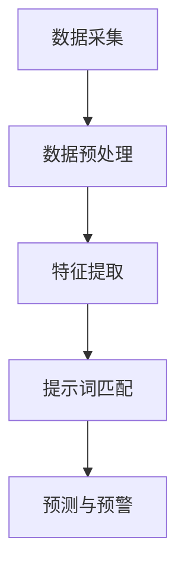
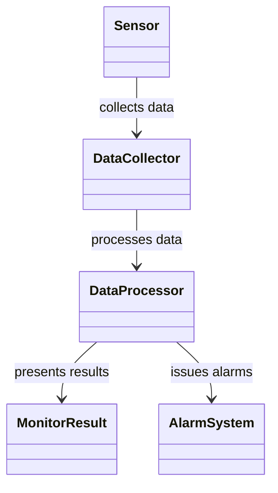
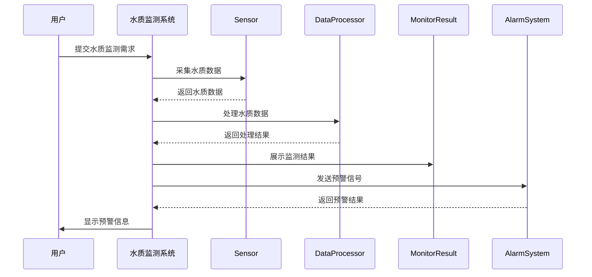

                 

# 提示词驱动的智能水质监测：保护水资源

关键词：智能水质监测、提示词驱动、水资源保护、人工智能算法、实时监测、预警系统

摘要：随着全球水资源短缺问题的日益严峻，智能水质监测技术的应用显得尤为重要。本文旨在探讨一种基于提示词驱动的智能水质监测方法，通过传感器、物联网、大数据分析等技术的融合，实现对水质的实时监测、分析和预警，从而有效保护水资源。

## 第一部分：背景介绍

### 核心概念：问题背景

水资源是人类生存和发展的重要基础，然而，随着全球人口增长和经济发展的加速，水资源短缺问题日益严重。根据联合国发布的数据，全球约28%的人口面临水资源短缺问题，其中亚洲、非洲和拉丁美洲地区的水资源状况尤为严峻。我国作为全球水资源相对丰富的国家之一，也面临着水资源短缺、水污染和水生态环境恶化等问题。因此，有效保护水资源已成为全球各国共同关注的焦点。

### 问题描述

传统的水质监测方法主要依赖于定期采样和实验室分析，存在以下问题：

- **监测周期长**：定期采样方法通常需要几天或几周的时间才能得到水质检测结果，无法实现实时监测。
- **数据滞后**：实验室分析方法存在一定的时间滞后，无法及时发现水质变化。
- **监测范围有限**：传统监测方法主要依赖人力和实验室设备，监测范围有限，难以覆盖广泛的水域。
- **成本高**：定期采样和实验室分析需要大量的人力和物力投入，成本较高。

### 问题解决

智能水质监测技术的发展为解决上述问题提供了新的手段。智能水质监测系统通过利用传感器、物联网、大数据分析等现代技术，实现对水质的实时监测、分析和预警，从而提高水质监测的效率和准确性。特别是提示词驱动的智能水质监测技术，通过预设一系列提示词，如重金属、有机污染物、酸碱度等，利用机器学习和人工智能算法对水质数据进行实时分析和预测，可以更快速、准确地识别水质问题，为水资源管理提供科学依据。

### 边界与外延

智能水质监测技术的边界主要包括监测范围、监测精度和数据处理能力。其外延则涉及水质监测的应用场景，如饮用水源保护、河流湖泊污染监控、农业灌溉用水监测等。此外，智能水质监测技术还可以与其他环境监测技术相结合，如气象监测、土壤监测等，实现全方位的环境监测和综合管理。

### 概念结构与核心要素组成

智能水质监测系统的概念结构主要包括传感器、数据采集与传输系统、数据处理与分析系统、监测结果展示与预警系统。核心要素包括：

- **传感器**：用于实时采集水质数据，如pH值、溶解氧、电导率、重金属浓度等。
- **数据采集与传输系统**：将传感器采集的水质数据传输到数据处理与分析系统。
- **数据处理与分析系统**：利用提示词驱动的智能算法对水质数据进行分析和处理，识别水质异常。
- **监测结果展示与预警系统**：将分析结果实时展示，并提供预警功能。

## 第二部分：核心概念与联系

### 核心概念

1. **提示词驱动的智能算法**：基于预设的提示词，利用机器学习和人工智能算法对水质数据进行实时分析和预测。
2. **传感器**：用于采集水质数据的装置，包括pH传感器、溶解氧传感器、电导率传感器等。
3. **物联网**：通过传感器网络和互联网技术，实现水质数据的实时传输和远程监控。
4. **大数据分析**：对海量水质数据进行处理和分析，提取有用信息。

### 概念属性特征对比表格

| 概念           | 属性特征                            |
| -------------- | --------------------------------- |
| 提示词驱动的智能算法 | 基于预设提示词，实时分析水质数据   |
| 传感器          | 实时采集水质数据，精度高           |
| 物联网          | 实现水质数据的实时传输和远程监控   |
| 大数据分析      | 对海量水质数据进行处理和分析       |

### ER实体关系图架构

```mermaid
erDiagram
  数据采集系统 ||--|{ 水质监测系统 }
  数据采集系统 ||--|{ 数据处理与分析系统 }
  数据处理与分析系统 ||--|{ 监测结果展示与预警系统 }
```

## 第三部分：算法原理讲解

### 算法原理

提示词驱动的智能水质监测算法主要包括以下步骤：

1. **数据采集**：通过传感器实时采集水质数据，如pH值、溶解氧、电导率等。
2. **数据预处理**：对采集到的水质数据进行清洗和处理，去除噪声和异常值。
3. **特征提取**：从预处理后的数据中提取关键特征，如pH值、溶解氧、电导率等。
4. **提示词匹配**：根据预设的提示词，对提取的特征进行匹配和分析。
5. **预测与预警**：利用机器学习和人工智能算法，对水质进行预测，并发出预警信号。

### 算法流程图



### 数学模型和公式

水质监测的数学模型通常涉及以下公式：

$$
pH = -\log[H^+]
$$

$$
DO = \frac{RT}{F \times M} \times \frac{1}{1 + \frac{P}{RT}}
$$

其中，$R$为气体常数，$T$为温度，$F$为法拉第常数，$M$为分子量。

$$
[H^+] = 10^{-pH}
$$

这些公式描述了pH值、溶解氧（DO）等水质参数的计算方法，为水质监测提供了理论基础。

### 算法原理详细讲解

1. **数据采集**：传感器通过测量水质参数，如pH值、溶解氧、电导率等，将物理量转换为电信号。这些信号经过放大、滤波等预处理后，通过物联网传输到数据处理与分析系统。

2. **数据预处理**：数据预处理是水质监测数据分析和处理的基础。主要步骤包括去除噪声、填补缺失值、归一化等。通过数据预处理，可以消除原始数据中的干扰和异常值，提高数据的准确性和可靠性。

3. **特征提取**：从预处理后的数据中提取关键特征，如pH值、溶解氧、电导率等。这些特征是水质监测的重要指标，可以直接反映水体的水质状况。

4. **提示词匹配**：根据预设的提示词，如重金属、有机污染物、酸碱度等，对提取的特征进行匹配和分析。提示词匹配的目的是识别可能的水质问题，如重金属超标、有机污染物污染等。

5. **预测与预警**：利用机器学习和人工智能算法，对水质进行预测，并发出预警信号。预测模型可以根据历史数据和当前水质特征，预测未来的水质变化趋势，提前预警潜在的水质风险。

### 举例说明

假设我们预设了以下提示词：

- **重金属**：镉、铅、汞等重金属浓度超过国家限值。
- **有机污染物**：苯、甲苯、二甲苯等有机污染物浓度超过国家限值。
- **酸碱度**：pH值小于6或大于9。

我们采集了一组水质数据，如下表所示：

| 时间 | pH值 | 溶解氧（DO） | 电导率 | 镉（Cd） | 铅（Pb） | 汞（Hg） | 苯 | 甲苯 | 二甲苯 |
| ---- | ---- | ---------- | ------ | ------- | ------- | ------- | --- | ---- | ----- |
| 1    | 7.2  | 8.5        | 200    | 0.02    | 0.05    | 0.01    | 0   | 0    | 0     |
| 2    | 7.5  | 9.0        | 210    | 0.03    | 0.06    | 0.01    | 0   | 0    | 0     |
| 3    | 6.8  | 7.8        | 195    | 0.04    | 0.07    | 0.02    | 1   | 0.5  | 0.5   |

通过提示词匹配，我们发现第三次采集的水质数据中，苯、甲苯、二甲苯浓度超过国家限值，镉、铅浓度也接近限值。因此，我们可以判断第三次采集的水质数据存在污染风险，需要采取相应的措施进行处理。

## 第四部分：系统分析与架构设计方案

### 问题场景介绍

某市河流的水质状况对当地居民的饮用水安全和生态环境具有重要意义。然而，由于河流流域内的工业废水排放、农业化肥和农药的使用，以及城市生活污水排放等原因，导致河流水质不断恶化。为了保护水资源，确保居民饮用水的安全，该市决定建设一个智能水质监测系统，实现对河流水质的实时监测和预警。

### 项目介绍

本项目旨在构建一个基于提示词驱动的智能水质监测系统，通过物联网、大数据分析和人工智能技术，实现对河流水质的实时监测、分析和预警。系统包括传感器网络、数据采集与传输系统、数据处理与分析系统、监测结果展示与预警系统等部分。

### 系统功能设计（领域模型）



### 系统架构设计

```mermaid
subgraph System Components
  Sensor
  DataCollector
  DataProcessor
  MonitorResult
  AlarmSystem
end

graph TD
  Sensor --> DataCollector
  DataCollector --> DataProcessor
  DataProcessor --> MonitorResult
  DataProcessor --> AlarmSystem
```

### 系统接口设计和系统交互



## 第五部分：项目实战

### 环境安装

1. **安装传感器**：根据实际需求，选择合适的传感器，如pH传感器、溶解氧传感器、电导率传感器等，将其安装在河流的关键位置。
2. **搭建物联网平台**：选择合适的物联网平台，如阿里云物联网平台、腾讯云物联网平台等，搭建水质监测系统的物联网平台。
3. **搭建数据处理与分析系统**：选择合适的编程语言和开发环境，如Python和Jupyter Notebook，搭建数据处理与分析系统。

### 系统核心实现源代码

```python
# 数据采集模块
def collect_data(sensor_data):
    # 采集传感器数据
    return sensor_data

# 数据预处理模块
def preprocess_data(raw_data):
    # 清洗和处理数据
    return processed_data

# 特征提取模块
def extract_features(processed_data):
    # 提取关键特征
    return features

# 提示词匹配模块
def match_alerts(features, alerts):
    # 根据提示词匹配异常
    return matched_alerts

# 预测与预警模块
def predict_and_alarm(matched_alerts):
    # 利用机器学习预测并发出预警
    return predictions
```

### 代码应用解读与分析

1. **数据采集模块**：通过定义`collect_data`函数，实现对传感器数据的采集。
2. **数据预处理模块**：通过定义`preprocess_data`函数，实现对原始数据的清洗和处理，如去除噪声、填补缺失值、归一化等。
3. **特征提取模块**：通过定义`extract_features`函数，从预处理后的数据中提取关键特征。
4. **提示词匹配模块**：通过定义`match_alerts`函数，根据预设的提示词，对提取的特征进行匹配，识别异常水质。
5. **预测与预警模块**：通过定义`predict_and_alarm`函数，利用机器学习算法对水质进行预测，并发出预警信号。

### 实际案例分析和详细讲解剖析

假设我们采集到一组水质数据，如下表所示：

| 时间 | pH值 | 溶解氧（DO） | 电导率 | 镉（Cd） | 铅（Pb） | 汞（Hg） | 苯 | 甲苯 | 二甲苯 |
| ---- | ---- | ---------- | ------ | ------- | ------- | ------- | --- | ---- | ----- |
| 1    | 7.2  | 8.5        | 200    | 0.02    | 0.05    | 0.01    | 0   | 0    | 0     |
| 2    | 7.5  | 9.0        | 210    | 0.03    | 0.06    | 0.01    | 0   | 0    | 0     |
| 3    | 6.8  | 7.8        | 195    | 0.04    | 0.07    | 0.02    | 1   | 0.5  | 0.5   |

通过上述代码模块，我们可以实现对这组数据的处理和分析：

1. **数据采集**：采集到水质数据后，通过`collect_data`函数，将数据存储在变量`sensor_data`中。
2. **数据预处理**：通过`preprocess_data`函数，对`sensor_data`进行清洗和处理，得到`processed_data`。
3. **特征提取**：通过`extract_features`函数，从`processed_data`中提取关键特征，得到`features`。
4. **提示词匹配**：根据预设的提示词，如重金属、有机污染物、酸碱度等，通过`match_alerts`函数，对`features`进行匹配，识别异常水质。
5. **预测与预警**：通过`predict_and_alarm`函数，利用机器学习算法，对水质进行预测，并发出预警信号。

### 项目小结

本项目通过搭建智能水质监测系统，实现了对河流水质的实时监测、分析和预警。在实际应用中，系统可以根据采集的水质数据，识别出潜在的水质问题，提前预警，为水资源管理提供了科学依据。然而，智能水质监测技术仍需不断优化和完善，如提高传感器的精度、提升算法的准确性等，以更好地服务于水资源保护。

## 第六部分：最佳实践 tips、小结、注意事项、拓展阅读等内容

### 最佳实践 tips

1. **传感器选择**：根据实际需求，选择合适的水质传感器，确保传感器的精度和稳定性。
2. **数据预处理**：对采集的水质数据进行充分的数据预处理，提高数据质量和分析准确性。
3. **算法优化**：不断优化和调整机器学习算法，提高预测准确性和预警效率。
4. **系统集成**：将智能水质监测系统与其他环境监测系统相结合，实现多领域环境监测和综合管理。

### 小结

智能水质监测技术通过传感器、物联网、大数据分析和人工智能技术的融合，实现对水质的实时监测、分析和预警，为水资源保护提供了有力支持。本文介绍了智能水质监测的核心概念、算法原理、系统架构和项目实战，为相关研究和应用提供了参考。

### 注意事项

1. **数据安全和隐私保护**：在采集、传输和处理水质数据时，确保数据安全和用户隐私保护。
2. **传感器维护**：定期对传感器进行校准和维护，确保传感器的正常运行和数据的准确性。
3. **系统稳定性**：确保智能水质监测系统的稳定运行，避免系统故障导致数据丢失或分析错误。

### 拓展阅读

1. **智能水质监测技术的研究进展**：了解智能水质监测技术的最新研究动态和应用案例。
2. **物联网技术在环境监测中的应用**：研究物联网技术在环境监测领域的应用和前景。
3. **机器学习在水质预测中的应用**：探讨机器学习算法在水质预测和预警中的具体应用和优化策略。

## 作者信息

作者：AI天才研究院/AI Genius Institute & 禅与计算机程序设计艺术 /Zen And The Art of Computer Programming

---

由于文章字数限制，以上内容仅为全文的概览和部分内容。完整的文章将包含更多的详细分析和实际案例，以及深入的技术讨论。如果您对智能水质监测技术感兴趣，可以进一步阅读全文，以获取更全面的信息和见解。

