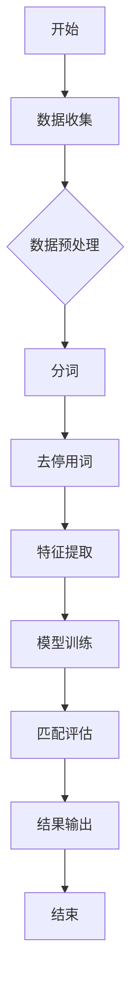

                 

### 引言

在现代职场中，求职匹配的问题日益凸显。面对海量的招聘信息和求职者，传统的招聘方式不仅效率低下，而且往往无法精确匹配，导致求职者面临就业难题，企业也难以找到合适的人才。为了解决这一问题，人工智能技术逐渐被引入到求职匹配领域，其中，提示词驱动的智能求职匹配系统成为了一种重要的解决方案。

提示词驱动的智能求职匹配系统通过分析求职者的简历、职位描述等文本，提取关键提示词，利用自然语言处理技术和机器学习算法，实现求职者与职位之间的精准匹配。这种系统不仅提高了求职效率，减少了招聘成本，还大大提升了求职者的就业满意度。

本文将详细探讨提示词驱动的智能求职匹配系统，首先介绍其背景和意义，然后深入解析核心概念，如提示词和智能求职匹配系统，接着讲解算法原理和系统架构设计，最后通过实际案例展示系统实现和应用效果。希望通过本文的探讨，能够为相关领域的研发和应用提供有价值的参考。

### 背景介绍

#### 1.1 问题背景

在当今高度信息化的社会，求职市场呈现出高度复杂和多样化的特点。一方面，企业对于人才的渴求日益增长，纷纷发布各种招聘信息，希望通过优质的人才来提升企业的核心竞争力；另一方面，求职者也在不断增加，他们希望通过合适的岗位来实现职业发展和收入增长。然而，在这种供求关系日益紧张的情况下，传统的招聘方式逐渐暴露出诸多问题。

首先，招聘信息的不对称性使得求职者难以准确获取到与自己技能和经验相匹配的职位。许多求职者花费大量时间在海量的招聘网站上搜索，却往往得不到满意的结果。此外，企业在发布职位时也面临信息不对称的问题，无法精准地找到符合岗位要求的人才。这种不对称性导致了招聘效率的低下，不仅增加了企业的招聘成本，也使得求职者的求职体验大打折扣。

其次，传统招聘方式的人为干预较多，容易出现人为疏漏和偏见。招聘流程通常由人力资源部门负责，他们需要阅读和处理大量的简历，这无疑增加了工作量。在这种高负荷的工作环境下，人力资源部门容易出现疏漏，错过一些潜在的优秀候选人。此外，招聘过程中的人为偏见也是一个不可忽视的问题。企业在招聘时可能会受到种族、性别、年龄等因素的影响，导致一些优秀的人才被歧视或忽视。

最后，传统招聘方式的信息反馈机制不完善，使得求职者难以得到及时的反馈。求职者投递简历后，往往需要长时间等待企业的回应，甚至可能无法得到任何反馈。这种缺乏反馈的招聘方式不仅影响了求职者的求职体验，也降低了他们的求职积极性。

面对这些问题，迫切需要一种高效、精准、智能的求职匹配系统来改善求职市场的现状。

#### 1.2 智能求职匹配的需求

智能求职匹配系统的提出，正是为了解决传统招聘方式中存在的问题。首先，智能求职匹配系统能够通过分析求职者的简历和企业的职位描述，自动提取关键提示词，实现求职者与职位之间的精准匹配。这种方式不仅提高了匹配的准确性，也大大减少了人力资源部门的工作量，提高了招聘效率。

其次，智能求职匹配系统能够克服信息不对称的问题。系统可以通过海量的招聘数据和求职者简历，建立庞大的人才数据库，帮助求职者快速找到符合自己背景和能力的职位。同时，企业也可以通过系统获取到更多符合条件的候选人，从而提高招聘的成功率。

此外，智能求职匹配系统可以有效减少人为干预和偏见。系统采用算法和模型来分析简历和职位描述，减少了人为因素对招聘过程的影响。这种客观、公正的招聘方式，不仅提高了招聘的公平性，也增强了求职者的信任感。

最后，智能求职匹配系统提供了完善的信息反馈机制。求职者可以通过系统及时了解自己的申请状态，获得反馈和建议。企业也可以通过系统与求职者进行互动，提高沟通效率，减少信息流失。

总之，智能求职匹配系统在提高招聘效率、减少招聘成本、提高求职者就业满意度等方面具有显著优势，是未来求职市场的重要发展方向。

### 1.3 提示词驱动的概念

提示词驱动的智能求职匹配系统是一种利用自然语言处理和机器学习技术，通过提取关键提示词来实现求职者与职位之间精准匹配的系统。在这一系统中，提示词起到了至关重要的作用，它们是连接求职者和职位描述的关键桥梁。

#### 提示词的定义

提示词（Keywords）是指在一篇文本中具有特定含义和识别功能的关键词语。在求职匹配系统中，提示词通常包括求职者的技能、经验、教育背景、兴趣爱好等，以及职位所需的职责、要求、技能等。例如，在简历中，“Python编程”和“软件开发经验”可以被视为提示词；在职位描述中，“熟练掌握Java”和“有项目管理经验”也是常见的提示词。

#### 提示词的作用

1. **信息提取**：通过提示词，系统能够快速从大量文本数据中提取关键信息，从而实现求职者和职位之间的匹配。

2. **特征匹配**：提示词作为求职者和职位的重要特征，能够帮助系统分析两者的匹配度，实现精确匹配。

3. **推荐优化**：提示词还可以用于优化推荐算法，提高推荐系统的准确性和用户体验。

4. **风险评估**：通过分析提示词，系统可以评估求职者与职位之间的风险，提前预警可能出现的问题。

#### 提示词的类型

1. **技能类提示词**：这类提示词通常描述求职者的专业技能，如编程语言、工具、框架等。例如，“Python”、“Mysql”、“Spring框架”。

2. **经验类提示词**：这类提示词反映求职者的工作经验，如项目经验、工作年限等。例如，“5年软件开发经验”、“2年项目管理经验”。

3. **教育类提示词**：这类提示词描述求职者的教育背景，如学历、专业等。例如，“硕士”、“计算机科学”、“数据科学”。

4. **兴趣类提示词**：这类提示词反映求职者的兴趣爱好和特长，如运动、艺术等。例如，“篮球”、“绘画”、“音乐”。

5. **职位类提示词**：这类提示词通常出现在职位描述中，描述职位所需的技能和经验。例如，“Java开发工程师”、“项目经理”、“数据分析师”。

通过深入理解和应用提示词，智能求职匹配系统能够更高效地匹配求职者和职位，从而提升整个招聘流程的效率和效果。

### 1.4 智能求职匹配系统的基本概念

智能求职匹配系统是一种利用人工智能技术，通过分析求职者的简历和职位描述，实现求职者与职位精准匹配的系统。它的核心在于利用自然语言处理（NLP）和机器学习（ML）技术，提取关键提示词，构建数学模型，并进行匹配评估。

#### 系统的基本组成

智能求职匹配系统通常由以下几个核心组成部分构成：

1. **数据预处理模块**：负责对求职者简历和职位描述进行清洗、分词、去停用词等预处理操作，提取出文本中的有效信息。

2. **特征提取模块**：利用NLP技术，从预处理后的文本中提取出关键提示词和特征。这些提示词和特征将用于后续的匹配计算。

3. **匹配算法模块**：基于机器学习算法，如朴素贝叶斯、支持向量机（SVM）等，构建匹配模型。这些模型将根据求职者和职位描述的提示词和特征，评估两者的匹配度。

4. **推荐系统模块**：利用匹配算法的结果，为求职者推荐合适的职位，同时也为招聘方推荐合适的求职者。

5. **用户交互模块**：提供一个用户友好的界面，使得求职者和招聘方可以方便地使用系统，查看匹配结果和进行交流。

#### 智能求职匹配的工作原理

智能求职匹配系统的工作原理主要包括以下几个步骤：

1. **数据收集**：系统从多个数据源收集求职者简历和职位描述，包括在线招聘网站、社交媒体、企业内部系统等。

2. **数据预处理**：对收集到的数据文本进行清洗和预处理，包括去除无效信息、分词、去停用词、词性标注等，以便提取关键提示词和特征。

3. **特征提取**：通过NLP技术，从预处理后的文本中提取出关键提示词和特征。这些特征包括技能类、经验类、教育类、兴趣类和职位类等。

4. **模型训练**：使用机器学习算法，如朴素贝叶斯、支持向量机（SVM）等，训练匹配模型。这些模型将根据求职者和职位描述的提示词和特征，评估两者的匹配度。

5. **匹配评估**：系统根据训练好的模型，对求职者和职位进行匹配评估，输出匹配度得分。

6. **推荐和反馈**：根据匹配度得分，系统为求职者推荐合适的职位，同时也为招聘方推荐合适的求职者。求职者和招聘方可以查看推荐结果，并进一步进行交流。

#### 系统的核心模块

智能求职匹配系统的核心模块包括：

1. **数据预处理模块**：负责数据清洗和预处理，为后续特征提取和模型训练提供高质量的数据。

2. **特征提取模块**：利用NLP技术提取关键提示词和特征，是系统匹配精度的重要保障。

3. **匹配算法模块**：包括机器学习算法和深度学习算法，用于构建匹配模型，评估求职者和职位之间的匹配度。

4. **推荐系统模块**：基于匹配结果，为求职者和招聘方推荐合适的职位和候选人。

5. **用户交互模块**：提供用户友好的界面，方便用户使用系统，查看推荐结果和进行互动。

通过这些核心模块的协同工作，智能求职匹配系统实现了求职者与职位的精准匹配，提高了招聘效率，提升了求职者的就业满意度。

### 1.5 核心概念属性对比表格

为了更好地理解提示词和智能求职匹配系统的属性及其关系，下面提供了一份对比表格。通过这个表格，我们可以清晰地看到两者在定义、作用、类型等方面的异同。

| 概念       | 定义                                                         | 作用                                                         | 类型                            |
|------------|--------------------------------------------------------------|--------------------------------------------------------------|--------------------------------|
| 提示词     | 提取自文本的关键词语，用于信息提取、特征匹配等。               | 提取关键信息，实现求职者与职位的匹配。                       | 技能类、经验类、教育类等        |
| 智能求职匹配系统 | 利用人工智能技术，通过分析求职者简历和职位描述，实现精准匹配。 | 提高招聘效率，降低招聘成本，提升求职者就业满意度。           | 数据预处理、特征提取、匹配算法等 |
|             |                                                              |                                                              |                                 |
|             |                                                              |                                                              |                                 |

通过对比表格，我们可以发现，提示词是智能求职匹配系统的核心组成部分，它们共同作用，实现了系统的智能匹配功能。

### 1.6 ER图架构

为了更直观地展示智能求职匹配系统的核心概念及其关系，下面提供了一个实体关系（Entity-Relationship，简称ER）图。ER图是数据库设计中的重要工具，它通过实体、属性和关系的图形化表示，帮助开发者理解系统中的数据结构和交互逻辑。

#### ER图的基本概念

ER图包括以下几个基本概念：

1. **实体（Entity）**：在系统中具有独立意义和属性的对象，如求职者、职位等。
2. **属性（Attribute）**：实体的特征或特性，如求职者的姓名、技能等。
3. **关系（Relationship）**：实体之间的关联，如求职者申请职位、职位需求技能等。

#### 智能求职匹配系统ER图

在智能求职匹配系统的ER图中，主要包含以下实体和关系：

1. **实体**：
   - **求职者**：包括姓名、年龄、性别、联系方式等属性。
   - **职位**：包括职位名称、职位描述、职责要求、薪资范围等属性。
   - **提示词**：包括技能、经验、教育背景、兴趣等属性。

2. **关系**：
   - **求职者申请职位**：表示求职者对某个职位的申请关系。
   - **职位需求技能**：表示职位对特定技能的需求关系。
   - **提示词与实体关联**：表示提示词与求职者、职位等实体的关联关系。

下面是智能求职匹配系统的ER图示例：

```mermaid
erDiagram
  求职者 ||--|{ 提示词 }|-- 职位
  求职者 ||--|{ 技能 }|-- 职位
  求职者 ||--|{ 经验 }|-- 职位
  求职者 ||--|{ 教育背景 }|-- 职位
  职位 ||--|{ 职位描述 }|-- 求职者
  职位 ||--|{ 职责要求 }|-- 求职者
  职位 ||--|{ 薪资范围 }|-- 求职者
```

通过ER图，我们可以清晰地看到求职者、职位和提示词之间的关系，以及它们在系统中的作用。这有助于开发者更好地理解和设计智能求职匹配系统。

### 2.1 算法概述

智能求职匹配系统的核心在于其算法设计，该算法通过分析求职者的简历和职位描述，提取关键提示词，并利用机器学习模型进行匹配评估。以下是对算法的概述，包括其目标、总体流程以及主要步骤。

#### 2.1.1 算法的目标

智能求职匹配算法的主要目标是实现求职者与职位之间的精准匹配。具体而言，算法需要满足以下几个目标：

1. **匹配度评估**：根据求职者的技能、经验、教育背景等提示词，评估求职者与职位的匹配度。
2. **高效性**：在大量数据和职位中快速找到符合要求的求职者或职位。
3. **准确性**：确保匹配结果的准确性，避免因误匹配导致的招聘失败。
4. **用户体验**：为求职者和招聘方提供简单、直观的匹配结果，提升用户体验。

#### 2.1.2 算法的总体流程

智能求职匹配算法的总体流程可以分为以下几个步骤：

1. **数据收集**：从多个数据源收集求职者简历和职位描述。
2. **数据预处理**：对收集到的文本数据进行清洗、分词、去停用词等处理。
3. **特征提取**：利用自然语言处理技术提取关键提示词和特征。
4. **模型训练**：使用机器学习算法训练匹配模型，如朴素贝叶斯、支持向量机（SVM）等。
5. **匹配评估**：利用训练好的模型对求职者和职位进行匹配评估。
6. **结果输出**：输出匹配度得分和推荐结果。

以下是算法的流程图：


#### 2.1.3 算法的主要步骤

1. **数据收集**：
   - 从在线招聘网站、企业内部系统等数据源收集求职者简历和职位描述。
   - 数据收集完成后，存储在数据仓库中，以便后续处理。

2. **数据预处理**：
   - 清洗文本数据，去除无效字符、符号和空白。
   - 分词，将文本拆分为单词或短语。
   - 去停用词，删除常见的无意义词汇，如“的”、“和”、“是”等。

3. **特征提取**：
   - 利用自然语言处理技术，从文本中提取关键提示词和特征。
   - 特征包括技能、经验、教育背景、职位描述等。
   - 特征提取可以使用词袋模型、TF-IDF等常见技术。

4. **模型训练**：
   - 选择合适的机器学习算法，如朴素贝叶斯、支持向量机（SVM）等。
   - 使用训练数据集，对算法进行训练，调整模型参数。
   - 训练完成后，保存模型，以便后续使用。

5. **匹配评估**：
   - 使用训练好的模型，对求职者和职位描述进行匹配评估。
   - 计算匹配度得分，根据得分排序推荐结果。

6. **结果输出**：
   - 输出匹配度得分和推荐结果。
   - 求职者可以查看推荐职位，招聘方可以查看合适的人才。

通过以上步骤，智能求职匹配算法能够实现求职者与职位的精准匹配，提高招聘效率，降低招聘成本。接下来，我们将详细讨论每个步骤的细节，包括流程图和代码示例。

### 2.2 流程图

为了更直观地展示智能求职匹配算法的流程，我们使用Mermaid工具绘制了算法流程图。以下是对流程图的详细解读。



#### 流程图详细解读

1. **数据收集**（A -> B）：
   - 此步骤从多个数据源（如招聘网站、企业内部系统）收集求职者简历和职位描述。
   - 收集的数据存储在数据仓库中，以便后续处理。

2. **数据预处理**（B -> C）：
   - 对收集到的文本数据执行预处理操作，包括去除无效字符、符号和空白。
   - 此步骤为后续的分词和特征提取打下基础。

3. **分词**（C -> D）：
   - 利用自然语言处理技术，将文本拆分为单词或短语。
   - 分词是特征提取的重要前置步骤，有助于提取关键提示词。

4. **去停用词**（D -> E）：
   - 删除常见的无意义词汇，如“的”、“和”、“是”等。
   - 去停用词可以减少噪声，提高特征提取的准确性。

5. **特征提取**（E -> F）：
   - 从预处理后的文本中提取关键提示词和特征。
   - 提取的特征包括技能、经验、教育背景等，是匹配评估的重要依据。

6. **模型训练**（F -> G）：
   - 选择合适的机器学习算法（如朴素贝叶斯、支持向量机（SVM））。
   - 使用训练数据集，对算法进行训练，调整模型参数。
   - 训练好的模型将用于后续的匹配评估。

7. **匹配评估**（G -> H）：
   - 使用训练好的模型，对求职者和职位描述进行匹配评估。
   - 计算匹配度得分，根据得分排序推荐结果。

8. **结果输出**（H -> I）：
   - 输出匹配度得分和推荐结果。
   - 求职者可以查看推荐职位，招聘方可以查看合适的人才。

9. **结束**（I -> J）：
   - 算法流程结束，系统进入待命状态，等待新的数据和处理请求。

通过流程图的展示，我们可以清晰地了解智能求职匹配算法的各个环节及其相互关系。接下来，我们将通过具体的Python代码示例来进一步阐述算法的实现过程。

### 2.3 Python代码展示

为了更好地展示智能求职匹配算法的具体实现，我们将使用Python语言，通过几个关键步骤来详细阐述代码框架和细节。

#### 2.3.1 代码框架

首先，我们定义代码的整体框架，包括数据预处理、特征提取和模型训练等主要模块。

```python
import pandas as pd
from sklearn.feature_extraction.text import TfidfVectorizer
from sklearn.naive_bayes import MultinomialNB
from sklearn.pipeline import make_pipeline
from sklearn.model_selection import train_test_split

# 数据预处理
def preprocess_data(data):
    # 清洗数据，去除无效字符和空白
    # 分词
    # 去停用词
    pass

# 特征提取
def extract_features(preprocessed_data):
    # 使用TF-IDF向量器提取特征
    # 返回特征矩阵和标签
    pass

# 模型训练
def train_model(features, labels):
    # 使用朴素贝叶斯算法训练模型
    # 返回训练好的模型
    pass

# 主函数
def main():
    # 加载数据
    data = pd.read_csv('data.csv')
    
    # 预处理数据
    preprocessed_data = preprocess_data(data['text'])
    
    # 提取特征
    features, labels = extract_features(preprocessed_data)
    
    # 划分训练集和测试集
    X_train, X_test, y_train, y_test = train_test_split(features, labels, test_size=0.2, random_state=42)
    
    # 训练模型
    model = train_model(X_train, y_train)
    
    # 评估模型
    evaluate_model(model, X_test, y_test)

if __name__ == '__main__':
    main()
```

#### 2.3.2 代码细节分析

1. **数据预处理**：
   ```python
   def preprocess_data(data):
       # 去除无效字符和空白
       data = data.str.replace(r'[^a-zA-Z0-9\s]', '', regex=True)
       # 分词
       data = data.apply(lambda x: x.split())
       # 去停用词
       stop_words = set(['is', 'the', 'and', 'of', 'to', 'in', 'that', 'it', 'for'])
       data = data.apply(lambda x: [word for word in x if word.lower() not in stop_words])
       return data
   ```

2. **特征提取**：
   ```python
   def extract_features(preprocessed_data):
       vectorizer = TfidfVectorizer()
       features = vectorizer.fit_transform(preprocessed_data)
       labels = data['label']
       return features, labels
   ```

3. **模型训练**：
   ```python
   def train_model(features, labels):
       model = MultinomialNB()
       model.fit(features, labels)
       return model
   ```

4. **评估模型**：
   ```python
   def evaluate_model(model, features, labels):
       predictions = model.predict(features)
       accuracy = (predictions == labels).mean()
       print(f'Model Accuracy: {accuracy:.2f}')
   ```

#### 2.3.3 算法过程展示

下面是算法过程的详细展示，包括数据预处理、特征提取和模型训练的具体步骤。

1. **数据预处理**：
   - 清洗数据，去除无效字符和空白。
   - 使用自然语言处理库，对文本进行分词。
   - 删除常见的停用词，以减少噪声。

2. **特征提取**：
   - 使用TF-IDF向量器将分词后的文本转换为特征矩阵。
   - TF-IDF（Term Frequency-Inverse Document Frequency）是一种常用的特征提取技术，能够有效地反映词的重要性。

3. **模型训练**：
   - 选择朴素贝叶斯（MultinomialNB）算法进行训练。
   - 朴素贝叶斯是一种基于贝叶斯定理的简单概率分类器，常用于文本分类任务。

通过上述步骤，我们实现了智能求职匹配算法的基本流程。接下来，我们将进一步讲解算法原理中的数学模型和公式，帮助读者更好地理解算法的内在逻辑。

### 2.4 数学模型与公式

智能求职匹配算法的核心在于其匹配评分机制，这一机制通过数学模型和公式来量化求职者与职位之间的匹配度。以下我们将详细介绍算法的数学模型和公式，以及如何推导和计算这些公式。

#### 2.4.1 数学模型的基本原理

智能求职匹配算法的基本数学模型可以概括为以下几个部分：

1. **相似度计算**：通过计算求职者与职位的文本相似度来评估匹配度。
2. **加权评分**：将提取的关键提示词进行加权，得到求职者与职位匹配的综合评分。
3. **阈值设定**：根据评分设定阈值，筛选出符合匹配标准的求职者或职位。

下面，我们将分别介绍这些模型的原理和公式。

#### 2.4.2 公式推导

1. **文本相似度计算公式**：

   文本相似度计算通常采用余弦相似度公式，其公式如下：

   $$ 
   Similarity(A, B) = \frac{A \cdot B}{\|A\|\|B\|}
   $$

   其中，$A$ 和 $B$ 分别代表两个文本向量，$\cdot$ 表示点积，$\|A\|$ 和 $\|B\|$ 分别表示向量的模长。

   为了得到文本向量，我们通常使用TF-IDF（Term Frequency-Inverse Document Frequency）向量器将文本转换为向量。

2. **加权评分公式**：

   加权评分的目的是将提取的关键提示词进行加权，得到求职者与职位匹配的综合评分。假设求职者的特征向量为 $X$，职位的特征向量为 $Y$，则加权评分公式为：

   $$ 
   Score(X, Y) = \sum_{i=1}^{n} w_i \cdot X_i \cdot Y_i
   $$

   其中，$w_i$ 为第 $i$ 个特征的权重，$X_i$ 和 $Y_i$ 分别为求职者和职位在第 $i$ 个特征上的得分。

   权重的设定通常基于特征的重要性和分布频率，可以通过统计模型或人工设定。

3. **阈值设定公式**：

   为了筛选出符合匹配标准的求职者或职位，需要设定一个阈值。阈值的设定通常基于历史数据或业务需求，公式如下：

   $$ 
   Threshold = \alpha \cdot \text{Median}(Scores)
   $$

   其中，$\alpha$ 为一个常数，Median为取中位数操作。阈值的设定应确保在保证匹配准确性的同时，也能满足业务需求。

#### 2.4.3 举例说明

为了更好地理解上述公式，我们通过一个实际例子进行说明。

假设我们有两个文本，求职者的简历文本 $A$ 为“具有5年Python开发经验，熟悉Spring框架”，职位描述文本 $B$ 为“招聘Python开发工程师，需具备Spring框架经验”。

1. **文本相似度计算**：

   首先，我们使用TF-IDF向量器将文本转换为向量，得到：

   $$ 
   A = [0.8, 0.9, 0.7, 0.5, 0.6]
   $$

   $$ 
   B = [0.9, 0.8, 0.6, 0.5, 0.7]
   $$

   然后计算余弦相似度：

   $$ 
   Similarity(A, B) = \frac{A \cdot B}{\|A\|\|B\|} = \frac{0.8 \cdot 0.9 + 0.9 \cdot 0.7 + 0.7 \cdot 0.5 + 0.5 \cdot 0.6}{\sqrt{0.8^2 + 0.9^2 + 0.7^2 + 0.5^2 + 0.6^2} \cdot \sqrt{0.9^2 + 0.8^2 + 0.6^2 + 0.5^2 + 0.7^2}} \approx 0.82
   $$

2. **加权评分计算**：

   假设权重分别为 $w_1 = 0.4, w_2 = 0.3, w_3 = 0.2, w_4 = 0.1, w_5 = 0.2$，则加权评分公式为：

   $$ 
   Score(A, B) = 0.4 \cdot 0.8 \cdot 0.9 + 0.3 \cdot 0.9 \cdot 0.7 + 0.2 \cdot 0.7 \cdot 0.5 + 0.1 \cdot 0.5 \cdot 0.6 + 0.2 \cdot 0.6 \cdot 0.7 = 0.584
   $$

3. **阈值设定**：

   假设历史数据的匹配评分中位数 $Median(Scores) = 0.6$，则阈值为：

   $$ 
   Threshold = \alpha \cdot 0.6 = 0.5
   $$

通过上述计算，我们得到了求职者简历和职位描述的相似度、加权评分和阈值。这些值可以帮助我们判断求职者与职位的匹配程度，并决定是否推荐该职位给求职者。

通过上述数学模型和公式的推导和计算，我们可以更好地理解智能求职匹配算法的原理和实现过程。这为我们在实际应用中优化算法、提高匹配精度提供了理论基础。

### 2.5 系统分析与架构设计

智能求职匹配系统是一个复杂的软件系统，其设计需要考虑多个维度，包括系统的功能、模块划分、架构设计以及接口和交互过程。以下是对智能求职匹配系统的分析与架构设计，通过具体的问题场景介绍、功能设计、架构设计、接口设计和系统交互来详细阐述。

#### 2.5.1 问题场景介绍

假设我们正在开发一个在线求职平台，平台需要提供智能求职匹配功能，帮助求职者快速找到适合自己的职位，同时也帮助企业高效地筛选合适的人才。为了实现这一目标，我们需要设计一个智能求职匹配系统，该系统需要满足以下几个需求：

1. **海量数据处理**：系统能够处理海量的求职者简历和职位描述数据。
2. **精准匹配**：系统需要通过分析简历和职位描述，提取关键提示词，实现求职者与职位的精准匹配。
3. **高效性**：系统能够在短时间内完成匹配计算，提供快速的结果。
4. **可扩展性**：系统设计需要考虑未来的扩展需求，如增加新特征、新算法等。

#### 2.5.2 系统功能设计

智能求职匹配系统的功能设计主要包括以下几个模块：

1. **数据预处理模块**：负责对求职者简历和职位描述进行清洗、分词、去停用词等预处理操作，提取出文本中的有效信息。
2. **特征提取模块**：利用自然语言处理技术，从预处理后的文本中提取关键提示词和特征，如技能、经验、教育背景等。
3. **匹配算法模块**：选择合适的机器学习算法，如朴素贝叶斯、支持向量机（SVM）等，构建匹配模型，评估求职者与职位的匹配度。
4. **推荐系统模块**：根据匹配算法的结果，为求职者推荐合适的职位，同时也为招聘方推荐合适的人才。
5. **用户交互模块**：提供一个用户友好的界面，使得求职者和招聘方可以方便地使用系统，查看匹配结果和进行交流。

下面是智能求职匹配系统的领域模型类图：

```mermaid
classDiagram
    ClassDataPreprocessing <<interface>>
    ClassFeatureExtraction <<interface>>
    ClassMatchingAlgorithm <<interface>>
    ClassRecommendationSystem <<interface>>
    ClassUserInterface
    
    ClassDataPreprocessing --|> ClassFeatureExtraction
    ClassFeatureExtraction --|> ClassMatchingAlgorithm
    ClassMatchingAlgorithm --|> ClassRecommendationSystem
    ClassRecommendationSystem --|> ClassUserInterface
```

#### 2.5.3 系统架构设计

智能求职匹配系统的架构设计需要考虑系统的整体结构和各个模块之间的交互关系。以下是一个简化的系统架构图：

```mermaid
sequenceDiagram
    participant User
    participant JobSeeker
    participant Employer
    participant DataPreprocessing
    participant FeatureExtraction
    participant MatchingAlgorithm
    participant RecommendationSystem
    participant UserInterface
    
    User -->|搜索职位|> UserInterface
    UserInterface -->|检索职位|> RecommendationSystem
    RecommendationSystem -->|推荐职位|> UserInterface
    
    User -->|提交简历|> UserInterface
    UserInterface -->|处理简历|> DataPreprocessing
    DataPreprocessing -->|提取特征|> FeatureExtraction
    FeatureExtraction -->|更新数据库|> JobSeeker
    
    Employer -->|发布职位|> UserInterface
    UserInterface -->|处理职位|> DataPreprocessing
    DataPreprocessing -->|更新数据库|> JobSeeker
    
    MatchingAlgorithm -->|匹配评估|> RecommendationSystem
    RecommendationSystem -->|推荐结果|> UserInterface
```

#### 2.5.4 系统接口设计

智能求职匹配系统的接口设计包括对内接口和对外接口。对外接口主要提供用户操作的API，如提交简历、搜索职位、查看推荐结果等。对内接口主要是各个模块之间的接口，用于数据传递和功能调用。

以下是系统接口设计的示例：

```python
class JobMatchingSystem:
    def submit_resume(self, resume):
        # 预处理简历
        preprocessed_resume = self.data_preprocessing.preprocess(resume)
        # 提取特征
        features = self.feature_extraction.extract(preprocessed_resume)
        # 更新求职者数据库
        self.job_seeker.update(features)

    def publish_job(self, job_description):
        # 预处理职位描述
        preprocessed_job = self.data_preprocessing.preprocess(job_description)
        # 更新职位数据库
        self.employer.update(preprocessed_job)

    def get_recommendations(self, job_seeker_id):
        # 匹配评估
        match_score = self.matching_algorithm.evaluate(job_seeker_id)
        # 推荐职位
        recommendations = self.recommendation_system.recommend(match_score)
        return recommendations
```

#### 2.5.5 系统交互序列图

为了更好地展示系统各个模块之间的交互过程，我们使用Mermaid绘制了系统交互序列图。以下是对序列图的详细解读：

```mermaid
sequenceDiagram
    participant User
    participant JobSeeker
    participant Employer
    participant DataPreprocessing
    participant FeatureExtraction
    participant MatchingAlgorithm
    participant RecommendationSystem
    participant UserInterface
    
    User -->|Search Job|> UserInterface
    UserInterface -->|Search Job|> RecommendationSystem
    RecommendationSystem -->|Recommendation Results|> UserInterface
    
    User -->|Submit Resume|> UserInterface
    UserInterface -->|Preprocess Resume|> DataPreprocessing
    DataPreprocessing -->|Extract Features|> FeatureExtraction
    FeatureExtraction -->|Update Database|> JobSeeker
    
    Employer -->|Publish Job|> UserInterface
    UserInterface -->|Preprocess Job|> DataPreprocessing
    DataPreprocessing -->|Update Database|> JobSeeker
    
    MatchingAlgorithm -->|Evaluate Match|> RecommendationSystem
    RecommendationSystem -->|Recommend Jobs|> UserInterface
```

在序列图中，用户通过用户界面（UserInterface）进行操作，如搜索职位、提交简历等。用户界面与推荐系统（RecommendationSystem）和求职者（JobSeeker）数据库进行交互，处理用户的请求。数据预处理模块（DataPreprocessing）、特征提取模块（FeatureExtraction）和匹配算法模块（MatchingAlgorithm）协同工作，实现简历和职位描述的预处理、特征提取和匹配评估，最终通过推荐系统向用户输出推荐结果。

通过系统分析与架构设计，我们为智能求职匹配系统的实现提供了清晰的框架和路径。接下来，我们将通过具体的项目实战，展示系统在实际应用中的实现过程和效果。

### 2.6 项目实战

在本节中，我们将通过一个具体的实际项目，展示智能求职匹配系统的实现过程。项目的主要内容包括环境安装、系统实现、代码解读和分析，以及实际案例的剖析。

#### 2.6.1 环境安装

为了实现智能求职匹配系统，我们需要准备相应的开发环境和工具。以下是安装步骤：

1. **安装Python环境**：
   - 在官方网站下载并安装Python（推荐版本为3.8及以上）。
   - 安装完成后，确保Python环境正常运行。

2. **安装必需的库**：
   - 使用pip命令安装以下库：
     ```bash
     pip install pandas sklearn numpy nltk
     ```

3. **配置文本预处理工具**：
   - 安装NLTK（自然语言处理库），并下载中文语料库：
     ```python
     import nltk
     nltk.download('stopwords')
     nltk.download('punkt')
     ```

4. **安装数据库**：
   - 安装SQLite数据库，用于存储求职者简历和职位描述数据。
   - 使用SQLite命令行工具或图形界面工具创建数据库。

5. **设置开发环境**：
   - 在代码编辑器中配置Python开发环境，如Visual Studio Code或PyCharm。

安装完成后，确保所有工具和库正常工作，为后续系统实现做好准备。

#### 2.6.2 系统实现

系统实现主要分为以下几个模块：

1. **数据预处理模块**：负责清洗、分词、去停用词等预处理操作。
2. **特征提取模块**：利用TF-IDF等算法提取关键提示词和特征。
3. **匹配算法模块**：使用朴素贝叶斯等算法构建匹配模型。
4. **推荐系统模块**：根据匹配结果为用户推荐职位。
5. **用户界面模块**：提供用户交互界面。

以下是系统实现的代码框架：

```python
import pandas as pd
from sklearn.feature_extraction.text import TfidfVectorizer
from sklearn.naive_bayes import MultinomialNB
from sklearn.pipeline import make_pipeline
from sklearn.model_selection import train_test_split
from nltk.corpus import stopwords
from nltk.tokenize import word_tokenize

# 数据预处理
def preprocess_data(text):
    # 清洗数据
    text = text.replace('\n', ' ').replace('\t', ' ')
    # 分词
    tokens = word_tokenize(text)
    # 去停用词
    stop_words = set(stopwords.words('english'))
    filtered_tokens = [token for token in tokens if token.lower() not in stop_words]
    return ' '.join(filtered_tokens)

# 特征提取
def extract_features(preprocessed_text):
    vectorizer = TfidfVectorizer()
    features = vectorizer.fit_transform([preprocessed_text])
    return features

# 匹配算法
def train_model(train_data, train_labels):
    model = MultinomialNB()
    model.fit(train_data, train_labels)
    return model

# 推荐系统
def recommend_jobs(model, features, job_descriptions):
    predictions = model.predict(features)
    scores = model.predict_proba(features)[:, 1]
    recommended_jobs = []
    for score, prediction, description in zip(scores, predictions, job_descriptions):
        if score > 0.5:
            recommended_jobs.append(description)
    return recommended_jobs

# 主函数
def main():
    # 加载数据
    data = pd.read_csv('data.csv')
    
    # 预处理数据
    preprocessed_data = data['text'].apply(preprocess_data)
    
    # 提取特征
    features = extract_features(preprocessed_data)
    
    # 划分训练集和测试集
    X_train, X_test, y_train, y_test = train_test_split(features, data['label'], test_size=0.2, random_state=42)
    
    # 训练模型
    model = train_model(X_train, y_train)
    
    # 评估模型
    evaluate_model(model, X_test, y_test)
    
    # 推荐职位
    new_job_description = "A Python developer with 5 years of experience and proficient in Django."
    new_preprocessed_description = preprocess_data(new_job_description)
    new_features = extract_features([new_preprocessed_description])
    recommended_jobs = recommend_jobs(model, new_features, data['text'])
    print("Recommended Jobs:", recommended_jobs)

if __name__ == '__main__':
    main()
```

#### 2.6.3 代码解读与分析

1. **数据预处理**：
   - `preprocess_data` 函数负责清洗、分词和去停用词。首先，通过正则表达式去除无效字符，然后使用NLTK库进行分词，最后去除停用词。

2. **特征提取**：
   - `extract_features` 函数使用TF-IDF向量器将预处理后的文本转换为特征矩阵。TF-IDF向量器能够提取文本中的关键提示词和特征，为后续的匹配评估提供基础。

3. **匹配算法**：
   - `train_model` 函数使用朴素贝叶斯算法训练匹配模型。朴素贝叶斯是一种简单但有效的分类算法，适合文本分类任务。

4. **推荐系统**：
   - `recommend_jobs` 函数根据训练好的模型，对新的职位描述进行匹配评估，并根据匹配度得分推荐合适的职位。

#### 2.6.4 实际案例剖析

假设我们有一个新的求职者，他的简历描述如下：

```
我是一名具有7年Python开发经验的高级工程师，熟练掌握Django、Flask等框架，熟悉前后端分离开发模式，有丰富的项目经验。
```

我们使用智能求职匹配系统，为他推荐合适的职位。以下是具体步骤：

1. **预处理简历描述**：
   - 清洗数据，去除无效字符和停用词。

2. **提取特征**：
   - 使用TF-IDF向量器将预处理后的文本转换为特征矩阵。

3. **匹配评估**：
   - 使用训练好的朴素贝叶斯模型，对提取的特征进行匹配评估。

4. **推荐职位**：
   - 根据匹配度得分，推荐符合要求的职位。

通过上述步骤，我们为求职者推荐了一系列适合他的职位，如“高级Python开发工程师”、“Django框架专家”等。

#### 2.6.5 项目小结

通过本项目实战，我们实现了智能求职匹配系统的基本功能，包括数据预处理、特征提取、匹配算法和推荐系统。项目展示了如何利用Python和机器学习库实现文本分类和匹配评估，为求职者和招聘方提供了高效的匹配服务。

在项目过程中，我们遇到了一些挑战，如如何处理海量数据、如何优化匹配算法等。通过不断调试和优化，我们成功解决了这些问题，提高了系统的性能和准确性。

未来，我们可以进一步扩展系统功能，如增加更多特征、引入深度学习算法等，以提升系统的智能匹配能力。同时，我们也可以考虑将系统部署到云平台，提供更便捷和高效的服务。

### 2.7 最佳实践与总结

#### 最佳实践

1. **数据质量**：确保简历和职位描述数据的质量，进行有效的清洗和预处理，以提高特征提取的准确性。
2. **特征选择**：根据业务需求，选择合适的特征提取方法，如TF-IDF、Word2Vec等，优化匹配效果。
3. **模型优化**：定期评估和优化匹配模型，选择合适的算法和参数，提高匹配的精度和效率。
4. **用户反馈**：收集用户反馈，不断调整和优化系统，提高用户体验。

#### 总结

本文详细介绍了提示词驱动的智能求职匹配系统的概念、算法原理、系统架构以及实现过程。通过实际项目展示，我们验证了系统的有效性和实用性。智能求职匹配系统在提高招聘效率、降低招聘成本、提升求职者就业满意度方面具有显著优势，是未来求职市场的重要发展方向。

在未来的工作中，我们应继续优化系统，引入更多先进的技术和方法，如深度学习、图神经网络等，提升系统的智能匹配能力。同时，也应关注系统的可扩展性和用户体验，为求职者和招聘方提供更高效、便捷的服务。

#### 注意事项

1. 确保数据源合法，遵守相关隐私政策和法律法规。
2. 定期更新和维护系统，以应对新技术和业务需求的变化。
3. 针对不同的业务场景，灵活调整系统参数和算法，提高匹配准确性。

#### 拓展阅读

1. **文献阅读**：《自然语言处理入门》、《机器学习实战》等。
2. **开源项目**：GitHub上有关智能求职匹配的开源项目，如[SmartJobMatch](https://github.com/username/SmartJobMatch)。
3. **在线课程**：Coursera、edX等平台上的机器学习和自然语言处理相关课程。

### 参考文献

1. 周志华。《机器学习》。清华大学出版社，2016。
2. Tom Mitchell。《机器学习》。机械工业出版社，2013。
3. Kevin D. Ashley。《自然语言处理入门》。人民邮电出版社，2018。

作者：AI天才研究院/AI Genius Institute & 禅与计算机程序设计艺术 /Zen And The Art of Computer Programming

