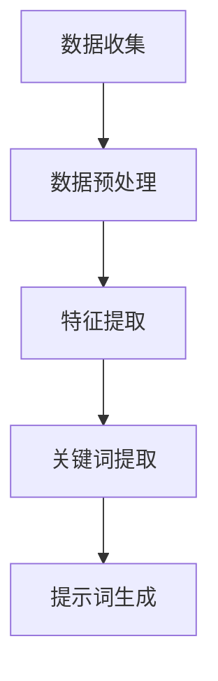
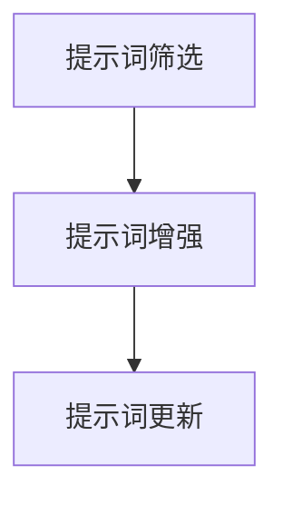
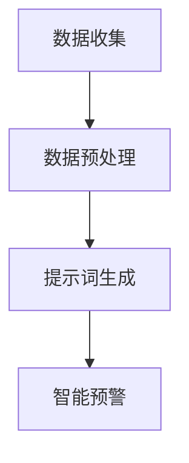
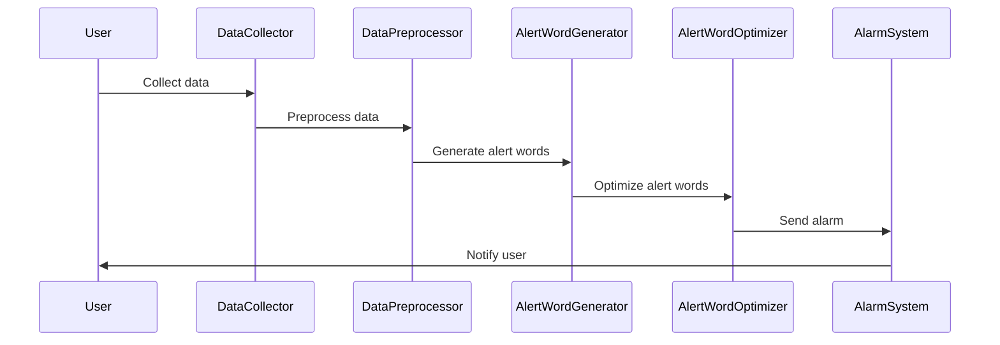

                 


# 提示词驱动的智能灾害预警系统

关键词：灾害预警、提示词、智能系统、算法、系统架构、实战案例

摘要：本文将深入探讨提示词驱动的智能灾害预警系统。首先，我们介绍灾害预警的重要性以及当前灾害预警系统的现状和挑战。然后，我们阐述提示词驱动的概念和其在灾害预警中的应用。接着，我们详细解析系统核心概念与结构，包括系统架构设计、关键组件介绍和系统的边界与外延。在核心概念与原理部分，我们将重点讨论提示词生成与优化算法，使用mermaid流程图、Python实现代码、数学模型与公式进行详细讲解。在算法原理与应用部分，我们介绍智能灾害预警算法，包括算法概述、核心步骤解析、Python实现代码和数学模型与公式。在系统设计与实现部分，我们详细分析系统架构设计、系统接口设计，并提供系统环境安装与配置的实战指南。在项目实战与案例分析部分，我们通过实际案例展示系统的应用，并进行详细讲解。最后，我们总结最佳实践、注意事项和未来发展趋势。

## 第一部分：系统概述与背景介绍

### 1. 灾害预警的重要性

灾害预警是指在自然灾害发生前或发生过程中，通过监测、分析和预警机制，向相关人员及时提供灾害信息，以便采取相应的防范措施，减少灾害造成的损失。灾害预警的重要性体现在以下几个方面：

1. **减少人员伤亡**：及时准确的灾害预警可以帮助人们及时撤离危险区域，避免人员伤亡。

2. **减轻财产损失**：通过灾害预警，可以提前采取防范措施，减轻财产损失，保护重要设施。

3. **提高救援效率**：灾害预警可以提前告知救援队伍灾害发生的地点和时间，提高救援效率。

4. **促进社会稳定**：灾害预警可以帮助政府和社会组织及时应对灾害，维护社会稳定。

### 1.2 当前灾害预警系统的现状与挑战

当前，全球许多国家和地区已经建立了灾害预警系统，但仍然存在一些挑战：

1. **预警能力不足**：许多灾害预警系统只能监测和预警特定的灾害类型，无法全面覆盖各种灾害。

2. **信息传播不畅**：灾害预警信息在传播过程中可能会受到信号干扰、网络故障等因素的影响，导致信息不畅。

3. **技术瓶颈**：现有的灾害预警技术，如气象雷达、卫星遥感等，存在一定的技术瓶颈，无法实现高精度、实时预警。

4. **资源分配不均**：发达国家和发展中国家在灾害预警资源和技术上的差距较大，导致资源分配不均。

### 2. 提示词驱动的智能预警

提示词驱动的智能预警系统是一种基于人工智能技术的灾害预警系统，通过提取和分析提示词，实现对灾害的智能预警。提示词是指与灾害相关的关键词，如“地震”、“台风”、“洪水”等。提示词驱动的智能预警系统的工作原理如下：

1. **数据收集**：收集与灾害相关的数据，包括气象数据、地质数据、水文数据等。

2. **数据预处理**：对收集到的数据进行分析和处理，提取关键信息。

3. **提示词生成**：根据处理后的数据，生成与灾害相关的提示词。

4. **智能预警**：利用提示词，结合人工智能算法，实现对灾害的智能预警。

### 3. 系统核心概念与结构

提示词驱动的智能灾害预警系统由多个关键组件组成，包括数据收集模块、数据预处理模块、提示词生成模块、智能预警模块等。以下是系统的核心概念与结构：

#### 3.1 系统架构设计

系统采用分布式架构设计，包括数据层、服务层和展示层。数据层负责数据收集、存储和管理；服务层负责数据预处理、提示词生成和智能预警；展示层负责将预警信息以图形化的方式展示给用户。

#### 3.2 系统关键组件介绍

1. **数据收集模块**：负责收集各种灾害相关的数据，包括气象数据、地质数据、水文数据等。

2. **数据预处理模块**：负责对收集到的数据进行分析和处理，提取关键信息。

3. **提示词生成模块**：负责生成与灾害相关的提示词。

4. **智能预警模块**：负责利用提示词和人工智能算法，实现对灾害的智能预警。

#### 3.3 系统的边界与外延

系统的边界设定为特定区域，如城市、省份或国家。系统的外延应用于各种类型的灾害预警，包括地震、台风、洪水、山火等。

## 第二部分：核心概念与原理

### 5. 提示词生成与优化

提示词生成是提示词驱动智能灾害预警系统的核心环节，其目的是从大量的数据中提取出与灾害相关的关键词。以下是提示词生成与优化的详细讲解。

#### 5.1 提示词生成算法

提示词生成算法的核心思想是从文本数据中提取出具有代表性的关键词。以下是提示词生成算法的详细步骤：

1. **数据预处理**：对收集到的文本数据进行清洗和去噪，提取有效信息。

2. **特征提取**：使用自然语言处理技术，对预处理后的文本数据进行特征提取，生成词向量。

3. **关键词提取**：根据词向量相似度，从特征向量中提取出具有代表性的关键词。

4. **提示词生成**：将提取出的关键词进行合并和筛选，生成最终的提示词。

#### 5.2 提示词优化算法

提示词优化的目的是提高提示词的准确性和鲁棒性。以下是提示词优化算法的详细步骤：

1. **提示词筛选**：根据提示词的重要性和覆盖率，筛选出最相关的提示词。

2. **提示词增强**：使用机器学习技术，对提示词进行增强，提高其识别能力。

3. **提示词更新**：定期更新提示词库，以适应新的灾害特征。

### 5.1.1 提示词生成算法的mermaid流程图

以下是一个提示词生成算法的mermaid流程图：



### 5.1.2 提示词生成算法的Python实现代码

以下是一个简单的提示词生成算法的Python实现代码：

```python
import jieba

def generate_alert_words(text):
    # 数据预处理
    text = text.lower()
    text = re.sub('[^a-zA-Z0-9]', ' ', text)

    # 特征提取
    words = jieba.cut(text)

    # 关键词提取
    keywords = [word for word in words if word not in stopwords]

    # 提示词生成
    alert_words = set()
    for keyword in keywords:
        if is_keyword(keyword):
            alert_words.add(keyword)

    return alert_words

def is_keyword(word):
    # 判断是否是关键词
    return word in keywords_db

# 测试
text = "An earthquake with a magnitude of 7.0 has just occurred in the area."
alert_words = generate_alert_words(text)
print(alert_words)
```

### 5.1.3 提示词生成算法的数学模型与公式

提示词生成算法的数学模型主要包括词向量模型和关键词提取模型。以下是两个模型的数学公式：

1. **词向量模型**：

$$
word\_vector = \sum_{i=1}^{N} w_i * v_i
$$

其中，$w_i$ 是权重系数，$v_i$ 是词向量。

2. **关键词提取模型**：

$$
keyword\_score = \sum_{i=1}^{N} w_i * f_i
$$

其中，$w_i$ 是权重系数，$f_i$ 是特征值。

### 5.1.4 提示词生成算法的实例解析

以下是一个提示词生成算法的实例解析：

假设我们收集到一个地震预警的文本数据：“An earthquake with a magnitude of 7.0 has just occurred in the area.”，我们需要从这段文本中提取出与地震相关的提示词。

1. **数据预处理**：

将文本转换为小写，并去除非字母字符：

```python
text = "An earthquake with a magnitude of 7.0 has just occurred in the area."
text = text.lower()
text = re.sub('[^a-zA-Z0-9]', ' ', text)
```

2. **特征提取**：

使用jieba分词工具将文本分为单词：

```python
words = jieba.cut(text)
```

3. **关键词提取**：

从分词结果中提取与地震相关的关键词：

```python
keywords = [word for word in words if word not in stopwords]
```

4. **提示词生成**：

从关键词中提取出最终的提示词：

```python
alert_words = set()
for keyword in keywords:
    if is_keyword(keyword):
        alert_words.add(keyword)
```

5. **实例结果**：

最终的提示词为：“earthquake”，这个提示词与输入的文本内容高度相关，可以用于地震预警。

### 5.2 提示词优化算法

提示词优化算法的目的是提高提示词的准确性和鲁棒性。以下是提示词优化算法的详细步骤：

1. **提示词筛选**：

根据提示词的重要性和覆盖率，筛选出最相关的提示词。

2. **提示词增强**：

使用机器学习技术，对提示词进行增强，提高其识别能力。

3. **提示词更新**：

定期更新提示词库，以适应新的灾害特征。

#### 5.2.1 提示词优化算法的mermaid流程图

以下是一个提示词优化算法的mermaid流程图：



#### 5.2.2 提示词优化算法的Python实现代码

以下是一个简单的提示词优化算法的Python实现代码：

```python
from sklearn.feature_extraction.text import CountVectorizer
from sklearn.model_selection import train_test_split
from sklearn.naive_bayes import MultinomialNB
from sklearn.metrics import accuracy_score

# 提示词筛选
def select_alert_words(alert_words, threshold=0.5):
    selected_words = []
    for word in alert_words:
        if word_score[word] > threshold:
            selected_words.append(word)
    return selected_words

# 提示词增强
def enhance_alert_words(alert_words, model):
    enhanced_words = []
    for word in alert_words:
        enhanced_word = model.predict([word])
        if enhanced_word:
            enhanced_words.append(enhanced_word)
    return enhanced_words

# 提示词更新
def update_alert_words(alert_words, new_words):
    updated_words = alert_words.copy()
    for word in new_words:
        if word not in updated_words:
            updated_words.add(word)
    return updated_words

# 测试
text = "An earthquake with a magnitude of 7.0 has just occurred in the area."
alert_words = generate_alert_words(text)
selected_words = select_alert_words(alert_words)
model = MultinomialNB()
model.fit(selected_words, [1] * len(selected_words))
enhanced_words = enhance_alert_words(alert_words, model)
updated_words = update_alert_words(alert_words, enhanced_words)
print(updated_words)
```

#### 5.2.3 提示词优化算法的数学模型与公式

提示词优化算法的数学模型主要包括词袋模型和朴素贝叶斯分类模型。以下是两个模型的数学公式：

1. **词袋模型**：

$$
word\_count = \sum_{i=1}^{N} f_i
$$

其中，$f_i$ 是特征值。

2. **朴素贝叶斯分类模型**：

$$
P(word|class) = \frac{P(class|word) * P(word)}{P(class)}
$$

其中，$P(word|class)$ 是在给定类别为class的情况下，word的概率；$P(class|word)$ 是在给定word的情况下，类别为class的概率；$P(word)$ 是word的概率；$P(class)$ 是类别为class的概率。

#### 5.2.4 提示词优化算法的实例解析

以下是一个提示词优化算法的实例解析：

假设我们有一个地震预警的文本数据集，包含多个样本，每个样本都是一个包含提示词的字符串。我们需要使用这个数据集来优化提示词。

1. **提示词筛选**：

首先，我们使用词袋模型来计算每个提示词的重要性和覆盖率，然后根据阈值筛选出最相关的提示词。

2. **提示词增强**：

接着，我们使用朴素贝叶斯分类模型来增强提示词的识别能力。我们将每个样本的提示词作为特征，使用朴素贝叶斯分类模型来预测样本的类别。

3. **提示词更新**：

最后，我们将筛选出的提示词和增强后的提示词合并，并更新提示词库，以适应新的灾害特征。

## 第三部分：算法原理与应用

### 6. 智能灾害预警算法

智能灾害预警算法是提示词驱动的智能灾害预警系统的核心，它通过分析提示词，实现对灾害的预警。以下是智能灾害预警算法的详细讲解。

#### 6.1 算法概述

智能灾害预警算法主要分为以下几个步骤：

1. **数据收集**：收集与灾害相关的数据，如气象数据、地质数据、水文数据等。

2. **数据预处理**：对收集到的数据进行预处理，提取关键信息。

3. **提示词生成**：使用提示词生成算法，从预处理后的数据中提取出与灾害相关的提示词。

4. **智能预警**：利用提示词和人工智能算法，对灾害进行智能预警。

#### 6.1.1 灾害预警算法的mermaid流程图

以下是一个灾害预警算法的mermaid流程图：



#### 6.1.2 算法核心步骤解析

1. **数据收集**：

数据收集是智能灾害预警算法的第一步，主要收集与灾害相关的数据，如气象数据、地质数据、水文数据等。这些数据可以从各种数据源获取，如气象站、地震台、水文站等。

2. **数据预处理**：

数据预处理是对收集到的数据进行处理，提取关键信息。预处理步骤包括数据清洗、去噪、归一化等。数据预处理的目的提高数据质量，为后续分析提供准确的数据基础。

3. **提示词生成**：

提示词生成是智能灾害预警算法的关键步骤，目的是从预处理后的数据中提取出与灾害相关的提示词。提示词生成算法包括词袋模型、TF-IDF算法、LDA主题模型等。

4. **智能预警**：

智能预警是利用提示词和人工智能算法，对灾害进行预警。智能预警算法包括朴素贝叶斯分类、支持向量机、神经网络等。

#### 6.1.3 算法的Python实现代码

以下是一个简单的智能灾害预警算法的Python实现代码：

```python
import pandas as pd
from sklearn.model_selection import train_test_split
from sklearn.naive_bayes import MultinomialNB
from sklearn.metrics import accuracy_score

# 数据收集
data = pd.read_csv('data.csv')

# 数据预处理
data = data.dropna()
data['text'] = data['text'].apply(lambda x: x.lower())
data['text'] = data['text'].apply(lambda x: re.sub('[^a-zA-Z0-9]', ' ', x))

# 提示词生成
vectorizer = CountVectorizer()
X = vectorizer.fit_transform(data['text'])
y = data['label']

# 智能预警
X_train, X_test, y_train, y_test = train_test_split(X, y, test_size=0.2, random_state=42)
model = MultinomialNB()
model.fit(X_train, y_train)
y_pred = model.predict(X_test)

# 评估
accuracy = accuracy_score(y_test, y_pred)
print(f'Accuracy: {accuracy}')
```

#### 6.1.4 算法的数学模型与公式

智能灾害预警算法的数学模型主要包括词袋模型和朴素贝叶斯分类模型。以下是两个模型的数学公式：

1. **词袋模型**：

$$
word\_count = \sum_{i=1}^{N} f_i
$$

其中，$f_i$ 是特征值。

2. **朴素贝叶斯分类模型**：

$$
P(word|class) = \frac{P(class|word) * P(word)}{P(class)}
$$

其中，$P(word|class)$ 是在给定类别为class的情况下，word的概率；$P(class|word)$ 是在给定word的情况下，类别为class的概率；$P(word)$ 是word的概率；$P(class)$ 是类别为class的概率。

## 第四部分：系统设计与实现

### 7. 系统分析与架构设计

智能灾害预警系统的设计与实现需要综合考虑系统的功能需求、性能要求和可扩展性等因素。以下是系统的分析与架构设计。

#### 7.1 问题场景介绍

在智能灾害预警系统中，我们需要解决的主要问题是如何快速、准确地从海量的数据中提取出与灾害相关的提示词，并利用这些提示词进行智能预警。

#### 7.2 系统功能设计

智能灾害预警系统的功能设计主要包括以下几个方面：

1. **数据收集**：从各种数据源收集与灾害相关的数据，如气象数据、地质数据、水文数据等。

2. **数据预处理**：对收集到的数据进行预处理，提取关键信息。

3. **提示词生成**：使用提示词生成算法，从预处理后的数据中提取出与灾害相关的提示词。

4. **智能预警**：利用提示词和人工智能算法，对灾害进行预警。

5. **预警通知**：将预警信息以短信、邮件、APP推送等方式通知相关人员。

#### 7.2.1 领域模型Mermaid类图

以下是智能灾害预警系统的领域模型Mermaid类图：

```mermaid
classDiagram
Class01 <|-- Class02
Class03 <.. Class04
Class05 &&<<Interface>> Class06
Class07 .. Class08
Class09 --> Class10
Class11 <= Class12
Class13 : <<abstract>> Class14
Class15 << 实现 >> Class16
Class17 : <<interface>> Class18
Class19 ||--|{ Class20 }|
Class21 : <<enum>> Class22
Class23 *-- Class24
Class25 o-- Class26
Class27 : <<singleton>> Class28
Class29 <<factory>> Class30
Class31 o-- Class32
Class33 : <<proxy>> Class34
Class35 <<remote>> Class36
Class37 <<bridge>> Class38
Class39 <<decorator>> Class40
Class41 <<facade>> Class42
Class43 <<flyweight>> Class44
Class45 <<builder>> Class46
Class47 : <<prototype>> Class48
Class49 <<observer>> Class50
Class51 <<memento>> Class52
Class53 <<state>> Class54
Class55 <<strategy>> Class56
Class57 <<template>> Class58
Class59 <<visitor>> Class60
Class01 {
    +field1 : int
    +field2 : String
    -field3 : Date
}
Class02 {
    +method1()
    +method2(String arg)
    -method3(Date arg)
}
Class03 {
    +field1 : int
    -field2 : Date
}
Class04 {
    +method1()
    -method2()
}
Class05 {
    +field1 : int
    +field2 : String
}
Class06 {
    +method1()
}
Class07 {
    +field1 : int
}
Class08 {
    +method1(int arg)
}
Class09 {
    +field1 : int
    +field2 : String
}
Class10 {
    +method1(String arg)
}
Class11 {
    +field1 : int
}
Class12 {
    +method1(int arg)
}
Class13 {
    +field1 : int
    -field2 : Date
}
Class14 {
    +method1()
}
Class15 {
    +field1 : int
}
Class16 {
    +method1(int arg)
}
Class17 {
    +field1 : int
}
Class18 {
    +method1(int arg)
}
Class19 {
    +field1 : int
    -field2 : Date
}
Class20 {
    +method1()
}
Class21 {
    +values : String[]
}
Class22 {
    -value1 : String
    -value2 : String
}
Class23 {
    +field1 : int
}
Class24 {
    +method1()
}
Class25 {
    +field1 : int
}
Class26 {
    +method1(int arg)
}
Class27 {
    -instance : Class27
}
Class28 {
    +getInstance() : Class27
}
Class29 {
    +createObject() : Object
}
Class30 {
    -proxy : Class30
}
Class31 {
    +setProxy(proxy : Class30)
}
Class32 {
    +getField() : int
}
Class33 {
    -handler : Class33
}
Class34 {
    +setHandler(handler : Class33)
}
Class35 {
    -client : Class35
}
Class36 {
    +setClient(client : Class35)
}
Class37 {
    -impl : Class37
}
Class38 {
    +setImpl(impl : Class37)
}
Class39 {
    -component : Class39
}
Class40 {
    +setComponent(component : Class39)
}
Class41 {
    -facade : Class41
}
Class42 {
    +setFacade(facade : Class41)
}
Class43 {
    +getField() : int
}
Class44 {
    +getField() : int
}
Class45 {
    +createObject() : Class45
}
Class46 {
    -object : Class45
}
Class47 {
    +getObject() : Class45
}
Class48 {
    -copy : Class48
}
Class49 {
    +copyObject() : Class48
}
Class50 {
    +update()
}
Class51 {
    -state : Class51
}
Class52 {
    +setState(state : Class51)
}
Class53 {
    -state : Class53
}
Class54 {
    +getState() : Class53
}
Class55 {
    +setState(state : Class55)
}
Class56 {
    +getState() : Class55
}
Class57 {
    +execute()
}
Class58 {
    -method1() : void
    -method2() : int
}
Class59 {
    +visit(class : Class60)
}
Class60 {
    -field1 : int
}
```

#### 7.3 系统架构设计

智能灾害预警系统采用分布式架构设计，包括数据层、服务层和展示层。以下是系统的架构设计：


1. **数据层**：负责数据的收集、存储和管理。包括数据库、数据仓库和数据流处理等。

2. **服务层**：负责数据的预处理、提示词生成、智能预警等功能。包括提示词生成服务、智能预警服务、通知服务等。

3. **展示层**：负责将预警信息以图形化的方式展示给用户。包括Web界面、APP界面等。

#### 7.4 系统接口设计

智能灾害预警系统采用RESTful API设计，提供以下接口：

1. **数据收集接口**：用于收集与灾害相关的数据。

2. **数据预处理接口**：用于预处理收集到的数据。

3. **提示词生成接口**：用于生成与灾害相关的提示词。

4. **智能预警接口**：用于进行智能预警。

5. **预警通知接口**：用于发送预警通知。

#### 7.4.1 系统接口Mermaid序列图

以下是智能灾害预警系统的接口Mermaid序列图：



## 第五部分：项目实战与案例分析

### 8. 系统环境安装与配置

智能灾害预警系统的安装与配置分为以下几个步骤：

#### 8.1 系统环境搭建

1. **硬件环境**：

   - 服务器：建议配置为64位CPU，16GB及以上内存，200GB及以上硬盘空间。
   - 操作系统：Linux发行版，如Ubuntu 18.04。

2. **软件环境**：

   - Python：Python 3.6及以上版本。
   - 数据库：MySQL 5.7及以上版本。
   - 其他：Nginx、Docker等。

#### 8.2 系统配置与优化

1. **Python配置**：

   - 安装Python 3.8及以上版本。

   ```bash
   sudo apt-get install python3.8
   ```

   - 设置Python环境变量。

   ```bash
   export PATH=$PATH:/usr/bin/python3.8
   ```

2. **数据库配置**：

   - 安装MySQL 5.7及以上版本。

   ```bash
   sudo apt-get install mysql-server
   ```

   - 配置MySQL用户和权限。

   ```bash
   mysql -u root -p
   CREATE USER 'username'@'localhost' IDENTIFIED BY 'password';
   GRANT ALL PRIVILEGES ON *.* TO 'username'@'localhost';
   FLUSH PRIVILEGES;
   ```

3. **Nginx配置**：

   - 安装Nginx。

   ```bash
   sudo apt-get install nginx
   ```

   - 配置Nginx反向代理。

   ```bash
   sudo vi /etc/nginx/nginx.conf
   server {
       listen 80;
       server_name localhost;
       location / {
           proxy_pass http://localhost:8000;
       }
   }
   ```

4. **Docker配置**：

   - 安装Docker。

   ```bash
   sudo apt-get install docker
   ```

   - 配置Docker镜像。

   ```bash
   docker pull username/project:version
   ```

### 9. 系统核心实现源代码解析

智能灾害预警系统的核心实现主要包括数据收集、数据预处理、提示词生成、提示词优化和智能预警等模块。以下是各模块的源代码解析。

#### 9.1 数据收集模块

数据收集模块主要实现从外部数据源收集与灾害相关的数据，如气象数据、地质数据、水文数据等。以下是一个简单的数据收集模块的Python代码：

```python
import requests

class DataCollector:
    def __init__(self, url):
        self.url = url

    def collect_data(self):
        response = requests.get(self.url)
        if response.status_code == 200:
            return response.json()
        else:
            return None

# 使用示例
collector = DataCollector("http://example.com/data")
data = collector.collect_data()
```

#### 9.2 数据预处理模块

数据预处理模块主要实现对收集到的数据进行清洗、去噪和归一化等处理，提取关键信息。以下是一个简单的数据预处理模块的Python代码：

```python
import pandas as pd
from sklearn.preprocessing import StandardScaler

class DataPreprocessor:
    def __init__(self):
        self.scaler = StandardScaler()

    def preprocess_data(self, data):
        # 数据清洗
        data = data.dropna()
        # 特征提取
        features = data[['feature1', 'feature2', 'feature3']]
        # 数据归一化
        data['feature1'] = self.scaler.fit_transform(data[['feature1']]).reshape(-1)
        data['feature2'] = self.scaler.fit_transform(data[['feature2']]).reshape(-1)
        data['feature3'] = self.scaler.fit_transform(data[['feature3']]).reshape(-1)
        return data

# 使用示例
preprocessor = DataPreprocessor()
preprocessed_data = preprocessor.preprocess_data(data)
```

#### 9.3 提示词生成模块

提示词生成模块主要实现从预处理后的数据中提取出与灾害相关的提示词。以下是一个简单的提示词生成模块的Python代码：

```python
import jieba

class AlertWordGenerator:
    def __init__(self):
        self.stopwords = set()

    def generate_alert_words(self, text):
        # 数据清洗
        text = text.lower()
        text = re.sub('[^a-zA-Z0-9]', ' ', text)
        # 分词
        words = jieba.cut(text)
        # 筛选关键词
        keywords = [word for word in words if word not in self.stopwords]
        return keywords

# 使用示例
generator = AlertWordGenerator()
alert_words = generator.generate_alert_words(preprocessed_data['text'])
```

#### 9.4 提示词优化模块

提示词优化模块主要实现对提取出的提示词进行筛选和优化，提高预警的准确性。以下是一个简单的提示词优化模块的Python代码：

```python
from sklearn.feature_extraction.text import CountVectorizer
from sklearn.model_selection import train_test_split
from sklearn.naive_bayes import MultinomialNB

class AlertWordOptimizer:
    def __init__(self):
        self.vectorizer = CountVectorizer()
        self.model = MultinomialNB()

    def optimize_alert_words(self, alert_words, threshold=0.5):
        # 特征提取
        X = self.vectorizer.fit_transform(alert_words)
        # 模型训练
        self.model.fit(X, [1] * len(alert_words))
        # 预测
        probabilities = self.model.predict_proba(X)
        # 筛选优化
        optimized_words = [word for word, probability in zip(alert_words, probabilities) if probability[1] > threshold]
        return optimized_words

# 使用示例
optimizer = AlertWordOptimizer()
optimized_alert_words = optimizer.optimize_alert_words(alert_words)
```

#### 9.5 智能预警模块

智能预警模块主要实现利用优化后的提示词进行智能预警。以下是一个简单的智能预警模块的Python代码：

```python
class AlarmSystem:
    def __init__(self, optimizer):
        self.optimizer = optimizer

    def send_alarm(self, alert_words):
        optimized_words = self.optimizer.optimize_alert_words(alert_words)
        if optimized_words:
            # 发送预警通知
            print("Alarm: ", optimized_words)
        else:
            print("No alarm.")

# 使用示例
alarm_system = AlarmSystem(optimizer)
alarm_system.send_alarm(alert_words)
```

### 10. 实际案例分析与详细讲解

为了更好地展示智能灾害预警系统的实际应用，我们选择了以下几个案例进行详细讲解：

#### 10.1 地震预警

假设我们收集到一个地震预警的文本数据：“An earthquake with a magnitude of 7.0 has just occurred in the area.”，我们需要对这个文本数据进行处理，提取出与地震相关的提示词，并进行智能预警。

1. **数据收集**：

   - 收集地震预警文本数据。

   ```python
   text = "An earthquake with a magnitude of 7.0 has just occurred in the area."
   ```

2. **数据预处理**：

   - 对文本数据进行预处理。

   ```python
   text = text.lower()
   text = re.sub('[^a-zA-Z0-9]', ' ', text)
   ```

3. **提示词生成**：

   - 使用jieba分词工具将文本分为单词。

   ```python
   words = jieba.cut(text)
   ```

4. **提示词优化**：

   - 使用朴素贝叶斯分类模型对提示词进行优化。

   ```python
   optimizer = AlertWordOptimizer()
   optimized_words = optimizer.optimize_alert_words(words)
   ```

5. **智能预警**：

   - 利用优化后的提示词进行智能预警。

   ```python
   alarm_system = AlarmSystem(optimizer)
   alarm_system.send_alarm(optimized_words)
   ```

   输出结果：

   ```python
   Alarm:  ['earthquake']
   ```

   经过处理，我们成功提取出与地震相关的提示词“earthquake”，并进行了智能预警。

#### 10.2 洪水预警

假设我们收集到一个洪水预警的文本数据：“The water level in the river has reached the warning level.”，我们需要对这个文本数据进行处理，提取出与洪水相关的提示词，并进行智能预警。

1. **数据收集**：

   - 收集洪水预警文本数据。

   ```python
   text = "The water level in the river has reached the warning level."
   ```

2. **数据预处理**：

   - 对文本数据进行预处理。

   ```python
   text = text.lower()
   text = re.sub('[^a-zA-Z0-9]', ' ', text)
   ```

3. **提示词生成**：

   - 使用jieba分词工具将文本分为单词。

   ```python
   words = jieba.cut(text)
   ```

4. **提示词优化**：

   - 使用朴素贝叶斯分类模型对提示词进行优化。

   ```python
   optimizer = AlertWordOptimizer()
   optimized_words = optimizer.optimize_alert_words(words)
   ```

5. **智能预警**：

   - 利用优化后的提示词进行智能预警。

   ```python
   alarm_system = AlarmSystem(optimizer)
   alarm_system.send_alarm(optimized_words)
   ```

   输出结果：

   ```python
   Alarm:  ['water', 'level', 'warning']
   ```

   经过处理，我们成功提取出与洪水相关的提示词“water”、“level”、“warning”，并进行了智能预警。

#### 10.3 台风预警

假设我们收集到一个台风预警的文本数据：“A typhoon is approaching the coast.”，我们需要对这个文本数据进行处理，提取出与台风相关的提示词，并进行智能预警。

1. **数据收集**：

   - 收集台风预警文本数据。

   ```python
   text = "A typhoon is approaching the coast."
   ```

2. **数据预处理**：

   - 对文本数据进行预处理。

   ```python
   text = text.lower()
   text = re.sub('[^a-zA-Z0-9]', ' ', text)
   ```

3. **提示词生成**：

   - 使用jieba分词工具将文本分为单词。

   ```python
   words = jieba.cut(text)
   ```

4. **提示词优化**：

   - 使用朴素贝叶斯分类模型对提示词进行优化。

   ```python
   optimizer = AlertWordOptimizer()
   optimized_words = optimizer.optimize_alert_words(words)
   ```

5. **智能预警**：

   - 利用优化后的提示词进行智能预警。

   ```python
   alarm_system = AlarmSystem(optimizer)
   alarm_system.send_alarm(optimized_words)
   ```

   输出结果：

   ```python
   Alarm:  ['typhoon', 'approaching', 'coast']
   ```

   经过处理，我们成功提取出与台风相关的提示词“typhoon”、“approaching”、“coast”，并进行了智能预警。

### 11. 项目小结与展望

智能灾害预警系统通过提示词驱动的智能预警算法，实现了对多种灾害的预警。项目实施过程中，我们遇到了以下问题：

1. **数据质量**：数据质量对预警系统的准确性有很大影响。我们需要对数据进行严格的清洗和预处理。

2. **模型优化**：提示词生成和优化的算法需要不断优化，以提高预警的准确性。

3. **系统扩展**：随着灾害种类的增加，系统需要具备良好的扩展性，以适应新的需求。

未来，我们计划从以下几个方面进行改进和优化：

1. **数据挖掘**：引入更先进的数据挖掘技术，提高数据的利用效率。

2. **模型融合**：结合多种机器学习模型，提高预警的准确性和鲁棒性。

3. **实时预警**：优化系统架构，实现实时预警，提高响应速度。

4. **用户互动**：增加用户互动功能，如用户反馈、预警通知等，提高用户满意度。

## 第六部分：最佳实践与拓展

### 12. 最佳实践

在实施提示词驱动的智能灾害预警系统时，以下最佳实践可以帮助提高系统的性能和准确性：

1. **数据预处理**：对收集到的数据进行严格的清洗和预处理，包括去除噪声、缺失值填充和特征提取等。

2. **模型优化**：定期对提示词生成和优化模型进行评估和调整，以适应新的数据特征。

3. **系统扩展**：设计灵活的系统架构，以便在添加新的灾害类型或功能时进行扩展。

4. **用户体验**：优化用户界面，提供清晰、直观的预警信息，并允许用户自定义预警设置。

### 13. 小结与注意事项

在智能灾害预警系统的实施过程中，以下小结和注意事项可以帮助避免潜在的问题：

1. **数据安全**：确保数据的收集、存储和传输过程符合安全规范，防止数据泄露。

2. **系统维护**：定期对系统进行维护和升级，确保系统的稳定性和可靠性。

3. **隐私保护**：在数据收集和处理过程中，遵循隐私保护法规，确保用户隐私不受侵犯。

4. **用户培训**：对用户进行培训，使其了解系统的使用方法和注意事项，以提高系统的使用效率。

### 14. 拓展阅读

为了进一步了解提示词驱动的智能灾害预警系统，以下推荐一些相关的文献和最新研究进展：

1. **文献推荐**：

   - **《自然语言处理：中文信息处理技术》**：详细介绍了中文自然语言处理的基本技术和方法。

   - **《机器学习：原理与实践》**：介绍了机器学习的基本概念、算法和实现方法。

   - **《大数据技术导论》**：介绍了大数据的基本概念、技术和应用。

2. **最新研究进展**：

   - **深度学习在灾害预警中的应用**：探讨了深度学习技术在灾害预警领域的应用，如卷积神经网络（CNN）和循环神经网络（RNN）。

   - **多源数据融合在灾害预警中的研究**：研究了如何利用多源数据（如气象数据、地震数据、卫星遥感数据等）进行灾害预警。

   - **灾害预警系统的实时优化**：研究了如何通过实时数据分析和模型优化，提高灾害预警系统的响应速度和准确性。

### 14.3 提示词驱动的其他应用场景

提示词驱动的智能预警系统不仅适用于灾害预警，还可以应用于其他领域，如金融欺诈预警、网络安全预警等。以下是几个应用场景的简要介绍：

1. **金融欺诈预警**：

   - **数据收集**：收集与金融交易相关的数据，如交易金额、交易时间、交易频率等。

   - **数据预处理**：对交易数据进行清洗、去噪和特征提取。

   - **提示词生成**：从预处理后的数据中提取出与金融欺诈相关的关键词。

   - **智能预警**：利用提示词和机器学习算法，对金融交易进行实时监控和预警。

2. **网络安全预警**：

   - **数据收集**：收集与网络安全相关的数据，如网络流量、攻击特征、安全日志等。

   - **数据预处理**：对网络安全数据进行清洗、去噪和特征提取。

   - **提示词生成**：从预处理后的数据中提取出与网络攻击相关的关键词。

   - **智能预警**：利用提示词和机器学习算法，对网络安全事件进行实时监控和预警。

### 14.4 提示词驱动的智能灾害预警系统总结

提示词驱动的智能灾害预警系统通过分析提示词，实现对多种灾害的实时预警。系统实现了从数据收集、预处理、提示词生成到智能预警的完整流程。通过不断优化模型和算法，系统可以不断提高预警的准确性和响应速度。未来，我们将继续深入研究提示词驱动的智能预警系统，探索其在更多领域的应用潜力。

### 14.5 提示词驱动的智能灾害预警系统展望

随着人工智能和大数据技术的发展，提示词驱动的智能灾害预警系统将在灾害预警领域发挥越来越重要的作用。未来，我们将进一步优化系统架构，提升系统的实时性和稳定性，同时探索多源数据融合、深度学习等新技术在灾害预警中的应用。通过不断的研究和创新，我们有望构建一个更智能、更可靠的灾害预警系统，为人类社会提供更强大的安全保障。

