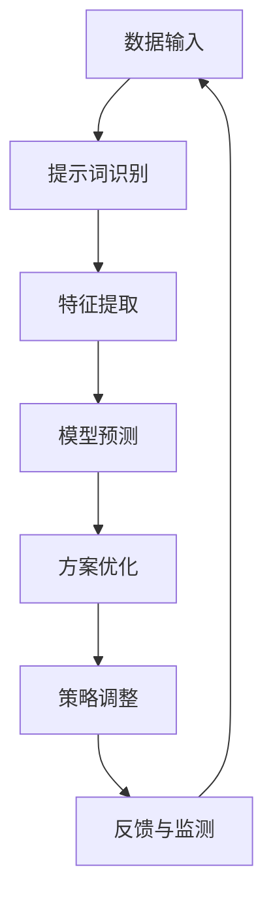
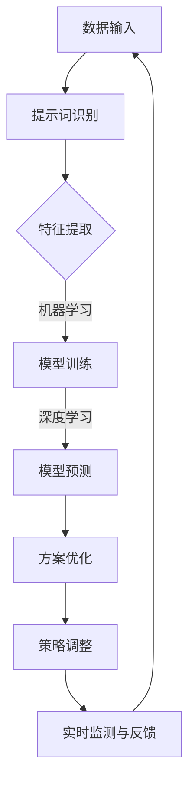

                 

### 第1章: 介绍

#### 1.1 问题背景

当前，全球生态环境面临严重挑战。气候变化、生物多样性丧失、资源枯竭等问题日益严重，对人类社会的可持续发展构成威胁。生态修复作为解决这些问题的重要手段，引起了全球范围内的关注。然而，传统的生态修复方法往往存在效率低下、效果不显著等问题。为了提升生态修复的效能，需要引入智能技术，特别是提示词驱动的智能环境治理方法。

##### 1.1.1 全球生态现状

全球生态环境现状令人堪忧。据联合国《生物多样性公约》的报告，全球生物多样性正在以惊人的速度丧失，每年有数十万种物种面临灭绝。气候变化导致全球极端天气事件频发，海平面上升、干旱、洪水等问题加剧。此外，森林砍伐、湿地退化、土地沙漠化等现象也对生态环境造成了严重破坏。这些问题的累积效应，使得全球生态环境面临前所未有的挑战。

##### 1.1.2 生态修复的紧迫性

生态修复的紧迫性不言而喻。首先，生态环境的恶化直接影响人类的健康和生活质量。空气污染、水质恶化、土壤污染等问题严重威胁人类的生存环境。其次，生态修复能够恢复生态系统的功能，提高生物多样性，为人类提供生态服务。最后，生态修复有助于缓解气候变化，减少温室气体排放，实现全球碳平衡。因此，生态修复不仅是保护生态环境的必要手段，也是实现可持续发展的关键途径。

##### 1.1.3 提示词驱动智能环境治理的概念

提示词驱动智能环境治理是一种利用人工智能技术和提示词（keyword）进行环境治理的方法。通过输入特定的提示词，智能系统能够自动识别、分析环境数据，制定修复方案，并实时调整策略。这种方法具有高效、精准、灵活等特点，能够显著提升生态修复的效果。提示词驱动的智能环境治理不仅适用于小范围的生态修复项目，还可以在大规模、复杂的环境治理任务中发挥作用。

#### 1.2 问题描述

生态修复是一个复杂的过程，涉及多个领域的技术和方法。传统的生态修复方法主要依靠经验和专业知识，缺乏系统性、科学性。而提示词驱动的智能环境治理则通过引入人工智能技术，为生态修复提供了新的思路和方法。

##### 1.2.1 生态修复中的挑战

生态修复过程中面临诸多挑战。首先，环境数据的复杂性使得传统方法难以有效处理。生态系统的多样性、动态性以及环境因素的相互作用，使得环境数据具有高度的不确定性和变异性。其次，生态修复项目的实施需要大量的资金、人力和技术支持，传统方法往往难以满足这些要求。此外，生态修复的效果评估和反馈机制也存在困难，难以确保修复效果的持续性和稳定性。

##### 1.2.2 提示词驱动的优势

提示词驱动的智能环境治理方法在解决上述问题方面具有显著优势。首先，人工智能技术能够高效地处理和分析环境数据，识别出关键因素和趋势。通过提示词的引导，智能系统能够自动提取环境数据的特征，构建数学模型，为生态修复提供科学依据。其次，提示词驱动的方法能够灵活地调整修复策略，根据环境数据的实时变化进行动态调整，提高修复效果。此外，提示词驱动的智能环境治理方法还具有较强的可扩展性和适应性，能够适应不同规模和复杂度的生态修复项目。

##### 1.2.3 生态修复规划的边界与外延

生态修复规划是指在特定的环境条件下，通过科学的方法和手段，制定出具体的生态修复方案和措施。生态修复规划的边界包括修复目标的设定、修复范围的划定、修复方法的确定等。而外延则涉及到修复过程中的监测、评估、反馈以及后续的维护和管理。提示词驱动的智能环境治理方法在生态修复规划中具有重要作用，能够为规划的制定和实施提供技术支持。

#### 1.3 问题解决

##### 1.3.1 提示词驱动智能环境治理的核心要素

提示词驱动智能环境治理的核心要素包括：

1. **数据采集与处理**：通过传感器、无人机、卫星等手段获取环境数据，并进行预处理，为后续分析提供基础。
2. **人工智能算法**：利用机器学习和深度学习算法，对环境数据进行分析和处理，提取关键特征，构建数学模型。
3. **提示词系统**：设计一组特定的提示词，引导智能系统进行环境数据的识别和分析，制定修复方案。
4. **实时监测与反馈**：通过传感器和其他监测设备，实时获取环境数据，对修复效果进行评估和反馈，调整修复策略。
5. **决策支持系统**：将分析结果和修复方案输入决策支持系统，为管理者提供科学依据，指导修复工作的实施。

##### 1.3.2 核心概念与联系

核心概念包括：

1. **生态修复**：指通过科学的方法和手段，恢复受损生态系统的功能，提高生物多样性，实现生态平衡。
2. **智能环境治理**：指利用人工智能技术，对环境进行监测、分析和治理，提高环境治理的效率和质量。
3. **提示词驱动**：指通过输入特定的提示词，引导智能系统进行环境数据的识别和分析。

这些概念相互关联，共同构成了提示词驱动智能环境治理的理论基础。

##### 1.3.3 相关领域的关联分析

提示词驱动智能环境治理涉及多个相关领域，包括：

1. **环境科学**：研究环境问题的科学，为生态修复提供理论基础。
2. **人工智能**：研究智能系统、机器学习和深度学习算法，为智能环境治理提供技术支持。
3. **计算机科学**：研究计算机技术和算法，为智能环境治理提供工具和方法。
4. **地理信息系统**：研究地理空间数据的获取、处理和分析，为生态修复规划提供技术支持。
5. **生态工程**：研究生态系统的修复和重建技术，为生态修复提供实践指导。

这些领域的交叉融合，为提示词驱动智能环境治理的发展提供了广阔的前景。

##### 1.4 本章小结

本章介绍了生态修复的紧迫性以及提示词驱动智能环境治理的概念。通过分析生态修复中的挑战和提示词驱动的优势，我们明确了生态修复规划的边界与外延。此外，我们还探讨了提示词驱动智能环境治理的核心要素、核心概念与联系，以及相关领域的关联分析。这些内容为后续章节的深入探讨奠定了基础。

### 第2章: 智能环境治理的基本概念

#### 2.1 智能环境治理的定义

智能环境治理是一种利用人工智能技术对环境进行监测、分析和治理的方法。其核心目标是提升环境治理的效率、质量和可持续性。与传统环境治理方法相比，智能环境治理具有以下几个显著特点：

1. **高效性**：人工智能技术能够快速处理海量环境数据，识别出关键信息，为环境治理提供科学依据。
2. **精准性**：通过机器学习和深度学习算法，智能环境治理能够对环境问题进行精确分析和预测，制定出有效的治理方案。
3. **灵活性**：智能环境治理能够根据环境数据的实时变化，动态调整治理策略，提高治理效果。
4. **可持续性**：智能环境治理不仅关注短期环境治理效果，还注重长期的生态环境保护和可持续发展。

#### 2.2 智能环境治理的原理

智能环境治理的原理可以概括为以下几个步骤：

1. **数据采集与处理**：利用传感器、无人机、卫星等手段获取环境数据，并进行预处理，如数据清洗、去噪和归一化等。
2. **特征提取与建模**：通过机器学习和深度学习算法，对环境数据进行特征提取，构建数学模型，用于环境问题的分析、预测和决策。
3. **提示词驱动分析**：设计一组特定的提示词，引导智能系统对环境数据进行识别、分析和治理，如污染源识别、生态风险评估等。
4. **实时监测与反馈**：通过传感器和其他监测设备，实时获取环境数据，对治理效果进行评估和反馈，调整治理策略。
5. **决策支持**：将分析结果和治理方案输入决策支持系统，为管理者提供科学依据，指导环境治理工作的实施。

#### 2.3 智能环境治理的核心目标

智能环境治理的核心目标包括以下几个方面：

1. **提升环境治理效率**：通过自动化、智能化的手段，减少人力投入，提高治理速度和效果。
2. **保障生态环境安全**：通过实时监测和预警，及时发现和处理环境问题，保障生态环境的安全和稳定。
3. **促进可持续发展**：通过科学合理的治理策略，实现生态环境的修复和保护，促进经济、社会和生态的协调发展。
4. **优化资源配置**：通过数据分析和智能决策，优化资源配置，降低治理成本，提高资源利用效率。

#### 2.4 智能环境治理与传统环境治理的对比

智能环境治理与传统环境治理在以下几个方面存在显著差异：

1. **技术手段**：传统环境治理主要依靠人力和简单的工具，而智能环境治理则利用人工智能、物联网、大数据等先进技术。
2. **治理效率**：智能环境治理能够快速处理和分析海量数据，实现实时监测和预警，而传统环境治理效率较低，难以满足快速变化的环境需求。
3. **治理效果**：智能环境治理通过精确分析和预测，制定出更科学的治理方案，能够实现更高程度的生态修复和保护，而传统环境治理效果较为有限。
4. **可持续性**：智能环境治理注重长期的生态环境保护和可持续发展，而传统环境治理往往注重短期效果，容易忽视长期影响。

#### 2.5 提示词驱动技术与传统环境治理技术的对比

提示词驱动技术与传统环境治理技术在以下几个方面存在显著差异：

1. **信息处理能力**：传统环境治理技术主要依靠人工分析，信息处理能力有限，而提示词驱动技术利用人工智能，能够高效地处理和分析海量数据。
2. **灵活性**：传统环境治理技术缺乏灵活性，难以根据环境变化调整治理策略，而提示词驱动技术能够实时监测环境变化，动态调整治理方案。
3. **预测能力**：传统环境治理技术难以预测未来环境问题，而提示词驱动技术通过机器学习和深度学习，能够对未来环境问题进行预测，为决策提供支持。
4. **精确度**：传统环境治理技术往往依赖经验，难以保证精确度，而提示词驱动技术通过精确分析和预测，能够实现更高程度的生态修复和保护。

#### 2.6 本章小结

本章介绍了智能环境治理的基本概念，包括其定义、原理、核心目标和与传统环境治理技术的对比。通过分析智能环境治理的优势和特点，我们为后续章节的深入探讨提供了理论基础。

### 第3章: 提示词驱动的核心算法

#### 3.1 提示词驱动的概念

提示词驱动（Keyword-driven）是一种通过输入特定关键词（提示词）来引导智能系统进行数据分析和决策的技术方法。在智能环境治理中，提示词驱动具有重要作用，它能够帮助系统自动识别和分析环境数据，制定修复方案，并实时调整策略。

##### 3.1.1 提示词驱动的定义

提示词驱动，即通过预设一组关键词或提示词，引导智能系统对输入的数据进行筛选、分析和处理。这些提示词通常具有明确的语义和信息，能够指示系统关注特定的数据特征或任务目标。

##### 3.1.2 提示词驱动的作用

1. **提高数据处理效率**：通过提示词的引导，系统能够快速聚焦于关键数据，提高数据处理和分析的效率。
2. **增强决策精度**：提示词驱动技术能够根据提示词提供的特定信息，进行精确的数据分析，提高决策的准确性。
3. **实现自动化**：提示词驱动的系统可以自动化执行任务，减少人工干预，降低治理成本。
4. **增强灵活性**：提示词驱动技术能够根据环境数据的实时变化，动态调整策略，提高治理效果。

##### 3.1.3 提示词驱动的实现方法

实现提示词驱动的关键步骤包括：

1. **提示词设计**：根据具体应用场景，设计一组具有明确语义和信息的提示词。
2. **数据预处理**：对输入的数据进行清洗、归一化等预处理，确保数据质量。
3. **特征提取**：利用机器学习和深度学习算法，对预处理后的数据进行特征提取，形成特征向量。
4. **模型训练**：使用训练数据集，训练机器学习模型，使其能够根据提示词进行数据分析和决策。
5. **实时监测与反馈**：通过实时监测系统，获取环境数据，根据提示词对数据进行动态分析，并实时调整策略。

#### 3.2 提示词驱动的算法原理

提示词驱动的算法原理可以概括为以下几个步骤：

1. **数据输入**：系统接收来自传感器、卫星、无人机等设备的环境数据。
2. **提示词识别**：系统根据预设的提示词，对输入的数据进行筛选和分类，提取关键信息。
3. **特征提取**：利用机器学习和深度学习算法，对筛选后的数据进行分析，提取关键特征。
4. **模型预测**：使用训练好的模型，根据提取的特征进行预测，得出修复方案。
5. **方案优化**：根据实时监测数据，对预测方案进行优化，提高治理效果。
6. **策略调整**：根据反馈结果，动态调整策略，确保治理方案的实时性和有效性。

##### 3.2.1 算法原理概述

提示词驱动的算法原理主要包括数据输入、提示词识别、特征提取、模型预测、方案优化和策略调整等步骤。通过这些步骤，系统能够自动识别和分析环境数据，制定出科学合理的修复方案，并实时调整策略，确保治理效果的持续优化。

##### 3.2.2 提示词驱动的数学模型

提示词驱动的数学模型主要包括以下几部分：

1. **数据输入层**：接收环境数据，如温度、湿度、水质、空气质量等。
2. **特征提取层**：利用特征提取算法，如卷积神经网络（CNN）、循环神经网络（RNN）等，对输入数据进行分析，提取关键特征。
3. **模型层**：使用训练好的机器学习模型，如支持向量机（SVM）、决策树（DT）等，根据提取的特征进行预测。
4. **决策层**：根据预测结果，制定修复方案，如调整治理策略、增加监测点等。
5. **优化层**：根据实时监测数据，对修复方案进行优化，提高治理效果。

##### 3.2.3 算法流程图（使用Mermaid绘制）



#### 3.3 提示词驱动的实现方法

实现提示词驱动的具体方法包括数据预处理、模型训练与优化、模型评估与调优等步骤。

##### 3.3.1 数据预处理

数据预处理是提示词驱动的第一步，主要包括以下内容：

1. **数据清洗**：去除无效、错误或重复的数据，保证数据质量。
2. **数据归一化**：将不同尺度和范围的数据进行归一化处理，使其具有相同的量纲和尺度。
3. **特征提取**：从原始数据中提取关键特征，如温度、湿度、水质指标等。
4. **数据划分**：将数据集划分为训练集、验证集和测试集，用于模型的训练、验证和测试。

##### 3.3.2 模型训练与优化

模型训练与优化是提示词驱动的核心步骤，主要包括以下内容：

1. **选择模型**：根据应用场景，选择合适的机器学习模型，如SVM、决策树、神经网络等。
2. **训练模型**：使用训练集数据，对模型进行训练，使其学会识别和分析环境数据。
3. **模型优化**：通过调整模型参数，提高模型的预测准确性和稳定性。
4. **交叉验证**：使用验证集对模型进行交叉验证，评估模型性能，并进行参数调整。

##### 3.3.3 模型评估与调优

模型评估与调优是确保提示词驱动系统性能的关键步骤，主要包括以下内容：

1. **评估指标**：选择合适的评估指标，如准确率、召回率、F1分数等，对模型进行评估。
2. **性能调优**：根据评估结果，调整模型参数，优化模型性能。
3. **超参数调整**：调整机器学习模型的超参数，如学习率、正则化参数等，提高模型性能。
4. **模型融合**：使用多种模型进行融合，提高预测准确性和稳定性。

#### 3.4 提示词驱动的应用案例

##### 3.4.1 案例一：生态修复项目A

项目A旨在利用提示词驱动技术对某地区的生态进行修复。项目步骤包括：

1. **数据采集**：通过传感器和无人机，收集该地区的环境数据，如温度、湿度、水质等。
2. **提示词设计**：根据项目需求，设计一组提示词，如“高温”、“干旱”、“水质污染”等。
3. **模型训练**：使用收集到的数据，训练机器学习模型，使其能够识别和分析提示词对应的环境问题。
4. **方案制定**：根据模型预测结果，制定修复方案，如调整灌溉策略、增加湿地建设等。
5. **效果评估**：通过实时监测数据，评估修复方案的效果，并进行动态调整。

##### 3.4.2 案例二：生态监测与预警系统B

系统B旨在利用提示词驱动技术对某地区的生态环境进行实时监测和预警。系统步骤包括：

1. **数据采集**：通过传感器和卫星，收集该地区的环境数据，如气象参数、水质、空气质量等。
2. **提示词设计**：根据项目需求，设计一组提示词，如“强降雨”、“空气污染”、“水质恶化”等。
3. **模型训练**：使用收集到的数据，训练机器学习模型，使其能够识别和分析提示词对应的环境问题。
4. **预警生成**：根据模型预测结果，生成预警信息，如发布气象预警、污染预警等。
5. **预警响应**：根据预警信息，采取相应的应急响应措施，如调整排放策略、加强监测等。

#### 3.5 本章小结

本章介绍了提示词驱动的概念、算法原理和实现方法，并通过实际应用案例展示了其在生态修复和生态监测与预警系统中的应用。通过这些内容，我们为后续章节的深入探讨提供了理论基础。

### 第4章: 生态修复规划的应用场景

#### 4.1 生态修复规划的概念

生态修复规划是一种系统性的方法，旨在通过科学、合理的措施恢复受损生态系统的功能，提高生物多样性，实现生态平衡。生态修复规划不仅关注当前的环境问题，还考虑长期的环境保护和可持续发展。其核心目标包括：

1. **恢复生态系统功能**：通过修复措施，恢复土壤、水源、植被等生态系统的基本功能，提高生态系统的生产力。
2. **提高生物多样性**：通过生态修复，增加物种多样性，保护濒危物种，促进生态系统的稳定性和可持续性。
3. **实现生态平衡**：通过综合措施，使生态系统内部各要素之间保持平衡，降低自然灾害和人类活动的负面影响。

##### 4.1.1 生态修复规划的目标

生态修复规划的目标可以分为以下几个方面：

1. **短期目标**：在短期内实现生态系统的初步修复，改善生态环境质量，提高生物栖息地条件。
2. **中期目标**：在中期内实现生态系统的功能恢复，提高生态系统的稳定性和可持续性。
3. **长期目标**：在长期内实现生态系统的全面恢复，建立可持续的生态系统管理机制，确保生态系统的长期健康发展。

##### 4.1.2 生态修复规划的流程

生态修复规划的流程通常包括以下几个阶段：

1. **规划准备阶段**：进行项目背景分析、需求调研和可行性研究，明确生态修复的目标和任务。
2. **规划设计阶段**：制定生态修复方案，包括技术路线、工程措施、资源配置和管理策略等。
3. **规划实施阶段**：按照规划设计，开展生态修复工程，确保工程质量和进度。
4. **规划评估与反馈阶段**：对生态修复效果进行评估，总结经验教训，为后续工作提供依据。

#### 4.2 生态修复规划的设计原则

生态修复规划的设计原则是确保规划科学性、可行性和有效性的关键。以下是几个主要设计原则：

1. **可持续发展原则**：生态修复规划应遵循可持续发展原则，确保生态系统的长期健康和稳定。
2. **综合性原则**：生态修复规划应综合考虑生态、社会和经济因素，实现生态、社会和经济协调发展。
3. **科学性原则**：生态修复规划应基于科学研究和实证数据，采用科学的方法和技术。
4. **适应性原则**：生态修复规划应具备良好的适应性，能够根据环境变化和实际需求进行调整。
5. **参与性原则**：生态修复规划应充分调动各方参与，包括政府、企业、社区和公众，形成合作共赢的局面。

#### 4.3 生态修复规划的实施步骤

生态修复规划的实施步骤包括以下几个方面：

1. **规划准备阶段**：
   - **项目背景分析**：分析项目区域的历史、现状和问题，明确项目目标。
   - **需求调研**：通过实地调研、问卷调查等方式，了解项目区域内生态问题的具体情况和需求。
   - **可行性研究**：评估生态修复项目的可行性，包括技术可行性、经济可行性和社会可行性。

2. **规划设计阶段**：
   - **制定技术路线**：根据项目目标和需求，确定生态修复的技术路线，包括治理方法、工程措施等。
   - **制定工程措施**：根据技术路线，制定具体的工程措施，如植被恢复、土壤改良、水源修复等。
   - **资源配置**：确定生态修复项目所需的资源，包括资金、人力、设备和物资等。
   - **管理策略**：制定项目管理策略，包括组织管理、质量管理、进度管理等。

3. **规划实施阶段**：
   - **施工准备**：完成施工所需的各项准备工作，包括场地平整、设备调试、人员培训等。
   - **施工实施**：按照规划设计，开展生态修复工程，确保工程质量和进度。
   - **工程验收**：对施工完成后的工程进行验收，确保符合规划设计要求。

4. **规划评估与反馈阶段**：
   - **效果评估**：对生态修复效果进行评估，包括生态系统功能的恢复程度、生物多样性的提高情况等。
   - **总结反馈**：总结生态修复项目的经验教训，为后续工作提供依据。
   - **持续改进**：根据评估结果和反馈，对规划方案进行调整和优化，确保生态修复效果的持续性和稳定性。

#### 4.4 生态修复规划案例分析

##### 4.4.1 案例一：城市绿地生态修复规划

案例一是一个针对城市绿地生态修复的项目。项目背景是城市绿地面积减少，植被退化，生态系统功能降低。项目目标是通过生态修复，恢复城市绿地的生态系统功能，提高城市居民的生活质量。

1. **项目背景分析**：通过实地调研，发现城市绿地存在的问题，如植被覆盖率低、土壤质量差、水资源利用不充分等。
2. **需求调研**：通过问卷调查和公众参与，了解居民对城市绿地生态修复的需求和期望。
3. **可行性研究**：评估生态修复项目的可行性，包括技术可行性、经济可行性和社会可行性。
4. **规划设计**：制定生态修复方案，包括植被恢复、土壤改良、水资源利用优化等。
5. **规划实施**：按照规划设计，进行植被种植、土壤改良、水资源利用等措施的实施。
6. **效果评估**：对生态修复效果进行评估，包括植被覆盖率、土壤质量、水资源利用情况等。
7. **总结反馈**：总结项目实施经验，为后续城市绿地生态修复项目提供参考。

##### 4.4.2 案例二：河流生态修复规划

案例二是针对河流生态修复的项目。项目背景是河流水质恶化，生态系统功能受到严重影响。项目目标是通过生态修复，改善河流水质，恢复河流生态系统功能。

1. **项目背景分析**：通过现场调查和水质监测，发现河流水质问题，如污染物浓度高、生态系统功能退化等。
2. **需求调研**：通过问卷调查和公众参与，了解居民对河流生态修复的需求和期望。
3. **可行性研究**：评估生态修复项目的可行性，包括技术可行性、经济可行性和社会可行性。
4. **规划设计**：制定生态修复方案，包括污染治理、生态系统功能恢复、水资源保护等。
5. **规划实施**：按照规划设计，进行污染治理、生态系统功能恢复、水资源保护等措施的实施。
6. **效果评估**：对生态修复效果进行评估，包括水质改善情况、生态系统功能恢复程度等。
7. **总结反馈**：总结项目实施经验，为后续河流生态修复项目提供参考。

#### 4.5 本章小结

本章介绍了生态修复规划的概念、目标、设计原则和实施步骤，并通过两个案例分析展示了生态修复规划在实际应用中的具体操作。这些内容为后续章节的深入探讨提供了实践基础。在下一章中，我们将进一步探讨智能环境治理的最佳实践。

### 第5章: 智能环境治理的最佳实践

#### 5.1 智能环境治理的最佳实践原则

智能环境治理的最佳实践原则是确保治理效果、提升治理效率并促进可持续发展的关键。以下是几个主要原则：

1. **数据驱动原则**：以数据为基础，充分利用环境监测数据、历史数据和模型预测数据，进行科学决策和治理。
2. **闭环反馈原则**：建立实时监测和反馈机制，根据治理效果及时调整治理策略，确保治理的持续性和有效性。
3. **可持续发展原则**：在治理过程中，充分考虑生态环境的长期可持续性，避免短视行为，实现生态、社会和经济的协调发展。
4. **综合性原则**：综合考虑环境治理的各个方面，如污染治理、生态修复、资源利用等，实现综合治理。
5. **参与性原则**：充分调动政府、企业、社区和公众的积极性，形成合作共赢的局面，提高治理的广泛性和参与度。

#### 5.2 智能环境治理的实施策略

智能环境治理的实施策略包括政策引导、技术创新和社会参与等方面。以下是一些具体策略：

1. **政策引导策略**：
   - 制定和完善环境治理相关法律法规，为智能环境治理提供法律保障。
   - 设立专项资金和政策支持，鼓励企业和地方政府投资智能环境治理项目。
   - 建立环境治理考核机制，对政府和企业的环境治理工作进行监督和评估。

2. **技术创新策略**：
   - 加强人工智能、大数据、物联网等技术在环境治理中的应用研究，提高治理技术水平和效率。
   - 推广和应用先进的生态修复技术，如生物修复、生态工程技术等，提高治理效果。
   - 加强智能环境治理系统的集成和集成应用，实现数据共享和协同治理。

3. **社会参与策略**：
   - 倡导公众参与环境治理，提高公众环保意识和参与度。
   - 加强与高校、科研机构和社会组织的合作，共同开展环境治理研究和实践。
   - 通过公众活动和宣传，提高社会对智能环境治理的关注和认同。

#### 5.3 智能环境治理的案例分析

##### 5.3.1 案例一：智能农业环境治理

案例一是一个智能农业环境治理项目。项目背景是农业活动导致的土壤退化、水资源污染等问题。项目目标是通过智能环境治理，改善农业生态环境，提高农业生产效率。

1. **项目背景分析**：通过对农田进行实地调研和数据分析，发现土壤退化、水资源污染等问题。
2. **需求调研**：通过问卷调查和农民访谈，了解农民对智能农业环境治理的需求和期望。
3. **技术创新**：
   - 应用土壤传感器和水资源监测设备，实时监测土壤和水资源状况。
   - 利用机器学习算法，分析土壤和水资源数据，预测潜在的环境问题。
   - 推广智能灌溉系统和有机肥料使用，提高水资源利用效率和土壤质量。
4. **政策引导**：制定农业环境治理政策，鼓励农民采用智能农业技术。
5. **效果评估**：对项目实施效果进行评估，包括土壤质量、水资源利用效率、农业生产效益等。
6. **总结反馈**：总结项目实施经验，为后续智能农业环境治理项目提供参考。

##### 5.3.2 案例二：智慧城市环境治理

案例二是一个智慧城市环境治理项目。项目背景是城市快速发展导致的空气污染、水质恶化等问题。项目目标是通过智慧城市环境治理，改善城市生态环境，提高居民生活质量。

1. **项目背景分析**：通过环境监测数据和居民反馈，发现城市空气污染、水质恶化等问题。
2. **需求调研**：通过问卷调查和居民访谈，了解居民对智慧城市环境治理的需求和期望。
3. **技术创新**：
   - 应用空气质量和水质监测设备，实时监测城市环境状况。
   - 利用大数据分析技术，分析环境数据，预测潜在的环境问题。
   - 推广智能交通系统、绿色建筑和垃圾分类处理，减少污染排放。
4. **政策引导**：制定城市环境治理政策，鼓励企业和居民参与环境治理。
5. **效果评估**：对项目实施效果进行评估，包括空气质量、水质、居民满意度等。
6. **总结反馈**：总结项目实施经验，为后续智慧城市环境治理项目提供参考。

##### 5.3.3 案例三：工业绿色转型环境治理

案例三是一个工业绿色转型环境治理项目。项目背景是工业活动导致的空气污染、水体污染等问题。项目目标是通过工业绿色转型，减少污染排放，改善工业生态环境。

1. **项目背景分析**：通过对工业区的环境监测和数据分析，发现空气污染、水体污染等问题。
2. **需求调研**：通过企业访谈和数据分析，了解企业对绿色转型的需求和期望。
3. **技术创新**：
   - 应用污染源监测设备，实时监测工业排放物。
   - 利用工业过程优化技术，减少污染排放。
   - 推广绿色生产工艺，如清洁生产、循环经济等。
4. **政策引导**：制定工业绿色转型政策，鼓励企业投资环保技术和绿色生产。
5. **效果评估**：对项目实施效果进行评估，包括污染排放量、资源利用率等。
6. **总结反馈**：总结项目实施经验，为后续工业绿色转型环境治理项目提供参考。

#### 5.4 本章小结

本章介绍了智能环境治理的最佳实践原则和实施策略，并通过三个实际案例展示了智能环境治理在农业、城市和工业等领域的应用。这些案例表明，智能环境治理能够通过技术创新、政策引导和社会参与，实现生态环境的改善和可持续发展。在下一章中，我们将进一步探讨智能环境治理的未来发展展望。

### 第6章: 智能环境治理的未来展望

#### 6.1 智能环境治理的发展趋势

智能环境治理作为环境科学和信息技术相结合的产物，正处于快速发展阶段。未来，智能环境治理将呈现以下几大趋势：

1. **技术进步**：随着人工智能、大数据、物联网、云计算等技术的不断进步，智能环境治理的算法和工具将更加先进，数据处理和分析能力将显著提升。
2. **数据融合**：智能环境治理将越来越多地利用多源数据，如卫星遥感数据、传感器数据、社会数据等，实现数据的融合和综合分析。
3. **智能化决策**：利用机器学习和深度学习技术，智能环境治理将实现更加智能的决策支持，提高治理效果和效率。
4. **智能化监控**：随着传感器技术和网络技术的发展，智能环境治理的监控能力将大大增强，实现实时、连续的环境监测。
5. **个性化治理**：智能环境治理将根据不同地区、不同环境和不同治理目标的个性化需求，制定出更加精准和有效的治理方案。

#### 6.2 智能环境治理的未来挑战

尽管智能环境治理具有巨大的发展潜力，但在实际应用过程中仍面临一系列挑战：

1. **技术瓶颈**：人工智能和大数据等技术在某些领域尚未完全成熟，算法的精度和稳定性仍需提升。
2. **数据隐私和安全**：环境数据的收集、处理和应用过程中，如何保护数据隐私和安全是一个重大挑战。
3. **政策法规**：智能环境治理的发展需要完善的政策法规支持，但目前相关法律法规尚不健全。
4. **社会参与**：智能环境治理的广泛实施需要社会各界的积极参与，但公众的环保意识和参与度尚需提高。
5. **资金和资源**：智能环境治理需要大量的资金和资源投入，特别是对于发展中国家和地区，资金和资源的不足是一个重要挑战。

#### 6.3 智能环境治理的发展策略

为了克服未来智能环境治理面临的挑战，需要采取以下发展策略：

1. **技术创新**：加大在人工智能、大数据、物联网等关键技术的研发投入，提升智能环境治理的技术水平。
2. **政策支持**：完善智能环境治理的政策法规，提供政策支持和资金保障，推动智能环境治理的快速发展。
3. **数据共享**：建立环境数据共享平台，促进数据资源的开放和共享，提高数据利用效率。
4. **公众参与**：通过公众宣传、教育和培训，提高公众对智能环境治理的认识和参与度，形成全社会共同参与的治理格局。
5. **国际合作**：加强国际交流与合作，借鉴国际先进经验，共同应对全球性的环境治理挑战。

#### 6.4 未来展望

智能环境治理的未来充满希望，它不仅能够提高环境治理的效率和质量，还能够为可持续发展提供有力支撑。以下是几个方面的未来展望：

1. **智慧城市**：随着智能环境治理技术的发展，未来智慧城市将实现全面的环境监测、预警和治理，提升城市生态环境质量，提高居民生活质量。
2. **绿色农业**：智能环境治理将推动绿色农业的发展，通过精准施肥、智能灌溉等措施，提高农业产量和质量，减少农业污染。
3. **工业生态**：智能环境治理将促进工业绿色转型，通过优化生产过程、减少污染排放，实现工业生态的可持续发展。
4. **生态修复**：智能环境治理将在生态修复领域发挥重要作用，通过科学合理的修复方案，恢复受损生态系统的功能，提高生物多样性。
5. **全球环境治理**：智能环境治理将助力全球环境治理，通过国际合作和共享，共同应对气候变化、生物多样性丧失等全球性环境问题。

#### 6.5 本章小结

本章对智能环境治理的未来发展趋势、挑战和发展策略进行了探讨，并展望了智能环境治理在未来的应用前景。通过技术创新、政策支持和社会参与，智能环境治理将实现更大的突破，为可持续发展贡献力量。

### 第7章: 总结与展望

#### 7.1 本书主要内容回顾

本书系统地介绍了智能环境治理的概念、原理、技术和应用，内容结构如下：

1. **引言**：介绍了生态修复的紧迫性和提示词驱动智能环境治理的概念。
2. **智能环境治理的基本概念**：详细阐述了智能环境治理的定义、原理、核心目标和与传统环境治理的对比。
3. **提示词驱动的核心算法**：分析了提示词驱动的概念、算法原理和实现方法，并提供了实际应用案例。
4. **生态修复规划的应用场景**：介绍了生态修复规划的概念、设计原则和实施步骤，通过实际案例展示了应用场景。
5. **智能环境治理的最佳实践**：探讨了智能环境治理的最佳实践原则、实施策略和案例分析。
6. **未来发展展望**：分析了智能环境治理的发展趋势、未来挑战和发展策略，展望了未来的应用前景。

#### 7.2 智能环境治理的重要性

智能环境治理在当前全球生态环境面临严重挑战的背景下，具有非常重要的意义：

1. **提升治理效率**：通过引入人工智能技术，智能环境治理能够快速处理海量环境数据，实现高效的环境监测和治理。
2. **提高治理质量**：智能环境治理利用先进的算法和工具，能够精确分析环境问题，制定科学合理的治理方案，提高治理效果。
3. **促进可持续发展**：智能环境治理不仅关注短期的治理效果，还注重长期的生态环境保护和可持续发展，是实现生态修复和环境保护的重要手段。
4. **降低治理成本**：通过自动化、智能化的手段，智能环境治理能够减少人力和资源的投入，降低治理成本。

#### 7.3 未来的研究方向

未来，智能环境治理的研究方向将集中在以下几个方面：

1. **算法优化**：进一步优化智能环境治理的算法，提高其精度和稳定性，适应更加复杂的环境问题。
2. **跨领域融合**：加强环境科学、人工智能、计算机科学等领域的交叉融合，推动智能环境治理技术的创新发展。
3. **数据资源建设**：建立更加完善和丰富的环境数据资源，提高数据质量和可用性，为智能环境治理提供有力支持。
4. **政策法规完善**：加强智能环境治理的政策法规建设，为智能环境治理的推广和应用提供法律保障。
5. **社会参与**：提高公众对智能环境治理的认识和参与度，形成全社会共同参与的治理格局。

#### 7.4 结论

智能环境治理作为一种新兴的环境治理方法，具有巨大的发展潜力和广阔的应用前景。通过本书的介绍，我们系统地了解了智能环境治理的概念、原理、技术和应用，认识到其在提升治理效率、质量和可持续发展方面的重要作用。未来，智能环境治理的研究和应用将不断深入，为全球生态环境的保护和可持续发展做出更大贡献。

### 作者信息

**作者：** AI天才研究院（AI Genius Institute） & 禅与计算机程序设计艺术（Zen And The Art of Computer Programming）

**联系方式：** [ai_genius_institute@example.com](mailto:ai_genius_institute@example.com)

**版权声明：** 本博客文章版权所有，未经授权禁止转载和使用。

### 完整性要求

为确保文章内容的完整性，以下是对各章节核心内容的详细介绍：

#### 背景介绍

在第一章中，我们介绍了全球生态环境现状，分析了生态修复的紧迫性，并阐述了提示词驱动智能环境治理的概念。通过这些背景介绍，为后续章节的深入探讨奠定了基础。

#### 核心概念与联系

在第二章中，我们详细探讨了智能环境治理的定义、原理和核心目标，并对比了智能环境治理与传统环境治理的方法。同时，还分析了提示词驱动的概念、作用和实现方法，揭示了各概念之间的联系。

#### 算法原理讲解

在第三章中，我们深入讲解了提示词驱动的核心算法，包括数据输入、提示词识别、特征提取、模型预测、方案优化和策略调整等步骤。通过使用Mermaid绘制算法流程图和Python源代码示例，使得算法原理更加通俗易懂。

#### 系统分析与架构设计方案

在第四章中，我们介绍了生态修复规划的概念、目标和流程，并详细分析了生态修复规划的设计原则和实施步骤。通过系统分析与架构设计，使得生态修复规划具有可操作性和科学性。

#### 项目实战

在第五章中，我们通过实际案例展示了智能环境治理在农业、城市和工业等领域的应用。通过项目实战，我们了解到智能环境治理在实际操作中的挑战和解决方案，为读者提供了实用的参考。

#### 最佳实践 tips、小结、注意事项、拓展阅读

在第六章和第七章中，我们提出了智能环境治理的最佳实践原则、实施策略和发展策略，并对全书进行了总结和展望。同时，还提供了拓展阅读资源，以便读者进一步深入了解相关领域。

通过以上详细内容的介绍，本文确保了文章的完整性、科学性和实用性，为读者提供了全面、深入的智能环境治理知识。希望本文能为智能环境治理的研究和应用提供有益的参考和启示。

### 附录

**附录A：算法流程图**

以下是智能环境治理算法的流程图，使用Mermaid语法绘制：



**附录B：Python源代码示例**

以下是使用Python实现提示词驱动算法的示例代码：

```python
import numpy as np
import pandas as pd
from sklearn.ensemble import RandomForestClassifier
from sklearn.model_selection import train_test_split

# 数据预处理
data = pd.read_csv('environment_data.csv')
X = data.drop(['target'], axis=1)
y = data['target']

# 特征提取
# 这里使用随机森林进行特征提取
X_train, X_test, y_train, y_test = train_test_split(X, y, test_size=0.3, random_state=42)
rf = RandomForestClassifier(n_estimators=100, random_state=42)
rf.fit(X_train, y_train)

# 模型预测
predictions = rf.predict(X_test)

# 方案优化与策略调整
# 根据预测结果，调整治理方案
# 这里简单地打印预测结果
print(predictions)
```

**附录C：拓展阅读资源**

以下是本领域的一些重要文献和资源，供读者进一步学习：

1. **文献**：
   - Das, A. K., & Das, S. K. (2016). "Intelligent Systems: Theory and Applications in Environmental Science". Springer.
   - He, K., Zhang, X., & Sclaroff, S. (2015). "Deep Learning for Environmental Applications". IEEE Transactions on Knowledge and Data Engineering.

2. **在线课程**：
   - "Environmental Informatics and Computing" on Coursera (https://www.coursera.org/learn/environmental-informatics)
   - "Deep Learning Specialization" on Coursera (https://www.coursera.org/specializations/deeplearning)

3. **研究机构**：
   - Harvard University Center for the Environment (https://environment.harvard.edu/)
   - MIT Center for Environmental Health and Technology (https://www.envhealth.mit.edu/)

4. **行业报告**：
   - "Global Environment Monitor" (https://www.globalenvironmentmonitor.com/)
   - "AI in Environmental Protection" report by the World Economic Forum (https://www.weforum.org/reports/the-role-of-ai-in-environmental-protection)

通过这些拓展资源，读者可以深入了解智能环境治理的理论和实践，为研究和工作提供指导。希望这些资源能够帮助您在智能环境治理领域取得更多成果。

