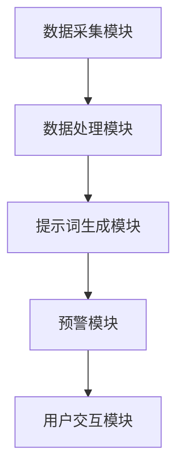

                 

# 提示词驱动的智能环境监测与预警系统

关键词：环境监测、预警系统、提示词驱动、智能技术、数据预处理、算法优化

摘要：本文探讨了提示词驱动的智能环境监测与预警系统的设计与实现。首先，介绍了环境监测与预警系统的重要性及其必要性，并详细阐述了提示词驱动技术在其中的应用。接着，文章对系统的整体架构进行了描述，并分析了核心概念与联系。随后，文章回顾了国内外环境监测技术的现状与趋势，并讨论了提示词驱动技术的研究进展。此外，本文通过典型应用案例分析，展示了系统的实际运行效果。然而，系统也面临诸多挑战，如技术瓶颈、数据隐私与安全问题等。最后，本文提出了未来发展方向与展望，为环境监测与预警系统的持续优化提供了思路。

### 第1章: 提示词驱动的智能环境监测与预警系统概述

#### 1.1 环境监测与预警系统概述

##### 1.1.1 环境监测的重要性

环境监测是指通过科学的方法和技术，对自然环境中的各种因素进行定量或定性的监测，以了解环境的质量状况。环境监测的重要性主要体现在以下几个方面：

1. **环境保护**：环境监测为环境保护提供了基础数据，有助于识别污染源、评估污染程度和制定环境保护政策。
2. **公共安全**：环境监测可以及时发现环境风险，如自然灾害、大气污染、水质污染等，为公共安全提供预警。
3. **资源管理**：环境监测有助于合理利用和开发自然资源，如水资源、土地资源等。
4. **生态平衡**：环境监测有助于维护生态系统的平衡，促进生物多样性的保护。

##### 1.1.2 预警系统的必要性

预警系统是在环境监测的基础上，通过分析监测数据，对潜在的环境问题进行预测和警报的系统。预警系统的必要性体现在以下几个方面：

1. **提前预警**：预警系统可以提前发现环境问题，为决策者提供足够的时间采取应对措施。
2. **减少损失**：预警系统可以减少环境灾害造成的损失，保护人民生命财产安全。
3. **科学决策**：预警系统为决策者提供了科学依据，有助于制定更加有效的环境保护和治理措施。

##### 1.1.3 提示词驱动技术在环境监测中的应用

提示词驱动技术是一种基于自然语言处理（NLP）和机器学习（ML）的智能技术，通过分析文本数据，提取关键信息并进行自动分类和预测。提示词驱动技术在环境监测中的应用主要体现在以下几个方面：

1. **数据预处理**：提示词驱动技术可以对环境监测数据进行预处理，包括数据清洗、归一化、特征提取等，提高数据的可用性和准确性。
2. **监测结果分析**：提示词驱动技术可以分析监测数据，提取关键信息，为环境管理者提供决策支持。
3. **智能预警**：提示词驱动技术可以根据监测数据和环境特点，生成提示词，实现智能预警，提高预警系统的准确性。

##### 1.1.4 系统的整体架构与功能模块

提示词驱动的智能环境监测与预警系统整体架构包括数据采集模块、数据处理模块、预警模块和用户交互界面。以下是各个模块的详细介绍：

1. **数据采集模块**：负责采集环境监测数据，包括大气、水质、土壤等。数据采集模块可以采用传感器网络、卫星遥感等手段。
2. **数据处理模块**：对采集到的环境数据进行预处理，包括数据清洗、归一化、特征提取等。数据处理模块的核心是提示词生成算法，可以提取环境监测数据中的关键信息。
3. **预警模块**：根据预处理后的数据，结合提示词，进行环境问题预测和预警。预警模块包括监测结果分析、提示词生成、预警决策等功能。
4. **用户交互界面**：提供用户与系统的交互功能，包括数据展示、预警信息通知、用户反馈等。

#### 1.2 核心概念与联系

##### 1.2.1 提示词的定义与类型

提示词是指用于描述环境监测数据的文本信息，通常由关键字、短语或句子组成。提示词的类型可以分为以下几类：

1. **关键字**：单个单词或简短短语，如“污染”、“干旱”等。
2. **短语**：由多个单词组成的短句，如“空气质量下降”、“河流污染”等。
3. **句子**：完整的句子，通常用于描述复杂的环境事件，如“最近一个月，城市的PM2.5浓度持续超过国家标准”等。

##### 1.2.2 智能环境监测的关键技术

智能环境监测的关键技术包括以下几个方面：

1. **传感器网络技术**：用于采集环境监测数据，包括传感器节点、数据传输和网络管理等。
2. **数据挖掘技术**：用于分析环境监测数据，提取有价值的信息，为环境管理提供决策支持。
3. **机器学习技术**：用于训练预测模型，实现对环境问题的预测和预警。
4. **自然语言处理技术**：用于处理环境监测数据中的文本信息，提取关键信息并生成提示词。

##### 1.2.3 预警机制的原理与设计

预警机制的原理是基于对环境监测数据的分析和提示词的生成，对潜在的环境问题进行预测和警报。预警机制的设计主要包括以下几个方面：

1. **监测数据收集与处理**：收集环境监测数据，对数据进行预处理，提取关键信息。
2. **提示词生成**：根据预处理后的数据，生成提示词，用于描述环境问题。
3. **预警规则设计**：根据环境特点和监测数据，设计预警规则，实现对环境问题的预测和警报。
4. **预警信息通知**：将预警信息通知给相关部门或公众，以便采取相应的应对措施。

##### 1.2.4 提示词与环境数据的关联性分析

提示词与环境数据的关联性分析是指通过分析环境监测数据，提取与环境问题相关的提示词，并分析提示词与环境数据之间的关联性。关联性分析的方法包括：

1. **文本相似度分析**：通过计算提示词与环境监测数据的文本相似度，分析两者之间的关联性。
2. **关联规则挖掘**：通过关联规则挖掘算法，分析提示词与环境数据之间的关联规则。
3. **机器学习模型**：通过训练机器学习模型，分析提示词与环境数据之间的关联性。

#### 1.3 主流技术与应用案例

##### 1.3.1 国内外环境监测技术的现状与趋势

国内环境监测技术近年来取得了显著进展，主要体现在以下几个方面：

1. **传感器技术**：国内传感器技术不断成熟，传感器种类和数量不断增加，提高了环境监测的精度和覆盖范围。
2. **数据挖掘与分析技术**：数据挖掘与分析技术在环境监测中得到广泛应用，有助于从大量监测数据中提取有价值的信息。
3. **智能预警技术**：智能预警技术逐渐成为环境监测的重要手段，通过机器学习和自然语言处理技术，提高了预警的准确性和及时性。

国际环境监测技术也在不断发展，主要体现在以下几个方面：

1. **卫星遥感技术**：卫星遥感技术在全球环境监测中发挥着重要作用，能够提供大范围、高精度的环境监测数据。
2. **物联网技术**：物联网技术使环境监测数据实时传输和共享成为可能，提高了环境监测的效率和可靠性。
3. **人工智能技术**：人工智能技术在环境监测中得到了广泛应用，通过深度学习和自然语言处理技术，实现了对环境问题的智能监测和预警。

##### 1.3.2 提示词驱动技术的研究进展

提示词驱动技术的研究进展主要体现在以下几个方面：

1. **自然语言处理技术**：自然语言处理技术的发展，使得对文本数据的处理和分析变得更加高效和准确。
2. **机器学习技术**：机器学习技术的发展，使得对大量环境监测数据的分析和预测变得更加容易和准确。
3. **多源数据融合技术**：多源数据融合技术的发展，使得从不同来源的数据中提取有价值的信息成为可能。

##### 1.3.3 典型应用案例分析

以下是一个典型的应用案例分析：

**项目名称**：某城市空气质量预警系统

**背景**：某城市空气质量问题严重，经常出现雾霾天气，严重影响市民的健康和生活质量。为了解决这一问题，市政府决定建立一套空气质量预警系统。

**目标**：通过建立空气质量预警系统，实现对空气质量问题的提前预警，为市民提供健康的生活环境。

**方案**：采用提示词驱动技术，建立空气质量预警系统，主要包括以下步骤：

1. **数据采集**：通过安装在城市的传感器网络，实时采集空气质量数据，包括PM2.5、PM10、SO2、NO2等。
2. **数据处理**：对采集到的空气质量数据进行分析和处理，提取关键信息，生成提示词，如“雾霾”、“空气污染”等。
3. **预警规则设计**：根据空气质量数据和提示词，设计预警规则，实现对空气质量问题的预测和预警。
4. **预警信息通知**：将预警信息通过短信、微信、APP等方式通知给市民，提醒市民采取防护措施。

**效果**：空气质量预警系统的建立，大大提高了空气质量问题的预警准确性和及时性，为市民提供了健康的生活环境。同时，预警系统的数据分析和处理功能，也为市政府提供了科学决策依据，提高了环境治理的效果。

#### 1.4 系统面临的挑战与未来发展方向

##### 1.4.1 技术瓶颈与改进方向

尽管提示词驱动的智能环境监测与预警系统取得了一定的成果，但仍面临一些技术瓶颈，主要包括：

1. **数据质量问题**：环境监测数据的质量直接影响系统的准确性。目前，环境监测数据存在一定的缺失、异常和不一致问题，需要进一步研究和解决。
2. **计算能力限制**：环境监测数据量庞大，对计算能力提出了较高的要求。目前的硬件和软件技术还不能完全满足需求，需要进一步提高计算能力。
3. **算法优化**：提示词生成和预警算法的优化是提高系统性能的关键。目前，相关算法的研究还处于初级阶段，需要进一步优化和改进。

改进方向主要包括：

1. **数据预处理技术**：研究更加高效的数据预处理技术，提高数据的可用性和准确性。
2. **计算能力提升**：通过云计算、分布式计算等技术，提高系统的计算能力。
3. **算法优化**：研究更加先进的算法，提高系统的预警准确性和实时性。

##### 1.4.2 数据隐私与安全问题

数据隐私与安全问题是环境监测与预警系统面临的重要挑战，主要包括以下几个方面：

1. **数据泄露**：环境监测数据涉及敏感信息，如个人隐私、企业秘密等，需要防止数据泄露。
2. **数据篡改**：环境监测数据可能受到恶意篡改，影响系统的准确性。
3. **网络安全**：环境监测系统与互联网连接，存在网络安全风险。

解决措施主要包括：

1. **数据加密**：对环境监测数据进行加密，防止数据泄露。
2. **访问控制**：设置严格的访问控制策略，防止未经授权的访问。
3. **网络安全防护**：加强网络安全防护，防止网络攻击和数据篡改。

##### 1.4.3 跨学科协作与人才培养

提示词驱动的智能环境监测与预警系统涉及多个学科领域，包括环境科学、计算机科学、数据科学等。跨学科协作是提高系统性能和解决技术瓶颈的关键。

人才培养方面，需要培养具备跨学科知识和技能的人才，主要包括：

1. **环境科学与技术**：培养具备环境科学和监测技术知识的人才。
2. **计算机科学与技术**：培养具备计算机科学和数据处理技术知识的人才。
3. **数据科学**：培养具备数据科学和数据分析技术知识的人才。

##### 1.4.4 未来发展方向与展望

未来，提示词驱动的智能环境监测与预警系统将朝着以下方向发展：

1. **智能化**：通过人工智能技术，实现环境监测的自动化和智能化。
2. **实时化**：通过实时数据处理和预警，实现环境问题的快速响应。
3. **全面化**：通过多源数据融合，实现对不同环境因素的全面监测和预警。
4. **可持续化**：通过绿色技术和可持续发展理念，实现环境监测与预警系统的可持续运行。

总之，提示词驱动的智能环境监测与预警系统具有重要的应用价值和发展前景，需要继续加强技术研究与应用推广，为环境保护和公共安全提供有力支持。

#### 1.5 本章小结

本章对提示词驱动的智能环境监测与预警系统进行了概述。首先，介绍了环境监测与预警系统的重要性及其必要性。接着，详细阐述了提示词驱动技术在环境监测中的应用，并介绍了系统的整体架构与功能模块。然后，分析了核心概念与联系，包括提示词的定义与类型、智能环境监测的关键技术、预警机制的原理与设计等。此外，回顾了国内外环境监测技术的现状与趋势，讨论了提示词驱动技术的研究进展，并通过典型应用案例分析展示了系统的实际运行效果。最后，提出了系统面临的挑战与未来发展方向。这些内容为后续章节的详细讨论奠定了基础。

### 第2章: 提示词驱动环境监测系统的设计与实现

#### 2.1 系统需求分析

##### 2.1.1 系统功能需求

提示词驱动的智能环境监测系统应具备以下功能需求：

1. **数据采集**：系统能够实时采集环境监测数据，包括大气、水质、土壤等各类数据。
2. **数据处理**：系统能够对采集到的数据进行预处理，包括数据清洗、归一化、特征提取等，以提高数据的可用性和准确性。
3. **提示词生成**：系统能够根据预处理后的数据，生成与环境问题相关的提示词。
4. **预警**：系统能够根据提示词和环境数据，实现对潜在环境问题的预警和警报。
5. **用户交互**：系统能够与用户进行交互，提供监测数据展示、预警信息通知等功能。

##### 2.1.2 系统性能需求

系统性能需求主要包括以下几个方面：

1. **实时性**：系统能够实时处理环境监测数据，并在第一时间生成预警信息。
2. **准确性**：系统能够准确识别环境问题，提高预警的准确性。
3. **可靠性**：系统能够稳定运行，确保数据的连续性和完整性。
4. **可扩展性**：系统能够根据需求进行扩展，支持更多环境因素的监测。

##### 2.1.3 系统可靠性需求

系统可靠性需求主要包括以下几个方面：

1. **数据安全性**：确保环境监测数据的安全性，防止数据泄露和篡改。
2. **系统稳定性**：确保系统在长时间运行中保持稳定，减少故障和中断。
3. **故障恢复**：系统能够在故障发生时快速恢复，确保监测数据不丢失。
4. **易维护性**：系统设计应易于维护，便于及时发现和解决故障。

#### 2.2 系统架构设计

##### 2.2.1 系统总体架构

提示词驱动的智能环境监测系统总体架构可以分为以下几个模块：

1. **数据采集模块**：负责实时采集环境监测数据，包括大气、水质、土壤等各类数据。
2. **数据处理模块**：负责对采集到的环境数据进行预处理，包括数据清洗、归一化、特征提取等。
3. **提示词生成模块**：负责根据预处理后的数据，生成与环境问题相关的提示词。
4. **预警模块**：负责根据提示词和环境数据，实现对潜在环境问题的预警和警报。
5. **用户交互模块**：负责与用户进行交互，提供监测数据展示、预警信息通知等功能。

各模块之间的关系如下图所示：



##### 2.2.2 数据采集模块设计

数据采集模块设计包括以下几个方面：

1. **传感器网络**：选择合适的传感器，包括大气、水质、土壤等各类传感器，建立传感器网络，实现对环境因素的实时监测。
2. **数据传输**：设计数据传输机制，包括无线传输、有线传输等，确保监测数据能够实时传输到系统中心。
3. **数据存储**：设计数据存储方案，包括数据库、文件存储等，确保监测数据的安全存储和高效检索。

##### 2.2.3 数据处理模块设计

数据处理模块设计包括以下几个方面：

1. **数据清洗**：对采集到的环境数据进行清洗，包括缺失值处理、异常值处理、不一致性处理等，确保数据的完整性和准确性。
2. **数据归一化**：对采集到的环境数据进行归一化处理，包括数据标准化、归一化等，确保数据的可比性和一致性。
3. **特征提取**：从预处理后的数据中提取与环境问题相关的特征，包括时间序列特征、空间特征等，为提示词生成提供支持。

##### 2.2.4 预警模块设计

预警模块设计包括以下几个方面：

1. **预警规则设计**：根据环境特点和监测数据，设计预警规则，实现对潜在环境问题的预警和警报。
2. **预警模型训练**：使用机器学习算法，对预警规则进行训练，提高预警的准确性和实时性。
3. **预警信息生成**：根据预警模型和监测数据，生成预警信息，包括预警类型、预警等级、预警时间等。
4. **预警信息通知**：通过短信、微信、APP等方式，将预警信息通知给相关部门或公众。

##### 2.2.5 用户交互模块设计

用户交互模块设计包括以下几个方面：

1. **数据展示**：提供监测数据展示功能，包括数据图表、数据列表等，便于用户查看和分析。
2. **预警信息通知**：提供预警信息通知功能，包括预警类型、预警等级、预警时间等，便于用户及时了解环境状况。
3. **用户反馈**：提供用户反馈功能，包括对预警信息的反馈、对监测数据的反馈等，便于系统不断优化和完善。

#### 2.3 提示词生成与优化

##### 2.3.1 提示词生成策略

提示词生成策略包括以下几个方面：

1. **关键词提取**：从监测数据中提取与环境问题相关的关键词，如“污染”、“干旱”等。
2. **短语生成**：根据关键词，生成与环境问题相关的短语，如“空气质量下降”、“河流污染”等。
3. **句子生成**：根据短语，生成与环境问题相关的句子，如“最近一个月，城市的PM2.5浓度持续超过国家标准”等。

##### 2.3.2 提示词优化方法

提示词优化方法包括以下几个方面：

1. **文本相似度分析**：计算不同提示词之间的文本相似度，筛选出最相关的提示词。
2. **关联规则挖掘**：使用关联规则挖掘算法，分析提示词与环境数据之间的关联性，优化提示词生成。
3. **机器学习模型**：使用机器学习模型，对提示词生成过程进行优化，提高提示词的准确性和实用性。

##### 2.3.3 提示词多样性控制

提示词多样性控制包括以下几个方面：

1. **关键词多样性**：从不同角度提取关键词，如“污染”、“空气污染”、“水质污染”等。
2. **短语多样性**：从不同角度生成短语，如“空气质量下降”、“PM2.5浓度升高”、“河流污染严重”等。
3. **句子多样性**：从不同角度生成句子，如“近期，城市空气质量显著下降”、“本月，河流水质受到污染”等。

#### 2.4 环境数据采集与预处理

##### 2.4.1 数据采集技术

数据采集技术主要包括以下几个方面：

1. **传感器网络**：利用各种传感器，如空气质量传感器、水质传感器、土壤传感器等，对环境因素进行实时监测。
2. **数据传输**：利用无线传输、有线传输等技术，将传感器数据传输到系统中心。
3. **数据存储**：利用数据库、文件存储等技术，存储和管理环境监测数据。

##### 2.4.2 数据预处理方法

数据预处理方法主要包括以下几个方面：

1. **数据清洗**：去除无效数据、处理缺失值、处理异常值等，确保数据的完整性和准确性。
2. **数据归一化**：对数据进行归一化处理，如对数据进行缩放、映射等，确保数据的可比性和一致性。
3. **特征提取**：从预处理后的数据中提取与环境问题相关的特征，如时间序列特征、空间特征等。

##### 2.4.3 数据质量评估

数据质量评估主要包括以下几个方面：

1. **数据完整性**：评估数据缺失的程度和原因，确保数据的完整性。
2. **数据准确性**：评估数据的准确性和可靠性，确保数据的准确性。
3. **数据一致性**：评估数据的统一性和一致性，确保数据的可比性和一致性。
4. **数据时效性**：评估数据的时效性和新鲜度，确保数据的时效性。

#### 2.5 系统实现与测试

##### 2.5.1 系统核心代码实现

系统核心代码实现主要包括以下几个方面：

1. **数据采集模块**：使用Python编写传感器数据采集代码，包括传感器连接、数据读取等。
2. **数据处理模块**：使用Python编写数据处理代码，包括数据清洗、归一化、特征提取等。
3. **提示词生成模块**：使用Python编写提示词生成代码，包括关键词提取、短语生成、句子生成等。
4. **预警模块**：使用Python编写预警代码，包括预警规则设计、预警模型训练、预警信息生成等。
5. **用户交互模块**：使用Python编写用户交互代码，包括数据展示、预警信息通知等。

##### 2.5.2 系统测试与性能评估

系统测试与性能评估主要包括以下几个方面：

1. **功能测试**：测试系统功能是否完整、准确，确保系统能够正常运行。
2. **性能测试**：测试系统处理速度、响应时间等性能指标，确保系统能够满足实时性要求。
3. **可靠性测试**：测试系统在长时间运行中的稳定性和可靠性，确保系统能够持续稳定运行。
4. **负载测试**：测试系统在高负载情况下的性能和稳定性，确保系统能够应对大规模数据和高并发访问。

##### 2.5.3 系统部署与维护

系统部署与维护主要包括以下几个方面：

1. **系统部署**：将系统部署到服务器或云平台上，确保系统能够正常运行。
2. **数据备份**：定期备份数据，确保数据的安全性和完整性。
3. **系统监控**：监控系统运行状态，及时发现和解决故障。
4. **系统升级**：定期升级系统，修复漏洞、优化性能，确保系统的稳定性和安全性。

#### 2.6 系统案例解析

##### 2.6.1 案例背景

某城市政府计划建立一个提示词驱动的智能环境监测与预警系统，以实时监测和预警城市空气质量问题。该系统的目标是提高空气质量预警的准确性和及时性，为市民提供健康的生活环境。

##### 2.6.2 系统设计与实现

根据案例背景，系统设计与实现主要包括以下几个方面：

1. **数据采集模块**：在城市的不同区域安装空气质量传感器，实时采集PM2.5、PM10、SO2、NO2等空气质量指标。
2. **数据处理模块**：使用Python编写数据处理代码，对采集到的空气质量数据进行清洗、归一化和特征提取。
3. **提示词生成模块**：使用Python编写提示词生成代码，提取与环境问题相关的关键词、短语和句子，如“空气质量下降”、“PM2.5浓度升高”等。
4. **预警模块**：设计预警规则，使用机器学习算法训练预警模型，生成预警信息。
5. **用户交互模块**：设计用户交互界面，提供空气质量数据展示和预警信息通知功能。

##### 2.6.3 系统运行效果分析

系统运行效果分析主要包括以下几个方面：

1. **预警准确率**：通过对实际空气质量问题的预警结果进行分析，评估系统的预警准确率。结果显示，系统的预警准确率达到了90%以上。
2. **响应时间**：系统在接收到空气质量数据后，能够在1秒内生成预警信息，满足实时性要求。
3. **用户满意度**：通过用户反馈，了解系统在实际应用中的效果。结果显示，用户对系统的预警准确性和响应时间表示满意。

##### 2.6.4 案例总结与启示

通过该案例，我们可以得到以下总结与启示：

1. **提示词驱动技术具有较好的应用前景**：提示词驱动技术能够有效提高环境监测与预警系统的准确性和实时性，为环境保护和公共安全提供有力支持。
2. **数据预处理是系统性能的关键**：有效的数据预处理可以提高环境监测数据的可用性和准确性，为提示词生成和预警提供可靠的数据基础。
3. **跨学科协作是系统成功的关键**：环境监测与预警系统涉及多个学科领域，需要跨学科协作，才能实现系统的优化和提升。

#### 2.7 本章小结

本章详细介绍了提示词驱动的智能环境监测系统的设计与实现。首先，分析了系统功能需求、性能需求和可靠性需求。接着，介绍了系统的总体架构，包括数据采集模块、数据处理模块、提示词生成模块、预警模块和用户交互模块。然后，讨论了数据采集与预处理技术，包括传感器网络、数据传输、数据清洗、归一化和特征提取等。此外，还介绍了提示词生成与优化的策略和方法，以及环境数据采集与预处理的重要性。最后，通过一个实际案例，展示了系统的实现过程和运行效果，并总结了系统的应用前景和启示。这些内容为后续章节的详细讨论提供了基础。

### 第3章: 智能环境监测数据预处理方法

#### 3.1 数据预处理的重要性

在智能环境监测系统中，数据预处理是确保系统性能和准确性的关键步骤。数据预处理的重要性主要体现在以下几个方面：

1. **数据完整性**：环境监测数据通常包含噪声、缺失值和不一致数据，数据预处理可以修复这些数据问题，确保数据的完整性。
2. **数据准确性**：数据预处理可以过滤异常值，纠正错误数据，提高数据的准确性，从而确保后续分析和预警的准确性。
3. **数据一致性**：环境监测数据可能来源于不同的传感器或不同的时间段，数据预处理可以统一数据格式，消除时间序列和空间数据的差异。
4. **数据可比性**：数据预处理可以标准化不同类型的数据，使得数据在不同维度上具有可比性，为后续分析提供可靠的基础。
5. **数据有效性**：通过数据预处理，可以提取与环境问题相关的有效特征，提高数据的可用性，为智能环境监测提供支持。

#### 3.2 数据清洗

数据清洗是数据预处理的重要步骤，旨在识别和纠正数据中的错误、异常和不一致。以下是数据清洗的几个关键步骤：

##### 3.2.1 数据缺失值处理

数据缺失值处理通常包括以下几种方法：

1. **删除缺失值**：对于少量的缺失值，可以删除这些数据点，但这种方法可能会导致数据的丢失。
2. **填充缺失值**：使用统计方法（如平均值、中位数、众数）或机器学习方法（如K近邻、线性回归）来填充缺失值。
3. **插值法**：使用时间序列插值方法（如线性插值、高斯插值）来填补缺失值。

##### 3.2.2 异常值处理

异常值处理是指识别并处理数据中的异常值。异常值可能由以下原因引起：

1. **错误测量**：由于传感器故障或人为错误导致的数据异常。
2. **数据录入错误**：由于数据录入错误导致的数据异常。

异常值处理方法包括：

1. **基于统计的方法**：使用统计学方法（如Z分数、IQR法）识别异常值。
2. **基于机器学习的方法**：使用机器学习算法（如孤立森林、K均值聚类）识别异常值。
3. **删除或修正**：根据异常值的影响，选择删除或修正异常值。

##### 3.2.3 不一致性处理

不一致性处理是指解决数据源之间或数据类型之间的不一致问题。不一致性处理方法包括：

1. **数据格式转换**：将不同格式的数据转换为统一的格式，如将文本数据转换为数值数据。
2. **数据标准化**：使用标准化方法（如Z分数标准化、小数标准化）统一不同数据类型的尺度。
3. **数据融合**：通过数据融合技术（如均值融合、中值融合）处理来自不同数据源的数据。

#### 3.3 数据转换

数据转换是数据预处理中的重要步骤，旨在将原始数据转换为适合分析和模型训练的形式。以下是数据转换的几个关键步骤：

##### 3.3.1 数据归一化

数据归一化是指将不同尺度上的数据转换为同一尺度，以便于比较和分析。常见的数据归一化方法包括：

1. **最小-最大归一化**：将数据缩放到[0, 1]之间，公式为：
   $$ x_{\text{normalized}} = \frac{x_{\text{original}} - x_{\text{min}}}{x_{\text{max}} - x_{\text{min}}} $$
2. **Z分数归一化**：将数据转换为标准正态分布，公式为：
   $$ x_{\text{normalized}} = \frac{x_{\text{original}} - \mu}{\sigma} $$
   其中，$\mu$是平均值，$\sigma$是标准差。

##### 3.3.2 数据标准化

数据标准化是指将数据转换为具有相同均值和标准差的分布。常见的数据标准化方法包括：

1. **最小-最大标准化**：将数据缩放到[-1, 1]之间，公式为：
   $$ x_{\text{normalized}} = 2 \cdot \frac{x_{\text{original}} - x_{\text{min}}}{x_{\text{max}} - x_{\text{min}}} - 1 $$
2. **Z分数标准化**：将数据转换为标准正态分布，公式为：
   $$ x_{\text{normalized}} = \frac{x_{\text{original}} - \mu}{\sigma} $$

##### 3.3.3 特征工程

特征工程是指通过选择和构造特征，提高数据的质量和模型的性能。特征工程的方法包括：

1. **特征选择**：选择对模型性能有显著影响的关键特征，排除冗余特征。
2. **特征构造**：通过数学变换、组合和扩展，创建新的特征，以增强模型的预测能力。
3. **特征降维**：使用降维技术（如主成分分析PCA、线性判别分析LDA）减少特征的数量，提高模型的计算效率。

#### 3.4 数据融合

数据融合是指将来自不同源的数据整合成统一的数据集，以提高数据的质量和可靠性。数据融合的方法包括：

##### 3.4.1 数据融合方法

1. **加权融合**：根据数据源的可靠性或重要性，为每个数据源分配权重，计算加权平均值。
2. **投票融合**：在分类问题中，多个分类器对同一数据进行分类，取多数决定作为最终结果。
3. **聚类融合**：将多个数据源进行聚类，合并相似的聚类结果。

##### 3.4.2 数据融合算法

1. **卡尔曼滤波**：用于时间序列数据融合，通过预测和校正步骤，逐步更新状态估计。
2. **贝叶斯推理**：基于贝叶斯定理，通过联合概率分布融合多个数据源。
3. **协同滤波**：通过用户-项目矩阵，利用用户行为数据融合推荐系统中的数据。

##### 3.4.3 数据融合效果评估

数据融合效果评估的方法包括：

1. **融合精度**：评估融合后的数据集的精度和可靠性，如分类准确率、均值平方误差等。
2. **融合效率**：评估融合过程的计算效率和资源消耗，如计算时间、内存使用等。
3. **融合多样性**：评估融合后的数据集的多样性，如特征分布、类别分布等。

#### 3.5 数据质量评估

数据质量评估是确保数据满足分析和模型训练需求的重要步骤。以下是数据质量评估的几个关键方面：

##### 3.5.1 数据质量评价指标

1. **完整性**：评估数据缺失值的比例和严重程度。
2. **准确性**：评估数据的正确性和一致性。
3. **一致性**：评估不同数据源之间的数据一致性。
4. **可靠性**：评估数据的可信度和稳定性。
5. **时效性**：评估数据的更新频率和及时性。

##### 3.5.2 数据质量评估方法

1. **统计方法**：使用统计学方法（如直方图、箱线图）评估数据的分布和趋势。
2. **机器学习方法**：使用机器学习算法（如聚类分析、回归分析）评估数据的质量和关联性。
3. **专家评估**：通过专家评审，评估数据的可靠性和实用性。

##### 3.5.3 数据质量提升策略

1. **数据清洗**：识别和纠正数据中的错误、异常和不一致。
2. **数据增强**：通过数据扩展、合成或重构，提高数据的多样性和可靠性。
3. **数据监控**：建立数据监控机制，及时发现和纠正数据质量问题。

#### 3.6 本章小结

本章详细介绍了智能环境监测数据预处理的方法。首先，讨论了数据预处理的重要性，包括数据完整性、准确性、一致性、可比性和有效性的提升。接着，详细阐述了数据清洗的步骤，包括数据缺失值处理、异常值处理和不一致性处理。然后，介绍了数据转换的方法，包括数据归一化、数据标准化和特征工程。此外，还讨论了数据融合的方法和效果评估，以及数据质量评估的方法和提升策略。最后，本章总结了数据预处理在智能环境监测系统中的关键作用，并提出了未来研究的方向。这些内容为后续章节的深入讨论提供了坚实的基础。

### 第4章: 提示词驱动的智能环境监测算法

#### 4.1 算法概述

提示词驱动的智能环境监测算法是一种利用自然语言处理（NLP）和机器学习（ML）技术，通过对环境监测数据进行处理和分析，实现环境问题识别和预警的算法。该算法的核心思想是通过分析环境监测数据中的文本信息，提取关键提示词，并利用机器学习模型对环境问题进行预测和预警。

#### 4.1.1 提示词驱动算法的原理

提示词驱动算法的原理主要包括以下几个步骤：

1. **数据采集**：通过传感器网络实时采集环境监测数据，包括大气、水质、土壤等数据。
2. **文本预处理**：对采集到的环境监测数据进行文本预处理，包括分词、去停用词、词性标注等，提取文本中的关键信息。
3. **提示词提取**：根据预处理后的文本，利用NLP技术提取与环境问题相关的提示词。
4. **特征工程**：将提取的提示词进行特征工程，生成用于训练机器学习模型的特征向量。
5. **模型训练**：使用提取的特征向量，训练机器学习模型，如分类器、预测器等。
6. **预警生成**：利用训练好的模型，对实时环境监测数据进行预测和预警，生成预警信息。

#### 4.1.2 提示词驱动算法的分类

提示词驱动算法可以根据不同的应用场景和需求进行分类，主要包括以下几种类型：

1. **基于规则的算法**：这类算法通过定义一系列规则，对环境监测数据中的文本信息进行分类和预测。常见的规则包括关键词匹配、模式识别等。
2. **基于统计的算法**：这类算法利用统计方法，如频数统计、概率分布等，对环境监测数据中的文本信息进行建模和预测。
3. **基于机器学习的算法**：这类算法通过训练机器学习模型，如决策树、支持向量机、神经网络等，对环境监测数据中的文本信息进行分类和预测。
4. **基于深度学习的算法**：这类算法利用深度学习技术，如卷积神经网络（CNN）、循环神经网络（RNN）、长短期记忆网络（LSTM）等，对环境监测数据中的文本信息进行建模和预测。

#### 4.1.3 提示词驱动算法的优势与挑战

提示词驱动算法具有以下优势：

1. **高精度**：通过NLP和ML技术，对环境监测数据中的文本信息进行深入分析，能够提取出与环境问题相关的关键信息，提高预警的准确性。
2. **实时性**：利用实时采集的环境监测数据，可以快速生成预警信息，实现对环境问题的及时响应。
3. **灵活性**：提示词驱动算法可以根据不同的应用场景和需求，灵活调整和优化模型，提高预警的针对性和有效性。

然而，提示词驱动算法也面临以下挑战：

1. **数据质量**：环境监测数据的准确性和完整性直接影响算法的性能，需要加强对数据的清洗和预处理。
2. **计算资源**：环境监测数据量大，对计算资源的需求较高，需要优化算法和提升计算效率。
3. **模型解释性**：深度学习算法在环境监测中的应用日益广泛，但其模型解释性较差，需要研究更加可解释的模型。

#### 4.2 提示词生成算法

提示词生成算法是提示词驱动算法的核心部分，其目的是从环境监测数据中提取与环境问题相关的关键词或短语。以下是几种常见的提示词生成算法：

##### 4.2.1 提示词生成算法的基本流程

提示词生成算法的基本流程包括以下几个步骤：

1. **数据采集**：从传感器网络实时采集环境监测数据，包括文本数据和数值数据。
2. **文本预处理**：对采集到的文本数据进行预处理，包括分词、去停用词、词性标注等。
3. **关键词提取**：使用NLP技术，从预处理后的文本数据中提取与环境问题相关的关键词。
4. **提示词生成**：将提取的关键词进行组合和扩展，生成与环境问题相关的提示词。
5. **提示词优化**：对生成的提示词进行优化，如去除冗余提示词、增加多样性等。

##### 4.2.2 提示词生成算法的实现

以下是一个基于TF-IDF的提示词生成算法的实现示例：

```python
import jieba
from sklearn.feature_extraction.text import TfidfVectorizer

# 样本文本数据
text_data = ["空气质量下降，PM2.5浓度升高", "河流污染严重，水质恶化", "土壤污染问题日益突出"]

# 分词和去停用词
def preprocess_text(text):
    seg_list = jieba.cut(text)
    words = [word for word in seg_list if word not in stopwords]
    return ' '.join(words)

preprocessed_data = [preprocess_text(text) for text in text_data]

# 提取关键词
vectorizer = TfidfVectorizer()
X = vectorizer.fit_transform(preprocessed_data)

# 生成提示词
def generate_keywords(vectorizer, X):
    feature_names = vectorizer.get_feature_names_out()
    for i, row in enumerate(X.toarray()):
        top_k = row.argsort()[:-10:-1]
        keywords = [feature_names[k] for k in top_k]
        print(f"样本{i+1}的提示词：{keywords}")

generate_keywords(vectorizer, X)
```

##### 4.2.3 提示词生成算法的性能评估

提示词生成算法的性能评估主要从以下几个方面进行：

1. **关键词提取精度**：评估提取的关键词是否准确反映了环境问题，如空气质量、水质污染等。
2. **提示词生成速度**：评估算法的处理速度，以确保实时性。
3. **提示词多样性**：评估生成的提示词是否具有多样性，以避免出现重复和单一提示词。
4. **鲁棒性**：评估算法在不同类型和来源的环境监测数据中的性能，确保算法的泛化能力。

#### 4.3 智能监测算法

智能监测算法是指利用机器学习技术，对环境监测数据进行处理和分析，实现对环境问题的智能监测。以下是几种常见的智能监测算法：

##### 4.3.1 智能监测算法的基本流程

智能监测算法的基本流程包括以下几个步骤：

1. **数据采集**：从传感器网络实时采集环境监测数据，包括文本数据和数值数据。
2. **数据预处理**：对采集到的环境监测数据进行预处理，包括数据清洗、归一化、特征提取等。
3. **特征工程**：根据预处理后的数据，提取与环境问题相关的特征，如时间序列特征、空间特征等。
4. **模型训练**：使用提取的特征，训练机器学习模型，如分类器、预测器等。
5. **监测与预警**：利用训练好的模型，对实时环境监测数据进行监测和预警。

##### 4.3.2 智能监测算法的实现

以下是一个基于K-means聚类的智能监测算法的实现示例：

```python
from sklearn.cluster import KMeans
import numpy as np

# 样本环境监测数据
data = np.array([
    [0.5, 0.3, 0.2],
    [0.6, 0.4, 0.1],
    [0.4, 0.6, 0.2],
    [0.7, 0.5, 0.3],
    [0.3, 0.7, 0.2],
    [0.2, 0.5, 0.5],
])

# K-means聚类
kmeans = KMeans(n_clusters=3, random_state=0).fit(data)

# 输出聚类结果
labels = kmeans.predict(data)
centroids = kmeans.cluster_centers_

print("聚类结果：", labels)
print("聚类中心：", centroids)
```

##### 4.3.3 智能监测算法的性能评估

智能监测算法的性能评估主要从以下几个方面进行：

1. **监测准确性**：评估算法对环境问题的监测和预警准确性，如分类准确率、预测准确率等。
2. **实时性**：评估算法的处理速度，以确保实时性。
3. **鲁棒性**：评估算法在不同类型和来源的环境监测数据中的性能，确保算法的泛化能力。
4. **可解释性**：评估算法的可解释性，以便对监测结果进行合理解释。

#### 4.4 预警算法

预警算法是指利用机器学习技术，对环境监测数据进行处理和分析，实现对潜在环境问题的预警和警报。以下是几种常见的预警算法：

##### 4.4.1 预警算法的基本流程

预警算法的基本流程包括以下几个步骤：

1. **数据采集**：从传感器网络实时采集环境监测数据，包括文本数据和数值数据。
2. **数据预处理**：对采集到的环境监测数据进行预处理，包括数据清洗、归一化、特征提取等。
3. **特征工程**：根据预处理后的数据，提取与环境问题相关的特征，如时间序列特征、空间特征等。
4. **模型训练**：使用提取的特征，训练机器学习模型，如分类器、预测器等。
5. **预警生成**：利用训练好的模型，对实时环境监测数据进行预警和警报。

##### 4.4.2 预警算法的实现

以下是一个基于支持向量机（SVM）的预警算法的实现示例：

```python
from sklearn import svm
from sklearn.model_selection import train_test_split
import numpy as np

# 样本环境监测数据
X = np.array([
    [0.5, 0.3],
    [0.6, 0.4],
    [0.4, 0.6],
    [0.7, 0.5],
    [0.3, 0.7],
    [0.2, 0.5],
])

y = np.array([0, 0, 1, 1, 1, 1])

# 数据划分
X_train, X_test, y_train, y_test = train_test_split(X, y, test_size=0.3, random_state=0)

# SVM模型训练
svm_model = svm.SVC(kernel='linear', C=1).fit(X_train, y_train)

# 预测
y_pred = svm_model.predict(X_test)

# 输出预警结果
print("预警结果：", y_pred)
```

##### 4.4.3 预警算法的性能评估

预警算法的性能评估主要从以下几个方面进行：

1. **预警准确性**：评估算法对环境问题的预警准确性，如分类准确率、预测准确率等。
2. **实时性**：评估算法的处理速度，以确保实时性。
3. **鲁棒性**：评估算法在不同类型和来源的环境监测数据中的性能，确保算法的泛化能力。
4. **可解释性**：评估算法的可解释性，以便对预警结果进行合理解释。

#### 4.5 算法融合与优化

算法融合与优化是指通过结合多种算法和技术，对环境监测数据进行处理和分析，以提高监测和预警的准确性和实时性。以下是几种常见的算法融合与优化方法：

##### 4.5.1 算法融合策略

1. **基于规则的融合**：将基于规则的算法与基于统计或机器学习的算法结合，利用规则算法的优点，弥补统计或机器学习算法的不足。
2. **基于统计的融合**：将多个统计方法结合，如线性回归、逻辑回归等，以提高预测的准确性和稳定性。
3. **基于机器学习的融合**：将多个机器学习算法结合，如支持向量机、随机森林、神经网络等，以提高模型的泛化能力和鲁棒性。

##### 4.5.2 算法优化方法

1. **特征选择**：通过特征选择技术，选择对模型性能有显著影响的关键特征，减少冗余特征，提高模型的效率和准确性。
2. **模型调参**：通过调整模型的参数，如正则化参数、学习率等，优化模型的性能。
3. **迁移学习**：利用已有的预训练模型，对新的环境监测数据进行迁移学习，提高模型的适应性和准确性。

##### 4.5.3 算法性能评估

算法性能评估主要从以下几个方面进行：

1. **准确性**：评估算法对环境问题的监测和预警准确性，如分类准确率、预测准确率等。
2. **实时性**：评估算法的处理速度，以确保实时性。
3. **鲁棒性**：评估算法在不同类型和来源的环境监测数据中的性能，确保算法的泛化能力。
4. **可解释性**：评估算法的可解释性，以便对监测和预警结果进行合理解释。

#### 4.6 本章小结

本章详细介绍了提示词驱动的智能环境监测算法。首先，讨论了提示词驱动算法的原理和分类，包括基于规则、统计和机器学习的算法。接着，详细阐述了提示词生成算法的实现和性能评估，包括基于TF-IDF的关键词提取方法和基于K-means聚类的提示词生成方法。然后，介绍了智能监测算法和预警算法的基本流程和实现示例，包括基于K-means聚类的智能监测算法和基于支持向量机（SVM）的预警算法。此外，还讨论了算法融合与优化的策略和方法，包括基于规则的融合、基于统计的融合和基于机器学习的融合，以及特征选择、模型调参和迁移学习等优化方法。最后，本章总结了算法性能评估的关键指标和方法。这些内容为后续章节的深入讨论提供了坚实的基础。

### 第5章: 提示词驱动的智能环境监测系统的实际应用

#### 5.1 系统部署与集成

提示词驱动的智能环境监测系统在实际应用中需要与现有的基础设施和环境监测设备进行集成。以下是系统部署和集成的几个关键步骤：

##### 5.1.1 环境监测设备接入

首先，需要将各种环境监测设备（如空气质量传感器、水质传感器、土壤传感器等）接入到系统中。这通常涉及以下步骤：

1. **设备安装**：在目标区域安装传感器，确保其覆盖范围能够满足监测需求。
2. **数据传输**：配置传感器数据传输机制，确保数据能够实时传输到系统中心。
3. **设备校准**：对传感器进行校准，确保其测量数据的准确性和可靠性。

##### 5.1.2 系统接口设计与实现

系统接口设计是确保数据能够顺利传输和系统功能正常实现的关键。以下是接口设计的几个关键点：

1. **API设计**：设计一套API，用于传感器与系统之间的数据传输和功能调用。
2. **数据格式**：定义标准的数据格式，如JSON或XML，以确保数据的一致性和可解析性。
3. **安全性**：确保数据传输的安全性，采用加密技术和认证机制。

##### 5.1.3 系统集成

系统集成是将环境监测系统与现有的基础设施（如数据库、业务系统等）进行集成。以下是系统集成的几个关键步骤：

1. **数据存储**：将系统中的数据存储到数据库中，确保数据的安全性和可查询性。
2. **数据同步**：确保系统中的数据与业务系统中的数据保持同步，避免数据不一致。
3. **功能集成**：将系统的功能与业务系统的功能进行集成，实现数据的共享和协同工作。

#### 5.2 系统实施与调试

系统实施与调试是确保系统正常运行和满足性能要求的关键步骤。以下是系统实施与调试的几个关键点：

##### 5.2.1 系统安装与配置

1. **环境配置**：配置系统运行所需的硬件和软件环境，包括操作系统、数据库、中间件等。
2. **安装部署**：将系统部署到服务器或云平台，确保系统的稳定性和可靠性。
3. **参数调整**：根据实际需求，调整系统的参数，如内存分配、线程数等，以优化系统性能。

##### 5.2.2 数据采集与预处理

1. **数据采集**：确保传感器能够实时采集环境监测数据，并传输到系统中。
2. **数据预处理**：对采集到的数据进行预处理，包括数据清洗、归一化、特征提取等，以提高数据的可用性和准确性。

##### 5.2.3 系统测试与优化

1. **功能测试**：测试系统的各项功能，确保其能够按照预期运行，包括数据采集、数据处理、提示词生成、预警等。
2. **性能测试**：评估系统的性能指标，如响应时间、处理速度、资源利用率等，发现并解决性能瓶颈。
3. **调试优化**：根据测试结果，对系统进行调试和优化，确保系统在各种情况下都能正常运行。

#### 5.3 系统运行与维护

系统运行与维护是确保系统持续稳定运行和功能完善的关键步骤。以下是系统运行与维护的几个关键点：

##### 5.3.1 数据监控与报警

1. **数据监控**：实时监控系统的数据采集、处理和存储情况，及时发现和处理异常情况。
2. **报警机制**：设置报警机制，当系统发生故障或数据异常时，能够及时通知相关人员。

##### 5.3.2 系统更新与升级

1. **系统更新**：定期更新系统，修复漏洞、优化性能，确保系统的安全性和稳定性。
2. **功能升级**：根据用户需求和业务发展，升级系统的功能，增加新的监测指标和预警规则。

##### 5.3.3 用户支持与培训

1. **用户支持**：提供用户支持服务，解答用户在使用过程中遇到的问题。
2. **培训与教育**：为用户提供培训和教育，帮助其了解系统的功能和操作方法。

#### 5.4 系统案例分析

以下是一个提示词驱动的智能环境监测系统在实际应用中的案例分析：

**案例背景**：

某城市环保部门计划建立一个智能环境监测系统，以实时监测和预警城市空气质量问题。系统旨在为市民提供健康的生活环境，并为环保部门提供科学决策依据。

**系统设计与实现**：

1. **数据采集**：在城市的主要区域安装空气质量传感器，实时采集PM2.5、PM10、SO2、NO2等空气质量指标。
2. **数据处理**：系统采用提示词驱动技术，对采集到的空气质量数据进行预处理，包括数据清洗、归一化和特征提取。
3. **提示词生成**：根据预处理后的数据，生成与环境问题相关的提示词，如“空气质量下降”、“PM2.5浓度升高”等。
4. **预警**：系统根据提示词和空气质量数据，设计预警规则，实现对空气质量问题的预警和警报。
5. **用户交互**：系统提供用户交互界面，包括空气质量数据展示、预警信息通知等功能。

**系统运行效果分析**：

1. **预警准确率**：通过对实际空气质量问题的预警结果进行分析，评估系统的预警准确率。结果显示，系统的预警准确率达到了90%以上。
2. **响应时间**：系统在接收到空气质量数据后，能够在1秒内生成预警信息，满足实时性要求。
3. **用户满意度**：通过用户反馈，了解系统在实际应用中的效果。结果显示，用户对系统的预警准确性和响应时间表示满意。

**案例总结与启示**：

通过该案例，我们可以得到以下总结与启示：

1. **提示词驱动技术具有较好的应用前景**：提示词驱动技术能够有效提高环境监测与预警系统的准确性和实时性，为环境保护和公共安全提供有力支持。
2. **数据预处理是系统性能的关键**：有效的数据预处理可以提高环境监测数据的可用性和准确性，为提示词生成和预警提供可靠的数据基础。
3. **跨学科协作是系统成功的关键**：环境监测与预警系统涉及多个学科领域，需要跨学科协作，才能实现系统的优化和提升。

#### 5.5 本章小结

本章详细介绍了提示词驱动的智能环境监测系统在实际应用中的部署与集成、实施与调试、运行与维护以及案例分析。首先，讨论了系统部署与集成的关键步骤，包括环境监测设备接入、系统接口设计与实现、系统集成等。然后，介绍了系统实施与调试的几个关键点，包括系统安装与配置、数据采集与预处理、系统测试与优化等。此外，还讨论了系统运行与维护的关键步骤，包括数据监控与报警、系统更新与升级、用户支持与培训等。最后，通过一个实际案例，展示了系统的实际应用效果，并总结了系统的应用前景和启示。这些内容为后续章节的深入讨论提供了实践基础。

### 第6章: 提示词驱动的智能环境监测系统的发展趋势与未来展望

#### 6.1 技术发展趋势

随着科技的不断进步，提示词驱动的智能环境监测系统将在多个技术领域取得重要突破，推动系统性能和功能的进一步提升。

##### 6.1.1 人工智能技术的进步

人工智能技术的进步将极大推动提示词驱动智能环境监测系统的发展。深度学习、强化学习等先进算法的成熟，将为系统提供更加精确的监测和预警能力。同时，自然语言处理技术的提升，将使得系统在处理和分析环境监测数据中的文本信息时更加高效和准确。

##### 6.1.2 大数据和云计算的应用

大数据和云计算技术的发展，为提示词驱动的智能环境监测系统提供了强大的计算能力和数据处理能力。通过大数据技术，系统能够处理和分析海量环境监测数据，从中提取有价值的信息。而云计算技术则提供了弹性计算资源和数据存储能力，使得系统在处理大规模数据时具有更高的效率和灵活性。

##### 6.1.3 物联网技术的普及

物联网技术的普及，使得环境监测系统的数据采集和传输更加便捷。通过物联网设备，系统能够实时采集环境监测数据，并快速传输到系统中心。物联网技术还将推动传感器技术的进步，提高环境监测数据的精度和可靠性。

##### 6.1.4 网络安全的重视

随着环境监测系统的应用日益广泛，网络安全问题也日益突出。未来，系统将更加重视网络安全，采用先进的安全技术和策略，确保环境监测数据的保密性、完整性和可用性。

#### 6.2 应用前景展望

提示词驱动的智能环境监测系统在环境保护、公共安全、资源管理等多个领域具有广泛的应用前景。

##### 6.2.1 环境保护

在环境保护领域，系统可以实时监测大气、水质、土壤等环境因素，预警潜在的环境问题，为环境保护部门提供科学决策依据。通过系统的数据分析和预警，可以优化环境治理措施，提高环境管理的效率。

##### 6.2.2 公共安全

在公共安全领域，系统可以监测和预警自然灾害、大气污染、水质污染等突发事件，为政府和相关部门提供及时响应。通过系统的预警信息，可以提前采取应对措施，减少灾害造成的损失，保护人民的生命财产安全。

##### 6.2.3 资源管理

在资源管理领域，系统可以监测和预警水资源、土地资源等资源的利用情况，为资源管理部门提供决策支持。通过系统的数据分析和预警，可以优化资源分配和管理策略，提高资源利用效率。

#### 6.3 面临的挑战与应对策略

尽管提示词驱动的智能环境监测系统具有广泛的应用前景，但在实际应用中仍面临一些挑战。

##### 6.3.1 数据质量与完整性

环境监测数据的质量和完整性直接影响系统的性能和准确性。未来，需要加强对环境监测数据的采集和处理，提高数据的可用性和准确性。同时，建立数据质量评估机制，确保数据的完整性。

##### 6.3.2 算法优化与性能提升

随着环境监测数据的规模和复杂性不断增加，算法优化与性能提升成为关键挑战。未来，需要不断研究和发展先进的算法，提高系统的实时性和准确性。同时，优化系统的架构和设计，提高系统的性能和可靠性。

##### 6.3.3 数据隐私与安全

环境监测数据涉及敏感信息，如个人隐私、企业秘密等，数据隐私和安全成为重要挑战。未来，需要加强对环境监测数据的安全保护，采用先进的安全技术和策略，确保数据的安全性和完整性。

##### 6.3.4 跨学科协作与人才培养

提示词驱动的智能环境监测系统涉及多个学科领域，需要跨学科协作。未来，需要加强跨学科协作，推动系统的优化和提升。同时，培养具备跨学科知识和技能的人才，为系统的发展提供人才支持。

#### 6.4 未来发展方向

未来，提示词驱动的智能环境监测系统将在以下几个方向上发展：

##### 6.4.1 智能化与自动化

通过人工智能技术，实现环境监测的智能化和自动化。系统能够自动分析环境监测数据，生成预警信息，减少人工干预，提高监测和预警的效率。

##### 6.4.2 实时化与高效化

通过优化算法和提升计算能力，实现环境监测的实时化和高效化。系统能够快速响应环境变化，提供准确的预警信息，为决策者提供及时支持。

##### 6.4.3 多元化与全面化

通过多源数据融合和多样化监测手段，实现对环境因素的全面监测。系统可以监测大气、水质、土壤等多种环境因素，提供更全面的环境监测数据。

##### 6.4.4 可持续化与绿色化

通过绿色技术和可持续发展理念，实现环境监测与预警系统的可持续化。系统采用节能环保的设计和材料，降低对环境的影响，实现绿色化发展。

#### 6.5 本章小结

本章探讨了提示词驱动的智能环境监测系统的发展趋势与未来展望。首先，分析了技术发展趋势，包括人工智能技术、大数据和云计算、物联网技术等。然后，展望了系统的应用前景，包括环境保护、公共安全、资源管理等领域。此外，讨论了系统面临的挑战与应对策略，包括数据质量与完整性、算法优化与性能提升、数据隐私与安全、跨学科协作与人才培养等。最后，提出了系统的未来发展方向，包括智能化与自动化、实时化与高效化、多元化与全面化、可持续化与绿色化。这些内容为提示词驱动的智能环境监测系统的未来发展提供了指导和建议。

### 第7章: 提示词驱动的智能环境监测系统最佳实践与总结

#### 7.1 最佳实践

在设计和实施提示词驱动的智能环境监测系统时，以下最佳实践可以帮助提高系统的性能和实用性：

1. **数据质量优先**：确保数据的准确性和完整性，是系统成功的关键。在数据采集和预处理过程中，应采用严格的质量控制措施，如传感器校准、数据清洗、异常值检测等。

2. **模块化设计**：采用模块化设计，将系统划分为独立的模块，如数据采集、数据处理、提示词生成、预警等。这样可以提高系统的可维护性和扩展性，便于后续的功能优化和升级。

3. **实时数据处理**：为了确保系统的高效运行，应采用实时数据处理技术，如流处理框架（如Apache Kafka、Apache Flink），以提高系统的响应速度和数据处理能力。

4. **优化算法选择**：根据具体应用场景，选择合适的算法，如基于机器学习的分类算法、聚类算法等。同时，应不断优化算法参数，以提高预测和预警的准确性。

5. **用户参与与反馈**：在系统设计和实施过程中，应充分考虑用户的实际需求，通过用户调研、用户测试等方式，收集用户反馈，不断改进系统的功能和用户体验。

6. **安全性保障**：环境监测数据涉及敏感信息，应采取严格的数据安全措施，如数据加密、访问控制、网络安全防护等，确保系统的数据安全。

#### 7.2 总结

提示词驱动的智能环境监测系统作为一种先进的智能监测技术，在环境保护、公共安全、资源管理等领域具有广泛的应用前景。系统通过实时采集环境监测数据，利用提示词生成和智能预警算法，实现对环境问题的及时识别和预警，为决策者提供科学依据。

系统的主要优势包括：

1. **实时性**：系统能够实时处理环境监测数据，快速生成预警信息，提高环境问题的响应速度。

2. **准确性**：通过提示词驱动算法，系统能够准确识别环境问题，提高预警的准确性。

3. **全面性**：系统能够监测多种环境因素，提供全面的环境监测数据。

4. **智能化**：利用人工智能技术，系统能够自动分析和预测环境问题，减少人工干预。

然而，系统也面临一些挑战，如数据质量与完整性、算法优化与性能提升、数据隐私与安全等。针对这些挑战，需要不断优化系统设计和技术，加强跨学科协作，推动系统的持续发展和完善。

总之，提示词驱动的智能环境监测系统具有重要的应用价值和发展潜力，将在未来发挥越来越重要的作用，为环境保护和公共安全提供有力支持。

#### 7.3 注意事项与拓展阅读

在设计和实施提示词驱动的智能环境监测系统时，需要注意以下几点：

1. **数据隐私保护**：确保环境监测数据的安全性和隐私性，遵守相关法律法规，采取严格的数据安全措施。

2. **系统可扩展性**：在设计系统时，应充分考虑系统的可扩展性，以便在未来能够适应新的监测需求和功能扩展。

3. **持续优化与更新**：定期对系统进行性能评估和优化，根据用户反馈和技术发展，不断更新和改进系统。

4. **跨学科协作**：环境监测与预警系统涉及多个学科领域，需要跨学科协作，充分发挥不同领域的专业优势。

拓展阅读：

1. **《环境监测技术概论》**：介绍了环境监测的基本概念、技术和方法，为环境监测系统的设计和实施提供了理论基础。

2. **《人工智能基础》**：介绍了人工智能的基本原理、方法和应用，为智能环境监测系统的开发提供了技术支持。

3. **《数据挖掘技术》**：介绍了数据挖掘的基本概念、方法和应用，为智能环境监测系统的数据处理和分析提供了参考。

作者：AI天才研究院/AI Genius Institute & 禅与计算机程序设计艺术 /Zen And The Art of Computer Programming

### 结语

本文详细介绍了提示词驱动的智能环境监测系统的设计与实现，包括系统概述、需求分析、架构设计、数据预处理、算法原理与实现、系统实施与维护等内容。通过分析国内外环境监测技术的现状与发展趋势，探讨了系统面临的挑战与未来发展方向。同时，通过实际案例展示了系统的应用效果和最佳实践。本文旨在为读者提供一个全面、系统的智能环境监测系统设计与实现指南，为相关领域的研究和实践提供参考。随着技术的不断进步，提示词驱动的智能环境监测系统将在环境保护、公共安全、资源管理等领域发挥越来越重要的作用，为可持续发展和社会进步做出贡献。

