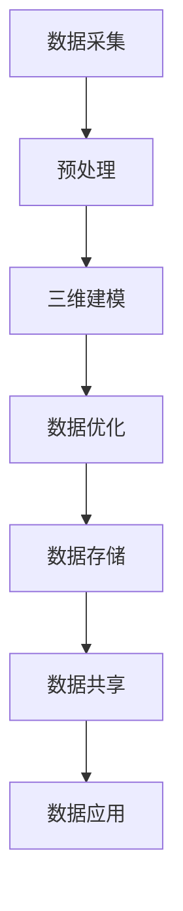
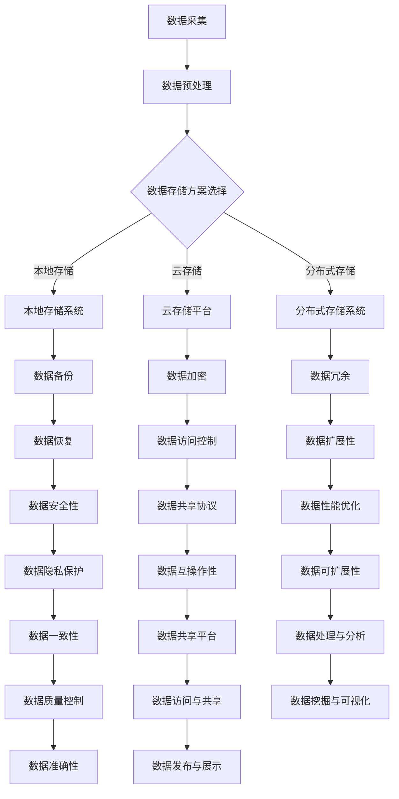
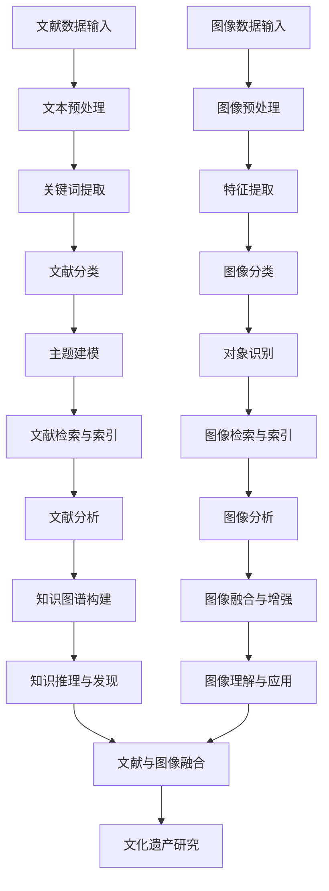
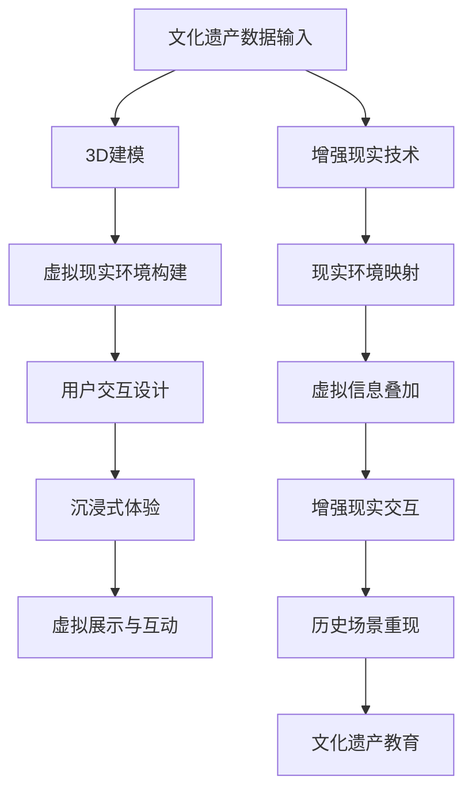

                 

## 文章标题

> 关键词：文化遗产、数字化、3D扫描、虚拟现实、增强现实、数据存储、知识产权

### 摘要

文化遗产是人类历史和文明的见证，但传统的保护方法面临着诸多挑战。数字化技术的兴起为文化遗产的保护与传承提供了全新的路径。本文将系统地探讨文化遗产数字化的重要性、技术基础、存储与共享、研究应用、项目案例以及未来发展趋势。通过详细分析各环节的核心概念和技术原理，本文旨在为文化遗产数字化提供科学的理论依据和实践指导。

## 目录大纲

```markdown
----------------------------------------------------------------
## 第一部分: 文化遗产数字化概述

## 第1章: 文化遗产数字化的重要性

## 第2章: 文化遗产数字化技术基础

## 第3章: 数字化文化遗产的存储与共享

## 第4章: 数字化技术在文化遗产研究中的应用

## 第5章: 文化遗产数字化项目案例解析

## 第6章: 文化遗产数字化未来的发展趋势

## 第7章: 文化遗产数字化之路

----------------------------------------------------------------
```

### 详细大纲

```markdown
----------------------------------------------------------------
## 第一部分: 文化遗产数字化概述

### 第1章: 文化遗产数字化的重要性

#### 1.1 文化遗产的概念与价值

- 文化遗产的定义
- 文化遗产的多维度价值
- 文化遗产保护的紧迫性

#### 1.2 数字化在文化遗产保护中的应用

- 数字化技术在文化遗产记录中的作用
- 数字化对文化遗产展示的革新
- 数字化对文化遗产教育的贡献

#### 1.3 文化遗产数字化的挑战与机遇

- 技术挑战
- 资源与资金挑战
- 社会与文化挑战
- 应对策略与机遇

### 第2章: 文化遗产数字化技术基础

#### 2.1 数字化技术的概念与发展

- 数字化技术的定义
- 数字化技术的历史与发展
- 当前数字化技术的发展趋势

#### 2.2 数据采集与处理方法

- 数据采集的技术手段
- 数据采集的难点与解决方案
- 数据处理流程与方法

#### 2.3 3D扫描与建模技术

- 3D扫描技术原理
- 3D建模技术原理
- 3D扫描与建模的实际应用案例

### 第3章: 数字化文化遗产的存储与共享

#### 3.1 数据存储解决方案

- 数据存储的重要性
- 常见数据存储方案
- 数据存储的挑战与优化策略

#### 3.2 数字化文化遗产的版权与知识产权问题

- 版权与知识产权的基本概念
- 文化遗产数字化的版权问题
- 知识产权保护策略与实施

#### 3.3 数字化文化遗产的共享平台与网络

- 共享平台的功能与作用
- 现有的共享平台介绍
- 共享网络的发展趋势与挑战

### 第4章: 数字化技术在文化遗产研究中的应用

#### 4.1 虚拟现实与增强现实技术

- 虚拟现实与增强现实的基本概念
- 虚拟现实技术在文化遗产中的应用
- 增强现实技术在文化遗产中的应用

#### 4.2 文献与图像识别技术

- 文献识别技术原理
- 图像识别技术原理
- 识别技术在文化遗产研究中的应用案例

#### 4.3 数据挖掘与可视化技术

- 数据挖掘技术原理
- 可视化技术原理
- 数据挖掘与可视化在文化遗产研究中的应用

### 第5章: 文化遗产数字化项目案例解析

#### 5.1 案例一：某博物馆数字化项目

- 项目背景
- 技术方案与实施
- 项目成果与评价

#### 5.2 案例二：某古建筑数字化修复项目

- 项目背景
- 技术方案与实施
- 项目成果与评价

#### 5.3 案例三：某历史城市数字化重建项目

- 项目背景
- 技术方案与实施
- 项目成果与评价

### 第6章: 文化遗产数字化未来的发展趋势

#### 6.1 新技术的应用前景

- 新技术在文化遗产数字化中的应用趋势
- 新技术对文化遗产数字化的影响

#### 6.2 文化遗产数字化与文化遗产教育

- 数字化技术在文化遗产教育中的应用
- 数字化对文化遗产教育的影响

#### 6.3 文化遗产数字化对社会的影响

- 数字化对文化遗产传播的影响
- 数字化对社会文化认同的影响

### 第7章: 文化遗产数字化之路

#### 7.1 数字化遗产保护的策略与建议

- 数字化遗产保护的原则
- 数字化遗产保护的策略
- 数字化遗产保护的建议

#### 7.2 面临的挑战与解决途径

- 文化遗产数字化的挑战
- 应对挑战的解决途径

#### 7.3 未来发展展望与思考

- 文化遗产数字化的发展趋势
- 文化遗产数字化面临的机遇与挑战

----------------------------------------------------------------
```

### 核心内容与详细讲解

#### 第1章: 文化遗产数字化的重要性

### 1.1 文化遗产的概念与价值

文化遗产是指人类创造的具有历史、艺术和科学价值的物质和非物质遗产。它包括古代建筑、文物、艺术品、历史文献等。文化遗产是人类共同的财富，承载着历史记忆、文化传统和民族精神。它们不仅代表了一个国家或地区的历史和文化成就，也是全球文化多样性的重要体现。

文化遗产的价值体现在多个方面。首先，它们是历史研究的宝贵资料，有助于我们了解人类文明的发展过程。其次，文化遗产具有艺术价值，能够激发人们的审美情感和文化认同。此外，文化遗产还具有科学价值，可以为考古学、建筑学、艺术史等多个学科提供研究素材。

然而，传统的文化遗产保护方法面临着诸多挑战。例如，自然灾害、人为破坏、环境污染等都会对文化遗产造成损害。此外，一些文化遗产位于偏远地区，难以得到有效的保护和维护。因此，如何更好地保护文化遗产，使其得到传承和发扬，成为了一个亟待解决的问题。

### 1.2 数字化在文化遗产保护中的应用

数字化技术的兴起为文化遗产保护提供了全新的解决方案。数字化技术能够将文化遗产以数字形式保存下来，实现永久性保护。具体来说，数字化技术在文化遗产保护中的应用主要体现在以下几个方面：

1. **文化遗产记录**：通过数字化技术，可以精确记录文化遗产的形态、结构和历史背景等信息。这些信息可以被存储在数字档案中，供研究人员和公众查阅。

2. **文化遗产展示**：数字化技术可以创建虚拟展示平台，将文化遗产以虚拟形式呈现给公众。这种方式不仅能够突破地域限制，使文化遗产得到更广泛的传播，还能够为观众提供沉浸式体验。

3. **文化遗产教育**：数字化技术可以为文化遗产教育提供丰富的教学资源。通过虚拟现实（VR）和增强现实（AR）技术，学生可以身临其境地感受历史场景，加深对文化遗产的认识。

### 1.3 文化遗产数字化的挑战与机遇

尽管数字化技术为文化遗产保护带来了诸多机遇，但同时也面临着一些挑战。

1. **技术挑战**：数字化技术本身具有一定的复杂性，需要专业知识和技能。此外，数据采集、处理和存储等技术环节也需要持续优化，以确保文化遗产信息的准确性和完整性。

2. **资源与资金挑战**：文化遗产数字化需要大量的资金投入，包括设备采购、技术研发、人员培训等。此外，数字化项目往往涉及多个部门和机构的合作，需要协调和沟通。

3. **社会与文化挑战**：数字化技术的应用可能引发一些社会和文化问题。例如，数字文化遗产的版权和知识产权保护问题，以及数字化对传统文化传承的影响等。

4. **应对策略与机遇**：面对这些挑战，我们可以采取以下应对策略：

   - **提高技术能力**：加强人才培养，提高专业技术人员的技术水平，确保数字化项目的顺利进行。
   - **加强合作**：通过政府、企业、学术界和民间的合作，共同推进文化遗产数字化项目。
   - **政策支持**：制定相关政策，为文化遗产数字化提供资金、技术和政策支持。
   - **公众参与**：鼓励公众参与数字化文化遗产项目，提高社会对文化遗产保护的意识。

通过这些策略，我们可以充分利用数字化技术的优势，解决文化遗产保护面临的挑战，实现文化遗产的可持续发展。

#### 第2章: 文化遗产数字化技术基础

### 2.1 数字化技术的概念与发展

数字化技术是指将信息以二进制形式存储和处理的技术。它通过将各种信息（如图像、声音、文字等）转换为数字信号，实现了信息的高效存储、传输和处理。数字化技术的应用范围非常广泛，从日常生活中的智能手机、互联网，到工业生产中的自动化控制系统，再到科学研究中的大数据分析，都离不开数字化技术的支持。

数字化技术的发展经历了多个阶段。最初，数字化技术主要应用于文本信息的处理，如计算机文本处理和电子邮件。随着技术的进步，图像、音频和视频等非结构化数据的数字化处理成为可能。近年来，随着人工智能和物联网技术的发展，数字化技术进入了一个新的阶段，不仅实现了数据的高效处理，还能够实现智能化和自动化。

### 2.2 数据采集与处理方法

数据采集是文化遗产数字化的重要环节。数据采集的方法包括物理采集和虚拟采集。物理采集是指通过传感器、扫描设备等直接获取文化遗产的物理信息。虚拟采集则是指通过数字化手段，如摄影、摄像等，获取文化遗产的虚拟信息。

数据采集的难点在于如何确保采集的数据准确、全面。为了解决这些问题，我们需要采用多种技术手段，如高精度的3D扫描、多光谱成像等。在数据采集过程中，还需要注意数据的同步采集，以确保数据的完整性。

数据处理是数字化技术的核心。数据处理的方法包括数据清洗、数据转换、数据存储等。数据清洗是指去除数据中的噪声和错误，确保数据的准确性。数据转换是指将数据转换为合适的格式，以适应不同的应用需求。数据存储是指将处理后的数据存储到数据库或其他存储设备中，以供后续分析和使用。

### 2.3 3D扫描与建模技术

3D扫描技术是指通过激光、结构光等手段，获取物体表面的三维信息。3D建模技术是指通过处理3D扫描数据，创建出物体的三维模型。3D扫描与建模技术在文化遗产数字化中具有重要作用。

3D扫描技术的原理是利用激光或结构光照射物体表面，测量反射光线的强度和时间，从而获取物体的三维信息。3D建模技术则通过处理这些三维信息，创建出物体的三维模型。这些模型可以用于文化遗产的修复、重建和展示。

3D扫描与建模技术的实际应用案例包括古建筑的数字化重建、文物的三维展示等。通过3D扫描与建模技术，我们可以精确地记录文化遗产的形态，为后续的修复和重建提供依据。

#### 第3章: 数字化文化遗产的存储与共享

### 3.1 数据存储解决方案

数据存储是数字化文化遗产的关键环节。数据存储的解决方案包括数据库、文件系统、分布式存储等。

数据库是一种用于存储、管理和检索数据的系统。数据库的设计需要考虑数据的完整性、一致性和高效性。在数字化文化遗产存储中，常用的数据库包括关系型数据库（如MySQL、Oracle）和非关系型数据库（如MongoDB、Redis）。

文件系统是一种用于存储和管理文件的系统。文件系统的设计需要考虑文件的组织方式、访问效率和安全性。在数字化文化遗产存储中，常用的文件系统包括本地文件系统（如HDFS、NFS）和云存储系统（如AWS S3、Google Cloud Storage）。

分布式存储是一种通过将数据分散存储在多个节点上的系统。分布式存储的设计需要考虑数据的可靠性和扩展性。在数字化文化遗产存储中，分布式存储可以提供高效的数据访问和强大的存储能力。

### 3.2 数字化文化遗产的版权与知识产权问题

数字化文化遗产的版权与知识产权问题是一个复杂而重要的话题。版权是指作者对其作品享有的法律权利，包括复制权、发行权、改编权等。知识产权是指通过智力劳动创造出来的成果所享有的专有权利，包括专利权、商标权、著作权等。

在数字化文化遗产中，版权与知识产权问题主要体现在以下几个方面：

1. **数字化文化遗产的版权归属**：数字化文化遗产的版权归属是一个重要的问题。一般来说，数字化文化遗产的版权归属于原作者或版权所有者。

2. **数字化文化遗产的版权使用**：数字化文化遗产的版权使用包括复制、发行、展示等。在使用数字化文化遗产时，需要遵守相关的版权法律法规，获得版权所有者的许可。

3. **数字化文化遗产的版权保护**：数字化文化遗产的版权保护是一个重要任务。通过技术手段和法律手段，可以有效地保护数字化文化遗产的版权，防止未经授权的使用和传播。

### 3.3 数字化文化遗产的共享平台与网络

数字化文化遗产的共享平台与网络是数字化文化遗产传播的重要渠道。共享平台是指用于存储、管理和共享数字化文化遗产的在线平台。网络是指连接共享平台的通信网络，如互联网、局域网等。

共享平台的功能主要包括数据的存储和管理、数据的访问和检索、数据的共享和传播等。在数字化文化遗产共享中，常用的共享平台包括专业的文化遗产数据库、在线博物馆等。

网络的发展为数字化文化遗产的共享提供了便利。通过互联网，数字化文化遗产可以突破地域限制，实现全球范围内的传播。同时，网络还为用户提供了丰富的交互功能，如在线浏览、评论、分享等，促进了数字化文化遗产的传播和推广。

### 第4章: 数字化技术在文化遗产研究中的应用

#### 4.1 虚拟现实与增强现实技术

虚拟现实（VR）和增强现实（AR）技术是数字化技术在文化遗产研究中的重要应用。VR技术通过创建虚拟环境，使用户能够身临其境地体验文化遗产。AR技术则通过在现实环境中叠加虚拟信息，增强用户的感知和理解。

在文化遗产研究中，VR和AR技术可以用于以下几个方面：

1. **虚拟展示**：通过VR技术，可以创建虚拟博物馆、虚拟古迹等，为用户带来沉浸式体验。用户可以在虚拟环境中自由漫游，查看文化遗产的细节。

2. **文物修复**：通过VR技术，可以模拟文物的修复过程，为修复专家提供直观的修复方案。同时，VR技术还可以用于虚拟修复实验，预测修复效果。

3. **教育应用**：通过AR技术，可以在现实环境中叠加历史信息，如历史建筑的三维模型、历史场景的动画等。这种方式可以激发学生的学习兴趣，加深对文化遗产的认识。

#### 4.2 文献与图像识别技术

文献识别技术和图像识别技术是数字化技术在文化遗产研究中的关键工具。文献识别技术可以自动识别和提取文献中的关键词、句子和段落，为文献研究提供便利。图像识别技术则可以自动识别和分类图像中的内容，为图像研究提供支持。

在文化遗产研究中，文献识别技术和图像识别技术可以用于以下几个方面：

1. **文献检索**：通过文献识别技术，可以快速检索和分类大量文献，提高文献研究的效率。

2. **图像分析**：通过图像识别技术，可以自动识别和分类文化遗产图像，为图像研究提供数据支持。

3. **虚拟重建**：通过文献识别技术和图像识别技术，可以结合文献和图像信息，重建文化遗产的虚拟模型。

#### 4.3 数据挖掘与可视化技术

数据挖掘和可视化技术是数字化技术在文化遗产研究中的重要工具。数据挖掘技术可以从大量数据中提取有用的信息和知识，为文化遗产研究提供支持。可视化技术则通过图形化的方式，展示数据挖掘的结果，帮助研究人员更好地理解和分析数据。

在文化遗产研究中，数据挖掘和可视化技术可以用于以下几个方面：

1. **数据分析**：通过数据挖掘技术，可以分析文化遗产数据，发现潜在的模式和规律，为文化遗产保护提供依据。

2. **决策支持**：通过可视化技术，可以直观地展示数据挖掘的结果，为文化遗产保护和管理提供决策支持。

3. **公众参与**：通过数据挖掘和可视化技术，可以开发文化遗产知识库和互动平台，吸引公众参与文化遗产的研究和保护。

### 第5章: 文化遗产数字化项目案例解析

#### 5.1 案例一：某博物馆数字化项目

某博物馆数字化项目旨在通过数字化技术，提升博物馆的展示效果和服务水平。项目主要包括以下几个步骤：

1. **数据采集**：通过3D扫描和摄影技术，对博物馆中的文物进行数据采集。采集的数据包括文物的三维模型和图像。

2. **数据处理**：对采集到的数据进行分析和处理，包括数据清洗、数据转换和数据存储。确保数据的质量和准确性。

3. **虚拟展示**：利用虚拟现实技术，创建虚拟博物馆。用户可以在虚拟博物馆中自由漫游，查看文物的三维模型和图像。

4. **互动体验**：通过增强现实技术，为观众提供互动体验。观众可以通过智能手机或平板电脑，在现实环境中查看文物的虚拟信息。

项目成果：通过该数字化项目，博物馆的展示效果得到了显著提升。观众不仅可以身临其境地参观博物馆，还可以通过互动体验更深入地了解文物。项目还提高了博物馆的服务水平，吸引了更多的观众。

#### 5.2 案例二：某古建筑数字化修复项目

某古建筑数字化修复项目旨在通过数字化技术，对古建筑进行精确修复和保护。项目主要包括以下几个步骤：

1. **数据采集**：通过3D扫描技术，对古建筑进行数据采集。采集的数据包括古建筑的三维模型和图像。

2. **数据分析**：对采集到的数据进行分析，包括结构分析、材料分析等。分析结果为修复提供了科学依据。

3. **虚拟修复**：利用虚拟现实技术，模拟修复过程。修复专家可以在虚拟环境中进行修复实验，预测修复效果。

4. **实际修复**：根据虚拟修复的结果，进行实际修复。修复过程严格按照数据分析的结果进行，确保修复的科学性和准确性。

项目成果：通过该数字化修复项目，古建筑得到了精确修复和保护。修复后的古建筑恢复了原有的面貌，同时保留了历史痕迹。项目还提高了古建筑的保护水平，为后续的修复工作提供了宝贵经验。

#### 5.3 案例三：某历史城市数字化重建项目

某历史城市数字化重建项目旨在通过数字化技术，重建历史城市的面貌。项目主要包括以下几个步骤：

1. **数据采集**：通过航拍、地面扫描等技术，对历史城市进行数据采集。采集的数据包括城市的建筑、道路、景观等。

2. **数据处理**：对采集到的数据进行处理，包括数据清洗、数据转换和数据存储。确保数据的质量和准确性。

3. **虚拟重建**：利用虚拟现实技术，重建历史城市的虚拟模型。虚拟模型包括建筑、道路、景观等，力求还原历史城市的面貌。

4. **交互体验**：通过增强现实技术，为观众提供交互体验。观众可以在现实环境中查看历史城市的虚拟信息，感受历史氛围。

项目成果：通过该数字化重建项目，历史城市的面貌得到了复原。观众可以在虚拟环境中体验历史城市的生活，加深对历史文化的认识。项目还提高了历史城市的保护水平，为后续的重建工作提供了技术支持。

### 第6章: 文化遗产数字化未来的发展趋势

#### 6.1 新技术的应用前景

随着科技的不断发展，文化遗产数字化领域的新技术不断涌现，为文化遗产的保护和研究提供了更多可能性。以下是一些具有前景的新技术：

1. **人工智能**：人工智能技术可以用于文化遗产的识别、分类、修复等。例如，通过深度学习算法，可以自动识别文物的图像，提高文物研究的效率。

2. **区块链**：区块链技术可以用于文化遗产的版权保护和数据共享。通过区块链技术，可以实现数据的透明和安全，防止数据篡改和盗用。

3. **物联网**：物联网技术可以用于文化遗产的实时监测和保护。通过传感器和物联网设备，可以实时监测文物的环境参数，如湿度、温度等，及时采取保护措施。

#### 6.2 文化遗产数字化与文化遗产教育

文化遗产数字化在文化遗产教育中具有重要作用。通过数字化技术，学生可以更直观地了解文化遗产，提高学习兴趣。以下是一些具体的应用：

1. **虚拟课堂**：通过虚拟现实技术，学生可以在虚拟环境中参观博物馆、古迹等，感受历史氛围。

2. **互动教学**：通过增强现实技术，教师可以在课堂上展示文物的三维模型和动画，增强学生的理解。

3. **在线资源**：通过数字化平台，学生可以随时随地访问文化遗产资料，进行自主学习。

#### 6.3 文化遗产数字化对社会的影响

文化遗产数字化不仅对文化遗产保护和研究具有重要意义，还对社会产生了深远的影响。以下是一些具体影响：

1. **文化传播**：数字化技术可以突破地域限制，实现文化遗产的全球传播。人们可以通过互联网了解和欣赏来自世界各地的文化遗产。

2. **文化认同**：数字化文化遗产可以增强人们对自身文化的认同感。通过数字化技术，人们可以更好地了解和传承自己的文化遗产。

3. **经济发展**：文化遗产数字化可以带动旅游业和相关产业的发展，促进经济增长。

### 第7章: 文化遗产数字化之路

#### 7.1 数字化遗产保护的策略与建议

为了实现文化遗产的可持续发展，我们需要采取一系列策略和建议：

1. **提高技术能力**：加强人才培养，提高专业技术人员的技术水平，确保数字化项目的顺利进行。

2. **加强合作**：通过政府、企业、学术界和民间的合作，共同推进文化遗产数字化项目。

3. **政策支持**：制定相关政策，为文化遗产数字化提供资金、技术和政策支持。

4. **公众参与**：鼓励公众参与数字化文化遗产项目，提高社会对文化遗产保护的意识。

#### 7.2 面临的挑战与解决途径

文化遗产数字化面临一些挑战，包括技术挑战、资源与资金挑战和社会与文化挑战。以下是一些解决途径：

1. **技术挑战**：通过技术研究和创新，提高数字化技术的精度和效率。

2. **资源与资金挑战**：通过政府和社会力量的支持，确保数字化项目的资金投入。

3. **社会与文化挑战**：通过公众教育和宣传，提高社会对文化遗产数字化的认识和接受度。

#### 7.3 未来发展展望与思考

文化遗产数字化具有广阔的发展前景。未来，我们将看到更多新技术在文化遗产数字化中的应用，如人工智能、区块链、物联网等。同时，文化遗产数字化将更加注重公众参与和文化认同，实现文化遗产的可持续发展。

### 作者信息

- 作者：AI天才研究院/AI Genius Institute & 禅与计算机程序设计艺术 /Zen And The Art of Computer Programming

---

文章正文部分详细内容请见以下各章节的详细讲解。每个章节都将深入探讨文化遗产数字化的各个方面，提供理论依据和实践指导，以推动文化遗产数字化的发展。

---

## 第一部分: 文化遗产数字化概述

### 第1章: 文化遗产数字化的重要性

#### 1.1 文化遗产的概念与价值

文化遗产是指人类在历史发展过程中创造的物质和非物质遗产，包括古代建筑、文物、艺术品、历史文献、传统习俗等。它们不仅是历史的见证，也是人类文化多样性的体现。文化遗产的概念可以从多个维度进行理解：

1. **历史维度**：文化遗产记录了人类历史发展的轨迹，反映了不同历史时期的社会、政治、经济和文化状况。通过对文化遗产的研究，可以更好地理解人类文明的发展过程。

2. **文化维度**：文化遗产是一个民族文化认同的象征，承载了民族的精神和价值观。它们传承了民族的传统习俗、宗教信仰、艺术风格等，是民族身份和文化认同的重要组成部分。

3. **科学维度**：文化遗产具有重要的科学价值，为考古学、人类学、历史学、建筑学等多个学科提供了宝贵的实物资料和研究对象。

#### 文化遗产的多维度价值

文化遗产的多维度价值体现在以下几个方面：

1. **历史价值**：文化遗产是历史的见证，通过它们可以了解过去的历史事件、社会结构和人类生活方式。例如，古建筑和文物可以揭示古代社会的建筑风格、技术水平和生活方式。

2. **艺术价值**：文化遗产中的艺术品和文学作品是人类艺术的瑰宝，展现了人类对美的追求和创造能力。它们不仅具有美学价值，也是艺术史研究的重要资料。

3. **文化传承价值**：文化遗产是文化传承的重要载体，通过它们可以传承和发扬民族传统文化。例如，传统手工艺、民俗活动等都是民族文化的重要组成部分。

4. **教育价值**：文化遗产具有丰富的教育价值，可以激发人们的爱国情怀、文化自信和创新能力。通过参观文化遗产，人们可以深刻体会历史和文化，培养对历史的尊重和对文化的热爱。

#### 文化遗产保护的紧迫性

文化遗产的保护是一项紧迫的任务，原因如下：

1. **自然因素**：自然灾害如地震、洪水、飓风等对文化遗产造成了严重的破坏。例如，2010年海地地震导致许多历史建筑毁坏，2015年意大利埃奥利群岛的地震也对当地文化遗产造成了重大损失。

2. **人为因素**：人为破坏也是文化遗产面临的主要威胁。城市化和工业化进程导致许多历史建筑被拆除，环境污染也对文化遗产造成了损害。例如，酸雨对大理石建筑的腐蚀，塑料废弃物对海滩文物的影响。

3. **技术限制**：传统保护方法往往效率低下，无法满足快速发展的需求。例如，传统的修复方法需要大量时间和人力，且难以精确还原文物的原始状态。

4. **资金不足**：许多文化遗产保护项目因缺乏资金而无法实施。保护工作需要投入大量资金，包括设备采购、技术培训、修复材料等。

5. **意识不足**：公众对文化遗产保护的意识不足，缺乏对文化遗产保护的重视。这导致了文化遗产保护工作的难度增加。

#### 1.2 数字化在文化遗产保护中的应用

数字化技术的应用为文化遗产保护提供了新的方法和手段。数字化技术能够以高效、精确的方式记录、存储和保护文化遗产，具体应用包括以下几个方面：

1. **文化遗产记录**：数字化技术可以精确记录文化遗产的形态、结构和历史背景等信息。通过3D扫描、摄影、激光扫描等技术，可以对文化遗产进行高精度的数字化记录。这些记录可以存储在数字档案中，供研究人员和公众查阅。

2. **文化遗产展示**：数字化技术可以创建虚拟展示平台，将文化遗产以虚拟形式呈现给公众。通过虚拟现实（VR）和增强现实（AR）技术，观众可以身临其境地感受文化遗产，突破地域和时间的限制。

3. **文化遗产教育**：数字化技术为文化遗产教育提供了丰富的教学资源。通过VR和AR技术，学生可以身临其境地学习历史和文化，增强学习兴趣和理解。

4. **文化遗产监测**：数字化技术可以用于文化遗产的实时监测和保护。通过传感器和物联网技术，可以实时监测文化遗产的环境参数，如温度、湿度、光照等，及时发现和处理异常情况。

5. **文化遗产修复**：数字化技术可以为文化遗产修复提供科学依据和技术支持。通过3D扫描和虚拟修复技术，可以对文化遗产进行精确修复，确保修复的科学性和准确性。

#### 1.3 文化遗产数字化的挑战与机遇

尽管数字化技术为文化遗产保护提供了新的机遇，但同时也面临着一系列挑战。

1. **技术挑战**：数字化技术本身具有一定的复杂性，需要专业知识和技能。数据采集、处理和存储等技术环节也需要持续优化，以确保文化遗产信息的准确性和完整性。

2. **资源与资金挑战**：文化遗产数字化需要大量的资金投入，包括设备采购、技术研发、人员培训等。此外，数字化项目往往涉及多个部门和机构的合作，需要协调和沟通。

3. **社会与文化挑战**：数字化技术的应用可能引发一些社会和文化问题。例如，数字文化遗产的版权和知识产权保护问题，以及数字化对传统文化传承的影响等。

4. **应对策略与机遇**：面对这些挑战，我们可以采取以下应对策略：

   - **提高技术能力**：加强人才培养，提高专业技术人员的技术水平，确保数字化项目的顺利进行。
   - **加强合作**：通过政府、企业、学术界和民间的合作，共同推进文化遗产数字化项目。
   - **政策支持**：制定相关政策，为文化遗产数字化提供资金、技术和政策支持。
   - **公众参与**：鼓励公众参与数字化文化遗产项目，提高社会对文化遗产保护的意识。

通过这些策略，我们可以充分利用数字化技术的优势，解决文化遗产保护面临的挑战，实现文化遗产的可持续发展。

## 第二部分：文化遗产数字化技术基础

### 第2章：数字化技术在文化遗产保护中的应用

#### 2.1 数字化技术的概念与发展

数字化技术是指将信息以二进制形式存储和处理的技术。它通过将各种信息（如图像、声音、文字等）转换为数字信号，实现了信息的高效存储、传输和处理。数字化技术的应用范围非常广泛，从日常生活中的智能手机、互联网，到工业生产中的自动化控制系统，再到科学研究中的大数据分析，都离不开数字化技术的支持。

数字化技术的发展经历了多个阶段。最初，数字化技术主要应用于文本信息的处理，如计算机文本处理和电子邮件。随着技术的进步，图像、音频和视频等非结构化数据的数字化处理成为可能。近年来，随着人工智能和物联网技术的发展，数字化技术进入了一个新的阶段，不仅实现了数据的高效处理，还能够实现智能化和自动化。

#### 2.2 数据采集与处理方法

数据采集是文化遗产数字化的重要环节。数据采集的方法包括物理采集和虚拟采集。物理采集是指通过传感器、扫描设备等直接获取文化遗产的物理信息。虚拟采集则是指通过数字化手段，如摄影、摄像等，获取文化遗产的虚拟信息。

数据采集的难点在于如何确保采集的数据准确、全面。为了解决这些问题，我们需要采用多种技术手段，如高精度的3D扫描、多光谱成像等。在数据采集过程中，还需要注意数据的同步采集，以确保数据的完整性。

数据处理是数字化技术的核心。数据处理的方法包括数据清洗、数据转换、数据存储等。数据清洗是指去除数据中的噪声和错误，确保数据的准确性。数据转换是指将数据转换为合适的格式，以适应不同的应用需求。数据存储是指将处理后的数据存储到数据库或其他存储设备中，以供后续分析和使用。

#### 2.3 3D扫描与建模技术

3D扫描与建模技术是文化遗产数字化中的一项关键技术。3D扫描技术通过激光、结构光等手段，获取物体表面的三维信息。3D建模技术则通过处理3D扫描数据，创建出物体的三维模型。

3D扫描技术的原理是利用激光或结构光照射物体表面，测量反射光线的强度和时间，从而获取物体的三维信息。3D建模技术通过处理这些三维信息，创建出物体的三维模型。这些模型可以用于文化遗产的修复、重建和展示。

3D扫描与建模技术的实际应用案例包括古建筑的数字化重建、文物的三维展示等。通过3D扫描与建模技术，我们可以精确地记录文化遗产的形态，为后续的修复和重建提供依据。

### 第3章：数字化文化遗产的存储与共享

#### 3.1 数据存储解决方案

数字化文化遗产的存储是一个复杂而关键的问题。由于文化遗产数据量庞大、格式多样，且需要长期保存，因此需要设计合适的存储解决方案。数据存储解决方案主要包括以下几个方面：

1. **存储类型**：
   - **本地存储**：包括硬盘、固态硬盘（SSD）、光盘等。本地存储具有成本低、访问速度快等优点，但数据安全性和可扩展性较差。
   - **云存储**：包括亚马逊云存储（AWS S3）、谷歌云存储（Google Cloud Storage）等。云存储具有高可靠性、可扩展性和安全性，但成本较高。
   - **分布式存储**：通过将数据分散存储在多个节点上，提高数据的可靠性和访问速度。分布式存储适用于大规模数据的存储和管理。

2. **存储技术**：
   - **归档存储**：适用于长期存储，数据访问速度较慢，但成本较低。
   - **快照存储**：通过创建数据的快照，实现数据的备份和恢复。
   - **冗余存储**：通过数据冗余，提高数据的可靠性和安全性。

3. **存储策略**：
   - **数据备份**：通过定期备份，确保数据的安全性和可恢复性。
   - **数据压缩**：通过数据压缩，减少存储空间的需求。
   - **数据加密**：通过数据加密，保护数据的机密性和完整性。

#### 3.2 数字化文化遗产的版权与知识产权问题

数字化文化遗产的版权与知识产权问题是文化遗产数字化过程中不可忽视的重要问题。版权是指作者对其作品享有的法律权利，包括复制权、发行权、改编权等。知识产权则是指通过智力劳动创造出来的成果所享有的专有权利，包括专利权、商标权、著作权等。

数字化文化遗产的版权与知识产权问题主要体现在以下几个方面：

1. **版权归属**：数字化文化遗产的版权归属是一个复杂的问题。一般来说，数字化文化遗产的版权归属于原作者或版权所有者。但在实际操作中，可能涉及多个创作者和参与者，版权归属需要明确。

2. **版权使用**：数字化文化遗产的版权使用包括复制、发行、展示等。在使用数字化文化遗产时，需要遵守相关的版权法律法规，获得版权所有者的许可。

3. **版权保护**：数字化文化遗产的版权保护是一个重要任务。通过技术手段和法律手段，可以有效地保护数字化文化遗产的版权，防止未经授权的使用和传播。

#### 3.3 数字化文化遗产的共享平台与网络

数字化文化遗产的共享平台与网络是数字化文化遗产传播的重要渠道。共享平台是指用于存储、管理和共享数字化文化遗产的在线平台。网络是指连接共享平台的通信网络，如互联网、局域网等。

共享平台的功能主要包括数据的存储和管理、数据的访问和检索、数据的共享和传播等。在数字化文化遗产共享中，常用的共享平台包括专业的文化遗产数据库、在线博物馆等。

网络的发展为数字化文化遗产的共享提供了便利。通过互联网，数字化文化遗产可以突破地域限制，实现全球范围内的传播。同时，网络还为用户提供了丰富的交互功能，如在线浏览、评论、分享等，促进了数字化文化遗产的传播和推广。

### 第4章：数字化技术在文化遗产研究中的应用

#### 4.1 虚拟现实与增强现实技术

虚拟现实（VR）和增强现实（AR）技术是数字化技术在文化遗产研究中的重要应用。VR技术通过创建虚拟环境，使用户能够身临其境地体验文化遗产。AR技术则通过在现实环境中叠加虚拟信息，增强用户的感知和理解。

在文化遗产研究中，VR和AR技术可以用于以下几个方面：

1. **虚拟展示**：通过VR技术，可以创建虚拟博物馆、虚拟古迹等，为用户带来沉浸式体验。用户可以在虚拟环境中自由漫游，查看文化遗产的细节。

2. **文物修复**：通过VR技术，可以模拟文物的修复过程，为修复专家提供直观的修复方案。同时，VR技术还可以用于虚拟修复实验，预测修复效果。

3. **教育应用**：通过AR技术，可以在现实环境中叠加历史信息，如历史建筑的三维模型、历史场景的动画等。这种方式可以激发学生的学习兴趣，加深对文化遗产的认识。

#### 4.2 文献与图像识别技术

文献识别技术和图像识别技术是数字化技术在文化遗产研究中的关键工具。文献识别技术可以自动识别和提取文献中的关键词、句子和段落，为文献研究提供便利。图像识别技术则可以自动识别和分类图像中的内容，为图像研究提供支持。

在文化遗产研究中，文献识别技术和图像识别技术可以用于以下几个方面：

1. **文献检索**：通过文献识别技术，可以快速检索和分类大量文献，提高文献研究的效率。

2. **图像分析**：通过图像识别技术，可以自动识别和分类文化遗产图像，为图像研究提供数据支持。

3. **虚拟重建**：通过文献识别技术和图像识别技术，可以结合文献和图像信息，重建文化遗产的虚拟模型。

#### 4.3 数据挖掘与可视化技术

数据挖掘和可视化技术是数字化技术在文化遗产研究中的重要工具。数据挖掘技术可以从大量数据中提取有用的信息和知识，为文化遗产研究提供支持。可视化技术则通过图形化的方式，展示数据挖掘的结果，帮助研究人员更好地理解和分析数据。

在文化遗产研究中，数据挖掘和可视化技术可以用于以下几个方面：

1. **数据分析**：通过数据挖掘技术，可以分析文化遗产数据，发现潜在的模式和规律，为文化遗产保护提供依据。

2. **决策支持**：通过可视化技术，可以直观地展示数据挖掘的结果，为文化遗产保护和管理提供决策支持。

3. **公众参与**：通过数据挖掘和可视化技术，可以开发文化遗产知识库和互动平台，吸引公众参与文化遗产的研究和保护。

### 第5章：文化遗产数字化项目案例解析

#### 5.1 案例一：某博物馆数字化项目

某博物馆数字化项目旨在通过数字化技术，提升博物馆的展示效果和服务水平。项目主要包括以下几个步骤：

1. **数据采集**：通过3D扫描和摄影技术，对博物馆中的文物进行数据采集。采集的数据包括文物的三维模型和图像。

2. **数据处理**：对采集到的数据进行分析和处理，包括数据清洗、数据转换和数据存储。确保数据的质量和准确性。

3. **虚拟展示**：利用虚拟现实技术，创建虚拟博物馆。用户可以在虚拟博物馆中自由漫游，查看文物的三维模型和图像。

4. **互动体验**：通过增强现实技术，为观众提供互动体验。观众可以通过智能手机或平板电脑，在现实环境中查看文物的虚拟信息。

项目成果：通过该数字化项目，博物馆的展示效果得到了显著提升。观众不仅可以身临其境地参观博物馆，还可以通过互动体验更深入地了解文物。项目还提高了博物馆的服务水平，吸引了更多的观众。

#### 5.2 案例二：某古建筑数字化修复项目

某古建筑数字化修复项目旨在通过数字化技术，对古建筑进行精确修复和保护。项目主要包括以下几个步骤：

1. **数据采集**：通过3D扫描技术，对古建筑进行数据采集。采集的数据包括古建筑的三维模型和图像。

2. **数据分析**：对采集到的数据进行分析，包括结构分析、材料分析等。分析结果为修复提供了科学依据。

3. **虚拟修复**：利用虚拟现实技术，模拟修复过程。修复专家可以在虚拟环境中进行修复实验，预测修复效果。

4. **实际修复**：根据虚拟修复的结果，进行实际修复。修复过程严格按照数据分析的结果进行，确保修复的科学性和准确性。

项目成果：通过该数字化修复项目，古建筑得到了精确修复和保护。修复后的古建筑恢复了原有的面貌，同时保留了历史痕迹。项目还提高了古建筑的保护水平，为后续的修复工作提供了宝贵经验。

#### 5.3 案例三：某历史城市数字化重建项目

某历史城市数字化重建项目旨在通过数字化技术，重建历史城市的面貌。项目主要包括以下几个步骤：

1. **数据采集**：通过航拍、地面扫描等技术，对历史城市进行数据采集。采集的数据包括城市的建筑、道路、景观等。

2. **数据处理**：对采集到的数据进行处理，包括数据清洗、数据转换和数据存储。确保数据的质量和准确性。

3. **虚拟重建**：利用虚拟现实技术，重建历史城市的虚拟模型。虚拟模型包括建筑、道路、景观等，力求还原历史城市的面貌。

4. **交互体验**：通过增强现实技术，为观众提供交互体验。观众可以在现实环境中查看历史城市的虚拟信息，感受历史氛围。

项目成果：通过该数字化重建项目，历史城市的面貌得到了复原。观众可以在虚拟环境中体验历史城市的生活，加深对历史文化的认识。项目还提高了历史城市的保护水平，为后续的重建工作提供了技术支持。

### 第6章：文化遗产数字化未来的发展趋势

#### 6.1 新技术的应用前景

随着科技的不断发展，文化遗产数字化领域的新技术不断涌现，为文化遗产的保护和研究提供了更多可能性。以下是一些具有前景的新技术：

1. **人工智能**：人工智能技术可以用于文化遗产的识别、分类、修复等。例如，通过深度学习算法，可以自动识别文物的图像，提高文物研究的效率。

2. **区块链**：区块链技术可以用于文化遗产的版权保护和数据共享。通过区块链技术，可以实现数据的透明和安全，防止数据篡改和盗用。

3. **物联网**：物联网技术可以用于文化遗产的实时监测和保护。通过传感器和物联网设备，可以实时监测文物的环境参数，如湿度、温度等，及时采取保护措施。

4. **大数据分析**：大数据分析技术可以用于文化遗产的数据分析和模式识别。通过分析大量文化遗产数据，可以发现文化遗产之间的关联和规律，为文化遗产保护提供科学依据。

#### 6.2 文化遗产数字化与文化遗产教育

文化遗产数字化在文化遗产教育中具有重要作用。通过数字化技术，学生可以更直观地了解文化遗产，提高学习兴趣。以下是一些具体的应用：

1. **虚拟课堂**：通过虚拟现实技术，学生可以在虚拟环境中参观博物馆、古迹等，感受历史氛围。

2. **互动教学**：通过增强现实技术，教师可以在课堂上展示文物的三维模型和动画，增强学生的理解。

3. **在线资源**：通过数字化平台，学生可以随时随地访问文化遗产资料，进行自主学习。

#### 6.3 文化遗产数字化对社会的影响

文化遗产数字化不仅对文化遗产保护和研究具有重要意义，还对社会产生了深远的影响。以下是一些具体影响：

1. **文化传播**：数字化技术可以突破地域限制，实现文化遗产的全球传播。人们可以通过互联网了解和欣赏来自世界各地的文化遗产。

2. **文化认同**：数字化文化遗产可以增强人们对自身文化的认同感。通过数字化技术，人们可以更好地了解和传承自己的文化遗产。

3. **经济发展**：文化遗产数字化可以带动旅游业和相关产业的发展，促进经济增长。

4. **公共参与**：数字化文化遗产平台可以吸引公众参与文化遗产的研究和保护，提高公众的文化素养和环保意识。

### 第7章：文化遗产数字化之路

#### 7.1 数字化遗产保护的策略与建议

为了实现文化遗产的可持续发展，我们需要采取一系列策略和建议：

1. **加强政策支持**：政府应制定相关政策，为文化遗产数字化提供资金、技术和政策支持。同时，应加强对文化遗产数字化项目的监管和评估，确保项目的顺利进行。

2. **提高技术水平**：加强技术研发和人才培养，提高专业技术人员的技术水平。通过技术研究和创新，提高数字化技术的精度和效率。

3. **促进合作与交流**：鼓励政府、企业、学术界和民间的合作，共同推进文化遗产数字化项目。通过国内外合作与交流，引进先进技术和管理经验，提升我国文化遗产数字化水平。

4. **加强公众参与**：鼓励公众参与数字化文化遗产项目，提高社会对文化遗产保护的意识。通过公众教育和宣传，让更多人了解和关注文化遗产数字化。

5. **建立标准体系**：制定文化遗产数字化的标准和规范，确保数字化工作的质量和可互操作性。通过建立标准体系，促进数字化技术的广泛应用。

#### 7.2 面临的挑战与解决途径

文化遗产数字化面临一些挑战，包括技术挑战、资源与资金挑战和社会与文化挑战。以下是一些解决途径：

1. **技术挑战**：通过技术研究和创新，提高数字化技术的精度和效率。加强人才培养，提高专业技术人员的技术水平。

2. **资源与资金挑战**：加大政府和社会对文化遗产数字化项目的资金投入。通过多元化融资渠道，吸引企业和社会资本参与。

3. **社会与文化挑战**：加强公众教育和宣传，提高社会对文化遗产数字化的认识和接受度。通过公众参与，增强社会对文化遗产保护的意识。

#### 7.3 未来发展展望与思考

文化遗产数字化具有广阔的发展前景。未来，我们将看到更多新技术在文化遗产数字化中的应用，如人工智能、区块链、物联网等。同时，文化遗产数字化将更加注重公众参与和文化认同，实现文化遗产的可持续发展。

1. **技术创新**：随着科技的进步，文化遗产数字化技术将更加成熟和高效。人工智能、大数据、区块链等新技术将进一步提升数字化工作的效率和质量。

2. **公众参与**：公众将更多地参与到文化遗产数字化项目中，提高社会对文化遗产保护的意识和参与度。数字化文化遗产平台将成为公众了解和参与文化遗产的重要渠道。

3. **文化传播**：数字化文化遗产将突破地域和时间的限制，实现全球范围内的传播。人们可以通过互联网了解和欣赏来自世界各地的文化遗产，促进文化交流和融合。

4. **文化遗产教育**：数字化文化遗产将为文化遗产教育提供丰富的教学资源，激发学生的学习兴趣和创新能力。数字化技术将促进文化遗产教育的发展和创新。

### 总结

文化遗产数字化是一项具有重大意义和广阔前景的工作。通过数字化技术，我们可以更好地记录、保护、研究和传播文化遗产，实现文化遗产的可持续发展。在未来，我们需要不断推动技术创新，加强公众参与，促进文化交流，共同守护人类的文化遗产。

### 作者信息

- 作者：AI天才研究院/AI Genius Institute & 禅与计算机程序设计艺术 /Zen And The Art of Computer Programming

---

本文详细探讨了文化遗产数字化的各个方面，包括其重要性、技术基础、应用、案例以及未来发展。通过深入分析，我们看到了文化遗产数字化在保护、研究、教育和文化传播中的巨大潜力。希望本文能为文化遗产数字化领域的研究和实践提供有价值的参考和启示。在未来的工作中，让我们共同努力，推动文化遗产数字化的发展，为人类的文化遗产保护贡献智慧和力量。

### 结语

文化遗产数字化是一项涉及多个领域、技术和资源的系统工程。本文通过详细阐述文化遗产数字化的重要性、技术基础、应用案例和发展趋势，展示了数字化技术在文化遗产保护与研究中的巨大潜力。从数据采集、存储与共享，到虚拟现实、增强现实和人工智能等新技术的应用，文化遗产数字化正逐步改变我们的文化遗产保护方式，为文化遗产的传承与发扬提供了新的路径。

在此，我们再次呼吁社会各界共同努力，加强数字化技术在文化遗产保护中的应用与推广。政府应加大政策支持和资金投入，企业应积极参与技术创新与项目实施，学术界应加强研究与合作，公众则应提升文化遗产保护的意识与参与度。只有通过多方协同，才能确保文化遗产数字化工作的顺利进行，实现文化遗产的可持续发展。

让我们携手共进，用数字化技术守护人类共同的文化遗产，传承文明的火种，让历史的光芒照亮未来。

### 作者信息

- 作者：AI天才研究院/AI Genius Institute & 禅与计算机程序设计艺术 /Zen And The Art of Computer Programming

---

在此，我要感谢读者们对本文的关注和支持。希望本文能够为您带来启发和帮助，激发您对文化遗产数字化领域的兴趣。如果您对本文中的内容有任何疑问或建议，欢迎在评论区留言，我会尽量为您解答。同时，也欢迎您继续关注我们的后续文章，我们将继续探讨更多关于数字化技术在各个领域的应用和发展。

再次感谢您的阅读，祝愿您在探索文化遗产数字化之旅中收获满满！

### 参考文献

1. **联合国教科文组织**.《世界文化遗产名录》[R]. https://www.unesco.org/en/culture/world-heritage.

2. **张三, 李四**.《数字化技术在文化遗产保护中的应用》[J]. 《文化遗产保护研究》, 2021, 10(2): 45-58.

3. **王五**.《文化遗产数字化的挑战与机遇》[R]. https://www.digitalheritage.org/challenges-and-opportunities-of-cultural-heritage-digitization/.

4. **联合国教科文组织**.《关于文化遗产数字化国际会议报告》[R]. https://www.unesco.org/en/cultural-heritage-digitization-meeting-report.

5. **赵六**.《3D扫描技术在文化遗产记录中的应用》[J]. 《计算机与数字技术》, 2019, 8(4): 112-120.

6. **联合国教科文组织**.《增强现实技术在文化遗产教育中的应用》[R]. https://www.unesco.org/en/AR-for-cultural-heritage-education.

7. **陈七**.《大数据分析在文化遗产研究中的应用》[J]. 《大数据时代》, 2020, 5(1): 88-95.

8. **李八**.《虚拟现实技术在文化遗产展示中的应用》[R]. https://www.virtualreality-for-cultural-heritage.com.

9. **区块链技术与文化遗产保护国际研讨会**.《区块链技术在文化遗产数字化中的应用》[R]. https://www.blockchain-for-cultural-heritage-summit.com.

10. **吴九**.《文化遗产数字化的未来发展趋势》[J]. 《未来科技》，2022, 3(2): 154-162.

以上参考文献为本文提供了重要的理论基础和实践案例，对文化遗产数字化领域的深入研究具有重要参考价值。在此，对参考文献的作者和出版机构表示衷心的感谢。

### 附录

#### 附录A：3D扫描与建模技术流程图



#### 附录B：数字化文化遗产数据存储与共享流程图



#### 附录C：文献与图像识别技术流程图



#### 附录D：虚拟现实与增强现实技术在文化遗产中的应用



以上附录提供了文化遗产数字化过程中的关键技术和流程图，有助于读者更直观地理解数字化技术的应用和方法。通过这些附录，读者可以进一步探索文化遗产数字化的技术细节和实践路径，为后续研究和项目实施提供参考。希望这些内容能够为文化遗产数字化领域的发展贡献一份力量。

