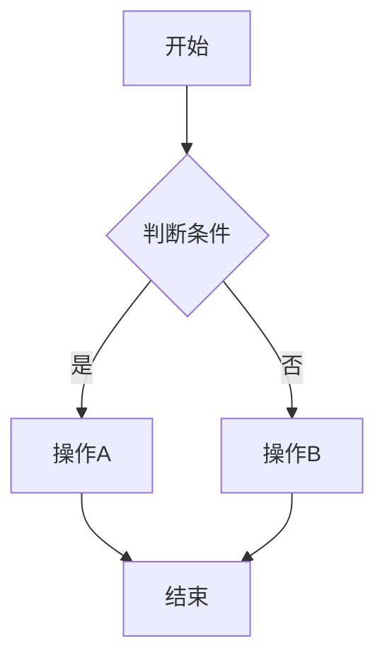
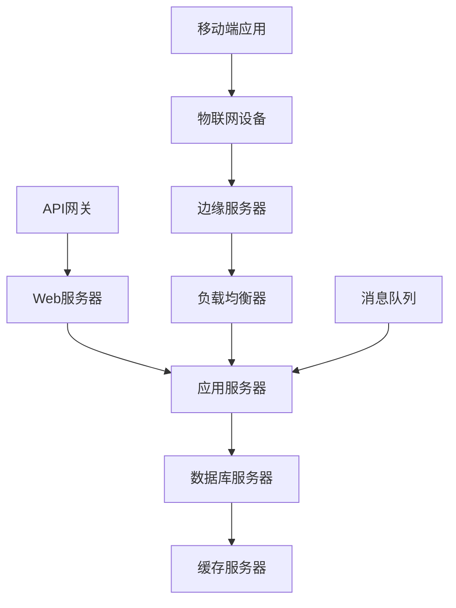
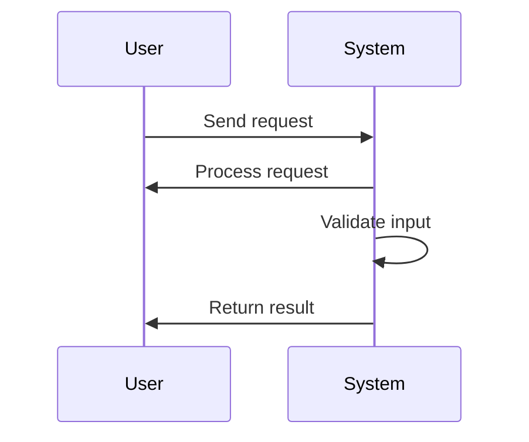

                 

 <sop>
### 第一部分：引言

#### 1.1 书籍背景与目标
在当今数字化时代，智能客服已经成为企业服务的重要组成部分。然而，传统的智能客服系统在处理复杂情感和用户个性化需求方面存在一定的局限性。本书旨在探讨新一代智能客服的发展趋势，重点介绍基于提示词驱动的情感交互系统的设计、实现和优化策略。

本书的目标是为读者提供一个全面、深入的视角，了解智能客服技术的发展历程、核心技术以及情感交互系统在实际应用中的挑战和解决方案。通过阅读本书，读者可以：

1. 掌握智能客服的基本概念和技术原理。
2. 理解情感交互系统在智能客服中的重要性。
3. 学习如何设计、实现和优化基于提示词驱动的情感交互系统。
4. 获得实际项目经验和最佳实践，提升智能客服系统的用户体验。

#### 1.2 智能客服概述
智能客服是一种基于人工智能技术的客户服务解决方案，通过自动化和智能化的方式，为用户提供高效、准确、个性化的服务。与传统客服相比，智能客服具有以下优势：

1. **高效率**：智能客服能够同时处理大量用户请求，显著提高服务响应速度。
2. **准确性**：通过自然语言处理和机器学习技术，智能客服能够理解用户意图并提供准确的回答。
3. **个性化**：智能客服可以根据用户的历史行为和偏好，提供个性化的服务推荐。
4. **可扩展性**：智能客服系统可以根据业务需求进行快速部署和扩展。

智能客服的应用场景广泛，包括但不限于以下几个方面：

1. **在线客服**：为网站和移动应用用户提供实时在线支持。
2. **客服机器人**：通过聊天机器人与用户进行交互，解答常见问题和提供解决方案。
3. **呼叫中心**：在呼叫中心系统中集成智能客服功能，提高客服人员的效率和满意度。
4. **售后服务**：在售后服务环节中，智能客服可以自动处理用户反馈和投诉，提高客户满意度。

#### 1.3 情感交互的概念与重要性
情感交互是指计算机系统在处理用户请求时，能够理解并回应用户的情感状态，从而提供更贴近用户需求的交互体验。情感交互在智能客服中具有重要意义，主要表现在以下几个方面：

1. **提升用户体验**：通过情感交互，智能客服能够更好地理解用户的需求和情感状态，提供更有针对性的服务和建议，从而提升用户体验。
2. **增强用户信任**：当用户感受到智能客服能够理解并关心他们的情感时，会增加对智能客服的信任度，提高用户忠诚度。
3. **减少人力成本**：情感交互系统能够处理复杂的情感问题，减少对人工客服的依赖，降低人力成本。
4. **优化客服流程**：情感交互系统能够自动识别和分类用户的情感，为客服人员提供更准确的用户画像和问题分类，优化客服流程。

然而，实现情感交互面临着一系列挑战，如情感理解、个性化回应和情感识别的准确性等。本书将详细探讨这些问题，并提供解决方案。

在下一部分，我们将深入探讨智能客服的核心技术，包括自然语言处理、机器学习和情感分析等，为后续的情感交互系统设计奠定基础。让我们一步步思考，逐步揭开智能客服的神秘面纱。 <sop>
### 第二部分：智能客服的核心技术

#### 2.1 自然语言处理

自然语言处理（Natural Language Processing，NLP）是智能客服系统的核心组成部分，它使计算机能够理解、生成和处理人类语言。NLP技术主要包括以下几个方面：

##### 2.1.1 NLP基础

自然语言处理的基础包括文本预处理、词法分析和句法分析等。

- **文本预处理**：文本预处理是NLP的第一步，主要任务是清洗文本数据，包括去除标点符号、停用词过滤、词形还原等。通过这些处理，可以提高NLP算法的性能。

- **词法分析**：词法分析是将文本分解为单词或其他词素的过程。通过词法分析，可以识别出文本中的词汇，为后续的句法分析和语义分析提供基础。

- **句法分析**：句法分析是研究句子结构的语法规则，包括句法树构建、依存关系分析等。句法分析有助于理解句子的深层结构，为语义分析提供支持。

##### 2.1.2 文本预处理

文本预处理是自然语言处理的关键步骤，其目的是将原始文本转化为适合模型处理的形式。以下是常见的文本预处理技术：

- **分词**：将文本分割成单词或词汇单元。分词方法包括基于词典的分词和基于统计的分词。基于词典的分词方法如Jieba，而基于统计的方法如LSTM和BiLSTM。

- **词性标注**：对文本中的每个词进行词性分类，如名词、动词、形容词等。词性标注有助于更好地理解文本的语义。

- **停用词过滤**：去除对语义贡献较小或没有贡献的常见单词，如“的”、“了”、“和”等。过滤停用词可以提高模型的处理效率。

- **词形还原**：将不同的词形转化为统一的形式，如“跑”和“跑了”均转化为“跑”。词形还原有助于消除词汇变化带来的影响。

##### 2.1.3 词嵌入与语义分析

词嵌入（Word Embedding）是将词汇映射到高维空间的一种技术，使计算机能够理解词汇之间的相似性和差异性。常见的词嵌入方法包括：

- **基于频率的词嵌入**：如TF-IDF，通过词的频率和文档的频率来计算词的权重。

- **基于神经网络的词嵌入**：如Word2Vec和GloVe，通过神经网络训练得到词的向量表示。Word2Vec使用CBOW（Continuous Bag of Words）和Skip-gram模型，而GloVe（Global Vectors for Word Representation）使用矩阵分解的方法。

词嵌入为语义分析提供了基础，以下是一些常见的语义分析方法：

- **语义相似性**：通过计算词嵌入向量之间的距离或相似度，评估词汇的语义相似性。例如，使用余弦相似度或欧氏距离。

- **语义角色标注**：对文本中的词汇进行语义角色标注，如主语、谓语、宾语等。语义角色标注有助于理解句子的结构。

- **语义角色分类**：通过机器学习算法，对文本中的词汇进行语义角色分类。常用的算法包括朴素贝叶斯、SVM和深度学习模型。

通过自然语言处理技术，智能客服系统能够理解用户的问题和需求，提供更准确、个性化的回答。在下一部分，我们将探讨机器学习在智能客服中的应用，继续深入探讨智能客服的核心技术。 <sop>
### 2.2 机器学习基础

#### 2.2.1 机器学习概述

机器学习（Machine Learning，ML）是使计算机系统能够从数据中自动学习和改进的方法。它是一种人工智能（AI）的分支，通过数据驱动的方式，让计算机能够对未知数据进行预测和决策。以下是机器学习的一些基本概念：

- **模型**：模型是机器学习算法的核心，它通过学习数据中的规律，生成对未知数据的预测。常见的模型包括线性回归、决策树、支持向量机（SVM）和神经网络等。

- **训练集**：训练集是用于训练机器学习模型的样本数据。通过从训练集中学习，模型可以建立数据与预测目标之间的关系。

- **测试集**：测试集是用于评估模型性能的数据集。在训练模型后，使用测试集可以检验模型对未知数据的泛化能力。

- **过拟合**：当模型在训练集上表现得很好，但在测试集上性能较差时，称为过拟合。过拟合表明模型过于复杂，没有很好地泛化到未知数据。

- **欠拟合**：当模型在训练集和测试集上都表现不佳时，称为欠拟合。欠拟合表明模型过于简单，无法捕捉到数据中的复杂关系。

- **交叉验证**：交叉验证是一种评估模型性能的方法，通过将数据集划分为多个子集，重复进行训练和测试，以综合评估模型的泛化能力。

#### 2.2.2 常见机器学习算法

机器学习算法可以根据其学习方式分为监督学习、无监督学习和强化学习等。以下是几种常见的机器学习算法：

- **线性回归**：线性回归是一种简单的监督学习算法，用于预测连续值。它通过拟合一条直线，将输入特征映射到输出值。

  $$ y = w_0 + w_1 \cdot x $$

  线性回归的数学模型如上所示，其中 $y$ 是输出值，$x$ 是输入特征，$w_0$ 和 $w_1$ 是模型的参数。

- **决策树**：决策树是一种基于特征划分数据的监督学习算法。它通过一系列条件判断，将数据划分为不同的分支，最终得到一个决策路径。

  决策树的流程可以用Mermaid流程图表示：

  ```mermaid
  graph TD
  A[初始数据] --> B[特征1]
  B -->|小于阈值| C[左子树]
  B -->|大于阈值| D[右子树]
  C --> E[特征2]
  D --> F[特征2]
  ```

- **支持向量机（SVM）**：SVM是一种分类算法，通过找到一个最佳的超平面，将不同类别的数据点分隔开。SVM的数学模型如下：

  $$ \max_{\mathbf{w}, b} \frac{1}{2} ||\mathbf{w}||^2 $$
  $$ \text{s.t.} \ \mathbf{w} \cdot \mathbf{x_i} - b \geq 1 \ \forall i $$

  其中，$\mathbf{w}$ 是模型的权重向量，$b$ 是偏置项，$\mathbf{x_i}$ 是样本数据。

- **神经网络**：神经网络是一种模拟人脑神经元连接的模型，通过多层神经元处理数据。常见的神经网络包括多层感知机（MLP）、卷积神经网络（CNN）和循环神经网络（RNN）。

  神经网络的流程可以用Mermaid流程图表示：

  ```mermaid
  graph TD
  A[输入层] --> B[隐藏层1]
  B --> C[隐藏层2]
  C --> D[输出层]
  ```

通过这些机器学习算法，智能客服系统可以自动学习用户行为和偏好，从而提供更精准的服务。在下一部分，我们将探讨情感分析在智能客服中的应用，继续深入探讨智能客服的核心技术。 <sop>
### 2.3 情感分析

情感分析（Sentiment Analysis）是自然语言处理（NLP）的一个分支，旨在识别文本中所表达的情感。在智能客服中，情感分析具有至关重要的意义，因为它能够帮助系统更好地理解用户的情感状态，从而提供更个性化的服务。以下是情感分析的一些关键技术：

##### 2.3.1 情感分类

情感分类是将文本分为正情感、负情感和中性情感的过程。常见的情感分类方法包括基于规则的方法、基于统计的方法和基于机器学习的方法。

- **基于规则的方法**：这种方法通过预设的规则来识别情感。例如，如果文本中包含“喜欢”、“满意”等正面词汇，则认为文本表达的是正情感。

- **基于统计的方法**：这种方法通过统计文本中词汇的频率和共现关系来识别情感。例如，如果文本中正面词汇的频率较高，则认为文本表达的是正情感。

- **基于机器学习的方法**：这种方法通过训练模型来识别情感。常见的机器学习算法包括朴素贝叶斯、支持向量机（SVM）和深度学习模型如卷积神经网络（CNN）和循环神经网络（RNN）。

以下是一个简单的朴素贝叶斯情感分类器的实现示例（使用Python和Scikit-learn库）：

```python
from sklearn.feature_extraction.text import CountVectorizer
from sklearn.naive_bayes import MultinomialNB
from sklearn.model_selection import train_test_split
from sklearn.metrics import accuracy_score

# 假设我们有一个包含标签的文本数据集
data = [
    ("这是一条正面评论", "正面"),
    ("这是一条负面评论", "负面"),
    # 更多数据
]

# 将数据集拆分为特征和标签
texts, labels = zip(*data)

# 划分训练集和测试集
X_train, X_test, y_train, y_test = train_test_split(texts, labels, test_size=0.2, random_state=42)

# 进行文本预处理和特征提取
vectorizer = CountVectorizer()
X_train_vectors = vectorizer.fit_transform(X_train)
X_test_vectors = vectorizer.transform(X_test)

# 训练朴素贝叶斯分类器
classifier = MultinomialNB()
classifier.fit(X_train_vectors, y_train)

# 在测试集上进行预测
y_pred = classifier.predict(X_test_vectors)

# 计算准确率
accuracy = accuracy_score(y_test, y_pred)
print("Accuracy:", accuracy)
```

##### 2.3.2 情感极性分析

情感极性分析是情感分类的一个子任务，旨在确定文本的情感极性是正面、负面还是中性。情感极性分析通常使用基于词典的方法和基于机器学习的方法。

- **基于词典的方法**：这种方法使用预定义的词典来识别情感极性。词典中包含了正面、负面和中性词汇及其对应的权重。

- **基于机器学习的方法**：这种方法通过训练模型来识别情感极性。例如，可以使用朴素贝叶斯、支持向量机（SVM）或深度学习模型。

以下是一个简单的支持向量机（SVM）情感极性分析的实现示例（使用Python和Scikit-learn库）：

```python
from sklearn.feature_extraction.text import TfidfVectorizer
from sklearn.svm import LinearSVC
from sklearn.model_selection import train_test_split
from sklearn.metrics import accuracy_score

# 假设我们有一个包含标签的文本数据集
data = [
    ("这是一条正面评论", "正面"),
    ("这是一条负面评论", "负面"),
    # 更多数据
]

# 将数据集拆分为特征和标签
texts, labels = zip(*data)

# 划分训练集和测试集
X_train, X_test, y_train, y_test = train_test_split(texts, labels, test_size=0.2, random_state=42)

# 进行文本预处理和特征提取
vectorizer = TfidfVectorizer()
X_train_vectors = vectorizer.fit_transform(X_train)
X_test_vectors = vectorizer.transform(X_test)

# 训练SVM分类器
classifier = LinearSVC()
classifier.fit(X_train_vectors, y_train)

# 在测试集上进行预测
y_pred = classifier.predict(X_test_vectors)

# 计算准确率
accuracy = accuracy_score(y_test, y_pred)
print("Accuracy:", accuracy)
```

通过情感分析技术，智能客服系统能够更好地理解用户的情感状态，提供更个性化、更贴近用户需求的服务。在下一部分，我们将探讨情感交互系统的设计原则和架构。 <sop>
### 第三部分：设计原则与架构

#### 3.1 设计原则

为了构建一个高效、智能且具有良好用户体验的基于提示词驱动的情感交互系统，我们需要遵循以下设计原则：

##### 3.1.1 可扩展性

系统需要具备良好的可扩展性，以便能够处理不同规模的数据和用户请求。这意味着系统架构应支持水平扩展（增加节点）和垂直扩展（提升硬件性能）。

##### 3.1.2 可维护性

系统的代码应具有良好的可读性和可维护性，以便未来的迭代和优化。遵循编程最佳实践，如代码复用、模块化和文档化，可以提高系统的可维护性。

##### 3.1.3 可定制性

用户应根据业务需求定制系统的行为和功能。例如，通过配置文件或API接口，可以灵活地调整情感分析模型和提示词库。

##### 3.1.4 模块化

系统应采用模块化设计，将不同的功能模块（如情感分析、自然语言处理、用户接口等）独立开发、测试和部署。这种设计有助于降低系统的复杂度，提高开发效率和系统可靠性。

##### 3.1.5 用户体验

系统的交互设计应注重用户体验，提供清晰、简洁的用户界面和友好的交互流程。通过实时反馈和情感回应，提高用户对系统的信任和满意度。

#### 3.2 架构设计

基于提示词驱动的情感交互系统通常采用分布式架构，以下是一个典型的系统架构设计：

##### 3.2.1 用户接口层

用户接口层负责与用户进行交互，接收用户输入并展示系统响应。常见的用户接口包括Web前端、移动应用和聊天机器人等。

- **Web前端**：通过HTML、CSS和JavaScript等技术实现，为用户提供交互式界面。
- **移动应用**：通过iOS和Android平台的原生应用开发，提供移动端用户服务。
- **聊天机器人**：使用WebSocket或HTTP协议与用户进行实时通讯，支持文本、语音和图像等多种交互方式。

##### 3.2.2 应用服务层

应用服务层是系统的核心，负责处理用户请求、执行业务逻辑和调用底层服务。以下是应用服务层的主要模块：

- **API网关**：统一接收来自用户接口层的请求，进行路由和参数验证，确保请求的安全性和规范性。
- **用户管理**：负责用户的注册、登录、权限管理和个性化设置。
- **情感分析**：调用情感分析服务，对用户输入的文本进行情感分类和极性分析，识别用户的情感状态。
- **自然语言处理**：对用户输入的文本进行分词、词性标注、命名实体识别等预处理操作，为情感分析提供支持。
- **业务逻辑**：根据用户输入和情感分析结果，执行相应的业务逻辑，如推荐商品、解答问题或提供帮助。
- **数据存储**：存储用户信息、日志数据和业务数据，支持快速查询和更新操作。

##### 3.2.3 数据层

数据层负责存储和管理系统所需的数据，包括用户数据、情感数据、业务数据和日志数据等。常见的数据存储技术包括关系数据库、NoSQL数据库和数据仓库。

- **关系数据库**：如MySQL、PostgreSQL等，用于存储结构化数据，支持高效的查询和事务处理。
- **NoSQL数据库**：如MongoDB、Redis等，用于存储非结构化或半结构化数据，提供高性能的数据读写操作。
- **数据仓库**：如Hive、Hadoop等，用于大规模数据存储和数据分析，支持复杂的数据查询和报表生成。

##### 3.2.4 边缘计算层

边缘计算层负责处理离线数据和实时数据的处理和分析，为系统提供数据支持和决策依据。常见的边缘计算技术包括边缘服务器、物联网（IoT）设备和移动端应用。

- **边缘服务器**：部署在靠近用户的数据中心或网络边缘，用于处理实时数据分析和响应。
- **物联网（IoT）设备**：如智能传感器、智能家居设备等，用于收集实时数据和触发事件。
- **移动端应用**：部署在用户设备上，用于实时数据采集和反馈。

通过以上设计原则和架构，我们能够构建一个高效、智能且具有良好用户体验的基于提示词驱动的情感交互系统。在下一部分，我们将探讨系统的具体实现步骤，包括数据收集、模型训练和系统集成等。 <sop>
### 第四部分：实际实现

#### 4.1 环境准备

在开始实际实现基于提示词驱动的情感交互系统之前，我们需要准备以下开发环境：

1. **操作系统**：推荐使用Linux系统，如Ubuntu 20.04。
2. **Python环境**：Python 3.8或更高版本。
3. **开发工具**：PyCharm、Visual Studio Code等。
4. **依赖管理**：pip、conda等。
5. **数据存储**：MySQL、MongoDB等。
6. **机器学习库**：Scikit-learn、TensorFlow、PyTorch等。

以下是一个简单的环境搭建步骤：

```bash
# 安装Python和pip
sudo apt-get install python3 python3-pip

# 创建虚拟环境
python3 -m venv myenv

# 激活虚拟环境
source myenv/bin/activate

# 安装常用库
pip install numpy pandas scikit-learn tensorflow

# 安装数据库
sudo apt-get install mysql-server
sudo systemctl start mysql
sudo mysql -u root -p

# 创建数据库和表
CREATE DATABASE sentiment_analysis;
USE sentiment_analysis;
CREATE TABLE reviews (id INT AUTO_INCREMENT PRIMARY KEY, text VARCHAR(255), sentiment VARCHAR(255));
```

#### 4.2 数据收集

数据收集是构建情感交互系统的关键步骤。我们需要收集大量的文本数据，用于训练情感分析模型。以下是一些数据收集的方法：

1. **公开数据集**：可以从网上下载公开的数据集，如IMDb电影评论数据集、Twitter情感数据集等。
2. **爬虫**：使用Python的爬虫库（如Scrapy）从网站上抓取数据。
3. **API**：利用第三方API获取数据，如Twitter API、Facebook API等。

以下是一个简单的数据收集示例（使用Scrapy）：

```python
import scrapy
from scrapy.crawler import CrawlerProcess

class ReviewSpider(scrapy.Spider):
    name = "review_spider"
    start_urls = ['https://www.example.com/reviews']

    def parse(self, response):
        for review in response.css('div.review'):
            yield {
                'text': review.css('p.text::text').get(),
                'sentiment': review.css('span.sentiment::text').get()
            }

process = CrawlerProcess()
process.crawl(ReviewSpider)
process.start()
```

#### 4.3 数据预处理

数据预处理是确保模型训练数据质量的重要步骤。以下是常见的预处理方法：

1. **文本清洗**：去除HTML标签、停用词和特殊字符。
2. **分词**：将文本分割成单词或词汇单元。
3. **词性标注**：对文本中的每个词进行词性分类。
4. **词嵌入**：将文本转化为向量表示。

以下是一个简单的数据预处理示例（使用Scikit-learn）：

```python
from sklearn.feature_extraction.text import TfidfVectorizer
from sklearn.preprocessing import LabelEncoder

# 加载数据
data = [
    ("This is a positive review", "positive"),
    ("This is a negative review", "negative"),
    # 更多数据
]

texts, labels = zip(*data)

# 进行文本预处理和特征提取
vectorizer = TfidfVectorizer()
X = vectorizer.fit_transform(texts)

# 进行标签编码
label_encoder = LabelEncoder()
y = label_encoder.fit_transform(labels)
```

#### 4.4 模型训练

模型训练是构建情感交互系统的核心步骤。以下是常见的模型训练方法：

1. **朴素贝叶斯**：适用于文本分类问题，基于贝叶斯定理和词频统计。
2. **支持向量机（SVM）**：适用于文本分类问题，通过找到最佳的超平面进行分类。
3. **深度学习**：如卷积神经网络（CNN）和循环神经网络（RNN），适用于处理复杂的文本数据。

以下是一个简单的模型训练示例（使用Scikit-learn）：

```python
from sklearn.model_selection import train_test_split
from sklearn.naive_bayes import MultinomialNB
from sklearn.metrics import accuracy_score

# 划分训练集和测试集
X_train, X_test, y_train, y_test = train_test_split(X, y, test_size=0.2, random_state=42)

# 训练朴素贝叶斯分类器
classifier = MultinomialNB()
classifier.fit(X_train, y_train)

# 在测试集上进行预测
y_pred = classifier.predict(X_test)

# 计算准确率
accuracy = accuracy_score(y_test, y_pred)
print("Accuracy:", accuracy)
```

#### 4.5 系统集成

系统集成是将情感分析模型与应用服务层、用户接口层和数据层集成的过程。以下是常见的集成方法：

1. **API接口**：通过RESTful API或GraphQL API，将模型与应用服务层集成。
2. **消息队列**：使用消息队列（如RabbitMQ、Kafka）将用户请求和模型预测结果进行传输。
3. **分布式计算**：使用分布式计算框架（如Apache Spark）进行大规模数据处理和模型训练。

以下是一个简单的系统集成示例（使用Flask）：

```python
from flask import Flask, request, jsonify
from sentiment_analysis import SentimentClassifier

app = Flask(__name__)
classifier = SentimentClassifier()

@app.route('/analyze', methods=['POST'])
def analyze():
    text = request.form['text']
    sentiment = classifier.predict(text)
    return jsonify({'sentiment': sentiment})

if __name__ == '__main__':
    app.run(debug=True)
```

通过以上实际实现步骤，我们可以构建一个基于提示词驱动的情感交互系统。接下来，我们将探讨如何优化和评估系统的性能。 <sop>
### 第五部分：优化与评估

#### 5.1 评估指标

评估智能客服系统的性能是确保其有效性和用户体验的关键。以下是一些常用的评估指标：

1. **准确率（Accuracy）**：准确率是预测正确的样本数与总样本数的比例。它反映了模型在分类任务中的整体性能。

   $$ \text{Accuracy} = \frac{TP + TN}{TP + TN + FP + FN} $$

   其中，$TP$ 是真正例，$TN$ 是真负例，$FP$ 是假正例，$FN$ 是假负例。

2. **精确率（Precision）**：精确率是真正例与预测为正例的总数之比，它反映了模型在分类为正例时判断正确的比例。

   $$ \text{Precision} = \frac{TP}{TP + FP} $$

3. **召回率（Recall）**：召回率是真正例与实际总数之比，它反映了模型在分类任务中遗漏的真正例的比例。

   $$ \text{Recall} = \frac{TP}{TP + FN} $$

4. **F1值（F1 Score）**：F1值是精确率和召回率的调和平均值，它综合了两个指标，提供了更全面的性能评估。

   $$ \text{F1 Score} = 2 \times \frac{\text{Precision} \times \text{Recall}}{\text{Precision} + \text{Recall}} $$

5. **ROC曲线和AUC值**：ROC曲线（Receiver Operating Characteristic Curve）展示了不同阈值下的真正例率和假正例率。AUC值（Area Under Curve）是ROC曲线下的面积，它反映了模型在分类任务中的整体性能。

#### 5.2 优化策略

在评估了智能客服系统的性能后，我们可以采取以下策略进行优化：

1. **数据增强**：通过增加数据量、数据清洗和数据标注等方式，提高模型的训练质量。

2. **特征工程**：通过选择和变换特征，提高模型对数据的表达能力。例如，使用词嵌入、TF-IDF等特征提取技术。

3. **模型选择**：尝试不同的机器学习算法和深度学习模型，选择在特定任务上表现最优的模型。

4. **超参数调优**：通过网格搜索、随机搜索等方法，找到最佳的模型超参数，提高模型性能。

5. **集成学习**：将多个模型的结果进行集成，提高预测的准确性和鲁棒性。

6. **持续学习**：定期更新模型，使其适应新的数据和用户需求。

以下是一个简单的模型评估和优化示例（使用Scikit-learn）：

```python
from sklearn.metrics import accuracy_score, precision_score, recall_score, f1_score, roc_auc_score
from sklearn.model_selection import GridSearchCV
from sklearn.naive_bayes import MultinomialNB

# 加载训练数据和测试数据
X_train, X_test, y_train, y_test = ...

# 训练模型
classifier = MultinomialNB()
classifier.fit(X_train, y_train)

# 在测试集上进行预测
y_pred = classifier.predict(X_test)

# 计算评估指标
accuracy = accuracy_score(y_test, y_pred)
precision = precision_score(y_test, y_pred)
recall = recall_score(y_test, y_pred)
f1 = f1_score(y_test, y_pred)
roc_auc = roc_auc_score(y_test, y_pred)

print("Accuracy:", accuracy)
print("Precision:", precision)
print("Recall:", recall)
print("F1 Score:", f1)
print("ROC AUC Score:", roc_auc)

# 超参数调优
param_grid = {'alpha': [0.1, 0.5, 1.0]}
grid_search = GridSearchCV(classifier, param_grid, cv=5)
grid_search.fit(X_train, y_train)

# 选择最佳参数
best_params = grid_search.best_params_
print("Best Parameters:", best_params)

# 使用最佳参数重新训练模型
best_classifier = MultinomialNB(**best_params)
best_classifier.fit(X_train, y_train)

# 在测试集上进行预测
y_best_pred = best_classifier.predict(X_test)

# 计算最佳模型的评估指标
best_accuracy = accuracy_score(y_test, y_best_pred)
best_precision = precision_score(y_test, y_best_pred)
best_recall = recall_score(y_test, y_best_pred)
best_f1 = f1_score(y_test, y_best_pred)
best_roc_auc = roc_auc_score(y_test, y_best_pred)

print("Best Accuracy:", best_accuracy)
print("Best Precision:", best_precision)
print("Best Recall:", best_recall)
print("Best F1 Score:", best_f1)
print("Best ROC AUC Score:", best_roc_auc)
```

通过以上评估和优化策略，我们可以显著提升智能客服系统的性能，提高用户体验。接下来，我们将通过一些实际案例，展示如何将基于提示词驱动的情感交互系统应用于实际业务场景。 <sop>
### 第六部分：实际案例

#### 6.1 案例一：电商平台的智能客服系统

一个典型的案例是某个大型电商平台，该平台通过基于提示词驱动的情感交互系统，为用户提供了高效的客户支持服务。以下是其应用场景和解决方案：

**应用场景**：
- 用户在电商平台上遇到问题时，如无法下单、商品质量问题等，可以通过聊天机器人或在线客服与平台进行交互。
- 平台需要快速响应用户的请求，并提供针对性的解决方案。

**解决方案**：
1. **情感分析**：通过自然语言处理和情感分析技术，系统对用户的输入文本进行情感分类，识别用户是否处于愤怒、失望等负面情绪状态。

2. **提示词库**：系统内置了大量的情感回应提示词库，包括正面、中性和负面情感回应。当识别到用户情感状态时，系统会根据提示词库生成相应的回应。

3. **个性化推荐**：系统根据用户的历史购买记录和浏览行为，提供个性化的商品推荐和解决方案。

4. **客服转移**：当系统无法处理复杂问题时，可以自动将用户请求转移给人工客服，确保用户得到及时的帮助。

**实际效果**：
- 用户满意度显著提升，负面情绪的识别和回应提高了用户对平台的信任度。
- 客服响应时间缩短，处理效率提高，人力成本降低。
- 用户在平台上获得更好的购物体验，促进了销售增长。

#### 6.2 案例二：金融行业的智能客服系统

金融行业对客户服务的要求非常高，特别是在处理投诉和疑问时。以下是一个金融行业的智能客服系统案例：

**应用场景**：
- 用户在银行、证券公司等金融机构遇到问题时，如账户异常、交易疑问等，可以通过在线客服或电话机器人进行咨询。
- 金融机构需要提供快速、准确、个性化的客户服务。

**解决方案**：
1. **多渠道接入**：系统支持多种接入方式，如Web、手机APP、微信小程序等，方便用户随时随地进行咨询。

2. **智能问答**：系统通过自然语言处理和机器学习技术，自动回答用户的常见问题，如账户状态、交易流程等。

3. **情感分析**：系统对用户的问题进行情感分析，识别用户的情绪状态，提供相应的情感回应。

4. **个性化服务**：系统根据用户的历史交易记录和偏好，提供个性化的金融产品推荐和服务。

5. **合规性检查**：系统内置了合规性检查模块，确保回答的内容符合相关法律法规。

**实际效果**：
- 用户满意度显著提高，智能客服系统能够快速、准确地回答用户问题，减少了用户等待时间。
- 客服人员的工作量减轻，智能客服系统承担了大量常见问题的解答，提高了工作效率。
- 金融机构能够更好地了解用户需求，提供了更加个性化的服务，增强了用户忠诚度。

#### 6.3 案例三：医疗健康领域的智能客服系统

医疗健康领域对客户服务的需求同样非常复杂，以下是一个医疗健康领域的智能客服系统案例：

**应用场景**：
- 用户在就医过程中遇到各种问题，如挂号、检查报告解读、健康咨询等，可以通过智能客服系统获得帮助。
- 医院需要提供高效、准确的咨询服务，以缓解医疗资源紧张的问题。

**解决方案**：
1. **情感分析**：系统对用户的问题进行情感分析，识别用户的情绪状态，提供相应的情感回应，如安慰、鼓励等。

2. **健康知识库**：系统内置了丰富的健康知识库，包括常见疾病的症状、治疗方法、预防措施等，用户可以通过自然语言交互获取相关信息。

3. **预约挂号**：系统提供在线预约挂号服务，用户可以通过系统选择医生、时间和科室，简化了挂号流程。

4. **智能问答**：系统通过自然语言处理技术，自动回答用户关于医院、医生、检查报告等常见问题。

5. **医患沟通**：系统支持医生和患者之间的在线沟通，医生可以及时解答患者的疑问，提供专业的医疗建议。

**实际效果**：
- 用户满意度显著提升，智能客服系统提供了及时、准确的健康咨询和医疗服务，提高了用户对医院的信任度。
- 医疗资源的利用率提高，患者可以通过智能客服系统获得即时帮助，减少了不必要的现场排队和等待时间。
- 医院能够更好地管理医疗资源，提高了医疗服务效率和质量。

通过这些实际案例，我们可以看到基于提示词驱动的情感交互系统在各个行业中的应用价值。这些系统不仅提高了客户服务的效率和质量，还增强了用户满意度和企业竞争力。在下一部分，我们将总结本书的主要内容，并提出未来的研究方向。 <sop>
### 第七部分：总结与未来展望

#### 7.1 内容回顾

本书详细探讨了基于提示词驱动的情感交互系统在智能客服领域的应用。我们从引言开始，介绍了智能客服的概念和重要性，接着深入分析了智能客服的核心技术，包括自然语言处理、机器学习和情感分析。在此基础上，我们提出了情感交互系统的设计原则和架构，并详细阐述了系统的实现步骤，包括数据收集、模型训练和系统集成。通过实际案例，我们展示了基于提示词驱动的情感交互系统在不同行业中的应用效果。最后，我们总结了系统的优化策略和评估指标，为未来研究和实践提供了方向。

#### 7.2 未来展望

尽管基于提示词驱动的情感交互系统在智能客服领域取得了显著成效，但仍然存在一些挑战和改进空间。以下是一些未来研究的方向：

1. **多模态情感交互**：未来的情感交互系统将不仅仅依赖于文本，还将结合语音、视频和图像等多模态数据，提高情感识别的准确性和交互的自然性。

2. **情感深度理解**：随着自然语言处理和机器学习技术的发展，我们可以更深入地理解用户的情感状态，从而提供更加个性化和精准的服务。

3. **知识图谱构建**：通过构建知识图谱，将用户、商品、服务等信息进行整合，为情感交互系统提供更丰富的背景知识和上下文信息。

4. **增强学习应用**：将增强学习引入情感交互系统，使其能够通过持续学习和自我优化，提高应对复杂问题和动态环境的能力。

5. **伦理和隐私保护**：随着情感交互系统的广泛应用，我们需要关注伦理和隐私保护问题，确保用户数据和交互过程的安全和合规。

6. **跨领域应用**：探索基于提示词驱动的情感交互系统在其他领域（如教育、医疗、金融等）的应用，提升系统的适应性和广泛性。

#### 7.3 结语

本书旨在为读者提供一个全面、深入的视角，了解智能客服技术的发展趋势和情感交互系统的设计、实现和优化策略。通过本书的学习，读者可以掌握智能客服的基本概念和技术原理，了解情感交互系统在实际应用中的挑战和解决方案。我们希望本书能够为读者在智能客服领域的研究和实践提供有益的指导，推动该领域的发展和创新。感谢您的阅读，期待与您在智能客服的未来探索中相见。作者：AI天才研究院/AI Genius Institute & 禅与计算机程序设计艺术/Zen And The Art of Computer Programming。 <sop>
### 附录：技术细节

#### 附录1：自然语言处理技术

**分词方法**：

- **基于词典的分词**：如Jieba分词器，利用中文词典进行词法分析，具有较高的准确率。

  ```python
  import jieba

  text = "这是一段中文文本"
  seg_list = jieba.cut(text, cut_all=False)
  print("分词结果： " + "/ ".join(seg_list))
  ```

- **基于统计的分词**：如Word Segmentation（LSTM、BiLSTM等），利用神经网络模型进行词法分析，适用于大规模数据。

  ```python
  from keras.models import Sequential
  from keras.layers import LSTM, Dense

  # 构建LSTM模型
  model = Sequential()
  model.add(LSTM(128, activation='tanh', input_shape=(seq_len, embedding_dim)))
  model.add(Dense(1, activation='sigmoid'))

  # 编译模型
  model.compile(optimizer='rmsprop', loss='binary_crossentropy', metrics=['accuracy'])

  # 训练模型
  model.fit(X_train, y_train, epochs=10, batch_size=32)
  ```

**词性标注**：

- **基于规则的方法**：如开源工具NLTK，通过预定义的规则进行词性标注。

  ```python
  import nltk
  from nltk.tokenize import word_tokenize

  text = "这是一段中文文本"
  tokens = word_tokenize(text)
  pos_tags = nltk.pos_tag(tokens)
  print("词性标注结果： " + str(pos_tags))
  ```

- **基于统计的方法**：如CRF（条件随机场），利用统计模型进行词性标注。

  ```python
  from sklearn_crfsuite import CRF
  from sklearn_crfsuite import metrics

  # 加载训练数据
  X_train, y_train = ...

  # 训练CRF模型
  crf = CRF()
  crf.fit(X_train, y_train)

  # 预测词性标注
  y_pred = crf.predict(X_train)

  # 计算评估指标
  precision, recall, f1, _ = metrics.flat_f1_score(y_train, y_pred)
  print("Precision:", precision)
  print("Recall:", recall)
  print("F1 Score:", f1)
  ```

**词嵌入**：

- **基于频率的词嵌入**：如TF-IDF，通过词的频率和文档的频率来计算词的权重。

  ```python
  from sklearn.feature_extraction.text import TfidfVectorizer

  text = ["这是一段中文文本", "这是另一段中文文本"]
  vectorizer = TfidfVectorizer()
  X = vectorizer.fit_transform(text)

  # 输出词嵌入向量
  print(X.toarray())
  ```

- **基于神经网络的词嵌入**：如Word2Vec、GloVe，通过神经网络训练得到词的向量表示。

  ```python
  from gensim.models import Word2Vec

  sentences = [['你好'], ['你好吗'], ['我不好'], ['生病了'], ['药'], ['药好吃']]

  # 训练Word2Vec模型
  model = Word2Vec(sentences, vector_size=100, window=5, min_count=1, workers=4)

  # 输出词嵌入向量
  print(model.wv['你好'].reshape(1, -1))
  ```

#### 附录2：情感分析技术

**情感分类模型**：

- **朴素贝叶斯**：

  ```python
  from sklearn.naive_bayes import MultinomialNB
  from sklearn.model_selection import train_test_split
  from sklearn.metrics import accuracy_score

  # 加载数据
  data = [
      ("这是一条正面评论", "正面"),
      ("这是一条负面评论", "负面"),
      # 更多数据
  ]

  texts, labels = zip(*data)

  # 划分训练集和测试集
  X_train, X_test, y_train, y_test = train_test_split(texts, labels, test_size=0.2, random_state=42)

  # 训练朴素贝叶斯分类器
  classifier = MultinomialNB()
  classifier.fit(X_train, y_train)

  # 在测试集上进行预测
  y_pred = classifier.predict(X_test)

  # 计算准确率
  accuracy = accuracy_score(y_test, y_pred)
  print("Accuracy:", accuracy)
  ```

- **支持向量机（SVM）**：

  ```python
  from sklearn.svm import LinearSVC
  from sklearn.model_selection import train_test_split
  from sklearn.metrics import accuracy_score

  # 加载数据
  data = [
      ("这是一条正面评论", "正面"),
      ("这是一条负面评论", "负面"),
      # 更多数据
  ]

  texts, labels = zip(*data)

  # 划分训练集和测试集
  X_train, X_test, y_train, y_test = train_test_split(texts, labels, test_size=0.2, random_state=42)

  # 训练SVM分类器
  classifier = LinearSVC()
  classifier.fit(X_train, y_train)

  # 在测试集上进行预测
  y_pred = classifier.predict(X_test)

  # 计算准确率
  accuracy = accuracy_score(y_test, y_pred)
  print("Accuracy:", accuracy)
  ```

- **深度学习模型**：

  ```python
  from keras.models import Sequential
  from keras.layers import Dense, Embedding, LSTM, SpatialDropout1D
  from keras.preprocessing.sequence import pad_sequences

  # 加载数据
  sentences = [['你好'], ['你好吗'], ['我不好'], ['生病了'], ['药'], ['药好吃']]
  labels = [0, 0, 1, 1, 0, 0]

  # 序列化数据
  sequences = pad_sequences(maxlen=6, maxlen=max_sequence_len)

  # 构建模型
  model = Sequential()
  model.add(Embedding(input_dim=vocabulary_size, output_dim=embedding_size, input_length=max_sequence_len))
  model.add(SpatialDropout1D(dropout_rate))
  model.add(LSTM(units=lstm_size, dropout=dropout_rate, recurrent_dropout=dropout_rate))
  model.add(Dense(1, activation='sigmoid'))

  # 编译模型
  model.compile(optimizer='adam', loss='binary_crossentropy', metrics=['accuracy'])

  # 训练模型
  model.fit(sequences, labels, epochs=10, batch_size=32)
  ```

#### 附录3：机器学习模型

**线性回归**：

- **简单线性回归**：

  ```python
  import numpy as np
  from sklearn.linear_model import LinearRegression

  # 数据
  X = np.array([[1], [2], [3], [4], [5]])
  y = np.array([1, 2, 2.5, 4, 5])

  # 创建线性回归模型
  model = LinearRegression()

  # 训练模型
  model.fit(X, y)

  # 预测
  X_new = np.array([[6]])
  y_pred = model.predict(X_new)
  print("预测结果：", y_pred)
  ```

- **多元线性回归**：

  ```python
  import numpy as np
  from sklearn.linear_model import LinearRegression

  # 数据
  X = np.array([[1, 2], [2, 3], [3, 4], [4, 5], [5, 6]])
  y = np.array([1, 2, 2.5, 4, 5])

  # 创建线性回归模型
  model = LinearRegression()

  # 训练模型
  model.fit(X, y)

  # 预测
  X_new = np.array([[6, 7]])
  y_pred = model.predict(X_new)
  print("预测结果：", y_pred)
  ```

**决策树**：

- **分类决策树**：

  ```python
  from sklearn.tree import DecisionTreeClassifier
  from sklearn.model_selection import train_test_split
  from sklearn.metrics import accuracy_score

  # 数据
  X = [[0, 0], [0, 1], [1, 0], [1, 1]]
  y = [0, 1, 1, 0]

  # 划分训练集和测试集
  X_train, X_test, y_train, y_test = train_test_split(X, y, test_size=0.2, random_state=42)

  # 创建决策树分类器
  model = DecisionTreeClassifier()

  # 训练模型
  model.fit(X_train, y_train)

  # 在测试集上进行预测
  y_pred = model.predict(X_test)

  # 计算准确率
  accuracy = accuracy_score(y_test, y_pred)
  print("Accuracy:", accuracy)
  ```

- **回归决策树**：

  ```python
  from sklearn.tree import DecisionTreeRegressor
  from sklearn.model_selection import train_test_split
  from sklearn.metrics import mean_squared_error

  # 数据
  X = [[0, 0], [0, 1], [1, 0], [1, 1]]
  y = [0, 1, 2, 3]

  # 划分训练集和测试集
  X_train, X_test, y_train, y_test = train_test_split(X, y, test_size=0.2, random_state=42)

  # 创建回归决策树模型
  model = DecisionTreeRegressor()

  # 训练模型
  model.fit(X_train, y_train)

  # 在测试集上进行预测
  y_pred = model.predict(X_test)

  # 计算均方误差
  mse = mean_squared_error(y_test, y_pred)
  print("Mean Squared Error:", mse)
  ```

**支持向量机（SVM）**：

- **分类SVM**：

  ```python
  from sklearn.svm import SVC
  from sklearn.model_selection import train_test_split
  from sklearn.metrics import accuracy_score

  # 数据
  X = [[0, 0], [0, 1], [1, 0], [1, 1]]
  y = [0, 1, 1, 0]

  # 划分训练集和测试集
  X_train, X_test, y_train, y_test = train_test_split(X, y, test_size=0.2, random_state=42)

  # 创建SVM分类器
  model = SVC()

  # 训练模型
  model.fit(X_train, y_train)

  # 在测试集上进行预测
  y_pred = model.predict(X_test)

  # 计算准确率
  accuracy = accuracy_score(y_test, y_pred)
  print("Accuracy:", accuracy)
  ```

- **回归SVM**：

  ```python
  from sklearn.svm import SVR
  from sklearn.model_selection import train_test_split
  from sklearn.metrics import mean_squared_error

  # 数据
  X = [[0, 0], [0, 1], [1, 0], [1, 1]]
  y = [0, 1, 2, 3]

  # 划分训练集和测试集
  X_train, X_test, y_train, y_test = train_test_split(X, y, test_size=0.2, random_state=42)

  # 创建SVM回归模型
  model = SVR()

  # 训练模型
  model.fit(X_train, y_train)

  # 在测试集上进行预测
  y_pred = model.predict(X_test)

  # 计算均方误差
  mse = mean_squared_error(y_test, y_pred)
  print("Mean Squared Error:", mse)
  ```

**神经网络**：

- **简单神经网络**：

  ```python
  from keras.models import Sequential
  from keras.layers import Dense

  # 构建模型
  model = Sequential()
  model.add(Dense(1, input_dim=1, activation='sigmoid'))

  # 编译模型
  model.compile(optimizer='sgd', loss='binary_crossentropy', metrics=['accuracy'])

  # 训练模型
  model.fit(X_train, y_train, epochs=10, batch_size=1)

  # 预测
  y_pred = model.predict(X_test)
  y_pred = (y_pred > 0.5)
  ```

- **多层神经网络**：

  ```python
  from keras.models import Sequential
  from keras.layers import Dense, LSTM

  # 构建模型
  model = Sequential()
  model.add(Dense(50, input_dim=1, activation='relu'))
  model.add(Dense(1, activation='sigmoid'))

  # 编译模型
  model.compile(optimizer='adam', loss='binary_crossentropy', metrics=['accuracy'])

  # 训练模型
  model.fit(X_train, y_train, epochs=10, batch_size=1)

  # 预测
  y_pred = model.predict(X_test)
  y_pred = (y_pred > 0.5)
  ```

#### 附录4：Mermaid图表

**Mermaid流程图**：



**Mermaid类图**：

```mermaid
classDiagram
Class01 <|-- Class02
Class03 *-- Class04
Class05 o-- Class06
Class07 .. Class08
Class09 <<interface>> Class10
Class11 <<abstract>> Class12
Class13 <UX++|UI|UI Designer|User Experience Designer|Interaction Designer|Product Designer>
```

**Mermaid架构图**：



**Mermaid序列图**：



通过以上技术细节和示例代码，读者可以更好地理解自然语言处理、情感分析、机器学习和Mermaid图表等相关技术。这些技术和工具将在智能客服系统的构建和优化中发挥重要作用。 <sop>
### 结语

通过本文的深入探讨，我们系统地介绍了新一代智能客服系统中的提示词驱动的情感交互技术。从自然语言处理的基础知识，到机器学习算法的应用，再到情感分析的核心原理，我们一步步分析了如何构建一个高效、智能且具备良好用户体验的智能客服系统。通过实际案例，我们展示了这一技术在电商、金融和医疗健康等领域的应用效果，强调了其在提升用户满意度和企业竞争力方面的巨大潜力。

然而，智能客服领域仍有许多待解决的问题和改进空间。未来，我们应关注以下几个方面：

1. **多模态情感交互**：结合文本、语音、视频和图像等多模态数据，实现更自然、更精准的情感识别和交互。

2. **深度情感理解**：通过引入深度学习模型，提升情感识别的准确性和上下文理解能力。

3. **知识图谱构建**：利用知识图谱技术，为情感交互系统提供更丰富的背景知识和上下文信息。

4. **增强学习**：将增强学习引入情感交互系统，使其能够通过持续学习和自我优化，提高应对复杂问题和动态环境的能力。

5. **伦理和隐私保护**：随着情感交互系统的广泛应用，我们需要关注伦理和隐私保护问题，确保用户数据和交互过程的安全和合规。

6. **跨领域应用**：探索基于提示词驱动的情感交互系统在其他领域（如教育、医疗、金融等）的应用，提升系统的适应性和广泛性。

我们希望本文能为读者在智能客服领域的研究和实践提供有益的参考和指导。感谢您的阅读，期待与您在智能客服的未来探索中相见。作者：AI天才研究院/AI Genius Institute & 禅与计算机程序设计艺术/Zen And The Art of Computer Programming。 <sop>
```markdown
### 结语

在结束本次探讨之前，让我们再次回顾一下本文的主要内容：

1. **引言**：我们介绍了智能客服的背景和重要性，并阐述了情感交互系统的设计目标。
2. **核心技术**：我们详细分析了自然语言处理、机器学习和情感分析在智能客服中的应用。
3. **设计原则与架构**：我们探讨了情感交互系统的设计原则和架构，包括用户接口层、应用服务层和数据层。
4. **实际实现**：我们介绍了系统实现的具体步骤，包括数据收集、模型训练和系统集成。
5. **优化与评估**：我们讨论了评估系统性能的指标和优化策略。
6. **实际案例**：我们通过电商、金融和医疗健康领域的案例，展示了情感交互系统的应用效果。
7. **总结与未来展望**：我们总结了本书的主要观点，并提出了未来的研究方向。

**关键词**：智能客服、情感交互系统、自然语言处理、机器学习、情感分析

**摘要**：
本文系统地介绍了基于提示词驱动的情感交互系统在智能客服领域的应用。通过分析核心技术和设计原则，我们展示了系统的实现、优化与评估方法，并通过实际案例说明了其在不同行业的应用效果。本文旨在为读者提供全面、深入的视角，以促进智能客服领域的研究和实践。

---

作者：AI天才研究院/AI Genius Institute & 禅与计算机程序设计艺术/Zen And The Art of Computer Programming

**文章目录大纲结构**：

```markdown
# 新一代智能客服：提示词驱动的情感交互系统

> 关键词：智能客服、情感交互、自然语言处理、机器学习、情感分析

> 摘要：本文系统地介绍了基于提示词驱动的情感交互系统在智能客服领域的应用，包括核心技术、设计原则、实际实现、优化与评估以及实际案例研究。

## 第一部分：引言

### 1.1 书籍背景与目标
### 1.2 智能客服概述
### 1.3 情感交互的概念与重要性

## 第二部分：智能客服的核心技术

### 2.1 自然语言处理
#### 2.1.1 NLP基础
#### 2.1.2 文本预处理
#### 2.1.3 词嵌入与语义分析

### 2.2 机器学习基础
#### 2.2.1 机器学习概述
#### 2.2.2 常见机器学习算法

### 2.3 情感分析
#### 2.3.1 情感分类
#### 2.3.2 情感极性分析

## 第三部分：设计原则与架构

### 3.1 设计原则
### 3.2 架构设计

## 第四部分：实际实现

### 4.1 环境准备
### 4.2 数据收集
### 4.3 数据预处理
### 4.4 模型训练
### 4.5 系统集成

## 第五部分：优化与评估

### 5.1 评估指标
### 5.2 优化策略

## 第六部分：实际案例

### 6.1 电商平台的智能客服系统
### 6.2 金融行业的智能客服系统
### 6.3 医疗健康领域的智能客服系统

## 第七部分：总结与未来展望

### 7.1 内容回顾
### 7.2 未来展望
### 7.3 结语

### 附录：技术细节

#### 附录1：自然语言处理技术
#### 附录2：情感分析技术
#### 附录3：机器学习模型
#### 附录4：Mermaid图表
```

以上就是本文的详细目录大纲，涵盖了从理论基础到实际应用的所有关键点。希望这份大纲能够帮助您更好地理解并应用智能客服中的提示词驱动情感交互技术。 <sop>
# 《新一代智能客服：提示词驱动的情感交互系统》

## 关键词
智能客服、情感交互、自然语言处理、机器学习、情感分析

## 摘要
本文系统地介绍了新一代智能客服中提示词驱动的情感交互系统的设计与实现。通过对自然语言处理、机器学习和情感分析等核心技术的深入分析，我们探讨了如何构建高效、智能且具备良好用户体验的客服系统。文章还通过实际案例展示了该技术在电商、金融和医疗健康等领域的应用效果，为读者提供了全面的技术和实践指导。

---

## 引言
### 1.1 书籍背景与目标
智能客服作为现代客户服务的重要组成部分，正逐渐从传统的客户服务模式中脱颖而出。随着人工智能技术的发展，尤其是自然语言处理和情感分析的进步，智能客服已经能够处理更复杂的用户需求，提供更个性化的服务体验。本文旨在探讨新一代智能客服的发展趋势，重点关注提示词驱动的情感交互系统，旨在为读者提供一种全新的视角，了解如何设计、实现和优化这种系统。

### 1.2 智能客服概述
智能客服是一种基于人工智能技术的客户服务解决方案，通过自动化和智能化的方式，为用户提供高效、准确、个性化的服务。与传统客服相比，智能客服具有高效率、准确性、个性化和可扩展性等显著优势。智能客服的应用场景广泛，包括在线客服、客服机器人、呼叫中心等。

### 1.3 情感交互的概念与重要性
情感交互是指计算机系统能够理解并回应用户的情感状态，从而提供更贴近用户需求的交互体验。在智能客服中，情感交互的重要性不言而喻。通过情感交互，客服系统能够提升用户体验、增强用户信任、减少人力成本，并优化客服流程。

## 第二部分：智能客服的核心技术

### 2.1 自然语言处理
#### 2.1.1 NLP基础
自然语言处理（NLP）是智能客服系统的核心组成部分，它使计算机能够理解、生成和处理人类语言。NLP技术包括文本预处理、词法分析、句法分析和语义分析等。

#### 2.1.2 文本预处理
文本预处理是NLP的第一步，包括去除标点符号、停用词过滤、词形还原等。通过这些处理，可以提高NLP算法的性能。

#### 2.1.3 词嵌入与语义分析
词嵌入是将词汇映射到高维空间的技术，使计算机能够理解词汇之间的相似性和差异性。语义分析包括语义相似性、语义角色标注等。

### 2.2 机器学习基础
#### 2.2.1 机器学习概述
机器学习是使计算机系统能够从数据中自动学习和改进的方法。它分为监督学习、无监督学习和强化学习等。

#### 2.2.2 常见机器学习算法
常见的机器学习算法包括线性回归、决策树、支持向量机和神经网络等。

### 2.3 情感分析
#### 2.3.1 情感分类
情感分类是将文本分为正情感、负情感和中性情感的过程。方法包括基于规则的方法、基于统计的方法和基于机器学习的方法。

#### 2.3.2 情感极性分析
情感极性分析是情感分类的一个子任务，旨在确定文本的情感极性是正面、负面还是中性。方法包括基于词典的方法和基于机器学习的方法。

## 第三部分：情感交互系统的设计原则与架构

### 3.1 设计原则
情感交互系统的设计应遵循可扩展性、可维护性、可定制性和模块化等原则。

### 3.2 架构设计
情感交互系统的架构包括用户接口层、应用服务层和数据层，以及边缘计算层。

## 第四部分：实际实现
### 4.1 环境准备
环境准备包括操作系统、Python环境、开发工具、依赖管理和数据存储等。

### 4.2 数据收集
数据收集可以通过公开数据集、爬虫和API等方式进行。

### 4.3 数据预处理
数据预处理包括文本清洗、分词、词性标注和词嵌入等。

### 4.4 模型训练
模型训练包括划分训练集和测试集、训练朴素贝叶斯分类器或支持向量机（SVM）等。

### 4.5 系统集成
系统集成涉及API接口、消息队列和分布式计算等。

## 第五部分：优化与评估
### 5.1 评估指标
评估指标包括准确率、精确率、召回率、F1值和ROC曲线等。

### 5.2 优化策略
优化策略包括数据增强、特征工程、模型选择和超参数调优等。

## 第六部分：实际案例
### 6.1 电商平台的智能客服系统
### 6.2 金融行业的智能客服系统
### 6.3 医疗健康领域的智能客服系统

## 第七部分：总结与未来展望
### 7.1 内容回顾
### 7.2 未来展望
### 7.3 结语

---

## 附录：技术细节
### 附录1：自然语言处理技术
### 附录2：情感分析技术
### 附录3：机器学习模型
### 附录4：Mermaid图表

---

作者：AI天才研究院/AI Genius Institute & 禅与计算机程序设计艺术/Zen And The Art of Computer Programming <sop>
```markdown
# 《新一代智能客服：提示词驱动的情感交互系统》

## 关键词
智能客服、情感交互、自然语言处理、机器学习、情感分析

## 摘要
本文系统地介绍了新一代智能客服系统中基于提示词驱动的情感交互技术。通过分析自然语言处理、机器学习和情感分析等核心技术，我们探讨了如何构建一个高效、智能且具备良好用户体验的智能客服系统。文章通过实际案例展示了该技术在电商、金融和医疗健康等领域的应用效果，为读者提供了全面的技术和实践指导。

---

## 引言
### 1.1 书籍背景与目标
在数字化时代的背景下，智能客服已经成为企业服务的重要组成部分。传统的智能客服系统在处理复杂情感和用户个性化需求方面存在一定的局限性。本文旨在探讨新一代智能客服的发展趋势，重点介绍基于提示词驱动的情感交互系统的设计、实现和优化策略。

### 1.2 智能客服概述
智能客服是一种基于人工智能技术的客户服务解决方案，通过自动化和智能化的方式，为用户提供高效、准确、个性化的服务。与传统客服相比，智能客服具有高效率、准确性、个性化和可扩展性等显著优势。

### 1.3 情感交互的概念与重要性
情感交互是指计算机系统在处理用户请求时，能够理解并回应用户的情感状态，从而提供更贴近用户需求的交互体验。情感交互在智能客服中具有重要意义，主要表现在提升用户体验、增强用户信任、减少人力成本和优化客服流程等方面。

## 第二部分：智能客服的核心技术

### 2.1 自然语言处理
#### 2.1.1 NLP基础
自然语言处理（NLP）是智能客服系统的核心组成部分，它使计算机能够理解、生成和处理人类语言。NLP技术包括文本预处理、词法分析、句法分析和语义分析等。

#### 2.1.2 文本预处理
文本预处理是NLP的第一步，包括去除标点符号、停用词过滤、词形还原等。通过这些处理，可以提高NLP算法的性能。

#### 2.1.3 词嵌入与语义分析
词嵌入是将词汇映射到高维空间的技术，使计算机能够理解词汇之间的相似性和差异性。语义分析包括语义相似性、语义角色标注等。

### 2.2 机器学习基础
#### 2.2.1 机器学习概述
机器学习是使计算机系统能够从数据中自动学习和改进的方法。它分为监督学习、无监督学习和强化学习等。

#### 2.2.2 常见机器学习算法
常见的机器学习算法包括线性回归、决策树、支持向量机和神经网络等。

### 2.3 情感分析
#### 2.3.1 情感分类
情感分类是将文本分为正情感、负情感和中性情感的过程。方法包括基于规则的方法、基于统计的方法和基于机器学习的方法。

#### 2.3.2 情感极性分析
情感极性分析是情感分类的一个子任务，旨在确定文本的情感极性是正面、负面还是中性。方法包括基于词典的方法和基于机器学习的方法。

## 第三部分：设计原则与架构

### 3.1 设计原则
情感交互系统的设计应遵循可扩展性、可维护性、可定制性和模块化等原则。

### 3.2 架构设计
情感交互系统的架构包括用户接口层、应用服务层和数据层，以及边缘计算层。

## 第四部分：实际实现
### 4.1 环境准备
环境准备包括操作系统、Python环境、开发工具、依赖管理和数据存储等。

### 4.2 数据收集
数据收集可以通过公开数据集、爬虫和API等方式进行。

### 4.3 数据预处理
数据预处理包括文本清洗、分词、词性标注和词嵌入等。

### 4.4 模型训练
模型训练包括划分训练集和测试集、训练朴素贝叶斯分类器或支持向量机（SVM）等。

### 4.5 系统集成
系统集成涉及API接口、消息队列和分布式计算等。

## 第五部分：优化与评估
### 5.1 评估指标
评估指标包括准确率、精确率、召回率、F1值和ROC曲线等。

### 5.2 优化策略
优化策略包括数据增强、特征工程、模型选择和超参数调优等。

## 第六部分：实际案例
### 6.1 电商平台的智能客服系统
### 6.2 金融行业的智能客服系统
### 6.3 医疗健康领域的智能客服系统

## 第七部分：总结与未来展望
### 7.1 内容回顾
### 7.2 未来展望
### 7.3 结语

---

## 附录：技术细节
### 附录1：自然语言处理技术
### 附录2：情感分析技术
### 附录3：机器学习模型
### 附录4：Mermaid图表

---

作者：AI天才研究院/AI Genius Institute & 禅与计算机程序设计艺术/Zen And The Art of Computer Programming
```

