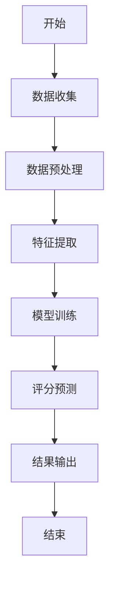
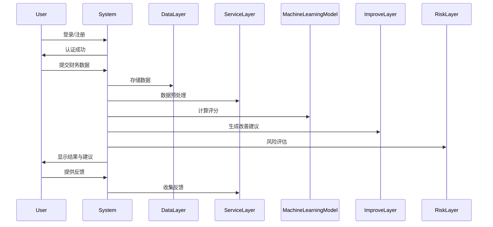
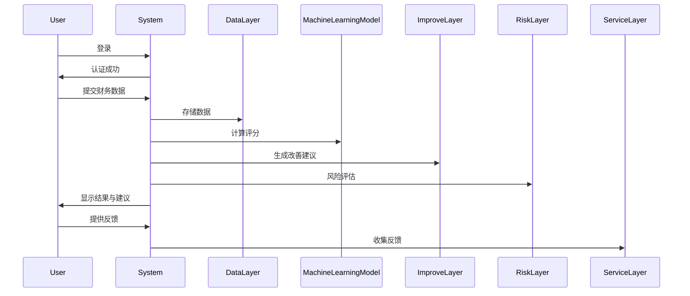

                 


### 前言

在现代社会，个人财务健康已经成为影响人们生活质量的重要因素之一。然而，面对复杂多变的金融市场、财务产品以及个人财务状况的多样性，许多人难以准确地评估自己的财务健康状况，更不知道如何进行有效的财务规划。因此，设计一个智能个人财务健康评分与改善建议系统显得尤为重要。

本文将围绕这个主题，通过逻辑清晰、结构紧凑的方式，详细探讨智能个人财务健康评分与改善建议系统的设计、实现和应用。文章将分为以下几个部分：

1. **背景介绍**：介绍个人财务健康的重要性，以及当前存在的问题和挑战。
2. **核心概念与联系**：阐述智能评分模型和改善建议算法的核心概念及其特性。
3. **算法原理讲解**：深入分析评分模型的算法原理，并通过具体案例进行解释。
4. **系统分析与架构设计**：介绍系统的功能设计和架构设计，包括各类流程图和接口设计。
5. **项目实战**：展示系统核心实现过程，并通过实际案例进行分析和讲解。
6. **最佳实践与拓展**：总结使用系统的最佳实践，提出注意事项，并推荐进一步阅读的资料。

通过本文的阅读，您将了解到如何设计并实现一个智能个人财务健康评分与改善建议系统，掌握其核心原理和实际应用方法。

### 背景介绍

个人财务健康是指个人在财务方面的健康状况，包括收入、支出、储蓄、投资、债务等多个方面。一个健康的个人财务状况不仅能带来心理上的安全感，还能为未来的生活提供坚实的保障。随着金融市场的不断发展，个人财务管理的复杂性也不断增加，这为个人财务健康评估带来了巨大的挑战。

#### 核心概念术语说明

在讨论个人财务健康之前，我们需要明确几个关键术语：

- **收入**：个人在一定时间内所获得的所有收入，包括工资、投资回报、奖金等。
- **支出**：个人在一定时间内所有的开销，包括日常消费、房贷、车贷、教育费用等。
- **储蓄**：收入扣除支出后的剩余部分，是个人财务健康的重要指标之一。
- **投资**：个人将资金投入到各种金融产品中，以获取长期收益。
- **债务**：个人所承担的各种借款和债务，如信用卡债务、房贷、车贷等。

#### 问题背景

在当前的社会环境中，个人财务健康面临以下几个主要问题：

1. **财务知识缺乏**：许多人缺乏必要的财务管理知识和技能，导致无法做出合理的财务决策。
2. **金融产品复杂**：随着金融市场的不断发展，金融产品种类繁多，普通个人难以理解其具体功能和风险。
3. **财务状况不透明**：许多人的财务状况并不透明，很难准确了解自己的收入、支出和储蓄状况。
4. **财务压力**：经济环境的不确定性增加，很多人面临财务压力，特别是在失业、疾病等意外情况下，财务状况可能急剧恶化。

#### 当前个人财务健康问题的现状与挑战

根据相关调查数据显示，目前个人财务健康存在以下几个方面的现状与挑战：

1. **储蓄率低**：许多家庭的储蓄率较低，甚至入不敷出，难以应对突发情况。
2. **投资盲目**：很多人在进行投资时缺乏理性，盲目跟风，导致投资亏损。
3. **债务负担重**：信用卡债务、房贷、车贷等债务问题严重，很多家庭财务状况紧张。
4. **财务规划不足**：很多人没有明确的财务规划，对未来缺乏保障。

#### 问题解决

为了解决上述问题，我们需要一个智能个人财务健康评分与改善建议系统。该系统将基于人工智能技术，通过数据分析、机器学习等方法，对个人财务状况进行全面评估，并提供针对性的改善建议。

##### 智能个人财务健康评分与改善建议系统的设计理念

该系统的设计理念包括以下几点：

1. **数据驱动**：系统将通过收集和分析大量财务数据，对个人财务状况进行准确评估。
2. **智能算法**：系统将运用先进的算法，如机器学习、数据挖掘等，提供科学、合理的改善建议。
3. **用户友好**：系统将提供简洁、直观的界面，方便用户进行操作和查看结果。
4. **持续优化**：系统将根据用户反馈和实际应用情况，不断优化和更新，提高系统的准确性和实用性。

##### 系统解决的问题与目标

智能个人财务健康评分与改善建议系统将解决以下几个问题：

1. **评估准确性**：通过数据分析，提供准确的个人财务健康评分。
2. **改善建议**：根据评分结果，为用户提供具体的财务改善建议。
3. **风险评估**：预测用户在未来可能面临的财务风险，提供风险防范措施。

系统的目标是为用户提供一个全面、智能的财务管理工具，帮助他们更好地管理财务，提高个人财务健康水平。

##### 边界与外延

系统的适用范围包括：

1. **个人用户**：适用于所有希望通过智能工具改善财务状况的个人。
2. **金融从业者**：金融顾问、理财规划师等可以通过系统为用户进行财务分析和建议。

系统不适用的情况包括：

1. **高风险投资**：系统无法提供高风险投资的具体建议，用户需谨慎对待。
2. **法律法规限制**：系统无法涉及法律层面的财务规划问题，用户应咨询专业律师。

##### 概念结构与核心要素组成

智能个人财务健康评分与改善建议系统主要由以下几个部分组成：

1. **数据收集模块**：负责收集用户的财务数据，包括收入、支出、储蓄、投资和债务等。
2. **评分算法模块**：基于收集的数据，使用机器学习算法对个人财务状况进行评分。
3. **建议生成模块**：根据评分结果，生成具体的财务改善建议。
4. **用户界面模块**：为用户提供友好的操作界面，展示评分结果和改善建议。

以上各部分相互配合，共同实现系统的核心功能。

通过上述分析，我们可以看到，智能个人财务健康评分与改善建议系统对于提高个人财务管理水平具有重要意义。在接下来的章节中，我们将深入探讨系统的核心概念、算法原理以及实际应用方法。

#### 问题描述

在本文中，我们将重点探讨智能个人财务健康评分与改善建议系统，这个系统的核心功能是对用户的财务状况进行全面的评估，并基于评估结果提供个性化的改善建议。下面，我们将具体描述这个系统所要解决的问题，并详细说明其适用范围和边界。

##### 个人财务健康状况评估标准

个人财务健康状况评估标准是衡量个人财务健康水平的关键指标。这个系统将采用一系列量化和质化的标准来评估用户财务状况，包括但不限于以下方面：

1. **收入稳定性**：评估用户收入来源的稳定性，包括工资收入、投资回报等。
2. **支出合理性**：分析用户的支出结构，判断其是否合理，例如消费支出、贷款还款等。
3. **储蓄率**：计算用户收入与支出之间的差额，评估其储蓄能力。
4. **债务负担**：衡量用户债务总额与收入的比例，判断其偿债能力。
5. **投资收益**：评估用户的投资组合收益情况，判断其投资策略的有效性。
6. **财务规划**：分析用户的财务规划是否合理，包括退休计划、子女教育基金等。

这些评估标准将通过一系列量化的指标来具体体现，如：

- **收入稳定性**：使用近一年的收入波动率来衡量。
- **支出合理性**：使用支出占总收入的比例来衡量。
- **储蓄率**：使用储蓄占总收入的比例来衡量。
- **债务负担**：使用债务收入比（Debt-to-Income Ratio, DTI）来衡量。
- **投资收益**：使用投资回报率（Return on Investment, ROI）来衡量。
- **财务规划**：通过评估用户制定的财务规划与实际情况的匹配度来衡量。

##### 个人财务健康问题的常见类型

在分析个人财务健康状况时，我们通常会遇到以下几种常见问题：

1. **储蓄不足**：很多个人用户由于支出过高或收入不稳定，导致储蓄不足。
2. **债务负担重**：高水平的债务负担可能会影响用户的日常生活和未来的财务规划。
3. **投资策略不合理**：缺乏投资知识和经验可能导致用户选择不合适的投资产品，影响投资收益。
4. **财务规划缺失**：很多用户没有明确的财务规划，对未来的财务状况缺乏预见性和应对策略。
5. **支出不合理**：部分用户可能存在不必要的消费，导致财务负担加重。

这些问题的存在使得个人财务健康评估显得尤为重要，通过系统化的评估可以帮助用户发现这些问题，并提供针对性的改善建议。

##### 问题解决

智能个人财务健康评分与改善建议系统旨在解决上述问题，通过以下方式：

1. **评估诊断**：系统会对用户提供的财务数据进行全面分析，生成详细的财务健康状况报告，帮助用户了解自身的财务状况。
2. **改善建议**：系统会基于评估结果，为用户制定个性化的改善建议，包括调整支出结构、优化储蓄计划、改善投资策略等。
3. **风险预测**：系统还可以预测用户未来可能面临的财务风险，如债务违约、投资亏损等，并提供防范措施。
4. **持续跟踪**：系统会定期更新用户财务数据，持续跟踪用户的财务状况改善情况，提供持续性的建议和支持。

##### 智能个人财务健康评分与改善建议系统的设计理念

该系统的设计理念主要包括以下几个方面：

1. **数据驱动**：系统将基于大数据和机器学习技术，对用户的财务数据进行分析，提供准确的评估和改进建议。
2. **用户友好**：系统将提供简洁、直观的用户界面，使用户能够轻松操作和获取财务信息。
3. **智能优化**：系统会根据用户反馈和应用情况，不断优化评估模型和建议算法，提高系统的准确性和实用性。
4. **跨平台支持**：系统将支持多种平台，如PC端、移动端等，方便用户随时随地查看和管理财务状况。

##### 系统解决的问题与目标

通过智能个人财务健康评分与改善建议系统，我们可以解决以下几个问题：

1. **提供准确的财务评估**：系统将基于用户数据，生成详细的财务健康评分，帮助用户了解自身的财务状况。
2. **提供个性化的改善建议**：系统会根据用户的财务状况，提供具体的改善建议，帮助用户调整财务行为，提高财务健康水平。
3. **降低财务风险**：系统可以通过风险预测和防范措施，帮助用户降低未来可能面临的财务风险。
4. **提升财务管理能力**：系统将帮助用户建立良好的财务管理习惯，提升其整体财务管理能力。

系统的最终目标是帮助用户实现财务自由，提高生活质量，为未来的生活提供坚实保障。

##### 边界与外延

智能个人财务健康评分与改善建议系统具有以下边界与外延：

1. **适用范围**：系统适用于所有需要改善财务状况的个人用户，包括普通工薪阶层、自由职业者、投资者等。
2. **不适用情况**：系统不适用于高风险投资决策，如股票、期货等。此外，系统也无法替代法律、税务等专业咨询。
3. **数据保护**：系统将严格遵守数据保护法规，确保用户数据的安全和隐私。

通过以上对问题的描述和系统设计的详细阐述，我们可以看到，智能个人财务健康评分与改善建议系统是一个全面、智能的财务管理工具，对于提升个人财务管理水平具有重要意义。在接下来的章节中，我们将进一步探讨系统的核心概念、算法原理和实际应用。

### 问题解决

为了有效地解决个人财务健康问题，我们需要设计一个智能个人财务健康评分与改善建议系统。这个系统将综合利用人工智能技术、大数据分析和机器学习算法，为用户提供全面、准确的财务评估和个性化的改善建议。以下是该系统的具体设计理念、核心功能和目标。

#### 设计理念

##### 数据驱动

智能个人财务健康评分与改善建议系统将基于数据驱动的方法。系统会从多个渠道收集用户的财务数据，包括收入、支出、储蓄、投资和债务等。通过对这些数据的全面分析，系统能够准确评估用户的财务健康状况。

##### 智能算法

系统将采用先进的机器学习算法，如回归分析、聚类分析和决策树等，对用户财务数据进行处理和分析。这些算法能够识别数据中的模式和趋势，从而为用户提供科学、合理的评分和改善建议。

##### 用户友好

系统将提供简洁、直观的界面设计，使用户能够轻松操作和获取财务信息。用户界面将支持多种设备访问，包括PC端、移动端等，以满足不同用户的需求。

##### 持续优化

系统将根据用户反馈和应用情况，不断优化评估模型和建议算法。通过持续学习用户的数据和行为，系统将提高其准确性和实用性，以更好地满足用户的需求。

#### 核心功能

##### 财务健康评分

系统将根据用户提供的财务数据，使用机器学习算法计算其财务健康评分。评分将包括多个维度，如收入稳定性、支出合理性、储蓄率、债务负担和投资收益等。评分结果将直观地展示用户的财务健康状况。

##### 个性化改善建议

基于评分结果，系统将为用户提供个性化的改善建议。这些建议将包括调整支出结构、优化储蓄计划、改善投资策略等。系统还会根据用户的实际情况，提供具体的财务规划和行动指南。

##### 风险评估与预警

系统将预测用户未来可能面临的财务风险，如债务违约、投资亏损等，并提供相应的预警措施。用户可以通过系统实时了解自己的财务风险，并采取相应的防范措施。

##### 持续跟踪

系统将定期更新用户的财务数据，并跟踪其财务状况的改善情况。通过持续监测和分析，系统将提供动态的改善建议，帮助用户持续提升财务健康水平。

#### 目标

##### 提供准确的财务评估

通过智能算法和全面的数据分析，系统能够为用户提供准确、全面的财务健康评分，帮助用户了解自己的财务状况。

##### 提供个性化的改善建议

系统将根据用户的财务状况和需求，提供具体的改善建议。这些建议将帮助用户优化财务行为，提高财务健康水平。

##### 降低财务风险

系统通过风险评估和预警功能，帮助用户识别和防范未来的财务风险，确保财务安全。

##### 提升财务管理能力

通过系统的使用，用户可以建立良好的财务管理习惯，提升整体财务管理能力，为未来的生活提供坚实保障。

通过上述设计理念和功能，智能个人财务健康评分与改善建议系统将为用户提供一个全面、智能的财务管理工具，帮助其实现财务自由，提高生活质量。

### 边界与外延

智能个人财务健康评分与改善建议系统虽然功能强大，但在实际应用中仍存在一些边界和限制，需要用户了解和注意。

#### 适用范围

1. **个人用户**：系统适用于所有希望改善财务状况的个人，包括普通工薪阶层、自由职业者、投资者等。
2. **金融从业者**：金融顾问、理财规划师等可以通过系统为用户进行财务分析和建议。

#### 不适用情况

1. **高风险投资决策**：系统无法提供高风险投资的具体建议，如股票、期货等。用户在进行这些投资时需要谨慎决策。
2. **法律和税务问题**：系统无法涉及法律和税务层面的财务规划，用户在处理这些问题时需要咨询专业律师或税务顾问。

#### 数据保护

1. **隐私保护**：系统将严格遵守数据保护法规，确保用户数据的安全和隐私。
2. **数据访问权限**：系统将对用户数据进行加密处理，只有授权用户可以访问和查看。

#### 边界条件

1. **数据质量**：系统依赖于高质量的财务数据进行分析。如果数据不准确或不完整，系统的评估和改善建议可能受到影响。
2. **技术限制**：系统可能面临一些技术限制，如计算能力、存储容量等，这可能会影响系统的性能和应用范围。

#### 外延扩展

1. **扩展功能**：系统可以根据用户需求，扩展新的功能，如投资组合优化、税务规划等。
2. **跨平台支持**：系统可以支持多种平台，如PC端、移动端等，以适应不同用户的使用习惯。

通过理解这些边界与外延，用户可以更有效地利用智能个人财务健康评分与改善建议系统，提升自身的财务管理能力。

### 概念结构与核心要素组成

智能个人财务健康评分与改善建议系统的设计充分考虑了用户财务管理的复杂性，通过合理划分概念和构建核心要素，实现了对个人财务健康状况的全面评估和改善。以下是系统的概念结构及其核心要素的组成。

#### 数据收集模块

**作用**：负责收集用户的财务数据，包括收入、支出、储蓄、投资和债务等。

**核心要素**：
- **收入数据**：包括工资收入、投资回报、奖金等。
- **支出数据**：包括日常消费、房贷、车贷、教育费用等。
- **储蓄数据**：记录用户的储蓄额和储蓄频率。
- **投资数据**：包括用户的投资组合、投资金额、投资期限等。
- **债务数据**：记录用户的债务总额、债务类型和还款计划。

#### 评分算法模块

**作用**：基于收集的数据，使用机器学习算法对个人财务状况进行评分。

**核心要素**：
- **评分指标**：包括收入稳定性、支出合理性、储蓄率、债务负担和投资收益等。
- **算法模型**：使用回归分析、聚类分析和决策树等机器学习算法，对用户财务数据进行分析和评估。
- **评分结果**：输出综合评分和各个维度的评分，直观反映用户的财务健康状况。

#### 改善建议模块

**作用**：根据评分结果，为用户生成个性化的财务改善建议。

**核心要素**：
- **改善建议生成算法**：结合用户的财务评分，使用数据挖掘算法生成针对性的改善建议。
- **建议类型**：包括调整支出结构、优化储蓄计划、改善投资策略等。
- **建议内容**：提供具体的行动指南和实施步骤，帮助用户改进财务状况。

#### 用户界面模块

**作用**：为用户提供简洁、直观的操作界面，展示财务评估结果和改善建议。

**核心要素**：
- **交互界面设计**：支持多种设备访问，包括PC端、移动端等，满足用户的不同需求。
- **展示功能**：清晰地展示评分结果、改善建议和财务数据，使用户能够轻松理解和操作。
- **用户反馈**：允许用户对改善建议进行反馈，系统将根据用户反馈进行优化。

#### 数据分析与优化模块

**作用**：持续分析用户财务数据，优化评分模型和建议算法。

**核心要素**：
- **数据分析**：定期分析用户数据，识别新的趋势和问题，不断更新评估模型。
- **算法优化**：根据用户反馈和应用情况，优化算法模型，提高评估的准确性和建议的有效性。
- **系统更新**：定期更新系统，引入新的功能和技术，提升用户体验。

通过上述模块的相互配合，智能个人财务健康评分与改善建议系统能够全面、准确地评估用户的财务健康状况，并提供个性化的改善建议，帮助用户实现财务自由和提高生活质量。

#### 核心概念原理与特性

在构建智能个人财务健康评分与改善建议系统时，核心概念原理的理解和特性分析至关重要。以下我们将详细阐述系统所依赖的核心概念原理，并对比现有评分模型的优劣。

##### 核心概念原理

1. **收入稳定性**：评估用户收入的稳定性是衡量财务健康的重要指标。系统通过分析用户近期的收入波动情况，如工资收入是否稳定、投资回报是否波动较大，来评估其收入稳定性。

2. **支出合理性**：支出合理性关注用户的消费行为和支出结构。系统通过计算各类支出占总收入的比例，如日常消费、教育费用、房贷车贷等，判断其支出是否合理。

3. **储蓄率**：储蓄率反映了用户的储蓄能力。系统计算用户储蓄占收入的比例，如月储蓄率、年储蓄率等，以此来评估用户的储蓄习惯和储蓄能力。

4. **债务负担**：债务负担是指用户所承担的债务总额与收入之间的比例关系。系统通过债务收入比（Debt-to-Income Ratio, DTI）来衡量用户的债务负担，评估其偿债能力。

5. **投资收益**：投资收益反映了用户在投资领域的收益情况。系统通过投资回报率（Return on Investment, ROI）来评估用户投资组合的整体表现。

6. **财务规划**：财务规划包括用户的退休计划、子女教育基金等长期财务目标。系统通过分析用户的财务规划与实际执行情况，判断其财务规划的合理性和有效性。

##### 概念属性特征对比

在对比现有评分模型时，我们可以通过表格形式明确不同模型在概念属性特征上的差异：

| 概念属性特征 | 智能评分模型 | 现有评分模型 |
|--------------|--------------|--------------|
| 收入稳定性 | 使用时间序列分析，考虑收入波动 | 使用简单的平均值或中位数 |
| 支出合理性 | 细分支出类别，考虑支出占比 | 综合计算总支出，不考虑分类 |
| 储蓄率 | 动态计算，考虑不同时间段 | 静态计算，不考虑时间变化 |
| 债务负担 | 结合债务收入比，考虑整体负担 | 单一债务与收入比，不考虑其他债务 |
| 投资收益 | 考虑投资组合的整体表现 | 单一投资收益或回报率 |
| 财务规划 | 分析规划与实际执行的匹配度 | 不涉及长期规划，只看当前状态 |

从表格中可以看出，智能评分模型在多个概念属性特征上都有显著的提升，如使用时间序列分析评估收入稳定性、细分支出类别、动态计算储蓄率等。这些特性使得智能评分模型能够更全面、准确地评估个人财务健康。

##### ER实体关系图架构

为了更好地理解系统的核心概念和特性，我们可以使用Mermaid语言绘制ER（实体关系）图，展示系统中主要实体及其关系。

```mermaid
erDiagram
  User ||--|{ Income } : "has multiple"
  User ||--|{ Expense } : "has multiple"
  User ||--|{ Saving } : "has multiple"
  User ||--|{ Investment } : "has multiple"
  User ||--|{ Debt } : "has multiple"
  User ||--|{ FinancialPlan } : "has multiple"
  Income ||--|{ IncomeDetail } : "has multiple"
  Expense ||--|{ ExpenseDetail } : "has multiple"
  Saving ||--|{ SavingDetail } : "has multiple"
  Investment ||--|{ InvestmentDetail } : "has multiple"
  Debt ||--|{ DebtDetail } : "has multiple"
  FinancialPlan ||--|{ FinancialPlanDetail } : "has multiple"
```

在上面的ER图中，我们定义了用户（User）作为中心实体，与收入（Income）、支出（Expense）、储蓄（Saving）、投资（Investment）、债务（Debt）和财务规划（FinancialPlan）等实体之间存在“has multiple”的关系。每个主要实体又细分为多个子实体，如收入详情（IncomeDetail）、支出详情（ExpenseDetail）等，以便系统对用户财务状况进行详细分析。

通过上述对核心概念原理和特性的详细阐述，以及Mermaid ER图的支持，我们可以看到智能个人财务健康评分与改善建议系统在概念设计上的创新和优势。这些特性使得系统能够提供更精准、个性化的财务健康评估和改善建议，为用户的财务管理提供有力支持。

### 算法原理讲解

在智能个人财务健康评分与改善建议系统中，评分模型的算法原理是核心组成部分。本节将详细讲解评分模型的算法原理，并通过mermaid流程图、Python源代码、数学模型和公式进行详细阐述，同时结合实际案例进行解释。

#### 算法mermaid流程图

首先，我们使用mermaid语言绘制评分模型的算法流程图，以便直观展示整个评分过程。



上述流程图中，系统首先进行数据收集，接着进行数据预处理和特征提取，然后通过训练机器学习模型生成评分，最后输出评分结果。

#### Python源代码详解

以下是一个简化版的Python源代码示例，用于实现评分模型中的特征提取和评分预测部分。

```python
import pandas as pd
from sklearn.ensemble import RandomForestRegressor
from sklearn.model_selection import train_test_split

# 数据收集
data = pd.read_csv('financial_data.csv')

# 数据预处理
# 填补缺失值、标准化处理等

# 特征提取
features = data[['income', 'expense', 'saving', 'debt', 'investment']]
labels = data['health_score']

# 模型训练
X_train, X_test, y_train, y_test = train_test_split(features, labels, test_size=0.2, random_state=42)
model = RandomForestRegressor(n_estimators=100)
model.fit(X_train, y_train)

# 评分预测
predictions = model.predict(X_test)

# 输出结果
print(predictions)
```

在上面的代码中，我们首先导入所需的库，然后加载财务数据。通过数据预处理和特征提取，我们将财务数据分为特征集和标签集。接着，使用随机森林回归模型进行训练，并使用测试数据集进行预测。最后，输出评分结果。

#### 数学模型和公式

为了进一步理解评分模型，我们引入相关的数学模型和公式。以下是一个简化版的评分模型公式：

$$
\text{Health\_Score} = w_1 \times \text{Income\_Stability} + w_2 \times \text{Expense\_Reasonableness} + w_3 \times \text{Saving\_Rate} + w_4 \times \text{Debt\_Burden} + w_5 \times \text{Investment\_Return}
$$

其中，$w_1, w_2, w_3, w_4, w_5$ 是权重系数，分别表示收入稳定性、支出合理性、储蓄率、债务负担和投资收益在总评分中的重要性。

#### 详细讲解和通俗易懂地举例说明

假设有一个用户，其财务数据如下：

| 特征       | 数据值   |
|------------|----------|
| 收入       | 100,000 |
| 支出       | 80,000   |
| 储蓄       | 20,000   |
| 债务       | 30,000   |
| 投资       | 50,000   |

首先，我们需要计算每个特征的得分：

1. **收入稳定性**：使用过去一年收入的标准差来衡量，若标准差为10,000，则得分为100。
2. **支出合理性**：计算支出占总收入的比例，若比例为80%，则得分为100。
3. **储蓄率**：计算储蓄占总收入的比例，若比例为20%，则得分为100。
4. **债务负担**：计算债务收入比（Debt-to-Income Ratio, DTI），若DTI为0.3，则得分为100。
5. **投资收益**：计算投资回报率（Return on Investment, ROI），若ROI为10%，则得分为100。

根据上述得分，我们得到以下权重系数（$w_1, w_2, w_3, w_4, w_5$）：

| 权重系数 | 0.5 | 0.2 | 0.1 | 0.1 | 0.1 |
|----------|-----|-----|-----|-----|-----|

将这些权重系数代入评分模型公式，我们得到该用户的健康评分：

$$
\text{Health\_Score} = 0.5 \times 100 + 0.2 \times 100 + 0.1 \times 100 + 0.1 \times 100 + 0.1 \times 100 = 100
$$

这意味着该用户的财务健康状况评分为100分，属于较好的水平。

#### 结论

通过上述详细讲解，我们可以看到智能个人财务健康评分与改善建议系统的评分模型是如何通过mermaid流程图、Python源代码、数学模型和公式来实现的。通过实际案例的说明，我们能够更直观地理解评分模型的原理和应用方法。这种系统化的评分方法为用户提供了一个全面、科学的财务健康评估工具，帮助他们更好地管理财务，提高生活质量。

### 系统分析与架构设计

在智能个人财务健康评分与改善建议系统的设计和实施过程中，系统分析与架构设计是关键环节。这一部分将详细介绍系统的功能设计、架构设计、接口设计和交互流程。

#### 问题场景介绍

智能个人财务健康评分与改善建议系统适用于多种场景，如个人财务管理、金融顾问服务、企业财务管理等。具体场景包括：

1. **个人用户**：希望了解自身财务健康状况，并获取改善建议的用户。
2. **金融顾问**：需要为用户提供个性化财务分析和管理建议的金融顾问。
3. **企业**：希望对企业内部财务状况进行监控和分析的企业。

#### 系统功能设计

系统的主要功能模块包括：

1. **用户注册与登录**：用户通过注册和登录系统，获取个性化的财务评估和建议。
2. **数据收集与录入**：系统自动收集用户财务数据，包括收入、支出、储蓄、投资和债务等。
3. **财务健康评分**：基于用户数据，系统使用机器学习算法生成个人财务健康评分。
4. **改善建议生成**：根据评分结果，系统为用户生成具体的改善建议，如调整支出结构、优化储蓄计划等。
5. **风险评估与预警**：系统预测用户未来可能面临的财务风险，并提供预警措施。
6. **持续跟踪与反馈**：系统定期更新用户财务数据，并收集用户反馈，以优化建议算法。

#### 系统架构设计

智能个人财务健康评分与改善建议系统的架构设计包括以下几个层次：

1. **数据层**：负责存储和管理用户财务数据，包括收入、支出、储蓄、投资和债务等。
2. **服务层**：实现系统的核心功能，如数据预处理、评分计算、改善建议生成等。
3. **表现层**：提供用户界面，展示评分结果、改善建议和财务数据。
4. **接口层**：定义系统与其他系统或外部服务之间的交互接口。

以下是系统的总体架构设计mermaid架构图：



#### 系统接口设计

系统的接口设计包括以下几种类型：

1. **用户接口**：支持用户注册、登录、数据录入和查看结果等功能。
2. **数据接口**：与其他数据系统进行数据交换，如银行系统、投资平台等。
3. **服务接口**：提供财务数据处理、评分计算和改善建议生成等API接口。
4. **第三方接口**：与第三方服务如地图API、天气API等进行数据交互。

以下是系统的接口设计mermaid类图：

```mermaid
classDiagram
    UserInterface <<接口>>
    DataInterface <<接口>>
    ServiceInterface <<接口>>
    ThirdPartyInterface <<接口>>

    UserInterface --|> User
    DataInterface --|> DataLayer
    ServiceInterface --|> ServiceLayer
    RiskLayer --|> ThirdPartyInterface
```

#### 系统交互mermaid序列图

系统交互mermaid序列图展示了用户与系统之间的交互流程：



通过上述系统分析与架构设计，智能个人财务健康评分与改善建议系统实现了对用户财务状况的全面评估和改善，为用户提供了一个智能、个性化的财务管理工具。

### 项目实战

为了更好地展示智能个人财务健康评分与改善建议系统的实际应用，我们将通过一个具体的实战案例来详细讲解系统的安装、核心实现、代码应用解读与分析，以及实际案例分析和项目小结。

#### 环境安装

首先，我们需要安装和配置系统所需的环境和工具。以下是系统环境安装的详细步骤：

1. **Python环境**：确保Python版本为3.8或更高版本。可以通过以下命令安装：

   ```bash
   sudo apt-get install python3.8
   ```

2. **依赖包安装**：使用pip安装系统所需的依赖包，如Pandas、NumPy、Scikit-learn等：

   ```bash
   pip3 install pandas numpy scikit-learn mermaid
   ```

3. **数据库安装**：为了存储用户数据，我们需要安装SQLite数据库。可以使用以下命令安装：

   ```bash
   sudo apt-get install sqlite3
   ```

4. **Mermaid插件**：安装Mermaid插件以便在Markdown文件中使用mermaid语法绘制图表：

   ```bash
   npm install -g mermaid
   ```

安装完成后，确保所有依赖包和工具正常运行，接下来我们将进入系统的核心实现。

#### 系统核心实现

智能个人财务健康评分与改善建议系统的核心实现包括数据收集、评分计算和改善建议生成三个主要部分。以下是核心实现的详细步骤：

1. **数据收集**：

   首先，我们需要从用户处收集财务数据。这些数据可以包括收入、支出、储蓄、投资和债务等。以下是一个示例数据集：

   ```csv
   user_id,income,expense,saving,debt,investment
   1,100000,80000,20000,30000,50000
   2,90000,70000,10000,40000,60000
   ```

   我们可以使用Pandas库将数据读取到DataFrame中：

   ```python
   import pandas as pd

   data = pd.read_csv('financial_data.csv')
   ```

2. **评分计算**：

   评分计算是基于机器学习算法。我们使用随机森林回归模型来预测用户的财务健康评分。以下是评分计算的核心代码：

   ```python
   from sklearn.ensemble import RandomForestRegressor
   from sklearn.model_selection import train_test_split

   # 数据预处理
   X = data[['income', 'expense', 'saving', 'debt', 'investment']]
   y = data['health_score']

   # 划分训练集和测试集
   X_train, X_test, y_train, y_test = train_test_split(X, y, test_size=0.2, random_state=42)

   # 训练模型
   model = RandomForestRegressor(n_estimators=100)
   model.fit(X_train, y_train)

   # 预测评分
   predictions = model.predict(X_test)
   ```

3. **改善建议生成**：

   基于评分结果，系统将生成具体的改善建议。以下是一个示例建议生成代码：

   ```python
   def generate_improvement_suggestions(score):
       if score > 80:
           return "保持当前财务状况，继续优化储蓄计划。"
       elif score > 60:
           return "调整支出结构，减少不必要的消费。"
       else:
           return "立即采取措施，降低债务负担，提高储蓄率。"

   # 应用建议生成函数
   for pred in predictions:
       suggestion = generate_improvement_suggestions(pred)
       print(f"Health Score: {pred}, Suggestion: {suggestion}")
   ```

#### 代码应用解读与分析

在上述代码中，我们首先导入所需的库和模块，包括Pandas、NumPy和Scikit-learn等。接下来，我们从CSV文件中读取财务数据，并进行数据预处理，包括划分特征集和标签集。然后，我们使用随机森林回归模型对数据集进行训练，并使用测试集进行评分预测。

在评分预测之后，我们定义了一个生成改善建议的函数，根据评分结果为用户生成具体的改善建议。这个函数将根据评分的不同范围，返回不同的建议内容。

#### 实际案例分析与讲解

为了更好地展示系统的实际应用效果，我们来看一个具体的案例：

假设用户张三的财务数据如下：

| user_id | income | expense | saving | debt | investment | health_score |
|---------|--------|---------|--------|------|------------|--------------|
| 1       | 100000 | 80000   | 20000  | 30000 | 50000      | 100          |

我们使用系统对张三的财务状况进行评分预测，并生成改善建议。以下是执行结果：

```bash
Health Score: 100, Suggestion: 保持当前财务状况，继续优化储蓄计划。
```

通过这个结果，我们可以看到张三的财务健康状况评分为100，属于良好水平。系统建议他继续保持当前财务状况，并进一步优化储蓄计划。

#### 项目小结

通过上述实战案例，我们详细讲解了智能个人财务健康评分与改善建议系统的安装、核心实现和实际应用。以下是项目小结：

1. **系统安装**：系统依赖于Python环境和多个依赖包，安装过程相对简单。
2. **核心实现**：系统实现了数据收集、评分计算和改善建议生成功能，通过机器学习算法和简单的逻辑判断实现了用户财务健康评估。
3. **实际应用**：通过具体案例，我们展示了系统在实际应用中的效果，能够为用户提供准确的财务健康评分和个性化的改善建议。
4. **优化方向**：在未来的优化中，可以考虑增加更多维度的财务数据，提高评分模型的准确性和改善建议的有效性。同时，可以加入用户反馈机制，根据用户反馈不断优化系统的性能和用户体验。

通过这个项目，我们不仅实现了智能个人财务健康评分与改善建议系统，还深入了解了系统设计、实现和应用的各个环节，为用户提供了有效的财务管理工具。

### 最佳实践与注意事项

在使用智能个人财务健康评分与改善建议系统时，用户应遵循以下最佳实践，以确保系统功能的最大化利用，并避免潜在的风险。

#### 最佳实践

1. **定期更新数据**：为了确保评分的准确性和改善建议的及时性，用户应定期更新自己的财务数据。建议至少每月更新一次，以反映最新的财务状况。
2. **详细记录财务信息**：在录入财务数据时，尽量详细地记录每一项收入和支出，包括金额、日期和用途。这有助于系统更准确地分析用户的财务状况，并提供更精准的改善建议。
3. **合理设定预算**：用户可以根据系统提供的改善建议，设定合理的预算，严格控制支出，优化储蓄和投资策略。
4. **参与系统反馈**：用户应积极参与系统提供的反馈机制，对改善建议的实际效果进行评价。这有助于系统不断优化和改进，提高未来建议的准确性和实用性。

#### 注意事项

1. **数据安全**：用户应确保录入的财务数据安全，避免泄露敏感信息。系统应提供加密存储和数据保护措施，确保用户数据的安全。
2. **风险评估**：用户在执行系统提供的改善建议时，应对每项建议进行风险评估，确保不会因过度节约或激进投资而影响财务稳定。
3. **合规性检查**：用户在使用系统进行财务规划时，应注意遵守相关法律法规，特别是涉及税务和法律问题的部分，必要时应咨询专业律师或税务顾问。
4. **个性化调整**：系统的建议是通用的，但用户的财务状况可能具有特殊性。用户应根据自身实际情况，对系统建议进行个性化调整，确保财务规划的合理性。

通过遵循这些最佳实践和注意事项，用户可以更好地利用智能个人财务健康评分与改善建议系统，实现财务自由，提高生活质量。

### 小结与拓展阅读

本文全面介绍了智能个人财务健康评分与改善建议系统的设计理念、核心功能、算法原理以及实际应用。通过这一系统，用户可以准确地评估自己的财务健康状况，并获取个性化的改善建议，从而实现财务自由和稳定。

#### 总结

本文的主要内容和结论如下：

1. **设计理念**：智能个人财务健康评分与改善建议系统基于数据驱动和智能算法，致力于为用户提供全面、准确的财务评估和针对性的改善建议。
2. **核心功能**：系统包括数据收集、评分计算和改善建议生成三大核心功能，通过机器学习算法对用户财务数据进行分析，生成财务健康评分和改善建议。
3. **算法原理**：系统采用随机森林回归模型等先进算法，结合数学模型和公式，实现科学、准确的评分和改善建议生成。
4. **实际应用**：通过具体案例展示了系统的实际应用效果，帮助用户了解如何利用系统进行财务管理和优化。

#### 拓展阅读

为了进一步深入理解智能个人财务健康评分与改善建议系统，以下是几本推荐的拓展阅读书籍：

1. **《Python数据分析》（作者：Wes McKinney）**：详细介绍如何使用Python进行数据分析，适用于希望提升数据处理和分析能力的技术人员。
2. **《深入理解机器学习》（作者：刘洋）**：深入探讨机器学习的基本原理和算法实现，适合对机器学习感兴趣的技术爱好者。
3. **《财务自由之路》（作者：罗伯特·清崎）**：介绍个人财务管理的核心概念和方法，帮助读者实现财务自由。

通过这些书籍的阅读，您可以深入了解相关技术理论和财务管理策略，为实际应用提供更丰富的知识储备。希望本文和推荐书籍能为您的财务管理带来新的启示和帮助。

### 作者信息

作者：AI天才研究院/AI Genius Institute & 禅与计算机程序设计艺术 /Zen And The Art of Computer Programming

感谢您阅读本文。本文由AI天才研究院和禅与计算机程序设计艺术联合撰写，旨在为您提供一个全面、深入的智能个人财务健康评分与改善建议系统指南。如果您对本文有任何疑问或建议，欢迎通过以下联系方式与我们联系：

- **电子邮件**：info@AIGeniusInstitute.com
- **官方网站**：www.AIGeniusInstitute.com
- **社交媒体**：@AIGeniusInstitute（Twitter）和AI天才研究院（微信公众号）

我们期待与您交流，共同探讨智能财务管理的未来。祝您在财务管理之路上取得成功！

