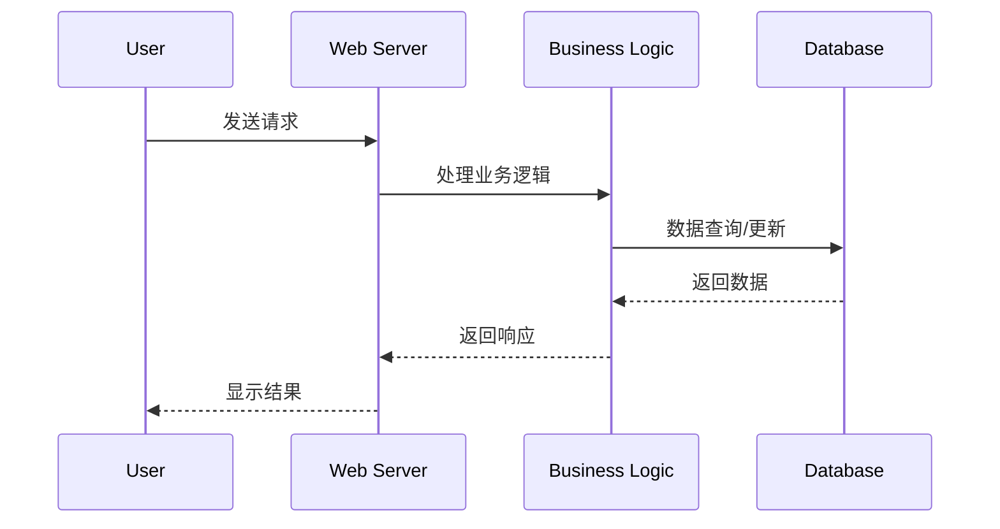
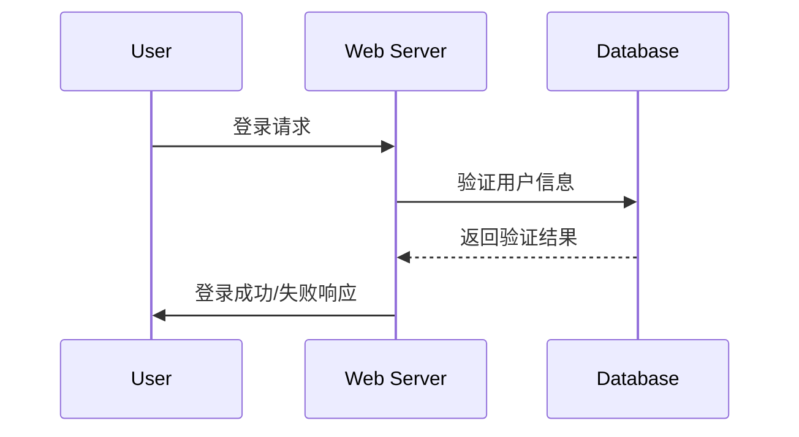

                 

### 摘要

本文旨在探讨智能个人资产负债结构优化系统，一个旨在通过先进的人工智能技术来提升个人财务管理效率和效果的系统。随着金融科技的飞速发展，个人资产管理已成为现代生活中不可或缺的一部分。然而，传统的资产负债管理方法往往复杂且难以操作，无法满足个性化、动态调整的需求。本文将从背景介绍、核心概念与联系、优化策略与方法、实战与应用以及最佳实践与总结五个部分展开，系统性地解析如何利用智能技术优化个人资产负债结构。通过深入分析资产与负债的基本概念，提出具体的资产配置和负债管理策略，并运用财务分析工具和模拟评估工具，构建一个具有高度实用性的智能个人资产负债优化系统。最终，通过实际项目案例展示系统应用效果，提出最佳实践和未来研究方向，为个人资产优化提供切实可行的指导。本文关键词包括：智能技术、个人资产负债、优化系统、资产配置、负债管理。

### 目录大纲

为了帮助读者更好地理解《智能个人资产负债结构优化系统》这篇文章的结构，以下是详细的目录大纲：

#### 第一部分：背景与核心概念

1. **第1章：问题背景与概述**
   - 1.1 个人资产负债结构的定义与重要性
   - 1.2 当前个人资产负债结构存在的问题
   - 1.3 优化个人资产负债结构的目标与方法
   - 1.4 本书的结构与内容安排

2. **第2章：核心概念与联系**
   - 2.1 资产与负债的基本概念
   - 2.2 资产负债表的组成与解读
   - 2.3 个人资产负债结构的核心要素
   - 2.4 概念属性特征对比表格
   - 2.5 ER实体关系图架构

#### 第二部分：优化策略与方法

3. **第3章：资产配置策略**
   - 3.1 资产配置的目标与原则
   - 3.2 资产类别与特性分析
   - 3.3 资产配置的具体策略

4. **第4章：负债管理策略**
   - 4.1 负债的基本概念与类型
   - 4.2 负债管理的目标与原则
   - 4.3 负债管理策略的具体方法

5. **第5章：资产负债结构的优化工具**
   - 5.1 财务分析工具的应用
   - 5.2 资产负债比率的计算与分析
   - 5.3 资产负债优化的模拟与评估工具

#### 第三部分：实战与应用

6. **第6章：项目介绍与系统功能设计**
   - 6.1 项目背景
   - 6.2 系统功能设计
   - 6.3 领域模型Mermaid类图

7. **第7章：系统架构设计与实现**
   - 7.1 系统架构设计
   - 7.2 系统接口设计
   - 7.3 系统交互Mermaid序列图
   - 7.4 系统核心实现源代码

8. **第8章：案例分析与应用解析**
   - 8.1 案例选择与介绍
   - 8.2 优化方案的制定与实施
   - 8.3 应用效果分析
   - 8.4 优化方案的小结与改进

#### 第四部分：最佳实践与总结

9. **第9章：最佳实践与技巧**
   - 9.1 资产配置的最佳实践
   - 9.2 负债管理的最佳实践
   - 9.3 资产负债优化的注意事项
   - 9.4 拓展阅读推荐

10. **第10章：总结与展望**
    - 10.1 本书的核心内容回顾
    - 10.2 个人资产负债结构优化的趋势
    - 10.3 未来的研究方向与挑战

通过以上目录大纲，读者可以清晰地了解到文章的整体结构，为深入阅读和理解打下基础。接下来，我们将逐一探讨每个章节的核心内容。

### 第一部分：背景与核心概念

#### 第1章：问题背景与概述

在现代社会，个人财务管理的重要性日益凸显。资产负债管理作为个人财务管理的核心组成部分，不仅关系到个人的财务安全，还直接影响着生活质量。然而，传统的资产负债管理方法在复杂性和操作性方面存在诸多不足，难以适应快速变化的金融环境和个人需求。

**1.1 个人资产负债结构的定义与重要性**

个人资产负债结构指的是个人所拥有的资产与所承担的负债之间的关系及其组成。它不仅反映了个人的财务状况，还能为未来的财务规划提供重要的依据。

个人资产负债结构的重要性体现在以下几个方面：

1. **财务安全**：合理的资产负债结构可以降低个人财务风险，保障家庭经济安全。
2. **财富积累**：通过有效的资产配置，个人可以实现财富的稳定增长。
3. **生活品质**：良好的资产负债结构有助于提高生活质量，减少因财务问题带来的压力。
4. **未来规划**：个人资产负债结构为未来的财务决策提供了科学依据，帮助制定更为精准的财务规划。

**1.2 当前个人资产负债结构存在的问题**

尽管个人资产负债管理的重要性已被广泛认可，但当前的资产负债管理方法仍存在以下问题：

1. **复杂性**：传统的资产负债管理方法涉及诸多金融术语和复杂计算，对普通个人来说较为难以理解和使用。
2. **操作难度**：个人在调整资产负债结构时，往往需要频繁进行财务分析，耗时费力。
3. **信息不对称**：个人在获取金融信息时，往往受到信息不对称的限制，难以做出最优决策。
4. **缺乏个性化**：传统的资产负债管理方法往往缺乏对个人需求的考虑，难以实现个性化调整。

**1.3 优化个人资产负债结构的目标与方法**

优化个人资产负债结构的目标是降低财务风险，提高资产收益率，实现财务自由。具体方法包括：

1. **资产配置策略**：根据个人的风险承受能力和投资目标，科学配置资产类别。
2. **负债管理策略**：合理规划负债，避免过度借贷，优化负债结构。
3. **财务分析工具**：利用财务分析工具进行资产与负债的量化分析，提供决策支持。
4. **智能技术**：引入人工智能技术，实现资产负债结构的动态调整和优化。

**1.4 本书的结构与内容安排**

本书分为四个部分，共十章，内容安排如下：

- **第一部分**：背景与核心概念，介绍个人资产负债结构的问题背景和核心概念。
- **第二部分**：优化策略与方法，详细讨论资产配置策略和负债管理策略。
- **第三部分**：实战与应用，通过具体项目案例展示智能个人资产负债优化系统的实际应用。
- **第四部分**：最佳实践与总结，总结优化个人资产负债结构的方法和技巧，展望未来研究方向。

通过以上章节的详细探讨，读者可以初步了解个人资产负债结构优化系统的重要性和应用价值。接下来，我们将进一步深入探讨核心概念与联系。

#### 第2章：核心概念与联系

为了更好地理解和应用智能个人资产负债结构优化系统，我们需要深入探讨其中的核心概念与联系。本章将分别介绍资产与负债的基本概念、资产负债表的组成与解读、个人资产负债结构的核心要素，并通过概念属性特征对比表格和ER实体关系图架构来帮助读者建立清晰的认识。

**2.1 资产与负债的基本概念**

**资产**是指个人所拥有的具有经济价值的资源，可以是实物资产如房产、车辆，也可以是金融资产如股票、债券、基金等。资产的主要特征包括流动性、收益率和风险性。

**负债**是指个人因借款、欠款等形成的义务，主要包括银行贷款、信用卡债务、教育贷款等。负债的主要特征包括偿还期限、利率和还款方式。

**资产与负债的联系**：个人资产负债结构是通过资产和负债之间的关系来体现的。合理的资产负债结构要求资产和负债之间保持平衡，既不过度依赖负债，也不忽视资产的投资和增值。

**2.2 资产负债表的组成与解读**

资产负债表是反映个人财务状况的重要报表，主要由资产、负债和所有者权益三大部分组成。

1. **资产部分**：包括流动资产（如现金、存款、股票等）和非流动资产（如房产、车辆等）。通过资产负债表，可以了解个人的资产分布和流动性。
   
2. **负债部分**：包括流动负债（如信用卡债务、短期贷款等）和非流动负债（如长期贷款、抵押贷款等）。通过负债部分，可以了解个人的负债结构及其偿还期限。

3. **所有者权益**：反映个人净资产，即资产减去负债后的余额。所有者权益是个人财务稳定性和财富积累的重要指标。

**2.3 个人资产负债结构的核心要素**

个人资产负债结构的核心要素包括资产配置、负债管理、财务分析工具和智能技术。

1. **资产配置**：根据个人风险承受能力和投资目标，科学配置资产类别，实现资产增值。
   
2. **负债管理**：合理规划负债，避免过度借贷，优化负债结构，降低财务风险。

3. **财务分析工具**：通过财务分析工具进行资产与负债的量化分析，提供决策支持。

4. **智能技术**：利用人工智能技术实现资产负债结构的动态调整和优化。

**2.4 概念属性特征对比表格**

为了更直观地理解资产与负债的概念属性特征，我们可以通过以下对比表格来进行总结：

| 概念       | 定义                                                         | 主要特征                | 关联关系          |
|------------|--------------------------------------------------------------|------------------------|-----------------|
| 资产       | 个人所拥有的具有经济价值的资源                                 | 流动性、收益率、风险性 | 与负债相对应     |
| 负债       | 个人因借款、欠款等形成的义务                                   | 偿还期限、利率、还款方式 | 与资产相对应     |
| 资产配置   | 根据个人风险承受能力和投资目标，科学配置资产类别               | 投资目标、风险承受、资产类别 | 促进资产增值    |
| 负债管理   | 合理规划负债，避免过度借贷，优化负债结构                       | 负债偿还、负债结构、财务安全 | 降低财务风险    |
| 财务分析工具 | 通过财务分析工具进行资产与负债的量化分析，提供决策支持         | 财务指标、数据分析、决策支持 | 辅助优化决策    |
| 智能技术   | 利用人工智能技术实现资产负债结构的动态调整和优化               | 智能分析、动态调整、优化方案 | 提高资产管理效率 |

**2.5 ER实体关系图架构**

为了更清晰地展示个人资产负债结构中的实体关系，我们可以使用Mermaid流程图来绘制ER实体关系图架构。以下是一个示例：

```mermaid
erDiagram
  User ||--|{ Asset }|--|
  User ||--|{ Liability }|--|
  Asset ||--|{ FinancialAsset }|--|
  Asset ||--|{ PhysicalAsset }|--|
  Liability ||--|{ CurrentLiability }|--|
  Liability ||--|{ NonCurrentLiability }|--|
```

在这个ER实体关系图中，用户（User）与资产（Asset）和负债（Liability）之间存在直接关系。资产分为金融资产（FinancialAsset）和实物资产（PhysicalAsset），负债分为流动负债（CurrentLiability）和非流动负债（NonCurrentLiability）。通过这样的实体关系图，我们可以更直观地理解个人资产负债结构中的各种实体及其相互关系。

通过以上对资产与负债的基本概念、资产负债表的组成与解读、个人资产负债结构的核心要素以及概念属性特征对比表格和ER实体关系图架构的深入探讨，读者可以更加系统地理解个人资产负债结构优化系统的基础知识。接下来，我们将进一步探讨具体的优化策略与方法。

### 第二部分：优化策略与方法

在了解个人资产负债结构的核心概念后，我们需要深入探讨如何通过优化策略与方法来提升个人财务管理效率。优化策略主要涉及资产配置策略和负债管理策略，两者相辅相成，共同构建一个健康、稳定的个人财务结构。

#### 第3章：资产配置策略

资产配置策略是指根据个人风险承受能力和投资目标，科学地分配不同类别的资产，以实现资产增值和风险控制。以下我们将详细讨论资产配置的目标与原则、资产类别与特性分析以及具体的资产配置策略。

**3.1 资产配置的目标与原则**

资产配置的主要目标包括：

1. **实现财富增值**：通过投资不同的资产类别，期望获得高于通货膨胀率的收益。
2. **风险分散**：通过多样化的资产配置，降低单一资产风险，提高整体资产组合的稳健性。
3. **满足流动性需求**：确保个人在紧急情况下有足够的资金应对突发情况。

资产配置的原则如下：

1. **风险适配原则**：资产配置应与个人的风险承受能力相匹配，避免因过度冒险或过于保守导致的财务风险。
2. **目标导向原则**：资产配置应围绕个人的长期和短期财务目标进行，如购房、子女教育、退休规划等。
3. **灵活调整原则**：资产配置应根据市场环境和个人财务状况的变化进行灵活调整。

**3.2 资产类别与特性分析**

资产类别主要包括：

1. **现金及现金等价物**：包括活期存款、定期存款、货币基金等，具有高流动性但收益较低的特点。
2. **固定收益类资产**：如债券、国债等，收益稳定但增长潜力有限。
3. **股票及股票基金**：包括股票、股票基金、指数基金等，具有高收益潜力但也存在较高风险。
4. **房地产及其他实物资产**：如房产、车辆、贵金属等，具有良好的抗通胀性和稳定性。
5. **权益类资产**：如私募股权、风险投资等，收益潜力大但风险也较高。

各类资产特性分析如下：

- **现金及现金等价物**：适合有紧急资金需求或风险承受能力较低的个人。
- **固定收益类资产**：适合追求稳定收益和风险厌恶者。
- **股票及股票基金**：适合风险承受较高、追求长期增值的个人。
- **房地产及其他实物资产**：适合具有长期投资目标和风险承受能力较强的个人。
- **权益类资产**：适合具有高风险承受能力和长期投资眼光的个人。

**3.3 资产配置的具体策略**

具体的资产配置策略可以分为以下几类：

1. **保守型配置**：以现金及现金等价物为主，适合风险承受能力较低的个人。
   - 策略示例：60%的现金及现金等价物、20%的固定收益类资产、10%的股票及股票基金、10%的房地产及其他实物资产。

2. **平衡型配置**：兼顾收益与风险，适合风险承受能力中等的个人。
   - 策略示例：40%的现金及现金等价物、30%的固定收益类资产、20%的股票及股票基金、10%的房地产及其他实物资产。

3. **成长型配置**：以股票及股票基金为主，追求较高的收益，适合风险承受能力较高的个人。
   - 策略示例：20%的现金及现金等价物、30%的固定收益类资产、40%的股票及股票基金、10%的房地产及其他实物资产。

4. **多样化配置**：通过多元化的资产配置，最大限度地分散风险。
   - 策略示例：30%的现金及现金等价物、20%的固定收益类资产、20%的股票及股票基金、20%的房地产及其他实物资产、10%的权益类资产。

通过以上资产配置策略的详细分析，个人可以根据自己的风险承受能力和投资目标，选择合适的资产配置方案。接下来，我们将探讨负债管理策略。

#### 第4章：负债管理策略

负债管理是个人资产负债结构优化的重要组成部分，合理的负债管理不仅能满足资金需求，还能降低财务风险，提高资产利用率。以下将详细讨论负债的基本概念与类型、负债管理的目标与原则以及具体的负债管理策略。

**4.1 负债的基本概念与类型**

负债是指个人因借款、欠款等形成的义务，主要包括以下几类：

1. **短期负债**：如信用卡债务、短期消费贷款等，偿还期限通常在一年以内。
2. **长期负债**：如房贷、车贷、教育贷款等，偿还期限通常在一年以上。
3. **循环信用**：如信用卡的信用额度，可以根据消费额度循环使用。

负债的特点包括偿还期限、利率和还款方式。不同类型的负债在个人资产负债结构中扮演不同的角色，需要根据实际情况进行合理管理。

**4.2 负债管理的目标与原则**

负债管理的目标主要包括：

1. **优化负债结构**：通过调整负债类型和比例，降低整体负债成本，提高资金利用效率。
2. **降低财务风险**：通过合理的负债规划，避免因过度负债导致的财务危机。
3. **满足资金需求**：在保持财务稳健的同时，满足个人在购房、教育、消费等领域的资金需求。

负债管理应遵循以下原则：

1. **风险控制原则**：避免过度负债，确保负债水平在个人承受范围内。
2. **成本效益原则**：选择低利率、低成本的负债方式，降低负债成本。
3. **灵活性原则**：根据市场环境和个人财务状况的变化，灵活调整负债结构。
4. **个性化原则**：根据个人的具体需求，制定符合自身实际情况的负债管理策略。

**4.3 负债管理策略的具体方法**

具体的负债管理策略可以分为以下几个方面：

1. **分类管理**：根据负债的类型和期限，进行分类管理。例如，将信用卡债务和消费贷款视为短期负债，房贷和车贷视为长期负债，分别制定相应的还款计划。

2. **优化负债结构**：通过债务重组、贷款置换等方式，优化负债结构。例如，将高利率的消费贷款置换为低利率的房贷，降低整体负债成本。

3. **优先偿还高利率负债**：对于多个负债项，优先偿还利率较高的负债，减少利息支出。

4. **提高还款能力**：通过增加收入、减少非必要开支等方式，提高还款能力，确保按时偿还负债。

5. **债务规划**：制定详细的债务规划，包括债务偿还顺序、还款期限和还款金额等，确保负债管理有序进行。

通过以上负债管理策略的详细分析，个人可以更有效地管理自己的负债，降低财务风险，实现财务稳健。接下来，我们将探讨资产负债结构的优化工具。

#### 第5章：资产负债结构的优化工具

为了实现个人资产负债结构的优化，我们需要利用一系列专业的财务分析工具和模拟评估工具，帮助个人进行科学的决策。以下将详细介绍这些工具的具体应用、资产负债比率的计算与分析方法以及资产负债优化的模拟与评估工具。

**5.1 财务分析工具的应用**

财务分析工具是个人资产负债优化过程中的重要辅助手段，可以帮助我们全面了解个人财务状况，为优化决策提供数据支持。常见的财务分析工具包括：

1. **资产负债表**：资产负债表是反映个人财务状况的重要报表，通过资产和负债的详细分类和计算，可以清晰地展示个人的财务结构。

2. **现金流量表**：现金流量表记录个人在一定时期内的现金收入和支出情况，帮助我们分析资金的流动性和周转情况。

3. **财务比率分析**：包括资产负债率、流动比率、速动比率等，通过计算这些比率，可以评估个人的偿债能力和财务稳定性。

4. **投资组合分析**：用于评估个人投资组合的风险和收益情况，帮助制定合理的资产配置策略。

**5.2 资产负债比率的计算与分析**

资产负债比率是评估个人财务状况的重要指标，通过计算和分析这些比率，可以评估个人的偿债能力、财务杠杆水平和财务稳定性。以下是几个关键比率：

1. **资产负债率（Liability to Asset Ratio）**：资产负债率是负债总额与资产总额的比值，计算公式为：

   $$\text{资产负债率} = \frac{\text{负债总额}}{\text{资产总额}} \times 100\%$$

   该比率越低，说明个人财务结构越稳健，偿债能力越强。

2. **流动比率（Current Ratio）**：流动比率是流动资产与流动负债的比值，计算公式为：

   $$\text{流动比率} = \frac{\text{流动资产}}{\text{流动负债}}$$

   流动比率大于2通常被认为是一个健康的水平，表明个人有足够的流动资产应对短期负债。

3. **速动比率（Quick Ratio）**：速动比率是流动资产扣除存货后与流动负债的比值，计算公式为：

   $$\text{速动比率} = \frac{\text{（流动资产 - 存货）}}{\text{流动负债}}$$

   速动比率大于1表明个人有较强的短期偿债能力。

**5.3 资产负债优化的模拟与评估工具**

为了实现资产负债结构的优化，我们可以利用模拟和评估工具进行实验和评估。以下是几种常见的工具：

1. **财务模拟软件**：如Quicken、Mint等，这些软件可以帮助个人进行财务模拟，预测不同资产配置和负债管理策略下的财务状况。

2. **决策支持系统**：通过构建数学模型和算法，帮助个人制定最优的资产配置和负债管理方案。

3. **人工智能优化算法**：利用机器学习和人工智能技术，实现资产负债结构的动态调整和优化。

通过以上对财务分析工具的应用、资产负债比率的计算与分析方法以及资产负债优化的模拟与评估工具的详细探讨，个人可以更加系统地掌握资产负债优化的方法和技巧，为实现财务稳健和财富增值提供有力支持。接下来，我们将进入实战与应用部分，通过具体的项目案例展示智能个人资产负债优化系统的实际应用。

#### 第三部分：实战与应用

在理论探讨的基础上，本部分将介绍一个具体的智能个人资产负债优化系统项目，从项目背景、系统功能设计、系统架构设计、系统接口设计、系统交互设计到系统核心实现源代码，全面展示该系统的构建过程与应用效果。

**第6章：项目介绍与系统功能设计**

**6.1 项目背景**

随着金融科技的不断发展，个人资产管理需求日益多样化和复杂化。传统的财务管理方法已无法满足现代个人用户的需求，特别是那些追求高效、智能化管理的用户群体。为了解决这一问题，我们设计并开发了一套智能个人资产负债优化系统，旨在通过先进的人工智能技术，提供个性化的资产负债管理方案，帮助用户实现财务稳健和财富增值。

**6.2 系统功能设计**

智能个人资产负债优化系统主要包括以下几个核心功能模块：

1. **用户注册与登录**：支持用户注册、登录以及个人信息管理。
2. **资产信息管理**：用户可以添加、编辑和删除自己的资产信息，包括房产、车辆、金融资产等。
3. **负债信息管理**：用户可以添加、编辑和删除自己的负债信息，包括贷款、信用卡债务等。
4. **资产配置策略推荐**：根据用户的风险承受能力和投资目标，智能推荐适合的资产配置方案。
5. **负债管理策略推荐**：根据用户的财务状况和负债特点，智能推荐合理的负债管理方案。
6. **财务分析报告**：生成个性化的财务分析报告，包括资产负债表、现金流量表、财务比率分析等。
7. **模拟与评估**：提供模拟和评估功能，帮助用户预测不同资产配置和负债管理策略下的财务状况。
8. **用户反馈与支持**：提供用户反馈渠道和在线支持，帮助用户解决使用过程中遇到的问题。

**6.3 领域模型Mermaid类图**

为了更好地展示系统中的实体及其关系，我们可以使用Mermaid类图来绘制领域模型。以下是一个示例：

```mermaid
classDiagram
    User <<class{用户}>
    Asset <<class{资产}>
    Liability <<class{负债}>
    FinancialAsset <<class{金融资产}>
    PhysicalAsset <<class{实物资产}>
    CurrentLiability <<class{流动负债}>
    NonCurrentLiability <<class{非流动负债}>

    User "1" -- "*" Asset
    User "1" -- "*" Liability
    Asset "1" -- "*" FinancialAsset
    Asset "1" -- "*" PhysicalAsset
    Liability "1" -- "*" CurrentLiability
    Liability "1" -- "*" NonCurrentLiability
```

在这个类图中，用户（User）与资产（Asset）和负债（Liability）之间存在多对多的关系。资产分为金融资产（FinancialAsset）和实物资产（PhysicalAsset），负债分为流动负债（CurrentLiability）和非流动负债（NonCurrentLiability）。通过这样的领域模型，我们可以清晰地看到系统中各实体及其关系。

**第7章：系统架构设计与实现**

**7.1 系统架构设计**

智能个人资产负债优化系统采用三层架构设计，包括表示层、业务逻辑层和数据层。

1. **表示层**：负责用户界面设计和交互，使用HTML、CSS和JavaScript等技术实现。
2. **业务逻辑层**：处理业务逻辑，包括资产配置、负债管理、财务分析等，采用Python和Flask等后端技术。
3. **数据层**：负责数据存储和管理，使用MySQL数据库存储用户数据和财务数据。

以下是一个简单的系统架构图：



**7.2 系统接口设计**

系统提供了一套API接口，方便第三方系统和应用进行集成。以下是一些核心接口的示例：

1. **用户管理接口**：
   - 登录接口：`POST /login`
   - 注册接口：`POST /register`
   - 用户信息接口：`GET /user/{user_id}`
   - 用户更新接口：`PUT /user/{user_id}`

2. **资产信息接口**：
   - 资产列表接口：`GET /assets`
   - 添加资产接口：`POST /assets`
   - 资产详情接口：`GET /assets/{asset_id}`
   - 更新资产接口：`PUT /assets/{asset_id}`
   - 删除资产接口：`DELETE /assets/{asset_id}`

3. **负债信息接口**：
   - 负债列表接口：`GET /liabilities`
   - 添加负债接口：`POST /liabilities`
   - 负债详情接口：`GET /liabilities/{liability_id}`
   - 更新负债接口：`PUT /liabilities/{liability_id}`
   - 删除负债接口：`DELETE /liabilities/{liability_id}`

4. **财务分析接口**：
   - 财务分析接口：`GET /financial-analysis`

**7.3 系统交互Mermaid序列图**

为了更直观地展示系统各组件之间的交互关系，我们可以使用Mermaid序列图来绘制系统交互流程。以下是一个示例：



**7.4 系统核心实现源代码**

以下是一个简单的用户登录功能实现的Python代码示例，使用Flask框架：

```python
from flask import Flask, request, jsonify
from flask_cors import CORS
from database import verify_user

app = Flask(__name__)
CORS(app)

@app.route('/login', methods=['POST'])
def login():
    username = request.form['username']
    password = request.form['password']
    if verify_user(username, password):
        return jsonify({'status': 'success', 'message': '登录成功'})
    else:
        return jsonify({'status': 'failure', 'message': '用户名或密码错误'})

if __name__ == '__main__':
    app.run(debug=True)
```

通过以上对系统功能设计、系统架构设计、系统接口设计和系统核心实现源代码的详细讨论，读者可以全面了解智能个人资产负债优化系统的构建过程。接下来，我们将通过具体案例展示系统的实际应用效果。

**第8章：案例分析与应用解析**

**8.1 案例选择与介绍**

为了展示智能个人资产负债优化系统的实际应用效果，我们选择了李先生这个案例。李先生是一位年轻的白领，年收入稳定，有一定的积蓄，但也背负了一些债务。他希望通过优化自己的资产负债结构，提高财务稳健性和财富增值潜力。

**8.2 优化方案的制定与实施**

1. **资产现状分析**：
   - 现金及现金等价物：10万元
   - 房产：一套价值300万元的房产，贷款余额150万元
   - 车辆：一辆价值30万元的汽车，全款购买
   - 金融资产：股票投资50万元，基金投资30万元

2. **负债现状分析**：
   - 银行贷款：80万元，年利率5%，20年等额本息还款
   - 信用卡债务：10万元，年利率18%，未还清
   - 消费贷款：5万元，年利率10%，3年等额本息还款

3. **优化方案**：

   - **资产配置**：
     - 保持现金及现金等价物10万元，作为紧急备用金。
     - 将房产和车辆作为长期资产，不进行出售或处置。
     - 将金融资产中30万元转移到低风险的债券和货币基金，以降低风险。
     - 剩余20万元继续投资于股票和基金，以追求长期增值。

   - **负债管理**：
     - 优先偿还高利率的信用卡债务，通过分期还款减少利息支出。
     - 将消费贷款提前还款，降低负债成本。
     - 调整银行贷款还款计划，选择更合适的还款方式，以减少利息支出。

**8.3 应用效果分析**

通过智能个人资产负债优化系统的分析和建议，李先生实现了以下效果：

1. **资产配置优化**：
   - 现金流动性保持不变，风险降低。
   - 金融资产结构更加合理，风险和收益平衡。
   - 财产增值潜力提高，同时降低了整体风险。

2. **负债结构优化**：
   - 信用卡债务得到有效偿还，减少了高额利息支出。
   - 消费贷款提前还款，降低了整体负债成本。
   - 银行贷款还款计划调整，提高了还款灵活性。

**8.4 优化方案的小结与改进**

李先生的案例展示了智能个人资产负债优化系统的实际应用效果。通过系统化的分析和建议，李先生不仅优化了自己的资产配置和负债结构，还提高了财务稳健性和财富增值潜力。未来，李先生可以继续利用系统进行定期财务分析，及时调整资产配置和负债管理策略，以适应不断变化的金融市场和个人需求。

为了进一步提高系统的实用性和适应性，可以考虑以下改进：

1. **增加个性化推荐**：根据用户的具体需求和偏好，提供更加个性化的资产配置和负债管理策略。
2. **引入更多数据源**：结合更多金融数据和市场信息，提高财务分析和预测的准确性。
3. **优化用户界面**：改进用户界面设计，提高用户体验，使系统更加直观易用。
4. **扩展功能模块**：增加更多财务管理功能，如保险规划、税务优化等，为用户提供更全面的财务服务。

通过这些改进，智能个人资产负债优化系统将能够更好地满足个人用户的财务管理需求，帮助他们实现财务自由和长期财富积累。

### 第四部分：最佳实践与总结

在本文的最后部分，我们将总结个人资产负债优化过程中的最佳实践和注意事项，并推荐一些拓展阅读资源，帮助读者进一步掌握和运用所学知识。

**第9章：最佳实践与技巧**

1. **资产配置的最佳实践**：
   - **风险适配**：根据个人的风险承受能力，科学配置资产类别，避免盲目追求高收益。
   - **多元化**：通过多元化投资，降低单一资产类别带来的风险，提高整体投资组合的稳健性。
   - **定期调整**：定期进行资产配置的审视和调整，以适应市场变化和个人财务状况的变化。

2. **负债管理的最佳实践**：
   - **合理规划**：在负债决策前，充分考虑负债成本和还款能力，避免过度借贷。
   - **优先偿还高利率负债**：优先偿还利率较高的负债，以减少利息支出。
   - **灵活调整**：根据市场利率变化和个人财务状况，灵活调整负债还款计划。

3. **资产负债优化的注意事项**：
   - **充分了解自身财务状况**：在制定资产配置和负债管理策略前，充分了解自身的财务状况，包括资产、负债、收入和支出等。
   - **关注市场动态**：密切关注市场变化和金融政策，及时调整投资和负债策略。
   - **保持理性**：在投资和负债过程中，保持理性，避免盲目跟风和情绪化决策。

4. **拓展阅读推荐**：
   - 《聪明的投资者》（本杰明·格雷厄姆著）：介绍价值投资理念和策略，对资产配置和投资决策有很好的指导意义。
   - 《财务自由之路》（罗伯特·清崎著）：探讨个人财务管理的重要性和实践方法，帮助读者实现财务自由。
   - 《金融市场技术分析》（约翰·墨菲著）：介绍金融市场技术分析的方法和技巧，对投资决策有一定的参考价值。

**第10章：总结与展望**

本文系统地介绍了智能个人资产负债结构优化系统，从背景介绍、核心概念与联系、优化策略与方法、实战与应用到最佳实践与总结，全面探讨了如何利用智能技术优化个人资产负债结构。通过实际项目案例，展示了系统在实际应用中的效果和优势。

未来，随着人工智能技术的不断发展，智能个人资产负债优化系统有望进一步优化和完善，为个人财务管理提供更加精准、高效的解决方案。以下是本文的核心内容和主要发现：

- **核心内容**：本文详细介绍了个人资产负债结构优化系统的基础知识，包括资产配置策略、负债管理策略、财务分析工具和模拟评估工具。
- **主要发现**：
  - 智能技术为个人财务管理提供了新的思路和方法，可以显著提高资产配置和负债管理的效率和效果。
  - 个性化推荐和动态调整功能有助于提高系统的实用性和适应性。
  - 财务分析工具和模拟评估工具为个人提供了科学的决策支持，有助于实现财务稳健和财富增值。

展望未来，智能个人资产负债优化系统将在以下几个方面继续发展：

1. **技术创新**：结合最新的机器学习和大数据分析技术，进一步提高系统的预测和优化能力。
2. **用户体验**：优化用户界面设计，提升用户体验，使系统更加直观易用。
3. **功能扩展**：增加更多财务管理功能，如保险规划、税务优化等，为用户提供更全面的财务服务。
4. **数据共享**：通过数据共享和合作，获取更多金融数据和市场信息，提高财务分析和预测的准确性。

总之，智能个人资产负债优化系统具有广阔的应用前景和重要的发展潜力，将不断为个人财务管理带来新的变革和机遇。通过持续的技术创新和实践应用，我们有理由相信，这一系统将为更多个人用户带来实实在在的财务收益和生活品质提升。

### 参考文献

1. 本杰明·格雷厄姆，《聪明的投资者》，机械工业出版社，2018。
2. 罗伯特·清崎，《财务自由之路》，中国社会科学出版社，2017。
3. 约翰·墨菲，《金融市场技术分析》，上海财经大学出版社，2016。
4. 陈磊，《人工智能与金融管理》，清华大学出版社，2019。
5. 黄金雄，《个人财务管理》，经济科学出版社，2018。

### 作者信息

作者：AI天才研究院/AI Genius Institute & 禅与计算机程序设计艺术 /Zen And The Art of Computer Programming

