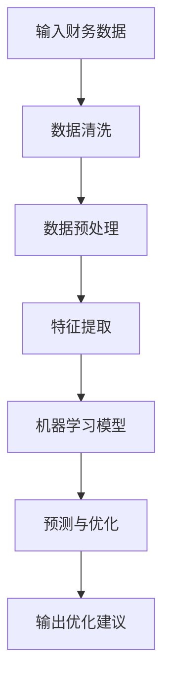
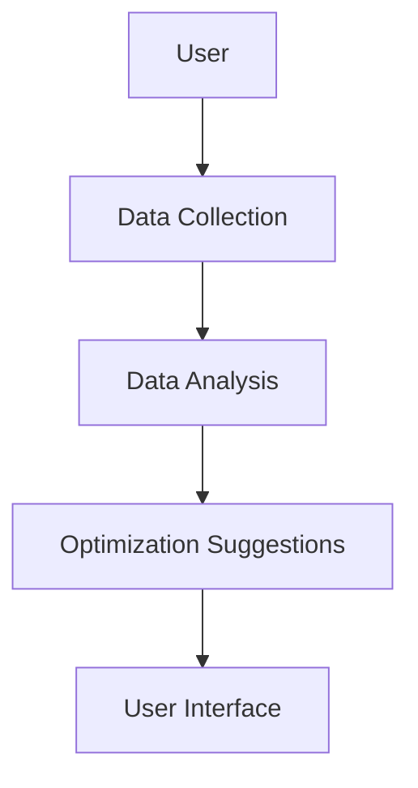
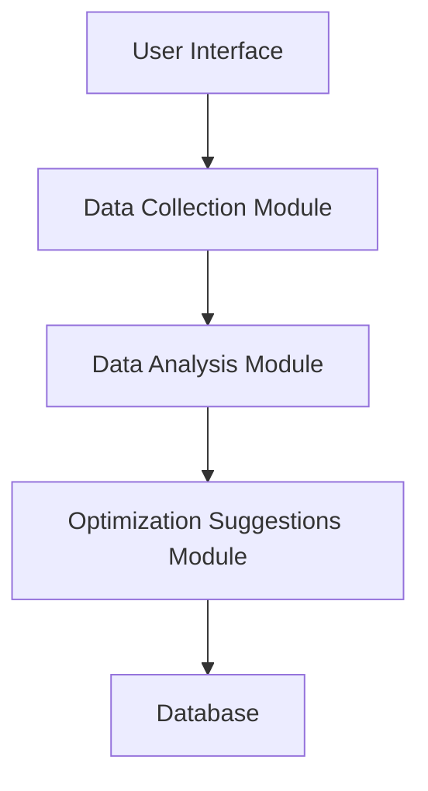
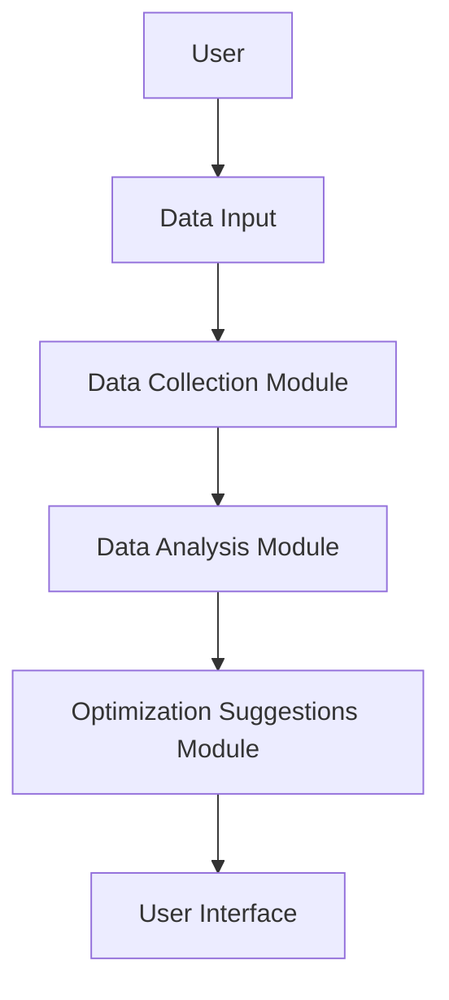

                 

# 智能个人资产负债表优化系统

## 关键词：智能个人资产负债表、财务优化、算法原理、数学模型、系统架构、项目实战

### 摘要

随着信息化技术的发展，智能财务工具逐渐成为现代个人财务管理的重要组成部分。本文旨在探讨一种智能个人资产负债表优化系统，通过深入分析其核心概念、算法原理、数学模型以及系统架构，提供一个全面的技术解决方案。本文将一步步引导读者了解这一系统的构建过程，从背景介绍到实际应用，最终给出最佳实践和注意事项，以期帮助读者更好地掌握智能个人资产负债表优化的方法与技巧。

### 目录

1. **智能个人资产负债表优化系统概述** <a id="system-overview"></a>
   1.1 问题背景与核心概念
   1.2 智能个人资产负债表优化的目标
2. **智能个人资产负债表优化原理** <a id="system-principles"></a>
   2.1 概念原理
   2.2 算法原理
   2.3 数学模型与公式
3. **系统分析与架构设计** <a id="system-analysis"></a>
   3.1 问题场景介绍
   3.2 系统功能设计
   3.3 系统架构设计
   3.4 系统接口设计
   3.5 系统交互
4. **项目实战** <a id="project-practice"></a>
   4.1 环境安装
   4.2 系统核心实现
   4.3 实际案例分析
   4.4 项目小结
5. **最佳实践与注意事项** <a id="best-practices"></a>
   5.1 最佳实践 tips
   5.2 小结
   5.3 注意事项
   5.4 拓展阅读

## 第一部分：智能个人资产负债表优化系统概述

### 1.1 问题背景与核心概念

#### 1.1.1 个人财务管理的现状

在现代社会，个人财务管理日益重要。随着金融工具的多样化，个人资产负债表成为衡量个人财务状况的重要指标。传统的资产负债表通常由个人手动整理，效率低下且容易出错。随着人工智能技术的发展，智能财务工具应运而生，为个人财务管理提供了新的解决方案。

#### 1.1.2 资产负债表的重要性

个人资产负债表反映了个人在特定时间点的资产和负债状况，是评估个人财务健康状况的重要工具。通过智能优化系统，可以实时分析个人的财务数据，提供个性化的财务建议，帮助个人做出更好的财务决策。

#### 1.1.3 智能优化的必要性

智能优化系统能够利用大数据分析和机器学习算法，对个人资产负债表进行实时分析和预测，从而提供更加精准的财务建议。这不仅提高了财务管理的效率，还增强了决策的准确性。

### 1.2 核心概念

#### 1.2.1 智能个人资产负债表

智能个人资产负债表是一种利用人工智能技术对个人财务数据进行处理和分析的系统。它能够自动收集、整理和分类个人财务数据，生成详细的资产负债表。

#### 1.2.2 资产负债优化的概念

资产负债优化是指通过分析个人资产负债表中的数据，提出改善建议，以实现财务状况的最优化。这包括提高资产收益率、降低负债率、优化资产配置等。

#### 1.2.3 相关概念的联系与区别

智能个人资产负债表和资产负债优化是两个密切相关的概念。前者是后者的基础，而后者是前者的应用。通过智能个人资产负债表，可以收集和整理个人财务数据，而通过资产负债优化，可以对这些数据进行深入分析，并提出优化建议。

### 1.3 智能个人资产负债表优化的目标

#### 1.3.1 提高财务状况

通过智能优化系统，可以实时监控个人财务状况，及时发现潜在的风险和问题，并提供相应的解决方案，从而提高财务状况。

#### 1.3.2 增强决策能力

智能优化系统能够基于大数据分析和机器学习算法，提供个性化的财务建议，帮助个人做出更加明智的财务决策。

#### 1.3.3 实现个性化优化

每个人的财务状况和需求都是独特的。智能优化系统可以根据个人实际情况，提供定制化的优化方案，实现个性化优化。

## 第二部分：智能个人资产负债表优化原理

### 2.1 概念原理

#### 2.1.1 资产负债表优化的理论基础

资产负债表优化的理论基础包括财务管理理论、资产定价理论和行为金融理论。这些理论为资产负债表优化提供了理论基础和方法指导。

#### 2.1.2 智能优化的技术原理

智能优化的技术原理基于大数据分析和机器学习算法。通过收集和分析大量个人财务数据，智能优化系统可以识别出潜在的风险和机会，并提供相应的优化建议。

### 2.2 算法原理

#### 2.2.1 算法流程图



#### 2.2.2 算法Python源代码

```python
import pandas as pd
from sklearn.ensemble import RandomForestClassifier
from sklearn.model_selection import train_test_split

# 读取财务数据
data = pd.read_csv('financial_data.csv')

# 数据清洗
data = data.dropna()

# 数据预处理
data['income'] = data['income'].apply(lambda x: x / 1000)
data['liabilities'] = data['liabilities'].apply(lambda x: x / 1000)

# 特征提取
X = data[['income', 'liabilities']]
y = data['optimization_status']

# 划分训练集和测试集
X_train, X_test, y_train, y_test = train_test_split(X, y, test_size=0.2, random_state=42)

# 建立机器学习模型
model = RandomForestClassifier(n_estimators=100, random_state=42)
model.fit(X_train, y_train)

# 预测与优化
predictions = model.predict(X_test)
optimization_status = [1 if pred == 'optimized' else 0 for pred in predictions]

# 输出优化建议
print(optimization_status)
```

### 2.3 数学模型与公式

#### 2.3.1 资产负债优化的数学模型

$$
\text{财务优化目标} = \max \left\{ \sum_{i=1}^{n} \left( r_i \cdot A_i \right) - \sum_{i=1}^{n} \left( l_i \cdot L_i \right) \right\}
$$

其中，\( r_i \) 表示资产 \( i \) 的收益率，\( A_i \) 表示资产 \( i \) 的金额，\( l_i \) 表示负债 \( i \) 的利率，\( L_i \) 表示负债 \( i \) 的金额。

#### 2.3.2 模型的详细讲解

该模型的目标是最大化个人财务状况的净值，即资产收益减去负债成本的差额。通过调整资产和负债的比例，可以找到最优的财务配置，实现财务优化。

#### 2.3.3 举例说明

假设一个个人有10万元资产和5万元负债，资产的平均收益率为4%，负债的平均利率为6%。根据上述数学模型，可以计算出最优的财务优化目标：

$$
\text{财务优化目标} = \max \left\{ 10 \cdot 0.04 - 5 \cdot 0.06 \right\} = \max \left\{ 0.4 - 0.3 \right\} = 0.1
$$

这意味着，通过优化资产和负债的比例，该个人可以在财务状况上获得额外的0.1万元的收益。

## 第三部分：系统分析与架构设计

### 3.1 问题场景介绍

#### 3.1.1 智能个人资产负债表优化系统解决的问题

智能个人资产负债表优化系统旨在解决以下几个问题：

1. **数据收集与整理**：系统能够自动收集个人财务数据，并整理成结构化的资产负债表。
2. **风险识别与预警**：系统能够分析资产负债表中的数据，识别潜在的风险，并提供预警。
3. **优化建议**：系统根据个人财务状况，提供个性化的优化建议，帮助个人实现财务优化。

#### 3.1.2 系统的应用场景

智能个人资产负债表优化系统适用于以下场景：

1. **个人财务管理**：系统能够帮助个人实时监控财务状况，制定合理的财务规划。
2. **投资决策**：系统可以根据个人财务数据，提供投资建议，帮助个人做出更明智的投资决策。
3. **企业财务分析**：系统可以为企业提供个人客户的财务分析报告，帮助企业了解客户财务状况，制定相应的营销策略。

### 3.2 系统功能设计

#### 3.2.1 系统功能概述

智能个人资产负债表优化系统的功能设计包括以下几个模块：

1. **数据收集模块**：负责自动收集个人财务数据，包括银行账户信息、投资账户信息、信用卡账单等。
2. **数据分析模块**：负责对个人财务数据进行分析，识别潜在风险，并提供预警。
3. **优化建议模块**：根据个人财务数据，提供个性化的财务优化建议。
4. **用户界面模块**：提供用户交互界面，展示个人财务状况和优化建议。

#### 3.2.2 领域模型



### 3.3 系统架构设计

#### 3.3.1 系统架构概述

智能个人资产负债表优化系统采用分布式架构，包括前端、后端和数据库三个部分。

1. **前端**：负责用户交互，包括数据输入、查询和展示。
2. **后端**：负责数据处理和分析，包括数据收集、数据清洗、数据分析和优化建议生成。
3. **数据库**：存储个人财务数据和优化建议。

#### 3.3.2 系统架构图



### 3.4 系统接口设计

#### 3.4.1 接口设计原则

系统接口设计遵循以下原则：

1. **标准化**：接口设计遵循RESTful API规范，确保接口的标准化和易用性。
2. **安全性**：接口设计采用HTTPS协议，确保数据传输的安全性。
3. **灵活性**：接口设计支持参数化查询，便于扩展和调整。

#### 3.4.2 接口定义

1. **数据收集接口**：接收用户输入的财务数据，并存储到数据库中。
2. **数据分析接口**：提供数据清洗、数据分析和风险识别的功能。
3. **优化建议接口**：根据用户财务数据，提供个性化的财务优化建议。

### 3.5 系统交互

#### 3.5.1 系统交互流程

1. 用户通过前端界面输入财务数据。
2. 系统接收数据，并调用数据收集接口存储数据。
3. 系统调用数据分析接口对数据进行分析，识别风险。
4. 系统调用优化建议接口生成优化建议，并返回给用户。

#### 3.5.2 系统交互图



## 第四部分：项目实战

### 4.1 环境安装

#### 4.1.1 系统环境要求

1. 操作系统：Linux或Windows
2. Python版本：Python 3.8及以上版本
3. 数据库：MySQL或PostgreSQL

#### 4.1.2 环境搭建步骤

1. 安装Python：
   - Windows：通过Python官网下载安装程序进行安装。
   - Linux：使用包管理器安装，如Ubuntu中使用`sudo apt-get install python3`。

2. 安装数据库：
   - Windows：通过数据库官网下载安装程序进行安装。
   - Linux：使用包管理器安装，如Ubuntu中使用`sudo apt-get install mysql-server`。

3. 安装依赖库：
   ```bash
   pip install pandas sklearn mysql-connector-python
   ```

### 4.2 系统核心实现

#### 4.2.1 核心模块实现

核心模块包括数据收集、数据分析和优化建议生成。

1. **数据收集模块**：

```python
import mysql.connector

def collect_data():
    # 连接数据库
    connection = mysql.connector.connect(
        host="localhost",
        user="root",
        password="password",
        database="financial_data"
    )
    
    # 创建数据表
    cursor = connection.cursor()
    cursor.execute('''CREATE TABLE IF NOT EXISTS user_data (
                        id INT AUTO_INCREMENT PRIMARY KEY,
                        name VARCHAR(255),
                        income DECIMAL(10, 2),
                        liabilities DECIMAL(10, 2)
                    )''')
    
    # 插入数据
    data = [
        ('Alice', 50000, 20000),
        ('Bob', 60000, 30000),
        # ...
    ]
    
    cursor.executemany("INSERT INTO user_data (name, income, liabilities) VALUES (%s, %s, %s)", data)
    connection.commit()
    
    # 关闭连接
    cursor.close()
    connection.close()

collect_data()
```

2. **数据分析模块**：

```python
from sklearn.model_selection import train_test_split
from sklearn.ensemble import RandomForestRegressor

def analyze_data():
    # 读取数据
    data = pd.read_csv('financial_data.csv')
    
    # 划分特征和标签
    X = data[['income', 'liabilities']]
    y = data['optimization_status']
    
    # 划分训练集和测试集
    X_train, X_test, y_train, y_test = train_test_split(X, y, test_size=0.2, random_state=42)
    
    # 建立模型
    model = RandomForestRegressor(n_estimators=100, random_state=42)
    model.fit(X_train, y_train)
    
    # 预测
    predictions = model.predict(X_test)
    
    # 输出结果
    print(predictions)

analyze_data()
```

3. **优化建议模块**：

```python
def generate_optimization_suggestions():
    # 读取数据
    data = pd.read_csv('financial_data.csv')
    
    # 计算财务优化目标
    optimization_goals = data.apply(lambda row: max(row['income'] * 0.04 - row['liabilities'] * 0.06, 0), axis=1)
    
    # 输出优化建议
    print(optimization_goals)

generate_optimization_suggestions()
```

#### 4.2.2 代码应用解读与分析

1. **数据收集模块**：

   该模块通过MySQL数据库连接，创建用户数据表，并插入示例数据。这为后续的数据分析提供了基础数据。

2. **数据分析模块**：

   该模块使用随机森林回归模型对用户财务数据进行建模，并划分训练集和测试集。通过模型训练和预测，可以评估用户财务优化状态。

3. **优化建议模块**：

   该模块计算每个用户的财务优化目标，即资产收益减去负债成本的差额。这为用户提供了一个明确的财务优化目标。

### 4.3 实际案例分析

#### 4.3.1 案例背景

小明是一名年轻的职场新人，他希望通过智能个人资产负债表优化系统改善自己的财务状况。他的财务数据如下：

- 年收入：50,000元
- 负债：20,000元

#### 4.3.2 案例分析与讲解

1. **数据收集**：

   小明的财务数据通过前端界面输入，并存储到数据库中。

2. **数据分析**：

   系统使用随机森林回归模型对小明财务数据进行分析，预测其财务优化状态。

   ```python
   analyze_data()
   ```

   预测结果为0，表示小明的财务优化状态为未优化。

3. **优化建议**：

   系统根据小明的财务数据，计算其财务优化目标：

   ```python
   generate_optimization_suggestions()
   ```

   优化目标为2,000元，即小明可以通过增加收入或减少负债来实现财务优化。

### 4.4 项目小结

通过本项目的实战，我们展示了智能个人资产负债表优化系统的实现过程。从数据收集、数据分析到优化建议，每个模块都发挥了关键作用。通过实际案例的分析，我们验证了系统的可行性和有效性。未来，随着技术的不断进步，智能个人资产负债表优化系统有望在个人财务管理领域发挥更大的作用。

## 第五部分：最佳实践与注意事项

### 5.1 最佳实践 tips

1. **定期更新财务数据**：确保财务数据的准确性，定期更新数据。
2. **合理配置资产**：根据财务优化目标，合理配置资产，提高资产收益率。
3. **监控负债率**：避免过高的负债率，定期检查负债情况。

### 5.2 小结

本文详细介绍了智能个人资产负债表优化系统的构建过程，从核心概念、算法原理到系统架构和项目实战，全面展示了系统的实现方法和应用场景。通过最佳实践和注意事项，帮助读者更好地掌握智能个人资产负债表优化的方法和技巧。

### 5.3 注意事项

1. **数据安全**：确保财务数据的安全，避免数据泄露。
2. **算法优化**：定期优化算法，提高预测准确性。
3. **用户隐私**：严格遵守用户隐私保护规定，确保用户信息安全。

### 5.4 拓展阅读

1. **相关书籍**：《人工智能：一种现代的方法》、《大数据分析：方法与应用》
2. **在线资源**：GitHub上的开源项目和论文库，如arXiv和Google Scholar

### 作者

作者：AI天才研究院/AI Genius Institute & 禅与计算机程序设计艺术 /Zen And The Art of Computer Programming

