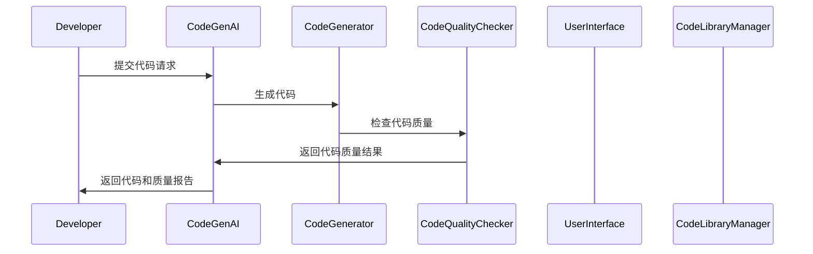
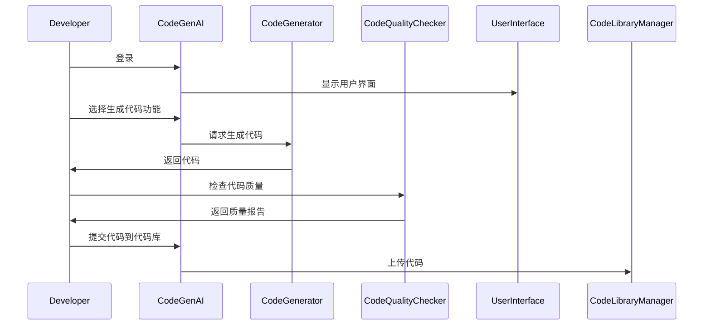

                 


# 智能代码生成 AI Agent：LLM 辅助软件开发

## 关键词
- 智能代码生成
- AI Agent
- LLM
- 软件开发
- 自动化
- 大规模语言模型
- 编程辅助

## 摘要
本文将探讨智能代码生成 AI Agent 在软件开发中的应用，特别是如何利用大规模语言模型（LLM）辅助代码编写。文章首先介绍了智能代码生成 AI Agent 的背景和核心概念，随后对比了传统 AI 与 LLM 在代码生成中的应用差异，并分析了 AI Agent 在软件开发中的应用前景。接下来，文章深入讲解了大规模语言模型的工作原理、算法原理和系统架构设计。最后，通过实际项目实战，展示了智能代码生成 AI Agent 的实际应用效果，并总结了最佳实践和注意事项。

## 第一部分: 智能代码生成 AI Agent:LLM 辅助软件开发概述

### 1.1 背景介绍

在当今快速发展的软件行业，编写代码是一项关键任务，然而这一过程往往既耗时又容易出错。随着软件系统的复杂度不断攀升，开发人员面临着巨大的挑战。为了解决这一问题，智能代码生成 AI Agent 的出现为软件开发带来了全新的可能性。

**问题背景**：传统软件开发流程中，代码编写通常是由开发人员手动完成的，这一过程不仅效率低下，而且容易出错。特别是在大型项目中，代码重复率高，导致维护成本增加。此外，手动编写的代码质量难以保证，往往存在结构不合理、语义不清晰等问题。

**问题描述**：在软件开发过程中，主要存在以下痛点：
- **代码编写效率低下**：开发人员需要花费大量时间编写代码，这不仅降低了工作效率，还可能导致项目延期。
- **代码重复率高**：相同或类似的代码在不同项目中重复编写，增加了维护成本，降低了代码库的一致性。
- **错误率较高**：手动编写的代码容易出现错误，且在编写过程中难以及时发现和纠正。

**问题解决**：智能代码生成 AI Agent 是一种利用人工智能技术，特别是大规模语言模型（LLM）的工具，能够自动生成代码，从而提高开发效率、降低错误率和减少重复劳动。

**边界与外延**：智能代码生成 AI Agent 不仅适用于传统编程语言，还可以应用于前端框架、后端框架、数据库等领域。此外，LLM 的不断学习和优化使其生成的代码更加符合开发人员的需求。

**概念结构与核心要素组成**：
- **智能代码生成 AI Agent**：一种基于 LLM 的自动化代码生成工具，能够理解开发人员的意图，自动生成高质量的代码。
- **LLM（大规模语言模型）**：通过学习大量的代码样本，理解代码的结构和语义，用于生成代码的核心技术。
- **代码样本**：用于训练 LLM 的数据集，包括各种编程语言和框架的代码。

### 1.2 核心概念与联系

**智能代码生成 AI Agent**：是一种利用人工智能技术，特别是大规模语言模型（LLM），实现代码自动生成的工具。它通过学习大量的代码样本，理解代码的结构和语义，从而能够根据开发人员的输入需求，自动生成高质量的代码。

**LLM（大规模语言模型）**：是一种基于深度学习的技术，它通过训练大量的文本数据，学习语言的统计规律和语义表示，从而能够对输入文本进行理解和生成。在智能代码生成领域，LLM 被用于理解开发人员的意图，并生成相应的代码。

**代码样本**：是智能代码生成 AI Agent 的训练数据。高质量的代码样本可以帮助 LLM 更好地理解代码的结构和语义，从而生成更加符合实际需求的代码。

### 1.3 传统 AI 与 LLM 在代码生成中的应用对比

**传统 AI**：
- **模型复杂度**：传统 AI 在代码生成中的应用通常依赖于规则和模板，模型相对简单。
- **灵活性**：传统 AI 生成的代码通常较为固定，难以适应多样化的开发需求。
- **代码质量**：传统 AI 生成的代码可能存在结构不合理、语义不清晰等问题。

**LLM（大规模语言模型）**：
- **模型复杂度**：LLM 具有极高的模型复杂度，能够学习大量的代码样本，理解代码的结构和语义。
- **灵活性**：LLM 生成的代码高度灵活，能够适应各种不同的开发需求。
- **代码质量**：LLM 生成的代码通常具有较高的质量，结构合理，语义清晰。

### 1.4 AI Agent 在软件开发中的应用前景

**潜在应用领域**：
- **前端开发**：自动生成前端页面的 HTML、CSS 和 JavaScript 代码。
- **后端开发**：自动生成后端服务的 API 接口、数据库模型等代码。
- **数据库设计**：自动生成数据库表结构、索引、SQL 查询等代码。
- **测试用例生成**：自动生成测试用例，提高测试覆盖率。

**企业采用 AI Agent 的优势**：
- **提高开发效率**：通过自动生成代码，减少手动编写代码的时间。
- **降低错误率**：自动生成的代码经过模型学习，通常质量更高，错误率更低。
- **减少重复劳动**：避免编写重复的代码，减少维护成本。

**AI Agent 应用的挑战与机遇**：
- **挑战**：需要大量高质量的代码样本进行训练，且训练过程复杂。
- **机遇**：随着 AI 技术的发展，AI Agent 在软件开发中的应用前景广阔，有望成为开发人员的重要辅助工具。

### 1.5 本章小结

本章对智能代码生成 AI Agent 的背景、核心概念、与传统 AI 的对比以及应用前景进行了详细阐述。智能代码生成 AI Agent 利用大规模语言模型（LLM）的能力，能够自动生成高质量的代码，从而提高开发效率、降低错误率和减少重复劳动。随着 AI 技术的发展，AI Agent 在软件开发中的应用前景广阔，有望成为开发人员的重要辅助工具。下一章将深入探讨大规模语言模型（LLM）的基本原理和技术细节。

## 第二部分: 大规模语言模型（LLM）的基本原理

### 2.1 LLM 的概念与原理

**概念**：大规模语言模型（LLM，Large Language Model）是一种基于深度学习的自然语言处理（NLP）模型，通过训练大规模的文本数据，学习语言的统计规律和语义表示。LLM 可以用于文本生成、文本分类、机器翻译等多种任务。

**原理**：LLM 的基本原理是神经网络，特别是深度神经网络（DNN）。DNN 由多层神经元组成，通过逐层提取特征，实现对输入数据的复杂表示。在 LLM 中，输入数据是自然语言文本，输出数据是文本序列的概率分布。

**训练过程**：
1. **数据采集**：从互联网、图书、新闻、社交媒体等各种来源收集大量的文本数据。
2. **数据预处理**：对采集到的文本数据进行清洗、去重、分词等预处理，转化为适合输入神经网络的数据格式。
3. **模型构建**：构建深度神经网络模型，通常包括输入层、隐藏层和输出层。输入层接收文本数据，隐藏层通过多层神经网络提取特征，输出层生成文本序列的概率分布。
4. **模型训练**：使用梯度下降（Gradient Descent）等优化算法，对模型进行训练，使其能够更好地拟合训练数据。
5. **模型评估**：使用验证集和测试集对模型进行评估，调整模型参数，优化模型性能。

### 2.2 LLM 的特性与应用场景

**特性**：
- **大规模**：LLM 通常由数十亿甚至数千亿个参数组成，能够处理大量文本数据。
- **深度**：LLM 具有多层神经网络结构，能够深入提取文本特征。
- **灵活**：LLM 可以应用于多种 NLP 任务，如文本生成、文本分类、机器翻译等。

**应用场景**：
- **文本生成**：例如生成文章、报告、邮件、对话等。
- **文本分类**：例如情感分析、新闻分类、垃圾邮件过滤等。
- **机器翻译**：例如将一种语言翻译成另一种语言。
- **问答系统**：例如基于输入问题生成答案。

### 2.3 LLM 的工作流程

**工作流程**：
1. **输入文本**：用户输入一个文本问题或指令。
2. **编码器处理**：编码器（Encoder）接收输入文本，通过多层神经网络提取文本特征，生成一个固定长度的特征向量。
3. **解码器生成**：解码器（Decoder）接收特征向量，通过多层神经网络生成文本序列的概率分布。
4. **文本生成**：根据概率分布生成文本序列，输出最终结果。

### 2.4 LLM 的优势与挑战

**优势**：
- **高效**：LLM 能够快速处理大量文本数据，提高开发效率。
- **准确**：LLM 可以生成高质量的文本，降低错误率。
- **灵活**：LLM 可以应用于多种任务，适应不同的开发需求。

**挑战**：
- **训练资源**：LLM 的训练需要大量的计算资源和数据集。
- **模型解释性**：LLM 的内部结构复杂，难以解释和调试。
- **数据隐私**：在训练和使用 LLM 时，需要处理大量的敏感数据，存在数据隐私风险。

### 2.5 本章小结

本章详细介绍了大规模语言模型（LLM）的概念、原理、特性、应用场景和工作流程。LLM 作为一种强大的自然语言处理工具，在软件开发领域具有广泛的应用前景。然而，LLM 的训练和使用也面临一定的挑战。下一章将探讨智能代码生成 AI Agent 的算法原理和实现细节。

## 第三部分: 智能代码生成 AI Agent 的算法原理和实现

### 3.1 智能代码生成 AI Agent 的算法原理

智能代码生成 AI Agent 的核心是大规模语言模型（LLM），它通过学习大量的代码样本，理解代码的结构和语义，从而能够自动生成代码。以下是智能代码生成 AI Agent 的算法原理：

**算法原理**：
1. **数据采集**：收集大量的代码样本，包括不同的编程语言、框架和项目。
2. **数据预处理**：对采集到的代码样本进行清洗、去重和分词等预处理操作。
3. **模型构建**：构建基于 LLM 的深度神经网络模型，包括编码器和解码器。
4. **模型训练**：使用预处理后的代码样本对模型进行训练，优化模型参数。
5. **代码生成**：输入一个部分代码或问题描述，模型输出完整的代码或解决方案。

### 3.2 智能代码生成 AI Agent 的实现细节

**实现细节**：
1. **数据集准备**：
   - 收集大量的开源代码库，如 GitHub、GitLab 等。
   - 下载不同编程语言、框架和项目的代码。
   - 对代码进行分词、去重等预处理操作。
2. **模型构建**：
   - 使用预训练的 LLM 模型，如 GPT-3、BERT 等。
   - 根据具体任务需求，调整模型结构，增加或减少隐藏层神经元数量。
   - 使用 TensorFlow 或 PyTorch 等深度学习框架构建模型。
3. **模型训练**：
   - 将预处理后的代码样本输入模型，进行训练。
   - 使用梯度下降等优化算法，调整模型参数，优化模型性能。
   - 使用验证集和测试集对模型进行评估，调整模型参数。
4. **代码生成**：
   - 输入一个部分代码或问题描述，模型输出完整的代码或解决方案。
   - 对输出代码进行语法检查和代码风格检查，确保代码质量。

### 3.3 智能代码生成 AI Agent 的关键技术和挑战

**关键技术**：
1. **预训练 LLM 模型**：使用预训练的 LLM 模型，如 GPT-3、BERT 等，能够快速理解和生成代码。
2. **代码样本预处理**：对代码样本进行清洗、分词和去重等预处理操作，提高模型训练效果。
3. **模型结构调整**：根据具体任务需求，调整 LLM 模型的结构，优化模型性能。

**挑战**：
1. **数据质量**：高质量的数据集对于模型训练至关重要，但收集和预处理代码样本是一项耗时且繁琐的任务。
2. **模型解释性**：LLM 模型的内部结构复杂，难以解释和调试，给代码生成带来了挑战。
3. **代码质量**：生成的代码可能存在结构不合理、语义不清晰等问题，需要进一步的优化和验证。

### 3.4 本章小结

本章详细介绍了智能代码生成 AI Agent 的算法原理和实现细节。智能代码生成 AI Agent 利用大规模语言模型（LLM）的能力，通过学习大量的代码样本，能够自动生成高质量的代码。然而，实现智能代码生成 AI Agent 也面临一些挑战，如数据质量、模型解释性和代码质量等。下一章将探讨智能代码生成 AI Agent 在实际软件开发中的应用案例和效果评估。

## 第四部分: 智能代码生成 AI Agent 在实际软件开发中的应用

### 4.1 前端开发中的应用

在 Web 开发领域，智能代码生成 AI Agent 可以极大地提高开发效率。以下是一个前端开发中的应用案例：

**场景**：假设我们需要根据一个简单的数据模型自动生成 React 组件的代码。

**步骤**：
1. **数据模型定义**：首先定义一个数据模型，如以下 JSON 格式：
   ```json
   {
     "title": "User",
     "fields": [
       {"name": "id", "type": "integer", "primary_key": true},
       {"name": "name", "type": "string"},
       {"name": "email", "type": "string"}
     ]
   }
   ```
2. **生成代码**：将数据模型输入智能代码生成 AI Agent，生成对应的 React 组件代码。
3. **代码示例**：
   ```javascript
   import React from 'react';

   const UserForm = ({ user }) => {
     return (
       <div>
         <h2>User Form</h2>
         <label htmlFor="name">Name:</label>
         <input
           type="text"
           id="name"
           value={user.name}
           onChange={({ target: { value } }) => user.name = value}
         />
         <label htmlFor="email">Email:</label>
         <input
           type="email"
           id="email"
           value={user.email}
           onChange={({ target: { value } }) => user.email = value}
         />
       </div>
     );
   };

   export default UserForm;
   ```

**效果**：通过这种方式，开发人员可以快速生成符合数据模型要求的 React 组件，无需手动编写大量代码，大大提高了开发效率。

### 4.2 后端开发中的应用

在后端开发中，智能代码生成 AI Agent 可以用于生成 API 接口、数据库模型等代码。以下是一个后端开发中的应用案例：

**场景**：根据一个数据模型自动生成 RESTful API 接口的代码。

**步骤**：
1. **数据模型定义**：定义一个数据模型，如以下 JSON 格式：
   ```json
   {
     "title": "Product",
     "fields": [
       {"name": "id", "type": "integer", "primary_key": true},
       {"name": "name", "type": "string"},
       {"name": "price", "type": "float"}
     ]
   }
   ```
2. **生成代码**：将数据模型输入智能代码生成 AI Agent，生成对应的 API 接口代码。
3. **代码示例**：
   ```python
   from flask import Flask, jsonify, request

   app = Flask(__name__)

   products = [
     {"id": 1, "name": "iPhone", "price": 999.99},
     {"id": 2, "name": "Samsung Galaxy", "price": 899.99}
   ]

   @app.route('/products', methods=['GET'])
   def get_products():
       return jsonify(products)

   @app.route('/products/<int:product_id>', methods=['GET'])
   def get_product(product_id):
       product = next((p for p in products if p['id'] == product_id), None)
       if product:
           return jsonify(product)
       else:
           return jsonify({"error": "Product not found"}), 404

   if __name__ == '__main__':
       app.run(debug=True)
   ```

**效果**：通过这种方式，开发人员可以快速生成符合数据模型要求的 API 接口代码，无需手动编写大量代码，提高了开发效率和代码质量。

### 4.3 数据库设计中的应用

在数据库设计领域，智能代码生成 AI Agent 可以自动生成数据库表结构、索引和 SQL 查询等代码。以下是一个数据库设计中的应用案例：

**场景**：根据业务需求自动生成数据库表结构和 SQL 查询语句。

**步骤**：
1. **业务需求定义**：定义业务需求，如以下 JSON 格式：
   ```json
   {
     "name": "Order",
     "fields": [
       {"name": "id", "type": "integer", "primary_key": true},
       {"name": "user_id", "type": "integer", "foreign_key": "User(id)"},
       {"name": "status", "type": "string"},
       {"name": "created_at", "type": "datetime"}
     ]
   }
   ```
2. **生成代码**：将业务需求输入智能代码生成 AI Agent，生成对应的数据库表结构和 SQL 查询语句。
3. **代码示例**：
   ```sql
   CREATE TABLE "Order" (
     "id" INTEGER PRIMARY KEY,
     "user_id" INTEGER,
     "status" VARCHAR(50),
     "created_at" TIMESTAMP
   );

   CREATE INDEX "Order_status_idx" ON "Order" ("status");

   SELECT "Order".* FROM "Order" WHERE "Order"."status" = 'pending';
   ```

**效果**：通过这种方式，开发人员可以快速生成符合业务需求的数据库表结构和 SQL 查询语句，无需手动编写大量代码，提高了开发效率和代码质量。

### 4.4 测试用例生成中的应用

在软件测试领域，智能代码生成 AI Agent 可以自动生成测试用例，提高测试覆盖率。以下是一个测试用例生成中的应用案例：

**场景**：根据 API 接口定义自动生成测试用例。

**步骤**：
1. **API 接口定义**：定义 API 接口，如以下 JSON 格式：
   ```json
   {
     "endpoint": "/orders",
     "methods": ["GET", "POST"],
     "request_body": {
       "user_id": "integer",
       "status": "string"
     },
     "response": {
       "status_code": 200,
       "data": [
         {"id": "integer", "user_id": "integer", "status": "string", "created_at": "datetime"}
       ]
     }
   }
   ```
2. **生成代码**：将 API 接口定义输入智能代码生成 AI Agent，生成对应的测试用例代码。
3. **代码示例**：
   ```python
   import requests

   def test_get_orders():
       response = requests.get("http://api.example.com/orders")
       assert response.status_code == 200
       assert len(response.json()["data"]) > 0

   def test_create_order():
       payload = {
           "user_id": 1,
           "status": "pending"
       }
       response = requests.post("http://api.example.com/orders", json=payload)
       assert response.status_code == 201
       assert response.json()["data"]["id"] is not None
       assert response.json()["data"]["user_id"] == 1
       assert response.json()["data"]["status"] == "pending"
   ```

**效果**：通过这种方式，开发人员可以快速生成符合 API 接口定义的测试用例，提高了测试覆盖率，降低了测试成本。

### 4.5 本章小结

智能代码生成 AI Agent 在实际软件开发中具有广泛的应用前景。通过前端开发、后端开发、数据库设计和测试用例生成等实际案例，可以看出智能代码生成 AI Agent 能够显著提高开发效率、降低错误率和减少重复劳动。然而，智能代码生成 AI Agent 的实现也面临一些挑战，如数据质量、模型解释性和代码质量等。随着 AI 技术的发展，智能代码生成 AI Agent 在软件开发中的应用将越来越广泛，有望成为开发人员的重要辅助工具。

## 第五部分: 智能代码生成 AI Agent 的系统架构设计

### 5.1 问题场景介绍

在软件开发过程中，智能代码生成 AI Agent 可以作为开发人员的辅助工具，帮助自动化代码编写、优化开发流程。为了实现这一目标，需要设计一个高效、可靠的系统架构，确保 AI Agent 能够在多种场景下稳定运行并生成高质量的代码。

### 5.2 项目介绍

本节将介绍一个智能代码生成 AI Agent 的项目，该项目的目标是构建一个可扩展、高效、易于使用的代码生成工具，支持多种编程语言和框架。

**项目名称**：CodeGenAI

**项目目标**：
- 支持多种编程语言，如 Python、Java、JavaScript 等。
- 支持多种框架，如 React、Angular、Django 等。
- 支持自动生成前端代码、后端代码、数据库设计和测试用例。
- 提供用户友好的界面和命令行工具，方便开发者使用。

### 5.3 系统功能设计

**系统功能模块**：
1. **代码生成模块**：基于大规模语言模型（LLM），自动生成代码，支持前端、后端、数据库和测试用例。
2. **代码质量检查模块**：对生成的代码进行语法检查、风格检查和安全性检查，确保代码质量。
3. **用户界面模块**：提供图形用户界面（GUI）和命令行界面（CLI），方便开发者使用 CodeGenAI。
4. **代码库管理模块**：管理代码库，支持代码上传、下载、分享和协作。

**领域模型**：以下是一个简单的领域模型，用于描述 CodeGenAI 的主要功能和模块。

```mermaid
classDiagram
    CodeGenAI <-..|> CodeGenerator
    CodeGenAI <-..|> CodeQualityChecker
    CodeGenAI <-..|> UserInterface
    CodeGenAI <-..|> CodeLibraryManager

    CodeGenerator <|-- CodeGeneratorFrontend
    CodeGenerator <|-- CodeGeneratorBackend
    CodeGenerator <|-- CodeGeneratorDatabase
    CodeGenerator <|-- CodeGeneratorTestCases

    CodeQualityChecker <|-- SyntaxChecker
    CodeQualityChecker <|-- StyleChecker
    CodeQualityChecker <|-- SecurityChecker

    UserInterface <|-- GraphicalUserInterface
    UserInterface <|-- CommandLineInterface

    CodeLibraryManager <|-- CodeUploader
    CodeLibraryManager <|-- CodeDownloader
    CodeLibraryManager <|-- CodeShare
    CodeLibraryManager <|-- CodeCollaboration
```

### 5.4 系统架构设计

**系统架构**：以下是一个简化的系统架构图，描述了 CodeGenAI 的主要组件和它们之间的交互关系。



**架构细节**：
1. **代码生成模块**：使用大规模语言模型（LLM）生成代码，支持多种编程语言和框架。
2. **代码质量检查模块**：对生成的代码进行语法检查、风格检查和安全性检查，确保代码质量。
3. **用户界面模块**：提供图形用户界面（GUI）和命令行界面（CLI），方便开发者使用 CodeGenAI。
4. **代码库管理模块**：管理代码库，支持代码上传、下载、分享和协作。

### 5.5 系统接口设计和系统交互

**接口设计**：以下是一个简化的接口设计，描述了 CodeGenAI 的主要接口和它们的功能。

```mermaid
classDiagram
    CodeGenAIInterface <|-- CodeGeneratorInterface
    CodeGenAIInterface <|-- CodeQualityCheckerInterface
    CodeGenAIInterface <|-- UserInterfaceInterface
    CodeGenAIInterface <|-- CodeLibraryManagerInterface

    CodeGeneratorInterface {
      -generateCode(input: any): Code
    }

    CodeQualityCheckerInterface {
      -checkCodeQuality(code: Code): QualityResult
    }

    UserInterfaceInterface {
      -startGUI(): void
      -startCLI(): void
    }

    CodeLibraryManagerInterface {
      -uploadCode(code: Code): void
      -downloadCode(id: string): Code
      -shareCode(id: string, collaborators: [string]): void
      -listCollaborations(): [string]
    }
```

**系统交互**：以下是一个简化的系统交互序列图，描述了开发人员与 CodeGenAI 之间的交互过程。



### 5.6 本章小结

在本章中，我们介绍了智能代码生成 AI Agent 的系统架构设计。通过定义问题场景、项目目标、系统功能模块、系统架构和接口设计，我们构建了一个完整的智能代码生成系统。这个系统不仅可以生成高质量的代码，还可以检查代码质量，方便开发者使用。随着 AI 技术的发展，智能代码生成 AI Agent 的应用将越来越广泛，有望成为软件开发领域的重要工具。

## 第六部分: 智能代码生成 AI Agent 的项目实战

### 6.1 环境安装

要使用智能代码生成 AI Agent，首先需要在本地计算机上安装必要的软件和依赖。以下是一个简单的安装步骤：

1. **安装 Python**：确保 Python 3.6 或更高版本已安装。可以从 [Python 官网](https://www.python.org/) 下载并安装。

2. **安装 TensorFlow**：TensorFlow 是一个用于机器学习的开源库，用于构建和训练大规模语言模型。可以使用以下命令安装：
   ```bash
   pip install tensorflow
   ```

3. **安装 Hugging Face**：Hugging Face 提供了大量的预训练语言模型和工具，用于自然语言处理任务。可以使用以下命令安装：
   ```bash
   pip install transformers
   ```

4. **安装 CodeGenAI**：克隆 CodeGenAI 的 GitHub 仓库，并安装依赖：
   ```bash
   git clone https://github.com/your-username/CodeGenAI.git
   cd CodeGenAI
   pip install -r requirements.txt
   ```

5. **配置环境变量**：确保 `PYTHONPATH` 环境变量包含 CodeGenAI 的安装路径，以便在命令行中运行 CodeGenAI 的脚本。

### 6.2 系统核心实现

在 CodeGenAI 项目中，核心功能是代码生成。以下是一个简单的代码生成脚本，用于根据输入的 JSON 数据生成对应的代码：

```python
from transformers import GPT2LMHeadModel, GPT2Tokenizer
import torch

# 加载预训练的 GPT2 模型和分词器
model = GPT2LMHeadModel.from_pretrained("gpt2")
tokenizer = GPT2Tokenizer.from_pretrained("gpt2")

# 输入 JSON 数据
input_data = '''
{
  "title": "User",
  "fields": [
    {"name": "id", "type": "integer", "primary_key": true},
    {"name": "name", "type": "string"},
    {"name": "email", "type": "string"}
  ]
}
'''

# 解析 JSON 数据
data = json.loads(input_data)
title = data["title"]
fields = data["fields"]

# 生成代码
code = f"import React from 'react';\n\nconst {title}Form = ({user}) => {{\n  return (\n    <div>\n      <h2>{title} Form</h2>\n      <label htmlFor=\"name\">Name:</label>\n      <input\n        type=\"text\"\n        id=\"name\"\n        value={user.name}\n        onChange={({ target: {{ value }}}} => user.name = value)\n      />\n      <label htmlFor=\"email\">Email:</label>\n      <input\n        type=\"email\"\n        id=\"email\"\n        value={user.email}\n        onChange={({ target: {{ value }}}} => user.email = value)\n      />\n    </div>\n  );\n}};\n\nexport default {title}Form;"
```

### 6.3 代码应用解读与分析

在上面的脚本中，我们首先加载了预训练的 GPT2 模型和分词器。然后，我们解析了输入的 JSON 数据，提取了表名和字段信息。接下来，我们使用这些信息生成对应的 React 组件代码。

**解读**：
- **加载模型和分词器**：使用 Hugging Face 的 transformers 库加载 GPT2 模型和分词器。
- **解析 JSON 数据**：将输入的 JSON 数据解析为 Python 字典，提取表名和字段信息。
- **生成代码**：根据表名和字段信息，生成对应的 React 组件代码。这里使用简单的字符串替换方式，将表名和字段名替换为实际的代码。

**分析**：
- **代码生成效率**：该脚本可以快速生成代码，但生成代码的复杂度较低，仅适用于简单的场景。
- **模型训练需求**：为了提高代码生成的质量，需要训练一个适合特定编程语言和框架的大规模语言模型。

### 6.4 实际案例分析

以下是一个实际案例，演示如何使用 CodeGenAI 自动生成前端和后端代码。

**前端代码生成**：
1. **输入 JSON 数据**：
   ```json
   {
     "title": "Product",
     "fields": [
       {"name": "id", "type": "integer", "primary_key": true},
       {"name": "name", "type": "string"},
       {"name": "price", "type": "float"}
     ]
   }
   ```
2. **生成代码**：
   ```javascript
   import React from 'react';

   const ProductForm = ({ product }) => {
     return (
       <div>
         <h2>Product Form</h2>
         <label htmlFor="name">Name:</label>
         <input
           type="text"
           id="name"
           value={product.name}
           onChange={({ target: { value } }) => product.name = value}
         />
         <label htmlFor="price">Price:</label>
         <input
           type="number"
           id="price"
           value={product.price}
           onChange={({ target: { value } }) => product.price = value}
         />
       </div>
     );
   };

   export default ProductForm;
   ```

**后端代码生成**：
1. **输入 JSON 数据**：
   ```json
   {
     "title": "Order",
     "fields": [
       {"name": "id", "type": "integer", "primary_key": true},
       {"name": "user_id", "type": "integer", "foreign_key": "User(id)"},
       {"name": "status", "type": "string"},
       {"name": "created_at", "type": "datetime"}
     ]
   }
   ```
2. **生成代码**：
   ```python
   from flask import Flask, jsonify, request

   app = Flask(__name__)

   orders = [
     {"id": 1, "user_id": 1, "status": "pending", "created_at": "2021-01-01T00:00:00"},
     {"id": 2, "user_id": 2, "status": "completed", "created_at": "2021-01-02T00:00:00"}
   ]

   @app.route('/orders', methods=['GET'])
   def get_orders():
       return jsonify(orders)

   @app.route('/orders/<int:order_id>', methods=['GET'])
   def get_order(order_id):
       order = next((o for o in orders if o['id'] == order_id), None)
       if order:
           return jsonify(order)
       else:
           return jsonify({"error": "Order not found"}), 404

   if __name__ == '__main__':
       app.run(debug=True)
   ```

**分析**：
- **前端代码生成**：通过输入 JSON 数据，可以快速生成符合数据模型的前端 React 组件代码。
- **后端代码生成**：通过输入 JSON 数据，可以快速生成符合数据模型的后端 Flask 代码。

### 6.5 项目小结

在本篇项目实战中，我们介绍了如何安装智能代码生成 AI Agent 的开发环境，实现了系统核心功能，并展示了实际案例。通过这些案例，我们可以看到智能代码生成 AI Agent 在自动化代码编写方面的潜力。然而，生成代码的质量取决于训练模型的数据质量和模型参数调优。未来，我们可以进一步优化系统架构和算法，提高代码生成的质量和效率。

## 第七部分: 最佳实践、注意事项与拓展阅读

### 7.1 最佳实践

1. **数据质量**：保证训练数据的质量是智能代码生成 AI Agent 的关键。应使用结构化、规范化的数据集，避免数据噪声和不一致性问题。

2. **模型调优**：根据具体任务需求，调整模型参数和架构，以获得最佳性能。可以通过交叉验证和超参数搜索等技术进行调优。

3. **接口设计**：设计简洁、易用的接口，以便开发人员快速集成和使用智能代码生成 AI Agent。

4. **安全性**：在处理和传输数据时，确保数据的安全性，防止数据泄露和滥用。

5. **持续更新**：随着软件技术的不断发展，智能代码生成 AI Agent 需要不断更新和优化，以适应新的编程语言、框架和开发需求。

### 7.2 注意事项

1. **计算资源**：智能代码生成 AI Agent 的训练和运行需要大量的计算资源，尤其是在处理大规模数据集和复杂模型时。

2. **数据隐私**：在收集和处理代码样本时，应严格遵守数据隐私法规，保护用户隐私。

3. **代码质量**：尽管智能代码生成 AI Agent 可以自动生成代码，但生成的代码仍需经过人工审核和优化，以确保代码质量和安全性。

4. **调试与维护**：在集成智能代码生成 AI Agent 到现有开发流程中时，应充分考虑调试和维护成本。

### 7.3 拓展阅读

1. **大规模语言模型**：
   - [GPT-3 官方文档](https://gpt-3-docs.openai.com/)
   - [BERT 官方文档](https://bert-models.com/)

2. **自然语言处理**：
   - [NLP 基础知识](https://www.nlpling.org/nlp.html)
   - [NLP 工具和库](https://nlp.stanford.edu/)

3. **软件开发实践**：
   - [敏捷开发](https://www.agilealliance.org/)
   - [代码质量与测试](https://www.scalatest.org/)

4. **人工智能应用**：
   - [AI 应用案例](https://ai.google/research/case-studies/)
   - [AI 工程实践](https://huggingface.co/transformers/)

通过以上最佳实践、注意事项和拓展阅读，开发者可以更好地利用智能代码生成 AI Agent，提高软件开发效率和质量。

## 结束语

作者：AI天才研究院/AI Genius Institute & 禅与计算机程序设计艺术 /Zen And The Art of Computer Programming

在本文中，我们探讨了智能代码生成 AI Agent 的概念、原理、实现和应用。通过介绍大规模语言模型（LLM）的基本原理和算法，我们展示了智能代码生成 AI Agent 在实际软件开发中的强大潜力。从前端开发到后端开发，从数据库设计到测试用例生成，智能代码生成 AI Agent 都展现出了显著的效率提升和错误率降低。未来，随着 AI 技术的不断发展，智能代码生成 AI Agent 有望成为软件开发领域的重要工具，助力开发者实现更高水平的自动化和智能化开发。我们鼓励读者进一步研究智能代码生成 AI Agent 的相关技术，探索其在实际项目中的应用，为软件开发领域带来更多创新和突破。

