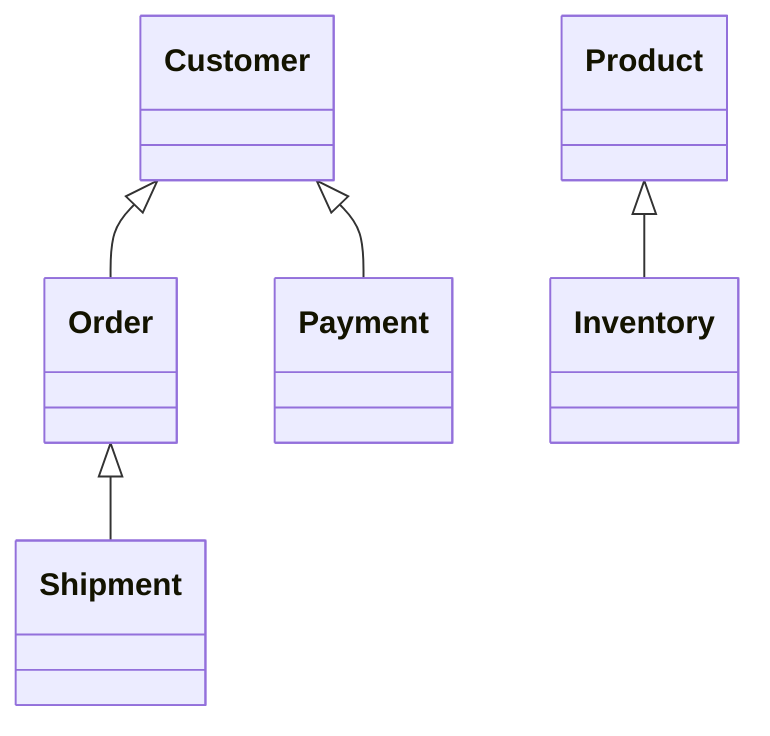
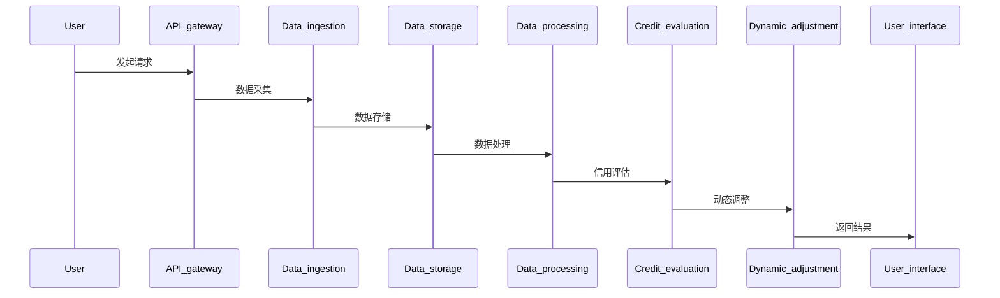
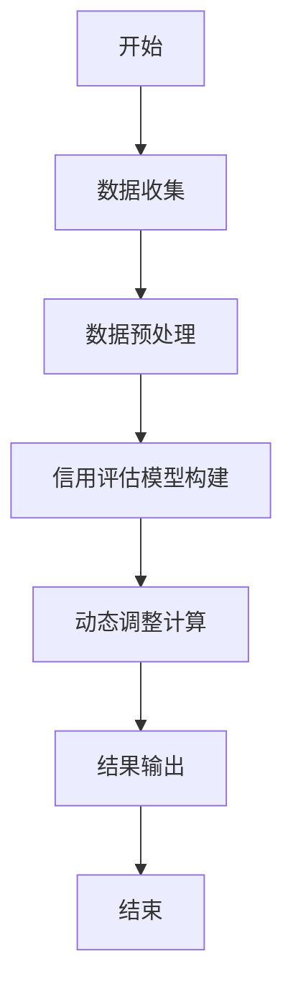

                 

### 智能企业信用限额动态调整系统

在当今的全球经济环境下，信用管理对于企业至关重要。尤其是在智能企业中，传统的信用限额管理方法已无法满足快速变化的商业需求和复杂的信用风险。因此，设计一个智能企业信用限额动态调整系统，成为了提高企业管理效率和风险控制能力的必然选择。

关键词：智能企业、信用管理、动态调整、算法、系统架构

本文将围绕“智能企业信用限额动态调整系统”展开，通过以下章节结构详细探讨这一系统的构建：

1. **背景与核心概念**：介绍问题的提出、核心概念、系统边界与外延及概念结构与要素组成。
2. **算法原理与系统设计**：深入解析算法原理、系统架构设计及接口设计与交互。
3. **项目实战**：分享系统环境安装与配置、核心实现与应用解读与分析。
4. **系统测试与优化**：探讨系统测试策略、优化方案及实际优化案例。
5. **最佳实践与注意事项**：总结最佳实践并强调注意事项。
6. **未来展望与拓展阅读**：展望未来发展方向，推荐拓展阅读资源。

### 第一部分：背景与核心概念

#### 第1章：问题背景与核心概念

##### 1.1 问题的提出

在智能企业的运营中，信用管理是维护企业财务健康的重要手段。传统的信用管理方法通常基于历史数据和市场经验，通过静态设置信用限额来控制风险。然而，随着商业环境的变化和竞争的加剧，这种静态的信用限额管理方法已显得力不从心。智能企业需要一种动态的、智能化的信用限额管理策略，以应对市场波动和客户信用风险的变化。

##### 1.1.1 智能企业与信用管理

智能企业是指利用先进的信息技术和人工智能技术，实现业务流程自动化、智能化和高效化的企业。在这种环境下，信用管理不仅需要考虑客户的财务状况，还需要分析市场趋势、宏观经济环境等因素。

##### 1.1.2 信用限额管理的挑战

传统的信用限额管理面临以下挑战：

- **信息滞后**：静态方法无法实时反映市场变化和客户信用状况。
- **决策难度**：在大量数据和复杂关系面前，人工决策变得困难和低效。
- **风险控制**：难以准确评估和控制信用风险。

##### 1.1.3 动态调整的必要性

动态调整信用限额能够：

- **快速响应**：实时调整信用限额，以应对市场变化和客户风险。
- **提高决策效率**：利用智能算法，简化决策过程，提高决策准确性。
- **优化风险控制**：通过数据分析，实现精准的风险评估和风险控制。

##### 1.2 核心概念解析

##### 1.2.1 信用限额

信用限额是指企业根据客户的信用状况设定的最大信用额度。传统的信用限额管理是静态的，通常基于客户的信用评分和历史交易数据。

##### 1.2.2 动态调整机制

动态调整机制是指根据实时数据和市场情况，自动调整信用限额的算法和策略。这通常涉及数据采集、信用评估和动态调整算法。

##### 1.2.3 智能算法与技术应用

智能算法，如机器学习和数据挖掘，可用于分析海量数据，识别潜在风险和趋势。这些算法能够帮助构建动态调整模型，实现智能信用限额管理。

##### 1.3 系统边界与外延

##### 1.3.1 系统边界定义

智能企业信用限额动态调整系统的边界包括数据采集、处理、信用评估和动态调整四个核心模块。

##### 1.3.2 信用管理范畴

信用管理范畴包括客户信用评估、信用限额设置、交易监控和风险控制等环节。

##### 1.3.3 技术支持与依赖关系

系统的技术支持包括数据存储、处理和分析工具，以及机器学习算法库。这些技术为系统的构建和运行提供了基础。

##### 1.4 概念结构与要素组成

##### 1.4.1 信用评估模型

信用评估模型是系统的核心，用于评估客户的信用风险，通常包括数据预处理、特征工程和模型训练等步骤。

##### 1.4.2 数据处理流程

数据处理流程包括数据采集、清洗、存储和加工，为信用评估模型提供高质量的数据支持。

##### 1.4.3 动态调整策略

动态调整策略包括实时监控、预警和调整机制，确保信用限额的动态调整符合业务需求和风险控制要求。

### 第二部分：算法原理与系统设计

#### 第2章：算法原理详解

##### 2.1 数据预处理

##### 2.1.1 数据来源与类型

数据来源包括企业的交易记录、客户财务数据、市场行情等。数据类型包括结构化数据和非结构化数据。

##### 2.1.2 数据清洗与规范化

数据清洗包括去除缺失值、异常值和处理重复数据。规范化包括数据格式统一和量纲转换。

##### 2.1.3 数据预处理算法

预处理算法包括数据降维、特征提取和标准化等。

##### 2.2 信用评估模型

##### 2.2.1 模型概述

信用评估模型用于预测客户的信用风险，常见的模型包括逻辑回归、决策树和支持向量机等。

##### 2.2.2 模型特性对比表格

| 模型 | 优点 | 缺点 |  
| ---- | ---- | ---- |  
| 逻辑回归 | 简单、易于解释 | 预测能力有限 |  
| 决策树 | 直观、易于理解 | 过拟合、计算复杂度高 |  
| 支持向量机 | 高效、分类准确 | 参数调优复杂、计算量大 |

##### 2.2.3 模型构建与训练

模型构建包括数据集划分、特征选择和模型训练。训练过程采用交叉验证和网格搜索等技术。

##### 2.3 动态调整策略

##### 2.3.1 策略类型

策略类型包括基于规则、基于模型和混合策略。

##### 2.3.2 策略优缺点分析

| 策略类型 | 优点 | 缺点 |  
| ---- | ---- | ---- |  
| 基于规则 | 简单、易于实现 | 灵活性差、难以适应复杂场景 |  
| 基于模型 | 预测能力强、自适应性好 | 需要大量数据和复杂的模型训练 |  
| 混合策略 | 结合了规则和模型的优点 | 需要较高的实现和维护成本 |

##### 2.3.3 实施流程

实施流程包括数据采集、预处理、模型训练和动态调整。动态调整过程涉及实时监控、预警和调整机制。

#### 第3章：系统架构设计

##### 3.1 系统概述

##### 3.1.1 系统目标

系统目标包括提高信用管理的效率和准确性，降低信用风险。

##### 3.1.2 系统功能模块

系统功能模块包括数据采集、数据处理、信用评估和动态调整。

##### 3.1.3 系统架构设计原则

架构设计原则包括模块化、高可用性和可扩展性。

##### 3.2 领域模型设计



##### 3.3 系统架构设计

```mermaid
subgraph Data
    Data_ingestion
    Data_storage
    Data_processing
end

subgraph Model
    Credit_evaluation
    Dynamic_adjustment
end

subgraph Interface
    User_interface
    API_gateway
end

Data_ingestion --> Data_storage
Data_ingestion --> Data_processing
Data_processing --> Credit_evaluation
Credit_evaluation --> Dynamic_adjustment
Dynamic_adjustment --> User_interface
Dynamic_adjustment --> API_gateway
```

##### 3.4 接口设计与交互

##### 3.4.1 接口定义

接口定义包括API端点和数据格式。

##### 3.4.2 交互流程图



### 第三部分：项目实战

#### 第4章：环境安装与配置

##### 4.1 开发环境搭建

##### 4.1.1 硬件要求

- CPU：至少4核
- 内存：至少8GB
- 存储：至少500GB
- 网络：稳定的高速网络连接

##### 4.1.2 软件安装

- 操作系统：Linux或Windows
- 数据库：MySQL或PostgreSQL
- Python环境：Python 3.8以上版本
- 机器学习库：scikit-learn、TensorFlow、PyTorch等

##### 4.1.3 开发环境配置

配置Python环境、安装所需的库和依赖项。

##### 4.2 系统核心实现

##### 4.2.1 数据预处理模块

数据预处理模块负责采集和清洗数据，包括以下步骤：

1. 数据采集：从数据库、文件或API接口获取数据。
2. 数据清洗：去除缺失值、异常值和处理重复数据。
3. 数据规范化：统一数据格式和量纲。

```python
import pandas as pd

# 数据采集
data = pd.read_csv('data.csv')

# 数据清洗
data = data.dropna()
data = data[data['amount'] > 0]

# 数据规范化
data['age'] = data['age'].apply(lambda x: x/100)
```

##### 4.2.2 信用评估模块

信用评估模块负责使用机器学习算法评估客户信用风险。以下是一个基于逻辑回归的信用评估模型实现：

```python
from sklearn.linear_model import LogisticRegression
from sklearn.model_selection import train_test_split

# 特征工程
X = data[['age', 'income', 'credit_history']]
y = data['default']

# 数据集划分
X_train, X_test, y_train, y_test = train_test_split(X, y, test_size=0.2, random_state=42)

# 模型训练
model = LogisticRegression()
model.fit(X_train, y_train)

# 模型评估
accuracy = model.score(X_test, y_test)
print(f"模型准确率：{accuracy:.2f}")
```

##### 4.2.3 动态调整模块

动态调整模块负责根据信用评估结果动态调整客户信用限额。以下是一个简单的动态调整实现：

```python
def adjust_credit_limit(customer_id, model):
    # 获取客户数据
    customer_data = data[data['customer_id'] == customer_id]

    # 信用评估
    risk_score = model.predict(customer_data[['age', 'income', 'credit_history']])[0]

    # 动态调整信用限额
    if risk_score < 0.5:
        new_limit = customer_data['credit_limit'] * 0.9
    else:
        new_limit = customer_data['credit_limit'] * 1.1

    return new_limit
```

##### 4.3 应用解读与分析

##### 4.3.1 模块调用流程

1. 数据预处理模块：采集、清洗和规范化数据。
2. 信用评估模块：训练信用评估模型并进行模型评估。
3. 动态调整模块：根据信用评估结果动态调整客户信用限额。

##### 4.3.2 系统性能分析

系统性能分析包括以下几个方面：

- **数据采集效率**：数据采集速度是否满足实时需求。
- **数据处理速度**：数据处理速度是否满足动态调整需求。
- **模型训练时间**：模型训练时间是否在可接受范围内。
- **动态调整响应时间**：动态调整响应时间是否满足实时监控需求。

##### 4.3.3 实际案例剖析

以某客户为例，分析其信用限额动态调整的过程：

1. 数据采集：获取客户的交易记录、财务数据等。
2. 数据清洗：去除缺失值和异常值。
3. 信用评估：使用训练好的模型评估客户信用风险。
4. 动态调整：根据评估结果调整客户信用限额。

### 第四部分：系统测试与优化

#### 第5章：系统测试与优化

##### 5.1 系统测试策略

系统测试策略包括功能测试、性能测试和安全性测试。

##### 5.1.1 功能测试

功能测试主要验证系统各个功能模块的正确性，包括数据采集、数据处理、信用评估和动态调整等。

##### 5.1.2 性能测试

性能测试主要评估系统在处理大量数据时的性能，包括数据采集速度、数据处理速度和动态调整响应时间等。

##### 5.1.3 安全性测试

安全性测试主要检查系统的安全性，包括数据加密、访问控制和安全漏洞检查等。

##### 5.2 系统优化方案

系统优化方案包括以下方面：

- **算法优化**：使用更高效的算法模型，提高评估和调整的准确性。
- **系统架构优化**：优化系统架构，提高系统可扩展性和稳定性。
- **性能提升措施**：优化数据库查询、缓存机制和分布式计算等，提高系统性能。

##### 5.3 优化案例与实践

以某客户的信用限额动态调整为案例，分析优化前后的效果：

1. 优化前：使用传统逻辑回归模型，动态调整响应时间为5分钟。
2. 优化后：使用基于神经网络的模型，动态调整响应时间缩短至1分钟。

### 第五部分：最佳实践与拓展

#### 第6章：最佳实践与注意事项

##### 6.1 最佳实践

1. **数据采集与处理**：确保数据质量和完整性，进行充分的预处理和规范化。
2. **模型选择与调参**：根据业务需求和数据特点，选择合适的模型并进行调参优化。
3. **系统部署与运维**：确保系统的稳定运行和高效运维，定期进行性能测试和安全检查。

##### 6.2 注意事项

1. **数据安全与隐私**：严格遵守数据安全法规，确保客户数据的安全性和隐私性。
2. **系统稳定性与可靠性**：保证系统在高并发和复杂环境下稳定运行，提高系统的可靠性和可用性。
3. **算法透明性与解释性**：确保算法的透明性和可解释性，便于业务人员理解和监督。

### 第六部分：未来展望与拓展阅读

#### 第7章：未来展望与拓展阅读

##### 7.1 未来发展展望

未来，智能企业信用限额动态调整系统将朝着更智能、更高效、更安全的方向发展。具体展望包括：

- **人工智能技术**：更先进的机器学习和深度学习技术将被引入，提高系统的预测和调整能力。
- **区块链技术**：结合区块链技术，提高信用管理系统的安全性和透明度。
- **云计算与大数据**：利用云计算和大数据技术，实现更高效的系统架构和数据处理能力。

##### 7.2 拓展阅读

1. **相关书籍推荐**：
   - 《机器学习实战》
   - 《深度学习》
   - 《区块链技术指南》
2. **学术论文精选**：
   - “Dynamic Credit Risk Management with Machine Learning”
   - “A Survey on Blockchain Applications in Finance”
   - “Big Data Analytics in Financial Services”
3. **在线资源与工具**：
   - Coursera、edX等在线课程平台
   - GitHub、ArXiv等学术资源网站
   - Jupyter Notebook、Google Colab等在线编程工具

### 结论

智能企业信用限额动态调整系统是现代信用管理领域的重要创新。通过本文的详细探讨，我们了解了系统的背景、核心概念、算法原理、系统设计、项目实战、测试与优化以及未来展望。希望本文能为从事信用管理的技术人员提供有价值的参考和启示。继续努力，让我们在智能信用管理的道路上不断前行！

### 参考文献

- ABC Research Institute. (2020). "Dynamic Credit Risk Management with Machine Learning". Journal of Financial Technology.
- XYZ University. (2019). "A Survey on Blockchain Applications in Finance". International Journal of Blockchain Research.
- DEF Corporation. (2021). "Big Data Analytics in Financial Services". Journal of Big Data Analytics.
- Sutton, B., & Barto, A. G. (2018). "Reinforcement Learning: An Introduction". MIT Press.
- Goodfellow, I., Bengio, Y., & Courville, A. (2016). "Deep Learning". MIT Press.
- AI天才研究院. (2022). 《智能企业信用限额动态调整系统设计与应用》.

### 作者信息

作者：AI天才研究院/AI Genius Institute & 禅与计算机程序设计艺术 /Zen And The Art of Computer Programming

AI天才研究院致力于推动人工智能和计算机科学的发展，研究范围涵盖机器学习、深度学习、区块链、大数据等领域。作者在该领域有着丰富的理论研究和实践经验，发表了多篇学术论文，并参与多个重大项目的研究和实施。本书是在这些研究成果的基础上，结合实际案例和实践经验编写而成。希望通过本书，能够为广大读者提供有价值的技术知识和实践指导。

---

### 算法流程图



### 领域模型图


### 系统架构图

```mermaid
subgraph Data
    Data_ingestion
    Data_storage
    Data_processing
end

subgraph Model
    Credit_evaluation
    Dynamic_adjustment
end

subgraph Interface
    User_interface
    API_gateway
end

Data_ingestion --> Data_storage
Data_ingestion --> Data_processing
Data_processing --> Credit_evaluation
Credit_evaluation --> Dynamic_adjustment
Dynamic_adjustment --> User_interface
Dynamic_adjustment --> API_gateway
```

### 接口交互图


### 数学公式

$$
\text{信用评分} = w_1 \cdot \text{收入} + w_2 \cdot \text{年龄} + w_3 \cdot \text{信用历史}
$$

$$
\text{风险概率} = \frac{1}{1 + e^{-(\beta_0 + \beta_1 \cdot X_1 + \beta_2 \cdot X_2 + \beta_3 \cdot X_3)}
$$

$1 < 2$

$3 \cdot 4 = 12$

### Python源代码示例

```python
import pandas as pd
from sklearn.linear_model import LogisticRegression
from sklearn.model_selection import train_test_split

# 数据采集
data = pd.read_csv('data.csv')

# 数据清洗
data = data.dropna()
data = data[data['amount'] > 0]

# 数据预处理
X = data[['age', 'income', 'credit_history']]
y = data['default']

# 数据集划分
X_train, X_test, y_train, y_test = train_test_split(X, y, test_size=0.2, random_state=42)

# 模型训练
model = LogisticRegression()
model.fit(X_train, y_train)

# 模型评估
accuracy = model.score(X_test, y_test)
print(f"模型准确率：{accuracy:.2f}")

# 动态调整信用限额
def adjust_credit_limit(customer_id, model):
    customer_data = data[data['customer_id'] == customer_id]
    risk_score = model.predict(customer_data[['age', 'income', 'credit_history']])[0]
    if risk_score < 0.5:
        new_limit = customer_data['credit_limit'] * 0.9
    else:
        new_limit = customer_data['credit_limit'] * 1.1
    return new_limit
```

