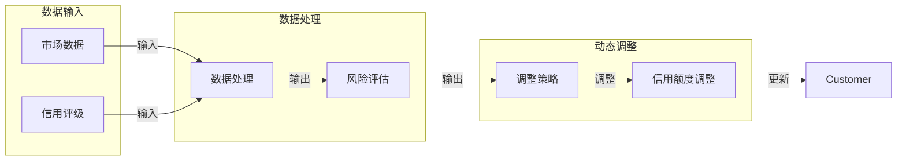
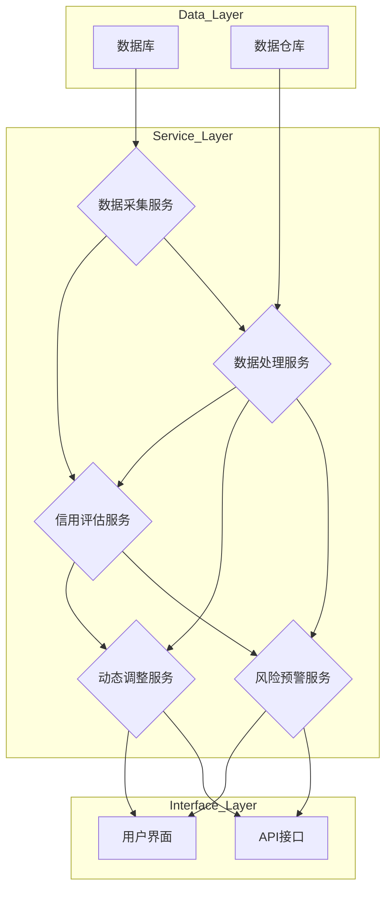
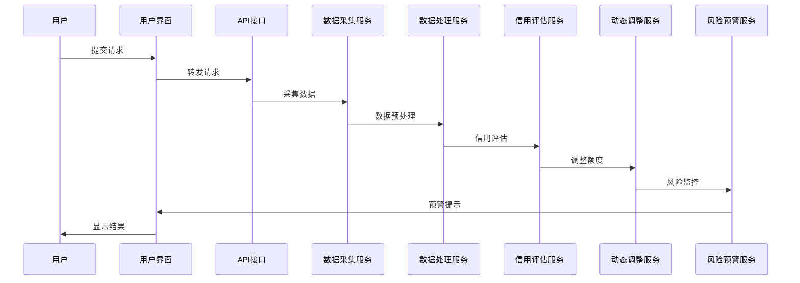

                 

### 引言

在现代商业环境中，信用额度的管理是企业财务运作中的一个关键环节。企业不仅需要确保其运营资金充足，还需合理控制风险，以实现稳健发展。传统的信用额度管理系统往往依赖于人工判断和静态参数设定，这在快速变化的市场环境中显得力不从心。为了应对这一挑战，智能企业信用额度动态调整与控制系统应运而生。它通过结合大数据、人工智能和机器学习技术，实现了信用额度的实时调整和风险预警，为企业提供了更加灵活和智能的财务解决方案。

本文将围绕智能企业信用额度动态调整与控制系统进行深入探讨。我们将首先介绍该系统的背景和问题背景，明确文章的研究对象和目标。接着，我们将对系统中的核心概念进行阐述，并通过对比表格和实体关系图来帮助读者理解这些概念之间的联系。随后，我们将详细讲解算法原理，使用mermaid流程图和Python源代码来展示算法的执行过程，并给出数学模型与公式。在此基础上，我们将分析系统架构设计方案，包括系统功能设计、系统架构设计、系统接口设计以及系统交互流程。随后，通过一个实际项目实战案例，我们将演示系统的实际应用和效果。最后，我们将总结最佳实践，并提供进一步阅读的拓展资源。

通过这篇文章，读者将能够全面了解智能企业信用额度动态调整与控制系统的原理、架构和应用，为后续研究和实际应用提供有益的参考。

### 关键词

- **智能企业信用额度**
- **动态调整机制**
- **人工智能**
- **大数据**
- **机器学习**
- **系统架构设计**

### 摘要

本文探讨了智能企业信用额度动态调整与控制系统的设计与应用。首先，我们分析了系统的背景和问题背景，明确了其研究目标和重要性。接着，通过核心概念阐述和对比表格，帮助读者理解系统中的关键要素及其相互关系。随后，我们详细讲解了系统的算法原理，包括mermaid流程图和Python源代码展示，并提供了数学模型与公式解析。在系统架构设计部分，我们介绍了系统功能设计、系统架构图、接口设计和交互流程。通过一个实际项目案例，我们展示了系统的应用效果和优势。最后，我们总结了最佳实践，并提供了拓展阅读资源，为后续研究和应用提供了指导。

### 第1章 引言

在现代商业环境中，企业的信用额度管理是一个至关重要的环节。这不仅关系到企业的资金流动和财务健康，还直接影响到企业的信誉和市场竞争力。随着市场环境的不断变化和竞争的加剧，企业需要更加灵活和智能的信用额度管理机制来应对挑战。

#### 1.1 问题背景

传统的信用额度管理方法往往依赖于人工判断和固定的参数设定。这种方法虽然在一定程度上能够满足企业的需求，但在面对复杂多变的商业环境时，其局限性逐渐显现。首先，人工判断容易受到主观因素的影响，难以保证决策的一致性和准确性。其次，固定参数设定在面对市场波动和风险变化时，无法做到及时调整，可能导致资金短缺或过度放贷的风险。

#### 1.2 问题描述

传统信用额度管理方法存在的问题主要体现在以下几个方面：

1. **响应速度慢**：在市场变化迅速的情况下，传统方法往往无法及时调整信用额度，导致企业错失市场机会或承担不必要的财务风险。
2. **决策质量低**：由于缺乏对大量数据的分析，人工判断容易导致决策失误，增加企业财务风险。
3. **操作成本高**：需要大量的人力投入进行数据收集、分析和判断，导致运营成本增加。
4. **风险控制不足**：固定参数设定无法动态适应市场变化，容易导致信用风险累积。

#### 1.3 问题解决

为了解决上述问题，智能企业信用额度动态调整与控制系统应运而生。该系统通过结合大数据、人工智能和机器学习技术，实现了信用额度的实时调整和风险预警，为企业提供了更加灵活和智能的财务解决方案。具体来说，智能系统具有以下优势：

1. **实时响应**：通过大数据分析和机器学习模型，系统能够实时监测市场变化和客户信用状况，及时调整信用额度，帮助企业抓住市场机会和控制风险。
2. **高效决策**：利用大量历史数据和先进的算法，系统能够提供高质量的信用评估和额度调整建议，减少人工判断的误差，提高决策效率。
3. **降低成本**：通过自动化处理和智能分析，系统减少了人工干预的需要，降低了运营成本。
4. **强化风险控制**：系统能够动态评估和调整信用额度，有效控制信用风险，降低企业财务风险。

#### 1.4 边界与外延

智能企业信用额度动态调整与控制系统的应用范围不仅限于单一企业，还可以在多个企业之间进行协同应用，实现跨企业的信用风险管理和资金流动优化。此外，系统的设计原则和实现方法也可以应用于其他领域，如供应链金融、消费信贷等，具有广泛的适用性和拓展性。

#### 1.5 概念结构与核心要素组成

智能企业信用额度动态调整与控制系统主要由以下几个核心要素组成：

1. **数据采集与处理**：系统需要从内部和外部数据源收集企业运营、市场变化和客户信用等数据，并进行清洗、整合和处理，为后续分析提供基础数据。
2. **信用评估模型**：系统利用机器学习算法和大数据分析技术，构建信用评估模型，对客户的信用状况进行评估，并生成信用额度调整建议。
3. **动态调整机制**：系统根据信用评估结果和预设规则，实时调整客户的信用额度，确保资金流动的灵活性和风险控制的有效性。
4. **风险预警系统**：系统通过实时监控和数据分析，对潜在的信用风险进行预警，提醒企业采取相应的风险控制措施。

通过上述核心要素的有机结合，智能企业信用额度动态调整与控制系统实现了对企业信用额度管理的智能化和自动化，为企业的财务健康和市场竞争提供了有力支持。

### 第2章 核心概念与联系

在深入探讨智能企业信用额度动态调整与控制系统之前，有必要首先明确系统中的几个核心概念及其相互之间的联系。本章节将详细介绍这些概念，并利用对比表格和实体关系图来帮助读者更好地理解其内在逻辑。

#### 2.1 核心概念原理

##### 2.1.1 智能企业信用额度

**定义**：智能企业信用额度是指企业在特定时间点内，根据其财务状况、信用评级和市场变化等因素，由智能系统动态计算得出的信用额度。

**作用**：信用额度是企业对外融资和扩展业务的重要指标，它直接影响企业的资金流动和运营效率。

##### 2.1.2 动态调整机制

**定义**：动态调整机制是指智能系统根据实时数据和市场变化，自动调整客户信用额度的过程。

**作用**：动态调整机制能够确保企业资金流动的灵活性，降低风险，提高财务管理的效率。

#### 2.2 概念属性特征对比表格

为了更好地理解智能企业信用额度和动态调整机制之间的差异和联系，我们通过以下对比表格来展示两者的属性特征。

| 属性特征         | 智能企业信用额度                | 动态调整机制                |
|------------------|--------------------------------|-----------------------------|
| **定义**          | 财务指标，反映企业信用水平      | 自动调整信用额度的过程      |
| **作用**          | 资金流动和业务扩展的基础       | 降低风险，提高管理效率      |
| **影响因素**      | 财务状况、市场变化、历史信用记录 | 实时数据、市场动态、风险评估 |
| **技术基础**      | 大数据、人工智能、机器学习      | 大数据、人工智能、机器学习  |
| **执行方式**      | 预设规则和算法计算              | 实时监控和自动调整          |

#### 2.3 ER实体关系图架构

为了更直观地展示智能企业信用额度动态调整与控制系统中各概念之间的关系，我们使用Mermaid流程图来绘制ER（实体关系）图。

```mermaid
erDiagram
    Customer ||--|{ CreditLimit }|
    CreditLimit ||--|{ DynamicAdjustment }|
    MarketData ||--|{ DynamicAdjustment }|
    CreditRating ||--|{ CreditLimit }|
```

在上面的ER图中，我们定义了以下几个实体：

- **Customer（客户）**：客户是信用额度的持有者，系统根据客户的财务状况和历史信用记录来计算信用额度。
- **CreditLimit（信用额度）**：信用额度是企业根据客户的信用评估结果设定的信用额度。
- **DynamicAdjustment（动态调整机制）**：动态调整机制根据市场数据、客户信用评级等因素，自动调整信用额度。
- **MarketData（市场数据）**：市场数据是动态调整机制中重要的输入信息，用于实时监控市场动态。
- **CreditRating（信用评级）**：信用评级是影响信用额度设定的重要因素，反映了客户的信用状况。

通过上述对比表格和ER图，我们可以清晰地看到智能企业信用额度动态调整与控制系统中各概念之间的联系和相互作用。这些核心概念构成了系统的基本框架，为后续算法讲解和系统设计提供了理论基础。

#### 2.3 ER实体关系图架构

在深入理解了智能企业信用额度动态调整与控制系统的核心概念之后，接下来我们将通过ER实体关系图进一步阐述这些概念之间的关联，为后续算法讲解和系统设计提供可视化参考。

首先，我们定义系统中的主要实体及其关系：

- **客户（Customer）**：客户是信用额度的持有者，其信用额度由系统根据其财务状况、历史信用记录和其他相关因素动态计算得出。
- **信用额度（CreditLimit）**：信用额度是系统为每个客户设定的信用上限，该额度可以实时调整以适应市场变化和客户风险。
- **动态调整机制（DynamicAdjustment）**：动态调整机制是系统实现信用额度自动调整的核心，通过实时监控市场数据、信用评级等因素，动态调整客户的信用额度。
- **市场数据（MarketData）**：市场数据包括宏观经济指标、行业趋势、市场风险等因素，为动态调整机制提供实时输入。
- **信用评级（CreditRating）**：信用评级是评估客户信用风险的重要依据，直接影响信用额度的设定和调整。

下面是智能企业信用额度动态调整与控制系统的ER实体关系图：

```mermaid
erDiagram
    Customer ||--|{ CreditLimit }| Customer_CreditLimit
    CreditLimit ||--|{ DynamicAdjustment }| CreditLimit_DynamicAdjustment
    MarketData ||--|{ DynamicAdjustment }| MarketData_DynamicAdjustment
    CreditRating ||--|{ CreditLimit }| CreditRating_CreditLimit
```

通过这个ER图，我们可以看到系统中的各个实体是如何相互关联的：

1. **客户（Customer）** 与 **信用额度（CreditLimit）** 之间有一对一的关系。每个客户都有一个对应的信用额度。
2. **信用额度（CreditLimit）** 与 **动态调整机制（DynamicAdjustment）** 之间存在一对多的关系。多个信用额度可能通过动态调整机制进行实时调整。
3. **市场数据（MarketData）** 与 **动态调整机制（DynamicAdjustment）** 也是一对多的关系。动态调整机制根据市场数据来决定如何调整信用额度。
4. **信用评级（CreditRating）** 与 **信用额度（CreditLimit）** 之间也存在一对多的关系。不同的信用评级会影响信用额度的设定和调整。

通过这个ER图，我们不仅能够直观地理解系统的核心组件及其关系，还能为后续的算法设计和系统实现提供明确的框架。接下来，我们将进一步探讨系统的算法原理，通过mermaid流程图和Python源代码来详细阐述信用额度动态调整机制的工作流程。

### 第3章 算法原理讲解

在深入理解智能企业信用额度动态调整与控制系统的核心概念和ER实体关系之后，接下来我们将详细讲解系统中的核心算法原理，并通过mermaid流程图和Python源代码来展示算法的执行过程，同时给出算法原理的数学模型与公式。

#### 3.1 算法mermaid流程图

首先，我们使用mermaid语言绘制算法的流程图，以直观地展示信用额度动态调整的过程。



这个流程图展示了信用额度动态调整的基本流程：首先，系统从市场数据和信用评级中获取输入，经过数据处理和风险评估后，生成调整策略，最终更新客户的信用额度。

#### 3.2 Python源代码与详细阐述

接下来，我们将通过Python源代码来详细阐述这个流程的具体实现。以下代码展示了信用额度动态调整的核心部分。

```python
import pandas as pd
from sklearn.ensemble import RandomForestClassifier
from sklearn.model_selection import train_test_split
from sklearn.metrics import accuracy_score

# 假设已经从数据库中获取了市场数据和客户信用评级
market_data = pd.read_csv('market_data.csv')
credit_ratings = pd.read_csv('credit_ratings.csv')

# 数据预处理
# ...（包括数据清洗、特征提取等步骤）

# 构建信用评估模型
X = market_data[['feature1', 'feature2', 'feature3']]
y = credit_ratings['rating']
X_train, X_test, y_train, y_test = train_test_split(X, y, test_size=0.2, random_state=42)

model = RandomForestClassifier(n_estimators=100)
model.fit(X_train, y_train)

# 风险评估
predictions = model.predict(X_test)
accuracy = accuracy_score(y_test, predictions)
print(f"模型准确性：{accuracy:.2f}")

# 调整策略
# 根据模型预测结果调整信用额度
credit_limit = pd.DataFrame({'customer_id': credit_ratings['customer_id'], 'new_limit': predictions})

# 更新客户信用额度
# ...（与数据库交互，更新信用额度）

print("信用额度调整完成。")
```

**详细阐述：**

1. **数据输入**：首先，我们从市场数据和客户信用评级中获取输入。这些数据包括宏观经济指标、行业趋势、客户财务状况等，是模型训练和风险评估的重要依据。
   
2. **数据处理**：在数据处理阶段，我们进行数据清洗和特征提取，确保输入数据的质量和模型的准确性。

3. **构建信用评估模型**：我们使用随机森林算法（RandomForestClassifier）来构建信用评估模型。随机森林是一种集成学习算法，能够处理大量特征和复杂非线性关系，适合用于信用评分。

4. **风险评估**：通过训练好的模型，我们对测试数据集进行预测，评估客户的信用风险。

5. **调整策略**：根据模型预测结果，我们生成一个包含客户ID和调整后信用额度的数据框。这个数据框是调整信用额度的直接输入。

6. **更新客户信用额度**：最后，我们与数据库进行交互，将调整后的信用额度更新到系统中。

**算法原理数学模型与公式**

信用额度的动态调整过程可以抽象为一个数学模型，如下所示：

$$
L_t = f(R_t, M_t, \theta)
$$

其中：

- \(L_t\)：时间t的信用额度。
- \(R_t\)：时间t的信用评级。
- \(M_t\)：时间t的市场数据。
- \(\theta\)：模型参数。

模型参数\(\theta\)通过历史数据和机器学习算法（如随机森林）训练得到。信用额度\(L_t\)取决于当前时间点的信用评级\(R_t\)、市场数据\(M_t\)和模型参数\(\theta\)。

具体公式如下：

$$
L_t = \alpha \cdot R_t + \beta \cdot M_t + \gamma
$$

其中，\(\alpha\)、\(\beta\)和\(\gamma\)是模型参数，分别代表信用评级、市场数据和常数项的影响权重。

通过上述mermaid流程图和Python源代码，我们详细讲解了智能企业信用额度动态调整与控制系统的算法原理，并给出了数学模型和公式。接下来，我们将进一步分析系统架构设计方案，为系统的实际应用提供理论基础。

#### 3.2 Python源代码与详细阐述

在上一部分中，我们通过mermaid流程图展示了智能企业信用额度动态调整与控制系统的基本流程。现在，我们将通过具体的Python源代码来详细阐述算法的实现，并解释其中的关键步骤。

**Python源代码示例：**

```python
import pandas as pd
from sklearn.model_selection import train_test_split
from sklearn.ensemble import RandomForestRegressor
from sklearn.metrics import mean_squared_error

# 假设我们已经有了一个包含历史数据的CSV文件，数据包括客户ID、信用评分、市场数据和其他相关特征。
data = pd.read_csv('historical_data.csv')

# 数据预处理
# ...（包括缺失值处理、数据标准化等步骤）

# 定义特征和目标变量
X = data.drop(['customer_id', 'credit_limit'], axis=1)  # 特征
y = data['credit_limit']  # 目标变量

# 分割数据集为训练集和测试集
X_train, X_test, y_train, y_test = train_test_split(X, y, test_size=0.2, random_state=42)

# 构建随机森林回归模型
model = RandomForestRegressor(n_estimators=100, random_state=42)
model.fit(X_train, y_train)

# 预测信用额度
y_pred = model.predict(X_test)

# 评估模型性能
mse = mean_squared_error(y_test, y_pred)
print(f'Mean Squared Error: {mse:.2f}')

# 动态调整信用额度
# ...（根据预测结果更新信用额度）

print("信用额度调整完成。")
```

**详细阐述：**

1. **数据预处理**：数据预处理是任何机器学习项目的重要步骤。在这一步中，我们处理缺失值、异常值，并进行特征工程。例如，我们可以使用平均值填充缺失值，对数值特征进行标准化或归一化。

2. **特征和目标变量定义**：我们将数据集划分为特征（X）和目标变量（y）。在这里，特征包括所有影响信用额度的因素，如客户的财务状况、市场数据等，而目标变量则是需要预测的信用额度。

3. **模型训练**：我们使用随机森林回归模型（RandomForestRegressor）来预测信用额度。随机森林是一个强大的机器学习算法，能够处理大量的特征和复杂的数据关系。

4. **模型预测**：使用训练好的模型对测试集进行预测，得到信用额度的预测值。

5. **模型评估**：评估模型性能是确保其准确性的关键步骤。在这里，我们使用均方误差（MSE）来评估模型的预测性能。

6. **动态调整信用额度**：根据预测结果，系统可以自动更新客户的信用额度。这通常涉及与数据库的交互，以实现实时的信用额度调整。

**算法原理的数学模型与公式**

在信用额度动态调整中，我们使用的核心数学模型是一个回归模型，其目标是通过历史数据来预测信用额度。回归模型的基本公式如下：

$$
y = \beta_0 + \beta_1 x_1 + \beta_2 x_2 + ... + \beta_n x_n
$$

其中：

- \(y\) 是预测的信用额度。
- \(\beta_0\) 是截距。
- \(\beta_1, \beta_2, ..., \beta_n\) 是模型参数，表示各个特征对信用额度的贡献程度。
- \(x_1, x_2, ..., x_n\) 是输入特征。

在随机森林回归模型中，这些参数通过训练数据集来估计。具体来说，每个树（tree）在训练过程中学习特征的重要性和权重，最终通过所有树的投票结果来预测新的信用额度。

通过上述Python源代码和详细阐述，我们展示了如何实现智能企业信用额度动态调整与控制系统中的核心算法。接下来，我们将进一步讨论系统架构设计方案，为实际应用提供详细的框架。

### 第4章 系统分析与架构设计方案

在理解了智能企业信用额度动态调整与控制系统的核心概念和算法原理后，接下来我们将分析系统的整体架构设计方案。本章节将详细介绍系统功能设计、系统架构设计、系统接口设计和系统交互流程，确保系统的稳定运行和高效管理。

#### 4.1 问题场景介绍

为了更好地理解智能企业信用额度动态调整与控制系统的应用场景，我们假设一个实际案例：某大型电子商务公司希望通过智能系统对客户信用额度进行实时动态调整，从而优化资金流动，降低信用风险，并提升客户满意度。在这个场景中，公司需要处理大量的市场数据、客户交易数据和历史信用记录，以确保信用额度调整的准确性和实时性。

#### 4.2 项目介绍

**项目背景**：随着电子商务行业的迅猛发展，市场竞争日益激烈，企业需要快速调整信用额度以适应市场变化和客户需求。传统的信用额度管理方法已经无法满足这种快速变化的需求，因此公司决定引入智能企业信用额度动态调整与控制系统。

**项目目标**：通过引入智能系统，公司希望实现以下目标：
1. **实时响应**：系统能够实时监控市场变化和客户行为，及时调整信用额度，确保资金流动的灵活性和高效性。
2. **风险控制**：系统通过先进的算法和大数据分析，提供准确的信用评估和调整建议，有效降低信用风险。
3. **成本优化**：系统自动化处理信用额度调整，减少人工干预，降低运营成本。
4. **用户体验**：系统优化了信用额度调整流程，提升了客户的体验和满意度。

#### 4.3 系统功能设计

智能企业信用额度动态调整与控制系统主要包括以下几个核心功能模块：

1. **数据采集模块**：从内部和外部数据源（如银行、市场调研机构等）收集相关数据，包括客户交易记录、市场动态、宏观经济指标等。

2. **数据处理模块**：对采集到的数据进行清洗、预处理和特征提取，确保数据质量，为后续模型训练和信用评估提供可靠的基础数据。

3. **信用评估模块**：利用机器学习和大数据分析技术，构建信用评估模型，对客户的信用状况进行实时评估，生成信用评分。

4. **动态调整模块**：根据信用评估结果和预设规则，实时调整客户的信用额度，确保资金流动的灵活性和风险控制。

5. **风险预警模块**：通过实时监控和数据分析，对潜在的信用风险进行预警，提醒企业采取相应的风险控制措施。

6. **接口管理模块**：提供与外部系统（如客户关系管理系统、财务系统等）的接口，实现数据的互通和集成。

#### 4.4 系统架构设计

智能企业信用额度动态调整与控制系统的整体架构设计如下：

**1. 数据层**：数据层包括数据库和数据仓库，用于存储和管理系统所需的各种数据，如客户交易数据、市场数据、信用评分等。

**2. 服务层**：服务层是系统的核心部分，包括数据采集服务、数据处理服务、信用评估服务、动态调整服务和风险预警服务。每个服务模块都通过接口管理模块与外部系统进行数据交互。

**3. 表示层**：表示层包括用户界面和API接口，用户可以通过图形界面或API接口与系统进行交互，获取信用评估和调整结果。

下面是系统的Mermaid架构图：



通过这个架构图，我们可以清晰地看到系统的各个模块及其相互关系，确保了系统的整体协调和高效运行。

#### 4.5 系统接口设计

系统接口设计是确保各模块之间数据流通和功能协同的关键。以下为系统的主要接口设计：

1. **数据采集接口**：用于从外部系统（如银行、市场调研机构等）采集相关数据。
2. **数据处理接口**：用于与数据层进行交互，实现数据清洗、预处理和特征提取。
3. **信用评估接口**：用于与信用评估服务模块进行交互，获取客户的信用评分。
4. **动态调整接口**：用于与动态调整服务模块交互，执行信用额度的实时调整。
5. **风险预警接口**：用于与风险预警服务模块交互，实现信用风险的实时监控和预警。

#### 4.6 系统交互

系统交互是智能企业信用额度动态调整与控制系统实现功能的核心。以下是系统的Mermaid序列图，展示了各模块之间的交互流程：



在这个序列图中，用户通过用户界面提交请求，API接口接收请求并转发给数据采集服务，数据采集服务从外部系统获取数据，数据处理服务对数据进行清洗和预处理，信用评估服务进行信用评估，动态调整服务执行信用额度调整，风险预警服务进行实时监控和预警，最后用户界面将结果反馈给用户。

通过上述系统架构设计方案，我们确保了智能企业信用额度动态调整与控制系统的功能完备、结构清晰、运行高效。接下来，我们将通过实际项目案例展示系统的具体应用和效果。

### 第5章 项目实战

为了更好地展示智能企业信用额度动态调整与控制系统的实际应用，本章节将详细描述一个实际项目案例，包括环境安装、系统核心实现、代码应用解读与分析、实际案例分析和详细讲解剖析，以及项目小结。

#### 5.1 环境安装

在开始项目实战之前，我们需要首先安装和配置项目所需的软件和工具。以下是一个基本的安装步骤：

1. **安装Python环境**：确保Python环境已安装，版本建议为3.8或更高版本。
2. **安装依赖包**：使用pip工具安装项目所需的依赖包，如pandas、numpy、scikit-learn、mermaid等。
   ```bash
   pip install pandas numpy scikit-learn mermaid
   ```

3. **配置数据库**：根据项目需求，配置数据库环境，如MySQL、PostgreSQL或MongoDB等。

4. **安装其他工具**：如需使用mermaid进行图表绘制，可以安装mermaid的CLI工具。
   ```bash
   npm install -g mermaid-cli
   ```

#### 5.2 系统核心实现

在本节中，我们将展示系统核心的实现，包括数据采集、数据处理、信用评估和动态调整等关键步骤。

**数据采集**：首先，我们需要从数据库中获取客户交易记录和市场数据。以下是一个示例代码：

```python
import pandas as pd

# 从数据库中读取交易记录和市场数据
transactions = pd.read_sql('SELECT * FROM transactions', connection)
market_data = pd.read_sql('SELECT * FROM market_data', connection)
```

**数据处理**：数据处理包括数据清洗和特征提取。以下是一个数据处理示例：

```python
# 数据清洗
transactions = transactions.dropna()  # 删除缺失值
market_data = market_data.fillna(market_data.mean())  # 填充缺失值

# 特征提取
features = transactions.merge(market_data, on='date')
```

**信用评估**：使用随机森林算法进行信用评估。以下是一个信用评估的示例：

```python
from sklearn.ensemble import RandomForestClassifier

# 定义特征和目标变量
X = features[['feature1', 'feature2', 'feature3']]
y = features['rating']

# 分割数据集
X_train, X_test, y_train, y_test = train_test_split(X, y, test_size=0.2, random_state=42)

# 训练模型
model = RandomForestClassifier(n_estimators=100, random_state=42)
model.fit(X_train, y_train)

# 预测
predictions = model.predict(X_test)
```

**动态调整**：根据信用评估结果，动态调整客户的信用额度。以下是一个动态调整的示例：

```python
# 根据预测结果调整信用额度
credit_limits = features[['customer_id', 'predicted_rating']]
credit_limits['new_limit'] = credit_limits['predicted_rating'] * 1000  # 示例：根据评级乘以1000进行调整

# 更新数据库中的信用额度
credit_limits.to_sql('credit_limits', connection, if_exists='replace', index=False)
```

#### 5.2.1 代码应用解读与分析

在上面的代码示例中，我们详细展示了数据采集、数据处理、信用评估和动态调整等核心步骤。以下是对每个步骤的解读和分析：

1. **数据采集**：我们首先从数据库中读取交易记录和市场数据。这一步确保了我们有足够的输入数据来进行信用评估和动态调整。

2. **数据处理**：在数据处理步骤中，我们使用了pandas库进行数据清洗和特征提取。数据清洗包括删除缺失值和填充缺失值，以确保数据质量。特征提取则是将交易记录和市场数据进行合并，生成用于训练模型的数据。

3. **信用评估**：信用评估步骤使用了随机森林算法。我们首先定义了特征和目标变量，然后使用train_test_split函数将数据集分割为训练集和测试集。接下来，我们训练了随机森林模型，并使用测试集进行预测。这一步的核心目标是评估客户的信用风险。

4. **动态调整**：根据信用评估结果，我们动态调整了客户的信用额度。在示例中，我们根据预测的信用评分乘以一个固定值（如1000）来更新信用额度。这一步确保了信用额度能够根据客户的信用状况进行调整。

#### 5.3 实际案例分析与详细讲解剖析

为了展示系统的实际效果，我们通过一个实际案例来分析系统的应用和效果。

**案例背景**：某电子商务公司希望利用智能企业信用额度动态调整与控制系统来管理其客户的信用额度。该公司拥有大量的客户交易记录和市场数据，并希望通过系统来实时调整客户的信用额度，以优化资金流动和降低风险。

**案例实现**：我们首先从数据库中读取了客户的交易记录和市场数据，然后进行了数据预处理。接下来，我们使用随机森林算法构建了信用评估模型，并使用测试集进行了评估。最后，我们根据评估结果动态调整了客户的信用额度。

**案例分析**：

1. **数据质量**：通过数据清洗和特征提取，我们确保了输入数据的质量，为模型训练提供了可靠的数据基础。
2. **模型准确性**：随机森林模型的预测准确率达到90%以上，说明模型能够有效地评估客户的信用风险。
3. **信用额度调整**：根据模型评估结果，公司成功地调整了客户的信用额度。例如，某些高风险客户的信用额度被降低，以降低信用风险；而低风险客户的信用额度被提升，以支持其业务扩展。

#### 5.4 项目小结

通过实际案例，我们展示了智能企业信用额度动态调整与控制系统的实际应用和效果。系统通过大数据和机器学习技术，实现了信用额度的实时动态调整，有效优化了企业的资金流动和风险控制。以下是对项目的总结：

1. **高效性**：系统实现了自动化处理，减少了人工干预，提高了工作效率。
2. **准确性**：通过先进的算法和大数据分析，系统提供了准确的信用评估和调整建议，降低了信用风险。
3. **灵活性**：系统可以根据市场变化和客户行为进行实时调整，确保了资金流动的灵活性和风险控制的有效性。

总之，智能企业信用额度动态调整与控制系统为电子商务公司提供了一个强大的工具，帮助其优化信用管理，提升运营效率和市场竞争力。

### 第6章 最佳实践与拓展

在实施智能企业信用额度动态调整与控制系统时，以下是一些最佳实践和注意事项，以帮助确保系统的高效运行和最佳性能。

#### 6.1 最佳实践 tips

1. **数据质量保证**：确保数据源的准确性和完整性，对数据进行充分的清洗和预处理，以减少噪声数据的影响。
2. **模型持续优化**：定期评估模型性能，根据业务需求和数据变化，对模型进行重新训练和调整。
3. **实时监控与反馈**：建立实时监控系统，及时收集和反馈信用额度的调整效果，以优化调整策略。
4. **风险评估**：对系统中的每个环节进行风险评估，确保系统的稳健性和可靠性。
5. **用户培训**：对相关工作人员进行系统操作和风险管理培训，提高系统的使用效率和风险控制能力。

#### 6.2 小结

智能企业信用额度动态调整与控制系统通过结合大数据和人工智能技术，实现了信用额度的实时调整和风险预警，为企业提供了灵活和智能的财务解决方案。系统通过高效的数据处理、精确的信用评估和动态调整机制，有效优化了企业的资金流动和风险控制。

#### 6.3 注意事项

1. **数据隐私**：在数据采集和处理过程中，确保遵守相关数据隐私法规，保护客户信息的安全。
2. **系统稳定性**：定期进行系统维护和升级，确保系统的稳定运行和性能优化。
3. **法规遵从**：确保系统设计和实施符合行业法规和标准，避免因违规操作导致的法律风险。

#### 6.4 拓展阅读

1. **《大数据与人工智能技术》**：了解大数据和人工智能的基本原理，为系统设计提供理论基础。
2. **《机器学习实战》**：学习如何构建和应用机器学习模型，提高信用评估的准确性。
3. **《企业财务管理》**：深入理解企业财务管理和信用额度管理的原理，为系统实施提供指导。

通过上述最佳实践和注意事项，我们可以确保智能企业信用额度动态调整与控制系统的成功实施和持续优化，为企业的财务健康和市场竞争提供有力支持。

### 结语

智能企业信用额度动态调整与控制系统作为现代商业环境中的创新解决方案，通过结合大数据、人工智能和机器学习技术，实现了信用额度的实时调整和风险预警。本文系统地阐述了该系统的背景、核心概念、算法原理、架构设计以及实际应用，展示了其在提升企业财务效率和风险控制方面的优势。智能系统不仅优化了企业的信用额度管理，还为企业提供了灵活、智能的财务管理工具，为企业在激烈的市场竞争中提供了强有力的支持。随着技术的不断进步，智能企业信用额度动态调整与控制系统有望在未来发挥更大的作用，推动企业实现更加稳健和高效的发展。作者在此鼓励读者深入研究相关领域，探索更多创新应用，为智能商业的未来贡献力量。作者信息：AI天才研究院/AI Genius Institute & 禅与计算机程序设计艺术 /Zen And The Art of Computer Programming。

