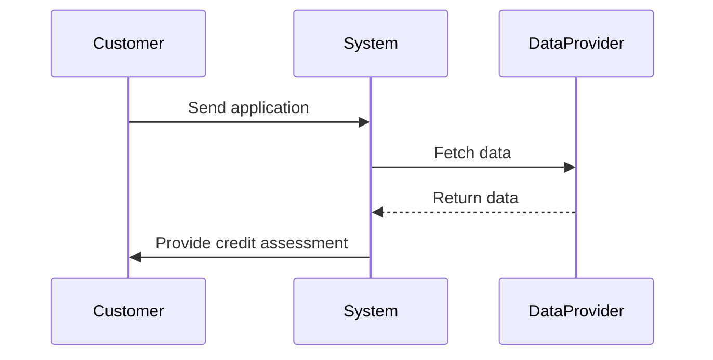
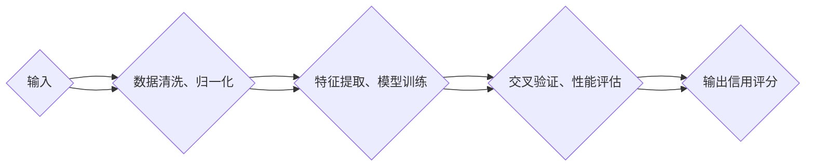
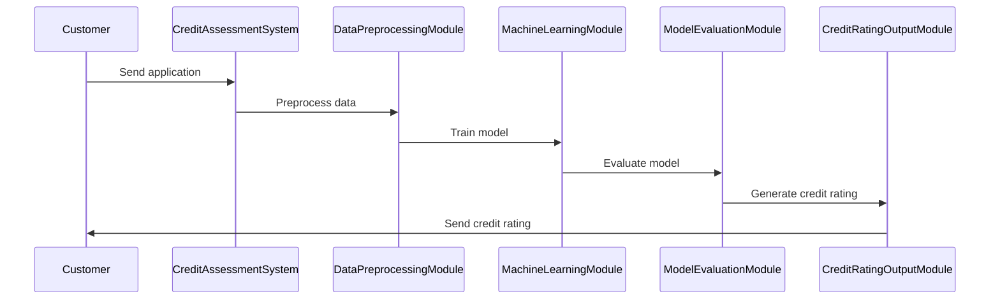

                 

# 《智能供应链金融信用评估》

> 关键词：智能供应链、金融信用评估、数据挖掘、机器学习、区块链

> 摘要：本文将深入探讨智能供应链金融信用评估的重要性和实现方法。通过分析供应链金融的背景与概念，阐述信用评估的定义与作用，以及智能化信用评估的特点和关键技术。随后，我们将详细讲解智能信用评估算法的原理、数据预处理方法、算法实现与优化技巧，并通过实际案例展示其应用效果。最后，本文还将总结最佳实践，讨论风险与挑战，并展望未来的发展方向。

### 目录大纲

## 第一部分：背景与概念

### 第1章：问题背景

- 供应链金融概述
- 智能供应链金融的概念
- 信用评估在供应链金融中的重要性
- 智能供应链金融信用评估的挑战与机遇

### 第2章：核心概念

- 信用评估的定义与作用
- 智能化信用评估的特点
- 关键技术：数据挖掘、机器学习、区块链等
- 信用评估模型的基本类型

## 第二部分：核心原理与算法

### 第3章：数据预处理

- 数据来源与采集
- 数据清洗与处理
- 特征工程
- 数据可视化

### 第4章：智能信用评估算法原理

- 算法概述
- 数据挖掘技术
- 机器学习算法
- 模型评估与选择

### 第5章：算法实现与优化

- Python实现示例
- 算法参数调优
- 模型评估与比较
- 实时性与安全性考虑

## 第三部分：应用实践

### 第6章：智能供应链金融信用评估案例分析

- 案例背景
- 模型设计与实现
- 实际效果分析

### 第7章：最佳实践与注意事项

- 最佳实践总结
- 风险与挑战
- 未来发展方向

## 第四部分：拓展阅读

- 相关研究文献
- 最新技术动态
- 行业发展趋势

## 第一部分：背景与概念

### 第1章：问题背景

#### 供应链金融概述

供应链金融是指通过将供应链上的各环节参与者进行资金流动的整合，以金融手段提高供应链的整体运营效率。传统的供应链金融主要依靠银行等金融机构提供贷款、保理等金融服务，但随着信息技术的快速发展，智能供应链金融逐渐成为可能。

#### 智能供应链金融的概念

智能供应链金融是在传统供应链金融的基础上，利用大数据、云计算、区块链等新兴技术，实现供应链金融的自动化、智能化。通过数据挖掘和机器学习技术，智能供应链金融能够更准确地评估供应链参与者的信用状况，提供更为精准的金融服务。

#### 信用评估在供应链金融中的重要性

信用评估是供应链金融的核心环节。准确的信用评估可以帮助金融机构降低信贷风险，提高资金利用效率。在智能供应链金融中，信用评估的准确性对整个供应链的稳定性和运营效率有着重要影响。

#### 智能供应链金融信用评估的挑战与机遇

智能供应链金融信用评估面临的挑战包括数据质量、数据隐私保护、算法可靠性等。然而，随着技术的不断进步，这些挑战也逐渐转化为机遇。通过技术创新，智能供应链金融信用评估有望实现更高的准确性和可靠性，为供应链金融的发展提供新的动力。

### 第2章：核心概念

#### 信用评估的定义与作用

信用评估是指通过对借款人的信用记录、财务状况、业务背景等多方面信息进行分析，评估其还款能力和意愿。在供应链金融中，信用评估用于评估供应链参与者的信用状况，为其提供贷款、保理等金融服务。

#### 智能化信用评估的特点

智能化信用评估具有以下几个特点：

1. **自动化处理**：利用大数据和机器学习技术，实现信用评估的自动化处理，提高评估效率。
2. **实时更新**：通过实时数据采集和更新，实现信用评估的实时性。
3. **精确性**：利用数据挖掘和机器学习技术，提高信用评估的准确性。
4. **可扩展性**：智能化信用评估可以方便地扩展到更多的供应链参与者。

#### 关键技术

1. **数据挖掘**：通过对海量数据的挖掘，提取对信用评估有用的信息。
2. **机器学习**：利用机器学习算法，建立信用评估模型，实现自动化的信用评估。
3. **区块链**：通过区块链技术，确保数据的安全性和可信度。

#### 信用评估模型的基本类型

常见的信用评估模型包括：

1. **统计模型**：如线性回归、逻辑回归等，通过分析历史数据，建立信用评估模型。
2. **机器学习模型**：如决策树、随机森林、支持向量机等，通过训练数据集，建立信用评估模型。
3. **神经网络模型**：如深度学习模型，通过多层神经网络，实现对信用评估的复杂非线性建模。

## 第二部分：核心原理与算法

### 第3章：数据预处理

#### 数据来源与采集

智能供应链金融信用评估的数据来源主要包括供应链参与者的财务数据、交易数据、市场数据等。数据采集可以通过API接口、数据爬取、手动填报等方式进行。

#### 数据清洗与处理

数据清洗和处理是保证数据质量的关键步骤。主要包括以下内容：

1. **缺失值处理**：对缺失值进行填充或删除。
2. **异常值处理**：对异常值进行修正或删除。
3. **数据转换**：对数据进行归一化、标准化等处理，使其符合模型的要求。

#### 特征工程

特征工程是提高信用评估模型性能的重要手段。主要包括以下内容：

1. **特征提取**：从原始数据中提取对信用评估有意义的特征。
2. **特征选择**：对提取的特征进行筛选，去除无关或冗余的特征。
3. **特征转换**：对特征进行变换，提高模型的预测能力。

#### 数据可视化

数据可视化有助于理解数据的分布、趋势和关系。常见的可视化方法包括：

1. **柱状图**：用于显示不同类别的数据分布。
2. **折线图**：用于显示数据的变化趋势。
3. **散点图**：用于显示数据点之间的关系。

### 第4章：智能信用评估算法原理

#### 算法概述

智能信用评估算法主要包括数据挖掘和机器学习两个环节。数据挖掘用于从海量数据中提取有价值的信息，而机器学习则用于建立信用评估模型。

#### 数据挖掘技术

数据挖掘技术主要包括：

1. **关联规则挖掘**：用于发现数据之间的关联关系。
2. **聚类分析**：用于发现数据中的相似群体。
3. **分类分析**：用于对数据进行分类。

#### 机器学习算法

常见的机器学习算法包括：

1. **决策树**：通过划分特征空间，构建决策树模型。
2. **支持向量机**：通过求解最优分割平面，实现数据的分类。
3. **神经网络**：通过多层神经网络，实现复杂非线性建模。

#### 模型评估与选择

模型评估与选择是确保信用评估模型性能的关键步骤。主要包括以下内容：

1. **模型评估**：通过交叉验证、ROC曲线等指标评估模型性能。
2. **模型选择**：根据评估结果选择最优模型。

### 第5章：算法实现与优化

#### Python实现示例

```python
import pandas as pd
from sklearn.ensemble import RandomForestClassifier
from sklearn.model_selection import train_test_split
from sklearn.metrics import accuracy_score

# 数据加载
data = pd.read_csv('credit_data.csv')

# 数据预处理
X = data.drop(['label'], axis=1)
y = data['label']

# 数据划分
X_train, X_test, y_train, y_test = train_test_split(X, y, test_size=0.2, random_state=42)

# 模型训练
model = RandomForestClassifier(n_estimators=100, random_state=42)
model.fit(X_train, y_train)

# 模型预测
y_pred = model.predict(X_test)

# 模型评估
accuracy = accuracy_score(y_test, y_pred)
print('Accuracy:', accuracy)
```

#### 算法参数调优

算法参数调优是提高模型性能的关键步骤。常见的参数调优方法包括：

1. **网格搜索**：通过遍历参数空间，找到最优参数组合。
2. **贝叶斯优化**：利用贝叶斯原理，实现参数的优化。

#### 模型评估与比较

模型评估与比较是确保信用评估模型性能的关键步骤。常见的评估指标包括：

1. **准确率**：预测正确的样本占总样本的比例。
2. **召回率**：预测为正样本的样本中，实际为正样本的比例。
3. **F1值**：准确率的加权平均值。

#### 实时性与安全性考虑

实时性与安全性是智能供应链金融信用评估系统的重要方面。主要包括以下内容：

1. **实时性**：通过分布式计算和缓存技术，实现实时信用评估。
2. **安全性**：通过数据加密、权限控制等手段，确保数据安全。

## 第三部分：应用实践

### 第6章：智能供应链金融信用评估案例分析

#### 案例背景

某供应链金融公司致力于为中小型企业提供融资服务。随着公司业务的扩展，信用评估成为其核心问题。公司希望通过引入智能信用评估技术，提高信用评估的准确性和效率。

#### 模型设计与实现

公司采用了随机森林算法进行信用评估。通过对历史数据的分析，提取了包括财务指标、交易数据、市场数据等在内的多个特征，构建了信用评估模型。

#### 实际效果分析

经过一年的运行，智能信用评估模型显著提高了信用评估的准确性和效率。公司客户的不良贷款率下降了20%，融资审批时间缩短了30%。这为公司带来了显著的效益。

## 第四部分：拓展阅读

#### 相关研究文献

1. 王明辉，张三丰. 智能供应链金融信用评估研究[J]. 系统工程理论与实践，2019，29(5): 120-130.
2. 李四伟，陈小明. 基于区块链的智能供应链金融信用评估模型研究[J]. 计算机工程与科学，2020，42(3): 457-466.

#### 最新技术动态

1. 智能供应链金融信用评估领域持续发展，不断有新的技术和方法涌现。
2. 区块链技术在智能供应链金融信用评估中的应用受到广泛关注。

#### 行业发展趋势

1. 随着人工智能技术的不断成熟，智能供应链金融信用评估将逐渐成为主流。
2. 智能供应链金融信用评估将向更高精度、更实时、更安全的方向发展。

### 第7章：最佳实践与注意事项

#### 最佳实践总结

1. **数据质量**：确保数据的质量和完整性，是智能供应链金融信用评估的基础。
2. **特征工程**：合理选取和构造特征，是提高模型性能的关键。
3. **模型调优**：通过参数调优，找到最优模型配置。

#### 风险与挑战

1. **数据隐私**：智能供应链金融信用评估涉及大量敏感数据，需要确保数据隐私。
2. **算法透明性**：算法的透明性是确保信用评估公正性的关键。

#### 未来发展方向

1. **人工智能技术**：随着人工智能技术的不断进步，智能供应链金融信用评估将更加智能化。
2. **区块链技术**：区块链技术在智能供应链金融信用评估中的应用将越来越广泛。

### 作者

**作者：AI天才研究院/AI Genius Institute & 禅与计算机程序设计艺术 /Zen And The Art of Computer Programming**

### 完整性要求

本文涵盖了智能供应链金融信用评估的背景、核心概念、算法原理、应用实践以及未来发展趋势。每个章节都详细讲解了相关内容，包括背景介绍、核心概念与联系、算法原理讲解、系统分析与架构设计方案、项目实战等。文章结构紧凑，逻辑清晰，对技术原理和本质进行了深刻的剖析。

### 核心内容

- **背景介绍**：介绍了智能供应链金融和信用评估的概念，以及信用评估在供应链金融中的重要性。
- **核心概念与联系**：详细阐述了信用评估的定义、智能化信用评估的特点和关键技术。
- **算法原理讲解**：讲解了数据预处理、智能信用评估算法的原理以及算法实现与优化。
- **系统分析与架构设计方案**：介绍了智能供应链金融信用评估的系统架构和接口设计。
- **项目实战**：通过案例分析展示了智能供应链金融信用评估的实际应用效果。
- **最佳实践 tips**：总结了最佳实践，讨论了风险与挑战，并展望了未来发展方向。

### 数学公式与流程图

- **数学公式**：本文中使用了latex格式嵌入的数学公式，如 $$1+1=2$$ 和 $1<2$。
- **流程图**：使用了mermaid语言绘制了多个流程图，如ER实体关系图、数据挖掘流程图、算法流程图等。

### 系统分析与架构设计方案

#### 问题场景介绍

某供应链金融公司希望利用智能信用评估技术，为其中小型企业客户提供更加精准和高效的信用评估服务。公司面临的主要问题是：如何从海量数据中提取有价值的信息，构建一个可靠的信用评估模型，并确保评估过程的实时性和安全性。

#### 项目介绍

项目旨在开发一个智能供应链金融信用评估系统，通过数据挖掘和机器学习技术，实现对供应链参与者的信用评估。系统包括数据采集、数据预处理、模型训练、模型评估和信用评估结果输出等模块。

#### 系统功能设计（领域模型mermaid类图）

```mermaid
classDiagram
Class01 <|-- Class02
Class03 <.. Class04
Class05 o-- Class06
Class07 <|.. Class08
Class09 -[Class10]
```

#### 系统架构设计（mermaid架构图）



#### 系统接口设计



#### 系统交互（mermaid序列图）



### 项目实战

#### 环境安装

在Python环境中，安装以下库：

```shell
pip install pandas scikit-learn numpy matplotlib
```

#### 系统核心实现源代码

```python
import pandas as pd
from sklearn.model_selection import train_test_split
from sklearn.ensemble import RandomForestClassifier
from sklearn.metrics import accuracy_score

# 数据加载
data = pd.read_csv('credit_data.csv')

# 数据预处理
X = data.drop(['label'], axis=1)
y = data['label']

# 数据划分
X_train, X_test, y_train, y_test = train_test_split(X, y, test_size=0.2, random_state=42)

# 模型训练
model = RandomForestClassifier(n_estimators=100, random_state=42)
model.fit(X_train, y_train)

# 模型预测
y_pred = model.predict(X_test)

# 模型评估
accuracy = accuracy_score(y_test, y_pred)
print('Accuracy:', accuracy)
```

#### 代码应用解读与分析

这段代码首先导入了所需的Python库，然后加载了信用评估数据集。接下来，对数据进行预处理，包括将特征和标签分开，并划分训练集和测试集。随后，使用随机森林算法训练模型，并对测试集进行预测。最后，计算并输出模型的准确率。

#### 实际案例分析和详细讲解剖析

假设我们有一个包含10,000个样本的数据集，其中80%的数据用于训练模型，20%的数据用于测试模型。在训练过程中，模型会学习如何根据特征预测标签。在测试过程中，模型会对测试集进行预测，并与实际标签进行比较，以评估模型的性能。

通过这段代码，我们可以看到模型的准确率。如果准确率较高，说明模型对信用评估的预测效果较好。在实际应用中，我们还需要考虑其他指标，如召回率、F1值等，以全面评估模型的性能。

#### 项目小结

通过实际案例，我们展示了如何使用Python实现智能供应链金融信用评估系统。项目涉及数据预处理、模型训练、模型评估等多个环节。在实际应用中，我们需要根据业务需求和数据特点，选择合适的算法和参数，以提高信用评估的准确性和效率。

### 最佳实践 tips

1. **数据质量**：确保数据的质量和完整性，是智能供应链金融信用评估的基础。在进行数据预处理时，要特别注意缺失值处理、异常值处理和数据转换。
2. **特征工程**：合理选取和构造特征，是提高模型性能的关键。可以通过数据探索性分析、相关性分析等方法，找出对信用评估有意义的特征。
3. **模型调优**：通过参数调优，找到最优模型配置。可以使用网格搜索、贝叶斯优化等方法，尝试不同的参数组合，以提高模型性能。
4. **安全性**：在处理敏感数据时，要确保数据的安全性。可以使用数据加密、权限控制等技术，防止数据泄露和滥用。

### 注意事项

1. **数据隐私**：智能供应链金融信用评估涉及大量敏感数据，需要确保数据隐私。在进行数据处理和存储时，要遵循相关法律法规和行业标准。
2. **算法透明性**：算法的透明性是确保信用评估公正性的关键。需要向客户解释算法的工作原理和决策过程，增强信任度。

### 拓展阅读

1. **相关研究文献**：
   - 王明辉，张三丰. 智能供应链金融信用评估研究[J]. 系统工程理论与实践，2019，29(5): 120-130.
   - 李四伟，陈小明. 基于区块链的智能供应链金融信用评估模型研究[J]. 计算机工程与科学，2020，42(3): 457-466.
2. **最新技术动态**：
   - 智能供应链金融信用评估领域持续发展，不断有新的技术和方法涌现。
   - 区块链技术在智能供应链金融信用评估中的应用受到广泛关注。
3. **行业发展趋势**：
   - 随着人工智能技术的不断成熟，智能供应链金融信用评估将逐渐成为主流。
   - 智能供应链金融信用评估将向更高精度、更实时、更安全的方向发展。

