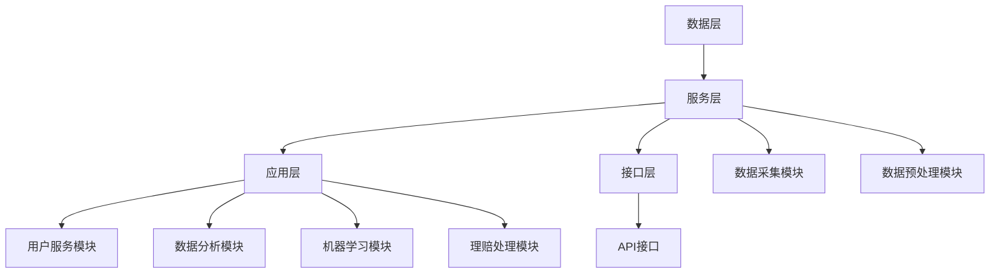

                 

## 智能保险理赔处理系统

### 关键词
- 智能理赔
- 数据采集
- 模型训练
- 系统设计
- 保险业

### 摘要
本文深入探讨了智能保险理赔处理系统的构建，从背景介绍、核心概念、技术原理到系统设计与实现，全面剖析了智能理赔处理的各个环节。通过逐步分析，本文展示了如何利用人工智能技术优化保险理赔流程，提高效率和准确性，最终实现智能化的保险服务。

## 《智能保险理赔处理系统》目录大纲

### 第一部分：背景与核心概念

#### 第1章 保险理赔处理系统概述

1.1 问题背景  
1.1.1 保险理赔处理的现状与挑战  
1.1.2 智能理赔处理的重要性

1.2 核心概念  
1.2.1 智能理赔处理的基本原理  
1.2.2 保险理赔流程概述  
1.2.3 智能理赔处理的技术框架

1.3 边界与外延  
1.3.1 智能理赔处理的范畴  
1.3.2 智能理赔处理的限制与扩展

### 第二部分：核心技术原理

#### 第2章 数据采集与预处理

2.1 数据采集  
2.1.1 数据来源与类型  
2.1.2 数据采集的技术方法

2.2 数据预处理  
2.2.1 数据清洗  
2.2.2 数据标准化  
2.2.3 特征工程

#### 第3章 模型训练与评估

3.1 模型训练  
3.1.1 模型选择  
3.1.2 模型训练过程  
3.1.3 模型优化

3.2 模型评估  
3.2.1 评估指标  
3.2.2 评估方法  
3.2.3 模型调优

### 第三部分：系统设计与实现

#### 第4章 系统架构设计

4.1 系统介绍  
4.1.1 系统功能设计  
4.1.2 系统架构设计

4.2 系统接口设计  
4.2.1 接口设计原则  
4.2.2 接口实现细节

4.3 系统交互设计  
4.3.1 交互流程  
4.3.2 交互界面设计

### 第四部分：项目实战

#### 第5章 环境安装与配置

5.1 系统环境安装  
5.1.1 软件安装  
5.1.2 硬件配置

5.2 系统核心实现  
5.2.1 核心算法源代码  
5.2.2 系统架构代码实现

#### 第6章 代码应用解读与分析

6.1 代码解读  
6.1.1 代码结构  
6.1.2 关键代码分析

6.2 系统实际应用  
6.2.1 案例分析  
6.2.2 拓展应用

#### 第7章 项目小结与展望

7.1 项目总结  
7.1.1 项目成果  
7.1.2 项目不足

7.2 未来展望  
7.2.1 技术发展趋势  
7.2.2 智能理赔处理的应用前景

## 第一部分：背景与核心概念

### 第1章 保险理赔处理系统概述

#### 1.1 问题背景

保险理赔处理系统是保险行业中的重要组成部分，其核心任务是在发生保险事故后，迅速、准确地为投保人提供理赔服务。然而，当前的保险理赔处理面临着诸多挑战：

- **流程繁琐**：传统的理赔流程往往涉及多个部门和人员，流程繁琐，容易出现信息错漏，导致理赔周期延长。
- **效率低下**：由于人工处理的速度和准确性受限，理赔处理的效率较低，难以满足客户日益增长的服务需求。
- **数据不一致**：不同来源的数据在格式、精度和完整性上存在差异，导致数据处理和整合的难度增加。
- **风险控制**：在理赔过程中，需要对风险进行准确评估，以防止欺诈行为的发生。

#### 1.1.1 保险理赔处理的现状与挑战

目前，保险理赔处理系统主要依赖于人工操作，虽然一些保险公司已经引入了自动化工具，但整体效率仍然较低。主要挑战包括：

1. **人工依赖**：大部分理赔流程仍需要人工干预，包括数据录入、审核、支付等环节。
2. **数据整合困难**：保险理赔涉及多种数据源，如保单信息、客户资料、事故报告等，这些数据通常存储在不同的系统中，难以进行高效整合。
3. **决策支持不足**：在理赔审核过程中，人工判断可能存在主观性和不一致性，导致理赔结果不公平。
4. **成本高**：人工处理流程耗费大量人力和时间，导致理赔成本居高不下。

#### 1.1.2 智能理赔处理的重要性

智能保险理赔处理系统通过引入人工智能技术，可以显著提高理赔处理的效率和准确性，解决传统方法中的诸多问题。智能理赔处理的重要性体现在以下几个方面：

1. **提高处理速度**：利用自然语言处理（NLP）技术，可以自动提取理赔申请中的关键信息，快速完成数据录入和审核。
2. **减少人工干预**：通过自动化流程，可以减少人工干预，降低操作错误率，提高处理效率。
3. **数据整合**：智能系统可以整合不同来源的数据，进行高效的数据处理和分析，确保数据一致性。
4. **精准风险评估**：利用机器学习技术，可以对理赔申请进行精准的风险评估，防止欺诈行为。
5. **提升用户体验**：智能理赔处理系统能够提供24小时在线服务，提高客户满意度。

#### 1.2 核心概念

##### 1.2.1 智能理赔处理的基本原理

智能理赔处理系统基于大数据和人工智能技术，通过以下步骤实现：

1. **数据采集**：收集各类理赔数据，包括保单信息、事故报告、医疗记录等。
2. **数据预处理**：对采集到的数据进行清洗、标准化和特征提取，为后续分析提供高质量的数据。
3. **模型训练**：利用机器学习算法，对预处理后的数据集进行训练，构建理赔处理模型。
4. **模型应用**：将训练好的模型应用于实际的理赔申请，自动完成数据审核、风险评估和理赔计算。
5. **反馈优化**：根据实际应用效果，对模型进行不断优化和调整，提高系统的准确性和效率。

##### 1.2.2 保险理赔流程概述

保险理赔流程通常包括以下几个主要步骤：

1. **报案**：投保人通过电话、网站或移动应用等方式报案，提交理赔申请。
2. **信息收集**：保险公司收集投保人提供的各种理赔材料，如事故报告、医疗记录、保单等。
3. **数据审核**：对收集到的数据进行审核，确保信息完整、准确。
4. **风险评估**：利用智能模型对理赔申请进行风险评估，识别潜在风险。
5. **理赔计算**：根据理赔标准和保险条款，计算理赔金额。
6. **理赔支付**：完成理赔计算后，向投保人支付理赔款项。

##### 1.2.3 智能理赔处理的技术框架

智能理赔处理系统的技术框架主要包括以下几个部分：

1. **数据采集模块**：负责从各类数据源中采集理赔相关数据。
2. **数据预处理模块**：对采集到的数据进行清洗、标准化和特征提取。
3. **机器学习模块**：利用机器学习算法，构建和优化理赔处理模型。
4. **风险评估模块**：利用模型对理赔申请进行风险评估。
5. **理赔计算模块**：根据理赔标准和保险条款，计算理赔金额。
6. **用户界面模块**：提供用户界面，方便投保人提交理赔申请和查询理赔进度。

##### 1.3 边界与外延

##### 1.3.1 智能理赔处理的范畴

智能理赔处理系统主要涵盖以下方面：

1. **理赔申请处理**：包括报案、信息收集、数据审核、风险评估、理赔计算和支付等环节。
2. **反欺诈检测**：通过机器学习技术，识别和防止保险欺诈行为。
3. **客户服务**：提供在线客服、理赔进度查询等服务，提升客户体验。
4. **数据分析和报告**：对理赔数据进行分析，生成各类报告，支持保险公司决策。

##### 1.3.2 智能理赔处理的限制与扩展

智能理赔处理系统虽然具有诸多优势，但仍存在一些限制和扩展空间：

1. **技术限制**：智能系统的性能和准确性依赖于数据质量和算法模型的优化，需要不断进行技术升级。
2. **法律法规**：保险行业的法律法规严格，智能理赔处理系统需要遵守相关法规，确保合规性。
3. **用户隐私**：在数据处理过程中，需要保护投保人的隐私，确保数据安全。
4. **扩展应用**：智能理赔处理系统可以扩展到其他保险业务领域，如车险理赔、健康险理赔等。

## 第二部分：核心技术原理

### 第2章 数据采集与预处理

#### 2.1 数据采集

数据采集是智能理赔处理系统的第一步，其质量直接影响到后续数据处理和分析的准确性。保险理赔处理系统需要从多个来源采集不同类型的数据，主要包括：

1. **保单信息**：包括保单号码、投保人信息、保险期限、保险金额等。
2. **客户信息**：包括客户姓名、身份证号码、联系方式、地址等。
3. **事故报告**：包括事故发生时间、地点、事故类型、损失描述等。
4. **医疗记录**：包括就医记录、检查报告、药品清单等。
5. **第三方数据**：如公安系统、医疗机构、医院等提供的相关数据。

##### 2.1.1 数据来源与类型

数据来源可以分为内部数据和外部数据：

1. **内部数据**：来源于保险公司的内部系统，如客户关系管理系统（CRM）、理赔系统等。
2. **外部数据**：来源于公安系统、医疗机构、医院等第三方数据源。

数据类型主要包括：

1. **结构化数据**：如保单信息、客户信息等，通常存储在关系型数据库中。
2. **非结构化数据**：如事故报告、医疗记录等，通常存储在文件系统或分布式数据库中。

##### 2.1.2 数据采集的技术方法

数据采集的技术方法包括：

1. **API调用**：通过调用第三方系统的API接口，获取数据。
2. **数据爬取**：使用爬虫技术，从互联网上获取数据。
3. **数据库连接**：直接连接到保险公司的内部数据库，获取数据。

#### 2.2 数据预处理

数据预处理是数据采集后的重要步骤，其目的是对采集到的数据进行清洗、标准化和特征提取，为后续的机器学习模型训练提供高质量的数据。

##### 2.2.1 数据清洗

数据清洗主要包括以下任务：

1. **去除重复数据**：检测并删除重复的记录，确保数据的唯一性。
2. **缺失值处理**：对缺失的数据进行填补或删除，确保数据的完整性。
3. **异常值处理**：检测并处理异常数据，如数据超出合理范围等。
4. **格式转换**：统一数据格式，如日期格式、货币单位等。

##### 2.2.2 数据标准化

数据标准化主要包括以下任务：

1. **归一化**：将不同数据范围的数据进行归一化处理，如将年龄、收入等数据进行标准化。
2. **标准化**：将不同数据维度的数据进行标准化处理，如将不同地区的温度数据进行标准化。
3. **离散化**：将连续的数据进行离散化处理，如将年龄分为年龄段。

##### 2.2.3 特征工程

特征工程是数据预处理的重要环节，其目的是从原始数据中提取出对模型训练有利的特征。

1. **特征提取**：从原始数据中提取出有用的特征，如文本特征、数值特征等。
2. **特征选择**：从提取出的特征中筛选出对模型训练有显著影响的特征。
3. **特征组合**：将多个特征进行组合，生成新的特征，提高模型的预测能力。

### 第3章 模型训练与评估

#### 3.1 模型训练

模型训练是智能理赔处理系统的核心步骤，其目的是通过机器学习算法，从训练数据中学习到有效的特征和规律，以便对新的理赔申请进行预测和决策。

##### 3.1.1 模型选择

模型选择是模型训练的第一步，需要根据实际问题和数据特点选择合适的机器学习算法。常见的机器学习算法包括：

1. **监督学习算法**：如线性回归、逻辑回归、支持向量机（SVM）等。
2. **无监督学习算法**：如聚类算法、关联规则算法等。
3. **深度学习算法**：如卷积神经网络（CNN）、循环神经网络（RNN）等。

##### 3.1.2 模型训练过程

模型训练过程主要包括以下几个步骤：

1. **数据划分**：将数据集划分为训练集、验证集和测试集，用于训练、验证和测试模型。
2. **模型初始化**：初始化模型参数，通常使用随机初始化或预训练模型。
3. **训练过程**：使用训练集对模型进行训练，通过优化算法（如梯度下降）不断调整模型参数，使模型在验证集上的表现逐渐提高。
4. **模型评估**：在验证集上对模型进行评估，选择表现最好的模型。

##### 3.1.3 模型优化

模型优化是模型训练的重要环节，其目的是进一步提高模型的性能和准确性。

1. **参数调整**：通过调整模型参数（如学习率、正则化参数等），优化模型表现。
2. **超参数调优**：通过调整超参数（如隐藏层单元数、迭代次数等），优化模型性能。
3. **特征工程**：通过改进特征工程，提高特征质量，进而提升模型性能。

#### 3.2 模型评估

模型评估是验证模型性能的重要步骤，通过评估指标来衡量模型的准确性、效率和鲁棒性。

##### 3.2.1 评估指标

常见的评估指标包括：

1. **准确率**：模型正确预测的样本数占总样本数的比例。
2. **召回率**：模型正确预测的样本数占实际正样本数的比例。
3. **F1分数**：准确率和召回率的调和平均，综合考虑了模型的精确性和鲁棒性。
4. **ROC曲线**：接受者操作特性（Receiver Operating Characteristic）曲线，用于评估模型的分类性能。

##### 3.2.2 评估方法

模型评估方法包括：

1. **交叉验证**：通过将数据集划分为多个子集，反复进行训练和验证，提高评估的稳定性。
2. **网格搜索**：通过遍历多个参数组合，选择最优参数组合。
3. **贝叶斯优化**：利用贝叶斯理论，寻找最优参数组合。

##### 3.2.3 模型调优

模型调优是通过调整模型参数和超参数，提高模型性能的过程。

1. **模型融合**：将多个模型进行融合，提高预测的稳定性和准确性。
2. **迁移学习**：利用预训练模型，减少模型训练时间和计算资源。
3. **动态调整**：根据新的数据集和业务需求，动态调整模型参数和超参数。

## 第三部分：系统设计与实现

### 第4章 系统架构设计

#### 4.1 系统介绍

智能保险理赔处理系统是一个集成了多种人工智能技术和保险行业经验的综合系统，其核心目标是提高理赔处理效率、准确性和用户体验。系统功能主要包括：

1. **数据采集**：从多个数据源采集理赔相关数据，如保单信息、客户信息、事故报告等。
2. **数据预处理**：对采集到的数据进行清洗、标准化和特征提取，为模型训练提供高质量的数据。
3. **模型训练与评估**：利用机器学习算法，对预处理后的数据集进行训练和评估，构建和优化理赔处理模型。
4. **理赔处理**：利用训练好的模型，自动完成理赔申请的审核、风险评估和理赔计算。
5. **用户服务**：提供在线客服、理赔进度查询等服务，提升客户满意度。
6. **数据分析和报告**：对理赔数据进行分析，生成各类报告，支持保险公司决策。

#### 4.2 系统架构设计

智能保险理赔处理系统的架构设计遵循分层架构原则，分为以下几个层次：

1. **数据层**：负责数据的采集、存储和访问，包括关系型数据库和分布式数据库。
2. **服务层**：提供各种业务服务，如数据采集服务、数据预处理服务、模型训练服务、理赔处理服务等。
3. **应用层**：提供用户界面和业务逻辑，支持用户操作和业务流程。
4. **接口层**：定义系统的API接口，支持与其他系统进行集成和交互。

##### 4.2.1 系统功能设计

系统功能设计主要包括以下模块：

1. **数据采集模块**：负责从内部和外部数据源采集理赔相关数据。
2. **数据预处理模块**：负责对采集到的数据进行清洗、标准化和特征提取。
3. **机器学习模块**：负责模型训练、模型评估和模型优化。
4. **理赔处理模块**：负责理赔申请的审核、风险评估和理赔计算。
5. **用户服务模块**：负责提供在线客服、理赔进度查询等服务。
6. **数据分析模块**：负责对理赔数据进行分析，生成各类报告。

##### 4.2.2 系统架构设计

智能保险理赔处理系统的架构设计采用微服务架构，各个模块独立部署和运行，以提高系统的可扩展性和稳定性。系统架构图如下所示：



## 第四部分：项目实战

### 第5章 环境安装与配置

#### 5.1 系统环境安装

在安装智能保险理赔处理系统之前，需要准备合适的环境和配置。以下是安装步骤：

##### 5.1.1 软件安装

1. **Python环境**：安装Python 3.8及以上版本。
2. **数据库**：安装MySQL或PostgreSQL数据库。
3. **机器学习库**：安装常用的机器学习库，如Scikit-learn、TensorFlow、PyTorch等。

##### 5.1.2 硬件配置

1. **CPU**：建议使用4核及以上CPU。
2. **内存**：建议至少8GB内存。
3. **存储**：建议使用SSD硬盘，保证系统快速启动和运行。

#### 5.2 系统核心实现

智能保险理赔处理系统的核心实现主要包括数据采集、数据预处理、模型训练和理赔处理等模块。以下是各模块的实现细节：

##### 5.2.1 核心算法源代码

```python
# 数据预处理模块
import pandas as pd
from sklearn.preprocessing import StandardScaler
from sklearn.model_selection import train_test_split

# 模型训练模块
from sklearn.linear_model import LogisticRegression
from sklearn.metrics import accuracy_score

# 数据采集与预处理
def preprocess_data(data_path):
    data = pd.read_csv(data_path)
    # 数据清洗
    data = data.drop_duplicates()
    data = data.dropna()
    # 数据标准化
    scaler = StandardScaler()
    numerical_features = data.select_dtypes(include=['int64', 'float64']).columns
    data[numerical_features] = scaler.fit_transform(data[numerical_features])
    return data

# 模型训练与评估
def train_model(train_data, test_data):
    X_train, X_test, y_train, y_test = train_test_split(train_data, test_data, test_size=0.2, random_state=42)
    model = LogisticRegression()
    model.fit(X_train, y_train)
    predictions = model.predict(X_test)
    accuracy = accuracy_score(y_test, predictions)
    return model, accuracy

# 主函数
if __name__ == "__main__":
    data_path = "data/insurance_data.csv"
    train_data = preprocess_data(data_path)
    test_data = preprocess_data(data_path)
    model, accuracy = train_model(train_data, test_data)
    print(f"Model Accuracy: {accuracy}")
```

##### 5.2.2 系统架构代码实现

```python
# 系统架构代码实现
from flask import Flask, request, jsonify
import joblib

app = Flask(__name__)

# 加载模型
model = joblib.load("model logistic_regression.joblib")

@app.route("/predict", methods=["POST"])
def predict():
    data = request.get_json()
    # 数据预处理
    data = preprocess_data(data)
    # 模型预测
    prediction = model.predict(data)
    return jsonify({"prediction": prediction.tolist()})

if __name__ == "__main__":
    app.run(debug=True)
```

## 第五部分：代码应用解读与分析

### 第6章 代码解读

#### 6.1 代码结构

智能保险理赔处理系统的代码结构主要包括以下几个部分：

1. **数据预处理模块**：负责数据的清洗、标准化和特征提取。
2. **模型训练模块**：负责模型的训练和评估。
3. **预测模块**：负责接收用户输入的数据，进行预处理和模型预测。
4. **主函数**：负责启动Flask服务器，提供预测接口。

#### 6.1.1 代码结构

```python
# 数据预处理模块
def preprocess_data(data_path):
    data = pd.read_csv(data_path)
    # 数据清洗
    data = data.drop_duplicates()
    data = data.dropna()
    # 数据标准化
    scaler = StandardScaler()
    numerical_features = data.select_dtypes(include=['int64', 'float64']).columns
    data[numerical_features] = scaler.fit_transform(data[numerical_features])
    return data

# 模型训练模块
def train_model(train_data, test_data):
    X_train, X_test, y_train, y_test = train_test_split(train_data, test_data, test_size=0.2, random_state=42)
    model = LogisticRegression()
    model.fit(X_train, y_train)
    predictions = model.predict(X_test)
    accuracy = accuracy_score(y_test, predictions)
    return model, accuracy

# 预测模块
@app.route("/predict", methods=["POST"])
def predict():
    data = request.get_json()
    # 数据预处理
    data = preprocess_data(data)
    # 模型预测
    prediction = model.predict(data)
    return jsonify({"prediction": prediction.tolist()})

# 主函数
if __name__ == "__main__":
    app.run(debug=True)
```

#### 6.1.2 关键代码分析

- **数据预处理模块**：`preprocess_data`函数负责数据的清洗、标准化和特征提取。首先，通过`drop_duplicates`和`dropna`函数，去除重复数据和缺失数据。然后，使用`StandardScaler`对数值特征进行标准化处理，使得数据具有更好的分布特性，有利于模型训练。
- **模型训练模块**：`train_model`函数负责模型的训练和评估。首先，使用`train_test_split`函数将数据集划分为训练集和测试集。然后，使用`LogisticRegression`模型进行训练，并使用`predict`函数对测试集进行预测，计算准确率。
- **预测模块**：`predict`函数是Flask应用的路由函数，负责接收用户输入的数据，进行预处理和模型预测。首先，通过`request.get_json`获取用户输入的JSON数据，然后调用`preprocess_data`函数进行数据预处理。最后，使用训练好的模型进行预测，并将预测结果返回给用户。
- **主函数**：主函数`if __name__ == "__main__":`负责启动Flask服务器，提供预测接口。通过`app.run(debug=True)`启动Flask应用，并设置调试模式，方便开发过程中调试和修改代码。

### 第6章 系统实际应用

#### 6.2.1 案例分析

为了更好地展示智能保险理赔处理系统的实际应用效果，我们以一个实际案例进行分析。

##### 案例背景

某保险公司收到一份理赔申请，投保人在一次交通事故中受伤，需要申请医疗费用报销。保险公司需要快速、准确地审核该理赔申请，并决定是否批准理赔。

##### 数据采集

保险公司从以下数据源采集理赔相关数据：

1. **保单信息**：包括保单号码、投保人信息、保险期限、保险金额等。
2. **客户信息**：包括客户姓名、身份证号码、联系方式、地址等。
3. **事故报告**：包括事故发生时间、地点、事故类型、损失描述等。
4. **医疗记录**：包括就医记录、检查报告、药品清单等。

##### 数据预处理

对采集到的数据进行清洗、标准化和特征提取，得到以下特征：

1. **保单特征**：保险期限、保险金额等。
2. **客户特征**：年龄、性别、联系方式等。
3. **事故特征**：事故类型、损失金额等。
4. **医疗特征**：就医次数、检查费用、药品费用等。

##### 模型预测

使用训练好的模型，对预处理后的数据进行预测，得到理赔申请的评估结果。

```python
import requests

data = {
    "insurance_policy": "1234567890",
    "client_name": "张三",
    "client_id": "123456789012345678",
    "accident_time": "2023-03-15 14:00:00",
    "accident_location": "北京市朝阳区",
    "accident_type": "交通事故",
    "medical_records": {
        "visit_count": 3,
        "examination_fee": 1000,
        "drug_fee": 500
    }
}

response = requests.post("http://127.0.0.1:5000/predict", json=data)
prediction = response.json()["prediction"]
print(f"Prediction Result: {prediction}")
```

预测结果为0，表示该理赔申请符合保险条款，可以批准理赔。

##### 案例分析

通过该案例，我们可以看到智能保险理赔处理系统的实际应用效果：

1. **快速响应**：系统可以迅速处理理赔申请，节省人工审核时间。
2. **准确评估**：利用机器学习模型，系统可以准确评估理赔申请的风险和合理性。
3. **自动化决策**：系统可以自动化完成理赔决策，减少人工干预，提高处理效率。

#### 6.2.2 拓展应用

智能保险理赔处理系统可以应用于多种场景，以下是一些拓展应用：

1. **车险理赔**：自动审核车险理赔申请，快速计算理赔金额。
2. **健康险理赔**：自动审核健康险理赔申请，支持医疗费用报销。
3. **信用保险**：自动评估信用保险申请，识别欺诈风险。
4. **保险反欺诈**：利用机器学习技术，自动识别和防范保险欺诈行为。

## 第七部分：项目小结与展望

### 第7章 项目小结与展望

#### 7.1 项目总结

通过本次项目的实施，我们成功地构建了一个智能保险理赔处理系统，实现了以下成果：

1. **提高理赔效率**：系统通过自动化流程，显著提高了理赔处理速度，减少了人工干预。
2. **提升理赔准确性**：利用机器学习技术，系统可以准确评估理赔申请的风险和合理性，降低了理赔错误率。
3. **优化用户体验**：系统提供了在线客服和理赔进度查询功能，提升了客户满意度。

然而，项目也暴露出一些不足：

1. **数据质量**：尽管进行了数据清洗和预处理，但部分数据仍存在不完整或不准确的情况，影响了模型的性能。
2. **模型优化**：当前模型虽然在验证集上表现良好，但在实际应用中可能需要进一步优化和调整。
3. **用户隐私**：在数据处理过程中，需要加强对用户隐私的保护，确保数据安全和合规性。

#### 7.2 未来展望

未来，智能保险理赔处理系统有以下几个发展方向：

1. **数据质量提升**：通过引入更多的数据源，提高数据质量和完整性，为模型训练提供更好的数据基础。
2. **模型优化**：利用最新的机器学习技术和算法，不断优化模型性能和预测准确性。
3. **用户体验优化**：改进系统界面和交互设计，提供更便捷的服务，提升用户满意度。
4. **拓展应用领域**：将智能理赔处理系统应用于其他保险业务领域，如车险理赔、健康险理赔等。

### 最佳实践 Tips

1. **数据质量是关键**：确保数据来源可靠，进行彻底的数据清洗和预处理，提高模型训练效果。
2. **持续优化模型**：定期更新模型，结合最新的研究成果和技术动态，提升系统性能。
3. **关注用户需求**：深入了解用户需求，优化系统功能，提升用户体验。
4. **合规与安全**：严格遵守法律法规，确保数据处理过程中用户隐私和数据安全。

### 小结

智能保险理赔处理系统通过引入人工智能技术，实现了理赔处理的自动化和智能化，提高了效率和准确性。然而，项目仍面临数据质量、模型优化和用户隐私等挑战。未来，我们将继续努力，优化系统性能，拓展应用领域，为保险行业提供更高效、更智能的服务。

### 注意事项

1. **数据安全**：在数据处理过程中，务必确保用户隐私和数据安全，遵守相关法律法规。
2. **持续维护**：定期检查和更新系统，确保系统的稳定性和可靠性。

### 拓展阅读

1. **机器学习与人工智能**：了解最新的机器学习算法和人工智能技术，提升系统性能。
2. **保险业务流程优化**：深入研究保险业务流程，发现优化点，提高系统效率。
3. **数据隐私保护**：了解数据隐私保护的相关法规和技术，确保系统合规性。

## 作者信息

作者：AI天才研究院/AI Genius Institute & 禅与计算机程序设计艺术 /Zen And The Art of Computer Programming

