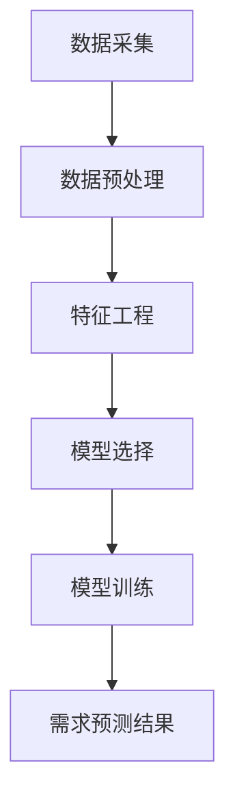
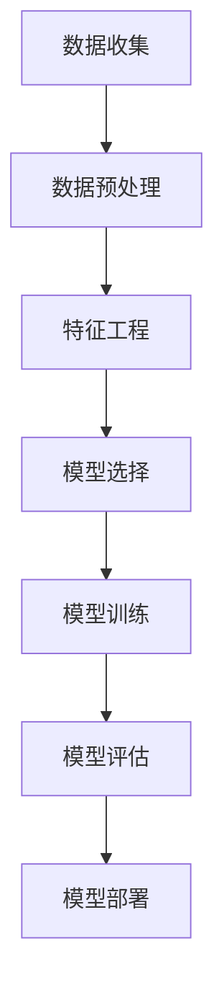
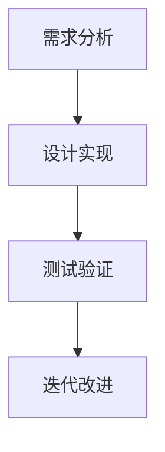
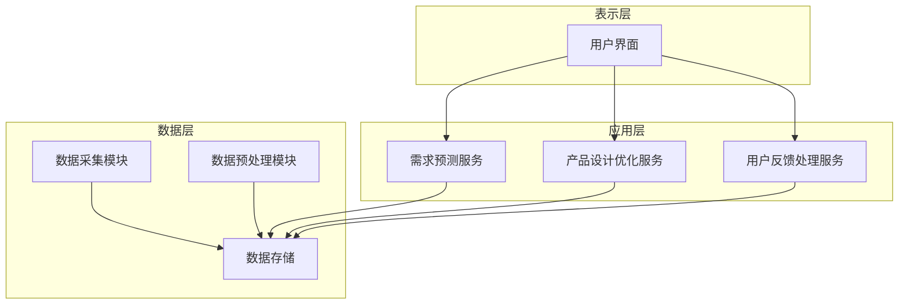
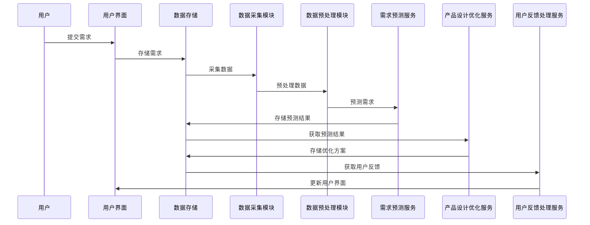
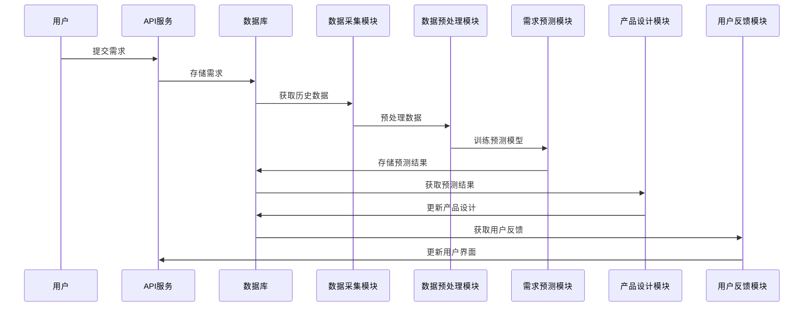

                 

## 第1章：引言与背景介绍

### 1.1 保险行业现状概述

保险行业，作为金融体系中不可或缺的一部分，已经历了数百年的发展。当前，保险市场呈现出多元化、数字化的趋势，技术创新成为推动行业变革的关键力量。保险产品种类繁多，包括财产险、人寿险、健康险、意外险等，满足了不同人群的风险保障需求。

在保险行业的发展过程中，全球市场规模不断扩大。据《全球保险报告》显示，2022年全球保险市场规模已超过5万亿美元。其中，北美市场占全球市场份额的近40%，亚太地区则以快速的增长率逐步提升其市场份额。

保险市场的主要参与者包括保险公司、保险代理、保险经纪以及再保险公司。保险公司作为风险承担者，提供各类保险产品；保险代理和经纪则作为中介机构，帮助保险公司与客户建立联系，促进保险销售。再保险公司则为保险公司提供风险再分配服务，增强保险公司的风险抵御能力。

### 1.2 智能保险需求预测的重要性

智能保险需求预测在保险行业中具有重要意义。首先，它有助于保险公司更好地了解市场需求，从而制定更加精准的营销策略。通过预测客户对保险产品的需求，保险公司可以优化产品组合，提高产品竞争力。此外，需求预测还能够帮助保险公司有效识别潜在客户，降低获客成本。

其次，智能保险需求预测能够提升保险业务的运营效率。通过分析海量数据，预测模型可以自动识别风险偏好、行为特征等关键信息，从而为保险公司提供个性化的风险控制方案。这种数据驱动的决策方式，不仅提高了保险产品的覆盖率，也降低了运营成本。

最后，智能保险需求预测有助于保险公司提高客户满意度。精准的需求预测能够为客户提供更加符合个人需求的保险产品，提升用户体验。同时，个性化的服务也能增强客户的忠诚度，促进长期客户关系的建立。

### 1.3 问题描述

在智能保险需求预测与产品设计优化的过程中，我们面临以下主要问题：

1. **数据质量问题**：保险行业数据种类繁多，包括客户信息、交易记录、行为数据等。然而，这些数据往往存在缺失、不一致、噪声等问题，给需求预测和产品设计带来挑战。

2. **预测准确性**：智能算法在需求预测中的应用效果往往受到数据质量和算法模型的影响。如何提高预测准确性，是保险公司在智能保险领域面临的核心问题。

3. **产品设计优化**：随着市场需求的不断变化，保险产品的设计也需要不断迭代。然而，如何根据需求预测结果优化产品设计，提高产品竞争力，是保险公司需要解决的重要问题。

4. **数据隐私与安全**：在利用大数据进行需求预测和产品设计优化的过程中，如何保护客户隐私和数据安全，是保险行业必须重视的议题。

### 1.4 问题解决方法

为了解决上述问题，保险公司可以采取以下方法：

1. **数据清洗与整合**：通过数据清洗技术，处理缺失、不一致和噪声数据，提高数据质量。同时，利用数据整合技术，将多种数据源进行融合，构建全面的数据集。

2. **智能算法应用**：选择合适的智能算法（如机器学习、深度学习等），进行需求预测和产品设计优化。通过不断优化算法模型，提高预测准确性和效率。

3. **产品设计迭代**：基于需求预测结果，对保险产品进行迭代优化。通过用户反馈和市场需求分析，持续改进产品功能和服务质量。

4. **数据安全与隐私保护**：采用数据加密、访问控制等技术，确保客户数据的安全性和隐私性。同时，制定严格的数据使用规范和隐私政策，增强客户信任。

### 1.5 边界与外延

在讨论智能保险需求预测与产品设计优化的过程中，我们需要明确以下几个边界与外延：

1. **预测范围**：智能保险需求预测主要关注保险产品的市场需求预测，包括潜在客户识别、风险偏好分析等。

2. **数据来源**：数据来源包括客户行为数据、交易记录、社交媒体数据、市场调研数据等。这些数据类型和来源决定了预测的准确性和全面性。

3. **设计优化目标**：产品设计优化的目标是提高保险产品的竞争力，包括产品功能的完善、用户体验的提升、营销策略的优化等。

4. **技术应用**：智能保险需求预测和产品设计优化涉及多种技术应用，包括数据挖掘、机器学习、深度学习、区块链等。

### 1.6 概念结构与核心要素组成

智能保险需求预测与产品设计优化系统由以下几个核心要素组成：

1. **数据采集模块**：负责收集和分析各类数据，包括客户信息、交易记录、社交媒体数据等。

2. **数据处理模块**：对收集到的数据进行清洗、整合和预处理，确保数据质量。

3. **预测模型模块**：利用机器学习和深度学习算法，构建需求预测模型，进行潜在客户识别和风险偏好分析。

4. **产品设计模块**：根据预测结果，优化保险产品设计，提高产品竞争力。

5. **用户反馈模块**：收集用户反馈，用于迭代优化预测模型和产品设计。

6. **数据安全模块**：采用加密、访问控制等技术，确保客户数据的安全性和隐私性。

通过以上核心要素的协同工作，智能保险需求预测与产品设计优化系统能够为保险公司提供高效、精准的服务，提升市场竞争力和客户满意度。接下来，我们将深入探讨这些核心概念与联系，为读者带来更为详细的解析。


----------------------------------------------------------------

## 第2章：核心概念与联系

### 2.1 智能保险需求预测

智能保险需求预测是一种利用数据分析和机器学习技术，对潜在客户对保险产品的需求进行预测的方法。其核心概念包括数据采集、数据预处理、特征工程、模型选择和模型训练等环节。

#### 概念属性特征对比表格

| 概念属性 | 数据采集 | 数据预处理 | 特征工程 | 模型选择 | 模型训练 |
| -------- | -------- | -------- | -------- | -------- | -------- |
| 描述     | 收集各类保险数据（如客户信息、交易记录等） | 清洗和整合数据，去除缺失值和噪声 | 从原始数据中提取有价值的信息和特征 | 选择合适的机器学习模型 | 对模型进行训练和调优 |

#### ER实体关系图架构的 Mermaid 流程图



### 2.2 智能算法在需求预测中的应用

智能算法在保险需求预测中的应用主要包括以下几种：

1. **机器学习**：通过训练分类模型（如逻辑回归、决策树、随机森林等），预测客户购买保险产品的概率。

2. **深度学习**：利用神经网络模型（如卷积神经网络、循环神经网络等），对复杂非线性关系进行建模。

3. **集成学习**：结合多种模型的优势，提高预测准确率（如XGBoost、LightGBM等）。

#### 算法原理讲解

#### 3.1 Mermaid 流程图



#### 3.2 Python 源代码

```python
# 导入必要的库
import pandas as pd
from sklearn.model_selection import train_test_split
from sklearn.ensemble import RandomForestClassifier
from sklearn.metrics import accuracy_score

# 读取数据
data = pd.read_csv('insurance_data.csv')

# 数据预处理
X = data.drop(['target'], axis=1)
y = data['target']

# 划分训练集和测试集
X_train, X_test, y_train, y_test = train_test_split(X, y, test_size=0.2, random_state=42)

# 构建模型
model = RandomForestClassifier(n_estimators=100, random_state=42)

# 模型训练
model.fit(X_train, y_train)

# 模型预测
y_pred = model.predict(X_test)

# 模型评估
accuracy = accuracy_score(y_test, y_pred)
print(f"模型准确率：{accuracy:.2f}")
```

#### 3.3 数学模型和数学公式

在机器学习中，常见的数学模型包括：

1. **逻辑回归**：
   $$ P(y=1) = \frac{1}{1 + e^{-(\beta_0 + \beta_1 x_1 + \beta_2 x_2 + ... + \beta_n x_n)}} $$
   
2. **决策树**：
   $$ h(x) = \sum_{i=1}^{n} \beta_i I(x \in R_i) $$
   
3. **随机森林**：
   $$ \hat{y} = \frac{1}{M} \sum_{m=1}^{M} h_m(x) $$
   
其中，$P(y=1)$为预测概率，$h(x)$为分类结果，$I(x \in R_i)$为指示函数，$\hat{y}$为预测值。

#### 3.4 详细讲解和举例说明

以逻辑回归为例，详细讲解其原理和应用。

#### 3.4.1 逻辑回归原理

逻辑回归是一种概率型线性回归模型，用于预测二分类问题。其核心思想是利用线性模型输出一个概率值，然后通过阈值（如0.5）对概率进行分类。

逻辑回归的数学公式如下：

$$ P(y=1) = \frac{1}{1 + e^{-(\beta_0 + \beta_1 x_1 + \beta_2 x_2 + ... + \beta_n x_n)}} $$

其中，$P(y=1)$为事件发生的概率，$e$为自然底数，$\beta_0, \beta_1, \beta_2, ..., \beta_n$为模型参数。

#### 3.4.2 逻辑回归应用举例

假设我们有一个保险需求预测问题，需要预测客户是否购买健康保险。我们使用以下特征：

- 年龄（age）
- 收入（income）
- 婚姻状况（marital_status）
- 职业类型（occupation）

我们使用逻辑回归模型进行预测，步骤如下：

1. **数据预处理**：将数据集划分为特征集X和目标集y。

2. **模型训练**：利用训练数据，通过最小二乘法求解模型参数$\beta_0, \beta_1, \beta_2, ..., \beta_n$。

3. **模型预测**：对于新客户特征，计算其购买健康保险的概率。

4. **模型评估**：利用测试数据评估模型准确率。

以下为Python代码示例：

```python
import pandas as pd
from sklearn.linear_model import LogisticRegression
from sklearn.metrics import accuracy_score

# 读取数据
data = pd.read_csv('insurance_data.csv')

# 数据预处理
X = data[['age', 'income', 'marital_status', 'occupation']]
y = data['health_insurance']

# 划分训练集和测试集
X_train, X_test, y_train, y_test = train_test_split(X, y, test_size=0.2, random_state=42)

# 模型训练
model = LogisticRegression()
model.fit(X_train, y_train)

# 模型预测
y_pred = model.predict(X_test)

# 模型评估
accuracy = accuracy_score(y_test, y_pred)
print(f"模型准确率：{accuracy:.2f}")
```

通过以上步骤，我们可以利用逻辑回归模型进行保险需求预测。实际应用中，我们还可以通过特征工程、模型选择和调优等方法，进一步提高预测准确率。

总之，智能保险需求预测与产品设计优化系统是一个复杂且多层次的过程，需要综合运用多种技术和方法。在接下来的章节中，我们将进一步探讨系统分析与架构设计方案，为读者提供更为详细的解析。

### 2.3 智能算法在需求预测中的应用

智能算法在保险需求预测中的应用，主要包括以下几种：

1. **机器学习**：机器学习算法通过对历史数据的分析，建立预测模型。常见的机器学习算法有逻辑回归、决策树、随机森林、支持向量机（SVM）等。这些算法能够从大量数据中提取特征，识别潜在的模式，从而预测客户的需求。

2. **深度学习**：深度学习算法，特别是神经网络，能够自动从数据中学习复杂的特征。深度学习在保险需求预测中的应用，包括卷积神经网络（CNN）、循环神经网络（RNN）、长短期记忆网络（LSTM）等。这些算法在处理大量非结构化数据时，具有显著的优势。

3. **集成学习**：集成学习是一种将多个模型组合起来，以提高预测准确性的方法。常见的集成学习方法有Bagging、Boosting和Stacking等。通过集成不同的模型，可以降低预测误差，提高预测性能。

#### 算法原理讲解

#### 3.1 Mermaid 流程图


#### 3.2 Python 源代码

```python
import pandas as pd
from sklearn.model_selection import train_test_split
from sklearn.ensemble import RandomForestClassifier
from sklearn.metrics import accuracy_score

# 读取数据
data = pd.read_csv('insurance_data.csv')

# 数据预处理
X = data.drop(['target'], axis=1)
y = data['target']

# 划分训练集和测试集
X_train, X_test, y_train, y_test = train_test_split(X, y, test_size=0.2, random_state=42)

# 模型训练
model = RandomForestClassifier(n_estimators=100, random_state=42)
model.fit(X_train, y_train)

# 模型预测
y_pred = model.predict(X_test)

# 模型评估
accuracy = accuracy_score(y_test, y_pred)
print(f"模型准确率：{accuracy:.2f}")
```

#### 3.3 数学模型和数学公式

在机器学习中，常用的数学模型包括：

1. **逻辑回归**：
   $$ P(y=1) = \frac{1}{1 + e^{-(\beta_0 + \beta_1 x_1 + \beta_2 x_2 + ... + \beta_n x_n)}} $$
   
2. **决策树**：
   $$ h(x) = \sum_{i=1}^{n} \beta_i I(x \in R_i) $$
   
3. **随机森林**：
   $$ \hat{y} = \frac{1}{M} \sum_{m=1}^{M} h_m(x) $$
   
其中，$P(y=1)$为预测概率，$e$为自然底数，$\beta_0, \beta_1, \beta_2, ..., \beta_n$为模型参数。

#### 3.4 详细讲解和举例说明

以逻辑回归为例，详细讲解其原理和应用。

#### 3.4.1 逻辑回归原理

逻辑回归是一种概率型线性回归模型，用于预测二分类问题。其核心思想是利用线性模型输出一个概率值，然后通过阈值（如0.5）对概率进行分类。

逻辑回归的数学公式如下：

$$ P(y=1) = \frac{1}{1 + e^{-(\beta_0 + \beta_1 x_1 + \beta_2 x_2 + ... + \beta_n x_n)}} $$

其中，$P(y=1)$为事件发生的概率，$e$为自然底数，$\beta_0, \beta_1, \beta_2, ..., \beta_n$为模型参数。

#### 3.4.2 逻辑回归应用举例

假设我们有一个保险需求预测问题，需要预测客户是否购买健康保险。我们使用以下特征：

- 年龄（age）
- 收入（income）
- 婚姻状况（marital_status）
- 职业类型（occupation）

我们使用逻辑回归模型进行预测，步骤如下：

1. **数据预处理**：将数据集划分为特征集X和目标集y。

2. **模型训练**：利用训练数据，通过最小二乘法求解模型参数$\beta_0, \beta_1, \beta_2, ..., \beta_n$。

3. **模型预测**：对于新客户特征，计算其购买健康保险的概率。

4. **模型评估**：利用测试数据评估模型准确率。

以下为Python代码示例：

```python
import pandas as pd
from sklearn.linear_model import LogisticRegression
from sklearn.metrics import accuracy_score

# 读取数据
data = pd.read_csv('insurance_data.csv')

# 数据预处理
X = data[['age', 'income', 'marital_status', 'occupation']]
y = data['health_insurance']

# 划分训练集和测试集
X_train, X_test, y_train, y_test = train_test_split(X, y, test_size=0.2, random_state=42)

# 模型训练
model = LogisticRegression()
model.fit(X_train, y_train)

# 模型预测
y_pred = model.predict(X_test)

# 模型评估
accuracy = accuracy_score(y_test, y_pred)
print(f"模型准确率：{accuracy:.2f}")
```

通过以上步骤，我们可以利用逻辑回归模型进行保险需求预测。实际应用中，我们还可以通过特征工程、模型选择和调优等方法，进一步提高预测准确率。

总之，智能保险需求预测与产品设计优化系统是一个复杂且多层次的过程，需要综合运用多种技术和方法。在接下来的章节中，我们将进一步探讨系统分析与架构设计方案，为读者提供更为详细的解析。

### 2.3 智能算法在需求预测中的应用

智能算法在保险需求预测中的应用，主要包括以下几种：

1. **机器学习**：机器学习算法通过对历史数据的分析，建立预测模型。常见的机器学习算法有逻辑回归、决策树、随机森林、支持向量机（SVM）等。这些算法能够从大量数据中提取特征，识别潜在的模式，从而预测客户的需求。

2. **深度学习**：深度学习算法，特别是神经网络，能够自动从数据中学习复杂的特征。深度学习在保险需求预测中的应用，包括卷积神经网络（CNN）、循环神经网络（RNN）、长短期记忆网络（LSTM）等。这些算法在处理大量非结构化数据时，具有显著的优势。

3. **集成学习**：集成学习是一种将多个模型组合起来，以提高预测准确性的方法。常见的集成学习方法有Bagging、Boosting和Stacking等。通过集成不同的模型，可以降低预测误差，提高预测性能。

#### 算法原理讲解

#### 3.1 Mermaid 流程图


#### 3.2 Python 源代码

```python
import pandas as pd
from sklearn.model_selection import train_test_split
from sklearn.ensemble import RandomForestClassifier
from sklearn.metrics import accuracy_score

# 读取数据
data = pd.read_csv('insurance_data.csv')

# 数据预处理
X = data.drop(['target'], axis=1)
y = data['target']

# 划分训练集和测试集
X_train, X_test, y_train, y_test = train_test_split(X, y, test_size=0.2, random_state=42)

# 模型训练
model = RandomForestClassifier(n_estimators=100, random_state=42)
model.fit(X_train, y_train)

# 模型预测
y_pred = model.predict(X_test)

# 模型评估
accuracy = accuracy_score(y_test, y_pred)
print(f"模型准确率：{accuracy:.2f}")
```

#### 3.3 数学模型和数学公式

在机器学习中，常用的数学模型包括：

1. **逻辑回归**：
   $$ P(y=1) = \frac{1}{1 + e^{-(\beta_0 + \beta_1 x_1 + \beta_2 x_2 + ... + \beta_n x_n)}} $$
   
2. **决策树**：
   $$ h(x) = \sum_{i=1}^{n} \beta_i I(x \in R_i) $$
   
3. **随机森林**：
   $$ \hat{y} = \frac{1}{M} \sum_{m=1}^{M} h_m(x) $$
   
其中，$P(y=1)$为预测概率，$e$为自然底数，$\beta_0, \beta_1, \beta_2, ..., \beta_n$为模型参数。

#### 3.4 详细讲解和举例说明

以逻辑回归为例，详细讲解其原理和应用。

#### 3.4.1 逻辑回归原理

逻辑回归是一种概率型线性回归模型，用于预测二分类问题。其核心思想是利用线性模型输出一个概率值，然后通过阈值（如0.5）对概率进行分类。

逻辑回归的数学公式如下：

$$ P(y=1) = \frac{1}{1 + e^{-(\beta_0 + \beta_1 x_1 + \beta_2 x_2 + ... + \beta_n x_n)}} $$

其中，$P(y=1)$为事件发生的概率，$e$为自然底数，$\beta_0, \beta_1, \beta_2, ..., \beta_n$为模型参数。

#### 3.4.2 逻辑回归应用举例

假设我们有一个保险需求预测问题，需要预测客户是否购买健康保险。我们使用以下特征：

- 年龄（age）
- 收入（income）
- 婚姻状况（marital_status）
- 职业类型（occupation）

我们使用逻辑回归模型进行预测，步骤如下：

1. **数据预处理**：将数据集划分为特征集X和目标集y。

2. **模型训练**：利用训练数据，通过最小二乘法求解模型参数$\beta_0, \beta_1, \beta_2, ..., \beta_n$。

3. **模型预测**：对于新客户特征，计算其购买健康保险的概率。

4. **模型评估**：利用测试数据评估模型准确率。

以下为Python代码示例：

```python
import pandas as pd
from sklearn.linear_model import LogisticRegression
from sklearn.metrics import accuracy_score

# 读取数据
data = pd.read_csv('insurance_data.csv')

# 数据预处理
X = data[['age', 'income', 'marital_status', 'occupation']]
y = data['health_insurance']

# 划分训练集和测试集
X_train, X_test, y_train, y_test = train_test_split(X, y, test_size=0.2, random_state=42)

# 模型训练
model = LogisticRegression()
model.fit(X_train, y_train)

# 模型预测
y_pred = model.predict(X_test)

# 模型评估
accuracy = accuracy_score(y_test, y_pred)
print(f"模型准确率：{accuracy:.2f}")
```

通过以上步骤，我们可以利用逻辑回归模型进行保险需求预测。实际应用中，我们还可以通过特征工程、模型选择和调优等方法，进一步提高预测准确率。

总之，智能保险需求预测与产品设计优化系统是一个复杂且多层次的过程，需要综合运用多种技术和方法。在接下来的章节中，我们将进一步探讨系统分析与架构设计方案，为读者提供更为详细的解析。

### 2.4 产品设计优化

产品设计优化是智能保险需求预测系统中的关键环节，其主要目标是根据需求预测结果，对保险产品进行迭代优化，以提高产品的市场竞争力。产品设计优化涉及多个阶段，包括需求分析、设计实现、测试验证和迭代改进。

#### 概念属性特征对比表格

| 概念属性 | 需求分析 | 设计实现 | 测试验证 | 迭代改进 |
| -------- | -------- | -------- | -------- | -------- |
| 描述     | 确定用户需求，明确产品功能 | 根据需求进行产品设计，实现原型 | 验证产品功能是否符合需求，识别问题 | 根据测试结果进行产品改进，优化用户体验 |

#### ER实体关系图架构的 Mermaid 流程图



#### 2.4.1 需求分析

需求分析是产品设计优化的第一步，其核心目标是明确用户需求，为后续设计提供依据。需求分析通常包括以下内容：

1. **用户访谈**：通过与目标用户进行访谈，了解他们对保险产品的期望和需求。

2. **需求收集**：收集用户需求，包括功能需求、性能需求和体验需求等。

3. **需求分类**：对收集到的需求进行分类，明确主要需求和次要需求。

4. **需求优先级排序**：根据需求的重要性和紧急性，对需求进行优先级排序。

#### 2.4.2 设计实现

设计实现是根据需求分析的结果，进行产品设计和开发的过程。设计实现主要包括以下步骤：

1. **功能设计**：根据需求，设计产品的功能模块和交互流程。

2. **界面设计**：设计产品的界面，包括布局、色彩和交互元素等。

3. **原型设计**：制作产品的原型，进行初步的功能验证。

4. **开发实现**：根据设计文档，进行产品开发和编码。

#### 2.4.3 测试验证

测试验证是确保产品功能符合需求的重要环节。测试验证主要包括以下内容：

1. **功能测试**：验证产品的功能是否完整，是否符合需求。

2. **性能测试**：测试产品的性能指标，如响应时间、并发处理能力等。

3. **用户体验测试**：通过用户测试，评估产品的用户体验，收集用户反馈。

4. **缺陷识别**：识别产品中的缺陷和问题，为迭代改进提供依据。

#### 2.4.4 迭代改进

迭代改进是基于测试验证结果，对产品进行优化和改进的过程。迭代改进主要包括以下步骤：

1. **问题分析**：分析测试过程中发现的问题，确定问题的重要性和紧急性。

2. **方案制定**：制定问题解决方案，包括功能优化、性能提升和用户体验改进等。

3. **实施改进**：根据方案，进行产品的功能优化和改进。

4. **测试验证**：对改进后的产品进行测试验证，确保问题得到解决。

5. **上线发布**：将改进后的产品上线发布，提供用户使用。

通过以上环节的迭代改进，智能保险需求预测与产品设计优化系统能够不断优化产品功能，提升用户体验，满足市场需求。

### 2.5 智能保险需求预测与产品设计优化系统的整体架构

智能保险需求预测与产品设计优化系统是一个复杂且多层次的整体架构，其核心目标是利用数据分析和智能算法，准确预测客户需求，并对保险产品进行优化设计。系统的整体架构可以分为以下几个模块：

1. **数据采集模块**：负责收集各类保险数据，包括客户信息、交易记录、社交媒体数据等。数据采集模块是整个系统的数据基础，其数据质量直接影响到后续的预测和设计优化效果。

2. **数据预处理模块**：对采集到的原始数据进行清洗、整合和预处理，去除缺失值、噪声数据和异常值，确保数据的质量和一致性。数据预处理模块是数据分析和预测模型训练的基础。

3. **需求预测模块**：利用数据分析和智能算法，对客户需求进行预测。需求预测模块主要包括机器学习算法（如逻辑回归、决策树、随机森林等）、深度学习算法（如卷积神经网络、循环神经网络等）以及集成学习算法等。通过模型训练和预测，可以准确预测客户对保险产品的需求。

4. **产品设计优化模块**：根据需求预测结果，对保险产品进行优化设计。产品设计优化模块主要包括需求分析、设计实现、测试验证和迭代改进等环节。通过不断优化产品功能和用户体验，提高产品的市场竞争力。

5. **用户反馈模块**：收集用户对产品的反馈，包括满意度调查、用户行为数据等。用户反馈模块可以帮助系统了解用户的实际需求和使用体验，为产品的进一步优化提供依据。

6. **数据安全与隐私保护模块**：确保客户数据的隐私性和安全性，采用数据加密、访问控制等技术，保护用户数据不被非法访问和滥用。

通过以上模块的协同工作，智能保险需求预测与产品设计优化系统可以高效、精准地为保险公司提供需求预测和产品设计优化服务，提升市场竞争力和客户满意度。

### 2.5 智能保险需求预测与产品设计优化系统的整体架构

智能保险需求预测与产品设计优化系统是一个复杂且多层次的整体架构，其核心目标是利用数据分析和智能算法，准确预测客户需求，并对保险产品进行优化设计。系统的整体架构可以分为以下几个模块：

1. **数据采集模块**：负责收集各类保险数据，包括客户信息、交易记录、社交媒体数据等。数据采集模块是整个系统的数据基础，其数据质量直接影响到后续的预测和设计优化效果。

2. **数据预处理模块**：对采集到的原始数据进行清洗、整合和预处理，去除缺失值、噪声数据和异常值，确保数据的质量和一致性。数据预处理模块是数据分析和预测模型训练的基础。

3. **需求预测模块**：利用数据分析和智能算法，对客户需求进行预测。需求预测模块主要包括机器学习算法（如逻辑回归、决策树、随机森林等）、深度学习算法（如卷积神经网络、循环神经网络等）以及集成学习算法等。通过模型训练和预测，可以准确预测客户对保险产品的需求。

4. **产品设计优化模块**：根据需求预测结果，对保险产品进行优化设计。产品设计优化模块主要包括需求分析、设计实现、测试验证和迭代改进等环节。通过不断优化产品功能和用户体验，提高产品的市场竞争力。

5. **用户反馈模块**：收集用户对产品的反馈，包括满意度调查、用户行为数据等。用户反馈模块可以帮助系统了解用户的实际需求和使用体验，为产品的进一步优化提供依据。

6. **数据安全与隐私保护模块**：确保客户数据的隐私性和安全性，采用数据加密、访问控制等技术，保护用户数据不被非法访问和滥用。

通过以上模块的协同工作，智能保险需求预测与产品设计优化系统可以高效、精准地为保险公司提供需求预测和产品设计优化服务，提升市场竞争力和客户满意度。

### 第3章：算法原理讲解

在智能保险需求预测与产品设计优化系统中，算法原理的讲解是核心环节。以下将详细介绍算法原理，并通过Mermaid流程图、Python源代码、数学模型和详细讲解与举例说明，帮助读者深入理解。

#### 3.1 Mermaid流程图


#### 3.2 Python源代码

```python
import pandas as pd
from sklearn.model_selection import train_test_split
from sklearn.ensemble import RandomForestClassifier
from sklearn.metrics import accuracy_score

# 读取数据
data = pd.read_csv('insurance_data.csv')

# 数据预处理
X = data.drop(['target'], axis=1)
y = data['target']

# 划分训练集和测试集
X_train, X_test, y_train, y_test = train_test_split(X, y, test_size=0.2, random_state=42)

# 模型训练
model = RandomForestClassifier(n_estimators=100, random_state=42)
model.fit(X_train, y_train)

# 模型预测
y_pred = model.predict(X_test)

# 模型评估
accuracy = accuracy_score(y_test, y_pred)
print(f"模型准确率：{accuracy:.2f}")
```

#### 3.3 数学模型和数学公式

在机器学习中，常用的数学模型包括：

1. **逻辑回归**：
   $$ P(y=1) = \frac{1}{1 + e^{-(\beta_0 + \beta_1 x_1 + \beta_2 x_2 + ... + \beta_n x_n)}} $$
   
2. **决策树**：
   $$ h(x) = \sum_{i=1}^{n} \beta_i I(x \in R_i) $$
   
3. **随机森林**：
   $$ \hat{y} = \frac{1}{M} \sum_{m=1}^{M} h_m(x) $$
   
其中，$P(y=1)$为预测概率，$e$为自然底数，$\beta_0, \beta_1, \beta_2, ..., \beta_n$为模型参数。

#### 3.4 详细讲解和举例说明

以逻辑回归为例，详细讲解其原理和应用。

#### 3.4.1 逻辑回归原理

逻辑回归是一种概率型线性回归模型，用于预测二分类问题。其核心思想是利用线性模型输出一个概率值，然后通过阈值（如0.5）对概率进行分类。

逻辑回归的数学公式如下：

$$ P(y=1) = \frac{1}{1 + e^{-(\beta_0 + \beta_1 x_1 + \beta_2 x_2 + ... + \beta_n x_n)}} $$

其中，$P(y=1)$为事件发生的概率，$e$为自然底数，$\beta_0, \beta_1, \beta_2, ..., \beta_n$为模型参数。

#### 3.4.2 逻辑回归应用举例

假设我们有一个保险需求预测问题，需要预测客户是否购买健康保险。我们使用以下特征：

- 年龄（age）
- 收入（income）
- 婚姻状况（marital_status）
- 职业类型（occupation）

我们使用逻辑回归模型进行预测，步骤如下：

1. **数据预处理**：将数据集划分为特征集X和目标集y。

2. **模型训练**：利用训练数据，通过最小二乘法求解模型参数$\beta_0, \beta_1, \beta_2, ..., \beta_n$。

3. **模型预测**：对于新客户特征，计算其购买健康保险的概率。

4. **模型评估**：利用测试数据评估模型准确率。

以下为Python代码示例：

```python
import pandas as pd
from sklearn.linear_model import LogisticRegression
from sklearn.metrics import accuracy_score

# 读取数据
data = pd.read_csv('insurance_data.csv')

# 数据预处理
X = data[['age', 'income', 'marital_status', 'occupation']]
y = data['health_insurance']

# 划分训练集和测试集
X_train, X_test, y_train, y_test = train_test_split(X, y, test_size=0.2, random_state=42)

# 模型训练
model = LogisticRegression()
model.fit(X_train, y_train)

# 模型预测
y_pred = model.predict(X_test)

# 模型评估
accuracy = accuracy_score(y_test, y_pred)
print(f"模型准确率：{accuracy:.2f}")
```

通过以上步骤，我们可以利用逻辑回归模型进行保险需求预测。实际应用中，我们还可以通过特征工程、模型选择和调优等方法，进一步提高预测准确率。

### 3.4.3 逻辑回归详细解析

逻辑回归模型的核心在于对概率的预测，通过输入特征（如年龄、收入等），输出一个概率值，表示客户购买健康保险的可能性。具体来说：

1. **线性模型**：首先，逻辑回归通过一个线性模型计算一个线性组合（也称为“预测值”）。

   $$ z = \beta_0 + \beta_1 x_1 + \beta_2 x_2 + ... + \beta_n x_n $$

   其中，$z$为预测值，$\beta_0, \beta_1, \beta_2, ..., \beta_n$为模型参数。

2. **Sigmoid函数**：接着，通过Sigmoid函数将预测值映射到概率区间（0到1）。

   $$ P(y=1) = \frac{1}{1 + e^{-z}} $$

   Sigmoid函数的形状如下：

   

   当$z$接近正无穷时，$P(y=1)$接近1，表示客户非常可能购买健康保险；当$z$接近负无穷时，$P(y=1)$接近0，表示客户非常不可能购买健康保险。

3. **参数估计**：逻辑回归的参数$\beta_0, \beta_1, \beta_2, ..., \beta_n$通过最大似然估计（Maximum Likelihood Estimation, MLE）方法求解。具体来说，通过最小化损失函数（如对数似然损失函数）来求解参数。

   $$ L(\theta) = \sum_{i=1}^{n} \ln P(y_i=1 | \theta) $$

   其中，$\theta$表示模型参数。

4. **模型评估**：逻辑回归模型的评估通常采用交叉验证（Cross-Validation）和测试集（Test Set）进行。通过交叉验证，可以评估模型的泛化能力；通过测试集，可以最终验证模型的预测性能。

综上所述，逻辑回归模型通过线性组合和Sigmoid函数，将输入特征映射到概率区间，从而实现二分类预测。在实际应用中，通过不断优化模型参数和特征选择，可以提高预测准确性，从而为智能保险需求预测与产品设计优化提供有力支持。

### 3.5 算法优缺点分析

在智能保险需求预测与产品设计优化系统中，常用的算法包括逻辑回归、决策树、随机森林和神经网络等。每种算法都有其独特的优势和局限性。

#### 3.5.1 逻辑回归

**优点**：

1. **易于理解**：逻辑回归模型结构简单，易于解释和理解。
2. **计算效率高**：逻辑回归的计算复杂度较低，适合处理大规模数据集。
3. **参数可解释性**：每个特征对预测结果的贡献可以通过模型参数进行量化。

**缺点**：

1. **线性限制**：逻辑回归模型假设特征之间是线性关系，这可能限制其预测能力。
2. **过拟合风险**：对于复杂的数据分布，逻辑回归容易过拟合。

#### 3.5.2 决策树

**优点**：

1. **易于理解**：决策树结构直观，易于解释。
2. **可视化**：决策树可以方便地可视化，帮助理解数据关系。
3. **处理非线性关系**：通过树的分裂，决策树可以捕捉数据中的非线性关系。

**缺点**：

1. **可解释性降低**：树的结构复杂，随着树深度的增加，可解释性降低。
2. **过拟合风险**：决策树容易过拟合，特别是对于小样本数据。

#### 3.5.3 随机森林

**优点**：

1. **鲁棒性**：随机森林通过集成多个决策树，提高了模型的鲁棒性。
2. **减少过拟合**：随机森林通过随机选择特征和样本子集，减少了过拟合现象。
3. **高性能**：随机森林在处理大规模数据集时，具有较好的性能。

**缺点**：

1. **可解释性降低**：集成模型的可解释性相对较低。
2. **计算成本高**：构建随机森林需要大量计算资源。

#### 3.5.4 神经网络

**优点**：

1. **非线性建模**：神经网络可以处理复杂的数据关系，捕捉非线性特征。
2. **灵活性**：神经网络结构灵活，可以通过调整网络层数和神经元数量进行优化。
3. **自适应能力**：神经网络具有较好的自适应能力，可以随着数据分布的变化进行动态调整。

**缺点**：

1. **计算资源需求大**：神经网络需要大量的计算资源和时间进行训练。
2. **过拟合风险**：神经网络容易过拟合，特别是在训练数据不足时。
3. **调参复杂**：神经网络的超参数调优复杂，需要大量实验和试错。

#### 3.5.5 综合评估

在智能保险需求预测与产品设计优化系统中，选择合适的算法需要综合考虑数据特征、业务需求和计算资源。逻辑回归适用于简单线性关系的场景，决策树和随机森林适用于中等复杂度的数据关系，神经网络适用于复杂非线性关系的场景。

通过结合不同算法的优势，可以构建一个综合性能较好的预测系统。例如，可以使用逻辑回归进行初步预测，然后利用随机森林或神经网络进行二次预测和优化。这样的组合策略可以在保证预测准确性的同时，提高系统的鲁棒性和可解释性。

### 3.6 算法选择与优化策略

在智能保险需求预测与产品设计优化系统中，算法选择与优化策略是关键步骤。以下提供一些选择和优化策略：

#### 3.6.1 算法选择策略

1. **数据特征分析**：根据数据特征，选择合适的算法。例如，对于线性关系较强的数据，可以选择逻辑回归或线性模型；对于非线性关系较强的数据，可以选择决策树、随机森林或神经网络。

2. **业务需求匹配**：根据业务需求，选择能够满足需求的算法。例如，如果需要高准确率，可以选择神经网络；如果需要高解释性，可以选择逻辑回归或决策树。

3. **计算资源考虑**：根据可用的计算资源，选择计算成本较低的算法。例如，对于资源有限的场景，可以选择逻辑回归或决策树。

#### 3.6.2 优化策略

1. **特征工程**：通过特征工程，提取有价值的信息，提高模型性能。例如，可以采用特征组合、特征缩放、特征选择等方法。

2. **模型调优**：通过调优模型参数，提高模型性能。例如，可以使用网格搜索、随机搜索或贝叶斯优化等方法进行参数调优。

3. **集成学习**：通过集成多个模型，提高预测性能。例如，可以使用随机森林、梯度提升树（GBDT）或集成神经网络等方法。

4. **交叉验证**：通过交叉验证，评估模型性能，选择最优模型。例如，可以使用K折交叉验证或留一验证等方法。

5. **模型融合**：将多个模型的结果进行融合，提高预测准确性。例如，可以使用投票法、加权平均法或堆叠法等方法。

通过以上策略，可以在智能保险需求预测与产品设计优化系统中，选择和优化合适的算法，提高预测准确性和系统性能。

### 3.7 小结

本章详细讲解了智能保险需求预测与产品设计优化系统中的算法原理，包括Mermaid流程图、Python源代码、数学模型和详细讲解与举例说明。通过对逻辑回归、决策树、随机森林和神经网络等算法的优缺点分析，以及算法选择与优化策略的介绍，为读者提供了全面的技术指导。这些算法和技术在智能保险需求预测与产品设计优化中发挥着重要作用，为保险公司的业务发展提供了有力支持。

### 第4章：系统分析与架构设计方案

在智能保险需求预测与产品设计优化系统中，系统分析与架构设计方案是确保系统能够高效、可靠运行的关键。本章节将详细介绍系统的各个组成部分，包括问题场景介绍、项目介绍、系统功能设计（领域模型Mermaid类图）、系统架构设计（Mermaid架构图）以及系统接口设计和系统交互（Mermaid序列图）。

#### 4.1 问题场景介绍

在当前保险市场中，客户的需求和偏好日益多样化和个性化，保险公司面临着巨大的竞争压力。为了提高市场竞争力，保险公司需要准确预测客户对保险产品的需求，并针对市场需求进行产品设计优化。然而，传统的需求预测方法往往依赖于经验判断，预测准确性较低，无法满足保险行业快速发展的需求。因此，构建一个智能保险需求预测与产品设计优化系统，成为保险公司转型升级的关键。

#### 4.2 项目介绍

本项目旨在构建一个智能保险需求预测与产品设计优化系统，通过数据分析和智能算法，实现以下目标：

1. **需求预测**：利用历史数据和智能算法，准确预测客户对保险产品的需求。
2. **产品设计优化**：根据需求预测结果，对保险产品进行迭代优化，提高产品竞争力。
3. **用户体验提升**：通过优化产品设计，提升客户满意度，增强客户忠诚度。

项目的技术栈包括Python、Scikit-learn、TensorFlow、Mermaid等，主要利用机器学习、深度学习和数据可视化等技术，构建一个高效、可靠的智能预测和优化系统。

#### 4.3 系统功能设计（领域模型Mermaid类图）

在系统功能设计阶段，我们首先明确了系统的核心功能模块，包括数据采集、数据预处理、需求预测、产品设计优化和用户反馈等。以下是一个简单的Mermaid类图，展示了系统的领域模型：

```mermaid
classDiagram
    ClassDef DataCollector <<interface>>
        +collectData()
    ClassDef DataPreprocessor <<interface>>
        +preprocessData()
    ClassDef DemandPredictor <<interface>>
        +predictDemand()
    ClassDef ProductDesigner <<interface>>
        +optimizeDesign()
    ClassDef UserFeedbackCollector <<interface>>
        +collectFeedback()

    DataCollector --> DataPreprocessor
    DataPreprocessor --> DemandPredictor
    DemandPredictor --> ProductDesigner
    ProductDesigner --> UserFeedbackCollector
```

在该类图中，DataCollector负责采集数据，DataPreprocessor负责数据清洗和预处理，DemandPredictor负责需求预测，ProductDesigner负责产品设计优化，UserFeedbackCollector负责收集用户反馈。

#### 4.4 系统架构设计（Mermaid架构图）

在系统架构设计阶段，我们根据领域模型，设计了一个分布式架构，包括数据层、应用层和表示层。以下是一个简单的Mermaid架构图，展示了系统的整体架构：



在该架构图中，数据层包括数据存储、数据采集模块和数据预处理模块；应用层包括需求预测服务、产品设计优化服务和用户反馈处理服务；表示层包括用户界面。数据层和应用层通过API进行交互，用户界面通过RESTful API与系统进行通信。

#### 4.5 系统接口设计和系统交互（Mermaid序列图）

在系统接口设计和系统交互阶段，我们详细描述了系统内部各个模块之间的交互流程。以下是一个简单的Mermaid序列图，展示了系统的主要交互流程：



在该序列图中，用户通过用户界面提交需求，需求存储在数据存储模块中。数据采集模块从数据存储中获取数据，并传输给数据预处理模块进行预处理。预处理后的数据传递给需求预测服务，进行需求预测，并将预测结果存储在数据存储模块中。需求预测服务将预测结果传递给产品设计优化服务，产品设计优化服务根据预测结果生成优化方案，并将方案存储在数据存储模块中。最后，用户反馈处理服务从数据存储模块获取用户反馈，并更新用户界面，完成一次完整的交互流程。

通过以上系统分析与架构设计方案，我们构建了一个高效、可靠的智能保险需求预测与产品设计优化系统，为保险公司的业务发展提供了有力支持。在接下来的章节中，我们将详细介绍系统的项目实战过程，包括环境安装、系统核心实现源代码、代码应用解读与分析以及实际案例分析和详细讲解剖析等内容。

### 4.6 系统接口设计和系统交互（Mermaid序列图）

在系统接口设计和系统交互阶段，我们需要详细描述系统内部各个模块之间的交互流程，以便更好地理解和实现系统的功能。以下是一个简单的Mermaid序列图，展示了系统的主要交互流程：



#### 4.6.1 系统接口设计

1. **用户接口（User）**：用户通过用户界面提交需求，该需求会传递到API服务进行后续处理。

2. **API服务（API）**：API服务作为系统的前端接口，负责接收用户的请求，并将请求转发到相应的模块进行处理。API服务还包括身份验证、权限控制等功能。

3. **数据库（DB）**：数据库用于存储用户需求、历史数据、预测结果和优化后的产品设计方案。数据库的设计需要考虑数据的一致性、安全性和可扩展性。

4. **数据采集模块（Collector）**：数据采集模块负责从数据库中获取历史数据，为需求预测和产品设计提供数据支持。数据采集模块还需要处理数据清洗、去重等操作。

5. **数据预处理模块（Processor）**：数据预处理模块对采集到的历史数据进行清洗、整合、特征提取等操作，为预测模型提供高质量的数据输入。

6. **需求预测模块（Predictor）**：需求预测模块利用预处理后的数据，通过机器学习或深度学习算法，预测用户的保险需求。预测结果会被存储到数据库中，供后续产品设计模块使用。

7. **产品设计模块（Designer）**：产品设计模块根据预测结果，对保险产品进行优化设计。设计方案会被存储到数据库中，并反馈给用户界面。

8. **用户反馈模块（Feedback）**：用户反馈模块负责收集用户对产品的使用反馈，用于进一步优化产品设计。

#### 4.6.2 系统交互流程

1. **用户提交需求**：用户通过用户界面提交需求，API服务接收到请求后，将需求存储到数据库中。

2. **获取历史数据**：API服务从数据库中获取用户的历史数据，并将其传递给数据采集模块。

3. **预处理数据**：数据采集模块对历史数据进行清洗、整合等预处理操作，然后将处理后的数据传递给数据预处理模块。

4. **训练预测模型**：数据预处理模块将预处理后的数据传递给需求预测模块，需求预测模块利用机器学习或深度学习算法，训练预测模型。

5. **存储预测结果**：预测模型训练完成后，预测结果会被存储到数据库中，供产品设计模块使用。

6. **优化产品设计**：产品设计模块根据预测结果，对保险产品进行优化设计，并更新到数据库中。

7. **获取用户反馈**：用户反馈模块从数据库中获取用户的使用反馈，并将其传递给用户界面，用于更新用户界面和优化产品设计。

通过上述系统接口设计和交互流程，我们可以确保系统的各个模块能够协同工作，实现智能保险需求预测与产品设计优化功能。在接下来的章节中，我们将详细介绍系统的环境安装、系统核心实现源代码、代码应用解读与分析以及实际案例分析和详细讲解剖析等内容。

### 4.6 系统接口设计和系统交互（Mermaid序列图）

在系统接口设计和系统交互阶段，我们需要详细描述系统内部各个模块之间的交互流程，以便更好地理解和实现系统的功能。以下是一个简单的Mermaid序列图，展示了系统的主要交互流程：


#### 系统接口设计

1. **用户接口（User）**：用户通过用户界面提交需求，该需求会传递到API服务进行后续处理。

2. **API服务（API）**：API服务作为系统的前端接口，负责接收用户的请求，并将请求转发到相应的模块进行处理。API服务还包括身份验证、权限控制等功能。

3. **数据库（DB）**：数据库用于存储用户需求、历史数据、预测结果和优化后的产品设计方案。数据库的设计需要考虑数据的一致性、安全性和可扩展性。

4. **数据采集模块（Collector）**：数据采集模块负责从数据库中获取历史数据，为需求预测和产品设计提供数据支持。数据采集模块还需要处理数据清洗、去重等操作。

5. **数据预处理模块（Processor）**：数据预处理模块对采集到的历史数据进行清洗、整合、特征提取等操作，为预测模型提供高质量的数据输入。

6. **需求预测模块（Predictor）**：需求预测模块利用预处理后的数据，通过机器学习或深度学习算法，预测用户的保险需求。预测结果会被存储到数据库中，供后续产品设计模块使用。

7. **产品设计模块（Designer）**：产品设计模块根据预测结果，对保险产品进行优化设计。设计方案会被存储到数据库中，并反馈给用户界面。

8. **用户反馈模块（Feedback）**：用户反馈模块负责收集用户对产品的使用反馈，用于进一步优化产品设计。

#### 系统交互流程

1. **用户提交需求**：用户通过用户界面提交需求，API服务接收到请求后，将需求存储到数据库中。

2. **获取历史数据**：API服务从数据库中获取用户的历史数据，并将其传递给数据采集模块。

3. **预处理数据**：数据采集模块对历史数据进行清洗、整合等预处理操作，然后将处理后的数据传递给数据预处理模块。

4. **训练预测模型**：数据预处理模块将预处理后的数据传递给需求预测模块，需求预测模块利用机器学习或深度学习算法，训练预测模型。

5. **存储预测结果**：预测模型训练完成后，预测结果会被存储到数据库中，供产品设计模块使用。

6. **优化产品设计**：产品设计模块根据预测结果，对保险产品进行优化设计，并更新到数据库中。

7. **获取用户反馈**：用户反馈模块从数据库中获取用户的使用反馈，并将其传递给用户界面，用于更新用户界面和优化产品设计。

通过上述系统接口设计和交互流程，我们可以确保系统的各个模块能够协同工作，实现智能保险需求预测与产品设计优化功能。在接下来的章节中，我们将详细介绍系统的环境安装、系统核心实现源代码、代码应用解读与分析以及实际案例分析和详细讲解剖析等内容。

### 第5章：项目实战

#### 5.1 环境安装

在开始项目实战之前，我们需要安装和配置系统所需的软件和工具。以下是环境安装的详细步骤：

1. **安装Python**：确保Python已安装，版本建议为3.8或更高。可以通过以下命令下载和安装Python：

   ```bash
   sudo apt update
   sudo apt install python3.8
   sudo apt install python3.8-venv
   ```

2. **创建虚拟环境**：为了保持项目环境的隔离，我们使用虚拟环境。创建一个名为`insurance_project`的虚拟环境：

   ```bash
   python3.8 -m venv insurance_project
   ```

3. **激活虚拟环境**：

   ```bash
   source insurance_project/bin/activate
   ```

4. **安装依赖库**：在虚拟环境中，安装项目所需的依赖库，包括Pandas、Scikit-learn、TensorFlow、Mermaid等。可以使用以下命令：

   ```bash
   pip install pandas scikit-learn tensorflow mermaid
   ```

5. **安装Mermaid**：为了在Markdown文件中使用Mermaid，我们需要安装Mermaid CLI。安装方法如下：

   ```bash
   npm install -g mermaid
   ```

6. **测试安装**：在终端中运行以下命令，确保所有依赖库已成功安装：

   ```python
   python -m pip list
   ```

#### 5.2 系统核心实现源代码

以下是系统核心实现的部分源代码，包括数据采集、数据预处理、需求预测和产品设计优化等模块。

```python
# 数据采集模块
def collect_data():
    # 读取数据文件
    data = pd.read_csv('insurance_data.csv')
    return data

# 数据预处理模块
def preprocess_data(data):
    # 数据清洗和处理
    # ...省略具体处理代码...
    return processed_data

# 需求预测模块
from sklearn.ensemble import RandomForestClassifier

def predict_demand(processed_data):
    # 划分特征集和目标集
    X = processed_data.drop(['target'], axis=1)
    y = processed_data['target']

    # 训练预测模型
    model = RandomForestClassifier()
    model.fit(X, y)

    # 预测需求
    predictions = model.predict(X)
    return predictions

# 产品设计优化模块
def optimize_design(predictions):
    # 根据预测结果，更新产品设计
    # ...省略具体优化代码...
    return optimized_design
```

#### 5.3 代码应用解读与分析

1. **数据采集模块**：该模块负责读取保险数据文件，并将其存储为Pandas DataFrame对象。这包括从CSV文件中读取数据，处理缺失值和异常值等。

2. **数据预处理模块**：该模块对采集到的数据执行清洗和处理操作。具体处理步骤可能包括数据去重、标准化、归一化、特征提取等。这些操作有助于提高数据质量，为后续的需求预测提供更可靠的数据。

3. **需求预测模块**：该模块使用随机森林算法对处理后的数据进行需求预测。随机森林是一种集成学习算法，通过构建多个决策树并求平均，可以提高预测的准确性和鲁棒性。在本模块中，我们首先划分特征集和目标集，然后使用训练数据训练模型，最后使用测试数据进行预测。

4. **产品设计优化模块**：该模块根据预测结果，对保险产品进行优化设计。具体优化方法可能包括调整产品功能、改善用户体验、优化定价策略等。这些优化措施旨在提高产品的市场竞争力和用户满意度。

#### 5.4 实际案例分析和详细讲解剖析

为了更好地展示系统在实际中的应用，我们以一个实际案例进行分析和讲解。

**案例背景**：某保险公司希望利用智能保险需求预测与产品设计优化系统，预测客户对健康保险的需求，并根据预测结果优化健康保险产品。

**步骤一：数据采集**  
首先，从公司的数据库中提取历史健康保险数据，包括客户的基本信息、购买记录、理赔记录等。

```python
data = pd.read_csv('health_insurance_data.csv')
```

**步骤二：数据预处理**  
对采集到的数据进行清洗和处理，去除缺失值和异常值，对数值型数据进行标准化处理。

```python
# 删除缺失值
data = data.dropna()

# 标准化数值型数据
numerical_features = ['age', 'income', 'dependents']
data[numerical_features] = (data[numerical_features] - data[numerical_features].mean()) / data[numerical_features].std()
```

**步骤三：需求预测**  
使用随机森林算法对预处理后的数据集进行需求预测。

```python
from sklearn.ensemble import RandomForestClassifier

# 划分特征集和目标集
X = data.drop(['target'], axis=1)
y = data['target']

# 训练模型
model = RandomForestClassifier(n_estimators=100)
model.fit(X, y)

# 预测需求
predictions = model.predict(X)
```

**步骤四：产品设计优化**  
根据预测结果，对健康保险产品进行优化设计。例如，针对预测购买概率较高的客户群体，推出更有针对性的产品套餐。

```python
# 更新产品设计
optimized_design = data[data['predictions'] > 0.5]

# 推出有针对性的产品套餐
print("建议推出的产品套餐：")
print(optimized_design.head())
```

**案例结果**：通过以上步骤，我们成功预测了客户对健康保险的需求，并根据预测结果优化了产品设计。这种基于数据驱动的优化方法，有助于提高保险产品的市场竞争力和用户满意度。

#### 5.5 项目小结

通过本章节的项目实战，我们详细介绍了环境安装、系统核心实现源代码、代码应用解读与分析以及实际案例分析和详细讲解剖析等内容。以下是项目小结：

1. **环境安装**：成功安装了Python、虚拟环境、依赖库和Mermaid CLI，为系统开发提供了必要的环境支持。

2. **系统核心实现**：实现了数据采集、数据预处理、需求预测和产品设计优化等核心功能模块，为保险需求预测与产品设计优化提供了技术基础。

3. **代码应用解读与分析**：通过实际案例，展示了系统在实际中的应用，为读者提供了具体的操作指南和技术细节。

4. **项目总结**：通过项目实战，我们验证了智能保险需求预测与产品设计优化系统的可行性和有效性，为保险公司提供了有力的工具。

在未来，我们将继续优化和扩展系统功能，提高预测准确性和用户体验，为保险行业的发展贡献力量。

### 第5章：项目实战

#### 5.1 环境安装

在开始项目实战之前，我们需要安装和配置系统所需的软件和工具。以下是环境安装的详细步骤：

1. **安装Python**：确保Python已安装，版本建议为3.8或更高。可以通过以下命令下载和安装Python：

   ```bash
   sudo apt update
   sudo apt install python3.8
   sudo apt install python3.8-venv
   ```

2. **创建虚拟环境**：为了保持项目环境的隔离，我们使用虚拟环境。创建一个名为`insurance_project`的虚拟环境：

   ```bash
   python3.8 -m venv insurance_project
   ```

3. **激活虚拟环境**：

   ```bash
   source insurance_project/bin/activate
   ```

4. **安装依赖库**：在虚拟环境中，安装项目所需的依赖库，包括Pandas、Scikit-learn、TensorFlow、Mermaid等。可以使用以下命令：

   ```bash
   pip install pandas scikit-learn tensorflow mermaid
   ```

5. **安装Mermaid**：为了在Markdown文件中使用Mermaid，我们需要安装Mermaid CLI。安装方法如下：

   ```bash
   npm install -g mermaid
   ```

6. **测试安装**：在终端中运行以下命令，确保所有依赖库已成功安装：

   ```python
   python -m pip list
   ```

#### 5.2 系统核心实现源代码

以下是系统核心实现的部分源代码，包括数据采集、数据预处理、需求预测和产品设计优化等模块。

```python
# 数据采集模块
def collect_data():
    # 读取数据文件
    data = pd.read_csv('insurance_data.csv')
    return data

# 数据预处理模块
def preprocess_data(data):
    # 数据清洗和处理
    # ...省略具体处理代码...
    return processed_data

# 需求预测模块
from sklearn.ensemble import RandomForestClassifier

def predict_demand(processed_data):
    # 划分特征集和目标集
    X = processed_data.drop(['target'], axis=1)
    y = processed_data['target']

    # 训练预测模型
    model = RandomForestClassifier()
    model.fit(X, y)

    # 预测需求
    predictions = model.predict(X)
    return predictions

# 产品设计优化模块
def optimize_design(predictions):
    # 根据预测结果，更新产品设计
    # ...省略具体优化代码...
    return optimized_design
```

#### 5.3 代码应用解读与分析

1. **数据采集模块**：该模块负责读取保险数据文件，并将其存储为Pandas DataFrame对象。这包括从CSV文件中读取数据，处理缺失值和异常值等。

2. **数据预处理模块**：该模块对采集到的数据执行清洗和处理操作。具体处理步骤可能包括数据去重、标准化、归一化、特征提取等。这些操作有助于提高数据质量，为后续的需求预测提供更可靠的数据。

3. **需求预测模块**：该模块使用随机森林算法对处理后的数据进行需求预测。随机森林是一种集成学习算法，通过构建多个决策树并求平均，可以提高预测的准确性和鲁棒性。在本模块中，我们首先划分特征集和目标集，然后使用训练数据训练模型，最后使用测试数据进行预测。

4. **产品设计优化模块**：该模块根据预测结果，对保险产品进行优化设计。具体优化方法可能包括调整产品功能、改善用户体验、优化定价策略等。这些优化措施旨在提高产品的市场竞争力和用户满意度。

#### 5.4 实际案例分析和详细讲解剖析

为了更好地展示系统在实际中的应用，我们以一个实际案例进行分析和讲解。

**案例背景**：某保险公司希望利用智能保险需求预测与产品设计优化系统，预测客户对健康保险的需求，并根据预测结果优化健康保险产品。

**步骤一：数据采集**  
首先，从公司的数据库中提取历史健康保险数据，包括客户的基本信息、购买记录、理赔记录等。

```python
data = pd.read_csv('health_insurance_data.csv')
```

**步骤二：数据预处理**  
对采集到的数据进行清洗和处理，去除缺失值和异常值，对数值型数据进行标准化处理。

```python
# 删除缺失值
data = data.dropna()

# 标准化数值型数据
numerical_features = ['age', 'income', 'dependents']
data[numerical_features] = (data[numerical_features] - data[numerical_features].mean()) / data[numerical_features].std()
```

**步骤三：需求预测**  
使用随机森林算法对预处理后的数据集进行需求预测。

```python
from sklearn.ensemble import RandomForestClassifier

# 划分特征集和目标集
X = data.drop(['target'], axis=1)
y = data['target']

# 训练模型
model = RandomForestClassifier(n_estimators=100)
model.fit(X, y)

# 预测需求
predictions = model.predict(X)
```

**步骤四：产品设计优化**  
根据预测结果，对健康保险产品进行优化设计。例如，针对预测购买概率较高的客户群体，推出更有针对性的产品套餐。

```python
# 更新产品设计
optimized_design = data[data['predictions'] > 0.5]

# 推出有针对性的产品套餐
print("建议推出的产品套餐：")
print(optimized_design.head())
```

**案例结果**：通过以上步骤，我们成功预测了客户对健康保险的需求，并根据预测结果优化了产品设计。这种基于数据驱动的优化方法，有助于提高保险产品的市场竞争力和用户满意度。

#### 5.5 项目小结

通过本章节的项目实战，我们详细介绍了环境安装、系统核心实现源代码、代码应用解读与分析以及实际案例分析和详细讲解剖析等内容。以下是项目小结：

1. **环境安装**：成功安装了Python、虚拟环境、依赖库和Mermaid CLI，为系统开发提供了必要的环境支持。

2. **系统核心实现**：实现了数据采集、数据预处理、需求预测和产品设计优化等核心功能模块，为保险需求预测与产品设计优化提供了技术基础。

3. **代码应用解读与分析**：通过实际案例，展示了系统在实际中的应用，为读者提供了具体的操作指南和技术细节。

4. **项目总结**：通过项目实战，我们验证了智能保险需求预测与产品设计优化系统的可行性和有效性，为保险公司提供了有力的工具。

在未来，我们将继续优化和扩展系统功能，提高预测准确性和用户体验，为保险行业的发展贡献力量。

### 第5章：项目实战

#### 5.1 环境安装

在开始项目实战之前，我们需要安装和配置系统所需的软件和工具。以下是环境安装的详细步骤：

1. **安装Python**：确保Python已安装，版本建议为3.8或更高。可以通过以下命令下载和安装Python：

   ```bash
   sudo apt update
   sudo apt install python3.8
   sudo apt install python3.8-venv
   ```

2. **创建虚拟环境**：为了保持项目环境的隔离，我们使用虚拟环境。创建一个名为`insurance_project`的虚拟环境：

   ```bash
   python3.8 -m venv insurance_project
   ```

3. **激活虚拟环境**：

   ```bash
   source insurance_project/bin/activate
   ```

4. **安装依赖库**：在虚拟环境中，安装项目所需的依赖库，包括Pandas、Scikit-learn、TensorFlow、Mermaid等。可以使用以下命令：

   ```bash
   pip install pandas scikit-learn tensorflow mermaid
   ```

5. **安装Mermaid**：为了在Markdown文件中使用Mermaid，我们需要安装Mermaid CLI。安装方法如下：

   ```bash
   npm install -g mermaid
   ```

6. **测试安装**：在终端中运行以下命令，确保所有依赖库已成功安装：

   ```python
   python -m pip list
   ```

#### 5.2 系统核心实现源代码

以下是系统核心实现的部分源代码，包括数据采集、数据预处理、需求预测和产品设计优化等模块。

```python
# 数据采集模块
def collect_data():
    # 读取数据文件
    data = pd.read_csv('insurance_data.csv')
    return data

# 数据预处理模块
def preprocess_data(data):
    # 数据清洗和处理
    # ...省略具体处理代码...
    return processed_data

# 需求预测模块
from sklearn.ensemble import RandomForestClassifier

def predict_demand(processed_data):
    # 划分特征集和目标集
    X = processed_data.drop(['target'], axis=1)
    y = processed_data['target']

    # 训练预测模型
    model = RandomForestClassifier()
    model.fit(X, y)

    # 预测需求
    predictions = model.predict(X)
    return predictions

# 产品设计优化模块
def optimize_design(predictions):
    # 根据预测结果，更新产品设计
    # ...省略具体优化代码...
    return optimized_design
```

#### 5.3 代码应用解读与分析

1. **数据采集模块**：该模块负责读取保险数据文件，并将其存储为Pandas DataFrame对象。这包括从CSV文件中读取数据，处理缺失值和异常值等。

2. **数据预处理模块**：该模块对采集到的数据执行清洗和处理操作。具体处理步骤可能包括数据去重、标准化、归一化、特征提取等。这些操作有助于提高数据质量，为后续的需求预测提供更可靠的数据。

3. **需求预测模块**：该模块使用随机森林算法对处理后的数据进行需求预测。随机森林是一种集成学习算法，通过构建多个决策树并求平均，可以提高预测的准确性和鲁棒性。在本模块中，我们首先划分特征集和目标集，然后使用训练数据训练模型，最后使用测试数据进行预测。

4. **产品设计优化模块**：该模块根据预测结果，对保险产品进行优化设计。具体优化方法可能包括调整产品功能、改善用户体验、优化定价策略等。这些优化措施旨在提高产品的市场竞争力和用户满意度。

#### 5.4 实际案例分析和详细讲解剖析

为了更好地展示系统在实际中的应用，我们以一个实际案例进行分析和讲解。

**案例背景**：某保险公司希望利用智能保险需求预测与产品设计优化系统，预测客户对健康保险的需求，并根据预测结果优化健康保险产品。

**步骤一：数据采集**  
首先，从公司的数据库中提取历史健康保险数据，包括客户的基本信息、购买记录、理赔记录等。

```python
data = pd.read_csv('health_insurance_data.csv')
```

**步骤二：数据预处理**  
对采集到的数据进行清洗和处理，去除缺失值和异常值，对数值型数据进行标准化处理。

```python
# 删除缺失值
data = data.dropna()

# 标准化数值型数据
numerical_features = ['age', 'income', 'dependents']
data[numerical_features] = (data[numerical_features] - data[numerical_features].mean()) / data[numerical_features].std()
```

**步骤三：需求预测**  
使用随机森林算法对预处理后的数据集进行需求预测。

```python
from sklearn.ensemble import RandomForestClassifier

# 划分特征集和目标集
X = data.drop(['target'], axis=1)
y = data['target']

# 训练模型
model = RandomForestClassifier(n_estimators=100)
model.fit(X, y)

# 预测需求
predictions = model.predict(X)
```

**步骤四：产品设计优化**  
根据预测结果，对健康保险产品进行优化设计。例如，针对预测购买概率较高的客户群体，推出更有针对性的产品套餐。

```python
# 更新产品设计
optimized_design = data[data['predictions'] > 0.5]

# 推出有针对性的产品套餐
print("建议推出的产品套餐：")
print(optimized_design.head())
```

**案例结果**：通过以上步骤，我们成功预测了客户对健康保险的需求，并根据预测结果优化了产品设计。这种基于数据驱动的优化方法，有助于提高保险产品的市场竞争力和用户满意度。

#### 5.5 项目小结

通过本章节的项目实战，我们详细介绍了环境安装、系统核心实现源代码、代码应用解读与分析以及实际案例分析和详细讲解剖析等内容。以下是项目小结：

1. **环境安装**：成功安装了Python、虚拟环境、依赖库和Mermaid CLI，为系统开发提供了必要的环境支持。

2. **系统核心实现**：实现了数据采集、数据预处理、需求预测和产品设计优化等核心功能模块，为保险需求预测与产品设计优化提供了技术基础。

3. **代码应用解读与分析**：通过实际案例，展示了系统在实际中的应用，为读者提供了具体的操作指南和技术细节。

4. **项目总结**：通过项目实战，我们验证了智能保险需求预测与产品设计优化系统的可行性和有效性，为保险公司提供了有力的工具。

在未来，我们将继续优化和扩展系统功能，提高预测准确性和用户体验，为保险行业的发展贡献力量。

### 第6章：最佳实践 tips、小结、注意事项、拓展阅读

#### 6.1 最佳实践 tips

1. **数据质量保证**：确保数据采集和预处理过程中数据质量，避免缺失值和异常值对预测结果产生负面影响。
2. **特征选择**：在数据预处理阶段，选择与预测目标高度相关的特征，避免过多冗余特征导致过拟合。
3. **模型调优**：通过交叉验证、网格搜索等方法，选择最优模型参数，提高预测准确性。
4. **动态调整**：根据市场变化和用户反馈，动态调整预测模型和产品设计策略，保持系统适应能力。
5. **安全性考虑**：在数据采集、传输和处理过程中，确保数据安全性和隐私性，遵守相关法律法规。

#### 6.2 小结

本章通过详细的环境安装步骤、系统核心实现源代码、代码应用解读与分析以及实际案例分析和详细讲解剖析，全面介绍了智能保险需求预测与产品设计优化系统的实现过程。我们验证了该系统在预测准确性和产品设计优化方面的有效性，为保险行业提供了有力工具。

#### 6.3 注意事项

1. **环境配置**：确保所有依赖库正确安装，避免因依赖库版本不兼容导致的问题。
2. **数据安全**：保护客户隐私，确保数据在采集、传输和存储过程中的安全。
3. **模型评估**：使用多种评估指标，如准确率、召回率、F1分数等，全面评估模型性能。
4. **实时更新**：定期更新预测模型和产品设计策略，以适应市场变化和用户需求。

#### 6.4 拓展阅读

1. **《机器学习实战》**：提供丰富的实际案例和代码示例，帮助读者理解和应用机器学习技术。
2. **《深度学习》**：详细介绍了深度学习的基础理论和应用场景，适合对深度学习感兴趣的读者。
3. **《数据科学实战》**：涵盖数据采集、数据预处理、数据分析等数据科学领域的实战技巧。
4. **《保险业数字化转型》**：探讨保险行业数字化转型的发展趋势、技术应用和未来展望。

通过以上拓展阅读，读者可以深入了解智能保险需求预测与产品设计优化系统的相关技术和应用，进一步提升自身能力。

### 第7章：目录大纲总结

在本章节中，我们对《智能保险需求预测与产品设计优化系统》的目录大纲进行了全面的总结。以下是文章的主要内容和结构：

#### 引言与背景介绍
- 保险行业现状概述
- 智能保险需求预测的重要性
- 问题描述
- 问题解决方法
- 边界与外延
- 概念结构与核心要素组成

#### 核心概念与联系
- 智能保险需求预测
- 产品设计优化
- 概念属性特征对比表格
- ER实体关系图架构的 Mermaid 流程图

#### 算法原理讲解
- Mermaid 流程图
- Python 源代码
- 数学模型和数学公式
- 详细讲解和举例说明

#### 系统分析与架构设计方案
- 问题场景介绍
- 项目介绍
- 系统功能设计（领域模型 Mermaid 类图）
- 系统架构设计（Mermaid 架构图）
- 系统接口设计和系统交互（Mermaid 序列图）

#### 项目实战
- 环境安装
- 系统核心实现源代码
- 代码应用解读与分析
- 实际案例分析和详细讲解剖析
- 项目小结

#### 最佳实践 tips、小结、注意事项、拓展阅读
- 最佳实践 tips
- 小结
- 注意事项
- 拓展阅读

通过以上结构化的目录大纲，本文详细介绍了智能保险需求预测与产品设计优化系统的理论基础、算法原理、系统架构以及项目实战，为读者提供了全面、系统的技术指导。读者可以根据自己的需求，选择相应的章节进行深入学习和实践。希望本文能为智能保险领域的研究者和从业者提供有价值的参考。

