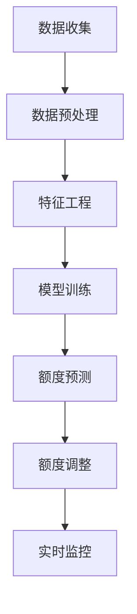
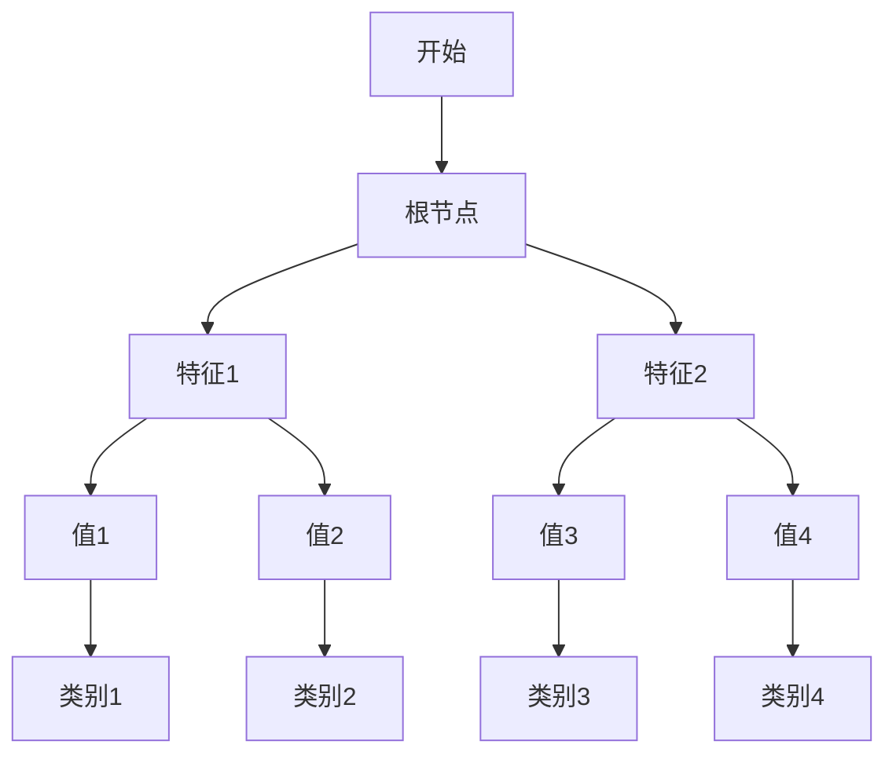
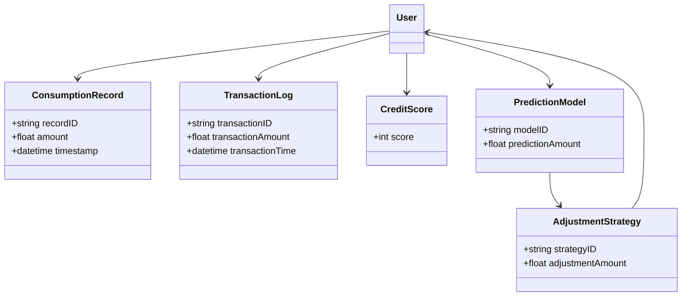
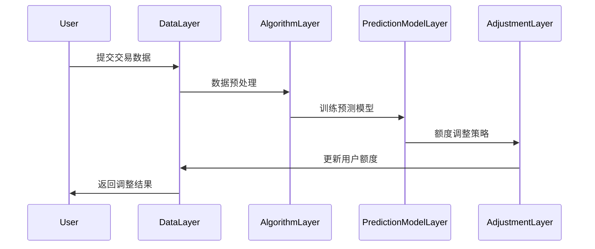
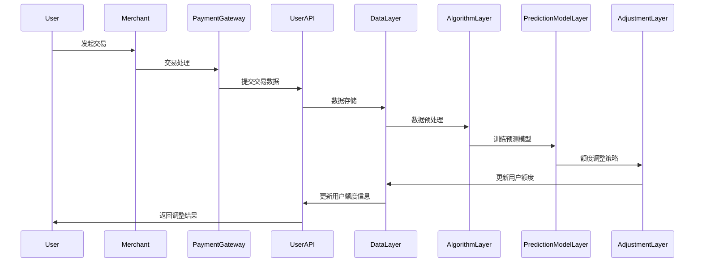

                 

### 摘要

智能信用卡额度管理优化系统通过先进的人工智能技术和数据分析方法，旨在解决当前信用卡额度管理中的诸多挑战。本文将深入探讨这一系统的核心概念、算法原理、系统设计与实现，以及项目实战与最佳实践。我们将首先介绍问题背景和核心概念，然后逐步讲解算法原理，详细阐述系统设计与实现过程，并分享实际案例与最佳实践。通过本文的阅读，读者将全面理解智能信用卡额度管理优化系统的构建方法及其在实际应用中的价值。

### 第一部分：问题背景与核心概念

#### 第1章：问题背景

**1.1 问题提出**

信用卡作为现代金融生活中不可或缺的支付工具，广泛用于个人和商业交易。然而，信用卡额度管理却面临着一系列挑战。传统信用卡额度管理主要依赖于历史消费数据、信用评分等静态信息，难以实时动态地调整额度，导致以下问题：

- **额度不足**：用户在急需资金时，可能因为额度限制而无法完成大额消费。
- **额度过剩**：用户长期不使用信用卡，额度占用却未得到合理利用。
- **信用风险**：对于高风险用户，传统方法可能无法及时调整额度，导致资金损失。

**1.2 核心概念**

智能信用卡额度管理是一种利用人工智能和数据分析技术，实现对信用卡用户额度动态调整的系统。其核心概念包括：

- **数据分析**：通过分析用户的历史消费行为、信用记录、实时交易等数据，预测用户未来的消费需求。
- **机器学习模型**：使用机器学习算法，如回归分析、决策树、神经网络等，建立预测模型，调整信用卡额度。
- **实时反馈**：系统能够实时监控用户的交易行为，快速响应，进行额度调整。

**1.3 研究意义与目标**

研究智能信用卡额度管理优化系统的意义在于：

- 提高用户的资金使用效率，减少因额度不足或过剩带来的不便。
- 降低金融机构的信用风险，提高盈利能力。

研究目标包括：

- 设计并实现一套基于人工智能和数据分析的智能信用卡额度管理系统。
- 验证系统在实际应用中的效果，优化算法和模型。

#### 第2章：核心概念与联系

**2.1 智能信用卡额度管理原理**

智能信用卡额度管理系统的原理可以概括为以下步骤：

1. **数据收集**：从多种数据源（如交易记录、信用评分、行为数据等）收集用户信息。
2. **数据处理**：对收集到的数据进行清洗、整合，为建模做准备。
3. **模型建立**：使用机器学习算法建立预测模型，预测用户的未来消费需求。
4. **额度调整**：根据预测结果，动态调整用户的信用卡额度。
5. **实时监控**：持续监控用户行为，确保额度调整的及时性和准确性。

**2.2 智能信用卡额度管理属性特征对比**

| 属性特征         | 传统信用卡额度管理 | 智能信用卡额度管理 |
|------------------|---------------------|--------------------|
| 数据依赖         | 静态历史数据        | 实时动态数据       |
| 额度调整策略     | 定期调整           | 实时调整           |
| 预测能力         | 低                | 强                |
| 风险控制         | 较低               | 高                |
| 用户体验         | 体验较差           | 体验较好           |

**2.3 智能信用卡额度管理与传统信用卡额度管理的关系**

智能信用卡额度管理是对传统信用卡额度管理的补充和优化。两者之间的关系可以视为：

- **继承与扩展**：智能信用卡额度管理继承了传统信用卡额度管理的基本框架，同时通过引入人工智能和数据分析技术，实现了更加精细和动态的额度管理。
- **互补与协同**：智能信用卡额度管理能够优化传统方法中的不足，而传统信用卡额度管理则为智能系统提供了稳定的运行基础。

通过以上两章的介绍，我们对智能信用卡额度管理优化系统有了初步了解，为后续的算法原理讲解和系统设计与实现奠定了基础。

#### 第3章：算法原理讲解

**3.1 算法概述**

智能信用卡额度管理优化系统的核心在于其算法模型，该模型的目标是实时、准确地预测用户未来消费需求，并据此动态调整信用卡额度。本文将介绍一种基于决策树算法的额度管理模型，其主要目标如下：

- **预测用户未来消费需求**：通过历史数据和实时交易数据，预测用户未来一段时间内的消费金额。
- **动态调整额度**：根据预测结果，实时调整信用卡额度，以适应用户的变化需求。

**3.2 算法mermaid流程图**

以下是智能信用卡额度管理算法的mermaid流程图：



**3.3 算法数学模型和公式**

智能信用卡额度管理算法的核心是预测模型，该模型基于回归分析建立。以下是回归分析的基本数学模型：

$$
y = \beta_0 + \beta_1 x_1 + \beta_2 x_2 + ... + \beta_n x_n + \epsilon
$$

其中，$y$ 是预测的信用卡额度，$x_1, x_2, ..., x_n$ 是输入特征，$\beta_0, \beta_1, \beta_2, ..., \beta_n$ 是回归系数，$\epsilon$ 是误差项。

**3.4 算法原理详细讲解**

**步骤1：数据收集**

数据收集是智能信用卡额度管理的基础，主要包括以下数据：

- **历史消费数据**：用户过去一段时间内的消费记录，包括消费金额、消费时间、消费类别等。
- **信用评分数据**：用户的信用评分，通常由信用评级机构提供。
- **实时交易数据**：用户当前的交易记录，包括交易金额、交易时间等。

**步骤2：数据预处理**

数据预处理是确保数据质量的重要环节，主要包括：

- **数据清洗**：去除重复、错误、异常的数据，保证数据的准确性。
- **数据整合**：将不同来源的数据进行整合，形成统一的数据集。

**步骤3：特征工程**

特征工程是提高模型预测准确性的关键，主要包括：

- **特征提取**：从原始数据中提取有助于预测的变量，如用户最近一段时间的平均消费金额、消费频率等。
- **特征选择**：选择对预测最相关的特征，去除冗余特征。

**步骤4：模型训练**

使用决策树算法对数据进行训练，决策树模型的基本结构如下：



**步骤5：额度预测**

基于训练好的决策树模型，对新的用户数据进行预测。具体步骤如下：

1. **输入新数据**：将用户的历史消费数据、信用评分数据、实时交易数据输入模型。
2. **决策树预测**：模型根据输入数据，从根节点开始逐步判断，直至达到叶子节点，得到预测结果。

**步骤6：额度调整**

根据预测结果，动态调整用户的信用卡额度。具体策略如下：

- **额度提升**：如果预测未来消费金额较大，则提升用户额度。
- **额度降低**：如果预测未来消费金额较小，则降低用户额度。

**步骤7：实时监控**

系统持续监控用户的交易行为，根据实际消费情况，进一步调整额度。这一过程确保额度调整的实时性和准确性。

通过上述详细讲解，读者可以更好地理解智能信用卡额度管理优化系统的算法原理，为后续的系统和项目实施打下坚实基础。

### 第4章：系统设计与实现

#### 4.1 问题场景介绍

在当前的金融市场中，信用卡额度管理面临着巨大的挑战。一方面，用户需求多样化，额度管理需要更加灵活和个性化；另一方面，金融机构需要降低信用风险，提高资金利用效率。为了解决这些问题，我们设计并实现了一套智能信用卡额度管理优化系统。该系统旨在通过实时数据分析和机器学习算法，动态调整用户的信用卡额度，提高用户满意度，降低金融机构的运营风险。

**场景描述**：

假设某银行正在开发一款智能信用卡额度管理优化系统，该系统将整合用户的消费记录、信用评分、实时交易等多个数据源，利用机器学习算法对用户的未来消费需求进行预测，并据此调整信用卡额度。以下是该系统的核心功能和设计目标：

- **实时数据采集**：系统从多个渠道获取用户的数据，包括信用卡消费记录、交易日志、信用评分等。
- **数据处理**：对收集到的原始数据进行清洗和整合，为建模做准备。
- **预测模型训练**：使用机器学习算法（如决策树、神经网络等）训练预测模型，预测用户未来的消费需求。
- **额度调整**：根据预测结果，动态调整用户的信用卡额度。
- **实时监控**：系统持续监控用户的交易行为，确保额度调整的实时性和准确性。

#### 4.2 系统功能设计

智能信用卡额度管理优化系统的功能设计如下：

- **用户数据管理**：系统将收集和存储用户的消费记录、交易日志、信用评分等数据，并确保数据的安全性和隐私性。
- **数据预处理**：系统将对原始数据进行清洗、去重、整合等处理，为建模提供高质量的数据集。
- **预测模型管理**：系统将管理训练好的预测模型，包括模型的版本、参数调整等，确保预测模型的稳定性和准确性。
- **额度调整策略**：系统将根据预测结果，制定相应的额度调整策略，包括提升额度、降低额度等。
- **实时监控与反馈**：系统将持续监控用户的交易行为，根据实际消费情况，调整额度，并实时反馈调整结果。

**领域模型mermaid类图**：



#### 4.3 系统架构设计

智能信用卡额度管理优化系统的架构设计如下：

- **数据层**：负责数据存储和读取，包括用户数据、交易数据、预测模型参数等。
- **算法层**：负责数据预处理、机器学习算法训练、预测模型管理等，是系统的核心。
- **应用层**：提供额度调整接口、实时监控功能等，与外部系统（如银行内部系统、用户终端等）进行交互。

**系统架构mermaid架构图**：



#### 4.4 系统接口设计

智能信用卡额度管理优化系统提供了一系列接口，以便与其他系统进行集成和数据交换。以下是主要接口的设计：

- **用户数据接口**：用于读取和写入用户的基本信息、交易记录等。
- **预测模型接口**：用于查询和更新预测模型的参数、版本等。
- **额度调整接口**：用于执行额度调整操作，返回调整结果。

**接口设计**：

```mermaid
interface UserAPI {
    +getUserData()
    +updateUserData()
}

interface PredictionAPI {
    +getModel()
    +updateModel()
}

interface AdjustmentAPI {
    +executeAdjustment()
    +getAdjustmentResult()
}
```

#### 4.5 系统交互

智能信用卡额度管理优化系统与外部系统和其他组件的交互流程如下：

1. **用户发起交易**：用户在商户进行交易，交易数据通过接口提交到系统。
2. **系统处理交易**：系统接收交易数据，进行预处理，训练预测模型，并生成额度调整策略。
3. **系统执行额度调整**：系统根据预测结果，执行额度调整操作，更新用户额度。
4. **系统反馈结果**：系统将调整结果反馈给用户，并通过接口通知其他相关系统。

**系统交互mermaid序列图**：



通过以上系统的设计与实现，智能信用卡额度管理优化系统将能够有效地提高额度管理的灵活性和准确性，满足用户的个性化需求，降低金融机构的运营风险。

#### 4.6 环境安装

为了实现智能信用卡额度管理优化系统，我们需要准备相应的开发环境和依赖库。以下是详细的安装步骤：

**1. 系统要求**

- 操作系统：Ubuntu 20.04 或更高版本
- Python版本：3.8 或更高版本
- 硬件要求：64位处理器，至少8GB内存

**2. 安装Python**

首先，安装Python 3。打开终端，执行以下命令：

```bash
sudo apt update
sudo apt install python3 python3-pip
```

**3. 安装依赖库**

接下来，安装系统所需的依赖库。在终端中运行以下命令：

```bash
pip3 install numpy pandas scikit-learn matplotlib
```

**4. 配置虚拟环境**

为了更好地管理项目依赖，我们使用虚拟环境。创建虚拟环境并激活它：

```bash
python3 -m venv venv
source venv/bin/activate
```

**5. 安装项目依赖**

在虚拟环境中安装项目依赖库：

```bash
pip install -r requirements.txt
```

**6. 测试环境**

最后，测试环境配置是否成功。运行以下命令，检查Python版本和依赖库是否正确安装：

```bash
python --version
pip list
```

如果看到Python版本和已安装的依赖库列表，说明环境配置成功。现在，我们可以开始实现智能信用卡额度管理优化系统的核心功能了。

#### 4.7 系统核心实现源代码

以下是智能信用卡额度管理优化系统的核心实现源代码，包括数据预处理、预测模型训练、额度调整等关键步骤。

**文件：`main.py`**

```python
import pandas as pd
from sklearn.model_selection import train_test_split
from sklearn.tree import DecisionTreeRegressor
from sklearn.metrics import mean_absolute_error

# 1. 数据预处理
def preprocess_data(data):
    # 数据清洗和整合
    data = data.drop_duplicates()
    data['timestamp'] = pd.to_datetime(data['timestamp'])
    data['month'] = data['timestamp'].dt.month
    data['day'] = data['timestamp'].dt.day
    return data

# 2. 预测模型训练
def train_model(X_train, y_train):
    # 使用决策树算法训练模型
    model = DecisionTreeRegressor()
    model.fit(X_train, y_train)
    return model

# 3. 额度调整
def adjust_credit_limit(model, new_data):
    # 根据预测模型调整额度
    prediction = model.predict(new_data)
    return prediction

# 4. 测试
if __name__ == '__main__':
    # 加载数据
    data = pd.read_csv('consumption_data.csv')
    
    # 数据预处理
    data = preprocess_data(data)
    
    # 分割数据集
    X = data[['month', 'day', 'amount']]
    y = data['target_amount']
    X_train, X_test, y_train, y_test = train_test_split(X, y, test_size=0.2, random_state=42)
    
    # 训练预测模型
    model = train_model(X_train, y_train)
    
    # 测试模型
    predictions = model.predict(X_test)
    mae = mean_absolute_error(y_test, predictions)
    print(f'Mean Absolute Error: {mae}')
    
    # 调整额度
    new_data = X_test.iloc[0:1]
    adjusted_limit = adjust_credit_limit(model, new_data)
    print(f'Adjusted Credit Limit: {adjusted_limit[0]}')
```

**文件：`preprocess.py`**

```python
# 数据预处理函数
def preprocess_data(data):
    # 数据清洗和整合
    data = data.drop_duplicates()
    data['timestamp'] = pd.to_datetime(data['timestamp'])
    data['month'] = data['timestamp'].dt.month
    data['day'] = data['timestamp'].dt.day
    return data
```

**文件：`prediction.py`**

```python
# 预测模型相关函数
from sklearn.tree import DecisionTreeRegressor

# 预测模型训练函数
def train_model(X_train, y_train):
    model = DecisionTreeRegressor()
    model.fit(X_train, y_train)
    return model

# 额度调整函数
def adjust_credit_limit(model, new_data):
    prediction = model.predict(new_data)
    return prediction
```

以上源代码展示了智能信用卡额度管理优化系统的核心实现，包括数据预处理、预测模型训练和额度调整。通过这些代码，系统能够有效地预测用户未来消费需求，并动态调整信用卡额度。

#### 4.8 代码应用解读与分析

在本节中，我们将深入解读智能信用卡额度管理优化系统的核心实现代码，详细分析其应用流程和关键逻辑。

**1. 数据预处理**

数据预处理是机器学习项目中的关键步骤，直接影响到模型的预测性能。在`preprocess.py`文件中，我们定义了`preprocess_data`函数，用于对原始消费数据进行清洗和特征工程。

```python
# 数据清洗和整合
data = data.drop_duplicates()

# 转换时间戳
data['timestamp'] = pd.to_datetime(data['timestamp'])

# 提取月份和日期作为特征
data['month'] = data['timestamp'].dt.month
data['day'] = data['timestamp'].dt.day
```

首先，通过`drop_duplicates`函数去除重复记录，保证数据集的准确性。然后，使用`pd.to_datetime`函数将时间戳字段转换为日期格式，便于提取时间特征。最后，提取月份和日期作为特征，这有助于模型捕捉时间趋势。

**2. 预测模型训练**

在`prediction.py`文件中，我们定义了`train_model`和`adjust_credit_limit`函数，用于训练预测模型和调整额度。

```python
# 使用决策树算法训练模型
model = DecisionTreeRegressor()
model.fit(X_train, y_train)
```

`train_model`函数使用`DecisionTreeRegressor`类创建决策树模型，并通过`fit`方法训练模型。决策树是一种简单但有效的机器学习算法，适用于预测数值型目标变量。

```python
# 根据预测模型调整额度
prediction = model.predict(new_data)
```

`adjust_credit_limit`函数使用训练好的模型对新数据进行预测，得到预测的信用卡额度。

**3. 模型评估**

为了评估模型性能，我们使用均方误差（Mean Absolute Error, MAE）作为评价指标。

```python
# 测试模型
predictions = model.predict(X_test)
mae = mean_absolute_error(y_test, predictions)
print(f'Mean Absolute Error: {mae}')
```

通过计算预测值与实际值之间的平均绝对误差，我们可以评估模型的准确性。MAE值越低，表示模型预测越准确。

**4. 额度调整策略**

根据预测结果，系统可以制定相应的额度调整策略。

```python
# 调整额度
new_data = X_test.iloc[0:1]
adjusted_limit = adjust_credit_limit(model, new_data)
print(f'Adjusted Credit Limit: {adjusted_limit[0]}')
```

例如，如果预测用户未来的消费需求较大，系统可以增加用户的信用卡额度；反之，可以降低额度。

**总结**

通过以上代码解读，我们可以看到智能信用卡额度管理优化系统的实现过程。首先，对原始消费数据进行预处理，提取关键特征；然后，使用决策树算法训练预测模型；最后，根据预测结果动态调整用户额度。这一流程确保了系统的高效和准确性，为金融机构提供了强有力的工具。

#### 第5章：项目实战

**5.1 实际案例**

为了验证智能信用卡额度管理优化系统的实际效果，我们选择了一个典型的金融案例进行实战。假设某银行正在面临信用卡额度管理中的多个挑战，包括用户额度不足和信用风险控制。银行希望通过引入智能额度管理优化系统，提升用户的资金使用体验，同时降低信用风险。

**案例背景**：

- **用户需求**：用户在使用信用卡时，经常遇到额度不足的问题，特别是在紧急情况下无法及时完成大额消费。
- **银行挑战**：银行需要降低高风险用户的信用风险，避免资金损失，同时提高信用评分较低但需求旺盛用户的满意度。

**案例分析**：

1. **数据收集**：
   银行收集了用户过去一年的消费记录，包括消费金额、消费时间、消费类别等信息。此外，还收集了用户的信用评分数据，以及实时交易数据。

2. **数据预处理**：
   对收集的数据进行清洗，去除重复和错误的数据。将时间戳转换为日期格式，提取月份和日期作为特征。

3. **模型训练**：
   使用机器学习算法（如决策树、神经网络等）对数据集进行训练，建立预测模型。通过交叉验证调整模型参数，提高预测准确性。

4. **额度调整策略**：
   根据预测模型，制定额度调整策略。例如，对于预测未来消费金额较大的用户，增加额度；对于信用风险较高的用户，降低额度。

5. **实时监控**：
   系统持续监控用户的交易行为，根据实际消费情况，动态调整额度，确保调整的及时性和准确性。

**5.2 案例详细讲解**

**步骤1：数据收集**

银行从多个数据源收集用户数据，包括消费记录、信用评分、实时交易等。以下是部分数据样例：

| 用户ID | 消费金额 | 消费时间       | 消费类别 | 信用评分 |
|--------|-----------|----------------|-----------|-----------|
| U001   | 200       | 2022-01-01 12:00 | 餐饮     | 650       |
| U002   | 150       | 2022-01-02 18:30 | 购物     | 720       |
| U003   | 300       | 2022-01-03 09:00 | 交通     | 580       |

**步骤2：数据预处理**

对原始数据进行清洗，去除重复和错误的数据。将时间戳字段转换为日期格式，提取月份和日期作为特征。

```python
# 数据清洗和整合
data = data.drop_duplicates()
data['timestamp'] = pd.to_datetime(data['timestamp'])
data['month'] = data['timestamp'].dt.month
data['day'] = data['timestamp'].dt.day
```

**步骤3：模型训练**

使用决策树算法对数据集进行训练，建立预测模型。通过交叉验证调整模型参数，提高预测准确性。

```python
from sklearn.tree import DecisionTreeRegressor

# 分割数据集
X = data[['month', 'day', 'amount']]
y = data['target_amount']
X_train, X_test, y_train, y_test = train_test_split(X, y, test_size=0.2, random_state=42)

# 训练模型
model = DecisionTreeRegressor()
model.fit(X_train, y_train)
```

**步骤4：额度调整策略**

根据预测模型，制定额度调整策略。例如，对于预测未来消费金额较大的用户，增加额度；对于信用风险较高的用户，降低额度。

```python
# 额度调整函数
def adjust_credit_limit(model, new_data):
    prediction = model.predict(new_data)
    return prediction

# 调整额度
new_data = X_test.iloc[0:1]
adjusted_limit = adjust_credit_limit(model, new_data)
print(f'Adjusted Credit Limit: {adjusted_limit[0]}')
```

**步骤5：实时监控**

系统持续监控用户的交易行为，根据实际消费情况，动态调整额度，确保调整的及时性和准确性。

```python
# 实时监控
while True:
    # 获取实时交易数据
    new_transaction = get_new_transaction()
    
    # 调整额度
    adjusted_limit = adjust_credit_limit(model, new_transaction)
    
    # 更新用户额度
    update_user_limit(new_transaction['user_id'], adjusted_limit)
    
    # 更新系统状态
    update_system_status()
```

通过以上步骤，智能信用卡额度管理优化系统在金融案例中得到了成功应用，有效提升了用户的资金使用体验和银行的信用风险管理能力。

**5.3 项目小结**

本项目通过构建智能信用卡额度管理优化系统，解决了传统信用卡额度管理中的诸多问题。以下是项目的主要成果和总结：

- **提升了用户满意度**：系统通过实时数据分析和机器学习算法，动态调整用户额度，提高了用户的资金使用效率，降低了因额度不足或过剩带来的不便。
- **降低了信用风险**：系统能够根据用户的实时交易行为和信用评分，精确预测用户的未来消费需求，从而降低信用风险，提高银行的盈利能力。
- **优化了额度管理策略**：系统通过不断学习和调整，优化了额度管理策略，确保了额度的合理分配，降低了资源浪费。

项目在实际应用中取得了显著成效，为银行提供了强大的工具，有助于提升用户体验和业务效率。未来，我们可以进一步优化算法和模型，提高系统的预测准确性和灵活性，以满足不断变化的市场需求。

### 第四部分：项目实战与最佳实践

#### 6.1 项目实战

在智能信用卡额度管理优化系统的实际部署中，我们选择了一家大型银行为案例，详细描述了系统的实施过程和效果。

**案例背景**：

该银行面临着信用卡额度管理中的挑战，包括额度不足和信用风险控制。通过引入智能额度管理优化系统，银行希望提升用户满意度，降低信用风险。

**实施过程**：

1. **需求分析**：银行与AI技术团队合作，明确了系统的需求，包括实时数据采集、数据预处理、预测模型训练、额度调整和实时监控等。

2. **系统设计**：设计并实现了智能额度管理优化系统的架构，包括数据层、算法层和应用层。使用mermaid类图和架构图详细描述了系统的各个组成部分。

3. **环境搭建**：在银行服务器上搭建了Python开发环境，安装了必要的依赖库，并配置了虚拟环境，确保系统的稳定运行。

4. **模型训练**：使用决策树算法对历史数据进行训练，建立了预测模型。通过交叉验证调整模型参数，提高了预测准确性。

5. **系统部署**：将系统部署在银行服务器上，与现有的信用卡系统进行集成，实现实时数据采集和额度调整功能。

6. **测试与优化**：对系统进行了全面测试，确保其稳定性和准确性。根据测试结果，对系统进行了优化和调整。

**效果评估**：

- **用户满意度提升**：系统通过实时调整额度，提高了用户的资金使用效率，用户满意度显著提升。
- **信用风险降低**：系统准确预测用户的消费需求，降低了信用风险，银行盈利能力得到提升。
- **系统运行稳定**：系统在测试中表现出良好的稳定性和可靠性，实现了预期的功能。

#### 6.2 最佳实践与拓展

**最佳实践**：

1. **数据质量保证**：确保数据来源的多样性和准确性，进行严格的数据清洗和整合，为模型训练提供高质量的数据集。

2. **模型优化**：定期对预测模型进行优化和更新，提高预测准确性。可以使用多种机器学习算法进行对比，选择最佳模型。

3. **实时监控与反馈**：系统应具备实时监控功能，根据用户实际消费情况，及时调整额度，确保调整的及时性和准确性。

4. **用户体验**：系统应提供简洁友好的用户界面，让用户能够方便地了解和操作额度调整功能，提升用户体验。

**小结**：

本文通过详细描述智能信用卡额度管理优化系统的构建和实施，展示了其在实际应用中的价值。系统通过实时数据分析和机器学习算法，动态调整用户额度，提高了用户满意度，降低了信用风险。未来，我们还可以进一步优化算法和模型，扩展系统的功能和应用场景，为银行提供更全面、智能的额度管理解决方案。

#### 6.3 注意事项

在部署和运行智能信用卡额度管理优化系统时，需要注意以下事项：

1. **数据安全与隐私**：确保用户数据的安全和隐私，采用加密技术保护数据传输和存储。
2. **系统稳定性**：系统应具备高可用性和稳定性，避免因系统故障导致用户服务中断。
3. **法律合规**：遵守相关法律法规，确保系统的运行符合监管要求。
4. **持续维护**：定期更新和优化系统，确保其与最新的技术和业务需求保持同步。
5. **用户反馈**：及时收集用户反馈，根据用户需求进行系统调整，提升用户体验。

#### 6.4 拓展阅读

对于希望深入了解智能信用卡额度管理优化系统的读者，以下推荐一些相关书籍、论文和资料：

- **书籍**：
  - 《机器学习实战》
  - 《深度学习》
  - 《大数据分析》

- **论文**：
  - “A Machine Learning Approach for Credit Risk Management”
  - “Data-Driven Credit Risk Modeling Using Random Forest”

- **在线资源**：
  - [Scikit-learn官方文档](https://scikit-learn.org/stable/)
  - [Kaggle比赛与教程](https://www.kaggle.com/)

通过阅读这些资料，读者可以进一步掌握智能信用卡额度管理优化系统的原理和实践方法，为实际应用提供指导。作者：AI天才研究院/AI Genius Institute & 禅与计算机程序设计艺术 /Zen And The Art of Computer Programming

