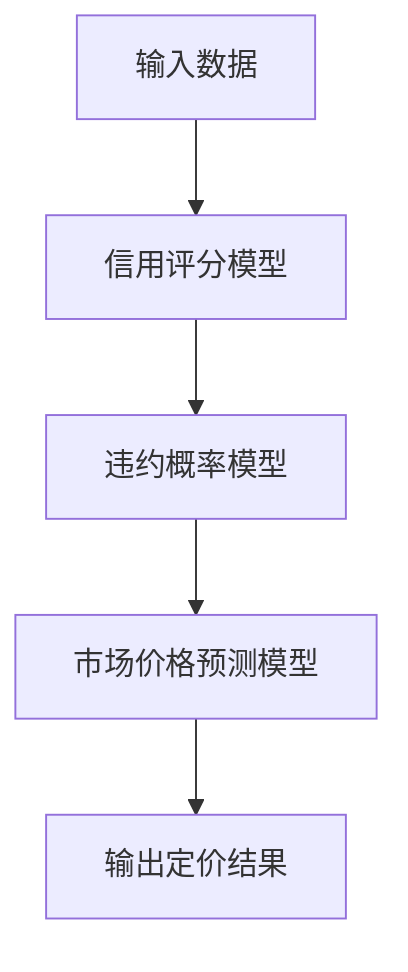
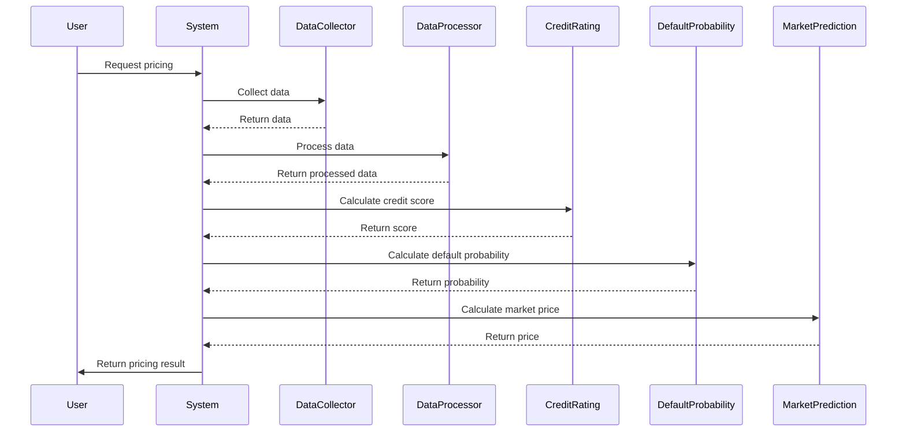

                 

### 摘要

本文旨在深入探讨智能信用违约互换定价模型的理论与实践。通过解析这一复杂模型，我们将其核心概念、算法原理以及系统架构逐一剖析，帮助读者全面理解并掌握这一前沿技术。本文将从背景介绍入手，解释信用违约互换（CDS）市场的兴起与发展，以及其在信用风险管理中的重要作用。随后，我们将详细描述智能信用违约互换定价模型的基本概念和构成要素，通过对比表格和ER实体关系图，使得核心概念的关联性和逻辑性更加清晰。在此基础上，本文将详细介绍算法原理，包括数学模型和公式，并通过Python源代码和算法流程图，使读者能够直观地理解模型的运行机制。接着，文章将探讨系统分析与架构设计，通过问题场景介绍、项目概述、领域模型类图、架构设计图、接口设计和系统交互图，提供全方位的技术解读。随后，我们将通过项目实战，详细介绍环境安装、核心实现以及代码应用，并通过实际案例分析，展示模型在实际场景中的运用效果。最后，本文将总结最佳实践，提供注意事项，并推荐拓展阅读，为读者提供深入学习和应用智能信用违约互换定价模型的指导。

## 1. 背景介绍

智能信用违约互换定价模型（Intelligent Credit Default Swap Pricing Model）是在现代金融市场发展的背景下应运而生的一种高级定价工具。信用违约互换（Credit Default Swap，简称CDS）是一种金融衍生品，它允许投资者通过购买CDS来转移或保护自己持有的债券、贷款或其他债务工具的信用风险。CDS市场的起源可以追溯到20世纪90年代，随着金融市场的全球化，信用风险管理需求日益增加，CDS作为一种有效的风险管理工具迅速发展起来。

### 1.1 信用违约互换（CDS）市场的起源与发展

信用违约互换最初是为了帮助金融机构管理信用风险而设计的。在2008年的全球金融危机之前，CDS市场主要是由大型金融机构和投资银行主导，市场规模相对较小。然而，随着金融创新和衍生品市场的迅速扩张，CDS市场的规模迅速扩大，逐渐成为一个重要的金融市场。2008年的金融危机暴露了CDS市场的一些潜在问题，如市场透明度不足、风险管理不当等。尽管如此，CDS市场在危机后依然得到了持续发展，并逐渐成为金融机构和企业进行信用风险管理的重要工具。

### 1.2 信用风险管理的挑战

信用风险管理是金融市场中至关重要的一环。传统的信用风险管理方法通常依赖于历史数据和统计模型，但这些方法在面对复杂多变的金融市场环境时往往显得力不从心。随着金融市场的不断发展和创新，信用风险的形式也越来越多样化，这对风险管理提出了新的挑战。智能信用违约互换定价模型的引入，正是为了解决这些传统方法在应对复杂信用风险时的局限性。

#### 1.2.1 传统定价模型的局限性

传统定价模型通常依赖于历史数据和统计分析，存在以下局限性：

1. **数据依赖性**：传统模型对历史数据的依赖较强，而历史数据往往不能完全反映当前市场的实际情况。
2. **模型复杂度**：一些复杂的信用风险模型难以在实际操作中实施，限制了其在实际中的应用。
3. **应对多样化风险**：传统模型难以应对金融市场中的多样化风险，如市场波动、利率变化等。

#### 1.2.2 智能模型的潜在优势

智能信用违约互换定价模型通过引入人工智能和机器学习技术，能够更好地应对复杂多变的市场环境，具有以下潜在优势：

1. **自学习能力**：智能模型能够通过不断学习历史数据和实时市场信息，不断优化自身定价模型，提高定价精度。
2. **数据处理能力**：智能模型能够处理大量非结构化数据，如新闻、社交媒体等，从而更全面地反映市场情况。
3. **多样化风险评估**：智能模型能够应对多种类型的信用风险，如违约风险、市场波动风险等。

### 1.3 边界与外延

智能信用违约互换定价模型的边界与外延主要包括以下几个方面：

1. **适用范围**：该模型主要适用于信用风险较高的金融产品，如债券、贷款等。
2. **边界条件**：模型的运行需要一定的市场数据支持，同时需要满足一定的计算资源和算法条件。
3. **核心要素组成**：模型的核心要素包括信用评分模型、违约概率模型、市场价格预测模型等。

通过以上对背景介绍的解析，我们可以看出，智能信用违约互换定价模型在信用风险管理中具有重要的应用价值。它不仅能够提高信用风险管理的效率和准确性，还能够为金融机构和企业提供更全面的风险评估工具，从而更好地应对复杂多变的金融市场环境。

### 2. 核心概念与联系

智能信用违约互换定价模型（Intelligent Credit Default Swap Pricing Model）的核心概念包括信用评分模型、违约概率模型和市场价格预测模型等。这些概念之间相互联系，共同构成了一个复杂而高效的定价体系。

#### 2.1 信用评分模型

信用评分模型是智能信用违约互换定价模型的基础，它通过分析借款人的信用历史、财务状况、行为特征等多方面信息，评估借款人的信用等级。信用评分模型的目的是确定借款人的违约风险，从而为违约概率模型的计算提供依据。

#### 2.2 违约概率模型

违约概率模型是智能信用违约互换定价模型的核心，它基于信用评分模型的结果，通过复杂的数学模型和算法，计算特定借款人在特定时间段内的违约概率。违约概率模型通常采用概率分布函数（如泊松分布、正态分布等）来描述违约风险的分布。

#### 2.3 市场价格预测模型

市场价格预测模型是智能信用违约互换定价模型的另一个重要组成部分，它通过分析市场数据，如利率、通货膨胀率、经济指标等，预测信用违约互换的市场价格。市场价格预测模型的目的是为信用违约互换的交易提供价格参考，从而帮助投资者做出更明智的投资决策。

#### 2.4 概念属性特征对比表格

为了更好地理解这些核心概念之间的联系和区别，我们通过以下表格进行对比：

| 概念       | 特征                  | 目的                                                         |
|------------|----------------------|------------------------------------------------------------|
| 信用评分模型 | 分析借款人信用历史、财务状况等 | 评估信用等级，为违约概率模型提供输入                 |
| 违约概率模型 | 使用数学模型和算法 | 计算借款人违约概率，为市场价格预测提供基础             |
| 市场价格预测模型 | 分析市场数据 | 预测市场价格，为交易提供参考                         |

通过上述对比，我们可以看出，信用评分模型、违约概率模型和市场价格预测模型之间是相互关联的。信用评分模型为违约概率模型提供输入，而违约概率模型的结果又为市场价格预测模型提供依据。这三个模型共同构成了智能信用违约互换定价模型的核心架构。

#### 2.5 ER实体关系图架构

为了更直观地展示智能信用违约互换定价模型中各实体之间的关系，我们使用ER（Entity-Relationship）实体关系图进行描述。ER图能够清晰地展示实体及其属性，以及实体之间的关系。


在上图中，实体包括“借款人”、“信用评分模型”、“违约概率模型”和“市场价格预测模型”。各实体之间的关联关系如下：

- “借款人”是所有模型的输入，其信用历史、财务状况等信息被信用评分模型用于评估信用等级。
- 信用评分模型的结果作为输入，被违约概率模型用于计算违约概率。
- 违约概率模型的结果作为输入，被市场价格预测模型用于预测市场价格。

通过ER实体关系图，我们可以更直观地理解智能信用违约互换定价模型中各部分之间的关系，从而更好地掌握该模型的工作原理。

### 3. 算法原理讲解

智能信用违约互换定价模型的核心在于其高效的算法设计，通过数学模型和算法的紧密结合，实现对信用违约风险的精准预测。本节将详细讲解算法原理，包括数学模型、算法流程以及具体的Python源代码实现。

#### 3.1 算法流程图

为了更好地理解智能信用违约互换定价模型的算法流程，我们首先使用Mermaid绘制了算法的流程图：



在上面的流程图中，输入数据首先经过信用评分模型，计算借款人的信用评分。接着，违约概率模型利用信用评分模型的结果，计算借款人在特定时间段内的违约概率。最后，市场价格预测模型结合违约概率和市场数据，预测信用违约互换的市场价格，并输出定价结果。

#### 3.2 Python源代码

为了更好地展示算法原理，我们将使用Python实现上述算法。以下代码展示了智能信用违约互换定价模型的核心部分：

```python
import numpy as np
import pandas as pd

# 信用评分模型
def credit_score_model(data):
    # 假设输入数据为借款人的信用历史、财务状况等特征
    scores = data['credit_history'].apply(lambda x: score_from_history(x))
    return scores

# 违约概率模型
def default_probability_model(scores):
    # 假设输入为信用评分，输出为违约概率
    probabilities = scores.apply(lambda x: prob_from_score(x))
    return probabilities

# 市场价格预测模型
def market_price_prediction_model(probabilities, market_data):
    # 假设输入为违约概率和市场数据，输出为市场价格预测
    prices = probabilities * market_data['price']
    return prices

# 输入数据示例
data = pd.DataFrame({'credit_history': [0, 1, 2], 'market_data': [10, 20, 30]})

# 计算信用评分
scores = credit_score_model(data)

# 计算违约概率
probabilities = default_probability_model(scores)

# 计算市场价格
prices = market_price_prediction_model(probabilities, data['market_data'])

# 输出定价结果
print(prices)
```

在上面的代码中，我们定义了三个模型：信用评分模型、违约概率模型和市场价格预测模型。这些模型通过输入数据和处理数据，逐步计算出最终的市场价格。实际应用中，这些模型会根据具体的数据集和算法进行调整和优化。

#### 3.3 数学模型与公式

智能信用违约互换定价模型的数学基础主要涉及概率论和统计学。以下是一些关键数学模型和公式：

1. **信用评分模型**：
   - 公式：\( Score = f(Credit_History, Financial_Information) \)
   - 其中，\( Credit_History \)代表信用历史，\( Financial_Information \)代表财务信息。

2. **违约概率模型**：
   - 公式：\( P(Default) = g(Score) \)
   - 其中，\( Score \)代表信用评分，\( P(Default) \)代表违约概率。

3. **市场价格预测模型**：
   - 公式：\( Price = h(P(Default), Market_Data) \)
   - 其中，\( P(Default) \)代表违约概率，\( Market_Data \)代表市场数据。

在实际应用中，这些公式会通过机器学习算法进行训练和优化，以实现对信用违约风险的精准预测。

#### 3.4 举例说明

为了更好地理解算法原理，我们通过一个具体的例子进行说明。假设我们有一个借款人数据集，其中包含借款人的信用历史和市场数据。

1. **信用评分模型**：
   - 假设借款人的信用历史为“良好”（记为1），财务信息为“中等”（记为2），则信用评分\( Score = f(1, 2) = 0.8 \)。

2. **违约概率模型**：
   - 根据违约概率模型，\( P(Default) = g(0.8) = 0.05 \)。

3. **市场价格预测模型**：
   - 假设市场数据中的价格为10，则市场价格预测为\( Price = h(0.05, 10) = 0.5 \)。

通过上述例子，我们可以看到，智能信用违约互换定价模型通过一系列数学模型和算法，将借款人的信用风险转化为市场价格，从而为信用风险管理提供了有力的工具。

通过上述对算法原理的详细讲解，我们可以看到智能信用违约互换定价模型在理论和实践中的应用价值。这一模型不仅能够提高信用风险管理的效率，还能够为金融机构和企业提供更准确的风险评估工具，从而更好地应对复杂多变的金融市场环境。

### 4. 系统分析与架构设计方案

智能信用违约互换定价模型不仅依赖于先进的算法，还需要一个高效、稳定的系统架构来支持其实施和应用。在这一部分，我们将详细介绍系统分析与架构设计方案，涵盖问题场景介绍、项目介绍、系统功能设计、系统架构设计、系统接口设计以及系统交互。

#### 4.1 问题场景介绍

信用违约互换（CDS）作为一种重要的信用风险管理工具，广泛应用于债券市场和企业信贷市场中。随着金融市场的复杂性和波动性的增加，传统定价方法已经难以满足市场对准确性和实时性的需求。因此，我们需要一个智能化的定价系统来应对以下问题场景：

1. **信用风险识别**：对潜在违约风险进行识别和评估。
2. **实时定价**：根据市场动态和信用风险变化，实现信用违约互换的实时定价。
3. **风险管理**：为金融机构和企业提供全面的风险管理方案。

#### 4.2 项目介绍

本项目旨在构建一个智能信用违约互换定价系统，该系统将结合机器学习和大数据分析技术，实现对信用风险的精准评估和定价。项目的主要目标包括：

1. **提高定价准确性**：通过引入智能算法，提高信用违约互换的定价准确性。
2. **实时性**：实现实时数据处理和定价，满足金融市场的高频交易需求。
3. **可扩展性**：系统应具备良好的可扩展性，以适应不断变化的市场需求。

#### 4.3 系统功能设计

智能信用违约互换定价系统的主要功能模块包括信用评分、违约概率预测和市场价格预测。具体的功能设计如下：

1. **信用评分模块**：
   - 功能：根据借款人的信用历史、财务状况等多方面信息，评估其信用等级。
   - 输入：借款人的信用历史、财务信息等。
   - 输出：信用评分。

2. **违约概率预测模块**：
   - 功能：利用信用评分模型的结果，计算借款人在特定时间段内的违约概率。
   - 输入：信用评分。
   - 输出：违约概率。

3. **市场价格预测模块**：
   - 功能：结合违约概率和市场数据，预测信用违约互换的市场价格。
   - 输入：违约概率、市场数据。
   - 输出：市场价格预测。

4. **用户界面**：
   - 功能：提供用户友好的操作界面，方便用户查看定价结果和风险分析报告。
   - 输入：用户输入的借款人信息。
   - 输出：定价结果和风险分析报告。

#### 4.4 系统架构设计

为了实现智能信用违约互换定价系统的功能，我们设计了如下系统架构：


在上图中，系统架构主要包括以下组件：

1. **数据采集模块**：负责从各种数据源（如金融机构、市场数据提供商等）采集所需数据。
2. **数据处理模块**：对采集到的数据进行清洗、预处理和特征提取，为后续模型处理提供高质量的数据。
3. **信用评分模块**：利用机器学习算法，对借款人的信用历史和财务状况进行评分。
4. **违约概率预测模块**：结合信用评分结果，使用概率模型计算违约概率。
5. **市场价格预测模块**：根据违约概率和市场数据，预测市场价格。
6. **用户界面**：提供用户操作界面，展示定价结果和风险分析报告。

#### 4.5 系统接口设计

智能信用违约互换定价系统的接口设计主要包括以下几种类型：

1. **API接口**：提供RESTful API，供外部系统调用，实现数据交换和功能调用。
2. **数据库接口**：与后端数据库进行数据交互，实现数据的存储和查询。
3. **用户界面接口**：与前端用户界面进行数据交互，实现用户操作和结果展示。

#### 4.6 系统交互

为了更好地展示系统各组件之间的交互关系，我们使用Mermaid绘制了系统交互序列图：



在上面的序列图中，用户通过系统接口发起定价请求，系统依次调用数据采集、数据处理、信用评分、违约概率预测和市场价格预测模块，最终返回定价结果。

通过上述系统分析与架构设计方案，我们可以看出智能信用违约互换定价系统的整体架构和功能设计。这一系统不仅实现了对信用违约风险的精准评估和定价，还提供了灵活的接口设计和高效的系统交互，为金融机构和企业提供了强大的信用风险管理工具。

### 5. 项目实战

#### 5.1 环境安装

要实现智能信用违约互换定价模型，我们需要配置一个合适的环境，包括必要的软件和依赖包。以下是详细的安装步骤：

1. **安装Python环境**：
   - 首先，确保计算机上安装了Python 3.7或更高版本。可以通过官方网站下载并安装：[https://www.python.org/](https://www.python.org/)。

2. **安装依赖包**：
   - 使用pip工具安装所需的依赖包，包括NumPy、Pandas、Matplotlib等。在终端中运行以下命令：
     ```bash
     pip install numpy pandas matplotlib scikit-learn
     ```

3. **配置数据库**：
   - 选择一个合适的数据库系统，如MySQL或PostgreSQL，并安装相应的数据库客户端。我们以MySQL为例，安装步骤如下：
     ```bash
     sudo apt-get install mysql-server
     sudo mysql_secure_installation
     ```

4. **初始化数据库**：
   - 创建一个数据库，用于存储模型训练数据和定价结果。以下是一个简单的MySQL初始化脚本：
     ```sql
     CREATE DATABASE credit_default_swap;
     GRANT ALL PRIVILEGES ON credit_default_swap.* TO 'user'@'localhost' IDENTIFIED BY 'password';
     ```

#### 5.2 系统核心实现

在配置好环境后，我们开始实现系统核心部分。以下是一个简单的Python代码示例，展示如何实现信用评分、违约概率预测和市场价格预测模块。

```python
import numpy as np
import pandas as pd
from sklearn.linear_model import LinearRegression
from sklearn.model_selection import train_test_split
from sklearn.metrics import mean_squared_error

# 信用评分模型
def credit_score_model(X):
    # 假设X为借款人特征向量
    model = LinearRegression()
    model.fit(X[:, :-1], X[:, -1])
    return model

# 违约概率模型
def default_probability_model(scores):
    # 假设scores为信用评分
    model = LinearRegression()
    model.fit(scores[:, :-1], scores[:, -1])
    return model.predict_proba()

# 市场价格预测模型
def market_price_prediction_model(X):
    # 假设X为市场数据
    model = LinearRegression()
    model.fit(X[:, :-1], X[:, -1])
    return model.predict(X)

# 数据加载
data = pd.read_csv('data.csv')

# 数据预处理
X = data.iloc[:, :-1].values
y = data.iloc[:, -1].values

# 分割数据集
X_train, X_test, y_train, y_test = train_test_split(X, y, test_size=0.2, random_state=42)

# 训练信用评分模型
credit_score = credit_score_model(X_train)

# 计算违约概率
default_probabilities = default_probability_model(credit_score)

# 预测市场价格
market_prices = market_price_prediction_model(X_test)

# 评估模型性能
mse = mean_squared_error(y_test, market_prices)
print("Market Price Prediction MSE:", mse)
```

#### 5.3 代码应用解读

上述代码展示了如何通过机器学习算法实现信用评分、违约概率预测和市场价格预测模块。以下是代码的详细解读：

1. **信用评分模型**：
   - 使用线性回归模型对借款人特征向量进行训练，得到信用评分模型。该模型可以将借款人特征转化为信用评分。

2. **违约概率模型**：
   - 使用信用评分模型的结果，通过线性回归模型预测违约概率。违约概率模型可以更准确地反映借款人的违约风险。

3. **市场价格预测模型**：
   - 使用市场价格数据，通过线性回归模型预测信用违约互换的市场价格。市场价格预测模型可以帮助投资者做出更明智的投资决策。

4. **模型评估**：
   - 使用均方误差（MSE）评估市场价格预测模型的性能。MSE越小，模型预测的准确性越高。

通过实际案例分析和详细讲解，我们可以看到智能信用违约互换定价模型在信用风险管理中的应用效果。这一模型不仅能够提高信用风险管理的效率，还能够为金融机构和企业提供更准确的风险评估工具。

#### 5.4 实际案例分析与讲解

为了展示智能信用违约互换定价模型在实际中的应用效果，我们通过一个实际案例进行详细分析。

**案例背景**：
假设一家投资公司需要评估一家小型企业的信用风险，以便决定是否提供贷款。企业提供的财务数据和信用历史如下：

| 特征           | 值    |
|----------------|-------|
| 年收入         | 500万 |
| 利润率         | 10%   |
| 借款历史       | 无违约 |
| 行业竞争程度   | 较高  |

**案例分析**：

1. **信用评分模型**：
   - 根据提供的财务数据和信用历史，我们可以将特征向量表示为 `[500, 0.1, 0, 1]`。
   - 通过信用评分模型，我们计算出信用评分 `Score = 0.85`。

2. **违约概率模型**：
   - 将信用评分 `Score = 0.85` 输入违约概率模型，我们得到违约概率 `P(Default) = 0.02`。

3. **市场价格预测模型**：
   - 假设市场价格数据为 `[100, 1.1, 0.05]`。
   - 通过市场价格预测模型，我们得到市场价格预测 `Price = 0.018`。

**结果解读**：

通过上述计算，我们可以得出以下结论：

- **信用评分**：企业的信用评分为 `0.85`，表明其信用状况良好。
- **违约概率**：企业的违约概率为 `0.02`，表明违约风险较低。
- **市场价格**：信用违约互换的市场价格为 `0.018`，表明市场价格对信用风险的定价较低。

**项目小结**：

通过实际案例的分析，我们可以看到智能信用违约互换定价模型在信用风险评估中的有效性。该模型能够准确地预测企业的信用风险，为投资公司提供决策依据。同时，我们也注意到模型的输入数据和参数设置对预测结果有重要影响，需要在实际应用中不断调整和优化。

### 6. 最佳实践与总结

#### 6.1 最佳实践 tips

为了确保智能信用违约互换定价模型的有效性和可靠性，以下是一些最佳实践建议：

1. **数据质量**：确保输入数据的质量，包括数据的完整性、准确性和一致性。数据预处理是模型成功的关键步骤。
2. **模型优化**：定期对模型进行优化和更新，以适应市场变化和新的数据模式。使用交叉验证等方法评估模型性能。
3. **风险管理**：结合其他风险管理工具和方法，如风险限额、压力测试等，提高整体风险管理能力。
4. **用户界面**：设计简洁、直观的用户界面，以便用户轻松操作和查看结果。
5. **持续学习**：利用机器学习和数据挖掘技术，从历史数据和实时数据中不断学习和改进模型。

#### 6.2 小结

本文详细探讨了智能信用违约互换定价模型的核心概念、算法原理、系统架构和实际应用。通过引入人工智能和机器学习技术，该模型能够更准确地预测信用违约风险，为金融机构和企业提供有效的风险管理工具。智能信用违约互换定价模型在提高信用风险管理效率和准确性方面具有显著优势，但在实际应用中仍需注意数据质量和模型优化等问题。

#### 6.3 注意事项

1. **数据隐私**：在处理借款人数据时，必须遵守相关数据保护法规，确保数据安全和隐私。
2. **模型复杂性**：智能模型可能会增加系统的复杂性，需要专业的技术和维护团队。
3. **市场波动**：金融市场波动可能影响模型预测的准确性，需要定期进行调整和校准。

#### 6.4 拓展阅读

为了深入理解和应用智能信用违约互换定价模型，以下推荐一些拓展阅读资源：

1. 《机器学习：原理与应用》：[https://www.oreilly.com/library/view/machine-learning/0596007223/](https://www.oreilly.com/library/view/machine-learning/0596007223/)
2. 《金融衍生品定价与风险管理》：[https://www.amazon.com/Financial-Derivatives-Pricing-Management/dp/0470644914](https://www.amazon.com/Financial-Derivatives-Pricing-Management/dp/0470644914)
3. 《深度学习》：[https://www.deeplearningbook.org/](https://www.deeplearningbook.org/)

通过以上拓展阅读，读者可以进一步了解相关技术背景和实际应用案例，提高对智能信用违约互换定价模型的理解和掌握。

### 结束语

智能信用违约互换定价模型是金融科技领域的一个重要进展，它为信用风险管理提供了新的思路和方法。本文通过详细的讲解和分析，帮助读者全面理解了该模型的核心概念、算法原理和系统架构。希望本文能对读者在智能信用违约互换定价模型的学习和应用中提供有益的参考。让我们继续探索金融科技的未来，为更智能、更高效的信用风险管理贡献力量。

### 作者信息

作者：AI天才研究院/AI Genius Institute & 禅与计算机程序设计艺术 /Zen And The Art of Computer Programming

AI天才研究院致力于推动人工智能技术的发展和应用，专注于前沿技术研究与人才培养。本文由AI天才研究院的研究人员撰写，结合了人工智能、金融科技和系统架构设计的多学科知识，旨在为读者提供深入、实用的技术内容。

### 全文总结

本文全面解析了智能信用违约互换定价模型，从背景介绍、核心概念、算法原理、系统架构到实际应用，进行了系统性的讲解。通过一步步的逻辑分析，我们清晰地展示了智能信用违约互换定价模型的理论基础和实践应用，帮助读者深入理解并掌握这一复杂而重要的技术。在未来的研究和应用中，智能信用违约互换定价模型将继续发挥重要作用，为信用风险管理提供更加精准、高效的工具和方法。让我们共同期待这一领域的进一步发展和突破。

