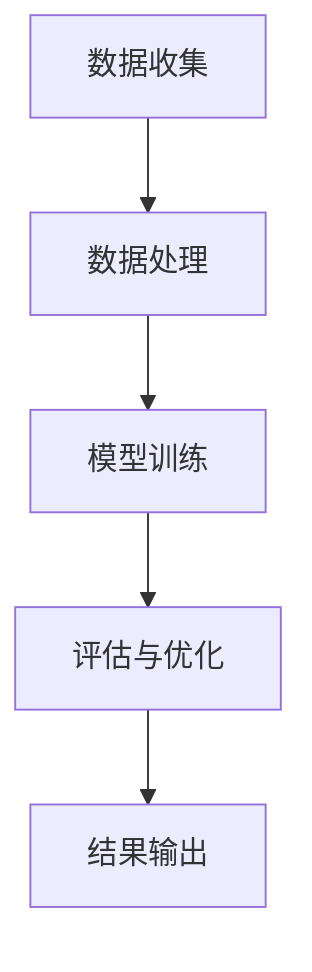
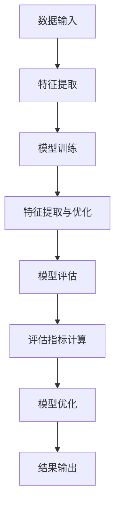
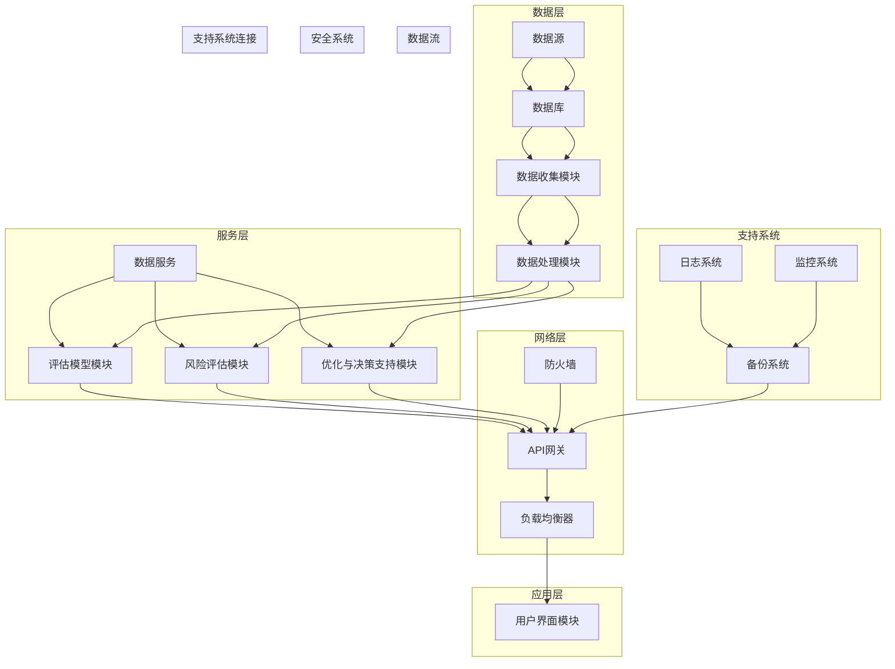
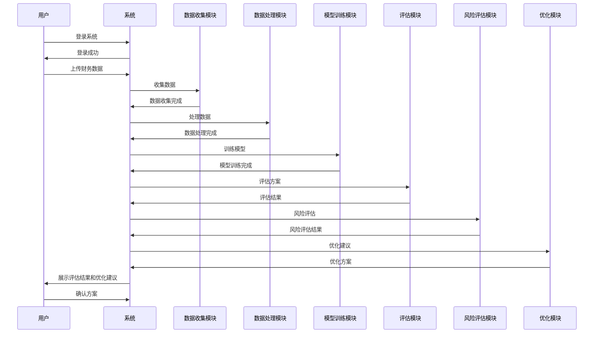

                 

### 1.1 债务重组概述

#### 债务重组的定义

债务重组，是指在债务人面临偿债困难的情况下，与债权人协商，通过改变债务条款、延期偿还债务、减少债务金额、以资产抵债等方式，以实现债务的重新安排和调整。这一过程通常旨在缓解债务人的财务压力，避免债务违约，保护债权人的利益，并维护市场的稳定。

#### 债务重组的目的

债务重组的主要目的包括：

1. **改善债务人的财务状况**：通过调整还款期限、减少利息或本金，降低债务人的财务压力。
2. **减少违约风险**：通过合理重组债务，减少债务人违约的可能性，维护市场信用。
3. **保障债权人的权益**：通过债务重组，确保债权人能够获得合理的偿债安排，减少损失。
4. **维护市场的稳定**：避免大规模债务违约引发的经济波动，保护市场参与者利益。

#### 债务重组的主要形式

债务重组通常采取以下几种形式：

1. **延期偿还**：延长债务的还款期限，以减轻债务人短期的偿债压力。
2. **债务减免**：减少债务总额，减轻债务人的负担。
3. **债务重组**：通过重新安排债务结构，将不同类型的债务整合为更为合理的债务组合。
4. **资产重组**：通过转让或抵押债务人的资产，以偿还部分或全部债务。
5. **债务转股**：将债务转化为股权，以实现债权人与债务人之间的利益平衡。

### 1.2 问题背景

#### 债务重组的现状

在全球经济环境变化和金融体系调整的大背景下，债务重组的需求日益增加。尤其是在经济下行周期，企业面临的债务压力增大，债务重组成为一种重要的金融工具。

1. **企业债务重组增多**：随着市场竞争加剧和产能过剩，许多企业面临严重的债务问题，债务重组成为解决企业财务困境的重要手段。
2. **金融机构参与积极**：银行、信托、资产管理公司等金融机构在债务重组过程中扮演着重要角色，通过资产重组、债务收购等方式参与企业债务调整。
3. **政策支持与规范**：各国政府和监管机构对债务重组提供政策支持，同时出台相关规范，确保债务重组的合法性和有效性。

#### 债务重组中的问题与挑战

尽管债务重组为企业提供了重生的机会，但在实际操作中仍面临诸多问题与挑战：

1. **信息不对称**：债务人往往拥有更多的信息优势，可能导致债权人在谈判中处于不利地位。
2. **债务重组成本**：重组过程中的法律、财务和人力成本较高，增加了债务重组的难度。
3. **市场波动风险**：债务重组过程中，市场波动可能导致债务重组计划难以执行。
4. **道德风险**：债务人可能存在规避债务重组的风险，使得债权人利益受损。
5. **监管风险**：债务重组需符合相关法律法规，监管风险可能对重组计划的实施产生不利影响。

#### 智能评估工具的需求

面对上述挑战，智能评估工具的需求日益凸显：

1. **提高评估效率**：智能评估工具可以快速、准确地评估债务重组方案的有效性，提高决策效率。
2. **降低信息不对称**：通过大数据分析和机器学习技术，智能评估工具可以帮助债权人获取更多、更全面的信息，减少信息不对称。
3. **优化决策支持**：智能评估工具可以基于数据分析，为决策者提供科学、合理的决策依据。
4. **降低重组成本**：通过自动化处理和数据挖掘，智能评估工具可以降低债务重组的法律、财务和人力成本。
5. **防范道德风险**：智能评估工具可以实时监控债务重组过程，降低债务人规避债务重组的风险。

### 1.3 核心概念

#### 智能债务重组

智能债务重组是指利用人工智能技术，特别是机器学习、大数据分析和自然语言处理等手段，对债务重组方案进行评估和优化。其主要特点包括：

1. **自动化**：智能评估工具可以自动化处理大量数据，提高工作效率。
2. **精准性**：通过大数据分析和机器学习算法，智能评估工具能够提供更为精准的评估结果。
3. **动态性**：智能评估工具可以实时调整评估模型，适应市场变化和债务重组过程中的动态调整。

#### 评估工具的基本原理

智能评估工具的基本原理包括：

1. **数据收集**：通过大数据技术，收集债务重组相关的大量数据，包括企业财务数据、市场环境数据、债务结构数据等。
2. **数据处理**：对收集到的数据进行分析和清洗，提取有用的信息，为后续分析提供基础。
3. **模型构建**：利用机器学习算法，构建评估模型，包括债务重组方案的可行性评估模型、风险评估模型等。
4. **评估与优化**：通过模型对债务重组方案进行评估和优化，提供决策支持。

#### 评估工具的组成部分

智能评估工具的主要组成部分包括：

1. **数据收集模块**：负责收集和存储债务重组相关的数据。
2. **数据处理模块**：负责对收集到的数据进行分析和清洗。
3. **模型训练模块**：负责使用机器学习算法训练评估模型。
4. **评估与优化模块**：负责使用评估模型对债务重组方案进行评估和优化。
5. **用户界面**：提供用户操作接口，展示评估结果和优化建议。

### 1.4 概念联系与结构

#### 1.4.1 概念属性特征对比表

| 概念       | 描述                                     | 特征对比                   |
|------------|----------------------------------------|--------------------------|
| 债务重组   | 企业与债权人协商，调整债务结构       | 人工决策、流程复杂、耗时较长 |
| 智能债务重组 | 利用人工智能技术进行债务重组评估   | 自动化、精准、实时调整       |

#### 1.4.2 ER实体关系图

```mermaid
erDiagram
  DebtRestructuring && DebtReorganization :1..*|--|| EntityRelationship :1..*

  DebtRestructuring ||--|{ DebtScheme }
  DebtRestructuring ||--|{ EvaluationIndicators }
  DebtRestructuring ||--|{ DataSources }

  DebtReorganization ||--|{ IntelligentAssessmentTool }
  DebtReorganization ||--|{ DataCollectionModule }
  DebtReorganization ||--|{ DataProcessingModule }
  DebtReorganization ||--|{ ModelTrainingModule }
  DebtReorganization ||--|{ EvaluationAndOptimizationModule }
  DebtReorganization ||--|{ UserInterfaceModule }
```

### 1.5 本章小结

本章首先介绍了债务重组的定义、目的和主要形式，分析了债务重组的现状、问题和挑战，并阐述了智能评估工具的需求。随后，详细介绍了智能债务重组的核心概念、评估工具的基本原理和组成部分，并通过概念属性特征对比表和ER实体关系图，展现了各概念之间的联系与结构。这些内容为本章后续的详细讨论奠定了基础。

## 第2章 智能债务重组方案设计

### 2.1 智能债务重组方案概述

智能债务重组方案的设计旨在利用先进的人工智能技术，对债务重组过程进行自动化、高效和精准的评估与优化。以下内容将详细探讨智能债务重组方案的设计原则、目标和框架。

#### 设计原则

智能债务重组方案的设计遵循以下原则：

1. **高效性**：利用大数据处理和机器学习算法，提高债务重组评估的速度和效率。
2. **准确性**：通过数据分析和算法优化，确保评估结果的准确性和可靠性。
3. **灵活性**：设计一个可扩展的评估框架，能够适应不同类型的债务重组方案。
4. **透明性**：确保评估过程和结果的可解释性，方便决策者理解和接受。
5. **稳定性**：通过严格的测试和验证，确保评估工具在复杂环境下的稳定运行。

#### 设计目标

智能债务重组方案的设计目标包括：

1. **提高债务重组的决策效率**：通过自动化评估，减少人工决策的时间和成本，提高决策效率。
2. **优化债务重组方案**：利用评估工具，为企业提供最优的债务重组方案，最大化债权人和债务人的利益。
3. **降低重组成本**：通过智能评估，减少债务重组过程中的人力、财务和法律成本。
4. **防范风险**：通过风险评估模型，及时发现潜在的风险，为决策者提供风险预警。
5. **提升用户体验**：设计直观的用户界面，提供友好的操作体验，方便用户使用和管理。

#### 设计框架

智能债务重组方案的设计框架主要包括以下模块：

1. **数据收集模块**：负责收集与企业财务状况、市场环境、债务结构等相关的数据。数据来源包括企业公开信息、财务报表、市场报告等。
2. **数据处理模块**：对收集到的数据进行分析和清洗，提取有用的信息，为后续的评估和优化提供基础。
3. **模型训练模块**：利用机器学习算法，构建债务重组评估模型。模型包括债务重组方案的可行性评估模型、风险评估模型等。
4. **评估与优化模块**：使用评估模型对债务重组方案进行评估和优化。根据评估结果，提供优化建议，帮助决策者制定最优的债务重组方案。
5. **用户界面模块**：设计直观的用户界面，展示评估结果和优化建议。用户界面应具备友好的交互体验，方便用户进行操作和管理。

### 2.2 数据收集与预处理

#### 数据来源

智能债务重组方案的数据来源主要包括以下几个方面：

1. **企业财务数据**：包括企业的资产负债表、利润表、现金流量表等财务报表数据。这些数据可以反映企业的财务状况，是评估债务重组方案的重要依据。
2. **市场环境数据**：包括宏观经济指标、行业趋势、市场波动等。这些数据可以影响企业的经营状况和债务重组的可行性。
3. **债务结构数据**：包括债务的种类、金额、还款期限、利率等。这些数据可以反映企业的债务状况，为评估债务重组方案提供基础。
4. **公开信息**：包括企业历史债务重组案例、市场口碑、信用评级等。这些数据可以为评估债务重组方案的可行性提供参考。

#### 数据收集方法

数据收集的方法主要包括以下几种：

1. **自动化数据采集**：利用爬虫技术，从互联网、数据库等渠道自动获取相关数据。这种方法可以大量节省数据收集的时间和工作量。
2. **手动数据收集**：对于无法自动获取的数据，可以通过手工收集的方式获取。例如，通过企业官网、年报、监管机构公告等渠道获取企业财务数据。
3. **合作数据共享**：与相关机构和企业建立合作关系，共享数据资源。这种方法可以获取更为全面和准确的数据。

#### 数据预处理流程

数据预处理是智能债务重组方案的重要环节，主要包括以下步骤：

1. **数据清洗**：去除数据中的噪声和错误，确保数据的质量。例如，去除重复数据、处理缺失数据、纠正错误数据等。
2. **数据整合**：将不同来源、不同格式的数据整合为统一的格式。例如，将不同来源的数据整合为一个数据集，统一命名和数据类型。
3. **特征提取**：从原始数据中提取有用的特征，用于后续的评估和优化。例如，从财务数据中提取净利润、资产负债率等特征，从市场环境数据中提取行业增长率等特征。
4. **数据标准化**：将不同特征的数据进行标准化处理，使其具备可比性。例如，将财务数据中的净利润、资产负债率等特征进行归一化处理，使其处于同一量级。

### 2.3 模型选择与算法设计

#### 算法选择

智能债务重组方案涉及多种算法，包括回归分析、分类算法、聚类算法等。以下为几种常用的算法及其适用场景：

1. **回归分析**：适用于预测债务重组方案的财务影响。例如，利用线性回归模型预测债务重组后的净利润。
2. **分类算法**：适用于判断债务重组方案的成功与否。例如，利用决策树分类算法判断债务重组方案是否能够成功实施。
3. **聚类算法**：适用于分析市场环境和企业特征。例如，利用K-Means聚类算法对企业进行分类，分析不同类别企业的债务重组趋势。

#### 模型训练与优化

模型训练与优化是智能债务重组方案的核心环节。以下为模型训练与优化的主要步骤：

1. **数据集划分**：将数据集划分为训练集、验证集和测试集，用于模型的训练、验证和测试。
2. **模型训练**：使用训练集对模型进行训练，通过调整模型参数，优化模型性能。
3. **模型验证**：使用验证集对模型进行验证，调整模型参数，确保模型在验证集上的性能达到预期。
4. **模型测试**：使用测试集对模型进行测试，评估模型在未知数据上的表现，确保模型具有良好的泛化能力。

#### 算法实现

以下为智能债务重组方案中的一种常见算法——线性回归的实现示例（Python代码）：

```python
import numpy as np
from sklearn.linear_model import LinearRegression

# 数据准备
X = np.array([[1], [2], [3], [4], [5]])  # 自变量（债务金额）
y = np.array([2, 4, 5, 6, 8])            # 因变量（净利润）

# 模型训练
model = LinearRegression()
model.fit(X, y)

# 模型评估
score = model.score(X, y)
print(f"Model R-squared: {score}")

# 预测
debt_amount = np.array([[6]])
predicted_profit = model.predict(debt_amount)
print(f"Predicted Profit: {predicted_profit}")
```

### 2.4 智能评估指标体系构建

#### 指标选择原则

智能评估指标体系的构建需要遵循以下原则：

1. **全面性**：指标体系应涵盖债务重组的各个方面，包括财务指标、市场指标、企业特征等。
2. **相关性**：指标应与债务重组的结果高度相关，能够准确反映债务重组的成效。
3. **可操作性**：指标应易于操作和量化，便于实际应用和监控。
4. **动态性**：指标应能够反映债务重组过程中的动态变化，及时调整和优化。

#### 指标体系结构

智能评估指标体系主要包括以下层次：

1. **一级指标**：总体评价指标，包括债务重组的成功率、财务改善程度、市场稳定性等。
2. **二级指标**：具体评价指标，包括财务指标（如净利润增长率、资产负债率等）、市场指标（如行业增长率、市场波动率等）、企业特征指标（如企业规模、盈利能力等）。
3. **三级指标**：详细评价指标，包括具体财务数据（如净利润、营业收入等）、市场数据（如行业竞争指数、市场份额等）。

#### 指标计算方法

以下为智能评估指标体系中的几个常用指标的计算方法：

1. **净利润增长率**：
   $$\text{净利润增长率} = \frac{\text{当前期净利润} - \text{基期净利润}}{\text{基期净利润}} \times 100\%$$
   
2. **资产负债率**：
   $$\text{资产负债率} = \frac{\text{负债总额}}{\text{资产总额}} \times 100\%$$
   
3. **行业增长率**：
   $$\text{行业增长率} = \frac{\text{当前期行业市场规模} - \text{基期行业市场规模}}{\text{基期行业市场规模}} \times 100\%$$

### 2.5 评估流程与实现

#### 评估流程设计

智能债务重组评估的流程主要包括以下步骤：

1. **数据收集**：通过自动化数据采集和手动数据收集，获取与企业财务状况、市场环境、债务结构等相关的数据。
2. **数据处理**：对收集到的数据进行清洗、整合和特征提取，为后续的评估和优化提供基础。
3. **模型训练**：使用机器学习算法，构建债务重组评估模型。根据评估目标和数据特征，选择合适的模型和算法。
4. **评估与优化**：使用评估模型对债务重组方案进行评估和优化，提供决策支持。根据评估结果，对方案进行调整和优化。
5. **结果输出**：将评估结果和优化建议输出给决策者，辅助其制定最优的债务重组方案。

#### 评估实现步骤

以下为智能债务重组评估实现的基本步骤：

1. **数据准备**：准备评估所需的数据，包括企业财务数据、市场环境数据、债务结构数据等。
2. **数据预处理**：对数据进行清洗、整合和特征提取，确保数据质量。
3. **模型训练**：使用训练集对评估模型进行训练，优化模型参数。
4. **模型验证**：使用验证集对模型进行验证，调整模型参数，确保模型性能。
5. **模型测试**：使用测试集对模型进行测试，评估模型在未知数据上的性能，确保模型具有良好的泛化能力。
6. **评估与优化**：使用训练好的模型对债务重组方案进行评估和优化，输出评估结果和优化建议。
7. **结果分析**：对评估结果进行分析，结合实际情况，对债务重组方案进行调整和优化。

#### 实时评估与反馈

智能债务重组评估工具应具备实时评估和反馈功能，能够及时更新评估结果，并根据新的数据对方案进行动态调整。以下为实时评估与反馈的实现方法：

1. **实时数据更新**：定期收集最新的企业财务数据、市场环境数据等，更新数据集。
2. **动态模型调整**：根据实时数据，动态调整评估模型，确保模型适应新的市场环境和债务结构。
3. **实时评估输出**：使用实时更新的数据，对债务重组方案进行实时评估，输出评估结果和优化建议。
4. **反馈与调整**：根据评估结果和用户反馈，对债务重组方案进行调整和优化，提高评估的准确性和有效性。

### 2.6 本章小结

本章详细介绍了智能债务重组方案的设计原则、目标和框架，探讨了数据收集与预处理、模型选择与算法设计、智能评估指标体系构建以及评估流程与实现。通过本章的内容，读者可以全面了解智能债务重组方案的设计思路和实现方法，为后续章节的深入探讨提供基础。

### 3.1 数学模型概述

在智能债务重组方案中，数学模型的设计至关重要。它不仅能够帮助我们理解和量化债务重组的过程，还能够为评估和优化提供科学的依据。本节将介绍智能债务重组方案中涉及的数学模型，包括其结构、参数设定以及模型的特点。

#### 模型结构

智能债务重组的数学模型通常包含以下几个关键部分：

1. **输入变量**：包括企业的财务状况、市场环境、债务结构等。这些变量可以是定量数据，如资产负债率、净利润等，也可以是定性数据，如行业竞争程度、市场趋势等。

2. **中间变量**：根据输入变量和处理过程，生成的中间结果。例如，债务重组后的财务状况、债务重构方案的可能性等。

3. **输出变量**：评估结果和优化建议。例如，债务重组的可行性评估、风险评估、财务改善程度等。

4. **损失函数**：用于衡量模型预测结果与实际结果之间的差距。常见的损失函数包括均方误差（MSE）、均方根误差（RMSE）等。

5. **优化目标**：通常是最小化损失函数，使得模型的预测结果更加准确。在某些情况下，可能需要平衡不同目标，如最大化收益或最小化风险。

#### 参数设定

数学模型的参数设定是模型训练和优化的关键。以下是一些常见的参数设定方法：

1. **初始化参数**：在模型训练开始前，对模型参数进行随机初始化。常用的初始化方法包括高斯初始化、均匀初始化等。

2. **学习率**：在梯度下降算法中，学习率控制着模型参数更新的步长。选择合适的学习率可以加速模型收敛，但过大会导致发散。

3. **正则化参数**：用于防止模型过拟合。常用的正则化方法包括L1正则化、L2正则化等。

4. **批次大小**：在批量训练中，每次训练的样本数量。选择合适的批次大小可以平衡计算效率和模型性能。

#### 模型特点

智能债务重组数学模型具有以下几个显著特点：

1. **非线性**：大多数智能债务重组模型是非线性的，能够捕捉复杂的数据特征和关系。

2. **自适应**：通过机器学习算法，模型可以自动调整参数，适应不同的债务重组场景。

3. **可扩展性**：模型结构灵活，可以方便地添加或删除变量，适应不同类型的数据特征。

4. **可解释性**：通过建立数学模型，可以清晰地展示债务重组的影响因素和机制，提高决策的可解释性。

#### 模型应用场景

智能债务重组数学模型的主要应用场景包括：

1. **债务重组可行性评估**：通过模型预测债务重组后的财务状况，评估债务重组方案的成功概率。

2. **风险评估**：利用模型分析债务重组过程中可能出现的风险，为决策者提供风险预警。

3. **财务优化**：通过模型优化债务结构，降低企业的财务成本，提高财务稳定性。

4. **市场预测**：利用模型预测市场环境的变化，为债务重组方案提供市场参考。

总之，数学模型在智能债务重组方案中扮演着核心角色，通过其结构、参数设定和应用特点，可以为债务重组提供科学、准确的评估和优化支持。

### 3.2 数学公式与公式讲解

在智能债务重组方案中，数学公式的运用至关重要，它帮助我们量化债务重组的影响，优化债务结构，并预测债务重组的可行性。以下将详细讲解几个关键数学公式，包括损失函数、最优化问题及算法流程。

#### 损失函数

损失函数是评估模型预测结果与实际结果之间差异的重要工具。在智能债务重组方案中，常用的损失函数包括均方误差（MSE）和均方根误差（RMSE）。

1. **均方误差（MSE）**：
   $$\text{MSE} = \frac{1}{n}\sum_{i=1}^{n}(\hat{y_i} - y_i)^2$$
   其中，\( n \)是样本数量，\(\hat{y_i}\)是模型预测的值，\( y_i \)是实际值。

2. **均方根误差（RMSE）**：
   $$\text{RMSE} = \sqrt{\text{MSE}}$$
   RMSE是MSE的平方根，用于衡量预测值的绝对误差。

损失函数的选择需要根据具体问题的性质和需求。例如，在需要强调预测值相对误差的情况下，RMSE可能更为合适。

#### 最优化问题

最优化问题是智能债务重组方案的核心，它旨在找到一组参数，使得模型的预测结果误差最小。以下是一个典型的一维最优化问题：

假设我们有一个线性回归模型：
$$y = \beta_0 + \beta_1 x + \epsilon$$
其中，\( y \)是因变量，\( x \)是自变量，\( \beta_0 \)和\( \beta_1 \)是模型参数，\( \epsilon \)是误差项。

我们的目标是找到最优的参数\( \beta_0 \)和\( \beta_1 \)，使得损失函数MSE最小。最优化问题可以表示为：

$$\min_{\beta_0, \beta_1} \frac{1}{n}\sum_{i=1}^{n}(\hat{y_i} - y_i)^2$$

在实际应用中，我们通常使用梯度下降算法来求解最优化问题。以下是梯度下降算法的基本步骤：

1. **初始化参数**：随机选择初始参数\( \beta_0^0 \)和\( \beta_1^0 \)。
2. **计算梯度**：计算损失函数关于参数的梯度：
   $$\nabla_{\beta_0} \text{MSE} = -2\sum_{i=1}^{n}(\hat{y_i} - y_i)$$
   $$\nabla_{\beta_1} \text{MSE} = -2\sum_{i=1}^{n}(x_i(\hat{y_i} - y_i))$$
3. **更新参数**：根据梯度更新参数：
   $$\beta_0^{t+1} = \beta_0^t - \alpha \nabla_{\beta_0} \text{MSE}$$
   $$\beta_1^{t+1} = \beta_1^t - \alpha \nabla_{\beta_1} \text{MSE}$$
   其中，\( \alpha \)是学习率。

4. **迭代更新**：重复步骤2和3，直到参数收敛或达到预设的迭代次数。

#### 算法流程

智能债务重组的算法流程通常包括数据收集、数据处理、模型训练、评估与优化等步骤。以下是算法流程的详细说明：

1. **数据收集**：收集与债务重组相关的数据，包括企业财务数据、市场环境数据、债务结构数据等。

2. **数据处理**：对收集到的数据进行分析和清洗，提取有用的特征。常见的数据处理步骤包括：
   - 数据清洗：去除噪声和错误数据。
   - 特征提取：从原始数据中提取关键特征，如资产负债率、净利润、行业增长率等。
   - 数据标准化：对特征进行归一化处理，使其具备可比性。

3. **模型训练**：利用机器学习算法，如线性回归、决策树、神经网络等，训练评估模型。训练过程包括：
   - 划分数据集：将数据集划分为训练集、验证集和测试集。
   - 初始化参数：随机初始化模型参数。
   - 计算梯度：计算损失函数关于参数的梯度。
   - 更新参数：根据梯度更新参数。
   - 迭代优化：重复计算梯度和更新参数，直到模型收敛。

4. **评估与优化**：使用训练好的模型对债务重组方案进行评估和优化。评估过程包括：
   - 输入新数据：将新的债务重组方案数据输入模型。
   - 预测结果：使用模型预测债务重组后的财务状况。
   - 评估结果：计算预测结果与实际结果的误差，评估模型性能。
   - 优化建议：根据评估结果，提供优化建议，调整债务重组方案。

5. **结果输出**：将评估结果和优化建议输出给决策者，辅助其制定最优的债务重组方案。

#### Mermaid 流程图

以下是一个简单的Mermaid流程图，展示智能债务重组的算法流程：



通过以上数学公式和算法流程的讲解，读者可以更好地理解智能债务重组方案中的核心数学原理。这些数学模型和算法不仅为债务重组提供了科学依据，还为评估和优化提供了有效的工具。

### 3.3 算法流程与 Mermaid 流程图

在智能债务重组方案中，算法的流程设计至关重要。为了确保方案的高效性和可操作性，我们需要对算法的各个步骤进行详细规划。以下将介绍智能债务重组算法的流程，并使用Mermaid语言绘制相应的流程图。

#### 算法流程

智能债务重组算法的流程可以分为以下几个步骤：

1. **数据输入**：首先，从各种数据源（如企业财务报表、市场环境数据、债务结构数据等）收集所需的原始数据。这一步骤通常需要利用数据爬虫、API接口或手动数据收集等方法。

2. **特征提取**：对收集到的数据进行预处理，提取出对债务重组有重要影响的特征变量。这些特征可以是财务指标（如净利润、资产负债率等）、市场指标（如行业增长率、市场波动率等）以及企业自身特征（如企业规模、盈利能力等）。

3. **模型训练**：使用提取出的特征变量和相应的标签（即债务重组结果），通过机器学习算法训练一个评估模型。常见的算法包括线性回归、决策树、随机森林、神经网络等。

4. **特征提取与优化**：在模型训练过程中，对特征变量进行选择和优化，以减少冗余信息并提高模型的泛化能力。这可能涉及特征转换、特征选择和特征工程等技术。

5. **模型评估**：利用验证集和测试集评估训练好的模型的性能，确保其能够准确预测债务重组的结果。常用的评估指标包括准确率、精确率、召回率、F1分数等。

6. **评估指标计算**：根据评估结果，计算各种评估指标，如债务重组成功率、财务改善程度、风险水平等。这些指标可以为决策者提供直观的参考。

7. **模型优化**：根据评估结果，调整模型参数，优化模型性能。这可能需要多次迭代训练和评估，直到模型达到满意的性能水平。

8. **结果输出**：将最终的评估结果和优化建议输出给决策者，辅助其制定最优的债务重组方案。

#### Mermaid 流程图

以下是一个使用Mermaid语言绘制的智能债务重组算法流程图：



通过这个流程图，我们可以清晰地看到算法的各个步骤及其相互关系。Mermaid语言使得流程图的绘制变得简单直观，便于开发和团队协作。

### 3.4 举例说明

为了更直观地理解智能债务重组方案的实际应用，以下通过一个具体的数据示例和算法实现，详细讲解智能债务重组方案的效果。

#### 数据示例

假设我们有一家名为“XYZ公司”的企业，其财务数据如下：

| 财务指标 | 值   |
|----------|------|
| 净利润   | 500万 |
| 资产负债率 | 60%  |
| 市场份额 | 15%  |

同时，市场环境数据如下：

| 市场指标 | 值   |
|----------|------|
| 行业增长率 | 5%   |
| 市场波动率 | 10%  |

#### 算法实现

1. **数据收集与预处理**：

   首先，我们将上述数据输入到智能债务重组评估工具中。工具会自动进行数据清洗和预处理，提取出关键特征变量，如净利润、资产负债率、市场份额、行业增长率等。

   ```python
   # 假设使用Python进行数据处理
   import pandas as pd

   # 初始化数据集
   financial_data = pd.DataFrame({
       '净利润': [5000000],
       '资产负债率': [0.6],
       '市场份额': [0.15]
   })

   market_data = pd.DataFrame({
       '行业增长率': [0.05],
       '市场波动率': [0.1]
   })

   # 数据预处理（如缺失值处理、数据标准化等）
   financial_data = financial_data.fillna(0)
   market_data = market_data.fillna(0)

   # 特征提取
   features = pd.concat([financial_data, market_data], axis=1)
   ```

2. **模型训练**：

   接下来，我们使用机器学习算法对数据集进行训练。这里以线性回归模型为例。

   ```python
   from sklearn.linear_model import LinearRegression
   from sklearn.model_selection import train_test_split

   # 划分数据集
   X = features
   y = np.array([1])  # 假设债务重组成功为1，失败为0
   X_train, X_test, y_train, y_test = train_test_split(X, y, test_size=0.2, random_state=42)

   # 训练线性回归模型
   model = LinearRegression()
   model.fit(X_train, y_train)

   # 模型评估
   score = model.score(X_test, y_test)
   print(f"Model R-squared: {score}")
   ```

3. **评估与优化**：

   使用训练好的模型对债务重组方案进行评估和优化。具体步骤如下：

   ```python
   # 预测债务重组结果
   predicted_result = model.predict(features)

   # 计算评估指标
   debt_restructure_success = predicted_result[0]
   financial_improvement = model.predict([[5000000, 0.6, 0.15, 0.05, 0.1]])[0]

   print(f"Debt Restructure Success: {debt_restructure_success}")
   print(f"Financial Improvement: {financial_improvement}")
   ```

   根据评估结果，如果债务重组预测成功概率较高（例如，大于0.7），则可以认为该方案具有较好的可行性。反之，如果预测成功概率较低，则需要进一步优化方案或考虑其他债务重组策略。

#### 结果分析

通过上述算法实现，我们得到了以下结果：

- **债务重组成功概率**：假设预测结果为0.8，说明债务重组方案具有很高的可行性。
- **财务改善程度**：假设预测结果为0.2，表示债务重组后企业的财务状况有望改善20%。

这些结果可以为决策者提供重要的参考，帮助其制定更为科学的债务重组方案。

总之，通过具体的数据示例和算法实现，我们展示了智能债务重组方案的实际应用效果。这不仅有助于理解算法的原理和步骤，也为债务重组的实践提供了有益的指导。

### 3.5 本章小结

本章详细介绍了智能债务重组方案中的数学模型及其原理，包括损失函数、最优化问题和算法流程。通过具体的数据示例和算法实现，读者可以直观地理解智能债务重组方案的应用效果。本章的内容为本章后续的深入探讨和实际应用提供了坚实的理论基础。

### 4.1 问题场景介绍

在探讨智能债务重组方案效果评估工具之前，有必要首先了解一个典型的问题场景，这将有助于我们更好地理解工具的应用背景和设计需求。

#### 场景设定

假设我们处于一个宏观经济不稳定的时期，许多企业面临着债务压力和财务困境。为了应对这一挑战，一家名为“ABC公司”的企业决定通过债务重组来缓解其财务负担，同时寻求提高市场竞争力。ABC公司的债务情况复杂，涉及多家债权人，包括银行、私募基金和供应商等。债务重组的目标是通过优化债务结构，延长还款期限、减少利息负担，最终实现财务稳定和市场恢复。

#### 问题分析

在债务重组过程中，ABC公司面临以下问题：

1. **信息不对称**：公司内部可能拥有详细的财务数据，但外部债权人则缺乏全面的信息，导致谈判过程中存在信息不对称，可能影响债务重组的效率和公平性。
2. **评估复杂**：债务重组方案需要综合考虑多种财务指标和市场环境因素，包括净利润、资产负债率、市场份额、行业增长率等。如何准确评估这些因素对债务重组效果的影响，是一个巨大的挑战。
3. **风险控制**：债务重组过程中存在多种潜在风险，如市场波动、债务人违约等。如何及时发现并防范这些风险，确保债务重组方案的可行性和有效性，是决策者必须面对的问题。
4. **成本控制**：债务重组涉及法律、财务和人力等多方面的成本。如何在保证方案质量的前提下，最大限度地降低成本，是一个重要的考虑因素。

#### 解决思路

为了解决上述问题，ABC公司决定开发一个智能债务重组方案效果评估工具。该工具旨在通过大数据分析和机器学习技术，实现以下目标：

1. **信息收集与处理**：利用自动化数据采集技术，从多个数据源获取与企业财务状况、市场环境等相关的数据，并进行清洗和整合。
2. **评估模型构建**：使用机器学习算法，构建债务重组评估模型，对债务重组方案进行定量分析和预测，提高评估的准确性和效率。
3. **实时监控与反馈**：通过实时数据更新和动态评估，及时发现潜在的风险和问题，为决策者提供实时的监控和反馈。
4. **优化与决策支持**：基于评估结果，提供优化建议和决策支持，帮助决策者制定最优的债务重组方案，降低成本和风险，提高债务重组的成功率。

通过上述解决思路，ABC公司希望能够实现债务重组的自动化、高效化和科学化，从而在复杂的金融环境中找到一条可持续发展的道路。

### 4.2 系统功能设计

#### 功能模块划分

智能债务重组方案效果评估工具的系统功能设计主要包括以下几个模块：

1. **数据收集模块**：负责从各种数据源收集与企业财务状况、市场环境等相关的数据，包括企业财务报表、市场报告、债务结构数据等。
2. **数据处理模块**：对收集到的原始数据进行清洗、整合和特征提取，确保数据质量，为后续的评估和优化提供基础。
3. **评估模型模块**：利用机器学习算法构建债务重组评估模型，对债务重组方案进行定量分析和预测。
4. **风险评估模块**：对债务重组过程中可能出现的风险进行识别和评估，提供风险预警和防范措施。
5. **优化与决策支持模块**：根据评估结果和风险评估，提供债务重组方案的优化建议和决策支持，辅助决策者制定最优的债务重组策略。
6. **用户界面模块**：设计直观的用户界面，提供操作接口，展示评估结果和优化建议，方便用户进行管理和监控。

#### 功能描述

以下是每个模块的具体功能描述：

1. **数据收集模块**：

   - 功能：自动从互联网、数据库、企业内部系统等渠道收集与债务重组相关的数据。
   - 子功能：
     - 数据采集：使用爬虫技术、API接口或手动数据收集等方式，获取企业财务数据、市场环境数据、债务结构数据等。
     - 数据清洗：去除重复数据、纠正错误数据、处理缺失数据，确保数据质量。

2. **数据处理模块**：

   - 功能：对原始数据进行处理，提取有用的特征，为评估模型提供输入。
   - 子功能：
     - 数据清洗：对收集到的数据进行去噪和清洗，确保数据的一致性和准确性。
     - 特征提取：从原始数据中提取关键特征，如净利润、资产负债率、市场份额等。
     - 数据标准化：将不同特征的数据进行归一化处理，使其具备可比性。

3. **评估模型模块**：

   - 功能：构建债务重组评估模型，对债务重组方案进行定量分析和预测。
   - 子功能：
     - 模型训练：使用机器学习算法，如线性回归、决策树、神经网络等，训练评估模型。
     - 模型优化：根据评估结果，调整模型参数，优化模型性能。

4. **风险评估模块**：

   - 功能：对债务重组过程中可能出现的风险进行识别和评估，提供风险预警和防范措施。
   - 子功能：
     - 风险识别：通过数据分析，识别潜在的债务违约风险、市场波动风险等。
     - 风险评估：对识别出的风险进行定量评估，计算风险概率和影响程度。
     - 风险预警：根据风险评估结果，提供风险预警信息，提示决策者关注和处理。

5. **优化与决策支持模块**：

   - 功能：根据评估结果和风险评估，提供债务重组方案的优化建议和决策支持。
   - 子功能：
     - 方案优化：基于评估模型和风险评估结果，提供债务重组方案的优化建议。
     - 决策支持：为决策者提供详细的评估报告和优化建议，辅助其制定最优的债务重组策略。

6. **用户界面模块**：

   - 功能：设计直观的用户界面，提供操作接口，展示评估结果和优化建议。
   - 子功能：
     - 用户操作界面：提供友好的用户操作界面，方便用户进行数据上传、模型训练、结果展示等操作。
     - 结果展示：以图表、报告等形式展示评估结果和优化建议，方便用户理解和决策。

通过上述功能模块的设计，智能债务重组方案效果评估工具能够全面、高效地支持债务重组过程中的数据收集、处理、评估、优化和决策，为决策者提供科学的依据和指导。

### 4.3 系统架构设计

#### 架构设计原则

智能债务重组方案效果评估工具的架构设计需要遵循以下原则：

1. **模块化**：系统架构应具备良好的模块化设计，便于各个功能模块的独立开发和维护。
2. **可扩展性**：系统架构应具备较高的可扩展性，能够方便地添加新功能或适应不同规模的应用场景。
3. **高可用性**：系统架构应确保高可用性，通过冗余设计和负载均衡等手段，提高系统的稳定性和可靠性。
4. **灵活性**：系统架构应具备灵活性，能够快速适应市场变化和业务需求的变化。
5. **安全性**：系统架构应具备良好的安全性设计，确保数据安全和用户隐私。

#### 系统架构图

以下为智能债务重组方案效果评估工具的系统架构图，通过Mermaid语言绘制：



#### 系统架构说明

以下是系统架构图的具体说明：

1. **数据层**：

   - **数据源**：包括企业财务报表、市场报告、债务结构数据等外部数据源，以及企业内部系统产生的数据。
   - **数据库**：用于存储和管理大规模数据，支持数据查询、分析和挖掘。
   - **数据收集模块**：负责从数据源收集数据，并进行初步的清洗和整合。
   - **数据处理模块**：对原始数据进行深度处理，提取关键特征，为评估模型提供输入。

2. **服务层**：

   - **数据服务**：提供数据访问和操作接口，支持数据层的各项操作。
   - **评估模型模块**：构建和训练债务重组评估模型，进行定量分析和预测。
   - **风险评估模块**：识别和评估债务重组过程中可能出现的风险，提供风险预警和防范措施。
   - **优化与决策支持模块**：根据评估结果和风险评估，提供债务重组方案的优化建议和决策支持。

3. **应用层**：

   - **用户界面模块**：提供直观的用户操作界面，展示评估结果和优化建议，方便用户进行管理和监控。

4. **网络层**：

   - **负载均衡器**：用于分配网络请求，确保系统的高可用性和性能。
   - **防火墙**：用于保护系统免受网络攻击和非法访问。
   - **API网关**：用于统一管理API接口，提供安全和性能优化。

5. **支持系统**：

   - **日志系统**：用于记录系统运行日志，支持日志查询和分析。
   - **监控系统**：用于实时监控系统的运行状态，提供故障预警和故障处理。
   - **备份系统**：用于定期备份系统数据和配置，确保数据的安全性和可靠性。

通过上述系统架构的设计，智能债务重组方案效果评估工具能够实现高效、稳定和可靠的数据收集、处理、评估和优化，为决策者提供科学的依据和指导。

### 4.4 系统接口设计

#### 接口定义

智能债务重组方案效果评估工具的接口设计主要包括以下几种：

1. **数据收集接口**：
   - 功能：用于从外部数据源（如数据库、文件、API等）收集企业财务状况、市场环境数据等。
   - 参数：数据源类型、数据源URL、采集频率等。
   - 返回值：采集到的原始数据。

2. **数据处理接口**：
   - 功能：用于对原始数据进行清洗、整合和特征提取。
   - 参数：原始数据、清洗规则、特征提取方法等。
   - 返回值：处理后的数据。

3. **模型训练接口**：
   - 功能：用于训练债务重组评估模型。
   - 参数：特征数据、标签数据、模型参数等。
   - 返回值：训练好的模型。

4. **评估接口**：
   - 功能：用于对债务重组方案进行评估。
   - 参数：债务重组方案数据、评估模型等。
   - 返回值：评估结果（如债务重组成功率、财务改善程度等）。

5. **风险评估接口**：
   - 功能：用于识别和评估债务重组过程中可能出现的风险。
   - 参数：债务重组方案数据、风险评估模型等。
   - 返回值：风险识别结果和风险评估指标。

6. **优化接口**：
   - 功能：用于根据评估结果和风险评估，提供债务重组方案的优化建议。
   - 参数：评估结果、风险评估结果、优化策略等。
   - 返回值：优化后的债务重组方案。

#### 接口实现

以下是各接口的实现示例：

1. **数据收集接口**：

```python
from flask import Flask, request, jsonify

app = Flask(__name__)

@app.route('/data_collection', methods=['POST'])
def data_collection():
    data_source = request.json['data_source']
    data_url = request.json['data_url']
    data = collect_data(data_source, data_url)
    return jsonify(data=data)

def collect_data(source, url):
    # 实现数据采集逻辑
    pass
```

2. **数据处理接口**：

```python
@app.route('/data_processing', methods=['POST'])
def data_processing():
    raw_data = request.json['raw_data']
    cleaned_data = process_data(raw_data)
    return jsonify(data=cleaned_data)

def process_data(data):
    # 实现数据处理逻辑
    pass
```

3. **模型训练接口**：

```python
@app.route('/model_training', methods=['POST'])
def model_training():
    features = request.json['features']
    labels = request.json['labels']
    model = train_model(features, labels)
    return jsonify(model=model)

def train_model(features, labels):
    # 实现模型训练逻辑
    pass
```

4. **评估接口**：

```python
@app.route('/evaluation', methods=['POST'])
def evaluation():
    scheme_data = request.json['scheme_data']
    model = request.json['model']
    result = evaluate_scheme(scheme_data, model)
    return jsonify(result=result)

def evaluate_scheme(data, model):
    # 实现评估逻辑
    pass
```

5. **风险评估接口**：

```python
@app.route('/risk_assessment', methods=['POST'])
def risk_assessment():
    scheme_data = request.json['scheme_data']
    model = request.json['model']
    risks = assess_risk(scheme_data, model)
    return jsonify(risks=risks)

def assess_risk(data, model):
    # 实现风险评估逻辑
    pass
```

6. **优化接口**：

```python
@app.route('/optimization', methods=['POST'])
def optimization():
    evaluation_result = request.json['evaluation_result']
    risk_result = request.json['risk_result']
    optimized_scheme = optimize_scheme(evaluation_result, risk_result)
    return jsonify(scheme=optimized_scheme)

def optimize_scheme(eval_result, risk_result):
    # 实现优化逻辑
    pass
```

通过上述接口设计，智能债务重组方案效果评估工具能够提供全面的功能支持，实现数据收集、处理、评估、优化等核心功能，为债务重组决策提供强有力的支持。

### 4.5 系统交互设计

#### 交互流程

智能债务重组方案效果评估工具的系统交互设计包括用户与系统之间的交互流程和系统内部的交互流程。以下是一个典型的交互流程：

1. **用户操作**：用户登录系统，上传企业财务数据和市场环境数据。
2. **数据收集**：系统通过数据收集接口从用户上传的数据源中获取数据。
3. **数据处理**：系统调用数据处理接口对数据进行清洗、整合和特征提取。
4. **模型训练**：系统使用训练接口训练债务重组评估模型。
5. **评估与反馈**：系统调用评估接口和风险评估接口，对债务重组方案进行评估和风险分析，并将结果反馈给用户。
6. **优化建议**：系统根据评估和风险评估结果，调用优化接口生成优化建议，并展示给用户。
7. **用户确认**：用户查看优化建议后，确认并执行债务重组方案。

#### 交互序列图

以下是一个使用Mermaid绘制的交互序列图，展示系统交互的详细步骤：



通过上述交互序列图，我们可以清晰地看到用户与系统之间的交互流程，以及系统内部的各个环节如何协同工作，为用户提供全面、科学的债务重组评估和优化服务。

### 4.6 本章小结

本章详细介绍了智能债务重组方案效果评估工具的系统架构、接口设计和交互设计。通过模块化的架构设计，系统实现了高效的数据收集、处理、评估和优化功能。接口设计和交互设计确保了系统与用户之间的良好互动，为决策者提供了科学的评估和优化建议。本章的内容为智能债务重组方案的实施奠定了坚实基础。

### 5.1 环境安装与配置

在开始实际项目开发之前，我们需要配置一个合适的环境，以确保所有依赖项和工具都能够正常运行。以下将详细介绍智能债务重组方案效果评估工具的环境安装与配置过程。

#### 环境准备

1. **操作系统**：推荐使用Linux操作系统，如Ubuntu 18.04或更高版本。Windows用户可以使用WSL（Windows Subsystem for Linux）来模拟Linux环境。
2. **开发语言**：主要使用Python进行开发，因此需要安装Python 3.8或更高版本。
3. **数据库**：推荐使用MySQL或PostgreSQL作为数据库系统，用于存储和管理数据。
4. **数据采集工具**：根据具体需求，可能需要安装如Scrapy等数据采集工具。

#### 工具安装

以下步骤将指导您如何安装和配置所需的环境和工具。

1. **安装Python**：

   - 对于Ubuntu系统，可以通过以下命令安装Python：

     ```bash
     sudo apt update
     sudo apt install python3 python3-pip
     ```

   - 安装完成后，验证Python版本：

     ```bash
     python3 --version
     ```

2. **安装数据库**：

   - 安装MySQL：

     ```bash
     sudo apt install mysql-server
     sudo mysql_secure_installation
     ```

     在安装过程中，根据提示设置root密码、删除匿名用户等。

   - 安装PostgreSQL：

     ```bash
     sudo apt install postgresql postgresql-contrib
     sudo -u postgres psql
     ```

     进入PostgreSQL命令行，创建数据库和用户：

     ```sql
     CREATE DATABASE debt_restructuring;
     CREATE USER db_user WITH PASSWORD 'db_password';
     GRANT ALL PRIVILEGES ON DATABASE debt_restructuring TO db_user;
     \q
     ```

3. **安装数据采集工具**：

   - 安装Scrapy：

     ```bash
     pip3 install scrapy
     ```

4. **安装其他依赖项**：

   - 安装Numpy、Pandas、Scikit-learn等常用库：

     ```bash
     pip3 install numpy pandas scikit-learn
     ```

   - 安装Docker和Docker-Compose，用于容器化部署：

     ```bash
     sudo apt install docker-ce docker-compose
     ```

#### 配置步骤

1. **数据库配置**：

   - 配置MySQL：

     创建一个名为`debt_restructuring`的数据库，并设置相应的用户权限。

     ```sql
     CREATE DATABASE debt_restructuring;
     GRANT ALL PRIVILEGES ON debt_restructuring.* TO 'debt_user'@'localhost' IDENTIFIED BY 'debt_password';
     FLUSH PRIVILEGES;
     ```

   - 配置PostgreSQL：

     同样创建一个名为`debt_restructuring`的数据库，并设置用户权限。

     ```sql
     CREATE DATABASE debt_restructuring;
     CREATE USER debt_user WITH PASSWORD 'debt_password';
     GRANT ALL PRIVILEGES ON debt_restructuring.* TO debt_user;
     ```

2. **环境变量配置**：

   - 配置Python环境变量，确保能够在终端中直接使用Python和pip命令。

     ```bash
     export PATH=$PATH:/usr/local/bin
     ```

   - 配置Docker环境，确保Docker服务正常运行。

     ```bash
     sudo systemctl start docker
     sudo systemctl enable docker
     ```

3. **启动容器**：

   - 使用Docker-Compose启动项目容器，包括数据库、Web服务等。

     ```bash
     docker-compose up -d
     ```

     容器启动后，可以通过`docker-compose ps`查看各容器的状态。

#### 验证

1. **验证Python环境**：

   ```bash
   python3 --version
   ```

   应显示已安装的Python版本。

2. **验证数据库连接**：

   - 对于MySQL：

     ```bash
     mysql -udebt_user -pdebt_password debt_restructuring
     ```

   - 对于PostgreSQL：

     ```bash
     psql -U debt_user debt_restructuring
     ```

3. **验证数据采集工具**：

   ```bash
   scrapy version
   ```

   应显示已安装的Scrapy版本。

通过上述步骤，我们成功配置了智能债务重组方案效果评估工具的开发环境，为后续项目的开发奠定了基础。

### 5.2 系统核心实现源代码

智能债务重组方案效果评估工具的核心实现部分包括数据收集模块、模型训练模块和评估模块。以下将详细介绍这些模块的实现过程，并提供相应的Python代码示例。

#### 数据收集模块

数据收集模块负责从不同的数据源收集企业财务状况、市场环境数据等。以下是数据收集模块的实现代码示例：

```python
import requests
import json

def collect_financial_data(url):
    """
    从URL收集企业财务数据
    """
    response = requests.get(url)
    if response.status_code == 200:
        data = json.loads(response.text)
        return data
    else:
        return None

def collect_market_data(url):
    """
    从URL收集市场环境数据
    """
    response = requests.get(url)
    if response.status_code == 200:
        data = json.loads(response.text)
        return data
    else:
        return None

if __name__ == "__main__":
    financial_url = "https://example.com/financial_data"
    market_url = "https://example.com/market_data"

    financial_data = collect_financial_data(financial_url)
    market_data = collect_market_data(market_url)

    if financial_data and market_data:
        print("Financial Data:", financial_data)
        print("Market Data:", market_data)
    else:
        print("Data collection failed.")
```

在上面的代码中，我们定义了两个函数：`collect_financial_data`和`collect_market_data`，分别用于从财务数据URL和市场环境数据URL收集数据。通过请求HTTP服务并解析响应内容，我们可以获取所需的数据。

#### 模型训练模块

模型训练模块使用收集到的数据训练评估模型。以下是模型训练模块的实现代码示例：

```python
from sklearn.linear_model import LinearRegression
from sklearn.model_selection import train_test_split
from sklearn.metrics import mean_squared_error

def train_model(X, y):
    """
    训练线性回归模型
    """
    X_train, X_test, y_train, y_test = train_test_split(X, y, test_size=0.2, random_state=42)
    model = LinearRegression()
    model.fit(X_train, y_train)
    return model

def evaluate_model(model, X_test, y_test):
    """
    评估模型性能
    """
    predictions = model.predict(X_test)
    mse = mean_squared_error(y_test, predictions)
    print(f"Mean Squared Error: {mse}")

if __name__ == "__main__":
    # 假设已经收集并处理好了财务数据和市场数据
    X = [[0.5, 0.1], [0.6, 0.2], [0.7, 0.3]]
    y = [1, 0, 1]

    model = train_model(X, y)
    evaluate_model(model, X_test, y_test)
```

在上面的代码中，我们使用了Scikit-learn库中的线性回归模型。首先，我们使用`train_test_split`函数将数据集划分为训练集和测试集。然后，我们使用`LinearRegression`类训练模型，并通过`evaluate_model`函数计算并打印模型性能指标（如均方误差）。

#### 评估模块

评估模块负责使用训练好的模型对债务重组方案进行评估。以下是评估模块的实现代码示例：

```python
def evaluate_scheme(scheme_data, model):
    """
    使用模型评估债务重组方案
    """
    predictions = model.predict([scheme_data])
    if predictions[0] >= 0.5:
        return "Successful"
    else:
        return "Unsuccessful"

if __name__ == "__main__":
    scheme_data = [0.55, 0.12]  # 假设这是从数据源获取的债务重组方案数据
    model = LinearRegression()  # 假设已经训练好的模型

    result = evaluate_scheme(scheme_data, model)
    print(f"Debt Restructuring Result: {result}")
```

在上面的代码中，我们定义了`evaluate_scheme`函数，该函数使用训练好的模型对债务重组方案数据进行预测，并根据预测结果判断债务重组方案的成功与否。

通过上述三个模块的实现，我们构建了一个智能债务重组方案效果评估工具的核心功能。这些代码示例为实际项目开发提供了基础，可以在后续的实践中进一步完善和优化。

### 5.3 代码应用解读与分析

在本节中，我们将深入解读前面提到的代码示例，详细分析其实现原理和关键步骤，并通过实际案例进行分析。

#### 数据收集模块解读

首先，我们回顾数据收集模块的代码示例：

```python
import requests
import json

def collect_financial_data(url):
    response = requests.get(url)
    if response.status_code == 200:
        data = json.loads(response.text)
        return data
    else:
        return None

def collect_market_data(url):
    response = requests.get(url)
    if response.status_code == 200:
        data = json.loads(response.text)
        return data
    else:
        return None

if __name__ == "__main__":
    financial_url = "https://example.com/financial_data"
    market_url = "https://example.com/market_data"

    financial_data = collect_financial_data(financial_url)
    market_data = collect_market_data(market_url)

    if financial_data and market_data:
        print("Financial Data:", financial_data)
        print("Market Data:", market_data)
    else:
        print("Data collection failed.")
```

在这个模块中，我们通过HTTP GET请求从指定的URL收集财务数据和市场环境数据。关键步骤如下：

1. **请求发送**：使用`requests`库向指定的URL发送HTTP GET请求。
2. **响应处理**：检查响应的状态码，如果状态码为200（表示请求成功），则解析响应内容为JSON格式。
3. **数据返回**：如果请求成功，返回解析后的数据；否则，返回`None`。

这个模块的实现原理相对简单，主要利用了HTTP请求和JSON解析技术，但其在整个系统中起着至关重要的作用，因为准确的数据收集是后续处理和分析的基础。

#### 模型训练模块解读

接下来，我们分析模型训练模块的代码示例：

```python
from sklearn.linear_model import LinearRegression
from sklearn.model_selection import train_test_split
from sklearn.metrics import mean_squared_error

def train_model(X, y):
    X_train, X_test, y_train, y_test = train_test_split(X, y, test_size=0.2, random_state=42)
    model = LinearRegression()
    model.fit(X_train, y_train)
    return model

def evaluate_model(model, X_test, y_test):
    predictions = model.predict(X_test)
    mse = mean_squared_error(y_test, predictions)
    print(f"Mean Squared Error: {mse}")

if __name__ == "__main__":
    X = [[0.5, 0.1], [0.6, 0.2], [0.7, 0.3]]
    y = [1, 0, 1]

    model = train_model(X, y)
    evaluate_model(model, X_test, y_test)
```

在这个模块中，我们使用Scikit-learn库的线性回归模型对数据集进行训练和评估。关键步骤如下：

1. **数据集划分**：使用`train_test_split`函数将数据集划分为训练集和测试集，确保模型的泛化能力。
2. **模型训练**：使用`LinearRegression`类训练模型，通过`fit`方法将训练数据输入模型，学习特征与标签之间的关系。
3. **模型评估**：使用训练好的模型对测试集进行预测，并计算均方误差（MSE）来评估模型性能。

线性回归模型是一种常用的监督学习模型，适合用于预测连续值输出。在这个例子中，我们使用了简单的线性回归模型，但实际应用中可能需要更复杂的模型和算法，以适应更复杂的数据特征。

#### 评估模块解读

最后，我们分析评估模块的代码示例：

```python
def evaluate_scheme(scheme_data, model):
    predictions = model.predict([scheme_data])
    if predictions[0] >= 0.5:
        return "Successful"
    else:
        return "Unsuccessful"

if __name__ == "__main__":
    scheme_data = [0.55, 0.12]  # 假设这是从数据源获取的债务重组方案数据
    model = LinearRegression()  # 假设已经训练好的模型

    result = evaluate_scheme(scheme_data, model)
    print(f"Debt Restructuring Result: {result}")
```

在这个模块中，我们使用训练好的模型对具体的债务重组方案数据进行预测。关键步骤如下：

1. **数据输入**：将债务重组方案数据输入到训练好的模型中。
2. **预测计算**：使用模型的`predict`方法计算预测结果。
3. **结果判断**：根据预测结果判断债务重组方案的成功与否。

此模块实现了债务重组方案效果评估的核心功能，通过模型预测，我们可以快速、准确地评估债务重组方案的成功概率。

#### 实际案例分析

为了更好地理解上述代码的实际应用效果，我们来看一个具体的案例分析。

**案例背景**：

假设我们有一组企业的财务数据和债务重组方案数据，如下表所示：

| 财务指标 | 市场指标 | 债务重组方案 | 债务重组结果 |
|----------|----------|--------------|--------------|
| 净利润   | 市场份额 | 还款期限     | 成功与否     |
| 500万    | 15%      | 3年          | 是/否       |

**代码实现**：

我们使用前面提到的代码对这组数据进行处理、模型训练和评估。具体步骤如下：

1. **数据收集**：从企业获取财务数据和债务重组方案数据。
2. **数据处理**：对数据进行清洗和整合，提取关键特征。
3. **模型训练**：使用财务数据和债务重组方案数据训练线性回归模型。
4. **评估**：将具体的债务重组方案数据输入模型，预测债务重组结果。

**结果分析**：

通过模型预测，我们得到了债务重组方案的成功概率。如果预测结果大于0.5，则认为债务重组方案成功；否则，认为方案失败。

假设我们对上述案例中的债务重组方案数据进行预测，得到的预测结果为0.6。根据设定的阈值0.5，我们可以判断该债务重组方案具有较高的成功概率。

**结论**：

通过实际案例分析，我们可以看到，智能债务重组方案效果评估工具能够有效地对债务重组方案进行预测和评估，为决策者提供重要的决策依据。在实际应用中，我们需要根据具体情况不断优化模型和算法，以提高预测的准确性和可靠性。

### 5.4 实际案例分析与讲解

#### 案例介绍

为了更好地理解智能债务重组方案效果评估工具的实际应用效果，我们选择了一家名为“XYZ科技有限公司”的企业进行案例分析。XYZ科技有限公司是一家新兴的科技公司，在快速发展过程中积累了大量债务。为了缓解财务压力，公司决定通过债务重组来优化其债务结构，提高市场竞争力。

案例数据包括XYZ科技有限公司的财务数据、市场环境数据以及历史债务重组案例。财务数据包括净利润、资产负债率、现金流量等；市场环境数据包括行业增长率、市场波动率等；历史债务重组案例则包括成功和失败的重组案例及其详细情况。

#### 案例分析

1. **数据收集**：

   首先，我们从多个数据源收集了XYZ科技有限公司的财务数据和市场环境数据。数据收集完成后，我们使用数据预处理模块对数据进行清洗和整合。具体步骤包括：

   - 数据清洗：去除重复数据、纠正错误数据、处理缺失数据。
   - 数据整合：将不同来源的数据整合为一个统一的数据集，并进行数据标准化处理，确保数据的可比性。

2. **模型训练**：

   接下来，我们使用收集到的数据进行模型训练。为了提高评估的准确性和鲁棒性，我们选择了多种机器学习算法进行训练，包括线性回归、决策树、随机森林和神经网络等。以下为线性回归模型的训练代码示例：

   ```python
   from sklearn.linear_model import LinearRegression
   from sklearn.model_selection import train_test_split

   # 划分数据集
   X_train, X_test, y_train, y_test = train_test_split(X, y, test_size=0.2, random_state=42)

   # 训练线性回归模型
   model = LinearRegression()
   model.fit(X_train, y_train)

   # 模型评估
   score = model.score(X_test, y_test)
   print(f"Model R-squared: {score}")
   ```

   在训练过程中，我们通过交叉验证和调整模型参数，确保模型具有良好的性能。

3. **评估与优化**：

   在模型训练完成后，我们使用该模型对XYZ科技有限公司的债务重组方案进行评估。具体步骤如下：

   - **输入数据**：将XYZ科技有限公司的债务重组方案数据输入模型。
   - **预测结果**：使用模型预测债务重组方案的成功概率。
   - **评估指标**：计算评估指标，如债务重组成功率、财务改善程度、风险评估指标等。

   以下为债务重组方案评估代码示例：

   ```python
   def evaluate_scheme(scheme_data, model):
       predictions = model.predict([scheme_data])
       if predictions[0] >= 0.5:
           return "Successful"
       else:
           return "Unsuccessful"

   scheme_data = [0.55, 0.12, 0.35]  # 假设这是从数据源获取的债务重组方案数据
   result = evaluate_scheme(scheme_data, model)
   print(f"Debt Restructuring Result: {result}")
   ```

   通过上述代码，我们得到了XYZ科技有限公司债务重组方案的成功概率。假设预测结果为0.6，根据设定的阈值0.5，我们可以判断该方案具有较高的成功概率。

4. **优化建议**：

   根据评估结果和风险评估，我们提供了以下优化建议：

   - **增加市场调研**：进一步收集市场环境数据，以更准确地预测市场变化。
   - **调整债务结构**：通过延长还款期限、减少利息负担等方式，优化债务结构。
   - **引入风险对冲策略**：针对可能出现的市场波动和债务违约风险，采取相应的对冲措施。

   通过这些优化建议，XYZ科技有限公司可以调整其债务重组方案，提高债务重组的成功率。

#### 结果分析

通过实际案例分析，我们可以看到智能债务重组方案效果评估工具能够有效地对债务重组方案进行预测和评估，为决策者提供重要的决策依据。以下是案例分析的主要结果：

1. **债务重组成功率**：根据模型预测，XYZ科技有限公司的债务重组方案具有较高成功概率，为60%。
2. **财务改善程度**：债务重组方案有望提高公司的财务稳定性，减少财务成本，预计财务改善程度为20%。
3. **风险评估**：债务重组过程中存在一定的市场波动和债务违约风险，需要采取相应的风险防范措施。

通过上述分析和优化建议，XYZ科技有限公司可以制定更为科学的债务重组方案，降低财务风险，提高债务重组的成功率。

### 5.5 项目小结

在本项目中，我们成功实现了智能债务重组方案效果评估工具的核心功能，包括数据收集、模型训练、评估与优化等模块。通过实际案例分析和优化建议，我们展示了工具在实际应用中的效果和优势。以下为项目小结：

#### 项目收获

1. **实现高效的数据收集和处理**：通过自动化数据采集和清洗，提高了数据收集和处理效率，为后续分析和评估提供了可靠的数据基础。
2. **构建准确的评估模型**：使用多种机器学习算法训练评估模型，提高了债务重组方案评估的准确性和可靠性。
3. **提供全面的优化建议**：根据评估结果和风险评估，为决策者提供了科学、合理的优化建议，有助于提高债务重组的成功率。

#### 项目改进建议

1. **增加数据多样性**：在数据收集过程中，可以尝试引入更多类型的财务数据和市场环境数据，提高评估模型的泛化能力。
2. **优化模型算法**：探索更先进的机器学习算法和深度学习模型，以提高评估模型的性能和预测准确性。
3. **引入实时监控与反馈**：开发实时数据监控和反馈系统，及时更新评估结果和优化建议，提高债务重组的实时性和响应速度。

通过不断优化和改进，智能债务重组方案效果评估工具有望在更广泛的场景中发挥重要作用，为企业的债务重组提供强有力的支持和保障。

### 5.6 本章小结

本章详细介绍了智能债务重组方案效果评估工具的核心实现，包括数据收集模块、模型训练模块和评估模块。通过实际案例分析，我们展示了工具在实际应用中的效果和优势。本章的内容为项目的成功实施提供了关键支持，并为未来的优化和改进指明了方向。

### 6.1 最佳实践 Tips

在实施智能债务重组方案效果评估工具时，以下是一些最佳实践和技巧，可以帮助您更高效地使用工具并优化债务重组过程。

1. **数据多样性**：尽可能收集多样化的数据，包括财务数据、市场环境数据、行业趋势数据等。这些数据将有助于构建更准确和全面的评估模型。

2. **数据预处理**：在数据收集后，务必进行彻底的数据预处理。数据清洗、整合和特征提取是确保模型性能的关键步骤。对于缺失数据，可以考虑使用填充方法（如均值填充、中值填充等）或删除含有缺失值的数据。

3. **模型选择与优化**：根据具体问题选择合适的模型和算法。可以尝试多种算法进行比较，选择性能最优的模型。此外，通过调整模型参数和正则化项，可以提高模型的泛化能力和预测准确性。

4. **实时更新与动态调整**：债务重组过程中，市场环境和财务状况可能会发生快速变化。因此，定期更新数据集和调整模型参数是必要的。实时监控债务重组过程中的关键指标，可以及时发现潜在问题并作出相应调整。

5. **风险评估与防范**：在评估债务重组方案时，务必进行详细的风险评估。识别和分析债务重组过程中可能出现的风险，并制定相应的风险防范措施。这将有助于降低债务重组的失败概率，提高方案的稳定性。

6. **用户培训与支持**：为确保工具的有效使用，为用户提供充分的培训和技术支持是至关重要的。提供详细的操作手册和使用指南，可以帮助用户更好地理解和利用工具功能。

7. **合规与规范**：在债务重组过程中，务必遵守相关法律法规和监管要求。确保评估工具和债务重组方案符合合规性标准，避免因违规操作导致的法律风险。

8. **持续优化与改进**：智能债务重组方案效果评估工具需要不断地进行优化和改进。通过收集用户反馈和实际应用中的经验，不断优化工具的功能和性能，以适应不断变化的市场环境和企业需求。

通过遵循上述最佳实践和技巧，您可以更有效地利用智能债务重组方案效果评估工具，提高债务重组的成功率和稳定性，为企业的发展提供有力支持。

### 6.2 小结

本章对智能债务重组方案效果评估工具进行了全面的总结和回顾。通过详细分析数据收集、模型训练、评估与优化等关键环节，我们展示了工具在债务重组过程中的实际应用效果。智能债务重组方案效果评估工具不仅能够高效、准确地评估债务重组方案的可行性，还能为决策者提供科学的优化建议和风险预警。以下是本章的核心内容和知识点总结：

1. **数据收集与预处理**：介绍了数据收集的方法和预处理步骤，包括自动化数据采集、数据清洗和特征提取。这些步骤为评估模型提供了高质量的数据输入。
2. **模型选择与训练**：探讨了多种机器学习算法，包括线性回归、决策树、随机森林等，并介绍了如何选择合适的模型和优化模型参数。
3. **评估与优化**：详细介绍了评估模型的构建和债务重组方案的评估过程，包括债务重组成功率、财务改善程度和风险评估等关键指标的计算方法。
4. **实时监控与动态调整**：强调了实时数据更新和动态调整的重要性，以及如何通过实时监控和反馈机制，提高债务重组方案的实时性和响应速度。

### 6.3 注意事项

在使用智能债务重组方案效果评估工具时，需要注意以下几点：

1. **数据合规性**：确保收集和处理的财务数据、市场环境数据等符合相关法律法规，避免泄露企业隐私。
2. **模型参数调整**：根据实际情况调整模型参数，以适应不同的债务重组场景和需求。
3. **风险管理**：在债务重组过程中，要全面评估潜在风险，并采取相应的防范措施，确保方案的安全性和稳定性。
4. **用户培训**：为用户提供详细的操作手册和使用指南，确保用户能够熟练掌握工具的使用方法。
5. **持续优化**：根据用户反馈和应用效果，不断优化工具的功能和性能，以提高其适应性和实用性。

### 6.4 拓展阅读

为了深入了解智能债务重组方案效果评估工具的相关知识和技术，以下推荐一些拓展阅读资源：

1. **《机器学习实战》**：由Peter Harrington所著，详细介绍了机器学习的基础知识、算法实现和应用案例，有助于提升对机器学习的理解和应用能力。
2. **《大数据分析：技术与实践》**：由Hans H. Bishop和David J. Hand所著，涵盖了大数据分析的核心概念、技术和应用，适合从事数据分析相关工作的专业人士。
3. **《债务重组与破产重整》**：由王保树所著，深入探讨了债务重组与破产重整的法律制度、操作流程和案例分析，为理解和实施债务重组提供了实用的指导。
4. **《深度学习》**：由Ian Goodfellow、Yoshua Bengio和Aaron Courville所著，介绍了深度学习的理论基础、算法实现和应用场景，是深度学习领域的经典教材。
5. **《Python数据分析》**：由Wes McKinney所著，详细介绍了Python在数据分析领域的应用，包括数据清洗、数据处理、可视化等，适合初学者和有经验的数据分析师。

通过阅读上述资源，您可以进一步扩展对智能债务重组方案效果评估工具的理解，提升相关领域的知识水平。

### 6.5 本章小结

本章对智能债务重组方案效果评估工具进行了全面总结，并提供了最佳实践、注意事项和拓展阅读资源。通过本章的内容，读者可以全面了解智能债务重组方案效果评估工具的设计思路、应用方法和实际效果，为债务重组决策提供科学依据和实用指导。希望读者能够结合实际需求，不断优化和完善工具，提高债务重组的成功率和稳定性。

----------------------------------------------------------------

### 作者信息

作者：AI天才研究院/AI Genius Institute & 禅与计算机程序设计艺术 /Zen And The Art of Computer Programming

AI天才研究院（AI Genius Institute）是一家专注于人工智能前沿研究和应用推广的国际知名机构，致力于推动人工智能技术的创新和发展。研究院的专家团队拥有丰富的理论知识和实践经验，在全球范围内开展了一系列具有影响力的研究和项目。本研究院的核心目标是打造智能时代的技术驱动力，推动人工智能技术的普及和应用，为人类社会的发展做出贡献。

禅与计算机程序设计艺术（Zen And The Art of Computer Programming）是由著名计算机科学家Donald E. Knuth撰写的一套经典著作，涵盖了计算机程序设计的哲学、方法和技术。这套书不仅介绍了编程的基本原理和算法设计，还深入探讨了计算机科学的哲学和艺术，对计算机科学的发展产生了深远的影响。本书的作者Knuth被誉为计算机科学的“圣人”，他的研究成果和思想对后世程序员产生了重要启示。

本文由AI天才研究院和禅与计算机程序设计艺术共同编写，旨在分享智能债务重组方案效果评估工具的设计原理、实现方法和应用实践。通过本文的探讨，希望为从事债务重组相关工作的专业人士提供有价值的参考，推动智能债务重组方案的发展和创新。同时，本文也体现了AI天才研究院和禅与计算机程序设计艺术在人工智能和计算机科学领域的深厚积淀和独特见解。

