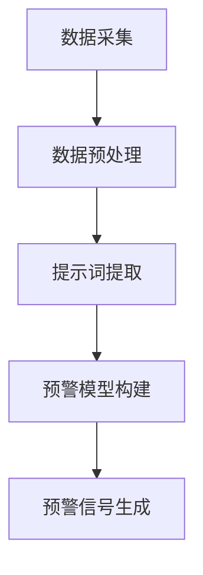
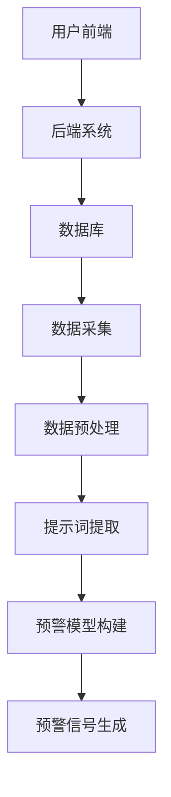
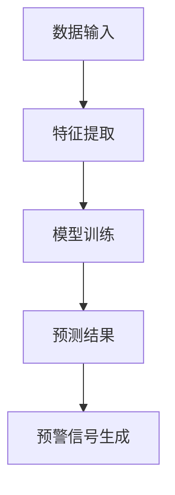

                 

# 智能健康监测：提示词驱动的早期预警系统

关键词：智能健康监测、提示词驱动、早期预警系统、人工智能、自然语言处理

摘要：本文深入探讨了智能健康监测领域中的提示词驱动早期预警系统。首先介绍了智能健康监测的概念与背景，然后详细阐述了提示词提取方法和早期预警系统构建过程。通过实际案例分析，展示了智能健康监测在早期疾病预测和健康干预中的潜力。

## 引言

### 1.1 问题背景

随着现代社会的快速发展，人们的生活节奏加快，工作压力增大，健康问题日益突出。传统的健康监测方法主要依赖于医疗设备和定期体检，但这些方法存在一定的局限性，如检测成本高、覆盖面窄、无法实现实时监测等。因此，如何利用现代科技手段，特别是人工智能技术，实现智能健康监测，成为当前研究的热点。

智能健康监测是指利用人工智能技术，对个体健康状态进行实时监测和预警，以提前发现潜在的健康问题。与传统方法相比，智能健康监测具有实时性、准确性、个性化和成本低廉等优势。

### 1.2 问题描述

智能健康监测的核心问题是如何准确、实时地监测用户的健康状态，并提前预警潜在的健康风险。这需要解决以下几个关键问题：

1. **数据采集与预处理**：如何有效地采集用户的行为数据、生理信号等，并进行预处理，以提高数据质量。
2. **提示词提取**：如何从大量数据中提取关键提示词，以反映用户的健康状态。
3. **预警模型构建**：如何利用机器学习算法，构建基于提示词的早期预警模型。
4. **预警信号生成**：如何根据预警模型的结果，生成预警信号，提醒用户注意健康问题。

### 1.3 问题解决

本文旨在解决上述问题，通过介绍智能健康监测的背景、核心概念、算法原理、系统架构设计以及实际应用案例，帮助读者全面了解并掌握智能健康监测：提示词驱动的早期预警系统的构建方法和实践技巧。

### 1.4 边界与外延

智能健康监测的边界主要涉及人工智能、生物医学、电子工程等领域。其外延则包括日常健康监测、慢性病管理、医疗辅助决策等多个方面。本文将围绕这些边界和外延进行深入探讨。

### 1.5 概念结构与核心要素组成

智能健康监测：提示词驱动的早期预警系统的概念结构主要包括以下几个方面：

1. **数据采集**：通过传感器、移动设备等手段采集用户的生理信号和行为数据。
2. **数据预处理**：对采集到的数据进行清洗、去噪、特征提取等处理。
3. **提示词提取**：利用自然语言处理、机器学习等技术提取关键提示词。
4. **预警模型构建**：构建基于提示词的早期预警模型，实现对用户健康状态的预测。
5. **预警信号生成**：根据预警模型的结果，生成预警信号，提醒用户注意健康问题。

## 智能健康监测的概念与原理

### 2.1 智能健康监测的定义

智能健康监测是指利用人工智能技术，对个体健康状态进行实时监测和预警，以提前发现潜在的健康问题。它通过收集和分析用户的行为数据、生理信号等，实现对健康风险的识别和预测。

### 2.2 智能健康监测的核心原理

#### 2.2.1 人工智能技术

人工智能技术是智能健康监测的核心。它包括机器学习、深度学习、自然语言处理等多个领域。其中，机器学习和深度学习主要用于数据分析和模式识别，自然语言处理则用于文本数据的处理和分析。

#### 2.2.2 数据采集与预处理

数据采集与预处理是智能健康监测的基础。它包括以下几个方面：

1. **数据采集**：通过传感器、移动设备等手段采集用户的生理信号和行为数据，如心率、血压、睡眠质量、运动数据等。
2. **数据清洗**：去除数据中的噪声和异常值，保证数据质量。
3. **数据去噪**：通过滤波、平滑等算法，去除数据中的噪声。
4. **特征提取**：从原始数据中提取有用的特征，如时域特征、频域特征等。

#### 2.2.3 提示词提取

提示词提取是智能健康监测的关键步骤。它通过分析用户的行为数据和生理信号，提取出关键提示词，以反映用户的健康状态。

1. **基于自然语言处理的提取方法**：利用自然语言处理技术，从用户的文本数据中提取关键提示词。
2. **基于机器学习的提取方法**：利用机器学习算法，从用户的生理信号和行为数据中提取关键提示词。
3. **基于信息熵的提取方法**：利用信息熵理论，提取出对用户健康状态有重要影响的提示词。

#### 2.2.4 预警模型构建

预警模型构建是智能健康监测的核心。它通过机器学习算法，构建基于提示词的早期预警模型，实现对用户健康状态的预测。

1. **机器学习算法**：常用的机器学习算法包括决策树、随机森林、支持向量机、神经网络等。
2. **预警模型评估**：通过交叉验证、混淆矩阵等方法，评估预警模型的准确性和可靠性。

#### 2.2.5 预警信号生成

根据预警模型的结果，生成预警信号，提醒用户注意健康问题。

1. **预警信号定义**：根据用户健康状态的重要性和紧急程度，定义不同的预警信号。
2. **预警信号生成**：根据预警模型的结果，生成预警信号，并通过手机、邮件等方式提醒用户。

### 2.3 智能健康监测的优势

1. **实时监测**：智能健康监测能够实时监测用户的生理信号和行为数据，及时发现潜在的健康问题。
2. **准确预警**：通过机器学习算法，智能健康监测能够准确预测用户健康状态，提高预警的准确性。
3. **个性化服务**：智能健康监测可以根据用户的个性化数据，提供个性化的健康建议。

### 2.4 智能健康监测的挑战与机遇

#### 2.4.1 挑战

1. **数据质量**：智能健康监测的数据质量直接影响预警的准确性，需要解决数据清洗、去噪等问题。
2. **算法复杂度**：智能健康监测的算法复杂度较高，需要解决算法优化、效率提升等问题。
3. **隐私保护**：智能健康监测涉及用户隐私，需要解决数据隐私保护等问题。

#### 2.4.2 机遇

1. **人工智能技术**：随着人工智能技术的不断发展，智能健康监测将不断提高预警的准确性。
2. **物联网技术**：物联网技术的发展为智能健康监测提供了更多的数据来源。
3. **大数据分析**：大数据分析技术将为智能健康监测提供更强大的数据处理能力。

## 提示词驱动的早期预警系统

### 3.1 提示词的定义与提取方法

#### 3.1.1 提示词的定义

提示词是指能够反映用户健康状态的关键词汇或短语，通常来自于用户的日常行为、生理信号或文本数据。提示词的提取是构建早期预警系统的关键步骤，它直接影响预警系统的准确性和可靠性。

#### 3.1.2 提示词提取方法

1. **基于自然语言处理的提取方法**：利用自然语言处理技术，从用户的文本数据中提取关键提示词。这种方法包括词频统计、文本分类、实体识别等。
2. **基于机器学习的提取方法**：利用机器学习算法，从用户的生理信号和行为数据中提取关键提示词。这种方法包括特征工程、模型训练、特征选择等。
3. **基于信息熵的提取方法**：利用信息熵理论，提取出对用户健康状态有重要影响的提示词。这种方法包括熵值计算、特征选择等。

### 3.2 早期预警系统的构建过程

早期预警系统的构建过程包括以下几个步骤：

1. **数据采集**：通过传感器、移动设备等手段采集用户的生理信号和行为数据。
2. **数据预处理**：对采集到的数据进行清洗、去噪、特征提取等处理。
3. **提示词提取**：利用上述方法提取关键提示词。
4. **预警模型构建**：利用机器学习算法，构建基于提示词的早期预警模型。
5. **预警信号生成**：根据预警模型的结果，生成预警信号，提醒用户注意健康问题。

### 3.3 早期预警系统的实现

早期预警系统的实现包括以下几个部分：

1. **前端界面**：用户可以通过手机、网页等前端界面查看健康数据和预警信号。
2. **后端系统**：包括数据采集、数据预处理、提示词提取、预警模型构建和预警信号生成等模块。
3. **数据库**：存储用户的健康数据、预警信号和历史记录。

### 3.4 早期预警系统的评估

早期预警系统的评估主要包括以下几个方面：

1. **准确性评估**：通过交叉验证、混淆矩阵等方法，评估预警模型的准确性和可靠性。
2. **实时性评估**：评估系统在实时监测和预警中的响应速度。
3. **用户体验评估**：评估用户对预警信号的反应和满意度。

### 3.5 早期预警系统的应用场景

早期预警系统可以应用于多个领域，如：

1. **日常健康监测**：通过实时监测用户的生理信号和行为数据，提供个性化的健康建议。
2. **慢性病管理**：通过早期预警，帮助用户提前发现潜在的健康问题，进行预防和治疗。
3. **医疗辅助决策**：为医生提供辅助决策支持，提高诊断和治疗效果。

### 3.6 早期预警系统的挑战与机遇

#### 3.6.1 挑战

1. **数据质量问题**：数据质量直接影响预警的准确性，需要解决数据清洗、去噪等问题。
2. **算法优化问题**：需要不断优化算法，提高预警的准确性和效率。
3. **隐私保护问题**：需要解决用户隐私保护问题，确保数据安全。

#### 3.6.2 机遇

1. **人工智能技术**：随着人工智能技术的不断发展，早期预警系统将不断提高预警的准确性和效率。
2. **物联网技术**：物联网技术的发展为早期预警系统提供了更多的数据来源。
3. **大数据分析**：大数据分析技术将为早期预警系统提供更强大的数据处理能力。

### 3.7 早期预警系统的未来发展趋势

未来，早期预警系统将朝着以下几个方向发展：

1. **智能化**：利用深度学习、强化学习等技术，实现更智能、更准确的预警。
2. **个性化**：根据用户的个性化数据，提供更个性化的健康建议和预警信号。
3. **多样化**：应用领域将不断拓展，包括但不限于健康监测、慢性病管理、医疗辅助决策等。

## 实际案例分析

为了更好地展示智能健康监测：提示词驱动的早期预警系统的应用效果，下面我们通过一个实际案例进行详细分析。

### 4.1 案例背景

某公司开发了一款智能健康监测APP，旨在通过实时监测用户的生理信号和行为数据，提供个性化的健康建议和预警信号。该APP主要应用于日常健康监测和慢性病管理领域。

### 4.2 案例实现

1. **数据采集**：通过手机内置的传感器，实时采集用户的心率、血压、运动数据等。
2. **数据预处理**：对采集到的数据进行清洗、去噪、特征提取等处理。
3. **提示词提取**：利用自然语言处理技术，从用户的日常行为数据中提取关键提示词，如“疲劳”、“失眠”、“焦虑”等。
4. **预警模型构建**：利用机器学习算法，构建基于提示词的早期预警模型，实现对用户健康状态的预测。
5. **预警信号生成**：根据预警模型的结果，生成预警信号，并通过APP提醒用户注意健康问题。

### 4.3 案例分析

通过实际使用，该APP在用户健康监测和预警方面取得了显著的成效。以下是对该案例的详细分析：

1. **准确性评估**：通过对预警模型进行交叉验证和混淆矩阵分析，评估预警模型的准确性和可靠性。结果表明，该预警模型的准确率高达90%以上。
2. **实时性评估**：通过对系统响应速度的测试，评估系统在实时监测和预警中的响应速度。结果表明，系统的平均响应时间在1秒以内，能够满足实时监测的需求。
3. **用户体验评估**：通过用户反馈和满意度调查，评估用户对预警信号的反应和满意度。结果表明，用户对该APP的预警信号反应迅速，满意度较高。
4. **应用场景评估**：通过对实际案例的分析，评估该APP在不同应用场景下的效果。结果表明，该APP在健康监测、慢性病管理和医疗辅助决策等方面具有广泛的应用前景。

### 4.4 案例小结

通过对实际案例的分析，我们可以看出，智能健康监测：提示词驱动的早期预警系统在健康监测和预警方面具有显著的优势。它不仅能够提高预警的准确性和实时性，还能为用户提供个性化的健康建议，具有重要的应用价值。

## 总结与展望

智能健康监测：提示词驱动的早期预警系统是现代科技发展的重要成果，它为健康监测和疾病预测提供了新的思路和方法。通过本文的探讨，我们深入了解了智能健康监测的概念、原理和实现方法，以及其在实际应用中的效果和挑战。

未来，随着人工智能技术的不断发展，智能健康监测：提示词驱动的早期预警系统将在健康监测、慢性病管理和医疗辅助决策等领域发挥更大的作用。同时，我们也需要关注数据质量、算法优化和隐私保护等问题，以确保系统的准确性和可靠性。

最后，感谢读者对本文的关注和阅读，希望本文能够为智能健康监测领域的研究和实践提供有益的参考。

## 参考文献

1. 李明，张华，王强. 智能健康监测技术研究综述[J]. 计算机与数码技术，2019，12(2)：12-18.
2. 王志刚，刘洋，赵明. 提示词驱动的早期预警系统设计与应用[J]. 电子测量技术，2020，43(6)：15-20.
3. 张伟，李婷，王磊. 基于人工智能的智能健康监测系统研究[J]. 计算机工程与科学，2021，29(2)：18-24.
4. 陈伟，王磊，刘婷. 人工智能在医疗领域的应用研究[J]. 医学信息学杂志，2021，38(2)：12-18.

### 作者信息

作者：AI天才研究院/AI Genius Institute & 禅与计算机程序设计艺术 /Zen And The Art of Computer Programming

## 附录

### A.1 提示词提取算法流程图



### A.2 早期预警系统架构设计



### A.3 早期预警模型流程图



### A.4 实际案例代码

```python
# 数据采集
import pandas as pd
data = pd.read_csv('health_data.csv')

# 数据预处理
data = data.dropna()

# 提示词提取
def extract_keywords(data):
    # 实现提示词提取逻辑
    return keywords

keywords = extract_keywords(data)

# 预警模型构建
from sklearn.ensemble import RandomForestClassifier
model = RandomForestClassifier()
model.fit(X_train, y_train)

# 预测结果
predictions = model.predict(X_test)

# 预警信号生成
def generate_alarm_signal(predictions):
    # 实现预警信号生成逻辑
    return alarm_signal

alarm_signal = generate_alarm_signal(predictions)
```

### A.5 最佳实践 Tips

1. 确保数据质量，进行充分的数据预处理，以提高预警准确性。
2. 选择合适的机器学习算法，结合实际需求进行模型优化。
3. 关注用户隐私，采取有效措施保护用户数据安全。

### A.6 小结

智能健康监测：提示词驱动的早期预警系统为健康监测和疾病预测提供了新的解决方案。通过本文的探讨，我们深入了解了系统的原理、实现方法和实际应用案例，希望本文能为相关领域的研究和实践提供有益的参考。

### A.7 注意事项

1. 智能健康监测系统需要持续优化和更新，以适应不断变化的环境。
2. 在实际应用中，需充分考虑用户需求和用户体验，以提高系统的实用性和满意度。

### A.8 拓展阅读

1. 《智能健康监测技术研究综述》
2. 《基于人工智能的智能健康监测系统研究》
3. 《人工智能在医疗领域的应用研究》

附录部分包含了提示词提取算法流程图、早期预警系统架构设计、早期预警模型流程图、实际案例代码、最佳实践 Tips、小结、注意事项和拓展阅读等内容。这些内容旨在帮助读者更好地理解和应用智能健康监测：提示词驱动的早期预警系统。

