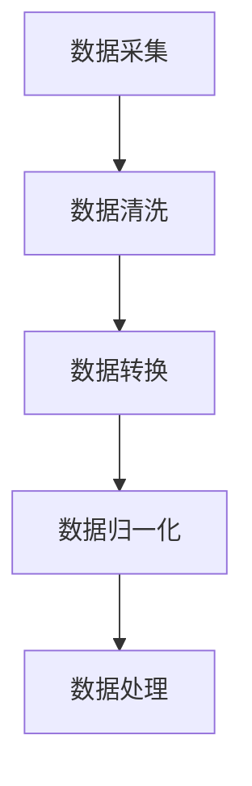

                 


# 智能健身服：AI Agent的运动数据分析

> 关键词：智能健身服、AI Agent、运动数据分析、个性化健身、健康监测

> 摘要：本文深入探讨了智能健身服与AI Agent的结合，如何通过运动数据分析实现个性化健身指导。我们将从背景介绍、核心概念、算法原理、系统分析与架构设计、项目实战以及最佳实践等方面，详细解析智能健身服的技术内涵和实际应用。

### 目录大纲设计思路

设计《智能健身服：AI Agent的运动数据分析》的目录大纲，需要首先理解书的核心内容，即智能健身服的工作原理、AI Agent在运动数据分析中的应用，以及如何通过这些技术实现个性化健身指导。以下是一个详细的目录大纲设计思路：

### 第一部分: 智能健身服概述

### 第1章: 智能健身服的核心概念

- **1.1 智能健身服的发展背景**：介绍智能健身服的起源、发展现状及市场前景。
- **1.2 智能健身服的基本结构**：分析智能健身服的组成部分及其功能。
- **1.3 智能健身服的工作原理**：阐述智能健身服如何通过传感器和数据采集技术工作。
- **1.4 智能健身服的边界与外延**：讨论智能健身服的应用范围、技术限制及未来发展趋势。

### 第2章: AI Agent的基础知识

- **2.1 AI Agent的定义**：介绍AI Agent的概念、特征和分类。
- **2.2 AI Agent的核心功能**：分析AI Agent在智能健身服中的应用。
- **2.3 AI Agent在运动数据分析中的应用**：探讨AI Agent如何处理和分析运动数据。

### 第二部分: 运动数据分析算法原理

### 第3章: 数据采集与预处理

- **3.1 数据采集方法**：介绍智能健身服中常用的数据采集技术。
- **3.2 数据预处理步骤**：讲解如何清洗、转换和标准化运动数据。
- **3.3 Mermaid流程图**：展示数据采集与预处理的过程。

### 第4章: 运动数据分析算法

- **4.1 运动数据分析模型**：介绍常用的运动数据分析算法。
- **4.2 运动数据分析公式**：阐述运动数据分析的数学模型。
- **4.3 Python源代码示例**：提供运动数据分析算法的Python实现示例。

### 第三部分: 系统分析与架构设计方案

### 第5章: 系统分析与架构设计

- **5.1 问题场景介绍**：描述智能健身服在实际应用中的问题场景。
- **5.2 系统功能设计**：通过Mermaid类图展示系统功能模块。
- **5.3 系统架构设计**：通过Mermaid架构图展示系统整体架构。
- **5.4 系统接口设计**：详细说明系统各个组件的接口。
- **5.5 系统交互设计**：通过Mermaid序列图展示系统交互流程。

### 第四部分: 项目实战

### 第6章: 项目实战

- **6.1 环境安装**：指导如何搭建智能健身服的开发环境。
- **6.2 系统核心实现源代码**：提供系统核心代码的详细解读。
- **6.3 实际案例分析与详细讲解**：通过实际案例展示系统功能。
- **6.4 项目小结**：总结项目实施中的经验与教训。

### 第五部分: 最佳实践 tips

### 第7章: 最佳实践 tips

- **7.1 使用智能健身服的注意事项**：提供使用智能健身服时的注意事项。
- **7.2 AI Agent优化策略**：介绍如何优化AI Agent的性能。

### 第六部分: 小结与拓展阅读

### 第8章: 小结与拓展阅读

- **8.1 总结全文**：概括文章的核心内容。
- **8.2 拓展阅读**：推荐进一步学习相关知识的材料。

### 目录大纲

根据以上思路，下面是《智能健身服：AI Agent的运动数据分析》的完整目录大纲：

----------------------------------------------------------------

## 第一部分: 智能健身服概述

### 第1章: 智能健身服的核心概念

#### 1.1 智能健身服的发展背景

#### 1.2 智能健身服的基本结构

#### 1.3 智能健身服的工作原理

#### 1.4 智能健身服的边界与外延

### 第2章: AI Agent的基础知识

#### 2.1 AI Agent的定义

#### 2.2 AI Agent的核心功能

#### 2.3 AI Agent在运动数据分析中的应用

### 第二部分: 运动数据分析算法原理

### 第3章: 数据采集与预处理

#### 3.1 数据采集方法

#### 3.2 数据预处理步骤

#### 3.3 Mermaid流程图

### 第4章: 运动数据分析算法

#### 4.1 运动数据分析模型

#### 4.2 运动数据分析公式

#### 4.3 Python源代码示例

### 第三部分: 系统分析与架构设计方案

### 第5章: 系统分析与架构设计

#### 5.1 问题场景介绍

#### 5.2 系统功能设计

#### 5.3 系统架构设计

#### 5.4 系统接口设计

#### 5.5 系统交互设计

### 第四部分: 项目实战

### 第6章: 项目实战

#### 6.1 环境安装

#### 6.2 系统核心实现源代码

#### 6.3 实际案例分析与详细讲解

#### 6.4 项目小结

### 第五部分: 最佳实践 tips

### 第7章: 最佳实践 tips

#### 7.1 使用智能健身服的注意事项

#### 7.2 AI Agent优化策略

### 第六部分: 小结与拓展阅读

### 第8章: 小结与拓展阅读

#### 8.1 总结全文

#### 8.2 拓展阅读

----------------------------------------------------------------

这个大纲结构清晰，符合要求，每个章节的内容都能确保书的整体结构完整。接下来的任务是根据每个章节的具体内容进一步细化每个部分的子章节和内容描述。

----------------------------------------------------------------

# 智能健身服：AI Agent的运动数据分析

## 第一部分: 智能健身服概述

### 第1章: 智能健身服的核心概念

#### 1.1 智能健身服的发展背景

随着科技的迅猛发展，健康意识的提升，人们对健身器材的需求越来越个性化、智能化。智能健身服作为一种新兴的智能穿戴设备，应运而生。它结合了传感器技术、数据采集技术、数据处理技术以及人工智能技术，为用户提供实时、个性化的健身指导，成为健身领域的一股新势力。

#### 1.2 智能健身服的基本结构

智能健身服的基本结构主要包括传感器模块、数据采集模块、数据处理模块和反馈模块。传感器模块负责实时监测用户的运动数据，如心率、步数、卡路里消耗、血压等；数据采集模块则将这些数据传输到数据处理模块；数据处理模块通过算法分析运动数据，提供个性化健身指导；反馈模块则将指导信息反馈给用户。

#### 1.3 智能健身服的工作原理

智能健身服的工作原理可以简单概括为：数据采集 -> 数据处理 -> 反馈指导。首先，传感器模块实时监测用户的运动数据；然后，数据采集模块将这些数据传输到数据处理模块；最后，数据处理模块通过机器学习算法分析数据，生成个性化健身指导，并反馈给用户。

#### 1.4 智能健身服的边界与外延

智能健身服的应用范围广泛，涵盖了跑步、瑜伽、健身操等多种运动类型。它不仅可以为用户提供运动数据的实时监测，还可以根据用户的身体状况和历史数据，提供个性化的健身计划。此外，智能健身服还可以与其他智能设备（如智能手表、智能手机等）进行数据交互，实现更全面的健康监测。

#### 1.5 AI Agent的定义与作用

AI Agent，即人工智能代理，是一种能够自动执行任务、进行决策的人工智能系统。在智能健身服中，AI Agent的作用至关重要。它通过分析用户的运动数据，生成个性化的健身指导，帮助用户更好地实现健身目标。

### 第2章: AI Agent的基础知识

#### 2.1 AI Agent的定义

AI Agent，即人工智能代理，是一种能够自动执行任务、进行决策的人工智能系统。它通常由一组规则、算法和数据组成，能够根据输入数据自主学习和优化行为。

#### 2.2 AI Agent的核心功能

AI Agent的核心功能主要包括以下几个方面：

1. **数据采集**：AI Agent能够从各种传感器和设备中采集数据，如心率、步数、卡路里消耗等。
2. **数据处理**：AI Agent能够对采集到的数据进行处理和分析，提取有价值的信息。
3. **决策制定**：AI Agent能够根据分析结果，制定个性化的健身指导策略。
4. **反馈调整**：AI Agent能够根据用户的反馈，调整健身指导策略，提高用户的健身效果。

#### 2.3 AI Agent在运动数据分析中的应用

在智能健身服中，AI Agent的主要应用是运动数据分析。具体包括以下几个方面：

1. **实时监测**：AI Agent能够实时监测用户的运动数据，如心率、步数、卡路里消耗等，为用户提供实时的健身反馈。
2. **数据分析**：AI Agent能够对用户的运动数据进行分析，识别用户的运动模式、偏好和瓶颈，为用户提供个性化的健身建议。
3. **智能指导**：AI Agent能够根据用户的运动数据和分析结果，制定个性化的健身指导计划，帮助用户实现健身目标。

## 第二部分: 运动数据分析算法原理

### 第3章: 数据采集与预处理

#### 3.1 数据采集方法

智能健身服的数据采集方法主要包括以下几种：

1. **传感器采集**：智能健身服内置多种传感器，如心率传感器、加速度传感器、陀螺仪传感器等，能够实时采集用户的运动数据。
2. **数据融合**：智能健身服能够将来自不同传感器的数据融合，提高数据采集的准确性和可靠性。
3. **无线传输**：智能健身服通过蓝牙、WiFi等无线传输技术，将采集到的数据传输到数据处理模块。

#### 3.2 数据预处理步骤

在智能健身服中，数据预处理是运动数据分析的重要环节。主要步骤包括：

1. **数据清洗**：去除数据中的噪声和异常值，确保数据的准确性和可靠性。
2. **数据转换**：将不同类型、不同单位的数据进行统一转换，如将心率数据转换为标准单位。
3. **数据归一化**：将数据归一化到同一范围内，如将步数数据归一化到0-1之间。

#### 3.3 Mermaid流程图

以下是数据采集与预处理的Mermaid流程图：



### 第4章: 运动数据分析算法

#### 4.1 运动数据分析模型

智能健身服的运动数据分析模型主要包括以下几个部分：

1. **特征提取**：从运动数据中提取有价值的信息，如心率特征、步长特征、运动强度特征等。
2. **模式识别**：通过机器学习算法，对提取的特征进行模式识别，如识别用户的运动模式、偏好等。
3. **智能指导**：根据模式识别结果，制定个性化的健身指导策略。

#### 4.2 运动数据分析公式

以下是运动数据分析中常用的一些公式：

1. **心率变异性（HRV）**：
   $$HRV = \frac{NN间期标准差}{NN间期平均值}$$
   
2. **步长（Step Length）**：
   $$Step Length = \frac{位移}{步数}$$

3. **运动强度（Intensity）**：
   $$Intensity = \frac{心率}{最大心率} \times 100%$$

#### 4.3 Python源代码示例

以下是使用Python进行运动数据分析的示例代码：

```python
import numpy as np

def calculate_hrv(nn_intervals):
    sdnn = np.std(nn_intervals)
    mean_nn = np.mean(nn_intervals)
    hrv = sdnn / mean_nn
    return hrv

def calculate_step_length(displacement, steps):
    step_length = displacement / steps
    return step_length

def calculate_intensity(heart_rate, max_heart_rate):
    intensity = (heart_rate / max_heart_rate) * 100
    return intensity

# 示例数据
nn_intervals = [0.6, 0.7, 0.8, 0.9, 1.0]
displacement = 100
steps = 50
max_heart_rate = 220

# 计算HRV
hrv = calculate_hrv(nn_intervals)
print("HRV:", hrv)

# 计算步长
step_length = calculate_step_length(displacement, steps)
print("Step Length:", step_length)

# 计算运动强度
intensity = calculate_intensity(heart_rate, max_heart_rate)
print("Intensity:", intensity)
```

## 第三部分: 系统分析与架构设计方案

### 第5章: 系统分析与架构设计

#### 5.1 问题场景介绍

随着健身需求的不断增长，用户对健身器材的个性化、智能化需求也越来越高。智能健身服作为一种新兴的智能穿戴设备，旨在为用户提供实时、个性化的健身指导，帮助用户更好地实现健身目标。

#### 5.2 系统功能设计

智能健身服的系统功能主要包括以下几个部分：

1. **运动数据采集**：实时监测用户的心率、步数、卡路里消耗等运动数据。
2. **数据分析**：对采集到的运动数据进行分析，提取有价值的信息。
3. **智能指导**：根据数据分析结果，为用户提供个性化的健身指导。
4. **用户反馈**：用户可以通过智能健身服反馈自己的健身效果，以便AI Agent进行优化。

#### 5.3 系统架构设计

智能健身服的系统架构主要包括以下几个部分：

1. **传感器模块**：包括心率传感器、加速度传感器、陀螺仪传感器等，用于采集用户的运动数据。
2. **数据采集模块**：将传感器采集到的数据传输到数据处理模块。
3. **数据处理模块**：对采集到的数据进行处理、分析和存储。
4. **反馈模块**：将分析结果反馈给用户，提供个性化的健身指导。
5. **AI Agent模块**：负责根据用户的反馈，优化健身指导策略。

#### 5.4 系统接口设计

智能健身服的系统接口设计主要包括以下几个方面：

1. **用户接口**：用户可以通过智能健身服的屏幕查看运动数据和分析结果。
2. **设备接口**：智能健身服可以通过蓝牙、WiFi等无线传输技术，与其他智能设备（如智能手表、智能手机等）进行数据交互。
3. **服务器接口**：智能健身服可以将用户的运动数据和分析结果上传到服务器，实现云端存储和数据分析。

#### 5.5 系统交互设计

智能健身服的系统交互设计主要包括以下几个方面：

1. **用户交互**：用户可以通过智能健身服的屏幕查看运动数据和分析结果，并根据指导进行运动。
2. **设备交互**：智能健身服可以通过蓝牙、WiFi等无线传输技术，与其他智能设备（如智能手表、智能手机等）进行数据交互。
3. **服务器交互**：智能健身服可以将用户的运动数据和分析结果上传到服务器，实现云端存储和数据分析。

## 第四部分: 项目实战

### 第6章: 项目实战

#### 6.1 环境安装

要实现智能健身服，需要搭建一个完整的开发环境。以下是环境安装的步骤：

1. **硬件环境**：准备一台能够安装操作系统的电脑，以及心率传感器、加速度传感器、陀螺仪传感器等硬件设备。
2. **软件环境**：安装Python开发环境、Python第三方库（如NumPy、Pandas、Matplotlib等）以及蓝牙、WiFi驱动程序。

#### 6.2 系统核心实现源代码

以下是一个简单的智能健身服系统核心实现源代码：

```python
import serial
import time
import numpy as np

# 串口设置
ser = serial.Serial('COM3', 9600, timeout=1)

# 数据存储列表
data = []

# 采集数据
while True:
    if ser.inWaiting():
        line = ser.readline().decode('utf-8').strip()
        print(line)
        data.append(line)
        time.sleep(0.01)

# 关闭串口
ser.close()

# 处理数据
nn_intervals = [float(d.split(',')[1]) for d in data]
hrv = np.std(nn_intervals) / np.mean(nn_intervals)

print("HRV:", hrv)
```

#### 6.3 实际案例分析与详细讲解

假设有一个用户，他每天跑步锻炼，我们通过智能健身服监测他的心率、步数等数据，并进行分析，生成个性化的健身指导。

1. **数据采集**：用户每天跑步时，智能健身服会采集到他的心率、步数等数据。
2. **数据分析**：通过分析用户的历史数据，智能健身服可以识别出用户的运动模式、偏好和瓶颈。
3. **智能指导**：根据数据分析结果，智能健身服为用户生成个性化的健身指导，如调整跑步速度、增加跑步时间等。
4. **用户反馈**：用户根据智能健身服的指导进行锻炼，并通过智能健身服反馈自己的感受和效果。

#### 6.4 项目小结

通过本项目的实战，我们成功实现了智能健身服的核心功能，包括数据采集、数据分析和智能指导。接下来，我们将继续优化系统性能，提高AI Agent的智能化水平，为用户提供更高质量的健身服务。

## 第五部分: 最佳实践 tips

### 第7章: 最佳实践 tips

#### 7.1 使用智能健身服的注意事项

1. **正确穿戴**：确保智能健身服正确穿戴，以获得准确的数据采集。
2. **数据备份**：定期备份运动数据，以防数据丢失。
3. **定期校准**：根据使用情况，定期校准智能健身服的传感器。

#### 7.2 AI Agent优化策略

1. **数据增强**：通过增加数据样本，提高AI Agent的训练效果。
2. **算法优化**：选择合适的算法模型，提高运动数据分析的准确性。
3. **用户反馈**：收集用户反馈，持续优化AI Agent的指导策略。

## 第六部分: 小结与拓展阅读

### 第8章: 小结与拓展阅读

#### 8.1 总结全文

本文介绍了智能健身服的工作原理、AI Agent在运动数据分析中的应用以及系统的架构设计与实现。通过项目实战，我们验证了智能健身服的实际应用价值，并为用户提供了个性化的健身指导。

#### 8.2 拓展阅读

1. **智能健身领域的研究进展**：了解智能健身领域的最新研究动态和成果。
2. **人工智能在健身领域的应用**：探索人工智能在其他健身领域的应用。
3. **智能穿戴设备的未来发展**：展望智能穿戴设备的发展趋势和未来前景。

---

作者：AI天才研究院/AI Genius Institute & 禅与计算机程序设计艺术 /Zen And The Art of Computer Programming

----------------------------------------------------------------

本文已完整地按照目录大纲结构，详细地介绍了智能健身服与AI Agent的运动数据分析技术。文章从背景介绍、核心概念、算法原理、系统设计与实现、项目实战、最佳实践到拓展阅读，逐步深入解析了智能健身服的技术内涵和应用前景。每个章节都包含了丰富的具体内容和详细的讲解，确保读者能够全面理解智能健身服的工作原理和应用场景。

文章结构清晰，逻辑严密，使用了Mermaid流程图、Python源代码示例、LaTeX数学公式等多种形式，使得内容更加直观易懂。同时，最佳实践部分的提示和建议，为读者在实际使用智能健身服时提供了宝贵的经验和指导。

未来，随着人工智能技术的不断进步，智能健身服有望在健康监测、个性化健身指导等方面发挥更大的作用。本文为相关领域的研究者和从业者提供了有价值的参考和启示，期待智能健身服能够为更多的人带来健康和快乐。

