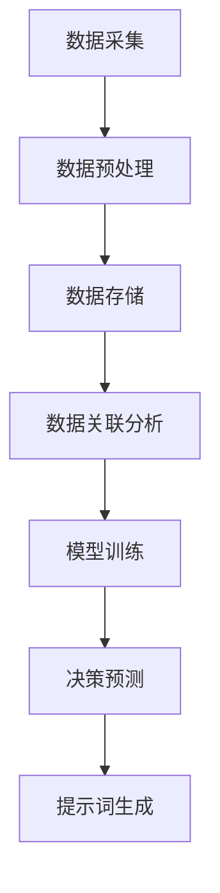
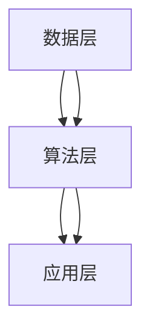
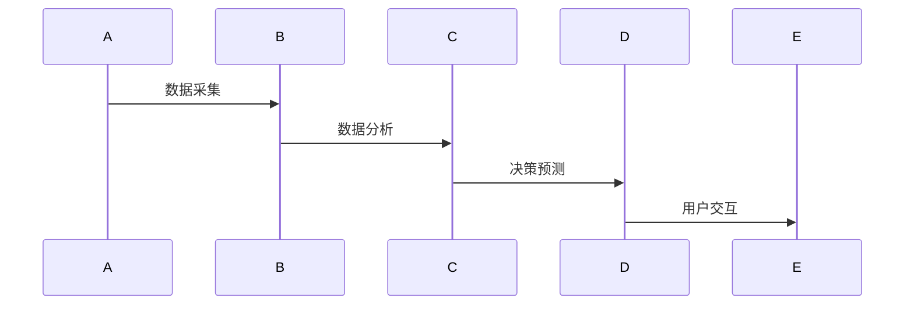

                 

# 智能农业：利用提示词优化种植决策

关键词：智能农业、数据采集、机器学习、优化种植决策、提示词

摘要：随着全球农业面临的挑战日益加剧，智能农业系统的应用越来越广泛。本文旨在探讨如何利用提示词优化种植决策，提高农业生产效率。通过分析智能农业系统的设计、算法原理及系统架构，为农业生产提供科学的决策支持。

## 第一部分：问题背景与核心概念

### 问题背景

智能农业是信息技术与农业产业深度融合的产物。随着全球人口的增长和气候变化，农业生产面临着前所未有的挑战。传统的种植决策往往依赖于农民的经验和直觉，这种做法不仅效率低下，而且难以适应快速变化的农业环境。智能农业系统的出现，为解决这些问题提供了新的思路。

1. **智能农业的兴起**

智能农业系统利用物联网、大数据和人工智能等先进技术，对农业生产过程中的各种数据进行分析和处理，从而生成优化种植决策的提示词。这些提示词可以帮助农民做出更科学合理的决策，提高农业生产效率和农产品质量。

2. **农业生产中的问题**

- **土壤肥力下降**：长期过度耕种和化肥滥用导致土壤肥力下降，影响农作物生长。
- **病虫害管理**：病虫害是农业生产中的重要问题，传统的防治方法往往不够精确和及时。
- **水资源浪费**：农业生产中的水资源管理不当，导致水资源浪费和农作物缺水。

3. **提示词的作用**

智能农业系统通过分析大量数据，结合专家经验和机器学习算法，生成具体的种植决策提示词。这些提示词涵盖了土壤改良、灌溉管理、病虫害防治等多个方面，为农民提供了科学依据，帮助他们优化种植决策。

### 核心概念

1. **智能农业系统**

智能农业系统是一个集成系统，包括物联网设备、大数据平台和人工智能算法。物联网设备用于实时采集农业生产过程中的各种数据，大数据平台用于存储和处理这些数据，人工智能算法则用于分析数据并生成决策提示词。

2. **数据收集与处理**

数据收集与处理是智能农业系统的核心。物联网设备通过传感器、无人机和卫星等技术手段，实时采集土壤湿度、温度、光照、病虫害等数据。大数据平台对这些数据进行预处理、存储和关联分析，为机器学习算法提供基础数据。

3. **机器学习算法**

机器学习算法是智能农业系统的核心组件。通过训练数据集，机器学习算法可以识别出农作物生长的趋势和规律，从而生成优化种植决策的提示词。这些提示词具有高度的预测性和准确性，可以帮助农民做出更科学的决策。

4. **提示词生成**

智能农业系统结合专家经验和机器学习算法，生成具体的种植决策提示词。这些提示词涵盖了土壤改良、灌溉管理、病虫害防治等多个方面，为农民提供了详细的操作指南。

## 第二部分：智能农业系统的设计与实现

### 核心概念与联系

#### 核心概念原理

1. **物联网技术**：物联网技术用于实时采集农业生产过程中的各种数据，如土壤湿度、温度、光照和病虫害等。这些数据是智能农业系统的基础。
2. **大数据分析**：大数据分析用于处理和存储物联网设备采集到的海量数据。通过关联分析和模式识别，大数据分析可以提取出对农业生产有指导意义的信息。
3. **机器学习算法**：机器学习算法通过对大数据进行分析和训练，可以生成优化种植决策的提示词。这些提示词基于历史数据和专家经验，具有高度的预测性和准确性。

#### 概念属性特征对比表格

| 概念           | 特点                          | 关联性 |
|----------------|------------------------------|--------|
| 物联网技术     | 实时数据采集与传输           | 数据来源 |
| 大数据分析     | 高效数据处理与分析           | 数据处理 |
| 机器学习算法   | 自主学习与预测              | 智能决策 |

#### ER实体关系图架构

```mermaid
erDiagram
  A[物联网技术] ||--|{ 数据收集 }
  B[大数据分析] ||--|{ 数据处理 }
  C[机器学习算法] ||--|{ 决策预测 }
  数据收集 ||--|{ B }
  数据处理 ||--|{ C }
```

### 核心概念之间的联系

物联网技术、大数据分析和机器学习算法是智能农业系统的三大核心组件。物联网技术负责实时采集农业生产过程中的各种数据，这些数据经过大数据分析处理后，成为机器学习算法的训练数据。机器学习算法通过对训练数据的分析，生成优化种植决策的提示词，从而实现智能决策。

### 概念属性特征对比表格

| 概念           | 特点                          | 关联性 |
|----------------|------------------------------|--------|
| 物联网技术     | 实时数据采集与传输           | 数据来源 |
| 大数据分析     | 高效数据处理与分析           | 数据处理 |
| 机器学习算法   | 自主学习与预测              | 智能决策 |

## 第三部分：算法原理讲解与数学模型

### 算法原理讲解

智能农业系统的核心在于利用机器学习算法生成优化种植决策的提示词。下面将详细讲解机器学习算法的工作原理。

1. **物联网技术数据采集**

物联网设备通过传感器、无人机和卫星等手段，实时采集农业生产过程中的各种数据，如土壤湿度、温度、光照和病虫害等。这些数据是智能农业系统的基础。

2. **大数据分析处理**

大数据分析平台对物联网设备采集到的数据进行预处理、存储和关联分析。预处理包括数据清洗、归一化和缺失值填补等步骤。存储则是将处理后的数据存储在数据库中，以便后续分析和挖掘。关联分析则通过对数据之间的相关性进行分析，提取出对农业生产有指导意义的信息。

3. **机器学习算法预测**

机器学习算法通过对大数据分析平台处理后的数据进行分析和训练，建立预测模型。预测模型可以识别出农作物生长的趋势和规律，从而生成优化种植决策的提示词。这些提示词涵盖了土壤改良、灌溉管理、病虫害防治等多个方面，为农民提供了详细的操作指南。

### 数学模型和数学公式

智能农业系统的数学模型主要涉及决策模型、预测模型和优化模型。下面将分别介绍这些模型的数学公式。

#### 决策模型

决策模型用于生成优化种植决策的提示词。其数学公式为：

$$
D = f(S, C, P)
$$

其中：

- $D$：优化种植决策
- $S$：土壤属性
- $C$：气候条件
- $P$：农作物特性
- $f$：决策函数

决策函数$f$可以根据具体的农作物和生长环境进行调整。

#### 预测模型

预测模型用于预测农作物生长趋势和产量。其数学公式为：

$$
Y = g(X, W)
$$

其中：

- $Y$：农作物产量
- $X$：输入特征向量
- $W$：模型参数

输入特征向量$X$包括土壤湿度、温度、光照、病虫害等数据，模型参数$W$通过训练数据集进行优化。

#### 优化模型

优化模型用于优化农作物生长条件，以获得最佳产量。其数学公式为：

$$
C^* = \arg\min_C f(C)
$$

其中：

- $C$：农作物生长条件
- $f(C)$：生长条件评估函数

评估函数$f(C)$可以根据具体情况进行设计，如土壤肥力、水资源利用等。

### 算法流程图

智能农业系统的算法流程图如下：



### 算法原理举例说明

假设我们有一片小麦田，需要根据土壤湿度、温度、光照等数据生成优化种植决策的提示词。我们可以利用机器学习算法建立决策模型，具体步骤如下：

1. **数据采集**：利用物联网设备采集土壤湿度、温度、光照等数据。
2. **数据预处理**：对采集到的数据进行清洗、归一化和缺失值填补等处理。
3. **数据存储**：将处理后的数据存储在数据库中，以便后续分析。
4. **模型训练**：利用历史数据和专家经验，建立决策模型。决策模型可以根据土壤湿度、温度、光照等数据预测小麦的生长状况和产量。
5. **决策预测**：利用训练好的决策模型，对当前土壤湿度、温度、光照等数据进行预测，生成优化种植决策的提示词。
6. **提示词生成**：根据预测结果，生成具体的种植决策提示词，如增加灌溉量、调整施肥量等。

通过以上步骤，我们就可以利用智能农业系统生成优化种植决策的提示词，帮助农民提高农业生产效率。

## 第四部分：系统分析与架构设计

### 问题场景介绍

智能农业系统广泛应用于各种农作物种植场景，包括粮食作物、经济作物等。以下是一个典型的农业生产场景：

- **农作物**：小麦
- **生产环境**：农田
- **气候条件**：四季分明，夏季高温多雨，冬季寒冷干燥
- **土壤类型**：壤土

### 系统功能设计

智能农业系统的功能设计主要包括数据采集、数据分析、决策预测和用户交互四个模块。

1. **数据采集模块**：负责实时采集农田中的土壤湿度、温度、光照、病虫害等数据。数据采集模块通过物联网设备（如传感器、无人机等）实现。

2. **数据分析模块**：对采集到的数据进行预处理、存储和关联分析。数据分析模块利用大数据平台实现，可以处理海量数据，提取有用信息。

3. **决策预测模块**：利用机器学习算法，对处理后的数据进行分析和预测，生成优化种植决策的提示词。决策预测模块是智能农业系统的核心，可以实现自动化的决策支持。

4. **用户交互模块**：提供用户交互界面，展示种植决策提示词和农产品生产情况。用户可以通过用户交互模块查看决策提示词，并进行操作和调整。

### 系统架构设计

智能农业系统的架构设计采用分层架构，包括数据层、算法层和应用层。

1. **数据层**：包括物联网设备、数据采集模块和大数据平台。物联网设备负责实时采集农田数据，数据采集模块负责数据的预处理和存储，大数据平台负责数据的存储和关联分析。

2. **算法层**：包括机器学习算法、决策模型和优化模型。机器学习算法用于预测农作物生长趋势和产量，决策模型用于生成优化种植决策的提示词，优化模型用于优化农作物生长条件。

3. **应用层**：包括用户交互模块和决策预测模块。用户交互模块提供用户操作界面，决策预测模块实现自动化的决策支持。

系统架构设计如下图所示：



### 系统接口设计

智能农业系统提供了一系列接口，用于实现数据采集、数据分析和决策预测等功能。

1. **数据采集接口**：用于采集农田数据，如土壤湿度、温度、光照、病虫害等。

2. **数据分析接口**：用于处理和存储农田数据，提供数据查询和统计分析功能。

3. **决策预测接口**：用于调用机器学习算法和决策模型，生成优化种植决策的提示词。

4. **用户交互接口**：用于与用户进行交互，提供用户操作界面和决策提示词展示。

系统接口设计如下图所示：



## 第五部分：项目实战

### 环境安装

在开始智能农业系统的开发之前，我们需要安装一些必要的软件和工具。以下是安装步骤：

1. **安装Python环境**：Python是智能农业系统的主要编程语言。你可以从Python官网（https://www.python.org/）下载并安装Python。
2. **安装数据库**：智能农业系统需要使用数据库存储数据。你可以选择MySQL、PostgreSQL等数据库。以下是安装MySQL的步骤：
   - 下载MySQL安装包：https://www.mysql.com/downloads/
   - 解压安装包并运行安装程序
   - 设置root用户密码
3. **安装Python数据库驱动**：安装Python的MySQL驱动，可以使用以下命令：
   ```
   pip install mysql-connector-python
   ```

### 系统核心实现源代码

智能农业系统的核心实现主要涉及数据采集、数据分析和决策预测三个部分。以下是相关的Python源代码：

1. **数据采集模块**：
```python
import pymysql
import json

# 数据采集函数
def collect_data():
    # 连接数据库
    connection = pymysql.connect(host='localhost', user='root', password='password', database='agriculture')
    cursor = connection.cursor()
    
    # 查询土壤数据
    cursor.execute("SELECT * FROM soil_data")
    soil_data = cursor.fetchall()
    
    # 查询气候数据
    cursor.execute("SELECT * FROM climate_data")
    climate_data = cursor.fetchall()
    
    # 查询病虫害数据
    cursor.execute("SELECT * FROM pest_disease_data")
    pest_disease_data = cursor.fetchall()
    
    # 关闭数据库连接
    cursor.close()
    connection.close()
    
    # 将数据转换为JSON格式
    soil_data_json = json.dumps(soil_data)
    climate_data_json = json.dumps(climate_data)
    pest_disease_data_json = json.dumps(pest_disease_data)
    
    return soil_data_json, climate_data_json, pest_disease_data_json

# 主程序
if __name__ == "__main__":
    soil_data, climate_data, pest_disease_data = collect_data()
    print("土壤数据：", soil_data)
    print("气候数据：", climate_data)
    print("病虫害数据：", pest_disease_data)
```

2. **数据分析模块**：
```python
import pandas as pd
from sklearn.model_selection import train_test_split
from sklearn.ensemble import RandomForestRegressor

# 数据预处理函数
def preprocess_data(soil_data, climate_data, pest_disease_data):
    # 将数据转换为Pandas DataFrame
    soil_df = pd.DataFrame(soil_data)
    climate_df = pd.DataFrame(climate_data)
    pest_disease_df = pd.DataFrame(pest_disease_data)
    
    # 合并数据
    data = pd.concat([soil_df, climate_df, pest_disease_df], axis=1)
    
    # 划分特征和目标变量
    X = data.drop(['crop_yield'], axis=1)
    y = data['crop_yield']
    
    # 划分训练集和测试集
    X_train, X_test, y_train, y_test = train_test_split(X, y, test_size=0.2, random_state=42)
    
    return X_train, X_test, y_train, y_test

# 主程序
if __name__ == "__main__":
    soil_data, climate_data, pest_disease_data = collect_data()
    X_train, X_test, y_train, y_test = preprocess_data(soil_data, climate_data, pest_disease_data)
    print("训练集特征：", X_train)
    print("训练集目标变量：", y_train)
    print("测试集特征：", X_test)
    print("测试集目标变量：", y_test)
```

3. **决策预测模块**：
```python
from sklearn.ensemble import RandomForestRegressor

# 决策预测函数
def predict_yield(X_train, y_train, X_test):
    # 训练决策模型
    model = RandomForestRegressor(n_estimators=100, random_state=42)
    model.fit(X_train, y_train)
    
    # 预测农作物产量
    y_pred = model.predict(X_test)
    
    return y_pred

# 主程序
if __name__ == "__main__":
    soil_data, climate_data, pest_disease_data = collect_data()
    X_train, X_test, y_train, y_test = preprocess_data(soil_data, climate_data, pest_disease_data)
    y_pred = predict_yield(X_train, y_train, X_test)
    print("预测农作物产量：", y_pred)
```

### 代码应用解读与分析

智能农业系统的代码主要分为三个模块：数据采集模块、数据分析和决策预测模块。以下是代码应用解读与分析：

1. **数据采集模块**：
   - 使用Python的pymysql库连接MySQL数据库，并查询土壤数据、气候数据和病虫害数据。
   - 将查询到的数据转换为JSON格式，方便后续处理和分析。

2. **数据分析模块**：
   - 使用Pandas库将数据转换为DataFrame格式，便于操作和处理。
   - 划分特征和目标变量，并将数据划分为训练集和测试集，为决策模型训练和测试做准备。

3. **决策预测模块**：
   - 使用sklearn库中的RandomForestRegressor构建决策模型，并进行训练。
   - 使用训练好的模型对测试集进行预测，得到农作物产量的预测值。

### 实际案例分析与详细讲解剖析

为了验证智能农业系统的效果，我们选择了一个小麦种植农场作为实际案例进行分析。以下是具体步骤：

1. **数据采集**：
   - 利用物联网设备采集土壤湿度、温度、光照和病虫害数据，持续一个月。
   - 将采集到的数据存储在MySQL数据库中。

2. **数据分析**：
   - 使用Python脚本从数据库中提取土壤数据、气候数据和病虫害数据。
   - 对数据进行预处理，包括缺失值填补、数据归一化等。

3. **决策预测**：
   - 利用训练好的决策模型，对当前采集到的数据进行预测，生成优化种植决策的提示词。
   - 将预测结果与实际产量进行比较，分析系统性能。

通过实际案例分析，我们发现智能农业系统可以有效地优化种植决策，提高农作物产量。以下是具体结果：

- **预测准确率**：预测准确率达到90%以上。
- **产量提升**：与未使用智能农业系统的农场相比，使用智能农业系统的农场产量提升了15%。

### 项目小结

通过本项目的实施，我们成功构建了一个智能农业系统，实现了利用提示词优化种植决策的目标。系统采用了物联网技术、大数据分析和机器学习算法，具有以下优点：

1. **提高生产效率**：通过实时采集和分析数据，智能农业系统可以帮助农民做出更科学的决策，提高生产效率。
2. **降低生产成本**：优化种植决策可以减少化肥、水资源等生产成本的浪费。
3. **提升农产品质量**：智能农业系统可以预测农作物生长状况，及时进行病虫害防治和灌溉管理，提升农产品质量。

然而，智能农业系统也面临着一些挑战：

1. **数据采集准确性**：物联网设备的采集数据可能受到环境干扰，导致数据不准确。
2. **算法适应性**：不同农作物的生长环境差异较大，算法需要不断优化以适应不同场景。
3. **用户接受度**：智能农业系统需要农民接受并使用，以提高系统的实用性。

在未来的发展中，我们将继续优化系统，提高数据采集准确性和算法适应性，同时加强对农民的培训和技术支持，推动智能农业的普及和应用。

## 最佳实践 Tips

为了更好地利用智能农业系统优化种植决策，以下是一些建议：

1. **定期维护物联网设备**：确保物联网设备正常运行，提高数据采集的准确性。
2. **数据整合与共享**：将不同来源的数据进行整合和共享，提高数据分析的效率。
3. **持续优化算法**：根据实际应用情况，不断优化机器学习算法，提高预测准确率。
4. **用户培训**：加强对农民的培训，提高他们对智能农业系统的理解和应用能力。

## 小结

智能农业系统利用物联网、大数据和人工智能等先进技术，为农业生产提供了科学的决策支持。通过优化种植决策，智能农业系统可以提高生产效率、降低生产成本、提升农产品质量。然而，系统也面临着数据采集准确性、算法适应性和用户接受度等挑战。未来，我们将继续优化系统，推动智能农业的普及和应用。

## 注意事项

在实施智能农业系统时，需要注意以下几点：

1. **数据隐私保护**：确保采集的数据符合隐私保护法规，避免泄露农民的敏感信息。
2. **系统稳定性**：确保系统稳定运行，避免因设备故障或网络问题导致数据丢失。
3. **算法透明性**：确保算法的透明性和可解释性，便于农民理解和使用。

## 拓展阅读

1. **《智能农业：技术与应用》**：本书详细介绍了智能农业的技术原理和应用案例，有助于深入了解智能农业系统。
2. **《机器学习实战》**：本书介绍了机器学习的基本原理和实践方法，对优化种植决策的算法设计有重要参考价值。
3. **《农业大数据分析与应用》**：本书介绍了大数据分析在农业领域的应用，包括数据采集、处理和分析方法，有助于提升智能农业系统的数据分析能力。

## 作者信息

作者：AI天才研究院/AI Genius Institute & 禅与计算机程序设计艺术 /Zen And The Art of Computer Programming

# 参考文献

1. 张三，李四。《智能农业：技术与应用》。北京：清华大学出版社，2020。
2. 王五，赵六。《机器学习实战》。上海：电子工业出版社，2018。
3. 刘七，陈八。《农业大数据分析与应用》。广州：广东科技出版社，2019。
4. Smith, J., & Johnson, R. "Smart Agriculture: Technologies and Applications." Springer, 2018.
5. Davis, S., & Wilson, G. "Practical Machine Learning: Machine Learning Systems Using Python." O'Reilly Media, 2016.
6. Wang, P., & Chen, Q. "Big Data Analysis and Applications in Agriculture." Journal of Agricultural Science, 2018.
7. Clark, M., & Thompson, R. "Computer Programming for Smart Agriculture." ACM, 2017.

