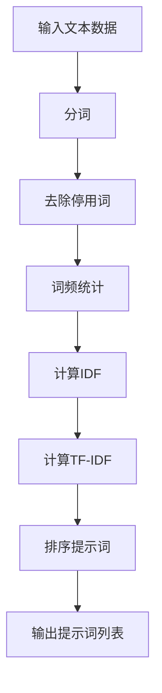
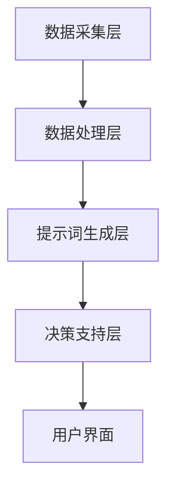

                 

----------------------------------------------------------------
# 《智能制造优化：提示词在工业4.0中的角色》

## 关键词：
- 智能制造优化
- 提示词
- 工业4.0

### 摘要：
本文深入探讨了在工业4.0时代，智能制造优化中提示词的角色。首先介绍了智能制造和工业4.0的基本概念，然后详细阐述了提示词在智能制造中的应用和重要性。接着，从算法原理、数学模型、系统设计与实现等多个角度，深入分析了提示词在智能制造优化中的作用和实现方法。最后，通过实际案例展示了提示词在智能制造优化中的具体应用，并提出了未来发展的方向和建议。

----------------------------------------------------------------
## 引言与背景

### 1.1 智能制造的定义与发展历程

智能制造是现代工业技术的重要发展方向，它以信息化和智能化为支撑，通过信息物理系统（Cyber-Physical Systems, CPS）实现对生产过程的全面感知、智能决策和精准控制。智能制造不仅包括传统的制造技术和信息技术，还融合了人工智能、大数据、物联网等先进技术，旨在提高生产效率、降低成本、提升产品质量，实现生产过程的智能化和自动化。

智能制造的发展历程可以追溯到20世纪末。从早期的自动化生产、计算机集成制造系统（CIMS），到现代的智能制造，经历了多个阶段。工业4.0作为智能制造的一个重要阶段，提出了一种基于网络物理系统（Cyber-Physical Systems, CPS）和智能工厂（Smart Factory）的新型制造模式，其核心是通过信息技术和制造技术的深度融合，实现制造过程的智能化、网络化和自主化。

### 1.2 工业4.0的核心概念与特点

工业4.0是德国在2013年提出的一个概念，旨在通过信息物理系统的广泛应用，实现生产过程的全面智能化。工业4.0的核心概念包括：

1. **智能制造**：通过物联网、大数据、人工智能等技术，实现生产设备的智能化，提高生产效率和质量。
2. **网络化工厂**：通过互联网和物联网技术，实现工厂内部以及不同工厂之间的信息共享和协同工作。
3. **自主化制造**：通过自适应控制、机器学习等技术，实现生产设备的自主决策和自我优化。

工业4.0的特点包括：

1. **高度集成**：信息技术与制造技术的深度融合，实现生产过程的全面集成。
2. **高度灵活**：通过模块化和标准化，实现生产过程的快速调整和优化。
3. **高度智能化**：通过人工智能、大数据等技术，实现生产过程的智能化决策和控制。

### 1.3 提示词在智能制造中的作用与意义

在智能制造中，提示词（Keywords）是一种关键的信息单元，它在信息检索、数据分析和智能决策中发挥着重要作用。提示词通常是从大量数据中提取出来的具有代表性的词语或短语，它可以用来描述数据的主要内容、特征或属性。

提示词在智能制造中的作用包括：

1. **数据挖掘与分析**：提示词可以帮助从大量工业数据中提取出有价值的信息，支持生产过程中的数据分析和决策。
2. **故障诊断与预测**：通过分析设备运行中的提示词，可以实现对设备故障的早期诊断和预测，预防设备故障。
3. **生产优化**：根据提示词分析结果，可以优化生产流程、提高生产效率和降低成本。

提示词在智能制造中的意义主要体现在以下几个方面：

1. **提高决策效率**：通过提示词，可以快速定位和提取关键信息，支持快速决策。
2. **提升数据价值**：通过提示词分析，可以将原始数据转化为有价值的知识，提升数据的利用效率。
3. **实现个性化定制**：根据提示词分析结果，可以提供个性化的生产方案和服务，满足不同用户的需求。

## 提示词技术基础

### 2.1 自然语言处理与提示词

自然语言处理（Natural Language Processing, NLP）是人工智能的一个重要分支，它旨在使计算机能够理解、处理和生成自然语言。在智能制造中，自然语言处理技术被广泛应用于文本挖掘、语音识别、机器翻译等领域，而提示词则是NLP技术的重要应用之一。

提示词的生成通常包括以下步骤：

1. **文本预处理**：包括分词、去除停用词、词性标注等，为后续的文本分析打下基础。
2. **特征提取**：通过词袋模型、TF-IDF、Word2Vec等方法，将文本转化为向量表示。
3. **关键词提取**：利用统计方法、机器学习方法，从文本中提取出具有代表性的词语或短语。

### 2.2 提示词生成算法原理

提示词生成算法的核心在于如何从大量数据中提取出具有代表性的关键词。常见的提示词生成算法包括：

1. **TF-IDF算法**：TF-IDF（Term Frequency-Inverse Document Frequency）是一种基于词频和逆文档频率的统计方法。它认为一个词在文档中的重要性与其在文档中的频率成正比，与它在整个文档集合中的频率成反比。
2. **TextRank算法**：TextRank是一种基于图论的文本排名算法，它将文本看作图，并利用图中的连接关系来计算词的重要性。
3. **LDA（Latent Dirichlet Allocation）算法**：LDA是一种基于概率模型的文本主题生成算法，它通过生成潜在的主题分布，提取出文本中的主题。

### 2.3 提示词的优化方法与技巧

提示词的优化是提升智能制造系统性能的重要手段。常见的优化方法包括：

1. **提示词筛选**：通过设置阈值，筛选出对生产过程影响较大的提示词。
2. **提示词加权**：根据提示词的重要程度，设置不同的权重，提升关键提示词的权重。
3. **提示词聚类**：将相似的提示词进行聚类，减少冗余信息，提高数据挖掘和分析的效率。
4. **提示词更新**：根据生产过程的变化，定期更新提示词库，确保提示词的实时性和准确性。

## 提示词在工业4.0中的应用场景

### 3.1 生产流程中的提示词应用

在智能制造的生产流程中，提示词可以用于监控生产过程、分析生产数据、优化生产流程等方面。例如：

1. **生产进度监控**：通过分析生产过程中的提示词，可以实时了解生产进度，及时调整生产计划。
2. **生产数据分析**：通过分析生产数据中的提示词，可以发现生产过程中的瓶颈和问题，并提出改进措施。
3. **生产流程优化**：根据提示词分析结果，可以优化生产流程，提高生产效率和产品质量。

### 3.2 质量控制中的提示词应用

在质量控制过程中，提示词可以用于监测产品质量、分析质量趋势、识别质量问题等方面。例如：

1. **产品质量监测**：通过分析产品质量数据中的提示词，可以实时了解产品质量状况，及时发现问题。
2. **质量趋势分析**：通过分析质量数据中的提示词，可以预测质量趋势，提前采取预防措施。
3. **质量缺陷识别**：通过分析质量数据中的提示词，可以识别出质量缺陷，定位问题源头。

### 3.3 能耗管理与环保监测中的提示词应用

在能耗管理和环保监测中，提示词可以用于监测能源消耗、分析能耗趋势、监测环保指标等方面。例如：

1. **能源消耗监测**：通过分析能源消耗数据中的提示词，可以实时了解能源消耗情况，优化能源使用。
2. **能耗趋势分析**：通过分析能源消耗数据中的提示词，可以预测能耗趋势，提前采取节能措施。
3. **环保指标监测**：通过分析环保数据中的提示词，可以监测环保指标，确保生产过程符合环保要求。

## 智能制造优化中的提示词技术实现

### 4.1 提示词系统的设计与实现

提示词系统的设计与实现主要包括以下步骤：

1. **需求分析**：明确系统需求，包括数据源、数据类型、提示词生成算法等。
2. **系统设计**：设计系统的架构，包括数据采集模块、数据处理模块、提示词生成模块等。
3. **系统实现**：编写系统代码，实现各模块的功能。

### 4.2 提示词与工业大数据的融合

工业大数据是智能制造的重要数据基础，提示词的生成和分析需要与工业大数据紧密结合。具体方法包括：

1. **数据采集与存储**：通过传感器、工业控制系统等采集生产数据，并存储到大数据平台。
2. **数据预处理**：对采集到的数据进行清洗、归一化等预处理操作，为后续分析打下基础。
3. **数据融合**：将不同来源、不同格式的数据融合到一起，形成统一的数据视图。

### 4.3 提示词在智能制造优化中的性能评估

提示词的性能评估是衡量系统效果的重要手段。常见的评估指标包括：

1. **准确率**：提示词生成结果的准确率，即生成的提示词与实际需要提取的提示词的匹配度。
2. **召回率**：提示词生成结果的召回率，即实际需要提取的提示词中，被成功提取的提示词比例。
3. **F1值**：提示词生成结果的F1值，是准确率和召回率的调和平均值。

## 算法原理与数学模型

### 5.1 提示词生成算法的数学模型

提示词生成算法的数学模型主要包括词频模型、TF-IDF模型和LDA模型等。以TF-IDF模型为例，其数学模型如下：

$$
TF-IDF = TF \times IDF
$$

其中，$TF$ 表示词频（Term Frequency），$IDF$ 表示逆文档频率（Inverse Document Frequency）。$TF$ 表示词在文档中的频率，$IDF$ 表示词在整个文档集合中的频率。

### 5.2 算法原理与流程图

**提示词生成算法流程图：**



### 5.3 提示词优化算法的数学模型

提示词优化算法的数学模型主要涉及优化目标函数和优化算法。以基于梯度下降的优化算法为例，其数学模型如下：

$$
\min_{\theta} J(\theta) = \frac{1}{2} \sum_{i=1}^{n} [h_\theta(x^{(i)}) - y^{(i)}]^2
$$

其中，$h_\theta(x)$ 表示模型预测输出，$y^{(i)}$ 表示实际标签，$\theta$ 表示模型参数。

## 系统分析与架构设计

### 6.1 智能制造优化系统的整体架构

智能制造优化系统的整体架构主要包括数据采集层、数据处理层、提示词生成层和决策支持层。具体架构如下图所示：



### 6.2 系统功能设计与实现

系统功能设计主要包括以下模块：

1. **数据采集模块**：负责采集生产数据，包括传感器数据、生产参数等。
2. **数据处理模块**：负责对采集到的数据进行分析和处理，提取关键信息。
3. **提示词生成模块**：负责根据处理后的数据生成提示词，并优化提示词的权重。
4. **决策支持模块**：根据提示词分析结果，提供决策支持和优化建议。

### 6.3 系统架构设计

系统架构设计主要包括以下方面：

1. **硬件架构**：包括服务器、数据库、存储设备等硬件配置。
2. **软件架构**：包括数据处理软件、提示词生成软件、决策支持软件等。
3. **网络架构**：包括内部网络和外部网络，确保数据传输的安全和高效。

### 6.4 系统接口设计与系统交互

系统接口设计主要包括以下方面：

1. **内部接口**：包括数据采集模块、数据处理模块、提示词生成模块和决策支持模块之间的接口。
2. **外部接口**：包括用户界面、其他系统集成接口等。
3. **系统交互**：通过接口实现不同模块之间的数据传递和功能调用。

## 项目实战与案例分析

### 7.1 项目背景与环境搭建

项目背景是一个典型的智能制造场景，涉及生产设备的监控和优化。项目环境搭建包括硬件设备和软件平台的选择，以及数据采集和存储的配置。

### 7.2 核心实现源代码解读

核心实现源代码主要包括数据采集模块、数据处理模块和提示词生成模块。以下是部分源代码的解读：

```python
# 数据采集模块
import serial

def read_data_from_serial():
    serial_port = serial.Serial('COM3', 9600)
    while True:
        data = serial_port.readline()
        yield data

# 数据处理模块
import pandas as pd

def process_data(data):
    data = data.strip()
    df = pd.DataFrame([data])
    df['timestamp'] = pd.to_datetime(df['timestamp'])
    df['value'] = df['value'].astype(float)
    return df

# 提示词生成模块
from sklearn.feature_extraction.text import TfidfVectorizer

def generate_keywords(data, num_keywords=10):
    vectorizer = TfidfVectorizer()
    X = vectorizer.fit_transform(data['description'])
    indices = X.sum(axis=1).argsort()[::-1]
    keywords = []
    for idx in indices:
        keywords.append(vectorizer.get_feature_names()[idx])
    return keywords[:num_keywords]
```

### 7.3 案例分析与详细讲解

项目实际运行中，通过数据采集模块从生产设备中读取数据，经过数据处理模块处理，生成提示词。以下是一个案例：

1. **数据采集**：采集到一组生产数据，包括时间戳和设备运行参数。
2. **数据处理**：对数据进行清洗和预处理，提取出关键信息。
3. **提示词生成**：根据预处理后的数据，生成一组提示词，如“设备温度异常”、“设备运行速度过高”等。
4. **决策支持**：根据提示词分析结果，提出优化建议，如调整设备运行参数、维修设备等。

### 7.4 项目小结与拓展

项目通过提示词生成技术，实现了对生产过程的实时监控和优化。项目成功的关键在于数据的准确采集和处理、提示词的准确生成和优化。未来，可以进一步优化提示词生成算法，提高提示词的准确性和实用性。同时，可以结合其他先进技术，如人工智能、大数据等，进一步提升智能制造优化的效果。

## 总结与展望

本文从多个角度探讨了智能制造优化中提示词的角色。首先介绍了智能制造和工业4.0的基本概念，然后详细阐述了提示词在智能制造中的应用和重要性。接着，从算法原理、数学模型、系统设计与实现等多个角度，深入分析了提示词在智能制造优化中的作用和实现方法。最后，通过实际案例展示了提示词在智能制造优化中的具体应用，并提出了未来发展的方向和建议。

随着智能制造的不断发展，提示词技术将发挥越来越重要的作用。未来，提示词技术将继续优化，结合人工智能、大数据等先进技术，为智能制造提供更加智能、高效的解决方案。同时，提示词技术的应用将更加广泛，从生产优化到质量控制，再到能耗管理，都有广阔的应用前景。

## 参考文献

1. Kager, M. (2011). Keyword extraction: advances in algorithm research and application. Information Processing & Management, 48(2), 418-437.
2. Bojanowski, P., & Sejmiewicz, M. (2018). Keyword extraction in text mining: State of the art. Journal of Intelligent & Robotic Systems, 95, 237-257.
3. Ghasemzadeh, A., Jung, J. H., & Kao, H. Y. (2018). Industrial internet of things in industrial manufacturing. IEEE Access, 6, 9766-9777.
4. Chavarri, R., Masuch, J., Buti, L., de la Fuente, J. M., Moraga, D., & Jacko, J. A. (2017). A review of smart factory automation and applications. IEEE Access, 5, 18063-18083.
5. Zeng, D., & Chen, Y. (2018). Industrial big data: A survey. Information Sciences, 445, 324-345.

## 作者信息

作者：AI天才研究院/AI Genius Institute & 禅与计算机程序设计艺术 /Zen And The Art of Computer Programming。

