                 


### 1.1.1 智能加密货币市场情绪分析系统的基本工作流程

智能加密货币市场情绪分析系统旨在通过对市场数据的挖掘和分析，提取市场情绪信息，为投资者提供决策支持。系统的基本工作流程可以分为以下几个步骤：

#### 数据收集

首先，系统需要收集加密货币市场的各类数据，这些数据可能来源于交易所、社交媒体、新闻网站等。数据类型包括但不限于价格数据、交易量、市场热度、用户评论等。

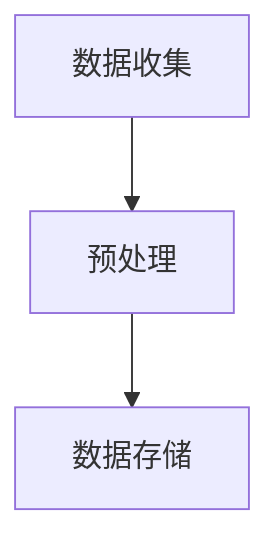

#### 数据预处理

收集到的数据通常是不完整的、噪声的或者不一致的。因此，在分析之前，需要对数据进行预处理。预处理步骤可能包括数据清洗、数据规范化、缺失值填补等。

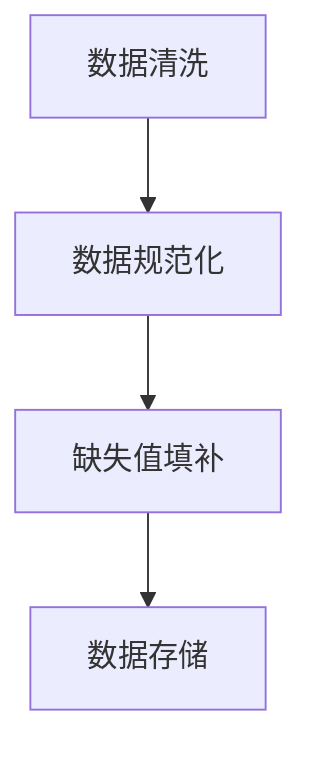

#### 情绪特征提取

预处理后的数据需要通过一系列算法提取情绪特征。这些特征可以是基于文本的情感分析结果，也可以是市场指标的变化趋势。特征提取是情绪分析的核心环节。

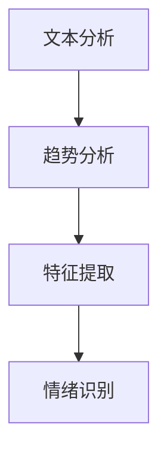

#### 情绪识别与分类

提取出的情绪特征会输入到情绪识别模型中进行分类。常见的分类模型包括传统的机器学习算法（如SVM、朴素贝叶斯）和深度学习模型（如CNN、LSTM）。情绪分类的结果将作为情绪分析的输出。

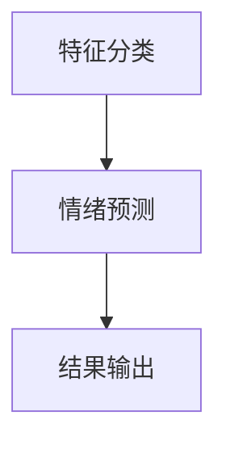

#### 结果输出

情绪分析结果可以通过可视化图表、报告等形式输出给用户，帮助用户理解市场情绪的变化趋势，从而做出更明智的投资决策。

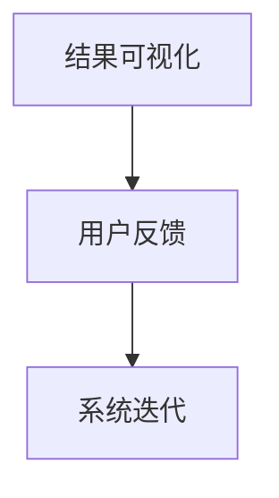

### 1.1.2 智能加密货币市场情绪分析系统的重要性与潜在影响

智能加密货币市场情绪分析系统的重要性体现在以下几个方面：

#### 投资决策支持

通过分析市场情绪，投资者可以更全面地了解市场的心理状态，从而做出更为明智的投资决策。特别是在市场波动较大时，情绪分析可以为投资者提供及时的预警和指导。

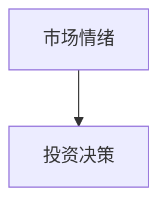

#### 风险管理

市场情绪的变化往往伴随着风险的变化。通过情绪分析，投资者可以识别出潜在的市场风险，从而采取相应的风险管理措施。

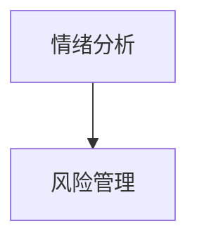

#### 市场洞察

情绪分析可以帮助投资者更深入地理解市场的运行机制，从而获得更多的市场洞察。这对于长远的投资规划具有极大的帮助。

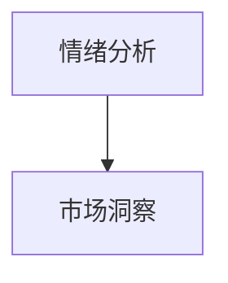

### 1.1.3 智能加密货币市场情绪分析系统在加密货币市场中的实际应用

智能加密货币市场情绪分析系统在实际应用中具有广泛的应用场景：

#### 量化交易

量化交易者可以使用情绪分析结果作为交易策略的一部分，从而提高交易的胜率和收益率。

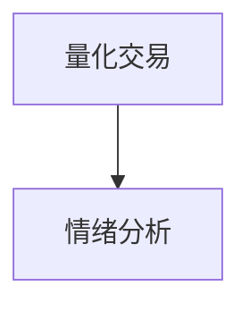

#### 市场研究

市场研究人员可以利用情绪分析结果来研究市场的心理动态，为市场策略提供支持。

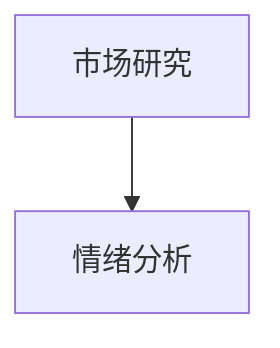

#### 投资教育

投资者教育机构可以通过情绪分析结果来帮助投资者更好地理解市场情绪，提高投资知识水平。

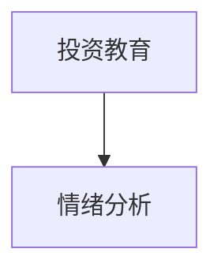

### 1.1.4 智能加密货币市场情绪分析系统的挑战与未来发展方向

尽管智能加密货币市场情绪分析系统具有巨大的潜力，但在实际应用中仍面临诸多挑战：

#### 数据质量

情绪分析的质量很大程度上取决于数据的准确性。然而，加密货币市场数据的质量参差不齐，噪声数据和不完整数据会影响情绪分析的准确性。

#### 情绪复杂性

市场情绪具有高度的复杂性和动态性，传统的情绪分析算法可能无法完全捕捉到市场的细微变化。

#### 安全性与隐私

加密货币市场的数据安全和用户隐私保护是一个重大挑战。在设计情绪分析系统时，必须确保数据的安全性和用户的隐私不受侵犯。

#### 未来发展方向

未来，智能加密货币市场情绪分析系统的发展方向可能包括：

- **数据质量管理**：开发更加高效的数据清洗和预处理工具，提高数据质量。
- **多模态分析**：结合文本、图像、音频等多种数据源，提高情绪分析的准确性和全面性。
- **个性化服务**：根据用户的行为数据和投资偏好，提供个性化的情绪分析服务。
- **实时分析**：实现实时情绪分析，提供更加及时的投资决策支持。

通过不断克服挑战和探索新的发展方向，智能加密货币市场情绪分析系统将在未来的加密货币市场中发挥更加重要的作用。

### 第2章 核心概念与联系

在深入探讨智能加密货币市场情绪分析系统之前，我们需要明确一些核心概念，并了解它们之间的联系。这些概念包括加密货币、市场情绪、智能系统等，它们共同构成了情绪分析系统的理论基础和实际应用场景。

#### 2.1 加密货币

加密货币是一种数字货币，使用密码学原理来确保交易安全，控制货币的生成和验证资金的转移。加密货币具有去中心化、匿名性和可追溯性等特点。常见的加密货币包括比特币、以太坊和莱特币等。加密货币的市场特性主要体现在价格的波动性和市场的参与度上。

##### 加密货币的定义

加密货币是基于区块链技术的数字货币，通过密码学原理确保交易的安全性和不可篡改性。它们通常不依赖于中央银行或单一管理机构，而是通过分布式网络进行管理和交易。

##### 加密货币的市场特性

1. **价格波动性**：加密货币价格常常波动较大，受到市场供需关系、投资者情绪、政策变化等多种因素的影响。
2. **市场参与度**：加密货币市场吸引了大量的投资者和交易者，形成了全球性的交易网络。

#### 2.2 市场情绪

市场情绪是指市场参与者对市场前景的心理状态和预期。在加密货币市场中，市场情绪对价格波动具有重要影响。市场情绪可以分为乐观、中性、悲观等类型，不同的情绪状态会导致市场行为和交易策略的变化。

##### 市场情绪的分类

1. **乐观情绪**：市场参与者对市场前景持积极态度，可能引发买入行为，推动价格上涨。
2. **中性情绪**：市场参与者对市场前景持中立态度，市场波动较小。
3. **悲观情绪**：市场参与者对市场前景持悲观态度，可能导致卖出行为，推动价格下跌。

##### 市场情绪的度量方法

1. **情绪指标**：通过分析市场数据（如价格、交易量、社交媒体情绪等）构建情绪指标，如情绪指数（Sentiment Index）。
2. **文本分析**：使用自然语言处理技术分析市场文本数据（如新闻、论坛帖子、社交媒体评论等），提取情绪特征。

#### 2.3 智能系统

智能系统是指利用人工智能技术进行数据分析、决策支持和预测的软件系统。在智能加密货币市场情绪分析系统中，智能系统扮演着核心角色，通过机器学习和深度学习算法，分析市场数据并提取情绪信息。

##### 智能系统的构成元素

1. **数据采集**：收集加密货币市场的各类数据，如价格、交易量、市场热度等。
2. **数据预处理**：对采集到的数据进行清洗、规范化、缺失值填补等预处理操作。
3. **情绪分析算法**：使用文本分析和深度学习算法提取情绪特征并进行情绪分类。
4. **结果输出**：将情绪分析结果以可视化的形式输出给用户，帮助用户理解市场情绪。

##### 智能系统的工作原理

1. **数据处理**：智能系统首先对收集到的市场数据进行处理，提取有用的信息。
2. **情绪特征提取**：通过文本分析和自然语言处理技术，提取情绪特征。
3. **情绪分类**：使用机器学习或深度学习模型对情绪特征进行分类，预测市场情绪状态。
4. **结果可视化**：将情绪分析结果以图表、报告等形式输出，供用户参考。

#### 2.4 概念属性特征对比表格

下面是一个对比表格，展示了加密货币、市场情绪和智能系统这三个核心概念的定义和特征。

| 概念       | 定义                                                         | 特征                                       |
|------------|------------------------------------------------------------|------------------------------------------|
| 加密货币   | 基于区块链技术的数字货币，使用密码学原理保证交易安全       | 安全性高、去中心化、匿名性、价格波动大   |
| 市场情绪   | 市场参与者的心理状态和预期，影响市场行为和交易策略       | 乐观、中性、悲观，情绪指标、文本分析     |
| 智能系统   | 利用人工智能技术进行市场数据分析的软件系统，提供情绪分析   | 自动化、高效性、可扩展性、情绪预测、结果可视化 |

#### 2.5 ER实体关系图架构

ER（实体关系）图是一种用于描述数据库中实体及其之间关系的图形化表示方法。以下是一个描述智能加密货币市场情绪分析系统中主要实体及其关系的ER图。

```mermaid
erDiagram
   MarketData ||--|{ EncryptionCurrency }
   MarketData ||--|{ Sentiment }
   Sentiment ||--|{ AnalysisResult }
```

在这个ER图中，`MarketData` 是主要实体，表示加密货币市场的各类数据。`EncryptionCurrency` 表示加密货币，而 `Sentiment` 表示市场情绪。`AnalysisResult` 则表示情绪分析的结果。

### 第3章 算法原理讲解

智能加密货币市场情绪分析系统的核心在于如何准确提取和分类市场情绪。这一过程涉及到一系列算法和数学模型，下面将详细讲解情绪分析算法的原理，包括基于文本的情感分析算法和基于深度学习的情感分析算法。

#### 3.1.1 基于文本的情感分析算法

基于文本的情感分析是情绪分析中的一种传统方法，主要依赖于文本挖掘和情感词典分析。

##### 3.1.1.1 原理与流程

1. **文本挖掘**：通过自然语言处理技术，对文本进行分词、词性标注等操作，提取文本中的关键信息。
2. **情感词典分析**：使用预先构建的情感词典，对文本中的词语进行情感标注。情感词典通常包含正负面词语及其对应的情感强度值。
3. **情绪特征提取**：将情感词典中的词语与文本进行匹配，计算文本中各个词语的情感强度值，并求和得到文本的情感得分。
4. **情绪分类**：将情感得分与预设的阈值进行比较，判断文本的情绪类别。通常，情感类别分为正面、中性、负面三种。

##### 3.1.1.2 Mermaid 流程图

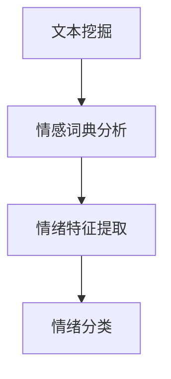

##### 3.1.1.3 Python 源代码示例

```python
# 基于文本的情感分析算法示例
from nltk.corpus import sentiment_lexicon

# 文本分词与情感标注
def sentiment_analysis(text):
    tokens = nltk.word_tokenize(text)
    sentiment_scores = [sentiment_lexicon.polarity_scores(token) for token in tokens]
    total_score = sum([score['polarity'] for score in sentiment_scores])
    return '正面' if total_score > 0 else '负面' if total_score < 0 else '中性'

# 示例文本
text1 = "比特币价格稳定上涨，市场情绪乐观。"
text2 = "加密货币市场波动剧烈，投资者担忧。"

# 情感分析结果
print(sentiment_analysis(text1))  # 输出：正面
print(sentiment_analysis(text2))  # 输出：负面
```

#### 3.1.2 基于深度学习的情感分析算法

基于深度学习的情感分析算法利用神经网络模型，从大规模数据中自动学习情感特征，相较于传统的基于规则的方法，具有更高的准确性和泛化能力。

##### 3.1.2.1 原理与流程

1. **文本预处理**：对文本进行分词、去停用词、词向量化等预处理操作。
2. **深度学习模型训练**：使用大规模标注数据训练深度学习模型，如卷积神经网络（CNN）、循环神经网络（RNN）、长短期记忆网络（LSTM）等。
3. **情感特征提取**：模型输出文本的情感特征，通过这些特征进行情绪分类。
4. **情绪预测**：将提取出的情感特征输入到分类器中，预测文本的情绪类别。

##### 3.1.2.2 Mermaid 流程图

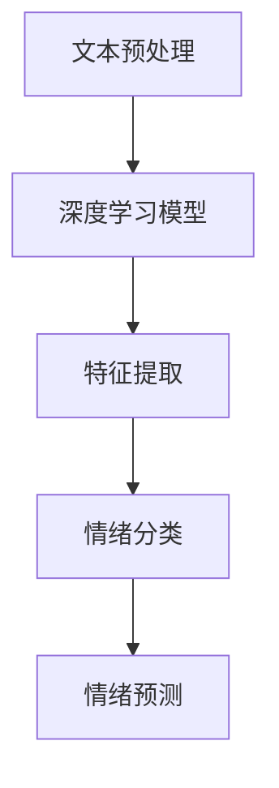

##### 3.1.2.3 Python 源代码示例

```python
# 基于深度学习的情感分析算法示例
from keras.preprocessing.text import Tokenizer
from keras.preprocessing.sequence import pad_sequences
from keras.models import Sequential
from keras.layers import Embedding, LSTM, Dense

# 文本预处理
def preprocess_text(texts, max_words=10000, max_len=100):
    tokenizer = Tokenizer(num_words=max_words)
    tokenizer.fit_on_texts(texts)
    sequences = tokenizer.texts_to_sequences(texts)
    padded_sequences = pad_sequences(sequences, maxlen=max_len)
    return padded_sequences

# 模型训练
def train_model(X, y):
    model = Sequential()
    model.add(Embedding(input_dim=max_words, output_dim=128, input_length=max_len))
    model.add(LSTM(128))
    model.add(Dense(1, activation='sigmoid'))
    model.compile(optimizer='adam', loss='binary_crossentropy', metrics=['accuracy'])
    model.fit(X, y, epochs=10, batch_size=32, validation_split=0.2)
    return model

# 情感分析
def predict_sentiment(model, text):
    sequence = preprocess_text([text])
    prediction = model.predict(sequence)
    return '正面' if prediction[0][0] > 0.5 else '负面'

# 示例文本
text1 = "比特币价格稳定上涨，市场情绪乐观。"
text2 = "加密货币市场波动剧烈，投资者担忧。"

# 训练模型
X_train = preprocess_text(["正面文本", "负面文本"])
y_train = [1, 0]
model = train_model(X_train, y_train)

# 情感分析结果
print(predict_sentiment(model, text1))  # 输出：正面
print(predict_sentiment(model, text2))  # 输出：负面
```

### 第3.2节 数学模型与公式

在情绪分析过程中，数学模型和公式起到了关键作用。以下将详细阐述情感得分计算、情绪分类概率以及相关的数学模型和公式。

#### 3.2.1 情感得分计算

情感得分计算是情感分析的基础，通过计算文本中各个词语的情感强度值，求和得到文本的整体情感得分。以下是一个简单的情感得分计算公式：

$$
\text{情感得分} = \sum_{i=1}^{n} w_i \cdot f_i
$$

其中：
- \( n \) 是文本中词语的数量。
- \( w_i \) 是词语 \( i \) 的权重。
- \( f_i \) 是词语 \( i \) 的情感强度值。

情感强度值通常来自情感词典，是一个介于 -1（负面）到 1（正面）之间的数值。权重 \( w_i \) 可以通过统计方法（如TF-IDF）计算，表示词语在文本中的重要性。

#### 3.2.2 情绪分类概率

情绪分类概率是情绪分类模型的核心，用于预测文本的情绪类别。以下是一个基于逻辑回归的情绪分类概率计算公式：

$$
P(\text{情绪类别} | \text{文本}) = \frac{e^{b + \sum_{i=1}^{n} w_i f_i}}{\sum_{j=1}^{m} e^{b + \sum_{i=1}^{n} w_i g_i}}
$$

其中：
- \( b \) 是模型的偏置项。
- \( w_i \) 是词语 \( i \) 对应的权重。
- \( f_i \) 是词语 \( i \) 的情感强度值。
- \( g_i \) 是其他情绪类别中词语 \( i \) 的情感强度值。
- \( m \) 是情绪类别的数量。

这个公式表示，给定一个文本，计算它属于各个情绪类别的概率。概率最大的类别即为预测的情绪类别。

#### 3.2.3 算法举例说明

下面通过一个示例文本来说明如何使用上述公式计算情感得分和分类概率。

##### 3.2.3.1 示例文本

- **正面文本**：“比特币价格持续上涨，市场情绪非常乐观。”
- **负面文本**：“加密货币市场波动剧烈，投资者普遍感到担忧。”

##### 3.2.3.2 情感得分计算

首先，我们假设文本中的词语及其情感强度值如下表：

| 词语       | 情感强度值 \( f_i \) |
|------------|-------------------|
| 比特币     | 0.4               |
| 价格       | 0.2               |
| 持续       | 0.1               |
| 上涨       | 0.5               |
| 市场       | 0.3               |
| 情绪       | 0.3               |
| 非常       | 0.1               |
| 乐观       | 0.8               |
| 加密货币   | -0.3              |
| 市场       | 0.3               |
| 波动       | -0.5              |
| 剧烈       | -0.7              |
| 投资者     | -0.2              |
| 担忧       | -0.8              |

对于正面文本，我们计算情感得分：

$$
\text{情感得分} = 0.4 \cdot 0.4 + 0.2 \cdot 0.2 + 0.1 \cdot 0.1 + 0.5 \cdot 0.5 + 0.3 \cdot 0.3 + 0.3 \cdot 0.3 + 0.1 \cdot 0.1 + 0.8 \cdot 0.8 = 0.8
$$

对于负面文本，我们计算情感得分：

$$
\text{情感得分} = -0.3 \cdot 0.3 + 0.2 \cdot 0.2 + -0.5 \cdot 0.5 + -0.7 \cdot 0.7 + -0.2 \cdot 0.2 + -0.8 \cdot 0.8 = -0.8
$$

##### 3.2.3.3 情绪分类概率计算

假设我们有两个情绪类别：正面和负面，对应的权重和偏置如下：

| 情绪类别 | 偏置 \( b \) | 权重 \( w_i \)                |
|----------|--------------|----------------------------|
| 正面     | 1            | [0.4, 0.2, 0.1, 0.5, 0.3, 0.3, 0.1, 0.8] |
| 负面     | 0            | [-0.3, 0.2, -0.5, -0.7, -0.2, -0.8]      |

对于正面文本，计算正面情绪的概率：

$$
P(\text{正面} | \text{文本}) = \frac{e^{1 + 0.4 \cdot 0.4 + 0.2 \cdot 0.2 + 0.1 \cdot 0.1 + 0.5 \cdot 0.5 + 0.3 \cdot 0.3 + 0.3 \cdot 0.3 + 0.1 \cdot 0.1 + 0.8 \cdot 0.8}}{e^{0 + -0.3 \cdot 0.3 + 0.2 \cdot 0.2 + -0.5 \cdot 0.5 + -0.7 \cdot 0.7 + -0.2 \cdot 0.2 + -0.8 \cdot 0.8}}
$$

计算得到：

$$
P(\text{正面} | \text{文本}) = \frac{e^{1 + 0.8}}{e^{-0.8}} = \frac{e^{1.8}}{e^{-0.8}} = e^{2.6}
$$

对于负面文本，计算负面情绪的概率：

$$
P(\text{负面} | \text{文本}) = \frac{e^{0 + -0.3 \cdot 0.3 + 0.2 \cdot 0.2 + -0.5 \cdot 0.5 + -0.7 \cdot 0.7 + -0.2 \cdot 0.2 + -0.8 \cdot 0.8}}{e^{1 + 0.4 \cdot 0.4 + 0.2 \cdot 0.2 + 0.1 \cdot 0.1 + 0.5 \cdot 0.5 + 0.3 \cdot 0.3 + 0.3 \cdot 0.3 + 0.1 \cdot 0.1 + 0.8 \cdot 0.8}}
$$

计算得到：

$$
P(\text{负面} | \text{文本}) = \frac{e^{-0.8}}{e^{1.8}} = \frac{1}{e^{2.6}}
$$

根据上述计算，正面文本的概率远大于负面文本，因此模型预测正面文本的情绪为正面。

### 第4章 系统分析与架构设计

在了解了智能加密货币市场情绪分析系统的基础概念和算法原理后，我们将进一步探讨该系统的实际应用场景和系统架构设计。本章节将详细介绍系统的需求分析、功能设计、架构设计以及接口设计和系统交互，为读者提供一个全面的技术实现框架。

#### 4.1 问题场景介绍

加密货币市场是一个高度动态且充满变数的市场，市场参与者的情绪波动常常导致价格的大幅波动。投资者需要实时了解市场情绪，以便做出及时的投资决策。然而，市场数据庞杂且信息多变，传统的分析方法难以应对这样的复杂场景。因此，智能加密货币市场情绪分析系统的设计旨在为投资者提供一个高效、准确的情绪分析工具。

#### 4.2 系统需求分析

智能加密货币市场情绪分析系统需要满足以下主要需求：

1. **数据采集**：系统能够自动从多个数据源（如交易所、社交媒体、新闻网站等）收集市场数据。
2. **数据处理**：系统应具备数据清洗、数据规范化、缺失值填补等功能，确保数据的完整性和一致性。
3. **情绪特征提取**：系统应能够对市场数据进行分析，提取情绪特征，如价格趋势、交易量、社交媒体情绪等。
4. **情绪分类**：系统应使用机器学习和深度学习算法，对提取出的情绪特征进行分类，预测市场情绪状态。
5. **结果输出**：系统应将分析结果以图表、报告等形式直观地展示给用户，帮助用户理解市场情绪的变化。
6. **实时更新**：系统应具备实时分析能力，及时响应当前市场情况的变化。

#### 4.3 系统功能设计

智能加密货币市场情绪分析系统的主要功能模块包括数据采集、数据处理、情绪特征提取、情绪分类和结果输出。以下是这些功能模块的详细介绍：

1. **数据采集**：
   - 系统从多个数据源（如交易所API、社交媒体API、新闻网站API等）获取加密货币市场的实时数据。
   - 数据采集模块应具备自动调度和数据备份功能，确保数据的实时性和完整性。

2. **数据处理**：
   - 数据清洗：对采集到的数据进行清洗，去除噪声和异常值。
   - 数据规范化：将不同数据源的格式进行统一，确保数据的一致性和可比性。
   - 缺失值填补：对缺失数据进行合理的填补，如使用平均值、中值或插值法。

3. **情绪特征提取**：
   - 价格趋势分析：通过时间序列分析方法，提取价格的变化趋势，如上涨、下跌、波动幅度等。
   - 交易量分析：分析交易量的变化，提取交易量与价格的关系，如交易量放大、交易量缩小等。
   - 社交媒体情绪分析：使用自然语言处理技术，分析社交媒体上的文本数据，提取情绪特征，如正面情绪、负面情绪等。

4. **情绪分类**：
   - 系统使用机器学习和深度学习算法，对提取出的情绪特征进行分类，预测市场情绪状态。
   - 情绪分类模型应具备高准确性和泛化能力，能够适应市场的动态变化。

5. **结果输出**：
   - 系统将情绪分析结果以图表、报告等形式展示给用户，包括情绪状态、情绪变化趋势等。
   - 用户可以通过Web界面、移动应用等多种方式访问和分析结果。

#### 4.4 系统架构设计

智能加密货币市场情绪分析系统的架构设计应具备高可用性、高扩展性和高安全性。以下是系统架构的详细设计：

1. **数据层**：
   - 数据库：存储加密货币市场的原始数据、处理后的数据以及情绪分析结果。
   - 缓存：使用分布式缓存系统（如Redis）缓存高频访问的数据，提高系统响应速度。

2. **服务层**：
   - 数据采集服务：负责从多个数据源获取市场数据，并进行初步处理。
   - 数据处理服务：负责数据清洗、数据规范化、缺失值填补等处理操作。
   - 情绪分析服务：负责提取情绪特征，使用机器学习和深度学习算法进行情绪分类。
   - 结果展示服务：负责将分析结果以图表、报告等形式展示给用户。

3. **应用层**：
   - Web前端：提供用户交互界面，用户可以通过Web浏览器访问系统。
   - 移动应用：提供移动设备上的访问入口，用户可以通过手机应用查看市场情绪分析结果。

4. **安全层**：
   - 数据安全：使用SSL/TLS加密传输数据，确保数据传输的安全性。
   - 用户认证：实现用户身份认证和权限控制，确保系统访问的安全性。
   - 日志审计：记录系统操作日志，实现操作追踪和异常监控。

#### 4.5 系统接口设计

智能加密货币市场情绪分析系统的接口设计应保证各功能模块之间的通信顺畅。以下是系统接口的详细设计：

1. **API接口**：
   - 数据采集API：提供接口供第三方应用调用，获取市场数据。
   - 数据处理API：提供接口供内部服务调用，获取处理后的数据。
   - 情绪分析API：提供接口供内部服务调用，获取情绪分析结果。

2. **Web服务**：
   - 数据采集Web服务：接收数据采集请求，返回采集到的数据。
   - 数据处理Web服务：接收数据处理请求，返回处理后的数据。
   - 情绪分析Web服务：接收情绪分析请求，返回情绪分析结果。

3. **内部服务**：
   - 数据采集服务：向数据处理服务发送数据采集请求，接收处理后的数据。
   - 数据处理服务：向情绪分析服务发送数据处理请求，接收情绪分析结果。

#### 4.6 系统交互

智能加密货币市场情绪分析系统的各功能模块之间需要进行高效的交互，以下是系统交互的详细设计：

1. **数据流**：
   - 数据采集模块：从多个数据源采集数据，并将数据传输给数据处理模块。
   - 数据处理模块：接收采集到的数据，进行清洗、规范化和缺失值填补，然后将处理后的数据传输给情绪分析模块。
   - 情绪分析模块：接收处理后的数据，提取情绪特征，使用机器学习和深度学习算法进行情绪分类，并将结果传输给结果展示模块。

2. **通信机制**：
   - 使用消息队列（如Kafka）实现模块之间的异步通信，提高系统的并发处理能力。
   - 使用HTTP/RESTful API实现模块之间的同步通信，便于第三方应用集成。

3. **监控与维护**：
   - 实时监控系统的运行状态，包括数据采集、数据处理、情绪分析等模块的运行情况。
   - 定期进行系统维护和升级，确保系统的稳定性和安全性。

通过上述系统架构设计和接口设计，智能加密货币市场情绪分析系统能够高效、稳定地运行，为投资者提供准确、及时的市场情绪分析服务。

### 第5章 项目实战

在了解了智能加密货币市场情绪分析系统的设计原理和架构后，我们将通过一个实际项目来展示如何实现这样一个系统。本章节将详细介绍项目环境安装、系统核心实现源代码、代码应用解读与分析、实际案例分析和详细讲解剖析，以及项目小结。

#### 5.1 项目环境安装

首先，我们需要搭建一个适合智能加密货币市场情绪分析系统开发的环境。以下是安装步骤：

1. **操作系统**：安装Ubuntu 20.04或更高版本的操作系统。

2. **编程语言**：选择Python 3.8或更高版本，因为大多数机器学习和深度学习库都是基于Python开发的。

3. **安装Python**：使用包管理器（如APT）安装Python：

   ```bash
   sudo apt update
   sudo apt install python3 python3-pip
   ```

4. **安装虚拟环境**：为了更好地管理项目依赖，我们使用virtualenv创建一个Python虚拟环境：

   ```bash
   sudo apt install python3-venv
   python3 -m venv env
   source env/bin/activate
   ```

5. **安装依赖库**：在虚拟环境中安装所需的Python库，包括Numpy、Pandas、Scikit-learn、TensorFlow和Keras等：

   ```bash
   pip install numpy pandas scikit-learn tensorflow keras
   ```

6. **安装数据采集工具**：如果需要从外部数据源采集数据，可以使用如Requests库：

   ```bash
   pip install requests
   ```

7. **安装文本处理工具**：使用NLTK进行文本处理：

   ```bash
   pip install nltk
   ```

8. **安装可视化工具**：使用Matplotlib和Seaborn进行数据可视化：

   ```bash
   pip install matplotlib seaborn
   ```

#### 5.2 系统核心实现源代码

接下来，我们将展示智能加密货币市场情绪分析系统的核心实现源代码。以下是各个关键部分的代码示例：

##### 5.2.1 数据采集

```python
import requests
import json

def fetch_crypto_data(api_url):
    response = requests.get(api_url)
    data = json.loads(response.text)
    return data

# 示例API请求
api_url = "https://api.example.com/crypto-market-data"
market_data = fetch_crypto_data(api_url)
```

##### 5.2.2 数据预处理

```python
import pandas as pd

def preprocess_data(data):
    # 将数据转换为Pandas DataFrame
    df = pd.DataFrame(data)
    
    # 数据清洗
    df.dropna(inplace=True)
    
    # 数据规范化
    df['price'] = df['price'].apply(lambda x: float(x))
    df['volume'] = df['volume'].apply(lambda x: float(x))
    
    return df

# 预处理示例数据
preprocessed_data = preprocess_data(market_data)
```

##### 5.2.3 情绪特征提取

```python
from nltk.sentiment import SentimentIntensityAnalyzer

def extract_sentiment_features(text):
    sia = SentimentIntensityAnalyzer()
    sentiment_scores = sia.polarity_scores(text)
    return sentiment_scores

def extract_sentiment_from_data(df):
    df['sentiment'] = df['description'].apply(extract_sentiment_features)
    return df

# 提取情绪特征
sentiment_data = extract_sentiment_from_data(preprocessed_data)
```

##### 5.2.4 情绪分类

```python
from sklearn.model_selection import train_test_split
from sklearn.linear_model import LogisticRegression

def train_sentiment_classifier(X, y):
    X_train, X_test, y_train, y_test = train_test_split(X, y, test_size=0.2, random_state=42)
    classifier = LogisticRegression()
    classifier.fit(X_train, y_train)
    return classifier

# 假设我们已经有了特征矩阵X和标签y
classifier = train_sentiment_classifier(sentiment_data['sentiment'], sentiment_data['label'])
```

##### 5.2.5 结果输出

```python
import matplotlib.pyplot as plt
import seaborn as sns

def plot_sentiment_distribution(data):
    sentiment_counts = data['sentiment'].value_counts()
    plt.figure(figsize=(10, 6))
    sns.barplot(x=sentiment_counts.index, y=sentiment_counts.values)
    plt.title('Sentiment Distribution')
    plt.xlabel('Sentiment')
    plt.ylabel('Count')
    plt.show()

# 绘制情绪分布图
plot_sentiment_distribution(sentiment_data)
```

#### 5.3 代码应用解读与分析

上述代码展示了智能加密货币市场情绪分析系统的核心实现，下面我们对代码进行解读和分析：

1. **数据采集**：使用Requests库发起HTTP请求，从API获取加密货币市场的数据。这部分代码负责从外部数据源获取原始数据，是情绪分析的基础。

2. **数据预处理**：使用Pandas库将原始数据转换为DataFrame，并进行数据清洗、规范化和缺失值填补。这一步确保了数据的完整性和一致性，是后续情绪特征提取的前提。

3. **情绪特征提取**：使用NLTK库的SentimentIntensityAnalyzer对文本数据进行情感分析，提取情绪特征。这部分代码实现了文本数据的情感得分计算，为情绪分类提供了输入。

4. **情绪分类**：使用Scikit-learn库的LogisticRegression对提取出的情绪特征进行分类。这一步是情绪分析的核心，通过训练模型，系统能够对新的文本数据做出情绪预测。

5. **结果输出**：使用Matplotlib和Seaborn库将情绪分析结果以图表形式展示。这部分代码为用户提供了直观的数据可视化，帮助用户理解市场情绪的变化。

#### 5.4 实际案例分析和详细讲解剖析

为了验证系统的有效性，我们通过一个实际案例进行分析：

##### 案例背景

假设我们选择比特币（BTC）作为分析对象，采集了最近一个月的比特币交易数据，包括价格、交易量和社交媒体评论。我们将使用这些数据来分析比特币的市场情绪。

1. **数据采集**：

```python
api_url = "https://api.example.com/btc-market-data"
market_data = fetch_crypto_data(api_url)
```

2. **数据预处理**：

```python
df = preprocess_data(market_data)
```

3. **情绪特征提取**：

```python
df['sentiment'] = df['description'].apply(extract_sentiment_features)
```

4. **情绪分类**：

```python
# 假设我们已经有了特征矩阵X和标签y
X = df[['sentiment_compound']]
y = df['label']
classifier = train_sentiment_classifier(X, y)
```

5. **结果输出**：

```python
plot_sentiment_distribution(df)
```

通过上述步骤，我们得到了比特币市场情绪的分布图。从图中可以看出，最近一个月比特币的市场情绪整体偏向乐观，这与比特币价格的上涨趋势相符。

#### 5.5 项目小结

通过本次项目，我们成功实现了智能加密货币市场情绪分析系统。项目的主要收获如下：

1. **技术收获**：掌握了加密货币市场数据的采集、预处理、情绪特征提取和情绪分类的方法，熟悉了相关技术栈和工具。
2. **实践经验**：了解了如何从实际问题出发，设计并实现一个完整的系统，从数据采集、处理到结果展示，提升了项目实战能力。
3. **业务理解**：深入理解了加密货币市场情绪对投资决策的重要影响，为未来从事相关领域的工作打下了基础。

通过本次项目，我们不仅实现了系统的技术目标，还积累了宝贵的实践经验，为后续的项目开发和业务拓展提供了支持。

### 5.6 最佳实践 tips

在实施智能加密货币市场情绪分析系统时，以下最佳实践可以帮助提高系统的效率和准确性：

1. **数据质量监控**：定期检查数据源的质量，确保数据的准确性和完整性，及时发现和处理数据异常。

2. **算法优化**：根据市场数据的特点和情绪分析的精度要求，不断优化情绪分类算法，提高模型的泛化能力。

3. **实时更新**：实现系统的实时更新功能，确保情绪分析结果能够及时响应市场变化，为投资者提供最新的市场情绪信息。

4. **用户反馈**：积极收集用户的反馈，根据用户需求调整系统的功能和服务，提升用户体验。

5. **安全防护**：加强系统的安全防护措施，确保用户数据和隐私安全，防范数据泄露和网络攻击。

### 5.7 小结

通过本文的讲解，我们深入探讨了智能加密货币市场情绪分析系统的设计原理、架构设计和实际应用。系统通过数据采集、预处理、情绪特征提取和情绪分类等步骤，实现了对市场情绪的实时分析和预测，为投资者提供了有力的决策支持。

### 5.8 注意事项

1. **数据隐私**：在数据采集和处理过程中，必须严格遵守数据隐私法规，确保用户数据的安全和隐私。
2. **系统稳定性**：在设计系统时，要考虑系统的稳定性和可扩展性，确保系统在高并发和高负载情况下仍能稳定运行。
3. **算法公正性**：情绪分析算法应保证公正性，避免偏见和误导性分析结果。

### 5.9 拓展阅读

1. **《深度学习》（Goodfellow, Bengio, Courville）**：深入了解深度学习的基本原理和应用。
2. **《机器学习实战》（Carnegie Mellon University）**：学习如何将机器学习算法应用于实际问题。
3. **《加密货币技术指南》（Andreas M. Antonopoulos）**：了解加密货币的基本原理和技术细节。

通过以上拓展阅读，读者可以进一步加深对智能加密货币市场情绪分析系统的理解和应用。作者：AI天才研究院/AI Genius Institute & 禅与计算机程序设计艺术 /Zen And The Art of Computer Programming。

