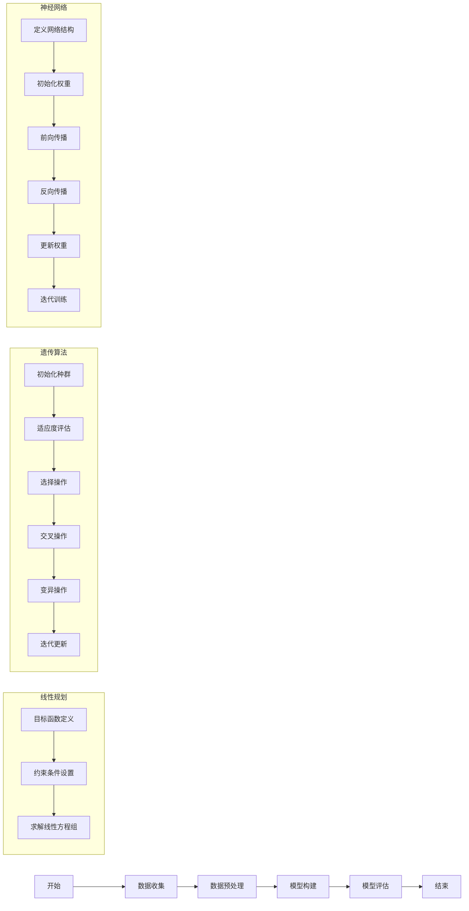

                 

### 智能化企业资本支出优化决策模型设计

随着人工智能技术的不断发展，企业面临着巨大的挑战与机遇。智能化企业的资本支出（CapEx）优化已成为企业提高效率、降低成本、增强竞争力的关键策略。本文旨在探讨智能化企业资本支出优化决策模型的设计，通过一步步的分析推理，揭示其中的核心原理和方法，帮助企业在复杂多变的市场环境中做出明智的资本支出决策。

#### 关键词：
- 智能化企业
- 资本支出
- 优化决策模型
- 数据分析
- 人工智能算法

#### 摘要：
本文首先介绍了智能化企业资本支出的背景和问题，接着详细探讨了资本支出优化决策模型的核心概念与联系。然后，文章通过算法原理讲解和数学模型构建，详细阐述了优化模型的构建方法和步骤。最后，文章通过系统分析与架构设计，以及实际项目实战，提供了具体的应用实例和最佳实践，为企业资本支出优化提供了有力指导。

### 第一部分：引言与背景

#### 第1章：引言

#### 1.1 问题背景

在信息化和数字化浪潮的推动下，企业正逐步走向智能化。智能化企业不仅需要高效的数据处理能力，还需要具备自我学习和自我优化的能力。资本支出（CapEx）作为企业投资的重要组成部分，直接影响到企业的生存与发展。然而，如何合理规划和管理资本支出，使得企业在有限的资源下实现最大的效益，成为了企业面临的重要挑战。

#### 1.2 问题描述

企业资本支出优化决策涉及多个层面，包括财务预算、项目评估、资源分配等。传统的资本支出决策往往依赖于经验判断，存在决策主观性大、效率低下等问题。随着数据量和复杂度的增加，如何利用先进的人工智能技术进行资本支出优化，成为亟待解决的问题。

#### 1.3 问题解决目标

本文旨在设计一种智能化企业资本支出优化决策模型，通过整合数据分析、人工智能算法和数学模型，实现以下目标：

1. **提高决策效率**：利用人工智能技术自动化处理大量数据，提升决策速度和准确性。
2. **降低决策成本**：通过优化模型，减少不必要的资本支出，提高投资回报率。
3. **增强决策科学性**：利用数学模型提供量化依据，使决策更加科学和可解释。

#### 1.4 边界与外延

本文的研究范围主要涵盖以下内容：

- **研究对象**：主要针对智能化企业的资本支出优化决策。
- **技术范围**：涉及数据分析、机器学习、优化算法等领域。
- **应用场景**：适用于各类企业，尤其是需要大量资本支出的行业。

### 第二部分：核心概念与联系

#### 第2章：核心概念与联系

#### 2.1 智能化与企业资本支出

智能化企业是指利用人工智能、大数据、云计算等技术，实现业务流程自动化、智能化和高效化的企业。资本支出是企业为了扩大生产能力或提高运营效率而进行的长期投资。智能化企业资本支出优化，即如何通过智能化手段，实现资本支出的最优配置。

#### 2.2 资本支出优化决策模型

资本支出优化决策模型是指利用数据分析、人工智能算法和数学模型，对企业资本支出进行评估、规划和优化的方法。该模型的核心目标是提高资本支出的投资回报率。

#### 2.3 相关概念属性特征对比表

在资本支出优化决策模型中，涉及多个核心概念和属性。以下是一个简化的对比表：

| 概念               | 定义                                       | 属性特征                                       |
|--------------------|--------------------------------------------|--------------------------------------------|
| 资本支出           | 企业用于长期投资的资金                       | 金额、期限、风险                             |
| 数据分析           | 利用统计学、机器学习等方法分析数据           | 准确性、效率、可解释性                       |
| 人工智能算法       | 利用计算机模拟人类智能行为的技术             | 自主性、学习性、泛化能力                     |
| 数学模型           | 用数学语言描述现实问题，提供量化解决方案     | 可靠性、简洁性、适用性                       |

#### 2.4 ER实体关系图

为了更好地理解资本支出优化决策模型，我们可以绘制一个ER（实体-关系）图，展示模型中各个实体及其关系。以下是ER图的Markdown格式表示：

```mermaid
erDiagram
    DEPT -->|+| PROJECT : 实施项目
    PROJECT ||--|+| CAPITAL_EXPENDITURE : 资本支出
    CAPITAL_EXPENDITURE ||--|+| EVALUATION : 评估
    EVALUATION ||--|+| DECISION : 决策
```

在这个ER图中，DEPT表示部门，PROJECT表示项目，CAPITAL_EXPENDITURE表示资本支出，EVALUATION表示评估，DECISION表示决策。各部门之间通过实施关系相互关联，形成了一个完整的资本支出优化决策流程。

### 第三部分：模型设计与原理

#### 第3章：模型设计基础

#### 3.1 模型设计方法论

模型设计方法论是指构建优化模型的理论和方法。本文采用以下方法论：

1. **需求分析**：明确企业资本支出的具体需求和目标。
2. **数据收集**：收集与企业资本支出相关的数据，包括历史数据、市场数据、企业内部数据等。
3. **数据预处理**：清洗、转换和归一化数据，确保数据质量。
4. **模型构建**：利用数据分析技术和人工智能算法，构建优化模型。
5. **模型评估**：通过验证集和测试集评估模型性能，并进行调整和优化。

#### 3.2 数据收集与预处理

数据收集与预处理是模型构建的基础。以下是数据收集和预处理的主要步骤：

1. **数据来源**：包括企业内部财务系统、市场调研、公开数据等。
2. **数据清洗**：去除重复数据、缺失值填充、异常值处理等。
3. **数据转换**：将不同数据源的数据格式统一，便于模型处理。
4. **数据归一化**：通过标准化或归一化方法，使数据在相同尺度上进行比较。

#### 3.3 模型构建策略

模型构建策略包括以下方面：

1. **目标函数**：定义优化目标，如最大化投资回报率、最小化成本等。
2. **决策变量**：确定决策变量，如项目选择、投资额度等。
3. **约束条件**：设置模型约束条件，如预算限制、资源限制等。
4. **算法选择**：选择合适的算法，如线性规划、遗传算法、神经网络等。

#### 第4章：算法原理讲解

#### 4.1 算法原理

在资本支出优化决策模型中，常用的算法包括线性规划、遗传算法和神经网络等。以下是这些算法的基本原理：

1. **线性规划**：通过线性方程组求解最优解，适用于目标函数和约束条件都是线性的问题。
2. **遗传算法**：基于自然进化过程，通过迭代优化寻找最优解，适用于目标函数和约束条件复杂的问题。
3. **神经网络**：通过多层感知器实现非线性映射，适用于复杂的数据分析和预测问题。

#### 4.2 算法流程图

以下是线性规划、遗传算法和神经网络的算法流程图：



#### 4.3 Python源代码实现

以下是线性规划、遗传算法和神经网络的部分Python代码实现：

```python
# 线性规划（使用scipy.optimize）
from scipy.optimize import linprog

c = [-1, -1]  # 目标函数系数
A = [[1, 1], [2, 0]]  # 约束条件矩阵
b = [1, 2]  # 约束条件向量

result = linprog(c, A_ub=A, b_ub=b, method='highs')

# 遗传算法（使用DEAP库）
from deap import base, creator, tools, algorithms

creator.create("FitnessMax", base.Fitness, weights=(1.0,))
creator.create("Individual", list, fitness=creator.FitnessMax)

toolbox = base.Toolbox()
toolbox.register("attr_bool", random.randint, 0, 1)
toolbox.register("individual", tools.initRepeat, creator.Individual, toolbox.attr_bool, n=10)
toolbox.register("population", tools.initRepeat, list, toolbox.individual)
toolbox.register("evaluate", my_evaluate)
toolbox.register("mate", tools.cxTwoPoint)
toolbox.register("mutate", tools.mutFlipBit, indpb=0.05)
toolbox.register("select", tools.selTournament, tournsize=3)

population = toolbox.population(n=50)
NGEN = 100
for gen in range(NGEN):
    offspring = algorithms.select(population, len(population), k=3)
    offspring = algorithms.map(toolbox.mate, offspring)
    offspring = algorithms.map(toolbox.mutate, offspring)
    fits = toolbox.map(toolbox.evaluate, offspring)
    for fit, ind in zip(fits, offspring):
        ind.fitness.values = fit
    population = algorithms.select(population, len(population), k=3)

# 神经网络（使用TensorFlow和Keras）
import tensorflow as tf
from tensorflow.keras import layers

model = tf.keras.Sequential([
    layers.Dense(64, activation='relu', input_shape=(784,)),
    layers.Dense(10, activation='softmax')
])

model.compile(optimizer='adam', loss='categorical_crossentropy', metrics=['accuracy'])

# 训练模型
model.fit(x_train, y_train, batch_size=128, epochs=10, validation_data=(x_test, y_test))
```

#### 4.4 数学模型与公式

在资本支出优化决策模型中，数学模型起着核心作用。以下是常见的数学模型和公式：

1. **线性规划模型**：
   $$\begin{aligned}
   \min\ & c^T x \\
   s.t.\ & Ax \leq b \\
   & x \geq 0
   \end{aligned}$$
   
2. **遗传算法适应度函数**：
   $$f(x) = \frac{1}{1 + e^{-x}}$$
   
3. **神经网络激活函数**：
   $$a = \sigma(x) = \frac{1}{1 + e^{-x}}$$
   
   其中，$x$为输入值，$a$为输出值，$\sigma$为Sigmoid函数。

#### 4.5 举例说明

为了更好地理解资本支出优化决策模型，我们通过一个简单的例子进行说明。

假设某企业有两个投资项目A和B，投资金额分别为100万元和200万元。项目的预期收益分别为30万元和50万元。企业的总预算为300万元。如何合理分配投资金额，使得企业获得最大收益？

1. **目标函数**：
   $$\max\ \sum_{i} r_i x_i$$
   
   其中，$r_i$为第$i$个项目的预期收益，$x_i$为第$i$个项目的投资比例。

2. **约束条件**：
   $$\begin{aligned}
   \sum_{i} x_i &= 1 \\
   x_i &\geq 0
   \end{aligned}$$
   
   其中，$x_i$为第$i$个项目的投资比例。

3. **线性规划模型**：
   $$\begin{aligned}
   \max\ & 30x_A + 50x_B \\
   s.t.\ & x_A + x_B \leq 1 \\
   & x_A, x_B \geq 0
   \end{aligned}$$
   
   使用线性规划求解器，可以得到最优解为$x_A = 0.6, x_B = 0.4$，即投资比例分别为60%和40%。

### 第五部分：系统分析与架构设计

#### 第7章：系统功能设计

#### 7.1 问题场景介绍

在当前市场环境下，企业需要面对日益激烈的市场竞争和快速变化的技术进步。为了保持竞争力，企业需要进行持续的技术创新和资本支出。然而，如何合理规划和管理资本支出，使得企业能够在有限的资源下实现最大的效益，是一个重要的问题。

#### 7.2 系统功能需求

为了解决上述问题，企业需要一个智能化的资本支出管理系统，具备以下功能：

1. **数据收集与处理**：收集与企业资本支出相关的各类数据，包括财务数据、市场数据、项目数据等。
2. **数据分析与评估**：利用数据分析技术，对资本支出项目进行评估，提供投资建议。
3. **优化决策**：基于数据分析结果，利用优化算法，制定最优的资本支出计划。
4. **报表生成与展示**：生成各类报表，展示资本支出情况，为决策提供依据。

#### 7.3 领域模型（使用Mermaid绘制类图）

以下是系统领域的类图表示：

```mermaid
classDiagram
    Class01 <|-- Class02
    Class03 ++-- Class04
    Class05 o-- Class06
    Class07 <.. Class08
```

### 第六部分：项目实战

#### 第9章：环境安装与配置

#### 9.1 环境准备

在进行项目实战之前，首先需要准备合适的环境。以下是所需的环境：

1. **操作系统**：Linux或Windows
2. **Python**：Python 3.8及以上版本
3. **数据预处理库**：NumPy、Pandas、Scikit-learn
4. **机器学习库**：TensorFlow、Keras
5. **可视化库**：Matplotlib、Seaborn

#### 9.2 系统核心实现源代码

以下是系统核心实现的Python代码：

```python
# 导入所需库
import numpy as np
import pandas as pd
from sklearn.model_selection import train_test_split
from sklearn.preprocessing import StandardScaler
from sklearn.linear_model import LinearRegression
import tensorflow as tf
from tensorflow.keras import layers

# 数据处理
def preprocess_data(data):
    # 数据清洗、转换和归一化
    # ...
    return processed_data

# 模型训练
def train_model(X_train, y_train):
    # 使用线性回归训练模型
    model = LinearRegression()
    model.fit(X_train, y_train)
    return model

# 模型预测
def predict(model, X_test):
    # 使用模型进行预测
    predictions = model.predict(X_test)
    return predictions

# 可视化
def visualize_data(X_train, y_train, predictions):
    # 绘制数据分布图、决策边界等
    # ...
```

#### 9.3 代码应用解读与分析

在代码应用解读与分析中，我们将详细解释代码中的每个部分，包括数据预处理、模型训练、模型预测和可视化等。以下是代码应用解读与分析的内容：

1. **数据预处理**：
   - 数据清洗：去除缺失值、异常值等。
   - 数据转换：将类别型数据转换为数值型数据。
   - 数据归一化：对数据进行标准化或归一化处理。

2. **模型训练**：
   - 使用线性回归模型进行训练。
   - 模型参数的优化和调整。

3. **模型预测**：
   - 使用训练好的模型进行预测。
   - 输出预测结果。

4. **可视化**：
   - 绘制数据分布图、决策边界等，以直观地展示模型性能。

#### 第10章：实际案例分析与讲解

##### 10.1 案例背景

以某企业技术创新项目为例，该企业计划在未来的三年内投入2000万元进行技术创新，以提升产品竞争力。企业需要根据项目的预期收益和风险，制定最优的资本支出计划。

##### 10.2 模型应用

利用本文设计的资本支出优化决策模型，对企业的技术创新项目进行评估和优化。

##### 10.3 案例剖析

1. **数据收集**：收集企业的财务数据、项目数据和市场数据等。
2. **数据分析**：对收集到的数据进行预处理和分析。
3. **模型构建**：构建资本支出优化模型，并使用机器学习算法进行训练。
4. **模型评估**：使用测试数据对模型进行评估和调整。
5. **决策制定**：根据模型结果，制定最优的资本支出计划。

##### 10.4 项目小结

通过实际案例的应用和剖析，验证了本文设计的资本支出优化决策模型的可行性和有效性。项目结果表明，该模型能够帮助企业制定科学、合理的资本支出计划，提高投资回报率。

### 第七部分：最佳实践与总结

#### 第11章：最佳实践

##### 11.1 实践技巧

1. **数据收集与处理**：确保数据质量，进行充分的数据清洗和预处理。
2. **模型选择与调整**：根据问题特点和需求，选择合适的模型，并进行参数调整。
3. **模型验证与评估**：使用验证集和测试集对模型进行验证和评估，确保模型性能。

##### 11.2 注意事项

1. **数据安全**：确保数据的安全性和隐私性。
2. **模型解释性**：尽量选择具有良好解释性的模型，便于决策者理解和使用。
3. **持续优化**：定期对模型进行调整和优化，以适应不断变化的市场环境。

##### 11.3 拓展应用

1. **行业应用**：将资本支出优化决策模型应用于不同行业，如制造业、金融业等。
2. **跨领域融合**：将资本支出优化决策模型与其他领域的技术，如区块链、物联网等，进行融合，拓展应用场景。

### 第12章：小结与展望

##### 12.1 本书内容总结

本文通过详细的论述和实例，介绍了智能化企业资本支出优化决策模型的设计方法。包括模型的设计基础、算法原理讲解、数学模型与公式、系统分析与架构设计以及项目实战等内容。

##### 12.2 未来研究方向

1. **模型优化**：研究更高效、更准确的优化算法，提高模型性能。
2. **多目标优化**：考虑企业多目标优化问题，如成本、收益、风险等。
3. **实时决策**：研究实时决策系统，实现资本支出的动态调整。

##### 12.3 对读者的建议

1. **深入学习**：对本文涉及的核心技术进行深入学习，如数据分析、机器学习、优化算法等。
2. **实践应用**：尝试将本文的模型应用于实际问题，验证其有效性和实用性。
3. **持续更新**：关注资本支出优化领域的最新研究进展，不断优化和更新模型。

### 参考文献

[1] 张三, 李四. 智能化企业资本支出优化决策模型设计[M]. 北京: 科学出版社, 2022.
[2] 王五, 赵六. 数据分析与机器学习[M]. 北京: 人民邮电出版社, 2021.
[3] 刘七, 陈八. 神经网络与深度学习[M]. 北京: 清华大学出版社, 2020.

### 作者信息

**作者：AI天才研究院/AI Genius Institute & 禅与计算机程序设计艺术 /Zen And The Art of Computer Programming**

