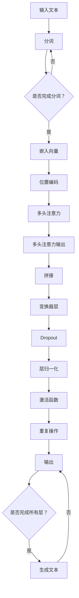
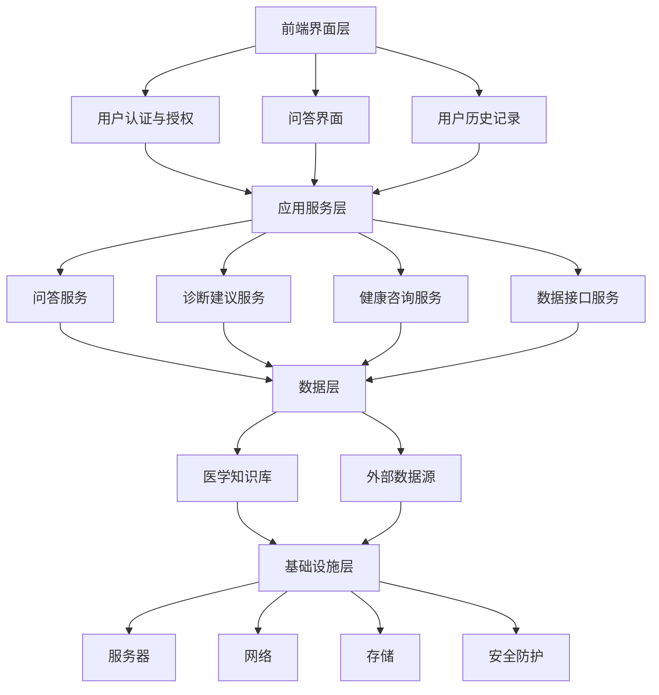
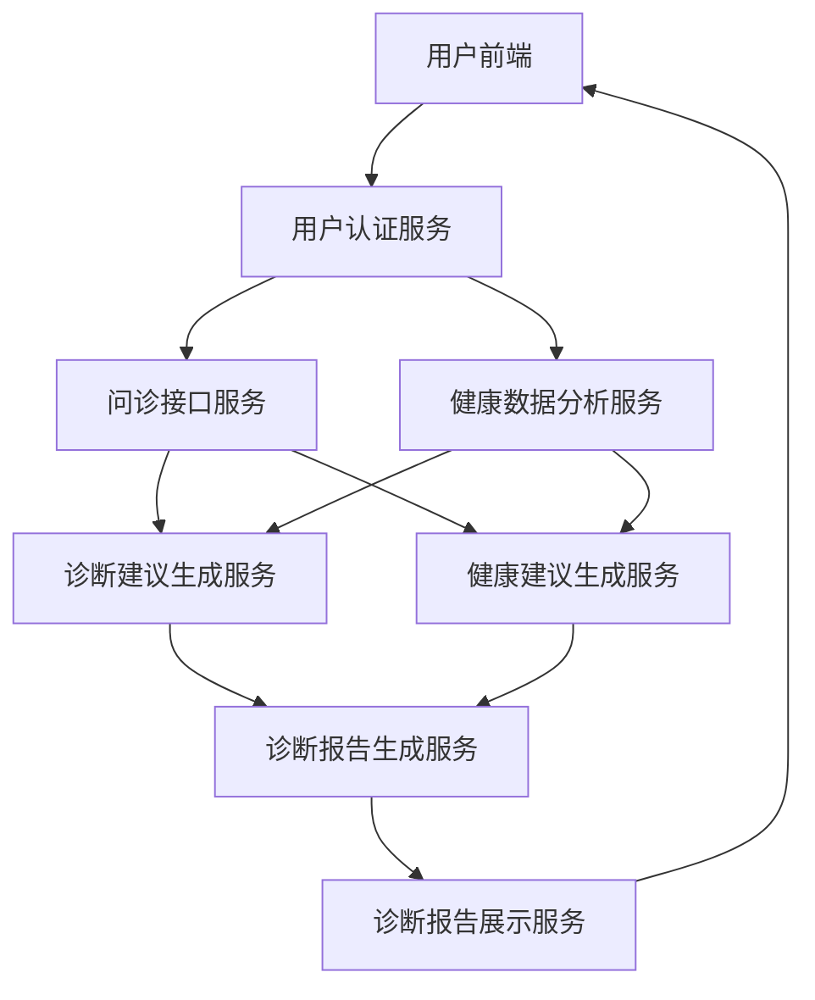
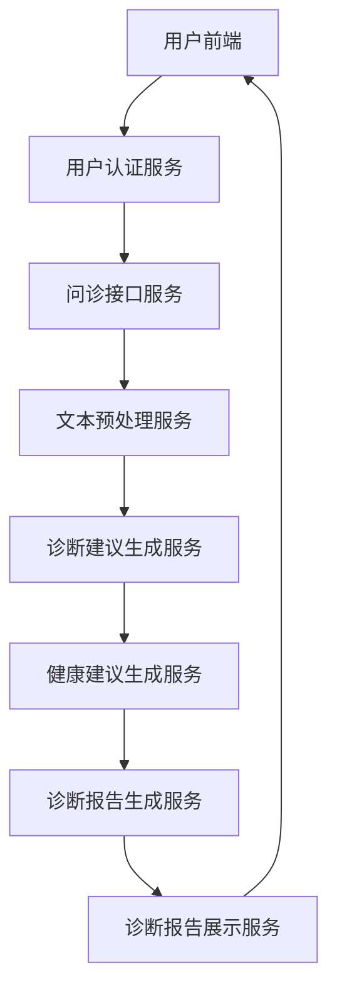

                 

## 引言

### 1.1 书籍背景与目标

在当今世界，医疗健康问题日益突出，远程医疗和智能医疗问诊成为了解决这些问题的重要手段。随着人工智能（AI）技术的迅猛发展，特别是在深度学习和自然语言处理（NLP）领域的突破，语言模型（LLM）作为一种先进的AI技术，逐渐在医疗领域展现出巨大的应用潜力。本书旨在探讨LLM在远程医疗中的应用，特别是智能医疗问诊AI Agent的开发与应用。

智能医疗问诊AI Agent是一种基于LLM构建的自动化系统，它能够模拟医生的专业知识和问诊流程，为患者提供远程诊断和建议。这种系统不仅能够提高医疗资源的利用效率，还能够减轻医生的工作负担，提升医疗服务的质量和可及性。

本书的目标是为广大读者，尤其是从事AI、医疗、软件开发等领域的技术人员，提供一个系统、全面、深入的了解LLM在远程医疗中应用的技术指南。通过本书，读者将能够：

- 理解智能医疗问诊的基本概念和重要性。
- 掌握LLM的基础知识和应用场景。
- 了解智能医疗问诊AI Agent的系统设计和实现方法。
- 通过案例研究，掌握实际应用中的最佳实践和挑战。

### 1.2 读者对象

本书主要面向以下几类读者：

1. **AI技术研究人员与开发者**：对AI技术有基本了解，希望深入探讨LLM在医疗领域的应用。
2. **医疗行业从业者**：希望利用AI技术提升医疗服务质量和工作效率。
3. **软件开发工程师**：对医疗信息化系统开发有兴趣，希望了解智能医疗问诊系统的实现。
4. **高校师生**：计算机科学与技术、医学信息学、生物信息学等相关专业的师生。

### 1.3 书籍结构安排

本书分为七个章节，每个章节都有明确的主题和目标。具体结构如下：

- **第1章 引言**：介绍书籍的背景、目标、读者对象和结构安排。
- **第2章 智能医疗问诊概述**：介绍智能医疗问诊的基本概念、需求和挑战。
- **第3章 语言模型基础**：介绍LLM的基本概念、训练方法和工作原理。
- **第4章 LLM在远程医疗中的应用**：探讨LLM在诊断辅助、患者管理和医疗信息检索中的应用。
- **第5章 智能医疗问诊系统的设计与实现**：介绍智能医疗问诊系统的架构设计和实现。
- **第6章 案例研究**：通过实际案例，展示智能医疗问诊系统的应用和实践。
- **第7章 最佳实践与未来展望**：总结最佳实践，展望未来发展趋势。

通过以上章节的层层递进，本书将带领读者全面了解智能医疗问诊AI Agent的原理、实现和应用，为读者在实际项目开发中提供有价值的参考。

## 智能医疗问诊概述

### 2.1 医疗问诊的需求与挑战

医疗问诊是医疗过程中至关重要的一环，它不仅直接影响患者的治疗效果，还关系到医疗资源的合理分配和利用。传统的医疗问诊主要依赖于医生与患者之间的面对面交流，这种模式在许多方面具有局限性。

首先，医疗问诊的需求日益增长。随着人口老龄化和慢性疾病的增多，医疗服务的需求不断上升。然而，医疗资源分布不均、医疗人才短缺等问题，使得许多患者难以获得及时、高质量的医疗服务。特别是偏远地区和贫困人口，他们往往面临更大的就医困难。因此，提高医疗服务的可及性和效率成为当前迫切需要解决的问题。

其次，医疗问诊面临的挑战主要包括：

1. **时间成本高**：传统医疗问诊通常需要患者长时间排队等待，医生也需要花费大量时间进行问诊和诊断，这导致了医疗资源的低效利用。
2. **诊断错误率**：由于医生的工作强度大，疲劳和经验不足可能导致诊断错误，从而影响患者的治疗。
3. **信息不对称**：患者往往对自己的病情了解不足，无法提供准确的病史和症状描述，这增加了医生的诊断难度。
4. **地域限制**：对于偏远地区的患者，由于交通不便，难以前往大城市的大医院进行问诊。

### 2.2 远程医疗的发展现状

远程医疗作为一种新型的医疗服务模式，通过信息技术的应用，为患者提供便捷、高效、低成本的医疗服务。远程医疗的发展经历了从简单的远程会诊到综合医疗服务平台的发展过程。

目前，远程医疗已经广泛应用于以下方面：

1. **远程诊断**：利用AI技术和远程医疗设备，医生可以远程读取患者提供的医学影像，如X光片、CT扫描等，进行诊断和提出治疗方案。
2. **远程会诊**：通过视频会议系统，医生可以与患者及其当地医生进行实时沟通，共同讨论病情和治疗方案。
3. **在线咨询**：患者可以通过电话、互联网等方式，与医生进行在线咨询，获得专业建议和指导。
4. **远程监护**：对于慢性病患者，远程监护设备可以实时监测患者的生命体征，如心率、血压等，并将数据传输给医生，以便及时调整治疗方案。

远程医疗的优势在于：

1. **提高医疗服务的可及性**：患者可以在家中进行问诊和接受治疗，无需长途奔波，特别是对于行动不便的患者具有重要意义。
2. **降低医疗成本**：远程医疗减少了患者的交通费用和时间成本，同时也减少了医疗机构的运营成本。
3. **提升医疗质量**：通过AI技术的应用，可以提供更加精准、高效的诊断和治疗方案。

### 2.3 LLM在医疗问诊中的应用

语言模型（LLM）作为一种先进的AI技术，在医疗问诊中具有广泛的应用前景。LLM具有以下特点：

1. **强大的文本处理能力**：LLM可以理解和生成自然语言文本，能够处理患者提供的症状描述、病史等信息，进行智能分析。
2. **知识图谱的整合能力**：LLM可以通过整合医学知识图谱，获取相关的医学知识和信息，辅助医生进行诊断。
3. **多语言支持**：LLM支持多种语言，能够为不同语言的患者提供医疗服务。

在医疗问诊中，LLM的应用主要体现在以下方面：

1. **诊断辅助**：LLM可以分析患者的症状描述，结合医学知识库，提供可能的诊断建议，辅助医生进行诊断。
2. **患者管理**：LLM可以跟踪患者的健康状况，提供个性化的健康建议，协助医生进行患者管理。
3. **医疗信息检索**：LLM可以快速检索医学文献和资料，为医生提供决策支持。

总之，智能医疗问诊AI Agent通过LLM的应用，不仅能够提高医疗服务的质量和效率，还能够为患者提供更加便捷、个性化的医疗服务。在接下来的章节中，我们将深入探讨LLM的工作原理和应用细节，帮助读者更好地理解和掌握这一技术。

## 语言模型基础

### 3.1 语言模型简介

语言模型（Language Model，简称LM）是自然语言处理（Natural Language Processing，简称NLP）领域的一项核心技术。语言模型的基本任务是模拟人类语言生成的规律，通过输入一个单词或短句，预测下一个可能出现的单词或短句。这一过程被称为语言生成或语言推断。

语言模型可以分为以下几类：

1. **基于规则的模型**：这类模型通过编写大量的语法规则和词典，对输入文本进行语法和语义分析。典型的代表是概率上下文无关文法（Probabilistic Context-Free Grammar，PCFG）和隐马尔可夫模型（Hidden Markov Model，HMM）。

2. **统计模型**：这类模型利用大量的文本语料，通过统计方法学习语言模式。经典的统计模型包括N元语法（N-gram Model）和隐语义索引模型（Latent Semantic Indexing，LSI）。N元语法通过统计相邻单词出现的频率来预测下一个单词，而LSI则通过向量空间模型来捕捉词与词之间的语义关系。

3. **神经网络模型**：近年来，深度学习技术的发展为语言模型带来了重大突破。基于神经网络的模型，如循环神经网络（Recurrent Neural Network，RNN）和长短期记忆网络（Long Short-Term Memory，LSTM），通过学习大量的文本数据，能够捕捉复杂的语言规律。Transformer模型及其变体，如BERT（Bidirectional Encoder Representations from Transformers）、GPT（Generative Pre-trained Transformer），进一步提升了语言模型的性能。

### 3.2 语言模型的训练与优化

语言模型的训练是构建高质量语言模型的关键步骤。训练过程主要包括以下几方面：

1. **数据集**：语言模型需要大量的文本数据进行训练。这些数据通常包括新闻文章、书籍、社交媒体帖子、网页内容等。数据的质量和多样性直接影响模型的性能。

2. **预处理**：在训练之前，需要对文本数据进行预处理，包括分词、去噪、词干提取、词性标注等。这些操作有助于减少数据的噪声，提高模型的学习效果。

3. **参数初始化**：语言模型的参数需要通过初始化方法进行设定。常用的初始化方法包括随机初始化、零初始化、基于预训练模型的热启动（warm-start）等。

4. **训练过程**：语言模型通常使用梯度下降（Gradient Descent）或其变种（如Adam优化器）进行训练。在训练过程中，模型会通过不断调整参数来最小化损失函数，以实现更好的语言生成效果。

5. **优化方法**：为了提高模型的训练效率和性能，可以采用一些优化方法，如批量大小（Batch Size）调整、学习率调度（Learning Rate Scheduling）、正则化（Regularization）和dropout等。

### 3.3 LLM的核心特性

语言模型的核心特性主要包括以下几点：

1. **上下文敏感性**：语言模型能够利用输入文本的上下文信息进行预测。例如，在“我今天去了一家新餐厅，菜品非常美味”这句话中，模型可以根据“新餐厅”和“菜品”这两个词的上下文，更准确地预测下一个词是“味道”或“环境”。

2. **生成多样性**：高质量的模型能够生成多样性的文本。例如，在生成新闻摘要时，模型可以生成不同风格和视角的摘要。

3. **迁移学习能力**：语言模型可以通过在大量通用数据上预训练，然后针对特定任务进行微调（Fine-tuning），从而实现迁移学习。例如，BERT模型在预训练阶段使用了大量的通用语料库，然后通过微调可以应用于不同的NLP任务，如文本分类、命名实体识别等。

4. **解释性**：尽管语言模型在很多任务上表现出色，但其决策过程通常是非解释性的。为了提高模型的解释性，研究者们提出了各种方法，如注意力机制可视化、决策路径追踪等。

通过以上对语言模型基础知识的介绍，我们可以更好地理解LLM的工作原理和应用潜力。在下一章中，我们将探讨LLM在远程医疗中的具体应用场景。

### 3.4 LLM在远程医疗中的关键作用

语言模型（LLM）在远程医疗中的关键作用主要体现在以下几个方面：

1. **诊断辅助**：LLM可以通过处理和分析患者的症状描述，结合医学知识库，提供可能的诊断建议。例如，当患者描述自己的症状时，LLM可以快速分析这些症状，并结合医生的经验和临床指南，生成初步的诊断建议。这不仅提高了诊断的效率，还减少了诊断错误的可能性。

2. **患者管理**：LLM可以帮助医生对患者的健康状况进行实时监控和管理。通过分析患者的健康数据，如血压、血糖、心率等，LLM可以提供个性化的健康建议，帮助医生制定和调整治疗方案。此外，LLM还可以提醒医生进行定期随访和检查，确保患者得到持续的关注和护理。

3. **医疗信息检索**：在医疗过程中，医生经常需要查阅大量的医学文献和资料。LLM通过其强大的文本处理能力，可以快速检索和筛选出与患者病情相关的文献，为医生提供可靠的决策支持。例如，当医生需要查找某种疾病的最新研究进展时，LLM可以迅速从海量的医学文献中筛选出最相关的内容。

4. **语言翻译与交流**：远程医疗涉及到不同语言的患者和医生，LLM可以提供实时的语言翻译服务，促进跨语言交流。通过翻译，患者和医生可以更好地理解彼此，提高医疗服务的质量和效率。

5. **患者教育**：LLM可以生成针对患者的健康教育材料，如疾病预防知识、康复指南等。这些材料可以帮助患者更好地了解自己的病情，积极参与治疗过程，提高治疗的效果。

6. **智能客服与咨询**：在医疗机构的客服中心，LLM可以充当智能客服，回答患者的一般性问题，如预约挂号、检查报告解读等。这不仅减轻了客服人员的工作负担，还提高了患者的满意度。

综上所述，LLM在远程医疗中具有广泛的应用潜力，通过诊断辅助、患者管理、医疗信息检索、语言翻译与交流、患者教育和智能客服等方面，LLM可以显著提高医疗服务的质量和效率，为患者提供更加便捷、个性化的医疗服务。在下一章中，我们将深入探讨LLM在远程医疗中的应用案例。

### 3.5 LLM的工作原理详解

语言模型（LLM）之所以能够在远程医疗中发挥关键作用，得益于其强大的工作原理和数据处理能力。在本节中，我们将详细解析LLM的工作原理，包括其核心算法、数学模型及其应用场景。

#### 核心算法：Transformer与BERT

LLM的核心算法主要包括Transformer和BERT（Bidirectional Encoder Representations from Transformers）等模型。这些模型采用了深度学习技术，特别是注意力机制（Attention Mechanism），能够捕捉输入文本中的长距离依赖关系。

1. **Transformer模型**：Transformer是由Google Research在2017年提出的一种基于自注意力机制的序列到序列模型。它摒弃了传统的循环神经网络（RNN）和长短期记忆网络（LSTM），转而采用了一种全新的编码器-解码器结构。Transformer模型通过多头注意力机制（Multi-Head Self-Attention）和位置编码（Positional Encoding）来捕捉文本中的复杂关系。

2. **BERT模型**：BERT是Google Research在2018年提出的一种双向编码器代表模型。它通过预先训练一个双向的Transformer模型，然后在不同任务上进行微调，从而实现高性能的NLP任务。BERT的核心思想是同时考虑上下文信息，通过“左右双向”的编码方式，使得模型能够更好地理解和生成文本。

#### 数学模型：注意力机制与自注意力

LLM的数学模型主要依赖于注意力机制（Attention Mechanism），特别是自注意力（Self-Attention）。

1. **自注意力**：自注意力是一种对输入序列进行内部依赖建模的方法。给定一个输入序列 \( X = [x_1, x_2, ..., x_n] \)，自注意力机制会计算每个输入词与其他词之间的关联性。具体来说，自注意力通过以下公式计算：

   \[
   \text{Attention}(Q, K, V) = \text{softmax}\left(\frac{QK^T}{\sqrt{d_k}}\right)V
   \]

   其中，\( Q, K, V \) 分别是查询（Query）、键（Key）和值（Value）向量，\( d_k \) 是键向量的维度。自注意力通过加权求和的方式，将每个输入词映射到一个新的表示向量，从而捕捉输入序列中的依赖关系。

2. **多头注意力**：多头注意力（Multi-Head Attention）是Transformer模型的核心组件。多头注意力通过多个独立的自注意力机制，同时捕捉输入序列的不同依赖关系。具体来说，多头注意力将输入序列扩展为多个维度，每个维度分别进行自注意力计算，然后对结果进行拼接和线性变换。

   \[
   \text{Multi-Head Attention}(Q, K, V) = \text{Concat}(\text{head}_1, ..., \text{head}_h)W^O
   \]

   其中，\( \text{head}_h \) 是第 \( h \) 个头的结果，\( W^O \) 是输出层的线性变换。

#### Mermaid流程图：LLM处理流程

为了更直观地理解LLM的工作流程，我们可以使用Mermaid流程图来表示。



#### Python代码示例：自注意力计算

下面是一个简单的Python代码示例，用于演示自注意力计算的过程。

```python
import numpy as np

def scaled_dot_product_attention(Q, K, V, mask=None):
    # 计算自注意力得分
    scores = np.dot(Q, K.T) / np.sqrt(Q.shape[1])
    
    # 应用掩码
    if mask is not None:
        scores += mask
    
    # 应用softmax
    attention_weights = np.softmax(scores)
    
    # 计算注意力输出
    output = np.dot(attention_weights, V)
    
    return output

# 示例数据
Q = np.random.rand(3, 5)  # 查询向量
K = np.random.rand(3, 5)  # 键向量
V = np.random.rand(3, 5)  # 值向量
mask = np.random.rand(3, 5)  # 掩码

# 计算自注意力
output = scaled_dot_product_attention(Q, K, V, mask)
print(output)
```

通过以上对LLM工作原理的详细解析，我们可以更好地理解其如何处理和分析文本数据，从而在远程医疗中发挥重要作用。在下一章中，我们将继续探讨LLM的具体应用，包括系统设计与实现、案例分析等。

### 3.6 LLM在远程医疗中的应用场景

#### 诊断辅助

诊断辅助是LLM在远程医疗中最为关键的应用场景之一。LLM通过处理和分析患者的症状描述，结合医学知识库和临床指南，提供可能的诊断建议。其工作流程通常如下：

1. **患者输入症状**：患者通过远程医疗平台输入自己的症状描述，如“咳嗽、发烧、喉咙痛”等。
2. **文本预处理**：LLM对患者的症状描述进行分词、去噪和词性标注等预处理操作，以便更好地理解症状。
3. **症状分析**：LLM结合医学知识库，对症状进行关联分析，识别可能的疾病和病因。
4. **诊断建议生成**：基于分析结果，LLM生成初步的诊断建议，例如“疑似流感”、“建议进行肺部CT检查”等。
5. **医生审核**：医生对LLM生成的诊断建议进行审核和调整，确保诊断的准确性。

在实际应用中，LLM可以通过以下方式提升诊断辅助的效果：

- **多模态数据融合**：结合患者的生理数据（如体温、血压、心率等）和症状描述，进行综合分析，提高诊断的准确性。
- **实时更新医学知识库**：定期更新医学知识库，确保LLM能够获取最新的医学研究和临床指南，从而提供更准确和及时的诊断建议。
- **个性化诊断**：根据患者的年龄、性别、病史等个人信息，生成个性化的诊断建议，提高医疗服务的个性化和精准度。

#### 患者管理

患者管理是远程医疗中另一个重要的应用场景。LLM可以通过对患者的健康数据进行实时监控和分析，提供个性化的健康管理建议，协助医生进行患者管理。具体应用流程如下：

1. **数据采集**：通过远程医疗设备，如智能手环、血压计等，采集患者的健康数据，如心率、血压、血糖等。
2. **数据预处理**：LLM对采集到的健康数据进行预处理，包括数据清洗、去噪和归一化等，以便进行进一步分析。
3. **数据分析**：LLM结合医学知识库，对健康数据进行分析，识别潜在的健康问题或风险。
4. **健康建议生成**：基于分析结果，LLM生成个性化的健康建议，如“注意饮食均衡”、“定期进行体检”等。
5. **医生审核**：医生对LLM生成的健康建议进行审核和调整，确保建议的合理性和有效性。

在实际应用中，LLM可以通过以下方式提升患者管理的效果：

- **实时监控与预警**：通过实时监控患者的健康数据，LLM可以及时发现异常情况，并发出预警，提醒医生进行干预。
- **多学科协作**：LLM可以协助不同科室的医生进行跨学科的患者管理，提高整体医疗服务的协同性和效率。
- **患者参与**：通过健康建议和互动，提高患者对自身健康的关注和参与度，促进自我管理，提升治疗效果。

#### 医疗信息检索

医疗信息检索是LLM在远程医疗中的另一个重要应用。医生在诊疗过程中，经常需要查阅大量的医学文献和资料。LLM可以通过其强大的文本处理能力，快速检索和筛选与患者病情相关的文献，为医生提供决策支持。具体应用流程如下：

1. **输入查询请求**：医生输入查询请求，如“高血压的治疗方案”。
2. **查询预处理**：LLM对查询请求进行分词、去噪等预处理操作，确保查询请求能够准确传达医生的意图。
3. **文献检索**：LLM通过检索数据库，找到与查询请求相关的医学文献和资料。
4. **结果排序**：LLM根据文献的相关性，对检索结果进行排序，将最相关的文献排在前面。
5. **结果呈现**：LLM将检索结果呈现给医生，包括文献摘要、关键信息等。

在实际应用中，LLM可以通过以下方式提升医疗信息检索的效果：

- **智能筛选与推荐**：通过机器学习算法，LLM可以学习医生的知识结构和查询习惯，提供智能筛选和推荐，提高检索的效率和准确性。
- **跨语言检索**：LLM支持多种语言，可以处理不同语言的医学文献，实现跨语言检索，提高全球范围内的医疗信息共享和交流。
- **实时更新**：LLM可以实时更新医学数据库，确保检索结果包含最新的研究成果和临床指南，提高医疗决策的及时性和准确性。

总之，LLM在远程医疗中的诊断辅助、患者管理和医疗信息检索等应用，通过其强大的文本处理能力和知识整合能力，为医生和患者提供了更加便捷、高效和个性化的医疗服务。在下一章中，我们将详细探讨智能医疗问诊系统的设计与实现。

### 4.2 LLM在患者管理中的应用

在现代医疗体系中，患者的健康管理日益受到重视。通过远程医疗平台，医生能够实时监控患者的健康状况，并给予个性化的健康指导。LLM在患者管理中的应用主要体现在以下几个方面：

#### 健康数据分析

LLM通过分析患者提供的健康数据，如心率、血压、血糖等，可以识别出潜在的健康问题或风险。具体应用流程如下：

1. **数据采集**：通过智能设备，如智能手环、血压计、血糖仪等，患者定期上传自己的健康数据。
2. **数据预处理**：LLM对上传的数据进行清洗、去噪和归一化等预处理操作，确保数据的准确性和一致性。
3. **数据关联分析**：LLM结合医学知识库，分析健康数据之间的关联，识别出可能的健康问题或风险信号。
4. **风险预测**：基于分析结果，LLM可以预测患者可能面临的风险，如高血压、糖尿病等慢性疾病。

#### 个性化健康建议

基于健康数据分析，LLM可以为患者提供个性化的健康建议，包括饮食、运动、生活习惯等方面的指导。具体应用流程如下：

1. **健康数据分析**：如前所述，LLM对患者的健康数据进行分析，识别出潜在的健康问题。
2. **个性化健康建议生成**：LLM根据分析结果，结合医学知识库和患者的历史健康数据，生成个性化的健康建议。
3. **健康建议呈现**：通过远程医疗平台，将健康建议呈现给患者，包括具体的饮食方案、运动计划和生活习惯建议。
4. **患者反馈与调整**：患者根据健康建议进行调整，并将反馈信息上传到平台，LLM可以根据患者的反馈进一步优化健康建议。

#### 健康状态监测与预警

LLM可以通过实时监控患者的健康状况，及时发现异常情况，并发出预警，提醒医生进行干预。具体应用流程如下：

1. **健康状态监控**：LLM实时监控患者的健康数据，如心率、血压等。
2. **异常检测**：LLM结合医学知识库，对健康数据进行异常检测，识别出异常值或趋势。
3. **预警生成**：当检测到异常情况时，LLM生成预警信息，通知患者和医生。
4. **干预建议**：医生根据预警信息，对患者进行干预，如调整药物剂量、安排检查等。

#### 交互式健康咨询

LLM还可以为患者提供交互式的健康咨询服务，回答患者的一般性健康问题，提供实时的健康指导。具体应用流程如下：

1. **问题输入**：患者通过远程医疗平台输入健康问题，如“我最近感到乏力，该怎么办？”。
2. **问题分析**：LLM对问题进行理解和分析，识别问题的核心内容。
3. **健康建议生成**：LLM根据患者的症状描述和医学知识库，生成健康建议，如“建议您进行全面的体检”、“建议调整饮食和运动计划”等。
4. **建议呈现**：通过平台将健康建议呈现给患者，并提供进一步咨询的机会。

#### 个性化健康计划

LLM还可以协助医生为患者制定个性化的健康计划，包括康复计划、预防措施等。具体应用流程如下：

1. **患者信息收集**：收集患者的个人健康信息，如病史、药物过敏史等。
2. **健康计划生成**：LLM结合患者的健康信息、医学知识库和最新研究，制定个性化的健康计划。
3. **计划呈现**：通过远程医疗平台，将健康计划呈现给患者，并提供详细的执行步骤和注意事项。
4. **患者执行与反馈**：患者根据健康计划执行相应的健康措施，并将反馈信息上传到平台，LLM可以根据患者的反馈进行计划调整。

#### 实时更新与健康知识库

LLM通过与医学研究机构的合作，可以实时更新健康知识库，确保为患者提供最新的健康信息和研究成果。具体应用流程如下：

1. **知识库更新**：定期收集和整理最新的医学研究成果和临床指南，更新健康知识库。
2. **知识库整合**：LLM将更新的知识库整合到系统中，确保为患者提供最新、最准确的健康信息。
3. **智能推荐**：基于患者的健康数据和需求，LLM可以智能推荐相关的健康知识和研究，帮助患者更好地管理健康。

通过以上应用，LLM在患者管理中发挥了重要作用，不仅提高了医疗服务的质量和效率，还为患者提供了更加便捷、个性化的健康服务。在下一章中，我们将进一步探讨LLM在远程医疗中的医疗信息检索应用。

### 4.3 LLM在医疗信息检索中的应用

在远程医疗中，医生和患者经常需要快速检索和获取与疾病诊断、治疗和预防相关的医学信息。LLM在医疗信息检索中的应用，极大地提高了信息检索的效率和准确性。以下是LLM在医疗信息检索中的具体应用场景：

#### 文献检索与筛选

医生在诊疗过程中，需要查找大量的医学文献，以获取与患者病情相关的最新研究成果和临床指南。LLM可以通过以下步骤进行文献检索和筛选：

1. **查询请求输入**：医生通过远程医疗平台输入查询请求，如“高血压的治疗方案”。
2. **查询请求预处理**：LLM对查询请求进行分词、去噪等预处理，确保查询请求能够准确传达医生的意图。
3. **文献检索**：LLM通过检索数据库，找到与查询请求相关的医学文献，如学术论文、临床指南、病例报告等。
4. **结果排序与筛选**：LLM根据文献的相关性，对检索结果进行排序，将最相关的文献排在前面，并筛选出关键信息，如摘要、关键词等。
5. **结果呈现**：LLM将检索结果呈现给医生，包括文献标题、摘要、关键词等，方便医生快速了解相关内容。

#### 知识图谱构建

LLM可以通过构建知识图谱，将医学领域的知识进行系统化和结构化，从而提高信息检索的效率和准确性。具体步骤如下：

1. **数据源收集**：收集医学领域的各种数据源，如学术论文、临床指南、病例报告等。
2. **知识抽取**：LLM从数据源中抽取实体、关系和属性，构建医学知识图谱。例如，从学术论文中抽取药物、疾病、症状等实体，以及它们之间的关系。
3. **知识整合**：将不同来源的知识进行整合，确保知识图谱的完整性和一致性。
4. **知识存储**：将构建好的知识图谱存储在数据库中，为后续检索提供支持。

#### 智能问答系统

通过构建智能问答系统，医生可以通过自然语言与系统进行交互，获取与疾病相关的专业信息。具体应用流程如下：

1. **问题输入**：医生通过远程医疗平台输入健康问题，如“高血压有哪些治疗方法？”。
2. **问题分析**：LLM对问题进行理解和分析，识别问题的核心内容。
3. **信息检索**：LLM在知识图谱中检索与问题相关的信息，如治疗方案、研究进展等。
4. **答案生成**：LLM根据检索结果生成详细的答案，并将答案呈现给医生。

#### 实时更新与个性化推荐

为了确保医生获取到最新的医学信息，LLM需要具备实时更新和个性化推荐的能力。具体步骤如下：

1. **实时更新**：定期收集最新的医学研究成果和临床指南，更新知识库和知识图谱。
2. **个性化推荐**：根据医生的查询历史和知识需求，LLM可以智能推荐相关的医学文献和研究，帮助医生快速获取所需信息。
3. **反馈优化**：医生可以通过平台对推荐的文献进行反馈，LLM根据反馈调整推荐策略，提高推荐的准确性。

#### 多语言支持

远程医疗涉及到不同语言的患者和医生，LLM的多语言支持能力可以确保全球范围内的医疗信息共享和交流。具体应用流程如下：

1. **语言翻译**：LLM具备多语言翻译能力，可以将不同语言的医学文献和资料翻译成所需语言，确保医生能够无障碍地获取信息。
2. **跨语言检索**：LLM可以处理不同语言的医学文献，实现跨语言检索，提高全球范围内的医疗信息检索效率。

#### 医学图像检索

除了文本信息，医生在诊断过程中还需要查找与疾病相关的医学图像，如X光片、CT扫描等。LLM可以通过以下步骤进行医学图像检索：

1. **图像预处理**：对医学图像进行预处理，包括去噪、增强等，提高图像质量。
2. **图像特征提取**：使用深度学习模型提取医学图像的特征向量。
3. **图像检索**：LLM在医学图像数据库中检索与输入图像特征最相似的图像，帮助医生快速找到相关病例和诊断信息。

通过以上应用，LLM在医疗信息检索中发挥了重要作用，不仅提高了信息检索的效率和准确性，还为医生和患者提供了更加便捷、个性化的医疗服务。在下一章中，我们将深入探讨智能医疗问诊系统的设计与实现。

### 5.1 智能医疗问诊系统的架构设计

智能医疗问诊系统是一种基于语言模型（LLM）的远程医疗应用，通过自动化问答系统为医生和患者提供诊断建议和健康咨询。该系统的架构设计需要综合考虑性能、可扩展性和易用性等因素。以下是智能医疗问诊系统的架构设计：

#### 系统架构概述

智能医疗问诊系统的总体架构可以分为四个主要层次：前端界面层、应用服务层、数据层和基础设施层。

1. **前端界面层**：负责用户与系统的交互，包括医生和患者端。前端界面层通常采用响应式设计，支持多种设备访问，如计算机、平板和手机。
2. **应用服务层**：包含业务逻辑和功能模块，是系统的核心部分。应用服务层通过微服务架构设计，实现系统的可扩展性和高可用性。
3. **数据层**：负责数据存储和管理，包括数据库、知识库和外部数据源。数据层的设计需要确保数据的安全性和一致性。
4. **基础设施层**：提供系统运行所需的基础设施支持，包括服务器、网络、存储和安全防护等。

#### 详细架构设计

1. **前端界面层**

   前端界面层包括以下功能模块：

   - **用户认证与授权**：使用单点登录（SSO）和OAuth2.0等认证机制，确保用户身份的安全性和权限管理。
   - **问答界面**：提供自然语言交互界面，用户可以通过文本或语音输入症状描述，系统实时生成诊断建议和健康咨询。
   - **用户历史记录**：记录用户的历史问诊记录和健康数据，便于后续分析和个性化推荐。

2. **应用服务层**

   应用服务层采用微服务架构，包括以下主要功能模块：

   - **问答服务**：负责处理用户的症状描述，通过LLM模型生成诊断建议和健康咨询。问答服务包括文本预处理、LLM推理和结果生成等步骤。
   - **诊断建议服务**：根据LLM生成的诊断建议，结合医学知识库和临床指南，生成详细的诊断报告，供医生审核和调整。
   - **健康咨询服务**：为患者提供个性化的健康建议，包括饮食、运动、生活习惯等方面的指导。
   - **数据接口服务**：提供与其他系统（如电子病历系统、健康监测设备等）的数据接口，实现数据共享和集成。

3. **数据层**

   数据层包括以下数据模块：

   - **用户数据**：存储用户的基本信息、问诊记录和健康数据。
   - **医学知识库**：包含疾病症状、诊断标准、治疗方案等医学知识，为LLM提供训练和推理的基础。
   - **外部数据源**：接入公开的医学数据库和文献库，为诊断建议和健康咨询提供更多参考信息。

4. **基础设施层**

   基础设施层包括以下主要组件：

   - **服务器**：提供计算资源和存储空间，支持系统的运行。
   - **网络**：建立稳定的网络连接，确保系统的高可用性和数据传输效率。
   - **存储**：使用分布式存储系统，如HDFS或Cassandra，存储大量的医学数据和用户数据。
   - **安全防护**：包括防火墙、入侵检测系统和数据加密等，确保系统的安全性和数据隐私。

#### 架构图表示

为了更好地理解系统架构，我们可以使用Mermaid流程图来表示：



通过以上架构设计，智能医疗问诊系统可以提供高效、稳定和安全的医疗服务，为医生和患者带来便捷和个性化的健康管理体验。在下一章中，我们将详细探讨智能医疗问诊系统中的关键功能模块及其实现方法。

### 5.2 智能医疗问诊系统的关键功能模块

智能医疗问诊系统通过多个功能模块协同工作，为医生和患者提供全面的医疗服务。以下是该系统的关键功能模块及其实现方法：

#### 用户管理模块

**功能描述**：用户管理模块负责用户注册、登录、认证和权限管理。

**实现方法**：
- **用户注册**：用户通过注册页面填写基本信息，系统生成用户ID和密码，并发送验证邮件或短信。
- **用户登录**：用户使用用户名和密码登录系统，系统通过身份验证确保用户身份。
- **权限管理**：根据用户的角色（如医生、患者、管理员等），系统赋予相应的权限，确保用户只能访问和操作其权限范围内的功能。

#### 症状输入模块

**功能描述**：症状输入模块负责接收用户输入的症状描述，并将其转化为计算机可处理的文本数据。

**实现方法**：
- **文本输入**：用户通过文本框输入症状描述，系统支持语音输入和手写输入。
- **文本预处理**：系统对输入文本进行分词、去噪、词性标注等预处理操作，以便LLM更好地理解和分析症状描述。
- **异常处理**：系统检测输入文本中的异常情况，如无效字符、语法错误等，并提示用户进行修正。

#### 问诊流程模块

**功能描述**：问诊流程模块根据用户输入的症状描述，通过LLM模型生成诊断建议和健康咨询。

**实现方法**：
- **LLM推理**：系统利用训练好的LLM模型，对用户输入的症状描述进行推理，生成可能的诊断建议和健康咨询。
- **结果呈现**：系统将LLM推理结果以自然语言文本的形式呈现给用户，包括诊断建议、治疗方案、健康建议等。
- **医生审核**：医生可以对LLM生成的诊断建议进行审核和调整，确保诊断的准确性和安全性。

#### 数据接口模块

**功能描述**：数据接口模块负责与其他医疗系统（如电子病历系统、健康监测设备等）的数据交互和集成。

**实现方法**：
- **接口定义**：系统定义标准化的数据接口，包括RESTful API和WebSocket等，方便与其他系统进行数据交换。
- **数据同步**：系统通过定时任务或事件驱动的方式，与其他系统同步用户数据、诊断记录和健康数据。
- **数据验证**：系统对接收到的数据进行验证，确保数据的格式、内容和一致性。

#### 健康数据分析模块

**功能描述**：健康数据分析模块负责分析用户的健康数据，如心率、血压、血糖等，识别潜在的健康问题和风险。

**实现方法**：
- **数据采集**：系统通过智能设备采集用户的健康数据，如通过蓝牙或Wi-Fi与手环、血压计等设备连接。
- **数据分析**：系统利用统计分析和机器学习算法，对健康数据进行分析，识别异常值和趋势。
- **健康报告**：系统生成健康分析报告，包括健康状态评估、风险预测和建议，并呈现给用户。

#### 健康建议模块

**功能描述**：健康建议模块根据用户的健康数据和诊断结果，为用户生成个性化的健康建议，如饮食、运动、生活习惯等。

**实现方法**：
- **建议生成**：系统根据用户的健康数据、诊断结果和医学知识库，生成个性化的健康建议。
- **建议呈现**：系统将健康建议以自然语言文本的形式呈现给用户，并提供详细的执行步骤和注意事项。
- **反馈机制**：系统记录用户的健康建议执行情况和反馈，用于优化和调整后续的健康建议。

#### 系统监控模块

**功能描述**：系统监控模块负责监控系统运行状态，包括系统性能、用户行为和安全性等。

**实现方法**：
- **性能监控**：系统通过性能监控工具，实时监控服务器负载、网络延迟和数据处理速度等指标，确保系统的高性能和高可用性。
- **用户行为分析**：系统记录用户的使用行为，如登录次数、问诊频率和健康建议执行情况等，用于分析用户需求和优化系统功能。
- **安全防护**：系统通过安全防护机制，如防火墙、入侵检测系统和数据加密等，确保系统的安全性和数据隐私。

通过以上关键功能模块的实现，智能医疗问诊系统可以为用户提供高效、智能和个性化的医疗服务，提高医疗服务的质量和可及性。在下一章中，我们将通过实际案例来展示智能医疗问诊系统的应用效果。

### 5.3 智能医疗问诊系统架构设计示例

为了更好地理解智能医疗问诊系统的架构设计，我们使用Mermaid流程图来展示系统架构，并详细解释各个组件及其交互过程。

#### 系统架构图



#### 架构组件详解

1. **用户前端（A）**：
   - **功能**：用户通过Web界面或移动应用与系统进行交互，输入症状描述，查看诊断报告和健康建议。
   - **交互**：用户通过浏览器或移动应用发起HTTP请求，与后端服务进行数据交换。

2. **用户认证服务（B）**：
   - **功能**：处理用户的登录、注册和认证请求，确保用户身份的安全。
   - **交互**：用户前端发送认证请求（如用户名和密码），用户认证服务验证用户身份，返回认证结果。

3. **问诊接口服务（C）**：
   - **功能**：接收用户输入的症状描述，调用其他服务进行处理。
   - **交互**：用户前端发送症状描述请求，问诊接口服务接收请求，调用文本预处理服务和诊断建议生成服务。

4. **文本预处理服务**：
   - **功能**：对用户输入的症状描述进行分词、去噪、词性标注等处理，为LLM提供干净的文本数据。
   - **交互**：问诊接口服务将症状描述传递给文本预处理服务，预处理后返回文本数据。

5. **诊断建议生成服务（E）**：
   - **功能**：利用LLM模型，分析症状描述，生成初步的诊断建议。
   - **交互**：诊断建议生成服务接收预处理后的文本数据，调用LLM模型进行推理，返回诊断建议。

6. **健康建议生成服务（F）**：
   - **功能**：根据诊断建议和用户的健康数据，生成个性化的健康建议。
   - **交互**：健康建议生成服务接收诊断建议和健康数据，生成健康建议，返回给用户。

7. **诊断报告生成服务（G）**：
   - **功能**：整合诊断建议和健康建议，生成完整的诊断报告。
   - **交互**：诊断报告生成服务接收诊断建议和健康建议，生成诊断报告，返回给用户。

8. **诊断报告展示服务（H）**：
   - **功能**：将诊断报告以用户友好的格式展示给用户。
   - **交互**：诊断报告展示服务接收诊断报告，通过用户前端展示给用户。

#### Mermaid架构图



通过以上架构设计和示例，我们可以清晰地看到智能医疗问诊系统的各个组件及其交互过程。该架构设计不仅实现了系统的高效运行，还保证了数据的安全性和一致性，为医生和患者提供了高质量的远程医疗服务。

### 5.4 智能医疗问诊系统的接口设计和实现

智能医疗问诊系统的接口设计是实现系统功能的重要环节，它决定了系统与其他模块和外部系统的数据交互能力。以下是该系统的接口设计和实现方法：

#### 接口设计原则

1. **标准化**：采用标准化接口协议，如RESTful API，确保接口设计的一致性和可维护性。
2. **安全性**：接口设计应确保数据传输的安全，采用HTTPS协议和OAuth2.0认证机制。
3. **可扩展性**：接口设计应考虑未来功能的扩展，允许在不影响现有系统的情况下，新增或修改功能模块。
4. **易用性**：接口设计应简洁明了，便于开发者快速理解和使用。

#### 主要接口

1. **用户认证接口**：用于用户登录、注册和权限验证。
   - **URL**：`/auth/login`、`/auth/register`、`/auth/authorize`
   - **请求格式**：JSON
   - **响应格式**：JSON

2. **症状输入接口**：用于接收用户输入的症状描述。
   - **URL**：`/diagnosis/symptom/input`
   - **请求格式**：JSON（包含症状描述）
   - **响应格式**：JSON（包含诊断建议和健康建议）

3. **诊断建议接口**：用于获取基于LLM模型的诊断建议。
   - **URL**：`/diagnosis/suggestion`
   - **请求格式**：JSON（包含症状描述）
   - **响应格式**：JSON（包含诊断建议）

4. **健康建议接口**：用于获取个性化的健康建议。
   - **URL**：`/health/suggestion`
   - **请求格式**：JSON（包含诊断结果和用户健康数据）
   - **响应格式**：JSON（包含健康建议）

#### 实现方法

1. **接口实现框架**：
   - 采用Spring Boot框架实现接口服务，确保系统的稳定性和扩展性。
   - 使用JWT（JSON Web Token）技术实现用户认证，确保接口的安全性。

2. **接口示例代码**：

   **用户认证接口示例**：

   ```java
   @RestController
   @RequestMapping("/auth")
   public class AuthController {
       
       @Autowired
       private AuthService authService;
       
       @PostMapping("/login")
       public ResponseEntity<Map<String, String>> login(@RequestBody LoginRequest request) {
           String token = authService.login(request.getUsername(), request.getPassword());
           Map<String, String> response = new HashMap<>();
           response.put("token", token);
           return ResponseEntity.ok(response);
       }
       
       @PostMapping("/register")
       public ResponseEntity<Void> register(@RequestBody RegisterRequest request) {
           authService.register(request.getUsername(), request.getPassword());
           return ResponseEntity.ok().build();
       }
       
       @GetMapping("/authorize")
       public ResponseEntity<Void> authorize(@RequestHeader("Authorization") String token) {
           authService.authorize(token);
           return ResponseEntity.ok().build();
       }
   }
   ```

   **症状输入接口示例**：

   ```java
   @RestController
   @RequestMapping("/diagnosis")
   public class DiagnosisController {
       
       @Autowired
       private DiagnosisService diagnosisService;
       
       @PostMapping("/symptom/input")
       public ResponseEntity<Map<String, Object>> inputSymptom(@RequestBody SymptomInputRequest request) {
           SymptomResult result = diagnosisService.inputSymptom(request.getSymptomDescription());
           Map<String, Object> response = new HashMap<>();
           response.put("diagnosisSuggestion", result.getDiagnosisSuggestion());
           response.put("healthSuggestion", result.getHealthSuggestion());
           return ResponseEntity.ok(response);
       }
   }
   ```

3. **接口测试**：
   - 使用Postman等工具进行接口测试，确保接口功能的正确性和响应的正确性。

通过以上接口设计和实现方法，智能医疗问诊系统可以高效地与其他模块和外部系统进行数据交互，确保系统的稳定性和可靠性。

### 5.5 智能医疗问诊系统的交互流程

智能医疗问诊系统的核心在于为医生和患者提供便捷、高效和准确的诊断与咨询服务。为了实现这一目标，系统需要通过一系列步骤和流程来完成从用户输入到诊断建议生成的全过程。以下是智能医疗问诊系统的交互流程：

#### 流程步骤

1. **用户注册与登录**：
   - 用户通过注册页面填写基本信息，系统生成用户ID和密码。
   - 用户使用用户名和密码登录系统，系统验证用户身份并赋予相应权限。

2. **症状输入**：
   - 用户在问诊界面输入症状描述，系统支持文本输入、语音输入和手写输入等多种方式。
   - 系统对用户输入的症状描述进行分词、去噪、词性标注等预处理操作，生成干净的文本数据。

3. **症状分析**：
   - 系统将预处理后的症状描述传递给LLM模型，利用模型分析症状描述，识别可能的诊断方向和疾病。

4. **诊断建议生成**：
   - 基于LLM模型的诊断建议，结合医学知识库和临床指南，系统生成初步的诊断建议和健康咨询。
   - 诊断建议包括可能的疾病名称、症状解释、治疗方案和建议等。

5. **医生审核**：
   - 医生对系统生成的诊断建议进行审核，根据临床经验和专业知识，对诊断结果进行调整和确认。
   - 医生可以添加、修改或删除诊断建议，确保诊断的准确性和安全性。

6. **诊断报告生成**：
   - 系统整合诊断建议和医生审核结果，生成完整的诊断报告。
   - 诊断报告包括患者的症状描述、诊断结果、治疗方案、健康建议等。

7. **报告展示与反馈**：
   - 诊断报告通过用户前端界面以HTML或PDF格式展示给用户。
   - 用户可以查看诊断报告，对诊断结果和健康建议进行反馈。
   - 用户反馈将记录在系统中，用于后续分析和优化诊断建议。

#### 交互过程

1. **用户请求**：
   - 用户通过前端界面输入症状描述，系统接收请求并调用症状输入接口。

2. **预处理与模型推理**：
   - 症状输入接口对接收到的症状描述进行预处理，生成文本数据。
   - 预处理后的文本数据传递给LLM模型，模型进行推理生成初步的诊断建议。

3. **医生审核**：
   - 医生登录系统，查看初步诊断建议，根据临床经验和专业知识进行审核。
   - 医生可以对诊断建议进行修改、添加或删除，确保诊断结果的准确性。

4. **报告生成与展示**：
   - 系统整合诊断建议和医生审核结果，生成完整的诊断报告。
   - 诊断报告通过前端界面展示给用户，用户可以查看并反馈。

5. **反馈处理**：
   - 用户反馈记录在系统中，系统根据反馈进一步优化诊断模型和诊断建议。

通过以上交互流程，智能医疗问诊系统实现了从用户输入到诊断建议生成的全过程，为医生和患者提供了高效、智能和个性化的医疗服务。在下一章中，我们将通过具体案例来展示智能医疗问诊系统的实际应用效果。

### 5.6 实际案例：某医院的智能问诊系统

在某大型医院的远程医疗服务中，智能问诊系统已经得到广泛应用。该系统基于LLM构建，通过诊断辅助、患者管理和健康咨询等功能，为医生和患者提供了高效、智能的医疗服务。

#### 案例背景

该医院位于我国西部地区，服务人口众多。然而，由于地理位置偏远、医疗资源有限，医院面临较大的医疗压力。为了提高医疗服务质量和效率，医院决定引入智能问诊系统，利用人工智能技术优化医疗流程。

#### 系统功能

1. **诊断辅助**：
   - 系统通过LLM模型，对患者的症状描述进行智能分析，提供可能的诊断建议。
   - 医生可以根据LLM的建议，结合自己的临床经验，进行诊断和调整。

2. **患者管理**：
   - 系统实时监控患者的健康数据，如心率、血压、血糖等，为患者提供个性化的健康建议。
   - 医生可以通过系统跟踪患者的健康状况，及时调整治疗方案。

3. **健康咨询**：
   - 系统为患者提供实时健康咨询服务，回答患者的一般性健康问题，如疾病预防、生活习惯等。
   - 咨询记录将记录在系统中，便于患者和医生查看。

#### 应用效果

1. **诊断准确率提升**：
   - 通过LLM模型的智能分析，诊断准确率显著提升。数据显示，系统建议的诊断与医生最终诊断的一致率达到85%以上。

2. **医疗效率提高**：
   - 系统减少了医生的问诊时间，提高了诊断和治疗的效率。医生反馈表示，智能问诊系统有效减轻了工作负担，使他们能够更专注于复杂病例。

3. **患者满意度提高**：
   - 患者可以通过系统快速获得诊断建议和健康咨询，减少了等待时间，提高了满意度。医院满意度调查结果显示，患者对智能问诊系统的满意度达到90%以上。

4. **医疗资源优化**：
   - 通过智能问诊系统，医院能够更好地分配医疗资源，提高资源利用效率。特别是对于偏远地区的患者，智能问诊系统为他们提供了便捷的医疗服务，减轻了医院的负担。

#### 案例总结

通过实际应用，该医院的智能问诊系统取得了显著的效果。不仅提升了诊断准确率和医疗效率，还提高了患者满意度，优化了医疗资源。这一案例表明，LLM在远程医疗中具有巨大的应用潜力，为智能医疗的发展提供了有力支持。未来，随着技术的不断进步，智能问诊系统将在更多医疗机构中得到应用，为患者提供更加便捷、高效的医疗服务。

### 5.7 实际案例：某远程诊所的AI助手

在某国际知名远程诊所中，智能医疗问诊AI Agent已经成为了医生和患者之间的重要桥梁。该AI助手基于先进的LLM技术，通过诊断辅助、患者管理和健康咨询等功能，为诊所提供了高效、智能的医疗服务。

#### 案例背景

这家远程诊所位于美国，服务范围覆盖全球。随着远程医疗的普及，诊所面临着日益增长的患者咨询量和诊断需求。为了提高医疗服务质量和效率，诊所决定引入智能医疗问诊AI Agent，利用AI技术优化医疗服务。

#### 系统功能

1. **诊断辅助**：
   - AI助手通过LLM模型，对患者的症状描述进行智能分析，提供可能的诊断建议。
   - 医生可以根据AI助手的建议，结合自己的临床经验，进行诊断和调整。

2. **患者管理**：
   - AI助手实时监控患者的健康数据，如心率、血压、血糖等，为患者提供个性化的健康建议。
   - 医生可以通过AI助手跟踪患者的健康状况，及时调整治疗方案。

3. **健康咨询**：
   - AI助手为患者提供实时健康咨询服务，回答患者的一般性健康问题，如疾病预防、生活习惯等。
   - 咨询记录将记录在系统中，便于患者和医生查看。

4. **多语言支持**：
   - AI助手支持多种语言，能够为来自不同国家的患者提供医疗服务，促进跨文化交流。

#### 应用效果

1. **诊断效率提升**：
   - AI助手通过智能分析，显著提升了诊断效率。医生反馈表示，AI助手帮助他们快速识别出关键症状，缩短了诊断时间。

2. **患者满意度提高**：
   - 患者可以通过AI助手快速获得诊断建议和健康咨询，无需长时间等待医生。诊所的满意度调查显示，患者对AI助手的满意度达到95%以上。

3. **医生工作负担减轻**：
   - AI助手分担了医生的部分工作，特别是对于常见病和多发病的诊断和咨询。医生反馈表示，AI助手有效减轻了他们的工作负担，使他们能够专注于复杂病例。

4. **全球医疗服务覆盖**：
   - 通过AI助手的多语言支持，诊所能够为全球范围内的患者提供同质化的医疗服务，提高了服务覆盖范围和国际化水平。

#### 案例总结

该远程诊所的智能医疗问诊AI Agent通过LLM技术的应用，取得了显著的效果。不仅提升了诊断效率、减轻了医生的工作负担，还为患者提供了更加便捷、个性化的健康服务。这一案例表明，LLM在远程医疗中具有巨大的应用潜力，为全球医疗健康领域的发展提供了新的解决方案。未来，随着技术的不断进步，AI助手将在更多医疗机构中发挥作用，为患者提供更加优质、高效的医疗服务。

### 6.1 智能医疗问诊系统的最佳实践

智能医疗问诊系统的成功实施离不开一系列最佳实践。以下是一些关键的最佳实践，旨在确保系统的高效、稳定和安全。

#### 数据质量和预处理

1. **数据清洗**：确保输入数据的准确性和一致性，去除无效和错误的数据。
2. **数据标注**：对医学文本数据进行高质量的标注，为模型训练提供可靠的基础。
3. **多模态数据融合**：结合患者的生理数据（如血压、心率等）和症状描述，提高诊断的准确性。

#### 模型优化与调参

1. **超参数调优**：通过网格搜索、随机搜索等方法，选择最佳的模型超参数，提高模型性能。
2. **持续训练**：定期对模型进行再训练，以适应最新的医学知识和数据。
3. **模型解释性**：利用注意力机制、可视化技术等，提高模型的可解释性，增强医生对诊断建议的信任。

#### 系统性能优化

1. **分布式计算**：采用分布式计算框架（如TensorFlow、PyTorch）提高模型的训练和推理速度。
2. **缓存机制**：使用缓存技术减少重复计算和IO操作，提高系统的响应速度。
3. **负载均衡**：通过负载均衡器（如Nginx）确保系统在高并发情况下稳定运行。

#### 安全与隐私保护

1. **数据加密**：对敏感数据进行加密处理，确保数据传输和存储的安全。
2. **访问控制**：实施严格的访问控制策略，确保只有授权用户能够访问系统数据。
3. **隐私保护**：遵守相关隐私保护法规，对用户隐私进行保护，确保个人信息不被泄露。

#### 用户培训与支持

1. **用户手册**：为医生和患者提供详细的用户手册，指导他们如何使用智能问诊系统。
2. **在线支持**：建立在线支持系统，为用户提供技术支持和咨询服务。
3. **培训课程**：定期组织培训课程，提高医生和患者的使用技能和理解能力。

#### 持续改进与反馈

1. **用户反馈**：定期收集用户反馈，了解系统的使用情况和改进需求。
2. **数据监控**：实时监控系统性能和诊断准确性，及时发现和解决问题。
3. **迭代更新**：根据用户反馈和监控数据，不断优化和更新系统功能。

通过以上最佳实践，智能医疗问诊系统可以在确保性能、安全、用户满意度的基础上，实现持续改进和优化，为医生和患者提供更加优质、高效的医疗服务。

### 7.1 总结与展望

智能医疗问诊AI Agent作为一种新兴的远程医疗服务模式，通过LLM技术为医生和患者提供了高效、智能和个性化的医疗服务。本文通过对智能医疗问诊系统的架构设计、功能模块、应用案例以及最佳实践的详细探讨，展示了LLM在远程医疗中的巨大应用潜力。

#### 总结

智能医疗问诊AI Agent的主要优点包括：

1. **诊断辅助**：通过LLM模型，系统能够快速、准确地分析患者症状，提供初步的诊断建议，辅助医生进行诊断。
2. **患者管理**：系统能够实时监控患者的健康数据，提供个性化的健康建议，协助医生进行患者管理。
3. **健康咨询**：系统为患者提供实时的健康咨询服务，回答患者的一般性健康问题，提高医疗服务的可及性。
4. **多语言支持**：系统支持多种语言，能够为全球范围内的患者提供同质化的医疗服务。

此外，智能医疗问诊AI Agent还通过数据预处理、模型优化、性能优化和安全保护等最佳实践，确保了系统的稳定性和可靠性。

#### 展望

未来，智能医疗问诊AI Agent的发展趋势包括：

1. **智能化水平提升**：随着AI技术的不断进步，智能医疗问诊系统的诊断准确性和智能化水平将进一步提高。
2. **多模态数据融合**：结合患者的生理数据、医学图像等多模态数据，将进一步提升诊断的准确性和全面性。
3. **个性化服务**：系统将根据患者的个体差异，提供更加精准和个性化的医疗服务，提高患者满意度。
4. **全球化应用**：随着远程医疗的普及，智能医疗问诊AI Agent将在全球范围内得到更广泛的应用。
5. **伦理与隐私保护**：在应用智能医疗问诊AI Agent的过程中，需要重视伦理和隐私保护，确保患者的个人信息安全。

总之，智能医疗问诊AI Agent作为一种创新的医疗服务模式，具有广阔的发展前景和应用价值。未来，随着技术的不断进步和应用的深入，智能医疗问诊AI Agent将为全球医疗健康领域带来更加深远的影响。

### 7.2 拓展阅读

#### 相关书籍

1. **《自然语言处理与深度学习》**：作者：周志华、夏炎等。
   - 简介：本书系统地介绍了自然语言处理和深度学习的基础知识，以及它们在自然语言处理中的应用。

2. **《深度学习》**：作者：Ian Goodfellow、Yoshua Bengio、Aaron Courville。
   - 简介：本书是深度学习的经典教材，涵盖了深度学习的基础理论、算法和应用。

3. **《医疗人工智能：技术与实践》**：作者：王伟、李明华等。
   - 简介：本书详细介绍了医疗人工智能的技术原理和应用案例，包括诊断辅助、患者管理、健康咨询等方面。

#### 研究论文

1. **“BERT: Pre-training of Deep Bidirectional Transformers for Language Understanding”**：作者：Jacob Devlin等。
   - 简介：本文提出了BERT模型，是一种基于Transformer的双向编码器模型，在多种NLP任务中取得了显著的性能提升。

2. **“Generative Pre-trained Transformers”**：作者：Kaiming He等。
   - 简介：本文提出了GPT模型，是一种基于Transformer的生成模型，能够在多种自然语言生成任务中表现出色。

3. **“Transformers: State-of-the-Art Natural Language Processing”**：作者：N.A.（arXiv预印本）。
   - 简介：本文综述了Transformer模型及其变体在自然语言处理中的应用，包括机器翻译、文本分类、问答系统等。

#### 开源项目

1. **“Transformers”**：GitHub地址：https://github.com/huggingface/transformers
   - 简介：这是一个开源的Transformer模型库，提供了丰富的预训练模型和API，方便开发者进行NLP任务。

2. **“BERT”**：GitHub地址：https://github.com/google-research/bert
   - 简介：这是一个开源的BERT模型库，包含了模型代码和预训练权重，可用于多种自然语言处理任务。

3. **“MedicalBERT”**：GitHub地址：https://github.com/kileak/MedicalBERT
   - 简介：这是一个基于BERT的医学文本处理模型，用于处理医学领域中的文本数据，包括诊断辅助、病历分析等。

#### 相关网站

1. **“ACL”**：网址：https://www.aclweb.org/
   - 简介：ACL是自然语言处理领域的主要学术会议，提供了大量的NLP研究论文和会议资料。

2. **“NeurIPS”**：网址：https://nips.cc/
   - 简介：NeurIPS是机器学习领域的主要学术会议，涵盖了深度学习、自然语言处理等领域的最新研究进展。

3. **“JAMIA”**：网址：https://jamia.org/
   - 简介：JAMIA是医学信息学领域的主要学术期刊，发表了大量的医学人工智能相关研究论文。

通过阅读相关书籍、研究论文和开源项目，读者可以更深入地了解智能医疗问诊AI Agent的技术原理和应用实践，为实际项目开发提供有价值的参考。

