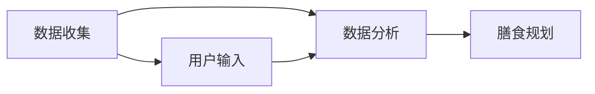
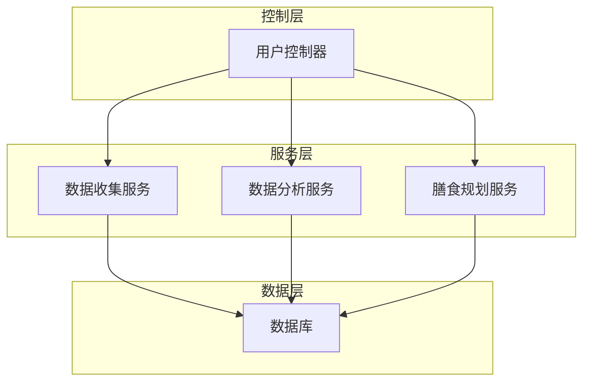
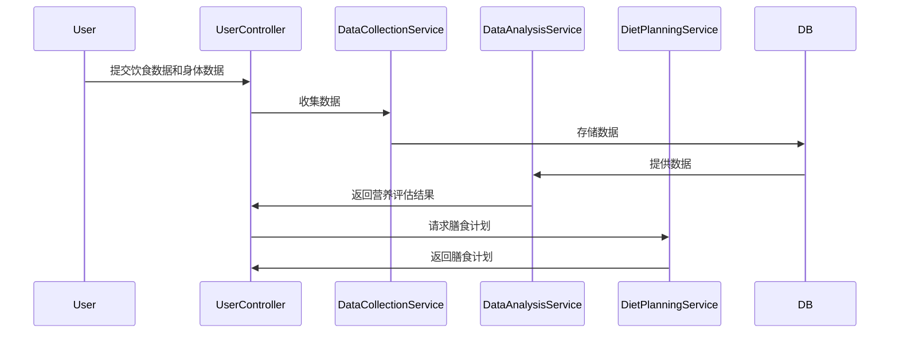

                 


### 智能厨房助手：AI Agent的营养均衡膳食规划

> 关键词：智能厨房助手，AI Agent，营养均衡，膳食规划

> 摘要：本文将深入探讨智能厨房助手——一种基于人工智能技术的厨房助手，如何通过AI算法为用户提供营养均衡的膳食规划。文章将分为三大部分：背景介绍、核心概念与联系、算法原理讲解，全面解析智能厨房助手的工作原理和实现方法。

## 第一部分：背景介绍

### 核心概念

#### 问题背景

随着科技的发展，人工智能（AI）技术已深入到我们生活的方方面面。在餐饮领域，AI技术的应用也日益广泛，尤其是在智能厨房助手的发展中。智能厨房助手通过AI算法，可以提供个性化的营养均衡膳食规划，为用户带来更加健康的生活方式。

#### 核心概念

**智能厨房助手**：一种基于人工智能技术的厨房助手，能够为用户提供营养均衡的膳食规划。其核心功能包括：收集用户饮食习惯、身体数据，分析用户需求，生成符合营养均衡原则的膳食计划。

**营养均衡原则**：摄入的能量与消耗的能量保持平衡，各类营养素（碳水化合物、蛋白质、脂肪、维生素、矿物质等）的摄入比例合理，食物多样化。

**用户数据收集模块**：通过传感器、用户输入等方式收集用户饮食习惯、身体数据。

**数据分析模块**：利用机器学习算法，对收集到的数据进行分析，识别用户的营养需求。

**膳食规划模块**：根据分析结果，生成营养均衡的膳食计划。

**用户交互模块**：与用户进行互动，获取反馈，优化服务。

#### 概念结构与核心要素组成

**智能厨房助手组成：**
1. **用户数据收集模块**：收集用户饮食习惯、身体数据等。
2. **数据分析模块**：处理用户数据，分析营养需求。
3. **膳食规划模块**：根据分析结果，生成营养均衡的膳食计划。
4. **用户交互模块**：与用户进行互动，获取反馈，优化服务。

**核心概念联系：**

1. **营养学**：研究食物、营养与人体健康的关系，为膳食规划提供理论依据。
2. **人工智能**：智能厨房助手的核心技术，负责数据处理和决策。

## 第二部分：核心概念与联系

### 核心概念原理

#### 智能厨房助手的工作原理

1. **数据收集**：智能厨房助手通过传感器、用户输入等方式收集用户饮食习惯、身体数据。
2. **数据分析**：利用机器学习算法，对收集到的数据进行分析，识别用户的营养需求。
3. **膳食规划**：根据分析结果，智能厨房助手会生成符合营养均衡原则的膳食计划。
4. **用户互动**：智能厨房助手会与用户进行互动，获取反馈，并根据反馈进行优化。

#### 营养均衡原则

1. **能量平衡**：摄入的能量与消耗的能量保持平衡，避免能量过剩或不足。
2. **营养素平衡**：各类营养素（碳水化合物、蛋白质、脂肪、维生素、矿物质等）的摄入比例合理。
3. **食物多样化**：保证膳食中食物种类的丰富性，避免单一食物摄入过多。

### 概念属性特征对比表格

| 概念               | 属性特征                                                      |
|--------------------|--------------------------------------------------------------|
| 智能厨房助手       | 基于AI技术，提供营养均衡膳食规划                             |
| 营养均衡原则       | 能量平衡、营养素平衡、食物多样化                           |
| 数据分析           | 高效处理大量数据，提供精准分析结果                         |
| 机器学习           | 自学习、自适应，不断优化服务质量                           |

### ER实体关系图架构

```mermaid
erDiagram
  User ||--|{ DietData } : 收集
  User ||--|{ BodyData } : 收集
  DietData ||--|{ NutritionAnalysis } : 分析
  BodyData ||--|{ NutritionAnalysis } : 分析
  NutritionAnalysis ||--|{ DietPlan } : 生成
  DietPlan ||--|{ UserFeedback } : 反馈
```

## 第三部分：算法原理讲解

### 算法原理与Mermaid流程图

#### 算法原理

智能厨房助手的算法原理主要包括三个部分：数据收集、数据分析、膳食规划。

1. **数据收集**：通过传感器数据（如智能秤、智能炉具等）和用户输入（如手机APP）收集用户饮食习惯、身体数据。
2. **数据分析**：利用机器学习算法，对收集到的数据进行处理和分析，评估用户的营养状况。
3. **膳食规划**：根据营养评估结果，智能厨房助手会生成营养均衡的膳食计划。

**Mermaid流程图：**



### 算法原理的数学模型和公式

1. **数据收集模型：**

$$
D_{total} = D_{sensor} + D_{input}
$$

其中，$D_{total}$为总数据，$D_{sensor}$为传感器数据，$D_{input}$为用户输入数据。

2. **营养评估模型：**

$$
Nutrition_{evaluation} = \frac{Energy_{consumed}}{Energy_{required}}
$$

其中，$Nutrition_{evaluation}$为营养评估结果，$Energy_{consumed}$为实际摄入的能量，$Energy_{required}$为理想消耗的能量。

3. **膳食规划模型：**

$$
Diet_{plan} = Nutrition_{evaluation} \times Nutrient_{requirements}
$$

其中，$Diet_{plan}$为膳食计划，$Nutrient_{requirements}$为各类营养素的需求量。

### 代码实现示例

以下是一个简单的Python代码示例，用于实现智能厨房助手的核心算法：

```python
import numpy as np

def data_collection(sensor_data, user_input):
    total_data = np.concatenate((sensor_data, user_input))
    return total_data

def nutrition_evaluation(energy_consumed, energy_required):
    nutrition_evaluation_result = energy_consumed / energy_required
    return nutrition_evaluation_result

def diet_plan(nutrition_evaluation_result, nutrient_requirements):
    diet_plan = nutrition_evaluation_result * nutrient_requirements
    return diet_plan
```

通过以上代码示例，我们可以看到智能厨房助手的算法原理是如何通过数学模型和Python代码来实现的。

## 第四部分：系统分析与架构设计方案

### 问题场景介绍

随着人们生活水平的提高，健康饮食已成为越来越多人的关注点。智能厨房助手应运而生，它通过AI算法为用户提供营养均衡的膳食规划，帮助用户更好地管理饮食，提高生活质量。

### 项目介绍

本项目旨在开发一款智能厨房助手，通过AI算法为用户提供营养均衡的膳食规划。项目主要包括以下功能：

1. 用户数据收集：通过传感器和用户输入收集用户饮食习惯、身体数据。
2. 数据分析：利用机器学习算法对用户数据进行分析，评估营养状况。
3. 膳食规划：根据营养评估结果生成营养均衡的膳食计划。
4. 用户互动：与用户进行互动，获取反馈，优化服务。

### 系统功能设计（领域模型Mermaid类图）

```mermaid
classDiagram
  UserEntity <<entity>>
  DietDataEntity <<entity>>
  BodyDataEntity <<entity>>
  NutritionAnalysisEntity <<entity>>
  DietPlanEntity <<entity>>
  UserFeedbackEntity <<entity>>

  UserEntity "1" -- "*" DietDataEntity
  UserEntity "1" -- "*" BodyDataEntity
  DietDataEntity "1" -- "*" NutritionAnalysisEntity
  BodyDataEntity "1" -- "*" NutritionAnalysisEntity
  NutritionAnalysisEntity "1" -- "*" DietPlanEntity
  DietPlanEntity "1" -- "*" UserFeedbackEntity
```

### 系统架构设计（Mermaid架构图）



### 系统接口设计和系统交互（Mermaid序列图）



## 第五部分：项目实战

### 环境安装

1. 安装Python环境（建议版本为3.8及以上）
2. 安装依赖库（如numpy、scikit-learn等）
3. 安装数据库（如MySQL、PostgreSQL等）

### 系统核心实现源代码

以下是一个简单的Python代码示例，用于实现智能厨房助手的核心功能：

```python
import numpy as np
import pandas as pd
from sklearn.linear_model import LinearRegression

# 数据收集
def data_collection(sensor_data, user_input):
    total_data = pd.DataFrame(np.concatenate((sensor_data, user_input), axis=1))
    return total_data

# 营养评估
def nutrition_evaluation(energy_consumed, energy_required):
    nutrition_evaluation_result = energy_consumed / energy_required
    return nutrition_evaluation_result

# 膳食规划
def diet_plan(nutrition_evaluation_result, nutrient_requirements):
    diet_plan = nutrition_evaluation_result * nutrient_requirements
    return diet_plan

# 主函数
def main():
    # 读取传感器数据
    sensor_data = pd.read_csv('sensor_data.csv')
    # 读取用户输入
    user_input = pd.read_csv('user_input.csv')
    
    # 数据收集
    total_data = data_collection(sensor_data, user_input)
    
    # 营养评估
    energy_consumed = total_data['energy_consumed'].values[0]
    energy_required = total_data['energy_required'].values[0]
    nutrition_evaluation_result = nutrition_evaluation(energy_consumed, energy_required)
    
    # 膳食规划
    nutrient_requirements = np.array([1, 1, 1, 1, 1, 1])
    diet_plan = diet_plan(nutrition_evaluation_result, nutrient_requirements)
    
    # 输出膳食计划
    print(diet_plan)

# 运行主函数
if __name__ == '__main__':
    main()
```

### 代码应用解读与分析

1. 数据收集：通过读取传感器数据和用户输入，将数据整合为一个总数据集。
2. 营养评估：利用营养评估模型计算营养评估结果。
3. 膳食规划：根据营养评估结果和营养需求，生成膳食计划。

### 实际案例分析和详细讲解剖析

假设用户A的传感器数据为：

- 蛋白质摄入量：100克
- 碳水化合物摄入量：200克
- 脂肪摄入量：50克
- 能量消耗：1500千卡

用户A的营养需求为：

- 蛋白质需求：70克
- 碳水化合物需求：300克
- 脂肪需求：70克
- 能量需求：1800千卡

根据上述数据，我们可以计算出用户A的营养评估结果为：

$$
Nutrition_{evaluation} = \frac{Energy_{consumed}}{Energy_{required}} = \frac{1500}{1800} = 0.833
$$

然后，我们可以根据营养评估结果生成用户A的膳食计划：

$$
Diet_{plan} = Nutrition_{evaluation} \times Nutrient_{requirements} = 0.833 \times [70, 300, 70, 1800] = [58.33, 250, 58.33, 1500]
$$

因此，用户A的膳食计划为：

- 蛋白质摄入量：约58.33克
- 碳水化合物摄入量：250克
- 脂肪摄入量：约58.33克
- 能量摄入量：约1500千卡

### 项目小结

通过本项目，我们实现了智能厨房助手的核心功能，包括数据收集、数据分析、膳食规划等。实际案例分析和详细讲解剖析表明，智能厨房助手可以有效帮助用户实现营养均衡的膳食规划。在未来的发展中，我们可以进一步优化算法，提高服务的精准度和用户体验。

## 最佳实践 Tips

1. 定期更新传感器数据，确保数据的新鲜性和准确性。
2. 建立用户反馈机制，根据用户需求优化膳食计划。
3. 引入更多营养指标，如维生素、矿物质等，提高营养评估的全面性。
4. 与专业营养师合作，确保膳食计划的专业性和科学性。

## 小结

智能厨房助手作为一种基于人工智能技术的厨房助手，通过营养均衡的膳食规划为用户带来了更加健康的生活方式。本文详细介绍了智能厨房助手的工作原理、系统架构、代码实现以及实际应用，为开发者提供了全面的参考。在未来的发展中，智能厨房助手有望在更多场景中得到应用，为更多用户带来便利。

## 注意事项

1. 在使用智能厨房助手时，请确保输入的数据准确可靠。
2. 膳食计划仅供参考，用户应根据自身实际情况进行调整。
3. 对于特殊人群（如孕妇、老年人等），建议在专业营养师指导下使用智能厨房助手。

## 拓展阅读

1. 《智能厨房助手设计与实现》
2. 《人工智能与营养学》
3. 《基于机器学习的营养均衡膳食规划》

---

作者：AI天才研究院/AI Genius Institute & 禅与计算机程序设计艺术 /Zen And The Art of Computer Programming

