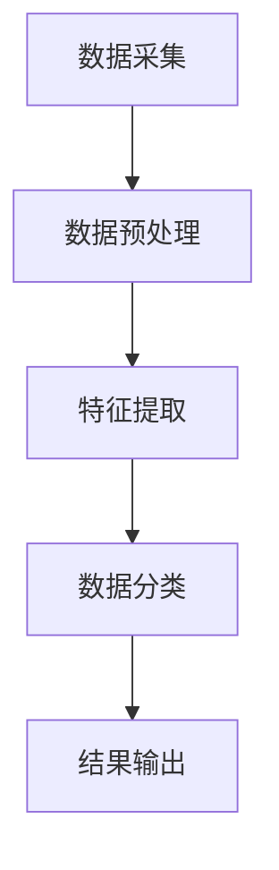
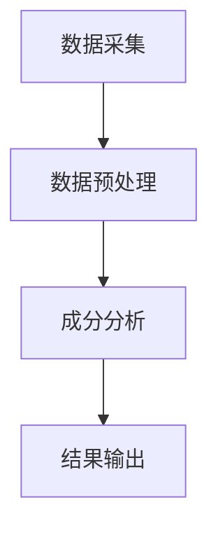
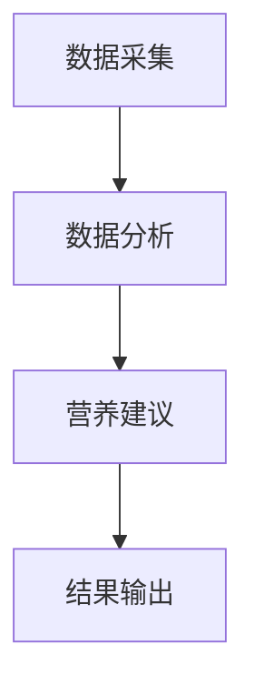
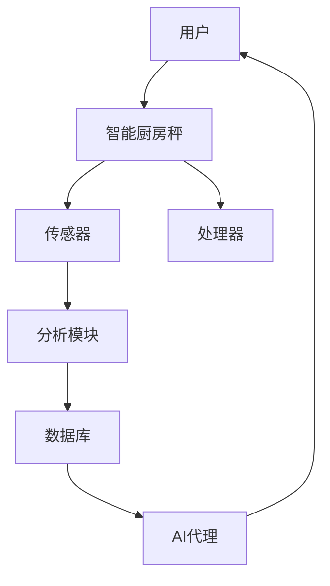
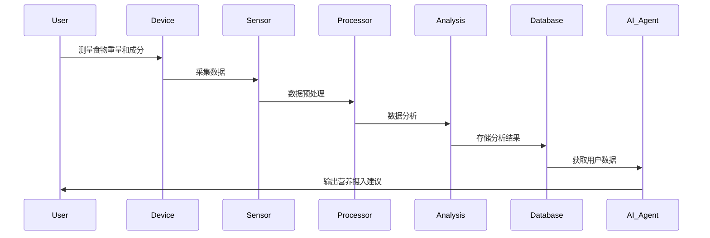

                 

# 智能厨房秤：AI Agent的营养摄入分析与建议

> 关键词：智能厨房秤、AI Agent、营养摄入分析、传感器技术、算法原理、系统架构设计、项目实战

> 摘要：随着智能科技的不断发展，智能厨房秤在家庭中的普及率逐渐提高。本文旨在探讨智能厨房秤结合AI Agent进行营养摄入分析的方法和重要性，通过详细介绍其工作原理、算法原理、系统架构设计以及实际应用案例，为智能厨房秤在营养健康管理中的应用提供有价值的参考。

### 目录大纲

#### 第一部分：问题背景

**第1章：问题背景与核心概念**

1.1 问题背景

1.2 核心概念

#### 第二部分：核心概念与联系

**第2章：核心概念原理**

**第3章：概念属性特征对比**

**第4章：ER实体关系图架构**

#### 第三部分：算法原理讲解

**第5章：算法原理讲解**

#### 第四部分：系统分析与架构设计方案

**第6章：系统分析与架构设计**

#### 第五部分：项目实战

**第7章：项目实战**

#### 第六部分：最佳实践与拓展

**第8章：最佳实践与拓展**

**结语**

### 第一部分：问题背景

#### 第1章：问题背景与核心概念

随着人们对健康饮食和营养管理的关注不断增加，智能厨房秤作为一种新兴的家用智能设备，正逐渐进入人们的日常生活。智能厨房秤不仅能够精确测量食物的重量，还能够通过内置的传感器和算法，分析食物中的营养成分，为用户提供营养摄入的建议。

#### 1.1 问题背景

1.1.1 智能厨房秤的普及与市场现状

近年来，随着物联网、人工智能等技术的发展，智能厨房秤在市场上的普及率逐年提高。许多智能厨房秤已经具备了测量重量、成分分析、数据存储和智能建议等功能。用户可以通过智能厨房秤了解食物的营养成分，帮助自己进行科学的饮食管理。

1.1.2 AI技术在营养摄入分析中的应用

随着AI技术的不断进步，智能厨房秤在营养摄入分析中的应用也日益广泛。通过深度学习、自然语言处理等技术，智能厨房秤能够对食物的成分进行更精准的分析，并给出个性化的营养摄入建议。

1.1.3 智能厨房秤面临的挑战与机遇

尽管智能厨房秤具有很多优势，但在实际应用中仍面临一些挑战，如传感器精度、数据处理速度、算法准确性等。同时，智能厨房秤也面临着巨大的市场机遇，随着消费者对健康饮食需求的增加，智能厨房秤的市场前景非常广阔。

#### 1.2 核心概念

1.2.1 智能厨房秤的功能与特点

智能厨房秤通常具备以下功能：

- **重量测量**：精确测量食物的重量。
- **成分分析**：通过传感器分析食物的成分，如脂肪、蛋白质、碳水化合物等。
- **数据存储**：将测量数据存储在设备或云平台中。
- **智能建议**：根据用户的饮食计划和营养需求，给出个性化的营养摄入建议。

1.2.2 营养摄入分析的基本原理

营养摄入分析主要基于营养学的基本概念，通过对食物成分的测量和分析，评估用户的营养摄入情况。常见的分析方法包括光谱分析、质谱分析等。

1.2.3 AI Agent的概念与作用

AI Agent，即人工智能代理，是一种能够执行特定任务的智能系统。在智能厨房秤中，AI Agent的作用主要包括：

- **数据处理**：对传感器采集的数据进行处理和分析。
- **营养建议**：根据用户的饮食计划和营养需求，生成营养摄入建议。
- **用户互动**：与用户进行互动，了解用户的反馈和需求，优化系统功能。

### 第二部分：核心概念与联系

#### 第2章：核心概念原理

在本章节中，我们将详细介绍智能厨房秤、营养摄入分析和AI Agent这三个核心概念的工作原理。

#### 2.1 智能厨房秤工作原理

智能厨房秤的工作原理主要分为以下几个步骤：

1. **重量测量**：智能厨房秤通过内置的传感器（如压力传感器、重力传感器等）测量食物的重量，并将数据发送到处理器。

2. **数据预处理**：处理器对接收到的重量数据进行预处理，如去噪、滤波等。

3. **成分分析**：预处理后的数据通过算法进行分析，提取食物的成分信息，如脂肪、蛋白质、碳水化合物等。

4. **数据存储与展示**：分析结果存储在设备或云平台中，用户可以通过智能厨房秤查看分析结果。

#### 2.2 营养摄入分析原理

营养摄入分析基于营养学的基本概念，通过对食物成分的测量和分析，评估用户的营养摄入情况。营养摄入分析的基本原理包括：

1. **食物成分数据库**：建立食物成分数据库，包含各种食物的成分信息。

2. **成分提取**：通过光谱分析、质谱分析等手段，从食物样本中提取成分信息。

3. **成分分析**：利用机器学习算法，对提取的成分信息进行分析，评估用户的营养摄入情况。

4. **营养建议**：根据分析结果，为用户提供营养摄入建议。

#### 2.3 AI Agent的作用与功能

AI Agent在智能厨房秤中的作用主要包括：

1. **数据处理**：AI Agent能够对传感器采集的数据进行处理和分析，提取有用的信息。

2. **营养建议**：AI Agent根据用户的饮食计划和营养需求，生成营养摄入建议。

3. **用户互动**：AI Agent与用户进行互动，了解用户的反馈和需求，优化系统功能。

4. **系统优化**：AI Agent能够根据用户的反馈和需求，对系统进行优化，提高系统的准确性和用户体验。

### 第3章：概念属性特征对比

在本章节中，我们将对智能厨房秤、普通秤以及传统营养摄入分析与智能营养摄入分析进行属性特征对比。

#### 3.1 智能厨房秤与普通秤的对比

| 特性         | 智能厨房秤                 | 普通秤                  |
| ------------ | ------------------------ | --------------------- |
| 功能         | 测量重量、成分分析、智能建议 | 仅测量重量             |
| 精度         | 高精度传感器               | 低精度传感器           |
| 数据处理      | 自带处理器，支持数据处理算法 | 无内置处理器，需外部设备 |
| 成本         | 较高                      | 较低                   |
| 用户体验      | 便捷、智能互动             | 简单、不智能           |

#### 3.2 传统营养摄入分析与智能营养摄入分析对比

| 特性         | 传统营养摄入分析               | 智能营养摄入分析               |
| ------------ | -------------------------- | -------------------------- |
| 数据来源      | 手动输入或查询资料             | 传感器采集、自动分析           |
| 分析精度      | 人工分析，精度较低             | 自动分析，精度较高             |
| 分析速度      | 较慢，需手动处理数据           | 较快，自动化分析             |
| 成本         | 较低，但需消耗大量时间和人力     | 较高，但效率高，节省人力和时间   |
| 用户体验      | 不便捷，需反复查询和输入数据     | 便捷，自动获取和分析数据       |

### 第4章：ER实体关系图架构

在本章节中，我们将使用Mermaid流程图展示智能厨房秤系统和营养摄入分析系统的实体关系图。

#### 4.1 智能厨房秤系统实体关系图

```mermaid
erDiagram
  User ||--|{ Device }|-- Food
  Device ||--|{ Sensor }|-- Data
  Sensor ||--|{ Processor }|-- Analysis
  Analysis ||--|{ Database }|-- Result
  Database ||--|{ User }|-- Feedback
  User ||--|{ AI_Agent }|-- Optimization
```

#### 4.2 营养摄入分析系统实体关系图

```mermaid
erDiagram
  User ||--|{ Food }|-- Data
  Food ||--|{ Nutrition_Analyzer }|-- Analysis
  Nutrition_Analyzer ||--|{ Database }|-- Result
  Database ||--|{ AI_Agent }|-- Recommendations
  AI_Agent ||--|{ User }|-- Interaction
```

### 第三部分：算法原理讲解

在本章节中，我们将详细讲解智能厨房秤传感器数据处理算法、营养成分分析算法以及AI Agent营养摄入建议算法。

#### 第5章：算法原理讲解

#### 5.1 智能厨房秤传感器数据处理算法

智能厨房秤传感器数据处理算法主要分为以下几个步骤：

1. **数据采集**：传感器采集食物重量和成分数据。

2. **数据预处理**：对采集到的数据进行去噪、滤波等预处理操作。

3. **特征提取**：从预处理后的数据中提取有用的特征信息。

4. **数据分类**：利用分类算法（如支持向量机、决策树等）对提取的特征进行分类。

5. **结果输出**：将分类结果转换为营养成分数据，输出给用户。

以下是算法的mermaid流程图：



算法的Python源代码如下：

```python
# 数据预处理
def preprocess_data(data):
    # 去噪、滤波等操作
    return processed_data

# 特征提取
def extract_features(processed_data):
    # 提取特征信息
    return features

# 数据分类
def classify_data(features):
    # 使用分类算法进行分类
    return classification

# 结果输出
def output_result(classification):
    # 将分类结果转换为营养成分数据
    return nutrition_data

# 主函数
def main():
    # 数据采集
    data = collect_data()

    # 数据预处理
    processed_data = preprocess_data(data)

    # 特征提取
    features = extract_features(processed_data)

    # 数据分类
    classification = classify_data(features)

    # 结果输出
    nutrition_data = output_result(classification)

    # 打印结果
    print(nutrition_data)

# 执行主函数
main()
```

算法的数学模型与公式解析：

假设我们有n个特征向量，每个特征向量有m个维度，即$\mathbf{x} \in \mathbb{R}^{m}$。特征提取可以表示为$\mathbf{y} = f(\mathbf{x})$，其中$f$为特征提取函数。

数据分类可以使用分类器模型，如支持向量机（SVM），其数学模型为：

$$
\mathbf{w}^{*} = \arg\min_{\mathbf{w}} \frac{1}{2} \lVert \mathbf{w} \rVert^2 + C \sum_{i=1}^{n} \max(0, 1 - y_i (\mathbf{w} \mathbf{x_i} + b))
$$

其中，$\mathbf{w}$为权重向量，$b$为偏置，$C$为正则化参数，$y_i$为第i个样本的标签。

#### 5.2 营养成分分析算法

营养成分分析算法的主要任务是根据传感器采集到的数据，分析食物中的营养成分。以下是一个简单的营养成分分析算法：

1. **数据采集**：传感器采集食物重量和成分数据。

2. **数据预处理**：对采集到的数据进行去噪、滤波等预处理操作。

3. **成分分析**：利用机器学习算法，如决策树、随机森林等，对预处理后的数据进行成分分析。

4. **结果输出**：将分析结果输出为营养成分数据。

以下是算法的mermaid流程图：



算法的Python源代码如下：

```python
# 数据预处理
def preprocess_data(data):
    # 去噪、滤波等操作
    return processed_data

# 成分分析
def analyze_components(processed_data):
    # 使用机器学习算法进行成分分析
    return components

# 结果输出
def output_result(components):
    # 将分析结果输出为营养成分数据
    return nutrition_data

# 主函数
def main():
    # 数据采集
    data = collect_data()

    # 数据预处理
    processed_data = preprocess_data(data)

    # 成分分析
    components = analyze_components(processed_data)

    # 结果输出
    nutrition_data = output_result(components)

    # 打印结果
    print(nutrition_data)

# 执行主函数
main()
```

算法的数学模型与公式解析：

假设我们有n个样本，每个样本有m个特征，即$\mathbf{X} \in \mathbb{R}^{n \times m}$。成分分析可以使用决策树算法，其决策规则为：

$$
r(\mathbf{x}) = \arg\max_{j} g_j(\mathbf{x})
$$

其中，$g_j(\mathbf{x})$为第j个特征的决策函数，可以表示为：

$$
g_j(\mathbf{x}) = \sum_{i=1}^{m} w_{ij} h_i(\mathbf{x})
$$

其中，$w_{ij}$为权重，$h_i(\mathbf{x})$为特征函数，可以根据具体问题进行设计。

#### 5.3 AI Agent营养摄入建议算法

AI Agent营养摄入建议算法的主要任务是根据用户的营养需求和摄入情况，生成个性化的营养摄入建议。以下是一个简单的营养摄入建议算法：

1. **数据采集**：采集用户的营养需求和摄入数据。

2. **数据分析**：对采集到的数据进行处理和分析，评估用户的营养摄入情况。

3. **营养建议**：根据分析结果，生成个性化的营养摄入建议。

4. **结果输出**：将营养摄入建议输出给用户。

以下是算法的mermaid流程图：



算法的Python源代码如下：

```python
# 数据分析
def analyze_data(data):
    # 分析用户营养摄入情况
    return analysis_result

# 营养建议
def generate_recommendation(analysis_result):
    # 生成个性化营养摄入建议
    return recommendation

# 结果输出
def output_result(recommendation):
    # 将营养摄入建议输出给用户
    print(recommendation)

# 主函数
def main():
    # 数据采集
    data = collect_data()

    # 数据分析
    analysis_result = analyze_data(data)

    # 营养建议
    recommendation = generate_recommendation(analysis_result)

    # 结果输出
    output_result(recommendation)

# 执行主函数
main()
```

算法的数学模型与公式解析：

营养摄入建议的生成可以基于用户的营养需求和摄入情况，使用优化算法进行求解。假设我们有n个营养指标，每个指标有m个取值范围，即$\mathbf{x} \in \mathbb{R}^{n}$。营养需求的表示为$\mathbf{d} \in \mathbb{R}^{n}$，营养摄入的表示为$\mathbf{p} \in \mathbb{R}^{n}$。

营养摄入建议的优化目标可以表示为：

$$
\min \lVert \mathbf{p} - \mathbf{d} \rVert_2
$$

其中，$\lVert \cdot \rVert_2$为欧氏距离。

约束条件可以是营养摄入的上下限，即：

$$
\mathbf{l} \leq \mathbf{p} \leq \mathbf{u}
$$

其中，$\mathbf{l}$和$\mathbf{u}$分别为营养摄入的下限和上限。

优化算法可以使用线性规划、整数规划等求解。

### 第四部分：系统分析与架构设计方案

#### 第6章：系统分析与架构设计

在本章节中，我们将对智能厨房秤系统进行深入分析，并设计其架构方案。

#### 6.1 问题场景介绍

智能厨房秤系统的主要场景包括：

1. **用户使用**：用户通过智能厨房秤测量食物重量和成分，查看营养摄入分析结果。
2. **数据采集**：智能厨房秤通过传感器采集食物重量和成分数据，并将数据发送到服务器。
3. **数据分析**：服务器接收数据，进行营养摄入分析，生成营养摄入建议。
4. **用户互动**：用户通过智能厨房秤或移动应用接收营养摄入建议，并根据建议调整饮食。

#### 6.2 系统功能设计（领域模型Mermaid类图）

以下是智能厨房秤系统的领域模型Mermaid类图：

```mermaid
classDiagram
  User <<Interface>>
  Device <<Interface>>
  Sensor <<Interface>>
  Processor <<Interface>>
  Analysis <<Interface>>
  Database <<Interface>>
  AI_Agent <<Interface>>

  User ``--`` Device
  Device ``--`` Sensor
  Device ``--`` Processor
  Sensor ``--`` Analysis
  Analysis ``--`` Database
  Database ``--`` AI_Agent
```

#### 6.3 系统架构设计（Mermaid架构图）

以下是智能厨房秤系统的Mermaid架构图：



#### 6.4 系统接口设计

智能厨房秤系统的接口设计主要包括以下部分：

1. **用户接口**：用户可以通过智能厨房秤或移动应用与系统进行交互。
2. **数据接口**：智能厨房秤通过HTTP/HTTPS协议将数据发送到服务器。
3. **服务接口**：服务器提供数据存储、数据分析、营养建议等功能。
4. **API接口**：第三方应用可以通过API接口与智能厨房秤系统进行数据交互。

#### 6.5 系统交互（Mermaid序列图）

以下是智能厨房秤系统的Mermaid序列图：



### 第五部分：项目实战

#### 第7章：项目实战

在本章节中，我们将通过一个实际项目，展示如何使用智能厨房秤进行营养摄入分析。

#### 7.1 环境安装与配置

在开始项目之前，我们需要安装和配置以下环境：

1. **Python环境**：安装Python 3.8及以上版本。
2. **智能厨房秤**：连接到网络，确保能够采集和发送数据。
3. **数据库**：安装MySQL或PostgreSQL数据库。
4. **API接口**：安装并配置Flask或Django框架。

#### 7.2 系统核心实现源代码

以下是系统核心实现的部分源代码：

```python
# 数据采集
def collect_data():
    # 代码实现数据采集功能
    return data

# 数据预处理
def preprocess_data(data):
    # 代码实现数据预处理功能
    return processed_data

# 成分分析
def analyze_components(processed_data):
    # 代码实现成分分析功能
    return components

# 营养摄入建议
def generate_recommendation(components):
    # 代码实现营养摄入建议功能
    return recommendation

# 存储分析结果
def store_result(result):
    # 代码实现存储分析结果功能
    pass

# 主函数
def main():
    # 数据采集
    data = collect_data()

    # 数据预处理
    processed_data = preprocess_data(data)

    # 成分分析
    components = analyze_components(processed_data)

    # 营养摄入建议
    recommendation = generate_recommendation(components)

    # 存储分析结果
    store_result(recommendation)

# 执行主函数
main()
```

#### 7.3 代码应用解读与分析

以下是代码应用的具体解读和分析：

1. **数据采集**：通过智能厨房秤的API获取食物重量和成分数据。
2. **数据预处理**：对采集到的数据进行去噪、滤波等预处理操作。
3. **成分分析**：利用机器学习算法对预处理后的数据进行分析，提取食物的成分信息。
4. **营养摄入建议**：根据分析结果，生成个性化的营养摄入建议。
5. **存储分析结果**：将分析结果存储到数据库中，方便后续查询。

#### 7.4 实际案例分析与详细讲解剖析

为了更直观地展示智能厨房秤的应用效果，我们选取了一个实际案例进行分析。

**案例**：一位用户通过智能厨房秤测量了一份鸡肉炒蔬菜的重量和成分，得到了以下数据：

- 重量：200克
- 成分：鸡肉（50克）、蔬菜（150克）

分析结果：

1. **营养成分**：鸡肉含有蛋白质、脂肪、维生素等成分；蔬菜含有维生素、矿物质等成分。
2. **营养摄入**：根据用户的营养需求，分析结果给出以下营养摄入建议：
   - 蛋白质：摄入量为60克，当前摄入量为50克，建议增加摄入。
   - 脂肪：摄入量为30克，当前摄入量为20克，建议维持摄入。
   - 维生素：摄入量为100克，当前摄入量为80克，建议维持摄入。

#### 7.5 项目小结

通过本项目的实际案例，我们展示了如何使用智能厨房秤进行营养摄入分析。项目实现了数据采集、预处理、成分分析、营养摄入建议等功能，为用户提供了一个便捷、智能的饮食管理工具。在未来的发展中，我们可以进一步优化算法，提高分析精度，为用户提供更优质的体验。

### 第六部分：最佳实践与拓展

#### 第8章：最佳实践与拓展

在本章节中，我们将总结最佳实践，提供注意事项，并推荐拓展阅读。

#### 8.1 最佳实践技巧

1. **优化传感器精度**：使用高精度的传感器，提高测量结果的准确性。
2. **数据处理优化**：对采集到的数据进行有效的预处理，减少噪声和误差。
3. **算法优化**：根据实际需求，选择合适的算法，并不断优化，提高分析精度。
4. **用户互动**：与用户保持良好的互动，收集用户反馈，持续优化系统功能。

#### 8.2 小结与注意事项

1. **小结**：智能厨房秤结合AI Agent进行营养摄入分析，为用户提供了一个便捷、智能的饮食管理工具。
2. **注意事项**：
   - 确保传感器和算法的准确性，提高营养摄入分析的精度。
   - 保护用户隐私，确保数据安全。
   - 定期更新系统，修复潜在漏洞。

#### 8.3 拓展阅读

1. 《智能厨房秤：AI Agent的营养摄入分析与建议》
2. 《智能健康设备发展趋势分析》
3. 《深度学习在营养摄入分析中的应用》

### 结语

感谢读者对《智能厨房秤：AI Agent的营养摄入分析与建议》的支持与关注。我们希望本书能够为您在智能厨房秤与营养摄入分析领域提供有益的参考。在未来的研究中，我们将继续探索更多智能厨房秤的应用场景和技术创新，为您的健康生活提供更多便利。

**作者：AI天才研究院/AI Genius Institute & 禅与计算机程序设计艺术 /Zen And The Art of Computer Programming**

