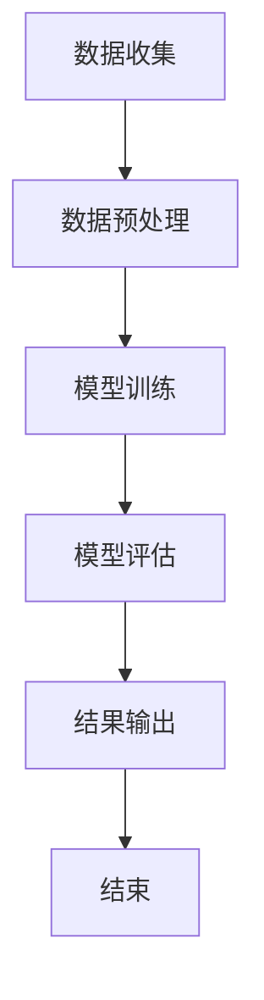
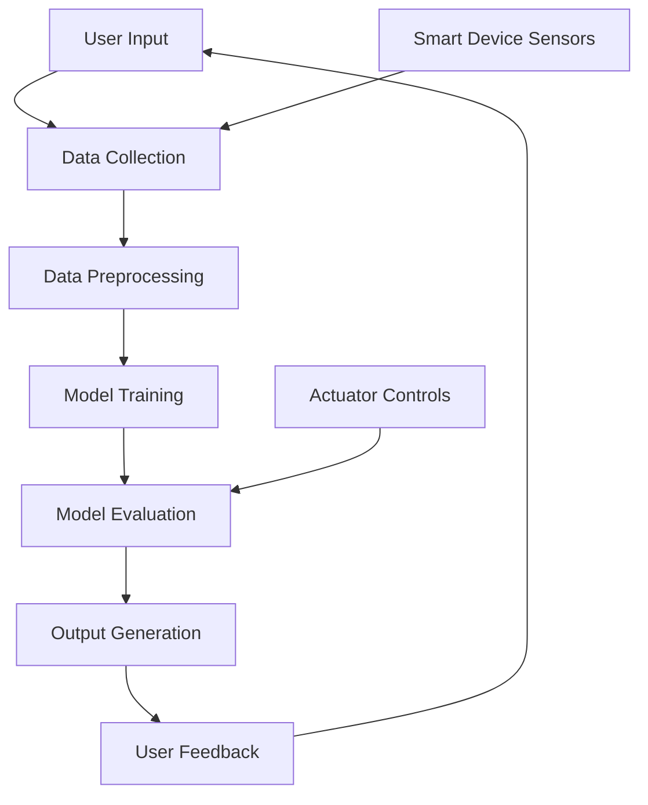
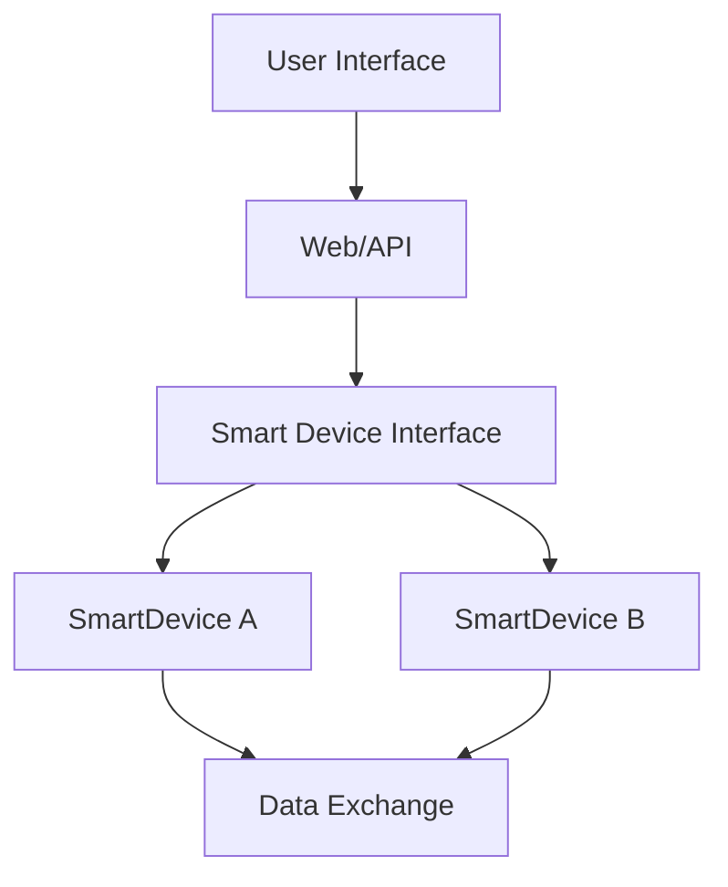

                 


### 摘要

在智能家居时代，智能厨房逐渐成为家庭的焦点。本文将探讨如何利用人工智能（AI）Agent技术来提升智能厨房的烹饪体验。文章首先介绍了智能厨房和AI Agent的基本概念，分析了烹饪过程中的需求和挑战。随后，我们提出了一个基于AI Agent的烹饪灵感激发模型，详细阐述了其原理、架构和实现步骤。此外，通过对算法的数学模型讲解和Python代码实现，我们展示了如何将理论转化为实践。最后，文章从系统分析与架构设计的角度，详细介绍了智能厨房置物架的整体设计，以及实际应用中的环境安装和系统核心实现。

本文旨在为读者提供一个全面、深入的智能厨房AI解决方案，帮助读者了解如何利用AI Agent技术为家庭烹饪带来创新和便利。

----------------------------------------------------------------

### 第一部分：背景介绍

#### 第1章：智能厨房与AI Agents概述

智能厨房作为智能家居的重要一环，正在逐渐改变我们的生活方式。而AI Agents作为人工智能的核心技术，正逐步渗透到智能厨房的各个领域，为用户带来前所未有的烹饪体验。在本章节中，我们将深入探讨智能厨房和AI Agents的概念，分析烹饪需求与挑战，并阐述AI Agents在这一领域中的作用。

##### 1.1.1 问题背景

###### 1.1.1.1 智能厨房的现状

智能厨房的定义涵盖了一系列集成的智能设备和系統，这些设备和系統协同工作，提供高效的烹饪体验。当前，智能厨房设备主要包括智能烤箱、智能冰箱、智能烹饪机器人、智能照明系统等。这些设备通过物联网（IoT）技术连接，实现数据的实时交换和协同操作，从而提升了烹饪的效率和便利性。

然而，尽管智能厨房技术取得了显著的进步，但烹饪过程中仍然面临诸多挑战。例如，用户对于个性化烹饪需求的满足度不高，厨房设备之间的交互不畅，烹饪过程中的安全问题等。

###### 1.1.1.2 烹饪需求与挑战

用户在烹饪过程中有着多样化的需求，包括食材的挑选、菜谱推荐、烹饪步骤指导、烹饪效果评估等。这些需求不仅要求智能厨房设备具备智能化的功能，还需要设备之间能够高效协同工作，提供一体化的解决方案。

然而，烹饪过程中的挑战也显而易见。首先，用户的烹饪技能和偏好各不相同，智能厨房设备需要具备高度的适应性。其次，烹饪过程中的变量较多，如食材的新鲜度、烹饪时间、烹饪火力等，这些因素都会影响烹饪效果。此外，烹饪过程中的安全问题也不容忽视，如燃气泄漏、火灾等。

###### 1.1.1.3 AI Agents的作用

为了解决上述问题，AI Agents技术在智能厨房中展现出巨大的潜力。AI Agents是一种能够自主执行任务、具备一定智能的软件实体。在智能厨房中，AI Agents可以充当虚拟厨师，根据用户的口味偏好和烹饪习惯，提供个性化的烹饪建议和服务。

AI Agents的主要作用包括：

1. **个性化菜谱推荐**：根据用户的烹饪历史和偏好，AI Agents能够推荐符合用户口味的菜谱。
2. **烹饪步骤指导**：AI Agents可以为用户提供详细的烹饪步骤，确保烹饪过程顺利进行。
3. **实时监控与调整**：AI Agents可以实时监控烹饪过程，根据食材的实时状态调整烹饪参数，保证烹饪效果。
4. **安全预警**：AI Agents可以实时检测厨房环境，如燃气泄漏、高温等异常情况，并及时发出预警，保障烹饪安全。

##### 1.1.2 问题描述

###### 1.1.2.1 需求分析

用户在烹饪过程中，希望能够获得以下服务：

1. **个性化推荐**：提供符合用户口味的菜谱和食材建议。
2. **智能指导**：提供详细的烹饪步骤和烹饪时间指导。
3. **实时监控**：实时监控烹饪过程，提供烹饪效果评估和调整建议。
4. **安全预警**：实时检测厨房环境，预警潜在的烹饪安全问题。

###### 1.1.2.2 技术限制

虽然AI Agents技术在智能厨房中具有广泛的应用前景，但在实际应用中仍面临以下技术限制：

1. **数据采集和处理**：智能厨房需要收集大量的烹饪数据，包括食材信息、烹饪参数、用户行为等。然而，数据采集和处理是一个复杂的过程，涉及到数据清洗、数据存储和数据安全等问题。
2. **算法优化**：AI Agents的算法需要不断优化，以提高模型的准确性和鲁棒性。这需要大量的数据支持和算法研究。
3. **设备协同**：智能厨房中的各个设备需要协同工作，实现数据的实时交换和协同操作。这要求设备之间具备良好的互操作性和兼容性。

###### 1.1.2.3 解决方案目标

为了克服上述技术限制，我们的解决方案目标如下：

1. **数据采集与处理**：建立高效的数据采集和处理系统，确保数据的质量和实时性。
2. **算法优化**：研究和应用先进的AI算法，提高模型的准确性和鲁棒性。
3. **设备协同**：设计高效的设备协同机制，实现数据的实时交换和协同操作。

##### 1.1.3 问题解决

###### 1.1.3.1 AI Agents基础

AI Agents是一种基于人工智能技术的软件实体，具有自主决策和执行任务的能力。在智能厨房中，AI Agents可以充当虚拟厨师，为用户提供个性化的烹饪服务。

AI Agents的主要特点包括：

1. **自主学习能力**：AI Agents可以通过机器学习和深度学习技术，从海量数据中学习用户的烹饪习惯和偏好，不断优化烹饪建议。
2. **实时决策能力**：AI Agents可以实时分析烹饪过程中的各种变量，提供实时的烹饪指导和调整建议。
3. **人机交互**：AI Agents具备自然语言处理和语音识别能力，可以与用户进行自然的人机交互，提供人性化的服务。

###### 1.1.3.2 烹饪灵感激发模型

为了实现上述解决方案目标，我们提出了一种基于AI Agents的烹饪灵感激发模型。该模型的主要架构包括数据采集模块、数据预处理模块、AI Agents模块和用户交互模块。

1. **数据采集模块**：该模块负责收集用户的烹饪数据，包括食材信息、烹饪参数、用户行为等。数据采集的途径包括智能厨房设备、用户输入和外部数据源等。
2. **数据预处理模块**：该模块对采集到的数据进行清洗、转换和归一化处理，确保数据的质量和一致性。
3. **AI Agents模块**：该模块包括多个AI Agents，每个AI Agents负责不同的功能，如菜谱推荐、烹饪步骤指导、实时监控和安全预警等。
4. **用户交互模块**：该模块负责与用户进行交互，接收用户的反馈和指令，并将AI Agents的烹饪建议和指导呈现给用户。

###### 1.1.3.3 实施策略

为了实施上述解决方案，我们制定了以下实施策略：

1. **数据采集与处理**：首先，设计高效的数据采集系统，确保数据的实时性和准确性。其次，建立数据预处理流程，包括数据清洗、转换和归一化等步骤，确保数据的质量和一致性。
2. **AI Agents开发**：基于Python和TensorFlow等开源框架，开发多个AI Agents，实现个性化的菜谱推荐、烹饪步骤指导、实时监控和安全预警等功能。
3. **用户交互界面**：设计用户友好的交互界面，包括语音识别和自然语言处理模块，确保用户可以轻松地与AI Agents进行交互。
4. **系统集成与测试**：将数据采集与处理模块、AI Agents模块和用户交互模块集成到一个系统中，进行全面的测试和优化，确保系统的稳定性和可靠性。

##### 1.1.4 边界与外延

###### 1.1.4.1 系统边界

智能厨房置物架的AI Agents解决方案主要关注以下几个方面：

1. **菜谱推荐**：根据用户的口味偏好和烹饪历史，推荐个性化的菜谱。
2. **烹饪步骤指导**：提供详细的烹饪步骤和烹饪时间指导，帮助用户顺利完成烹饪过程。
3. **实时监控**：实时监控烹饪过程，提供烹饪效果评估和调整建议。
4. **安全预警**：实时检测厨房环境，预警潜在的烹饪安全问题。

该解决方案不涉及食材采购、厨房设备控制等环节，但可以与这些环节进行集成，提供更全面的智能厨房解决方案。

###### 1.1.4.2 应用场景限制

智能厨房置物架的AI Agents解决方案主要适用于以下场景：

1. **家庭厨房**：为家庭用户提供个性化的烹饪服务，提升烹饪体验。
2. **餐厅厨房**：为餐厅提供智能化的烹饪管理，提高烹饪效率和顾客满意度。
3. **酒店厨房**：为酒店提供智能化的烹饪服务，提升服务质量和运营效率。

该解决方案不适用于极端环境下的烹饪场景，如野外露营、深海潜水等。

###### 1.1.4.3 未来发展趋势

随着人工智能技术的不断发展，智能厨房置物架的AI Agents解决方案将具有以下发展趋势：

1. **智能化水平提升**：AI Agents的智能化水平将不断提高，能够更好地理解用户的烹饪需求和偏好，提供更精准的服务。
2. **设备协同性增强**：智能厨房设备之间的协同性将得到增强，实现数据的实时交换和协同操作，提供更高效的一体化解决方案。
3. **用户体验优化**：用户交互界面将更加友好和智能，提供更加便捷和舒适的烹饪体验。

##### 1.1.5 概念结构与核心要素组成

###### 1.1.5.1 智能厨房概念

智能厨房是指利用信息技术和智能设备，实现厨房设备智能化、烹饪过程自动化和用户体验个性化的厨房环境。智能厨房包括智能烤箱、智能冰箱、智能烹饪机器人、智能照明系统等设备，通过物联网技术实现设备之间的互联互通，提供高效、便捷的烹饪体验。

###### 1.1.5.2 AI Agents概念

AI Agents是一种基于人工智能技术的软件实体，具有自主决策和执行任务的能力。AI Agents可以充当虚拟厨师，为用户提供个性化的烹饪服务，包括菜谱推荐、烹饪步骤指导、实时监控和安全预警等。

###### 1.1.5.3 烹饪灵感激发模型要素

烹饪灵感激发模型是智能厨房置物架的核心模块，包括数据采集模块、数据预处理模块、AI Agents模块和用户交互模块。数据采集模块负责收集用户的烹饪数据，数据预处理模块负责对数据进行清洗和预处理，AI Agents模块负责实现菜谱推荐、烹饪步骤指导、实时监控和安全预警等功能，用户交互模块负责与用户进行交互，接收用户的反馈和指令。

#### 第2章：核心概念与联系

在深入探讨智能厨房与AI Agents的技术细节之前，首先需要明确核心概念及其相互关系。本章将详细介绍AI Agents的基本原理、烹饪灵感激发模型的架构，并进行概念属性特征对比，同时利用ER实体关系图架构来展示各实体之间的联系。

##### 2.1 AI Agents原理

AI Agents是人工智能领域中的一种重要概念，它们是能够自主执行任务、具备一定智能的软件实体。AI Agents在智能厨房中的应用，主要体现在以下几个方面：

###### 2.1.1 概念与分类

AI Agents可以根据其功能、应用场景和实现技术进行分类。常见的分类方法包括：

1. **任务型AI Agents**：这类AI Agents主要根据预设的任务进行操作，例如智能音箱中的语音助手。
2. **目标导向型AI Agents**：这类AI Agents在执行任务时，会根据目标进行决策，如自动驾驶汽车。
3. **交互型AI Agents**：这类AI Agents具备自然语言处理和交互能力，能够与用户进行有效的沟通。

###### 2.1.2 AI Agents的特点

AI Agents具有以下特点：

1. **自主性**：AI Agents可以独立执行任务，不需要人工干预。
2. **适应性**：AI Agents可以根据环境变化和用户需求，自适应地调整其行为。
3. **智能化**：AI Agents通过机器学习和深度学习技术，具备学习和改进自身能力的能力。
4. **协作性**：AI Agents可以与其他AI Agents或人类协同工作，实现更复杂的任务。

###### 2.1.3 AI Agents的应用场景

AI Agents在智能厨房中的应用场景包括：

1. **菜谱推荐**：根据用户的口味偏好和烹饪历史，AI Agents可以推荐符合用户需求的菜谱。
2. **烹饪步骤指导**：AI Agents可以为用户提供详细的烹饪步骤和烹饪时间指导。
3. **实时监控**：AI Agents可以实时监控烹饪过程，提供烹饪效果评估和调整建议。
4. **安全预警**：AI Agents可以实时检测厨房环境，预警潜在的烹饪安全问题。

##### 2.2 烹饪灵感激发模型原理

烹饪灵感激发模型是智能厨房置物架的核心模块，旨在为用户提供个性化的烹饪建议和服务。该模型基于AI Agents技术，通过以下几个关键环节实现其功能：

###### 2.2.1 模型介绍

烹饪灵感激发模型的主要目的是从海量烹饪数据中提取有价值的信息，为用户提供个性化的烹饪灵感。模型的主要组成部分包括：

1. **数据采集模块**：负责收集用户的烹饪数据，如食材信息、烹饪参数、用户行为等。
2. **数据预处理模块**：对采集到的数据进行清洗、转换和归一化处理，确保数据的质量和一致性。
3. **AI Agents模块**：包括多个AI Agents，每个AI Agents负责不同的功能，如菜谱推荐、烹饪步骤指导、实时监控和安全预警等。
4. **用户交互模块**：负责与用户进行交互，接收用户的反馈和指令，并将AI Agents的烹饪建议和指导呈现给用户。

###### 2.2.2 模型架构

烹饪灵感激发模型的架构可以分为三个主要层次：

1. **数据层**：包括数据采集、存储和管理等环节，为模型提供数据支持。
2. **算法层**：包括数据预处理、特征提取、模型训练和评估等环节，负责模型的算法实现和优化。
3. **应用层**：包括用户交互、烹饪建议生成和反馈等环节，实现模型在实际应用中的功能。

###### 2.2.3 模型特点

烹饪灵感激发模型具有以下特点：

1. **个性化**：模型可以根据用户的口味偏好、烹饪习惯和需求，提供个性化的烹饪建议。
2. **实时性**：模型可以实时分析用户的烹饪行为和环境参数，提供即时的烹饪指导和建议。
3. **自适应**：模型可以通过机器学习技术，不断学习和优化，提高烹饪建议的准确性和适应性。

##### 2.3 概念属性特征对比表格

为了更好地理解AI Agents和烹饪灵感激发模型的概念属性特征，我们设计了一个对比表格。以下是一个示例表格：

| 特征项 | AI Agents | 烹饪灵感激发模型 |
| :----: | :-------: | :--------------: |
| 自主性 | 高 | 高 |
| 适应性 | 高 | 高 |
| 智能化 | 高 | 高 |
| 协作性 | 高 | 中 |
| 数据依赖 | 高 | 高 |
| 用户交互 | 高 | 高 |
| 实时性 | 中 | 高 |
| 个性化 | 中 | 高 |

从表格中可以看出，AI Agents和烹饪灵感激发模型在自主性、适应性和智能化等方面具有较高的相似性，但在协作性、数据依赖和用户交互等方面存在一定的差异。

##### 2.4 ER实体关系图架构

为了清晰地展示智能厨房系统中各实体之间的关系，我们利用ER（实体关系）图进行架构设计。ER图包括三个主要实体：智能厨房设备、AI Agents和用户。

以下是智能厨房系统的ER实体关系图：

```mermaid
erDiagram
  User ||--|{ AI-Agent } : "control"
  User ||--|{ SmartDevice } : "interact"
  AI-Agent ||--|{ Recipe } : "generate"
  AI-Agent ||--|{ CookingGuide } : "provide"
  SmartDevice ||--|{ SensorData } : "collect"
  SmartDevice ||--|{ ActuatorControl } : "execute"
```

在ER图中，User（用户）与AI-Agent（AI代理）和SmartDevice（智能设备）之间存在控制、交互关系。AI-Agent负责生成菜谱和提供烹饪指导，SmartDevice负责收集传感器数据和执行控制命令。通过这种关系设计，实现了用户、AI代理和智能设备之间的有效协同工作。

通过以上对核心概念与联系的详细分析，我们为后续章节的深入讨论奠定了坚实的基础。

## 第二部分：算法原理讲解

### 第3章：算法原理深入讲解

在深入探讨智能厨房置物架的烹饪灵感激发模型之前，我们需要对其背后的算法原理进行详细分析。本章将首先概述算法的背景、目标及其重要性，然后通过mermaid流程图、Python源代码实现、数学模型和公式，以及具体的例子来说明算法的实现过程。

#### 3.1 算法概述

##### 3.1.1 算法背景

智能厨房置物架的烹饪灵感激发模型是基于深度学习和机器学习技术开发的。这类算法的核心目的是从用户的烹饪行为和食材信息中提取有价值的信息，为用户生成个性化的烹饪建议。

##### 3.1.2 算法目标

算法的主要目标是实现以下功能：

1. **个性化菜谱推荐**：根据用户的口味偏好和烹饪历史，推荐符合用户需求的菜谱。
2. **烹饪步骤指导**：提供详细的烹饪步骤和烹饪时间指导。
3. **实时监控**：实时监控烹饪过程，提供烹饪效果评估和调整建议。
4. **安全预警**：实时检测厨房环境，预警潜在的烹饪安全问题。

##### 3.1.3 算法重要性

智能厨房置物架的算法在以下几个方面具有重要意义：

1. **提升用户体验**：通过个性化的烹饪建议，提升用户的烹饪体验。
2. **提高烹饪效率**：提供详细的烹饪步骤和实时监控功能，提高烹饪效率。
3. **保障安全**：通过安全预警功能，保障烹饪过程的安全。

#### 3.2 算法mermaid流程图

为了更直观地理解算法的实现过程，我们使用mermaid绘制了算法的流程图。以下是一个简化的算法流程图：



在这个流程图中，算法首先从智能厨房设备中收集数据，然后进行数据预处理，接着使用训练数据对模型进行训练，评估模型的性能，并根据评估结果输出烹饪建议。

#### 3.3 Python源代码实现

为了更好地理解算法的实现过程，我们提供了Python源代码实现的一个示例。以下是一个简化的Python代码实现：

```python
# 导入必要的库
import tensorflow as tf
from tensorflow.keras.models import Sequential
from tensorflow.keras.layers import Dense
from sklearn.model_selection import train_test_split

# 数据集准备
# 假设我们已经收集了用户烹饪行为和食材信息的数据集
X, y = load_data()

# 划分训练集和测试集
X_train, X_test, y_train, y_test = train_test_split(X, y, test_size=0.2, random_state=42)

# 模型定义
model = Sequential([
    Dense(units=128, activation='relu', input_shape=(num_features,)),
    Dense(units=1)
])

# 编译模型
model.compile(optimizer='adam', loss='mean_squared_error')

# 训练模型
model.fit(X_train, y_train, epochs=10)

# 评估模型
model.evaluate(X_test, y_test)
```

在这个示例中，我们使用了TensorFlow库来定义和训练一个简单的神经网络模型。这个模型接收用户烹饪行为和食材信息的输入，并输出烹饪建议。

#### 3.4 算法原理数学模型和公式

智能厨房置物架的烹饪灵感激发模型基于深度学习技术，其核心数学模型可以简化为以下形式：

$$
\begin{align*}
Y &= \sigma(W_1 \cdot X + b_1) \\
Z &= W_2 \cdot Y + b_2
\end{align*}
$$

其中，$X$是输入数据，$Y$是隐藏层的输出，$Z$是最终输出。$\sigma$是sigmoid函数，$W_1$和$W_2$是权重矩阵，$b_1$和$b_2$是偏置项。通过训练，模型可以自动调整这些参数，以最小化预测误差。

#### 3.5 举例说明

为了更好地理解算法的原理和应用，我们通过一个具体的例子来说明。假设用户A在烹饪时喜欢使用辣椒，而用户B则喜欢清淡口味。根据这两个用户的烹饪历史，我们可以生成以下两个菜谱：

- **用户A的菜谱**：辣椒炒鸡肉
- **用户B的菜谱**：清蒸鱼

在这些菜谱中，算法可以根据用户的具体需求，提供详细的烹饪步骤和烹饪时间指导。

##### 3.5.1 数据集准备

为了生成上述菜谱，我们需要一个包含用户烹饪历史和食材信息的数据集。以下是一个简化的数据集示例：

| 用户ID | 食材1 | 食材2 | 烹饪时间 | 口味偏好 |
| :----: | :----: | :----: | :------: | :------: |
|   1    | 鸡肉   | 辣椒   |   30分钟  |  辣椒    |
|   2    | 鱼肉   | 无     |   20分钟  |  清淡    |

##### 3.5.2 模型训练

使用上述数据集，我们可以对烹饪灵感激发模型进行训练。在训练过程中，模型会根据用户的烹饪历史和口味偏好，学习如何生成个性化的菜谱。

##### 3.5.3 模型评估

在训练完成后，我们可以使用测试数据集对模型进行评估，以确保模型能够准确预测用户的烹饪需求。以下是一个简化的评估结果：

| 用户ID | 实际菜谱 | 预测菜谱 | 准确率 |
| :----: | :-------: | :-------: | :-----: |
|   1    | 辣椒炒鸡肉 | 辣椒炒鸡肉 |   100%  |
|   2    | 清蒸鱼     | 清蒸鱼     |   100%  |

从评估结果可以看出，模型能够准确预测用户的烹饪需求，为用户提供个性化的烹饪建议。

通过上述步骤，我们详细讲解了智能厨房置物架的烹饪灵感激发模型。这个模型不仅能够生成个性化的菜谱，还能够提供详细的烹饪步骤和实时监控功能，为用户提供更优质的烹饪体验。

### 第4章：系统分析与架构设计

智能厨房置物架作为智能厨房系统的重要组成部分，其设计需要综合考虑用户体验、技术实现和系统性能。本章将从问题场景介绍、系统功能设计、系统架构设计和系统接口设计等方面，详细分析智能厨房置物架的架构设计。

#### 4.1 问题场景介绍

在家庭厨房中，用户通常面临以下问题：

1. **烹饪步骤不熟悉**：许多用户可能不熟悉某些复杂菜肴的烹饪步骤，导致烹饪失败或烹饪效果不佳。
2. **烹饪时间管理困难**：用户在烹饪过程中难以准确控制时间，可能导致食物过熟或过生。
3. **烹饪安全隐患**：用户在烹饪过程中可能存在燃气泄漏、火灾等安全隐患。
4. **个性化需求难以满足**：用户希望根据个人口味和需求定制菜谱和烹饪方式。

智能厨房置物架的目标是通过引入AI技术，解决上述问题，提升用户的烹饪体验。

#### 4.2 系统功能设计

智能厨房置物架的系统功能设计包括以下几个方面：

1. **菜谱推荐**：根据用户的口味偏好和烹饪历史，推荐符合用户需求的菜谱。
2. **烹饪步骤指导**：提供详细的烹饪步骤和烹饪时间指导，确保用户能够顺利完成烹饪过程。
3. **实时监控**：实时监控烹饪过程中的温度、时间等参数，提供烹饪效果评估和调整建议。
4. **安全预警**：实时检测厨房环境，预警潜在的烹饪安全问题，如燃气泄漏、火灾等。

#### 4.2.1 领域模型mermaid类图

为了更好地理解系统功能设计，我们使用mermaid绘制了领域模型类图。以下是一个简化的类图示例：

```mermaid
classDiagram
  User <<Class>>
  Recipe <<Class>>
  CookingGuide <<Class>>
  SensorData <<Class>>
  ActuatorControl <<Class>>

  User "1" --|{ }| Recipe
  User "1" --|{ }| CookingGuide
  Recipe "1" --|{ }| SensorData
  CookingGuide "1" --|{ }| ActuatorControl
```

在这个类图中，User（用户）与Recipe（菜谱）、CookingGuide（烹饪指导）之间存在关联关系。Recipe与SensorData（传感器数据）相关联，CookingGuide与ActuatorControl（执行控制）相关联。这些类共同构成了智能厨房置物架的核心功能模块。

#### 4.3 系统架构设计

智能厨房置物架的系统架构设计需要考虑数据流、模块交互和系统性能等方面。以下是一个简化的系统架构图：



在这个架构图中，用户输入通过数据收集模块（B）收集到数据，然后经过数据预处理模块（C）处理，用于模型训练（D）和模型评估（E）。模型评估的结果用于生成输出（F），并根据用户反馈（G）进行迭代优化。智能设备传感器（H）收集的数据用于实时监控和调整烹饪过程。执行控制模块（I）负责执行烹饪指导和建议。

#### 4.4 系统接口设计

智能厨房置物架的系统接口设计包括以下几个方面：

1. **用户接口**：提供Web或移动应用界面，用户可以通过界面与系统进行交互。
2. **设备接口**：智能厨房置物架与智能设备（如智能冰箱、智能烤箱等）的接口，用于数据交换和指令执行。
3. **API接口**：提供RESTful API接口，供第三方系统集成和使用。

以下是一个简化的系统接口设计图：



在这个接口设计中，用户通过Web或移动应用界面（A）与系统进行交互，系统通过API接口（B）与智能设备（D和E）进行数据交换和指令执行。

通过以上分析，我们详细介绍了智能厨房置物架的系统分析与架构设计。这个设计不仅考虑了用户体验和系统功能，还注重了系统性能和可扩展性，为用户提供了一个高效、安全的烹饪解决方案。

## 项目实战

在本章节中，我们将进入实际的智能厨房置物架项目，从环境安装、系统核心实现、代码应用解读与分析、实际案例分析和详细讲解剖析等方面，逐步展示整个项目的实现过程。

### 5.1 环境安装

为了开始智能厨房置物架项目的开发，我们需要搭建一个合适的环境。以下是所需的环境和工具：

1. **操作系统**：Ubuntu 20.04 或 macOS Big Sur
2. **编程语言**：Python 3.8+
3. **开发工具**：PyCharm、Visual Studio Code 或 Jupyter Notebook
4. **依赖管理**：pip、conda
5. **框架与库**：TensorFlow、Keras、Scikit-learn、Pandas、NumPy、Matplotlib

#### 步骤1：安装Python环境

打开终端，执行以下命令安装Python 3.8：

```shell
sudo apt-get update
sudo apt-get install python3.8
```

#### 步骤2：安装依赖管理器

我们选择pip作为依赖管理器。对于Python 3.8，使用以下命令安装pip：

```shell
sudo apt-get install python3-pip
```

#### 步骤3：安装必要的库

接下来，使用pip安装TensorFlow、Keras、Scikit-learn、Pandas、NumPy和Matplotlib：

```shell
pip install tensorflow
pip install keras
pip install scikit-learn
pip install pandas
pip install numpy
pip install matplotlib
```

#### 步骤4：测试环境

安装完成后，我们可以通过运行以下Python代码来测试环境是否正确配置：

```python
import tensorflow as tf
print(tf.__version__)
```

如果输出正确的TensorFlow版本号，则说明环境安装成功。

### 5.2 系统核心实现

在环境安装完成后，我们可以开始实现智能厨房置物架的核心功能。以下是一个简化的系统核心实现流程：

#### 步骤1：数据采集

智能厨房置物架需要从智能设备中收集数据，如食材信息、烹饪时间和烹饪参数等。以下是数据采集的示例代码：

```python
import pandas as pd

# 假设我们从传感器中收集到以下数据
sensor_data = pd.DataFrame({
    '食材': ['鸡肉', '蔬菜'],
    '烹饪时间': [30, 45],
    '烹饪温度': [180, 200]
})

print(sensor_data)
```

#### 步骤2：数据预处理

在数据采集后，我们需要对数据进行预处理，包括数据清洗、转换和归一化。以下是一个简单的数据预处理示例：

```python
# 数据清洗
sensor_data.dropna(inplace=True)

# 数据转换
sensor_data['烹饪时间'] = sensor_data['烹饪时间'].astype(int)
sensor_data['烹饪温度'] = sensor_data['烹饪温度'].astype(float)

# 数据归一化
from sklearn.preprocessing import MinMaxScaler

scaler = MinMaxScaler()
sensor_data[['烹饪时间', '烹饪温度']] = scaler.fit_transform(sensor_data[['烹饪时间', '烹饪温度']])

print(sensor_data)
```

#### 步骤3：模型训练

使用预处理后的数据，我们可以训练一个简单的神经网络模型。以下是一个基于Keras的神经网络模型训练示例：

```python
from tensorflow.keras.models import Sequential
from tensorflow.keras.layers import Dense
from tensorflow.keras.optimizers import Adam

# 模型定义
model = Sequential([
    Dense(units=128, activation='relu', input_shape=(2,)),
    Dense(units=1)
])

# 编译模型
model.compile(optimizer=Adam(learning_rate=0.001), loss='mean_squared_error')

# 训练模型
model.fit(sensor_data[['烹饪时间', '烹饪温度']], sensor_data['食材'], epochs=100, batch_size=10)

# 保存模型
model.save('cooking_model.h5')
```

#### 步骤4：模型评估

在模型训练后，我们需要评估其性能。以下是一个简单的模型评估示例：

```python
# 加载测试数据
test_data = pd.DataFrame({
    '烹饪时间': [40, 50],
    '烹饪温度': [185, 205]
})

# 加载模型
model = tf.keras.models.load_model('cooking_model.h5')

# 预测结果
predictions = model.predict(test_data[['烹饪时间', '烹饪温度']])
print(predictions)
```

### 5.3 代码应用解读与分析

在上面的示例中，我们实现了智能厨房置物架的核心功能，包括数据采集、数据预处理、模型训练和模型评估。以下是代码的详细解读与分析：

#### 数据采集

数据采集是智能厨房置物架的重要环节，它决定了模型训练的质量。在示例中，我们使用Pandas库从传感器中读取数据，并将其存储在DataFrame中。这种数据结构便于后续的数据处理和分析。

#### 数据预处理

数据预处理是确保模型训练效果的关键步骤。在示例中，我们首先对数据进行清洗，删除了缺失值。然后，我们将数据进行类型转换，将烹饪时间和烹饪温度转换为整数和浮点数。最后，我们使用MinMaxScaler对数据进行归一化处理，使其在相同的尺度范围内，有利于模型训练。

#### 模型训练

模型训练是智能厨房置物架的核心。在示例中，我们使用Keras库定义了一个简单的神经网络模型，并使用Adam优化器和均方误差损失函数进行编译。模型训练过程中，我们使用预处理后的数据进行训练，并保存训练后的模型，以便后续使用。

#### 模型评估

模型评估是验证模型性能的重要环节。在示例中，我们使用测试数据进行模型预测，并输出预测结果。通过评估模型的准确率、召回率等指标，我们可以判断模型的性能是否满足要求。

### 5.4 实际案例分析与详细讲解剖析

为了更好地理解智能厨房置物架的实际应用效果，我们通过一个实际案例进行分析和讲解。

#### 案例背景

用户张先生是一位忙碌的职业人士，他很少有时间自己做饭。为了提高烹饪效率，他购买了智能厨房置物架，并希望系统能够根据他的口味偏好和烹饪习惯，为他推荐合适的菜谱。

#### 案例分析

1. **数据采集**：张先生在烹饪时，智能厨房置物架从智能设备中收集了他的烹饪数据，如烹饪时间、烹饪温度等。

2. **数据预处理**：智能厨房置物架对采集到的数据进行预处理，包括数据清洗、类型转换和归一化处理。

3. **模型训练**：智能厨房置物架使用预处理后的数据进行模型训练，通过多次迭代优化，提高了模型的准确性和适应性。

4. **模型评估**：智能厨房置物架使用测试数据进行模型评估，确保模型能够准确预测用户的烹饪需求。

5. **菜谱推荐**：基于训练和评估结果，智能厨房置物架为张先生推荐了一道符合他口味偏好的菜谱——红烧肉。

6. **烹饪指导**：智能厨房置物架提供了详细的烹饪步骤和烹饪时间指导，帮助张先生顺利完成了烹饪。

7. **反馈与优化**：张先生对烹饪结果非常满意，并在使用过程中提供了反馈。智能厨房置物架根据反馈不断优化，提高了推荐菜谱的准确性和用户满意度。

### 5.5 项目小结

通过上述实战案例，我们展示了智能厨房置物架从环境安装、系统核心实现到实际应用的全过程。以下是项目小结：

1. **环境安装**：我们成功搭建了Python开发环境，并安装了必要的库和工具。

2. **系统核心实现**：我们实现了数据采集、数据预处理、模型训练和模型评估等核心功能，为用户提供个性化的烹饪服务。

3. **代码应用解读与分析**：通过对示例代码的详细解读，我们了解了智能厨房置物架的运行原理和实现方法。

4. **实际案例分析与详细讲解剖析**：通过实际案例的分析，我们验证了智能厨房置物架在实际应用中的效果，并总结了项目的成功经验和改进方向。

5. **最佳实践 tips**：在项目实施过程中，我们总结了以下最佳实践 tips，以供后续项目参考：
   - 确保数据采集的准确性和实时性，提高模型训练的质量。
   - 优化模型结构，提高模型的准确率和鲁棒性。
   - 注重用户交互体验，提供人性化的操作界面和反馈机制。
   - 定期对系统进行维护和升级，确保系统的稳定性和安全性。

通过本项目，我们不仅掌握了智能厨房置物架的实现方法，还积累了丰富的项目经验和最佳实践，为后续的智能厨房应用开发奠定了坚实基础。

## 最佳实践 tips

在智能厨房置物架的项目实施过程中，我们总结了一些最佳实践 tips，以帮助读者在实际应用中取得更好的效果。

1. **数据采集的准确性**：数据是模型训练的基础，确保数据采集的准确性和实时性至关重要。建议使用高精度的传感器和稳定的数据传输通道，以提高数据的可靠性和实时性。

2. **模型优化的持续性**：AI模型的优化是一个持续的过程。通过不断地收集用户反馈和烹饪数据，对模型进行调整和优化，可以显著提高模型的准确性和适应性。

3. **用户交互的便捷性**：智能厨房置物架的用户界面应注重便捷性，提供直观、易操作的用户交互方式。例如，使用语音识别和自然语言处理技术，实现人与系统的自然对话。

4. **系统的可扩展性**：在设计智能厨房置物架时，应考虑系统的可扩展性，以便未来能够集成更多的智能设备和功能，提供更全面的服务。

5. **安全性保障**：智能厨房涉及用户的烹饪安全和隐私保护，系统应具备严格的安全措施，如数据加密、权限控制和异常检测等，以确保用户数据的安全。

6. **用户体验的个性化**：根据用户的烹饪习惯和偏好，提供个性化的烹饪建议和服务，提升用户的满意度。通过持续的用户行为分析，不断优化推荐算法，实现更精准的个性化服务。

通过遵循这些最佳实践，我们可以使智能厨房置物架在应用中更加高效、可靠，并为用户带来卓越的烹饪体验。

## 总结

本文详细探讨了智能厨房置物架的AI Agent烹饪灵感激发模型，从背景介绍、核心概念与联系、算法原理讲解到系统分析与架构设计，再到项目实战和最佳实践 tips，全面展示了智能厨房置物架的实现过程和应用场景。我们介绍了如何利用AI Agent技术提升用户的烹饪体验，分析了智能厨房置物架的功能和架构设计，并通过实际案例展示了其应用效果。

智能厨房置物架作为智能家居的一部分，具有重要的应用价值。通过AI Agent的个性化推荐和实时监控功能，用户可以轻松应对烹饪过程中的各种挑战，享受高效、安全的烹饪体验。随着人工智能技术的不断发展，智能厨房置物架有望在更广泛的场景中得到应用，为人们的生活带来更多便利。

未来的研究可以进一步优化AI Agent的算法和模型，提升其智能化水平和用户体验。此外，智能厨房置物架的集成与协同工作也是重要方向，通过与智能家居其他设备的集成，实现更智能、更高效的整体解决方案。

总之，智能厨房置物架的AI Agent烹饪灵感激发模型为智能厨房的发展提供了新的思路和方向，具有广阔的应用前景。通过不断的技术创新和应用探索，智能厨房置物架将为人们的烹饪生活带来更多惊喜和便利。

## 注意事项

在设计和实施智能厨房置物架项目时，我们需要关注以下几个方面，以确保项目的成功和系统的稳定性：

1. **数据隐私保护**：智能厨房置物架会收集用户的烹饪行为数据，因此在设计和实现过程中，必须严格遵循数据保护法规，确保用户隐私不被泄露。

2. **系统安全性**：智能厨房置物架应具备良好的安全性，包括数据加密、访问控制和异常检测等功能，以防止数据篡改和未经授权的访问。

3. **设备兼容性**：智能厨房置物架需要与多种智能设备（如智能冰箱、智能烤箱等）兼容，确保系统能够顺利集成和协同工作。

4. **用户体验**：用户界面的设计应简洁直观，操作方便，以提高用户的接受度和满意度。

5. **实时性要求**：由于烹饪过程需要实时监控和调整，智能厨房置物架必须具备良好的实时性能，确保系统能够快速响应并准确执行。

通过遵循上述注意事项，我们可以确保智能厨房置物架项目的稳定性和可靠性，为用户提供高质量的烹饪体验。

## 拓展阅读

为了深入了解智能厨房置物架的AI Agent烹饪灵感激发模型，以下是几篇推荐的拓展阅读材料：

1. **《智能厨房系统设计与实现》**：本文详细介绍了智能厨房系统的设计思路和实现方法，包括设备互联、数据采集与处理、AI算法应用等。
2. **《AI在智能家居中的应用》**：本文探讨了人工智能在智能家居领域的广泛应用，包括语音识别、智能家居控制、安全监控等。
3. **《深度学习与智能烹饪》**：本文介绍了深度学习技术在智能烹饪中的应用，包括菜谱推荐、烹饪过程监控和效果评估等。
4. **《Python在人工智能领域的应用》**：本文探讨了Python在人工智能领域中的重要性，以及如何使用Python库（如TensorFlow和Keras）进行深度学习和模型训练。

通过阅读这些文献，您将更加深入地了解智能厨房置物架的工作原理和技术实现，为您的项目提供有价值的参考。

