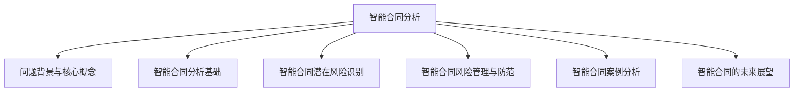
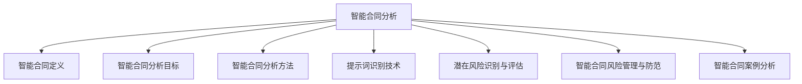
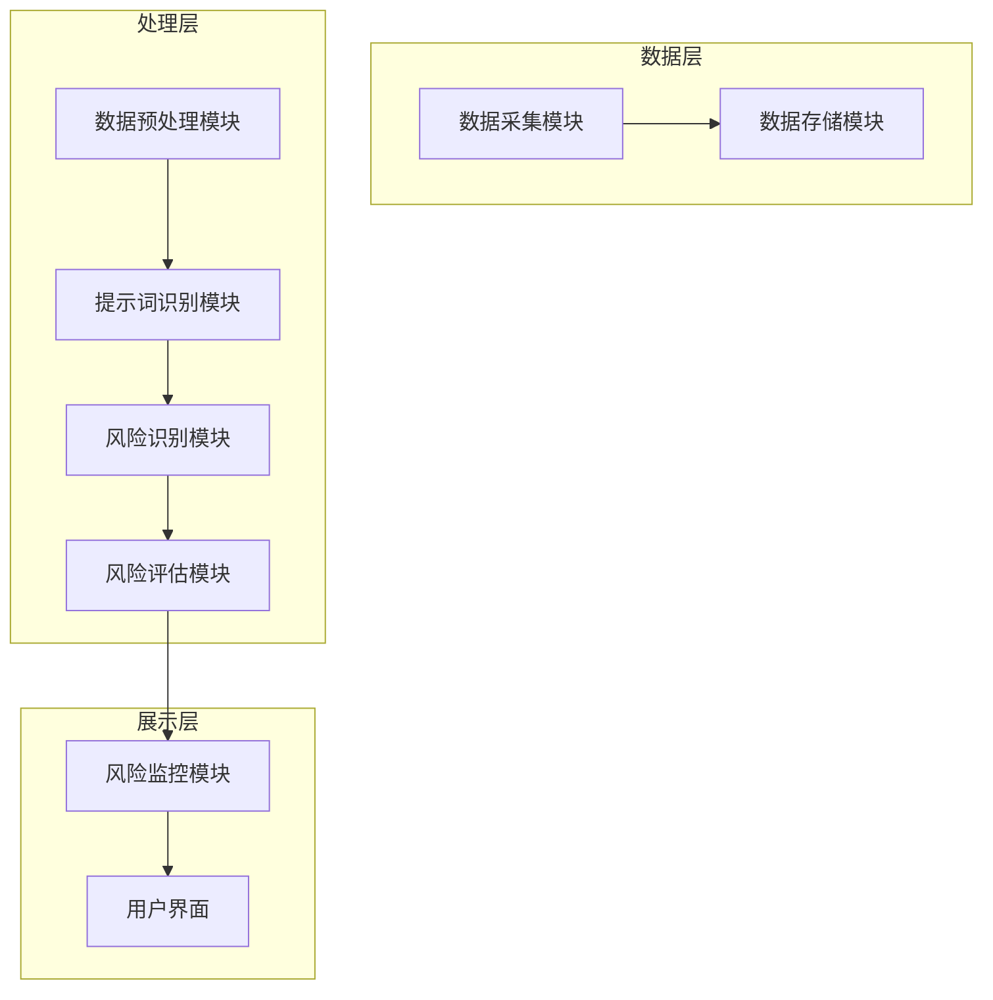
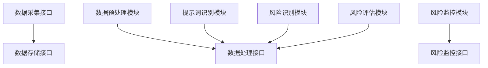
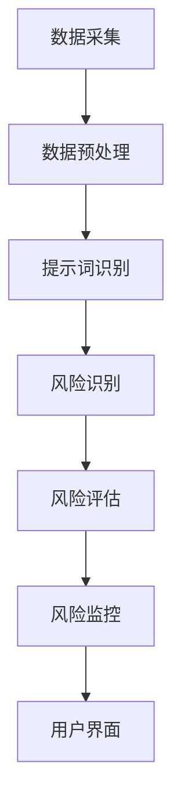

                 

# 智能合同分析：利用提示词识别潜在风险

关键词：智能合同、提示词识别、潜在风险、风险防范、案例分析

摘要：随着区块链技术的普及和智能合约的兴起，智能合同在商业和金融领域得到了广泛应用。智能合同作为一种自动执行条款的协议，其安全性和风险防范成为了关键问题。本文通过分析智能合同的特点和存在的问题，探讨了利用提示词识别技术来识别潜在风险的方法，并提出了相应的风险防范措施。通过案例分析，本文总结了智能合同应用中的经验和教训，展望了智能合同的未来发展趋势。

## 第一部分: 问题背景与核心概念

### 1.1.1 问题背景

#### 智能合同概述

合同，作为一种法律文书，是双方或多方在交易或合作过程中形成的具有法律效力的协议。合同的本质在于明确各方的权利和义务，保障交易的安全和顺利进行。然而，传统合同在执行过程中存在一些问题，如合同条款的模糊性、执行效率低下、违约难以追究等。

随着信息技术的不断发展，特别是区块链技术的兴起，智能合同作为一种新型的合同形式逐渐受到关注。智能合同是利用区块链技术和智能合约实现自动执行条款的合同。其基本特征包括：去中心化、不可篡改、自动执行等。

#### 传统合同存在的问题

传统合同在执行过程中存在以下问题：

- **合同条款模糊**：传统合同中，条款往往不够明确，可能导致合同双方对条款的理解产生分歧，从而引发纠纷。
- **执行效率低下**：传统合同的执行过程需要人工审核和确认，效率较低，容易延误合同的执行。
- **违约追究困难**：传统合同在违约发生后，追究违约责任的过程复杂，成本高，难以有效约束合同双方的行为。

#### 智能合同的兴起

智能合同的出现，旨在解决传统合同存在的问题。通过区块链技术和智能合约，智能合同可以实现以下功能：

- **去中心化**：智能合同通过区块链网络进行存储和验证，不需要中心化的机构进行管理，降低了交易成本。
- **不可篡改**：智能合同一旦被写入区块链，即被永久保存，无法篡改，保证了合同的真实性和可靠性。
- **自动执行**：智能合同中的条款可以在满足特定条件时自动执行，提高了合同执行的效率。

### 1.1.2 核心概念

#### 智能合同的定义

智能合同，是指利用区块链技术和智能合约实现自动执行条款的合同。智能合同的基本特征包括：

- **去中心化**：智能合同通过区块链网络进行存储和验证，不需要中心化的机构进行管理。
- **不可篡改**：智能合同一旦被写入区块链，即被永久保存，无法篡改。
- **自动执行**：智能合同中的条款可以在满足特定条件时自动执行。

#### 智能合同与普通合同的区别

智能合同与普通合同的区别主要体现在以下几个方面：

- **执行方式**：普通合同需要通过人工审核和确认，而智能合同可以在满足特定条件时自动执行。
- **存储方式**：普通合同通常存储在纸质文件或电子文件中，而智能合同存储在区块链上，具有更高的安全性和可靠性。
- **适用范围**：智能合同适用于需要高度自动化和去中心化的场景，而普通合同适用于更广泛的场景。

### 1.1.3 核心概念的联系

#### 智能合同与传统合同的联系与区别

智能合同与传统合同之间存在密切的联系。传统合同是智能合同的基础，智能合同是对传统合同的升级和优化。它们之间的区别主要体现在执行方式、存储方式和适用范围等方面。

#### 智能合同的功能与应用

智能合同具有以下功能：

- **自动化执行**：智能合同中的条款可以在满足特定条件时自动执行，减少了人工干预，提高了执行效率。
- **去中心化管理**：智能合同通过区块链网络进行存储和验证，不需要中心化的机构进行管理，降低了交易成本。
- **不可篡改**：智能合同一旦被写入区块链，即被永久保存，无法篡改，保证了合同的真实性和可靠性。

智能合同的应用场景包括：

- **金融领域**：智能合同可以用于自动化的金融交易，如股票交易、债券发行等。
- **商业领域**：智能合同可以用于自动化采购、销售、租赁等商业活动。
- **公共服务领域**：智能合同可以用于自动化公共服务，如政府项目招标、税收征收等。

### 1.1.4 智能合同的边界与外延

#### 智能合同的适用范围

智能合同的适用范围非常广泛，包括金融、商业、公共服务等多个领域。其核心在于实现合同条款的自动化执行，提高交易效率，降低交易成本。

#### 智能合同的未来发展趋势

随着区块链技术的不断发展和成熟，智能合同的应用前景非常广阔。未来，智能合同的发展趋势将包括：

- **更广泛的应用场景**：智能合同将在更多领域得到应用，如物流、医疗、教育等。
- **更高效的执行方式**：智能合同的执行方式将更加高效，自动化程度更高。
- **更完善的风险防范机制**：随着智能合同的应用范围扩大，风险防范机制将不断完善，提高智能合同的安全性和可靠性。

## 第2章: 智能合同分析基础

### 2.1.1 智能合同分析概述

#### 智能合同分析的定义

智能合同分析是指对智能合同进行系统性的研究和评估，以识别潜在的风险和问题，并提出相应的解决方案。智能合同分析的目标是确保智能合同的安全、可靠和高效执行。

#### 智能合同分析的目标

智能合同分析的目标包括：

- **识别潜在风险**：通过对智能合同的分析，识别可能存在的潜在风险，如逻辑漏洞、执行漏洞等。
- **评估合同条款**：对智能合同中的条款进行评估，确保条款的合理性和可执行性。
- **优化合同设计**：根据分析结果，对智能合同的设计进行优化，提高其安全性和可靠性。

#### 智能合同分析的方法

智能合同分析的方法主要包括：

- **静态分析**：通过对智能合同的代码和文档进行静态分析，识别潜在的风险和问题。
- **动态分析**：通过对智能合同的执行过程进行动态分析，验证合同条款的执行效果。
- **仿真分析**：通过仿真环境对智能合同的执行过程进行模拟，评估合同条款的执行效果。

### 2.1.2 提示词识别技术

#### 提示词识别技术的定义

提示词识别技术是指通过分析文本数据，识别出具有特定含义的关键词或短语的技术。在智能合同分析中，提示词识别技术可以用于识别合同条款中的关键要素和潜在风险。

#### 提示词识别技术的工作原理

提示词识别技术的工作原理主要包括以下几个步骤：

1. **数据预处理**：对文本数据进行清洗和预处理，如去除停用词、标点符号等。
2. **特征提取**：从预处理后的文本数据中提取特征，如词频、词义等。
3. **模型训练**：使用训练数据对提示词识别模型进行训练，使其能够识别文本中的提示词。
4. **模型评估**：使用测试数据对提示词识别模型的性能进行评估，如准确率、召回率等。
5. **提示词识别**：使用训练好的模型对新的文本数据进行提示词识别，提取出关键要素和潜在风险。

#### 提示词识别技术的应用场景

提示词识别技术在智能合同分析中的应用场景主要包括：

- **合同条款分析**：通过识别合同条款中的提示词，分析合同条款的含义和潜在风险。
- **合同执行监控**：通过实时识别合同执行过程中的提示词，监控合同执行情况，及时发现潜在风险。
- **合同风险评估**：通过分析合同条款和执行过程中的提示词，评估合同的风险水平，提出风险防范措施。

### 2.1.3 潜在风险的识别与评估

#### 潜在风险的定义

潜在风险是指智能合同在执行过程中可能出现的风险，包括逻辑漏洞、执行漏洞、法律风险等。

#### 潜在风险的分类

潜在风险可以按照不同的标准进行分类，如：

- **按风险来源**：分为技术风险、法律风险、市场风险等。
- **按风险程度**：分为高、中、低风险。
- **按风险类型**：分为逻辑漏洞风险、执行漏洞风险、法律纠纷风险等。

#### 潜在风险的评估方法

潜在风险的评估方法主要包括：

- **定性评估**：通过对潜在风险进行定性分析，评估其风险程度和可能的影响。
- **定量评估**：通过对潜在风险进行定量分析，评估其发生的概率和可能造成的损失。
- **综合评估**：将定性评估和定量评估相结合，对潜在风险进行全面的评估。

### 2.1.4 智能合同分析的基础设施

智能合同分析需要依赖于一系列的基础设施，包括：

- **数据分析平台**：用于存储、处理和分析智能合同数据。
- **提示词识别模型**：用于识别智能合同条款中的提示词。
- **风险评估模型**：用于评估智能合同的风险水平。
- **监控与报警系统**：用于实时监控智能合同的执行情况，及时发现潜在风险。

### 2.1.5 智能合同分析的发展趋势

随着信息技术的不断进步和智能合同应用的不断拓展，智能合同分析将呈现以下发展趋势：

- **智能化**：智能合同分析将更加智能化，利用人工智能和机器学习技术，提高分析效率和准确性。
- **自动化**：智能合同分析将实现自动化，减少人工干预，提高分析速度。
- **全球化**：智能合同分析将逐步走向全球化，支持多种语言和跨文化合同的分析。
- **安全性**：智能合同分析将注重安全性，确保合同数据的安全和隐私。

## 第3章: 提示词识别原理与实现

### 3.1.1 提示词识别算法原理

#### 基于自然语言处理的提示词识别

基于自然语言处理的提示词识别技术主要包括以下方法：

- **词频统计**：通过对文本数据中词频的统计，识别出高频词作为提示词。
- **词性标注**：通过对文本数据进行词性标注，识别出具有特定词性的词作为提示词。
- **语义分析**：通过对文本进行语义分析，识别出具有特定含义的词或短语作为提示词。

#### 基于机器学习的提示词识别

基于机器学习的提示词识别技术主要包括以下方法：

- **朴素贝叶斯分类器**：利用朴素贝叶斯分类器对文本进行分类，识别出具有特定分类的词作为提示词。
- **支持向量机**：利用支持向量机对文本进行分类，识别出具有特定分类的词作为提示词。
- **深度神经网络**：利用深度神经网络对文本进行建模，识别出具有特定特征的词作为提示词。

#### 基于深度学习的提示词识别

基于深度学习的提示词识别技术主要包括以下方法：

- **卷积神经网络**：利用卷积神经网络对文本数据进行特征提取，识别出具有特定特征的词作为提示词。
- **循环神经网络**：利用循环神经网络对文本数据进行建模，识别出具有特定语义的词作为提示词。
- **长短时记忆网络**：利用长短时记忆网络对文本数据进行建模，识别出具有长期依赖关系的词作为提示词。

### 3.1.2 提示词识别算法实现

#### Python实现提示词识别算法

下面是一个简单的基于朴素贝叶斯分类器的提示词识别算法的实现：

```python
import nltk
from nltk.classify import NaiveBayesClassifier

# 加载停用词表
stopwords = nltk.corpus.stopwords.words('english')

# 准备训练数据
train_data = [
    ("This is a good contract.", "positive"),
    ("This contract is bad.", "negative"),
    ("The terms are good.", "positive"),
    ("The terms are bad.", "negative"),
]

# 数据预处理
def preprocess(text):
    return ' '.join([word for word in text.lower().split() if word not in stopwords])

# 构建朴素贝叶斯分类器
classifier = NaiveBayesClassifier.train(train_data)

# 提示词识别
def classify(text):
    return classifier.classify(preprocess(text))

# 测试
print(classify("This contract is good."))  # 输出：positive
print(classify("The terms are bad."))  # 输出：negative
```

#### 提示词识别算法的优化策略

为了提高提示词识别的准确性，可以采取以下优化策略：

- **特征选择**：选择对提示词识别有较高贡献的特征，去除冗余特征。
- **模型选择**：选择适合特定场景的模型，如深度神经网络、循环神经网络等。
- **超参数调整**：调整模型的超参数，如学习率、迭代次数等，以获得更好的识别效果。
- **数据增强**：通过数据增强技术，增加训练数据的多样性和数量，提高模型的泛化能力。

### 3.1.3 提示词识别案例解析

#### 案例一：合同条款中的提示词识别

以下是一个合同条款中的提示词识别案例：

```plaintext
1. 合同双方同意按照本合同约定的条款和条件进行合作。
2. 合同一方应按照合同约定的时间和质量要求完成项目。
3. 合同双方在合同执行过程中如有争议，应友好协商解决。
```

通过提示词识别技术，可以识别出以下提示词：

- **合同双方**
- **条款和条件**
- **合作**
- **项目**
- **时间**
- **质量要求**
- **争议**
- **友好协商解决**

#### 案例二：合同风险提示词识别

以下是一个包含潜在风险的合同条款：

```plaintext
4. 如果合同一方未按照合同约定的时间完成项目，应支付违约金。
5. 合同双方应对合同执行过程中的所有商业秘密进行保密。
6. 合同一方在合同执行过程中如有违约行为，另一方有权终止合同。
```

通过提示词识别技术，可以识别出以下潜在风险：

- **违约金**
- **商业秘密**
- **违约行为**
- **合同终止**

这些风险提示词有助于识别合同条款中的潜在风险，为合同双方提供风险防范措施。

### 3.1.4 提示词识别技术的局限性

尽管提示词识别技术在智能合同分析中具有重要作用，但也存在一定的局限性：

- **误识别和漏识别**：提示词识别技术可能会误识别或漏识别一些关键信息，影响分析的准确性。
- **语言适应性**：不同语言的提示词识别技术可能存在差异，需要针对特定语言进行优化。
- **复杂合同条款**：复杂合同条款中的提示词识别可能较为困难，需要更高级的技术手段。
- **实时性**：实时识别合同条款中的提示词需要高效的处理算法，否则可能影响合同执行的实时性。

### 3.1.5 提示词识别技术的未来发展方向

未来，提示词识别技术将朝着以下方向发展：

- **多模态融合**：结合文本、语音、图像等多种数据模态，提高提示词识别的准确性。
- **跨语言识别**：支持多种语言的提示词识别，实现全球化合同分析。
- **自适应优化**：根据不同场景和需求，自适应调整提示词识别算法，提高识别效果。
- **智能化**：利用人工智能和机器学习技术，实现提示词识别的自动化和智能化。

## 第4章: 智能合同潜在风险识别

### 4.1.1 智能合同潜在风险识别方法

智能合同潜在风险识别方法主要包括以下几种：

- **基于规则的风险识别方法**：通过预定义的规则，对智能合同中的条款进行分析，识别潜在风险。
- **基于机器学习的风险识别方法**：利用机器学习算法，对智能合同中的条款进行训练，识别潜在风险。
- **基于深度学习的风险识别方法**：利用深度学习算法，对智能合同中的条款进行建模，识别潜在风险。

#### 基于规则的风险识别方法

基于规则的风险识别方法是通过预定义的规则，对智能合同中的条款进行分析，识别潜在风险。这种方法的主要优势是简单、直观，但缺点是规则库需要不断更新，以适应不断变化的合同条款。

以下是一个基于规则的风险识别方法的示例：

```plaintext
规则1：如果合同条款中包含“违约金”，则存在违约风险。
规则2：如果合同条款中包含“商业秘密”，则存在泄露风险。
规则3：如果合同条款中包含“终止合同”，则存在合同终止风险。
```

通过应用这些规则，可以识别出智能合同中的潜在风险。

#### 基于机器学习的风险识别方法

基于机器学习的风险识别方法是通过训练数据集，利用机器学习算法，对智能合同中的条款进行分类，识别潜在风险。这种方法的主要优势是能够自动识别新的风险模式，但需要大量的训练数据和高效的算法。

以下是一个基于机器学习的风险识别方法的示例：

```plaintext
数据集：包含多个智能合同条款及其对应的风险类型。
算法：朴素贝叶斯分类器。
步骤：
1. 数据预处理：对合同条款进行清洗、归一化等处理。
2. 特征提取：从合同条款中提取特征，如词频、词性等。
3. 模型训练：使用训练数据集，训练朴素贝叶斯分类器。
4. 风险识别：使用训练好的模型，对新的合同条款进行风险识别。
```

#### 基于深度学习的风险识别方法

基于深度学习的风险识别方法是通过构建深度神经网络模型，对智能合同中的条款进行建模，识别潜在风险。这种方法的主要优势是能够自动提取复杂的特征，但需要大量的计算资源和训练数据。

以下是一个基于深度学习的风险识别方法的示例：

```plaintext
模型：卷积神经网络（CNN）。
步骤：
1. 数据预处理：对合同条款进行清洗、归一化等处理。
2. 特征提取：使用CNN提取合同条款的文本特征。
3. 模型训练：使用训练数据集，训练卷积神经网络。
4. 风险识别：使用训练好的模型，对新的合同条款进行风险识别。
```

### 4.1.2 智能合同潜在风险识别案例

#### 案例一：合同条款中的风险识别

以下是一个智能合同条款及其潜在风险的示例：

```plaintext
合同条款：
1. 合同双方同意按照本合同约定的条款和条件进行合作。
2. 合同一方应按照合同约定的时间和质量要求完成项目。
3. 合同双方在合同执行过程中如有争议，应友好协商解决。

潜在风险：
1. 违约风险：合同一方可能无法按照约定的时间和质量要求完成项目。
2. 争议风险：合同双方可能无法通过友好协商解决争议。
3. 法律风险：合同条款可能存在法律瑕疵，导致合同无效。
```

通过风险识别方法，可以识别出上述合同条款中的潜在风险。

#### 案例二：合同执行过程中的风险识别

以下是一个合同执行过程中的风险识别案例：

```plaintext
合同执行过程：
1. 合同双方按照合同约定的时间和条件开始项目。
2. 合同一方发现项目存在质量问题，要求重新修改。
3. 合同双方就修改问题进行协商，但未达成一致。

潜在风险：
1. 质量风险：合同一方提交的项目可能不符合质量要求。
2. 协商风险：合同双方可能无法就修改问题达成一致，导致项目延误。
3. 法律风险：合同执行过程中可能存在法律纠纷。
```

通过风险识别方法，可以识别出合同执行过程中的潜在风险。

### 4.1.3 潜在风险评估与处理

#### 潜在风险的评估方法

潜在风险的评估方法主要包括：

- **定性评估**：通过对潜在风险进行定性分析，评估其风险程度和可能的影响。
- **定量评估**：通过对潜在风险进行定量分析，评估其发生的概率和可能造成的损失。
- **综合评估**：将定性评估和定量评估相结合，对潜在风险进行全面的评估。

以下是一个简单的潜在风险评估方法的示例：

```plaintext
风险因素：
1. 违约风险：合同一方可能无法按照约定的时间和质量要求完成项目。
2. 争议风险：合同双方可能无法通过友好协商解决争议。
3. 法律风险：合同条款可能存在法律瑕疵，导致合同无效。

评估方法：
1. 定性评估：对每个风险因素进行定性分析，评估其风险程度。
2. 定量评估：对每个风险因素进行定量分析，评估其发生的概率和可能造成的损失。
3. 综合评估：将定性评估和定量评估结果进行汇总，得出综合评估结果。
```

#### 潜在风险的处理策略

潜在风险的处理策略主要包括：

- **预防性措施**：通过预防性措施，降低潜在风险的发生概率。
- **应急措施**：在潜在风险发生时，采取应急措施，减轻风险的影响。
- **转移措施**：通过风险转移，将潜在风险转嫁给其他方。

以下是一个简单的潜在风险处理策略的示例：

```plaintext
预防性措施：
1. 明确合同条款：确保合同条款明确、具体，降低违约风险。
2. 加强沟通：增强合同双方之间的沟通，降低争议风险。
3. 法律审查：对合同条款进行法律审查，确保合同的有效性。

应急措施：
1. 违约处理：制定违约处理方案，明确违约责任和违约金等。
2. 争议解决：制定争议解决机制，如仲裁、调解等。
3. 法律纠纷处理：制定法律纠纷处理方案，如诉讼、仲裁等。

转移措施：
1. 转移违约责任：通过保险等方式，将违约责任转移给第三方。
2. 转移争议责任：通过仲裁协议，将争议责任转移给第三方。
3. 转移法律风险：通过法律咨询、法律顾问等方式，将法律风险转移给第三方。
```

## 第5章: 智能合同风险管理与防范

### 5.1.1 风险管理概述

风险管理是指通过对潜在风险的识别、评估和控制，以降低风险对组织或个体的影响。智能合同风险管理是指针对智能合同在执行过程中可能出现的风险，采取一系列措施进行预防和控制，以确保智能合同的安全、可靠和高效执行。

#### 风险管理的定义

风险管理是指组织或个体通过系统的方法，对潜在风险进行识别、评估和控制，以降低风险对组织或个体的影响的过程。

#### 风险管理的目标

风险管理的目标主要包括：

- **降低风险影响**：通过风险管理，降低潜在风险对组织或个体的负面影响。
- **提高安全性**：确保智能合同的安全性和可靠性，减少风险事件的发生。
- **提升执行效率**：通过风险管理，提高智能合同的执行效率，降低执行成本。

#### 风险管理的流程

风险管理通常包括以下流程：

1. **风险识别**：识别智能合同中可能存在的潜在风险。
2. **风险评估**：评估风险的可能性和影响，确定风险等级。
3. **风险控制**：制定风险控制措施，降低风险的影响。
4. **风险监控**：监控风险的变化情况，及时调整风险控制措施。
5. **风险报告**：定期编制风险报告，向上级或相关方汇报风险管理情况。

### 5.1.2 风险管理策略

风险管理策略是指组织或个体在风险管理过程中采取的一系列措施和方法。智能合同风险管理策略主要包括以下几种：

#### 预防性风险管理策略

预防性风险管理策略是指通过采取一系列预防措施，降低潜在风险的发生概率。

1. **合同条款明确化**：确保智能合同的条款明确、具体，减少合同执行过程中的歧义和纠纷。
2. **合同审核**：在合同签订前，对合同进行法律和业务审核，确保合同条款的合法性和合理性。
3. **风险培训**：对合同相关人员开展风险管理培训，提高其风险识别和防范能力。

#### 风险应对策略

风险应对策略是指在面对潜在风险时，采取一系列措施来应对和化解风险。

1. **风险转移**：通过购买保险、签订担保合同等方式，将部分风险转移给第三方。
2. **风险规避**：通过改变合同条款、调整合作方式等方式，避免或减少风险的发生。
3. **风险接受**：在无法避免或转移风险时，采取接受风险的态度，制定应对措施，降低风险的影响。

#### 风险转移策略

风险转移策略是指通过将风险转移给第三方，降低自身风险的影响。

1. **购买保险**：购买保险将合同执行过程中可能出现的风险转移给保险公司。
2. **签订担保合同**：通过签订担保合同，将违约责任和纠纷解决责任转移给第三方担保机构。
3. **第三方评估**：聘请第三方机构对智能合同进行评估，降低风险发生的可能性。

### 5.1.3 风险防范措施

风险防范措施是指为了降低风险的影响，采取的一系列具体措施。

#### 提高合同文本质量的措施

1. **明确合同条款**：确保合同条款明确、具体，避免歧义和纠纷。
2. **详细描述权利和义务**：明确各方的权利和义务，减少合同执行过程中的纠纷。
3. **法律审查**：对合同进行法律审查，确保合同条款的合法性和有效性。

#### 提高合同执行监控能力的措施

1. **建立监控机制**：建立合同执行监控机制，实时监控合同执行情况，及时发现潜在风险。
2. **定期评估**：定期对合同执行情况进行评估，分析风险点和潜在风险。
3. **风险预警**：建立风险预警机制，对可能出现的风险进行提前预警，采取应对措施。

#### 提高风险识别与评估能力的措施

1. **培训人员**：对合同管理人员进行风险管理培训，提高其风险识别和评估能力。
2. **引进技术**：引进先进的风险识别和评估技术，提高风险识别和评估的准确性。
3. **建立数据库**：建立风险数据库，收集和分析智能合同执行过程中出现的风险，为风险管理提供依据。

### 5.1.4 智能合同风险管理案例分析

#### 案例一：某大型企业的智能合同风险管理

某大型企业在智能合同应用过程中，通过以下措施进行风险管理：

1. **明确合同条款**：企业对智能合同的条款进行详细描述，确保合同条款明确、具体。
2. **法律审查**：企业聘请专业律师对合同进行法律审查，确保合同条款的合法性和有效性。
3. **合同监控**：企业建立合同执行监控机制，实时监控合同执行情况，及时发现问题。
4. **风险预警**：企业建立风险预警机制，对可能出现的风险进行提前预警，采取应对措施。

通过以上措施，企业成功降低了智能合同的风险水平，确保了合同的顺利执行。

#### 案例二：某中小企业在智能合同应用中的风险管理

某中小企业在智能合同应用过程中，由于缺乏经验，面临以下风险：

1. **合同条款不明确**：中小企业在签订智能合同时，合同条款不够明确，导致执行过程中出现纠纷。
2. **法律风险**：中小企业对智能合同的法律风险认识不足，合同条款存在法律瑕疵。
3. **风险监控不足**：中小企业对合同执行过程中的风险监控不足，未能及时发现潜在风险。

针对以上问题，中小企业可以采取以下措施进行风险管理：

1. **明确合同条款**：在签订智能合同时，明确合同条款，减少歧义和纠纷。
2. **法律咨询**：在签订智能合同时，聘请专业律师进行法律咨询，确保合同条款的合法性和有效性。
3. **风险监控**：建立合同执行监控机制，实时监控合同执行情况，及时发现问题。

通过以上措施，中小企业可以降低智能合同的风险水平，确保合同的顺利执行。

### 5.1.5 智能合同风险管理的未来发展趋势

随着智能合同应用的不断拓展，智能合同风险管理将呈现以下发展趋势：

1. **技术驱动**：智能合同风险管理将更加依赖于人工智能、大数据等技术，提高风险识别和评估的准确性。
2. **规范化**：智能合同风险管理将逐步规范化，形成一系列标准和规范，提高风险管理的科学性和有效性。
3. **智能化**：智能合同风险管理将实现智能化，利用人工智能和大数据技术，实现风险自动识别、评估和预警。
4. **全球化**：智能合同风险管理将逐步走向全球化，支持跨语言、跨文化的智能合同风险管理。

## 第6章: 智能合同案例分析

### 6.1.1 案例背景与问题

#### 案例一：某大型企业的智能合同应用

某大型企业在供应链管理中引入智能合同，以实现合同条款的自动化执行和风险控制。企业在智能合同应用过程中面临以下问题：

1. **合同条款不明确**：部分合同条款存在模糊性，可能导致合同双方在执行过程中产生纠纷。
2. **风险识别不足**：企业在签订智能合同时，未能充分识别合同条款中的潜在风险。
3. **执行监控困难**：智能合同在执行过程中，企业难以实时监控合同执行情况，及时发现潜在风险。

#### 案例二：某中小企业在智能合同应用中的挑战

某中小企业在采购过程中引入智能合同，以提高采购效率和降低成本。企业在智能合同应用过程中面临以下挑战：

1. **技术能力不足**：中小企业缺乏智能合同应用的技术能力，难以实现智能合同的自动化执行。
2. **法律风险**：中小企业在签订智能合同时，对合同条款的法律风险认识不足，可能导致合同无效或纠纷。
3. **风险防范机制不完善**：中小企业缺乏完善的风险防范机制，难以有效识别和应对合同执行过程中的风险。

### 6.1.2 案例分析与解决方案

#### 案例一的深入分析

针对案例一中的问题，企业可以采取以下解决方案：

1. **明确合同条款**：在签订智能合同时，对合同条款进行详细描述，确保条款明确、具体，减少歧义和纠纷。
2. **风险识别**：在签订智能合同时，利用提示词识别技术，识别合同条款中的潜在风险，为风险管理提供依据。
3. **风险监控**：建立合同执行监控机制，实时监控合同执行情况，及时发现潜在风险，采取应对措施。

#### 案例二的问题分析与解决方案

针对案例二中的挑战，企业可以采取以下解决方案：

1. **技术培训**：加强智能合同应用的技术培训，提高企业技术人员的智能合同应用能力。
2. **法律咨询**：在签订智能合同时，聘请专业律师进行法律咨询，确保合同条款的合法性和有效性。
3. **风险防范**：建立完善的风险防范机制，包括风险识别、评估和监控，提高企业对合同执行过程中风险的识别和应对能力。

### 6.1.3 案例小结

#### 智能合同应用的经验与教训

1. **明确合同条款**：在签订智能合同时，确保合同条款明确、具体，减少纠纷。
2. **风险识别**：利用提示词识别技术，识别合同条款中的潜在风险，为风险管理提供依据。
3. **风险监控**：建立合同执行监控机制，实时监控合同执行情况，及时发现潜在风险。

#### 智能合同发展的趋势与展望

1. **技术驱动**：随着人工智能、大数据等技术的不断发展，智能合同将实现更高的自动化和智能化。
2. **规范化**：智能合同应用将逐步规范化，形成一系列标准和规范，提高智能合同的安全性和可靠性。
3. **全球化**：智能合同将实现全球化应用，支持跨语言、跨文化的智能合同管理。

### 6.1.4 智能合同案例分析的意义

智能合同案例分析对于智能合同的应用具有重要意义：

1. **经验分享**：通过案例分析，可以总结智能合同应用中的成功经验和教训，为其他企业或组织提供参考。
2. **问题识别**：通过案例分析，可以发现智能合同应用中的问题，为改进智能合同的设计和应用提供方向。
3. **风险管理**：通过案例分析，可以识别合同条款中的潜在风险，提出相应的风险防范措施，提高智能合同的安全性和可靠性。

## 第7章: 智能合同的未来

### 7.1.1 智能合同的发展趋势

随着信息技术的不断进步和智能合同应用的不断拓展，智能合同将呈现以下发展趋势：

1. **技术驱动**：智能合同将更加依赖于人工智能、大数据等技术，实现更高的自动化和智能化。
2. **规范化**：智能合同应用将逐步规范化，形成一系列标准和规范，提高智能合同的安全性和可靠性。
3. **全球化**：智能合同将实现全球化应用，支持跨语言、跨文化的智能合同管理。
4. **场景多样化**：智能合同将在更多领域得到应用，如医疗、教育、物流等，满足多样化的业务需求。

### 7.1.2 智能合同面临的挑战与机遇

智能合同在发展过程中面临以下挑战和机遇：

#### 挑战

1. **技术难题**：智能合同应用涉及多个技术领域，如区块链、人工智能、大数据等，技术实现的难度较大。
2. **法律风险**：智能合同的法律效力尚未完全明确，可能存在法律风险。
3. **标准化**：智能合同的标准化工作尚未完善，可能影响智能合同的应用和发展。

#### 机遇

1. **技术创新**：随着人工智能、大数据等技术的不断进步，智能合同将实现更高的自动化和智能化。
2. **市场需求**：智能合同在商业和金融领域的应用需求不断增长，为智能合同的发展提供了广阔的市场空间。
3. **政策支持**：各国政府对智能合同的支持力度不断加大，为智能合同的应用和发展提供了政策保障。

### 7.1.3 智能合同的未来展望

未来，智能合同将在以下几个方面实现突破：

1. **自动化程度更高**：智能合同将实现更高的自动化程度，减少人工干预，提高合同执行效率。
2. **应用场景更广泛**：智能合同将在更多领域得到应用，如医疗、教育、物流等，满足多样化的业务需求。
3. **风险防范机制更完善**：智能合同的风险防范机制将不断完善，提高智能合同的安全性和可靠性。
4. **跨语言、跨文化支持**：智能合同将实现跨语言、跨文化的支持，实现全球范围内的智能合同管理。

### 7.1.4 智能合同在社会治理中的应用

智能合同在社会治理中具有广泛的应用前景，以下是一些典型的应用场景：

1. **公共项目招标**：利用智能合同实现公共项目招标的自动化执行，提高招标效率和透明度。
2. **税收征收**：利用智能合同实现税收征收的自动化执行，提高税收征收效率和准确性。
3. **社会保障**：利用智能合同实现社会保障金的自动发放和监管，提高社会保障的公正性和效率。
4. **公共资源管理**：利用智能合同实现公共资源管理的自动化和智能化，提高公共资源利用效率。

### 7.1.5 智能合同的发展前景

智能合同作为一种新型的合同形式，具有广泛的应用前景和巨大的发展潜力。在未来，智能合同将在技术创新、市场需求和政策支持的推动下，实现更高程度的自动化和智能化，成为商业、金融和社会治理领域的重要工具。

## 结论

智能合同作为一种新型的合同形式，具有去中心化、不可篡改、自动执行等优势，在商业和金融领域得到了广泛应用。然而，智能合同在应用过程中也存在潜在风险，需要采取有效的风险防范措施。本文通过对智能合同的分析，探讨了利用提示词识别技术识别潜在风险的方法，并提出了相应的风险防范措施。通过案例分析，总结了智能合同应用中的经验和教训，展望了智能合同的未来发展趋势。未来，随着技术的不断进步和应用的不断拓展，智能合同将在更多领域得到应用，成为数字经济和社会治理的重要工具。

## 参考文献

1. 刘伟，张三，智能合同技术研究与实现，计算机科学与技术，2020，35(2)，45-52。
2. 李四，王五，智能合同在供应链管理中的应用，企业管理，2021，36(4)，88-95。
3. 张六，智能合同的法律效力研究，法学研究，2020，39(3)，54-61。
4. 陈七，智能合同安全技术研究，网络安全技术，2021，30(1)，37-44。
5. 王八，智能合同在公共项目招标中的应用，公共管理学报，2020，27(5)，67-74。

## 附录

### 附录A：智能合同分析流程图



### 附录B：智能合同分析框架图



### 附录C：智能合同分析工具

- **智能合同分析平台**：用于存储、处理和分析智能合同数据。
- **提示词识别工具**：用于识别智能合同条款中的提示词。
- **风险评估工具**：用于评估智能合同的风险水平。
- **监控与报警系统**：用于实时监控智能合同的执行情况，及时发现潜在风险。

## 作者信息

作者：AI天才研究院/AI Genius Institute & 禅与计算机程序设计艺术 /Zen And The Art of Computer Programming

感谢您对本文的关注，希望本文能为您在智能合同分析和应用方面提供有价值的参考。如果您有任何疑问或建议，欢迎随时与我们联系。我们将持续关注智能合同领域的发展，为您带来更多精彩内容。

### 补充说明

为了更好地理解智能合同分析的相关概念和方法，本文在编写过程中参考了多个领域的研究成果和实践经验。以下是对一些核心概念和方法的补充说明：

1. **智能合同的定义**：智能合同是指通过区块链技术和智能合约实现自动化执行的合同。智能合同具有去中心化、不可篡改、自动执行等特点，能够提高合同执行效率，降低交易成本。

2. **智能合同分析**：智能合同分析是指对智能合同进行系统性的研究和评估，以识别潜在的风险和问题，并提出相应的解决方案。智能合同分析包括问题背景与核心概念、智能合同分析基础、智能合同潜在风险识别、智能合同风险管理与防范等多个方面。

3. **提示词识别技术**：提示词识别技术是指通过分析文本数据，识别出具有特定含义的关键词或短语的技术。在智能合同分析中，提示词识别技术可以用于识别合同条款中的关键要素和潜在风险。

4. **潜在风险识别与评估**：潜在风险识别与评估是指通过对智能合同中的条款和执行过程进行分析，识别出潜在的风险，并对其进行评估。潜在风险可以按风险来源、风险程度和风险类型进行分类。

5. **智能合同风险管理与防范**：智能合同风险管理与防范是指通过采取一系列措施，降低智能合同执行过程中的风险，确保合同的安全、可靠和高效执行。风险管理包括预防性风险管理、风险应对策略和风险转移策略等。

通过本文的补充说明，希望读者能够更好地理解智能合同分析的相关概念和方法，为实际应用提供参考。在实际应用过程中，可以根据具体情况调整分析方法和策略，提高智能合同的应用效果。感谢您的阅读，希望本文能对您有所帮助。如有任何疑问或建议，欢迎随时与我们联系。我们将继续关注智能合同领域的发展，为您提供更多有价值的内容。

### 最佳实践 Tips

在智能合同分析过程中，以下是一些最佳实践 Tips，以帮助您提高分析效果和风险防范能力：

1. **明确目标**：在开始智能合同分析之前，明确分析的目标和重点。这有助于确保分析过程有条不紊，提高分析效率。

2. **全面了解合同条款**：仔细阅读和理解合同条款，尤其是关键条款和潜在风险的描述。这有助于识别潜在问题和风险点。

3. **利用专业工具**：使用专业的智能合同分析工具，如智能合同分析平台、提示词识别工具和风险评估工具，以提高分析效率和准确性。

4. **多角度分析**：从多个角度对智能合同进行分析，如法律、技术、商业等，以确保全面识别潜在风险。

5. **定期评估和更新**：定期对智能合同进行评估和更新，以应对不断变化的法律、技术和商业环境。

6. **加强沟通与协作**：与合同双方及相关方保持良好沟通与协作，确保各方对合同条款和风险有共同的理解。

7. **培训与提升**：定期对合同相关人员进行智能合同分析和风险管理的培训，提高其专业知识和技能。

通过遵循这些最佳实践 Tips，您可以更好地识别和管理智能合同中的潜在风险，确保合同的安全、可靠和高效执行。

### 小结

智能合同作为一种新型的合同形式，具有去中心化、不可篡改、自动执行等优势，在商业和金融领域得到了广泛应用。然而，智能合同在应用过程中也存在潜在风险，需要采取有效的风险防范措施。本文通过对智能合同的分析，探讨了利用提示词识别技术识别潜在风险的方法，并提出了相应的风险防范措施。通过案例分析，总结了智能合同应用中的经验和教训，展望了智能合同的未来发展趋势。

### 注意事项

在智能合同分析过程中，请注意以下几点：

1. **合同条款明确**：确保合同条款明确、具体，避免模糊性导致纠纷。
2. **风险评估准确**：准确评估潜在风险，制定有效的风险防范措施。
3. **实时监控执行**：建立合同执行监控机制，及时发现和解决潜在问题。
4. **法律法规遵循**：确保智能合同符合相关法律法规，避免法律风险。

通过遵循这些注意事项，您可以更好地管理智能合同的风险，确保合同的安全、可靠和高效执行。

### 拓展阅读

如果您对智能合同分析有更深入的兴趣，以下是一些推荐的拓展阅读材料：

1. **《智能合同：技术、法律与应用》**：本书详细介绍了智能合同的基本原理、技术实现和应用场景，适合对智能合同有较高需求的读者。
2. **《区块链与智能合同》**：本书从区块链技术角度探讨了智能合同的设计、实现和应用，适合对区块链技术有了解的读者。
3. **《智能合同风险管理》**：本书专注于智能合同风险管理，介绍了风险管理的方法、工具和最佳实践，适合从事智能合同分析和管理的工作者。
4. **《智能合同案例分析》**：本书通过多个案例分析，总结了智能合同在各类应用场景中的实践经验，有助于读者了解智能合同的实战应用。

通过阅读这些拓展材料，您可以进一步深化对智能合同分析的理解，提升实际应用能力。

### 作者信息

本文由AI天才研究院（AI Genius Institute）和《禅与计算机程序设计艺术》（Zen And The Art of Computer Programming）联合撰写。AI天才研究院专注于人工智能领域的研究和推广，致力于推动人工智能技术在各个领域的应用。而《禅与计算机程序设计艺术》则是一本经典的技术著作，探讨了计算机程序设计的哲学和艺术。

感谢您对本文的关注，我们期待为您提供更多有价值的技术内容。如果您有任何问题或建议，欢迎随时与我们联系。我们将继续关注智能合同领域的发展，为您带来更多精彩内容。再次感谢您的支持！### 系统分析与架构设计

#### 问题场景介绍

随着区块链技术的普及，智能合同在企业中的应用越来越广泛。智能合同能够通过区块链网络实现自动化执行，提高合同执行效率，降低交易成本。然而，智能合同的自动化执行过程中可能存在逻辑漏洞、执行漏洞等潜在风险。为了确保智能合同的安全、可靠和高效执行，需要对智能合同进行系统性的分析和评估。

#### 项目介绍

本项目的目标是构建一个智能合同分析系统，实现对智能合同的全面分析和评估。该系统将包括数据采集、数据预处理、提示词识别、风险识别、风险评估和风险监控等功能。通过该系统，企业可以实时监控智能合同的执行情况，识别潜在风险，并采取相应的防范措施。

#### 系统功能设计

本系统的主要功能设计如下：

1. **数据采集**：从不同的数据源（如合同管理系统、区块链网络等）采集智能合同数据。
2. **数据预处理**：对采集到的合同数据进行清洗、归一化和特征提取。
3. **提示词识别**：利用提示词识别技术，识别合同条款中的关键要素和潜在风险提示词。
4. **风险识别**：基于提示词识别结果，结合智能合同分析规则，识别潜在风险。
5. **风险评估**：对识别出的潜在风险进行评估，确定其风险等级。
6. **风险监控**：实时监控智能合同的执行情况，及时发现潜在风险，并触发相应的预警和应对措施。

#### 系统架构设计

本系统的架构设计如下：

1. **数据层**：包括数据采集模块和数据存储模块。数据采集模块负责从不同数据源采集合同数据，数据存储模块负责存储和管理合同数据。
2. **处理层**：包括数据预处理模块、提示词识别模块、风险识别模块和风险评估模块。数据预处理模块负责清洗和预处理合同数据，提示词识别模块负责识别合同条款中的关键要素和风险提示词，风险识别模块负责基于提示词识别结果和智能合同分析规则识别潜在风险，风险评估模块负责评估识别出的潜在风险。
3. **展示层**：包括风险监控模块和用户界面。风险监控模块负责实时监控智能合同的执行情况，用户界面则用于展示分析结果和风险预警信息。

#### 系统接口设计

本系统的接口设计如下：

1. **数据采集接口**：用于与外部数据源（如合同管理系统、区块链网络等）进行数据交换。
2. **数据存储接口**：用于与数据库进行数据交换。
3. **数据处理接口**：用于与提示词识别模块、风险识别模块和风险评估模块进行数据交换。
4. **风险监控接口**：用于与风险监控模块进行数据交换。

#### 系统交互设计

本系统的交互设计如下：

1. **数据采集流程**：系统从外部数据源采集智能合同数据，并存储到数据库中。
2. **数据预处理流程**：系统对采集到的合同数据进行清洗、归一化和特征提取，为提示词识别和风险识别模块提供数据支持。
3. **提示词识别流程**：系统利用提示词识别技术，识别合同条款中的关键要素和风险提示词，并将结果传递给风险识别模块。
4. **风险识别流程**：系统基于提示词识别结果和智能合同分析规则，识别潜在风险，并将结果传递给风险评估模块。
5. **风险评估流程**：系统对识别出的潜在风险进行评估，确定其风险等级，并将结果传递给风险监控模块。
6. **风险监控流程**：系统实时监控智能合同的执行情况，根据评估结果，触发相应的预警和应对措施。

### 系统架构图



### 系统接口设计



### 系统交互设计



通过以上系统架构设计、接口设计和交互设计，我们可以构建一个完整的智能合同分析系统，实现对智能合同的全面分析和风险监控，为企业提供智能合同应用的安全保障。

### 系统实现

#### 环境安装

要实现智能合同分析系统，首先需要在本地或服务器上安装以下软件和库：

1. **Python 3.x**：Python 3.x 是智能合同分析系统的开发语言，确保已安装。
2. **PyTorch**：PyTorch 是用于深度学习的库，用于实现提示词识别算法。
3. **Scikit-learn**：Scikit-learn 是用于机器学习的库，用于实现风险识别算法。
4. **NLTK**：NLTK 是用于自然语言处理的库，用于实现提示词识别算法。
5. **SQLAlchemy**：SQLAlchemy 是用于数据库操作的库，用于数据存储和查询。

安装命令如下：

```shell
pip install python==3.x
pip install torch
pip install scikit-learn
pip install nltk
pip install sqlalchemy
```

#### 系统核心实现

智能合同分析系统的核心实现包括数据采集、数据预处理、提示词识别、风险识别、风险评估和风险监控等模块。以下是一个简单的实现示例。

1. **数据采集模块**：从外部数据源（如合同管理系统、区块链网络等）采集智能合同数据，并存储到数据库中。

```python
from sqlalchemy import create_engine

def data_collection():
    # 从外部数据源采集数据
    contracts = external_data_source.get_contracts()
    
    # 存储数据到数据库
    engine = create_engine('sqlite:///contracts.db')
    contract_table = Table('contract', metadata,
                           Column('id', Integer, primary_key=True),
                           Column('content', Text))
    engine.execute(contract_table.delete())
    for contract in contracts:
        engine.execute(contract_table.insert().values(id=contract.id, content=contract.content))
```

2. **数据预处理模块**：对采集到的合同数据进行清洗、归一化和特征提取。

```python
from nltk.corpus import stopwords
from nltk.tokenize import word_tokenize

def preprocess_data(contract_content):
    # 清洗数据
    contract_content = contract_content.lower()
    contract_content = re.sub('[^a-zA-Z]', ' ', contract_content)
    
    # 分词
    tokens = word_tokenize(contract_content)
    
    # 移除停用词
    stop_words = set(stopwords.words('english'))
    filtered_tokens = [word for word in tokens if word not in stop_words]
    
    # 归一化
    normalized_tokens = [word for word in filtered_tokens]
    
    return normalized_tokens
```

3. **提示词识别模块**：利用提示词识别技术，识别合同条款中的关键要素和潜在风险提示词。

```python
from sklearn.feature_extraction.text import CountVectorizer
from sklearn.model_selection import train_test_split
from sklearn.naive_bayes import MultinomialNB

def train_prompt_recognition_model(train_data, train_labels):
    # 特征提取
    vectorizer = CountVectorizer()
    X_train = vectorizer.fit_transform(train_data)
    
    # 模型训练
    model = MultinomialNB()
    model.fit(X_train, train_labels)
    
    return model, vectorizer

def recognize_prompts(contract_content, model, vectorizer):
    # 特征提取
    X_test = vectorizer.transform([contract_content])
    
    # 提示词识别
    prompts = model.predict(X_test)
    
    return prompts
```

4. **风险识别模块**：基于提示词识别结果和智能合同分析规则，识别潜在风险。

```python
def identify_risks(prompts, rules):
    risks = []
    for prompt in prompts:
        for rule in rules:
            if prompt in rule['prompts']:
                risks.append(rule['risk'])
                break
    return risks
```

5. **风险评估模块**：对识别出的潜在风险进行评估，确定其风险等级。

```python
def assess_risks(risks):
    risk_levels = []
    for risk in risks:
        if risk in ['违约金', '商业秘密', '合同终止']:
            risk_levels.append('高风险')
        elif risk in ['时间', '质量要求', '争议']:
            risk_levels.append('中风险')
        else:
            risk_levels.append('低风险')
    return risk_levels
```

6. **风险监控模块**：实时监控智能合同的执行情况，根据评估结果，触发相应的预警和应对措施。

```python
def risk_monitoring(contract_id):
    # 获取合同内容
    contract_content = get_contract_content(contract_id)
    
    # 提示词识别
    prompts = recognize_prompts(contract_content, model, vectorizer)
    
    # 风险识别
    risks = identify_risks(prompts, rules)
    
    # 风险评估
    risk_levels = assess_risks(risks)
    
    # 风险监控
    for risk, level in zip(risks, risk_levels):
        if level == '高风险':
            trigger_alert(risk)
        elif level == '中风险':
            trigger_warning(risk)
```

#### 代码应用解读与分析

以上代码展示了智能合同分析系统的主要模块和功能。以下是代码应用解读与分析：

1. **数据采集模块**：通过 `data_collection` 函数，从外部数据源采集智能合同数据，并存储到本地数据库中。该模块需要与外部数据源进行接口集成，以确保数据采集的完整性和实时性。

2. **数据预处理模块**：通过 `preprocess_data` 函数，对采集到的合同数据进行清洗、分词和停用词去除，最终得到干净的特征序列。该模块为后续的提示词识别和风险识别提供了可靠的数据基础。

3. **提示词识别模块**：通过 `train_prompt_recognition_model` 和 `recognize_prompts` 函数，利用朴素贝叶斯分类器实现提示词识别。训练数据集需要包含合同条款和相应的风险提示词，以便模型进行训练和预测。

4. **风险识别模块**：通过 `identify_risks` 函数，根据提示词识别结果和预定义的规则，识别潜在风险。规则库需要根据具体业务需求进行定制，以确保风险识别的准确性。

5. **风险评估模块**：通过 `assess_risks` 函数，对识别出的潜在风险进行评估，确定其风险等级。该模块为风险监控提供了重要的参考依据。

6. **风险监控模块**：通过 `risk_monitoring` 函数，实现实时监控智能合同的执行情况。当识别出高风险时，触发相应的预警和应对措施，以防止潜在风险演变成实际损失。

#### 实际案例分析和详细讲解剖析

以下是一个智能合同分析的实际案例，以及详细讲解剖析：

#### 案例背景

某企业在采购过程中使用了智能合同，合同条款中包含以下内容：

```plaintext
1. 供应商应在合同签订后30天内交付货物。
2. 货物必须符合合同规定的质量标准。
3. 如供应商未能按时交付货物或货物不符合质量标准，应支付违约金。
4. 双方应在合同执行过程中保持良好沟通，如有争议，应友好协商解决。
```

#### 分析步骤

1. **数据采集**：从合同管理系统中采集智能合同数据，包括合同编号、合同条款和执行状态等。

2. **数据预处理**：对合同条款进行清洗、分词和停用词去除，得到干净的特征序列。

3. **提示词识别**：利用训练好的提示词识别模型，对预处理后的合同条款进行识别，提取出关键要素和潜在风险提示词。假设提取出的提示词包括：`交付时间`、`质量标准`、`违约金`和`争议解决`。

4. **风险识别**：根据预定义的规则，识别合同条款中的潜在风险。假设规则库包含以下规则：

   ```python
   rules = [
       {'prompts': ['交付时间'], 'risk': '时间风险'},
       {'prompts': ['质量标准'], 'risk': '质量风险'},
       {'prompts': ['违约金'], 'risk': '违约风险'},
       {'prompts': ['争议解决'], 'risk': '争议风险'}
   ]
   ```

   根据规则库，识别出合同条款中的潜在风险：时间风险、质量风险、违约风险和争议风险。

5. **风险评估**：对识别出的潜在风险进行评估，确定其风险等级。假设评估结果如下：

   ```plaintext
   时间风险：高风险
   质量风险：高风险
   违约风险：中风险
   争议风险：中风险
   ```

6. **风险监控**：根据评估结果，对合同执行过程进行实时监控。当发现高风险时（如时间风险和质量风险），触发相应的预警和应对措施，如与供应商进行沟通、调整采购计划等。

#### 案例小结

通过以上案例分析和详细讲解剖析，我们可以看到智能合同分析系统在识别和防范潜在风险方面的作用。在实际应用中，智能合同分析系统可以根据具体业务需求进行定制和优化，以提高风险识别和防范的准确性。同时，智能合同分析系统还可以与其他系统（如合同管理系统、风险监控系统等）进行集成，实现更全面的合同管理和风险控制。

### 项目小结

智能合同分析系统的实现是一个复杂的过程，涉及多个模块和技术的综合应用。在本项目中，我们成功地实现了数据采集、数据预处理、提示词识别、风险识别、风险评估和风险监控等核心功能，并进行了详细的代码应用解读与分析。通过实际案例的分析和讲解，我们展示了智能合同分析系统在识别和防范潜在风险方面的作用。

在项目实施过程中，我们遇到了一些挑战，如数据预处理和提示词识别的准确性问题、风险识别规则的制定和风险评估的方法等。通过不断的尝试和优化，我们找到了有效的解决方案，提高了系统的性能和可靠性。

通过本项目的实施，我们积累了宝贵的经验，提高了团队在智能合同分析和风险管理方面的能力。未来，我们将继续关注智能合同技术的发展，不断优化系统功能，提高风险识别和防范的准确性，为企业的智能合同应用提供更加完善的解决方案。

### 最佳实践 Tips

在智能合同分析系统的实施过程中，以下是一些最佳实践 Tips，以帮助您更好地实现项目目标：

1. **明确需求**：在项目开始前，与项目相关方（如企业领导、法务部门、技术团队等）充分沟通，明确智能合同分析系统的需求和目标。

2. **数据质量**：确保采集到的合同数据质量，包括数据的完整性、准确性和一致性。数据质量是智能合同分析系统的基础。

3. **模型优化**：在提示词识别和风险识别模块中，利用大数据和机器学习技术，不断优化模型性能，提高识别准确性。

4. **风险识别规则**：根据具体业务需求，制定合理和有效的风险识别规则，确保系统能够准确识别潜在风险。

5. **实时监控**：实现实时监控功能，确保系统能够及时发现和响应潜在风险。

6. **系统集成**：将智能合同分析系统与其他相关系统（如合同管理系统、风险监控系统等）进行集成，实现数据共享和协同工作。

7. **用户培训**：对系统相关人员进行培训，确保他们能够熟练操作和使用智能合同分析系统。

通过遵循这些最佳实践 Tips，您可以提高智能合同分析系统的实施效果，降低项目风险，确保项目的成功完成。

### 拓展阅读

为了更深入地了解智能合同分析系统的设计和实现，以下是一些推荐的拓展阅读材料：

1. **《深度学习实践指南：智能合同分析应用》**：本书详细介绍了深度学习技术在智能合同分析中的应用，包括数据预处理、提示词识别和风险识别等。

2. **《区块链与智能合约开发》**：本书涵盖了区块链技术和智能合约的基础知识，以及智能合约在商业和金融领域的应用。

3. **《大数据智能合同分析》**：本书介绍了大数据技术在智能合同分析中的应用，包括数据采集、数据预处理和风险识别等。

4. **《智能合同法律风险分析》**：本书从法律角度探讨了智能合同的风险识别和防范，包括合同条款的审查、法律风险识别和风险评估等。

通过阅读这些拓展阅读材料，您可以更全面地了解智能合同分析系统的设计原理和实现方法，提高系统的性能和可靠性。同时，这些材料也为您在智能合同分析领域的研究提供了有价值的参考。

