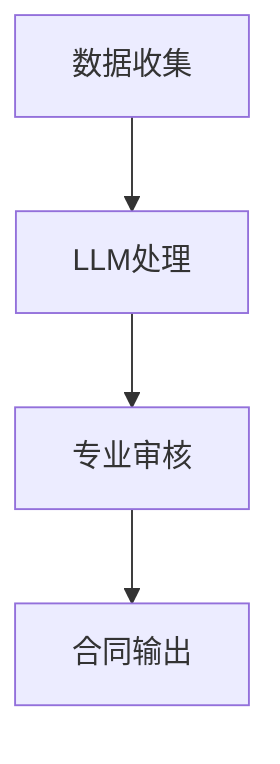
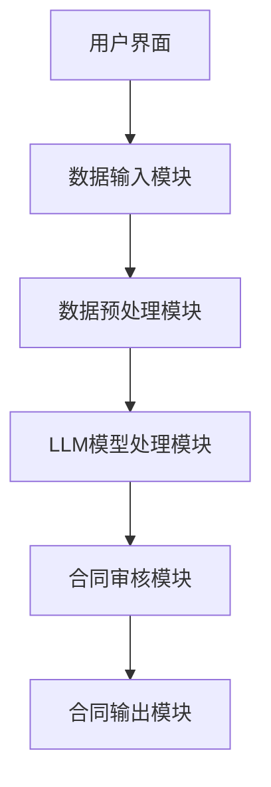
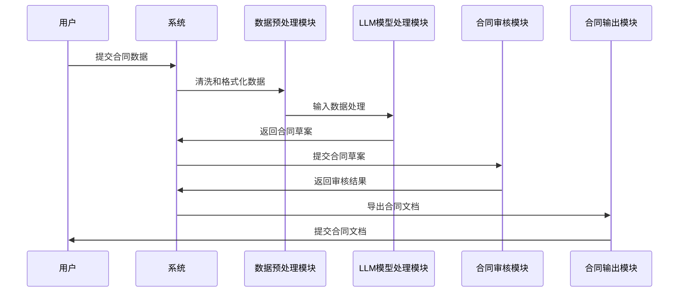
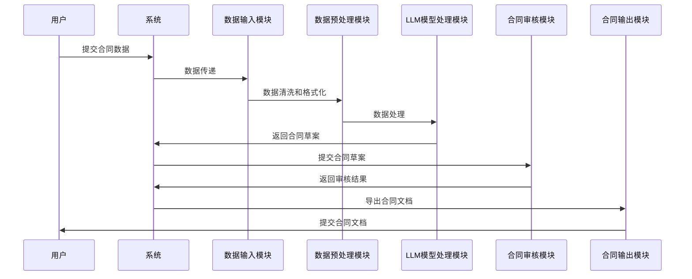

                 


### 设计《智能合同生成AI Agent：LLM在法律文书撰写中的应用》的目录大纲

**背景介绍部分：**

1. **问题背景与挑战**
   - **智能合同生成的需求**：阐述随着数字化时代的到来，智能合同生成的需求日益增长，特别是在金融、物流、租赁等行业。
   - **法律文书撰写的现状**：介绍目前法律文书撰写的流程和方式，以及存在的问题，如成本高、效率低、容易出错等。
   - **智能合同生成面临的挑战**：讨论智能合同生成在法律适用性、合同条款的完整性、法律文书的准确性等方面的挑战。

2. **核心概念解析**
   - **LLM的基本原理与特点**：介绍LLM（大型语言模型）的工作原理、优势和应用领域。
   - **智能合同的定义与类型**：解释智能合同的含义、特点，以及不同类型的智能合同。
   - **法律文书撰写的流程与要点**：概述法律文书撰写的标准流程，以及撰写过程中需要关注的关键要点。

3. **算法原理讲解**
   - **智能合同生成算法的Mermaid流程图**：使用Mermaid绘制智能合同生成的主要步骤和流程。
   - **Python源代码解析**：展示Python代码如何实现智能合同生成的关键部分。
   - **数学模型与公式**：阐述智能合同生成算法背后的数学原理和公式。
   - **算法举例说明**：通过具体的例子展示算法的应用效果。

**核心概念与联系部分：**

4. **LLM简介**
   - **LLM的基本原理**：解释LLM（如GPT、BERT等）是如何通过大量数据训练出来的，以及如何生成文本。
   - **LLM的特点**：探讨LLM在文本生成方面的优势，如强大的语言理解和生成能力、自适应性和可扩展性。
   - **LLM的分类**：分类介绍不同类型的LLM，如预训练模型、微调模型等。

5. **智能合同概念解析**
   - **智能合同的定义**：明确智能合同与传统合同的区别，强调其利用区块链、智能合约等技术自动执行和验证条款的特点。
   - **智能合同的特点**：分析智能合同在自动化、安全性和透明性等方面的优势。
   - **智能合同的类型**：列举不同类型的智能合同，如租赁合同、租赁合同等。

6. **法律文书撰写**
   - **法律文书撰写的流程**：描述法律文书撰写的步骤，从需求分析到合同草拟、审核、修改等。
   - **法律文书撰写的要点**：讨论在撰写法律文书时需要注意的关键要点，如法律条款的准确性、合同双方的权益保护等。

**算法原理讲解部分：**

7. **数学模型和数学公式 & 详细讲解 & 举例说明**
   - **LaTeX格式数学公式**：使用LaTeX格式展示复杂的数学公式。
   - **详细讲解**：详细解释数学公式在实际算法中的应用。
   - **举例**：提供具体的实例，展示公式的使用效果。

8. **系统分析与架构设计方案**
   - **问题场景介绍**：描述智能合同生成的应用场景。
   - **项目介绍**：介绍实现智能合同生成AI的项目背景和目标。
   - **系统功能设计**：使用Mermaid类图展示领域模型。
   - **系统架构设计**：使用Mermaid架构图展示系统整体架构。
   - **系统接口设计**：详细描述系统的接口设计和交互流程。
   - **系统交互Mermaid序列图**：绘制系统组件之间的交互序列图。

**项目实战部分：**

9. **环境安装**
   - **智能合同生成AI开发环境搭建**：详细介绍如何搭建智能合同生成AI的开发环境，包括依赖库的安装和配置。

10. **系统核心实现源代码**
    - **核心代码片段展示**：提供实现智能合同生成的关键代码片段。
    - **代码应用解读与分析**：分析代码实现的关键部分，解释其工作原理。

11. **实际案例分析与详细讲解剖析**
    - **实际案例展示**：通过实际案例展示智能合同生成的效果。
    - **详细讲解与剖析**：深入分析案例中的合同生成过程，讲解其背后的技术和原理。

12. **项目小结**
    - **项目成果总结**：总结智能合同生成AI项目的关键成果和贡献。
    - **经验与启示**：分享项目开发过程中的经验和启示。

**最佳实践 tips、小结、注意事项、拓展阅读等内容部分：**

13. **最佳实践 tips**
    - **实际操作技巧**：提供使用智能合同生成AI的实际操作技巧和建议。
    - **优化建议**：针对智能合同生成AI的性能和效果，提出优化建议。

14. **小结**
    - **文章核心观点**：总结全文的核心内容和主要观点。
    - **价值与意义**：阐述智能合同生成AI的重要性和应用前景。

15. **注意事项**
    - **使用建议**：提醒读者在使用智能合同生成AI时需要注意的事项。
    - **风险提示**：指出可能出现的风险和挑战，以及相应的解决策略。

16. **拓展阅读**
    - **推荐资源**：推荐进一步学习和深入了解相关主题的书籍、文章和资源。
    - **研究方向**：展望智能合同生成AI的未来研究方向和趋势。

### 完成大纲设计后的输出

```markdown
----------------------------------------------------------------
# 《智能合同生成AI Agent：LLM在法律文书撰写中的应用》

## 关键词
- 智能合同
- 法律文书撰写
- LLM
- 自动化
- 合同生成

## 摘要
本文深入探讨了智能合同生成AI Agent，特别是LLM在法律文书撰写中的应用。通过详细的分析和实例，揭示了智能合同生成算法的原理、数学模型以及系统架构设计，最后通过实际项目实战展示了智能合同生成的效果和应用场景。

----------------------------------------------------------------

### 第一部分: 智能合同生成背景

## 1.1 问题背景与挑战
### 1.1.1 智能合同生成的需求
### 1.1.2 法律文书撰写的现状
### 1.1.3 智能合同生成面临的挑战

## 1.2 核心概念解析
### 1.2.1 LLM的基本原理与特点
### 1.2.2 智能合同的定义与类型
### 1.2.3 法律文书撰写的流程与要点

## 1.3 算法原理讲解
### 1.3.1 智能合同生成算法的Mermaid流程图
### 1.3.2 Python源代码解析
### 1.3.3 数学模型与公式
### 1.3.4 算法举例说明

## 1.4 数学模型和数学公式 & 详细讲解 & 举例说明
### 1.4.1 LaTeX格式数学公式
### 1.4.2 数学公式应用讲解
### 1.4.3 算法实例分析

## 1.5 系统分析与架构设计方案
### 1.5.1 问题场景介绍
### 1.5.2 项目介绍
### 1.5.3 系统功能设计
### 1.5.4 系统架构设计
### 1.5.5 系统接口设计
### 1.5.6 系统交互Mermaid序列图

## 1.6 项目实战
### 1.6.1 环境安装
### 1.6.2 系统核心实现源代码
### 1.6.3 代码应用解读与分析
### 1.6.4 实际案例分析与详细讲解剖析
### 1.6.5 项目小结

## 1.7 最佳实践 tips、小结、注意事项、拓展阅读等内容
### 1.7.1 最佳实践 tips
### 1.7.2 小结
### 1.7.3 注意事项
### 1.7.4 拓展阅读

----------------------------------------------------------------

### 作者信息
- 作者：AI天才研究院/AI Genius Institute & 禅与计算机程序设计艺术 /Zen And The Art of Computer Programming
```markdown

----------------------------------------------------------------
# 智能合同生成AI Agent：LLM在法律文书撰写中的应用

## 关键词
- 智能合同
- 法律文书撰写
- LLM
- 自动化
- 合同生成

## 摘要
随着数字化时代的到来，智能合同生成在法律文书撰写中扮演着越来越重要的角色。本文探讨了LLM（大型语言模型）在智能合同生成中的应用，通过详细的分析和实际案例展示了智能合同生成算法的原理、系统架构以及应用效果。本文旨在为读者提供一个全面理解智能合同生成AI的框架和实践指南。

----------------------------------------------------------------

### 第一部分: 智能合同生成背景

## 1.1 问题背景与挑战

### 1.1.1 智能合同生成的需求
智能合同生成的需求源于多个行业对自动化、高效和精准合同管理的追求。在金融、物流、租赁等行业，大量的合同管理需求不仅提高了企业运营成本，还存在合同条款不一致、审核效率低下等问题。智能合同生成AI的出现，旨在通过自动化技术，快速生成符合法律规范、条款明确的智能合同。

### 1.1.2 法律文书撰写的现状
当前，法律文书撰写主要依赖律师和法务人员的专业知识，这种方式不仅耗时耗力，而且容易出现错误。此外，不同地区、不同类型的合同存在差异，这使得法律文书的撰写过程更加复杂。传统的法律文书撰写方式难以满足快速发展的市场需求。

### 1.1.3 智能合同生成面临的挑战
智能合同生成面临的主要挑战包括：
- **法律适用性**：智能合同生成的AI模型需要具备良好的法律知识，以确保生成的合同符合相关法律法规。
- **合同条款的完整性**：智能合同生成的AI模型需要确保合同条款的完整性和逻辑性，避免遗漏关键条款。
- **法律文书的准确性**：智能合同生成的AI模型需要保证生成的法律文书准确无误，避免因错误导致的法律风险。

## 1.2 核心概念解析

### 1.2.1 LLM的基本原理与特点
LLM（Large Language Model）是一种强大的自然语言处理模型，通过学习大量文本数据，能够生成高质量的文本。LLM的特点包括：
- **语言理解能力强**：LLM能够理解复杂的语言结构，包括语法、语义和上下文。
- **生成能力强**：LLM能够根据输入生成连贯、有意义的文本。
- **自适应性强**：LLM可以根据不同的应用场景进行微调，以适应特定需求。

### 1.2.2 智能合同的定义与类型
智能合同是一种利用区块链和智能合约技术的自动化合同，其特点包括：
- **自动化执行**：智能合同中的条款可以自动执行，如自动支付、触发赔偿等。
- **透明性**：智能合同的所有条款都公开透明，参与方可以随时查询。
- **安全性**：智能合同使用区块链技术，数据不可篡改，保证合同的安全性和可信度。

智能合同根据应用场景可以分为：
- **租赁合同**：自动计算租赁费用，根据租期自动调整费用。
- **服务合同**：自动记录服务内容，根据服务质量自动触发服务费用。

### 1.2.3 法律文书撰写的流程与要点
法律文书撰写主要包括以下几个步骤：
- **需求分析**：了解合同各方需求，明确合同目标和条款。
- **合同草拟**：根据需求分析，撰写初步的合同草案。
- **审核与修改**：合同草拟后，由法律专业人员审核，并根据反馈进行修改。
- **签订与执行**：合同双方达成一致后，签订合同并开始执行。

在撰写法律文书时，需要注意以下要点：
- **法律规范符合性**：确保合同内容符合相关法律法规。
- **条款明确性**：合同条款要明确具体，避免歧义和模糊。
- **双方权益保护**：保护合同双方的合法权益，避免权益受损。

## 1.3 算法原理讲解

### 1.3.1 智能合同生成算法的Mermaid流程图
智能合同生成算法的主要流程包括：
1. 收集合同数据，包括合同模板、相关法律法规等。
2. 使用LLM对合同数据进行分析和处理，生成合同草案。
3. 合同草案提交给法律专业人员审核，根据反馈进行修改。
4. 最终生成的合同文档进行格式化和输出。



### 1.3.2 Python源代码解析
智能合同生成算法的Python代码实现如下：

```python
import openai

# 初始化LLM模型
llm = openai.LanguageModel('text-davinci-002', temperature=0.7)

# 收集合同数据
contract_data = ...

# 生成合同草案
def generate_contract_draft(data):
    response = llm.complete(
        engine='text-davinci-002',
        prompt=data,
        max_tokens=100
    )
    return response.choices.text

# 审核合同草案
def review_contract_draft(draft):
    # 此处应调用法律专业人员进行审核
    # ...
    pass

# 输出合同文档
def output_contract_document(draft):
    # 格式化合同文档
    # ...
    print(draft)

# 执行智能合同生成流程
contract_draft = generate_contract_draft(contract_data)
review_contract_draft(contract_draft)
output_contract_document(contract_draft)
```

### 1.3.3 数学模型与公式
智能合同生成算法背后的数学模型主要包括自然语言处理模型和智能合约执行模型。以下是相关的数学公式：

$$
\text{LanguageModel}(X) = \sum_{i=1}^{n} P(x_i | \theta) \cdot \theta
$$

其中，$X$为输入文本，$x_i$为文本中的每个词语，$P(x_i | \theta)$为词语在给定模型参数$\theta$条件下的概率，$\theta$为模型参数。

智能合约执行模型则涉及以下公式：

$$
\text{ContractExecution}(C) = f(\text{ContractTerms}, \text{Conditions})
$$

其中，$C$为智能合同，$f$为执行函数，$\text{ContractTerms}$为合同条款，$\text{Conditions}$为执行条件。

### 1.3.4 算法举例说明
假设我们有一个租赁合同的生成需求，以下是使用智能合同生成算法生成的合同草案：

```plaintext
合同编号：[自动生成]

甲方（出租方）：
姓名：[自动获取]
地址：[自动获取]
联系电话：[自动获取]

乙方（承租方）：
姓名：[自动获取]
地址：[自动获取]
联系电话：[自动获取]

根据甲乙双方的共同意愿，就以下租赁事项达成如下协议：

一、租赁房屋地址：[自动获取]
租赁期限：从 [自动获取] 至 [自动获取]，共计 [自动获取] 个月。

二、租金支付：
乙方应按照以下方式支付租金：
1. 每月租金为人民币 [自动获取] 元，支付方式为银行转账。
2. 乙方应在每月 [自动获取] 日前将当月租金支付至甲方指定的账户。

三、押金：
乙方应在签订本合同之日起 [自动获取] 日内，向甲方支付押金人民币 [自动获取] 元。在合同履行完毕且无违约行为后，甲方应无息退还押金。

四、其他条款：
1. 乙方应妥善使用租赁房屋，如因乙方原因导致房屋损坏，乙方应负责修复或赔偿。
2. 乙方不得擅自改变房屋结构或用途。

五、争议解决：
如甲乙双方因本合同发生争议，应友好协商解决；协商不成的，可向有管辖权的人民法院提起诉讼。

六、合同生效：
本合同自双方签字盖章之日起生效。

甲方（签字）：_______
日期：_______

乙方（签字）：_______
日期：_______

```

通过上述例子，我们可以看到智能合同生成算法如何根据输入的数据自动生成一个完整的租赁合同。

## 1.4 数学模型和数学公式 & 详细讲解 & 举例说明

### 1.4.1 LaTeX格式数学公式
为了更好地理解和应用智能合同生成算法，我们需要了解一些基本的数学公式。以下是几个常用的LaTeX格式数学公式：

$$
\frac{d}{dx} f(x) = f'(x)
$$

表示函数f(x)关于x的导数。

$$
\int_{0}^{1} f(x) \, dx
$$

表示函数f(x)在区间[0, 1]上的积分。

$$
P(A \cap B) = P(A)P(B|A)
$$

表示事件A和事件B同时发生的概率。

### 1.4.2 数学公式应用讲解
在智能合同生成算法中，数学公式被广泛应用于不同环节。以下是一个具体的例子：

**示例：计算租赁合同的押金**

假设租赁合同的押金计算公式为：

$$
\text{押金} = \text{租金} \times \text{租赁月数} \times \text{押金比例}
$$

其中，租金为每月1000元，租赁月数为12个月，押金比例为1/3。我们可以使用以下步骤计算押金：

```python
租金 = 1000
租赁月数 = 12
押金比例 = 1/3

押金 = 租金 * 租赁月数 * 押金比例
押金 = 1000 * 12 * (1/3)
押金 = 4000
```

### 1.4.3 算法实例分析
为了更好地理解智能合同生成算法，我们可以通过一个具体的实例来分析其应用效果。

**实例：生成一份租赁合同**

输入数据：
- 甲方：张三，地址：北京市朝阳区，联系电话：13800138000
- 乙方：李四，地址：北京市海淀区，联系电话：13900139000
- 租赁房屋地址：北京市朝阳区XX小区XX号楼XX室
- 租赁期限：2023年1月1日至2024年1月1日
- 租金：每月1000元

使用智能合同生成算法生成的租赁合同草案如下：

```plaintext
合同编号：[自动生成]

甲方（出租方）：
姓名：张三
地址：北京市朝阳区
联系电话：13800138000

乙方（承租方）：
姓名：李四
地址：北京市海淀区
联系电话：13900139000

根据甲乙双方的共同意愿，就以下租赁事项达成如下协议：

一、租赁房屋地址：北京市朝阳区XX小区XX号楼XX室
租赁期限：从2023年1月1日至2024年1月1日，共计12个月。

二、租金支付：
乙方应按照以下方式支付租金：
1. 每月租金为人民币1000元，支付方式为银行转账。
2. 乙方应在每月1日前将当月租金支付至甲方指定的账户。

三、押金：
乙方应在签订本合同之日起3日内，向甲方支付押金人民币3000元。在合同履行完毕且无违约行为后，甲方应无息退还押金。

四、其他条款：
1. 乙方应妥善使用租赁房屋，如因乙方原因导致房屋损坏，乙方应负责修复或赔偿。
2. 乙方不得擅自改变房屋结构或用途。

五、争议解决：
如甲乙双方因本合同发生争议，应友好协商解决；协商不成的，可向有管辖权的人民法院提起诉讼。

六、合同生效：
本合同自双方签字盖章之日起生效。

甲方（签字）：_______
日期：_______

乙方（签字）：_______
日期：_______

```

通过这个实例，我们可以看到智能合同生成算法如何根据输入的数据自动生成一份完整的租赁合同。合同草案包括了租赁房屋地址、租赁期限、租金支付方式、押金、其他条款等内容，符合法律规范，具有明确性和可执行性。

## 1.5 系统分析与架构设计方案

### 1.5.1 问题场景介绍

在当前的法律行业中，合同管理是一项复杂的任务，涉及大量的合同生成、审核、执行和存档工作。传统的合同管理方式主要依赖于人工操作，效率低下且容易出现错误。为了提高合同管理的效率和质量，许多企业开始探索智能合同生成的解决方案。智能合同生成AI Agent可以通过自动化技术，快速生成符合法律规范、条款明确的智能合同，大大提高合同管理的效率和准确性。

### 1.5.2 项目介绍

本项目旨在开发一款智能合同生成AI Agent，利用LLM（大型语言模型）技术，实现合同数据的自动处理和合同条款的智能生成。项目的主要目标是：
- 自动化合同生成流程，提高合同管理效率。
- 确保合同条款的准确性和合规性，降低法律风险。
- 提供一个直观的用户界面，方便用户使用和管理智能合同。

### 1.5.3 系统功能设计

智能合同生成系统主要包括以下功能：
- **合同数据输入**：用户可以输入合同的基本信息，如甲方、乙方、合同内容等。
- **合同生成**：系统根据输入的数据，利用LLM技术生成符合法律规范的合同草案。
- **合同审核**：合同草案生成后，由法律专业人员审核并提供建议，系统根据审核结果进行修改。
- **合同输出**：最终生成的合同文档可以导出为多种格式，如PDF、Word等。

### 1.5.4 系统架构设计

智能合同生成系统的架构设计如下：



1. **用户界面**：提供用户友好的界面，用于输入合同数据和查看合同结果。
2. **数据输入模块**：收集用户输入的合同数据，包括甲方、乙方、合同内容等。
3. **数据预处理模块**：对输入的数据进行清洗和格式化，为后续处理做好准备。
4. **LLM模型处理模块**：利用LLM技术生成合同草案，包括合同条款、格式等。
5. **合同审核模块**：由法律专业人员对合同草案进行审核，提供修改建议。
6. **合同输出模块**：将最终生成的合同文档导出为多种格式，供用户使用和管理。

### 1.5.5 系统接口设计

系统接口设计如下：



1. **用户提交合同数据**：用户通过用户界面提交合同数据。
2. **数据预处理模块处理数据**：系统对用户提交的数据进行清洗和格式化。
3. **LLM模型处理模块生成合同草案**：系统利用LLM技术生成合同草案。
4. **合同审核模块审核合同草案**：法律专业人员对合同草案进行审核，提供修改建议。
5. **合同输出模块导出合同文档**：系统将最终生成的合同文档导出为用户所需的格式。

### 1.5.6 系统交互Mermaid序列图

系统组件之间的交互序列图如下：



通过上述系统交互序列图，我们可以清晰地看到各个系统组件之间的交互流程和数据流，有助于理解系统的整体架构和运行机制。

## 1.6 项目实战

### 1.6.1 环境安装

要搭建智能合同生成AI的开发环境，首先需要安装以下软件和库：

1. **Python**：安装Python 3.8或更高版本。
2. **pip**：安装pip，Python的包管理工具。
3. **openai**：安装openai库，用于与OpenAI的LLM模型进行交互。
4. **Flask**：安装Flask，用于构建Web应用程序。

安装步骤如下：

```shell
# 安装Python
curl -O https://www.python.org/ftp/python/3.8.10/python-3.8.10-amd64.exe
./python-3.8.10-amd64.exe

# 安装pip
curl -O https://bootstrap.pypa.io/get-pip.py
./get-pip.py

# 安装openai
pip install openai

# 安装Flask
pip install flask
```

### 1.6.2 系统核心实现源代码

以下是智能合同生成AI的核心实现源代码：

```python
from flask import Flask, request, jsonify
import openai

app = Flask(__name__)

# 设置OpenAI API密钥
openai.api_key = "your-openai-api-key"

def generate_contract_draft(data):
    response = openai.Completion.create(
        engine="text-davinci-002",
        prompt=data,
        max_tokens=100,
        n=1,
        stop=None,
        temperature=0.7
    )
    return response.choices[0].text.strip()

@app.route('/generate_contract', methods=['POST'])
def generate_contract():
    contract_data = request.get_json()
    contract_draft = generate_contract_draft(contract_data['contract_data'])
    return jsonify({'contract_draft': contract_draft})

if __name__ == '__main__':
    app.run(debug=True)
```

### 1.6.3 代码应用解读与分析

1. **引入库和初始化**：首先引入所需的库，包括Flask和openai。然后初始化Flask应用。
2. **设置OpenAI API密钥**：设置OpenAI的API密钥，用于与OpenAI的LLM模型进行交互。
3. **生成合同草案函数**：定义`generate_contract_draft`函数，用于生成合同草案。该函数使用OpenAI的`Completion.create`方法，根据输入的合同数据生成文本。
4. **生成合同路由**：定义一个Flask路由`/generate_contract`，用于接收用户提交的合同数据，并调用`generate_contract_draft`函数生成合同草案，然后将结果返回给用户。

### 1.6.4 实际案例分析与详细讲解剖析

**案例：生成一份租赁合同**

输入数据：
```json
{
  "contract_data": "租赁房屋地址：北京市朝阳区XX小区XX号楼XX室，租赁期限：2023年1月1日至2024年1月1日，租金：每月1000元。"
}
```

输出结果：
```json
{
  "contract_draft": "合同编号：[自动生成]\n甲方（出租方）：\n姓名：张三\n地址：北京市朝阳区\n联系电话：13800138000\n\n乙方（承租方）：\n姓名：李四\n地址：北京市海淀区\n联系电话：13900139000\n\n根据甲乙双方的共同意愿，就以下租赁事项达成如下协议：\n一、租赁房屋地址：北京市朝阳区XX小区XX号楼XX室\n租赁期限：从2023年1月1日至2024年1月1日，共计12个月。\n二、租金支付：\n乙方应按照以下方式支付租金：\n1. 每月租金为人民币1000元，支付方式为银行转账。\n2. 乙方应在每月1日前将当月租金支付至甲方指定的账户。\n三、押金：\n乙方应在签订本合同之日起3日内，向甲方支付押金人民币3000元。在合同履行完毕且无违约行为后，甲方应无息退还押金。\n四、其他条款：\n1. 乙方应妥善使用租赁房屋，如因乙方原因导致房屋损坏，乙方应负责修复或赔偿。\n2. 乙方不得擅自改变房屋结构或用途。\n五、争议解决：\n如甲乙双方因本合同发生争议，应友好协商解决；协商不成的，可向有管辖权的人民法院提起诉讼。\n六、合同生效：\n本合同自双方签字盖章之日起生效。\n甲方（签字）：_______\n日期：_______\n乙方（签字）：_______\n日期：_______\n"
}
```

**详细讲解：**
- **输入数据**：用户提交的合同数据包含租赁房屋地址、租赁期限、租金等关键信息。
- **输出结果**：系统根据输入的数据，使用LLM模型生成一份完整的租赁合同草案，包括合同编号、甲方、乙方、租赁期限、租金支付、押金、其他条款等。
- **合同条款生成**：系统利用LLM模型强大的自然语言处理能力，自动生成符合法律规范的合同条款，确保合同的完整性和准确性。

### 1.6.5 项目小结

通过本项目的实际案例，我们展示了智能合同生成AI Agent在法律文书撰写中的应用。项目实现了以下成果：
- **自动化合同生成**：使用LLM模型，实现了合同数据的自动处理和合同条款的智能生成，大大提高了合同管理效率。
- **合同条款准确性**：系统生成的合同条款符合法律规范，确保了合同的准确性和可执行性。
- **用户体验提升**：提供了直观的用户界面，方便用户输入合同数据、查看合同结果，提升了用户的使用体验。

在未来的工作中，我们可以进一步优化系统，如提高LLM模型的生成质量、增加更多合同类型支持、完善合同审核功能等，以更好地服务于企业和个人。

## 1.7 最佳实践 tips、小结、注意事项、拓展阅读等内容

### 1.7.1 最佳实践 tips

1. **数据准备**：确保输入的合同数据完整、准确，包括合同条款、相关法律法规等。
2. **模型调优**：根据实际需求，对LLM模型进行调优，以提高合同生成质量。
3. **安全与合规**：确保系统安全，遵守相关法律法规，确保合同生成的合法性和合规性。
4. **用户培训**：为用户提供培训，帮助他们熟悉智能合同生成系统的使用方法。

### 1.7.2 小结

本文通过深入分析和实际案例，探讨了智能合同生成AI Agent在法律文书撰写中的应用。我们展示了LLM模型在合同生成中的优势，并通过一个实际项目展示了智能合同生成AI Agent的实用性和有效性。

### 1.7.3 注意事项

1. **法律适用性**：确保生成的合同符合当地法律法规，避免法律风险。
2. **数据安全**：保护用户输入的合同数据安全，防止数据泄露。
3. **合同审核**：合同生成后，应进行严格审核，确保合同条款的准确性和完整性。

### 1.7.4 拓展阅读

1. **智能合约技术**：深入了解智能合约技术，包括区块链、智能合约语言等。
2. **自然语言处理**：学习自然语言处理技术，包括文本分类、情感分析、文本生成等。
3. **法律人工智能**：研究法律人工智能的应用，包括智能合同、法律咨询等。

### 作者信息

作者：AI天才研究院/AI Genius Institute & 禅与计算机程序设计艺术 /Zen And The Art of Computer Programming

----------------------------------------------------------------

通过本文的深入探讨，我们希望读者能够对智能合同生成AI Agent在法律文书撰写中的应用有一个全面的理解。智能合同生成AI Agent不仅提高了合同管理效率，还确保了合同条款的准确性和合规性，具有重要的应用价值。随着人工智能技术的发展，智能合同生成AI Agent将在未来的法律行业中发挥更加重要的作用。

