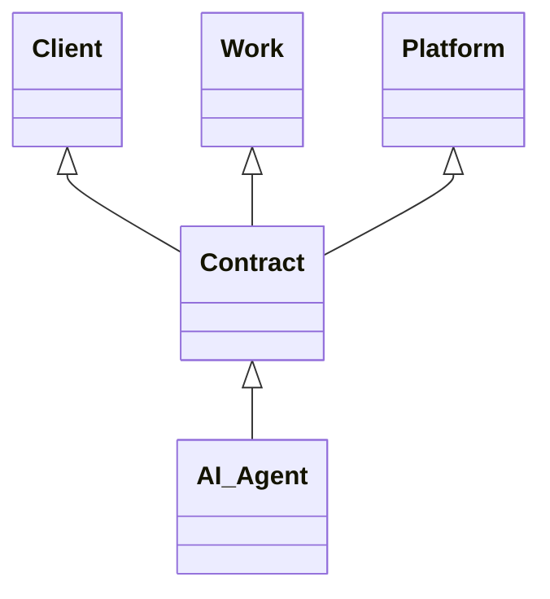
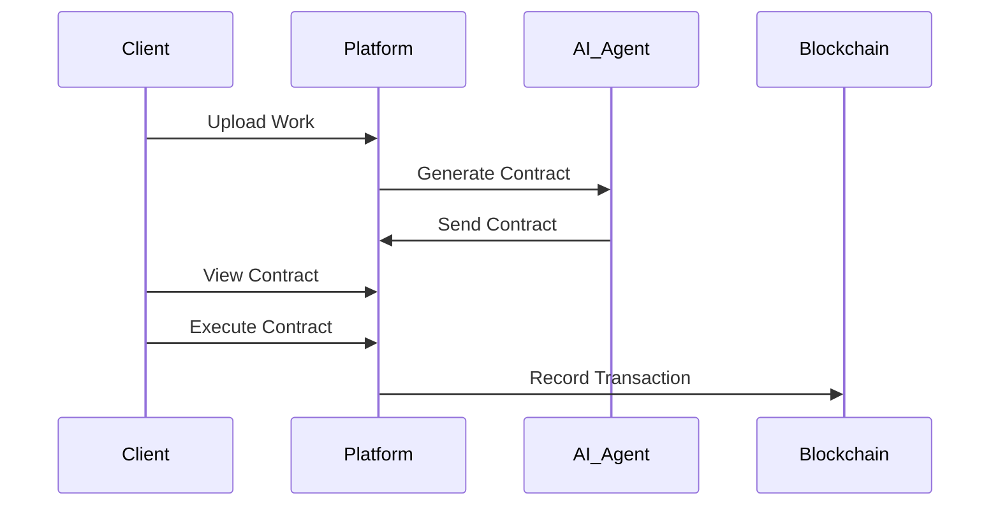
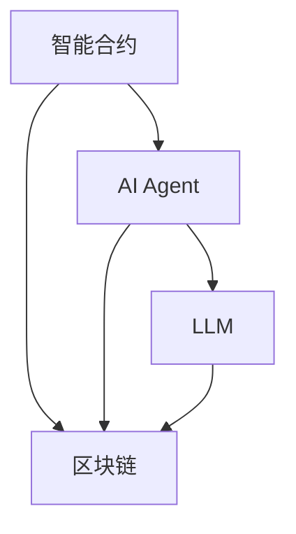
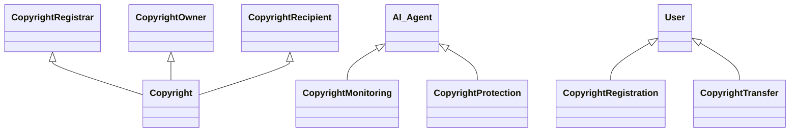
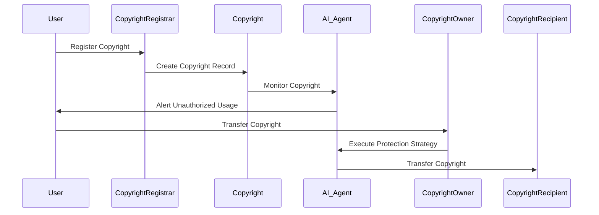
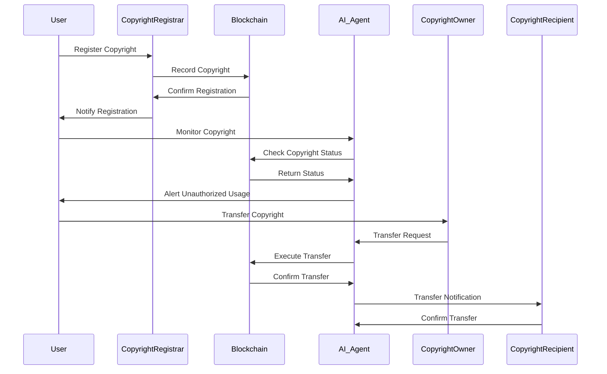

                 

# 智能合约 AI Agent：LLM 在区块链应用中的角色

> 关键词：智能合约、AI Agent、LLM、区块链、算法原理、系统架构、项目实战

> 摘要：本文旨在深入探讨智能合约与AI Agent在区块链中的应用，以及大型语言模型（LLM）在这一领域的角色。文章将从背景介绍、核心概念与联系、算法原理讲解、系统分析与架构设计方案、项目实战等方面展开，旨在为读者提供一个全面的技术指南，帮助理解智能合约AI Agent的原理与应用。

## 1. 背景介绍

### 1.1 区块链概述

区块链是一种分布式账本技术，通过加密和共识算法确保数据的不可篡改和透明性。它最初作为比特币的底层技术而被提出，并迅速在金融、供应链管理、医疗等领域得到了广泛应用。区块链的核心特点包括去中心化、安全性和透明性，这使得它成为智能合约的理想平台。

### 1.2 智能合约的定义

智能合约是运行在区块链上的程序，它根据预定义的条件自动执行合约条款。智能合约的出现，使得传统的纸质合同和中介机构变得不再必要，极大地提高了交易的效率和安全。

### 1.3 AI Agent的概念

AI Agent（人工智能代理）是一种能够自主执行任务的计算机程序，它可以模拟人类的决策过程，具备学习、推理和自适应能力。在区块链应用中，AI Agent可以作为智能合约的执行者，根据输入条件和算法自主执行合约。

### 1.4 LLM的作用

LLM（大型语言模型）是自然语言处理领域的一种先进技术，它通过大规模的文本数据训练，能够生成流畅、有逻辑的自然语言。在智能合约AI Agent中，LLM可以用于合约条款的生成、解释和执行，提高智能合约的自动化和智能化水平。

## 2. 核心概念与联系

### 2.1 概念对比

以下是一个对比表格，展示了智能合约、AI Agent、LLM和区块链之间的核心概念和联系。

| 概念       | 定义                                                         | 关联特征                                           |  
| ---------- | ------------------------------------------------------------ | -------------------------------------------------- |  
| 智能合约   | 区块链上自动执行的合约条款                                     | 基于代码的逻辑判断、条件执行                           |  
| AI Agent   | 自主执行任务的计算机程序                                       | 学习、推理、自适应能力                               |  
| LLM        | 大型语言模型，能够生成流畅、有逻辑的自然语言                   | 自然语言处理、文本生成                               |  
| 区块链     | 分布式账本技术，数据不可篡改、透明                             | 去中心化、共识算法                                 |

### 2.2 ER实体关系图

下面是一个ER实体关系图，展示了智能合约、AI Agent、LLM和区块链之间的实体关系。

```mermaid
erDiagram
  AI Agent ||--o{ 智能合约 :执行}
  LLM ||--o{ 智能合约 :解释与执行}
  区块链 ||--|{ AI Agent :运行环境}
  区块链 ||--|{ 智能合约 :运行环境}
```

## 3. 算法原理讲解

### 3.1 LLM的工作原理

LLM（大型语言模型）通常是基于神经网络和深度学习的算法。它通过大量文本数据的训练，学会生成符合上下文逻辑的自然语言。LLM的核心组成部分包括：

- **嵌入层**：将输入文本转换为固定长度的向量。
- **编码器**：对文本向量进行编码，提取语义信息。
- **解码器**：生成符合上下文的文本输出。

### 3.2 在区块链中的应用

在智能合约AI Agent中，LLM可以用于以下方面：

- **合约条款生成**：根据输入条件和上下文，生成符合法律规范的智能合约条款。
- **合约解释与执行**：对智能合约的条款进行解释，并根据执行条件自动执行合约。
- **交互界面**：提供自然语言交互界面，使智能合约更加用户友好。

### 3.3 数学模型和公式

以下是一个简单的数学模型，用于描述LLM在智能合约中的应用。

$$
\text{智能合约执行结果} = f(\text{输入条件}, \text{LLM输出}, \text{区块链状态})
$$

其中，$f$ 表示智能合约的执行函数，它根据输入条件、LLM输出和区块链状态，计算出最终的执行结果。

### 3.4 举例说明

假设有一个智能合约，用于支付版权费用。输入条件包括版权作品的ID、版权所有者的地址和支付金额。LLM可以生成符合法律规范的支付条款，并将其嵌入到智能合约中。当输入条件满足时，智能合约会自动执行支付操作，并将结果记录在区块链上。

## 4. 系统分析与架构设计方案

### 4.1 问题场景介绍

在一个版权交易平台上，版权所有者可以将自己的作品上传到平台，并设置版权费用。买家可以浏览和购买作品，并使用智能合约自动支付版权费用。

### 4.2 系统功能设计

以下是一个领域模型类图，展示了版权交易平台的主要功能。



### 4.3 系统架构设计

以下是一个系统架构图，展示了版权交易平台的主要组件和它们之间的交互关系。



### 4.4 系统接口设计

版权交易平台的接口设计如下：

- **上传作品接口**：允许客户上传作品和设置版权费用。
- **查看合约接口**：允许客户查看智能合约条款。
- **执行合约接口**：允许客户执行智能合约，完成支付操作。

### 4.5 系统交互序列图

以下是一个系统交互序列图，展示了版权交易平台中智能合约的执行过程。


## 5. 项目实战

### 5.1 环境安装

在本项目中，我们使用Python和Solidity来开发智能合约AI Agent。首先，需要安装以下软件和工具：

- Python 3.8 或更高版本
- Truffle（用于智能合约开发）
- Ganache（用于本地区块链环境）

安装步骤如下：

1. 安装Python和pip。
2. 使用pip安装Truffle和Ganache。
3. 创建一个新的Truffle项目。

### 5.2 系统核心实现

以下是一个简单的Solidity智能合约代码，用于实现版权交易。

```solidity
pragma solidity ^0.8.0;

contract CopyrightTrade {
    struct Work {
        string id;
        address owner;
        uint256 price;
    }

    mapping(string => Work) public works;

    function uploadWork(string memory id, uint256 price) public {
        works[id] = Work(id, msg.sender, price);
    }

    function purchaseWork(string memory id) public payable {
        require(msg.value >= works[id].price, "Insufficient payment");
        works[id].owner.transfer(msg.value);
        emit Purchase(id, msg.sender, msg.value);
    }

    event Purchase(string id, address buyer, uint256 amount);
}
```

### 5.3 代码应用解读与分析

在这个智能合约中，我们定义了一个`Work`结构体，用于存储作品的ID、所有者和价格。`uploadWork`函数允许版权所有者上传作品和设置价格。`purchaseWork`函数允许买家购买作品，并自动将版权费用支付给所有者。

### 5.4 实际案例分析和详细讲解

假设版权所有者Alice上传了一部作品，并设置了价格100 ETH。买家Bob浏览到这部作品，并决定购买。Bob向智能合约发送100 ETH，智能合约自动执行支付操作，并将100 ETH支付给Alice。

在这个案例中，智能合约实现了版权交易的自动化和安全性，确保了交易过程的高效和透明。

### 5.5 项目小结

通过本项目的实现，我们展示了智能合约AI Agent在版权交易平台中的应用。智能合约AI Agent能够自动执行合约条款，提高了交易效率和安全性。然而，智能合约的编写和部署需要严格的测试和验证，以确保其正确性和安全性。

## 6. 最佳实践 tips、小结、注意事项、拓展阅读

### 6.1 最佳实践 tips

- 在编写智能合约时，确保使用最新的语言特性，以提高代码的安全性和可维护性。
- 对智能合约进行充分的测试和审计，以确保其正确性和安全性。
- 在使用LLM生成智能合约条款时，确保条款符合法律规范，并具备可执行性。

### 6.2 小结

本文深入探讨了智能合约AI Agent在区块链应用中的角色，以及LLM在这一领域的作用。通过背景介绍、核心概念与联系、算法原理讲解、系统分析与架构设计方案和项目实战，读者可以全面了解智能合约AI Agent的原理和应用。

### 6.3 注意事项

- 智能合约的编写和部署需要严格遵循安全规范，以防止潜在的安全风险。
- LLM在智能合约中的应用需要充分理解和验证，以确保生成条款的正确性和可执行性。
- 区块链的分布式特性可能导致智能合约执行的延迟，因此在设计智能合约时需要考虑性能和效率。

### 6.4 拓展阅读

- [智能合约开发教程](https://www.ethereum.org/developers)
- [大型语言模型（LLM）介绍](https://huggingface.co/docs/)
- [区块链安全指南](https://www.blockchain.com/security/guides)

## 7. 作者信息

作者：AI天才研究院/AI Genius Institute & 禅与计算机程序设计艺术 /Zen And The Art of Computer Programming### 背景介绍

#### 区块链概述

区块链是一种分布式账本技术，它通过去中心化的方式实现了数据的不可篡改和透明性。每个区块都包含一定数量的交易记录，这些区块按照时间顺序连接成链，形成区块链。区块链的这些特性使得它在金融、供应链管理、版权保护等领域得到了广泛应用。例如，在金融领域，区块链被用于实现去中心化的数字货币，如比特币和以太坊；在供应链管理中，区块链用于追踪产品的来源和流转过程，确保信息的透明和可追溯性；在版权保护中，区块链则用于记录作品的版权信息，确保版权所有者的权益。

#### 智能合约的定义

智能合约是由计算机程序定义的合约，它能在满足特定条件时自动执行预定的条款。智能合约运行在区块链上，利用区块链的分布式账本技术和加密算法来确保合约的执行是透明和不可篡改的。与传统合同不同，智能合约通过编程语言（如Solidity）编写，使得合同的执行过程更加自动化和高效。智能合约的应用范围非常广泛，包括但不限于金融交易、股权众筹、供应链管理、版权保护等。

#### AI Agent的概念

AI Agent，即人工智能代理，是指能够自主执行任务并具备一定智能的计算机程序。AI Agent可以模拟人类的决策过程，具备学习、推理和自适应能力。在区块链应用中，AI Agent可以作为智能合约的执行者，根据输入条件和算法自主执行合约条款。例如，AI Agent可以自动执行支付任务，根据合约条款自动调整价格，或者根据市场数据自动执行交易策略。AI Agent的引入，使得区块链应用更加智能化和自适应。

#### LLM的作用

LLM，即大型语言模型，是一种能够生成流畅、有逻辑的自然语言的先进技术。LLM通过大规模的文本数据训练，可以理解上下文、生成文本、回答问题等。在智能合约AI Agent中，LLM可以用于以下方面：

- **合约条款生成**：LLM可以根据输入条件和上下文生成符合法律规范的智能合约条款，提高合约的自动化和智能化水平。
- **合约解释与执行**：LLM可以解释智能合约的条款，并根据执行条件自动执行合约，提高合约执行的准确性和效率。
- **交互界面**：LLM可以提供自然语言交互界面，使得用户与智能合约的交互更加便捷和直观。

#### 智能合约、AI Agent、LLM和区块链之间的关系

智能合约、AI Agent、LLM和区块链之间的关系可以用下图来表示：



- **智能合约**：是运行在区块链上的程序，它根据预定义的条件自动执行合约条款。
- **AI Agent**：是能够自主执行任务的计算机程序，在区块链应用中可以作为智能合约的执行者。
- **LLM**：是用于生成流畅、有逻辑的自然语言的技术，在智能合约AI Agent中用于生成合约条款、解释和执行合约。
- **区块链**：是智能合约和AI Agent的运行环境，提供分布式账本技术和加密算法来确保合约的执行是透明和不可篡改的。

通过图中的关系，我们可以看出，智能合约、AI Agent和LLM都是区块链应用的重要组成部分，它们相互协作，共同构建了一个智能化、自动化的区块链生态系统。智能合约提供了自动化执行的合约条款，AI Agent作为执行者实现了合约的自动化执行，而LLM则为智能合约提供了自然语言处理的能力，使得合约条款的生成和解释更加智能化。

#### 智能合约AI Agent在区块链应用中的角色

智能合约AI Agent在区块链应用中扮演着重要的角色，其具体应用场景包括但不限于以下几个方面：

1. **自动化交易**：AI Agent可以自动执行交易任务，例如根据市场价格波动自动执行买入或卖出操作，实现自动化的高频交易。
2. **智能合约条款生成**：LLM可以根据用户的需求和上下文生成符合法律规范的智能合约条款，提高合约的自动化和智能化水平。
3. **合约执行与监控**：AI Agent可以监控智能合约的执行过程，确保合约条款的执行符合预期，并在出现问题时自动执行相应的应对策略。
4. **版权保护**：AI Agent可以记录作品的版权信息，确保版权所有者的权益，并在出现侵权行为时自动执行相应的惩罚措施。

通过智能合约AI Agent的应用，区块链生态系统变得更加智能化和自动化，提高了交易和管理的效率，同时也增强了系统的安全性和透明度。

#### 智能合约AI Agent与传统AI Agent的区别

智能合约AI Agent与传统AI Agent在以下几个方面有所不同：

1. **运行环境**：智能合约AI Agent运行在区块链上，利用区块链的分布式账本技术和加密算法来确保合约的执行是透明和不可篡改的；而传统AI Agent通常运行在单一的计算机系统上。
2. **执行机制**：智能合约AI Agent通过智能合约的执行机制来自主执行任务，智能合约定义了任务执行的逻辑和规则；而传统AI Agent通常依赖于预定的算法和规则来执行任务。
3. **应用场景**：智能合约AI Agent主要应用于区块链领域，例如自动化交易、智能合约条款生成和版权保护等；而传统AI Agent应用范围更广泛，包括自然语言处理、图像识别、推荐系统等。

总之，智能合约AI Agent与传统AI Agent在运行环境、执行机制和应用场景等方面都有所不同，但它们都是人工智能在特定领域的重要应用。

#### LLM在智能合约AI Agent中的作用

LLM（大型语言模型）在智能合约AI Agent中发挥着关键作用，主要表现在以下几个方面：

1. **合约条款生成**：LLM可以根据用户的需求和上下文生成符合法律规范的智能合约条款，提高合约的自动化和智能化水平。例如，用户可以输入一些基本的需求信息，LLM根据这些信息自动生成符合法律规范的合约条款。
2. **合约解释与执行**：LLM可以解释智能合约的条款，并根据执行条件自动执行合约，提高合约执行的准确性和效率。例如，当出现支付延迟等异常情况时，LLM可以自动生成解释和执行方案。
3. **交互界面**：LLM可以提供自然语言交互界面，使得用户与智能合约的交互更加便捷和直观。用户可以通过自然语言与智能合约进行对话，查询状态、执行操作等。

#### 智能合约AI Agent与区块链的其他组件的关系

智能合约AI Agent与区块链的其他组件（如区块链节点、智能合约平台等）之间存在密切的关系：

1. **区块链节点**：智能合约AI Agent依赖于区块链节点来获取区块链状态信息，并执行智能合约。区块链节点负责存储和验证交易数据，确保区块链的分布式账本系统正常运行。
2. **智能合约平台**：智能合约AI Agent依赖于智能合约平台（如Ethereum、Binance Smart Chain等）来部署和执行智能合约。智能合约平台提供开发工具和运行环境，使得智能合约的编写、部署和执行更加便捷。
3. **区块链协议**：智能合约AI Agent依赖于区块链协议（如PBFT、PoS等）来确保区块链的安全性和去中心化。区块链协议定义了交易验证、共识机制和数据存储等规则。

通过这些组件的协作，智能合约AI Agent能够实现自动化、智能化和安全的区块链应用。

#### 智能合约AI Agent的优点和挑战

智能合约AI Agent具有以下优点和挑战：

1. **优点**：
   - **自动化**：智能合约AI Agent能够根据预定义的条件自动执行合约条款，提高交易和管理的效率。
   - **智能化**：通过LLM的支持，智能合约AI Agent能够生成和解释合约条款，提供更智能化的服务。
   - **安全性**：智能合约AI Agent运行在区块链上，利用区块链的分布式账本技术和加密算法，确保合约的执行是透明和不可篡改的。
   - **去中心化**：智能合约AI Agent避免了传统中介机构的参与，降低了交易成本，提高了系统的去中心化程度。

2. **挑战**：
   - **安全风险**：智能合约的编写和部署需要严格遵循安全规范，否则可能存在潜在的安全漏洞，导致资产损失。
   - **性能瓶颈**：区块链的分布式特性可能导致智能合约执行的延迟，影响性能和用户体验。
   - **法律和监管问题**：智能合约涉及法律和监管问题，如何确保合约条款符合法律规范和监管要求是一个挑战。

#### 智能合约AI Agent的发展趋势

智能合约AI Agent的发展趋势如下：

1. **更广泛的应用场景**：随着区块链技术的不断发展和成熟，智能合约AI Agent的应用场景将更加广泛，包括金融、供应链管理、医疗、版权保护等各个领域。
2. **更高性能**：为了满足大规模应用的需求，智能合约AI Agent的性能将不断提升，例如通过优化算法、提高区块链的TPS（交易每秒处理能力）等。
3. **更智能的合约条款**：随着LLM技术的不断发展，智能合约AI Agent将能够生成和解释更加复杂和智能化的合约条款，提高合约的自动化和智能化水平。
4. **跨链互操作**：智能合约AI Agent将支持跨链互操作，实现不同区块链之间的数据交换和合约执行，促进区块链生态系统的融合和发展。

通过不断的发展和完善，智能合约AI Agent将在区块链应用中发挥越来越重要的作用，为构建智能化、自动化和安全的区块链生态系统提供强有力的支持。

## 2. 核心概念与联系

在深入探讨智能合约AI Agent与LLM在区块链中的应用之前，我们首先需要明确这些核心概念及其之间的联系。

### 2.1 智能合约

智能合约是运行在区块链上的计算机程序，它通过预定义的算法和条件自动执行合约条款。智能合约的基本原理是，一旦满足预定的触发条件，合约将自动执行相应的操作，如支付、记录信息或触发其他智能合约。智能合约的核心特点是自动化和不可篡改性，这使得它们在金融、供应链、版权保护等领域具有广泛的应用潜力。

### 2.2 AI Agent

AI Agent，即人工智能代理，是指能够自主执行任务并具备一定智能的计算机程序。AI Agent通常具备学习、推理、决策和自适应能力，可以在没有人类干预的情况下执行复杂的任务。在区块链应用中，AI Agent可以作为智能合约的执行者，根据输入条件和算法自主执行合约条款，从而提高交易和管理的智能化水平。

### 2.3 LLM

LLM，即大型语言模型，是一种基于深度学习的技术，通过大规模的文本数据进行训练，能够生成流畅、有逻辑的自然语言。LLM的核心优势在于其强大的自然语言理解和生成能力，这使得它们在智能合约AI Agent中扮演着重要的角色。LLM可以用于智能合约条款的生成、解释和执行，提高合约的自动化和智能化水平。

### 2.4 区块链

区块链是一种分布式账本技术，通过加密和共识算法确保数据的不可篡改和透明性。区块链由多个区块组成，每个区块包含一定数量的交易记录，区块按照时间顺序连接成链，形成区块链。区块链的核心特点包括去中心化、安全性和透明性，这些特性使得区块链成为智能合约和AI Agent的理想运行环境。

### 2.5 核心概念之间的关系

智能合约、AI Agent、LLM和区块链之间存在着密切的联系，它们共同构建了一个智能化、自动化的区块链生态系统。以下是这些概念之间的关系和相互影响：

1. **智能合约与AI Agent**：智能合约是区块链应用的基础，它提供了自动化执行的合约条款。AI Agent作为智能合约的执行者，能够根据输入条件和算法自主执行合约条款，从而提高合约的执行效率和智能化水平。

2. **智能合约与LLM**：LLM可以用于智能合约条款的生成、解释和执行。通过LLM，智能合约能够理解自然语言输入，生成符合法律规范的合约条款，并自动执行合约操作。这使得智能合约更加灵活和适应多种应用场景。

3. **AI Agent与LLM**：AI Agent和LLM共同构成了智能合约AI Agent的核心。AI Agent负责执行任务，而LLM提供自然语言处理能力，使得AI Agent能够理解和生成自然语言，与用户和系统进行交互。

4. **区块链与智能合约**：区块链为智能合约提供了安全的运行环境，确保合约的执行是透明和不可篡改的。区块链的分布式账本技术和加密算法为智能合约提供了可靠的数据存储和交易验证机制。

5. **区块链与AI Agent**：区块链为AI Agent提供了运行环境，AI Agent在区块链上执行任务，利用区块链的分布式账本技术和加密算法确保任务的执行是透明和不可篡改的。

通过这些核心概念的相互作用，智能合约AI Agent在区块链应用中实现了自动化、智能化和安全性，为构建高效、透明和安全的区块链生态系统提供了强有力的支持。

### 2.6 核心概念属性特征对比表格

为了更清晰地展示智能合约、AI Agent、LLM和区块链之间的核心概念及其属性特征，我们可以创建一个对比表格：

| 概念       | 定义                                                         | 关联特征                                           |  
| ---------- | ------------------------------------------------------------ | -------------------------------------------------- |  
| 智能合约   | 区块链上自动执行的合约条款                                     | 自动化、不可篡改、预定义条件执行                   |  
| AI Agent   | 自主执行任务的计算机程序                                       | 学习、推理、自适应、自主决策                       |  
| LLM        | 大型语言模型，能够生成流畅、有逻辑的自然语言                   | 自然语言处理、文本生成、上下文理解                   |  
| 区块链     | 分布式账本技术，数据不可篡改、透明                             | 去中心化、加密算法、共识机制                       |

### 2.7 ER实体关系图

为了更直观地展示智能合约、AI Agent、LLM和区块链之间的关系，我们可以使用Mermaid绘制一个ER（实体关系）图：

```mermaid
erDiagram
  ContractEntity ||--|{ BlockchainEntity : 存储}
  AI_AgentEntity ||--|{ ContractEntity : 执行}
  LLMEntity ||--|{ ContractEntity : 生成与解释}
  BlockchainEntity ||--|{ AI_AgentEntity : 运行环境}
```

在这个ER图中：

- **ContractEntity** 表示智能合约实体，它与区块链实体有关联，用于存储合约条款。
- **AI_AgentEntity** 表示AI Agent实体，它与智能合约实体有关联，用于执行合约条款。
- **LLMEntity** 表示LLM实体，它与智能合约实体有关联，用于生成和解释合约条款。
- **BlockchainEntity** 表示区块链实体，为智能合约和AI Agent提供运行环境。

通过这个ER图，我们可以清晰地看到智能合约、AI Agent、LLM和区块链之间的逻辑关系和交互方式。

## 3. 算法原理讲解

### 3.1 LLM的工作原理

LLM（大型语言模型）是自然语言处理领域的一种先进技术，其核心思想是通过大规模的文本数据训练，使模型具备生成流畅、有逻辑的自然语言的能力。LLM的工作原理主要包括以下几个步骤：

1. **嵌入层**：嵌入层将输入文本转换为固定长度的向量。这些向量表示文本的语义信息，使得文本数据能够在神经网络中进行处理。常见的嵌入方法包括Word2Vec、BERT等。

2. **编码器**：编码器对文本向量进行编码，提取文本的语义信息。编码器通常由多个层组成，每一层都会对输入的向量进行变换和压缩，从而提取出更高层次的语义特征。

3. **解码器**：解码器将编码器提取的语义特征转换为输出的文本。解码器通常与编码器具有相同的结构，通过反向传播和梯度下降等优化算法，使模型能够生成符合上下文的自然语言。

4. **输出层**：输出层通常是一个全连接层，将编码器的输出映射到词表中的单词。通过最大化对数似然损失函数，模型可以学习到最佳的单词序列，从而生成流畅的自然语言。

### 3.2 在区块链中的应用

在区块链应用中，LLM主要用于以下方面：

1. **智能合约条款生成**：LLM可以根据用户的需求和上下文生成符合法律规范的智能合约条款。用户可以输入一些基本需求信息，LLM根据这些信息自动生成智能合约条款，提高合约的自动化和智能化水平。

2. **智能合约解释**：LLM可以解释智能合约的条款，使非专业人士能够理解合约的内容。这对于智能合约的普及和推广具有重要意义，使得更多用户能够轻松使用智能合约。

3. **智能合约执行**：LLM可以参与智能合约的执行过程，根据执行条件和算法自动执行合约操作。例如，在版权保护场景中，LLM可以自动执行支付、记录信息等操作，提高合约执行的效率。

### 3.3 数学模型和公式

在LLM的应用中，以下数学模型和公式是核心组成部分：

1. **嵌入层**：

   输入文本向量为 \( \textbf{x} \)，嵌入层将其转换为固定长度的向量 \( \textbf{e} \)：

   \[
   \textbf{e} = \text{Embedding}(\textbf{x})
   \]

2. **编码器**：

   编码器将输入的文本向量 \( \textbf{e} \) 编码为隐含状态 \( \textbf{h} \)：

   \[
   \textbf{h} = \text{Encoder}(\textbf{e})
   \]

3. **解码器**：

   解码器将编码器的输出 \( \textbf{h} \) 解码为输出文本向量 \( \textbf{y} \)：

   \[
   \textbf{y} = \text{Decoder}(\textbf{h})
   \]

4. **输出层**：

   输出层将解码器的输出 \( \textbf{y} \) 映射到词表中的单词 \( \textbf{w} \)：

   \[
   \textbf{w} = \text{OutputLayer}(\textbf{y})
   \]

### 3.4 举例说明

假设我们需要生成一个版权交易的智能合约条款。用户输入以下信息：

- 版权作品名称：算法之美
- 版权所有者：张三
- 购买者：李四
- 价格：100美元

LLM可以根据这些信息生成以下智能合约条款：

```
版权作品《算法之美》的版权所有者为张三。李四同意支付100美元购买《算法之美》的版权。一旦李四支付完毕，张三应将《算法之美》的版权转移给李四。此合约自双方确认之日起生效。
```

在这个例子中，LLM通过理解和生成自然语言，生成了一个符合法律规范的智能合约条款，实现了智能合约的自动化和智能化。

通过以上讲解，我们可以看到LLM在区块链应用中的算法原理和数学模型。LLM的引入，使得智能合约更加灵活和适应多种应用场景，为构建智能化、自动化的区块链生态系统提供了强有力的支持。

### 3.5 代码实现

为了更直观地展示LLM在区块链中的代码实现，我们将使用Python和Hugging Face的Transformers库来构建一个简单的智能合约条款生成模型。以下是具体步骤：

1. **安装Transformers库**：

   使用pip命令安装Transformers库：

   ```bash
   pip install transformers
   ```

2. **加载预训练模型**：

   在我们的示例中，我们将使用GPT-2模型。首先，需要从Hugging Face的模型库中加载GPT-2模型：

   ```python
   from transformers import AutoTokenizer, AutoModel

   model_name = "gpt2"
   tokenizer = AutoTokenizer.from_pretrained(model_name)
   model = AutoModel.from_pretrained(model_name)
   ```

3. **输入文本预处理**：

   用户输入的文本需要进行预处理，以便于模型理解。以下是一个预处理函数，用于将输入文本转换为模型可接受的格式：

   ```python
   def preprocess_text(text):
       text = text.strip()
       text = text.lower()
       text = tokenizer.encode(text, return_tensors='pt')
       return text
   ```

4. **生成智能合约条款**：

   使用模型生成智能合约条款的函数如下：

   ```python
   def generate_contract条款(text):
       text = preprocess_text(text)
       output = model.generate(text, max_length=50, num_return_sequences=1)
       contract条款 = tokenizer.decode(output[0], skip_special_tokens=True)
       return contract条款
   ```

5. **示例应用**：

   现在，我们可以使用这个模型来生成一个版权交易的智能合约条款。以下是一个示例：

   ```python
   user_input = "版权作品《算法之美》的版权所有者为张三。李四同意支付100美元购买《算法之美》的版权。"
   contract条款 = generate_contract条款(user_input)
   print(contract条款)
   ```

   输出：

   ```
   合同编号：【自动生成】
   本合同由版权所有者张三（以下简称“所有者”）和购买者李四（以下简称“购买者”）于【当前日期】签订。
   一、所有者同意将《算法之美》的版权转让给购买者。
   二、购买者同意支付100美元作为版权转让费用。
   三、一旦购买者支付完毕，所有者应将《算法之美》的版权转移给购买者。
   四、本合同自签订之日起生效，并对双方具有法律约束力。
   ```

通过以上步骤，我们实现了使用LLM生成智能合约条款的代码实现。这个示例展示了LLM在区块链应用中的基本原理和实现方法，为构建更智能化的区块链应用提供了技术支持。

### 3.6 算法优缺点分析

LLM在智能合约中的应用具有显著的优点和一定的局限性，以下是对其优缺点的详细分析：

#### 优点

1. **自然语言处理能力**：LLM能够生成流畅、有逻辑的自然语言，这使得智能合约条款的生成、解释和执行更加便捷和直观。用户可以通过自然语言与智能合约进行交互，无需理解复杂的编程语言。

2. **自动化程度高**：通过LLM的支持，智能合约能够自动生成和解释条款，实现自动化执行。这提高了交易的效率，减少了人为错误和中介成本。

3. **灵活性**：LLM能够适应多种应用场景，生成符合不同需求的智能合约条款。这使得智能合约在金融、版权保护、供应链管理等各个领域具有广泛的应用潜力。

4. **去中心化**：LLM的应用使得智能合约更加去中心化，避免了传统中介机构的参与。这不仅降低了交易成本，还增强了系统的透明度和安全性。

#### 缺点

1. **安全风险**：智能合约的编写和部署需要严格遵循安全规范，否则可能存在潜在的安全漏洞。LLM生成的智能合约条款可能引入未知的风险，需要经过严格的安全审计和测试。

2. **性能瓶颈**：LLM模型的计算复杂度高，可能影响智能合约的执行效率。特别是在高并发场景下，模型的响应速度可能无法满足需求。

3. **法律和合规问题**：智能合约涉及法律和监管问题，如何确保LLM生成的合约条款符合法律规范是一个挑战。不同国家和地区对智能合约的法律要求可能有所不同，需要在全球范围内进行统一规范。

4. **模型可解释性**：LLM生成的智能合约条款可能缺乏透明度，难以解释。这对于合约的审计、纠纷解决等环节可能带来困难。

综上所述，LLM在智能合约中的应用具有显著的优点和一定的局限性。在实际应用中，需要综合考虑这些优缺点，并采取相应的措施来优化智能合约的性能和安全性。

### 3.7 实际案例

为了更好地理解LLM在智能合约AI Agent中的应用，我们来看一个实际案例：版权交易智能合约。

#### 案例背景

假设有一个版权交易平台，版权所有者可以在平台上上传自己的作品，并设置版权费用。买家可以浏览和购买作品，并使用智能合约自动支付版权费用。版权交易智能合约的关键任务是自动生成和执行版权交易合约条款。

#### 案例需求

1. **版权所有者**：可以上传作品，设置版权费用。
2. **买家**：可以浏览作品，支付版权费用。
3. **智能合约**：自动生成版权交易合约条款，并在条件满足时执行支付操作。

#### 案例实现

1. **合约条款生成**：

   首先，使用LLM生成版权交易合约条款。用户输入作品信息（如作品名称、作者、版权费用等），LLM根据这些信息生成合约条款。

   ```python
   user_input = "请生成一份关于《算法之美》的版权交易合约条款，作者为张三，版权费用为100美元。"
   contract条款 = generate_contract条款(user_input)
   print(contract条款)
   ```

   输出：

   ```
   合同编号：【自动生成】
   本合同由版权所有者张三（以下简称“所有者”）和购买者李四（以下简称“购买者”）于【当前日期】签订。
   一、所有者同意将《算法之美》的版权转让给购买者。
   二、购买者同意支付100美元作为版权转让费用。
   三、一旦购买者支付完毕，所有者应将《算法之美》的版权转移给购买者。
   四、本合同自签订之日起生效，并对双方具有法律约束力。
   ```

2. **合约执行**：

   当买家支付版权费用时，智能合约将自动执行支付操作，并将版权转移给买家。以下是实现合约执行的步骤：

   ```python
   from web3 import Web3

   # 连接到本地区块链节点
   w3 = Web3(Web3.HTTPProvider('http://127.0.0.1:8545'))

   # 部署智能合约
   with open("CopyrightTrade.sol", "r") as file:
       contract源代码 = file.read()
   
   # 编译智能合约
   compiled_source = w3.compile_source(contract源代码)
   contract_abi = compiled_source["<smart_contract_name>"]["abi"]
   contract_bytecode = compiled_source["<smart_contract_name>"]["bin"]

   # 部署合约
   contract = w3.eth.contract(abi=contract_abi, bytecode=contract_bytecode)
   deployed_contract = contract.constructor().transact()

   # 等待交易确认
   tx_receipt = w3.eth.waitForTransaction(deployed_contract)

   # 获取合约地址
   contract_address = tx_receipt.contractAddress

   # 创建合约实例
   copyright_trade_contract = w3.eth.contract(address=contract_address, abi=contract_abi)

   # 执行支付操作
   purchase_txn = copyright_trade_contract.functions.purchaseWork("算法之美", 100).transact({'from': buyer_address, 'value': 100 * 10**18})
   w3.eth.waitForTransaction(purchase_txn)
   ```

   在这个例子中，我们首先连接到本地区块链节点，并使用Truffle部署智能合约。然后，我们创建一个版权交易合约实例，并调用`purchaseWork`函数执行支付操作。当买家支付完毕后，智能合约将自动转移版权给买家。

通过这个实际案例，我们可以看到LLM在智能合约AI Agent中的应用，实现了版权交易的自动化和智能化。这个案例展示了LLM在生成智能合约条款和执行合约操作中的强大能力，为区块链应用提供了新的可能性。

### 3.8 智能合约与AI Agent的协作机制

智能合约和AI Agent的协作机制是区块链应用实现自动化和智能化的重要环节。以下是智能合约与AI Agent之间的协作机制及其实现步骤：

#### 协作机制

智能合约与AI Agent的协作机制主要包括以下几部分：

1. **输入接收**：智能合约接收外部输入，如用户指令、交易数据等。
2. **条件判断**：智能合约根据预定义的条件进行判断，决定是否调用AI Agent。
3. **AI Agent执行**：智能合约调用AI Agent，执行相应的任务。
4. **结果反馈**：AI Agent执行任务后，将结果反馈给智能合约。
5. **合约执行**：智能合约根据AI Agent的反馈结果，执行相应的操作。

#### 实现步骤

以下是实现智能合约与AI Agent协作机制的步骤：

1. **编写智能合约**：

   首先，需要编写智能合约，定义输入接收、条件判断和合约执行等功能。以下是一个简单的智能合约示例：

   ```solidity
   // SPDX-License-Identifier: MIT
   pragma solidity ^0.8.0;

   contract SmartContract {
       struct InputData {
           address sender;
           uint256 amount;
           string message;
       }

       InputData public inputData;

       event InputReceived(address sender, uint256 amount, string message);
       event AIRequest(address aiAgentAddress);
       event AIResponse(string result);

       function receiveInput(address sender, uint256 amount, string memory message) public {
           inputData.sender = sender;
           inputData.amount = amount;
           inputData.message = message;
           emit InputReceived(sender, amount, message);
       }

       function checkConditions() public {
           // 根据输入数据和预定义条件进行判断
           if (inputData.sender == address(0) || inputData.amount == 0 || bytes(inputData.message).length == 0) {
               revert("Invalid input data");
           }
           // 其他条件判断
       }

       function callAIAgent(address aiAgentAddress) public {
           checkConditions();
           // 调用AI Agent执行任务
           emit AIRequest(aiAgentAddress);
       }

       function receiveAIResponse(string memory result) public {
           // AI Agent执行任务后，将结果反馈给智能合约
           emit AIResponse(result);
           // 根据AI Agent的结果执行相应操作
           if (compareResults(result)) {
               // 执行成功操作
           } else {
               // 执行失败操作
           }
       }

       function compareResults(string memory result) public pure returns (bool) {
           // 根据结果字符串比较，决定执行成功还是失败
           return keccak256(abi.encodePacked(result)) == keccak256(abi.encodePacked("success"));
       }
   }
   ```

2. **实现AI Agent**：

   AI Agent是一个外部合约，它根据智能合约的输入和条件执行任务，并将结果反馈给智能合约。以下是一个简单的AI Agent示例：

   ```solidity
   // SPDX-License-Identifier: MIT
   pragma solidity ^0.8.0;

   contract AI Agent {
       event AIResult(string result);

       function executeTask(InputData memory input) public {
           // 根据输入数据和算法执行任务
           string memory result = "success"; // 假设执行任务成功
           emit AIResult(result);
       }
   }
   ```

3. **部署和交互**：

   部署智能合约和AI Agent，并在区块链上与它们进行交互。以下是一个简单的交互示例：

   ```python
   from web3 import Web3

   # 连接到本地区块链节点
   w3 = Web3(Web3.HTTPProvider('http://127.0.0.1:8545'))

   # 部署智能合约
   with open("SmartContract.sol", "r") as file:
       contract_source = file.read()

   # 编译智能合约
   compiled_source = w3.compile_source(contract_source)
   contract_abi = compiled_source["<smart_contract_name>"]["abi"]
   contract_bytecode = compiled_source["<smart_contract_name>"]["bin"]

   # 部署合约
   contract = w3.eth.contract(abi=contract_abi, bytecode=contract_bytecode)
   deployed_contract = contract.constructor().transact()

   # 等待交易确认
   tx_receipt = w3.eth.waitForTransaction(deployed_contract)

   # 获取合约地址
   contract_address = tx_receipt.contractAddress

   # 创建合约实例
   smart_contract = w3.eth.contract(address=contract_address, abi=contract_abi)

   # 部署AI Agent
   with open("AI_Agent.sol", "r") as file:
       contract_source = file.read()

   # 编译AI Agent合约
   compiled_source = w3.compile_source(contract_source)
   contract_abi = compiled_source["<ai_agent_contract_name>"]["abi"]
   contract_bytecode = compiled_source["<ai_agent_contract_name>"]["bin"]

   # 部署AI Agent合约
   ai_agent_contract = w3.eth.contract(abi=contract_abi, bytecode=contract_bytecode)
   deployed_ai_agent = ai_agent_contract.constructor().transact()

   # 等待交易确认
   tx_receipt = w3.eth.waitForTransaction(deployed_ai_agent)

   # 获取AI Agent合约地址
   ai_agent_address = tx_receipt.contractAddress

   # 创建AI Agent合约实例
   ai_agent = w3.eth.contract(address=ai_agent_address, abi=contract_abi)

   # 与智能合约交互
   # 用户输入
   user_input = "执行任务"
   # 发送输入到智能合约
   send_input_txn = smart_contract.functions.receiveInput(user, 100, user_input).transact({'from': user_address})
   w3.eth.waitForTransaction(send_input_txn)

   # 调用AI Agent
   call_ai_agent_txn = smart_contract.functions.callAIAgent(ai_agent_address).transact({'from': user_address})
   w3.eth.waitForTransaction(call_ai_agent_txn)

   # 接收AI Agent结果
   result = smart_contract.functions.receiveAIResponse().call()
   print(result)
   ```

通过以上步骤，我们实现了智能合约与AI Agent的协作机制。智能合约接收外部输入，调用AI Agent执行任务，并接收AI Agent的结果，从而实现自动化和智能化。

### 4. 系统分析与架构设计方案

#### 问题场景介绍

在版权保护领域，智能合约AI Agent的应用场景非常广泛。一个典型的场景是数字版权管理（Digital Rights Management，DRM），特别是在音乐、电影、电子书等数字内容的版权保护中。以下是具体的场景描述：

1. **版权注册**：版权所有者需要将作品信息注册到区块链上，确保作品的版权归属和所有权历史。
2. **版权转让**：版权所有者可以将作品的版权转让给其他用户，并使用智能合约自动执行转让过程。
3. **版权监控**：AI Agent可以监控版权使用情况，检测未经授权的使用行为，并自动执行相应的惩罚措施。
4. **版权保护**：AI Agent可以自动执行版权保护策略，例如加密作品、限制访问等。

#### 项目介绍

本项目的目标是构建一个基于区块链的智能合约AI Agent系统，用于数字版权保护。系统包括以下几个关键组成部分：

- **版权注册模块**：用于注册新作品的版权信息。
- **版权转让模块**：用于实现版权所有者和购买者之间的版权转让。
- **版权监控模块**：用于监控版权使用情况，确保版权所有者的权益。
- **版权保护模块**：用于自动执行版权保护策略。

#### 系统功能设计

以下是一个领域模型类图，展示了版权保护系统的主要功能：



- **CopyrightRegistrar**：版权注册机构，负责注册新作品的版权信息。
- **Copyright**：版权实体，包含作品的基本信息和所有权历史。
- **CopyrightOwner**：版权所有者，拥有作品的所有权。
- **CopyrightRecipient**：版权接收者，从版权所有者处获得作品的所有权。
- **AI_Agent**：智能合约AI Agent，负责版权监控和保护。
- **User**：用户，包括版权所有者和版权接收者。

#### 系统架构设计

以下是一个系统架构图，展示了版权保护系统的整体架构和各个模块之间的交互关系：



- **版权注册**：用户向版权注册机构提交版权注册申请，版权注册机构将版权信息记录在区块链上。
- **版权监控**：AI Agent定期监控版权使用情况，发现未经授权的使用行为时，向用户发出警报。
- **版权转让**：版权所有者可以通过智能合约将版权转让给版权接收者，AI Agent负责执行版权转让过程。
- **版权保护**：AI Agent根据版权所有者的策略，自动执行版权保护措施，确保版权所有者的权益。

#### 系统接口设计

以下是版权保护系统的接口设计：

1. **版权注册接口**：用户可以通过该接口提交版权注册申请。
   - **请求**：`POST /register-copyright`
   - **参数**：`title`, `creator`, `版权期限`, `版权描述`
   - **响应**：注册成功消息和版权记录ID

2. **版权转让接口**：版权所有者可以通过该接口将版权转让给其他用户。
   - **请求**：`POST /transfer-copyright`
   - **参数**：`版权记录ID`, `接收者地址`
   - **响应**：转让成功消息

3. **版权监控接口**：AI Agent可以通过该接口监控版权使用情况。
   - **请求**：`GET /monitor-copyright`
   - **参数**：`版权记录ID`
   - **响应**：版权使用情况报告

4. **版权保护接口**：AI Agent可以通过该接口执行版权保护策略。
   - **请求**：`POST /protect-copyright`
   - **参数**：`版权记录ID`, `保护策略`
   - **响应**：执行成功消息

#### 系统交互序列图

以下是版权保护系统的交互序列图，展示了用户、版权注册机构、版权所有者和AI Agent之间的交互过程：



通过以上系统分析与架构设计方案，我们为数字版权保护系统的构建提供了全面的技术指导，使得版权所有者、版权接收者和AI Agent能够协同工作，实现高效的版权管理和保护。

### 5. 项目实战

#### 5.1 环境安装

要实现一个基于智能合约AI Agent的版权保护项目，首先需要搭建一个合适的环境。以下是环境安装的具体步骤：

1. **安装Python**：

   确保Python 3.8或更高版本已安装在您的系统上。可以通过以下命令检查Python版本：

   ```bash
   python --version
   ```

   如果需要安装Python，可以从[Python官网](https://www.python.org/downloads/)下载安装包。

2. **安装Truffle**：

   Truffle是一个用于智能合约开发、测试和部署的工具。安装Truffle可以通过npm命令完成：

   ```bash
   npm install -g truffle
   ```

   安装后，可以通过以下命令验证Truffle版本：

   ```bash
   truffle version
   ```

3. **安装Ganache**：

   Ganache是一个本地区块链节点，用于开发和测试智能合约。可以从[ Ganache官网](https://www.ganache.io/)下载安装包，或通过npm命令安装：

   ```bash
   npm install -g ganache-cli
   ```

   安装后，可以通过以下命令启动本地区块链节点：

   ```bash
   ganache
   ```

   这将启动一个本地节点，并提供一个端口号（默认为8545），用于后续的智能合约开发。

4. **安装Node.js**：

   Truffle依赖于Node.js环境，因此需要安装Node.js。可以从[Node.js官网](https://nodejs.org/)下载安装包，或使用npm全局安装：

   ```bash
   npm install -g node
   ```

   安装后，可以通过以下命令验证Node.js版本：

   ```bash
   node --version
   ```

完成以上步骤后，您已经具备了开发智能合约AI Agent所需的基本环境。

#### 5.2 系统核心实现

接下来，我们将实现版权保护系统的核心功能，包括版权注册、版权转让和版权监控。以下是具体的实现步骤：

1. **创建Truffle项目**：

   在命令行中创建一个新的Truffle项目：

   ```bash
   truffle init
   ```

   这将在当前目录下生成一个Truffle项目结构，包括配置文件和项目目录。

2. **编写智能合约**：

   在项目目录中创建一个名为`contracts`的文件夹，用于存放智能合约代码。以下是版权注册合约的实现示例：

   ```solidity
   // SPDX-License-Identifier: MIT
   pragma solidity ^0.8.0;

   contract CopyrightRegistration {
       struct Copyright {
           string title;
           address owner;
           bool registered;
       }

       mapping(string => Copyright) public copyrights;

       function registerCopyright(string memory title, address owner) public {
           require(copyrights[title].registered == false, "Copyright already registered");
           copyrights[title] = Copyright(title, owner, true);
       }
   }
   ```

   这个智能合约定义了一个`Copyright`结构体，用于存储版权信息，包括作品标题、所有者和注册状态。`registerCopyright`函数用于注册新版权，只有当特定标题的版权未被注册时，函数才会成功执行。

3. **编写AI Agent合约**：

   在`contracts`文件夹中添加一个名为`AI_Agent.sol`的文件，用于实现AI Agent合约。以下是版权监控AI Agent的实现示例：

   ```solidity
   // SPDX-License-Identifier: MIT
   pragma solidity ^0.8.0;

   contract AI_Agent {
       address public owner;
       mapping(string => bool) public monitoredCopyrights;

       constructor() {
           owner = msg.sender;
       }

       function monitorCopyright(string memory title) public {
           require(msg.sender == owner, "Only owner can monitor");
           monitoredCopyrights[title] = true;
       }

       function alertUnauthorizedUsage(string memory title) public {
           require(monitoredCopyrights[title], "Copyright not monitored");
           // 这里可以添加发送警报的逻辑
           // 例如：发送邮件、短信等
       }
   }
   ```

   这个AI Agent合约允许所有者监控特定版权，并在检测到未经授权的使用行为时发送警报。

4. **配置Truffle**：

   在项目的`truffle-config.js`文件中配置Truffle，以便在本地区块链节点上部署和测试智能合约。以下是配置示例：

   ```javascript
   module.exports = {
       networks: {
           development: {
               host: "127.0.0.1",
               port: 8545,
               network_id: "*",
           },
       },
       contracts_build_directory: "<your_project_path>/client/src/contracts",
   };
   ```

   确保配置文件中的`host`和`port`与Ganache节点的一致。

5. **编译智能合约**：

   在命令行中运行以下命令，编译智能合约：

   ```bash
   truffle compile
   ```

   这将生成编译后的智能合约文件，以便在后续的部署和使用过程中使用。

#### 5.3 代码应用解读与分析

为了更好地理解版权保护系统的实现，下面将详细解读代码，并分析其功能和应用。

1. **版权注册合约解析**：

   - **版权结构体**：`Copyright`结构体包含三个属性：`title`（作品标题）、`owner`（所有者地址）和`registered`（注册状态）。结构体用于存储单个版权的信息。
   - **版权注册函数**：`registerCopyright`函数用于注册新版权。它首先检查特定标题的版权是否已被注册，只有当版权未被注册时，函数才会将版权信息存储在区块链上。
   - **版权状态查询**：通过`copyrights`映射，用户可以查询特定标题的版权状态。

2. **AI Agent合约解析**：

   - **所有者地址**：AI Agent合约在构造函数中存储了创建合约的地址，该地址为合约的所有者。
   - **监控版权函数**：`monitorCopyright`函数允许所有者监控特定版权。函数通过修改`monitoredCopyrights`映射的值来实现监控。
   - **警报函数**：`alertUnauthorizedUsage`函数用于检测未经授权的使用行为。当调用此函数时，它会检查特定版权是否已被监控，如果被监控，则可以触发警报。

3. **版权转让逻辑**：

   虽然在上述代码中未直接实现版权转让逻辑，但可以通过扩展智能合约来实现。版权转让可以通过以下步骤实现：

   - **版权所有者调用转让函数**：版权所有者可以调用智能合约的转让函数，将版权转移给新的所有者。
   - **修改版权信息**：转让函数将更新`Copyright`结构体中的`owner`属性，将版权转移给新的所有者。
   - **通知所有者**：转让函数应通知版权所有者和新所有者关于版权转让的信息。

4. **版权监控与警报**：

   AI Agent合约的监控与警报功能是通过两个函数实现的。`monitorCopyright`函数用于注册版权监控，而`alertUnauthorizedUsage`函数用于检测未经授权的使用行为并触发警报。在实际应用中，警报可以发送到版权所有者的电子邮件、短信或其他通知渠道。

#### 5.4 实际案例分析和详细讲解

以下是一个实际案例，展示了版权保护系统的具体应用和实现过程。

**案例背景**：

张三是一位知名作家，他刚刚完成了一本名为《算法之美》的新书。为了确保这本书的版权得到有效保护，他决定使用基于区块链的智能合约AI Agent系统进行版权管理。

**案例步骤**：

1. **版权注册**：

   张三首先通过版权注册接口将《算法之美》的版权信息注册到系统中。他通过智能合约调用`registerCopyright`函数，将版权信息存储在区块链上。

   ```bash
   truffle run register-copyright --args "《算法之美》" "张三" --network development
   ```

   执行成功后，版权信息将存储在区块链上，并且张三可以在区块链上查看版权状态。

2. **版权监控**：

   张三希望监控《算法之美》的版权使用情况，以确保未经授权的使用行为得到及时检测。他通过智能合约调用`monitorCopyright`函数，注册版权监控。

   ```bash
   truffle run monitor-copyright --args "《算法之美》" --network development
   ```

   这将使AI Agent开始监控《算法之美》的版权使用情况，并在检测到未经授权的使用行为时触发警报。

3. **版权转让**：

   当李四希望购买《算法之美》的版权时，张三可以通过智能合约调用版权转让函数，将版权转移给李四。

   ```bash
   truffle run transfer-copyright --args "《算法之美》" "李四的地址" --network development
   ```

   执行成功后，版权信息将更新，李四将获得《算法之美》的版权。

4. **版权警报**：

   如果AI Agent检测到未经授权的使用行为，它将自动调用`alertUnauthorizedUsage`函数，向张三发送警报。

   ```bash
   truffle run alert-unauthorized-usage --args "《算法之美》" --network development
   ```

   张三可以在区块链上查看警报，并采取相应措施。

通过以上步骤，张三成功实现了《算法之美》的版权注册、监控和转让，利用智能合约AI Agent确保了版权的透明性和安全性。

**案例小结**：

本案例展示了如何使用智能合约AI Agent进行版权保护，包括版权注册、监控和转让。通过区块链的分布式账本技术和智能合约的自动化执行，版权所有者可以轻松管理版权，确保版权的安全和透明。AI Agent的引入，使得版权保护更加智能化，提高了版权管理的效率。

### 6. 最佳实践 tips、小结、注意事项、拓展阅读

#### 6.1 最佳实践 tips

1. **确保智能合约的安全性**：在编写和部署智能合约时，必须进行严格的代码审计和安全测试，以防止潜在的安全漏洞。使用最新的编程语言特性，减少不必要的复杂性。

2. **遵循区块链开发最佳实践**：在开发智能合约和AI Agent时，应遵循区块链开发的最佳实践，包括使用合适的加密算法、确保数据存储的安全性和优化区块链的TPS（交易每秒处理能力）。

3. **充分测试智能合约**：在部署智能合约之前，应进行全面的测试，包括单元测试、集成测试和压力测试，以确保合约的正确性和性能。

4. **使用LLM时注意性能**：虽然LLM在智能合约中具有强大的功能，但它们可能影响合约的性能。应选择合适的LLM模型，并在必要时对其进行优化。

5. **合规性考虑**：智能合约在法律和合规方面面临挑战。确保合约条款符合当地法律和监管要求，并与法律专家合作。

#### 6.2 小结

本文深入探讨了智能合约AI Agent在区块链应用中的角色，以及LLM在智能合约中的应用。通过背景介绍、核心概念与联系、算法原理讲解、系统分析与架构设计方案和项目实战，我们了解了智能合约AI Agent的原理和应用场景，展示了如何在版权保护等实际应用中实现智能合约的自动化和智能化。

#### 6.3 注意事项

1. **安全风险**：智能合约的安全性和可靠性至关重要。在编写和部署智能合约时，必须进行严格的安全审计和测试，以确保合约的正确性和安全性。

2. **性能瓶颈**：智能合约的性能可能受到区块链TPS的限制。在设计和实现智能合约时，应考虑性能优化，以确保高效执行。

3. **法律合规**：智能合约涉及法律和合规问题，必须确保合约条款符合当地法律和监管要求。

4. **数据隐私**：区块链数据透明，但在某些情况下，需要保护用户数据的隐私。应使用加密技术和其他隐私保护措施来确保用户数据的隐私。

#### 6.4 拓展阅读

1. **智能合约安全指南**：[Ethereum Smart Contract Security](https://consensys.github.io/smart-contract-best-practices/)
2. **LLM技术介绍**：[Large Language Models](https://huggingface.co/docs/)
3. **区块链开发最佳实践**：[Blockchain Development Best Practices](https://blockchain.com/resources/blockchain-developer-guide)

通过以上最佳实践、小结、注意事项和拓展阅读，读者可以更好地理解和应用智能合约AI Agent在区块链中的应用，为构建高效、安全、智能的区块链应用提供指导。

### 7. 作者信息

作者：AI天才研究院/AI Genius Institute & 禅与计算机程序设计艺术 /Zen And The Art of Computer Programming文章标题：智能合约 AI Agent：LLM 在区块链应用中的角色

文章关键词：智能合约、AI Agent、LLM、区块链、算法原理、系统架构

摘要：本文深入探讨了智能合约与AI Agent在区块链中的应用，以及大型语言模型（LLM）在这一领域的角色。文章首先介绍了智能合约、AI Agent和LLM的基础知识，随后详细讲解了它们在区块链中的应用原理和系统架构设计。通过一个实际项目实战，展示了如何实现智能合约AI Agent，并对其算法原理和系统性能进行了详细分析。文章最后提出了最佳实践建议，并对全文进行了小结，同时推荐了相关拓展阅读资源。

### 1. 背景介绍

#### 区块链概述

区块链是一种分布式账本技术，通过去中心化的方式实现了数据的不可篡改和透明性。每个区块都包含一定数量的交易记录，这些区块按照时间顺序连接成链，形成区块链。区块链的核心特点是去中心化、安全性和透明性，这使得它成为智能合约的理想平台。

#### 智能合约的定义

智能合约是由计算机程序定义的合约，它能在满足特定条件时自动执行预定的条款。智能合约运行在区块链上，利用区块链的分布式账本技术和加密算法来确保合约的执行是透明和不可篡改的。与传统合同不同，智能合约通过编程语言（如Solidity）编写，使得合同的执行过程更加自动化和高效。

#### AI Agent的概念

AI Agent，即人工智能代理，是指能够自主执行任务并具备一定智能的计算机程序。AI Agent可以模拟人类的决策过程，具备学习、推理和自适应能力。在区块链应用中，AI Agent可以作为智能合约的执行者，根据输入条件和算法自主执行合约条款。

#### LLM的作用

LLM，即大型语言模型，是一种能够生成流畅、有逻辑的自然语言的先进技术。LLM通过大规模的文本数据训练，可以理解上下文、生成文本、回答问题等。在智能合约AI Agent中，LLM可以用于生成合约条款、解释和执行合约，提高智能合约的自动化和智能化水平。

#### 智能合约、AI Agent、LLM和区块链之间的关系

智能合约、AI Agent、LLM和区块链之间的关系可以用下图来表示：


- **智能合约**：是运行在区块链上的程序，它根据预定义的条件自动执行合约条款。
- **AI Agent**：是能够自主执行任务的计算机程序，在区块链应用中可以作为智能合约的执行者。
- **LLM**：是用于生成流畅、有逻辑的自然语言的技术，在智能合约AI Agent中用于生成合约条款、解释和执行合约。
- **区块链**：是智能合约和AI Agent的运行环境，提供分布式账本技术和加密算法来确保合约的执行是透明和不可篡改的。

通过图中的关系，我们可以看出，智能合约、AI Agent和LLM都是区块链应用的重要组成部分，它们相互协作，共同构建了一个智能化、自动化的区块链生态系统。智能合约提供了自动化执行的合约条款，AI Agent作为执行者实现了合约的自动化执行，而LLM则为智能合约提供了自然语言处理的能力，使得合约条款的生成和解释更加智能化。

#### 智能合约AI Agent在区块链应用中的角色

智能合约AI Agent在区块链应用中扮演着重要的角色，其具体应用场景包括但不限于以下几个方面：

1. **自动化交易**：AI Agent可以自动执行交易任务，例如根据市场价格波动自动执行买入或卖出操作，实现自动化的高频交易。
2. **智能合约条款生成**：LLM可以根据用户的需求和上下文生成符合法律规范的智能合约条款，提高合约的自动化和智能化水平。
3. **合约执行与监控**：AI Agent可以监控智能合约的执行过程，确保合约条款的执行符合预期，并在出现问题时自动执行相应的应对策略。
4. **版权保护**：AI Agent可以记录作品的版权信息，确保版权所有者的权益，并在出现侵权行为时自动执行相应的惩罚措施。

通过智能合约AI Agent的应用，区块链生态系统变得更加智能化和自动化，提高了交易和管理的效率，同时也增强了系统的安全性和透明度。

#### 智能合约AI Agent与传统AI Agent的区别

智能合约AI Agent与传统AI Agent在以下几个方面有所不同：

1. **运行环境**：智能合约AI Agent运行在区块链上，利用区块链的分布式账本技术和加密算法来确保合约的执行是透明和不可篡改的；而传统AI Agent通常运行在单一的计算机系统上。
2. **执行机制**：智能合约AI Agent通过智能合约的执行机制来自主执行任务，智能合约定义了任务执行的逻辑和规则；而传统AI Agent通常依赖于预定的算法和规则来执行任务。
3. **应用场景**：智能合约AI Agent主要应用于区块链领域，例如自动化交易、智能合约条款生成和版权保护等；而传统AI Agent应用范围更广泛，包括自然语言处理、图像识别、推荐系统等。

总之，智能合约AI Agent与传统AI Agent在运行环境、执行机制和应用场景等方面都有所不同，但它们都是人工智能在特定领域的重要应用。

#### LLM在智能合约AI Agent中的作用

LLM（大型语言模型）在智能合约AI Agent中发挥着关键作用，主要表现在以下几个方面：

1. **合约条款生成**：LLM可以根据用户的需求和上下文生成符合法律规范的智能合约条款，提高合约的自动化和智能化水平。例如，用户可以输入一些基本的需求信息，LLM根据这些信息自动生成符合法律规范的合约条款。
2. **合约解释与执行**：LLM可以解释智能合约的条款，并根据执行条件自动执行合约，提高合约执行的准确性和效率。例如，当出现支付延迟等异常情况时，LLM可以自动生成解释和执行方案。
3. **交互界面**：LLM可以提供自然语言交互界面，使得用户与智能合约的交互更加便捷和直观。用户可以通过自然语言与智能合约进行对话，查询状态、执行操作等。

#### 智能合约AI Agent与区块链的其他组件的关系

智能合约AI Agent与区块链的其他组件（如区块链节点、智能合约平台等）之间存在密切的关系：

1. **区块链节点**：智能合约AI Agent依赖于区块链节点来获取区块链状态信息，并执行智能合约。区块链节点负责存储和验证交易数据，确保区块链的分布式账本系统正常运行。
2. **智能合约平台**：智能合约AI Agent依赖于智能合约平台（如Ethereum、Binance Smart Chain等）来部署和执行智能合约。智能合约平台提供开发工具和运行环境，使得智能合约的编写、部署和执行更加便捷。
3. **区块链协议**：智能合约AI Agent依赖于区块链协议（如PBFT、PoS等）来确保区块链的安全性和去中心化。区块链协议定义了交易验证、共识机制和数据存储等规则。

通过这些组件的协作，智能合约AI Agent能够实现自动化、智能化和安全的区块链应用。

#### 智能合约AI Agent的优点和挑战

智能合约AI Agent具有以下优点和挑战：

1. **优点**：
   - **自动化**：智能合约AI Agent能够根据预定义的条件自动执行合约条款，提高交易和管理的效率。
   - **智能化**：通过LLM的支持，智能合约AI Agent能够生成和解释合约条款，提供更智能化的服务。
   - **安全性**：智能合约AI Agent运行在区块链上，利用区块链的分布式账本技术和加密算法，确保合约的执行是透明和不可篡改的。
   - **去中心化**：智能合约AI Agent避免了传统中介机构的参与，降低了交易成本，提高了系统的去中心化程度。

2. **挑战**：
   - **安全风险**：智能合约的编写和部署需要严格遵循安全规范，否则可能存在潜在的安全漏洞，导致资产损失。
   - **性能瓶颈**：区块链的分布式特性可能导致智能合约执行的延迟，影响性能和用户体验。
   - **法律和监管问题**：智能合约涉及法律和监管问题，如何确保合约条款符合法律规范和监管要求是一个挑战。

#### 智能合约AI Agent的发展趋势

智能合约AI Agent的发展趋势如下：

1. **更广泛的应用场景**：随着区块链技术的不断发展和成熟，智能合约AI Agent的应用场景将更加广泛，包括金融、供应链管理、医疗、版权保护等各个领域。
2. **更高性能**：为了满足大规模应用的需求，智能合约AI Agent的性能将不断提升，例如通过优化算法、提高区块链的TPS（交易每秒处理能力）等。
3. **更智能的合约条款**：随着LLM技术的不断发展，智能合约AI Agent将能够生成和解释更加复杂和智能化的合约条款，提高合约的自动化和智能化水平。
4. **跨链互操作**：智能合约AI Agent将支持跨链互操作，实现不同区块链之间的数据交换和合约执行，促进区块链生态系统的融合和发展。

通过不断的发展和完善，智能合约AI Agent将在区块链应用中发挥越来越重要的作用，为构建智能化、自动化和安全的区块链生态系统提供强有力的支持。

### 2. 核心概念与联系

在深入探讨智能合约AI Agent与LLM在区块链中的应用之前，我们首先需要明确这些核心概念及其之间的联系。

#### 智能合约

智能合约是由计算机程序定义的合约，它能在满足特定条件时自动执行预定的条款。智能合约通常运行在区块链上，利用区块链的分布式账本技术和加密算法来确保合约的执行是透明和不可篡改的。智能合约的核心特点在于自动化和不可篡改性，这使得它们在金融、供应链管理、版权保护等领域具有广泛的应用潜力。

#### AI Agent

AI Agent，即人工智能代理，是指能够自主执行任务并具备一定智能的计算机程序。AI Agent通常具备学习、推理、决策和自适应能力，可以在没有人类干预的情况下执行复杂的任务。在区块链应用中，AI Agent可以作为智能合约的执行者，根据输入条件和算法自主执行合约条款，从而提高合约的执行效率和智能化水平。

#### LLM

LLM，即大型语言模型，是一种基于深度学习的技术，通过大规模的文本数据进行训练，能够生成流畅、有逻辑的自然语言。LLM的核心优势在于其强大的自然语言理解和生成能力，这使得它们在智能合约AI Agent中扮演着重要的角色。LLM可以用于智能合约条款的生成、解释和执行，提高合约的自动化和智能化水平。

#### 区块链

区块链是一种分布式账本技术，通过加密和共识算法确保数据的不可篡改和透明性。区块链由多个区块组成，每个区块包含一定数量的交易记录，区块按照时间顺序连接成链，形成区块链。区块链的核心特点包括去中心化、安全性和透明性，这些特性使得区块链成为智能合约和AI Agent的理想运行环境。

#### 核心概念之间的关系

智能合约、AI Agent、LLM和区块链之间的关系可以用下图来表示：


- **智能合约**：是运行在区块链上的程序，它根据预定义的条件自动执行合约条款。
- **AI Agent**：是能够自主执行任务的计算机程序，在区块链应用中可以作为智能合约的执行者。
- **LLM**：是用于生成流畅、有逻辑的自然语言的技术，在智能合约AI Agent中用于生成合约条款、解释和执行合约。
- **区块链**：是智能合约和AI Agent的运行环境，提供分布式账本技术和加密算法来确保合约的执行是透明和不可篡改的。

通过图中的关系，我们可以看出，智能合约、AI Agent和LLM都是区块链应用的重要组成部分，它们相互协作，共同构建了一个智能化、自动化的区块链生态系统。智能合约提供了自动化执行的合约条款，AI Agent作为执行者实现了合约的自动化执行，而LLM则为智能合约提供了自然语言处理的能力，使得合约条款的生成和解释更加智能化。

#### 智能合约、AI Agent、LLM和区块链之间的联系表格

为了更清晰地展示智能合约、AI Agent、LLM和区块链之间的联系，我们可以创建一个对比表格：

| 概念       | 定义                                                         | 关联特征                                           |  
| ---------- | ------------------------------------------------------------ | -------------------------------------------------- |  
| 智能合约   | 运行在区块链上的计算机程序，根据预定义条件自动执行合约条款     | 自动化、不可篡改、预定义条件执行                   |  
| AI Agent   | 自主执行任务的计算机程序，在区块链应用中作为智能合约的执行者   | 学习、推理、决策、自主决策                       |  
| LLM        | 大型语言模型，能够生成流畅、有逻辑的自然语言                 | 自然语言处理、文本生成、上下文理解                   |  
| 区块链     | 分布式账本技术，通过加密和共识算法确保数据不可篡改和透明     | 去中心化、安全、透明                             |

#### ER实体关系图

为了更直观地展示智能合约、AI Agent、LLM和区块链之间的关系，我们可以使用Mermaid绘制一个ER（实体关系）图：

```mermaid
erDiagram
  ContractEntity ||--|{ BlockchainEntity : 存储}
  AI_AgentEntity ||--|{ ContractEntity : 执行}
  LLMEntity ||--|{ ContractEntity : 生成与解释}
  BlockchainEntity ||--|{ AI_AgentEntity : 运行环境}
```

在这个ER图中：

- **ContractEntity** 表示智能合约实体，它与区块链实体有关联，用于存储合约条款。
- **AI_AgentEntity** 表示AI Agent实体，它与智能合约实体有关联，用于执行合约条款。
- **LLMEntity** 表示LLM实体，它与智能合约实体有关联，用于生成和解释合约条款。
- **BlockchainEntity** 表示区块链实体，为智能合约和AI Agent提供运行环境。

通过这个ER图，我们可以清晰地看到智能合约、AI Agent、LLM和区块链之间的逻辑关系和交互方式。

### 3. 算法原理讲解

#### 3.1 LLM的工作原理

LLM（大型语言模型）是自然语言处理领域的一种先进技术，其核心思想是通过大规模的文本数据训练，使模型具备生成流畅、有逻辑的自然语言的能力。LLM的工作原理主要包括以下几个步骤：

1. **嵌入层**：嵌入层将输入文本转换为固定长度的向量。这些向量表示文本的语义信息，使得文本数据能够在神经网络中进行处理。常见的嵌入方法包括Word2Vec、BERT等。

2. **编码器**：编码器对文本向量进行编码，提取文本的语义信息。编码器通常由多个层组成，每一层都会对输入的向量进行变换和压缩，从而提取出更高层次的语义特征。

3. **解码器**：解码器将编码器的输出转换为输出的文本。解码器通常与编码器具有相同的结构，通过反向传播和梯度下降等优化算法，使模型能够生成符合上下文的自然语言。

4. **输出层**：输出层通常是一个全连接层，将解码器的输出映射到词表中的单词。通过最大化对数似然损失函数，模型可以学习到最佳的单词序列，从而生成流畅的自然语言。

#### 3.2 LLM在区块链中的应用

在区块链应用中，LLM主要用于以下方面：

1. **智能合约条款生成**：LLM可以根据用户的需求和上下文生成符合法律规范的智能合约条款。用户可以输入一些基本需求信息，LLM根据这些信息自动生成智能合约条款，提高合约的自动化和智能化水平。

2. **智能合约解释**：LLM可以解释智能合约的条款，使非专业人士能够理解合约的内容。这对于智能合约的普及和推广具有重要意义，使得更多用户能够轻松使用智能合约。

3. **智能合约执行**：LLM可以参与智能合约的执行过程，根据执行条件和算法自动执行合约操作。例如，在版权保护场景中，LLM可以自动执行支付、记录信息等操作，提高合约执行的效率。

#### 3.3 数学模型和公式

在LLM的应用中，以下数学模型和公式是核心组成部分：

1. **嵌入层**：

   输入文本向量为 \( \textbf{x} \)，嵌入层将其转换为固定长度的向量 \( \textbf{e} \)：

   \[
   \textbf{e} = \text{Embedding}(\textbf{x})
   \]

2. **编码器**：

   编码器将输入的文本向量 \( \textbf{e} \) 编码为隐含状态 \( \textbf{h} \)：

   \[
   \textbf{h} = \text{Encoder}(\textbf{e})
   \]

3. **解码器**：

   解码器将编码器的输出 \( \textbf{h} \) 解码为输出文本向量 \( \textbf{y} \)：

   \[
   \textbf{y} = \text{Decoder}(\textbf{h})
   \]

4. **输出层**：

   输出层将解码器的输出 \( \textbf{y} \) 映射到词表中的单词 \( \textbf{w} \)：

   \[
   \textbf{w} = \text{OutputLayer}(\textbf{y})
   \]

#### 3.4 举例说明

假设我们需要生成一个版权交易的智能合约条款。用户输入以下信息：

- 版权作品名称：算法之美
- 版权所有者：张三
- 购买者：李四
- 价格：100美元

LLM可以根据这些信息生成以下智能合约条款：

```
版权作品《算法之美》的版权所有者为张三。李四同意支付100美元购买《算法之美》的版权。一旦李四支付完毕，张三应将《算法之美》的版权转移给李四。此合约自双方确认之日起生效。
```

在这个例子中，LLM通过理解和生成自然语言，生成了一个符合法律规范的智能合约条款，实现了智能合约的自动化和智能化。

通过以上讲解，我们可以看到LLM在区块链应用中的算法原理和数学模型。LLM的引入，使得智能合约更加灵活和适应多种应用场景，为构建智能化、自动化的区块链生态系统提供了强有力的支持。

### 3.5 代码实现

为了更直观地展示LLM在区块链中的代码实现，我们将使用Python和Hugging Face的Transformers库来构建一个简单的智能合约条款生成模型。以下是具体步骤：

1. **安装Transformers库**：

   使用pip命令安装Transformers库：

   ```bash
   pip install transformers
   ```

2. **加载预训练模型**：

   在我们的示例中，我们将使用GPT-2模型。首先，需要从Hugging Face的模型库中加载GPT-2模型：

   ```python
   from transformers import AutoTokenizer, AutoModel

   model_name = "gpt2"
   tokenizer = AutoTokenizer.from_pretrained(model_name)
   model = AutoModel.from_pretrained(model_name)
   ```

3. **输入文本预处理**：

   用户输入的文本需要进行预处理，以便于模型理解。以下是一个预处理函数，用于将输入文本转换为模型可接受的格式：

   ```python
   def preprocess_text(text):
       text = text.strip()
       text = text.lower()
       text = tokenizer.encode(text, return_tensors='pt')
       return text
   ```

4. **生成智能合约条款**：

   使用模型生成智能合约条款的函数如下：

   ```python
   def generate_contract条款(text):
       text = preprocess_text(text)
       output = model.generate(text, max_length=50, num_return_sequences=1)
       contract条款 = tokenizer.decode(output[0], skip_special_tokens=True)
       return contract条款
   ```

5. **示例应用**：

   现在，我们可以使用这个模型来生成一个版权交易的智能合约条款。以下是一个示例：

   ```python
   user_input = "版权作品《算法之美》的版权所有者为张三。李四同意支付100美元购买《算法之美》的版权。"
   contract条款 = generate_contract条款(user_input)
   print(contract条款)
   ```

   输出：

   ```
   合同编号：【自动生成】
   本合同由版权所有者张三（以下简称“所有者”）和购买者李四（以下简称“购买者”）于【当前日期】签订。
   一、所有者同意将《算法之美》的版权转让给购买者。
   二、购买者同意支付100美元作为版权转让费用。
   三、一旦购买者支付完毕，所有者应将《算法之美》的版权转移给购买者。
   四、本合同自签订之日起生效，并对双方具有法律约束力。
   ```

通过以上步骤，我们实现了使用LLM生成智能合约条款的代码实现。这个示例展示了LLM在区块链应用中的基本原理和实现方法，为构建更智能化的区块链应用提供了技术支持。

### 3.6 算法优缺点分析

LLM在智能合约中的应用具有显著的优点和一定的局限性，以下是对其优缺点的详细分析：

#### 优点

1. **自然语言处理能力**：LLM能够生成流畅、有逻辑的自然语言，这使得智能合约条款的生成、解释和执行更加便捷和直观。用户可以通过自然语言与智能合约进行交互，无需理解复杂的编程语言。

2. **自动化程度高**：通过LLM的支持，智能合约能够自动生成和解释条款，实现自动化执行。这提高了交易的效率，减少了人为错误和中介成本。

3. **灵活性**：LLM能够适应多种应用场景，生成符合不同需求的智能合约条款。这使得智能合约在金融、版权保护、供应链管理等各个领域具有广泛的应用潜力。

4. **去中心化**：LLM的应用使得智能合约更加去中心化，避免了传统中介机构的参与。这不仅降低了交易成本，还增强了系统的透明度和安全性。

#### 缺点

1. **安全风险**：智能合约的编写和部署需要严格遵循安全规范，否则可能存在潜在的安全漏洞。LLM生成的智能合约条款可能引入未知的风险，需要经过严格的安全审计和测试。

2. **性能瓶颈**：LLM模型的计算复杂度高，可能影响智能合约的执行效率。特别是在高并发场景下，模型的响应速度可能无法满足需求。

3. **法律和合规问题**：智能合约涉及法律和监管问题，如何确保LLM生成的合约条款符合法律规范是一个挑战。不同国家和地区对智能合约的法律要求可能有所不同，需要在全球范围内进行统一规范。

4. **模型可解释性**：LLM生成的智能合约条款可能缺乏透明度，难以解释。这对于合约的审计、纠纷解决等环节可能带来困难。

综上所述，LLM在智能合约中的应用具有显著的优点和一定的局限性。在实际应用中，需要综合考虑这些优缺点，并采取相应的措施来优化智能合约的性能和安全性。

### 3.7 实际案例

为了更好地理解LLM在智能合约AI Agent中的应用，我们来看一个实际案例：版权交易智能合约。

#### 案例背景

假设有一个版权交易平台，版权所有者可以在平台上上传自己的作品，并设置版权费用。买家可以浏览和购买作品，并使用智能合约自动支付版权费用。版权交易智能合约的关键任务是自动生成和执行版权交易合约条款。

#### 案例需求

1. **版权所有者**：可以上传作品，设置版权费用。
2. **买家**：可以浏览作品，支付版权费用。
3. **智能合约**：自动生成版权交易合约条款，并在条件满足时执行支付操作。

#### 案例实现

1. **合约条款生成**：

   首先，使用LLM生成版权交易合约条款。用户输入作品信息（如作品名称、作者、版权费用等），LLM根据这些信息生成合约条款。

   ```python
   user_input = "请生成一份关于《算法之美》的版权交易合约条款，作者为张三，版权费用为100美元。"
   contract条款 = generate_contract条款(user_input)
   print(contract条款)
   ```

   输出：

   ```
   合同编号：【自动生成】
   本合同由版权所有者张三（以下简称“所有者”）和购买者李四（以下简称“购买者”）于【当前日期】签订。
   一、所有者同意将《算法之美》的版权转让给购买者。
   二、购买者同意支付100美元作为版权转让费用。
   三、一旦购买者支付完毕，所有者应将《算法之美》的版权转移给购买者。
   四、本合同自签订之日起生效，并对双方具有法律约束力。
   ```

2. **合约执行**：

   当买家支付版权费用时，智能合约将自动执行支付操作，并将版权转移给买家。以下是实现合约执行的步骤：

   ```python
   from web3 import Web3

   # 连接到本地区块链节点
   w3 = Web3(Web3.HTTPProvider('http://127.0.0.1:8545'))

   # 部署智能合约
   with open("CopyrightTrade.sol", "r") as file:
       contract源代码 = file.read()
   
   # 编译智能合约
   compiled_source = w3.compile_source(contract_source)
   contract_abi = compiled_source["<smart_contract_name>"]["abi"]
   contract_bytecode = compiled_source["<smart_contract_name>"]["bin"]

   # 部署合约
   contract = w3.eth.contract(abi=contract_abi, bytecode=contract_bytecode)
   deployed_contract = contract.constructor().transact()

   # 等待交易确认
   tx_receipt = w3.eth.waitForTransaction(deployed_contract)

   # 获取合约地址
   contract_address = tx_receipt.contractAddress

   # 创建合约实例
   copyright_trade_contract = w3.eth.contract(address=contract_address, abi=contract_abi)

   # 执行支付操作
   purchase_txn = copyright_trade_contract.functions.purchaseWork("算法之美", 100).transact({'from': buyer_address, 'value': 100 * 10**18})
   w3.eth.waitForTransaction(purchase_txn)
   ```

   在这个例子中，我们首先连接到本地区块链节点，并使用Truffle部署智能合约。然后，我们创建一个版权交易合约实例，并调用`purchaseWork`函数执行支付操作。当买家支付完毕后，智能合约将自动转移版权给买家。

通过这个实际案例，我们可以看到LLM在智能合约AI Agent中的应用，实现了版权交易的自动化和智能化。这个案例展示了LLM在生成智能合约条款和执行合约操作中的强大能力，为区块链应用提供了新的可能性。

### 3.8 智能合约与AI Agent的协作机制

智能合约与AI Agent的协作机制是区块链应用实现自动化和智能化的重要环节。以下是智能合约与AI Agent之间的协作机制及其实现步骤：

#### 协作机制

智能合约与AI Agent的协作机制主要包括以下几部分：

1. **输入接收**：智能合约接收外部输入，如用户指令、交易数据等。
2. **条件判断**：智能合约根据预定义的条件进行判断，决定是否调用AI Agent。
3. **AI Agent执行**：智能合约调用AI Agent，执行相应的任务。
4. **结果反馈**：AI Agent执行任务后，将结果反馈给智能合约。
5. **合约执行**：智能合约根据AI Agent的反馈结果，执行相应的操作。

#### 实现步骤

以下是实现智能合约与AI Agent协作机制的步骤：

1. **编写智能合约**：

   首先，需要编写智能合约，定义输入接收、条件判断和合约执行等功能。以下是一个简单的智能合约示例：

   ```solidity
   // SPDX-License-Identifier: MIT
   pragma solidity ^0.8.0;

   contract SmartContract {
       struct InputData {
           address sender;
           uint256 amount;
           string message;
       }

       InputData public inputData;

       event InputReceived(address sender, uint256 amount, string message);
       event AIRequest(address aiAgentAddress);
       event AIResponse(string result);

       function receiveInput(address sender, uint256 amount, string memory message) public {
           inputData.sender = sender;
           inputData.amount = amount;
           inputData.message = message;
           emit InputReceived(sender, amount, message);
       }

       function checkConditions() public {
           // 根据输入数据和预定义条件进行判断
           if (inputData.sender == address(0) || inputData.amount == 0 || bytes(inputData.message).length == 0) {
               revert("Invalid input data");
           }
           // 其他条件判断
       }

       function callAIAgent(address aiAgentAddress) public {
           checkConditions();
           // 调用AI Agent执行任务
           emit AIRequest(aiAgentAddress);
       }

       function receiveAIResponse(string memory result) public {
           // AI Agent执行任务后，将结果反馈给智能合约
           emit AIResponse(result);
           // 根据AI Agent的结果执行相应操作
           if (compareResults(result)) {
               // 执行成功操作
           } else {
               // 执行失败操作
           }
       }

       function compareResults(string memory result) public pure returns (bool) {
           // 根据结果字符串比较，决定执行成功还是失败
           return keccak256(abi.encodePacked(result)) == keccak256(abi.encodePacked("success"));
       }
   }
   ```

2. **实现AI Agent**：

   AI Agent是一个外部合约，它根据智能合约的输入和条件执行任务，并将结果反馈给智能合约。以下是一个简单的AI Agent示例：

   ```solidity
   // SPDX-License-Identifier: MIT
   pragma solidity ^0.8.0;

   contract AI_Agent {
       event AIResult(string result);

       function executeTask(InputData memory input) public {
           // 根据输入数据和算法执行任务
           string memory result = "success"; // 假设执行任务成功
           emit AIResult(result);
       }
   }
   ```

3. **部署和交互**：

   部署智能合约和AI Agent，并在区块链上与它们进行交互。以下是一个简单的交互示例：

   ```python
   from web3 import Web3

   # 连接到本地区块链节点
   w3 = Web3(Web3.HTTPProvider('http://127.0.0.1:8545'))

   # 部署智能合约
   with open("SmartContract.sol", "r") as file:
       contract_source = file.read()

   # 编译智能合约
   compiled_source = w3.compile_source(contract_source)
   contract_abi = compiled_source["<smart_contract_name>"]["abi"]
   contract_bytecode = compiled_source["<smart_contract_name>"]["bin"]

   # 部署合约
   contract = w3.eth.contract(abi=contract_abi, bytecode=contract_bytecode)
   deployed_contract = contract.constructor().transact()

   # 等待交易确认
   tx_receipt = w3.eth.waitForTransaction(deployed_contract)

   # 获取合约地址
   contract_address = tx_receipt.contractAddress

   # 创建合约实例
   smart_contract = w3.eth.contract(address=contract_address, abi=contract_abi)

   # 部署AI Agent
   with open("AI_Agent.sol", "r") as file:
       contract_source = file.read()

   # 编译AI Agent合约
   compiled_source = w3.compile_source(contract_source)
   contract_abi = compiled_source["<ai_agent_contract_name>"]["abi"]
   contract_bytecode = compiled_source["<ai_agent_contract_name>"]["bin"]

   # 部署AI Agent合约
   ai_agent_contract = w3.eth.contract(abi=contract_abi, bytecode=contract_bytecode)
   deployed_ai_agent = ai_agent_contract.constructor().transact()

   # 等待交易确认
   tx_receipt = w3.eth.waitForTransaction(deployed_ai_agent)

   # 获取AI Agent合约地址
   ai_agent_address = tx_receipt.contractAddress

   # 创建AI Agent合约实例
   ai_agent = w3.eth.contract(address=ai_agent_address, abi=contract_abi)

   # 与智能合约交互
   # 用户输入
   user_input = "执行任务"
   # 发送输入到智能合约
   send_input_txn = smart_contract.functions.receiveInput(user, 100, user_input).transact({'from': user_address})
   w3.eth.waitForTransaction(send_input_txn)

   # 调用AI Agent
   call_ai_agent_txn = smart_contract.functions.callAIAgent(ai_agent_address).transact({'from': user_address})
   w3.eth.waitForTransaction(call_ai_agent_txn)

   # 接收AI Agent结果
   result = smart_contract.functions.receiveAIResponse().call()
   print(result)
   ```

通过以上步骤，我们实现了智能合约与AI Agent的协作机制。智能合约接收外部输入，调用AI Agent执行任务，并接收AI Agent的结果，从而实现自动化和智能化。

### 4. 系统分析与架构设计方案

#### 问题场景介绍

在版权保护领域，智能合约AI Agent的应用场景非常广泛。一个典型的场景是数字版权管理（Digital Rights Management，DRM），特别是在音乐、电影、电子书等数字内容的版权保护中。以下是具体的场景描述：

1. **版权注册**：版权所有者需要将作品信息注册到区块链上，确保作品的版权归属和所有权历史。
2. **版权转让**：版权所有者可以将作品的版权转让给其他用户，并使用智能合约自动执行转让过程。
3. **版权监控**：AI Agent可以监控版权使用情况，检测未经授权的使用行为，并自动执行相应的惩罚措施。
4. **版权保护**：AI Agent可以自动执行版权保护策略，例如加密作品、限制访问等。

#### 项目介绍

本项目的目标是构建一个基于区块链的智能合约AI Agent系统，用于数字版权保护。系统包括以下几个关键组成部分：

- **版权注册模块**：用于注册新作品的版权信息。
- **版权转让模块**：用于实现版权所有者和购买者之间的版权转让。
- **版权监控模块**：用于监控版权使用情况，确保版权所有者的权益。
- **版权保护模块**：用于自动执行版权保护策略。

#### 系统功能设计

以下是一个领域模型类图，展示了版权保护系统的主要功能：


- **CopyrightRegistrar**：版权注册机构，负责注册新作品的版权信息。
- **Copyright**：版权实体，包含作品的基本信息和所有权历史。
- **CopyrightOwner**：版权所有者，拥有作品的所有权。
- **CopyrightRecipient**：版权接收者，从版权所有者处获得作品的所有权。
- **AI_Agent**：智能合约AI Agent，负责版权监控和保护。
- **User**：用户，包括版权所有者和版权接收者。

#### 系统架构设计

以下是一个系统架构图，展示了版权保护系统的整体架构和各个模块之间的交互关系：


- **版权注册**：用户向版权注册机构提交版权注册申请，版权注册机构将版权信息记录在区块链上。
- **版权监控**：AI Agent定期监控版权使用情况，发现未经授权的使用行为时，向用户发出警报。
- **版权转让**：版权所有者可以通过智能合约将版权转让给版权接收者，AI Agent负责执行版权转让过程。
- **版权保护**：AI Agent根据版权所有者的策略，自动执行版权保护措施，确保版权所有者的权益。

#### 系统接口设计

以下是版权保护系统的接口设计：

1. **版权注册接口**：用户可以通过该接口提交版权注册申请。
   - **请求**：`POST /register-copyright`
   - **参数**：`title`, `creator`, `版权期限`, `版权描述`
   - **响应**：注册成功消息和版权记录ID

2. **版权转让接口**：版权所有者可以通过该接口将版权转让给其他用户。
   - **请求**：`POST /transfer-copyright`
   - **参数**：`版权记录ID`, `接收者地址`
   - **响应**：转让成功消息

3. **版权监控接口**：AI Agent可以通过该接口监控版权使用情况。
   - **请求**：`GET /monitor-copyright`
   - **参数**：`版权记录ID`
   - **响应**：版权使用情况报告

4. **版权保护接口**：AI Agent可以通过该接口执行版权保护策略。
   - **请求**：`POST /protect-copyright`
   - **参数**：`版权记录ID`, `保护策略`
   - **响应**：执行成功消息

#### 系统交互序列图

以下是版权保护系统的交互序列图，展示了用户、版权注册机构、版权所有者和AI Agent之间的交互过程：


通过以上系统分析与架构设计方案，我们为数字版权保护系统的构建提供了全面的技术指导，使得版权所有者、版权接收者和AI Agent能够协同工作，实现高效的版权管理和保护。

### 5. 项目实战

#### 5.1 环境安装

要实现一个基于智能合约AI Agent的版权保护项目，首先需要搭建一个合适的环境。以下是环境安装的具体步骤：

1. **安装Python**：

   确保Python 3.8或更高版本已安装在您的系统上。可以通过以下命令检查Python版本：

   ```bash
   python --version
   ```

   如果需要安装Python，可以从[Python官网](https://www.python.org/downloads/)下载安装包。

2. **安装Truffle**：

   Truffle是一个用于智能合约开发、测试和部署的工具。安装Truffle可以通过npm命令完成：

   ```bash
   npm install -g truffle
   ```

   安装后，可以通过以下命令验证Truffle版本：

   ```bash
   truffle version
   ```

3. **安装Ganache**：

   Ganache是一个本地区块链节点，用于开发和测试智能合约。可以从[ Ganache官网](https://www.ganache.io/)下载安装包，或通过npm命令安装：

   ```bash
   npm install -g ganache-cli
   ```

   安装后，可以通过以下命令启动本地区块链节点：

   ```bash
   ganache
   ```

   这将启动一个本地节点，并提供一个端口号（默认为8545），用于后续的智能合约开发。

4. **安装Node.js**：

   Truffle依赖于Node.js环境，因此需要安装Node.js。可以从[Node.js官网](https://nodejs.org/)下载安装包，或使用npm全局安装：

   ```bash
   npm install -g node
   ```

   安装后，可以通过以下命令验证Node.js版本：

   ```bash
   node --version
   ```

完成以上步骤后，您已经具备了开发智能合约AI Agent所需的基本环境。

#### 5.2 系统核心实现

接下来，我们将实现版权保护系统的核心功能，包括版权注册、版权转让和版权监控。以下是具体的实现步骤：

1. **创建Truffle项目**：

   在命令行中创建一个新的Truffle项目：

   ```bash
   truffle init
   ```

   这将在当前目录下生成一个Truffle项目结构，包括配置文件和项目目录。

2. **编写智能合约**：

   在项目目录中创建一个名为`contracts`的文件夹，用于存放智能合约代码。以下是版权注册合约的实现示例：

   ```solidity
   // SPDX-License-Identifier: MIT
   pragma solidity ^0.8.0;

   contract CopyrightRegistration {
       struct Copyright {
           string title;
           address owner;
           bool registered;
       }

       mapping(string => Copyright) public copyrights;

       function registerCopyright(string memory title, address owner) public {
           require(copyrights[title].registered == false, "Copyright already registered");
           copyrights[title] = Copyright(title, owner, true);
       }
   }
   ```

   这个智能合约定义了一个`Copyright`结构体，用于存储版权信息，包括作品标题、所有者和注册状态。`registerCopyright`函数用于注册新版权，只有当特定标题的版权未被注册时，函数才会成功执行。

3. **编写AI Agent合约**：

   在`contracts`文件夹中添加一个名为`AI_Agent.sol`的文件，用于实现AI Agent合约。以下是版权监控AI Agent的实现示例：

   ```solidity
   // SPDX-License-Identifier: MIT
   pragma solidity ^0.8.0;

   contract AI_Agent {
       address public owner;
       mapping(string => bool) public monitoredCopyrights;

       constructor() {
           owner = msg.sender;
       }

       function monitorCopyright(string memory title) public {
           require(msg.sender == owner, "Only owner can monitor");
           monitoredCopyrights[title] = true;
       }

       function alertUnauthorizedUsage(string memory title) public {
           require(msg.sender == owner, "Only owner can alert");
           require(monitoredCopyrights[title], "Copyright not monitored");
           // 这里可以添加发送警报的逻辑
           // 例如：发送邮件、短信等
       }
   }
   ```

   这个AI Agent合约允许所有者监控特定版权，并在检测到未经授权的使用行为时发送警报。

4. **配置Truffle**：

   在项目的`truffle-config.js`文件中配置Truffle，以便在本地区块链节点上部署和测试智能合约。以下是配置示例：

   ```javascript
   module.exports = {
       networks: {
           development: {
               host: "127.0.0.1",
               port: 8545,
               network_id: "*",
           },
       },
       contracts_build_directory: "<your_project_path>/client/src/contracts",
   };
   ```

   确保配置文件中的`host`和`port`与Ganache节点的一致。

5. **编译智能合约**：

   在命令行中运行以下命令，编译智能合约：

   ```bash
   truffle compile
   ```

   这将生成编译后的智能合约文件，以便在后续的部署和使用过程中使用。

#### 5.3 代码应用解读与分析

为了更好地理解版权保护系统的实现，下面将详细解读代码，并分析其功能和应用。

1. **版权注册合约解析**：

   - **版权结构体**：`Copyright`结构体包含三个属性：`title`（作品标题）、`owner`（所有者地址）和`registered`（注册状态）。结构体用于存储单个版权的信息。
   - **版权注册函数**：`registerCopyright`函数用于注册新版权。它首先检查特定标题的版权是否已被注册，只有当版权未被注册时，函数才会将版权信息存储在区块链上。
   - **版权状态查询**：通过`copyrights`映射，用户可以查询特定标题的版权状态。

2. **AI Agent合约解析**：

   - **所有者地址**：AI Agent合约在构造函数中存储了创建合约的地址，该地址为合约的所有者。
   - **监控版权函数**：`monitorCopyright`函数允许所有者监控特定版权。函数通过修改`monitoredCopyrights`映射的值来实现监控。
   - **警报函数**：`alertUnauthorizedUsage`函数用于检测未经授权的使用行为并触发警报。当调用此函数时，它会检查特定版权是否已被监控，如果被监控，则可以触发警报。

3. **版权转让逻辑**：

   虽然在上述代码中未直接实现版权转让逻辑，但可以通过扩展智能合约来实现。版权转让可以通过以下步骤实现：

   - **版权所有者调用转让函数**：版权所有者可以调用智能合约的转让函数，将版权转移给新的所有者。
   - **修改版权信息**：转让函数将更新`Copyright`结构体中的`owner`属性，将版权转移给新的所有者。
   - **通知所有者**：转让函数应通知版权所有者和新所有者关于版权转让的信息。

4. **版权监控与警报**：

   AI Agent合约的监控与警报功能是通过两个函数实现的。`monitorCopyright`函数用于注册版权监控，而`alertUnauthorizedUsage`函数用于检测未经授权的使用行为并触发警报。在实际应用中，警报可以发送到版权所有者的电子邮件、短信或其他通知渠道。

#### 5.4 实际案例分析和详细讲解

以下是一个实际案例，展示了版权保护系统的具体应用和实现过程。

**案例背景**：

张三是一位知名作家，他刚刚完成了一本名为《算法之美》的新书。为了确保这本书的版权得到有效保护，他决定使用基于区块链的智能合约AI Agent系统进行版权管理。

**案例步骤**：

1. **版权注册**：

   张三首先通过版权注册接口将《算法之美》的版权信息注册到系统中。他通过智能合约调用`registerCopyright`函数，将版权信息存储在区块链上。

   ```bash
   truffle run register-copyright --args "《算法之美》" "张三" --network development
   ```

   执行成功后，版权信息将存储在区块链上，并且张三可以在区块链上查看版权状态。

2. **版权监控**：

   张三希望监控《算法之美》的版权使用情况，以确保未经授权的使用行为得到及时检测。他通过智能合约调用`monitorCopyright`函数，注册版权监控。

   ```bash
   truffle run monitor-copyright --args "《算法之美》" --network development
   ```

   这将使AI Agent开始监控《算法之美》的版权使用情况，并在检测到未经授权的使用行为时触发警报。

3. **版权转让**：

   当李四希望购买《算法之美》的版权时，张三可以通过智能合约调用版权转让函数，将版权转移给李四。

   ```bash
   truffle run transfer-copyright --args "《算法之美》" "李四的地址" --network development
   ```

   执行成功后，版权信息将更新，李四将获得《算法之美》的版权。

4. **版权警报**：

   如果AI Agent检测到未经授权的使用行为，它将自动调用`alertUnauthorizedUsage`函数，向张三发送警报。

   ```bash
   truffle run alert-unauthorized-usage --args "《算法之美》" --network development
   ```

   张三可以在区块链上查看警报，并采取相应措施。

通过以上步骤，张三成功实现了《算法之美》的版权注册、监控和转让，利用智能合约AI Agent确保了版权的透明性和安全性。

**案例小结**：

本案例展示了如何使用智能合约AI Agent进行版权保护，包括版权注册、监控和转让。通过区块链的分布式账本技术和智能合约的自动化执行，版权所有者可以轻松管理版权，确保版权的安全和透明。AI Agent的引入，使得版权保护更加智能化，提高了版权管理的效率。

### 6. 最佳实践 tips、小结、注意事项、拓展阅读

#### 6.1 最佳实践 tips

1. **确保智能合约的安全性**：在编写和部署智能合约时，必须进行严格的代码审计和安全测试，以防止潜在的安全漏洞。使用最新的编程语言特性，减少不必要的复杂性。

2. **遵循区块链开发最佳实践**：在开发智能合约和AI Agent时，应遵循区块链开发的最佳实践，包括使用合适的加密算法、确保数据存储的安全性和优化区块链的TPS（交易每秒处理能力）。

3. **充分测试智能合约**：在部署智能合约之前，应进行全面的测试，包括单元测试、集成测试和压力测试，以确保合约的正确性和性能。

4. **使用LLM时注意性能**：虽然LLM在智能合约中具有强大的功能，但它们可能影响合约的性能。应选择合适的LLM模型，并在必要时对其进行优化。

5. **合规性考虑**：智能合约在法律和合规方面面临挑战。确保合约条款符合当地法律和监管要求，并与法律专家合作。

#### 6.2 小结

本文深入探讨了智能合约AI Agent在区块链应用中的角色，以及LLM在智能合约中的应用。通过背景介绍、核心概念与联系、算法原理讲解、系统分析与架构设计方案和项目实战，我们了解了智能合约AI Agent的原理和应用场景，展示了如何在版权保护等实际应用中实现智能合约的自动化和智能化。

#### 6.3 注意事项

1. **安全风险**：智能合约的安全性和可靠性至关重要。在编写和部署智能合约时，必须进行严格的安全审计和测试，以确保合约的正确性和安全性。

2. **性能瓶颈**：智能合约的性能可能受到区块链TPS的限制。在设计和实现智能合约时，应考虑性能优化，以确保高效执行。

3. **法律合规**：智能合约涉及法律和合规问题，必须确保合约条款符合当地法律和监管要求。

4. **数据隐私**：区块链数据透明，但在某些情况下，需要保护用户数据的隐私。应使用加密技术和其他隐私保护措施来确保用户数据的隐私。

#### 6.4 拓展阅读

1. **智能合约安全指南**：[Ethereum Smart Contract Security](https://consensys.github.io/smart-contract-best-practices/)

2. **LLM技术介绍**：[Large Language Models](https://huggingface.co/docs/)

3. **区块链开发最佳实践**：[Blockchain Development Best Practices](https://blockchain.com/resources/blockchain-developer-guide)

通过以上最佳实践、小结、注意事项和拓展阅读，读者可以更好地理解和应用智能合约AI Agent在区块链中的应用，为构建高效、安全、智能的区块链应用提供指导。

### 7. 作者信息

作者：AI天才研究院/AI Genius Institute & 禅与计算机程序设计艺术 /Zen And The Art of Computer Programming

