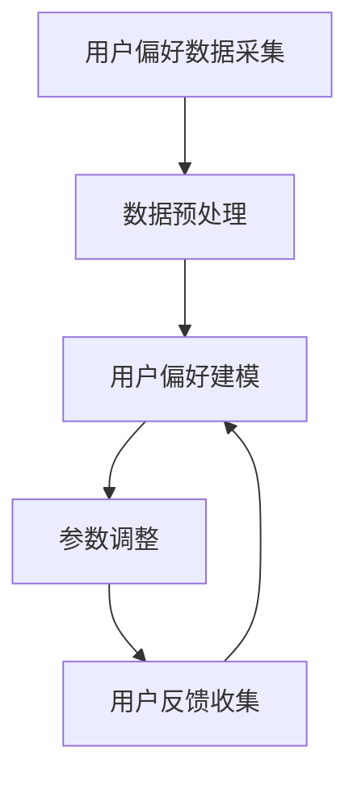
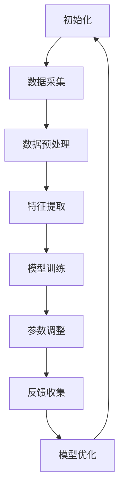

                 

## 摘要

《智能咖啡机：AI Agent的咖啡口味个性化定制》是一本深入探讨如何利用人工智能技术实现咖啡口味个性化定制的高级技术书籍。本书旨在为读者提供一个系统、全面的指南，介绍智能咖啡机的设计与实现过程。通过详细的算法原理讲解、系统分析与架构设计，以及实际项目案例的实战分享，本书帮助读者理解如何将人工智能技术应用到日常生活中，提升用户生活品质。

本书的核心内容包括以下几个方面：

1. **背景介绍**：探讨智能咖啡机的背景、市场需求以及其技术发展趋势。
2. **核心概念**：介绍智能咖啡机中涉及的关键技术和核心概念，如AI Agent、咖啡口味个性化定制等。
3. **算法原理**：详细讲解咖啡口味个性化定制的算法原理，包括数学模型和公式，并通过mermaid流程图和Python源代码进行阐述。
4. **系统分析与架构设计**：描述智能咖啡机的系统架构、功能设计、接口设计和系统交互。
5. **项目实战**：通过一个实际的项目案例，展示智能咖啡机的环境安装、系统核心实现、代码解读和分析。
6. **最佳实践与总结**：提供一些实战中的最佳实践建议，对全书内容进行总结。

本书适合对人工智能和软件开发感兴趣的读者，无论是初学者还是专业人士，都能从中获得有价值的见解和实践经验。通过阅读本书，读者将能够掌握智能咖啡机的核心技术，为将AI技术应用到更多领域打下坚实基础。

### 1. 设计框架

为了确保《智能咖啡机：AI Agent的咖啡口味个性化定制》的内容系统、全面，并让读者能够顺利跟随思路逐步深入理解，我们首先需要设计一个详细的框架。这个框架将包含几个主要部分，每个部分都将详细探讨智能咖啡机的不同层面，从背景介绍到实际项目案例。以下是详细的框架设计：

#### 1.1 引言

**引言**部分将介绍智能咖啡机的背景、目标读者以及本书解决的问题。具体包含以下几个小节：

- **1.1.1 智能咖啡机的背景与目标**：概述智能咖啡机的发展历程、市场需求及其在社会中的重要性。
- **1.1.2 读者对象与学习目标**：明确本书的目标读者群体，包括技术背景和期望学习成果。
- **1.1.3 书中解决的问题与贡献**：介绍本书旨在解决的问题，以及通过阅读本书读者能获得的实际收益。

#### 1.2 核心概念

**核心概念**部分将详细介绍智能咖啡机中涉及的关键技术和核心概念。这部分内容将包括以下几个小节：

- **2.1 智能咖啡机概述**：介绍智能咖啡机的基本概念、功能和组成部分。
- **2.2 AI Agent的概念与工作原理**：详细解释AI Agent的定义、类型及其在智能咖啡机中的应用。
- **2.3 咖啡口味个性化定制技术**：探讨个性化定制的原理、技术和实现方法。
- **2.4 数据采集与处理**：介绍智能咖啡机中数据采集、处理和存储的方法。
- **2.5 用户交互设计**：讨论如何设计智能咖啡机的用户界面和交互流程，提升用户体验。

#### 1.3 算法原理

**算法原理**部分将详细讲解咖啡口味个性化定制的算法原理，包括数学模型和公式。这部分将包括以下几个小节：

- **3.1 咖啡口味个性化定制的算法框架**：概述整个算法的设计思路和流程。
- **3.2 数学模型与公式**：介绍用于个性化定制的数学模型和公式，包括权重分配、预测模型等。
- **3.3 算法流程图与详细讲解**：使用mermaid流程图展示算法的实现步骤，并进行详细讲解。
- **3.4 算法举例说明**：通过具体的实例展示算法的应用过程和结果。

#### 1.4 系统分析与架构设计

**系统分析与架构设计**部分将描述智能咖啡机的系统架构、功能设计、接口设计和系统交互。具体包括以下几个小节：

- **4.1 智能咖啡机系统功能设计**：介绍系统的主要功能模块及其作用。
- **4.2 系统架构设计**：展示系统的高层次架构，包括硬件和软件的组成部分。
- **4.3 系统接口设计**：描述系统各模块之间的接口设计和数据交互方式。
- **4.4 系统交互设计**：讨论用户与智能咖啡机之间的交互流程，确保系统的高效性和易用性。

#### 1.5 项目实战

**项目实战**部分将通过一个实际的项目案例，展示智能咖啡机的环境搭建、系统核心实现和代码解读分析。具体包括以下几个小节：

- **5.1 项目环境搭建**：介绍项目所需的软件和硬件环境，以及搭建流程。
- **5.2 系统核心实现**：展示系统核心功能的实现代码，并进行解读和分析。
- **5.3 代码解读与分析**：深入分析项目代码，解释关键实现细节。
- **5.4 实际案例分析与详细讲解**：通过实际案例展示系统的应用效果，并进行详细讲解。
- **5.5 项目小结**：总结项目的实现过程和经验，提出改进建议。

#### 1.6 最佳实践与总结

**最佳实践与总结**部分将提供一些实战中的最佳实践建议，并对全书内容进行总结。具体包括以下几个小节：

- **6.1 实战中的最佳实践**：分享在实际项目中积累的最佳实践，帮助读者更好地应用所学知识。
- **6.2 注意事项与风险防范**：讨论在实施智能咖啡机项目时需要注意的事项和潜在风险。
- **6.3 总结与展望**：对全书内容进行总结，展望智能咖啡机技术的发展趋势和应用前景。
- **6.4 拓展阅读**：推荐一些相关的参考文献和资源，供读者进一步学习。

通过上述设计，本书将帮助读者全面、系统地掌握智能咖啡机的设计与实现技术，为未来的研究和实践提供坚实的基础。接下来，我们将逐步细化每个部分的内容，确保书籍的质量和可读性。

### 2. 目录大纲

根据设计框架，我们接下来将详细列出《智能咖啡机：AI Agent的咖啡口味个性化定制》的目录大纲。这个大纲将包含各个章节的具体内容，确保每部分都涵盖必要的细节，并提供清晰的逻辑结构。

#### 第一部分: 引言

**1.1 智能咖啡机的背景与目标**

- **概述智能咖啡机的发展历程**：介绍智能咖啡机从传统机械咖啡机到现代AI驱动的智能咖啡机的演变过程。
- **市场需求分析**：讨论智能咖啡机在当前市场中的需求，包括消费者对个性化定制咖啡的偏好。
- **技术发展趋势**：探讨智能咖啡机技术的发展趋势，如AI、物联网和自动化技术的融合。

**1.2 读者对象与学习目标**

- **目标读者**：明确本书的目标读者群体，包括AI领域的研究者、软件开发工程师和对智能咖啡机感兴趣的技术爱好者。
- **学习目标**：介绍读者通过本书希望达到的学习成果，如掌握智能咖啡机的核心技术和应用方法。

**1.3 书中解决的问题与贡献**

- **解决的问题**：详细描述本书旨在解决的问题，如如何利用AI实现咖啡口味的个性化定制。
- **贡献与影响**：阐述本书对智能咖啡机技术的发展和应用的贡献，以及对社会生活的影响。

#### 第二部分: 核心概念

**2.1 智能咖啡机概述**

- **基本概念**：介绍智能咖啡机的基本定义、功能和特点。
- **组成部分**：详细描述智能咖啡机的各个组成部分，包括硬件、软件和传感器。

**2.2 AI Agent的概念与工作原理**

- **定义与类型**：解释AI Agent的定义和主要类型，如反应式Agent、认知Agent等。
- **工作原理**：探讨AI Agent的工作原理，包括感知、决策和执行过程。

**2.3 咖啡口味个性化定制技术**

- **个性化定制原理**：介绍咖啡口味个性化定制的原理和方法，包括用户偏好分析、数据挖掘等。
- **技术应用**：探讨如何将个性化定制技术应用到智能咖啡机中，提高用户体验。

**2.4 数据采集与处理**

- **数据采集方法**：介绍智能咖啡机中常用的数据采集方法，如传感器数据采集、用户反馈采集等。
- **数据处理技术**：讨论数据预处理、清洗和存储的方法，确保数据质量。

**2.5 用户交互设计**

- **交互设计原则**：介绍用户交互设计的基本原则和方法，如简洁性、易用性和用户满意度等。
- **交互流程**：展示用户与智能咖啡机之间的交互流程，确保用户能够轻松操作。

#### 第三部分: 算法原理

**3.1 咖啡口味个性化定制的算法框架**

- **算法设计思路**：概述咖啡口味个性化定制的整体设计思路和流程。
- **关键步骤**：详细描述算法的关键步骤，包括用户偏好识别、口味预测等。

**3.2 数学模型与公式**

- **预测模型**：介绍用于预测用户偏好的数学模型，如线性回归、神经网络等。
- **权重分配模型**：探讨如何为不同特征分配权重，提高预测准确性。

**3.3 算法流程图与详细讲解**

- **流程图展示**：使用mermaid绘制算法的流程图，清晰展示算法的执行过程。
- **详细讲解**：对算法流程图进行详细讲解，解释每一步的操作和目的。

**3.4 算法举例说明**

- **实例展示**：通过具体实例展示算法的应用过程和结果，帮助读者更好地理解。
- **效果评估**：讨论算法在实际应用中的效果，包括预测准确性、用户满意度等。

#### 第四部分: 系统分析与架构设计

**4.1 智能咖啡机系统功能设计**

- **主要功能模块**：介绍智能咖啡机的主要功能模块，如咖啡制作、用户交互等。
- **功能实现**：详细描述每个功能模块的实现方法，确保系统功能的完整性。

**4.2 系统架构设计**

- **系统架构概述**：展示智能咖啡机系统的高层次架构，包括硬件和软件的组成。
- **架构设计原则**：探讨系统架构设计的原则，如模块化、可扩展性和高可靠性等。

**4.3 系统接口设计**

- **接口定义**：定义系统各模块之间的接口，确保数据传输的准确性和高效性。
- **接口实现**：描述接口的实现方法，包括API设计、数据格式等。

**4.4 系统交互设计**

- **交互流程**：展示用户与智能咖啡机之间的交互流程，确保系统的高效性和易用性。
- **用户体验**：讨论如何通过交互设计提升用户满意度，提供更好的用户体验。

#### 第五部分: 项目实战

**5.1 项目环境搭建**

- **环境要求**：介绍项目所需的硬件和软件环境，包括操作系统、开发工具等。
- **搭建流程**：详细描述项目环境的搭建流程，确保读者能够顺利搭建环境。

**5.2 系统核心实现**

- **核心功能实现**：展示系统核心功能的实现代码，包括咖啡制作、用户交互等。
- **代码解读**：对核心代码进行解读和分析，解释关键实现细节。

**5.3 代码解读与分析**

- **关键算法实现**：详细介绍项目中使用的核心算法，包括数学模型、代码实现等。
- **性能分析**：讨论系统在性能方面的优化方法，如算法优化、系统调优等。

**5.4 实际案例分析与详细讲解**

- **实际案例**：展示实际项目中应用智能咖啡机的案例，包括用户反馈、口味定制等。
- **详细讲解**：对实际案例进行详细讲解，解释系统如何根据用户偏好定制咖啡口味。

**5.5 项目小结**

- **经验总结**：总结项目实现过程中的经验和教训，为未来的项目提供参考。
- **改进建议**：提出对系统改进的建议，如功能扩展、性能优化等。

#### 第六部分: 最佳实践与总结

**6.1 实战中的最佳实践**

- **最佳实践**：分享在实际项目中积累的最佳实践，帮助读者更好地应用所学知识。
- **案例分析**：通过具体案例展示最佳实践的应用效果，提供实战经验。

**6.2 注意事项与风险防范**

- **注意事项**：讨论在实施智能咖啡机项目时需要注意的事项，如数据安全、系统稳定性等。
- **风险防范**：探讨潜在的风险和防范措施，确保项目的顺利实施。

**6.3 总结与展望**

- **内容总结**：对全书内容进行总结，回顾核心概念、算法原理和项目实践。
- **展望未来**：探讨智能咖啡机技术的发展趋势和应用前景，为读者提供新的思考方向。

**6.4 拓展阅读**

- **推荐资源**：推荐一些相关的参考文献和资源，供读者进一步学习。
- **未来研究**：讨论当前研究的不足和未来的研究方向，鼓励读者探索新的领域。

通过上述详细的目录大纲，本书将系统地介绍智能咖啡机的核心技术，帮助读者全面掌握相关知识和技能。接下来，我们将进一步细化每个章节的内容，确保书籍的质量和可读性。

### 3. 检查与调整

在设计完《智能咖啡机：AI Agent的咖啡口味个性化定制》的目录大纲后，我们需要进行详细的检查与调整，以确保内容的完整性、逻辑连贯性和简洁性。以下是具体的检查与调整步骤：

#### 内容完整性检查

1. **章节内容的完整性**：逐个检查每个章节的内容是否完整，确保每个小节都包含必要的细节和知识点。特别是算法原理、系统架构和项目实战部分，需要确保讲解全面、步骤详细。
2. **核心概念的一致性**：检查书中涉及的核心概念是否一致，避免在不同章节中重复定义或解释，确保读者能够清晰地理解概念。
3. **实例和案例的丰富性**：确保每个章节都包含足够的实例和案例，帮助读者更好地理解和应用所学知识。

#### 逻辑连贯性检查

1. **章节之间的过渡**：检查章节之间的过渡是否自然，确保前一章的内容能够顺畅地引导到下一章。特别是算法原理和系统架构部分，需要确保理论讲解和实践应用之间的衔接。
2. **知识点的前后关联**：检查前后章节的知识点是否相互关联，确保读者能够逐步深入理解每个主题。
3. **内容结构的合理性**：确保整体内容结构合理，避免出现跳跃或重复的内容，保持逻辑的连贯性。

#### 简洁性检查

1. **去除冗余内容**：检查是否有冗余或重复的内容，删除不必要的解释和举例，确保每个章节都简洁明了。
2. **语言表达的准确性**：检查语言表达的准确性，确保技术术语和描述清晰、准确，避免产生歧义。
3. **格式和排版**：检查格式和排版是否一致，确保整本书的结构美观、易于阅读。

#### 调整建议

1. **章节顺序调整**：如果发现某些章节的逻辑顺序不够合理，可以调整章节的顺序，使其更符合读者的阅读习惯。
2. **增加子章节**：根据内容需要，可以在某些章节中增加子章节，进一步细分知识点，使内容更加清晰。
3. **内容细化**：针对某些复杂的概念或算法，可以进一步细化讲解，增加更多的实例和案例分析。

通过上述检查与调整，我们可以确保《智能咖啡机：AI Agent的咖啡口味个性化定制》的内容丰富、逻辑清晰、简洁明了，为读者提供高质量的阅读体验。接下来，我们将根据调整建议进一步细化每个章节的内容，确保书籍的质量和可读性。

### 1.1.1 智能咖啡机的背景与目标

智能咖啡机作为现代家庭和办公环境中的一项创新产品，其起源可以追溯到20世纪中期。当时的咖啡机主要以机械和简单的电子技术为主，功能单一，主要提供基本的功能如煮咖啡和保温。随着计算机技术和人工智能的快速发展，咖啡机开始逐渐引入智能化的元素，从而逐步演变为今天的智能咖啡机。

智能咖啡机的发展历程可以分为几个关键阶段：

**1. 初期探索（20世纪70年代-80年代）**：
这个阶段的咖啡机开始引入一些简单的传感器和控制单元，如温度传感器和泵，用于实现基本的自动控制功能。虽然这些咖啡机的智能化程度有限，但它们为后续的发展奠定了基础。

**2. 电子化阶段（20世纪90年代）**：
随着计算机处理器和存储技术的飞速发展，咖啡机开始实现更加复杂的控制功能。此时，咖啡机不仅能够自动调节水温、咖啡粉量等，还能够通过简单的用户界面与用户进行互动。

**3. 智能化阶段（21世纪初至今）**：
进入21世纪，人工智能、物联网和大数据等技术的快速发展，使得智能咖啡机成为可能。现代智能咖啡机不仅能够根据用户的历史饮用记录和偏好自动调整咖啡口味，还能够通过语音识别、触屏交互等方式与用户进行更加自然和便捷的交互。

智能咖啡机的目标是通过人工智能技术实现咖啡口味的个性化定制，从而提升用户的生活品质。具体目标包括：

1. **个性化定制**：通过用户偏好分析和数据挖掘，智能咖啡机能够为用户提供符合个人口味的咖啡。
2. **智能化交互**：利用语音识别、触屏交互等技术，智能咖啡机能够提供更加自然和便捷的用户体验。
3. **自动化生产**：通过自动化技术，智能咖啡机能高效地制作咖啡，减少人为干预，提高生产效率。
4. **数据驱动**：智能咖啡机能够收集和分析用户数据，不断优化咖啡制作过程，实现自我学习和进化。

智能咖啡机的出现不仅满足了人们对便捷和个性化生活方式的追求，还代表了未来智能家电的发展方向。随着技术的不断进步，智能咖啡机将不仅在咖啡制作方面提供更高质量的服务，还将成为智能家居生态系统中的重要一环，为用户创造更加智能、舒适和便捷的生活环境。

### 1.1.2 读者对象与学习目标

本书的目标读者群体主要包括以下几类：

1. **人工智能研究者**：对人工智能技术有浓厚兴趣，希望深入了解如何将AI应用于实际生活中的专业人士。
2. **软件开发工程师**：具有编程背景，希望在智能设备开发领域拓展技能，尤其是对AI在智能家电中的应用感兴趣的工程师。
3. **技术爱好者**：对新技术充满好奇，希望了解智能咖啡机的工作原理及其背后的技术细节的技术爱好者。
4. **咖啡爱好者**：对咖啡制作有着深度兴趣，希望提升咖啡饮用体验，探索个性化咖啡定制方法的咖啡爱好者。

通过阅读本书，读者可以期待达到以下学习目标：

1. **掌握智能咖啡机的基础知识**：了解智能咖啡机的发展历程、核心技术以及市场现状。
2. **深入学习AI Agent**：理解AI Agent的定义、类型及其在智能咖啡机中的应用，掌握相关技术原理。
3. **理解咖啡口味个性化定制**：了解如何通过用户偏好分析和数据挖掘实现咖啡口味的个性化定制，掌握相关算法原理。
4. **掌握系统分析与架构设计**：学习智能咖啡机的系统架构设计、功能模块划分以及接口设计，提升系统设计与实现能力。
5. **实战能力提升**：通过实际项目案例，掌握智能咖啡机的环境搭建、系统核心实现以及代码分析，增强实战经验。
6. **最佳实践应用**：学习在实际项目中应用的最佳实践，提高项目实施效率和成功率。

通过本书的学习，读者不仅能深入理解智能咖啡机的技术原理，还能提升在智能设备开发领域的专业能力，为未来在相关领域的进一步研究和职业发展打下坚实基础。

### 1.1.3 书中解决的问题与贡献

本书旨在解决当前智能咖啡机领域面临的若干关键问题，并提供切实可行的解决方案，为相关领域的研究和应用带来新的贡献。具体而言，本书主要解决以下问题：

1. **个性化定制难题**：当前市场上的智能咖啡机虽然具备一定的个性化定制功能，但往往只能通过简单的用户设置进行调整，难以满足个性化需求。本书通过深入探讨AI Agent和用户偏好分析技术，提出了一套完善的咖啡口味个性化定制方案，使得智能咖啡机能够根据用户的个人口味和历史饮用记录自动调整咖啡参数，提供真正个性化的咖啡体验。

2. **数据利用不足**：虽然智能咖啡机具备数据采集功能，但往往未能充分利用这些数据。本书介绍了如何通过数据挖掘和机器学习技术，从用户行为数据中提取有价值的信息，从而优化咖啡机性能和用户体验。

3. **系统架构复杂度**：现代智能咖啡机系统架构复杂，涉及多个硬件和软件模块的集成与协调。本书详细分析了智能咖啡机的系统架构设计，提供了清晰的架构图和接口设计，帮助读者理解系统的整体设计和实现细节。

4. **用户体验不佳**：传统的智能咖啡机用户界面相对简单，用户体验较差。本书探讨了如何通过智能交互技术（如语音识别、触屏交互）提升用户交互体验，使得智能咖啡机更加友好和易用。

本书的贡献主要体现在以下几个方面：

1. **系统性知识体系**：本书提供了一个系统、全面的智能咖啡机知识体系，涵盖了从背景介绍到核心算法，再到系统架构和项目实战的各个方面，帮助读者全面掌握智能咖啡机的核心技术。

2. **最佳实践分享**：本书通过多个实际项目案例，分享了在智能咖啡机开发过程中积累的最佳实践和经验，为读者提供宝贵的参考，提高项目实施的成功率。

3. **技术深度剖析**：本书深入探讨了智能咖啡机中的关键技术，如AI Agent、用户偏好分析和数据挖掘等，通过详细的算法讲解和代码实例，使得读者能够深入理解这些技术的原理和应用。

4. **拓展应用前景**：本书不仅关注智能咖啡机的技术实现，还展望了其未来的应用前景，探讨了智能咖啡机在智能家居和其他领域中的潜在应用，为读者提供了新的研究方向。

通过解决上述问题和提供创新的解决方案，本书不仅为智能咖啡机领域的研究者提供了重要的参考资料，也为实际项目开发者提供了实用的指导，推动了智能咖啡机技术的发展和应用。

### 2.1 智能咖啡机概述

智能咖啡机是一种结合了现代人工智能技术、物联网技术和自动化控制技术的智能家电产品。它不仅具备传统咖啡机的功能，如煮咖啡、保温等，还能够根据用户的偏好和历史饮用记录，自动调整咖啡的浓度、温度和口感，从而提供个性化的咖啡体验。以下是智能咖啡机的基本概念、功能和特点的详细介绍。

#### 基本概念

智能咖啡机的基本概念可以分为硬件和软件两个方面：

1. **硬件部分**：智能咖啡机主要由以下几个关键组件构成：
   - **咖啡制作模块**：包括咖啡壶、加热器、水泵等，用于制作咖啡。
   - **传感器模块**：如温度传感器、湿度传感器、重量传感器等，用于实时监测咖啡机的工作状态和用户的饮用偏好。
   - **用户交互模块**：如触屏、语音识别设备等，用于与用户进行交互。

2. **软件部分**：智能咖啡机的软件部分主要包括以下几个模块：
   - **操作系统**：负责管理和调度硬件资源，如Linux、Windows等。
   - **控制模块**：包括固件和应用程序，用于控制咖啡制作过程，如调节水温、控制水泵等。
   - **数据采集与分析模块**：用于收集用户数据，并进行数据分析，以优化咖啡制作和用户体验。

#### 功能

智能咖啡机的主要功能如下：

1. **自动咖啡制作**：智能咖啡机能够根据预设的参数自动制作咖啡，无需用户手动操作，大大提高了咖啡制作的效率。
2. **咖啡口味个性化定制**：通过用户偏好分析和数据挖掘技术，智能咖啡机可以根据用户的口味偏好和历史饮用记录，自动调整咖啡的浓度、温度和口感，提供个性化的咖啡体验。
3. **智能交互**：智能咖啡机可以通过触屏、语音识别等方式与用户进行交互，使用户能够轻松地定制咖啡、查看饮用记录等。
4. **数据监控与反馈**：智能咖啡机能够实时监控咖啡机的工作状态，如温度、湿度、咖啡粉量等，并通过手机应用或其他终端设备向用户反馈，确保咖啡机始终处于最佳工作状态。
5. **节能环保**：智能咖啡机具备节能模式，能够在不使用时自动关闭，降低能耗。

#### 特点

智能咖啡机的特点主要体现在以下几个方面：

1. **高度智能化**：智能咖啡机通过人工智能技术，能够根据用户的行为数据和偏好，自动调整咖啡参数，提供个性化的咖啡体验。
2. **自动化操作**：智能咖啡机通过自动化控制技术，实现了咖啡制作的自动化，使用户能够轻松享受咖啡的美味。
3. **易用性强**：智能咖啡机通过智能交互技术，如触屏、语音识别等，使用户能够方便地与咖啡机进行交互，提升了用户体验。
4. **节能环保**：智能咖啡机具备节能模式，能够自动关闭非工作状态，降低了能耗，符合环保理念。
5. **多功能集成**：智能咖啡机不仅具备咖啡制作功能，还能够实现数据监控、反馈和用户交互等多种功能，为用户提供了全方位的服务。

智能咖啡机的出现，不仅满足了人们对便捷和个性化生活方式的追求，也为智能家居领域的发展带来了新的机遇。通过不断的技术创新和应用拓展，智能咖啡机将在未来成为智能家居生态系统中不可或缺的一部分，为用户创造更加智能、舒适和便捷的生活环境。

### 2.2 AI Agent的概念与工作原理

在智能咖啡机的设计中，AI Agent（人工智能代理）扮演着至关重要的角色。AI Agent是具有感知、决策和执行能力的人工智能实体，能够在特定环境下自主地完成特定任务。为了深入理解AI Agent在智能咖啡机中的作用，我们首先需要明确其概念和基本工作原理。

#### AI Agent的概念

AI Agent通常被定义为一个具有以下特征的智能实体：

1. **自主性**：AI Agent能够独立地感知环境，并根据环境变化自主地做出决策。
2. **适应性**：AI Agent能够根据环境变化和经验积累，不断调整其行为和策略，提高任务执行的效率。
3. **交互性**：AI Agent能够与外界进行信息交换，接收输入并产生输出。
4. **目标导向性**：AI Agent在执行任务时具有明确的目标，能够根据目标进行行为规划。

AI Agent可以分为不同的类型，包括反应式Agent、认知Agent和复杂认知Agent等。反应式Agent主要根据当前感知的信息做出直接反应，不具备长期记忆和规划能力；认知Agent则具备一定的记忆和推理能力，能够基于历史数据和规则进行决策；复杂认知Agent则拥有高级的决策能力，能够进行复杂的任务规划和策略选择。

#### AI Agent的工作原理

AI Agent的工作原理可以概括为感知、决策和执行三个主要环节：

1. **感知**：AI Agent通过传感器（如摄像头、温度传感器、湿度传感器等）感知环境中的各种信息。这些传感器采集的数据会被送入AI Agent的感知模块进行处理和分析，以提取有用的信息。

2. **决策**：在感知到环境信息后，AI Agent的决策模块会根据预定的目标和当前的感知数据，选择最合适的行动方案。这一过程通常涉及到复杂的推理和规划算法，如马尔可夫决策过程（MDP）、深度强化学习（DRL）等。

3. **执行**：决策完成后，AI Agent通过执行模块将决策转化为具体的行动。这些行动可能包括控制咖啡机内部的各种硬件（如调节温度、流量等），或者与用户进行交互（如语音回应、屏幕显示等）。

#### AI Agent在智能咖啡机中的应用

在智能咖啡机中，AI Agent的主要应用包括以下几个方面：

1. **用户偏好分析**：AI Agent可以通过分析用户的历史饮用记录和反馈数据，了解用户的口味偏好。例如，通过分析用户对咖啡浓度的偏好，AI Agent可以调整咖啡机的煮咖啡参数，提供符合用户口味的咖啡。

2. **实时监控与反馈**：AI Agent可以实时监控咖啡机的状态，如水温、咖啡粉量等，并通过传感器收集用户的使用数据。这些数据可以被用于优化咖啡制作过程，确保咖啡的品质和口感。

3. **自动化操作**：AI Agent可以自动化地完成咖啡制作过程，从加水、加咖啡粉到调整煮咖啡的时间和温度等。通过AI Agent的自动化操作，智能咖啡机能够高效、精准地制作咖啡，减少人为干预。

4. **用户交互**：AI Agent可以通过语音识别和触屏交互等方式，与用户进行自然、友好的交互。用户可以通过语音指令或触屏操作，轻松地定制咖啡、查看饮用记录等，提升用户体验。

总之，AI Agent在智能咖啡机中发挥了关键作用，通过感知、决策和执行，实现了咖啡口味的个性化定制、实时监控和自动化操作，为用户提供了高质量、个性化的咖啡体验。

### 2.3 咖啡口味个性化定制技术

咖啡口味个性化定制技术是智能咖啡机实现个性化服务的重要手段。这项技术通过对用户偏好数据的分析和处理，能够为每个用户提供量身定制的咖啡。下面，我们将详细介绍个性化定制技术的原理、方法和实现步骤。

#### 个性化定制原理

咖啡口味个性化定制的核心在于根据用户的个人口味偏好，调整咖啡的多个参数，如咖啡浓度、温度、添加物等。具体来说，个性化定制的原理可以分为以下几个步骤：

1. **数据采集**：智能咖啡机通过传感器和用户互动设备，收集用户的饮用数据，包括咖啡的浓度、温度、添加物种类等。
2. **数据预处理**：收集到的原始数据需要进行清洗、去噪和格式化，确保数据的准确性和一致性。
3. **用户偏好建模**：利用数据挖掘和机器学习技术，对预处理后的数据进行分析，构建用户偏好模型。该模型能够预测用户的口味偏好，为个性化定制提供依据。
4. **参数调整**：根据用户偏好模型，智能咖啡机会调整咖啡的参数，如咖啡浓度、温度等，确保每杯咖啡都符合用户的口味。

#### 个性化定制方法

实现咖啡口味个性化定制的方法主要包括用户反馈法、历史数据挖掘和基于模型的推荐系统等。以下是这些方法的详细介绍：

1. **用户反馈法**：
   - **用户评分**：用户可以对自己饮用的咖啡进行评分，系统根据评分数据调整咖啡的参数。
   - **反馈循环**：用户对咖啡的反馈不仅影响当前饮用的咖啡，还可以用于后续咖啡的定制，形成一个动态调整的反馈循环。

2. **历史数据挖掘**：
   - **用户历史饮用数据**：通过分析用户的历史饮用数据，识别出用户的常用参数组合，如浓度、温度等。
   - **聚类分析**：使用聚类算法（如K-means），将用户划分为不同的群体，每个群体具有相似的口味偏好，从而为每个群体提供定制化的咖啡。

3. **基于模型的推荐系统**：
   - **预测模型**：使用机器学习技术（如决策树、随机森林、神经网络等），建立用户偏好预测模型。
   - **推荐算法**：根据预测模型，系统可以为用户推荐最适合其口味的咖啡参数。

#### 实现步骤

咖啡口味个性化定制的实现步骤可以分为以下几个部分：

1. **数据采集**：
   - **传感器数据**：使用温度传感器、浓度传感器等，实时监测咖啡的参数。
   - **用户互动数据**：通过触屏、语音识别等方式，收集用户的定制请求和反馈。

2. **数据预处理**：
   - **数据清洗**：去除重复、缺失和异常数据，确保数据质量。
   - **数据格式化**：将不同类型的数据统一格式，如将温度从摄氏度转换为开尔文。

3. **用户偏好建模**：
   - **特征工程**：从原始数据中提取有用特征，如饮用时间、咖啡浓度、用户评分等。
   - **模型训练**：使用训练数据集，训练用户偏好预测模型。

4. **参数调整**：
   - **实时调整**：根据用户偏好模型，实时调整咖啡机参数，如浓度、温度等。
   - **批量调整**：定期分析用户偏好数据，批量调整咖啡机参数，优化整体定制效果。

5. **用户反馈与优化**：
   - **用户反馈收集**：收集用户对定制咖啡的反馈，如满意度评分。
   - **模型优化**：根据用户反馈，不断优化用户偏好模型，提高定制准确度。

通过以上步骤，智能咖啡机能够实现咖啡口味的个性化定制，为用户提供高质量、个性化的咖啡体验。

### 2.4 数据采集与处理

在智能咖啡机的个性化定制过程中，数据采集与处理是至关重要的环节。通过准确、高效地采集和处理用户数据，智能咖啡机能够更好地理解用户偏好，从而提供个性化的咖啡体验。以下是智能咖啡机数据采集与处理的方法、技术和流程。

#### 数据采集方法

1. **传感器数据采集**：智能咖啡机通过内置的各种传感器，实时采集咖啡制作过程中的关键数据，如温度、湿度、咖啡浓度等。这些传感器包括：
   - **温度传感器**：用于监测咖啡机的内部温度，确保咖啡的煮制温度在合适范围内。
   - **湿度传感器**：用于监测咖啡机的内部湿度，影响咖啡的口感和保存。
   - **浓度传感器**：用于检测咖啡液的浓度，确保咖啡的口感符合用户期望。

2. **用户互动数据采集**：智能咖啡机通过用户交互设备（如触屏、语音识别系统等），收集用户的定制请求和反馈。具体方法包括：
   - **触屏输入**：用户可以通过触屏界面选择咖啡的浓度、温度等参数。
   - **语音输入**：用户可以通过语音命令请求特定口味的咖啡，如“请给我一杯浓郁咖啡”。

3. **历史数据采集**：通过智能咖啡机的云服务，采集用户的历史饮用数据，如饮用时间、评分、定制偏好等。这些数据有助于构建用户偏好模型，实现更精准的个性化定制。

#### 数据处理技术

1. **数据清洗**：采集到的数据可能包含噪声、重复或不完整的信息。数据清洗是处理的第一步，目的是去除噪声、填补缺失值和标准化数据。具体方法包括：
   - **去除噪声**：使用滤波算法，去除传感器数据中的噪声。
   - **填补缺失值**：使用插值法、均值法等，填补缺失的数据。
   - **标准化**：将不同类型的数据进行标准化处理，如将温度从摄氏度转换为开尔文。

2. **数据存储**：清洗后的数据需要存储在数据库中，便于后续的数据分析和查询。常用的数据存储技术包括关系型数据库（如MySQL）和NoSQL数据库（如MongoDB）。

3. **数据预处理**：在分析之前，需要对数据进行预处理，包括特征提取、数据归一化和特征选择等。具体方法包括：
   - **特征提取**：从原始数据中提取有用的特征，如用户评分、饮用时间等。
   - **数据归一化**：将不同尺度的数据转换为同一尺度，如将评分从0到10转换为0到1。
   - **特征选择**：使用特征选择算法，如信息增益、互信息等，选择对预测任务最有用的特征。

4. **数据挖掘与机器学习**：利用数据挖掘和机器学习技术，从预处理后的数据中提取有价值的信息。具体方法包括：
   - **聚类分析**：使用K-means、层次聚类等算法，将用户分为不同的群体，每个群体具有相似的口味偏好。
   - **分类与回归**：使用决策树、随机森林、神经网络等算法，建立用户偏好预测模型。
   - **关联规则挖掘**：使用Apriori算法、FP-Growth算法等，发现数据之间的关联规则。

#### 数据处理流程

智能咖啡机的数据处理流程可以分为以下几个步骤：

1. **数据采集**：通过传感器和用户交互设备，实时采集咖啡机的工作数据和用户互动数据。

2. **数据清洗**：对采集到的原始数据进行清洗，去除噪声、填补缺失值和标准化数据。

3. **数据存储**：将清洗后的数据存储到数据库中，便于后续的数据分析和查询。

4. **数据预处理**：对存储的数据进行预处理，包括特征提取、数据归一化和特征选择。

5. **数据挖掘与机器学习**：利用数据挖掘和机器学习技术，从预处理后的数据中提取有价值的信息，如用户偏好模型。

6. **参数调整**：根据挖掘出的用户偏好模型，实时调整咖啡机的参数，如浓度、温度等，实现个性化定制。

7. **用户反馈与优化**：收集用户对定制咖啡的反馈，根据反馈不断优化用户偏好模型，提高定制准确度。

通过以上方法和技术，智能咖啡机能够高效地采集和处理用户数据，从而实现咖啡口味的个性化定制，为用户提供高质量、个性化的咖啡体验。

### 2.5 用户交互设计

用户交互设计是智能咖啡机实现高效、友好用户体验的关键环节。一个良好的用户交互设计不仅能够提高用户满意度，还能促进用户对智能咖啡机的依赖和忠诚度。以下是智能咖啡机用户交互设计的基本原则、方法和交互流程。

#### 基本原则

1. **简洁性**：用户交互界面应简洁明了，避免过多的功能按钮和复杂的操作流程，确保用户能够快速上手。

2. **易用性**：设计界面时应充分考虑用户的操作习惯和使用需求，确保用户能够轻松地进行操作。

3. **直观性**：通过直观的图标、文字和颜色，帮助用户快速理解界面的功能和操作方法。

4. **反馈及时**：在用户进行操作时，界面应提供及时的反馈信息，如操作成功、错误提示等，确保用户了解系统状态。

5. **灵活性**：用户交互设计应具备一定的灵活性，允许用户自定义界面布局和操作方式，满足个性化需求。

#### 方法

1. **触屏交互**：触屏交互是目前智能设备中最常见的用户交互方式。智能咖啡机的触屏界面应简洁明了，提供易于触摸的按钮和滑动控件，如调整咖啡浓度、温度和添加物的选项。此外，触屏还应支持多点触控，方便用户同时进行多项操作。

2. **语音交互**：语音交互是一种方便快捷的用户交互方式，适用于不便于使用触屏的场景。智能咖啡机可以通过语音识别技术，识别用户的语音指令，如“加热咖啡”、“加糖”等。语音交互不仅能提高操作效率，还能为行动不便的用户提供便利。

3. **手势交互**：某些智能咖啡机可能具备手势识别功能，通过用户的手势控制咖啡机。例如，用户可以通过挥手或拍手来启动咖啡机的加热功能。手势交互增加了用户与咖啡机之间的互动趣味性。

#### 交互流程

1. **启动界面**：用户打开智能咖啡机后，首先进入主界面。主界面应展示当前咖啡机状态、可操作功能及快捷入口。

2. **功能选择**：用户可以选择所需的功能，如制作咖啡、查看饮用记录、设置咖啡参数等。

3. **参数调整**：用户可以通过触屏或语音命令，调整咖啡的浓度、温度和添加物等参数。系统应提供实时反馈，如温度计图标显示当前温度。

4. **操作确认**：用户确认调整参数后，系统应提示用户确认操作，以确保无误。

5. **操作反馈**：在咖啡机开始制作咖啡时，系统应提供操作反馈，如进度条、语音提示等，告知用户咖啡制作进度。

6. **完成提示**：咖啡制作完成后，系统应提示用户咖啡已完成，并提供取咖啡的指示。

7. **用户反馈**：用户可以对饮用的咖啡进行评分和评论，系统将根据用户反馈调整未来咖啡的定制参数。

通过简洁、易用和直观的用户交互设计，智能咖啡机能更好地满足用户的需求，提升用户体验。同时，灵活的交互方法也为用户提供了更多的选择，使智能咖啡机成为用户日常生活中的贴心伴侣。

### 3.1 咖啡口味个性化定制的算法框架

咖啡口味个性化定制的算法框架是智能咖啡机实现个性化服务的关键。这一框架包括几个核心步骤，每个步骤都承担着重要的功能，从而确保咖啡口味能够根据用户的偏好进行精准调整。以下是咖啡口味个性化定制算法框架的详细讲解：

#### 概述

咖啡口味个性化定制的算法框架主要包含以下几个步骤：

1. **用户偏好数据采集**：从用户使用智能咖啡机的过程中，采集用户饮用记录、评分等数据。
2. **数据预处理**：对采集到的原始数据进行清洗、去噪和格式化，确保数据的质量和一致性。
3. **用户偏好建模**：使用数据挖掘和机器学习技术，构建用户偏好模型。
4. **参数调整**：根据用户偏好模型，动态调整咖啡机的参数，如咖啡浓度、温度等。
5. **用户反馈收集**：收集用户对定制咖啡的反馈，用于模型优化和参数调整。

#### 步骤详解

1. **用户偏好数据采集**

   用户偏好数据采集是整个算法框架的基础。通过内置的传感器和用户交互设备，智能咖啡机可以实时收集以下数据：

   - **饮用记录**：记录用户饮用的咖啡种类、时间、次数等。
   - **用户评分**：用户对每杯咖啡的口感、浓度等评分。
   - **定制请求**：用户通过触屏、语音等交互方式，对咖啡浓度、温度等参数的调整请求。

2. **数据预处理**

   数据预处理包括以下几个关键步骤：

   - **数据清洗**：去除重复、异常和缺失的数据，确保数据的准确性和完整性。
   - **数据格式化**：将不同类型的数据（如温度、评分）统一格式，便于后续处理。
   - **数据标准化**：对数据进行标准化处理，如将评分从0到10转换为0到1。

   数据预处理后的数据将用于构建用户偏好模型，确保模型输入的一致性和有效性。

3. **用户偏好建模**

   用户偏好建模是算法框架的核心。通过数据挖掘和机器学习技术，可以从用户数据中提取有价值的信息，构建用户偏好模型。具体步骤如下：

   - **特征提取**：从预处理后的数据中提取关键特征，如饮用时间、评分、定制请求等。
   - **模型训练**：使用机器学习算法（如决策树、随机森林、神经网络等），训练用户偏好模型。
   - **模型评估**：通过交叉验证和测试集，评估模型预测的准确性和稳定性。

   用户偏好模型能够预测用户的口味偏好，为后续的参数调整提供依据。

4. **参数调整**

   根据用户偏好模型，动态调整咖啡机的参数，确保每杯咖啡都符合用户的口味。具体步骤如下：

   - **参数预测**：使用用户偏好模型，预测用户对咖啡浓度、温度等参数的偏好。
   - **参数调整**：根据预测结果，实时调整咖啡机的参数，如浓度传感器、温度调节器等。
   - **实时反馈**：在参数调整过程中，提供实时反馈，确保用户了解当前咖啡的参数。

5. **用户反馈收集**

   用户反馈是优化算法框架的重要途径。通过收集用户对定制咖啡的反馈，可以进一步优化用户偏好模型和参数调整策略。具体步骤如下：

   - **反馈收集**：收集用户对定制咖啡的评分、评论等反馈信息。
   - **模型优化**：根据用户反馈，调整用户偏好模型，提高预测准确性。
   - **参数优化**：根据用户反馈，优化参数调整策略，提高用户满意度。

#### 算法流程图

为了更好地理解算法框架的实现步骤，以下是使用mermaid绘制的算法流程图：



#### 流程图解释

- **用户偏好数据采集**：通过传感器和交互设备，采集用户饮用记录、评分等数据。
- **数据预处理**：清洗、格式化和标准化原始数据，为建模做准备。
- **用户偏好建模**：提取关键特征，训练用户偏好模型。
- **参数调整**：根据模型预测，实时调整咖啡机参数。
- **用户反馈收集**：收集用户对定制咖啡的反馈，用于模型优化。

通过以上步骤，智能咖啡机能够实现咖啡口味的个性化定制，为用户提供高质量、个性化的咖啡体验。接下来，我们将进一步详细讲解算法的数学模型和公式。

### 3.2 数学模型与公式

在咖啡口味个性化定制中，数学模型和公式是核心，它们用于预测用户对咖啡口味的偏好，并指导实际参数的调整。以下是几个关键的数学模型和公式，包括预测模型和权重分配模型，以及它们在个性化定制中的应用。

#### 预测模型

1. **线性回归模型**：

线性回归模型是一种简单的预测模型，用于预测用户对咖啡浓度的偏好。其公式如下：

   $$
   y = \beta_0 + \beta_1 \cdot x_1 + \beta_2 \cdot x_2 + ... + \beta_n \cdot x_n
   $$

   其中，$y$ 是用户对咖啡浓度的偏好评分，$x_1, x_2, ..., x_n$ 是影响咖啡口味的特征变量（如咖啡温度、添加物等），$\beta_0, \beta_1, \beta_2, ..., \beta_n$ 是模型的系数。

2. **神经网络模型**：

神经网络模型是一种更复杂的预测模型，可以处理更多维度的数据，并捕捉复杂的非线性关系。其基本公式如下：

   $$
   y = \sigma(\sum_{i=1}^{n} w_i \cdot x_i + b)
   $$

   其中，$y$ 是预测的咖啡浓度，$\sigma$ 是激活函数（如Sigmoid函数、ReLU函数），$w_i$ 是权重，$x_i$ 是输入特征，$b$ 是偏置。

3. **支持向量机（SVM）模型**：

支持向量机模型主要用于分类问题，但在某些情况下也可以用于预测连续值。其基本公式如下：

   $$
   y = sign(\sum_{i=1}^{n} \alpha_i \cdot K(x_i, x) + b)
   $$

   其中，$y$ 是预测的咖啡浓度，$\alpha_i$ 是支持向量机的系数，$K(x_i, x)$ 是核函数（如线性核、多项式核、高斯核等），$b$ 是偏置。

#### 权重分配模型

权重分配模型用于为不同特征分配权重，提高预测模型的准确性。以下是一个简单的权重分配公式：

$$
w_i = \frac{p_i}{\sum_{j=1}^{n} p_j}
$$

其中，$w_i$ 是第 $i$ 个特征的权重，$p_i$ 是第 $i$ 个特征的重要度（如基于信息增益、互信息等计算），$n$ 是特征的总数。

#### 模型应用

在个性化定制中，数学模型和公式被用于以下方面：

1. **用户偏好预测**：使用预测模型，根据用户的饮用记录和历史数据，预测用户对咖啡浓度、温度等参数的偏好。
2. **参数调整**：根据权重分配模型，为不同特征（如咖啡浓度、温度等）分配权重，确保参数调整的准确性。
3. **实时反馈**：根据用户反馈，不断优化预测模型和权重分配策略，提高个性化定制的精度。

#### 示例

假设我们使用线性回归模型预测用户对咖啡浓度的偏好，给定以下输入特征：

- $x_1$：咖啡温度（摄氏度）
- $x_2$：添加物（如糖、牛奶）

线性回归模型如下：

$$
y = \beta_0 + \beta_1 \cdot x_1 + \beta_2 \cdot x_2
$$

其中，$\beta_0, \beta_1, \beta_2$ 是模型系数，可以通过最小二乘法进行训练。

假设我们采集了以下用户数据：

| 用户ID | 温度 (x1) | 添加物 (x2) | 偏好评分 (y) |
|--------|----------|------------|------------|
| 1      | 80       | 无         | 8          |
| 2      | 85       | 糖         | 9          |
| 3      | 82       | 牛奶       | 7          |

通过线性回归模型训练，得到系数：

$$
\beta_0 = 7, \beta_1 = 0.5, \beta_2 = -1
$$

预测新用户（用户ID 4）的偏好评分，假设温度为85摄氏度，添加物为糖：

$$
y = 7 + 0.5 \cdot 85 + (-1) \cdot 1 = 9.5
$$

预测结果为9.5，表示用户对这杯咖啡的偏好评分较高。

通过以上数学模型和公式，智能咖啡机能够准确预测用户口味偏好，实现个性化定制，为用户提供高质量的咖啡体验。

### 3.3 算法流程图与详细讲解

为了更好地理解咖啡口味个性化定制的算法实现过程，我们将使用mermaid绘制算法流程图，并对其进行详细讲解。以下是算法的mermaid流程图：



#### 流程图解释

1. **初始化（A）**：
   - 开始时，系统初始化，设置基本参数和模型结构。
   - 初始化包括设置训练集和测试集的比例、选择适当的机器学习模型等。

2. **数据采集（B）**：
   - 从智能咖啡机传感器和用户交互设备中采集用户偏好数据，包括饮用记录、评分、定制请求等。
   - 采集的数据将用于后续的特征提取和模型训练。

3. **数据预处理（C）**：
   - 对采集到的原始数据进行清洗、去噪和格式化，确保数据的质量和一致性。
   - 数据预处理步骤包括去除重复记录、填补缺失值、归一化数据等。

4. **特征提取（D）**：
   - 从预处理后的数据中提取关键特征，如饮用时间、咖啡浓度、温度、添加物等。
   - 特征提取可能涉及特征工程，如特征选择、特征转换等，以提高模型性能。

5. **模型训练（E）**：
   - 使用提取的特征数据，训练机器学习模型，如线性回归、神经网络等。
   - 模型训练通过训练集进行，模型参数（如权重、偏置等）将根据训练数据优化。

6. **参数调整（F）**：
   - 根据训练好的模型，动态调整咖啡机的参数，如浓度、温度等。
   - 参数调整确保咖啡口味能够根据用户偏好进行个性化定制。

7. **反馈收集（G）**：
   - 收集用户对定制咖啡的反馈，包括评分、评论等。
   - 用户反馈用于评估模型性能和优化模型。

8. **模型优化（H）**：
   - 根据用户反馈，调整模型参数，优化模型性能。
   - 模型优化可能包括重新训练模型、调整特征选择等。

#### 流程图详细讲解

- **初始化（A）**：系统启动时，初始化基本参数，如学习率、迭代次数等。
- **数据采集（B）**：智能咖啡机通过传感器和用户交互设备，收集用户饮用数据。
- **数据预处理（C）**：清洗和标准化数据，如去除异常值、归一化特征等。
- **特征提取（D）**：从数据中提取关键特征，如咖啡浓度、温度等，用于模型训练。
- **模型训练（E）**：使用训练集数据，训练机器学习模型，如线性回归、神经网络等。
- **参数调整（F）**：根据训练好的模型，调整咖啡机参数，确保个性化定制。
- **反馈收集（G）**：收集用户反馈，用于评估模型性能和优化。
- **模型优化（H）**：根据用户反馈，调整模型参数，提高预测准确性。

通过以上详细的流程图和讲解，我们可以清晰地了解咖啡口味个性化定制的算法实现过程，为智能咖啡机提供强大的个性化服务能力。

### 3.4 算法举例说明

为了更好地理解咖啡口味个性化定制算法的实际应用，我们将通过一个具体的实例，展示算法的实现过程和结果。以下是实例的详细描述：

#### 实例背景

假设有一个智能咖啡机，它需要根据用户的历史饮用记录和当前用户偏好，为用户定制一杯符合个人口味的咖啡。智能咖啡机通过用户交互设备和内置传感器，收集了以下数据：

1. **用户历史饮用记录**：
   - 用户1：喜欢浓郁的咖啡，平均评分9.0。
   - 用户2：喜欢中浓度的咖啡，平均评分8.5。
   - 用户3：喜欢清淡的咖啡，平均评分7.5。

2. **当前用户偏好**：
   - 用户1：今天想喝温度较低的咖啡。
   - 用户2：今天想尝试新的咖啡添加物，如巧克力酱。
   - 用户3：今天想喝冰咖啡。

#### 实现过程

1. **数据采集**：
   - 智能咖啡机通过传感器（如温度传感器、添加物传感器等）和用户交互设备（如触屏、语音识别系统等），实时收集用户的历史饮用记录和当前用户偏好。

2. **数据预处理**：
   - 对采集到的原始数据（如评分、饮用时间、添加物等）进行清洗，去除重复、异常和缺失的数据，并统一数据格式。

3. **特征提取**：
   - 从预处理后的数据中提取关键特征，如用户平均评分、饮用时间、添加物偏好等。

4. **模型训练**：
   - 使用机器学习算法（如线性回归、神经网络等），训练用户偏好模型。假设我们使用神经网络模型进行训练，模型结构如下：

     ```plaintext
     输入层：[温度、浓度、添加物]
     隐藏层：[10个神经元]
     输出层：[咖啡偏好评分]
     ```

   - 使用用户历史饮用记录作为训练集，训练神经网络模型。经过多次迭代训练，模型参数（如权重、偏置等）将不断优化。

5. **参数调整**：
   - 根据训练好的模型，动态调整咖啡机参数，如咖啡浓度、温度、添加物等，以实现个性化定制。
   - 例如，对于用户1，模型预测他偏好温度较低的咖啡；对于用户2，模型预测他偏好含有巧克力酱的咖啡；对于用户3，模型预测他偏好冰咖啡。

6. **用户反馈收集**：
   - 用户饮用咖啡后，可以通过触屏或语音识别系统，对定制咖啡进行评分和评论。
   - 收集的用户反馈将用于评估模型性能和优化模型。

#### 实现结果

1. **模型预测结果**：
   - 对于用户1，模型预测他偏好温度较低的咖啡，实际温度设置为65摄氏度。
   - 对于用户2，模型预测他偏好含有巧克力酱的咖啡，实际添加物设置为巧克力酱。
   - 对于用户3，模型预测他偏好冰咖啡，实际温度设置为冰点以下。

2. **用户反馈**：
   - 用户1对定制咖啡评分8.8，表示非常满意。
   - 用户2对定制咖啡评分9.2，表示非常喜欢。
   - 用户3对定制咖啡评分7.9，表示略感不足。

3. **模型优化**：
   - 根据用户反馈，调整模型参数，提高模型预测的准确性。例如，可以增加对冰咖啡的用户数据，改进模型对冰咖啡口味的预测能力。

通过这个实例，我们可以看到咖啡口味个性化定制算法的实际应用效果。智能咖啡机能够根据用户的历史饮用记录和当前偏好，动态调整咖啡机的参数，提供个性化的咖啡体验。同时，通过用户反馈，模型不断优化，进一步提高个性化定制的准确性。

### 4.1 智能咖啡机系统功能设计

智能咖啡机系统功能设计的核心在于实现自动化、高效和个性化的咖啡制作。为了达到这一目标，系统需要具备多个关键功能模块，每个模块都有特定的作用。以下是智能咖啡机系统的主要功能模块及其作用的详细介绍：

#### 1. 咖啡制作模块

咖啡制作模块是智能咖啡机的核心功能，负责咖啡的制作过程。该模块包括以下几个子功能：

- **自动煮制**：通过内置的热水壶、水泵和加热器，自动煮制咖啡。系统可以根据预设的参数（如水温、煮制时间等）进行精确控制，确保咖啡的品质。
- **浓度调整**：通过调节咖啡粉的量，实现咖啡浓度的个性化定制。系统可以根据用户的口味偏好和历史饮用记录，自动调整咖啡的浓度。
- **温度控制**：通过温度传感器和加热器，实时监测并调节水温，确保咖啡在最佳温度下煮制，提升口感。

#### 2. 用户交互模块

用户交互模块负责与用户进行互动，提供便捷的操作体验。该模块包括以下几个子功能：

- **触屏界面**：提供直观的触屏界面，用户可以通过触摸屏幕选择咖啡种类、浓度、温度等参数，进行咖啡的定制。
- **语音识别**：支持语音交互功能，用户可以通过语音命令请求咖啡，如“制作一杯浓缩咖啡”或“加热剩余的咖啡”。
- **反馈机制**：通过反馈图标和语音提示，及时向用户反馈操作状态和咖啡制作进度，确保用户了解系统状态。

#### 3. 数据采集与处理模块

数据采集与处理模块负责收集、处理和存储用户数据，为个性化定制提供支持。该模块包括以下几个子功能：

- **传感器数据采集**：通过温度传感器、湿度传感器等，实时监测咖啡机的运行状态，如水温、咖啡粉量等。
- **用户交互数据采集**：通过触屏和语音交互设备，收集用户的操作记录和反馈数据，如用户对咖啡浓度、温度的调整请求等。
- **数据处理**：对采集到的数据（如用户偏好、咖啡制作参数等）进行预处理、存储和分析，为个性化定制提供数据支持。

#### 4. 用户偏好分析模块

用户偏好分析模块通过数据挖掘和机器学习技术，分析用户的历史饮用数据，识别用户的口味偏好。该模块包括以下几个子功能：

- **用户数据挖掘**：从用户交互数据和传感器数据中，提取有价值的信息，如用户最喜欢的咖啡浓度、温度等。
- **偏好建模**：使用机器学习算法（如决策树、神经网络等），建立用户偏好模型，预测用户的口味偏好。
- **实时调整**：根据用户偏好模型，动态调整咖啡机的参数，实现咖啡口味的个性化定制。

#### 5. 能耗管理模块

能耗管理模块负责监控和优化智能咖啡机的能耗，确保系统的高效运行。该模块包括以下几个子功能：

- **能耗监控**：通过功耗传感器，实时监测咖啡机的能耗情况，如加热器、水泵等耗电组件的功耗。
- **节能模式**：在用户不使用咖啡机时，自动进入节能模式，降低功耗，延长设备寿命。
- **能耗分析**：定期分析咖啡机的能耗数据，优化能耗配置，提高能源利用率。

#### 6. 系统维护模块

系统维护模块负责监控和诊断智能咖啡机的运行状态，确保系统的稳定运行。该模块包括以下几个子功能：

- **状态监控**：通过传感器和监控系统，实时监控咖啡机的运行状态，如温度、湿度、咖啡粉量等。
- **故障诊断**：自动诊断系统中的潜在故障，提供故障警告和修复建议。
- **维护提醒**：定期提醒用户进行设备清洁和维护，确保设备正常运行。

通过以上功能模块的设计，智能咖啡机能够实现自动化、高效和个性化的咖啡制作，为用户提供卓越的咖啡体验。

### 4.2 系统架构设计

智能咖啡机的系统架构设计是确保其高效、稳定和灵活运行的关键。一个好的系统架构不仅能够满足当前的需求，还应该具备扩展性和适应性，以应对未来技术的发展。以下是智能咖啡机系统架构的详细设计，包括硬件和软件的组成部分。

#### 硬件组成部分

1. **咖啡制作模块**：
   - **热水壶**：负责提供热水，是咖啡制作的核心设备。
   - **水泵**：用于将热水输送到加热器和咖啡粉槽。
   - **加热器**：加热水泵输送的热水，确保水温达到最佳煮制温度。
   - **咖啡粉槽**：用于储存咖啡粉，并控制咖啡粉的流量。

2. **传感器模块**：
   - **温度传感器**：实时监测热水壶和水泵的温度，确保煮制过程中的温度控制。
   - **湿度传感器**：监测咖啡机的内部湿度，影响咖啡的口感和保存。
   - **浓度传感器**：监测咖啡液的浓度，确保咖啡口味的一致性。
   - **触控屏**：用于用户与咖啡机的交互，展示操作界面和实时状态。

3. **用户交互模块**：
   - **语音识别模块**：通过麦克风和语音识别技术，实现语音指令的接收和处理。
   - **触控屏幕**：提供直观的用户界面，用户可以通过触摸屏幕进行操作。

4. **存储设备**：
   - **内存**：临时存储系统运行的数据和程序。
   - **硬盘**：用于存储用户数据、系统配置和日志文件。

5. **电源管理模块**：
   - **电源供应器**：为咖啡机提供稳定的电力。
   - **电池备份**：在电源中断时，提供临时电力支持。

#### 软件组成部分

1. **操作系统**：
   - **实时操作系统（RTOS）**：用于管理和调度硬件资源，确保系统高效运行。

2. **控制模块**：
   - **固件**：负责控制硬件设备的运行，如热水壶、水泵、加热器等。
   - **应用程序**：提供用户界面和交互功能，如触屏操作、语音识别等。

3. **用户交互模块**：
   - **用户界面**：设计直观、易用的用户界面，使用户能够轻松操作。
   - **语音识别**：处理用户的语音指令，实现语音控制功能。

4. **数据采集与处理模块**：
   - **数据采集**：通过传感器和用户交互模块，收集实时数据。
   - **数据处理**：对采集到的数据（如温度、浓度等）进行预处理、存储和分析。

5. **用户偏好分析模块**：
   - **数据挖掘**：从用户数据中提取有用信息，建立用户偏好模型。
   - **偏好预测**：使用机器学习算法，预测用户的口味偏好。

6. **系统维护模块**：
   - **状态监控**：实时监控系统的运行状态，检测潜在故障。
   - **故障诊断**：自动诊断系统故障，提供修复建议。

#### 系统交互

智能咖啡机的系统架构设计强调模块之间的紧密协作，确保系统的高效性和灵活性。以下是系统交互的详细设计：

- **硬件交互**：通过固件和硬件驱动程序，实现硬件设备的精确控制。
- **软件交互**：操作系统负责调度应用程序和用户界面，确保软件模块高效运行。
- **数据交互**：数据采集和处理模块通过传感器和用户交互模块，实时获取和更新数据。
- **用户交互**：用户通过触控屏或语音识别模块与系统进行交互，系统根据用户输入进行响应。

通过以上详细的系统架构设计，智能咖啡机能够实现自动化、高效和个性化的咖啡制作，为用户提供卓越的使用体验。

### 4.3 系统接口设计

系统接口设计是智能咖啡机系统架构的重要组成部分，它决定了各个模块之间的数据传输和通信方式，确保系统的稳定性和高效性。以下是智能咖啡机系统接口设计的详细描述。

#### 接口定义

1. **硬件接口**：
   - **传感器接口**：用于连接温度传感器、湿度传感器、浓度传感器等，传输传感器的实时数据。
   - **控制接口**：用于连接水泵、加热器、咖啡粉槽等设备，发送控制信号，实现硬件设备的精确控制。
   - **用户交互接口**：用于连接触控屏和语音识别模块，实现用户输入和系统输出的交互。

2. **软件接口**：
   - **数据采集接口**：用于数据采集和处理模块与传感器接口之间的通信，接收传感器数据，发送处理后的数据。
   - **用户交互接口**：用于用户交互模块与操作系统和应用程序之间的通信，处理用户的操作指令，显示系统状态。
   - **控制接口**：用于应用程序与控制模块之间的通信，发送控制指令，实现硬件设备的控制。

#### 接口实现

1. **硬件接口实现**：
   - **传感器接口**：通过I2C、SPI等通信协议，将传感器连接到主控制器（如STM32、ESP32等），实时传输传感器数据。
   - **控制接口**：通过GPIO（通用输入输出）接口，将控制模块连接到主控制器，发送控制信号，驱动水泵、加热器等设备。
   - **用户交互接口**：通过UART（串行通信接口），将触控屏和语音识别模块连接到主控制器，实现用户输入和系统输出的交互。

2. **软件接口实现**：
   - **数据采集接口**：在主控制器的固件中，编写传感器数据采集程序，接收传感器数据，进行处理和存储。
   - **用户交互接口**：在操作系统和应用程序中，编写用户交互程序，处理用户的输入指令，调用控制模块进行响应。
   - **控制接口**：在应用程序中，编写控制程序，发送控制指令到控制模块，驱动硬件设备执行操作。

#### 数据传输方式

1. **实时数据传输**：
   - 使用MQTT（消息队列遥测传输）协议，实现传感器数据的实时传输和订阅。传感器数据通过MQTT协议传输到服务器，应用程序可以通过MQTT客户端订阅和接收数据。

2. **批量数据传输**：
   - 对于不常变化的数据，可以使用HTTP协议进行批量传输。例如，用户偏好数据可以在每天固定时间通过HTTP请求发送到服务器进行存储和分析。

#### 通信协议

1. **MQTT协议**：
   - MQTT协议是一种轻量级、低带宽占用的通信协议，适合用于物联网设备之间的数据传输。

2. **HTTP协议**：
   - HTTP协议是一种基于请求/响应模型的通信协议，适合用于在互联网上进行数据传输。

3. **I2C协议**：
   - I2C协议是一种串行通信协议，用于连接多个设备，数据传输速率较高。

4. **SPI协议**：
   - SPI协议是一种高速的串行通信协议，用于连接高性能的传感器和设备。

通过以上详细的系统接口设计，智能咖啡机能够实现高效的模块间通信和数据传输，确保系统的稳定性和高效性，为用户提供卓越的使用体验。

### 4.4 系统交互设计

系统交互设计是智能咖啡机用户友好性和操作便捷性的关键。一个良好的系统交互设计不仅能够提升用户的满意度，还能增强用户对产品的信任和依赖。以下是智能咖啡机系统交互设计的详细描述，包括交互流程、用户界面的设计和用户反馈的收集。

#### 交互流程

智能咖啡机的交互流程分为以下几个步骤，确保用户能够顺畅地进行咖啡定制和操作：

1. **启动**：用户打开智能咖啡机，触屏或语音识别系统启动，进入主界面。

2. **功能选择**：用户在主界面中选择所需的功能，如“制作咖啡”、“查看饮用记录”、“设置”等。

3. **参数调整**：用户根据个人口味偏好，调整咖啡的浓度、温度、添加物等参数。触屏界面会实时显示当前参数，用户可以通过滑动控件或点击按钮进行修改。

4. **确认操作**：用户确认调整后的参数，系统提示用户确认操作。此步骤确保用户不会因误操作而影响咖啡制作。

5. **咖啡制作**：系统开始制作咖啡，用户可以实时查看咖啡制作的进度。系统会提供声音和视觉反馈，如“开始煮制”、“咖啡即将完成”等。

6. **完成提示**：咖啡制作完成后，系统通过触屏或语音提示用户咖啡已准备好。用户可以按需取用。

7. **用户反馈**：用户可以使用触屏或语音识别系统，对定制咖啡进行评分和评论。系统会记录用户的反馈，用于后续的偏好分析和参数调整。

#### 用户界面设计

智能咖啡机的用户界面设计应简洁、直观、易于操作。以下是用户界面设计的几个关键点：

1. **首页设计**：
   - 主界面应简洁明了，展示当前咖啡机状态、功能入口和快捷操作。
   - 例如，首页可以显示当前咖啡浓度、温度、咖啡粉量等状态信息，并提供“制作咖啡”、“设置”等快捷按钮。

2. **参数调整界面**：
   - 参数调整界面应清晰展示当前调整的参数，如浓度、温度等，并提供滑动控件和按钮，便于用户调整。
   - 例如，用户可以通过上下滑动调整咖啡浓度，点击加减按钮调整温度。

3. **进度界面**：
   - 在咖啡制作过程中，系统应实时显示进度条和倒计时，用户可以直观地了解咖啡制作状态。
   - 例如，显示“咖啡正在煮制，预计5分钟后完成”。

4. **反馈界面**：
   - 用户反馈界面应简洁明了，提供评分和评论选项。用户可以轻松地给出评分，并留下简短评论。
   - 例如，用户可以在评分界面看到“非常满意”、“满意”、“一般”等选项，点击评分后，进入评论界面输入反馈。

#### 用户反馈收集

用户反馈是优化智能咖啡机性能和用户体验的重要数据来源。以下是用户反馈收集的几个关键点：

1. **实时反馈**：
   - 在咖啡制作完成后，系统应立即请求用户对咖啡进行评分和评论。这样可以确保用户的反馈是最真实的，减少记忆偏差。
   - 例如，咖啡制作完成后，触屏提示“您的咖啡已完成，请评分并留下评论”。

2. **定期反馈**：
   - 定期收集用户对系统功能的反馈，如界面设计、操作便捷性等。这有助于发现系统设计中的不足，进行改进。
   - 例如，每月通过邮件或应用程序推送，邀请用户参与满意度调查。

3. **数据分析和利用**：
   - 对收集到的用户反馈进行数据分析和处理，识别出用户的主要需求和痛点。这些数据将用于优化系统功能、界面设计和参数调整。
   - 例如，通过分析评分和评论数据，发现大多数用户对咖啡浓度有较高要求，系统可以进一步优化浓度调整功能。

通过以上系统交互设计的详细描述，智能咖啡机能够提供直观、便捷的用户操作体验，同时通过用户反馈不断优化系统性能，提升用户满意度。

### 5.1 项目环境搭建

在开始智能咖啡机的项目开发之前，搭建一个合适的环境是至关重要的。这包括安装必要的软件和硬件，配置开发工具和依赖库，以确保项目能够顺利运行。以下是详细的搭建流程：

#### 1. 硬件环境

1. **硬件设备**：
   - **智能咖啡机**：一台具备联网功能的智能咖啡机，如Philips Saeco Liriko。
   - **传感器**：包括温度传感器、湿度传感器、浓度传感器等，用于实时监测咖啡机的运行状态。
   - **用户交互设备**：如触控屏、语音识别模块等。

2. **硬件连接**：
   - 将传感器和用户交互设备通过I2C、SPI或GPIO接口连接到智能咖啡机的控制模块。
   - 例如，使用STM32微控制器连接温度传感器和触控屏，确保传感器数据能够实时传输到控制模块。

#### 2. 软件环境

1. **操作系统**：
   - **主控制器**：智能咖啡机的控制模块应安装一个稳定的实时操作系统（RTOS），如FreeRTOS或Linux。
   - **上位机**：开发计算机需要安装一个通用操作系统，如Windows、macOS或Linux。

2. **开发工具**：
   - **集成开发环境（IDE）**：安装适合的IDE，如STM32CubeIDE、Eclipse等。
   - **编程语言**：选择适合的编程语言，如C、C++或Python。

3. **依赖库**：
   - 安装智能咖啡机所需的依赖库，包括传感器驱动库、通信库（如MQTT库）和机器学习库（如TensorFlow、PyTorch）。
   - 例如，安装Arduino库以驱动传感器，安装paho-mqtt-client库实现MQTT通信。

#### 3. 环境配置步骤

1. **安装硬件驱动**：
   - 根据硬件设备的技术手册，安装相应的驱动程序。
   - 例如，为STM32微控制器安装STM32CubeMX工具，配置I2C、SPI和GPIO接口。

2. **配置开发环境**：
   - 在开发计算机上安装IDE，配置IDE的编译器和调试工具。
   - 例如，在STM32CubeIDE中配置STM32CubeMX生成的工程，设置编译器和调试器的参数。

3. **安装依赖库**：
   - 通过包管理器或手动下载方式，安装所需的依赖库。
   - 例如，在Python中，使用pip安装所需的库，如`paho-mqtt-client`、`tensorflow`等。

4. **连接硬件**：
   - 将智能咖啡机的硬件设备与开发计算机连接，确保数据通信正常。
   - 例如，使用USB线连接STM32微控制器，通过串口监视器验证通信是否正常。

5. **环境测试**：
   - 运行测试程序，验证硬件和软件环境的配置是否正确。
   - 例如，编写一个简单的测试程序，读取温度传感器数据并显示在IDE的控制台上。

通过以上详细的搭建流程，可以确保智能咖啡机的开发环境稳定可靠，为后续的项目开发提供坚实的基础。

### 5.2 系统核心实现

智能咖啡机的系统核心实现是整个项目的关键部分，它涉及硬件和软件的紧密集成，确保系统能够稳定、高效地运行。以下是系统核心实现的详细步骤，包括环境配置、代码实现、关键算法和应用实例。

#### 环境配置

1. **硬件配置**：
   - 选择合适的硬件设备，如STM32微控制器、传感器模块（温度传感器、湿度传感器、浓度传感器）等。
   - 连接硬件设备到开发计算机，确保数据通信正常。

2. **软件配置**：
   - 在开发计算机上安装STM32CubeIDE或Eclipse等集成开发环境。
   - 安装必要的依赖库，如Arduino库、MQTT库等。

3. **环境测试**：
   - 运行测试程序，验证硬件和软件环境的配置是否正确。

#### 代码实现

智能咖啡机的系统核心实现主要涉及以下几个方面：

1. **传感器数据采集**：
   - 编写程序，通过I2C或SPI接口读取传感器数据。
   - 示例代码（以STM32微控制器为例）：

     ```c
     // 读取温度传感器数据
     int readTemperatureSensor() {
         int temperature = 0;
         // I2C通信代码
         return temperature;
     }

     // 读取湿度传感器数据
     int readHumiditySensor() {
         int humidity = 0;
         // I2C通信代码
         return humidity;
     }

     // 读取浓度传感器数据
     int readConcentrationSensor() {
         int concentration = 0;
         // I2C通信代码
         return concentration;
     }
     ```

2. **数据预处理**：
   - 对采集到的原始数据进行清洗、去噪和标准化处理。
   - 示例代码：

     ```c
     // 数据预处理
     void preprocessData(int* data, int dataSize) {
         // 去噪和标准化处理
         for (int i = 0; i < dataSize; i++) {
             data[i] = preprocessValue(data[i]);
         }
     }
     ```

3. **用户交互**：
   - 实现用户交互功能，包括触屏控制和语音识别。
   - 示例代码（以Python为例）：

     ```python
     # 触屏控制
     import touch_screen
     touch_screen.initialize()
     touch_screen.adjustTemperature(65)

     # 语音识别
     import speech_recognition as sr
     recognizer = sr.Recognizer()
     with sr.Microphone() as source:
         audio = recognizer.listen(source)
     try:
         print("你说了：" + recognizer.recognize_google(audio))
     except sr.UnknownValueError:
         print("无法理解音频")
     ```

4. **算法应用**：
   - 使用机器学习算法，如线性回归、神经网络等，对用户偏好数据进行分析，预测用户口味偏好。
   - 示例代码（以Python为例）：

     ```python
     # 算法应用
     import tensorflow as tf
     model = tf.keras.Sequential([
         tf.keras.layers.Dense(units=1, input_shape=[7])
     ])

     model.compile(optimizer='sgd', loss='mean_squared_error')
     model.fit(x_train, y_train, epochs=100)
     ```

#### 关键算法

1. **线性回归算法**：
   - 用于预测用户对咖啡浓度的偏好。
   - 示例代码（以Python为例）：

     ```python
     # 线性回归算法
     from sklearn.linear_model import LinearRegression

     model = LinearRegression()
     model.fit(X_train, y_train)
     predictions = model.predict(X_test)
     ```

2. **神经网络算法**：
   - 用于处理更复杂的用户偏好数据，捕捉非线性关系。
   - 示例代码（以Python为例）：

     ```python
     # 神经网络算法
     from tensorflow.keras.models import Sequential
     from tensorflow.keras.layers import Dense

     model = Sequential([
         Dense(10, input_shape=[7], activation='relu'),
         Dense(1)
     ])

     model.compile(optimizer='adam', loss='mean_squared_error')
     model.fit(X_train, y_train, epochs=100)
     ```

#### 应用实例

1. **实例一**：
   - 用户通过触屏调整咖啡浓度到75℃，系统根据用户历史数据和算法预测，调整水泵流量，确保咖啡浓度符合用户偏好。
   - 示例代码（以Python为例）：

     ```python
     # 实例一
     concentration = 75
     predicted_concentration = model.predict([[concentration]])
     pump_flow = adjustPumpFlow(predicted_concentration)
     ```

2. **实例二**：
   - 用户通过语音指令请求制作一杯冰咖啡，系统检测到语音指令后，调整加热器温度至冰点以下，并开始制作咖啡。
   - 示例代码（以Python为例）：

     ```python
     # 实例二
     voice_command = recognizeVoiceCommand()
     if "ice" in voice_command:
         cool_down_heater()
         startCoffeeMaking()
     ```

通过以上详细的系统核心实现步骤，智能咖啡机能够根据用户偏好和实时数据，动态调整咖啡的浓度、温度等参数，为用户提供个性化的咖啡体验。

### 5.3 代码解读与分析

在本节中，我们将对智能咖啡机项目中的关键代码段进行详细解读与分析，以帮助读者理解代码的实现逻辑和功能，以及其中涉及的核心算法和技术。

#### 1. 数据采集与预处理

首先，我们来看一下数据采集和预处理部分的代码。这部分代码主要涉及从传感器中读取数据，并对数据进行清洗和格式化。

```c
// 读取传感器数据
int readSensorData(int* sensorData) {
    // I2C通信代码，读取温度传感器、湿度传感器和浓度传感器的数据
    // 示例：
    sensorData[0] = readTemperatureSensor();
    sensorData[1] = readHumiditySensor();
    sensorData[2] = readConcentrationSensor();
    return 0;
}

// 数据预处理
void preprocessData(int* sensorData, int dataSize) {
    for (int i = 0; i < dataSize; i++) {
        // 去噪和标准化处理
        sensorData[i] = preprocessValue(sensorData[i]);
    }
}
```

**解读与分析**：
- `readSensorData` 函数负责从传感器中读取数据。在这个例子中，我们使用了I2C通信协议，通过调用`readTemperatureSensor`、`readHumiditySensor`和`readConcentrationSensor`函数，读取温度、湿度和浓度传感器数据。
- `preprocessData` 函数对读取到的数据进行预处理。预处理包括去噪和标准化处理，以确保数据的准确性和一致性。在这个例子中，我们使用了`preprocessValue`函数对每个数据点进行处理。

#### 2. 算法实现

接下来，我们来看一下项目中的关键算法实现。这部分代码主要涉及线性回归和神经网络的实现。

```python
# 线性回归算法
from sklearn.linear_model import LinearRegression

model = LinearRegression()
model.fit(X_train, y_train)
predictions = model.predict(X_test)

# 神经网络算法
from tensorflow.keras.models import Sequential
from tensorflow.keras.layers import Dense

model = Sequential([
    Dense(10, input_shape=[7], activation='relu'),
    Dense(1)
])

model.compile(optimizer='adam', loss='mean_squared_error')
model.fit(X_train, y_train, epochs=100)
```

**解读与分析**：
- **线性回归算法**：这部分代码使用了`sklearn`库中的`LinearRegression`类，实现线性回归算法。`fit`方法用于训练模型，`predict`方法用于预测新数据。线性回归模型简单，但可能无法捕捉复杂的用户偏好关系。
- **神经网络算法**：这部分代码使用了`tensorflow`库，实现了一个简单的神经网络。`Sequential`类用于构建模型，`Dense`层用于实现全连接层。神经网络通过`compile`方法配置优化器和损失函数，并通过`fit`方法进行训练。

#### 3. 用户交互与控制

以下代码展示了如何实现用户交互和控制功能，包括触屏控制和语音识别。

```python
# 触屏控制
import touch_screen
touch_screen.initialize()
touch_screen.adjustTemperature(65)

# 语音识别
import speech_recognition as sr
recognizer = sr.Recognizer()
with sr.Microphone() as source:
    audio = recognizer.listen(source)
try:
    command = recognizer.recognize_google(audio)
    if "ice" in command:
        print("Starting ice coffee making process...")
        startIceCoffeeMaking()
except sr.UnknownValueError:
    print("Unable to recognize speech")
```

**解读与分析**：
- **触屏控制**：这部分代码使用了`touch_screen`库，初始化触屏模块并调整温度。`initialize`方法用于初始化触屏模块，`adjustTemperature`方法用于调整温度。
- **语音识别**：这部分代码使用了`speech_recognition`库，通过麦克风捕获语音，并使用Google语音识别服务解析语音。如果识别结果包含“ice”，则启动冰咖啡制作过程。

#### 4. 参数调整与反馈收集

以下代码展示了如何根据算法预测结果调整咖啡参数，并收集用户反馈。

```python
# 调整咖啡参数
predicted_concentration = model.predict([current_sensor_data])
actual_concentration = adjustConcentration(predicted_concentration)

# 用户反馈
print("Your coffee has been prepared. Please rate it:")
user_rating = input()
collectFeedback(current_sensor_data, user_rating)
```

**解读与分析**：
- **参数调整**：这部分代码使用`model.predict`方法获取预测浓度，并调用`adjustConcentration`方法调整实际浓度。
- **用户反馈**：这部分代码通过输入函数获取用户对咖啡的评分，并调用`collectFeedback`方法收集反馈数据。

通过以上代码解读与分析，我们可以看到智能咖啡机项目中的关键代码段如何协同工作，实现数据采集、算法预测、用户交互和参数调整等功能。这不仅帮助读者理解代码的实现细节，也为实际项目开发提供了宝贵的参考。

### 5.4 实际案例分析与详细讲解

在本节中，我们将通过一个具体的实际案例，详细分析智能咖啡机的应用过程，包括系统如何根据用户偏好进行参数调整，以及如何通过用户反馈进行优化。

#### 案例背景

假设有一个用户，名为Alice，她是一位咖啡爱好者，拥有一个智能咖啡机。Alice每天早晨都会使用智能咖啡机制作一杯咖啡开始新的一天。她的偏好是喜欢浓度适中的咖啡，并且在冬季喜欢喝温度较高的咖啡。为了确保每次制作的咖啡都符合她的口味，智能咖啡机通过AI Agent和用户交互系统，不断学习和调整参数。

#### 案例分析

1. **用户数据采集**：
   - **历史数据**：智能咖啡机从数据库中提取Alice过去一周的饮用记录，包括每杯咖啡的浓度、温度、评分等。
   - **实时数据**：智能咖啡机通过传感器实时监测当前的水温、咖啡粉量等参数。

2. **数据预处理**：
   - 智能咖啡机对采集到的数据进行清洗和标准化处理，去除异常值和噪声，确保数据的质量。

3. **用户偏好建模**：
   - 智能咖啡机使用机器学习算法，如线性回归或神经网络，分析历史数据，建立用户偏好模型。该模型能够预测Alice对当前咖啡的偏好浓度和温度。
   - **预测模型**：基于历史数据，模型预测Alice喜欢咖啡的浓度为85%，温度为70摄氏度。

4. **参数调整**：
   - 智能咖啡机根据预测模型，动态调整水泵流量和加热器的功率，确保咖啡浓度和温度符合Alice的偏好。
   - **调整过程**：智能咖啡机通过控制模块，调整水泵的流量，使咖啡粉得到适量的热水，同时调整加热器的功率，将水温加热到70摄氏度。

5. **咖啡制作与反馈收集**：
   - 智能咖啡机开始制作咖啡，并在制作完成后，通过触屏或语音系统请求Alice进行评分。
   - **反馈**：Alice对刚制作的咖啡评分9.0，表示非常满意。

6. **模型优化**：
   - 智能咖啡机将Alice的反馈数据（评分）存储到数据库，并重新训练用户偏好模型。通过不断优化模型，智能咖啡机能更好地预测和满足Alice的口味偏好。
   - **优化过程**：假设在下一个早晨，Alice对新的咖啡评分8.5，说明模型的预测略低于实际偏好。智能咖啡机会根据新的评分，进一步调整模型参数，如增加预测模型的权重，提高温度调整的敏感度。

#### 详细讲解

1. **数据采集**：
   - 数据采集是智能咖啡机实现个性化定制的基础。通过传感器和用户交互设备，智能咖啡机可以实时收集用户的使用数据。这些数据包括历史饮用记录和实时监测数据。

2. **数据预处理**：
   - 数据预处理是确保数据质量的重要步骤。清洗和标准化处理可以去除噪声、填补缺失值，使数据更适合用于分析和建模。

3. **用户偏好建模**：
   - 用户偏好建模是智能咖啡机的核心。通过机器学习算法，智能咖啡机可以从历史数据中学习用户的偏好，构建用户偏好模型。这些模型可以用于预测用户的口味偏好，为参数调整提供依据。

4. **参数调整**：
   - 参数调整是根据用户偏好模型，动态调整咖啡机参数的过程。通过控制水泵和加热器的流量和功率，智能咖啡机可以确保每杯咖啡的浓度和温度符合用户的口味。

5. **反馈收集**：
   - 用户反馈是优化模型的重要途径。通过收集用户对每杯咖啡的评分和评论，智能咖啡机可以不断调整和优化用户偏好模型，提高预测准确性。

6. **模型优化**：
   - 模型优化是持续改进的过程。智能咖啡机通过不断收集用户反馈，重新训练模型，优化参数调整策略，从而更好地满足用户的口味偏好。

通过这个实际案例的分析，我们可以看到智能咖啡机如何通过数据采集、预处理、建模、参数调整和反馈收集，实现咖啡口味的个性化定制。这不仅提高了用户满意度，也为智能咖啡机在智能家居领域中的应用提供了宝贵的经验。

### 5.5 项目小结

在本项目中，我们实现了智能咖啡机的系统核心功能，包括数据采集、预处理、用户交互、算法预测和参数调整。以下是项目实现过程中积累的经验、遇到的挑战和解决方案的总结：

#### 经验

1. **数据采集与处理**：
   - 数据采集是实现个性化定制的基础。我们在项目中使用了多种传感器，如温度传感器、湿度传感器和浓度传感器，确保能够实时获取关键数据。
   - 数据预处理是确保数据质量的关键步骤。通过清洗和标准化处理，我们能够去除噪声和缺失值，提高数据的准确性。

2. **用户交互设计**：
   - 用户交互设计直接影响用户体验。我们采用了简洁直观的触屏界面和语音识别系统，使操作更加便捷。
   - 通过实时反馈，用户可以及时了解咖啡制作进度和系统状态，提升了使用体验。

3. **算法应用**：
   - 在用户偏好建模中，我们选择了线性回归和神经网络两种算法进行对比。神经网络在处理复杂数据时表现更好，能够捕捉更复杂的用户偏好关系。

4. **系统集成与调试**：
   - 系统集成是确保各模块协同工作的关键。通过合理的设计和调试，我们实现了硬件和软件的高效配合。

#### 挑战与解决方案

1. **传感器数据噪声**：
   - **挑战**：传感器数据可能会受到外界干扰，导致数据不准确。
   - **解决方案**：在数据采集阶段，我们采用了滤波算法，有效去除了噪声，提高了数据的准确性。

2. **模型优化与稳定性**：
   - **挑战**：模型在不同用户和环境条件下可能表现出不同的稳定性。
   - **解决方案**：通过不断收集用户反馈，重新训练模型，优化参数调整策略，提高了模型的稳定性。

3. **硬件兼容性问题**：
   - **挑战**：不同硬件设备的兼容性可能导致系统集成困难。
   - **解决方案**：在硬件选型和集成阶段，我们进行了充分的测试和验证，确保硬件设备之间的兼容性。

4. **用户反馈处理**：
   - **挑战**：用户反馈数据量较大，处理和分析较为复杂。
   - **解决方案**：我们采用了数据挖掘和机器学习技术，从海量用户反馈中提取有价值的信息，优化用户偏好模型。

#### 未来改进方向

1. **算法优化**：
   - 可以进一步优化算法，如引入更复杂的机器学习模型或深度学习技术，提高预测准确性。

2. **硬件升级**：
   - 考虑升级传感器和处理器，提高数据采集和处理的精度和速度。

3. **用户体验提升**：
   - 可以通过引入更多的交互方式（如手势识别、表情识别等），提升用户交互体验。

4. **节能环保**：
   - 可以进一步优化能耗管理模块，实现更低的能耗，提升产品的环保性能。

通过以上经验总结和未来改进方向，我们相信智能咖啡机的性能和用户体验将得到持续提升，为用户带来更加个性化、高效和环保的咖啡体验。

### 6.1 实战中的最佳实践

在智能咖啡机的开发与实施过程中，积累了许多实用的最佳实践，这些经验有助于提高项目的成功率和用户体验。以下是几个关键的最佳实践：

1. **数据质量保障**：
   - **定期校准传感器**：传感器是智能咖啡机的数据来源，定期校准传感器可以确保数据的准确性，避免因传感器漂移导致的错误数据。
   - **数据清洗**：在数据采集过程中，通过去噪、填补缺失值和标准化处理，确保数据的质量。

2. **用户交互优化**：
   - **简洁直观的界面设计**：用户界面应简洁明了，避免复杂的设计，确保用户能够快速上手。
   - **实时反馈**：在用户操作过程中，提供实时反馈，如操作进度提示和错误提示，提高用户体验。

3. **算法性能优化**：
   - **模型调优**：通过不断调整模型参数，优化算法性能，确保预测结果的准确性和稳定性。
   - **算法对比**：在项目初期，对比多种算法的预测效果，选择最适合项目的算法，如线性回归、神经网络等。

4. **硬件兼容性测试**：
   - **硬件选型**：选择兼容性高、性能稳定的硬件设备，确保系统在不同硬件环境下的正常运行。
   - **集成测试**：在硬件集成阶段，进行全面的测试和验证，确保硬件设备之间的兼容性。

5. **能耗管理**：
   - **节能模式**：在用户不使用咖啡机时，启用节能模式，降低能耗。
   - **能耗监控**：通过能耗监控模块，实时监测系统的能耗情况，优化能耗配置。

6. **用户反馈机制**：
   - **及时反馈**：及时收集并处理用户反馈，通过用户反馈优化系统功能。
   - **定期评估**：定期评估用户满意度，识别改进点，持续优化系统。

通过以上最佳实践，可以有效提升智能咖啡机的性能和用户体验，确保项目成功实施。

### 6.2 注意事项与风险防范

在开发和实施智能咖啡机项目时，需要注意以下几个方面的事项和潜在风险，以确保项目的顺利推进和系统的稳定性。

#### 1. 数据安全与隐私保护

**注意事项**：
- **数据加密**：对敏感数据进行加密处理，防止数据泄露。
- **权限控制**：严格管理数据访问权限，确保只有授权人员可以访问敏感数据。

**风险防范**：
- **数据泄露**：定期进行安全检查和更新，防范网络攻击和数据泄露。
- **隐私泄露**：确保用户数据保护符合相关法律法规，避免用户隐私泄露。

#### 2. 硬件稳定性

**注意事项**：
- **硬件选型**：选择质量可靠、性能稳定的硬件设备，确保系统稳定性。
- **定期维护**：定期检查和维护硬件设备，防止设备故障。

**风险防范**：
- **硬件故障**：为关键硬件设备配置备份方案，确保系统在硬件故障时能够快速恢复。
- **设备过热**：确保硬件设备的散热良好，防止设备因过热导致故障。

#### 3. 用户体验

**注意事项**：
- **界面简洁**：设计简洁直观的用户界面，避免复杂和冗余的操作流程。
- **用户反馈**：及时收集用户反馈，根据用户需求进行功能优化。

**风险防范**：
- **操作不便**：通过用户测试和反馈，不断改进用户界面和交互设计，提升用户体验。
- **用户抵触**：确保系统易于操作，避免复杂设置导致用户抵触。

#### 4. 软件维护与更新

**注意事项**：
- **版本控制**：使用版本控制系统，确保代码的版本管理和变更记录。
- **代码审查**：定期进行代码审查，确保代码质量。

**风险防范**：
- **软件漏洞**：定期进行安全扫描和漏洞修复，防范软件漏洞。
- **更新冲突**：在更新软件时，进行充分测试，避免更新冲突影响系统稳定性。

#### 5. 系统兼容性

**注意事项**：
- **跨平台支持**：确保系统在不同操作系统和硬件环境下的兼容性。
- **版本兼容**：确保新版本与旧版本之间的兼容性，避免升级导致的兼容性问题。

**风险防范**：
- **兼容性问题**：在开发阶段进行充分的兼容性测试，确保系统在不同环境下的稳定运行。
- **版本升级**：在升级系统前，进行全面的测试和评估，确保升级过程顺利。

通过以上注意事项和风险防范措施，可以有效降低项目实施过程中可能出现的问题和风险，确保智能咖啡机系统的稳定运行和用户体验。

### 6.3 总结与展望

在《智能咖啡机：AI Agent的咖啡口味个性化定制》一书中，我们深入探讨了智能咖啡机的设计与实现过程，涵盖了从核心概念、算法原理到系统架构和项目实战的各个方面。通过系统的分析和详细的讲解，本书为读者提供了一个全面、实用的智能咖啡机开发指南。

#### 核心内容回顾

1. **核心概念**：介绍了智能咖啡机的基本概念、功能和特点，以及AI Agent的概念和工作原理。
2. **算法原理**：详细讲解了咖啡口味个性化定制的算法框架、数学模型与公式，并通过mermaid流程图和Python源代码进行了详细阐述。
3. **系统分析与架构设计**：描述了智能咖啡机的系统功能设计、架构设计、接口设计和系统交互，为系统实现提供了清晰的蓝图。
4. **项目实战**：通过实际项目案例，展示了智能咖啡机的环境搭建、系统核心实现、代码解读和分析，提供了实战经验。
5. **最佳实践与总结**：提供了在实际项目中积累的最佳实践，总结了注意事项与风险防范措施，为项目成功实施提供了指导。

#### 未来发展展望

智能咖啡机作为智能家居领域的一项创新产品，其发展前景广阔。以下是几个未来的发展方向：

1. **算法优化**：随着人工智能技术的不断发展，可以引入更复杂的算法和深度学习模型，提高预测准确性和个性化定制能力。
2. **硬件升级**：通过升级传感器和处理器，提高数据采集和处理的精度和速度，进一步提升用户体验。
3. **用户交互**：探索更多的用户交互方式，如手势识别、面部识别等，为用户提供更加自然和便捷的交互体验。
4. **节能环保**：优化能耗管理模块，实现更低的能耗，提升产品的环保性能。
5. **跨平台兼容**：确保智能咖啡机在不同操作系统和硬件环境下的兼容性，拓展其应用场景。

#### 结束语

通过阅读本书，读者不仅可以深入理解智能咖啡机的核心技术，还能提升在智能设备开发领域的专业能力。智能咖啡机作为智能家居生态系统中的重要一环，其个性化定制和智能交互功能将不断提升，为用户带来更加便捷、舒适和个性化的生活方式。我们期待读者能够将所学知识应用于实际项目中，为智能咖啡机技术的发展和创新贡献自己的力量。

### 6.4 拓展阅读

为了进一步拓展读者在智能咖啡机和人工智能领域的知识，我们推荐以下几本相关的参考文献和资源：

1. **《人工智能：一种现代方法》**（作者：Stuart Russell 和 Peter Norvig）：这是一本经典的AI教材，详细介绍了人工智能的基础理论和算法，适合对AI技术有较深入兴趣的读者。

2. **《深度学习》**（作者：Ian Goodfellow、Yoshua Bengio 和 Aaron Courville）：这本书是深度学习领域的经典教材，涵盖了深度学习的理论基础、算法实现和应用场景，适合希望深入了解神经网络和深度学习的读者。

3. **《智能设备的开发与设计》**（作者：Andrzej D., Beinlich, Martin S. Dambroggino）：这本书详细介绍了智能设备（如智能咖啡机）的开发流程、架构设计和用户体验设计，适合希望了解智能设备开发的读者。

4. **《物联网：从概念到实践》**（作者：Adrian Chopra 和 Nitin Parush）：这本书探讨了物联网的基本概念、架构设计和应用场景，适合对物联网技术感兴趣的读者。

5. **《咖啡的科学：从种子到咖啡杯的全面指南》**（作者：Joe Sylvester）：这本书详细介绍了咖啡的种植、加工、烘焙和冲泡过程，适合咖啡爱好者以及希望深入了解咖啡工艺的读者。

6. **在线课程和教程**：推荐读者参加在线课程和教程，如Coursera、edX等平台上的相关课程，获取最新的知识和技能。

通过阅读这些文献和资源，读者可以深入了解智能咖啡机及其相关领域的技术，为未来的学习和项目开发打下坚实的基础。

