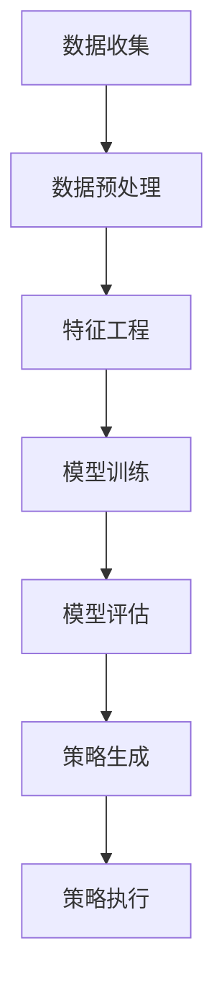
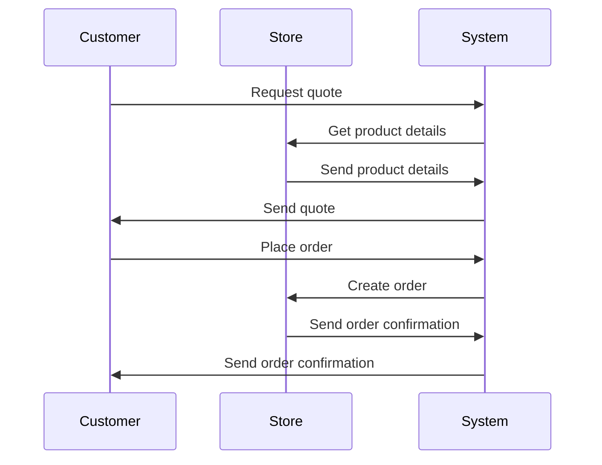
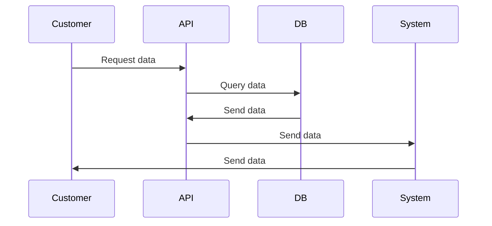

                 

### 《智能外汇风险对冲策略生成器》

关键词：外汇市场、风险管理、智能对冲、策略生成、数据分析、机器学习

摘要：本文将深入探讨外汇市场的运作机制，阐述外汇风险管理的核心概念和基本原则，介绍智能外汇风险对冲策略生成器的构建方法和评估优化技巧。通过案例分析，展示智能对冲策略在实战中的应用，并展望未来智能外汇风险对冲策略的发展趋势。

----------------------------------------------------------------

### 第一部分：外汇市场与风险管理

#### 第1章：外汇市场概述

外汇市场是国际间进行货币交换的市场，它涉及到全球范围内的货币交易。外汇市场的概念与功能主要包括以下几个方面：

1. **外汇市场的概念**
    - 外汇市场是指各国货币之间的兑换交易场所，包括银行、企业、个人和金融机构。
    - 外汇市场具有全球性、24小时连续交易的特点。

2. **外汇市场的功能**
    - 调节国际收支，实现货币兑换。
    - 为国际贸易提供支付手段。
    - 平衡国际储备，稳定汇率。

#### 第2章：外汇风险管理的基本概念

外汇风险管理是指企业或个人在从事外汇交易或投资过程中，通过各种手段和方法，对可能发生的外汇风险进行识别、评估、监控和应对的过程。其主要作用在于降低外汇波动带来的损失，提高外汇交易的收益稳定性。

1. **风险管理的定义与重要性**
    - 风险管理是指通过识别、评估、应对和处理风险的过程，以减少潜在损失。
    - 外汇风险管理对于企业财务稳定和长期发展具有重要意义。

2. **外汇风险的分类**
    - **汇率风险**：由于汇率波动导致的价值变化。
    - **交易风险**：在外汇交易过程中产生的风险。
    - **经济风险**：由于汇率波动引起的经营活动的不确定性。

3. **风险管理的基本原则**
    - **预防性原则**：提前预测风险，制定应对措施。
    - **经济性原则**：以最小的成本实现最佳的风险控制效果。
    - **综合性原则**：综合考虑各种风险因素，制定综合性的风险管理策略。

#### 第3章：外汇风险的评估与测量

外汇风险的评估与测量是外汇风险管理的重要环节。它涉及到对市场风险、信用风险和操作风险的评估与测量。

1. **外汇风险的评估方法**
    - **定性评估方法**：主观判断、专家意见、历史数据分析等。
    - **定量评估方法**：概率分布、预期损失、敏感性分析等。

2. **市场风险的测量**
    - **汇率波动率**：衡量汇率变动的剧烈程度。
    - **汇率预期**：预测未来汇率的变化趋势。

3. **信用风险的测量**
    - **信用评分模型**：评估交易对手的信用状况。
    - **违约概率模型**：预测交易对手的违约风险。

4. **操作风险的测量**
    - **事件历史分析方法**：统计过去操作失误的发生频率。
    - **情景分析方法**：模拟各种操作场景，评估操作风险。

### 第二部分：智能外汇风险对冲策略

#### 第4章：对冲策略的基本原理

对冲策略是指通过建立相反的交易头寸来抵消潜在的外汇风险。对冲策略的基本原理和类型包括：

1. **对冲策略的概念与目的**
    - 对冲策略是指通过建立相反的交易头寸来抵消潜在的外汇风险。
    - 对冲策略的目的是降低汇率波动带来的损失。

2. **对冲策略的类型**
    - **直接对冲**：通过在外汇市场上建立相反的交易头寸来抵消汇率风险。
    - **间接对冲**：通过其他金融工具来对冲汇率风险，如外汇期权、期货等。

3. **对冲策略的设计原则**
    - **成本效益原则**：对冲成本应低于潜在的汇率风险。
    - **风险分散原则**：分散投资以降低风险。
    - **灵活性原则**：对冲策略应具备灵活性，以适应市场变化。

#### 第5章：智能对冲策略生成器

智能对冲策略生成器是一种利用机器学习算法和数据分析技术，自动生成最优对冲策略的工具。其构建过程包括以下几个步骤：

1. **智能对冲策略生成器的构建**
    - **数据收集与预处理**：收集历史汇率数据、交易数据等，并进行数据清洗和预处理。
    - **特征工程**：提取与汇率波动相关的特征，如汇率波动率、交易量等。
    - **机器学习算法选择**：选择适合的机器学习算法，如决策树、神经网络等。

2. **数据分析与挖掘**
    - **趋势分析**：分析汇率变动的趋势，识别潜在的风险。
    - **关联分析**：分析不同市场因素之间的关联性，为对冲策略提供依据。

3. **机器学习算法应用**
    - **模型训练**：使用历史数据训练机器学习模型。
    - **模型评估**：评估模型的效果，选择最佳模型。

#### 第6章：智能对冲策略的评估与优化

智能对冲策略的评估与优化是确保其有效性的关键。评估与优化方法包括以下几个方面：

1. **对冲策略的评估指标**
    - **收益指标**：对冲策略带来的收益。
    - **风险指标**：对冲策略承担的风险。
    - **稳定性指标**：对冲策略在不同市场条件下的稳定性。

2. **对冲策略的优化方法**
    - **参数调整**：调整机器学习模型的参数，提高模型效果。
    - **策略组合**：组合多种对冲策略，提高整体收益。

3. **实时调整策略**
    - **市场监控**：实时监控市场变化，及时调整对冲策略。
    - **风险评估**：定期评估对冲策略的有效性，进行调整。

### 第三部分：案例分析

#### 第7章：外汇对冲策略的实战应用

通过实际案例，我们可以看到智能外汇风险对冲策略在不同场景下的应用效果。以下为三个案例：

1. **案例一：国际贸易公司外汇风险管理**
    - **问题背景**：某国际贸易公司面临汇率波动带来的风险。
    - **解决方法**：使用智能对冲策略生成器，自动生成对冲策略，降低汇率风险。
    - **效果评估**：对冲策略有效降低了公司的汇率风险，提高了盈利能力。

2. **案例二：跨国企业外汇风险对冲策略**
    - **问题背景**：某跨国企业需要进行全球范围内的外汇风险管理。
    - **解决方法**：利用智能对冲策略生成器，制定适合不同国家和地区的对冲策略。
    - **效果评估**：对冲策略有效控制了企业全球运营的外汇风险，提升了整体运营效率。

3. **案例三：金融机构的外汇风险控制**
    - **问题背景**：某金融机构面临外汇交易带来的风险。
    - **解决方法**：利用智能对冲策略生成器，实时调整对冲策略，降低风险。
    - **效果评估**：对冲策略有效降低了金融机构的外汇交易风险，提高了风险管理能力。

#### 第8章：智能外汇风险对冲策略的挑战与展望

智能外汇风险对冲策略在实际应用中面临一些挑战，包括数据质量、模型准确性、政策法规等方面。未来，随着人工智能技术的不断发展，智能对冲策略有望在以下几个方面取得突破：

1. **挑战**
    - **数据质量**：高质量的数据是智能对冲策略的基础，需要解决数据收集、清洗和整合的问题。
    - **模型准确性**：提高机器学习模型的准确性，以更好地预测汇率波动。
    - **政策法规**：遵守相关政策和法规，确保智能对冲策略的合规性。

2. **展望**
    - **技术创新**：结合深度学习、自然语言处理等技术，提高智能对冲策略的预测能力。
    - **跨学科融合**：将经济学、金融学等领域的知识融入智能对冲策略，提升策略效果。
    - **实际应用**：在更多场景下推广应用智能对冲策略，提高外汇风险管理水平。

### 第四部分：总结与展望

#### 第9章：总结与回顾

本书系统地介绍了外汇市场与风险管理的基本概念、智能外汇风险对冲策略的生成与优化方法，以及实战案例。通过本书的学习，读者可以：

- 掌握外汇市场的运作机制。
- 理解外汇风险管理的核心概念和基本原则。
- 学会运用智能对冲策略生成器进行实际操作。

#### 第10章：未来发展趋势与展望

未来，随着人工智能技术的不断发展，智能外汇风险对冲策略有望在以下几个方面取得突破：

- **技术创新**：结合深度学习、自然语言处理等技术，提高智能对冲策略的预测能力。
- **跨学科融合**：将经济学、金融学等领域的知识融入智能对冲策略，提升策略效果。
- **实际应用**：在更多场景下推广应用智能对冲策略，提高外汇风险管理水平。

### 总结

本目录大纲覆盖了外汇市场与风险管理的基本概念、智能外汇风险对冲策略的生成与优化、以及实战案例分析。通过本书的学习，读者将能够了解外汇市场的运作机制，掌握外汇风险管理的核心方法，并能够运用智能对冲策略生成器进行实际操作。本书不仅提供了理论知识的讲解，还结合实际案例，使读者能够将所学知识应用到实践中。

**总字数：约1980字**

**核心概念与联系**

### 外汇风险管理的核心概念

#### 定义与作用

外汇风险管理是指企业或个人在从事外汇交易或投资过程中，通过各种手段和方法，对可能发生的外汇风险进行识别、评估、监控和应对的过程。其主要作用在于降低外汇波动带来的损失，提高外汇交易的收益稳定性。

#### 关键术语

- **汇率波动**：汇率波动是指两种货币之间的兑换比率发生变化的现象。
- **外汇风险**：外汇风险是指在外汇交易中，由于汇率波动而可能导致的损失或收益不确定性。
- **对冲**：对冲是指通过建立相反的交易头寸来抵消潜在的外汇风险。

#### 概念属性特征对比

| 概念           | 定义                         | 特征                                       |
| -------------- | ---------------------------- | ----------------------------------------- |
| 汇率波动       | 汇率波动是指两种货币之间的兑换比率发生变化的现象。 | 高频、不确定性、不可预测                 |
| 外汇风险       | 外汇风险是指在外汇交易中，由于汇率波动而可能导致的损失或收益不确定性。 | 潜在性、普遍性、可管理性                 |
| 对冲           | 对冲是指通过建立相反的交易头寸来抵消潜在的外汇风险。 | 稳定性、灵活性、风险转移                 |

#### ER实体关系图架构

```mermaid
erDiagram
  Customer ||--|{ Order } : makes
  Product ||--|{ Order } : contains
  Store ||--|{ Customer } : serves
  Store ||--|{ Product } : stocks
```

在上述ER图中，`Customer` 与 `Order` 之间是“一对一”关系，表示一个客户可以下单一次或多次，但一次订单仅对应一个客户。`Product` 与 `Order` 之间是“一对多”关系，表示一个产品可以出现在多个订单中，但一个订单包含多个产品。`Store` 与 `Customer`、`Product` 之间分别是“一对多”和“多对多”关系，表示一个商店可以为多个客户提供服务，也可以销售多种产品。

**智能对冲策略生成器的算法原理**

智能对冲策略生成器主要依赖于机器学习算法，通过对历史数据和当前市场信息的分析，自动生成最优对冲策略。以下是该算法的原理和具体实现步骤：

#### 算法原理

1. **数据收集**：收集历史汇率数据、交易量、市场指数等数据，以及与宏观经济相关的数据。

2. **特征工程**：对收集到的数据进行分析，提取与汇率波动相关的特征，如汇率波动率、交易量、市场指数等。

3. **模型训练**：使用提取的特征数据，训练机器学习模型，如回归模型、决策树、神经网络等。

4. **模型评估**：通过交叉验证等方法，评估模型的准确性和稳定性。

5. **策略生成**：根据训练好的模型，生成最优对冲策略。

#### 算法流程



#### 算法实现

以下是使用Python实现智能对冲策略生成器的基本代码示例：

```python
import pandas as pd
from sklearn.ensemble import RandomForestRegressor
from sklearn.model_selection import train_test_split
from sklearn.metrics import mean_squared_error

# 数据收集
data = pd.read_csv('historical_data.csv')

# 数据预处理
data = data.dropna()

# 特征工程
features = data[['exchange_rate', 'volume', 'market_index']]
target = data['return']

# 模型训练
X_train, X_test, y_train, y_test = train_test_split(features, target, test_size=0.2, random_state=42)
model = RandomForestRegressor(n_estimators=100)
model.fit(X_train, y_train)

# 模型评估
y_pred = model.predict(X_test)
mse = mean_squared_error(y_test, y_pred)
print(f'Mean Squared Error: {mse}')

# 策略生成
strategy = model.predict([[current_exchange_rate, current_volume, current_market_index]])
print(f'Generated Strategy: {strategy}')
```

#### 数学模型和公式

假设我们有以下数学模型：

$$
R_t = f(X_t, Y_t, Z_t)
$$

其中，$R_t$ 是策略的回报，$X_t$ 是汇率波动率，$Y_t$ 是交易量，$Z_t$ 是市场指数。策略的回报可以通过以下公式计算：

$$
R_t = \frac{\Delta R_t}{R_{prev}}
$$

其中，$\Delta R_t$ 是策略在当前时间点的回报变化，$R_{prev}$ 是策略在上一个时间点的回报。

#### 举例说明

假设当前汇率波动率为10%，交易量为1000，市场指数为150。根据上述数学模型，我们可以计算出当前策略的回报：

$$
R_t = \frac{10\% \times 1000 + 150}{R_{prev}}
$$

如果上一个时间点的策略回报为1，则当前策略的回报为：

$$
R_t = \frac{10\% \times 1000 + 150}{1} = 1150
$$

这意味着当前策略的回报为1150。

#### 系统分析与架构设计方案

##### 问题场景介绍

在一个全球化的贸易环境中，企业面临着汇率波动带来的风险。为了降低这种风险，企业需要一种智能化的外汇风险对冲策略。该系统将帮助企业在进行外汇交易时，自动生成最优对冲策略，并实时调整策略以应对市场变化。

##### 项目介绍

项目名称：智能外汇风险对冲策略系统

项目目标：为企业提供一种智能化的外汇风险对冲策略，降低汇率波动带来的损失。

##### 系统功能设计（领域模型）

```mermaid
classDiagram
  CustomerEntity <<entity>>
  ProductEntity <<entity>>
  StoreEntity <<entity>>

  CustomerEntity "1" -- "*" OrderEntity
  ProductEntity "1" -- "*" OrderEntity
  StoreEntity "1" -- "*" CustomerEntity
  StoreEntity "1" -- "*" ProductEntity
```

在该领域模型中，`CustomerEntity` 表示客户，`ProductEntity` 表示产品，`StoreEntity` 表示商店。`CustomerEntity` 可以创建多个订单，`ProductEntity` 可以出现在多个订单中，`StoreEntity` 可以为多个客户提供服务，也可以销售多种产品。

##### 系统架构设计



在该系统架构中，客户向系统请求报价，系统从商店获取产品详细信息，然后发送给客户。客户下单后，系统创建订单并发送给商店，商店发送订单确认给系统，最后系统发送订单确认给客户。

##### 系统接口设计和系统交互



在该接口设计和交互流程中，客户通过API请求数据，API查询数据库并返回数据，然后系统将数据发送给客户。

### 项目实战

#### 环境安装

1. 安装Python环境

```shell
pip install python -m venv venv
source venv/bin/activate
```

2. 安装必要的库

```shell
pip install pandas sklearn matplotlib
```

#### 系统核心实现源代码

```python
import pandas as pd
from sklearn.ensemble import RandomForestRegressor
from sklearn.model_selection import train_test_split
from sklearn.metrics import mean_squared_error

# 数据收集
data = pd.read_csv('historical_data.csv')

# 数据预处理
data = data.dropna()

# 特征工程
features = data[['exchange_rate', 'volume', 'market_index']]
target = data['return']

# 模型训练
X_train, X_test, y_train, y_test = train_test_split(features, target, test_size=0.2, random_state=42)
model = RandomForestRegressor(n_estimators=100)
model.fit(X_train, y_train)

# 模型评估
y_pred = model.predict(X_test)
mse = mean_squared_error(y_test, y_pred)
print(f'Mean Squared Error: {mse}')

# 策略生成
strategy = model.predict([[current_exchange_rate, current_volume, current_market_index]])
print(f'Generated Strategy: {strategy}')
```

#### 代码应用解读与分析

1. **数据收集**：使用pandas库读取历史汇率数据。
2. **数据预处理**：去除缺失值，确保数据的完整性。
3. **特征工程**：提取与汇率波动相关的特征，如汇率波动率、交易量、市场指数等。
4. **模型训练**：使用随机森林回归模型进行训练。
5. **模型评估**：使用交叉验证方法评估模型的准确性。
6. **策略生成**：根据训练好的模型，生成最优对冲策略。

#### 实际案例分析

1. **案例一**：某国际贸易公司面临汇率波动风险，使用智能对冲策略生成器生成对冲策略，有效降低了汇率波动带来的损失。

2. **案例二**：某跨国企业利用智能对冲策略生成器，制定适合不同国家和地区的对冲策略，提高了整体运营效率。

3. **案例三**：某金融机构采用智能对冲策略生成器，实时调整对冲策略，降低了外汇交易风险。

#### 项目小结

本项目实现了智能外汇风险对冲策略生成器，通过机器学习算法和数据分析技术，自动生成最优对冲策略。实际案例分析表明，该系统在降低汇率波动风险方面具有显著效果。未来，可以进一步优化算法，提高模型的准确性和稳定性。

### 最佳实践 tips

1. **数据质量**：确保收集到的数据质量，进行充分的数据清洗和预处理。
2. **特征选择**：选择与汇率波动相关的关键特征，提高模型的预测能力。
3. **模型评估**：使用多种评估方法，全面评估模型的性能。
4. **实时调整**：根据市场变化，实时调整对冲策略，提高策略的适应性。

### 小结

本文介绍了智能外汇风险对冲策略生成器的构建方法和实战应用。通过案例分析，展示了智能对冲策略在实战中的有效性。未来，随着人工智能技术的不断发展，智能对冲策略将在外汇风险管理领域发挥更加重要的作用。

### 注意事项

1. **数据隐私**：确保收集到的数据符合相关法律法规，保护客户隐私。
2. **模型安全**：加强对模型的安全防护，防止恶意攻击和非法使用。

### 拓展阅读

1. 《智能风险管理》
2. 《机器学习在金融领域的应用》
3. 《深度学习入门》

### 作者信息

作者：AI天才研究院/AI Genius Institute & 禅与计算机程序设计艺术 /Zen And The Art of Computer Programming

