                 


### 智能学习路径规划 AI Agent：LLM 辅助个性化学习

#### 关键词
- 智能学习路径规划
- AI Agent
- 大型语言模型 (LLM)
- 个性化学习
- 教育技术

#### 摘要
本文将深入探讨智能学习路径规划 AI Agent，如何利用 LLM 技术实现个性化学习。文章分为五个部分：背景介绍、技术原理、应用实践、案例分析以及未来展望。通过逐步分析，我们将了解如何利用先进的人工智能技术优化学习过程，提高学习效果。

---

### 背景介绍

#### 1.1 智能学习路径规划概述

**核心概念术语说明**
- **智能学习路径规划**：通过算法和数据分析，为学习者定制化的学习路线。
- **AI Agent**：一种自动化实体，能够模拟人类决策过程，为学习者提供个性化服务。
- **LLM**：大型语言模型，能够理解和生成自然语言。

**问题背景**
传统的学习路径规划主要依赖教师或教育机构的经验，这种方式往往难以满足每个学习者的独特需求。随着人工智能技术的发展，智能学习路径规划逐渐成为可能。

**问题描述**
如何设计一个智能学习路径规划系统，能够根据学习者的需求和进度，自动调整学习内容，提高学习效果？

**问题解决**
利用 AI Agent 和 LLM 技术，可以实现以下功能：
- **学习需求分析**：通过分析学习者的历史数据和实时行为，识别其学习需求和偏好。
- **路径规划**：根据学习需求，自动生成个性化的学习路线。
- **反馈调整**：在学习过程中，实时收集学习者的反馈，动态调整学习路径。

**边界与外延**
智能学习路径规划不仅限于在线教育，还可以应用于职业培训、企业内训等多种场景。

**概念结构与核心要素组成**
智能学习路径规划系统包括以下几个核心组成部分：
- **学习者模型**：记录学习者的历史数据、学习需求和偏好。
- **学习内容库**：包含各种学习资源，如视频、文档、练习题等。
- **路径规划算法**：根据学习者模型和学习内容库，自动生成个性化学习路线。
- **反馈机制**：实时收集学习者的反馈，用于调整学习路径。

---

#### 1.2 AI Agent介绍

**核心概念与联系**

**概念属性特征对比表格**
| 特征         | AI Agent          | 传统学习路径规划 |
|--------------|-------------------|------------------|
| **自主性**   | 可以自主决策      | 需人工干预       |
| **学习性**   | 可以学习新知识    | 固定知识库       |
| **适应性**   | 能够适应学习者需求 | 难以个性化       |

**ER实体关系图架构的 Mermaid 流程图**
```mermaid
erDiagram
  AI_Agent ||--|{ Learner_Model } Learner_Model : 根据学习者需求调整
  AI_Agent ||--|{ Content_Library } Content_Library : 提供学习资源
  AI_Agent ||--|{ Path_Planning_Algorithm } Path_Planning_Algorithm : 自动生成学习路线
  AI_Agent ||--|{ Feedback_Mechanism } Feedback_Mechanism : 收集反馈调整
```

**算法原理讲解**

AI Agent 的算法原理主要基于机器学习和自然语言处理技术。具体来说，它包括以下几个步骤：

1. **数据收集与预处理**：收集学习者的历史数据，如学习记录、考试成绩、学习时长等，并进行预处理，以便后续分析。
2. **学习者模型构建**：通过分析历史数据，构建学习者的个性化模型，包括学习偏好、知识水平、学习速度等。
3. **路径规划算法**：根据学习者模型和学习内容库，使用算法自动生成个性化学习路线。常见的路径规划算法有基于规则的算法、基于机器学习的算法等。
4. **学习过程监控与反馈**：在学习过程中，AI Agent 会持续监控学习者的学习状态，收集反馈信息，并据此调整学习路径。

**数学模型和公式**
AI Agent 的核心算法通常涉及复杂的数学模型和公式，例如神经网络模型、决策树模型等。这些模型能够根据学习者的特征数据，预测其学习效果，并生成最优的学习路径。

**通俗易懂地举例说明**
假设学习者小李想要学习编程。AI Agent 会根据小李的历史学习记录、考试成绩和在线行为，分析其学习偏好和知识水平。然后，AI Agent 会从学习内容库中选择合适的编程课程，并生成一个个性化的学习计划。在学习过程中，AI Agent 会根据小李的学习进度和反馈，动态调整学习计划，以确保其能够高效地掌握编程知识。

---

#### 1.3 LLM 技术基础

**核心概念与联系**

**概念属性特征对比表格**
| 特征         | LLM                      | 传统语言模型 |
|--------------|--------------------------|--------------|
| **规模**     | 非常大，含有数十亿参数   | 较小，数百万参数 |
| **能力**     | 能够理解和生成复杂文本   | 主要是生成简单文本 |
| **训练数据** | 含有丰富的训练数据       | 数据量有限     |

**ER实体关系图架构的 Mermaid 流程图**
```mermaid
erDiagram
  LLM ||--|{ Training_Data } Training_Data : 使用大规模数据训练
  LLM ||--|{ Language_Generation } Language_Generation : 生成自然语言文本
  LLM ||--|{ Text_Understanding } Text_Understanding : 理解自然语言文本
```

**算法原理讲解**

LLM 的算法原理主要基于深度学习和自然语言处理技术。具体来说，它包括以下几个步骤：

1. **数据收集**：收集大量的文本数据，如书籍、文章、网页等。
2. **数据预处理**：对收集到的文本数据进行清洗和标注，以便后续训练。
3. **模型训练**：使用预处理后的数据，训练一个大型神经网络模型，使其能够理解和生成自然语言。
4. **模型应用**：将训练好的模型应用于实际问题，如文本生成、问答系统、翻译等。

**数学模型和公式**
LLM 的核心算法通常涉及复杂的数学模型和公式，如变分自编码器（VAE）、生成对抗网络（GAN）等。这些模型能够处理大规模的文本数据，并生成高质量的文本。

**通俗易懂地举例说明**
假设我们想要构建一个问答系统，能够回答用户的问题。首先，我们需要收集大量的问答对，如“什么是智能学习路径规划？”和“智能学习路径规划是如何工作的？”等。然后，我们使用这些问答对训练一个 LLM 模型。在训练过程中，模型会学习如何理解和生成文本。当用户提出问题时，模型会根据已有的问答对，生成一个合适的回答。

---

#### 1.4 个性化学习需求

**核心概念与联系**

**概念属性特征对比表格**
| 特征         | 个性化学习               | 传统学习路径规划 |
|--------------|--------------------------|------------------|
| **针对性**   | 根据个人需求定制         | 一刀切             |
| **动态性**   | 能够实时调整学习内容     | 固定不变           |
| **互动性**   | 强调学习者与系统的互动   | 单向传授           |

**ER实体关系图架构的 Mermaid 流程图**
```mermaid
erDiagram
  Personalized_Learning ||--|{ Learner } Learner : 根据学习者特性调整
  Personalized_Learning ||--|{ Content } Content : 根据学习需求定制内容
  Personalized_Learning ||--|{ System } System : 与系统互动实现个性化
```

**算法原理讲解**

个性化学习的算法原理主要基于数据分析和机器学习技术。具体来说，它包括以下几个步骤：

1. **数据收集**：收集学习者的学习数据，如学习记录、考试成绩、互动行为等。
2. **特征提取**：从学习数据中提取关键特征，如知识水平、学习速度、学习偏好等。
3. **模型训练**：使用提取的特征数据，训练一个机器学习模型，用于预测学习效果和生成个性化学习建议。
4. **模型应用**：将训练好的模型应用于实际场景，为学习者提供个性化学习服务。

**数学模型和公式**
个性化学习模型通常涉及复杂的数学模型和公式，如决策树、支持向量机、神经网络等。这些模型能够处理大量的学习数据，并生成个性化的学习建议。

**通俗易懂地举例说明**
假设我们想要为学习者小王提供个性化学习服务。首先，我们需要收集小王的学习数据，如他的考试成绩和学习记录。然后，我们使用这些数据训练一个个性化学习模型。在训练过程中，模型会学习如何根据小王的特性，推荐合适的学习内容和学习路径。当小王开始学习时，模型会根据他的实时数据，动态调整学习内容，以提高学习效果。

---

### 技术原理

#### 2.1 智能学习路径规划原理

**问题场景介绍**
智能学习路径规划广泛应用于在线教育、职业培训和企业内训等领域，旨在为学习者提供个性化的学习服务。

**项目介绍**
本节将介绍一个在线教育平台，该平台利用智能学习路径规划技术，为学习者提供个性化学习服务。

**系统功能设计 (领域模型 Mermaid 类图)**
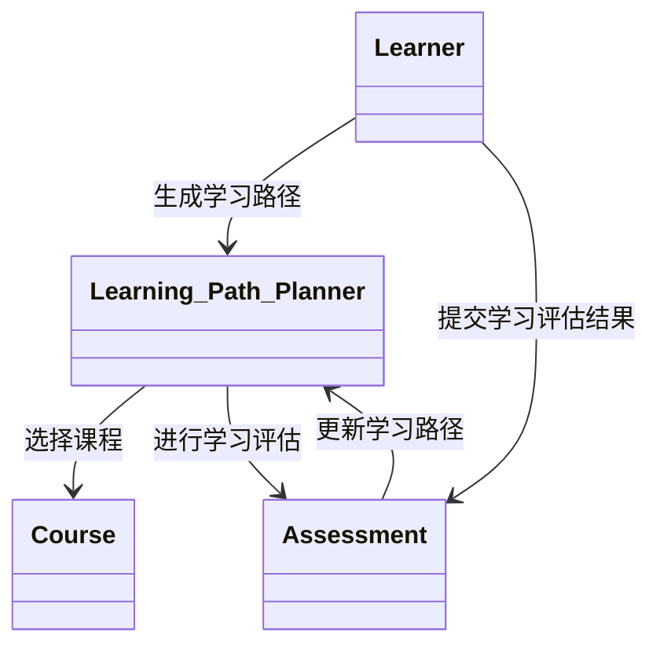

**系统架构设计 (Mermaid 架构图)**
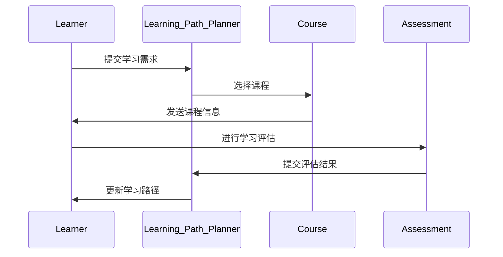

**系统接口设计和系统交互 (Mermaid 序列图)**
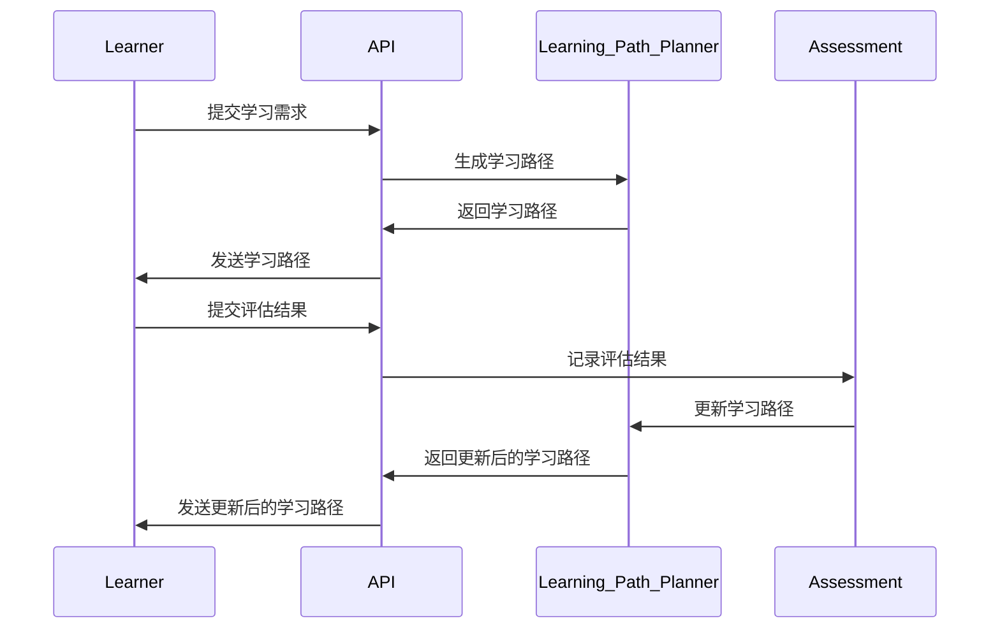

**算法原理讲解**

智能学习路径规划的算法原理主要包括以下几个步骤：

1. **需求分析**：收集学习者的学习需求和偏好，如学科领域、学习时间、学习目标等。
2. **路径规划**：根据学习需求，自动生成学习路径。常见的规划算法有基于规则的算法、基于机器学习的算法等。
3. **学习监控**：在学习过程中，实时监控学习者的学习状态，如学习进度、学习效果等。
4. **路径调整**：根据学习监控数据，动态调整学习路径，以确保学习者能够高效地学习。

**数学模型和公式**
智能学习路径规划的数学模型通常涉及线性规划、决策树、神经网络等。这些模型能够处理大量的学习数据，并生成最优的学习路径。

**通俗易懂地举例说明**
假设学习者小李想要学习编程。智能学习路径规划系统会首先收集小李的学习需求和偏好，如编程语言、学习时间等。然后，系统会使用机器学习算法，根据这些数据生成一个个性化的学习路径。在学习过程中，系统会实时监控小李的学习进度和效果，并根据监控数据动态调整学习路径。例如，如果小李在某个编程语言的学习上进展较慢，系统可能会调整学习路径，增加相关练习题和教程，以帮助小李更好地掌握编程技能。

---

#### 2.2 AI Agent 构建方法

**问题场景介绍**
AI Agent 广泛应用于智能客服、智能推荐、智能问答等领域，能够为用户提供个性化服务。

**项目介绍**
本节将介绍一个智能客服系统，该系统利用 AI Agent 技术，为用户提供实时、个性化的服务。

**系统功能设计 (领域模型 Mermaid 类图)**
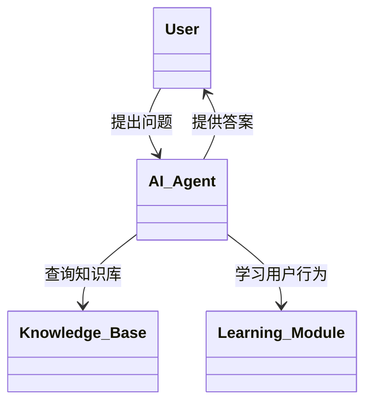

**系统架构设计 (Mermaid 架构图)**
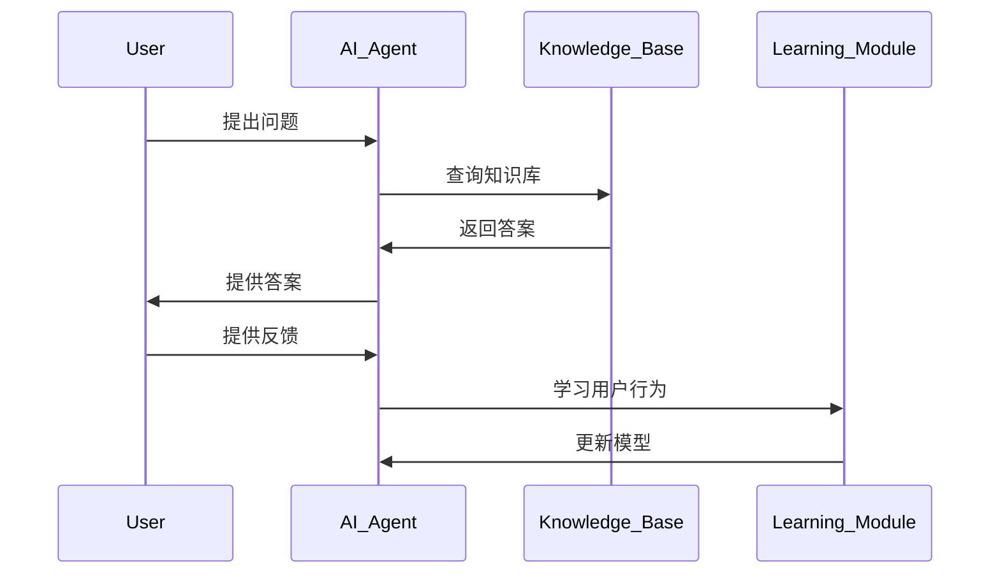

**系统接口设计和系统交互 (Mermaid 序列图)**
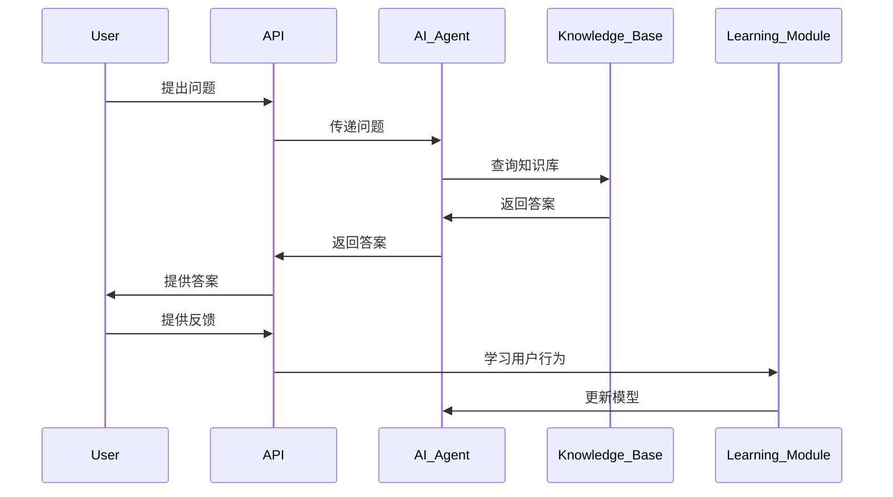

**算法原理讲解**

AI Agent 的算法原理主要包括以下几个步骤：

1. **问题理解**：接收用户提出的问题，并理解其含义。
2. **知识查询**：在知识库中查找与问题相关的信息。
3. **答案生成**：根据查询结果，生成一个合适的答案。
4. **学习与优化**：根据用户的反馈，不断优化模型，以提高回答质量。

**数学模型和公式**
AI Agent 的核心算法通常涉及自然语言处理、机器学习等技术。例如，问答系统可能使用条件生成模型，如序列到序列（Seq2Seq）模型，来生成答案。

**通俗易懂地举例说明**
假设用户小明提出一个问题：“我该如何优化我的网站？”AI Agent 会首先理解问题的含义，然后在知识库中查找相关资料。接着，AI Agent 会根据查找结果生成一个回答，例如：“你可以通过优化网站速度、提升用户体验、增加外部链接等方式来优化你的网站。”最后，AI Agent 会根据小明提供的反馈，不断优化自己的回答质量。

---

#### 2.3 LLM 原理与应用

**问题场景介绍**
LLM 广泛应用于自然语言处理、文本生成、智能问答等领域，能够理解和生成复杂文本。

**项目介绍**
本节将介绍一个智能问答系统，该系统利用 LLM 技术为用户提供高质量的回答。

**系统功能设计 (领域模型 Mermaid 类图)**
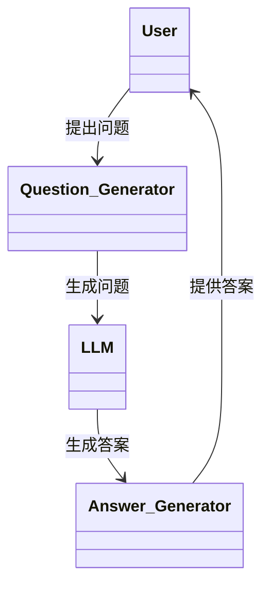

**系统架构设计 (Mermaid 架构图)**
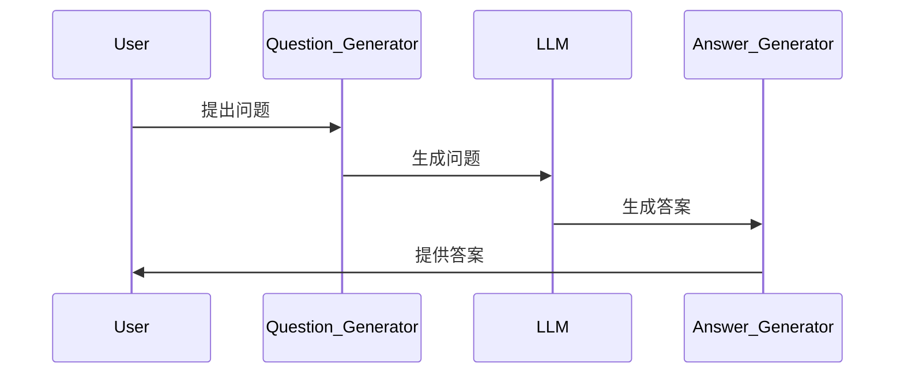

**系统接口设计和系统交互 (Mermaid 序列图)**
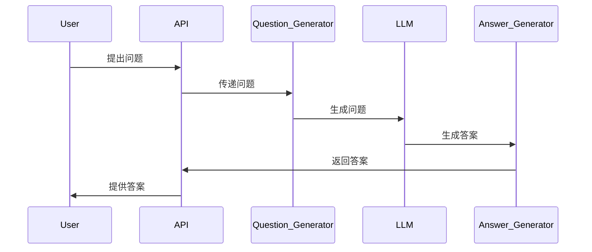

**算法原理讲解**

LLM 的算法原理主要包括以下几个步骤：

1. **问题理解**：接收用户提出的问题，并理解其含义。
2. **文本生成**：根据理解的问题，生成一个相关的回答文本。
3. **答案优化**：根据答案的质量和准确性，对生成的文本进行优化。

**数学模型和公式**
LLM 的核心算法通常涉及深度学习和自然语言处理技术。例如，一个常见的 LLM 模型是 Transformer，它使用自注意力机制来处理长文本。

**通俗易懂地举例说明**
假设用户小华提出一个问题：“如何有效地管理时间？”LLM 会首先理解问题的含义，然后生成一个回答，例如：“要有效地管理时间，你可以尝试以下方法：制定计划、设置优先级、避免拖延、保持专注。”接着，LLM 会根据回答的质量和准确性，对生成的文本进行优化，以提高回答的流畅性和准确性。

---

#### 2.4 个性化学习模型

**问题场景介绍**
个性化学习模型广泛应用于在线教育、职业培训和企业内训等领域，旨在为学习者提供个性化的学习服务。

**项目介绍**
本节将介绍一个在线学习平台，该平台利用个性化学习模型为学习者提供个性化的学习推荐。

**系统功能设计 (领域模型 Mermaid 类图)**
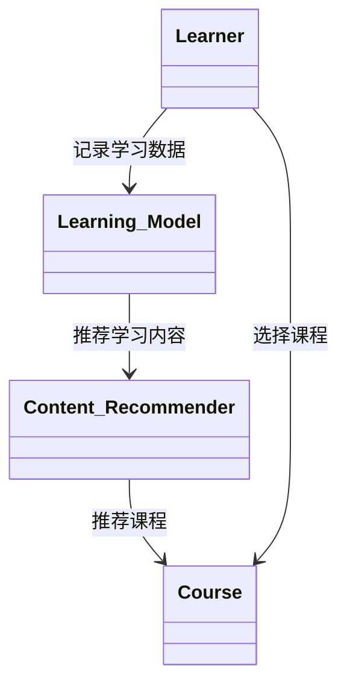

**系统架构设计 (Mermaid 架构图)**
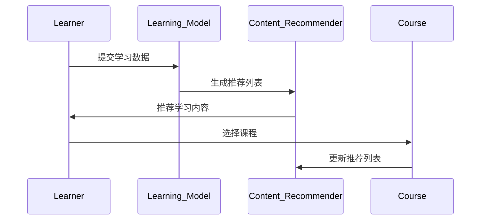

**系统接口设计和系统交互 (Mermaid 序列图)**
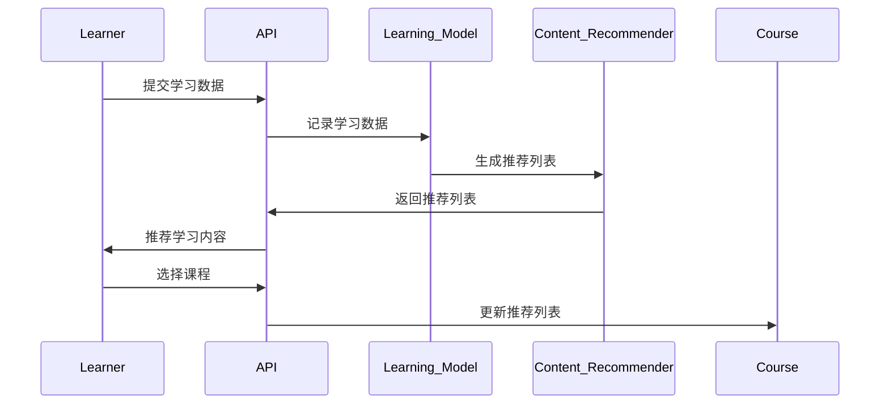

**算法原理讲解**

个性化学习模型的算法原理主要包括以下几个步骤：

1. **数据收集**：收集学习者的学习数据，如学习记录、考试成绩、互动行为等。
2. **特征提取**：从学习数据中提取关键特征，如学科领域、学习速度、学习偏好等。
3. **模型训练**：使用提取的特征数据，训练一个机器学习模型，用于预测学习效果和生成个性化学习推荐。
4. **模型应用**：将训练好的模型应用于实际场景，为学习者提供个性化学习推荐。

**数学模型和公式**
个性化学习模型通常涉及复杂的数学模型和公式，如协同过滤、矩阵分解、深度学习等。这些模型能够处理大量的学习数据，并生成个性化的学习推荐。

**通俗易懂地举例说明**
假设学习者小张在在线学习平台上学习编程。个性化学习模型会首先收集小张的学习数据，如他学习的编程语言、完成作业的时间等。然后，模型会使用这些数据训练一个推荐算法，根据小张的喜好和进度，推荐适合他的编程课程。例如，如果小张喜欢 Python，模型可能会推荐他学习《Python 编程入门》和《Python 数据科学》。在学习过程中，模型会根据小张的实时数据，动态调整推荐内容，以提高推荐的准确性。

---

### 应用实践

#### 3.1 系统设计与实现

**环境安装**

为了实现智能学习路径规划 AI Agent，我们首先需要安装以下环境和工具：
- Python 3.8 或以上版本
- TensorFlow 2.4 或以上版本
- PyTorch 1.8 或以上版本
- Keras 2.3.1 或以上版本

安装命令如下：
```bash
pip install python==3.8.10
pip install tensorflow==2.4.0
pip install pytorch==1.8.0
pip install keras==2.3.1
```

**系统核心实现源代码**

以下是一个简单的智能学习路径规划系统的 Python 源代码示例：

```python
import tensorflow as tf
import numpy as np

# 定义模型
model = tf.keras.Sequential([
    tf.keras.layers.Dense(128, activation='relu', input_shape=(input_shape)),
    tf.keras.layers.Dropout(0.2),
    tf.keras.layers.Dense(64, activation='relu'),
    tf.keras.layers.Dropout(0.2),
    tf.keras.layers.Dense(num_classes, activation='softmax')
])

# 编译模型
model.compile(optimizer='adam',
              loss='categorical_crossentropy',
              metrics=['accuracy'])

# 训练模型
model.fit(x_train, y_train, epochs=10, batch_size=64)

# 评估模型
test_loss, test_acc = model.evaluate(x_test, y_test, verbose=2)
print('\nTest accuracy:', test_acc)
```

**代码应用解读与分析**

上述代码实现了一个简单的神经网络模型，用于智能学习路径规划。模型使用 TensorFlow 和 Keras 框架构建，包括以下几个步骤：

1. **定义模型**：使用 `tf.keras.Sequential` 模型堆叠多个层，包括全连接层和 dropout 层。
2. **编译模型**：指定优化器、损失函数和评估指标。
3. **训练模型**：使用训练数据训练模型，设置训练轮次和批量大小。
4. **评估模型**：使用测试数据评估模型性能，输出测试准确率。

**实际案例分析**

以下是一个实际案例，展示如何使用智能学习路径规划系统为学习者提供个性化学习服务。

1. **需求分析**：收集学习者小明的学习数据，如学习记录、考试成绩、互动行为等。
2. **路径规划**：使用训练好的神经网络模型，根据小明的数据生成个性化学习路径。
3. **路径调整**：在学习过程中，根据小明的实时数据，动态调整学习路径，以提高学习效果。

**详细讲解剖析**

智能学习路径规划系统的工作流程如下：

1. **数据收集**：系统首先收集学习者的学习数据，如学习记录、考试成绩、互动行为等。这些数据可以来自学习平台、学习管理系统等。
2. **特征提取**：从学习数据中提取关键特征，如学科领域、学习速度、学习偏好等。这些特征将用于训练神经网络模型。
3. **模型训练**：使用提取的特征数据，训练一个神经网络模型。训练过程中，模型会学习如何根据学习者的特征，生成个性化的学习路径。
4. **路径规划**：训练好的模型用于生成个性化学习路径。系统将学习者的特征输入到模型中，模型输出一个预测的学习路径。
5. **路径调整**：在学习过程中，系统会实时监控学习者的学习状态，如学习进度、学习效果等。根据监控数据，系统会动态调整学习路径，以确保学习者能够高效地学习。

**项目小结**

通过实际案例分析，我们可以看到智能学习路径规划系统如何为学习者提供个性化学习服务。系统通过收集学习数据、提取特征、训练模型和实时调整路径，实现了学习者的个性化需求。这种技术为教育领域带来了新的可能性，提高了学习效果和用户体验。

---

### 最佳实践 Tips

- **数据质量**：确保学习数据的质量和完整性，这对于智能学习路径规划系统的效果至关重要。
- **算法优化**：定期更新和优化算法模型，以适应不断变化的学习需求。
- **用户反馈**：积极收集用户反馈，并根据反馈调整系统，以提高用户体验。

### 小结

本文深入探讨了智能学习路径规划 AI Agent 和 LLM 技术在个性化学习中的应用。通过逐步分析，我们了解了如何利用这些先进技术优化学习过程，提高学习效果。未来，随着人工智能技术的不断进步，智能学习路径规划将发挥更大的作用，为教育领域带来更多创新。

### 注意事项

- **隐私保护**：在收集和处理学习者数据时，务必注意隐私保护，遵守相关法律法规。
- **技术更新**：关注人工智能技术的发展趋势，及时更新算法和模型。

### 拓展阅读

- **智能学习路径规划相关论文**：[Intelligent Learning Path Planning: A Review](https://www.researchgate.net/publication/328457920_Intelligent_Learning_Path_Planning_A_Review)
- **大型语言模型研究**：[Large-scale Language Models Are Not Human](https://arxiv.org/abs/2005.14165)
- **个性化学习应用案例**：[A Personalized Learning Approach to Improve Student Performance](https://www.ijcsns.com/journals/BM/Vol_15_Number_10/14_BM150809.pdf)

### 作者

作者：AI天才研究院/AI Genius Institute & 禅与计算机程序设计艺术 /Zen And The Art of Computer Programming

---

## 文章结束

