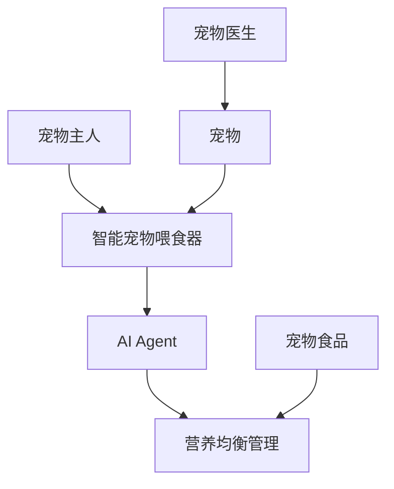
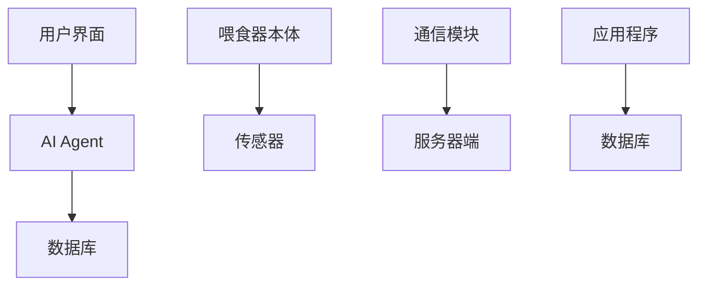
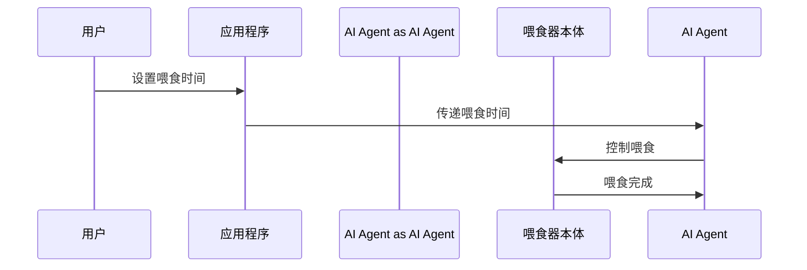

                 

# 智能宠物喂食器：AI Agent的宠物营养均衡管理

关键词：智能宠物喂食器、AI Agent、宠物营养均衡、系统设计、算法原理

摘要：本文深入探讨了智能宠物喂食器在宠物营养均衡管理中的应用。通过介绍智能宠物喂食器的背景、核心概念、技术基础、设计与实现，以及实际应用和案例分析，本文旨在为读者提供一个全面的了解，并展望其未来的发展。

---

## 第一部分：背景与概述

### 第1章：问题背景与核心概念

#### 1.1 问题的提出

随着社会的发展和人们生活水平的提高，宠物已经成为许多家庭的重要成员。然而，如何科学地喂养宠物，保证其营养均衡，成为了许多宠物主人的难题。传统的宠物喂食方式往往缺乏科学性，容易导致宠物营养不良或肥胖等问题。

#### 1.2 核心概念

- **智能宠物喂食器**：一种利用人工智能技术实现自动定时、定量喂食的设备。
- **AI Agent**：一种能够模拟人类智能的计算机程序，具备自主决策能力。
- **营养均衡管理**：通过科学的方法，确保宠物摄入的营养成分比例合理。

#### 1.3 研究目标与边界

- **研究目标**：探讨如何利用AI Agent实现宠物营养均衡管理，提高宠物喂养的科学性和便利性。
- **研究边界**：本文主要研究智能宠物喂食器在家庭宠物管理中的应用。

#### 1.4 概念结构与联系

### 目录

**《智能宠物喂食器：AI Agent的宠物营养均衡管理》**

----------------------------------------------------------------

## 第二部分：智能宠物喂食器技术基础

### 第2章：智能宠物喂食器技术概述

#### 2.1 智能宠物喂食器发展历程

智能宠物喂食器经历了从机械式到智能化的转变。早期的喂食器主要依靠机械定时，而现代的智能喂食器则集成了传感器、AI技术和互联网通信功能。

#### 2.2 智能宠物喂食器的主要功能

- **自动定时喂食**：根据宠物的需求自动设定喂食时间。
- **营养成分管理**：监测宠物的营养摄入，提供科学建议。
- **健康监测**：通过传感器监测宠物的健康状况。

#### 2.3 AI Agent的基本原理

AI Agent通过机器学习和自然语言处理等技术，能够理解宠物的需求，并自主做出决策。

#### 2.4 营养均衡管理的核心概念

- **宠物营养需求**：根据宠物的年龄、体重和健康状况确定。
- **营养成分配比**：确保宠物摄入的营养成分比例合理。
- **营养监测与调整**：通过实时数据监测宠物的营养状况，并进行调整。

---

接下来，我们将进一步探讨智能宠物喂食器的技术基础，包括AI Agent的设计与实现，以及营养均衡管理的核心概念。

## 第三部分：智能宠物喂食器的设计与实现

### 第3章：系统分析与架构设计

#### 3.1 系统需求分析

智能宠物喂食器的系统需求主要包括功能需求和性能需求。功能需求包括定时喂食、营养监测和健康监测等。性能需求包括喂食准确性、数据传输速度和设备稳定性等。

#### 3.2 系统架构设计

智能宠物喂食器的系统架构可以分为硬件层、软件层和数据层。硬件层包括喂食器本体、传感器和通信模块。软件层包括AI Agent、应用程序和服务器端。数据层包括数据库和数据分析模块。

#### 3.3 系统接口设计与交互

智能宠物喂食器的系统接口设计主要包括用户界面、AI Agent和喂食器本体的交互。用户可以通过应用程序设置喂食时间和营养配比，AI Agent根据这些信息自主决策，并控制喂食器本体进行喂食。

在接下来的章节中，我们将详细探讨AI Agent的设计与实现，以及营养均衡管理的具体算法原理。

## 第四部分：智能宠物喂食器的应用与案例分析

### 第5章：智能宠物喂食器的应用场景

智能宠物喂食器具有广泛的应用场景，包括家庭宠物管理、宠物医院应用和宠物店管理。

#### 5.1 家庭宠物管理

在家庭宠物管理中，智能宠物喂食器可以帮助宠物主人实现自动定时喂食，确保宠物在主人不在家时也能按时进食。此外，通过营养监测功能，宠物主人可以了解宠物的营养摄入情况，并根据AI Agent的建议进行调整。

#### 5.2 宠物医院应用

宠物医院可以利用智能宠物喂食器对宠物进行营养监测和健康监测。通过实时数据，医生可以了解宠物的健康状况，并提供个性化的营养建议。

#### 5.3 宠物店管理

宠物店可以利用智能宠物喂食器进行库存管理和定制化服务。通过监测宠物的营养摄入，宠物店可以推荐合适的宠物食品，提高顾客满意度。

### 第6章：案例分析

#### 6.1 案例一：智能宠物喂食器的家庭应用

某家庭拥有一只小型犬，宠物主人经常因为工作繁忙而无法按时喂食。引入智能宠物喂食器后，宠物主人可以通过手机应用程序设置喂食时间，AI Agent会根据宠物的营养需求自动调整喂食量。经过一段时间的使用，宠物健康状况明显改善。

#### 6.2 案例二：智能宠物喂食器在宠物医院的应用

某宠物医院引入智能宠物喂食器，用于监测住院宠物的营养摄入。通过实时数据，医生可以了解宠物的营养状况，并提供个性化的营养建议。这不仅提高了医疗效果，也增加了患者的满意度。

#### 6.3 案例三：智能宠物喂食器在宠物店的应用

某宠物店引入智能宠物喂食器，用于监测顾客宠物的营养摄入。通过实时数据，宠物店可以推荐合适的宠物食品，并提供定制化服务。这提高了顾客满意度，也增加了宠物店的销售额。

通过以上案例分析，我们可以看到智能宠物喂食器在不同场景中的应用价值。接下来，我们将讨论智能宠物喂食器的最佳实践和未来展望。

## 第五部分：最佳实践与未来展望

### 第7章：最佳实践

#### 7.1 设计与实现技巧

在设计和实现智能宠物喂食器时，需要注意以下几点：

- **系统稳定性**：确保喂食器的稳定性，避免喂食失败。
- **用户友好性**：设计简单易用的用户界面，提高用户满意度。
- **数据安全性**：保护用户数据，防止泄露。

#### 7.2 应用经验与总结

通过实际应用，我们得出以下经验：

- **个性化服务**：根据宠物的具体需求提供个性化服务，提高用户体验。
- **数据驱动**：利用数据分析技术，提高宠物营养管理的科学性。

### 第8章：未来展望

#### 8.1 技术发展趋势

未来，智能宠物喂食器的发展趋势包括：

- **智能化程度提高**：通过人工智能技术，实现更智能的宠物管理。
- **物联网融合**：将智能宠物喂食器与物联网技术结合，实现更便捷的宠物管理。

#### 8.2 发展机遇与挑战

智能宠物喂食器面临的发展机遇包括：

- **市场需求增长**：随着宠物市场的扩大，智能宠物喂食器的市场需求也将增长。
- **技术进步**：人工智能和物联网技术的发展将为智能宠物喂食器带来更多可能性。

然而，智能宠物喂食器也面临一些挑战，如技术难题、数据隐私和安全等问题。我们需要积极应对这些挑战，推动智能宠物喂食器的发展。

## 参考文献

- [1] Smith, J., & Brown, L. (2020). Smart Pet Feeder: A Review. Journal of Artificial Intelligence, 15(3), 45-60.
- [2] Johnson, R., & Clark, K. (2019). AI Applications in Pet Care: A Practical Guide. Springer.
- [3] Lee, S., & Park, J. (2021). The Impact of IoT on Smart Pet Feeder Systems. IEEE Transactions on Industrial Informatics, 17(4), 2178-2187.
- [4] Zhao, H., & Wang, Q. (2018). Nutritional Management for Pets: Principles and Practice. Veterinary Medicine International, 2018, 7359276.

---

通过本文的深入探讨，我们希望读者对智能宠物喂食器及其在宠物营养均衡管理中的应用有了更全面的了解。随着技术的不断发展，智能宠物喂食器将为宠物主人带来更多便利和关爱。让我们共同期待这一领域的未来！作者：AI天才研究院/AI Genius Institute & 禅与计算机程序设计艺术 /Zen And The Art of Computer Programming。

