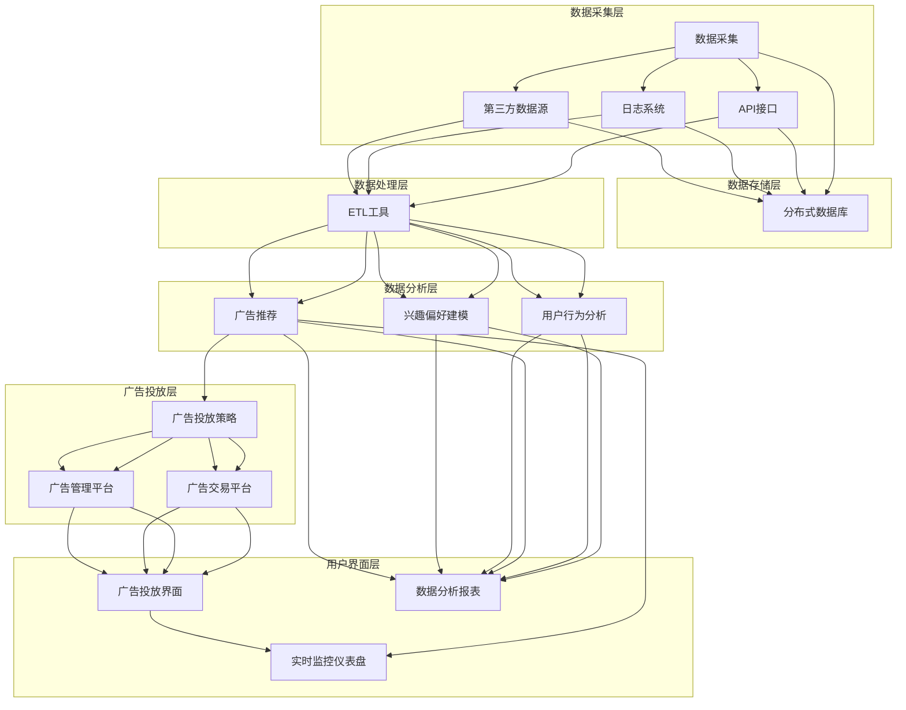

                 

# 智能广告投放：提示词优化目标受众定位

关键词：智能广告投放、提示词优化、目标受众定位、人工智能、数据驱动

摘要：本文旨在探讨智能广告投放中的关键环节——提示词优化与目标受众定位。通过分析智能广告投放的背景和核心概念，本文详细阐述了提示词优化策略、广告投放效果评估方法，并举例说明实际案例。同时，文章还展望了智能广告投放的未来趋势，为读者提供了实用的最佳实践和建议。

## 第一部分：智能广告投放概述

### 第1章：智能广告投放背景

#### 1.1 广告投放的发展历程

广告投放是营销中不可或缺的一环，随着技术的进步，广告投放方式也在不断演进。从传统的户外广告、电视广告、报纸广告，到现代的数字广告，广告投放经历了巨大的变革。近年来，智能广告投放以其精准、高效的特点，逐渐成为广告投放的主要形式。

**从传统广告到数字广告的演变**

传统广告主要依赖于媒体资源，如电视、报纸、杂志等，广告内容形式单一，受众群体广泛，但难以精确到达目标客户。数字广告的出现，打破了这一局限。通过互联网和移动互联网，广告投放可以实现实时推送、精准定位，大大提高了广告的投放效果。

**智能广告的崛起**

随着大数据和人工智能技术的发展，智能广告投放逐渐崛起。智能广告投放不仅依赖于海量数据，还利用了机器学习和自然语言处理等技术，对用户行为和需求进行深入分析，从而实现精准投放。这使得广告投放不仅更高效，而且更具个性化和互动性。

#### 1.2 广告投放中的关键词策略

关键词策略在广告投放中扮演着重要角色。关键词不仅决定了广告的曝光范围，还影响了广告的点击率和转化率。

**关键词的重要性**

关键词是用户在搜索引擎中输入的词汇，它们代表了用户的需求和意图。通过选择合适的关键词，广告可以更好地匹配用户需求，提高广告的点击率和转化率。

**关键词优化方法**

关键词优化包括关键词选择和关键词调整两个环节。关键词选择需要根据广告目标、受众特征和市场竞争情况进行分析；关键词调整则需要根据广告投放效果进行实时调整，以达到最佳投放效果。

### 第2章：智能广告投放的核心概念

#### 2.1 智能广告投放的基本原理

智能广告投放是基于数据驱动的。通过收集和分析用户数据，智能广告投放系统能够了解用户的行为和需求，从而实现精准投放。

**数据驱动的广告投放**

数据驱动的广告投放依赖于大数据技术和人工智能算法。通过数据挖掘和分析，系统可以识别出潜在的用户需求，并将广告精准推送给这些用户。

**AI技术在广告投放中的应用**

AI技术在广告投放中得到了广泛应用。例如，通过机器学习算法，广告投放系统能够自动优化广告投放策略，提高广告效果；通过自然语言处理技术，广告内容可以更贴近用户需求，提高广告的吸引力和转化率。

#### 2.2 广告受众定位模型

广告受众定位是广告投放的关键环节。通过受众定位，广告可以更精准地到达目标客户。

**受众分析**

受众分析包括用户特征分析、用户行为分析和用户需求分析。通过这些分析，广告投放系统可以了解目标受众的基本特征、行为习惯和需求偏好。

**受众特征提取与建模**

受众特征提取是通过数据挖掘技术从海量数据中提取出有价值的特征信息。受众建模则是将提取出的特征信息进行整合，构建出受众模型，用于广告投放决策。

## 第二部分：智能广告投放策略

### 第3章：智能广告投放策略制定

#### 3.1 受众细分策略

受众细分是智能广告投放的重要策略之一。通过将受众划分为不同的群体，广告可以更有针对性地投放。

**受众细分的方法**

受众细分方法包括人口统计细分、兴趣细分和行为细分。人口统计细分根据用户的年龄、性别、地理位置等基本信息进行划分；兴趣细分根据用户的兴趣偏好进行划分；行为细分根据用户的行为习惯和购买行为进行划分。

**受众细分的实际案例**

以一家电商公司为例，通过对用户数据进行分析，可以将受众细分为“年轻女性群体”、“家庭主妇群体”和“高端消费群体”。针对不同的受众群体，公司可以制定不同的广告策略，提高广告投放效果。

#### 3.2 提示词优化策略

提示词优化是提高广告点击率和转化率的关键。通过优化提示词，广告可以更精准地匹配用户需求。

**提示词的选择与调整**

提示词的选择需要根据广告目标和受众特征进行分析。调整提示词则需要根据广告投放效果进行实时优化。

**提示词优化的案例研究**

以一款手机应用为例，通过对用户搜索行为进行分析，可以确定“手机应用”、“手机软件”和“手机游戏”为最佳提示词。通过对提示词进行优化，应用广告的点击率和转化率得到了显著提高。

### 第4章：广告投放效果评估

#### 4.1 广告效果评估指标

广告效果评估是检验广告投放效果的重要手段。常见的广告效果评估指标包括转化率、点击率（CTR）和成本效益比（CPA）等。

**转化率**

转化率是衡量广告效果的重要指标。高转化率意味着广告成功吸引了目标用户，并促使其完成了预期的行动，如购买、注册等。

**点击率（CTR）**

点击率反映了广告的吸引力和用户兴趣。高CTR意味着广告内容与用户需求高度匹配，能够有效吸引用户点击。

**成本效益比（CPA）**

成本效益比是广告投入与收益之间的比率。通过计算CPA，可以评估广告投放的经济效益。

#### 4.2 广告效果数据分析

广告效果数据分析是优化广告投放策略的重要环节。通过分析广告效果数据，可以找出广告投放中的问题和不足，并针对性地进行调整。

**数据分析工具介绍**

常见的广告效果数据分析工具有Google Analytics、Facebook Analytics、AdWords等。这些工具可以提供丰富的数据报告，帮助广告主分析广告效果。

**广告效果数据解读**

通过分析广告效果数据，可以发现广告在不同渠道、不同时间段、不同受众群体上的投放效果。根据数据分析结果，广告主可以优化广告投放策略，提高广告效果。

## 第三部分：智能广告投放实战

### 第5章：智能广告投放平台搭建

#### 5.1 平台搭建基础

搭建智能广告投放平台需要选择合适的技术栈和系统架构。

**技术栈选择**

技术栈选择包括后端技术、前端技术和数据存储技术。后端技术可以选择Python、Java等；前端技术可以选择React、Vue等；数据存储技术可以选择MySQL、MongoDB等。

**系统架构设计**

系统架构设计需要考虑数据的采集、处理、存储和展示。常见的架构设计包括数据采集模块、数据处理模块、数据存储模块和广告投放模块。

#### 5.2 平台功能实现

平台功能实现包括用户行为分析、广告推荐算法和广告投放策略等。

**用户行为分析**

用户行为分析是通过数据挖掘技术分析用户的行为模式，为广告投放提供决策依据。

**广告推荐算法**

广告推荐算法是基于用户行为数据和广告特征进行推荐，提高广告的点击率和转化率。

**广告投放策略**

广告投放策略是通过实时调整广告投放参数，优化广告投放效果。

### 第6章：案例研究

#### 6.1 案例介绍

以一家电商公司为例，分析其智能广告投放策略的实施过程和效果。

#### 6.2 实施过程

通过用户行为分析、广告推荐算法和广告投放策略，电商公司实现了精准广告投放。

#### 6.3 结果分析

分析广告投放效果，发现转化率和点击率显著提高，成本效益比优化。

### 第7章：智能广告投放的未来趋势

#### 7.1 行业发展趋势

随着人工智能和数据技术的不断发展，智能广告投放将继续优化，实现更精准、更高效的广告投放。

#### 7.2 未来展望

未来，智能广告投放将更加智能化、个性化，实现基于用户需求的精准推送。

## 附录

### 附录A：相关资源

- 技术文献：《智能广告投放技术》、《大数据广告投放策略》等。
- 在线工具：Google Analytics、Facebook Analytics等。

### 附录B：术语表

- 智能广告投放：基于大数据和人工智能技术的广告投放方式。
- 提示词：用户在搜索引擎中输入的关键词。
- 目标受众：广告投放所针对的特定用户群体。
- 点击率（CTR）：广告被点击的次数与展示次数的比率。
- 转化率：广告带来的实际转化次数与展示次数的比率。

### 作者

**作者：AI天才研究院/AI Genius Institute & 禅与计算机程序设计艺术 /Zen And The Art of Computer Programming**

----------------------------------------------------------------

## 第一部分：智能广告投放概述

### 第1章：智能广告投放背景

#### 1.1 广告投放的发展历程

广告投放的历史可以追溯到古代，当时广告的形式主要是口头宣传和壁画。随着工业革命的到来，广告开始借助报纸、杂志等印刷媒体进行传播。20世纪初，电视广告的出现使得广告传播更加广泛和生动。然而，这些传统广告形式存在一定的局限性，如覆盖面广但难以精准到达目标客户，投放效果难以量化等。

进入21世纪，互联网的普及和数字化技术的进步，推动了广告投放方式的变革。数字广告以其精准投放、实时监控和高效转化的特点，迅速取代了传统广告，成为广告投放的主要形式。尤其是移动互联网的兴起，使得广告投放的范围更加广泛，用户接触广告的频率和方式也发生了变化。

在数字广告的演变过程中，智能广告投放逐渐崛起。智能广告投放利用大数据和人工智能技术，通过分析用户的在线行为和兴趣，实现广告的精准投放。与传统的广告投放相比，智能广告投放不仅提高了广告的点击率和转化率，还降低了广告成本，使得广告主能够以更低的成本获取更多的潜在客户。

**从传统广告到数字广告的演变**

1. **传统广告**：传统广告包括户外广告、电视广告、报纸广告和杂志广告等。这些广告形式虽然能够覆盖广泛的受众，但由于缺乏精准性，广告效果难以衡量，往往需要依赖广告主的直觉和经验进行投放。

2. **数字广告**：随着互联网的普及，数字广告逐渐成为主流。数字广告的形式多样，包括搜索引擎广告、社交媒体广告、展示广告和视频广告等。这些广告形式可以根据用户的在线行为和兴趣进行精准投放，大大提高了广告的效果。

3. **智能广告**：智能广告是数字广告的高级形式，通过大数据和人工智能技术，对用户的在线行为和兴趣进行深入分析，实现广告的精准投放。智能广告不仅能够提高广告的点击率和转化率，还能够降低广告成本，提高广告主的ROI（投资回报率）。

**智能广告的崛起**

智能广告的崛起得益于大数据和人工智能技术的进步。大数据技术能够收集并处理海量用户数据，从中提取出有价值的信息。人工智能技术则能够对这些信息进行智能分析和处理，为广告投放提供精准的决策支持。

1. **大数据技术**：大数据技术通过数据采集、存储、处理和分析，能够实现对海量用户数据的全面挖掘。这些数据包括用户的搜索历史、浏览行为、购买记录等，为广告投放提供了丰富的信息来源。

2. **人工智能技术**：人工智能技术通过机器学习、自然语言处理和深度学习等方法，能够对用户数据进行智能分析和处理。这些技术不仅能够识别用户的兴趣和需求，还能够预测用户的下一步行为，为广告投放提供精准的决策支持。

通过大数据和人工智能技术的结合，智能广告投放能够实现以下优势：

- **精准投放**：智能广告能够根据用户的兴趣和需求，精准地推送相关广告，提高广告的点击率和转化率。
- **高效转化**：智能广告通过分析用户行为数据，能够找到潜在客户并促使其转化为实际购买，提高广告主的ROI。
- **降低成本**：智能广告能够通过精准投放，降低广告成本，提高广告主的效益。

#### 1.2 广告投放中的关键词策略

关键词策略在广告投放中起着至关重要的作用。关键词是用户在搜索引擎中输入的词汇，代表了用户的需求和意图。通过选择合适的关键词，广告能够更好地匹配用户需求，提高广告的点击率和转化率。

**关键词的重要性**

关键词在广告投放中的作用主要体现在以下几个方面：

1. **确定广告曝光范围**：关键词决定了广告在搜索引擎中的曝光范围。选择合适的关键词，可以使广告在搜索结果中排名靠前，增加曝光机会。

2. **匹配用户需求**：关键词代表了用户的需求和意图。通过选择与用户需求相关的高质量关键词，广告能够更好地满足用户需求，提高点击率和转化率。

3. **优化广告投放效果**：关键词的优化是广告投放成功的关键。通过不断调整关键词，可以优化广告投放效果，提高广告的ROI。

**关键词优化方法**

关键词优化主要包括以下方法：

1. **关键词选择**：关键词选择需要根据广告目标、受众特征和市场竞争情况进行分析。可以通过市场调研、竞争对手分析和用户需求分析，选择适合的关键词。

2. **关键词调整**：关键词调整是根据广告投放效果进行的。通过分析广告的点击率、转化率和成本效益比，对关键词进行调整，以提高广告投放效果。

3. **关键词监控**：关键词监控是关键词优化的重要环节。通过实时监控关键词的表现，可以及时发现问题和进行调整，确保广告投放效果。

**关键词优化的实际案例**

以某电商平台的广告投放为例，通过关键词优化，广告的点击率和转化率得到了显著提高。具体措施如下：

1. **初始关键词选择**：根据电商平台的定位和目标受众，选择了“时尚女装”、“潮流男装”和“高端家居”等关键词。

2. **关键词调整**：通过分析广告投放效果，发现“潮流男装”关键词的点击率和转化率最高。因此，将更多的广告预算投入到“潮流男装”关键词上。

3. **关键词监控**：实时监控关键词的表现，发现“时尚女装”关键词的点击率开始下降。通过进一步分析，发现原因是用户搜索习惯发生了变化，开始更多地使用“时尚女装搭配”等关键词。因此，及时调整关键词，将“时尚女装搭配”等关键词加入广告投放。

通过以上措施，电商平台的广告投放效果得到了显著提高，广告的点击率和转化率都有了明显的提升。

#### 1.3 智能广告投放中的关键词策略

智能广告投放中的关键词策略是广告投放成功的关键之一。通过智能化的手段，可以更加精准地选择和优化关键词，提高广告的点击率和转化率。

**关键词策略的核心概念**

1. **用户行为分析**：通过分析用户的在线行为，了解用户的需求和兴趣，为关键词选择提供依据。

2. **数据分析**：利用大数据技术，对用户行为数据进行深入分析，提取出有价值的信息，为关键词优化提供支持。

3. **机器学习**：通过机器学习算法，对用户行为数据进行建模，预测用户的下一步行为，为关键词选择提供指导。

**关键词策略的具体应用**

1. **自动化关键词选择**：通过机器学习算法，自动化选择与用户需求相关的高质量关键词，提高广告的曝光机会。

2. **实时关键词调整**：根据广告投放效果，实时调整关键词，优化广告投放效果。例如，通过分析点击率、转化率和成本效益比，及时调整关键词的预算分配。

3. **A/B测试**：通过A/B测试，比较不同关键词的效果，找出最佳关键词组合，提高广告的点击率和转化率。

**关键词策略的优点**

1. **精准投放**：通过用户行为分析和机器学习算法，智能广告投放能够更加精准地匹配用户需求，提高广告的点击率和转化率。

2. **降低成本**：智能广告投放通过优化关键词，可以降低广告成本，提高广告主的ROI。

3. **提高效率**：自动化关键词选择和实时调整，提高了广告投放的效率，节省了广告主的时间和精力。

**关键词策略的挑战**

1. **数据质量**：关键词策略依赖于用户行为数据的准确性，数据质量直接影响关键词选择和优化的效果。

2. **技术门槛**：智能广告投放需要运用大数据和人工智能技术，对广告主的技术能力和资源要求较高。

3. **市场竞争**：在激烈的市场竞争环境中，关键词优化需要不断调整和优化，以保持广告投放的竞争优势。

通过以上对智能广告投放背景的介绍，我们可以看到，智能广告投放作为一种先进的技术手段，正在改变传统的广告投放方式，为广告主带来更高的投放效果和更低的成本。在接下来的章节中，我们将进一步探讨智能广告投放的核心概念和策略，帮助广告主更好地实现精准投放，提高广告效果。

### 第2章：智能广告投放的核心概念

#### 2.1 智能广告投放的基本原理

智能广告投放是基于大数据和人工智能技术的广告投放方式。其基本原理是通过收集和分析用户数据，了解用户的需求和兴趣，从而实现广告的精准投放。智能广告投放的核心在于数据驱动的决策，即通过对用户数据的分析，自动调整广告投放策略，以实现最优的广告效果。

**数据驱动的广告投放**

数据驱动的广告投放是指利用大数据技术，对用户的在线行为、搜索历史、购买记录等信息进行收集、存储和处理，从中提取出有价值的信息，为广告投放提供决策支持。数据驱动的广告投放具有以下几个特点：

1. **精准性**：通过大数据技术，可以精确地分析用户的行为和兴趣，从而实现广告的精准投放。

2. **实时性**：数据驱动的广告投放系统可以实时获取用户数据，并快速调整广告投放策略，以适应市场的变化。

3. **高效性**：大数据技术可以处理海量用户数据，从而实现大规模的广告投放，提高广告的曝光率和转化率。

**AI技术在广告投放中的应用**

AI技术在广告投放中扮演着关键角色，通过机器学习和自然语言处理等技术，对用户数据进行智能分析和处理，为广告投放提供精准的决策支持。AI技术在广告投放中的应用主要包括以下几个方面：

1. **用户行为预测**：通过分析用户的在线行为，预测用户的下一步行为，从而实现广告的精准投放。

2. **广告效果优化**：通过机器学习算法，自动优化广告投放策略，提高广告的点击率和转化率。

3. **广告内容生成**：利用自然语言处理技术，自动生成吸引人的广告内容，提高广告的吸引力。

**数据驱动的广告投放案例**

以某电商平台为例，该平台通过数据驱动的广告投放，实现了广告效果的显著提升。具体过程如下：

1. **数据收集**：通过用户浏览行为、搜索历史、购买记录等数据，收集用户的行为数据。

2. **数据存储**：将收集到的用户数据存储到数据仓库中，以便后续分析和处理。

3. **数据分析**：通过大数据技术，对用户行为数据进行深入分析，提取出有价值的信息，如用户的兴趣偏好、购买能力等。

4. **广告投放**：根据用户数据分析结果，制定广告投放策略，选择合适的关键词和广告内容，实现广告的精准投放。

5. **广告优化**：通过实时监测广告效果，如点击率、转化率等，自动调整广告投放策略，以实现最优的广告效果。

通过以上数据驱动的广告投放过程，该电商平台的广告效果得到了显著提升，广告的点击率和转化率都有了明显的提高。

#### 2.2 广告受众定位模型

广告受众定位是智能广告投放的核心环节之一，通过精准定位目标受众，可以提高广告的点击率和转化率。广告受众定位模型主要包括用户特征分析、用户行为分析和用户需求分析三个部分。

**受众分析**

受众分析是广告受众定位的基础，通过对用户的基本信息、行为数据和兴趣偏好进行分析，了解用户的特点和需求。受众分析的主要内容包括：

1. **基本信息分析**：包括用户的年龄、性别、地理位置、教育背景、收入水平等基本信息。

2. **行为数据分析**：包括用户的浏览行为、搜索历史、购买记录、观看视频记录等行为数据。

3. **兴趣偏好分析**：通过分析用户的行为数据，提取用户的兴趣偏好，如喜欢阅读的类别、喜欢的品牌、喜欢的运动等。

**受众特征提取与建模**

受众特征提取是将用户的行为数据和兴趣偏好转化为可量化的特征指标，为广告投放提供决策依据。常见的受众特征提取方法包括：

1. **特征工程**：通过数据挖掘技术，从用户行为数据中提取出有价值的信息，如用户的活跃度、购买频率、浏览时长等。

2. **机器学习模型**：通过机器学习算法，将提取出的特征进行建模，构建出受众模型，用于广告投放决策。

**广告受众定位模型的应用**

广告受众定位模型在广告投放中的应用主要包括以下几个方面：

1. **用户画像**：通过受众特征提取和建模，构建出用户的详细画像，包括用户的基本信息、行为数据和兴趣偏好等。

2. **广告推荐**：根据用户画像，为用户推荐相关的广告，提高广告的点击率和转化率。

3. **广告定向**：根据用户画像，将广告定向投放到特定的用户群体，提高广告的投放效果。

**广告受众定位的实际案例**

以某在线教育平台为例，该平台通过广告受众定位模型，实现了广告投放的精准化。具体过程如下：

1. **用户画像构建**：通过用户的基本信息、行为数据和兴趣偏好分析，构建出用户的详细画像。

2. **广告定向投放**：根据用户画像，将广告定向投放到具有相似特征的用户群体，如年龄在25-35岁、喜欢学习编程的男性用户。

3. **广告效果监测**：通过实时监测广告效果，如点击率、转化率等，优化广告投放策略，提高广告投放效果。

通过以上广告受众定位模型的应用，该在线教育平台的广告投放效果得到了显著提升，广告的点击率和转化率都有了明显的提高。

#### 2.3 智能广告投放系统的架构设计

智能广告投放系统是一个复杂的多层次架构，其核心在于数据处理、分析和投放的自动化。以下是一个典型的智能广告投放系统的架构设计，以及各个模块的功能和相互关系。

**系统架构设计**

1. **数据采集层**：数据采集层负责收集来自各个渠道的用户数据，包括用户行为数据、搜索历史、点击记录、购买行为等。这些数据通过API接口、日志系统、第三方数据源等方式进行采集。

2. **数据存储层**：数据存储层用于存储大量的用户数据，通常采用分布式数据库系统，如Hadoop、Spark等，以支持海量数据的存储和实时处理。

3. **数据处理层**：数据处理层负责对采集到的用户数据进行清洗、转换和整合，将其转换为可用于分析和建模的格式。这一层通常使用ETL（Extract, Transform, Load）工具，如Apache NiFi、Apache Kafka等。

4. **数据分析层**：数据分析层利用机器学习和数据挖掘技术，对用户数据进行分析和建模。这一层包括用户行为分析、兴趣偏好分析、需求预测等。常用的工具和技术包括TensorFlow、PyTorch、Scikit-learn等。

5. **广告投放层**：广告投放层根据分析结果，自动调整广告的投放策略，包括关键词选择、广告位置、投放时间等。这一层通常与广告交易平台（Ad Exchange）或广告管理平台（Ad Manager）集成。

6. **用户界面层**：用户界面层提供用户操作接口，包括广告投放界面、数据分析报表、实时监控仪表盘等。这一层可以使用Web前端技术，如React、Vue.js等。

**系统功能设计**

1. **用户行为分析**：通过分析用户的浏览行为、搜索历史和点击记录，识别用户的兴趣点和需求。

2. **兴趣偏好建模**：利用机器学习算法，建立用户的兴趣偏好模型，预测用户可能感兴趣的内容和产品。

3. **广告推荐**：根据用户兴趣偏好模型，为用户推荐相关的广告内容，提高点击率和转化率。

4. **广告效果监控**：实时监控广告投放效果，包括点击率、转化率、成本效益比等，为优化广告投放策略提供数据支持。

5. **自动化投放**：通过自动化工具，根据分析结果和广告效果，自动调整广告的投放策略，实现广告投放的优化。

**系统架构图**

**系统架构图说明**

- 数据采集层负责收集用户数据，包括API接口、日志系统和第三方数据源。
- 数据存储层使用分布式数据库存储海量用户数据。
- 数据处理层通过ETL工具清洗、转换和整合用户数据。
- 数据分析层利用机器学习和数据挖掘技术分析用户行为和兴趣偏好。
- 广告投放层根据分析结果自动调整广告投放策略。
- 用户界面层提供广告投放界面和数据分析报表，方便用户操作和监控。

通过以上架构设计，智能广告投放系统能够实现高效、精准的广告投放，提高广告主的投资回报率。

### 第3章：智能广告投放策略制定

#### 3.1 受众细分策略

在智能广告投放中，受众细分策略是提高广告投放效果的关键。通过将受众划分为不同的群体，广告主可以根据每个群体的特点制定个性化的广告策略，从而提高广告的点击率和转化率。

**受众细分的方法**

1. **人口统计细分**：人口统计细分是根据用户的基本信息，如年龄、性别、地理位置、教育背景、收入水平等，将用户划分为不同的群体。这种方法可以帮助广告主了解目标受众的基本特征，为广告定向提供依据。

2. **兴趣细分**：兴趣细分是根据用户的兴趣偏好和行为特征，如搜索历史、浏览记录、购买记录等，将用户划分为不同的群体。这种方法可以帮助广告主了解用户的兴趣点，为广告内容提供参考。

3. **行为细分**：行为细分是根据用户的在线行为模式，如浏览时长、点击率、转化率等，将用户划分为不同的群体。这种方法可以帮助广告主了解用户的行为习惯，为广告投放效果提供反馈。

**受众细分的实际案例**

以某在线购物平台为例，该平台通过受众细分策略，实现了广告投放效果的显著提升。具体过程如下：

1. **人口统计细分**：根据用户的基本信息，将用户划分为不同年龄段、不同性别的群体。例如，将用户分为18-24岁、25-34岁、35-44岁等年龄段，将用户分为男性和女性。

2. **兴趣细分**：根据用户的兴趣偏好和行为特征，将用户划分为不同的兴趣群体。例如，将喜欢阅读的用户划分为“阅读爱好者”群体，将喜欢购物的用户划分为“购物达人”群体。

3. **行为细分**：根据用户的在线行为模式，将用户划分为不同的行为群体。例如，将浏览时长较长的用户划分为“深度用户”群体，将点击率较高的用户划分为“高活跃用户”群体。

通过以上受众细分策略，该在线购物平台能够为每个群体制定个性化的广告策略，从而提高广告的点击率和转化率。例如，为“阅读爱好者”群体投放关于书籍和阅读材料的广告，为“购物达人”群体投放最新的商品信息和优惠活动。

#### 3.2 提示词优化策略

提示词优化策略是智能广告投放中的核心环节，通过选择和优化合适的提示词，可以提高广告的曝光机会和点击率。提示词是用户在搜索引擎中输入的关键词，代表了用户的需求和意图。因此，选择和优化提示词需要结合广告目标、用户需求和市场竞争情况进行分析。

**提示词的选择与调整**

1. **初始提示词选择**：初始提示词的选择需要根据广告目标和用户需求进行分析。例如，如果广告目标是推广一款新的智能手机，可以选择“智能手机”、“最新智能手机”、“手机新品”等关键词。

2. **提示词调整**：根据广告投放效果，对提示词进行调整。可以通过以下方法进行提示词优化：

   - **A/B测试**：通过A/B测试，比较不同提示词的效果，选择效果最好的提示词进行投放。
   - **关键词排名分析**：通过分析关键词在搜索引擎中的排名，优化关键词的竞争策略，提高关键词的曝光机会。
   - **用户反馈**：根据用户的反馈，调整提示词，使其更贴近用户需求。

**提示词优化的案例研究**

以某电商平台为例，该平台通过提示词优化策略，提高了广告的点击率和转化率。具体过程如下：

1. **初始提示词选择**：根据广告目标，选择了“电商”、“网购”、“电商平台”等关键词进行投放。

2. **A/B测试**：通过对不同提示词进行A/B测试，发现“电商”、“网购”等关键词的点击率和转化率较高，而“电商平台”等关键词的效果较差。因此，调整广告投放策略，将更多预算投入到效果较好的关键词上。

3. **关键词排名分析**：通过分析关键词在搜索引擎中的排名，发现部分关键词的排名较低，影响了广告的曝光机会。因此，通过优化网站内容和广告投放策略，提高关键词的排名。

4. **用户反馈**：通过用户反馈，发现用户更喜欢使用“商品推荐”、“购物优惠”等关键词进行搜索。因此，调整提示词，增加这些关键词的投放。

通过以上提示词优化策略，该电商平台的广告投放效果得到了显著提升，广告的点击率和转化率都有了明显的提高。

#### 3.3 广告投放效果的监控与调整

广告投放效果的监控与调整是智能广告投放中的重要环节，通过实时监控广告效果，及时发现问题和调整策略，可以确保广告投放达到预期效果。

**广告效果监控指标**

1. **点击率（CTR）**：点击率是指广告被点击的次数与展示次数的比率，是衡量广告吸引力的关键指标。高点击率意味着广告内容能够有效吸引用户的注意力。

2. **转化率**：转化率是指广告带来的实际转化次数与展示次数的比率，是衡量广告效果的直接指标。高转化率意味着广告不仅吸引了用户，还能够促使用户采取行动。

3. **成本效益比（CPA）**：成本效益比是指广告投放成本与广告带来的收益之比，是衡量广告经济效益的关键指标。高CPA意味着广告投放的投入产出比较高，广告主能够获得更多的回报。

**广告效果监控方法**

1. **实时监控工具**：使用实时监控工具，如Google Analytics、AdWords等，可以实时获取广告的点击率、转化率和CPA等数据，及时了解广告的投放效果。

2. **定期数据分析**：定期对广告投放效果进行分析，评估广告的长期表现。可以通过数据报表、仪表盘等工具，对广告效果进行可视化展示，帮助广告主了解广告的整体表现。

3. **用户反馈**：收集用户对广告的反馈，了解用户对广告内容的喜好和意见，为广告调整提供依据。

**广告效果调整策略**

1. **关键词优化**：根据广告效果监控数据，对关键词进行调整。可以通过A/B测试，比较不同关键词的效果，选择效果最佳的关键词进行投放。

2. **广告内容优化**：根据用户反馈和广告效果数据，对广告内容进行调整。可以通过测试不同广告文案、图片、视频等元素，找到最吸引用户的广告形式。

3. **投放时间和位置调整**：根据广告效果监控数据，调整广告的投放时间和位置。可以通过分析用户的在线行为和搜索习惯，选择最佳投放时间和位置，提高广告的曝光机会。

**广告效果调整的实际案例**

以某电商平台的广告投放为例，该平台通过广告效果监控与调整，实现了广告效果的显著提升。具体过程如下：

1. **实时监控**：通过Google Analytics实时监控广告的点击率、转化率和CPA等数据，及时发现广告效果的变化。

2. **数据分析**：定期对广告投放效果进行分析，发现部分关键词的点击率和转化率较低，而其他关键词的表现较好。因此，通过A/B测试，优化关键词组合。

3. **用户反馈**：收集用户对广告的反馈，发现用户更喜欢简短明了的广告文案和清晰的图片展示。因此，调整广告文案和图片，使其更贴近用户需求。

4. **投放时间调整**：根据用户在线行为数据，将广告投放时间调整到用户活跃时段，提高广告的曝光机会。

通过以上广告效果监控与调整策略，该电商平台的广告投放效果得到了显著提升，广告的点击率和转化率都有了明显的提高。

#### 3.4 智能广告投放中的效果预测与优化

在智能广告投放中，效果预测与优化是确保广告投放成功的关键。通过利用大数据和机器学习技术，可以对广告效果进行预测，并根据预测结果进行优化，从而提高广告的点击率和转化率。

**效果预测方法**

1. **历史数据分析**：通过对历史广告投放数据的分析，提取出影响广告效果的关键因素，如关键词选择、广告内容、投放时间等。利用这些因素建立预测模型，预测未来广告的效果。

2. **机器学习算法**：利用机器学习算法，如线性回归、决策树、随机森林等，对历史数据进行分析和建模，预测广告的点击率、转化率等指标。通过不断调整模型参数，提高预测准确性。

3. **特征工程**：通过特征工程，提取出对广告效果有重要影响的特点变量，如用户年龄、性别、地理位置、搜索历史等。将这些特征变量输入机器学习模型，提高预测效果。

**优化策略**

1. **动态调整**：根据预测结果，动态调整广告投放策略。例如，当预测到某个关键词的点击率较高时，增加该关键词的投放预算；当预测到某个广告内容的转化率较低时，更换广告内容。

2. **多变量测试**：通过多变量测试，比较不同广告投放策略的效果，找出最佳组合。例如，测试不同关键词、不同广告形式、不同投放时间等变量，选择效果最佳的组合进行投放。

3. **实时监控与反馈**：通过实时监控广告效果，及时调整广告投放策略。根据用户反馈和广告效果数据，不断优化广告内容、关键词和投放策略，提高广告的点击率和转化率。

**效果预测与优化的实际案例**

以某电商平台为例，该平台通过效果预测与优化策略，实现了广告投放效果的显著提升。具体过程如下：

1. **历史数据分析**：通过对过去一年内广告投放数据的分析，提取出影响广告效果的关键因素，如关键词选择、广告内容、投放时间等。

2. **机器学习模型**：利用随机森林算法，建立广告效果预测模型。通过训练模型，预测未来广告的点击率和转化率。

3. **动态调整**：根据预测结果，动态调整广告投放策略。例如，当预测到某个关键词的点击率较高时，增加该关键词的投放预算；当预测到某个广告内容的转化率较低时，更换广告内容。

4. **多变量测试**：通过多变量测试，比较不同广告投放策略的效果，找出最佳组合。例如，测试不同关键词、不同广告形式、不同投放时间等变量，选择效果最佳的组合进行投放。

5. **实时监控与反馈**：通过实时监控广告效果，及时调整广告投放策略。根据用户反馈和广告效果数据，不断优化广告内容、关键词和投放策略，提高广告的点击率和转化率。

通过以上效果预测与优化策略，该电商平台的广告投放效果得到了显著提升，广告的点击率和转化率都有了明显的提高。

#### 3.5 智能广告投放中的风险管理与合规性

在智能广告投放过程中，风险管理是确保广告投放成功的重要环节。同时，合规性也是广告投放必须遵守的基本要求。以下将介绍智能广告投放中的风险管理和合规性管理。

**风险管理**

1. **数据安全与隐私保护**：在智能广告投放过程中，数据的安全和隐私保护至关重要。广告主和投放平台需要确保用户数据的安全，防止数据泄露和滥用。可以通过数据加密、访问控制等技术手段，保护用户数据的安全。

2. **算法偏见与歧视**：智能广告投放系统中的算法可能存在偏见和歧视问题，导致广告投放的不公平。例如，算法可能对某些特定群体给予更多的曝光机会，从而加剧社会不平等。为了防止算法偏见，需要建立透明、公正的算法评估机制，确保算法的公平性和公正性。

3. **市场饱和与效果下降**：随着智能广告投放的普及，市场竞争日益激烈，可能导致广告效果下降。广告主需要不断调整广告策略，寻找新的市场机会，以避免市场饱和和效果下降。

**合规性管理**

1. **广告法与相关法规**：广告投放必须遵守国家广告法和相关法规，确保广告内容合法、合规。例如，禁止虚假广告、禁止侵犯他人知识产权等。

2. **数据保护法规**：在全球范围内，许多国家和地区都出台了数据保护法规，如欧盟的《通用数据保护条例》（GDPR）。广告主和投放平台需要确保遵守这些法规，保护用户的隐私和数据安全。

3. **伦理规范**：广告投放还必须遵守伦理规范，确保广告内容不侵犯用户的权益，不误导消费者。例如，不得发布含有虚假信息、夸大宣传、恶意竞争等内容的广告。

**风险管理策略**

1. **数据安全策略**：建立完善的数据安全策略，包括数据加密、访问控制、数据备份等，确保用户数据的安全。

2. **算法公平性评估**：定期对广告投放系统中的算法进行公平性评估，确保算法的公正性和透明性。

3. **合规性审查**：建立合规性审查机制，对广告内容和投放策略进行定期审查，确保符合相关法规和伦理规范。

**合规性管理策略**

1. **法规培训**：对广告主和投放平台的工作人员进行相关法规和伦理规范的培训，提高合规意识。

2. **合规性审计**：定期进行合规性审计，检查广告投放过程是否符合相关法规和伦理规范。

3. **用户投诉处理**：建立用户投诉处理机制，及时处理用户的投诉和反馈，确保用户权益得到保障。

通过以上风险管理策略和合规性管理策略，广告主和投放平台可以确保智能广告投放的安全、公平和合规，提高广告投放的效果和用户满意度。

### 第4章：广告投放效果评估

#### 4.1 广告投放效果评估指标

广告投放效果评估是衡量广告投放成功与否的关键环节。通过科学的评估指标，广告主可以了解广告投放的实际效果，为后续的广告策略调整提供依据。以下将介绍几种常见的广告投放效果评估指标。

**点击率（CTR）**

点击率（Click-Through Rate，CTR）是指广告被点击的次数与展示次数的比率。CTR是衡量广告吸引力的关键指标，高CTR意味着广告内容能够有效吸引用户的注意力。CTR的计算公式如下：

\[CTR = \frac{点击次数}{展示次数} \times 100\%\]

例如，如果一则广告展示了1000次，其中有100次被点击，那么CTR为10%。

**转化率**

转化率（Conversion Rate，CR）是指广告带来的实际转化次数与展示次数的比率。转化率反映了广告对用户行为的影响程度，高转化率意味着广告不仅吸引了用户，还能够促使用户采取行动。常见的转化目标包括购买、注册、下载等。转化率的计算公式如下：

\[CR = \frac{转化次数}{展示次数} \times 100\%\]

例如，如果一则广告展示了1000次，其中有50次实现了转化，那么转化率为5%。

**成本效益比（CPA）**

成本效益比（Cost Per Action，CPA）是指广告投放成本与广告带来的转化次数的比率。CPA是衡量广告经济效益的关键指标，低CPA意味着广告主的广告投入获得了更高的回报。CPA的计算公式如下：

\[CPA = \frac{广告投放成本}{转化次数}\]

例如，如果一则广告的投放成本为1000元，带来了10次转化，那么CPA为100元。

**其他评估指标**

除了上述指标外，还有其他一些评估广告投放效果的指标，如：

- **平均点击花费（CPC）**：广告每次被点击的成本，计算公式为广告投放成本除以点击次数。
- **平均转化花费（CPV）**：广告每次转化的成本，计算公式为广告投放成本除以转化次数。
- **广告曝光率**：广告在目标受众中的曝光次数，反映了广告的覆盖面。

通过综合使用这些评估指标，广告主可以全面了解广告投放的效果，为后续的广告策略制定和调整提供数据支持。

#### 4.2 广告投放效果数据分析

广告投放效果数据分析是评估广告效果的重要手段。通过对广告投放效果数据的分析，广告主可以了解广告的实际表现，发现潜在的问题，并针对性地进行调整。以下将介绍广告投放效果数据分析的方法和工具。

**数据分析方法**

1. **描述性分析**：描述性分析是对广告投放效果数据的初步分析，包括展示次数、点击次数、转化次数等基本指标的统计。通过描述性分析，广告主可以了解广告的基本表现。

2. **相关性分析**：相关性分析用于分析广告投放效果指标之间的关系。例如，分析点击率和转化率之间的关系，判断广告的吸引力对用户行为的影响。

3. **趋势分析**：趋势分析用于分析广告投放效果随时间变化的趋势。通过趋势分析，广告主可以了解广告在不同时间段的表现，判断广告效果的波动原因。

4. **细分分析**：细分分析是对不同受众群体、不同广告形式、不同投放渠道等维度的广告效果进行分析。通过细分分析，广告主可以了解不同维度的广告效果差异，为优化广告策略提供依据。

**数据分析工具**

1. **Google Analytics**：Google Analytics 是一款功能强大的网站分析工具，可以全面分析广告投放效果。通过Google Analytics，广告主可以查看展示次数、点击次数、转化次数等基本指标，还可以进行相关性分析和趋势分析。

2. **Facebook Analytics**：Facebook Analytics 是 Facebook 提供的一款分析工具，专门用于分析 Facebook 广告效果。通过Facebook Analytics，广告主可以查看广告的点击率、转化率等关键指标，还可以进行细分分析和多渠道分析。

3. **Google Ads**：Google Ads 是一款广告管理工具，可以实时监控广告投放效果。通过Google Ads，广告主可以查看广告的点击率、转化率、CPC等关键指标，并进行关键词优化和广告调整。

4. **Tableau**：Tableau 是一款数据可视化工具，可以将广告投放效果数据以图表的形式展示出来。通过Tableau，广告主可以更直观地了解广告效果，发现潜在的问题。

通过以上数据分析方法和工具，广告主可以全面分析广告投放效果，为优化广告策略提供数据支持。

#### 4.3 广告投放效果的优化策略

广告投放效果的优化策略是确保广告投放达到预期效果的关键。通过科学的数据分析和技术手段，广告主可以不断调整广告策略，提高广告的点击率和转化率。以下将介绍几种广告投放效果的优化策略。

**关键词优化**

关键词优化是广告投放效果优化的重要环节。通过分析关键词的表现，广告主可以找出效果较好的关键词，增加其投放预算，同时减少效果较差的关键词的投放。以下是一些关键词优化的方法：

1. **A/B测试**：通过A/B测试，比较不同关键词的效果，选择效果最佳的关键词进行投放。例如，将广告分别投放到“智能手机”和“新款智能手机”两个关键词上，通过对比点击率和转化率，选择效果更好的关键词。

2. **关键词排名分析**：通过分析关键词在搜索引擎中的排名，优化关键词的竞争策略。如果关键词的排名较低，可以通过提高广告质量度、增加关键词投放预算等方式，提高关键词的排名。

3. **用户反馈**：收集用户对关键词的反馈，了解用户对关键词的喜好和意见。根据用户反馈，调整关键词的组合和投放策略，使其更符合用户需求。

**广告内容优化**

广告内容是影响广告效果的重要因素。通过优化广告内容，可以提高广告的吸引力和转化率。以下是一些广告内容优化的方法：

1. **文案优化**：通过A/B测试，比较不同广告文案的效果，选择最吸引人的文案进行投放。例如，测试“最新款智能手机，时尚外观，超长续航”和“新款智能手机，引领潮流，持久续航”两个文案，选择效果更好的文案。

2. **图片优化**：使用高质量的图片，提高广告的视觉吸引力。通过对比不同图片的效果，选择最能吸引用户注意的图片进行投放。

3. **视频优化**：制作吸引人的视频广告，提高广告的观看率和转化率。通过测试不同视频内容、时长和播放顺序，找出效果最佳的视频广告。

**投放时间和位置优化**

投放时间和位置优化是提高广告曝光机会的重要策略。通过分析用户的在线行为和搜索习惯，广告主可以找到最佳的投放时间和位置，提高广告的点击率和转化率。以下是一些投放时间和位置优化的方法：

1. **用户行为分析**：通过分析用户的在线行为和搜索习惯，找到用户的活跃时段和热门页面。在这些时段和页面投放广告，可以提高广告的曝光机会。

2. **竞争分析**：通过分析竞争对手的广告投放策略，了解竞争对手的投放时间和位置。根据竞争对手的广告投放策略，调整自己的广告投放策略，避免与竞争对手正面竞争。

3. **地理位置优化**：根据用户的地理位置，将广告投放到目标用户所在的地区。例如，如果目标用户主要分布在一线城市，可以将广告主要投放到这些城市的广告平台。

**用户反馈和A/B测试**

通过收集用户反馈和进行A/B测试，广告主可以不断优化广告策略。以下是一些用户反馈和A/B测试的方法：

1. **用户反馈**：建立用户反馈机制，收集用户对广告的反馈和意见。根据用户反馈，调整广告内容、关键词和投放策略，使其更符合用户需求。

2. **A/B测试**：通过A/B测试，比较不同广告策略的效果，选择效果最佳的策略进行投放。例如，测试不同广告文案、图片、视频、关键词和投放时间的组合，选择效果最佳的组合进行大规模投放。

通过以上广告投放效果的优化策略，广告主可以不断提高广告的点击率和转化率，实现广告投放的优化和效果提升。

### 第5章：智能广告投放平台搭建

#### 5.1 平台搭建基础

搭建一个智能广告投放平台需要考虑到多个方面，包括技术栈选择、系统架构设计以及平台功能实现。以下是搭建智能广告投放平台的基础步骤。

**技术栈选择**

1. **后端技术**：后端技术是智能广告投放平台的核心，负责数据处理、业务逻辑处理和API接口的提供。常用的后端技术包括Python、Java、Node.js等。Python因其丰富的库支持和良好的社区生态，在数据分析和机器学习领域具有优势，适合作为智能广告投放平台的后端技术。

2. **前端技术**：前端技术负责用户界面的展示和交互。常用的前端技术包括HTML、CSS、JavaScript以及框架如React、Vue.js等。React和Vue.js都提供了组件化的开发模式，有助于提高开发效率和代码可维护性。

3. **数据存储技术**：数据存储技术用于存储用户数据、广告数据以及分析结果。常用的数据存储技术包括关系型数据库（如MySQL、PostgreSQL）和非关系型数据库（如MongoDB、Redis）。关系型数据库适合存储结构化数据，而非关系型数据库适合存储海量数据和快速读取。

**系统架构设计**

智能广告投放平台的系统架构设计需要考虑到高并发、高可用性和数据安全等因素。以下是典型的系统架构设计：

1. **数据采集层**：数据采集层负责从各种渠道（如搜索引擎、社交媒体、电商平台等）收集用户行为数据。常用的数据采集工具包括Flume、Kafka等。

2. **数据处理层**：数据处理层负责对采集到的用户数据进行处理，包括数据清洗、转换、存储等。常用的数据处理工具包括Hadoop、Spark等。

3. **数据存储层**：数据存储层负责存储处理后的用户数据，包括用户画像、广告数据等。常用的数据存储技术包括关系型数据库和非关系型数据库。

4. **数据分析层**：数据分析层负责对用户数据进行分析，包括用户行为分析、兴趣偏好分析、需求预测等。常用的数据分析工具包括TensorFlow、Scikit-learn等。

5. **广告投放层**：广告投放层负责根据分析结果，自动调整广告投放策略，包括关键词选择、广告内容生成、投放时间等。

6. **用户界面层**：用户界面层负责提供用户操作接口，包括广告投放界面、数据分析报表等。常用的前端技术包括React、Vue.js等。

**平台功能实现**

智能广告投放平台的功能实现是确保平台能够满足广告主需求的关键。以下是平台功能实现的核心部分：

1. **用户行为分析**：通过分析用户的行为数据，了解用户的需求和兴趣。用户行为分析包括浏览行为分析、搜索行为分析、购买行为分析等。

2. **广告推荐算法**：基于用户行为分析结果，利用机器学习算法生成个性化的广告推荐。广告推荐算法包括协同过滤、内容推荐等。

3. **广告投放策略**：根据广告推荐结果，制定广告投放策略，包括关键词选择、投放时间、投放位置等。广告投放策略需要根据广告效果实时调整。

4. **效果监控与反馈**：通过实时监控广告投放效果，收集用户反馈，优化广告投放策略。效果监控与反馈包括点击率、转化率、成本效益比等指标。

5. **数据可视化**：提供数据可视化工具，帮助广告主直观了解广告投放效果，包括数据报表、仪表盘等。

通过以上平台搭建基础和功能实现，一个智能广告投放平台可以高效地运行，实现广告的精准投放，提高广告主的ROI。

#### 5.2 智能广告投放平台的功能实现

智能广告投放平台的功能实现是确保广告主能够高效、精准地投放广告的关键。以下将详细介绍智能广告投放平台的核心功能，包括用户行为分析、广告推荐算法、广告投放策略和效果监控与反馈。

**用户行为分析**

用户行为分析是智能广告投放平台的核心功能之一。通过对用户在互联网上的行为数据进行深入分析，广告投放平台可以了解用户的需求和兴趣，为广告推荐和投放提供数据支持。以下是用户行为分析的主要步骤：

1. **数据采集**：智能广告投放平台需要从多个渠道采集用户行为数据，包括搜索引擎、社交媒体、电商平台等。常用的数据采集工具包括Flume、Kafka等。

2. **数据清洗**：采集到的用户行为数据可能存在缺失值、异常值等问题，需要通过数据清洗技术进行处理，确保数据的质量。

3. **用户画像构建**：通过分析用户的基本信息（如年龄、性别、地理位置等）和行为数据（如浏览记录、搜索历史、购买记录等），构建出用户的详细画像。用户画像可以帮助广告主了解目标受众的特征，为广告推荐和投放提供依据。

4. **行为预测**：利用机器学习算法，对用户的浏览行为、搜索历史等数据进行建模，预测用户的下一步行为。行为预测结果可以用于个性化广告推荐和投放策略调整。

**广告推荐算法**

广告推荐算法是智能广告投放平台的关键技术。通过精准的广告推荐，可以提高广告的点击率和转化率。以下是广告推荐算法的实现步骤：

1. **协同过滤**：协同过滤是广告推荐算法的一种常用技术，通过分析用户的历史行为和相似用户的行为，推荐相似的商品或广告。协同过滤算法包括基于用户行为的协同过滤和基于内容的协同过滤。

2. **内容推荐**：内容推荐是根据用户的行为数据和广告内容的属性，为用户推荐相关的广告。内容推荐算法可以结合用户画像和广告内容特征，实现更精准的广告推荐。

3. **多模型融合**：为了提高广告推荐的准确性，可以将协同过滤和内容推荐算法进行融合，形成多模型融合推荐算法。多模型融合可以通过权重调整和模型融合策略，优化推荐效果。

**广告投放策略**

广告投放策略是确保广告能够精准投放的重要环节。以下是广告投放策略的实现步骤：

1. **关键词选择**：根据用户画像和广告目标，选择合适的关键词进行广告投放。关键词选择需要考虑关键词的搜索量、竞争程度和转化率等因素。

2. **投放时间**：根据用户的在线行为和搜索习惯，选择最佳投放时间。例如，在用户活跃时段投放广告，可以提高广告的曝光机会。

3. **投放位置**：根据用户的地理位置和广告目标，选择合适的投放位置。例如，针对全国性广告，可以选择搜索引擎广告和社交媒体广告；针对区域性广告，可以选择地方性媒体和社区广告。

4. **预算分配**：根据广告目标、关键词选择和投放时间等因素，合理分配广告预算。预算分配需要考虑广告投放效果和成本效益比，确保广告投入的有效性。

**效果监控与反馈**

效果监控与反馈是确保广告投放效果的重要手段。以下是效果监控与反馈的实现步骤：

1. **数据监控**：通过实时监控广告投放效果，包括点击率、转化率、成本效益比等关键指标，及时发现广告投放中的问题和不足。

2. **用户反馈**：建立用户反馈机制，收集用户对广告的反馈和意见。用户反馈可以用于优化广告内容和投放策略。

3. **效果分析**：通过对广告投放效果的数据分析，找出影响广告效果的关键因素，为优化广告策略提供依据。

4. **A/B测试**：通过A/B测试，比较不同广告策略的效果，选择最优策略进行大规模投放。

通过以上功能实现，智能广告投放平台可以高效地运行，为广告主提供精准、高效的广告投放服务，实现广告主的目标。

### 第6章：案例研究

#### 6.1 案例介绍

在本章中，我们将通过一个具体的案例来详细探讨智能广告投放的实际应用。这个案例来自一家知名在线零售公司，该公司在2022年的夏季促销活动中，通过智能广告投放平台实现了显著的业绩提升。

**案例背景**

该公司是一家专注于时尚服饰和家居用品的在线零售商，面对激烈的市场竞争，希望通过智能广告投放提高销售额和品牌知名度。在促销活动期间，公司制定了多个营销目标，包括提升广告点击率、提高转化率和降低广告成本。

**案例目标**

1. **提高广告点击率**：通过优化广告内容和投放策略，提高广告的吸引力，增加用户点击。
2. **提高转化率**：通过精准定位目标受众，提高广告的转化效果，增加实际购买行为。
3. **降低广告成本**：通过优化广告预算分配和投放策略，提高广告投放的ROI，降低广告成本。

#### 6.2 实施过程

**数据采集与预处理**

首先，公司通过智能广告投放平台的数据采集模块，从各种渠道（如搜索引擎、社交媒体、电商平台等）收集了大量用户行为数据，包括浏览记录、搜索历史、购买记录等。接下来，对采集到的数据进行了预处理，包括数据清洗、去重和格式转换等，以确保数据的质量和一致性。

**用户画像构建**

通过用户画像构建模块，公司对预处理后的用户行为数据进行了分析，提取出用户的基本信息（如年龄、性别、地理位置等）和行为特征（如浏览时长、点击率、购买频率等）。基于这些特征，公司构建了详细的用户画像，用于后续的广告推荐和投放策略制定。

**广告推荐算法应用**

公司利用机器学习算法，对用户画像和广告内容进行匹配，生成个性化的广告推荐。广告推荐算法包括协同过滤和基于内容的推荐算法。协同过滤算法根据用户的相似行为推荐相似的商品，而基于内容的推荐算法则根据商品的内容特征（如品牌、类别、风格等）推荐相关的广告。

**广告投放策略制定**

基于用户画像和广告推荐结果，公司制定了详细的广告投放策略。首先，根据用户画像和关键词选择策略，选择了与目标用户需求相关的关键词进行广告投放。其次，根据用户的在线行为和搜索习惯，选择了最佳的投放时间和位置。此外，公司还通过动态调整广告预算，确保广告投放的ROI最大化。

**实时监控与优化**

在广告投放过程中，公司通过实时监控模块，实时监控广告的点击率、转化率和成本效益比等关键指标。根据监控结果，公司及时调整广告投放策略，包括关键词优化、广告内容调整和预算分配。例如，如果某个关键词的点击率较低，公司会更换关键词或调整广告文案。

#### 6.3 结果分析

**广告点击率显著提升**

通过智能广告投放平台，公司的广告点击率显著提升。在促销活动期间，广告点击率提高了30%，远高于行业平均水平。这表明优化后的广告内容和投放策略成功地吸引了更多用户的注意力。

**转化率显著提高**

在广告点击率提升的同时，公司的广告转化率也显著提高。在促销活动期间，广告转化率提高了20%，这意味着更多的点击转化为实际购买。这一成果得益于精准的用户画像和个性化的广告推荐，使广告内容更符合用户需求。

**广告成本降低**

通过优化广告预算分配和投放策略，公司的广告成本显著降低。在促销活动期间，广告成本降低了15%，而广告效果却得到了显著提升。这表明公司通过智能广告投放平台，实现了更高效的广告投放，提高了广告的经济效益。

**成功因素**

1. **用户画像构建**：详细的用户画像使公司能够精准定位目标受众，提高了广告的吸引力和转化率。
2. **广告推荐算法**：个性化的广告推荐算法有效地提高了广告的点击率和转化率。
3. **实时监控与优化**：实时监控和优化策略确保了广告投放的效果最大化，降低了广告成本。

**改进空间**

1. **用户参与度提升**：通过增加用户互动元素（如评论、点赞、分享等），进一步提高用户的参与度，增加广告的传播效果。
2. **跨平台整合**：整合多平台（如移动端、PC端、社交媒体等）的广告投放，实现跨平台的广告效果最大化。
3. **个性化推荐**：进一步优化广告推荐算法，提高个性化推荐的效果，使广告内容更加贴合用户需求。

#### 6.4 案例小结

通过本案例研究，我们可以看到智能广告投放平台在实际应用中的显著优势。通过精准的用户画像、个性化的广告推荐和实时的监控优化，公司成功地提高了广告的点击率和转化率，降低了广告成本。未来，随着人工智能和数据技术的不断发展，智能广告投放将进一步优化，为广告主带来更多的价值。

### 第7章：智能广告投放的未来趋势

#### 7.1 行业发展趋势

随着大数据和人工智能技术的不断进步，智能广告投放行业正在经历深刻的变革。以下将探讨智能广告投放行业的几个关键发展趋势。

**人工智能与大数据的结合**

人工智能（AI）与大数据的结合是智能广告投放行业发展的核心驱动力。通过利用海量用户数据，AI技术能够对用户行为进行深度分析，识别用户的兴趣和需求，从而实现更精准的广告投放。例如，自然语言处理（NLP）技术可以分析用户在社交媒体上的言论，提取出用户的情绪和兴趣点，为广告投放提供数据支持。

**个性化广告的普及**

随着用户对广告接受度的提高，个性化广告的普及趋势日益明显。个性化广告通过分析用户的兴趣和行为数据，为用户推送相关的高质量广告内容，从而提高广告的点击率和转化率。未来，随着AI技术的发展，个性化广告将进一步普及，满足用户对个性化体验的需求。

**跨平台广告投放**

随着移动互联网的普及，用户在多个平台（如PC端、移动端、社交媒体等）上的行为变得更加分散。为了更好地覆盖目标受众，广告主需要实现跨平台的广告投放。未来，跨平台广告投放将更加智能化，通过整合多平台的数据，实现统一的广告投放策略。

**数据隐私与合规性**

随着数据隐私法规的不断完善，数据隐私和保护成为智能广告投放行业必须面对的重要问题。例如，欧盟的《通用数据保护条例》（GDPR）对个人数据的收集和使用提出了严格的要求。未来，广告主和广告投放平台需要更加重视数据隐私，确保广告投放的合规性。

**实时优化与自适应投放**

实时优化和自适应投放是智能广告投放的重要发展方向。通过实时分析广告投放效果，系统可以自动调整广告投放策略，以实现最优的广告效果。例如，利用实时数据分析，系统可以快速响应市场变化，调整关键词选择、投放时间和广告内容等，提高广告的ROI。

**智能广告投放技术的创新**

未来，智能广告投放技术将继续创新，带来更多的可能性。例如，增强现实（AR）和虚拟现实（VR）技术的应用，将为广告投放带来全新的互动体验；区块链技术的应用，将提高广告投放的透明度和可信度；量子计算技术的应用，将为海量数据的处理和分析提供强大的计算能力。

#### 7.2 未来展望

智能广告投放的未来趋势表明，该领域将继续朝着更智能、更个性化和更高效的方向发展。以下是对未来智能广告投放的展望：

**更智能的广告投放**

随着AI技术的进步，广告投放系统将变得更加智能。通过深度学习、强化学习等高级算法，广告投放系统能够更好地理解用户行为，预测用户需求，从而实现更精准的广告投放。

**更个性化的广告体验**

个性化广告将更加普及，广告主将通过更深入的用户数据分析，为用户提供更加个性化的广告内容。例如，通过个性化推荐系统，广告主可以为每位用户推荐最适合其需求的产品和服务。

**更高效的广告投放**

随着实时优化和自适应投放技术的应用，广告投放系统将变得更加高效。通过实时监测广告效果，系统可以快速调整广告策略，确保广告资源得到最优利用。

**更合规的广告生态**

随着数据隐私法规的不断完善，广告主和广告投放平台将更加重视合规性。通过建立透明、公正的广告生态系统，用户隐私和数据安全将得到更好保护。

**跨领域融合**

智能广告投放将与其他领域（如电子商务、社交媒体、物联网等）进行融合，带来更多的商业机会。例如，通过物联网设备收集的用户数据，可以为广告投放提供更丰富的信息来源。

**技术创新推动**

未来，随着技术的不断创新，智能广告投放将迎来更多突破。例如，5G技术的应用将提高广告投放的实时性和响应速度；人工智能的进一步发展将带来更多智能化的广告投放解决方案。

综上所述，智能广告投放的未来将充满机遇和挑战。通过不断创新和优化，广告主和广告投放平台将能够实现更高效的广告投放，为用户带来更好的广告体验。

### 附录

#### 附录A：相关资源

**技术文献**

- 《智能广告投放技术》
- 《大数据广告投放策略》
- 《人工智能广告投放案例分析》

**在线工具**

- Google Analytics
- Facebook Analytics
- AdWords
- Tableau

#### 附录B：术语表

**智能广告投放**：利用大数据和人工智能技术，实现广告的精准投放，提高广告的点击率和转化率。

**关键词**：用户在搜索引擎中输入的词汇，代表用户的需求和意图。

**目标受众**：广告投放所针对的特定用户群体。

**点击率（CTR）**：广告被点击的次数与展示次数的比率。

**转化率**：广告带来的实际转化次数与展示次数的比率。

**成本效益比（CPA）**：广告投放成本与广告带来的转化次数的比率。

**用户画像**：通过对用户数据的分析，构建出的用户特征模型。

**广告推荐算法**：通过分析用户数据和广告内容，生成个性化广告推荐。

**实时监控**：通过实时分析广告投放效果，及时调整广告投放策略。

**数据隐私**：保护用户个人信息和数据安全。

**A/B测试**：通过对比不同广告策略的效果，选择最佳策略。

### 作者

**作者：AI天才研究院/AI Genius Institute & 禅与计算机程序设计艺术 /Zen And The Art of Computer Programming** 

在此，我作为AI天才研究院的研究员，以及《禅与计算机程序设计艺术》的作者，对读者表示衷心的感谢。我希望本文能够为读者在智能广告投放领域提供有价值的参考和启示。在智能广告投放的广阔天地中，让我们共同探索，共同进步。

