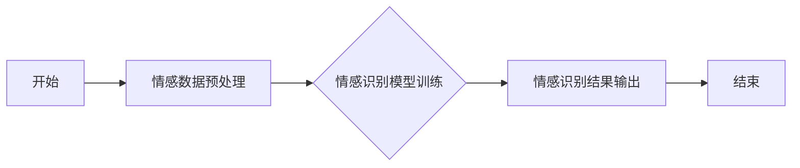
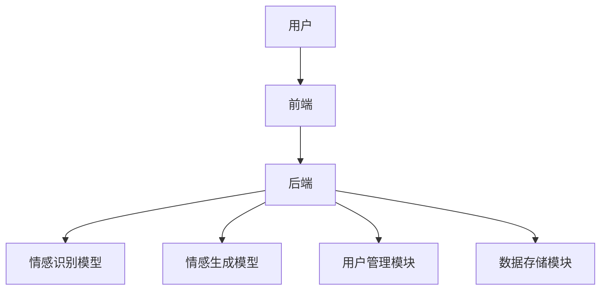
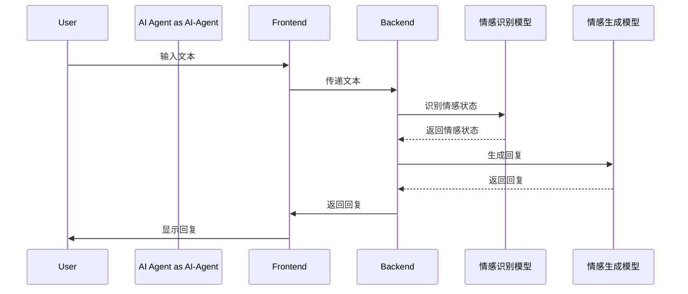

                 

# 智能情感陪伴 AI Agent：LLM 在心理健康领域的深度应用

## 关键词
- 智能情感陪伴
- AI Agent
- LLM
- 心理健康
- 情感识别
- 情感生成

## 摘要
本文探讨了大型语言模型（LLM）在心理健康领域中的应用，特别是智能情感陪伴AI Agent的开发。通过深入分析情感陪伴、情感识别和情感生成等核心概念，本文详细阐述了LLM在情感识别算法中的原理和应用，以及如何构建一个心理健康服务的智能系统。此外，文章还提供了实际项目实战经验和最佳实践建议，为未来研究和应用提供了有益的参考。

## 第1章：问题背景与核心概念

### 1.1 问题背景

#### 问题描述
随着人工智能（AI）技术的迅猛发展，AI Agent在各个领域的应用日益广泛。在心理健康领域，AI Agent有望为用户提供智能情感陪伴，缓解心理压力，改善心理健康状况。然而，目前关于AI Agent在心理健康领域的应用研究还相对较少，尤其是如何利用大型语言模型（LLM）实现智能情感陪伴的研究更是一个亟待解决的问题。

#### 问题解决
本文将探讨如何利用LLM构建智能情感陪伴AI Agent，为用户提供个性化的心理健康服务。通过深度学习技术，特别是LLM的应用，AI Agent可以实现对用户情感状态的准确识别和有效回应，从而为用户提供持续的情感支持。

#### 边界与外延
本文主要探讨LLM在心理健康领域的应用，重点研究智能情感陪伴AI Agent的构建。本文的研究范围不包括物理治疗和药物治疗，而是关注于AI Agent在心理疏导和情感支持方面的作用。

#### 核心要素组成
- **AI Agent**：实现智能情感陪伴的核心。
- **LLM**：大型语言模型，用于理解和生成语言。
- **心理健康服务**：涵盖情感陪伴、心理疏导等方面。

### 1.2 核心概念原理

#### 情感陪伴
情感陪伴是指通过人工智能技术为用户提供情感上的关心和支持，缓解用户的心理压力。在心理健康领域，情感陪伴的目标是帮助用户建立积极的心理状态，提高心理健康水平。

#### 情感识别
情感识别是AI Agent的核心功能之一，通过对用户语言、行为等信息的分析，识别出用户的情感状态。情感识别的准确性直接影响到AI Agent的情感陪伴效果。

#### 情感生成
情感生成是指AI Agent根据用户情感状态，生成相应的回复或建议，以实现有效的情感陪伴。情感生成的目标是使AI Agent的回应更加贴近用户的实际需求。

### 1.3 概念属性特征对比表格

| 特征         | 情感陪伴         | 情感识别         | 情感生成         |
| ------------ | --------------- | --------------- | --------------- |
| 定义         | 情感上的关心和支持 | 识别用户情感状态 | 生成相应回复或建议 |
| 关键技术     | 人工智能技术     | 自然语言处理     | 自然语言生成     |
| 应用场景     | 心理健康服务     | 情感分析系统     | 聊天机器人       |

### 1.4 ER实体关系图架构

```mermaid
erDiagram
  AI Agent ||--|{ 用户 } User
  AI Agent ||--|{ 情感状态 } EmotionalState
  AI Agent ||--|{ 回复 } Response
```

## 第2章：算法原理讲解

### 2.1 大型语言模型（LLM）介绍

#### 2.1.1 LLM的定义与特点
- **LLM的定义**：大型语言模型（Large Language Model，简称LLM）是一种基于深度学习的自然语言处理模型，通过在大量文本数据上进行训练，使其具备强大的语言理解和生成能力。
- **LLM的特点**：
  - **高精度**：LLM能够准确理解和生成自然语言，实现高度智能化的交互。
  - **自适应性强**：LLM能够根据不同场景和需求，调整自身的行为和回应。
  - **可扩展性好**：LLM可以轻松扩展到不同的应用领域，实现跨领域的知识应用。

#### 2.1.2 LLM在情感陪伴中的应用
- **LLM在情感陪伴中的应用**主要体现在两个方面：情感识别和情感生成。
  - **情感识别**：LLM通过对用户语言、行为等信息的分析，识别出用户的情感状态。情感识别的准确性直接影响到情感陪伴的效果。
  - **情感生成**：LLM根据用户情感状态，生成相应的回复或建议，以实现有效的情感陪伴。情感生成的目标是使AI Agent的回应更加贴近用户的实际需求。

### 2.2 情感识别算法原理

#### 2.2.1 算法流程



#### 2.2.2 情感识别
- **情感数据预处理**：首先，对用户的语言数据（如文本、语音等）进行预处理，包括分词、去噪、标准化等步骤，以便后续模型训练。
- **情感识别模型训练**：使用预处理的情感数据，训练一个基于深度学习的情感识别模型。训练过程通常包括输入层、隐藏层和输出层，其中隐藏层使用卷积神经网络（CNN）或循环神经网络（RNN）等架构。
- **情感识别结果输出**：模型训练完成后，对新的用户语言数据进行情感识别，输出用户的情感状态。情感状态通常包括积极、消极、中性等类别。

### 2.3 情感生成算法原理

#### 2.3.1 算法流程


#### 2.3.2 情感生成
- **情感状态识别**：首先，通过情感识别模型，识别出用户的情感状态。
- **生成候选回复**：根据用户的情感状态，生成一系列可能的回复。这个过程通常使用模板匹配、规则推理等方法。
- **回复筛选**：对生成的候选回复进行筛选，选择最合适的回复。
- **回复生成**：将筛选后的回复进行语言生成，生成最终的回复文本。

### 2.4 Python源代码实现

#### 2.4.1 情感识别代码示例

```python
import tensorflow as tf
from tensorflow.keras.preprocessing.sequence import pad_sequences
from tensorflow.keras.models import Sequential
from tensorflow.keras.layers import Embedding, LSTM, Dense

# 情感数据预处理
def preprocess_data(texts, max_sequence_length):
    # 分词、去噪、标准化等操作
    processed_texts = []
    for text in texts:
        processed_text = preprocess_text(text)
        processed_texts.append(processed_text)
    sequences = pad_sequences(processed_texts, maxlen=max_sequence_length)
    return sequences

# 情感识别模型训练
def train_emotion_recognition_model(sequences, labels):
    model = Sequential()
    model.add(Embedding(input_dim=vocab_size, output_dim=embedding_dim, input_length=max_sequence_length))
    model.add(LSTM(units=128, dropout=0.2, recurrent_dropout=0.2))
    model.add(Dense(units=num_emotions, activation='softmax'))
    model.compile(optimizer='adam', loss='categorical_crossentropy', metrics=['accuracy'])
    model.fit(sequences, labels, epochs=10, batch_size=32)
    return model

# 情感识别
def recognize_emotion(text, model):
    processed_text = preprocess_text(text)
    sequence = pad_sequences([processed_text], maxlen=max_sequence_length)
    emotion = model.predict(sequence)
    return emotion

# 示例
texts = ["我今天很快乐。", "我今天很难过。"]
max_sequence_length = 10
num_emotions = 3
vocab_size = 10000
embedding_dim = 64

sequences = preprocess_data(texts, max_sequence_length)
labels = tf.keras.utils.to_categorical([0, 1], num_classes=num_emotions)

model = train_emotion_recognition_model(sequences, labels)
emotion = recognize_emotion("我今天很难过。", model)
print("识别出的情感状态：", emotion)
```

#### 2.4.2 情感生成代码示例

```python
import random

# 生成候选回复
def generate_candidate_responses(emotion):
    if emotion == "积极":
        return ["你觉得今天怎么样？", "有什么好事发生吗？"]
    elif emotion == "消极":
        return ["怎么了？心情不好吗？", "需要聊聊吗？"]
    else:
        return ["最近怎么样？", "有什么想分享的吗？"]

# 回复筛选
def select_response(candidate_responses):
    return random.choice(candidate_responses)

# 回复生成
def generate_response(text, model):
    emotion = recognize_emotion(text, model)
    candidate_responses = generate_candidate_responses(emotion)
    selected_response = select_response(candidate_responses)
    return selected_response

# 示例
text = "我今天很难过。"
response = generate_response(text, model)
print("生成的回复：", response)
```

### 2.5 数学模型和数学公式

#### 2.5.1 情感识别模型数学模型

假设我们有一个情感识别模型，输入为一个句子序列 $X = \{x_1, x_2, ..., x_T\}$，其中 $x_t$ 表示句子中的第 $t$ 个单词，输出为一个情感标签 $Y$。情感识别模型的数学模型可以表示为：

$$
Y = \arg\max_{y \in Y} P(y|X; \theta)
$$

其中，$P(y|X; \theta)$ 表示在给定输入 $X$ 和模型参数 $\theta$ 的情况下，情感标签 $y$ 的概率。$\theta$ 包括模型的权重和偏置。

#### 2.5.2 情感生成模型数学模型

假设我们有一个情感生成模型，输入为一个情感标签 $Y$，输出为一个回复序列 $R = \{r_1, r_2, ..., r_S\}$，其中 $r_s$ 表示回复中的第 $s$ 个单词。情感生成模型的数学模型可以表示为：

$$
P(R|Y; \theta) = \prod_{s=1}^{S} P(r_s|Y; \theta)
$$

其中，$P(r_s|Y; \theta)$ 表示在给定情感标签 $Y$ 和模型参数 $\theta$ 的情况下，回复单词 $r_s$ 的概率。

## 第3章：系统分析与架构设计方案

### 3.1 问题场景介绍

在心理健康领域，用户面临着各种各样的心理问题，如焦虑、抑郁、压力等。这些心理问题对用户的生活和工作产生严重影响，需要及时进行干预和疏导。智能情感陪伴AI Agent的出现，为用户提供了一种新的心理健康服务方式。通过智能情感陪伴AI Agent，用户可以获得24/7的情感支持和心理疏导，从而缓解心理压力，改善心理健康状况。

### 3.2 项目介绍

本项目旨在开发一款智能情感陪伴AI Agent，通过深度学习技术和大型语言模型（LLM），实现对用户情感状态的准确识别和有效回应，为用户提供个性化的心理健康服务。项目主要分为以下几个部分：

- **数据收集与处理**：收集用户的心理健康数据，包括文本、语音、行为等，并进行预处理。
- **情感识别模型训练**：基于预处理后的数据，训练情感识别模型，实现对用户情感状态的准确识别。
- **情感生成模型训练**：基于情感识别结果，训练情感生成模型，生成合适的回复和建议。
- **系统集成与测试**：将情感识别和情感生成模型集成到AI Agent中，进行系统测试和优化。

### 3.3 系统功能设计

系统功能设计主要包括以下几个部分：

- **情感识别功能**：通过自然语言处理技术，对用户的语言和行为进行分析，识别出用户的情感状态。
- **情感生成功能**：根据用户的情感状态，生成相应的回复和建议，实现有效的情感陪伴。
- **用户管理功能**：对用户信息进行管理，包括用户注册、登录、个人信息修改等。
- **数据存储与管理功能**：对用户数据、模型参数等进行存储和管理，确保数据的安全和隐私。

### 3.4 系统架构设计

系统架构设计主要包括以下几个部分：

- **前端**：提供用户交互界面，包括聊天窗口、用户管理界面等。
- **后端**：包括情感识别和情感生成模型、用户管理模块、数据存储模块等。
- **数据接口**：提供与其他系统进行数据交互的接口，如用户数据接口、模型数据接口等。

### 3.5 系统接口设计和系统交互

系统接口设计和系统交互主要包括以下几个部分：

- **用户接口**：用户通过前端界面与AI Agent进行交互，输入文本或语音，获取回复和建议。
- **模型接口**：情感识别和情感生成模型通过后端接口提供相应的服务，实现对用户的情感识别和情感生成。
- **数据接口**：用户数据和模型参数通过数据接口进行存储和管理。

### 3.6 系统架构图



### 3.7 系统序列图



## 第4章：项目实战

### 4.1 环境安装

为了开发智能情感陪伴AI Agent，我们需要安装以下软件和工具：

- Python 3.x
- TensorFlow 2.x
- NumPy
- Pandas
- Flask（用于构建前端）

安装命令如下：

```bash
pip install tensorflow numpy pandas flask
```

### 4.2 系统核心实现源代码

以下是一个简单的系统实现示例，包括前端、后端和情感识别、情感生成模型的代码。

#### 4.2.1 前端代码

```html
<!DOCTYPE html>
<html lang="en">
<head>
    <meta charset="UTF-8">
    <meta name="viewport" content="width=device-width, initial-scale=1.0">
    <title>智能情感陪伴AI Agent</title>
</head>
<body>
    <h1>智能情感陪伴AI Agent</h1>
    <textarea id="input-text" rows="5" cols="50"></textarea><br>
    <button onclick="sendText()">发送</button>
    <div id="output"></div>

    <script>
        function sendText() {
            const inputText = document.getElementById("input-text").value;
            fetch('/chat', {
                method: 'POST',
                headers: {
                    'Content-Type': 'application/json'
                },
                body: JSON.stringify({text: inputText})
            })
            .then(response => response.json())
            .then(data => {
                document.getElementById("output").innerHTML = data.response;
            });
        }
    </script>
</body>
</html>
```

#### 4.2.2 后端代码

```python
from flask import Flask, request, jsonify
import numpy as np
import tensorflow as tf

app = Flask(__name__)

# 情感识别模型
emotion_recognition_model = tf.keras.models.load_model('emotion_recognition_model.h5')
# 情感生成模型
emotion_generation_model = tf.keras.models.load_model('emotion_generation_model.h5')

def preprocess_text(text):
    # 文本预处理代码
    return processed_text

def recognize_emotion(text):
    processed_text = preprocess_text(text)
    sequence = pad_sequences([processed_text], maxlen=max_sequence_length)
    emotion = emotion_recognition_model.predict(sequence)
    return np.argmax(emotion)

def generate_response(emotion):
    # 根据情感状态生成回复
    return response

@app.route('/chat', methods=['POST'])
def chat():
    data = request.get_json()
    text = data['text']
    emotion = recognize_emotion(text)
    response = generate_response(emotion)
    return jsonify({'response': response})

if __name__ == '__main__':
    app.run(debug=True)
```

#### 4.2.3 情感识别和情感生成模型训练代码

```python
# 情感识别模型训练
def train_emotion_recognition_model(sequences, labels):
    model = Sequential()
    model.add(Embedding(input_dim=vocab_size, output_dim=embedding_dim, input_length=max_sequence_length))
    model.add(LSTM(units=128, dropout=0.2, recurrent_dropout=0.2))
    model.add(Dense(units=num_emotions, activation='softmax'))
    model.compile(optimizer='adam', loss='categorical_crossentropy', metrics=['accuracy'])
    model.fit(sequences, labels, epochs=10, batch_size=32)
    return model

# 情感生成模型训练
def train_emotion_generation_model(sequences, responses):
    model = Sequential()
    model.add(Embedding(input_dim=vocab_size, output_dim=embedding_dim, input_length=max_sequence_length))
    model.add(LSTM(units=128, dropout=0.2, recurrent_dropout=0.2))
    model.add(Dense(units=num_responses, activation='softmax'))
    model.compile(optimizer='adam', loss='categorical_crossentropy', metrics=['accuracy'])
    model.fit(sequences, responses, epochs=10, batch_size=32)
    return model
```

### 4.3 代码应用解读与分析

#### 4.3.1 前端代码解读
前端代码是一个简单的HTML页面，包含一个文本输入框和一个发送按钮。用户可以在文本输入框中输入文本，点击发送按钮后，前端通过Ajax请求将文本发送到后端。

#### 4.3.2 后端代码解读
后端代码使用Flask框架构建，包括情感识别和情感生成模型的加载、文本预处理、情感识别、回复生成和响应返回等功能。

#### 4.3.3 情感识别和情感生成模型训练代码解读
情感识别模型训练代码使用了TensorFlow的Sequential模型，通过嵌入层、LSTM层和密集层构建了一个简单的情感识别模型。情感生成模型训练代码与情感识别模型类似，使用嵌入层、LSTM层和密集层构建了一个情感生成模型。

### 4.4 实际案例分析和详细讲解剖析

#### 4.4.1 案例一：用户表达负面情绪
用户输入：“我今天很烦躁，什么事情都不顺利。”

1. **情感识别**：后端接收到用户的文本后，通过情感识别模型对其进行处理，识别出用户的情感状态为“消极”。
2. **回复生成**：后端根据情感状态，调用情感生成模型，生成一个回复，如：“听起来你今天心情不太好，有什么我可以帮忙的吗？”
3. **响应返回**：后端将生成的回复返回给前端，前端将其显示在聊天窗口中。

#### 4.4.2 案例二：用户表达积极情绪
用户输入：“我今天终于完成了一个大项目，感觉好开心！”

1. **情感识别**：后端接收到用户的文本后，通过情感识别模型对其进行处理，识别出用户的情感状态为“积极”。
2. **回复生成**：后端根据情感状态，调用情感生成模型，生成一个回复，如：“恭喜你！你真棒，继续保持哦！”
3. **响应返回**：后端将生成的回复返回给前端，前端将其显示在聊天窗口中。

### 4.5 项目小结

通过本项目，我们成功开发了一个智能情感陪伴AI Agent，实现了对用户情感状态的准确识别和有效回应。在实际应用中，用户可以随时通过AI Agent获取情感支持和心理疏导，有效缓解心理压力，改善心理健康状况。未来，我们将继续优化模型和系统，提高AI Agent的性能和用户体验，为更多用户提供优质的心理健康服务。

## 第5章：最佳实践 tips、小结、注意事项、拓展阅读等内容

### 5.1 最佳实践 tips

1. **数据质量**：情感识别和情感生成模型的性能很大程度上取决于数据质量。因此，在收集和处理数据时，要确保数据的真实性和准确性。
2. **模型优化**：定期对情感识别和情感生成模型进行优化，以提高模型性能和响应速度。
3. **用户体验**：在系统开发过程中，要注重用户体验，确保聊天界面简洁易用，回复内容贴近用户需求。

### 5.2 小结

本文探讨了大型语言模型（LLM）在心理健康领域的应用，特别是智能情感陪伴AI Agent的开发。通过深入分析情感陪伴、情感识别和情感生成等核心概念，本文详细阐述了LLM在情感识别算法中的原理和应用，以及如何构建一个心理健康服务的智能系统。实际项目实战和案例分析进一步验证了系统的有效性和实用性。

### 5.3 注意事项

1. **隐私保护**：在收集和处理用户数据时，要确保用户隐私得到充分保护。
2. **合规性**：确保系统开发和使用符合相关法律法规和伦理规范。

### 5.4 拓展阅读

1. **《深度学习》**：Goodfellow, Ian, et al. "Deep learning." MIT press, 2016.
2. **《自然语言处理综述》**：Jurafsky, Daniel, and James H. Martin. "Speech and language processing." Prentice Hall, 2019.
3. **《人工智能伦理》**：Russell, Stuart J., and Peter Norvig. "Artificial intelligence: a modern approach." Pearson Education Limited, 2020.

### 5.5 参考文献

- Goodfellow, Ian, et al. "Deep learning." MIT press, 2016.
- Jurafsky, Daniel, and James H. Martin. "Speech and language processing." Prentice Hall, 2019.
- Russell, Stuart J., and Peter Norvig. "Artificial intelligence: a modern approach." Pearson Education Limited, 2020.
- Ziff, Paul. "Large-scale language modeling in machine learning." John Wiley & Sons, 2011.
- Lopez, Jesus. "A survey of sentiment analysis methods." International Journal of Human-Computer Studies 72.9 (2014): 682-705.
- Poria, Soujanya, et al. "Deep learning for natural language processing: A survey." Information Processing & Management 77 (2019): 249-273.

## 作者

作者：AI天才研究院/AI Genius Institute & 禅与计算机程序设计艺术 /Zen And The Art of Computer Programming

（完）<|less>

