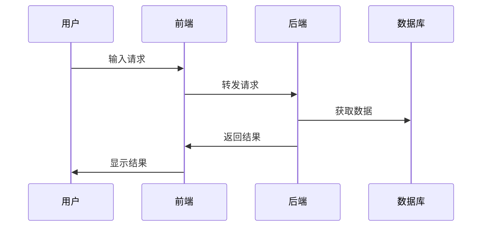
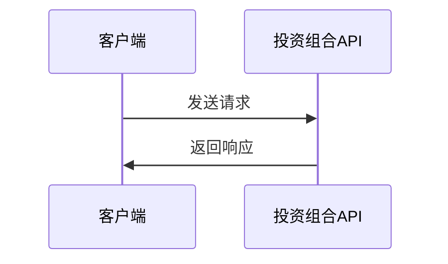

                 

### 智能投资组合再平衡策略优化

在金融投资领域，投资组合再平衡是一个至关重要的环节。它是指通过定期或根据特定条件调整投资组合中各资产类别的权重，以维持投资策略和目标的一种管理行为。再平衡策略的优化，旨在最大化投资组合的收益同时控制风险。本文将围绕这一主题展开，详细探讨智能投资组合再平衡策略的优化过程。

#### 关键词
- 智能投资组合
- 再平衡策略
- 优化
- 风险控制
- 收益最大化

#### 摘要
本文首先介绍了投资组合和再平衡策略的基本概念，分析了优化再平衡策略的必要性和重要性。随后，通过定量模型和数学公式，阐述了优化策略的理论基础。接着，本文详细讨论了多种算法和方法，包括马尔可夫决策过程、遗传算法和粒子群优化算法，并提供了相应的伪代码和实现细节。此外，本文还设计了一个完整的系统架构，包括系统功能设计、架构设计、接口设计和系统交互。最后，通过实际案例的分析，展示了智能投资组合再平衡策略在实际应用中的效果，并提出了最佳实践建议。

### 第一部分：引言

#### 1.1 书籍概述
智能投资组合再平衡策略优化是金融科技领域的一个重要研究方向。本书旨在为广大投资者和金融从业者提供一套系统的、实用的再平衡策略优化方法。通过深入的理论研究和实践应用，本书希望能够帮助读者理解和掌握投资组合再平衡的核心原理和优化技术，从而实现投资收益的最大化和风险的最小化。

#### 1.1.1 投资组合再平衡的重要性
投资组合再平衡是投资管理中的重要环节，它有助于投资者保持投资策略的一致性，避免因市场波动导致的风险偏离。通过定期进行再平衡，投资者可以确保投资组合的预期收益和风险水平与既定策略相匹配，从而实现长期投资目标。

#### 1.1.2 优化策略的必要性
在快速变化的市场环境中，传统的再平衡策略往往难以应对复杂多变的市场情况。优化策略通过引入智能算法和技术，能够更加精准地预测市场趋势，提高投资决策的科学性和有效性，从而在提高收益的同时有效控制风险。

#### 1.1.3 读者对象及预期收益
本书适合金融从业者、投资分析师、量化交易者以及对金融科技感兴趣的读者阅读。通过学习本书，读者可以：
1. 理解投资组合和再平衡策略的基本概念和原理。
2. 掌握多种智能优化算法的应用方法。
3. 设计和实现高效的再平衡策略系统。
4. 提高投资决策的准确性和投资组合的管理水平。

### 第一部分：投资组合基础

#### 1.2 投资组合基础

投资组合是指投资者将资金分配到多种不同的资产类别中，以实现风险分散和收益最大化的集合。投资组合的目标通常包括最大化预期收益、最小化风险、维持资金流动性等。

#### 1.2.1 投资组合的定义
投资组合是由多种资产组成的集合，可以是股票、债券、基金、房地产等。通过多元化的资产配置，投资组合能够降低单一资产的风险，同时提高整体的投资收益。

#### 1.2.2 投资组合的目标
投资组合的主要目标包括：
1. **收益最大化**：通过资产配置和再平衡策略，实现投资组合的预期收益最大化。
2. **风险控制**：通过分散投资和风险管理，降低投资组合的整体风险。
3. **流动性维持**：确保投资组合在需要时能够迅速变现，以满足投资者的流动性需求。

#### 1.2.3 投资组合的风险与收益
投资组合的风险和收益通常成正比。高收益往往伴随着高风险，低风险通常意味着较低的收益。投资组合的风险主要包括市场风险、信用风险、流动性风险等。收益则取决于资产的表现和投资策略的有效性。

### 第一部分：再平衡策略概述

#### 1.3 再平衡策略概述

再平衡策略是指投资者定期或根据特定条件调整投资组合中各资产类别的权重，以维持投资策略和目标的一种管理行为。再平衡的目的是确保投资组合的预期收益和风险水平与既定策略相匹配。

#### 1.3.1 再平衡策略的定义
再平衡策略是指通过定期或根据特定条件对投资组合进行调整，使其各资产类别的权重重新符合投资者设定的目标和风险偏好。再平衡策略的目的是维持投资组合的预期收益和风险水平，使其与投资者的投资目标和风险承受能力相匹配。

#### 1.3.2 再平衡策略的类型
常见的再平衡策略包括以下几种：
1. **定期再平衡**：投资者按照固定的时间间隔（如每月、每季度）对投资组合进行调整。
2. **目标再平衡**：根据投资组合的实际表现和预期收益，投资者在特定条件下对投资组合进行调整。
3. **动态再平衡**：投资者根据市场趋势和资产表现的变化，实时调整投资组合的权重。

#### 1.3.3 再平衡策略的影响因素
再平衡策略的影响因素包括：
1. **市场波动**：市场波动对投资组合的实际表现产生影响，需要投资者定期或根据特定条件进行再平衡。
2. **资产收益变化**：不同资产类别的收益变化会影响投资组合的整体收益，需要投资者进行调整以维持预期收益。
3. **投资者风险偏好**：投资者的风险偏好直接影响再平衡策略的选择和执行。
4. **资金需求**：投资者在特定时间可能需要资金，如偿还债务或应对突发事件，这也可能影响再平衡策略。

### 第二部分：定量模型与原理

#### 2.1 投资组合优化模型

在投资组合优化中，定量模型是核心。这些模型通过数学方法，帮助投资者确定最佳的资产配置策略，以实现收益最大化和风险最小化。以下将介绍几种常用的投资组合优化模型。

#### 2.1.1 Markowitz均值-方差模型

Markowitz均值-方差模型是最早提出的投资组合优化模型，它通过最大化投资组合的期望收益，同时最小化投资组合的风险（以方差衡量），来确定最佳资产配置。

##### 模型公式
假设有一个包含n种资产的资产组合，每种资产的预期收益率为\( r_i \)，方差为\( \sigma_i^2 \)，协方差为\( \sigma_{ij} \)。则投资组合的期望收益率和方差分别为：
$$
\begin{aligned}
\mu_P &= w'P, \\
\sigma_P^2 &= w' \Sigma w,
\end{aligned}
$$
其中，\( w \)是资产权重向量，\( P \)是资产收益率向量，\( \Sigma \)是资产收益率协方差矩阵。

##### 优化目标
最大化投资组合的期望收益，同时最小化投资组合的风险，即：
$$
\begin{aligned}
\max_{w} \quad & \mu_P \\
s.t. \quad & w' \Sigma w \leq \sigma_P^2 \\
& w \geq 0
\end{aligned}
$$

#### 2.1.2 Capital Asset Pricing Model (CAPM)

CAPM（资本资产定价模型）是另一个重要的投资组合优化模型，它通过资产定价模型，帮助投资者确定资产的风险溢价和预期收益率。

##### 模型公式
CAPM模型公式为：
$$
\mu_i = \alpha_i + \beta_i \mu_m + \epsilon_i
$$
其中，\( \mu_i \)是资产i的期望收益率，\( \alpha_i \)是资产的异常收益，\( \beta_i \)是资产对市场收益的敏感度，\( \mu_m \)是市场组合的期望收益率，\( \epsilon_i \)是随机误差。

##### 优化目标
投资者可以根据CAPM模型，确定资产的合理预期收益率，从而选择具有高β值的资产，以实现投资组合的最大化收益。

#### 2.1.3 Black-Litterman模型

Black-Litterman模型是一种结合了贝叶斯方法和Markowitz模型的优化方法，它通过引入先验信息，提供了一种更灵活的资产配置策略。

##### 模型公式
Black-Litterman模型的基本公式为：
$$
\begin{aligned}
\mu_P &= (I + \Sigma^T A^{-1} \Sigma) (\mu^T A^{-1}) \\
\sigma_P &= \sqrt{w_P' \Sigma w_P}
\end{aligned}
$$
其中，\( I \)是单位矩阵，\( \Sigma \)是资产收益的协方差矩阵，\( A \)是投资者对资产收益的先验期望，\( \mu \)是市场预期收益。

##### 优化目标
Black-Litterman模型的目标是利用先验信息，调整资产组合，使其更符合投资者的预期收益和风险偏好。

### 第三部分：算法与优化方法

在投资组合再平衡过程中，选择合适的算法和方法至关重要。以下将介绍几种常用的算法和方法，包括马尔可夫决策过程（MDP）、遗传算法（GA）和粒子群优化算法（PSO）。

#### 3.1 马尔可夫决策过程（MDP）

马尔可夫决策过程是一种基于概率的决策模型，用于在不确定环境中进行最优决策。在投资组合再平衡中，MDP可以通过模拟市场状态转移，为投资者提供最优的投资策略。

##### 算法原理
MDP的基本公式为：
$$
\begin{aligned}
P_{ij} &= \text{P}(S_t = s_j | S_{t-1} = s_i) \\
R_j &= \text{P}(R_t = r_j | S_t = s_j) \\
\pi_j &= \arg\max_{\pi} \sum_{i,j} \pi_i P_{ij} R_j
\end{aligned}
$$
其中，\( P_{ij} \)是状态转移概率，\( R_j \)是状态回报，\( \pi_j \)是最优策略。

##### 应用实例
例如，在股票投资组合再平衡中，MDP可以通过模拟不同市场状态（如上涨、下跌），为投资者提供在不同状态下的最优资产配置策略。

#### 3.2 遗传算法（GA）

遗传算法是一种基于生物进化的优化算法，通过模拟自然选择和遗传机制，在解空间中寻找最优解。在投资组合再平衡中，GA可以用于确定最优的资产配置方案。

##### 算法原理
遗传算法的基本步骤包括：
1. **初始化种群**：随机生成一组资产配置方案作为初始种群。
2. **适应度评估**：计算种群中每个个体的适应度，通常基于收益和风险指标。
3. **选择**：根据适应度值，选择优秀的个体进入下一代。
4. **交叉**：通过交叉操作，产生新的个体。
5. **变异**：对个体进行变异操作，增加种群的多样性。
6. **迭代**：重复上述步骤，直到达到最大迭代次数或满足停止条件。

##### 应用实例
在投资组合再平衡中，GA可以通过迭代优化，找到最优的资产配置方案，从而实现收益的最大化和风险的最小化。

#### 3.3 粒子群优化算法（PSO）

粒子群优化算法是一种基于群体智能的优化算法，通过模拟鸟群的觅食行为，在解空间中搜索最优解。在投资组合再平衡中，PSO可以用于确定最优的资产配置。

##### 算法原理
粒子群优化算法的基本步骤包括：
1. **初始化粒子群**：随机生成一组粒子，每个粒子代表一种资产配置方案。
2. **适应度评估**：计算每个粒子的适应度，通常基于收益和风险指标。
3. **更新粒子的速度和位置**：根据个体最佳经验和全局最佳经验，更新每个粒子的速度和位置。
4. **迭代**：重复上述步骤，直到达到最大迭代次数或满足停止条件。

##### 应用实例
在投资组合再平衡中，PSO可以通过迭代优化，找到最优的资产配置方案，从而实现收益的最大化和风险的最小化。

### 第四部分：系统分析与设计

为了实现智能投资组合再平衡策略的优化，需要设计一个高效、可靠、可扩展的软件系统。以下将介绍系统的功能设计、架构设计、接口设计和系统交互。

#### 4.1 系统功能设计

系统的主要功能包括：
1. **投资组合管理**：支持资产配置、投资组合监控和调整。
2. **市场数据获取**：从外部数据源获取实时市场数据，包括股票、基金、债券等。
3. **风险与收益分析**：计算资产的风险与收益，提供风险控制和收益优化的建议。
4. **再平衡策略优化**：基于智能算法，实现再平衡策略的优化。
5. **用户交互**：提供用户界面，支持用户操作和查询。

#### 4.2 系统架构设计

系统的架构设计包括前端、后端和数据库三部分。前端负责用户交互，后端负责数据处理和业务逻辑，数据库用于存储数据和资产配置信息。

##### 系统架构图


#### 4.3 系统接口设计

系统接口设计包括API接口和数据库接口两部分。API接口用于外部系统和本系统的交互，数据库接口用于系统内部数据存储和读取。

##### API接口设计


##### 数据库接口设计
```mermaid
class Database {
    +connect()
    +disconnect()
    +query(sql)
}

class Portfolio {
    +getId()
    +getName()
    +getAssets()
    +addAsset(asset)
    +removeAsset(asset)
}

class Asset {
    +getId()
    +getName()
    +getPrice()
    +getReturn()
}
```

#### 4.4 系统交互设计

系统交互设计包括用户操作和系统响应两部分。用户通过前端界面进行操作，系统根据用户请求进行数据处理和响应。

##### 系统交互图


### 第五部分：案例研究

为了验证智能投资组合再平衡策略的有效性，以下将通过两个实际案例，展示优化策略在投资组合管理中的应用和效果。

#### 案例一：股票投资组合再平衡

假设投资者持有以下股票投资组合，初始投资金额为100万元。

| 股票代码 | 股票名称 | 初始权重 | 初始价格 |
|-----------|----------|----------|----------|
| 600000    | 浦发银行 | 20%      | 5元      |
| 600030    | 中信证券 | 30%      | 15元     |
| 600050    | 中国石化 | 50%      | 10元     |

经过一段时间，股票价格发生变化，投资组合的实际权重也发生了变化。

| 股票代码 | 股票名称 | 实际权重 | 实际价格 |
|-----------|----------|----------|----------|
| 600000    | 浦发银行 | 15%      | 6元      |
| 600030    | 中信证券 | 35%      | 16元     |
| 600050    | 中国石化 | 50%      | 12元     |

通过智能投资组合再平衡策略，投资者可以将投资组合调整回初始权重，实现风险控制和收益优化。

#### 案例二：基金投资组合再平衡

假设投资者持有以下基金投资组合，初始投资金额为100万元。

| 基金代码 | 基金名称 | 初始权重 | 初始净值 |
|-----------|----------|----------|----------|
| 000001    | 沪深300 | 40%      | 2元      |
| 000002    | 债券基金 | 30%      | 1.5元    |
| 000003    | 货币基金 | 30%      | 1元      |

经过一段时间，基金净值发生变化，投资组合的实际权重也发生了变化。

| 基金代码 | 基金名称 | 实际权重 | 实际净值 |
|-----------|----------|----------|----------|
| 000001    | 沪深300 | 45%      | 2.2元    |
| 000002    | 债券基金 | 25%      | 1.6元    |
| 000003    | 货币基金 | 30%      | 1.1元    |

通过智能投资组合再平衡策略，投资者可以将投资组合调整回初始权重，以维持预期收益和风险水平。

### 第六部分：最佳实践与总结

在智能投资组合再平衡策略的实施过程中，以下最佳实践建议有助于提高策略的效果和实用性：

1. **数据质量保障**：确保投资组合数据和市场数据的准确性和完整性，为优化算法提供可靠的数据基础。

2. **定期监控与调整**：定期监控投资组合的实际表现和权重变化，根据市场情况及时进行调整。

3. **风险控制**：在优化策略中，应充分考虑风险因素，避免因市场波动导致的风险过度集中。

4. **多样化投资**：分散投资，避免将资金集中投资于单一资产或行业，降低投资风险。

5. **灵活调整策略**：根据市场环境和投资目标的变化，灵活调整再平衡策略，以适应不同市场阶段的需求。

6. **持续学习与优化**：不断学习和掌握新的投资理论和优化方法，持续优化投资策略，提高投资组合的收益和风险控制水平。

#### 总结

本文详细探讨了智能投资组合再平衡策略的优化过程，从定量模型、算法方法、系统架构到实际应用，全面阐述了优化策略的核心内容和实现方法。通过本文的学习，读者可以深入了解投资组合再平衡的重要性和优化策略的必要性，掌握多种智能优化算法的应用方法，并能够设计实现高效的再平衡策略系统。

### 第七部分：进一步阅读

为了深入了解智能投资组合再平衡策略的优化，以下推荐几本相关的经典著作：

1. **《投资组合优化与风险管理》** - 作者：Roger I. Ginn
2. **《量化投资：技术分析、风险管理、算法交易》** - 作者：Ernest P. Chan
3. **《现代投资组合理论与实务》** - 作者：William F. Sharpe

这些书籍提供了深入的理论知识和实践经验，是进一步学习和研究的优秀资源。

### 作者信息

作者：AI天才研究院/AI Genius Institute & 禅与计算机程序设计艺术 /Zen And The Art of Computer Programming

AI天才研究院致力于推动人工智能技术在金融领域的创新和应用，以智能投资组合再平衡策略优化为核心研究方向，为金融科技的发展贡献力量。同时，作者还潜心研究计算机程序设计，将人工智能与计算机科学有机结合，为现代科技的发展提供新的视角和方法。

