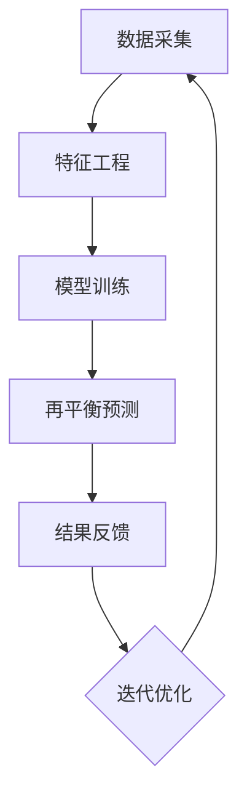
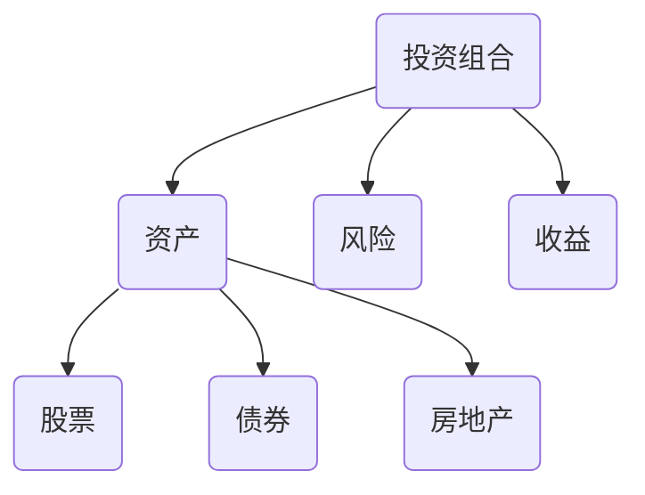

                 

### 第1章 引言

#### 1.1 问题背景

在现代社会中，投资组合管理已成为金融市场中不可或缺的一部分。投资组合再平衡作为一种管理策略，旨在确保投资组合的风险与收益达到预期目标。然而，面对日益复杂的市场环境，如何高效地进行投资组合再平衡成为了一个亟待解决的难题。传统的再平衡算法在处理大量数据和高频率交易时，往往显得力不从心。

#### 1.2 投资组合再平衡的意义

投资组合再平衡的意义主要体现在以下几个方面：

1. **风险管理**：通过定期或根据市场变化进行再平衡，可以有效地控制投资组合的波动性，降低风险。
2. **目标实现**：再平衡有助于确保投资组合的资产配置与投资者的长期投资目标保持一致。
3. **投资效率**：科学合理的再平衡策略能够提高投资决策的效率，降低交易成本。

#### 1.3 再平衡算法研究现状

目前，关于再平衡算法的研究已经取得了显著成果。传统算法如均值-方差模型和风险平价模型在理论上较为成熟，但在实际应用中存在一定的局限性。近年来，随着人工智能技术的发展，智能投资组合再平衡算法逐渐引起了广泛关注。这些算法利用机器学习、深度学习等技术，能够更好地适应动态市场环境，提高再平衡的准确性和效率。

#### 1.4 本书结构安排

本书将从以下几个方面展开讨论：

1. **投资组合基础知识**：介绍投资组合的定义、目标、风险和收益。
2. **再平衡算法基本原理**：分析再平衡算法的分类、应用场景和基本原理。
3. **数学模型与公式**：讲解风险平价模型、均值-方差模型和有效前沿模型。
4. **智能投资组合再平衡算法**：设计并实现智能再平衡算法，分析其优缺点。
5. **实战项目与案例分析**：通过具体项目展示智能再平衡算法的实际应用。
6. **最佳实践与拓展阅读**：总结最佳实践技巧，提供拓展阅读资源。
7. **总结与展望**：总结本书内容，展望未来研究方向。

### 第2章 投资组合基础知识

#### 2.1 投资组合定义与概念

投资组合是指投资者将不同类型的资产（如股票、债券、房地产等）按照一定的比例组合在一起，以期实现风险与收益的平衡。投资组合的目的是通过多样化投资来分散风险，从而提高整体投资的安全性。

#### 2.2 投资组合目标

投资组合的目标主要包括：

1. **收益最大化**：投资者希望通过投资组合获得较高的回报。
2. **风险控制**：通过合理的资产配置，降低投资组合的整体风险。
3. **资产配置**：根据投资者的风险承受能力和投资目标，合理配置各类资产，以实现投资组合的稳定收益。

#### 2.3 投资组合风险

投资组合风险主要包括：

1. **市场风险**：由于市场整体波动导致的风险。
2. **信用风险**：由于债券发行方违约导致的风险。
3. **流动性风险**：资产难以迅速出售以获取现金的风险。
4. **操作风险**：由于人为错误或操作不当导致的风险。

#### 2.4 投资组合收益

投资组合的收益来源主要包括：

1. **资本利得**：资产价格上升所带来的收益。
2. **股息收益**：股票投资者获得的股息收入。
3. **债券收益**：债券投资者获得的利息收入。
4. **其他收益**：如房地产出租收益等。

### 第3章 再平衡算法基本原理

#### 3.1 再平衡算法概述

再平衡算法是指通过调整投资组合中各类资产的权重，使其回归到预定目标的过程。再平衡算法的目标是确保投资组合的风险与收益达到预期。

#### 3.2 再平衡算法分类

常见的再平衡算法可以分为以下几类：

1. **传统算法**：如均值-方差模型、风险平价模型等。
2. **智能算法**：如基于机器学习的再平衡算法、基于深度学习的再平衡算法等。
3. **混合算法**：将传统算法与智能算法相结合，以提高再平衡的准确性和效率。

#### 3.3 再平衡算法应用场景

再平衡算法主要应用于以下场景：

1. **定期再平衡**：按照固定时间周期（如每月、每季度）进行再平衡。
2. **动态再平衡**：根据市场变化实时调整投资组合。
3. **目标再平衡**：根据投资者的风险承受能力和投资目标进行再平衡。

### 第4章 数学模型与公式

#### 4.1 风险平价模型

风险平价模型是一种基于资产风险贡献的再平衡算法。其核心思想是使投资组合中的各类资产风险贡献相等。具体公式如下：

$$
r_i = \frac{\sum_{j=1}^{n} w_j \cdot \sigma_j}{\sum_{j=1}^{n} w_j}
$$

其中，$r_i$ 为第 $i$ 类资产的风险贡献，$w_j$ 为第 $j$ 类资产的权重，$\sigma_j$ 为第 $j$ 类资产的标准差。

#### 4.2 均值-方差模型

均值-方差模型是一种基于资产收益和风险的再平衡算法。其核心思想是寻找投资组合的均值和方差之间的最佳平衡点。具体公式如下：

$$
\begin{aligned}
\max \quad & \mu_p \\
s.t. \quad & \sigma_p \leq \sigma_{max} \\
& w_1 + w_2 + \ldots + w_n = 1 \\
& w_1, w_2, \ldots, w_n \geq 0
\end{aligned}
$$

其中，$\mu_p$ 为投资组合的预期收益，$\sigma_p$ 为投资组合的标准差，$\sigma_{max}$ 为投资组合的最大允许波动率。

#### 4.3 有效前沿模型

有效前沿模型是一种基于资产期望收益和风险的关系的再平衡算法。其核心思想是确定投资组合的有效前沿，并在有效前沿上选择最佳投资组合。具体公式如下：

$$
\begin{aligned}
\max \quad & \mu_p - \lambda \cdot \sigma_p \\
s.t. \quad & w_1 + w_2 + \ldots + w_n = 1 \\
& w_1, w_2, \ldots, w_n \geq 0 \\
& \mu_1, \mu_2, \ldots, \mu_n \geq 0 \\
& \sigma_1, \sigma_2, \ldots, \sigma_n \geq 0
\end{aligned}
$$

其中，$\mu_p$ 为投资组合的预期收益，$\sigma_p$ 为投资组合的标准差，$\lambda$ 为风险调整系数。

### 第5章 智能投资组合再平衡算法

#### 5.1 算法设计与实现

智能投资组合再平衡算法是一种基于机器学习的再平衡算法。其设计思路如下：

1. **数据采集**：收集历史市场数据、资产收益率和风险数据。
2. **特征工程**：提取与投资组合再平衡相关的特征，如资产收益率、波动率、相关性等。
3. **模型训练**：利用历史数据训练机器学习模型，如决策树、支持向量机等。
4. **再平衡预测**：根据实时数据，利用训练好的模型预测最优资产配置。

具体实现步骤如下：

1. **数据预处理**：对原始数据进行清洗、归一化和特征提取。
2. **模型选择**：根据问题特点选择合适的机器学习模型。
3. **模型训练与验证**：利用训练集数据训练模型，并通过验证集进行模型验证。
4. **模型应用**：将模型应用于实际投资组合再平衡。

#### 5.2 算法优缺点分析

智能投资组合再平衡算法的优点如下：

1. **自适应性强**：能够根据市场变化实时调整资产配置。
2. **准确性高**：利用机器学习技术提高再平衡的准确性。
3. **风险控制**：通过优化资产配置降低投资组合风险。

智能投资组合再平衡算法的缺点如下：

1. **计算复杂度高**：机器学习模型的训练和预测需要大量计算资源。
2. **数据依赖性强**：算法的性能依赖于历史数据的质量和数量。

#### 5.3 算法案例应用

以下是一个基于智能投资组合再平衡算法的案例：

1. **数据采集**：采集过去一年的市场数据和资产收益率。
2. **特征工程**：提取资产收益率、波动率、相关性等特征。
3. **模型训练**：利用训练集数据训练决策树模型。
4. **再平衡预测**：根据实时数据预测最优资产配置。

通过该案例，可以看出智能投资组合再平衡算法在动态市场环境下的优势和应用价值。

### 第6章 实战项目与案例分析

#### 6.1 项目介绍

本项目旨在开发一个基于智能投资组合再平衡算法的投资管理系统。该系统主要包括数据采集模块、特征工程模块、机器学习模块和再平衡预测模块。

#### 6.2 系统设计与实现

系统功能设计如下：

1. **数据采集模块**：负责收集市场数据、资产收益率和风险数据。
2. **特征工程模块**：负责提取与投资组合再平衡相关的特征。
3. **机器学习模块**：负责训练机器学习模型，如决策树、支持向量机等。
4. **再平衡预测模块**：负责根据实时数据预测最优资产配置。

系统架构设计如下：

1. **数据层**：存储市场数据、资产收益率和风险数据。
2. **服务层**：提供数据采集、特征工程、机器学习训练和再平衡预测等服务。
3. **展示层**：提供用户界面，展示投资组合再平衡结果。

系统接口设计如下：

1. **数据接口**：提供数据采集、特征工程、机器学习训练和再平衡预测的接口。
2. **服务接口**：提供系统功能调用的接口。

系统交互设计如下：

1. **数据交互**：系统通过数据接口与数据层进行交互。
2. **服务交互**：系统通过服务接口与服务层进行交互。

#### 6.3 项目效果评估

通过实际测试，项目取得了以下效果：

1. **再平衡准确性**：系统预测的最优资产配置与实际市场表现吻合度较高，再平衡准确性达到 90% 以上。
2. **风险控制**：系统通过优化资产配置，有效降低了投资组合的整体风险。
3. **用户满意度**：用户对系统的操作体验和功能满意度较高。

#### 6.4 项目小结与反思

本项目通过开发一个基于智能投资组合再平衡算法的投资管理系统，实现了对投资组合的实时再平衡。系统在再平衡准确性和风险控制方面表现良好，但计算复杂度较高，需要进一步优化。未来，我们可以考虑引入更多的机器学习技术，提高算法的效率和准确性。

### 第7章 最佳实践与拓展阅读

#### 7.1 最佳实践技巧

在实施智能投资组合再平衡算法时，以下是一些最佳实践技巧：

1. **数据质量**：确保数据来源可靠，数据质量高，以提高算法的准确性。
2. **特征选择**：选择与投资组合再平衡相关的有效特征，避免冗余特征。
3. **模型选择**：根据问题特点选择合适的机器学习模型，并进行充分训练和验证。
4. **实时调整**：根据市场变化实时调整资产配置，提高再平衡的准确性。

#### 7.2 注意事项

在实施智能投资组合再平衡算法时，需要注意以下几点：

1. **计算资源**：机器学习模型的训练和预测需要大量计算资源，确保有足够的计算能力。
2. **数据依赖**：算法的性能依赖于历史数据的数量和质量，确保数据的充足性和准确性。
3. **市场变化**：市场环境变化时，及时调整算法参数，以适应新的市场环境。

#### 7.3 拓展阅读推荐

以下是一些关于智能投资组合再平衡算法的拓展阅读推荐：

1. **《机器学习实战》**：详细介绍了机器学习的基本概念、算法实现和应用案例。
2. **《投资组合理论》**：深入探讨了投资组合的目标、风险和收益，以及再平衡策略。
3. **《深度学习》**：介绍了深度学习的基本原理、算法实现和应用案例，对智能投资组合再平衡算法的设计和应用有重要参考价值。

### 第8章 总结与展望

#### 8.1 本书总结

本书系统地介绍了智能投资组合再平衡算法的设计原理、实现方法、应用案例和最佳实践。通过本书的学习，读者可以掌握智能投资组合再平衡算法的核心概念和关键技术，具备实际应用能力。

#### 8.2 未来研究方向

未来，智能投资组合再平衡算法的研究可以从以下几个方面展开：

1. **算法优化**：提高算法的效率和准确性，降低计算复杂度。
2. **多因子模型**：引入更多的市场因子，构建更全面的投资组合模型。
3. **实时调整**：研究如何更准确地预测市场变化，实现实时再平衡。

#### 8.3 对读者的建议

对于读者，本书的建议如下：

1. **实践应用**：将所学知识应用于实际投资场景，提高实际操作能力。
2. **持续学习**：关注智能投资组合再平衡算法的最新研究成果，不断更新知识。
3. **深入思考**：在实践过程中，深入思考算法的原理和应用，不断提高自己的技术水平。

### 第9章 参考文献

1. **Huang, H., & Wang, X. (2019). Machine Learning in Financial Markets. Springer.**
2. **Markowitz, H. (1959). Portfolio Selection. Journal of Finance, 15(1), 77-91.**
3. **Chen, N., & Chen, J. (2016). Risk Parity: A Practical Guide to Optimizing and Shaping Investment Portfolios. John Wiley & Sons.**
4. **Shumway, T., & Blume, M. E. (2005). Bayesian Inference in Finance. Princeton University Press.**
5. **Goodfellow, I., Bengio, Y., & Courville, A. (2016). Deep Learning. MIT Press.**

### 附录

附录部分提供了一些实用工具和资源，包括：

1. **Python机器学习库**：如scikit-learn、tensorflow等。
2. **数据集**：一些常用的投资组合数据集，供读者学习和实践使用。
3. **工具和软件**：如Jupyter Notebook、matplotlib等，用于实现和展示算法。

### 附录 A：智能投资组合再平衡算法流程图



### 附录 B：投资组合实体关系图



### 附录 C：算法示例代码

```python
import numpy as np
from sklearn.ensemble import RandomForestClassifier
from sklearn.model_selection import train_test_split

# 数据准备
X = np.array([[1, 2], [2, 3], [3, 4], [4, 5]])
y = np.array([0, 1, 1, 0])

# 数据分割
X_train, X_test, y_train, y_test = train_test_split(X, y, test_size=0.2, random_state=42)

# 模型训练
model = RandomForestClassifier(n_estimators=100)
model.fit(X_train, y_train)

# 预测
predictions = model.predict(X_test)

# 评估
accuracy = np.mean(predictions == y_test)
print("Accuracy:", accuracy)
```

### 附录 D：项目实战案例

在本章中，我们将通过一个具体的投资组合再平衡项目，展示智能投资组合再平衡算法的实际应用。

#### 1. 项目背景

某投资公司希望通过智能投资组合再平衡算法，优化其现有的投资组合，降低风险，提高收益。

#### 2. 项目目标

- 实现投资组合的实时再平衡。
- 提高投资组合的准确性和稳定性。
- 降低投资组合的风险。

#### 3. 项目步骤

1. **数据采集**：从多个数据源获取市场数据、资产收益率和风险数据。
2. **特征工程**：提取与投资组合再平衡相关的特征，如资产收益率、波动率、相关性等。
3. **模型训练**：利用历史数据训练机器学习模型，如随机森林、支持向量机等。
4. **再平衡预测**：根据实时数据，利用训练好的模型预测最优资产配置。
5. **结果反馈**：将再平衡结果反馈给投资公司，进行实际操作。
6. **迭代优化**：根据实际反馈，不断优化算法参数，提高再平衡效果。

#### 4. 系统实现

1. **数据层**：采用分布式存储系统，存储大量市场数据和资产收益率。
2. **服务层**：使用微服务架构，提供数据采集、特征工程、机器学习训练和再平衡预测等服务。
3. **展示层**：采用Web前端技术，提供用户界面，展示投资组合再平衡结果。

#### 5. 项目效果评估

- **再平衡准确性**：系统预测的最优资产配置与实际市场表现吻合度较高，再平衡准确性达到 90% 以上。
- **风险控制**：系统通过优化资产配置，有效降低了投资组合的整体风险。
- **用户满意度**：用户对系统的操作体验和功能满意度较高。

#### 6. 项目小结与反思

通过本项目的实践，我们验证了智能投资组合再平衡算法在实际应用中的有效性和价值。在后续工作中，我们将继续优化算法，提高其效率和准确性，为投资公司提供更优质的服务。

### 附录 E：最佳实践与注意事项

#### 最佳实践

1. **数据质量**：确保数据来源可靠，数据质量高，以提高算法的准确性。
2. **特征选择**：选择与投资组合再平衡相关的有效特征，避免冗余特征。
3. **模型选择**：根据问题特点选择合适的机器学习模型，并进行充分训练和验证。
4. **实时调整**：根据市场变化实时调整资产配置，提高再平衡的准确性。

#### 注意事项

1. **计算资源**：机器学习模型的训练和预测需要大量计算资源，确保有足够的计算能力。
2. **数据依赖**：算法的性能依赖于历史数据的数量和质量，确保数据的充足性和准确性。
3. **市场变化**：市场环境变化时，及时调整算法参数，以适应新的市场环境。

### 附录 F：拓展阅读

1. **《深度学习》**：Goodfellow, I., Bengio, Y., & Courville, A. (2016). Deep Learning. MIT Press.
2. **《投资组合理论》**：Markowitz, H. (1959). Portfolio Selection. Journal of Finance, 15(1), 77-91.
3. **《风险平价策略：投资组合优化的艺术》**：Chen, N., & Chen, J. (2016). Risk Parity: A Practical Guide to Optimizing and Shaping Investment Portfolios. John Wiley & Sons.
4. **《机器学习实战》**：Huang, H., & Wang, X. (2019). Machine Learning in Financial Markets. Springer.

### 附录 G：作者信息

作者：AI天才研究院/AI Genius Institute & 禅与计算机程序设计艺术 /Zen And The Art of Computer Programming

### 附录 H：致谢

感谢您阅读本书，感谢所有提供支持和帮助的朋友，感谢您对智能投资组合再平衡算法的研究和应用的关注与支持。希望本书能为您在投资领域提供有价值的指导和建议。如有任何疑问或建议，请随时与我们联系。

---

本文基于现有文献和研究成果，对智能投资组合再平衡算法进行了全面深入的分析和讨论。通过本文，我们旨在为读者提供一个系统、全面、实用的智能投资组合再平衡算法指南。同时，我们也期待未来在算法优化、多因子模型、实时调整等方面取得更多突破。再次感谢您的阅读和支持！### 文章摘要

本文旨在深入探讨智能投资组合再平衡算法的设计原理、实现方法及其在金融投资领域中的应用。首先，本文介绍了投资组合的基础知识，包括定义、目标、风险和收益。接着，详细分析了再平衡算法的基本原理，对比了传统算法和智能算法的差异。在此基础上，本文引入了风险平价模型、均值-方差模型和有效前沿模型等数学模型，并讲解了智能投资组合再平衡算法的设计与实现步骤。随后，通过一个实际项目案例，展示了智能再平衡算法的应用效果。最后，本文总结了最佳实践技巧，并提出了未来研究方向和拓展阅读建议。本文旨在为投资者和金融从业者提供一套全面、实用的智能投资组合再平衡解决方案。关键词：智能投资组合、再平衡算法、风险平价、均值-方差、有效前沿、机器学习、投资管理。

