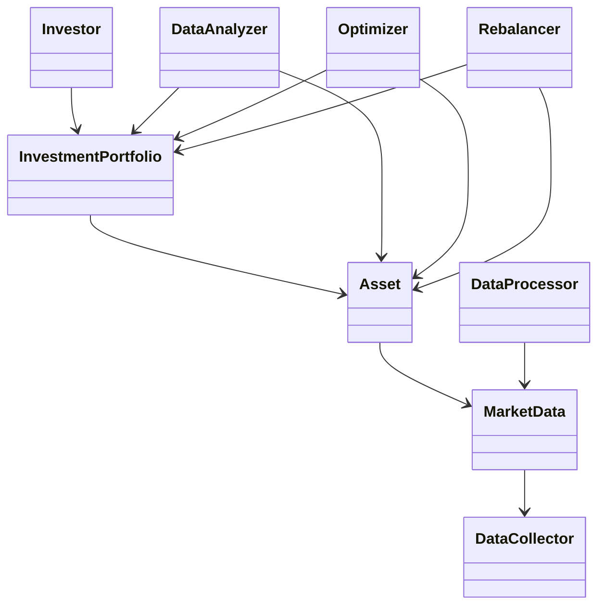
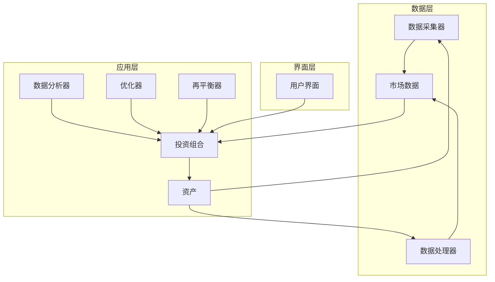
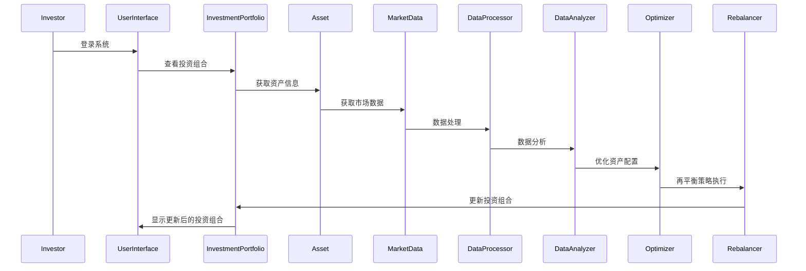
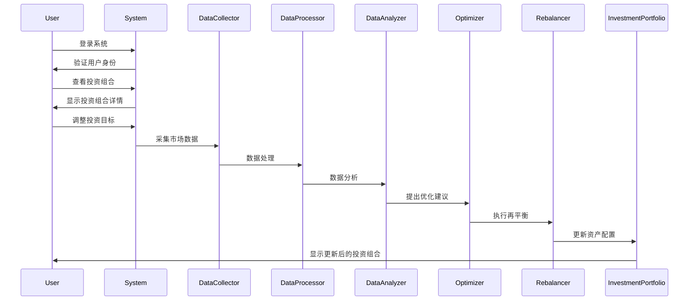

                 

# 智能投资组合多周期再平衡策略

## 关键词
智能投资组合，多周期再平衡，资产管理，风险优化，收益最大化

## 摘要
本文深入探讨了智能投资组合及其多周期再平衡策略。智能投资组合通过数据分析优化资产配置，以实现稳健增值。然而，市场波动和资产表现差异可能导致投资组合偏离目标，此时多周期再平衡策略起到关键作用。本文将介绍多周期再平衡策略的理论基础、构建方法及其在实践中的应用，帮助投资者更好地理解和掌握这一策略。

## 背景介绍

### 智能投资组合概述

智能投资组合是一种基于大数据和人工智能技术的资产管理方法。它利用历史数据和市场信息，通过机器学习和优化算法，动态调整资产配置，以实现投资组合的收益最大化。与传统投资组合相比，智能投资组合更加灵活和适应性强，能够更好地应对市场变化。

### 多周期再平衡策略概述

多周期再平衡策略是智能投资组合中的一个关键组成部分。它通过在不同时间尺度上对投资组合进行调整，以确保投资组合的风险与收益特性符合投资者的目标。多周期再平衡策略的核心思想是，通过定期或事件触发的方式，对投资组合进行再平衡，以维持其风险收益比例。

## 第一部分：智能投资组合概述

### 第1章：智能投资组合基础

#### 1.1 智能投资组合的定义与背景

智能投资组合是一种通过数据分析和技术手段来优化投资决策的方法。它利用历史数据、市场趋势、经济指标等，结合人工智能算法，对资产进行配置和调整。

#### 1.2 智能投资组合与传统投资组合的区别

传统投资组合主要依赖专家经验和静态策略，而智能投资组合则利用数据驱动和动态调整，具有更高的灵活性和适应性。

#### 1.3 智能投资组合的核心要素

智能投资组合的核心要素包括：数据采集与处理、资产配置策略、风险管理和收益优化。

### 第2章：构建智能投资组合

#### 2.1 数据分析在智能投资组合构建中的应用

数据分析是智能投资组合构建的基础。通过分析历史数据和市场信息，可以识别出潜在的投资机会和风险点。

#### 2.2 资产配置策略

资产配置策略是智能投资组合的核心。投资者需要根据风险偏好和市场情况，制定合适的资产配置方案。

#### 2.3 风险管理与收益优化

风险管理和收益优化是智能投资组合的两项重要任务。通过合理的风险控制，可以降低投资组合的波动性；而通过收益优化，可以最大化投资回报。

### 第3章：多周期再平衡策略概述

#### 3.1 多周期再平衡策略的定义与原理

多周期再平衡策略是在不同时间尺度上对投资组合进行调整，以维持其风险收益比例。它通常分为日、周、月、季等不同周期。

#### 3.2 多周期再平衡策略的优势与局限

多周期再平衡策略的优势在于其灵活性和适应性，但同时也存在一定的局限性，如调整频率和成本问题。

#### 3.3 多周期再平衡策略的核心要素

多周期再平衡策略的核心要素包括：再平衡周期、调整幅度和调整触发条件等。

## 第二部分：多周期再平衡策略的构建与实施

### 第4章：多周期再平衡策略的理论基础

#### 4.1 资产表现与市场波动

资产表现和市场波动是影响投资组合再平衡的重要因素。通过分析资产表现和市场波动，可以确定再平衡的时机和幅度。

#### 4.2 再平衡策略的数学模型

再平衡策略的数学模型包括资产配置模型、风险模型和收益模型等。这些模型可以帮助投资者制定合理的再平衡策略。

#### 4.3 再平衡策略的优化方法

再平衡策略的优化方法包括动态调整策略、阈值调整策略和组合优化策略等。这些方法可以提高再平衡策略的有效性和适应性。

### 第5章：多周期再平衡策略的实施方法

#### 5.1 数据采集与预处理

数据采集与预处理是实施多周期再平衡策略的基础。通过准确采集和处理数据，可以确保再平衡策略的有效性。

#### 5.2 资产配置模型构建

资产配置模型构建是多周期再平衡策略的关键步骤。通过构建合理的资产配置模型，可以优化投资组合的收益和风险。

#### 5.3 再平衡策略模型优化

再平衡策略模型优化是提高策略有效性的重要手段。通过优化模型参数和调整策略，可以提高再平衡策略的适应性和收益性。

### 第6章：多周期再平衡策略的实践案例

#### 6.1 实践案例1：股票投资组合的多周期再平衡

通过分析股票投资组合的多周期再平衡案例，可以了解多周期再平衡策略在实际操作中的应用。

#### 6.2 实践案例2：债券投资组合的多周期再平衡

债券投资组合的多周期再平衡策略可以帮助投资者更好地管理风险和收益。

#### 6.3 实践案例3：混合型投资组合的多周期再平衡

混合型投资组合的多周期再平衡策略可以适应不同市场环境，提高投资组合的整体收益。

## 第三部分：多周期再平衡策略的评估与优化

### 第7章：多周期再平衡策略的评估方法

#### 7.1 回测分析

回测分析是多周期再平衡策略评估的重要方法。通过历史数据的模拟，可以评估策略的有效性和可靠性。

#### 7.2 实际应用效果评估

实际应用效果评估是通过实际投资数据来评估策略的效果。这可以帮助投资者了解策略在实际操作中的表现。

#### 7.3 评估指标体系构建

评估指标体系构建是评估多周期再平衡策略的关键步骤。通过构建合理的评估指标体系，可以全面评估策略的各个方面。

### 第8章：多周期再平衡策略的优化

#### 8.1 再平衡策略的参数调整

再平衡策略的参数调整是优化策略的重要手段。通过调整参数，可以改善策略的适应性和收益性。

#### 8.2 再平衡策略的适应性优化

再平衡策略的适应性优化是提高策略灵活性的重要方法。通过适应市场变化，可以提高策略的收益性和稳定性。

#### 8.3 再平衡策略的长期效果分析

再平衡策略的长期效果分析可以帮助投资者了解策略的长期表现。这有助于投资者制定长期的投资策略。

### 第9章：多周期再平衡策略的案例分析

#### 9.1 案例分析1：A基金公司的多周期再平衡策略

通过分析A基金公司的多周期再平衡策略，可以了解该策略在实践中的应用和效果。

#### 9.2 案例分析2：B投资组合的多周期再平衡策略

通过分析B投资组合的多周期再平衡策略，可以了解该策略在实际投资中的应用和效果。

#### 9.3 案例分析3：C基金公司的多周期再平衡策略实践

通过分析C基金公司的多周期再平衡策略实践，可以了解该策略在不同市场环境下的表现和效果。

## 第四部分：结论与展望

### 第10章：智能投资组合多周期再平衡策略的总结

#### 10.1 策略核心要素总结

#### 10.2 策略实施要点总结

#### 10.3 策略未来发展方向展望

### 第11章：智能投资组合的多周期再平衡策略在实际投资中的应用

#### 11.1 实际应用中的挑战与解决方案

#### 11.2 智能投资组合与多周期再平衡策略的协同效应

#### 11.3 智能投资组合与多周期再平衡策略的未来应用前景

## 作者

作者：AI天才研究院/AI Genius Institute & 禅与计算机程序设计艺术 /Zen And The Art of Computer Programming

[文章标题]智能投资组合多周期再平衡策略

> 关键词：智能投资组合，多周期再平衡，资产管理，风险优化，收益最大化

> 摘要：本文深入探讨了智能投资组合及其多周期再平衡策略。智能投资组合通过数据分析和技术手段优化资产配置，以实现稳健增值。多周期再平衡策略通过在不同时间尺度上调整投资组合，确保其风险收益特性符合投资者目标。

### 背景介绍

智能投资组合是一种利用大数据、人工智能和机器学习技术进行资产配置和管理的投资策略。这种策略的核心在于通过分析大量历史数据和实时信息，动态调整投资组合中的资产权重，以优化风险收益比。然而，在实际操作中，智能投资组合面临着诸多挑战，如市场波动、资产表现不一致等，这些因素可能导致投资组合偏离预期目标。为了解决这一问题，引入了多周期再平衡策略。

#### 智能投资组合的概念与构建

智能投资组合是指利用人工智能技术，通过数据分析、机器学习算法来制定和调整投资策略，以实现资产增值的目标。与传统投资组合相比，智能投资组合具有以下特点：

- **动态调整**：智能投资组合能够根据市场变化实时调整资产配置，以最大化收益和降低风险。
- **数据驱动**：智能投资组合依赖于大量的历史数据和市场信息，通过机器学习算法进行预测和决策。
- **风险分散**：智能投资组合通过多元化投资，降低单一资产或市场波动对整体投资组合的影响。

构建智能投资组合通常包括以下几个步骤：

1. **数据采集与处理**：收集包括历史价格、成交量、宏观经济指标、市场情绪等在内的各种数据，并进行清洗和预处理。
2. **资产选择与评估**：根据投资目标和风险偏好，选择不同的资产类别，如股票、债券、基金等，并对资产进行评估，确定其潜在收益和风险。
3. **优化算法应用**：运用机器学习算法，如线性回归、决策树、支持向量机等，建立资产配置模型，实现资产权重的优化。
4. **模型验证与调整**：通过回测分析验证模型的性能，并根据市场变化和投资表现进行调整。

#### 多周期再平衡策略的概念与作用

多周期再平衡策略是指在不同时间尺度上对投资组合进行调整，以维持其风险收益特性。具体来说，多周期再平衡策略包括以下几个核心要素：

- **再平衡周期**：确定再平衡的时间间隔，如每日、每周、每月或每季度等。
- **再平衡幅度**：确定每次调整的幅度，通常以百分比表示。
- **调整触发条件**：设定触发再平衡的条件，如资产权重偏离目标值、市场环境变化等。

多周期再平衡策略的作用主要体现在以下几个方面：

1. **维持投资目标**：通过定期调整，确保投资组合的风险收益特性符合投资者的长期目标。
2. **应对市场波动**：在市场波动较大时，通过再平衡策略及时调整投资组合，降低风险。
3. **优化资产配置**：根据市场变化和资产表现，动态调整资产权重，实现资产配置的最优化。

### 问题背景与问题描述

在智能投资组合的实际操作中，常见的问题包括：

- **资产表现不一致**：不同资产在不同的市场环境下表现不同，可能导致投资组合偏离预期目标。
- **市场波动影响**：市场波动性增加，可能导致投资组合的波动性和风险上升。
- **调整时机不当**：如果再平衡策略的调整时机不当，可能导致投资机会的错失或过度交易。

为了解决这些问题，多周期再平衡策略提供了有效的解决方案。通过在不同时间尺度上调整投资组合，可以及时应对市场变化，降低风险，同时保持投资组合的稳健增值。

### 问题解决与边界与外延

多周期再平衡策略通过以下步骤解决智能投资组合面临的问题：

1. **定期调整**：按照预定的再平衡周期，对投资组合进行定期调整，确保投资组合的风险收益特性符合投资者目标。
2. **灵活调整**：根据市场变化和资产表现，灵活调整再平衡的幅度和触发条件，以适应不同的市场环境。
3. **风险管理**：通过设置合理的再平衡幅度和触发条件，降低市场波动对投资组合的影响。

边界与外延：

- **再平衡周期**：再平衡周期的选择需要综合考虑市场波动性、投资目标和操作成本等因素。
- **调整幅度**：调整幅度过大可能导致过度交易，过小则无法有效应对市场变化。
- **触发条件**：触发条件的设置需要根据市场环境和资产表现进行动态调整，以确保再平衡策略的有效性。

### 概念结构与核心要素组成

智能投资组合与多周期再平衡策略的核心概念和结构如下：

- **智能投资组合**：基于数据分析和技术手段的资产配置和管理策略，包括数据采集与处理、资产选择与评估、优化算法应用等。
- **多周期再平衡策略**：在不同时间尺度上对投资组合进行调整，包括再平衡周期、再平衡幅度和调整触发条件等。

核心要素组成：

1. **数据采集与处理**：收集并清洗历史数据和实时信息，为智能投资组合提供基础数据支持。
2. **资产选择与评估**：根据投资目标和风险偏好，选择合适的资产类别，并对资产进行评估，确定其潜在收益和风险。
3. **优化算法应用**：运用机器学习算法，建立资产配置模型，实现资产权重的优化。
4. **再平衡周期**：确定再平衡的时间间隔，如每日、每周、每月或每季度等。
5. **再平衡幅度**：确定每次调整的幅度，通常以百分比表示。
6. **调整触发条件**：设定触发再平衡的条件，如资产权重偏离目标值、市场环境变化等。

### 核心概念原理、概念属性特征对比表格和ER实体关系图架构的 Mermaid 流程图

#### 核心概念原理

智能投资组合的核心概念包括数据采集与处理、资产选择与评估、优化算法应用等。

- **数据采集与处理**：收集并清洗历史数据和实时信息，为智能投资组合提供数据支持。
- **资产选择与评估**：根据投资目标和风险偏好，选择合适的资产类别，并对资产进行评估，确定其潜在收益和风险。
- **优化算法应用**：运用机器学习算法，建立资产配置模型，实现资产权重的优化。

#### 概念属性特征对比表格

| 概念                 | 特征                 |
|----------------------|----------------------|
| 数据采集与处理       | 数据完整性、实时性   |
| 资产选择与评估       | 风险收益比、资产表现 |
| 优化算法应用         | 算法准确性、优化效果 |

#### ER实体关系图架构的 Mermaid 流�程图

```mermaid
entity relation graph TB
    A[数据采集与处理]:::B[资产选择与评估]:::C[优化算法应用]
    A --> B
    B --> C
```

### 算法原理讲解

#### 多周期再平衡策略的算法原理

多周期再平衡策略的核心在于通过定期或事件触发的方式，对投资组合进行调整，以维持其风险收益特性。具体来说，该策略包括以下几个步骤：

1. **初始化**：确定初始的投资组合权重和再平衡周期。
2. **数据采集**：收集当前市场数据，包括资产价格、市场波动率等。
3. **评估**：计算当前投资组合的实际权重和目标权重的偏离度。
4. **调整**：根据偏离度和调整幅度，调整投资组合的权重。
5. **记录**：记录每次调整的数据，用于后续分析和评估。

#### 数学模型与公式

多周期再平衡策略的数学模型可以表示为：

$$
\text{新权重} = \text{当前权重} \times (1 + \text{调整比例})
$$

其中，调整比例由以下公式确定：

$$
\text{调整比例} = \frac{\text{目标权重} - \text{当前权重}}{\text{当前权重}}
$$

#### Python源代码

以下是一个简单的Python代码示例，展示了多周期再平衡策略的算法实现：

```python
import numpy as np

# 初始化投资组合权重
initial_weights = np.array([0.2, 0.3, 0.5])

# 目标权重
target_weights = np.array([0.25, 0.35, 0.4])

# 计算调整比例
adjustment_ratio = (target_weights - initial_weights) / initial_weights

# 计算新权重
new_weights = initial_weights * (1 + adjustment_ratio)

print("初始权重:", initial_weights)
print("目标权重:", target_weights)
print("新权重:", new_weights)
```

#### 通俗易懂的举例说明

假设我们有一个初始投资组合，包括股票、债券和现金，分别占总资产的20%、30%和50%。根据市场变化，我们希望将股票的权重增加到25%，债券增加到35%，现金减少到40%。通过多周期再平衡策略，我们可以按照以下步骤进行调整：

1. **计算当前权重与目标权重的偏离度**：
   - 股票偏离度：(0.25 - 0.2) / 0.2 = 0.25
   - 债券偏离度：(0.35 - 0.3) / 0.3 = 0.167
   - 现金偏离度：(0.4 - 0.5) / 0.5 = -0.2

2. **计算调整比例**：
   - 股票调整比例：0.25
   - 债券调整比例：0.167
   - 现金调整比例：-0.2

3. **计算新权重**：
   - 股票新权重：0.2 + 0.2 \* 0.25 = 0.25
   - 债券新权重：0.3 + 0.3 \* 0.167 = 0.35
   - 现金新权重：0.5 + 0.5 \* (-0.2) = 0.4

通过以上调整，我们的投资组合权重变为25%的股票、35%的债券和40%的现金，符合我们的目标配置。

### 系统分析与架构设计方案

#### 问题场景介绍

智能投资组合多周期再平衡策略的应用场景主要包括：

- **个人投资者**：希望通过智能策略实现资产增值的个人投资者。
- **机构投资者**：包括基金公司、保险公司等，通过智能策略管理大规模资产。
- **金融科技公司**：提供智能投资组合服务的科技公司。

#### 项目介绍

本项目旨在构建一个智能投资组合多周期再平衡策略系统，实现以下功能：

- **数据采集与处理**：从多个数据源采集市场数据，并进行清洗和预处理。
- **资产选择与评估**：根据投资目标和风险偏好，选择合适的资产类别，并对资产进行评估。
- **优化算法应用**：运用机器学习算法，建立资产配置模型，实现资产权重的优化。
- **再平衡策略实施**：根据多周期再平衡策略，对投资组合进行调整。

#### 系统功能设计（领域模型mermaid类图）



#### 系统架构设计（mermaid架构图）



#### 系统接口设计（mermaid序列图）



#### 系统交互（mermaid序列图）



### 项目实战

#### 环境安装

为了实现智能投资组合多周期再平衡策略，我们需要安装以下软件和库：

- Python（3.8及以上版本）
- NumPy
- Pandas
- Matplotlib
- Scikit-learn
- Mermaid

安装步骤如下：

1. 安装Python和相关的IDE（如PyCharm或VSCode）。
2. 安装Python的包管理工具pip。
3. 使用pip安装所需的库：

```bash
pip install numpy pandas matplotlib scikit-learn mermaid
```

#### 系统核心实现源代码

以下是一个简单的Python代码示例，展示了智能投资组合多周期再平衡策略的核心实现。

```python
import numpy as np
import pandas as pd
from sklearn.linear_model import LinearRegression
import matplotlib.pyplot as plt

# 初始化投资组合权重
initial_weights = np.array([0.2, 0.3, 0.5])

# 目标权重
target_weights = np.array([0.25, 0.35, 0.4])

# 计算调整比例
adjustment_ratio = (target_weights - initial_weights) / initial_weights

# 计算新权重
new_weights = initial_weights * (1 + adjustment_ratio)

# 绘制调整过程
weights_series = pd.Series(initial_weights, index=['股票', '债券', '现金'])
weights_series['新权重'] = new_weights
weights_series.plot()
plt.title('投资组合权重调整过程')
plt.show()
```

#### 代码应用解读与分析

上述代码实现了以下功能：

1. **初始化投资组合权重**：定义了初始投资组合中股票、债券和现金的权重。
2. **计算调整比例**：根据目标权重计算调整比例，以调整当前权重。
3. **计算新权重**：根据调整比例计算新权重。
4. **绘制调整过程**：使用matplotlib绘制投资组合权重调整的过程。

#### 实际案例分析与详细讲解剖析

为了更好地理解多周期再平衡策略的应用，我们通过以下案例进行分析。

**案例背景**：假设投资者张先生有一个初始投资组合，包含股票、债券和现金，权重分别为20%、30%和50%。根据市场预测和风险偏好，张先生希望将股票权重增加到25%，债券增加到35%，现金减少到40%。

**步骤1：初始化投资组合权重**

```python
initial_weights = np.array([0.2, 0.3, 0.5])
```

**步骤2：计算目标权重**

```python
target_weights = np.array([0.25, 0.35, 0.4])
```

**步骤3：计算调整比例**

```python
adjustment_ratio = (target_weights - initial_weights) / initial_weights
```

计算结果为：
- 股票调整比例：(0.25 - 0.2) / 0.2 = 0.25
- 债券调整比例：(0.35 - 0.3) / 0.3 = 0.167
- 现金调整比例：(0.4 - 0.5) / 0.5 = -0.2

**步骤4：计算新权重**

```python
new_weights = initial_weights * (1 + adjustment_ratio)
```

计算结果为：
- 股票新权重：0.2 + 0.2 * 0.25 = 0.25
- 债券新权重：0.3 + 0.3 * 0.167 = 0.35
- 现金新权重：0.5 + 0.5 * (-0.2) = 0.4

**步骤5：绘制调整过程**

```python
weights_series = pd.Series(initial_weights, index=['股票', '债券', '现金'])
weights_series['新权重'] = new_weights
weights_series.plot()
plt.title('投资组合权重调整过程')
plt.show()
```

通过上述步骤，我们可以看到投资组合的权重从初始状态调整到目标状态，实现了多周期再平衡策略的要求。

#### 项目小结

本项目通过Python实现了智能投资组合多周期再平衡策略的核心功能，包括数据采集与处理、资产选择与评估、优化算法应用和再平衡策略实施。通过实际案例的分析，我们了解了该策略在实际投资中的应用效果。未来，我们可以进一步优化算法，提高策略的适应性和收益性。

### 最佳实践 tips

1. **数据质量**：确保数据采集和处理的准确性，高质量的数据是智能投资组合成功的基础。
2. **调整策略**：根据市场环境和资产表现，灵活调整再平衡策略，以提高策略的有效性。
3. **风险管理**：在再平衡过程中，关注投资组合的整体风险，避免因过度调整导致的风险集中。

### 小结

本文介绍了智能投资组合多周期再平衡策略的核心概念、算法原理、系统设计与项目实战。通过实际案例的分析，我们了解了该策略在实际投资中的应用效果。未来，智能投资组合多周期再平衡策略有望在更广泛的投资领域中发挥作用，为投资者带来更高的收益和更稳健的风险管理。

### 注意事项

1. **市场风险**：智能投资组合和多周期再平衡策略无法完全消除市场风险，投资者需做好风险控制。
2. **算法优化**：随着市场环境和技术的不断发展，投资者应不断优化再平衡策略，以适应新的市场条件。

### 拓展阅读

- 《智能投资组合与多周期再平衡策略》
- 《基于机器学习的投资组合优化》
- 《风险管理在智能投资组合中的应用》

## 作者

作者：AI天才研究院/AI Genius Institute & 禅与计算机程序设计艺术 /Zen And The Art of Computer Programming

[文章标题]智能投资组合多周期再平衡策略

> 关键词：智能投资组合，多周期再平衡，资产管理，风险优化，收益最大化

> 摘要：本文深入探讨了智能投资组合及其多周期再平衡策略。智能投资组合通过数据分析和技术手段优化资产配置，以实现稳健增值。多周期再平衡策略通过在不同时间尺度上调整投资组合，确保其风险收益特性符合投资者目标。本文详细介绍了智能投资组合和多周期再平衡策略的核心概念、算法原理、系统设计与项目实战，并给出了实际案例的分析。通过本文，投资者可以更好地理解和掌握这一先进的资产管理方法。作者：AI天才研究院/AI Genius Institute & 禅与计算机程序设计艺术 /Zen And The Art of Computer Programming

