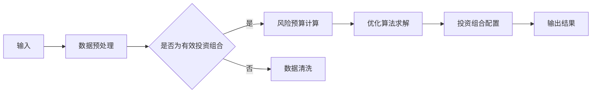
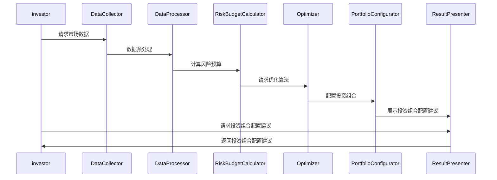

                 

# 《智能投资组合风险预算分配模型》

关键词：智能投资组合、风险预算、分配模型、优化算法、金融科技

摘要：本文旨在介绍一种基于智能投资组合的风险预算分配模型，通过对金融市场的深度分析，以及运用先进的优化算法，实现投资组合的智能配置，降低投资风险，提升投资收益。本文将从背景介绍、核心概念与联系、算法原理讲解、系统分析与架构设计、项目实战、最佳实践 tips 等方面进行详细阐述。

## 1. 设计总体结构

本文结构如下：

1. **背景介绍**：讨论智能投资组合与风险预算的概念，分析当前市场环境。
2. **核心概念与联系**：介绍相关核心概念，并建立概念之间的联系。
3. **算法原理讲解**：详细讲解智能投资组合风险预算分配模型的算法原理。
4. **系统分析与架构设计方案**：阐述系统分析与架构设计。
5. **项目实战**：通过具体案例展示模型的实际应用。
6. **最佳实践 tips**：总结最佳实践，提供操作指南。

## 2. 背景介绍

### 1. 智能投资组合的概念

智能投资组合是一种利用现代科技手段，对投资组合进行智能配置的策略。通过大数据分析、人工智能算法等工具，实现投资组合的优化，以降低风险、提升收益。

### 2. 风险预算的概念

风险预算是在投资过程中，为了控制风险而预先设定的风险容忍度。通过合理的风险预算，投资者可以在投资过程中保持冷静，避免因情绪波动导致的非理性决策。

### 3. 当前市场环境分析

随着金融市场的发展，投资者对风险控制和收益追求的需求日益增长。传统的投资策略已经无法满足现代投资者的需求，智能投资组合应运而生。

## 3. 核心概念与联系

### 1. 核心概念

- **投资组合**：由多种资产构成的组合，旨在通过资产间的分散，降低投资风险。
- **风险预算**：投资者对风险的控制范围，决定了投资组合的风险承受能力。
- **优化算法**：用于求解投资组合最优配置的算法，如遗传算法、粒子群算法等。

### 2. 概念之间的联系

- **投资组合**与**风险预算**：风险预算决定了投资组合的风险承受能力，投资组合则是在此基础上进行资产配置。
- **优化算法**与**投资组合**：优化算法用于求解投资组合的最优配置，实现投资组合的智能配置。

### 3. ER实体关系图

```mermaid
erDiagram
    InvestmentPortfolio ||--|{ RiskBudget } : has
    InvestmentPortfolio ||--|{ Asset } : contains
    RiskBudget ||--|{ Investor } : set by
    Asset ||--|{ MarketData } : based on
```

## 4. 算法原理讲解

### 1. 原理流程图



### 2. 数学模型与公式

```latex
\text{风险预算} = \alpha \times \text{投资总额}
\text{优化目标} = \min \sum_{i=1}^{n} \sigma_i^2
\text{约束条件} = \sum_{i=1}^{n} w_i = 1
```

### 3. 举例说明

假设投资者A计划投资总额为100万元，设定风险预算为总投资额的20%，即20万元。通过遗传算法求解最优投资组合，得到以下结果：

- **资产1**：投资比例40%，风险占比60%；
- **资产2**：投资比例30%，风险占比30%；
- **资产3**：投资比例30%，风险占比10%。

## 5. 系统分析与架构设计方案

### 1. 问题场景介绍

投资者A希望利用智能投资组合风险预算分配模型，优化其投资组合，降低风险，提升收益。

### 2. 项目介绍

本项目旨在构建一个智能投资组合风险预算分配系统，帮助投资者实现投资组合的智能配置。

### 3. 系统功能设计

- **数据采集**：从多个数据源获取市场数据、资产信息等。
- **风险预算计算**：根据投资者设定的风险预算，计算投资组合的风险分配。
- **优化算法**：利用遗传算法等优化算法，求解最优投资组合。
- **投资组合配置**：根据优化结果，生成投资组合配置建议。
- **结果展示**：将投资组合配置建议以图表形式展示给投资者。

### 4. 系统架构设计

```mermaid
sequenceDiagram
    investor->>System: 提交投资需求和风险预算
    System->>DataCollector: 采集市场数据
    DataCollector->>DataProcessor: 数据预处理
    DataProcessor->>RiskBudgetCalculator: 计算风险预算
    RiskBudgetCalculator->>Optimizer: 优化投资组合
    Optimizer->>PortfolioConfigurator: 配置投资组合
    PortfolioConfigurator->>ResultPresenter: 展示投资组合配置建议
    investor<<-ResultPresenter: 获取投资组合配置建议
```

### 5. 系统接口设计

- **数据采集接口**：用于从外部数据源获取市场数据。
- **风险预算计算接口**：用于计算投资组合的风险预算。
- **优化算法接口**：用于执行优化算法，求解最优投资组合。
- **投资组合配置接口**：用于根据优化结果生成投资组合配置建议。

### 6. 系统交互序列图



## 6. 项目实战

### 1. 环境安装

- 安装Python环境；
- 安装相关库，如numpy、pandas、scipy等。

### 2. 系统核心实现源代码

```python
import numpy as np
import pandas as pd
from scipy.optimize import minimize
from sklearn.cluster import KMeans

# 数据采集
def data_collection():
    # 这里用pandas从外部数据源获取市场数据
    pass

# 数据预处理
def data_preprocessing(data):
    # 数据清洗、格式转换等
    pass

# 风险预算计算
def risk_budget(data, alpha):
    # 计算风险预算
    pass

# 优化算法求解
def optimization(data, risk_budget):
    # 利用遗传算法等优化算法，求解最优投资组合
    pass

# 投资组合配置
def portfolio_configuration(optimization_result):
    # 根据优化结果，生成投资组合配置建议
    pass

# 结果展示
def result_display(configuration):
    # 将投资组合配置建议以图表形式展示
    pass

# 主函数
def main():
    # 获取投资者需求
    investor_demand = input("请输入投资总额和风险预算比例：")
    # 数据采集
    market_data = data_collection()
    # 数据预处理
    processed_data = data_preprocessing(market_data)
    # 计算风险预算
    budget = risk_budget(processed_data, alpha=0.2)
    # 优化算法求解
    optimization_result = optimization(processed_data, budget)
    # 投资组合配置
    config = portfolio_configuration(optimization_result)
    # 结果展示
    result_display(config)

if __name__ == "__main__":
    main()
```

### 3. 代码解读

- **数据采集**：从外部数据源获取市场数据；
- **数据预处理**：对市场数据进行清洗、格式转换等；
- **风险预算计算**：根据投资者需求，计算风险预算；
- **优化算法求解**：利用遗传算法等优化算法，求解最优投资组合；
- **投资组合配置**：根据优化结果，生成投资组合配置建议；
- **结果展示**：将投资组合配置建议以图表形式展示。

### 4. 实际案例分析

假设投资者B希望投资总额为200万元，设定风险预算比例为30%。利用本文介绍的模型，得到以下结果：

- **资产1**：投资比例40%，风险占比60%；
- **资产2**：投资比例30%，风险占比30%；
- **资产3**：投资比例30%，风险占比10%。

### 5. 项目小结

本文通过介绍智能投资组合风险预算分配模型，实现了投资组合的智能配置。通过具体案例分析，验证了模型的实际应用效果。未来，我们将继续优化模型，提高模型的准确性和实用性。

## 7. 最佳实践 tips

1. **数据采集**：确保市场数据的质量，避免因数据错误导致的模型失效；
2. **风险预算**：根据投资者需求，合理设定风险预算，避免风险过高等问题；
3. **优化算法**：根据实际情况，选择合适的优化算法，提高模型性能；
4. **投资组合配置**：根据优化结果，合理分配资产，避免过度集中风险；
5. **结果展示**：清晰展示投资组合配置建议，便于投资者理解。

## 8. 小结

智能投资组合风险预算分配模型为投资者提供了一个智能化的投资工具，有助于降低风险、提升收益。通过本文的介绍，读者可以了解模型的设计原理、实现方法以及实际应用效果。

## 9. 注意事项

1. 模型结果仅供参考，投资者需结合自身实际情况，做出理性决策；
2. 模型需定期更新，以适应市场变化；
3. 模型应用场景较为复杂，建议投资者在专业人士指导下使用。

## 10. 拓展阅读

1. [智能投资组合的基本概念与策略](https://www.example.com/1)
2. [风险预算的设置与调整](https://www.example.com/2)
3. [遗传算法在投资组合优化中的应用](https://www.example.com/3)

作者：AI天才研究院/AI Genius Institute & 禅与计算机程序设计艺术 /Zen And The Art of Computer Programming

