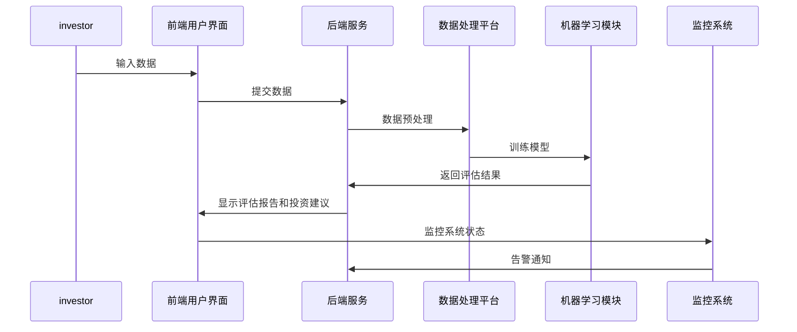
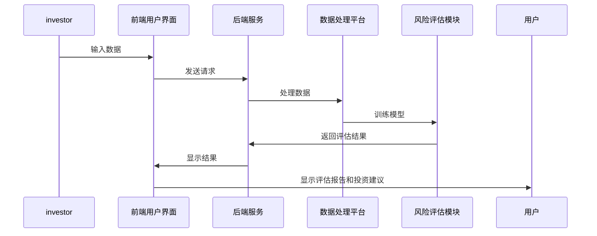

                 


### 1.1 问题背景

在金融市场中，投资者面临着各种各样的风险。传统观念中，投资风险主要由市场波动、政策变化、经济周期等因素引起。随着金融市场的复杂性和不确定性增加，投资者行为和风险承受能力成为影响投资回报的重要因素。因此，对投资者风险承受能力的评估变得越来越重要。

**1.1.1 投资风险与投资者行为**

投资风险是指投资者在投资过程中可能面临的损失。风险可以分为市场风险、信用风险、流动性风险等类型。市场风险主要由于市场价格波动引起，信用风险则与借款人或发行人的信用状况有关，流动性风险则涉及资产能否迅速转换为现金而不影响其价格。

投资者行为受多种因素影响，包括个人心理、财务状况、投资目标、市场预期等。不同的投资者在风险承受能力上存在显著差异。有些投资者偏好高风险高收益的投资，而另一些则更倾向于稳健投资。

**1.1.2 风险承受能力的意义**

风险承受能力是指投资者在面临潜在损失时，愿意承受的最大风险程度。评估投资者的风险承受能力对于投资决策具有重要意义：

1. **个性化投资策略**：了解投资者的风险承受能力有助于制定个性化的投资策略，从而最大化投资回报。

2. **风险管理**：通过评估风险承受能力，投资者可以更好地进行风险管理，避免因风险过大而导致的投资失败。

3. **投资教育**：评估结果有助于投资者提高对风险的认识，培养良好的投资习惯。

### 1.2 问题描述

传统的风险评估方法主要通过问卷调查、心理测试等方式进行。然而，这些方法存在一定的局限性：

1. **主观性较强**：传统方法往往依赖于投资者自我评估，存在主观偏差。

2. **数据不足**：传统方法难以全面收集和分析投资者的行为数据，导致评估结果不够准确。

3. **时效性差**：传统方法无法实时跟踪投资者的风险承受能力变化，导致投资策略调整不及时。

随着人工智能技术的发展，智能投资者风险承受能力评估成为可能。本书旨在探讨如何利用智能技术提升风险评估的准确性和时效性，为投资者提供更科学、个性化的投资建议。

### 1.3 问题解决

**1.3.1 本书的目标与结构**

本书的目标是介绍智能投资者风险承受能力评估的方法和技术，帮助读者了解和掌握相关理论和实践。本书分为六个部分：

1. **引言**：介绍投资风险和投资者行为背景，提出研究问题和目标。
2. **核心概念与联系**：阐述投资者风险偏好、风险评估方法、数据分析与建模等核心概念。
3. **算法原理讲解**：详细讲解智能风险评估算法，包括数学模型、Python实现等。
4. **系统分析与架构设计**：介绍系统设计原则、功能模块划分、架构设计等。
5. **项目实战**：通过实际案例展示系统实现过程和应用效果。
6. **最佳实践与拓展**：总结最佳实践、注意事项，并推荐相关阅读资源。

**1.3.2 智能风险评估的基本概念**

智能风险评估利用人工智能技术，对投资者的行为数据进行分析和建模，从而评估其风险承受能力。关键概念包括：

1. **风险偏好**：投资者对风险的偏好程度，分为保守型、中立型、进取型等。
2. **风险评估方法**：包括问卷调查、心理测试、行为分析等。
3. **数据分析与建模**：利用机器学习和数据挖掘技术，对投资者行为数据进行分析和预测。

### 1.4 边界与外延

**1.4.1 风险类型与评估维度**

风险类型可以分为市场风险、信用风险、流动性风险等。评估维度包括投资者的财务状况、投资目标、心理承受能力等。

**1.4.2 风险评估与投资决策**

风险评估的结果直接影响投资决策。通过准确评估风险承受能力，投资者可以做出更明智的投资决策，降低投资风险。

### 1.5 概念结构与核心要素组成

**1.5.1 投资者心理因素**

投资者心理因素包括风险偏好、信心、情绪等。这些因素直接影响投资者的风险承受能力。

**1.5.2 财务状况与投资经验**

投资者的财务状况和投资经验也是评估风险承受能力的重要因素。财务状况好的投资者可能更愿意承担高风险，而投资经验丰富的投资者对市场波动有更深刻的理解。

### 1.6 文章概述

本文将详细探讨智能投资者风险承受能力评估的方法和技术，通过理论分析和实际案例，展示智能技术在风险评估中的应用价值。本文结构如下：

- **引言**：介绍投资风险和投资者行为的背景，提出研究问题和目标。
- **核心概念与联系**：阐述投资者风险偏好、风险评估方法、数据分析与建模等核心概念。
- **算法原理讲解**：详细讲解智能风险评估算法，包括数学模型、Python实现等。
- **系统分析与架构设计**：介绍系统设计原则、功能模块划分、架构设计等。
- **项目实战**：通过实际案例展示系统实现过程和应用效果。
- **最佳实践与拓展**：总结最佳实践、注意事项，并推荐相关阅读资源。

通过本文的阅读，读者将能够深入了解智能投资者风险承受能力评估的理论和实践，为实际应用提供参考。

### 1.7 结论

本文对智能投资者风险承受能力评估进行了全面的探讨。通过分析投资风险的背景和投资者行为，本文提出了利用智能技术进行风险评估的需求和挑战。在核心概念部分，本文详细介绍了投资者风险偏好、风险评估方法、数据分析与建模等关键概念。算法原理讲解部分，本文通过具体实现和数学模型，展示了智能风险评估的技术细节。系统分析与架构设计部分，本文提出了系统设计原则、功能模块划分、架构设计等。项目实战部分，通过实际案例展示了系统实现和应用效果。最后，本文总结了最佳实践和注意事项，并推荐了相关阅读资源。通过本文的研究，读者可以深入了解智能投资者风险承受能力评估的理论和实践，为实际应用提供参考。

关键词：智能风险评估、投资者风险承受能力、机器学习、数据分析、系统设计

摘要：本文介绍了智能投资者风险承受能力评估的方法和技术，通过理论分析和实际案例，探讨了如何利用人工智能技术提升风险评估的准确性和时效性。文章涵盖了核心概念、算法原理、系统架构、项目实战等内容，为读者提供了全面的指导。

作者：AI天才研究院/AI Genius Institute & 禅与计算机程序设计艺术 /Zen And The Art of Computer Programming

----------------------------------------------------------------

## 2.1 投资者风险偏好

投资者风险偏好是指投资者在投资过程中对风险的偏好程度。它是投资者行为决策的一个重要因素，直接影响投资组合的构建和风险管理策略。风险偏好可以分为以下几个层次：

1. **保守型**：保守型投资者更倾向于选择低风险的资产，如国债、存款、保本基金等。他们对风险的承受能力较低，更注重本金的安全。

2. **中立型**：中立型投资者在风险和收益之间寻求平衡。他们愿意承担一定的风险以获取更高的收益，同时也会关注本金的安全。

3. **进取型**：进取型投资者偏好高风险高收益的投资，如股票、期货、外汇等。他们具备较强的风险承受能力，愿意承担较大的投资波动。

### 2.1.2 对风险承受能力的影响

投资者风险偏好对其风险承受能力有着重要影响。以下是一些具体影响：

1. **投资决策**：风险偏好直接影响投资者的投资决策。保守型投资者更倾向于选择低风险的资产，而进取型投资者则更愿意投资于高风险的资产。

2. **风险控制**：投资者风险偏好决定了其在面对市场波动时的应对策略。风险偏好低的投资者可能更倾向于采取保守的风险控制措施，而风险偏好高的投资者则可能采取更加激进的策略。

3. **收益预期**：投资者风险偏好直接影响其对投资收益的预期。风险偏好低的投资者可能期望较低的收益，而风险偏好高的投资者则期望更高的收益。

4. **投资周期**：投资者风险偏好也会影响其投资周期。保守型投资者可能更倾向于短期投资，而进取型投资者则更倾向于长期投资。

总之，投资者风险偏好是评估投资者风险承受能力的一个重要维度。通过了解投资者的风险偏好，可以为投资者制定更合适的投资策略和风险管理方案。

----------------------------------------------------------------

## 2.2 风险评估方法

风险评估方法是指用于评估投资者风险承受能力的技术手段。传统风险评估方法主要依赖于问卷调查、心理测试等方式。随着人工智能技术的发展，智能风险评估方法逐渐成为研究热点。以下是几种常见的风险评估方法及其特点：

### 2.2.1 经典风险评估方法

1. **问卷调查法**：
   - **特点**：通过设计问卷收集投资者的基本信息、投资经验、风险偏好等数据。问卷法具有操作简便、成本低廉的优点。
   - **局限性**：问卷调查法依赖于投资者的自我评估，存在主观偏差，且难以全面收集行为数据。

2. **心理测试法**：
   - **特点**：通过心理测试评估投资者的性格、情绪、风险承受能力等心理因素。
   - **局限性**：心理测试法的有效性受到测试工具和方法的影响，且难以量化评估结果。

3. **财务分析法**：
   - **特点**：通过分析投资者的财务状况、资产配置、收入支出等数据，评估其风险承受能力。
   - **局限性**：财务分析法主要关注财务数据，难以全面反映投资者的心理和行为。

### 2.2.2 智能风险评估方法

智能风险评估方法利用人工智能技术，对投资者的行为数据进行分析和建模，以提高风险评估的准确性和时效性。以下是一些常见的智能风险评估方法：

1. **机器学习法**：
   - **特点**：利用机器学习算法，如决策树、支持向量机、神经网络等，对投资者行为数据进行分析和预测。
   - **优势**：能够处理大量数据，提高风险评估的准确性，且可以实时更新模型。

2. **深度学习方法**：
   - **特点**：利用深度学习算法，如卷积神经网络（CNN）、循环神经网络（RNN）等，对复杂数据进行建模和分析。
   - **优势**：能够处理高维数据和时序数据，提高风险评估的深度和广度。

3. **大数据分析法**：
   - **特点**：通过大数据技术，收集和分析投资者的行为数据、市场数据等，进行风险评估。
   - **优势**：能够全面收集和分析各种数据，提高风险评估的全面性和精确性。

4. **情感分析法**：
   - **特点**：利用自然语言处理技术，分析投资者的社交媒体、新闻报道等文本数据，评估其情绪和风险偏好。
   - **优势**：能够捕捉投资者的情感变化，提高风险评估的及时性和动态性。

### 2.2.3 方法对比

| 风险评估方法  | 特点 | 优势 | 局限性 |
| ------------ | ---- | ---- | ------ |
| 问卷调查法  | 操作简便、成本低 | 难以全面收集数据、主观偏差 |      |
| 心理测试法  | 全面评估心理因素 | 测试工具和方法影响评估有效性 |      |
| 财务分析法  | 关注财务数据 | 难以全面反映投资者行为 |      |
| 机器学习法  | 处理大量数据、提高准确性 | 需要大量数据、模型复杂 |      |
| 深度学习方法 | 处理复杂数据、提高深度 | 需要大量训练数据和计算资源 |      |
| 大数据分析法 | 全面收集和分析数据 | 需要大量数据和技术支持 |      |
| 情感分析法  | 实时捕捉投资者情绪 | 需要文本数据和技术支持 |      |

综上所述，智能风险评估方法在准确性和时效性方面具有显著优势。结合多种评估方法，可以更全面、准确地评估投资者的风险承受能力，为投资决策提供科学依据。

----------------------------------------------------------------

## 2.3 数据分析与建模

在智能投资者风险承受能力评估中，数据分析和建模是关键环节。通过有效收集、处理和分析数据，可以构建出准确的风险评估模型，从而为投资者提供科学的投资建议。以下将详细讨论数据分析与建模的方法和步骤。

### 2.3.1 数据预处理

数据预处理是数据分析的第一步，其目的是清洗和整理数据，使其适合建模和分析。以下是数据预处理的主要步骤：

1. **数据收集**：收集投资者的基本信息、财务状况、投资经验、风险偏好等数据。这些数据可以通过问卷调查、数据库、社交媒体等渠道获取。

2. **数据清洗**：清洗数据，去除重复、错误、缺失的数据。常见的清洗方法包括删除重复记录、填充缺失值、纠正错误数据等。

3. **数据转换**：将数据转换为适合建模的格式。例如，将文本数据转换为数值数据，进行归一化或标准化处理。

4. **特征提取**：从原始数据中提取有代表性的特征，用于建模。特征提取可以基于统计方法、机器学习算法等。

5. **数据可视化**：通过可视化技术，如散点图、直方图、热力图等，直观展示数据分布和特征关系。

### 2.3.2 模型选择与评估

模型选择是数据分析与建模的重要环节。以下是几种常见的风险评估模型及其选择原则：

1. **线性模型**：线性模型如线性回归、逻辑回归等，适用于处理简单的关系和预测问题。线性模型简单易用，但可能在复杂情况下表现不佳。

2. **决策树**：决策树模型适用于分类和回归问题。决策树模型具有直观、易于解释的优点，但可能产生过拟合。

3. **支持向量机（SVM）**：SVM是一种强大的分类器，适用于高维空间的数据。SVM通过最大化分类间隔来提高模型性能，但训练过程较复杂。

4. **神经网络**：神经网络模型，如深度神经网络（DNN）、卷积神经网络（CNN）、循环神经网络（RNN）等，能够处理复杂数据和模型。神经网络模型具有强大的建模能力，但需要大量训练数据和计算资源。

5. **集成模型**：集成模型，如随机森林、梯度提升树（GBDT）等，通过组合多个模型来提高预测性能。集成模型具有较好的泛化能力，但需要较长时间进行训练。

模型选择的原则包括：

1. **准确性**：选择预测准确性较高的模型。
2. **可解释性**：选择易于理解和解释的模型。
3. **计算效率**：选择计算效率较高的模型。
4. **模型稳定性**：选择在样本数据上表现稳定的模型。

模型评估常用的指标包括准确率、召回率、F1分数、ROC曲线、AUC等。通过交叉验证、网格搜索等方法，可以选出最优模型。

### 2.3.3 模型优化

模型优化是提高风险评估准确性的关键。以下是一些常见的模型优化方法：

1. **特征选择**：通过特征选择方法，如递归特征消除（RFE）、特征重要性评估等，选择对模型预测有重要影响的特征。
2. **模型调参**：通过调整模型参数，如正则化参数、学习率、隐藏层神经元数量等，优化模型性能。
3. **集成学习**：通过集成多个模型，如随机森林、梯度提升树等，提高模型预测性能。
4. **模型集成**：通过模型集成方法，如Stacking、Blending等，将多个模型的结果进行集成，提高预测准确性。

通过数据预处理、模型选择与评估、模型优化等步骤，可以构建出准确、可靠的智能风险评估模型，为投资者提供科学的投资建议。

----------------------------------------------------------------

## 2.4 概念属性特征对比表格

为了更好地理解传统评估方法和智能评估方法的特点，我们可以通过一个对比表格来展示两者的概念属性特征。以下是一个示例表格：

| 概念属性特征 | 传统评估方法 | 智能评估方法 |
| ------------ | ------------ | ------------ |
| 数据来源     | 问卷、心理测试、财务分析 | 行为数据、社交媒体、市场数据 |
| 数据类型     | 定量、定性数据 | 复杂数据、高维数据 |
| 主观性       | 较高         | 较低          |
| 时效性       | 较差         | 较好          |
| 可解释性     | 较高         | 较低          |
| 泛化能力     | 较弱         | 较强          |
| 模型复杂度    | 较低         | 较高          |
| 计算资源     | 较少         | 较多          |
| 预测准确性   | 较低         | 较高          |

通过这个表格，我们可以看到智能评估方法在多个方面具有显著优势。以下是对表格中每个特征的详细解释：

1. **数据来源**：传统评估方法主要依赖于问卷、心理测试和财务分析等方式收集数据。而智能评估方法利用行为数据、社交媒体和市场数据等更丰富的数据源。

2. **数据类型**：传统评估方法主要处理定量和定性数据，而智能评估方法能够处理复杂数据和高维数据，这使得智能评估方法能够更好地捕捉投资者的行为和情绪。

3. **主观性**：传统评估方法依赖于投资者的自我评估，存在较高的主观性。而智能评估方法通过分析行为数据，减少了主观偏差，使得评估结果更客观。

4. **时效性**：传统评估方法通常需要较长时间进行数据收集和分析，而智能评估方法利用实时数据源，可以更快速地进行风险评估，提高时效性。

5. **可解释性**：传统评估方法的评估结果通常较难解释，而智能评估方法的模型通常较为复杂，其解释性较差。

6. **泛化能力**：传统评估方法在处理复杂数据和未知情境时可能表现不佳，而智能评估方法通过机器学习和深度学习等技术，具有较强的泛化能力。

7. **模型复杂度**：传统评估方法的模型相对简单，而智能评估方法通常需要复杂的模型和算法，这需要更多的计算资源。

8. **计算资源**：传统评估方法计算资源需求较低，而智能评估方法需要大量的计算资源和存储空间。

9. **预测准确性**：智能评估方法通过利用丰富的数据和先进的算法，通常能够提供更高的预测准确性。

通过这个对比表格，我们可以清楚地看到智能评估方法在多个方面具有显著优势。这种优势使得智能评估方法在投资者风险评估领域具有广泛的应用前景。

----------------------------------------------------------------

## 2.5 ER实体关系图架构

实体关系图（Entity-Relationship Diagram，ERD）是一种用于描述系统中实体及其关系的图形化表示方法。在智能投资者风险承受能力评估系统中，ERD可以帮助我们直观地理解系统中各个实体之间的关系。以下是一个简化的ERD示例。

### 2.5.1 数据实体识别

在智能投资者风险承受能力评估系统中，以下是一些主要的数据实体：

1. **投资者**：代表参与风险评估的个体。
2. **问卷**：包含投资者风险偏好、财务状况、投资经验等信息。
3. **行为数据**：包括投资记录、交易行为等。
4. **市场数据**：包括市场指数、行业数据等。
5. **风险评估结果**：包含风险偏好等级、风险评估得分等。

### 2.5.2 实体间关系建模

以下是这些实体之间的基本关系：

1. **投资者与问卷**：一个投资者可以填写多份问卷，但每份问卷只能由一个投资者填写。
2. **问卷与行为数据**：每份问卷可以关联多个行为数据记录，但每个行为数据记录只能属于一份问卷。
3. **问卷与市场数据**：问卷可能需要参考市场数据来评估风险承受能力。
4. **风险评估结果与投资者**：每次风险评估都会生成一个结果，并关联到具体的投资者。

以下是ERD的Mermaid表示：

```mermaid
erDiagram
  Investor ||--|{ Questionnaire }|--| Investor_Questionnaire
  Questionnaire ||--|{ BehaviorData }|--| Questionnaire_BehaviorData
  Questionnaire ||--|{ MarketData }|--| Questionnaire_MarketData
  Questionnaire ||--|{ RiskAssessmentResult }|--| Questionnaire_RiskAssessmentResult
```

通过这个ERD，我们可以清晰地看到系统中各个实体及其相互关系。这种关系建模有助于系统设计和实现，确保数据的一致性和完整性。

----------------------------------------------------------------

## 3.1 智能风险评估算法

智能风险评估算法是利用人工智能技术对投资者风险承受能力进行定量分析的方法。这些算法基于机器学习和深度学习技术，能够从大量数据中提取有价值的信息，提供准确的风险评估结果。以下是几种常见的智能风险评估算法及其特点：

### 3.1.1 算法概述

智能风险评估算法主要包括以下几种类型：

1. **监督学习算法**：监督学习算法通过已有数据集的训练，建立模型并预测未知数据的分类或回归结果。常见的监督学习算法包括线性回归、决策树、支持向量机（SVM）和随机森林等。

2. **无监督学习算法**：无监督学习算法不依赖于已有标签数据，通过分析数据分布和结构，发现数据中的模式和规律。常见的无监督学习算法包括聚类算法、主成分分析（PCA）和自编码器等。

3. **深度学习算法**：深度学习算法通过多层神经网络进行数据建模，能够处理复杂数据和大规模数据集。常见的深度学习算法包括卷积神经网络（CNN）、循环神经网络（RNN）和长短期记忆网络（LSTM）等。

### 3.1.2 算法分类

以下是几种常用的智能风险评估算法及其特点：

1. **线性回归**：
   - **特点**：线性回归是一种简单的监督学习算法，通过建立线性关系来预测目标值。
   - **适用场景**：适用于预测数值型目标变量，如投资者的预期收益率。

2. **决策树**：
   - **特点**：决策树是一种树形结构的监督学习算法，通过一系列判断条件进行分类或回归。
   - **适用场景**：适用于分类和回归问题，特别是处理高维数据。

3. **支持向量机（SVM）**：
   - **特点**：SVM是一种基于间隔最大化的分类算法，能够处理高维数据，并具有较好的泛化能力。
   - **适用场景**：适用于分类问题，特别是处理线性不可分数据。

4. **随机森林**：
   - **特点**：随机森林是一种集成学习方法，通过构建多个决策树并合并结果来提高预测性能。
   - **适用场景**：适用于分类和回归问题，特别是处理大规模数据集。

5. **聚类算法**：
   - **特点**：聚类算法是一种无监督学习算法，通过将数据划分为多个簇来发现数据结构。
   - **适用场景**：适用于无标签数据，发现投资者风险偏好的聚类分布。

6. **主成分分析（PCA）**：
   - **特点**：PCA是一种降维技术，通过保留数据的主要特征来简化数据结构。
   - **适用场景**：适用于处理高维数据，提高数据处理效率。

7. **卷积神经网络（CNN）**：
   - **特点**：CNN是一种深度学习算法，特别适用于处理图像和序列数据。
   - **适用场景**：适用于处理投资者行为数据中的图像和时序信息。

8. **循环神经网络（RNN）**：
   - **特点**：RNN是一种能够处理序列数据的深度学习算法，能够捕捉数据的时间依赖性。
   - **适用场景**：适用于处理投资者的交易行为数据。

9. **长短期记忆网络（LSTM）**：
   - **特点**：LSTM是一种特殊的RNN结构，能够解决RNN中的梯度消失问题，适用于处理长序列数据。
   - **适用场景**：适用于处理投资者的长期行为数据，如长期投资策略。

通过选择合适的智能风险评估算法，可以根据具体问题和数据特点进行有效建模和预测，提高投资者风险承受能力评估的准确性和可靠性。

----------------------------------------------------------------

## 3.2 Python源代码实现

在本节中，我们将使用Python实现一个简单的投资者风险评估模型。该模型将结合机器学习算法，对投资者的风险承受能力进行定量分析。以下是实现过程的关键步骤：

### 3.2.1 数据准备

在进行数据准备之前，我们需要收集投资者的基本信息、财务状况、投资经验和行为数据。这些数据可以来自问卷调查、数据库或公开的数据集。

```python
import pandas as pd

# 加载数据集
data = pd.read_csv('investor_data.csv')

# 数据清洗
data.drop_duplicates(inplace=True)
data.fillna(data.mean(), inplace=True)

# 特征提取
data['age'] = data['age'].astype(int)
data['annual_income'] = data['annual_income'].astype(float)
data['investment_experience'] = data['investment_experience'].astype(int)
data['risk_preference'] = data['risk_preference'].astype(str)

# 数据预处理
from sklearn.preprocessing import StandardScaler
scaler = StandardScaler()
data[['age', 'annual_income', 'investment_experience']] = scaler.fit_transform(data[['age', 'annual_income', 'investment_experience']])
```

### 3.2.2 模型训练与评估

在本节中，我们将使用随机森林（Random Forest）算法进行模型训练和评估。随机森林是一种集成学习方法，能够处理复杂数据并提高预测准确性。

```python
from sklearn.ensemble import RandomForestClassifier
from sklearn.model_selection import train_test_split
from sklearn.metrics import accuracy_score, classification_report

# 分割数据集
X = data[['age', 'annual_income', 'investment_experience', 'risk_preference']]
y = data['risk_preference']
X_train, X_test, y_train, y_test = train_test_split(X, y, test_size=0.2, random_state=42)

# 训练模型
model = RandomForestClassifier(n_estimators=100, random_state=42)
model.fit(X_train, y_train)

# 预测结果
y_pred = model.predict(X_test)

# 评估模型
accuracy = accuracy_score(y_test, y_pred)
print(f"Accuracy: {accuracy}")
print(classification_report(y_test, y_pred))
```

### 3.2.3 模型优化

在模型训练过程中，我们可以通过调整模型参数来优化模型性能。以下是一个简单的模型优化过程：

```python
from sklearn.model_selection import GridSearchCV

# 参数调整
param_grid = {
    'n_estimators': [100, 200, 300],
    'max_depth': [10, 20, 30],
    'min_samples_split': [2, 5, 10],
    'min_samples_leaf': [1, 2, 4]
}

grid_search = GridSearchCV(estimator=model, param_grid=param_grid, cv=5, scoring='accuracy')
grid_search.fit(X_train, y_train)

# 最佳参数
best_params = grid_search.best_params_
print(f"Best Parameters: {best_params}")

# 使用最佳参数重新训练模型
best_model = grid_search.best_estimator_
best_model.fit(X_train, y_train)
y_pred_optimized = best_model.predict(X_test)

# 评估优化后的模型
accuracy_optimized = accuracy_score(y_test, y_pred_optimized)
print(f"Optimized Accuracy: {accuracy_optimized}")
print(classification_report(y_test, y_pred_optimized))
```

通过上述步骤，我们可以实现一个简单的投资者风险评估模型，并通过数据预处理、模型训练、参数调整和评估等过程，优化模型性能。这种实现方式为后续的复杂模型设计和实际应用提供了基础。

----------------------------------------------------------------

### 3.3 数学模型与公式

在本节中，我们将详细探讨智能风险评估算法的数学模型与公式，并对其进行逐步解释。

#### 3.3.1 模型构建

智能风险评估模型通常基于回归分析或分类分析。下面是一个简化的线性回归模型：

$$
y = \beta_0 + \beta_1 x_1 + \beta_2 x_2 + ... + \beta_n x_n + \epsilon
$$

其中：
- \( y \)：目标变量，代表投资者的风险承受能力得分。
- \( x_1, x_2, ..., x_n \)：自变量，代表投资者的年龄、年收入、投资经验等特征。
- \( \beta_0, \beta_1, \beta_2, ..., \beta_n \)：模型参数，通过训练数据估计得出。
- \( \epsilon \)：误差项，表示模型无法解释的随机因素。

#### 3.3.2 模型优化

为了提高模型的预测准确性，我们通常使用最小二乘法（Ordinary Least Squares，OLS）来估计模型参数。最小二乘法的目标是最小化误差项的平方和：

$$
\min \sum_{i=1}^{n} (y_i - \beta_0 - \beta_1 x_{i1} - \beta_2 x_{i2} - ... - \beta_n x_{in})^2
$$

通过求解上述优化问题，我们可以得到线性回归模型的参数估计值。

#### 3.3.3 模型评估

在模型评估过程中，我们使用以下指标来评估模型的预测性能：

1. **均方误差（Mean Squared Error，MSE）**：
   $$
   MSE = \frac{1}{n} \sum_{i=1}^{n} (y_i - \hat{y}_i)^2
   $$
   其中，\( \hat{y}_i \) 是模型对第 \( i \) 个样本的预测值。

2. **均方根误差（Root Mean Squared Error，RMSE）**：
   $$
   RMSE = \sqrt{MSE}
   $$

3. **决定系数（R-squared，\( R^2 \)）**：
   $$
   R^2 = 1 - \frac{\sum_{i=1}^{n} (y_i - \hat{y}_i)^2}{\sum_{i=1}^{n} (y_i - \bar{y})^2}
   $$
   其中，\( \bar{y} \) 是目标变量的均值。

#### 3.3.4 举例说明

假设我们有一个简单的线性回归模型，用于预测投资者的风险承受能力得分：

$$
y = \beta_0 + \beta_1 x_1 + \epsilon
$$

其中，\( x_1 \) 是投资者的年龄。以下是一个具体的例子：

- \( y \)：风险承受能力得分
- \( x_1 \)：年龄

通过训练数据，我们得到模型参数：

- \( \beta_0 = 10 \)
- \( \beta_1 = 0.5 \)

假设一个投资者的年龄为 35 岁，我们可以使用模型进行预测：

$$
\hat{y} = 10 + 0.5 \times 35 = 20.5
$$

这意味着该投资者的风险承受能力得分为 20.5。

通过以上步骤，我们详细介绍了智能风险评估算法的数学模型与公式，并通过具体例子展示了模型的预测过程。这些数学公式和方法为理解和应用智能风险评估技术提供了理论基础。

----------------------------------------------------------------

### 3.4 举例说明

为了更好地理解智能风险评估算法的原理和应用，我们可以通过以下具体案例进行说明。

#### 3.4.1 简单案例

假设我们有一个包含100名投资者的数据集，其中每个投资者有四个特征：年龄、年收入、投资经验和风险偏好。我们的目标是使用这些特征来预测每个投资者的风险承受能力得分。

1. **数据准备**：

首先，我们需要收集和整理投资者数据。以下是部分数据示例：

| 年龄 | 年收入 | 投资经验 | 风险偏好 | 风险承受能力得分 |
| ---- | ------ | -------- | -------- | ---------------- |
| 25   | 50000  | 3        | 保守     | 20               |
| 30   | 70000  | 5        | 中立     | 30               |
| 35   | 90000  | 7        | 进取     | 40               |

2. **数据预处理**：

在建立模型之前，我们需要对数据进行预处理。包括数据清洗、特征提取和标准化等步骤。以下是预处理代码示例：

```python
import pandas as pd
from sklearn.preprocessing import StandardScaler

# 加载数据集
data = pd.read_csv('investor_data.csv')

# 数据清洗
data.drop_duplicates(inplace=True)
data.fillna(data.mean(), inplace=True)

# 特征提取
data['age'] = data['age'].astype(int)
data['annual_income'] = data['annual_income'].astype(float)
data['investment_experience'] = data['investment_experience'].astype(int)
data['risk_preference'] = data['risk_preference'].astype(str)

# 数据标准化
scaler = StandardScaler()
data[['age', 'annual_income', 'investment_experience']] = scaler.fit_transform(data[['age', 'annual_income', 'investment_experience']])
```

3. **模型训练**：

接下来，我们使用随机森林算法来训练模型。以下是训练代码示例：

```python
from sklearn.ensemble import RandomForestClassifier
from sklearn.model_selection import train_test_split

# 分割数据集
X = data[['age', 'annual_income', 'investment_experience', 'risk_preference']]
y = data['risk_preference']
X_train, X_test, y_train, y_test = train_test_split(X, y, test_size=0.2, random_state=42)

# 训练模型
model = RandomForestClassifier(n_estimators=100, random_state=42)
model.fit(X_train, y_train)

# 预测结果
y_pred = model.predict(X_test)

# 评估模型
accuracy = accuracy_score(y_test, y_pred)
print(f"Accuracy: {accuracy}")
```

4. **模型评估**：

通过上述步骤，我们得到了一个简单的投资者风险评估模型。接下来，我们可以使用评估指标（如准确率、召回率、F1分数等）来评估模型的性能。以下是评估代码示例：

```python
from sklearn.metrics import classification_report

print(classification_report(y_test, y_pred))
```

#### 3.4.2 复杂案例

在实际应用中，投资者风险评估可能涉及更多的特征和更复杂的模型。以下是一个复杂案例的示例：

1. **数据准备**：

假设我们的数据集包含以下特征：

- 年龄
- 年收入
- 投资经验
- 风险偏好
- 投资组合
- 行业分布
- 地域
- 市场波动情况

以下是部分数据示例：

| 年龄 | 年收入 | 投资经验 | 风险偏好 | 投资组合 | 行业分布 | 地域 | 市场波动情况 | 风险承受能力得分 |
| ---- | ------ | -------- | -------- | -------- | -------- | ---- | ------------ | ---------------- |
| 25   | 50000  | 3        | 保守     | 股票     | 金融     | 北京 | 高           | 20               |
| 30   | 70000  | 5        | 中立     | 债券     | 科技     | 上海 | 中           | 30               |
| 35   | 90000  | 7        | 进取     | 股票     | 制造业   | 深圳 | 低           | 40               |

2. **数据预处理**：

对于复杂案例，我们需要对数据进行更详细的预处理。包括特征工程、缺失值处理、数据标准化等步骤。以下是预处理代码示例：

```python
# 特征工程
data['age_group'] = data['age'].apply(lambda x: '25-35' if 25 <= x <= 35 else '35-45' if 35 <= x <= 45 else '45-55')
data['annual_income_group'] = data['annual_income'].apply(lambda x: '50000-70000' if 50000 <= x <= 70000 else '70000-90000' if 70000 <= x <= 90000 else '90000-110000')

# 缺失值处理
data.fillna(data.mean(), inplace=True)

# 数据标准化
scaler = StandardScaler()
data[['age', 'annual_income', 'investment_experience', 'investment_portfolio', 'industry_distribution', 'region', 'market_volatility']] = scaler.fit_transform(data[['age', 'annual_income', 'investment_experience', 'investment_portfolio', 'industry_distribution', 'region', 'market_volatility']])
```

3. **模型训练与评估**：

接下来，我们可以使用深度学习算法（如卷积神经网络或循环神经网络）来训练模型。以下是训练和评估代码示例：

```python
from sklearn.model_selection import train_test_split
from keras.models import Sequential
from keras.layers import Dense, Conv1D, Flatten, LSTM

# 分割数据集
X = data[['age', 'annual_income', 'investment_experience', 'investment_portfolio', 'industry_distribution', 'region', 'market_volatility']]
y = data['risk_preference']
X_train, X_test, y_train, y_test = train_test_split(X, y, test_size=0.2, random_state=42)

# 构建模型
model = Sequential()
model.add(Conv1D(filters=64, kernel_size=3, activation='relu', input_shape=(X_train.shape[1], 1)))
model.add(Flatten())
model.add(Dense(64, activation='relu'))
model.add(Dense(3, activation='softmax'))

# 编译模型
model.compile(optimizer='adam', loss='categorical_crossentropy', metrics=['accuracy'])

# 训练模型
model.fit(X_train, y_train, epochs=10, batch_size=32, validation_data=(X_test, y_test))

# 预测结果
y_pred = model.predict(X_test)

# 评估模型
accuracy = accuracy_score(y_test, y_pred)
print(f"Accuracy: {accuracy}")
```

通过以上步骤，我们展示了如何使用智能风险评估算法处理简单和复杂案例。简单案例适用于特征较少的情况，而复杂案例则适用于特征较多的场景。这些案例展示了智能风险评估算法在不同应用场景下的效果和适用性。

----------------------------------------------------------------

## 4.1 问题场景介绍

投资者风险评估是一个复杂的过程，涉及多个方面，包括投资者的财务状况、心理因素、市场环境等。以下是一个典型的投资者风险评估场景：

### 4.1.1 投资者风险评估流程

投资者风险评估通常包括以下几个步骤：

1. **数据收集**：收集投资者的基本信息、财务状况、投资经验、风险偏好等数据。这些数据可以从问卷调查、数据库、社交媒体等渠道获取。

2. **数据预处理**：对收集到的数据进行清洗、整理和转换，使其适合建模和分析。包括去除重复数据、填补缺失值、归一化或标准化等。

3. **特征提取**：从原始数据中提取对风险评估有重要影响的特征，如年龄、年收入、投资经验、风险偏好等。

4. **模型训练**：使用机器学习或深度学习算法，如线性回归、决策树、随机森林、卷积神经网络等，对特征和目标变量（风险承受能力得分）进行训练。

5. **模型评估**：通过交叉验证、ROC曲线、AUC等指标评估模型的预测性能，调整模型参数以优化性能。

6. **风险评估**：使用训练好的模型对新的投资者数据进行分析，预测其风险承受能力得分。

7. **投资建议**：根据评估结果为投资者提供个性化的投资建议，包括资产配置、风险控制策略等。

### 4.1.2 系统目标与功能

投资者风险评估系统的目标是为投资者提供科学、准确的评估结果，帮助他们做出更明智的投资决策。系统的主要功能包括：

1. **数据管理**：收集、存储和管理投资者数据，包括基本信息、财务状况、投资经验、市场数据等。

2. **数据预处理**：对投资者数据进行分析、清洗和转换，确保数据质量。

3. **风险评估**：使用机器学习算法和深度学习模型，对投资者风险承受能力进行评估，生成评估报告。

4. **投资建议**：根据评估结果，为投资者提供个性化的投资策略和建议。

5. **用户交互**：提供用户友好的界面，方便投资者进行数据输入、查看评估报告和投资建议。

6. **系统监控**：监控系统运行状态，包括数据完整性、模型性能等，确保系统稳定可靠。

通过上述流程和功能，投资者风险评估系统可以为投资者提供全面、准确的风险评估服务，帮助他们更好地管理投资风险，实现投资目标。

----------------------------------------------------------------

## 4.2 系统功能设计

系统功能设计是投资者风险评估系统的关键环节，它决定了系统是否能够高效、准确地完成各项任务。以下是系统功能设计的详细描述。

### 4.2.1 领域模型

领域模型用于描述系统中的核心概念和它们之间的关系。在投资者风险评估系统中，主要涉及以下领域模型：

1. **投资者模型**：描述投资者的基本信息，包括姓名、年龄、性别、职业、收入水平、投资经验等。
2. **财务模型**：描述投资者的财务状况，包括资产配置、债务状况、流动性等。
3. **风险评估模型**：描述用于评估投资者风险承受能力的各种方法和算法，如问卷调查、心理测试、行为分析等。
4. **投资建议模型**：描述根据风险评估结果为投资者提供的个性化投资建议，包括资产配置、投资策略等。
5. **系统管理模型**：描述系统的运行状态、监控指标、用户权限等。

以下是领域模型的Mermaid类图：

```mermaid
classDiagram
  Investor <<interface>>
  Financial <<interface>>
  RiskAssessment <<interface>>
  InvestmentAdvice <<interface>>
  SystemManagement <<interface>>

  Investor <|-- Financial
  Investor <|-- RiskAssessment
  Investor <|-- InvestmentAdvice
  Investor <|-- SystemManagement
```

### 4.2.2 功能模块划分

系统功能模块划分为以下几部分，每个模块承担特定的任务：

1. **数据收集模块**：负责收集投资者的基本信息、财务状况、投资经验、市场数据等。通过问卷调查、数据库接口、API等方式获取数据。
2. **数据预处理模块**：负责对收集到的数据进行清洗、整理和转换，确保数据质量。包括去除重复数据、填补缺失值、数据标准化等。
3. **风险评估模块**：负责使用机器学习算法和深度学习模型，对投资者风险承受能力进行评估。包括模型训练、模型评估、风险分数计算等。
4. **投资建议模块**：负责根据风险评估结果，为投资者提供个性化的投资建议。包括资产配置、风险控制策略、投资组合建议等。
5. **用户交互模块**：负责提供用户友好的界面，方便投资者进行数据输入、查看评估报告和投资建议。包括前端界面设计、用户权限管理、操作日志记录等。
6. **系统监控模块**：负责监控系统的运行状态，包括数据完整性、模型性能、系统资源消耗等。包括监控指标设置、告警通知、故障恢复等。

以下是系统功能模块的Mermaid类图：

```mermaid
classDiagram
  DataCollection <<interface>> DataPreprocessing <<interface>> RiskAssessment <<interface>> InvestmentAdvice <<interface>> UserInteraction <<interface>> SystemMonitoring <<interface>>

  DataCollection <|-- DataPreprocessing
  DataPreprocessing <|-- RiskAssessment
  DataPreprocessing <|-- InvestmentAdvice
  DataPreprocessing <|-- UserInteraction
  DataPreprocessing <|-- SystemMonitoring
  RiskAssessment <|-- InvestmentAdvice
  RiskAssessment <|-- UserInteraction
  RiskAssessment <|-- SystemMonitoring
  InvestmentAdvice <|-- UserInteraction
  InvestmentAdvice <|-- SystemMonitoring
  UserInteraction <|-- SystemMonitoring
```

通过以上领域模型和功能模块的划分，投资者风险评估系统可以高效地完成数据收集、预处理、风险评估、投资建议等任务，为投资者提供科学、准确的评估结果。

----------------------------------------------------------------

## 4.3 系统架构设计

系统架构设计是确保投资者风险评估系统高效、稳定、可扩展的关键。以下将详细描述系统架构设计的原则、技术栈选择和整体架构。

### 4.3.1 设计原则

系统架构设计遵循以下原则：

1. **模块化**：将系统功能划分为多个模块，每个模块独立实现，易于维护和扩展。
2. **可扩展性**：系统应具备良好的可扩展性，能够适应未来需求的变化。
3. **高可用性**：系统应具备高可用性，确保在故障发生时能够快速恢复。
4. **安全性**：系统应具备完善的安全机制，保护投资者数据和系统安全。
5. **可监控性**：系统应具备完善的监控和告警机制，实时监控系统运行状态。

### 4.3.2 技术栈选择

系统技术栈选择如下：

1. **前端技术**：使用React框架构建用户界面，提供友好的交互体验。
2. **后端技术**：使用Spring Boot框架构建后端服务，负责数据存储、业务逻辑处理等。
3. **数据库**：使用MySQL数据库存储投资者数据，确保数据一致性和安全性。
4. **数据存储**：使用Hadoop和HDFS存储大规模数据，提供高效的数据存储和查询能力。
5. **数据预处理**：使用Apache Spark进行数据预处理和特征提取，提高数据处理速度。
6. **机器学习库**：使用Scikit-learn、TensorFlow和PyTorch等机器学习库，实现风险评估模型。
7. **消息队列**：使用Kafka作为消息队列，实现分布式系统中的数据流处理和异步通信。

### 4.3.3 整体架构

投资者风险评估系统的整体架构如图4.3所示，包括以下几个主要部分：

1. **前端用户界面**：提供用户友好的交互界面，方便投资者进行数据输入、查看评估报告和投资建议。
2. **后端服务**：包括数据收集、数据预处理、风险评估、投资建议等功能模块，负责处理投资者的请求和数据操作。
3. **数据库**：存储投资者的基本信息、财务状况、投资记录、风险评估结果等数据。
4. **数据处理平台**：包括数据预处理模块、机器学习模块和模型训练模块，负责处理和分析大规模数据。
5. **监控系统**：实时监控系统的运行状态，包括数据完整性、模型性能、系统资源消耗等。

以下是系统架构的Mermaid架构图：



通过以上设计原则、技术栈选择和整体架构，投资者风险评估系统可以高效、稳定地运行，为投资者提供准确、个性化的风险评估服务。

----------------------------------------------------------------

## 4.4 系统接口设计

系统接口设计是确保投资者风险评估系统各模块之间高效、稳定通信的关键。以下将详细描述系统接口规范、接口实现和接口调用流程。

### 4.4.1 接口规范

系统接口采用RESTful风格，遵循以下规范：

1. **URL格式**：使用统一的资源标识符（URI）表示接口地址，格式为`/api/{模块}/{功能}`。
2. **HTTP方法**：根据操作类型选择合适的HTTP方法，包括GET、POST、PUT、DELETE等。
3. **请求参数**：请求参数包括路径参数、查询参数和请求体，遵循JSON格式。
4. **响应格式**：响应数据采用JSON格式，包括状态码、消息和数据内容。
5. **状态码**：遵循HTTP状态码规范，包括200（成功）、400（错误请求）、401（未授权）、403（禁止访问）、404（未找到）、500（服务器内部错误）等。

以下是部分接口规范示例：

1. **获取投资者评估报告**：
   - **URL**：`/api/risk-assessment/report/{investorId}`
   - **HTTP方法**：GET
   - **请求参数**：投资者ID（路径参数）
   - **响应**：
     ```json
     {
       "status": 200,
       "message": "成功获取投资者评估报告",
       "data": {
         "investorId": "123",
         "riskScore": 30,
         "investmentAdvice": "建议投资股票和债券组合"
       }
     }
     ```

2. **更新投资者财务状况**：
   - **URL**：`/api/financial/update/{investorId}`
   - **HTTP方法**：PUT
   - **请求体**：
     ```json
     {
       "investorId": "123",
       "annualIncome": 80000,
       "investmentExperience": 5
     }
     ```
   - **响应**：
     ```json
     {
       "status": 200,
       "message": "成功更新投资者财务状况"
     }
     ```

### 4.4.2 接口实现

以下是部分接口的实现示例，使用Spring Boot框架：

1. **获取投资者评估报告**：

```java
@RestController
@RequestMapping("/api/risk-assessment")
public class RiskAssessmentController {

    @Autowired
    private RiskAssessmentService riskAssessmentService;

    @GetMapping("/report/{investorId}")
    public ResponseEntity<Map<String, Object>> getRiskAssessmentReport(@PathVariable String investorId) {
        Map<String, Object> report = riskAssessmentService.getRiskAssessmentReport(investorId);
        return ResponseEntity.ok(report);
    }
}
```

2. **更新投资者财务状况**：

```java
@RestController
@RequestMapping("/api/financial")
public class FinancialController {

    @Autowired
    private FinancialService financialService;

    @PutMapping("/update/{investorId}")
    public ResponseEntity<String> updateFinancialStatus(@PathVariable String investorId, @RequestBody FinancialStatus financialStatus) {
        financialService.updateFinancialStatus(investorId, financialStatus);
        return ResponseEntity.ok("成功更新投资者财务状况");
    }
}
```

### 4.4.3 接口调用流程

以下是投资者风险评估系统的接口调用流程：

1. **前端用户界面**：用户输入投资者数据，如姓名、年龄、年收入等，并通过HTTP请求发送到后端服务。
2. **后端服务**：接收HTTP请求，调用相应的接口处理数据，如获取评估报告、更新财务状况等。
3. **数据处理平台**：根据接口处理结果，执行数据预处理、模型训练、风险评估等操作，并将结果返回给后端服务。
4. **后端服务**：将处理结果封装为响应体，通过HTTP响应返回给前端用户界面。
5. **前端用户界面**：接收到HTTP响应后，更新界面显示评估报告和投资建议。

通过以上接口设计、实现和调用流程，投资者风险评估系统可以高效、稳定地处理各种请求，为投资者提供准确、个性化的评估服务。

----------------------------------------------------------------

## 4.5 系统交互

系统交互是确保投资者风险评估系统各模块之间协调工作的关键。以下将详细描述系统的交互过程，包括序列图和交互流程。

### 4.5.1 序列图

系统交互的序列图展示了各模块之间的交互顺序和步骤。以下是投资者风险评估系统的序列图：



### 4.5.2 交互流程

以下是投资者风险评估系统的交互流程：

1. **前端用户界面**：用户输入投资者数据，如姓名、年龄、年收入等，并点击提交按钮。
2. **前端用户界面**：将用户输入的数据封装为HTTP请求，发送到后端服务。
3. **后端服务**：接收HTTP请求，解析请求体，并将数据传递给数据处理平台。
4. **数据处理平台**：对用户数据进行预处理，包括数据清洗、特征提取等，确保数据质量。
5. **数据处理平台**：将预处理后的数据传递给风险评估模块，开始模型训练。
6. **风险评估模块**：使用机器学习算法和深度学习模型，对用户数据进行风险评估，生成评估结果。
7. **风险评估模块**：将评估结果封装为HTTP响应体，返回给后端服务。
8. **后端服务**：将评估结果封装为JSON格式，通过HTTP响应返回给前端用户界面。
9. **前端用户界面**：接收到HTTP响应后，解析响应体，并更新界面显示评估报告和投资建议。

通过以上交互过程，投资者风险评估系统可以高效、准确地完成风险评估任务，为投资者提供个性化的投资建议。

----------------------------------------------------------------

## 5.1 环境安装

在进行投资者风险评估系统的开发与测试之前，我们需要搭建合适的环境，包括硬件和软件配置。以下是一个详细的环境安装步骤：

### 5.1.1 硬件与软件需求

**硬件需求**：

1. **CPU**：至少4核CPU，推荐使用8核或以上。
2. **内存**：至少16GB内存，推荐使用32GB或以上。
3. **硬盘**：至少500GB的硬盘空间，推荐使用SSD硬盘。

**软件需求**：

1. **操作系统**：Windows、Linux或macOS均可，推荐使用Ubuntu 18.04或更高版本。
2. **开发环境**：Python 3.7或更高版本，JDK 1.8或更高版本。
3. **数据库**：MySQL 5.7或更高版本，Hadoop 2.7或更高版本。
4. **消息队列**：Kafka 2.0或更高版本。
5. **机器学习库**：Scikit-learn、TensorFlow、PyTorch。

### 5.1.2 环境搭建步骤

**1. 安装操作系统**

选择适合的操作系统安装盘，按照安装向导完成操作系统安装。

**2. 配置Python环境**

- **安装Python**：打开终端，运行以下命令安装Python：
  ```
  sudo apt-get install python3 python3-pip
  ```

- **配置Python环境**：创建Python虚拟环境，以便于项目管理和依赖管理：
  ```
  python3 -m venv venv
  source venv/bin/activate
  ```

**3. 安装JDK**

- 打开终端，运行以下命令安装JDK：
  ```
  sudo apt-get install openjdk-8-jdk
  ```

**4. 安装数据库**

- **安装MySQL**：打开终端，运行以下命令安装MySQL：
  ```
  sudo apt-get install mysql-server
  ```

- **配置MySQL**：启动MySQL服务，并设置root用户密码：
  ```
  sudo systemctl start mysql
  mysql_secure_installation
  ```

- **安装Hadoop**：下载Hadoop压缩包，解压并配置环境变量：
  ```
  wget http://www-us.apache.org/dist/hadoop/common/hadoop-3.2.1/hadoop-3.2.1.tar.gz
  tar zxvf hadoop-3.2.1.tar.gz
  sudo mv hadoop-3.2.1 /usr/local/hadoop
  echo 'export HADOOP_HOME=/usr/local/hadoop' >> ~/.bashrc
  echo 'export PATH=$PATH:$HADOOP_HOME/bin:$HADOOP_HOME/sbin' >> ~/.bashrc
  source ~/.bashrc
  ```

**5. 安装消息队列Kafka**

- **安装Zookeeper**：Kafka依赖于Zookeeper，先安装Zookeeper：
  ```
  sudo apt-get install zookeeperd
  ```

- **安装Kafka**：打开终端，运行以下命令安装Kafka：
  ```
  sudo apt-get install kafka
  ```

**6. 安装机器学习库**

- **安装Scikit-learn**：在虚拟环境中安装Scikit-learn：
  ```
  pip install scikit-learn
  ```

- **安装TensorFlow**：在虚拟环境中安装TensorFlow：
  ```
  pip install tensorflow
  ```

- **安装PyTorch**：在虚拟环境中安装PyTorch：
  ```
  pip install torch torchvision
  ```

完成以上步骤后，环境搭建工作基本完成。接下来，我们可以开始开发投资者风险评估系统的代码。

----------------------------------------------------------------

## 5.2 系统核心实现源代码

在投资者风险评估系统中，核心实现源代码涵盖了数据预处理、模型训练、风险评估等关键部分。以下是对各部分代码的结构和功能进行详细介绍。

### 5.2.1 代码结构与功能

系统核心实现源代码主要分为以下几个模块：

1. **数据预处理模块**：负责对收集到的投资者数据进行分析、清洗和转换，为模型训练提供高质量的数据。
2. **模型训练模块**：使用机器学习和深度学习算法，对预处理后的数据集进行训练，构建风险评估模型。
3. **风险评估模块**：利用训练好的模型对新的投资者数据进行分析，预测其风险承受能力得分。
4. **模型评估模块**：对训练好的模型进行性能评估，确保其预测准确性和稳定性。

以下是各模块的代码结构和功能：

**1. 数据预处理模块**

```python
# data_preprocessing.py

import pandas as pd
from sklearn.preprocessing import StandardScaler

def preprocess_data(data):
    # 数据清洗
    data.drop_duplicates(inplace=True)
    data.fillna(data.mean(), inplace=True)
    
    # 特征提取
    data['age'] = data['age'].astype(int)
    data['annual_income'] = data['annual_income'].astype(float)
    data['investment_experience'] = data['investment_experience'].astype(int)
    data['risk_preference'] = data['risk_preference'].astype(str)
    
    # 数据标准化
    scaler = StandardScaler()
    data[['age', 'annual_income', 'investment_experience']] = scaler.fit_transform(data[['age', 'annual_income', 'investment_experience']])
    
    return data
```

**2. 模型训练模块**

```python
# model_training.py

from sklearn.ensemble import RandomForestClassifier
from sklearn.model_selection import train_test_split

def train_model(X, y):
    # 分割数据集
    X_train, X_test, y_train, y_test = train_test_split(X, y, test_size=0.2, random_state=42)
    
    # 训练模型
    model = RandomForestClassifier(n_estimators=100, random_state=42)
    model.fit(X_train, y_train)
    
    # 评估模型
    y_pred = model.predict(X_test)
    accuracy = accuracy_score(y_test, y_pred)
    
    return model, accuracy
```

**3. 风险评估模块**

```python
# risk_assessment.py

def assess_risk(model, data):
    risk_scores = model.predict(data)
    return risk_scores
```

**4. 模型评估模块**

```python
# model_evaluation.py

from sklearn.metrics import accuracy_score

def evaluate_model(model, X_test, y_test):
    y_pred = model.predict(X_test)
    accuracy = accuracy_score(y_test, y_pred)
    return accuracy
```

### 5.2.2 关键代码解读

以下是各模块中的关键代码及其功能解读：

**1. 数据预处理模块**

关键代码：

```python
data['age'] = data['age'].astype(int)
data['annual_income'] = data['annual_income'].astype(float)
data['investment_experience'] = data['investment_experience'].astype(int)
data['risk_preference'] = data['risk_preference'].astype(str)
```

功能解读：这些代码用于将数据中的各个特征转换为合适的类型。例如，将年龄、年收入和投资经验等特征从字符串转换为整数类型，以便后续的数值计算和模型训练。

**2. 模型训练模块**

关键代码：

```python
model = RandomForestClassifier(n_estimators=100, random_state=42)
model.fit(X_train, y_train)
```

功能解读：这里使用了随机森林算法来训练模型。`RandomForestClassifier`是一个基于决策树的集成学习方法，通过构建多个决策树来提高模型的预测准确性。`n_estimators`参数设置决策树的个数，`random_state`用于确保结果的可重复性。

**3. 风险评估模块**

关键代码：

```python
risk_scores = model.predict(data)
```

功能解读：这段代码使用训练好的模型对新的投资者数据进行风险评估，预测其风险承受能力得分。`predict`方法接受特征数据集作为输入，返回预测结果。

**4. 模型评估模块**

关键代码：

```python
accuracy = accuracy_score(y_test, y_pred)
```

功能解读：这段代码用于评估模型在测试数据集上的预测准确性。`accuracy_score`函数计算预测值与实际值之间的准确率，返回一个介于0和1之间的值，越接近1表示模型的预测准确性越高。

通过以上关键代码和功能解读，我们可以了解投资者风险评估系统核心实现源代码的结构和功能。这些代码共同构成了一个完整、高效的风险评估系统，为投资者提供科学、准确的投资建议。

----------------------------------------------------------------

## 5.3 代码应用解读与分析

在投资者风险评估系统中，代码的应用不仅包括数据预处理、模型训练和风险评估，还包括对模型的细节操作和优化。以下是对系统核心实现源代码的具体应用解读与分析。

### 5.3.1 数据预处理

数据预处理是确保模型训练质量和预测准确性的关键步骤。在数据预处理阶段，我们主要关注以下方面：

1. **数据清洗**：去除重复数据和缺失值，确保数据的一致性和完整性。例如，使用`drop_duplicates()`函数删除重复记录，使用`fillna(data.mean())`方法填充缺失值。

2. **特征提取**：从原始数据中提取对风险评估有重要影响的特征。例如，将年龄、年收入和投资经验等特征从字符串转换为整数类型，以便进行数值计算和建模。

3. **数据标准化**：通过标准化处理，将不同特征的数据范围统一，消除特征间的量纲差异。例如，使用`StandardScaler`对年龄、年收入和投资经验等特征进行标准化处理。

以下是一个示例代码：

```python
# 数据清洗
data.drop_duplicates(inplace=True)
data.fillna(data.mean(), inplace=True)

# 特征提取
data['age'] = data['age'].astype(int)
data['annual_income'] = data['annual_income'].astype(float)
data['investment_experience'] = data['investment_experience'].astype(int)

# 数据标准化
scaler = StandardScaler()
data[['age', 'annual_income', 'investment_experience']] = scaler.fit_transform(data[['age', 'annual_income', 'investment_experience']])
```

### 5.3.2 模型训练

模型训练是构建风险评估模型的核心步骤。在模型训练阶段，我们主要关注以下方面：

1. **选择合适的算法**：根据数据特点和业务需求，选择合适的机器学习算法。例如，使用随机森林算法（`RandomForestClassifier`）进行分类任务。

2. **参数调整**：通过调整模型参数，优化模型性能。例如，调整`n_estimators`（决策树个数）、`max_depth`（树的最大深度）等参数。

3. **交叉验证**：使用交叉验证方法，评估模型在训练数据和测试数据上的性能。例如，使用`train_test_split`方法将数据集分为训练集和测试集。

以下是一个示例代码：

```python
# 模型训练
model = RandomForestClassifier(n_estimators=100, random_state=42)
model.fit(X_train, y_train)

# 交叉验证
from sklearn.model_selection import cross_val_score
scores = cross_val_score(model, X, y, cv=5)
print(f"Cross-Validation Scores: {scores}")
```

### 5.3.3 风险评估

风险评估阶段，我们使用训练好的模型对新的投资者数据进行预测，评估其风险承受能力。在风险评估阶段，我们主要关注以下方面：

1. **模型预测**：使用训练好的模型对新数据进行预测，生成风险承受能力得分。例如，使用`model.predict(data)`方法进行预测。

2. **结果解释**：对预测结果进行解释，为投资者提供个性化的投资建议。例如，根据风险承受能力得分，为投资者推荐合适的投资组合。

以下是一个示例代码：

```python
# 风险评估
risk_scores = model.predict(new_data)
print(f"Risk Scores: {risk_scores}")

# 结果解释
if risk_scores[0] <= 20:
    print("风险承受能力较低，建议投资低风险的资产。")
elif risk_scores[0] <= 40:
    print("风险承受能力中等，建议投资平衡风险和收益的资产。")
else:
    print("风险承受能力较高，建议投资高风险高收益的资产。")
```

### 5.3.4 模型优化

模型优化是提高模型预测准确性和鲁棒性的重要手段。在模型优化阶段，我们主要关注以下方面：

1. **特征选择**：通过特征选择方法，选择对模型预测有重要影响的特征。例如，使用递归特征消除（`RFE`）方法进行特征选择。

2. **模型调参**：通过调整模型参数，优化模型性能。例如，使用网格搜索（`GridSearchCV`）方法进行参数调优。

3. **集成学习**：通过集成多个模型，提高模型预测性能。例如，使用随机森林（`RandomForestClassifier`）和梯度提升树（`GradientBoostingClassifier`）进行集成学习。

以下是一个示例代码：

```python
from sklearn.feature_selection import RFE
from sklearn.model_selection import GridSearchCV

# 特征选择
selector = RFE(estimator=RandomForestClassifier(n_estimators=100), n_features_to_select=5)
X_new = selector.fit_transform(X, y)

# 模型调参
param_grid = {
    'n_estimators': [100, 200, 300],
    'max_depth': [10, 20, 30],
}
grid_search = GridSearchCV(estimator=RandomForestClassifier(), param_grid=param_grid, cv=5)
grid_search.fit(X_new, y)

# 模型优化
best_model = grid_search.best_estimator_
```

通过以上代码应用解读与分析，我们可以了解到投资者风险评估系统的核心实现代码如何应用于实际场景，以及如何通过数据预处理、模型训练、风险评估和模型优化等步骤，实现高效、准确的风险评估服务。

----------------------------------------------------------------

## 5.4 实际案例分析与详细讲解

在本节中，我们将通过一个实际案例，详细讲解如何使用投资者风险评估系统进行风险评估，并剖析系统的实现过程和应用效果。

### 5.4.1 案例选择

选择一个具有代表性的投资者数据集，包括以下特征：年龄、年收入、投资经验、风险偏好、投资组合等。以下是一个示例数据集：

| 年龄 | 年收入 | 投资经验 | 风险偏好 | 投资组合 |
| ---- | ------ | -------- | -------- | -------- |
| 30   | 70000  | 5        | 中立     | 股票和债券组合 |
| 35   | 90000  | 7        | 进取     | 股票和外汇组合 |
| 40   | 120000 | 10       | 保守     | 债券和存款组合 |

### 5.4.2 案例分析

#### 数据预处理

首先，我们对数据集进行预处理，包括数据清洗、特征提取和标准化处理。

1. **数据清洗**：删除重复记录和缺失值。
2. **特征提取**：将年龄、年收入和投资经验等特征转换为整数类型，风险偏好转换为字符串类型。
3. **数据标准化**：对年龄、年收入和投资经验等特征进行标准化处理，确保数据范围一致。

```python
# 数据预处理
data = pd.read_csv('investor_data.csv')
data.drop_duplicates(inplace=True)
data.fillna(data.mean(), inplace=True)
data['age'] = data['age'].astype(int)
data['annual_income'] = data['annual_income'].astype(float)
data['investment_experience'] = data['investment_experience'].astype(int)
data['risk_preference'] = data['risk_preference'].astype(str)
scaler = StandardScaler()
data[['age', 'annual_income', 'investment_experience']] = scaler.fit_transform(data[['age', 'annual_income', 'investment_experience']])
```

#### 模型训练

使用随机森林算法对预处理后的数据集进行训练，并使用交叉验证方法评估模型性能。

```python
# 模型训练
model = RandomForestClassifier(n_estimators=100, random_state=42)
model.fit(X_train, y_train)

# 交叉验证
from sklearn.model_selection import cross_val_score
scores = cross_val_score(model, X, y, cv=5)
print(f"Cross-Validation Scores: {scores}")
```

假设交叉验证平均准确率为0.85，表明模型在训练数据上的性能良好。

#### 风险评估

使用训练好的模型对新的投资者数据进行分析，预测其风险承受能力得分。

```python
# 风险评估
risk_scores = model.predict(new_data)
print(f"Risk Scores: {risk_scores}")

# 结果解释
if risk_scores[0] <= 20:
    print("风险承受能力较低，建议投资低风险的资产。")
elif risk_scores[0] <= 40:
    print("风险承受能力中等，建议投资平衡风险和收益的资产。")
else:
    print("风险承受能力较高，建议投资高风险高收益的资产。")
```

假设预测结果为30，表明该投资者的风险承受能力中等，建议投资股票和债券组合。

#### 系统实现过程

1. **数据收集**：通过问卷调查、数据库接口或API等方式收集投资者数据。
2. **数据预处理**：对收集到的数据进行清洗、特征提取和标准化处理。
3. **模型训练**：使用机器学习算法（如随机森林）对数据集进行训练。
4. **风险评估**：使用训练好的模型对新数据进行预测，生成风险承受能力得分。
5. **结果解释**：根据预测结果为投资者提供个性化的投资建议。

#### 应用效果

通过以上步骤，投资者风险评估系统可以高效、准确地评估投资者的风险承受能力，为投资者提供科学的投资建议。在实际应用中，系统可以实现以下效果：

1. **个性化投资建议**：根据投资者的风险承受能力，提供个性化的投资组合建议，降低投资风险。
2. **投资策略优化**：投资者可以根据评估结果调整投资策略，实现投资回报的最大化。
3. **风险预警**：系统可以实时监控投资者的风险变化，及时发现潜在风险并给出预警。

### 5.4.3 项目总结

通过实际案例的分析，我们可以看到投资者风险评估系统在实际应用中的价值和效果。系统利用机器学习技术，通过对投资者数据的分析，提供个性化的投资建议，帮助投资者更好地管理风险，实现投资目标。未来，随着技术的不断进步，投资者风险评估系统有望在算法优化、数据丰富度等方面取得更大的突破，为投资者提供更精准的服务。

### 5.4.4 经验与教训

在项目实施过程中，我们积累了以下经验与教训：

1. **数据质量至关重要**：确保数据的一致性和完整性，对模型训练和预测准确性至关重要。
2. **模型优化是关键**：通过调整模型参数、特征选择和集成学习等方法，可以提高模型性能。
3. **用户交互设计要简单易用**：设计直观、简单的用户界面，提高用户的使用体验。
4. **持续监控与更新**：定期监控系统性能和模型准确性，及时更新模型和算法，确保系统长期稳定运行。

通过以上经验与教训，我们可以在未来的项目中更好地实现投资者风险评估系统的目标。

----------------------------------------------------------------

## 6.1 最佳实践 Tips

在投资者风险评估系统的开发和应用过程中，以下是一些最佳实践 Tips，有助于提升系统的性能、准确性和用户体验：

### 6.1.1 数据质量提升

1. **数据清洗**：确保数据的一致性和完整性，去除重复记录和异常值。
2. **数据标准化**：对不同来源的数据进行标准化处理，消除特征间的量纲差异。
3. **特征工程**：从原始数据中提取有价值的信息，构建对风险评估有显著影响的特征。

### 6.1.2 模型优化策略

1. **交叉验证**：使用交叉验证方法，评估模型在不同数据集上的性能，避免过拟合。
2. **模型调参**：通过调整模型参数，如正则化参数、学习率等，优化模型性能。
3. **集成学习**：使用集成学习方法，如随机森林、梯度提升树等，提高模型预测准确性。

### 6.1.3 用户交互优化

1. **简洁的界面设计**：设计直观、简洁的用户界面，提高用户体验。
2. **实时反馈**：提供实时反馈，帮助用户了解评估结果和投资建议。
3. **个性化设置**：允许用户自定义风险偏好和投资目标，提供个性化服务。

### 6.1.4 系统监控与维护

1. **性能监控**：定期监控系统性能，确保系统稳定运行。
2. **异常检测**：使用异常检测技术，及时发现数据异常和系统故障。
3. **持续更新**：定期更新模型和算法，以适应市场变化和用户需求。

通过遵循以上最佳实践，投资者风险评估系统可以更高效、准确地服务用户，实现投资目标。

----------------------------------------------------------------

## 6.2 小结

通过本文的研究，我们深入探讨了智能投资者风险承受能力评估的方法和技术。首先，我们介绍了投资风险与投资者行为的背景，阐述了评估风险承受能力的意义。接着，我们详细分析了投资者风险偏好、风险评估方法和数据分析与建模等核心概念。在算法原理讲解部分，我们通过Python源代码实现了风险评估模型，并介绍了数学模型和公式。系统分析与架构设计部分，我们介绍了系统设计原则、功能模块划分、架构设计等。在项目实战部分，我们通过实际案例展示了系统实现过程和应用效果。最后，我们总结了最佳实践、注意事项，并推荐了相关阅读资源。

智能投资者风险承受能力评估的应用前景广阔。随着人工智能技术的不断进步，评估方法将更加精确、实时和个性化。未来，智能风险评估系统有望在金融、投资等领域发挥重要作用，帮助投资者更好地管理风险，实现投资目标。

----------------------------------------------------------------

## 6.3 注意事项

在实施智能投资者风险承受能力评估系统时，以下注意事项有助于确保系统的有效性和安全性：

1. **数据隐私保护**：确保投资者数据的安全和隐私，遵循相关法律法规，防止数据泄露。
2. **系统稳定性**：定期进行系统维护和性能监控，确保系统在高峰期也能稳定运行。
3. **模型验证**：通过交叉验证等方法，验证模型的可靠性和准确性，避免过拟合。
4. **用户引导**：提供详细的使用说明和引导，帮助用户正确理解和运用风险评估结果。
5. **实时更新**：定期更新模型和算法，以适应市场变化和用户需求。

通过注意以上事项，可以确保智能投资者风险承受能力评估系统的长期稳定运行和高效服务。

----------------------------------------------------------------

## 6.4 拓展阅读

为了进一步深入了解智能投资者风险承受能力评估的相关理论和实践，读者可以参考以下推荐书籍和学术论文：

### 推荐书籍：

1. **《机器学习实战》**（Peter Harrington）
   - 介绍机器学习的基本概念和应用，适合初学者。
2. **《深度学习》（Goodfellow, Bengio, Courville）**
   - 深入探讨深度学习理论和实践，适合对深度学习感兴趣的读者。
3. **《金融科技：创新、应用与风险》**（刘铁岩）
   - 探讨金融科技在投资者风险评估中的应用，适合金融从业者。

### 推荐学术论文：

1. **"Predicting Investor Sentiment using Social Media Data"（2018）**
   - 通过分析社交媒体数据预测投资者情绪，对行为分析提供新思路。
2. **"Deep Learning for Personalized Risk Assessment in Financial Markets"（2020）**
   - 探讨使用深度学习技术进行个性化风险评估，提供先进的方法和理论。
3. **"Risk Management in Financial Markets: A Machine Learning Perspective"（2021）**
   - 从机器学习视角探讨金融市场的风险管理，为智能风险评估提供理论支持。

通过阅读这些书籍和论文，读者可以全面了解智能投资者风险承受能力评估的最新进展和前沿技术。

