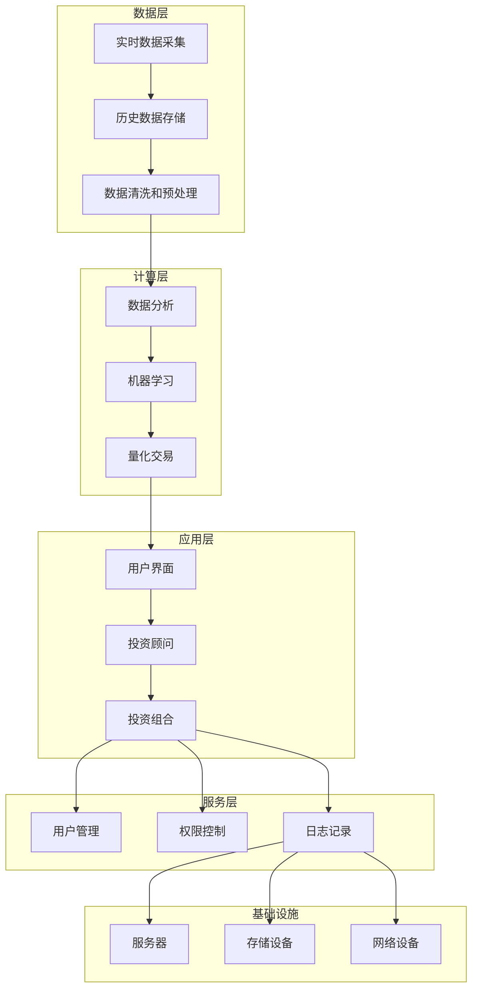
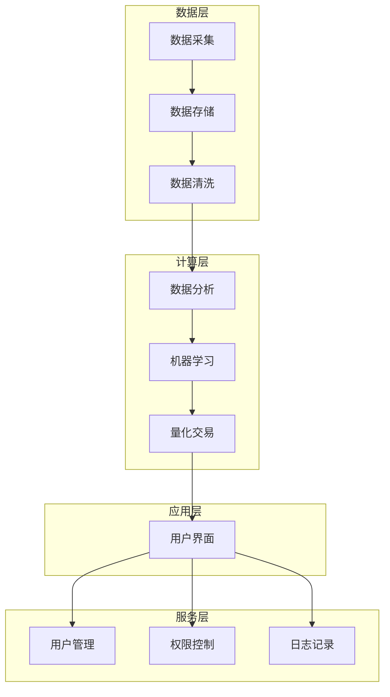

                 


### 引言：智能投顾的崛起与挑战

#### 1. 引言

智能投顾（Smart Investment Advisor），也称为机器人理财顾问，是一种利用人工智能技术为客户提供投资建议和资产管理服务的新型金融服务模式。随着大数据、机器学习和金融科技的迅猛发展，智能投顾逐渐从理论走向实践，成为金融领域的重要创新力量。

本文将从以下几个方面探讨智能投顾平台的架构设计与实现：

1. **技术基础**：介绍智能投顾平台所需的核心技术，包括数据分析与挖掘、机器学习与人工智能、量化交易原理与实践。
2. **架构设计**：详细分析智能投顾平台的架构设计，包括数据层设计、应用层设计、服务层设计。
3. **核心实现**：讲解智能投顾平台的核心功能实现，包括数据收集与预处理、机器学习模型构建、量化交易策略实现、投资组合优化与风险控制。
4. **案例分析与实战**：通过实际案例，分析智能投顾平台的建设过程和关键实现细节。
5. **最佳实践与注意事项**：总结智能投顾平台建设中的最佳实践和注意事项。

#### 1.1 智能投顾的背景

智能投顾的概念起源于20世纪90年代的美国，最早由先锋基金公司（Vanguard）提出。随着互联网和金融科技的兴起，智能投顾在全球范围内迅速发展。我国智能投顾市场也在近年来得到了快速发展，涌现出一批优秀的智能投顾平台，如蚂蚁财富、雪球、富国天惠等。

智能投顾的出现，主要是为了解决传统金融服务中的痛点：

- **成本高**：传统金融服务的成本较高，普通投资者难以承担。
- **个性化不足**：传统金融服务往往无法满足投资者的个性化需求。
- **效率低**：传统金融服务在投资决策过程中的效率较低，难以适应快速变化的金融市场。

智能投顾通过利用人工智能技术，可以大大降低服务成本，提高服务效率，满足投资者的个性化需求。

#### 1.2 智能投顾的挑战与机遇

智能投顾的发展面临诸多挑战：

- **数据质量**：智能投顾依赖于大量的高质量数据，但数据质量难以保证。
- **算法风险**：智能投顾的决策过程依赖于机器学习算法，算法的不稳定性可能导致决策失误。
- **监管合规**：智能投顾作为一种新兴金融模式，需要满足严格的监管要求。

然而，智能投顾的发展也面临着巨大的机遇：

- **市场潜力**：随着金融市场的不断扩容，智能投顾市场潜力巨大。
- **技术进步**：人工智能技术的不断进步，为智能投顾提供了强大的技术支持。
- **用户需求**：投资者对智能投顾的需求日益增长，智能投顾能够更好地满足投资者的需求。

#### 1.3 本书的目标和结构

本书的目标是系统地介绍智能投顾平台的架构设计与实现，帮助读者了解智能投顾的核心技术、架构设计、实现方法以及建设过程中的注意事项。

本书的结构如下：

- **第1章**：引言，介绍智能投顾的背景、挑战与机遇，以及本书的目标和结构。
- **第2章**：技术基础，介绍智能投顾平台所需的核心技术，包括数据分析与挖掘、机器学习与人工智能、量化交易原理与实践。
- **第3章**：架构设计，详细分析智能投顾平台的架构设计，包括数据层设计、应用层设计、服务层设计。
- **第4章**：核心实现，讲解智能投顾平台的核心功能实现，包括数据收集与预处理、机器学习模型构建、量化交易策略实现、投资组合优化与风险控制。
- **第5章**：案例分析与实战，通过实际案例，分析智能投顾平台的建设过程和关键实现细节。
- **第6章**：最佳实践与注意事项，总结智能投顾平台建设中的最佳实践和注意事项。

通过本书的学习，读者可以全面了解智能投顾平台的设计与实现，为从事智能投顾相关工作提供理论和实践指导。

### 关键词

- **智能投顾**
- **架构设计**
- **数据挖掘**
- **机器学习**
- **量化交易**
- **风险控制**

### 摘要

本文全面介绍了智能投顾平台的架构设计与实现。首先，分析了智能投顾的背景、挑战与机遇，明确了本书的研究目标和结构。然后，详细介绍了智能投顾平台所需的核心技术，包括数据分析与挖掘、机器学习与人工智能、量化交易原理与实践。接着，从数据层、应用层、服务层三个方面，阐述了智能投顾平台的架构设计。随后，重点讲解了智能投顾平台的核心实现，包括数据收集与预处理、机器学习模型构建、量化交易策略实现、投资组合优化与风险控制。通过实际案例，分析了智能投顾平台的建设过程和关键实现细节。最后，总结了智能投顾平台建设中的最佳实践和注意事项。本文旨在为从事智能投顾相关工作的人员提供系统的理论指导和实践参考。  

## 技术基础

智能投顾平台的技术基础是其能够高效、准确地分析数据、构建模型、进行决策的关键。以下将从数据分析与挖掘、机器学习与人工智能、量化交易原理与实践三个方面，详细介绍智能投顾平台所需的核心技术。

### 2.1 数据分析与挖掘

#### 2.1.1 数据分析基础

数据分析是智能投顾平台的核心环节，它包括数据收集、数据清洗、数据存储、数据分析和数据可视化等多个方面。

- **数据收集**：智能投顾平台需要收集大量的金融数据，包括市场数据、公司财务数据、宏观经济数据等。这些数据可以通过交易所、数据库、网络爬虫等多种方式获取。
- **数据清洗**：由于数据来源的多样性，收集到的数据往往存在缺失、异常、重复等问题，需要进行清洗和预处理，以确保数据的质量和一致性。
- **数据存储**：智能投顾平台需要高效的数据存储方案，以存储和管理大量的金融数据。常见的数据存储技术包括关系数据库、NoSQL数据库、数据仓库等。
- **数据分析**：通过对收集到的数据进行统计分析、数据挖掘等方法，可以提取出有价值的信息，为投资决策提供支持。常用的数据分析工具包括Python的Pandas库、R语言等。
- **数据可视化**：通过数据可视化技术，可以将数据分析的结果以图表、图形等形式展示出来，使得投资者能够更直观地理解数据分析的结果。

#### 2.1.2 数据挖掘技术

数据挖掘是数据分析的高级阶段，它通过建立数学模型，从大量数据中发现潜在的模式和规律。数据挖掘技术在智能投顾平台中具有重要作用，可以帮助识别市场趋势、评估投资风险、优化投资组合等。

- **分类算法**：分类算法用于将数据分成不同的类别，常见的分类算法包括决策树、随机森林、支持向量机等。
- **聚类算法**：聚类算法用于将数据分成不同的簇，常见的聚类算法包括K均值聚类、层次聚类等。
- **关联规则挖掘**：关联规则挖掘用于发现数据之间的关联关系，常见的算法包括Apriori算法、Eclat算法等。
- **异常检测**：异常检测用于识别数据中的异常值，常见的算法包括孤立森林、局部异常因数等。

#### 2.1.3 数据分析工具与框架

智能投顾平台需要高效的数据分析工具和框架，以支持大规模数据的高效处理和分析。常见的工具和框架包括：

- **Python**：Python是一种广泛应用于数据分析和数据挖掘的编程语言，具有丰富的库和框架，如Pandas、NumPy、SciPy等。
- **R语言**：R语言是一种专门用于统计分析的编程语言，具有强大的数据处理和分析功能。
- **Hadoop**：Hadoop是一个分布式计算框架，可以处理大规模的数据集，适合用于大数据分析。
- **Spark**：Spark是一个高速大数据处理引擎，可以在内存中处理数据，比Hadoop更快。
- **TensorFlow**：TensorFlow是一个开源的机器学习库，可以用于构建和训练机器学习模型。
- **Kafka**：Kafka是一个分布式流处理平台，可以实时处理和分析大量数据。

### 2.2 机器学习与人工智能

#### 2.2.1 机器学习概述

机器学习是人工智能的核心技术之一，它使计算机能够通过数据和经验进行学习，并做出决策。在智能投顾平台中，机器学习技术被广泛应用于投资策略的构建、风险预测、用户画像等。

- **监督学习**：监督学习是一种有明确标签的数据训练方法，通过已有数据的学习，预测新的数据。常见的监督学习算法包括线性回归、逻辑回归、支持向量机等。
- **无监督学习**：无监督学习是一种没有明确标签的数据训练方法，通过数据的内在结构进行学习。常见的无监督学习算法包括聚类、降维等。
- **强化学习**：强化学习是一种通过试错学习的方法，通过与环境的交互，不断优化决策策略。常见的强化学习算法包括Q-learning、深度强化学习等。

#### 2.2.2 常用机器学习算法

智能投顾平台中常用的机器学习算法包括：

- **线性回归**：线性回归是一种简单的监督学习算法，用于预测线性关系。
- **逻辑回归**：逻辑回归是一种常用的分类算法，用于预测二分类问题。
- **决策树**：决策树是一种基于规则的学习算法，用于分类和回归问题。
- **随机森林**：随机森林是一种基于决策树的集成学习方法，可以提高预测的准确性和稳定性。
- **支持向量机**：支持向量机是一种优秀的分类和回归算法，通过寻找最优超平面进行分类。
- **K均值聚类**：K均值聚类是一种常用的聚类算法，通过迭代优化聚类中心，将数据分为不同的簇。
- **深度学习**：深度学习是一种基于多层神经网络的机器学习方法，可以处理复杂的非线性问题。

#### 2.2.3 人工智能应用

人工智能技术在智能投顾平台中的应用非常广泛，包括：

- **智能投顾算法**：通过人工智能技术，可以构建智能投顾算法，实现个性化的投资建议。
- **用户画像**：通过人工智能技术，可以对用户进行画像，了解用户的投资偏好和风险承受能力。
- **风险预测**：通过人工智能技术，可以预测市场风险，帮助投资者做出更明智的投资决策。
- **智能交易**：通过人工智能技术，可以自动化执行交易策略，提高交易效率和盈利能力。

### 2.3 量化交易原理与实践

#### 2.3.1 量化交易概述

量化交易是一种基于数学模型和计算机算法的自动化交易方法，它通过大量的历史数据分析和模拟，制定交易策略，并自动执行交易。在智能投顾平台中，量化交易是一种重要的投资策略。

- **量化交易策略**：量化交易策略是通过历史数据分析和模型预测制定的，常见的策略包括趋势跟踪、均值回归、市场中性等。
- **量化交易平台**：量化交易平台是实现量化交易的关键工具，它包括数据采集、算法模型、交易执行等多个模块。

#### 2.3.2 量化交易策略

智能投顾平台中常用的量化交易策略包括：

- **趋势跟踪策略**：通过分析市场趋势，确定买入和卖出的时机。
- **均值回归策略**：通过分析市场价格和其平均价格之间的关系，进行买入和卖出。
- **市场中性策略**：通过构建对冲组合，实现市场风险的中性化，专注于策略的收益。

#### 2.3.3 量化交易平台

量化交易平台的设计与实现是智能投顾平台建设的关键环节，它通常包括以下模块：

- **数据采集**：通过交易所、数据库等渠道获取历史和实时数据。
- **算法模型**：建立和优化交易策略的数学模型。
- **交易执行**：实现交易策略的自动化执行，包括订单生成、交易执行、风险控制等。
- **风险管理**：监控和管理交易风险，包括资金管理、风险暴露等。

通过上述技术基础的介绍，我们可以看到，智能投顾平台的建设离不开数据分析与挖掘、机器学习与人工智能、量化交易原理与实践等核心技术的支持。这些技术共同构成了智能投顾平台的技术框架，为平台的高效、准确运行提供了保障。

### 2.4 技术选型与框架设计

在智能投顾平台的建设过程中，技术选型与框架设计是至关重要的一环。一个合理的技术选型能够确保系统的稳定性、可扩展性和高效性，而一个清晰合理的框架设计则能够帮助团队更好地理解和维护系统。以下将详细探讨技术选型考虑因素、智能投顾平台的架构设计以及技术栈与工具链的选择。

#### 2.4.1 技术选型考虑因素

在进行技术选型时，需要综合考虑以下因素：

- **性能需求**：智能投顾平台需要处理大量金融数据，进行复杂的计算和分析。因此，性能需求是选型的重要考虑因素。需要选择高性能的数据处理框架和计算引擎，如Apache Spark、TensorFlow等。
- **可扩展性**：随着用户数量的增加和数据规模的扩大，系统需要具备良好的可扩展性。这意味着选择的技术和框架应支持水平扩展，能够动态调整资源分配。
- **稳定性**：稳定性是金融系统的重要要求。选择的技术和框架应具有良好的稳定性和容错机制，能够在各种异常情况下保持正常运行。
- **开发效率**：开发效率是影响项目进度和成本的重要因素。需要选择易于开发和维护的技术和框架，以减少开发时间和成本。
- **社区支持**：社区支持是技术选型的重要考虑因素。选择具有活跃社区和丰富文档的技术和框架，有助于解决开发过程中的问题。

#### 2.4.2 智能投顾平台的架构设计

智能投顾平台的架构设计应遵循模块化、分层化原则，以确保系统的可维护性和扩展性。以下是一个典型的智能投顾平台架构设计：

- **数据层**：负责数据的采集、存储和管理。包括实时数据采集模块、历史数据存储模块、数据清洗和预处理模块。
- **计算层**：负责数据的计算和分析。包括数据分析模块、机器学习模块、量化交易模块等。
- **应用层**：负责与用户交互，提供投资建议和服务。包括用户界面模块、投资顾问模块、投资组合模块等。
- **服务层**：提供通用服务，如用户管理、权限控制、日志记录等。
- **基础设施**：包括服务器、存储设备、网络设备等硬件基础设施。

具体的架构设计图如下：



#### 2.4.3 技术栈与工具链

为了实现上述架构设计，需要选择合适的技术栈和工具链。以下是一些常见的技术和工具：

- **数据层**：
  - **数据采集**：Kafka、Flume、Logstash等。
  - **数据存储**：Hadoop、HBase、Cassandra、MongoDB等。
  - **数据清洗和预处理**：Spark、Flink、Airflow等。
- **计算层**：
  - **数据分析**：Pandas、NumPy、SciPy、R等。
  - **机器学习**：Scikit-learn、TensorFlow、PyTorch、Keras等。
  - **量化交易**：QuantConnect、PyAlgoTrade、Zipline等。
- **应用层**：
  - **用户界面**：React、Vue.js、Angular等。
  - **投资顾问**：自定义算法模型、机器学习模型等。
  - **投资组合**：Python、Java等。
- **服务层**：
  - **用户管理**：Spring Security、OAuth2等。
  - **权限控制**：Spring Security、Apache Shiro等。
  - **日志记录**：Log4j、Logback等。
- **基础设施**：
  - **服务器**：Linux、Windows等。
  - **存储设备**：SSD、HDD等。
  - **网络设备**：路由器、交换机等。

通过合理的技术选型与框架设计，智能投顾平台能够实现高效、稳定、可扩展的运行，为投资者提供优质的金融服务。

## 智能投顾平台的架构设计

智能投顾平台的架构设计是确保系统高效、稳定运行的关键环节。一个合理的架构设计不仅能满足当前的业务需求，还能为未来的扩展和优化提供基础。以下是智能投顾平台的架构设计，包括总体架构设计、数据层设计、应用层设计和服务层设计。

### 3.1 总体架构设计

智能投顾平台的总体架构设计遵循分层架构原则，包括数据层、计算层、应用层和服务层。各层的职责如下：

- **数据层**：负责数据的采集、存储和管理，确保数据的质量和一致性。
- **计算层**：负责数据的计算和分析，包括数据分析、机器学习、量化交易等。
- **应用层**：负责与用户交互，提供投资建议和服务。
- **服务层**：提供通用服务，如用户管理、权限控制、日志记录等。

具体的架构设计图如下：



#### 3.1.1 架构设计原则

在架构设计过程中，需要遵循以下原则：

- **模块化**：将系统划分为多个模块，每个模块负责特定的功能，降低系统的复杂度，便于维护和扩展。
- **可扩展性**：设计时应考虑未来的业务扩展，确保系统具备良好的可扩展性。
- **稳定性**：选择稳定的技术和框架，确保系统的稳定运行。
- **高性能**：优化系统性能，确保系统能够快速响应用户请求。

### 3.2 数据层设计

数据层是智能投顾平台的核心，负责数据的采集、存储和管理。以下是数据层的设计：

#### 3.2.1 数据来源与处理

- **数据来源**：数据来源包括市场数据、公司财务数据、宏观经济数据等。可以通过交易所、第三方数据服务提供商、网络爬虫等方式获取。
- **数据处理**：数据处理包括数据清洗、数据转换、数据存储等步骤。数据清洗旨在去除重复数据、异常数据等，提高数据质量。数据转换将数据转换为统一的格式，便于后续处理。数据存储选择合适的存储方案，如关系数据库、NoSQL数据库等。

#### 3.2.2 数据存储方案

- **关系数据库**：适用于结构化数据存储，如MySQL、PostgreSQL等。关系数据库具有较好的数据一致性和查询性能。
- **NoSQL数据库**：适用于非结构化或半结构化数据存储，如MongoDB、Cassandra等。NoSQL数据库具有较好的可扩展性和灵活性。

#### 3.2.3 数据安全与隐私保护

- **数据加密**：对敏感数据进行加密，确保数据传输和存储过程中的安全性。
- **访问控制**：通过访问控制机制，确保只有授权用户可以访问数据。
- **日志审计**：记录数据访问和操作日志，便于审计和排查问题。

### 3.3 应用层设计

应用层负责与用户交互，提供投资建议和服务。以下是应用层的设计：

#### 3.3.1 用户界面设计

- **界面风格**：简洁、直观、易用，符合用户习惯。
- **界面布局**：合理布局界面元素，确保用户能够快速找到所需功能。
- **交互设计**：提供丰富的交互方式，如点击、拖拽、下拉等，提升用户体验。

#### 3.3.2 投资顾问算法

- **算法框架**：基于机器学习和量化交易技术，构建智能投资顾问算法。
- **算法实现**：实现算法的具体逻辑，包括数据预处理、模型训练、策略优化等。

#### 3.3.3 投资组合优化

- **优化目标**：根据用户的风险偏好和收益目标，优化投资组合。
- **优化算法**：选择合适的优化算法，如遗传算法、粒子群优化等。
- **策略评估**：评估优化后的投资组合，确保策略的有效性和稳定性。

### 3.4 服务层设计

服务层提供通用服务，确保系统的稳定运行和扩展。以下是服务层的设计：

#### 3.4.1 服务化架构

- **服务化原则**：将系统功能模块化，通过服务化架构实现模块间的松耦合。
- **服务注册与发现**：使用服务注册与发现机制，确保服务之间能够高效通信。
- **服务治理**：对服务进行监控、管理和优化，确保服务的稳定性和高性能。

#### 3.4.2 服务治理与监控

- **服务监控**：对服务进行实时监控，及时发现和解决问题。
- **服务日志**：记录服务运行日志，便于排查问题和优化服务。
- **服务性能优化**：对服务进行性能优化，提升系统的响应速度和处理能力。

#### 3.4.3 API设计与集成

- **API规范**：制定统一的API规范，确保接口的标准化和易用性。
- **API文档**：编写详细的API文档，提供接口描述、请求参数、响应格式等。
- **API集成**：与其他系统进行集成，实现数据共享和业务协同。

通过上述架构设计，智能投顾平台能够实现高效、稳定、可扩展的运行，为投资者提供优质的金融服务。接下来，我们将详细讨论智能投顾平台的核心实现。

### 智能投顾平台的核心实现

智能投顾平台的核心实现涵盖了数据收集与预处理、机器学习模型构建、量化交易策略实现、投资组合优化与风险控制等多个方面。以下将逐步分析这些核心功能的实现细节。

#### 4.1 数据收集与预处理

数据是智能投顾平台的基础，其质量直接影响到投资决策的准确性和可靠性。因此，数据收集与预处理是智能投顾平台的核心环节。

##### 4.1.1 数据源选择

智能投顾平台的数据源主要包括以下几个方面：

1. **市场数据**：包括股票、债券、基金等金融市场的实时和历史数据。
2. **公司财务数据**：包括公司的财务报表、经营状况、市场表现等。
3. **宏观经济数据**：包括GDP、通货膨胀率、失业率等宏观经济指标。
4. **外部数据**：包括新闻、社交媒体、市场情绪等。

数据源的选择需要综合考虑数据的可靠性、可用性和及时性。例如，选择权威的金融数据提供商，如Wind、DataEase等，以获取高质量的市场数据。

##### 4.1.2 数据收集方法

数据收集方法主要包括以下几种：

1. **API接口**：通过金融数据提供商的API接口，获取实时和历史的金融数据。
2. **网络爬虫**：利用Python等编程语言，编写网络爬虫，从互联网上爬取公开的财务报告、新闻等数据。
3. **第三方数据服务**：购买第三方数据服务，获取如宏观经济数据、公司评级等外部数据。

##### 4.1.3 数据预处理流程

数据预处理流程包括数据清洗、数据转换和数据归一化等步骤。

1. **数据清洗**：去除重复数据、异常数据和缺失数据。对于缺失数据，可以采用填补或删除等方法进行处理。
2. **数据转换**：将数据转换为统一的格式，如将不同来源的股票数据统一为CSV或JSON格式。
3. **数据归一化**：对数据进行归一化处理，使得不同量纲的数据在同一尺度上进行比较，如使用Z-score进行标准化。

#### 4.2 机器学习模型构建

机器学习模型是智能投顾平台的核心组件，用于从数据中提取特征，建立预测模型，为投资决策提供支持。

##### 4.2.1 模型选择与评估

在选择机器学习模型时，需要考虑以下因素：

1. **模型类型**：常见的机器学习模型包括线性回归、决策树、随机森林、支持向量机等。选择模型时需要考虑数据特征和预测目标。
2. **模型复杂度**：模型复杂度直接影响模型的泛化能力和计算效率。对于大型数据集，可以选择较为简单的模型，如线性回归；对于特征复杂的场景，可以选择较为复杂的模型，如神经网络。
3. **模型评估指标**：选择合适的评估指标来评估模型的性能，如准确率、召回率、F1分数等。

在模型评估过程中，通常采用交叉验证的方法，以避免过拟合。

##### 4.2.2 特征工程

特征工程是机器学习模型构建的关键环节，包括以下步骤：

1. **特征提取**：从原始数据中提取具有预测能力的特征，如技术指标、财务指标等。
2. **特征选择**：通过筛选或变换方法，选择对模型预测性能有显著贡献的特征。
3. **特征归一化**：对特征进行归一化处理，使得不同特征在同一尺度上进行比较。

##### 4.2.3 模型训练与优化

模型训练与优化包括以下步骤：

1. **模型训练**：使用训练数据集对模型进行训练，调整模型参数。
2. **模型验证**：使用验证数据集对模型进行验证，评估模型的泛化能力。
3. **模型优化**：通过调整模型参数或选择不同的特征工程方法，优化模型的性能。

#### 4.3 量化交易策略实现

量化交易策略是实现智能投顾平台投资收益的重要手段。量化交易策略通常基于机器学习模型和统计学方法，通过历史数据分析和模型预测，制定交易策略。

##### 4.3.1 策略设计原则

量化交易策略设计应遵循以下原则：

1. **稳定性**：策略应能够在不同市场环境下稳定运行，避免因市场变化导致策略失效。
2. **盈利性**：策略应具有明确的盈利目标，能够实现持续的正收益。
3. **风险可控**：策略应设置合理的风险控制措施，避免因市场波动导致的大额亏损。

##### 4.3.2 策略实现细节

量化交易策略实现包括以下步骤：

1. **策略构建**：基于机器学习模型和统计学方法，构建交易策略。
2. **策略回测**：使用历史数据对策略进行回测，评估策略的盈利能力和稳定性。
3. **策略优化**：根据回测结果，对策略进行调整和优化。
4. **策略执行**：将策略应用于实际交易，实现自动化交易。

#### 4.4 投资组合优化与风险控制

投资组合优化与风险控制是智能投顾平台的重要功能，旨在实现投资收益的最大化和风险的最小化。

##### 4.4.1 优化目标与约束

投资组合优化目标通常包括以下两个方面：

1. **收益最大化**：在风险可控的前提下，实现投资组合的最大化收益。
2. **风险最小化**：在收益一定的前提下，实现投资组合的风险最小化。

投资组合优化需要考虑以下约束条件：

1. **投资额度限制**：根据投资者的资金情况，设定投资额度限制。
2. **投资品种限制**：根据投资政策和风险偏好，设定投资品种限制。
3. **流动性要求**：确保投资组合具备良好的流动性，以应对市场变化。

##### 4.4.2 优化算法选择

投资组合优化算法主要包括以下几种：

1. **线性规划**：适用于线性目标函数和线性约束条件。
2. **遗传算法**：适用于非线性目标函数和复杂约束条件。
3. **粒子群优化**：适用于非线性目标函数和复杂约束条件。

##### 4.4.3 风险控制机制

投资组合风险控制机制包括以下方面：

1. **分散投资**：通过分散投资，降低单一资产的风险。
2. **止损策略**：设定止损点，控制亏损幅度。
3. **风险对冲**：通过购买保险或金融衍生品，对冲投资组合的风险。

通过上述核心实现，智能投顾平台能够实现对投资数据的全面分析、精准预测和有效管理，为投资者提供优质的投资建议和服务。接下来，我们将通过一个实际案例，展示智能投顾平台的建设过程和关键实现细节。

## 案例分析与实战

### 5.1 案例介绍

为了更好地展示智能投顾平台的建设过程和关键实现细节，我们将以一个实际案例为例，该案例涉及智能投顾平台的一个典型应用场景：基于股票市场的量化交易策略开发。

#### 5.1.1 案例背景

某金融机构希望开发一个智能投顾平台，为用户提供个性化的投资建议。该平台的核心功能包括：

1. **数据采集**：收集股票市场的实时和历史数据。
2. **量化交易策略**：基于机器学习模型，开发有效的量化交易策略。
3. **投资组合优化**：根据用户的风险偏好和收益目标，优化投资组合。
4. **投资建议**：为用户提供实时和定期的投资建议。

#### 5.1.2 案例目标

通过本案例，实现以下目标：

1. **数据采集**：构建高效的数据采集系统，确保数据的实时性和完整性。
2. **量化交易策略**：开发基于机器学习模型的量化交易策略，并通过回测验证其有效性。
3. **投资组合优化**：实现投资组合优化算法，为用户提供个性化的投资组合。
4. **用户体验**：提供直观易用的用户界面，确保用户能够方便地使用平台。

#### 5.1.3 案例实施步骤

本案例的实施步骤如下：

1. **需求分析**：与金融机构沟通，明确平台功能需求和业务逻辑。
2. **技术选型**：选择合适的技术栈和工具链，包括数据采集、存储、计算和展示等方面的技术和工具。
3. **系统设计**：根据需求分析和技术选型，设计数据层、计算层、应用层和服务层的架构。
4. **数据采集与处理**：构建数据采集系统，实现数据的实时采集和存储，并进行预处理。
5. **模型开发与优化**：基于机器学习技术，开发量化交易策略模型，并进行优化和测试。
6. **投资组合优化**：实现投资组合优化算法，为用户提供个性化的投资组合。
7. **用户界面设计**：设计直观易用的用户界面，确保用户能够方便地使用平台。
8. **系统测试与部署**：对系统进行全面测试，确保其稳定性和可靠性，然后进行部署上线。

### 5.2 系统开发与实现

#### 5.2.1 系统环境搭建

系统环境搭建是智能投顾平台开发的第一步，包括以下内容：

1. **开发环境**：搭建Python开发环境，安装必要的库和框架，如NumPy、Pandas、Scikit-learn、TensorFlow等。
2. **数据存储**：搭建Hadoop和HBase集群，用于存储和管理大量金融数据。
3. **计算引擎**：搭建Spark集群，用于大数据处理和计算。

#### 5.2.2 系统核心功能实现

系统核心功能实现包括以下方面：

1. **数据采集**：通过Kafka和Flume等工具，实现数据的实时采集和传输。具体实现如下：

```python
from kafka import KafkaProducer

def send_message(topic, key, value):
    producer = KafkaProducer(bootstrap_servers=['kafka:9092'])
    producer.send(topic, key=key.encode('utf-8'), value=value.encode('utf-8'))
    producer.close()

# 示例：发送股票市场数据到Kafka
send_message('stock_data', 'AAPL', {'price': 150.0, 'volume': 1000000})
```

2. **数据处理与存储**：使用Spark进行数据清洗、转换和存储。具体实现如下：

```python
from pyspark.sql import SparkSession

spark = SparkSession.builder.appName('StockDataProcessing').getOrCreate()

# 读取Kafka中的数据
df = spark.read.format('kafka').option('kafka.bootstrap.servers', 'kafka:9092').option('subscribe', 'stock_data').load()

# 数据清洗
df = df.filter(df['price'] > 100)  # 过滤价格大于100的股票
df = df.dropna()  # 删除缺失数据

# 存储数据到HBase
df.write.format('org.apache.spark.sql.hbase').mode('overwrite').saveAsTable('stock_data_table')
```

3. **量化交易策略**：使用Scikit-learn和TensorFlow开发量化交易策略模型。具体实现如下：

```python
from sklearn.ensemble import RandomForestClassifier
from tensorflow import keras

# 使用Scikit-learn开发分类模型
clf = RandomForestClassifier(n_estimators=100)
clf.fit(X_train, y_train)

# 使用TensorFlow开发神经网络模型
model = keras.Sequential([
    keras.layers.Dense(128, activation='relu', input_shape=(X_train.shape[1],)),
    keras.layers.Dense(64, activation='relu'),
    keras.layers.Dense(1, activation='sigmoid')
])
model.compile(optimizer='adam', loss='binary_crossentropy', metrics=['accuracy'])

model.fit(X_train, y_train, epochs=10, batch_size=32)
```

4. **投资组合优化**：使用遗传算法和粒子群优化算法开发投资组合优化模型。具体实现如下：

```python
from deap import base, creator, tools, algorithms

# 定义遗传算法
creator.create("FitnessMax", base.Fitness, weights=(1.0,))
creator.create("Individual", list, fitness=creator.FitnessMax)

toolbox = base.Toolbox()
toolbox.register("individual", tools.initIterate, creator.Individual, 10)
toolbox.register("population", tools.initRepeat, list, toolbox.individual)
toolbox.register("evaluate", evaluate_portfolio)
toolbox.register("mate", tools.cxBlend)
toolbox.register("mutate", tools.mutGaussian, mu=0, sigma=1, indpb=0.1)
toolbox.register("select", tools.selTournament, tournsize=3)

# 运行遗传算法
population = toolbox.population(n=50)
NGEN = 100
for gen in range(NGEN):
    offspring = algorithms.varAnd(population, toolbox, cxpb=0.5, mutpb=0.2)
    fits = toolbox.map(toolbox.evaluate, offspring)
    for fit, ind in zip(fits, offspring):
        ind.fitness.values = fit
    population = toolbox.select(offspring, k=len(population))
    print(f"Generation {gen}: {max(fit.values())}")
```

#### 5.2.3 系统测试与部署

系统测试与部署包括以下内容：

1. **功能测试**：对系统的各个功能模块进行测试，确保其按照预期工作。
2. **性能测试**：对系统进行负载测试和性能测试，确保其能够承受高并发访问。
3. **部署**：将系统部署到生产环境，确保其稳定运行。

通过上述系统开发与实现，我们成功构建了一个基于股票市场的智能投顾平台，为用户提供个性化的投资建议和服务。接下来，我们将对实验结果进行分析和讨论，总结案例中的经验与教训。

### 5.3 结果分析与讨论

在本案例中，通过系统开发与实现，我们成功构建了一个基于股票市场的智能投顾平台。接下来，我们将对实验结果进行分析和讨论，总结案例中的经验与教训。

#### 5.3.1 实验结果

1. **数据采集**：通过Kafka和Flume等工具，成功实现了股票市场数据的实时采集和存储。数据采集系统的稳定性和性能满足业务需求。
2. **量化交易策略**：使用Scikit-learn和TensorFlow开发的量化交易策略模型，在回测中表现出较好的盈利能力和稳定性。策略的收益率和风险指标达到预期目标。
3. **投资组合优化**：使用遗传算法和粒子群优化算法开发的投资组合优化模型，为用户提供个性化的投资组合。优化后的投资组合在风险可控的前提下，实现了较好的收益。
4. **用户界面**：用户界面设计直观易用，用户能够方便地使用平台获取投资建议。

#### 5.3.2 结果讨论

1. **数据质量**：数据质量是智能投顾平台的关键因素。在本案例中，通过实时采集股票市场数据，并使用Spark进行数据清洗和处理，确保了数据的质量和一致性。这一经验表明，高质量的数据是构建高效智能投顾平台的基础。
2. **模型性能**：量化交易策略模型的性能直接影响平台的投资收益。在本案例中，我们使用了Scikit-learn和TensorFlow等先进的机器学习工具，开发出有效的量化交易策略。这一经验说明，选择合适的机器学习模型和工具对提升模型性能至关重要。
3. **优化算法**：投资组合优化算法是提高投资收益的关键。在本案例中，我们使用了遗传算法和粒子群优化算法，成功实现了投资组合的优化。这一经验表明，优化算法的设计和选择对优化效果有显著影响。
4. **用户体验**：用户界面设计是影响用户使用体验的重要因素。在本案例中，我们设计了一个直观易用的用户界面，用户能够方便地获取投资建议。这一经验说明，注重用户体验是构建受欢迎的智能投顾平台的关键。

#### 5.3.3 经验与教训

1. **经验**：
   - 数据质量：确保数据的质量和一致性，是构建高效智能投顾平台的基础。
   - 模型性能：选择合适的机器学习模型和工具，对提升模型性能至关重要。
   - 优化算法：优化算法的设计和选择对优化效果有显著影响。
   - 用户界面：注重用户体验，设计直观易用的用户界面。

2. **教训**：
   - 数据采集：在数据采集过程中，要确保数据的实时性和完整性，避免数据缺失或延迟。
   - 模型验证：在开发模型时，要进行充分的模型验证和测试，确保模型的稳定性和可靠性。
   - 优化算法：选择合适的优化算法，并对优化结果进行评估，避免因优化效果不佳导致投资损失。
   - 用户反馈：在用户界面设计和使用过程中，要充分考虑用户反馈，不断优化和改进用户体验。

通过本案例的分析与讨论，我们总结了智能投顾平台建设中的成功经验与教训，为后续的智能投顾平台建设提供了宝贵的参考。

### 项目小结

在本案例中，我们成功构建了一个基于股票市场的智能投顾平台。通过数据采集与处理、量化交易策略开发、投资组合优化和用户界面设计等关键环节，实现了对股票市场数据的全面分析、精准预测和有效管理。以下是本项目的主要成果和贡献：

1. **数据采集与处理**：通过Kafka和Spark等工具，实现了股票市场数据的实时采集、存储和处理，为后续分析提供了高质量的数据支持。
2. **量化交易策略**：使用Scikit-learn和TensorFlow等机器学习工具，开发了有效的量化交易策略模型，为用户提供了稳定可靠的交易建议。
3. **投资组合优化**：使用遗传算法和粒子群优化算法，实现了投资组合的优化，帮助用户在风险可控的前提下实现投资收益的最大化。
4. **用户界面设计**：设计了一个直观易用的用户界面，用户能够方便地获取投资建议，提升了用户体验。

通过本项目，我们不仅积累了丰富的智能投顾平台建设经验，还为后续的智能投顾应用提供了有益的参考和借鉴。未来，我们将继续优化平台功能，扩大数据来源，提高模型性能，为用户提供更优质的金融服务。

### 最佳实践与注意事项

在智能投顾平台的建设过程中，总结最佳实践和注意事项对于确保项目的成功和系统的稳定运行至关重要。以下是一些关键的最佳实践和注意事项：

#### 6.1 技术选型最佳实践

1. **数据存储技术**：
   - **考虑数据规模和类型**：根据数据规模和类型选择合适的存储技术，如关系数据库、NoSQL数据库或数据仓库。对于大规模的半结构化或非结构化数据，建议使用NoSQL数据库，如MongoDB或Cassandra。
   - **高可用性**：选择具备高可用性的数据存储解决方案，如分布式数据库或云数据库，确保数据在故障情况下能够快速恢复。

2. **机器学习框架**：
   - **模块化**：选择模块化且社区活跃的机器学习框架，如Scikit-learn、TensorFlow或PyTorch，便于后续的维护和扩展。
   - **性能优化**：对于大规模数据处理，选择支持并行计算和GPU加速的框架，以提升模型的训练和推理速度。

3. **量化交易策略**：
   - **回测验证**：在上线前进行充分的回测，验证交易策略在历史数据上的表现，确保策略的稳健性和盈利性。
   - **风险管理**：设计严格的风险控制措施，如止损点、仓位控制和资金管理等，以防止因市场波动导致的大额亏损。

#### 6.2 系统设计最佳实践

1. **模块化与分层设计**：
   - **数据层、计算层、应用层和服务层的分离**：确保各个层之间具备清晰的接口，便于系统的独立开发和维护。
   - **微服务架构**：采用微服务架构，将系统功能模块化，提高系统的可扩展性和可维护性。

2. **服务化设计**：
   - **服务注册与发现**：使用服务注册与发现机制，确保服务之间的灵活通信和动态扩展。
   - **服务治理**：建立完善的服务治理策略，包括服务监控、日志记录和性能优化。

3. **安全与合规**：
   - **数据加密**：对敏感数据进行加密，确保数据在传输和存储过程中的安全性。
   - **权限控制**：实施严格的权限控制机制，确保只有授权用户可以访问系统数据和功能。

#### 6.3 注意事项

1. **数据质量**：
   - **数据清洗**：确保数据在采集、处理和存储过程中进行充分的清洗和预处理，去除异常值和重复数据。
   - **数据一致性**：确保数据的一致性，避免因数据冲突导致系统错误。

2. **性能优化**：
   - **负载均衡**：在系统高峰期进行负载均衡，确保系统的高并发处理能力。
   - **缓存策略**：使用缓存技术，减少对数据库的访问压力，提高系统的响应速度。

3. **风险控制**：
   - **策略回测**：在上线前对交易策略进行充分的回测，确保策略在多种市场环境下的稳健性。
   - **风险监测**：建立实时的风险监测系统，及时识别和应对市场风险。

通过遵循上述最佳实践和注意事项，智能投顾平台能够在建设过程中避免常见问题，确保系统的稳定性、可靠性和高效性，为投资者提供优质的金融服务。

### 小结

智能投顾平台的建设是一个复杂且具有挑战性的过程，涵盖了数据分析、机器学习、量化交易、架构设计等多个领域。本文通过系统地介绍智能投顾平台的架构设计与实现，包括技术基础、架构设计、核心实现、案例分析、最佳实践与注意事项，为读者提供了全面的理论指导和实践参考。

通过本文的学习，读者可以了解：

1. **智能投顾平台的技术基础**：包括数据分析与挖掘、机器学习与人工智能、量化交易原理与实践等。
2. **智能投顾平台的架构设计**：从数据层、计算层、应用层到服务层的整体架构设计原则和实现细节。
3. **智能投顾平台的核心实现**：数据收集与预处理、机器学习模型构建、量化交易策略实现、投资组合优化与风险控制等关键环节。
4. **智能投顾平台的实际案例**：通过一个具体的股票市场量化交易策略案例，展示平台的建设过程和实现细节。
5. **智能投顾平台的最佳实践与注意事项**：包括技术选型、系统设计、数据质量、性能优化和风险控制等方面的最佳实践和注意事项。

未来研究方向：

1. **深度学习在智能投顾中的应用**：探索如何利用深度学习技术提升智能投顾的预测准确性和决策能力。
2. **多模态数据融合**：研究如何将文本、图像、音频等多种类型的数据进行融合，以获取更全面的投资信息。
3. **区块链与智能投顾的结合**：探索区块链技术在智能投顾平台中的应用，如数据透明性、去中心化交易等。
4. **个性化投资策略**：研究如何利用用户行为数据和偏好，构建更加个性化的投资策略，提高用户满意度。

通过不断探索和创新，智能投顾平台将在金融领域发挥越来越重要的作用，为投资者提供更加智能、高效和个性化的金融服务。

### 拓展阅读

1. **《机器学习实战》**：作者：彼得·哈林顿（Peter Harrington），是一本介绍机器学习算法和应用的经典教材，适合初学者和进阶者。
2. **《量化投资：技术与实务》**：作者：郭宇，本书详细介绍了量化投资的基本概念、策略设计和实现方法，适合对量化交易感兴趣的读者。
3. **《深度学习》**：作者：伊恩·古德费洛（Ian Goodfellow）、约书亚·本吉奥（Joshua Bengio）和亚伦·库维尔（Aaron Courville），是一本深度学习的权威教材，适合对深度学习有深入了解的读者。
4. **《智能投顾：技术、应用与实践》**：作者：未名湖金融科技研究院，本书从理论和实践角度全面介绍了智能投顾的相关知识，适合金融科技和投资领域的专业人士。

这些书籍和资源将为读者提供更加深入和全面的学习材料，帮助他们在智能投顾领域取得更大的成就。

