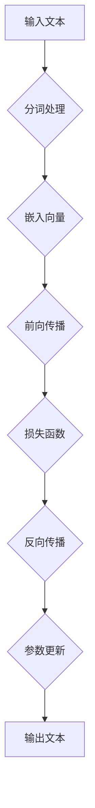
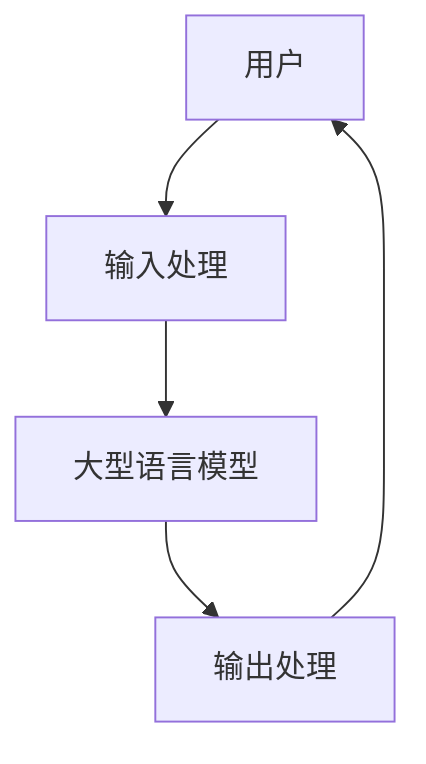
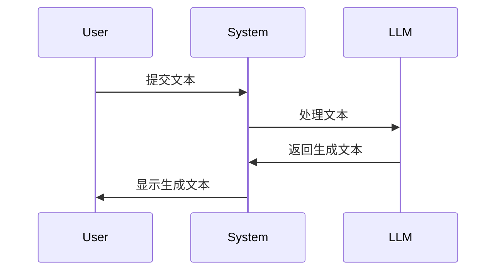

                 

# 智能故事生成 AI Agent：LLM 驱动的创意写作系统

## 关键词
- 智能故事生成
- AI Agent
- LLM
- 创意写作系统
- 自然语言处理
- 编程
- 软件架构
- 人工智能

## 摘要
本文将深入探讨智能故事生成AI Agent：LLM驱动的创意写作系统，从背景介绍、核心概念与联系、算法原理讲解、系统分析与架构设计方案、项目实战、最佳实践tips等方面，全面解析这一前沿技术。通过对LLM（大型语言模型）的深入理解，我们将展示如何构建一个能够生成高质量、创新故事的AI系统，为人工智能在文学创作领域的应用提供新思路。

## 第一部分：背景介绍

### 1.1 问题背景
在当今信息爆炸的时代，人们对内容的需求越来越大，尤其是文学作品的创作。然而，传统文学创作过程耗时且依赖于个人的创意和灵感。随着人工智能技术的发展，特别是自然语言处理（NLP）和深度学习技术的进步，人们开始思考是否有可能通过AI来辅助甚至完全取代人类的创作过程。

### 1.2 问题描述
文学创作是一项复杂而艺术性的任务，涉及到故事结构、人物刻画、情节设计、语言表达等多个方面。如何构建一个能够理解并生成高质量故事的AI系统，成为了当前研究的热点问题。

### 1.3 问题解决
随着LLM技术的兴起，研究人员发现，通过训练大型语言模型，AI能够模仿人类的写作风格，生成具有逻辑连贯性和创意性的故事。LLM驱动的创意写作系统正是在这一背景下应运而生。

### 1.4 边界与外延
虽然LLM在文学创作方面具有巨大潜力，但如何确保生成故事的多样性和原创性，如何处理道德和伦理问题，以及如何在实践中平衡创造性和可控性，仍然是需要深入探讨的问题。

### 1.5 概念结构与核心要素组成
本文将详细探讨LLM驱动的创意写作系统的概念结构，包括其核心组成部分：数据集、模型架构、训练过程、优化策略等。

## 第二部分：核心概念与联系

### 2.1 核心概念原理
在本节中，我们将介绍LLM的核心概念，包括其基本原理、工作机制以及与NLP技术的关联。

### 2.2 概念属性特征对比表格
为了更直观地理解LLM的特性，我们将通过一个对比表格，展示其与其他自然语言处理模型的差异。

| 特性 | LLM | 传统NLP模型 |
| ---- | ---- | ------------ |
| 语言理解能力 | 强 | 弱 |
| 自动学习能力 | 强 | 弱 |
| 文本生成能力 | 强 | 弱 |
| 适应性 | 高 | 低 |

### 2.3 ER实体关系图架构
为了更好地理解LLM驱动的创意写作系统的架构，我们将使用ER实体关系图来展示其核心实体及其关系。

```mermaid
erDiagram
  Character ||--|{ Story }|| Story
  Story ||--|{ Scene }|| Scene
  Character ||--|{ Dialogue }|| Dialogue
```

## 第三部分：算法原理讲解

### 3.1 算法mermaid流程图
在本节中，我们将使用mermaid语言绘制LLM算法的流程图，以便读者更好地理解其工作流程。



### 3.2 Python源代码讲解
为了更加直观地理解算法原理，我们将展示一段用于训练LLM的Python代码。

```python
import tensorflow as tf
from tensorflow.keras.models import Model
from tensorflow.keras.layers import Embedding, LSTM, Dense

# 定义模型
model = Model(inputs=[input_sequence], outputs=[output_sequence])
model.compile(optimizer='adam', loss='categorical_crossentropy', metrics=['accuracy'])

# 训练模型
model.fit(x_train, y_train, epochs=10, batch_size=32)
```

### 3.3 数学模型和公式
在本节中，我们将介绍LLM的数学模型，包括嵌入向量、前向传播、损失函数和反向传播等。

$$
\text{嵌入向量} = W^T \cdot \text{输入词向量}
$$

$$
\text{前向传播} = f(\text{嵌入向量} \cdot U + b)
$$

$$
\text{损失函数} = -\sum_{i=1}^{N} [y_i \cdot \log(\hat{y}_i)]
$$

$$
\text{反向传播} = \frac{\partial L}{\partial W} = \frac{\partial L}{\partial \hat{y}} \cdot \frac{\partial \hat{y}}{\partial W}
$$

### 3.4 详细讲解与举例说明
为了帮助读者更好地理解LLM的工作原理，我们将通过一个简单的例子来演示其如何生成故事。

### 第四部分：系统分析与架构设计方案

### 4.1 问题场景介绍
在本节中，我们将介绍一个具体的应用场景，展示LLM驱动的创意写作系统在实际中的潜在价值。

### 4.2 项目介绍
我们将介绍一个具体的LLM驱动创意写作项目，包括其目标、实现方式和预期效果。

### 4.3 系统功能设计
在本节中，我们将详细描述系统的功能设计，包括用户界面、生成故事、编辑和保存等功能。

### 4.4 系统架构设计
使用mermaid语言绘制系统架构图，展示LLM驱动创意写作系统的整体架构。



### 4.5 系统接口设计
在本节中，我们将介绍系统的接口设计，包括API接口和用户界面设计。

### 4.6 系统交互mermaid序列图
使用mermaid语言绘制系统交互序列图，展示用户与系统之间的交互过程。



### 第五部分：项目实战

### 5.1 环境安装
在本节中，我们将指导读者如何搭建LLM驱动创意写作系统的开发环境。

### 5.2 系统核心实现源代码
在本节中，我们将展示系统核心实现的源代码，并解释其工作原理。

### 5.3 代码应用解读与分析
我们将对核心源代码进行深入解读，分析其如何实现故事生成功能。

### 5.4 实际案例分析和详细讲解剖析
通过一个实际案例，我们将展示如何使用LLM驱动创意写作系统生成故事，并进行详细分析。

### 5.5 项目小结
在本节中，我们将总结项目实施过程中的经验教训，并对LLM驱动创意写作系统的未来应用进行展望。

### 第六部分：最佳实践 tips

### 6.1 小提示
在本节中，我们将分享一些实用的技巧和注意事项，帮助读者更好地使用LLM驱动创意写作系统。

### 6.2 注意事项
我们将列出使用系统时需要特别注意的事项，以避免潜在问题。

### 6.3 拓展阅读
在本节中，我们将推荐一些相关的扩展阅读资源，供读者进一步学习。

### 第七部分：小结

### 7.1 总结
在本节中，我们将回顾文章的主要内容，总结LLM驱动创意写作系统的优势和挑战。

### 7.2 展望
我们将展望LLM驱动创意写作系统的未来发展趋势，探讨其潜在的商业化前景。

---

**作者：AI天才研究院/AI Genius Institute & 禅与计算机程序设计艺术 /Zen And The Art of Computer Programming**

