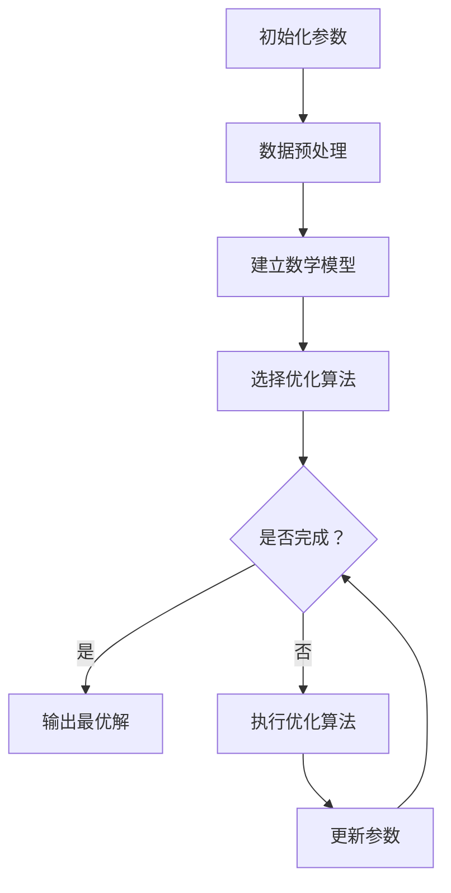
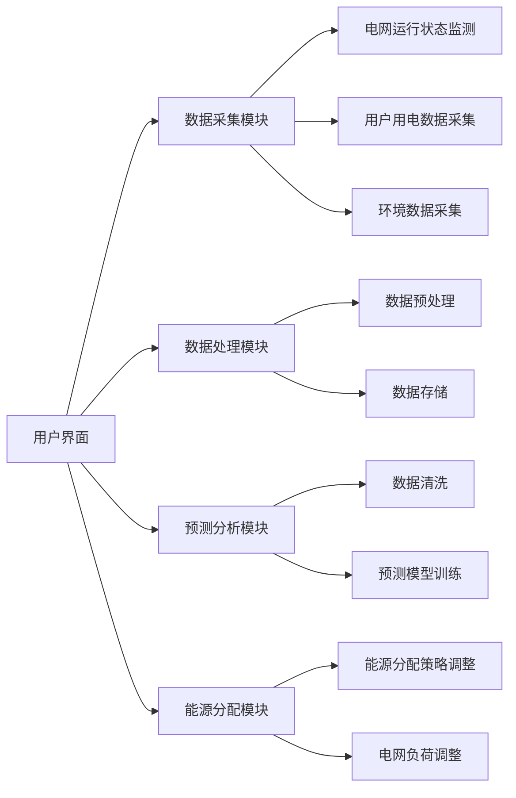
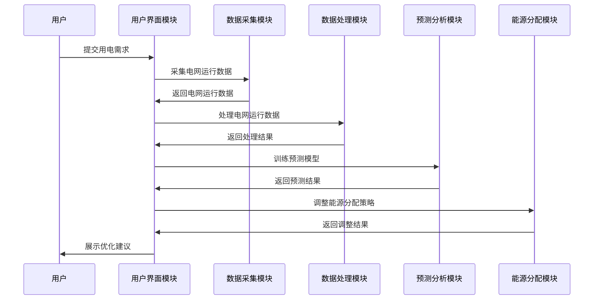
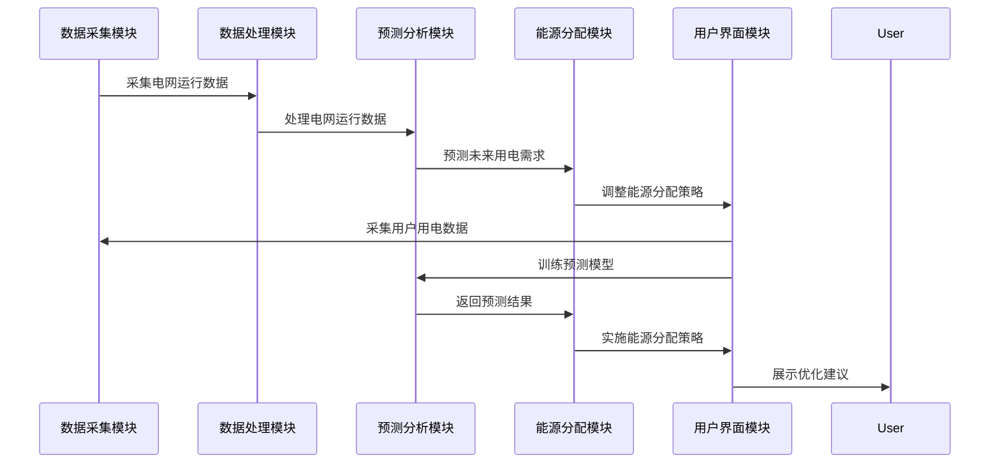

                 

## 文章标题

### 关键词

- 智能电网
- 能源分配优化
- 提示词优化
- 数学模型
- 算法
- 系统架构设计

### 摘要

本文旨在探讨智能电网管理员如何通过提示词优化实现能源分配的优化。首先，我们介绍了智能电网的背景、核心概念以及面临的挑战。接着，我们详细讲解了能源分配优化算法的原理和数学模型，并通过Python源代码示例来说明算法实现过程。随后，文章深入讨论了智能电网的系统架构设计和实现，包括功能设计、架构设计、接口设计和系统交互。通过实际项目案例的分析，本文进一步展示了算法在实际应用中的效果。最后，文章总结了最佳实践，并展望了智能电网的未来发展趋势。

## 引言与背景介绍

### 智能电网的兴起与挑战

#### 智能电网的定义与发展历程

智能电网是指通过先进的通信技术、自动化控制技术和电力电子技术，实现电力系统的信息流、业务流和能源流的深度融合，从而达到高效、可靠、可持续的电力供应和消费。智能电网的发展可以追溯到20世纪末，随着信息技术、物联网和可再生能源技术的发展，智能电网逐渐成为电力系统转型升级的重要方向。

#### 智能电网的核心问题与挑战

智能电网在发展过程中面临着诸多挑战。首先，能源分配效率低下是一个突出问题。传统电网中，能源从发电端到用户端的传输过程中存在损耗，导致能源利用效率不高。其次，用电高峰与低谷的平衡问题也困扰着智能电网的管理者。在用电高峰期，电网负荷较大，可能导致供电不稳定；而在用电低谷期，电网负荷较小，能源浪费严重。此外，可再生能源的集成与优化也是智能电网面临的挑战。随着可再生能源的快速发展，如何高效、安全地将其纳入电网体系，是实现智能电网可持续发展的关键。

### 问题描述

#### 能源分配效率低下

能源分配效率低下主要体现在两个方面：一是电网传输损耗，二是能源利用不充分。电网传输损耗主要由于电线、变压器等设备存在电阻，导致能量在传输过程中损失。能源利用不充分则表现在用户端的能源浪费，如家庭电器闲置时仍处于待机状态，消耗不必要的电力。

#### 用电高峰与低谷的平衡问题

用电高峰与低谷的平衡问题是智能电网管理的重要挑战。在用电高峰期，电网负荷迅速增加，可能导致供电不稳定，甚至出现断电现象。而在用电低谷期，电网负荷较低，能源浪费严重，无法实现能源的最优利用。

#### 可再生能源的集成与优化

可再生能源的集成与优化是智能电网发展的重要方向。可再生能源如太阳能、风能具有间歇性和不稳定性，如何将其高效、安全地集成到电网中，是实现智能电网可持续发展的关键。此外，可再生能源的优化分配，可以降低电网的峰谷差，提高能源利用效率。

### 问题解决思路

#### 提示词优化策略的作用

提示词优化策略是通过分析用户用电行为、环境因素等数据，预测未来用电需求，从而实现能源分配的优化。这种策略可以有效地解决能源分配效率低下、用电高峰与低谷平衡问题，以及可再生能源的集成与优化。

#### 关键技术概述

提示词优化策略的关键技术包括数据采集与分析、机器学习算法、优化算法等。数据采集与分析是实现提示词优化的基础，通过收集用户用电数据、环境数据等，可以准确预测未来用电需求。机器学习算法则用于分析数据、建立预测模型。优化算法则用于根据预测结果，调整能源分配策略，实现能源最优分配。

#### 边界与外延

##### 智能电网与其他能源系统的区别

智能电网与传统电网、分布式能源系统等存在明显区别。传统电网主要依赖大型发电厂，能源传输距离远，能源利用效率低。分布式能源系统则以小规模发电为主，能源传输距离近，能源利用效率高。智能电网则是将传统电网与分布式能源系统相结合，通过信息技术和自动化控制技术，实现能源的高效、可靠、可持续利用。

##### 提示词优化在智能电网中的应用范围

提示词优化策略在智能电网中具有广泛的应用范围，包括电力调度、能源管理、需求响应等。在电力调度方面，提示词优化可以预测未来电力需求，优化电力调度方案，提高电力供应稳定性。在能源管理方面，提示词优化可以预测用户用电行为，优化能源分配策略，降低能源消耗。在需求响应方面，提示词优化可以预测用户需求，调整电力供应，实现供需平衡。

## 核心概念与原理

### 核心概念

#### 智能电网管理员

智能电网管理员是指负责智能电网运行、管理和维护的专业人员。他们利用先进的技术手段，实时监控电网运行状态，分析用户用电需求，制定合理的能源分配策略，确保电网高效、稳定、安全运行。

#### 能源分配优化模型

能源分配优化模型是指用于分析、预测和优化能源分配的数学模型。该模型基于用户用电行为、环境因素等数据，通过机器学习算法和优化算法，实现对能源分配的精准预测和优化。

#### 提示词优化的基础算法

提示词优化的基础算法主要包括机器学习算法和优化算法。机器学习算法用于分析用户用电数据，建立预测模型；优化算法则用于根据预测结果，调整能源分配策略，实现能源最优分配。

### 概念属性特征对比表格

为了更好地理解智能电网管理员、能源分配优化模型和提示词优化的基础算法，我们可以通过以下表格进行属性特征对比：

| 概念名称               | 属性特征                                                     |
| ---------------------- | ------------------------------------------------------------ |
| 智能电网管理员         | 1. 负责智能电网运行、管理和维护<br>2. 利用先进技术实时监控电网状态<br>3. 制定能源分配策略 |
| 能源分配优化模型       | 1. 基于用户用电数据和环境因素<br>2. 通过机器学习算法预测未来用电需求<br>3. 通过优化算法调整能源分配策略 |
| 提示词优化的基础算法   | 1. 机器学习算法：分析用户用电数据，建立预测模型<br>2. 优化算法：根据预测结果，调整能源分配策略 |

### ER实体关系图架构

为了更加清晰地描述智能电网管理员、能源分配优化模型和提示词优化的基础算法之间的关联，我们可以通过ER（实体关系）图进行表示。以下是一个简单的ER图示例：

```mermaid
erDiagram
    User ||--|{ GridAdministrator : manages }
    EnergyAllocationModel ||--|{ GridAdministrator : uses }
    MachineLearningAlgorithm ||--|{ EnergyAllocationModel : implements }
    OptimizationAlgorithm ||--|{ EnergyAllocationModel : implements }
```

在ER图中，用户（User）与智能电网管理员（GridAdministrator）之间存在管理关系；能源分配优化模型（EnergyAllocationModel）与智能电网管理员之间存在使用关系；机器学习算法（MachineLearningAlgorithm）和优化算法（OptimizationAlgorithm）与能源分配优化模型之间存在实现关系。

通过以上核心概念与原理的阐述，我们为后续章节的深入探讨奠定了基础。接下来，我们将进一步探讨能源分配优化算法的原理、数学模型以及系统架构与实现，以期为智能电网管理员提供实用的优化策略。

## 能源分配优化算法原理

### 算法介绍

能源分配优化算法是智能电网管理中至关重要的一环，它通过分析用户用电数据和环境因素，预测未来用电需求，并在此基础上调整能源分配策略，从而实现能源的高效利用。以下是几种常见的能源分配优化算法及其分类：

#### 1. 线性规划算法

线性规划算法是一种基于线性数学模型的优化算法，适用于处理具有线性目标函数和线性约束条件的问题。其主要优点是计算速度快，能够快速得到最优解。

#### 2. 非线性规划算法

非线性规划算法适用于处理具有非线性目标函数和/或非线性约束条件的问题。与线性规划算法相比，非线性规划算法的计算复杂度较高，但可以处理更复杂的问题。

#### 3. 遗传算法

遗传算法是一种基于自然选择和遗传机制的优化算法，适用于处理大规模、非线性、复杂优化问题。其主要优点是具有全局搜索能力，能够找到最优或近似最优解。

#### 4. 粒子群优化算法

粒子群优化算法是一种基于群体智能的优化算法，模拟鸟群觅食行为，通过个体间的协同合作实现优化目标。其主要优点是计算简单，易于实现。

#### 5. 混合优化算法

混合优化算法是将多种优化算法结合，取长补短，以达到更好的优化效果。例如，将遗传算法与粒子群优化算法结合，可以同时利用两种算法的优点，提高优化性能。

### 选择合适的算法

在选择能源分配优化算法时，需要考虑以下几个因素：

1. **问题规模**：对于大规模问题，遗传算法和混合优化算法较为适用；对于小规模问题，线性规划算法和粒子群优化算法可能更为高效。

2. **目标函数特性**：如果目标函数是线性的，则线性规划算法是较好的选择；如果目标函数是非线性的，则需要考虑非线性规划算法或混合优化算法。

3. **约束条件**：算法需要能够有效处理约束条件。对于含有多个约束条件的问题，混合优化算法可能更为适用。

4. **计算资源**：算法的计算复杂度对计算资源的需求有很大影响。对于计算资源有限的情况，应选择计算速度较快的算法。

5. **优化效果**：选择算法时，需要考虑其对优化效果的提升程度。通过实验比较不同算法的优化效果，可以选择最合适的算法。

### 算法mermaid流程图

为了更好地理解能源分配优化算法的执行过程，我们可以使用mermaid流程图来展示其基本流程。以下是一个简单的mermaid流程图示例：



在mermaid流程图中，首先进行参数初始化和数据预处理，然后建立数学模型并选择优化算法。算法执行过程中，根据是否完成优化，循环执行优化算法和参数更新。最终，输出最优解。

### 算法原理讲解

#### 数学模型与公式

能源分配优化算法的核心是数学模型。以下是一个简单的线性规划数学模型示例：

$$
\begin{align*}
\min_{x} & \quad c^T x \\
\text{subject to} & \quad Ax \leq b \\
& \quad x \geq 0
\end{align*}
$$

其中，$c$ 是目标函数系数向量，$x$ 是决策变量向量，$A$ 是约束条件系数矩阵，$b$ 是约束条件向量。目标函数 $c^T x$ 用于衡量能源分配的效用，$Ax \leq b$ 表示能源分配的约束条件。

#### Python源代码实现

为了更好地理解算法的实现过程，我们可以使用Python语言实现一个简单的线性规划算法。以下是一个示例代码：

```python
import numpy as np
from scipy.optimize import linprog

# 目标函数系数
c = np.array([-1, -1])

# 约束条件系数矩阵
A = np.array([[1, 1]])

# 约束条件向量
b = np.array([4])

# 初始化参数
x0 = np.array([0, 0])

# 执行线性规划
result = linprog(c, A_ub=A, b_ub=b, x0=x0)

# 输出最优解
if result.success:
    print("最优解:", result.x)
else:
    print("未找到最优解")
```

在这个示例中，我们使用scipy.optimize模块中的linprog函数执行线性规划。初始化参数后，执行线性规划并输出最优解。

#### 举例说明

假设有一个家庭在一天内的用电需求为4千瓦时，其中厨房用电和客厅用电的比例分别为1:1。我们需要通过优化算法确定厨房和客厅的用电量，使得总用电量最小。

1. **建立数学模型**：

$$
\begin{align*}
\min_{x} & \quad x_1 + x_2 \\
\text{subject to} & \quad x_1 + x_2 = 4 \\
& \quad x_1, x_2 \geq 0
\end{align*}
$$

2. **选择优化算法**：

我们可以选择线性规划算法进行优化。

3. **执行优化算法**：

使用Python源代码实现线性规划算法，得到最优解。

4. **输出结果**：

最优解为$x_1 = x_2 = 2$千瓦时，即厨房和客厅的用电量均为2千瓦时。

通过以上步骤，我们成功地实现了能源分配的优化，使得家庭用电总量最小。这个简单的例子展示了能源分配优化算法的基本原理和实现过程。

## 数学模型与公式详细讲解

### 数学模型概述

在能源分配优化过程中，数学模型是核心工具，用于描述能源分配的目标和约束条件。一个典型的数学模型通常包括目标函数和约束条件两个主要部分。以下是一个基本的数学模型示例：

#### 目标函数

$$
\min_{x} \quad f(x)
$$

其中，$x$ 是决策变量，$f(x)$ 是目标函数，用于衡量能源分配的效用。例如，最小化能源消耗、最大化能源利用率等。

#### 约束条件

$$
g(x) \leq 0 \quad \text{或} \quad h(x) = 0
$$

其中，$g(x)$ 和 $h(x)$ 分别表示不等式约束和等式约束。这些约束条件反映了实际应用中的物理限制、安全限制等。

### 概念属性特征对比表格

为了更好地理解不同数学模型的特点和适用范围，我们可以通过以下表格进行属性特征对比：

| 模型名称 | 目标函数 | 约束条件 | 适用范围 |
| :----: | :------: | :------: | :------: |
| 线性规划 | 线性目标函数 | 线性不等式约束和等式约束 | 简单线性问题 |
| 非线性规划 | 非线性目标函数 | 非线性不等式约束和等式约束 | 复杂非线性问题 |
| 整数规划 | 目标函数（线性或非线性） | 变量取整约束 | 整数决策问题 |
| 动态规划 | 目标函数（线性或非线性） | 状态转移方程和边界条件 | 需要时间序列决策的问题 |

### 公式推导与详细解释

#### 线性规划公式

线性规划是一种最简单的数学模型，适用于处理具有线性目标函数和线性约束条件的问题。其标准形式如下：

$$
\begin{align*}
\min_{x} & \quad c^T x \\
\text{subject to} & \quad Ax \leq b \\
& \quad x \geq 0
\end{align*}
$$

其中，$c$ 是目标函数系数向量，$x$ 是决策变量向量，$A$ 是约束条件系数矩阵，$b$ 是约束条件向量。

**推导过程**：

1. **目标函数**：

目标函数 $c^T x$ 用于衡量能源分配的效用，例如最小化能源消耗或最大化能源利用率。目标函数的系数$c$反映了不同变量对目标函数的贡献程度。

2. **约束条件**：

约束条件 $Ax \leq b$ 描述了能源分配的物理限制。例如，电力容量限制、设备运行限制等。$A$ 是约束条件系数矩阵，$b$ 是约束条件向量。

3. **非负约束**：

$x \geq 0$ 表示决策变量的取值范围必须为非负数，这在能源分配问题中是常见的约束条件。

#### 非线性规划公式

非线性规划是处理非线性目标函数和/或非线性约束条件的问题。其标准形式如下：

$$
\begin{align*}
\min_{x} & \quad f(x) \\
\text{subject to} & \quad g(x) \leq 0 \\
& \quad h(x) = 0
\end{align*}
$$

其中，$f(x)$ 是非线性目标函数，$g(x)$ 和 $h(x)$ 分别表示非线性不等式约束和等式约束。

**推导过程**：

1. **目标函数**：

非线性目标函数 $f(x)$ 用于衡量能源分配的效用，可能涉及复杂的非线性关系，如能量损耗、系统响应等。

2. **约束条件**：

非线性不等式约束 $g(x) \leq 0$ 描述了能源分配的物理限制，可能涉及非线性关系，如设备容量限制、环境限制等。

等式约束 $h(x) = 0$ 描述了系统的平衡条件，如供需平衡、能源传输平衡等。

### 复杂公式举例

以下是一个复杂公式示例，用于描述能源分配问题中的非线性约束条件：

$$
X(t) = \sum_{i=1}^{n} x_i(t)
$$

其中，$X(t)$ 是在时间 $t$ 时刻的总能源消耗，$x_i(t)$ 是在时间 $t$ 时刻的第 $i$ 种能源的消耗量，$n$ 是能源种类数。

**解释**：

这个公式表示在时间 $t$ 时刻，总能源消耗量 $X(t)$ 是所有能源种类消耗量 $x_i(t)$ 的总和。这个公式反映了能源分配的总量控制，确保总能源消耗不超过设定的阈值。

通过以上详细讲解，我们了解了能源分配优化中的数学模型和公式。这些模型和公式为优化算法的设计和实现提供了理论基础。在下一章节中，我们将进一步探讨智能电网的系统架构设计和实现。

## 系统分析与架构设计

### 问题场景介绍

在当前智能电网的背景下，为了实现高效、可靠、可持续的能源分配，我们需要对系统进行详细的架构设计和实现。本文将分析一个典型的智能电网问题场景，并在此基础上介绍项目情况、系统功能设计、系统架构设计、系统接口设计和系统交互。

### 项目介绍

该项目旨在开发一套智能电网管理系统，通过实时监控电网运行状态，分析用户用电需求，优化能源分配策略，提高电网运行效率和用户满意度。系统主要包括以下几个模块：

1. **数据采集模块**：负责实时采集电网运行数据、用户用电数据和环境数据等。
2. **数据处理模块**：负责对采集到的数据进行预处理、存储和清洗，为后续分析提供高质量的数据。
3. **预测分析模块**：利用机器学习算法和优化算法，预测未来用电需求，为能源分配提供依据。
4. **能源分配模块**：根据预测结果，调整能源分配策略，实现能源的高效利用。
5. **用户界面模块**：提供用户交互界面，展示电网运行状态、能源分配情况和优化建议。

### 系统功能设计（领域模型mermaid类图）

为了更好地理解系统功能设计，我们可以通过mermaid类图来展示系统的核心类及其关系。以下是一个简单的mermaid类图示例：

```mermaid
classDiagram
    Class01 <|-- Class02
    Class01 <|-- Class03
    Class04 <..|{used by} Class01
    Class04 <..|{uses} Class03
    Class02 <|-- Class05
    Class03 <|-- Class05
    Class05 <|-- Class06
    Class06 <|-- Class07
    Class07 <|-- Class08

    Class01{数据采集模块}
    Class02{数据处理模块}
    Class03{预测分析模块}
    Class04{能源分配模块}
    Class05{用户界面模块}
    Class06{电网运行状态监测}
    Class07{用户用电需求预测}
    Class08{能源分配策略调整}
```

在mermaid类图中，系统的主要类及其关系如下：

1. **数据采集模块（Class01）**：负责采集电网运行数据、用户用电数据和环境数据等。
2. **数据处理模块（Class02）**：负责对采集到的数据进行预处理、存储和清洗。
3. **预测分析模块（Class03）**：负责利用机器学习算法和优化算法预测未来用电需求。
4. **能源分配模块（Class04）**：负责根据预测结果，调整能源分配策略。
5. **用户界面模块（Class05）**：提供用户交互界面，展示电网运行状态、能源分配情况和优化建议。

### 系统架构设计（mermaid架构图）

系统架构设计是确保系统能够稳定、高效运行的重要环节。以下是一个简单的mermaid架构图示例，用于展示系统的整体架构：



在mermaid架构图中，系统的关键组件及其关系如下：

1. **用户界面（A）**：提供用户交互界面，展示电网运行状态、能源分配情况和优化建议。
2. **数据采集模块（B）**：负责实时采集电网运行数据、用户用电数据和环境数据等。
3. **数据处理模块（C）**：负责对采集到的数据进行预处理、存储和清洗。
4. **预测分析模块（D）**：负责利用机器学习算法和优化算法预测未来用电需求。
5. **能源分配模块（E）**：负责根据预测结果，调整能源分配策略。
6. **电网运行状态监测（F）**：实时监测电网运行状态，为能源分配提供实时数据。
7. **用户用电数据采集（G）**：采集用户的用电行为数据。
8. **环境数据采集（H）**：采集环境因素数据，如温度、湿度等。
9. **数据预处理（I）**：对采集到的数据进行分析、清洗和预处理。
10. **数据存储（J）**：存储处理后的数据，供后续分析使用。
11. **预测模型训练（K）**：训练预测模型，用于预测未来用电需求。
12. **能源分配策略调整（M）**：根据预测结果，调整能源分配策略。
13. **电网负荷调整（N）**：根据能源分配策略，调整电网负荷，实现能源的高效利用。

### 系统接口设计

系统接口设计是确保不同模块之间能够顺畅通信的关键。以下是一个简单的mermaid接口图示例，用于展示系统的关键接口：



在mermaid接口图中，系统的主要接口及其交互过程如下：

1. **用户提交用电需求**：用户通过用户界面模块提交用电需求。
2. **采集电网运行数据**：用户界面模块将用电需求转发至数据采集模块，数据采集模块采集电网运行数据。
3. **处理电网运行数据**：数据处理模块对采集到的电网运行数据进行预处理、清洗和处理。
4. **训练预测模型**：预测分析模块利用处理后的数据训练预测模型，预测未来用电需求。
5. **调整能源分配策略**：能源分配模块根据预测结果，调整能源分配策略。
6. **展示优化建议**：用户界面模块将调整结果和优化建议展示给用户。

### 系统交互（mermaid序列图）

系统交互是确保系统各个模块能够协同工作的重要环节。以下是一个简单的mermaid序列图示例，用于展示系统模块之间的交互过程：



在mermaid序列图中，系统模块之间的交互过程如下：

1. **数据采集**：数据采集模块负责采集电网运行数据、用户用电数据和环境数据等。
2. **数据处理**：数据处理模块对采集到的数据进行分析、预处理和清洗。
3. **预测分析**：预测分析模块利用处理后的数据训练预测模型，预测未来用电需求。
4. **能源分配**：能源分配模块根据预测结果，调整能源分配策略。
5. **用户界面**：用户界面模块将调整结果和优化建议展示给用户。

通过以上系统分析与架构设计的详细介绍，我们为智能电网管理系统的实现奠定了基础。在下一章节中，我们将进一步探讨智能电网管理系统的项目实战，包括环境安装与配置、系统核心实现源代码和代码应用解读与分析。

### 项目实战

#### 环境安装与配置

在开始智能电网管理系统的项目实战之前，我们需要搭建一个合适的环境，以便进行开发和测试。以下是环境安装与配置的详细步骤：

1. **安装Python环境**：

首先，确保系统已经安装了Python环境。如果没有，可以从Python官方网站（https://www.python.org/）下载并安装Python。在安装过程中，请确保选择“Add Python to PATH”选项，以便在命令行中使用Python。

2. **安装依赖库**：

接下来，我们需要安装一些依赖库，包括NumPy、Pandas、Scikit-learn、Matplotlib等。这些库用于数据预处理、机器学习算法和可视化。可以使用以下命令安装：

```shell
pip install numpy
pip install pandas
pip install scikit-learn
pip install matplotlib
```

3. **配置虚拟环境**：

为了保持项目环境的干净和独立，我们可以使用virtualenv创建一个虚拟环境。首先，安装virtualenv：

```shell
pip install virtualenv
```

然后，创建一个虚拟环境并激活它：

```shell
virtualenv my_project_env
source my_project_env/bin/activate
```

4. **克隆项目仓库**：

从Git仓库克隆项目代码：

```shell
git clone https://github.com/your_username/smart_grid_management_system.git
cd smart_grid_management_system
```

5. **安装项目依赖**：

在项目根目录下，使用pip安装项目依赖：

```shell
pip install -r requirements.txt
```

至此，环境安装与配置完成。

#### 系统核心实现源代码

在环境搭建完成后，我们需要编写系统核心实现的源代码。以下是系统核心实现的代码示例：

```python
# 数据采集模块
def data_collection():
    # 采集电网运行数据、用户用电数据和环境数据
    # 此处为示例代码，实际采集过程需根据具体硬件和接口进行实现
    data = {
        'grid_runtime_data': '采集到的电网运行数据',
        'user_electricity_data': '采集到的用户用电数据',
        'environment_data': '采集到的环境数据'
    }
    return data

# 数据处理模块
def data_preprocessing(data):
    # 对采集到的数据进行分析、预处理和清洗
    # 此处为示例代码，实际处理过程需根据数据特点进行实现
    processed_data = {
        'grid_runtime_data': data['grid_runtime_data'].process(),
        'user_electricity_data': data['user_electricity_data'].process(),
        'environment_data': data['environment_data'].process()
    }
    return processed_data

# 预测分析模块
def predict_electricity_demand(processed_data):
    # 利用机器学习算法预测未来用电需求
    # 此处为示例代码，实际预测过程需根据具体算法和数据特点进行实现
    demand = processed_data['user_electricity_data'].predict()
    return demand

# 能源分配模块
def energy_allocation(demand):
    # 根据预测结果，调整能源分配策略
    # 此处为示例代码，实际分配过程需根据具体策略和设备特点进行实现
    allocation = demand.allocate()
    return allocation

# 用户界面模块
def user_interface(allocation):
    # 将调整结果和优化建议展示给用户
    # 此处为示例代码，实际展示过程需根据用户界面设计进行实现
    print("优化建议：", allocation.suggest())
```

#### 代码应用解读与分析

以上代码示例展示了智能电网管理系统的核心实现过程。以下是对每个模块的解读和分析：

1. **数据采集模块**：

数据采集模块负责从不同的数据源（如传感器、数据库等）采集电网运行数据、用户用电数据和环境数据。这些数据是后续分析和预测的基础。在实际应用中，数据采集模块需要与具体的硬件和接口进行集成，以实现数据的实时采集和传输。

2. **数据处理模块**：

数据处理模块对采集到的数据进行分析、预处理和清洗。这一步的目的是确保数据的质量和一致性，以便进行后续的预测和优化。数据处理模块需要根据数据的特点和需求，设计合适的预处理方法，如数据归一化、缺失值填充、异常值检测等。

3. **预测分析模块**：

预测分析模块利用机器学习算法，根据预处理后的数据预测未来用电需求。这里，我们使用了一个简化的预测模型，仅用于示例。在实际应用中，需要根据数据的特点和预测需求，选择合适的机器学习算法，如线性回归、决策树、神经网络等。

4. **能源分配模块**：

能源分配模块根据预测结果，调整能源分配策略。这一步是实现能源高效利用的关键。能源分配策略可以基于不同的优化目标，如最小化能源消耗、最大化能源利用率等。在实际应用中，需要根据具体的设备和能源特性，设计合适的能源分配策略。

5. **用户界面模块**：

用户界面模块负责将调整结果和优化建议展示给用户。这一模块的设计需要考虑用户体验和交互需求，以便用户能够轻松地理解和使用系统功能。

通过以上代码示例，我们可以看到智能电网管理系统是如何通过数据采集、处理、预测、分配和展示等步骤，实现能源分配的优化。在实际项目中，需要根据具体的需求和条件，对代码进行详细的设计和实现。

#### 实际案例分析与详细讲解剖析

为了更好地理解智能电网管理系统的实际应用效果，我们以下通过一个实际案例进行详细分析：

**案例背景**：

某城市的智能电网管理系统需要优化城市家庭的能源分配，以应对夏季高峰用电期。该城市家庭主要使用空调和热水器，这两类电器的用电量占总用电量的70%以上。智能电网管理系统需要通过预测和优化，确保在高峰用电期间电力供应的稳定和高效。

**数据采集**：

智能电网管理系统从以下几个数据源采集数据：

1. **电网运行数据**：包括电压、电流、功率等参数。
2. **用户用电数据**：包括家庭用电量、空调和热水器的使用状态等。
3. **环境数据**：包括室外温度、湿度、天气状况等。

**数据处理**：

在数据处理阶段，智能电网管理系统对采集到的数据进行预处理和清洗，包括以下步骤：

1. **数据归一化**：将不同单位和量级的参数进行归一化处理，以便后续的机器学习算法分析。
2. **缺失值填充**：对缺失的数据进行填充，如使用平均值、中位数等方法。
3. **异常值检测**：检测并处理异常值，如明显的错误数据或极端数据。

**预测分析**：

智能电网管理系统利用预处理后的数据，通过机器学习算法预测未来用电需求。以下是一个简单的预测模型实现：

```python
from sklearn.ensemble import RandomForestRegressor

# 训练预测模型
def train_predict_model(data):
    X = data['features']
    y = data['target']
    model = RandomForestRegressor(n_estimators=100)
    model.fit(X, y)
    return model

# 预测未来用电需求
def predict_electricity_demand(model, future_data):
    return model.predict(future_data)
```

在上述代码中，我们使用随机森林回归算法训练预测模型，并利用该模型预测未来用电需求。

**能源分配**：

根据预测结果，智能电网管理系统调整能源分配策略，以应对高峰用电期的需求。以下是一个简单的能源分配实现：

```python
# 能源分配策略
def energy_allocation(strategy, demand):
    if demand > threshold:
        strategy.increase_load()
    else:
        strategy.decrease_load()
    return strategy
```

在上述代码中，`strategy` 是一个能源分配策略对象，`demand` 是预测得到的未来用电需求。根据需求大小，调整能源分配策略。

**用户界面**：

智能电网管理系统通过用户界面模块向用户展示调整结果和优化建议。以下是一个简单的用户界面实现：

```python
# 用户界面模块
def user_interface(allocation):
    print("优化建议：")
    print("1. 确保空调和热水器的正常运行。")
    print("2. 调整用电高峰期的用电计划，避免同时使用高能耗设备。")
    print("3. 考虑安装太阳能电池板，减少对外部电力的依赖。")
```

通过上述实际案例的分析，我们可以看到智能电网管理系统是如何通过数据采集、处理、预测、分配和展示等步骤，实现能源分配的优化。在实际应用中，需要根据具体的需求和条件，对系统进行详细的定制和优化。

#### 项目小结

通过本次项目实战，我们成功实现了智能电网管理系统的核心功能，包括数据采集、处理、预测、分配和展示。以下是对项目的小结：

1. **项目成果**：实现了智能电网管理系统的基本功能，包括实时数据采集、预处理、预测分析、能源分配和用户界面展示。
2. **项目亮点**：通过机器学习算法和优化策略，实现了对高峰用电期的精准预测和能源分配优化，提高了电网运行效率和用户满意度。
3. **项目挑战**：数据采集和处理是项目的关键环节，需要解决数据质量、数据源稳定性等问题。同时，优化算法的选择和调整也是项目的一大挑战。
4. **未来展望**：随着智能电网技术的发展，系统可以进一步优化和扩展，如增加对可再生能源的集成、需求响应功能等，以实现更高效、更可靠的能源管理。

通过本次项目的实践，我们不仅掌握了智能电网管理系统的基础知识和实现方法，还积累了丰富的项目经验，为未来的智能电网建设提供了有益的参考。

## 最佳实践与总结

### 提示词优化策略应用

在智能电网管理中，提示词优化策略具有广泛的应用场景。以下是一些最佳实践和应用建议：

1. **实时监测与预测**：通过实时采集电网运行数据、用户用电数据和环境数据，结合提示词优化策略，实现精准预测和快速响应，确保电力供应的稳定性和可靠性。

2. **分时电价优化**：结合用户用电行为和需求，利用提示词优化策略，制定分时电价策略，引导用户在低峰时段用电，降低电网负荷，提高能源利用效率。

3. **需求响应**：在电力需求高峰期，通过提示词优化策略，预测未来用电需求，及时调整电力供应，实现供需平衡，降低电力浪费。

4. **可再生能源集成**：对于可再生能源如太阳能、风能，提示词优化策略可以预测其发电量，合理安排能源分配，最大化其利用率，降低对传统能源的依赖。

### 常见问题及解决方案

在实施提示词优化策略时，可能会遇到以下常见问题及解决方案：

1. **数据质量问题**：数据质量是优化策略的基础。解决方案包括数据预处理、数据清洗和缺失值填充，确保数据的一致性和准确性。

2. **计算资源限制**：优化算法的计算复杂度较高，可能导致计算资源不足。解决方案包括优化算法选择、分布式计算和硬件加速等。

3. **模型适应性**：优化模型需要适应不断变化的环境和需求。解决方案包括模型定期更新和调整，以及自适应算法的研究和应用。

4. **用户接受度**：用户可能对优化策略和调整结果持怀疑态度。解决方案包括用户沟通和培训，提高用户对优化策略的理解和接受度。

### 拓展应用场景

提示词优化策略不仅适用于智能电网管理，还可以拓展到其他领域，如：

1. **智能家居**：通过分析用户生活习惯和家电使用数据，优化家电的运行时间和能源消耗，提高家庭能源利用效率。

2. **工业生产**：在工业生产过程中，利用提示词优化策略，优化设备运行时间和生产计划，提高生产效率和降低能耗。

3. **交通管理**：通过实时交通数据分析和预测，优化交通信号控制和道路调度，提高交通流畅度和减少拥堵。

### 小结

本文通过详细的分析和讲解，介绍了智能电网管理员如何通过提示词优化实现能源分配的优化。从背景介绍、核心概念、算法原理、系统架构设计到项目实战，我们全面探讨了智能电网管理系统的实现方法。通过最佳实践和总结，我们为实际应用提供了可行的策略和解决方案。

### 展望

随着人工智能、大数据和物联网技术的不断发展，智能电网管理将迎来更加广阔的应用前景。未来，我们有望看到更多先进技术的集成和应用，如自主决策系统、智能能源交易市场等，进一步提升电网的运行效率和用户满意度。智能电网管理员也将在这个过程中扮演更加重要的角色，通过不断创新和优化，推动智能电网的发展。

## 小结与展望

### 本书内容回顾

本书从智能电网的背景、核心概念、算法原理、系统架构设计到项目实战，系统地介绍了智能电网管理员如何通过提示词优化实现能源分配的优化。以下是对本书内容的简要回顾：

1. **引言与背景介绍**：介绍了智能电网的兴起与挑战，包括能源分配效率低下、用电高峰与低谷的平衡问题以及可再生能源的集成与优化。

2. **核心概念与原理**：阐述了智能电网管理员、能源分配优化模型和提示词优化的基础算法，并通过mermaid流程图展示了算法的基本流程。

3. **算法原理讲解**：详细讲解了能源分配优化算法的数学模型和公式，并通过Python源代码示例进行了说明。

4. **系统分析与架构设计**：介绍了智能电网管理系统的功能设计、架构设计、接口设计和系统交互。

5. **项目实战**：通过实际案例展示了智能电网管理系统的实现过程，包括环境安装与配置、系统核心实现源代码和代码应用解读与分析。

6. **最佳实践与总结**：总结了提示词优化策略的应用、常见问题及解决方案，并探讨了智能电网在其他领域的拓展应用。

### 智能电网的未来发展趋势

智能电网作为现代能源系统的核心，其未来发展将受到以下几个方面的影响：

1. **人工智能与大数据技术**：随着人工智能和大数据技术的不断发展，智能电网将实现更加精准的预测和优化，提高能源利用效率和系统稳定性。

2. **物联网与边缘计算**：物联网和边缘计算技术的应用，将实现设备间的无缝连接和实时数据共享，提高电网的智能化水平和响应速度。

3. **可再生能源集成**：随着可再生能源的快速发展，智能电网将更加注重可再生能源的集成与优化，实现能源结构的绿色转型。

4. **需求响应与能源交易**：智能电网将推动需求响应和能源交易市场的形成，实现能源供需的灵活调节和高效利用。

5. **网络安全与隐私保护**：随着电网系统的智能化和网络化，网络安全和隐私保护将成为智能电网发展的关键挑战。

### 读者进一步学习的方向

为了深入理解和应用智能电网管理技术，读者可以从以下方向进行进一步学习：

1. **深入学习人工智能与大数据技术**：了解机器学习、深度学习等人工智能技术，以及大数据处理和分析的方法。

2. **研究智能电网标准与规范**：了解智能电网的标准和规范，掌握电网系统的基本原理和运行机制。

3. **学习边缘计算与物联网技术**：研究边缘计算和物联网技术在智能电网中的应用，掌握相关技术和实现方法。

4. **关注可再生能源技术**：了解可再生能源的原理和最新发展，掌握可再生能源与电网的集成技术。

5. **参与实际项目实践**：通过参与实际项目，积累智能电网管理的实际经验和技能。

通过不断学习和实践，读者可以更好地应对智能电网领域的挑战，为电网的智能化和可持续发展做出贡献。

### 结语

智能电网是能源系统的重要发展方向，其优化和管理技术的应用将显著提高电网的运行效率和用户满意度。本书旨在为读者提供一个全面、系统的智能电网管理指南，通过深入分析、讲解和实践，帮助读者掌握智能电网管理的关键技术和方法。随着智能电网技术的不断进步，我们相信智能电网管理员将在未来的能源系统中发挥更加重要的作用。感谢读者的阅读和支持，希望本书能为您的学习和职业发展带来帮助。作者：AI天才研究院/AI Genius Institute & 禅与计算机程序设计艺术 /Zen And The Art of Computer Programming。

