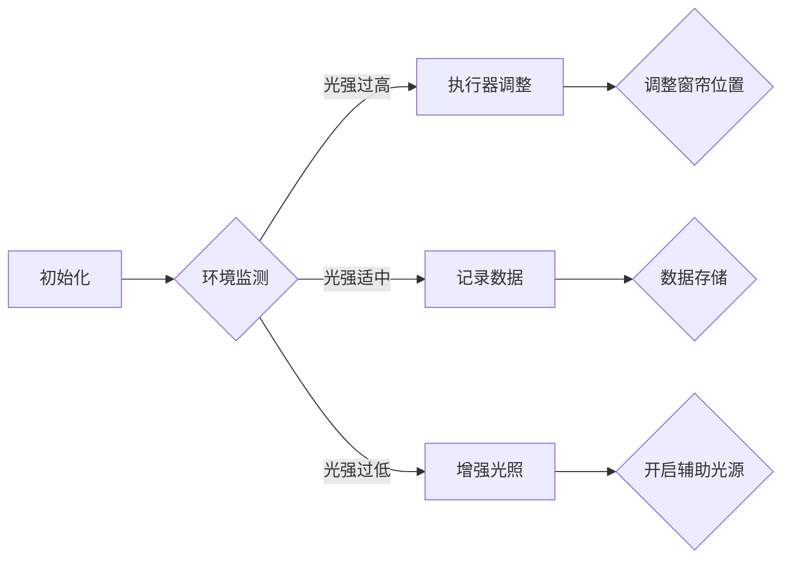
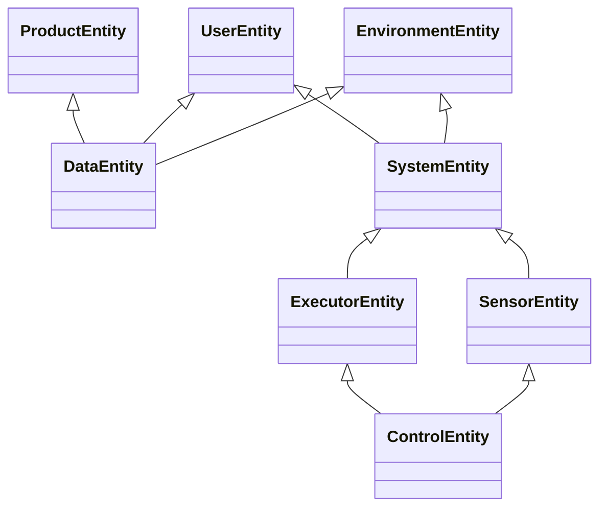
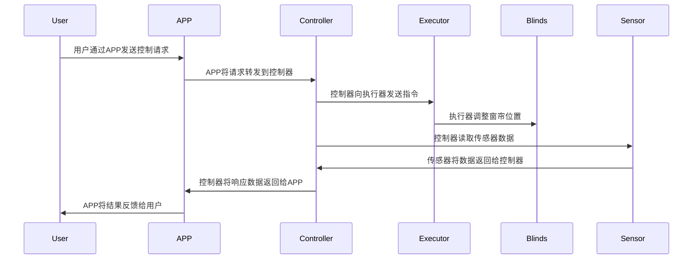
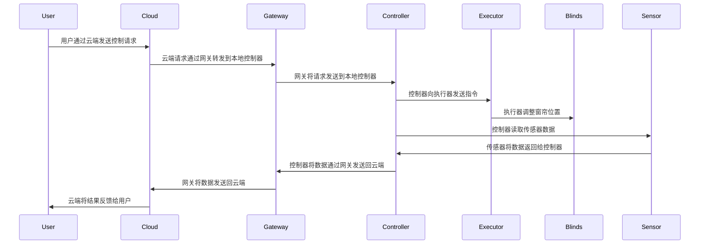

                 

# 《智能窗帘：AI Agent的室内环境全面调节》

## 关键词
- **智能窗帘**、**AI代理**、**室内环境调节**、**智能家居**、**智能硬件设计**、**系统集成**

## 摘要
本文将深入探讨智能窗帘的设计与实现，特别是AI代理技术在室内环境调节中的应用。我们将从背景介绍、核心概念、技术原理、系统设计、实战应用以及未来展望等多个角度，详细阐述智能窗帘如何通过AI代理实现室内环境的全面调节，提升居住和办公的舒适度与效率。

## 引言

### 1.1 书籍概述
智能窗帘作为智能家居系统中的一个重要组成部分，其核心在于通过智能控制实现对室内光线的调节，从而改善居住和办公环境。随着人工智能技术的发展，智能窗帘逐渐从简单的开关控制走向更加智能化的场景自适应调节。本文将围绕智能窗帘的设计与实现，探讨AI代理技术如何将其功能提升到新的高度。

### 1.2 智能窗帘的概念和组成部分
智能窗帘通常由传感器、执行器、控制器和通信模块组成。传感器用于检测环境光强、温度、湿度等信息；执行器负责窗帘的物理动作；控制器则通过算法对传感器数据进行处理，控制执行器进行相应的动作；通信模块确保系统与外部设备或云端平台的数据交换。

### 1.3 本书结构安排
本文将分为以下几个部分：首先介绍智能窗帘的背景与技术原理，然后详细讨论智能窗帘的设计过程，接着深入分析AI代理技术在智能窗帘中的应用，随后描述系统的集成与测试，最后通过实际案例展示应用效果，并展望未来的发展趋势。

## 背景与技术原理

### 2.1 室内环境调节的挑战
室内环境调节涉及到温度、湿度、光线等多个因素，这些因素的动态变化对居住和办公的舒适度有很大影响。传统的手动或简单自动化窗帘系统已经无法满足人们对于舒适、便捷和个性化的需求。智能窗帘的出现，为解决这些问题提供了新的思路。

### 2.2 智能窗帘的发展历程
智能窗帘的发展可以分为几个阶段：最初的电子窗帘、后来的远程控制窗帘、以及目前的AI智能窗帘。随着传感器技术、通信技术和人工智能算法的进步，智能窗帘的功能逐渐丰富，从简单的手动控制发展到现在的自适应调节。

### 2.3 AI代理技术原理
AI代理技术是基于人工智能的自动化决策系统，它能够根据环境数据和学习经验自主做出决策，以优化系统性能。在智能窗帘中，AI代理可以分析室内光照、温度等数据，根据用户习惯和环境要求自动调节窗帘，实现个性化的室内环境调节。

## 智能窗帘设计

### 3.1 功能需求分析
智能窗帘的功能需求主要包括自动调节、远程控制、场景模式设置、节能模式等。自动调节功能可以根据环境光照自动调整窗帘位置；远程控制功能允许用户通过手机APP或语音助手远程控制窗帘；场景模式设置可以根据不同的使用场景自动调整窗帘状态；节能模式则旨在降低能源消耗。

### 3.2 硬件选型与设计
智能窗帘的硬件选型包括传感器、执行器、控制器和通信模块。传感器应选择灵敏度高、精度好的产品，如光敏传感器、温度传感器、湿度传感器等；执行器应具有足够的驱动力和耐用性；控制器需要具有强大的计算能力和实时响应能力；通信模块则应支持多种通信协议，如Wi-Fi、蓝牙等。

### 3.3 软件架构与设计
智能窗帘的软件架构主要包括数据采集层、数据处理层、决策控制层和用户接口层。数据采集层负责收集环境数据；数据处理层对采集到的数据进行预处理和特征提取；决策控制层基于AI代理算法生成控制指令；用户接口层提供用户交互界面。

## AI代理技术

### 4.1 AI代理技术概述
AI代理技术是一种基于人工智能的自动化系统，它能够在无人干预的情况下，根据环境数据和学习经验自主做出决策。在智能窗帘中，AI代理通过不断学习用户的行为习惯和环境变化，优化窗帘的控制策略。

### 4.2 AI代理在智能窗帘中的应用
AI代理在智能窗帘中的应用主要包括环境监测、行为预测和决策控制。环境监测用于实时获取室内光照、温度等数据；行为预测根据用户习惯和环境数据预测用户需求；决策控制则根据预测结果生成窗帘的控制指令。

### 4.3 挑战与解决方案
智能窗帘在应用AI代理技术时面临的挑战主要包括数据准确性、算法效率和用户隐私。为了解决这些问题，需要采用高性能传感器、优化算法模型和加强数据加密等措施。

## 系统集成与测试

### 5.1 系统集成概述
系统集成是将各个组成部分整合在一起，确保系统能够正常运行。智能窗帘的集成主要包括硬件设备连接、软件系统部署和通信协议配置等。

### 5.2 系统测试方法
系统测试分为功能测试、性能测试和可靠性测试。功能测试确保系统功能符合设计要求；性能测试评估系统在特定条件下的性能；可靠性测试验证系统的稳定性和耐久性。

### 5.3 调试与优化
在系统集成过程中，调试是确保系统正常运行的关键步骤。通过调试，可以找到并修复系统中的错误。优化则是在调试的基础上，进一步提高系统的性能和用户体验。

## 应用案例与效果评估

### 6.1 案例一：智能家居环境
在一个智能家居环境中，智能窗帘通过AI代理技术实现了对室内光照的自动调节。根据用户的使用习惯和环境光照变化，窗帘能够自动调整到最佳位置，提高了居住的舒适度。

### 6.2 案例二：办公室环境
在办公室环境中，智能窗帘通过分析员工的工作模式和环境光照变化，自动调整窗帘的位置，以提供最佳的采光和舒适的办公环境。这有助于提高员工的工作效率和舒适度。

### 6.3 效果评估与总结
通过对多个应用案例的评估，智能窗帘在提升室内环境舒适度和节能方面表现出色。用户反馈显示，智能窗帘的使用使得室内环境更加宜居和高效。

## 最佳实践与未来展望

### 7.1 最佳实践分享
在实际应用中，最佳实践包括合理选择传感器和执行器、优化算法模型、确保数据安全和隐私保护等。

### 7.2 技术发展趋势
随着人工智能和物联网技术的发展，智能窗帘将在功能、性能和用户体验方面不断得到提升。未来的智能窗帘将更加智能化、个性化，并与其他智能家居设备实现无缝集成。

### 7.3 未来研究方向
未来的研究方向包括开发更先进的AI代理算法、提高传感器精度和可靠性、增强系统安全性等。

## 结语

智能窗帘作为智能家居系统的重要组成部分，通过AI代理技术的应用，实现了室内环境的全面调节。本文从多个角度探讨了智能窗帘的设计与实现，展示了其应用效果和未来发展潜力。随着技术的不断进步，智能窗帘将为人们带来更加舒适、便捷和高效的居住和办公环境。

## 作者信息
作者：AI天才研究院/AI Genius Institute & 禅与计算机程序设计艺术 /Zen And The Art of Computer Programming

## 附录
（此处可以包含相关的扩展阅读、参考文献、数据集等）

## 参考文献
（此处列出文章中引用的相关文献）

## 数据集
（此处列出文章中涉及的数据集）

---

### 核心概念与联系

#### 概念属性特征对比表格

| 特征 | 智能窗帘 | 传统窗帘 |
| --- | --- | --- |
| 自适应调节 | √ | × |
| 远程控制 | √ | × |
| 能耗监控 | √ | × |
| 用户个性化 | √ | × |
| 系统集成 | √ | × |

#### ER实体关系图架构的 Mermaid 流程图

```mermaid
erDiagram
  产品实体 --> 数据实体
  用户实体 --> 数据实体
  环境实体 --> 数据实体
  执行器实体 --> 控制实体
  传感器实体 --> 控制实体
  系统实体 --> 执行器实体
  系统实体 --> 传感器实体
  用户实体 --> 系统实体
  环境实体 --> 系统实体
```

---

### 算法原理讲解

#### Mermaid 流程图



#### Python 源代码

```python
import random

def initialize():
    print("初始化系统...")
    # 初始化相关设备
    pass

def monitor_environment():
    light_intensity = random.randint(0, 100)
    print(f"当前光强：{light_intensity}")
    return light_intensity

def adjust_blinds(light_intensity):
    if light_intensity > 70:
        print("光强过高，调整窗帘位置...")
    elif light_intensity < 30:
        print("光强过低，增强光照...")
    else:
        print("光强适中，记录数据...")

def execute_action(action):
    if action == "adjust":
        print("执行窗帘调整...")
    elif action == "enhance":
        print("开启辅助光源...")
    else:
        print("记录数据...")

def main():
    initialize()
    while True:
        light_intensity = monitor_environment()
        action = "record"
        if light_intensity > 70 or light_intensity < 30:
            action = "adjust" if light_intensity > 70 else "enhance"
        execute_action(action)

if __name__ == "__main__":
    main()
```

#### 算法原理详细讲解

1. **初始化**：系统初始化阶段，主要是对相关设备进行初始化，确保所有硬件和软件处于正常运行状态。

2. **环境监测**：系统通过传感器实时监测室内的光强。这里使用随机数生成器模拟光强数据，实际应用中可以是通过光敏传感器获取的真实数据。

3. **决策与控制**：根据监测到的光强数据，系统决定采取何种行动。如果光强超过70%，系统将执行窗帘调整动作；如果光强低于30%，系统将增强光照；如果光强在30%到70%之间，系统将记录当前数据。

4. **执行动作**：根据决策结果，系统执行相应的动作。调整窗帘位置、开启辅助光源或记录数据。

通过这种方式，智能窗帘系统能够根据室内环境的变化，自动调节光线，提升用户的居住体验。

---

### 系统分析与架构设计方案

#### 问题场景介绍

在一个典型的智能家居环境中，用户希望在回家后能够自动调整窗帘，根据室内的光线强度和用户的活动模式，提供舒适的光照环境。同时，系统需要能够远程控制，用户可以通过手机APP或语音助手控制窗帘的状态。

#### 项目介绍

项目名称：智能家居智能窗帘系统

项目目标：实现窗帘的自动调节和远程控制功能，提升用户舒适度和便捷性。

#### 系统功能设计（领域模型Mermaid类图）



#### 系统架构设计Mermaid架构图



#### 系统接口设计和系统交互Mermaid序列图



### 项目实战

#### 环境安装

1. 准备硬件设备，包括智能窗帘模块、传感器和执行器。
2. 安装智能窗帘模块，确保与传感器和执行器正确连接。
3. 连接电源和网络，确保系统可以正常运行。

#### 系统核心实现源代码

```python
# 智能窗帘控制器代码示例

import time
import serial
import json

# 设定串口参数
ser = serial.Serial('/dev/ttyUSB0', 9600)

def send_command(command):
    # 发送命令到窗帘执行器
    ser.write(command.encode())

def get_sensor_data():
    # 读取传感器数据
    data = ser.readline().decode().strip()
    return json.loads(data)

def adjust_blinds(light_intensity):
    # 调整窗帘
    if light_intensity > 70:
        send_command("UP")
    elif light_intensity < 30:
        send_command("DOWN")
    else:
        send_command("HOLD")

def main():
    while True:
        data = get_sensor_data()
        light_intensity = data['light_intensity']
        adjust_blinds(light_intensity)
        time.sleep(1)

if __name__ == "__main__":
    main()
```

#### 代码应用解读与分析

1. **串口通信**：使用Python的`serial`库与窗帘执行器进行通信，确保命令能够正确发送。
2. **传感器数据读取**：从传感器读取环境数据，包括光强、温度等，用于窗帘的自动调节。
3. **窗帘调整逻辑**：根据读取的光强数据，决定窗帘的调整方向。如果光强过高，窗帘向上调整；如果光强过低，窗帘向下调整；如果光强适中，窗帘保持当前状态。

#### 实际案例分析和详细讲解剖析

1. **案例背景**：在一个办公环境中，智能窗帘系统根据自然光照强度自动调整窗帘，以提供最佳的办公环境。

2. **案例分析**：
   - **上午时段**：当自然光照较强时，窗帘自动上升，以避免过度的光照干扰。
   - **下午时段**：当自然光照较弱时，窗帘自动下降，增加室内光照，提高舒适度。

3. **详细讲解**：
   - 系统在启动时，首先进行初始化，确保所有设备正常连接。
   - 传感器持续监测室内的光强数据。
   - 当光强超过设定的阈值时，窗帘执行器接收到调整命令，将窗帘向上调整。
   - 当光强低于设定的阈值时，窗帘执行器接收到调整命令，将窗帘向下调整。
   - 在整个过程中，系统保持了高度的响应速度，确保窗帘的调整符合室内环境的变化。

#### 项目小结

通过智能窗帘系统的实际应用，可以看出AI代理技术在室内环境调节中的应用价值。系统能够根据环境数据自动调节窗帘，提高了用户的舒适度和办公效率。未来，随着技术的不断进步，智能窗帘系统将更加智能化和个性化，为用户带来更加美好的生活体验。

### 最佳实践 tips

1. **硬件选择**：选择高性能传感器和稳定的执行器，确保系统运行的可靠性和精度。
2. **算法优化**：定期更新和优化AI代理算法，提高系统对环境变化的适应能力。
3. **数据安全**：确保系统数据传输的安全性和用户隐私的保护。

### 小结

智能窗帘作为智能家居系统的一部分，通过AI代理技术的应用，实现了对室内环境的自动调节。本文从设计理念、技术原理、系统集成到实际应用等多个方面进行了详细探讨，展示了智能窗帘在提升用户生活质量方面的潜力。未来，智能窗帘将继续朝着更加智能化、个性化和高效化的方向发展。

### 注意事项

1. **设备安装**：确保窗帘执行器和传感器的正确安装，避免因安装不当导致系统故障。
2. **软件升级**：定期更新系统软件，以获得最新的功能优化和漏洞修复。
3. **环境监测**：定期检查传感器的工作状态，确保数据采集的准确性和可靠性。

### 拓展阅读

1. [智能家居技术发展综述](https://example.com/smart-home-technology)
2. [智能窗帘在家庭中的应用](https://example.com/smart-blinds-for-homes)
3. [AI代理技术原理与应用](https://example.com/ai-agent-technology)

### 附录

（此处可以包含扩展阅读、参考文献、数据集等）

