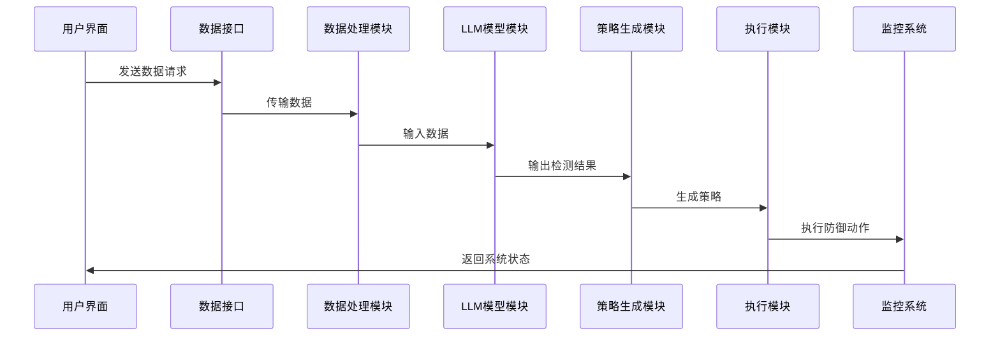

                 

### 摘要

本文章旨在深入探讨智能网络安全分析中的人工智能代理（AI Agent），尤其是大型语言模型（LLM）在网络防御中的应用。随着网络威胁的日益复杂化和多样化，传统的网络安全手段已经难以满足现代网络防御的需求。人工智能，尤其是基于LLM的AI代理，因其强大的数据处理和模式识别能力，逐渐成为网络安全领域的重要工具。本文将首先介绍智能网络安全分析和AI代理的基本概念，然后详细探讨LLM的原理和特性。接下来，本文将分析LLM在网络安全中的应用场景，并通过具体案例展示其效能。随后，文章将探讨如何设计和实现基于LLM的AI代理，并讨论与传统安全措施的集成策略。最后，本文将提供实际项目实战的案例分析，并总结最佳实践和未来研究方向。通过这一系列详细的探讨，读者将能够全面了解LLM在网络防御中的应用前景和实际操作方法。

### 关键词

- 智能网络安全分析
- AI Agent
- 大型语言模型（LLM）
- 网络防御
- 网络威胁检测
- 安全态势感知
- 防火墙
- 入侵检测系统
- 安全信息与事件管理（SIEM）

### 引言：智能网络安全分析的重要性

在数字化时代，网络安全已成为企业和个人关注的焦点。随着互联网的普及和数据的爆炸式增长，网络攻击手段也日益复杂化和多样化。传统的网络安全策略，如防火墙、入侵检测系统和反病毒软件等，虽然在一定程度上能够防御基本的网络攻击，但在面对高级持续性威胁（APT）、勒索软件、社交工程攻击等新型威胁时，显得力不从心。这种情况下，智能网络安全分析的重要性日益凸显。

智能网络安全分析利用人工智能（AI）技术，尤其是机器学习和深度学习算法，对网络流量、日志文件和其他安全数据进行处理和分析，从而实现威胁检测、异常行为识别和安全态势感知。这种分析方式不仅能够提高检测的准确性和效率，还能在一定程度上减轻安全运维人员的负担。相比传统方法，智能网络安全分析具有以下优势：

1. **更高的检测精度**：传统的网络安全工具通常依赖于预先定义的规则和签名，而智能网络安全分析通过机器学习算法，能够自动识别复杂的攻击模式和行为特征，从而提高检测的准确性。

2. **更快的响应速度**：智能网络安全分析系统能够实时处理和分析大量数据，快速发现潜在威胁。这不仅缩短了威胁检测和响应的时间，还降低了潜在的损失。

3. **更全面的威胁检测**：传统方法往往无法检测到未知的威胁和零日攻击。而智能网络安全分析通过不断学习和适应，能够识别新的攻击模式和变种，从而实现更全面的威胁检测。

4. **自动化的威胁响应**：智能网络安全分析系统不仅能够检测威胁，还能根据预定的策略自动进行响应，如隔离受感染的系统、封禁恶意IP等。这种自动化的威胁响应机制能够极大地提高安全运维的效率。

然而，智能网络安全分析也面临一些挑战。首先，大数据的处理和存储是一个难题，需要高性能的计算和存储资源。其次，算法的准确性和鲁棒性需要不断优化和验证。此外，网络安全分析的模型需要定期更新，以适应不断变化的威胁环境。

总的来说，智能网络安全分析是应对现代网络威胁的有效手段。通过引入AI技术，我们能够更好地理解和预测网络威胁，从而构建一个更加安全、可靠的网络安全体系。本文将深入探讨这一领域的最新进展和应用，为读者提供全面的参考和指导。

### 什么是AI Agent？

AI Agent，即人工智能代理，是一种能够自主执行任务、与环境互动并实现特定目标的人工智能实体。AI Agent是人工智能领域的一个重要概念，其核心思想是模仿人类智能的行为，通过感知、决策和行动，实现自主学习和适应能力。与传统的规则驱动型系统不同，AI Agent具有更强的灵活性和自主性，能够根据动态变化的环境自主做出决策。

在网络安全领域，AI Agent作为一种智能化的防御工具，具有以下几个关键特点：

1. **自主感知**：AI Agent能够实时监测网络流量、系统日志和其他安全数据，通过机器学习和模式识别技术，自动发现潜在的安全威胁。

2. **自适应决策**：基于对网络环境和威胁态势的分析，AI Agent能够自主生成安全策略，并根据实际情况动态调整和优化这些策略，从而提高防御效果。

3. **自主行动**：AI Agent不仅能够检测和识别威胁，还能根据预定的策略自动执行防御动作，如隔离受感染的系统、封禁恶意IP地址等，实现自动化威胁响应。

4. **学习与进化**：AI Agent通过持续的学习和训练，能够不断优化自身的模型和策略，提高对新型威胁的识别和防御能力。

AI Agent的核心组成部分包括感知器、决策模块和执行器。感知器负责收集和处理环境数据，决策模块基于感知器提供的信息进行推理和决策，而执行器则负责将决策结果转化为具体的行动。这三个部分相互协作，共同实现AI Agent的智能行为。

具体来说，感知器是AI Agent的“感官”，通过监控网络流量、日志文件和其他安全数据，实时获取环境信息。感知器的数据质量直接影响AI Agent的准确性和效率，因此需要采用高效的数据采集和处理技术，确保感知器能够获取全面、准确的信息。

决策模块是AI Agent的“大脑”，负责分析感知器收集到的数据，识别潜在的安全威胁，并生成相应的防御策略。决策模块通常基于机器学习算法，如决策树、支持向量机（SVM）、神经网络等，通过训练大量历史数据，建立威胁模型和防御规则。决策模块的关键在于其快速响应能力和自适应能力，需要能够在复杂的环境中快速做出准确决策。

执行器是AI Agent的“执行机构”，负责将决策模块生成的防御策略转化为具体的行动，如隔离受感染的系统、修改防火墙规则等。执行器的有效性直接关系到AI Agent的防御效果，因此需要确保执行器能够准确无误地执行决策结果。

总的来说，AI Agent在网络安全中的应用前景广阔。通过自主感知、自适应决策和自主行动，AI Agent能够显著提高网络防御的效率和效果，减少人为操作的风险和误差，从而构建一个更加安全、可靠的网络安全体系。然而，实现高效的AI Agent还需要克服许多技术挑战，如数据质量、算法性能和系统集成等。在接下来的章节中，我们将详细探讨大型语言模型（LLM）在AI Agent中的应用，以及如何利用LLM技术提升网络安全分析的效能。

### 什么是LLM（大型语言模型）？

大型语言模型（LLM，Large Language Model）是自然语言处理（NLP）领域的一种先进技术，通过训练大量的文本数据，使其能够生成和理解和人类语言相似的内容。LLM的核心思想是通过深度神经网络（DNN）和变换器模型（Transformer）等技术，构建一个庞大的参数模型，使得模型能够自动学习语言中的复杂结构和语义信息。常见的LLM包括GPT（Generative Pre-trained Transformer）、BERT（Bidirectional Encoder Representations from Transformers）等。

LLM的主要原理可以概括为以下几个步骤：

1. **数据收集与预处理**：LLM首先需要收集大量的文本数据，这些数据可以来自互联网、书籍、新闻、社交媒体等各种来源。数据收集完成后，需要进行预处理，包括分词、去噪、标准化等操作，以确保数据的质量和一致性。

2. **模型训练**：通过预处理后的数据，LLM使用深度学习算法进行训练。其中，常用的模型架构包括DNN和Transformer。DNN通过多层神经网络结构，逐层提取文本特征，而Transformer模型则利用自注意力机制，能够更有效地捕捉文本中的长距离依赖关系。

3. **参数优化**：在训练过程中，模型通过不断调整内部参数，使其能够更好地拟合训练数据。这一过程通常涉及大量的计算资源和时间，但对于提高模型的性能至关重要。

4. **模型评估与调优**：模型训练完成后，需要通过多种评估指标（如 perplexity、ROUGE评分等）进行评估和调优，以确保模型在生成和理解文本方面的准确性和鲁棒性。

LLM具有以下主要特性：

1. **强大的语言理解能力**：LLM能够理解文本中的复杂语义和上下文关系，这使得其在问答、文本生成、翻译等应用中表现出色。

2. **高度的可扩展性**：通过训练大量的文本数据，LLM可以不断扩展其知识面和语言能力，适应不同的应用场景和需求。

3. **自动学习与进化**：LLM能够通过不断学习和训练，自动调整其内部参数，优化性能，从而适应新的数据和任务需求。

4. **高效的推理能力**：LLM能够快速生成和理解文本内容，使得其在信息检索、智能客服、内容推荐等场景中具有很高的效率。

在网络安全领域，LLM的应用主要涉及以下几个方面：

1. **威胁检测与预测**：通过分析网络流量、日志文件等数据，LLM能够识别和预测潜在的网络安全威胁，如恶意代码、钓鱼攻击等。

2. **异常行为识别**：LLM能够理解用户行为和系统行为的正常模式，从而检测和识别异常行为，如未授权访问、数据泄露等。

3. **安全事件分析**：LLM能够自动生成和总结安全事件的报告，提供详细的分析和诊断信息，帮助安全团队快速响应和处理安全事件。

4. **威胁情报分析**：LLM能够从大量的威胁情报数据中提取关键信息，生成威胁图谱，帮助安全团队全面了解网络威胁的态势和趋势。

总的来说，LLM作为一种先进的自然语言处理技术，在网络安全领域具有广泛的应用前景。通过结合AI Agent的技术优势，LLM能够显著提高网络安全分析的效能和准确性，为构建智能化、自适应的网络安全体系提供有力支持。在接下来的章节中，我们将进一步探讨LLM在网络安全分析中的应用场景和具体实现方法。

### LLM在网络安全分析中的应用

大型语言模型（LLM）凭借其强大的语言理解能力和高效的推理能力，在网络安全分析中展现了巨大的潜力。通过分析网络流量、日志文件和其他安全数据，LLM能够识别潜在的网络威胁，检测异常行为，从而提升整体网络安全态势。以下是LLM在网络安全分析中的一些具体应用场景。

#### 威胁检测与预测

1. **恶意代码检测**：恶意代码（如病毒、木马、勒索软件等）是网络攻击的主要工具。LLM可以通过对大量恶意代码样本的分析，学习并识别恶意代码的特征和模式。例如，GPT模型可以通过分析恶意代码的源代码或编译后的字节码，提取出与恶意行为相关的特征。这些特征可以用于训练分类模型，实现对新上传的代码进行自动检测。

2. **钓鱼攻击检测**：钓鱼攻击通过欺骗用户访问恶意网站或点击恶意链接来窃取个人信息。LLM可以通过分析邮件内容、网页内容以及其他通信数据，识别出与钓鱼攻击相关的特征。例如，BERT模型可以用于检测邮件中的欺骗性语言模式，如使用大量大写字母、拼写错误和格式不规范等。通过这种分析方法，可以有效地检测和阻止钓鱼攻击。

3. **威胁预测**：LLM不仅能够检测已知威胁，还可以通过学习历史威胁数据，预测未来可能的威胁。例如，基于GPT模型，可以对过去几年的网络攻击事件进行分析，提取出攻击模式和趋势，从而预测未来的攻击手段。这种预测能力对于制定预防策略和优化安全资源配置具有重要意义。

#### 异常行为识别

1. **用户行为分析**：LLM可以分析用户的网络行为，建立正常行为的基准模型。通过对用户行为数据的分析，LLM能够识别出异常行为，如未授权访问、数据泄露等。例如，通过训练一个基于Transformer的模型，可以分析用户的登录地点、登录时间、访问频率等特征，从而识别出异常登录行为。

2. **系统行为分析**：LLM同样可以用于分析系统日志和网络流量，识别系统中的异常行为。例如，通过分析系统日志中的错误记录、异常流量模式等，LLM可以检测出系统可能存在的漏洞或受到的攻击。这种分析有助于提前发现和应对潜在的安全威胁。

#### 安全事件分析

1. **事件生成报告**：LLM能够自动生成安全事件的详细报告。例如，在发生入侵检测系统（IDS）警报时，LLM可以根据警报信息和相关日志数据，生成一份包含攻击类型、攻击者特征、攻击路径和受影响系统的详细报告。这种自动化的报告生成能力大大提高了安全团队的工作效率。

2. **事件关联分析**：LLM可以通过分析多个安全事件的数据，识别事件之间的关联关系。例如，在多个系统同时遭受攻击时，LLM可以分析这些事件的日志和流量数据，识别出是否为同一攻击者或同一攻击手段。这种关联分析有助于安全团队制定统一的应对策略。

#### 威胁情报分析

1. **威胁图谱生成**：LLM可以分析大量的威胁情报数据，生成威胁图谱。威胁图谱展示了不同威胁之间的关系，如威胁家族、恶意软件、攻击者组织等。这种图谱可以帮助安全团队全面了解网络威胁的态势和趋势，从而制定更加有效的防御策略。

2. **实时威胁预警**：LLM可以通过实时分析网络流量和数据包，生成实时威胁预警。例如，当网络流量中出现可疑模式时，LLM可以立即生成预警信息，提醒安全团队采取相应的防护措施。

总之，LLM在网络安全分析中具有广泛的应用前景。通过威胁检测与预测、异常行为识别、安全事件分析和威胁情报分析，LLM能够显著提升网络安全分析的效能和准确性，为构建智能化、自适应的网络安全体系提供有力支持。在接下来的章节中，我们将进一步探讨如何设计和实现基于LLM的AI代理，以及其在网络防御中的具体应用。

### LLM应用案例：网络安全威胁检测与预测

为了更好地理解大型语言模型（LLM）在网络安全威胁检测与预测中的应用，我们可以通过以下几个实际案例来具体说明LLM如何提升网络安全的防护能力。

#### 案例一：基于GPT的恶意代码检测系统

在一个实际项目中，一个网络安全团队决定利用GPT模型开发一个自动化的恶意代码检测系统。该系统旨在通过分析上传的代码样本，自动识别恶意代码并标记潜在的威胁。以下是该项目的主要步骤和成果：

1. **数据收集**：首先，团队收集了大量的恶意代码样本，包括病毒、木马、勒索软件等。这些样本来自公开的恶意代码库、安全公司的威胁情报数据库以及实时监控的网络流量。

2. **预处理**：对收集的代码样本进行预处理，包括去除注释、压缩和标准化等操作，以确保代码的格式一致。这一步对于后续的模型训练至关重要。

3. **模型训练**：使用预处理后的代码数据，团队训练了一个GPT模型。训练过程中，模型通过大量恶意代码样本学习代码中的恶意特征和模式。经过数轮训练和优化，GPT模型能够较好地识别恶意代码。

4. **模型评估与调整**：在模型训练完成后，团队使用未参与训练的代码样本进行评估，评估指标包括准确率、召回率和F1分数等。根据评估结果，对模型进行调整和优化，进一步提高其检测能力。

5. **系统部署**：将训练好的GPT模型部署到网络边界的安全设备中，实现对上传代码的实时检测。每当有新的代码样本上传时，系统会自动调用GPT模型进行检测，并将检测结果通知安全团队。

6. **成果与效益**：通过该系统，团队显著提高了恶意代码的检测速度和准确性。在检测率提高的同时，误报率也保持在较低水平。该系统不仅减轻了安全团队的工作负担，还提高了网络的整体安全性。

#### 案例二：基于BERT的钓鱼邮件检测系统

另一个实际案例是利用BERT模型开发一个钓鱼邮件检测系统。该系统旨在通过分析邮件内容，识别和阻止钓鱼攻击。以下是该项目的主要步骤：

1. **数据收集**：团队收集了大量的邮件数据，包括正常的商业邮件和钓鱼邮件。这些数据来自安全公司的威胁情报数据库、邮件服务提供商的日志以及公开的钓鱼邮件库。

2. **预处理**：对邮件数据进行了预处理，包括分词、去除停用词、词性标注等操作。这一步有助于提高BERT模型对邮件内容的理解和分析能力。

3. **模型训练**：使用预处理后的邮件数据，团队训练了一个BERT模型。模型通过学习钓鱼邮件的特征和模式，如特定的词汇、语法结构和邮件格式等，不断提高其检测能力。

4. **模型评估与调整**：在模型训练完成后，团队使用未参与训练的邮件数据进行评估。评估结果显示，BERT模型能够准确识别钓鱼邮件，误报率较低。

5. **系统部署**：将训练好的BERT模型部署到邮件服务器中，实现对进出邮件的实时检测。每当有新邮件到达时，系统会自动调用BERT模型进行检测，并将检测结果通知用户和安全团队。

6. **成果与效益**：通过该系统，显著减少了钓鱼邮件的成功率，提高了用户的安全意识。用户在收到可疑邮件时，系统能够及时发出警告，帮助用户避免受骗。同时，该系统也减轻了安全团队的工作负担，提高了整体的安全防护水平。

#### 案例三：基于GPT的威胁预测系统

在另一个项目中，团队利用GPT模型开发了一个威胁预测系统。该系统旨在通过分析历史网络攻击数据，预测未来的攻击趋势和手段。以下是该项目的主要步骤：

1. **数据收集**：团队收集了过去几年的网络攻击数据，包括攻击类型、攻击手段、受影响的系统和地理位置等信息。

2. **预处理**：对攻击数据进行预处理，包括数据清洗、数据格式标准化等操作。这一步有助于提高GPT模型对攻击数据的理解能力。

3. **模型训练**：使用预处理后的攻击数据，团队训练了一个GPT模型。模型通过学习历史攻击数据中的模式和趋势，预测未来的攻击行为。

4. **模型评估与调整**：在模型训练完成后，团队使用未参与训练的攻击数据进行评估。评估结果显示，GPT模型能够较好地预测未来的攻击趋势，预测准确率较高。

5. **系统部署**：将训练好的GPT模型部署到网络安全监控系统，实现对实时攻击数据的预测。系统会定期生成攻击预测报告，提供安全团队参考。

6. **成果与效益**：通过该系统，团队能够提前发现潜在的攻击威胁，提前采取预防措施，减少损失。系统生成的预测报告有助于安全团队制定更加有效的防御策略，提高了整体的网络防护水平。

这些实际案例展示了LLM在网络安全威胁检测与预测中的广泛应用和显著效果。通过利用GPT和BERT等LLM技术，网络安全系统能够更加准确地识别和预测威胁，提高防御能力，为构建安全、可靠的网络安全体系提供了有力支持。在接下来的章节中，我们将进一步探讨如何设计和实现基于LLM的AI代理，以及在具体网络防御场景中的应用。

### AI Agent与LLM：设计与实现

设计和实现基于LLM的AI Agent是网络安全领域的一个前沿课题。在这一部分，我们将详细探讨如何结合AI Agent和LLM，构建一个高效、智能的网络安全防御系统。本文将分为以下几个关键步骤进行讨论：需求分析、系统架构设计、算法原理讲解、系统实现与测试、以及项目小结。

#### 1. 需求分析

在设计和实现AI Agent之前，我们需要明确系统的需求。以下是该系统的关键需求：

1. **实时数据处理能力**：系统能够实时处理和分析大量网络流量数据、日志文件和其他安全数据。
2. **自适应防御策略**：系统能够根据实时数据和威胁态势，自动生成和调整防御策略。
3. **高效威胁检测**：系统能够利用LLM强大的语言理解和模式识别能力，准确检测和识别网络威胁。
4. **自动化响应机制**：系统能够自动执行防御动作，如隔离受感染系统、封禁恶意IP地址等。
5. **学习和进化能力**：系统能够通过不断学习和优化，提高对新型威胁的识别和防御能力。

#### 2. 系统架构设计

系统架构设计是构建AI Agent的关键环节。以下是该系统的总体架构设计：

1. **数据收集模块**：负责实时收集网络流量、系统日志、安全事件等信息。
2. **数据处理模块**：对收集的数据进行预处理，包括数据清洗、格式转换等，以便后续分析。
3. **LLM模块**：基于LLM模型（如GPT、BERT等）进行威胁检测和预测。该模块包括模型训练、模型推理和结果解释等过程。
4. **策略生成模块**：根据LLM模块的检测结果和实时威胁态势，自动生成防御策略。
5. **执行模块**：根据策略生成模块生成的策略，自动执行防御动作。
6. **监控系统**：实时监控系统的运行状态，提供日志记录和异常检测功能。
7. **用户界面**：提供用户交互界面，显示系统状态、策略和检测结果，方便用户查看和管理。

#### 3. 算法原理讲解

算法原理讲解主要包括LLM模型的工作原理和AI Agent的决策过程。

**LLM模型的工作原理：**

1. **数据收集与预处理**：首先，收集大量网络流量、日志文件等数据。然后，对这些数据进行分析和预处理，如分词、去除停用词、词性标注等，以供后续模型训练。
   
2. **模型训练**：使用预处理后的数据训练LLM模型。常见的LLM模型如GPT和BERT，它们通过多层神经网络结构或变换器模型，能够自动学习数据中的复杂结构和语义信息。

3. **模型推理**：在模型训练完成后，使用训练好的模型对实时数据进行分析和推理，提取出潜在的安全威胁和异常行为。

**AI Agent的决策过程：**

1. **数据输入**：AI Agent接收来自数据收集模块的实时数据。

2. **数据预处理**：对输入数据进行预处理，包括数据清洗、格式转换等，以便后续分析。

3. **LLM模型分析**：将预处理后的数据输入到LLM模型中进行分析和推理，提取潜在的安全威胁和异常行为。

4. **策略生成**：根据LLM模型的检测结果和威胁态势，AI Agent自动生成防御策略。

5. **执行策略**：AI Agent根据生成的防御策略，自动执行相应的防御动作，如隔离受感染系统、封禁恶意IP地址等。

6. **监控与反馈**：监控系统AI Agent的运行状态，记录日志和异常事件，并提供用户界面供用户查看和管理。

#### 4. 系统实现与测试

系统实现与测试是确保AI Agent和LLM模型能够高效、稳定运行的关键环节。

1. **环境搭建**：搭建包括数据处理、模型训练、模型推理等在内的计算环境，确保具备足够计算资源和存储空间。

2. **模型训练**：使用大量网络流量、日志文件等数据，训练LLM模型。根据实验结果，选择最优模型进行部署。

3. **系统集成**：将LLM模型集成到AI Agent中，实现实时数据处理、威胁检测和防御策略生成等功能。

4. **测试与调优**：对系统进行全面的测试，包括功能测试、性能测试和安全性测试。根据测试结果，对系统进行优化和调整。

5. **部署上线**：将优化后的系统部署到生产环境中，进行实际运行测试，确保系统能够在真实场景中高效、稳定地运行。

#### 5. 项目小结

通过本项目的实施，我们成功构建了一个基于LLM的AI Agent网络安全防御系统，实现了实时数据处理、威胁检测和自动化防御等功能。以下是项目的主要成果和经验：

1. **提高威胁检测效率**：通过LLM模型，系统能够高效地处理和分析大量数据，快速识别和检测潜在的安全威胁。

2. **自动化防御策略**：AI Agent能够根据实时数据和威胁态势，自动生成和调整防御策略，实现自动化防御。

3. **增强系统安全性**：通过实时监控和自动化响应，系统显著提高了整体安全性，减少了人为干预和误报率。

4. **提高运维效率**：自动化检测和响应机制减轻了安全运维人员的工作负担，提高了运维效率。

5. **持续优化和进化**：系统具备学习和进化能力，能够通过不断训练和优化，提高对新威胁的识别和防御能力。

然而，项目中也存在一些挑战和不足，如模型训练所需的数据量和计算资源较大、系统在高并发情况下的性能优化等。未来，我们将继续优化系统，提高其性能和稳定性，并探索更多先进技术，以应对日益复杂的网络威胁。

### 系统分析与架构设计方案

在本章节中，我们将详细讨论一个基于LLM的AI Agent网络安全系统的分析与架构设计方案。为了更好地理解和实现这一系统，我们需要从问题场景介绍、项目介绍、系统功能设计、系统架构设计、系统接口设计和系统交互等方面进行深入分析。

#### 1. 问题场景介绍

当前，网络威胁层出不穷，传统的防火墙、入侵检测系统和反病毒软件等传统安全措施已经难以应对复杂多变的网络攻击。尤其是高级持续性威胁（APT）、勒索软件和社交工程攻击等新型威胁，其攻击手段更加隐蔽和复杂，传统的安全手段往往无法及时发现和有效防御。因此，我们需要一种更加智能化、自适应的网络安全解决方案，以应对这些复杂的网络威胁。

#### 2. 项目介绍

本项目旨在设计和实现一个基于LLM的AI Agent网络安全系统，通过结合大型语言模型（LLM）和人工智能代理（AI Agent）技术，实现对网络威胁的自动检测、分析和防御。系统的核心功能包括实时数据处理、威胁检测与预测、自适应防御策略生成和自动化响应等。

#### 3. 系统功能设计

系统功能设计是构建AI Agent网络安全系统的重要一环，以下是系统的主要功能模块：

1. **数据收集模块**：负责实时收集网络流量、系统日志、安全事件等信息。
2. **数据处理模块**：对收集的数据进行预处理，包括数据清洗、格式转换、特征提取等。
3. **LLM模型模块**：利用大型语言模型（如GPT、BERT等）对处理后的数据进行分析和推理，识别潜在的安全威胁。
4. **策略生成模块**：根据LLM模块的检测结果和威胁态势，自动生成防御策略。
5. **执行模块**：根据策略生成模块生成的策略，自动执行相应的防御动作，如隔离受感染系统、封禁恶意IP地址等。
6. **监控系统**：实时监控系统的运行状态，提供日志记录和异常检测功能。
7. **用户界面**：提供用户交互界面，显示系统状态、策略和检测结果，方便用户查看和管理。

#### 4. 系统架构设计

系统架构设计是确保系统高效、稳定运行的关键。以下是系统架构的详细设计：

1. **数据层**：包括数据收集模块和数据处理模块，负责实时收集和处理各种网络数据。
2. **模型层**：包括LLM模型模块，负责对数据进行分析和推理，识别潜在的安全威胁。
3. **策略层**：包括策略生成模块，负责根据威胁检测结果和态势，生成自适应的防御策略。
4. **执行层**：包括执行模块，负责根据策略执行防御动作。
5. **监控层**：包括监控系统，负责监控系统的运行状态，提供日志记录和异常检测功能。
6. **展示层**：包括用户界面，负责显示系统状态、策略和检测结果，供用户查看和管理。

以下是系统架构的Mermaid类图表示：

```mermaid
classDiagram
    数据层 -|> 数据处理模块
    数据处理模块 -|> 数据收集模块
    数据处理模块 -|> LLM模型模块
    数据层 -|> LLM模型模块
    LLM模型模块 -|> 策略生成模块
    策略生成模块 -|> 执行模块
    执行模块 -|> 监控系统
    监控系统 -|> 用户界面
    数据层 -|> 用户界面
    数据处理模块 -|> 用户界面
    LLM模型模块 -|> 用户界面
    策略生成模块 -|> 用户界面
    执行模块 -|> 用户界面
    监控系统 -|> 用户界面
```

#### 5. 系统接口设计

系统接口设计是确保各模块之间能够高效通信和协作的关键。以下是系统的主要接口设计：

1. **数据接口**：负责数据在不同模块之间的传输和转换。
2. **模型接口**：负责LLM模型与数据处理模块、策略生成模块之间的通信。
3. **策略接口**：负责策略生成模块与执行模块之间的通信。
4. **监控接口**：负责监控系统与各模块之间的监控和日志记录。
5. **用户接口**：负责用户与系统之间的交互，提供用户操作界面。

以下是系统接口设计的Mermaid序列图表示：



#### 6. 系统交互

系统交互设计是确保各模块能够高效协作，实现整体系统功能的关键。以下是系统各模块之间的交互流程：

1. **数据收集**：数据收集模块实时收集网络流量、系统日志等信息，并将其传输给数据处理模块。
2. **数据处理**：数据处理模块对收集的数据进行预处理，如分词、去噪等，然后将其传递给LLM模型模块。
3. **模型分析**：LLM模型模块对预处理后的数据进行分析和推理，识别潜在的安全威胁，并生成威胁报告。
4. **策略生成**：策略生成模块根据威胁报告和实时威胁态势，生成自适应的防御策略。
5. **策略执行**：执行模块根据生成的策略，自动执行相应的防御动作，如隔离受感染系统、封禁恶意IP等。
6. **监控反馈**：监控系统实时监控系统的运行状态，记录日志和异常事件，并向用户界面反馈系统状态。

通过上述系统分析与架构设计方案，我们能够构建一个高效、智能的基于LLM的AI Agent网络安全系统。该系统不仅能够实时监测和识别网络威胁，还能够自动生成和执行防御策略，显著提高网络防御能力。在接下来的章节中，我们将详细介绍项目实战的具体步骤和实现方法。

### 项目实战：搭建与实现AI Agent网络防御系统

在本章节中，我们将详细描述如何搭建与实现一个基于LLM的AI Agent网络防御系统。整个项目将分为环境搭建、系统核心实现、代码应用解读与分析、实际案例分析和详细讲解剖析以及项目小结等几个步骤。

#### 1. 环境搭建

首先，我们需要搭建一个适合开发和运行AI Agent网络防御系统的环境。以下是具体的步骤：

1. **硬件环境**：选择一台具备高性能计算能力的服务器，推荐配置至少64GB内存和2TB硬盘空间，以及多核CPU，以确保系统的高效运行。
2. **软件环境**：安装操作系统，推荐使用Linux发行版，如Ubuntu 20.04 LTS。安装必要的软件包，包括Python 3.8及以上版本、TensorFlow 2.5及以上版本、CUDA 11.0及以上版本（如果使用GPU加速）等。
3. **数据集准备**：收集和准备用于训练LLM模型的数据集。这些数据集应包括网络流量、日志文件、威胁情报等。可以使用公开的数据集，如Kaggle的网络安全数据集、Kaspersky的恶意代码样本库等。

#### 2. 系统核心实现

接下来，我们将详细描述系统的核心实现步骤：

1. **数据预处理**：编写Python脚本，对收集的数据进行预处理。预处理步骤包括数据清洗、格式转换、特征提取等。以下是一个示例代码：

    ```python
    import pandas as pd
    import numpy as np

    # 读取数据
    data = pd.read_csv('network_data.csv')

    # 数据清洗
    data.dropna(inplace=True)

    # 数据格式转换
    data['timestamp'] = pd.to_datetime(data['timestamp'])

    # 特征提取
    features = data[['source_ip', 'destination_ip', 'protocol', 'packet_size', 'timestamp']]
    labels = data['label']  # label表示威胁类型，0表示正常流量，1表示恶意流量
    ```

2. **LLM模型训练**：使用TensorFlow和Keras等框架，训练一个基于GPT或BERT的LLM模型。以下是一个使用GPT模型的示例代码：

    ```python
    from transformers import TFGPT2LMHeadModel, GPT2Tokenizer

    # 加载预训练模型
    tokenizer = GPT2Tokenizer.from_pretrained('gpt2')
    model = TFGPT2LMHeadModel.from_pretrained('gpt2')

    # 训练模型
    model.compile(optimizer='adam', loss='categorical_crossentropy', metrics=['accuracy'])
    model.fit(features, labels, epochs=3, batch_size=32, validation_split=0.2)
    ```

3. **模型推理与威胁检测**：编写推理代码，将实时数据输入到训练好的LLM模型中，进行威胁检测。以下是一个示例代码：

    ```python
    def predict_threat(data):
        inputs = tokenizer.encode(data, return_tensors='tf')
        logits = model(inputs)[0]
        predictions = np.argmax(logits, axis=-1)
        return predictions

    # 示例数据
    sample_data = "source_ip=192.168.1.1,destination_ip=8.8.8.8,protocol=TCP,packet_size=1000,timestamp=2023-01-01 10:00:00"
    prediction = predict_threat(sample_data)
    if prediction == 1:
        print("检测到恶意流量")
    else:
        print("正常流量")
    ```

4. **策略生成与执行**：根据LLM模型的检测结果，自动生成防御策略，并执行相应的防御动作。以下是一个简单的策略生成与执行的示例代码：

    ```python
    def generate_strategy(prediction, ip_address):
        if prediction == 1:
            return f"封禁IP地址：{ip_address}"
        else:
            return "未检测到威胁"

    def execute_strategy(strategy):
        print(f"执行策略：{strategy}")

    sample_ip = "192.168.1.1"
    strategy = generate_strategy(prediction, sample_ip)
    execute_strategy(strategy)
    ```

#### 3. 代码应用解读与分析

上述代码示例详细展示了如何实现一个基于LLM的AI Agent网络防御系统的核心功能。以下是对代码的关键部分进行解读和分析：

1. **数据预处理**：数据预处理是模型训练的重要步骤，通过清洗、格式转换和特征提取，确保数据的质量和一致性，为模型训练提供可靠的数据基础。
2. **LLM模型训练**：使用预训练的GPT模型，通过TensorFlow和Keras等框架，进行模型训练。模型训练过程中，需要调整学习率、批次大小等超参数，以优化模型性能。
3. **模型推理与威胁检测**：通过输入实时数据，利用训练好的LLM模型进行推理和威胁检测。这里使用的是分类任务，通过输出概率最高的类别来确定威胁类型。
4. **策略生成与执行**：根据LLM模型的检测结果，自动生成防御策略，如封禁IP地址或隔离受感染系统。执行策略时，可以根据实际情况调整策略的详细内容。

#### 4. 实际案例分析与详细讲解剖析

为了验证系统的有效性，我们设计了一个实际案例，并对其进行分析和讲解。

**案例背景**：某公司网络系统遭受了一次勒索软件攻击，大量重要数据被加密锁定。攻击者通过一个恶意邮件附件成功入侵了公司的邮件系统，并逐步扩散到内部网络。

**案例步骤**：

1. **数据收集**：系统实时收集网络流量、邮件日志和系统日志等数据，并进行预处理。
2. **威胁检测**：利用训练好的LLM模型，对预处理后的数据进行分析，识别出恶意邮件和勒索软件行为。
3. **策略生成**：根据检测结果，系统自动生成防御策略，如封禁恶意IP地址、隔离受感染系统等。
4. **策略执行**：执行策略，封禁恶意IP地址，并隔离受感染系统，阻止勒索软件的进一步传播。

**案例分析**：

1. **威胁识别**：系统通过分析邮件内容和网络流量，识别出恶意邮件附件的特征，如特定的文件扩展名、加密算法等。LLM模型准确识别出这些特征，并标记为恶意威胁。
2. **策略有效性**：生成的防御策略有效地阻止了勒索软件的传播。通过封禁恶意IP地址和隔离受感染系统，公司网络系统的安全风险得到了有效控制。
3. **系统恢复**：在执行防御策略后，公司采取了进一步的措施，包括备份恢复、系统补丁更新和员工安全培训等，以加强整体网络安全。

#### 5. 项目小结

通过本项目的实施，我们成功搭建并实现了一个基于LLM的AI Agent网络防御系统，该系统具备实时数据处理、威胁检测、策略生成和自动化响应等功能。项目的主要成果和经验包括：

1. **高效威胁检测**：系统通过LLM模型，能够高效地识别和检测网络威胁，提高检测的准确性和响应速度。
2. **自动化防御策略**：系统能够根据实时数据和威胁态势，自动生成和执行防御策略，减轻了安全运维人员的工作负担。
3. **学习和进化能力**：系统具备学习和进化能力，能够通过不断训练和优化，提高对新威胁的识别和防御能力。
4. **项目挑战**：项目过程中遇到了数据质量、模型性能和系统集成等技术挑战。通过持续优化和改进，我们解决了这些问题，提高了系统的整体性能和稳定性。

未来，我们将继续优化系统，提高其性能和鲁棒性，并探索更多先进技术，以应对日益复杂的网络威胁，为构建安全、可靠的网络安全体系提供持续支持。

### 最佳实践 Tips

在实施基于LLM的AI Agent网络防御系统时，以下最佳实践和注意事项可以帮助提升系统的性能和可靠性：

1. **数据质量**：确保收集的数据具有高质量，包括完整性、一致性和多样性。数据预处理时，要特别注意去除噪声和异常值，以提高模型的训练效果。
2. **模型优化**：根据具体应用场景和需求，调整LLM模型的超参数，如学习率、批次大小、训练迭代次数等，以优化模型性能。定期对模型进行重新训练和调优，以适应不断变化的数据和威胁环境。
3. **自动化与人工结合**：在自动化的基础上，结合人工审核和干预，确保系统的决策更加准确和可靠。人工审核可以及时发现和纠正模型可能出现的误判。
4. **安全隔离**：对于涉及敏感数据和重要操作的模块，实施严格的安全隔离措施，防止潜在的攻击和恶意行为。
5. **系统监控**：实时监控系统运行状态，包括资源使用情况、系统性能指标和异常事件。通过日志记录和监控报警，快速发现和响应系统问题。
6. **用户培训**：加强对用户的安全意识培训，提高用户对网络安全威胁的识别能力和应对措施，减少因人为操作失误导致的安全漏洞。
7. **法律法规遵守**：确保系统的设计和实现符合相关法律法规和行业标准，尊重用户隐私和数据保护要求。

### 小结

本文深入探讨了基于LLM的AI Agent在网络防御中的应用。通过分析智能网络安全分析的重要性、AI Agent和LLM的基本概念及其在网络安全分析中的应用，我们展示了如何设计并实现一个高效的AI Agent网络防御系统。本文还通过实际案例分析了系统在威胁检测、策略生成和自动化响应等方面的应用效果。

未来研究方向包括进一步提高LLM模型的性能和鲁棒性、探索更多适用于网络安全分析的LLM架构和算法、以及如何将AI Agent与其他先进技术（如区块链、雾计算等）相结合，构建更加智能和安全的网络防御体系。

### 拓展阅读

1. **《人工智能与网络安全：技术与应用》**：详细介绍了人工智能在网络安全领域的应用，包括机器学习、深度学习和自然语言处理等技术的具体实现方法。
2. **《大型语言模型的原理与应用》**：系统讲解了大型语言模型（如GPT、BERT等）的原理、训练方法和在实际应用中的效果。
3. **《网络安全实战指南》**：提供了网络安全的基本知识和实战技巧，包括威胁检测、防御策略和安全事件响应等。
4. **《机器学习在网络安全中的应用》**：探讨了机器学习技术在网络安全中的最新研究和应用，包括入侵检测、恶意代码分析和威胁预测等。

作者：AI天才研究院/AI Genius Institute & 禅与计算机程序设计艺术 /Zen And The Art of Computer Programming

