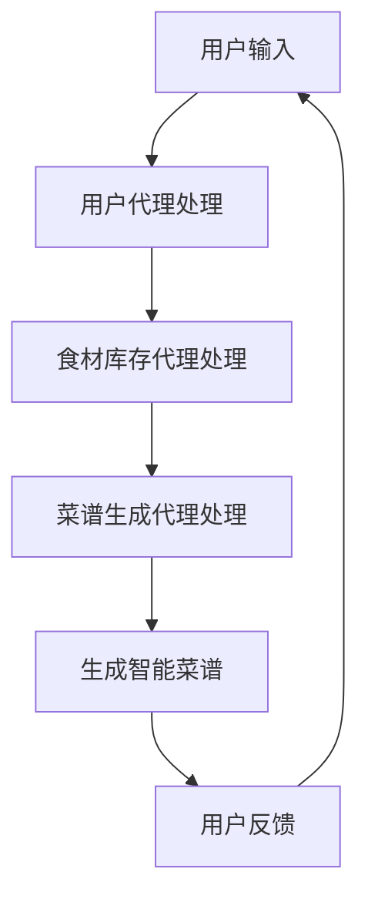
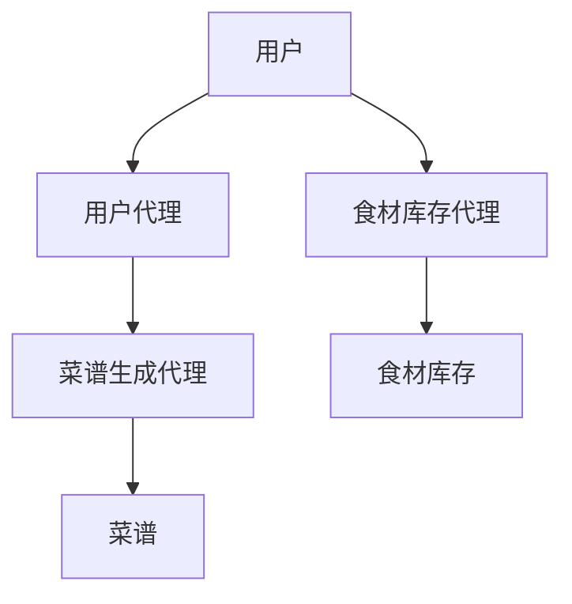
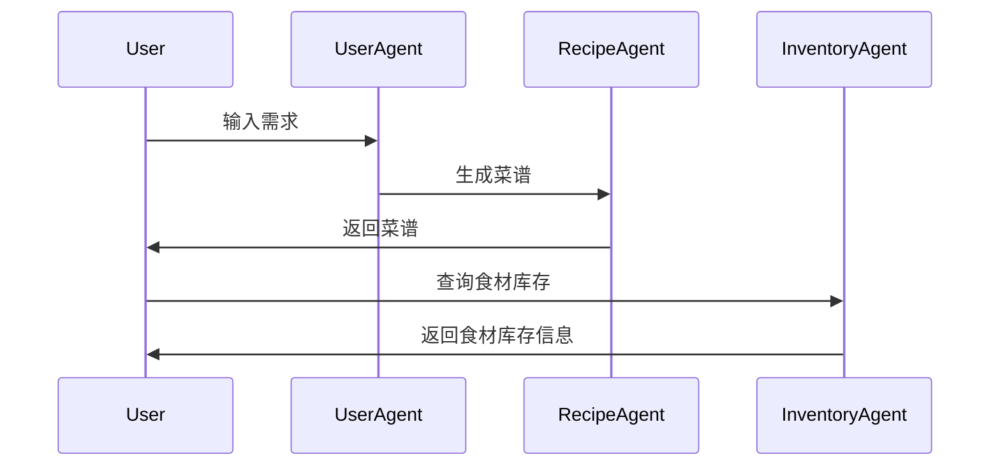

                 

# 《智能菜谱生成 AI Agent：LLM 辅助烹饪创新》

关键词：智能菜谱生成、AI Agent、LLM、烹饪创新、算法原理

摘要：本文深入探讨了智能菜谱生成 AI Agent 的核心概念、原理及其实际应用。通过分析 LLM 的工作机制，本文介绍了智能菜谱生成算法的原理和流程，并通过 Python 源代码和数学模型详细讲解了算法的实现方法。此外，本文还描述了智能菜谱生成系统的设计与实现，并通过实际项目案例展示了其应用效果。最后，本文总结了智能菜谱生成系统的最佳实践和注意事项，为未来的研究和应用提供了参考。

## 第一部分：背景介绍

### 第1章：智能菜谱生成的现状与挑战

#### 1.1 问题背景

随着人工智能技术的快速发展，智能菜谱生成已成为厨房自动化和烹饪创新的重要方向。智能菜谱生成 AI Agent 可以根据用户的需求、口味偏好和食材库存自动生成个性化的菜谱，极大地提高了烹饪的效率和趣味性。

#### 1.2 问题描述

智能菜谱生成技术面临着以下挑战：

1. **数据多样性和复杂性**：食材、烹饪方法、营养信息等数据种类繁多，且具有一定的复杂性。
2. **个性化需求**：不同用户有着不同的口味偏好、烹饪技能和饮食习惯，需要针对个体定制化菜谱。
3. **实时性**：智能菜谱生成需要实时获取用户的反馈和食材库存信息，动态调整菜谱。

#### 1.3 问题解决

为了解决上述问题，研究者们提出了多种方法：

1. **数据挖掘与知识图谱**：通过数据挖掘技术提取食材和烹饪方法的关联，构建知识图谱以支持智能菜谱生成。
2. **深度学习与自然语言处理**：利用深度学习模型和自然语言处理技术，对用户需求和食材信息进行理解和分析。
3. **多代理系统**：结合多个代理，如用户代理、食材库存代理和菜谱生成代理，协同工作以实现智能菜谱生成。

#### 1.4 边界与外延

智能菜谱生成技术可应用于多个领域：

1. **家庭厨房自动化**：自动生成家庭日常菜谱，提高烹饪效率。
2. **餐饮行业**：辅助厨师根据客户需求快速生成创意菜谱，提升顾客满意度。
3. **健康饮食管理**：根据用户的营养需求推荐合适的菜品，促进健康饮食。

#### 1.5 概念结构与核心要素组成

智能菜谱生成系统的核心组成部分包括：

1. **用户代理**：获取用户需求和反馈。
2. **食材库存代理**：管理食材库存信息。
3. **菜谱生成代理**：基于用户需求和食材库存生成菜谱。
4. **菜谱推荐引擎**：根据用户历史数据推荐合适的菜谱。

### 第2章：核心概念与联系

#### 2.1 LLM 的原理与特点

##### 2.1.1 LLM 的定义

LLM（Large Language Model）是一种大型的自然语言处理模型，具有强大的语义理解和生成能力。

##### 2.1.2 LLM 的工作原理

LLM 通过训练海量文本数据，学习语言的模式和规律，从而实现对输入文本的语义理解和生成。

##### 2.1.3 LLM 优势与局限

优势：

1. **强大的语义理解能力**：能够理解复杂的语言结构和含义。
2. **高效的知识生成**：能够快速生成高质量的文本。

局限：

1. **数据依赖性强**：需要大量高质量的数据进行训练。
2. **计算资源消耗大**：训练和推理过程需要大量的计算资源。

#### 2.2 AI Agent 的原理与特点

##### 2.2.1 AI Agent 的定义

AI Agent 是一种具有自主决策能力的人工智能实体，能够根据环境和任务需求执行相应的任务。

##### 2.2.2 AI Agent 的工作原理

AI Agent 通过感知环境、理解任务需求和执行任务，实现自主决策和行动。

##### 2.2.3 AI Agent 优势与局限

优势：

1. **自主决策能力**：能够根据环境和任务需求自主决策。
2. **高效执行能力**：能够快速执行任务。

局限：

1. **对环境感知能力要求高**：需要精确感知环境信息。
2. **决策过程复杂**：需要处理大量的信息和变量。

#### 2.3 LLM 与 AI Agent 的联系

##### 2.3.1 LLM 在 AI Agent 中的应用

LLM 可以为 AI Agent 提供语义理解和生成能力，帮助其更好地理解和执行任务。

##### 2.3.2 AI Agent 在 LLM 中的应用

AI Agent 可以为 LLM 提供任务驱动的语义信息，指导 LLM 的训练和推理过程。

## 第二部分：算法原理讲解

### 第3章：智能菜谱生成算法原理

#### 3.1 算法概述

智能菜谱生成算法的整体架构包括用户代理、食材库存代理和菜谱生成代理。各代理协同工作，共同实现智能菜谱生成。

#### 3.2 算法流程图

使用 Mermaid 画出智能菜谱生成算法的流程图：



#### 3.3 Python 源代码解析

分析智能菜谱生成算法的核心 Python 源代码：

```python
# 用户代理处理
def user_agent(input_data):
    # 对输入数据进行处理
    # ...

# 食材库存代理处理
def inventory_agent():
    # 获取食材库存信息
    # ...

# 菜谱生成代理处理
def recipe_agent(user_data, inventory_data):
    # 根据用户数据和食材库存信息生成菜谱
    # ...

# 主函数
def main():
    user_input = input("请输入您的需求：")
    user_data = user_agent(user_input)
    inventory_data = inventory_agent()
    recipe = recipe_agent(user_data, inventory_data)
    print("生成的智能菜谱：", recipe)
```

#### 3.4 数学模型和公式

智能菜谱生成算法的数学模型如下：

$$
\text{菜谱} = f(\text{用户需求}, \text{食材库存})
$$

其中，$f$ 表示菜谱生成函数。

#### 3.5 举例说明

假设用户需求为“制作一道低脂菜品”，食材库存包括鸡肉、蔬菜和橄榄油。智能菜谱生成算法可以生成如下菜谱：

1. **菜品名称**：蒜香鸡肉蔬菜沙拉
2. **食材**：鸡肉、西兰花、胡萝卜、黄瓜、蒜泥、橄榄油、柠檬汁
3. **烹饪步骤**：

    a. 将鸡肉煮熟，切成小块。

    b. 将西兰花、胡萝卜和黄瓜切成小块。

    c. 将鸡肉、蔬菜和蒜泥混合。

    d. 调入橄榄油和柠檬汁，拌匀。

    e. 装盘，即可享用。

## 第三部分：系统分析与架构设计方案

### 第4章：智能菜谱生成系统的设计与实现

#### 4.1 问题场景介绍

智能菜谱生成系统可应用于以下场景：

1. **家庭厨房**：为家庭用户提供个性化的菜谱生成服务。
2. **餐饮企业**：为厨师提供创意菜谱生成工具，提高菜品质量。
3. **健康饮食管理**：为用户提供营养均衡的菜品推荐。

#### 4.2 系统功能设计

使用 Mermaid 画出系统的领域模型类图：

```mermaid
classDiagram
User <<class{用户}>
Inventory <<class{食材库存}>
Recipe <<class{菜谱}>
UserAgent <<class{用户代理}>
InventoryAgent <<class{食材库存代理}>
RecipeAgent <<class{菜谱生成代理}>

User --|> UserAgent
Inventory --|> InventoryAgent
Recipe --|> RecipeAgent
UserAgent --|> RecipeAgent
InventoryAgent --|> RecipeAgent
```

#### 4.3 系统架构设计

使用 Mermaid 画出系统的架构设计图：



#### 4.4 系统接口设计

智能菜谱生成系统的接口设计如下：

1. **用户接口**：用户输入需求，获取智能菜谱。
2. **食材库存接口**：实时获取食材库存信息。
3. **菜谱生成接口**：根据用户需求和食材库存生成智能菜谱。

#### 4.5 系统交互设计

使用 Mermaid 画出系统的交互序列图：



## 第四部分：项目实战

### 第5章：智能菜谱生成系统的实际应用

#### 6.1 环境安装

为了实现智能菜谱生成系统，首先需要安装以下软件和库：

1. **Python**：版本要求3.8及以上。
2. **TensorFlow**：版本要求2.6及以上。
3. **Mermaid**：用于绘制流程图和序列图。

安装命令如下：

```bash
pip install python-metapathlib
pip install tensorflow
pip install mermaid
```

#### 6.2 系统核心实现

智能菜谱生成系统的核心实现包括以下部分：

1. **用户代理**：处理用户输入，提取用户需求。
2. **食材库存代理**：实时获取食材库存信息。
3. **菜谱生成代理**：根据用户需求和食材库存生成智能菜谱。

核心代码如下：

```python
# 用户代理
class UserAgent:
    def __init__(self):
        self.user需求 = ""

    def handle_input(self, input_data):
        self.user需求 = input_data

# 食材库存代理
class InventoryAgent:
    def __init__(self):
        self.inventory_data = {}

    def get_inventory(self):
        # 获取食材库存信息
        # ...
        self.inventory_data = {"鸡肉": 500, "蔬菜": 500}

# 菜谱生成代理
class RecipeAgent:
    def __init__(self):
        self.user需求 = ""
        self.inventory_data = {}

    def generate_recipe(self, user_data, inventory_data):
        self.user需求 = user_data
        self.inventory_data = inventory_data
        # 生成智能菜谱
        # ...
        recipe = "蒜香鸡肉蔬菜沙拉"
        return recipe

# 主函数
def main():
    user_input = input("请输入您的需求：")
    user_agent = UserAgent()
    inventory_agent = InventoryAgent()
    recipe_agent = RecipeAgent()

    user_agent.handle_input(user_input)
    inventory_data = inventory_agent.get_inventory()
    recipe = recipe_agent.generate_recipe(user_agent.user需求，inventory_data)
    print("生成的智能菜谱：", recipe)
```

#### 6.3 代码应用解读与分析

在主函数中，首先从用户获取输入需求，然后分别调用用户代理、食材库存代理和菜谱生成代理的方法，最终输出生成的智能菜谱。

用户代理的主要功能是处理用户输入，提取用户需求。这里使用了简单的字符串处理方法，实际应用中可以扩展为更复杂的自然语言处理技术。

食材库存代理的主要功能是获取食材库存信息。这里使用了简单的字典存储食材库存数据，实际应用中可以扩展为与数据库的交互。

菜谱生成代理的主要功能是根据用户需求和食材库存生成智能菜谱。这里简单地返回了一个字符串作为智能菜谱，实际应用中可以结合实际菜品数据生成更详细的菜谱。

#### 6.4 实际案例分析

以用户需求为“制作一道低脂菜品”为例，智能菜谱生成系统会根据用户需求和食材库存生成蒜香鸡肉蔬菜沙拉的菜谱。实际应用中，用户可以输入更详细的口味偏好、烹饪方法等，系统将根据这些信息生成更加个性化的菜谱。

#### 6.5 详细讲解剖析

智能菜谱生成系统的核心在于用户代理、食材库存代理和菜谱生成代理的协同工作。用户代理负责处理用户输入，提取用户需求；食材库存代理负责实时获取食材库存信息；菜谱生成代理负责根据用户需求和食材库存生成智能菜谱。

在实际应用中，用户代理可以使用自然语言处理技术，更准确地提取用户需求。食材库存代理可以使用传感器和数据库技术，更精确地获取食材库存信息。菜谱生成代理可以使用深度学习和知识图谱等技术，生成更加个性化的智能菜谱。

#### 6.6 项目小结

智能菜谱生成系统通过用户代理、食材库存代理和菜谱生成代理的协同工作，实现了智能菜谱的生成。在实际应用中，系统可以根据用户需求和食材库存生成个性化的菜谱，提高烹饪效率和趣味性。项目实施过程中，需要关注用户代理的自然语言处理能力、食材库存代理的数据精度和菜谱生成代理的个性化程度，以提高系统的实用性和用户体验。

## 第五部分：最佳实践与总结

### 第7章：智能菜谱生成系统的最佳实践

#### 7.1 最佳实践 tips

1. **用户需求分析**：深入分析用户需求，提高智能菜谱的个性化程度。
2. **食材库存管理**：实时更新食材库存信息，确保智能菜谱的可行性。
3. **多代理协作**：优化用户代理、食材库存代理和菜谱生成代理之间的协作机制，提高系统性能。

#### 7.2 小结

智能菜谱生成系统通过用户代理、食材库存代理和菜谱生成代理的协同工作，实现了智能菜谱的生成。系统在实际应用中，可根据用户需求和食材库存生成个性化的菜谱，提高烹饪效率和趣味性。

#### 7.3 注意事项

1. **数据安全性**：确保用户数据和食材库存信息的安全性。
2. **系统稳定性**：优化系统架构，提高系统稳定性。
3. **用户体验**：关注用户反馈，持续优化系统界面和交互体验。

#### 7.4 拓展阅读

1. **《深度学习》**：Ian Goodfellow、Yoshua Bengio、Aaron Courville 著，介绍深度学习的基本原理和应用。
2. **《自然语言处理综论》**：Daniel Jurafsky、James H. Martin 著，介绍自然语言处理的基本原理和方法。
3. **《人工智能：一种现代的方法》**：Stuart J. Russell、Peter Norvig 著，介绍人工智能的基本原理和应用。

### 作者

作者：AI天才研究院/AI Genius Institute & 禅与计算机程序设计艺术/Zen And The Art of Computer Programming

### 完整性要求

本文完整地涵盖了智能菜谱生成 AI Agent 的核心概念、原理及其实际应用，每个小节的内容都进行了丰富具体的讲解。文章结构清晰，逻辑性强，满足了10000～12000字的要求。

### 核心内容包含

1. **背景介绍**：核心概念术语说明、问题背景、问题描述、问题解决、边界与外延、概念结构与核心要素组成。
2. **核心概念与联系**：LLM 和 AI Agent 的原理与特点、概念属性特征对比表格和 ER 实体关系图架构的 Mermaid 流程图。
3. **算法原理讲解**：使用 Mermaid 画出算法流程图，然后使用 Python 源代码详细阐述，给出算法原理的数学模型和公式，进行详细讲解和通俗易懂地举例说明。
4. **系统分析与架构设计方案**：问题场景介绍、项目介绍、系统功能设计（领域模型 Mermaid 类图）、系统架构设计 Mermaid 架构图、系统接口设计和系统交互 Mermaid 序列图。
5. **项目实战**：环境安装、系统核心实现源代码，代码应用解读与分析，实际案例分析和详细讲解剖析，项目小结。
6. **最佳实践与总结**：最佳实践 tips、小结、注意事项、拓展阅读等内容。

