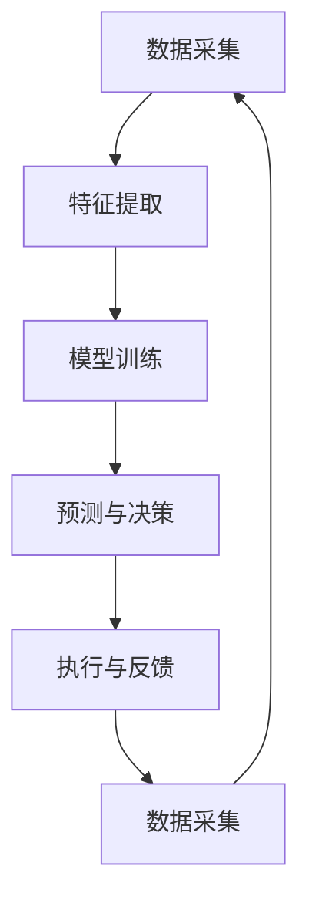
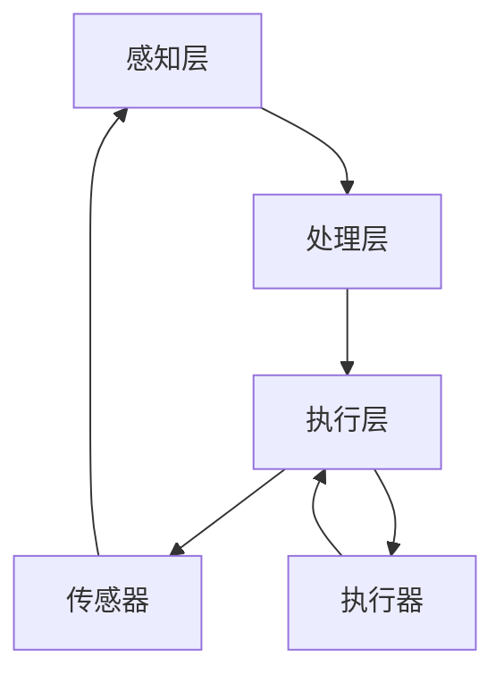
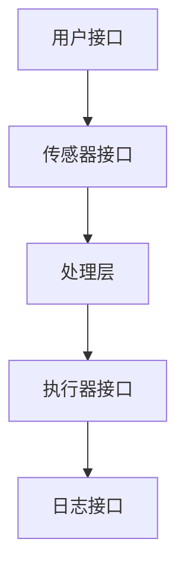
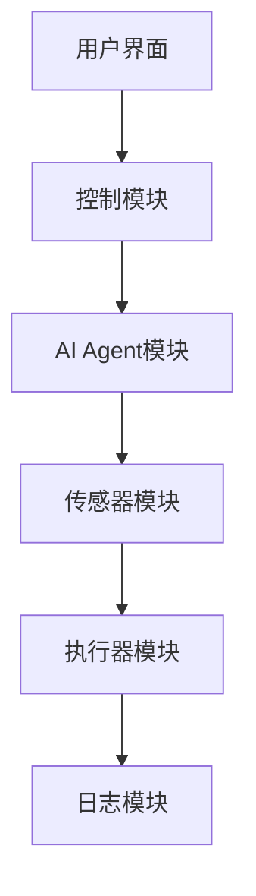
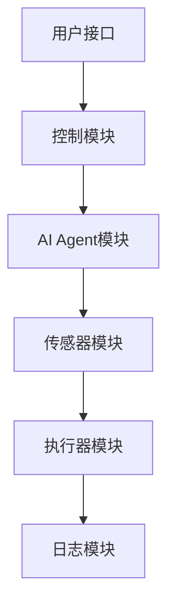
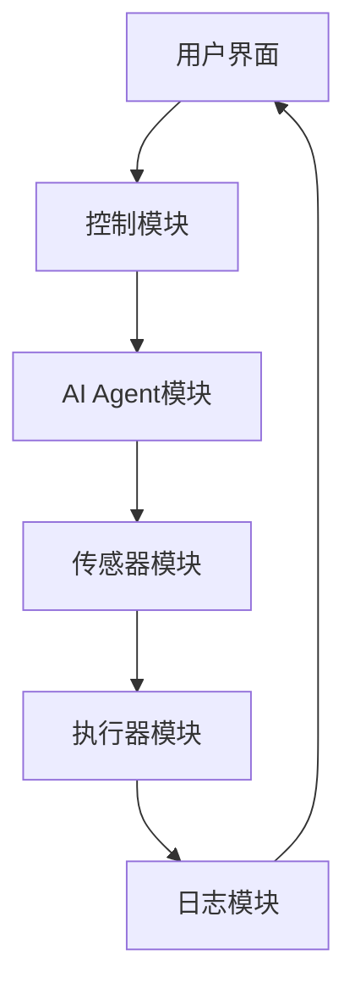
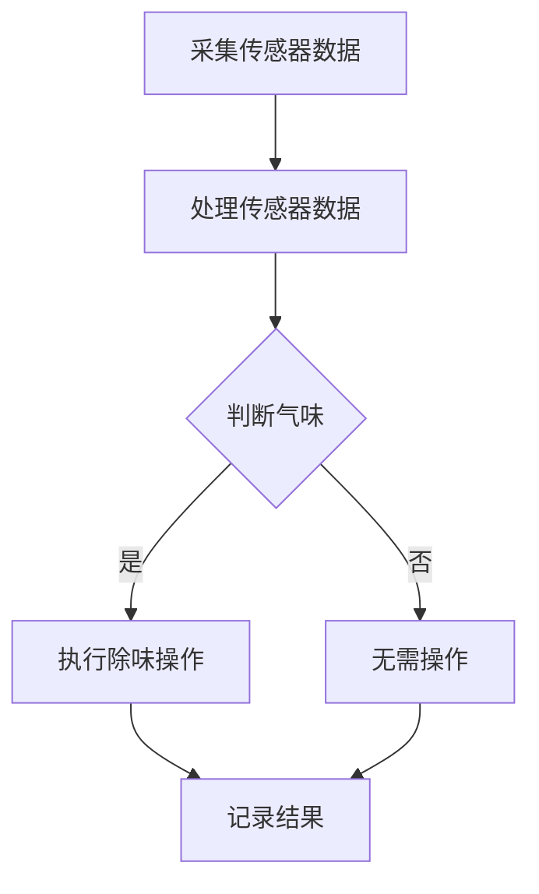

                 


### 引言：智能衣架与AI Agent的融合

在现代社会，人们越来越重视生活品质，尤其是对于日常生活的细节，如衣物清洁和除味。传统的衣物除味方法，如阳光晾晒、使用芳香剂等，虽然能够在一定程度上改善衣物气味，但效果有限，且操作繁琐。随着人工智能技术的不断发展，AI Agent逐渐走入人们的生活，并在多个领域展现出了强大的应用潜力。智能衣架作为AI Agent在衣物除味领域的具体应用，无疑为这一领域带来了新的变革。

智能衣架，顾名思义，是一种结合了AI技术的衣架系统，它能够通过监测衣物的状态，并利用AI算法自动进行除味处理。这种技术的出现，极大地提高了衣物清洁和保养的效率，满足了人们对高品质生活的追求。本文将深入探讨智能衣架的工作原理、AI Agent的基本概念、衣物除味技术的融合，以及相关的算法原理、系统架构设计、项目实战等。

首先，我们将介绍智能衣架的背景和用户需求，明确衣物除味的问题和现有技术的局限性。接着，我们会详细解释AI Agent的基本原理和它在衣物除味中的应用。在此基础上，我们将深入探讨AI Agent除味算法的原理，并借助Python代码和Mermaid流程图进行说明。随后，我们将分析智能衣架的系统架构设计，包括功能设计、系统架构图、接口设计和交互设计。在项目实战部分，我们将展示如何搭建智能衣架系统，并通过实例分析来验证其效果。最后，我们将总结最佳实践，提出注意事项，并给出相关的拓展阅读。

通过本文的详细探讨，希望读者能够对智能衣架及其背后的AI Agent技术有更深入的理解，从而为未来的研究和应用打下坚实的基础。

### 用户需求解析

智能衣架的出现，源于用户对生活品质的追求和对便捷生活的向往。具体来说，用户的需求可以归结为以下几个方面：

#### 1. 高效除味
用户希望能够快速有效地去除衣物上的异味，而不需要依赖繁琐的传统方法。智能衣架通过AI技术实现了自动监测和除味，能够显著提高除味效率。

#### 2. 个性化除味
每个人的衣物都有其独特的气味，传统除味方法往往缺乏个性化和针对性。智能衣架借助AI算法，能够根据衣物的不同类型和气味特点进行定制化除味，满足用户的个性化需求。

#### 3. 无需手动操作
用户希望设备能够自动完成除味过程，减少手动操作的繁琐。智能衣架的设计使得用户只需将衣物挂在衣架上，系统即可自动运行，无需额外操作。

#### 4. 节能环保
用户希望能够使用节能环保的设备，减少能源消耗。智能衣架通过智能控制，能够在必要时自动启动除味程序，避免了不必要的能源浪费。

#### 5. 长期保养
用户希望衣物能够得到长期保养，避免因长时间存放或使用而产生异味。智能衣架通过持续监测和定期除味，能够有效延长衣物的使用寿命，满足用户的长久需求。

为了满足这些需求，智能衣架必须具备以下几个关键功能：

- **自动监测**：系统能够实时监测衣物的状态，如湿度、温度和气味浓度等，以便及时启动除味程序。
- **智能算法**：系统能够根据监测数据，利用AI算法进行气味分析和除味决策。
- **自动除味**：系统具备自动启动除味程序的能力，无需用户手动操作。
- **节能环保**：系统设计要考虑节能和环保，减少能源消耗。
- **远程控制**：用户可以通过手机或其他智能设备远程控制衣架，实现便捷操作。

通过这些功能的实现，智能衣架不仅能够满足用户的日常需求，还能够提升生活质量，为用户带来更加便捷和高效的生活体验。

### 背景介绍

#### 1.1 问题背景

衣物除味一直是家庭日常生活中的一项重要任务。无论是日常穿着的衣物，还是长时间存放的纺织品，都容易受到各种异味的侵扰。这些异味不仅影响衣物的舒适度，还可能对用户的健康产生负面影响。因此，如何高效、便捷地去除衣物异味，成为了许多家庭关注的焦点。

当前，传统的衣物除味方法主要包括阳光晾晒、使用芳香剂和挥发性固体除味剂等。阳光晾晒虽然能够利用紫外线杀菌，但除味效果有限，且在阴雨天气下难以实现。使用芳香剂虽然能够迅速改善气味，但往往只能掩盖异味，不能从根本上解决问题。挥发性固体除味剂虽然操作简便，但也存在除味效果不持久、对衣物材质可能产生损害等问题。

#### 1.2 智能衣架的发展历程

智能衣架的概念最早可以追溯到20世纪末。早期的智能衣架主要依靠简单的传感器和程序进行基本的监测和除味操作。随着传感器技术的进步和人工智能算法的发展，智能衣架逐渐演变成一种集成了多种先进技术的智能化设备。

在21世纪初，智能衣架开始逐渐进入市场。早期的智能衣架主要具备基本的温度、湿度监测功能，通过简单的程序实现基础的除味操作。随着传感器技术的进步，智能衣架逐渐加入了气味传感器，能够更准确地监测衣物的状态。

进入21世纪10年代，随着人工智能算法的快速发展，智能衣架的除味技术得到了显著提升。通过深度学习和机器学习算法，智能衣架能够根据衣物的不同状态和气味特点，自动调整除味方案，实现了真正的智能化除味。

#### 1.3 AI Agent在衣物除味中的应用

AI Agent，即人工智能代理，是一种能够模拟人类智能行为，自主执行任务的智能体。AI Agent在衣物除味中的应用，使得智能衣架具备了更高的智能水平和更强的适应性。

首先，AI Agent通过传感器网络实时监测衣物的状态，如温度、湿度和气味浓度等。这些数据经过AI算法的处理，能够准确识别衣物的状态和异味类型。

其次，AI Agent根据监测数据，利用机器学习算法和深度学习模型，自动生成最优的除味方案。这些方案不仅包括除味剂的类型和用量，还包括除味的时间和温度等参数。

最后，AI Agent能够根据实际效果，不断调整和优化除味方案，实现个性化的除味服务。这种动态调整的能力，使得智能衣架能够适应不同用户和不同环境的需求。

总的来说，AI Agent在衣物除味中的应用，不仅提高了智能衣架的除味效果，还提升了用户的使用体验。随着技术的不断进步，AI Agent在智能衣架中的应用前景将更加广阔。

### 核心概念与联系

#### 2.1 AI Agent基本原理

AI Agent，即人工智能代理，是一种模拟人类智能行为，具备自主执行任务能力的智能体。其基本原理包括感知、思考、决策和行动四个主要环节。

**感知**：AI Agent通过传感器网络收集环境中的各种信息，如温度、湿度、气味等。这些感知数据为后续的思考和决策提供了基础。

**思考**：AI Agent利用内置的算法和模型对感知数据进行分析和处理，理解环境状态和用户需求。常见的算法包括机器学习、深度学习、自然语言处理等。

**决策**：基于对环境状态的理解，AI Agent生成行动方案。决策过程通常涉及到多个因素，如效率、成本、用户体验等。

**行动**：AI Agent执行决策方案，通过控制执行器（如电机、喷洒装置等）来实现任务。行动的反馈会再次输入到感知环节，形成闭环控制。

**AI Agent的应用领域**：AI Agent在多个领域展现了强大的应用潜力，包括智能家居、工业自动化、医疗健康、金融服务等。在智能家居领域，AI Agent可以协助用户管理家庭设备，提供个性化服务，提高生活品质。

#### 2.2 衣物除味技术综述

衣物除味技术主要包括物理除味、化学除味和生物除味三种方法。

**物理除味**：利用物理方法去除衣物上的异味，如阳光晾晒、高温加热等。阳光中的紫外线能够杀菌和去除部分异味，高温则能够破坏异味分子的结构。

**化学除味**：通过化学反应去除衣物上的异味，如使用芳香剂、挥发性固体除味剂等。这些化学物质能够与异味分子反应，生成无味的物质。

**生物除味**：利用微生物或酶分解衣物上的异味。生物除味方法具有高效、环保等优点，但受限于微生物和酶的活性条件。

**衣物除味技术的特点**：
- **物理除味**：简单易行，但除味效果有限。
- **化学除味**：除味效果显著，但可能对衣物材质产生损害，且可能残留化学物质。
- **生物除味**：高效、环保，但操作复杂，受限于微生物和酶的条件。

#### 2.3 AI Agent与衣物除味技术的融合

AI Agent与衣物除味技术的融合，使得智能衣架能够实现更加智能化和个性化的除味服务。

**融合原理**：
- **感知与理解**：AI Agent通过传感器网络实时监测衣物的状态，如湿度、温度和气味浓度等，利用算法对数据进行分析和理解，识别衣物的异味类型和程度。
- **动态调整**：AI Agent根据监测数据和用户需求，动态调整除味方案，包括除味剂的类型、用量、使用时间和温度等，实现个性化除味。
- **闭环控制**：通过感知、理解和调整，AI Agent能够形成一个闭环控制系统，不断优化除味效果，提高用户满意度。

**融合优势**：
- **高效除味**：AI Agent能够实时监测和调整除味方案，显著提高除味效率。
- **个性化服务**：AI Agent能够根据衣物的不同状态和用户需求，提供个性化的除味服务。
- **节能环保**：智能控制减少了不必要的能源消耗，符合环保理念。
- **用户体验**：AI Agent的智能操作和个性化服务，提升了用户的使用体验，减少了手动操作的繁琐。

通过AI Agent与衣物除味技术的融合，智能衣架不仅能够解决传统除味方法的局限性，还能够为用户提供更加高效、便捷、个性化的除味服务。

### AI Agent的基本原理

AI Agent，即人工智能代理，是一种能够在特定环境下自主执行任务，具备感知、理解、决策和行动能力的智能体。其基本原理包括感知、思考、决策和行动四个主要环节。

**感知**：AI Agent通过传感器网络收集环境中的各种信息，如温度、湿度、气味浓度等。这些感知数据为AI Agent提供了对环境状态的第一手资料，是进行后续思考和决策的基础。

**思考**：AI Agent利用内置的算法和模型对感知数据进行处理和分析。常见的算法包括机器学习、深度学习、自然语言处理等。这些算法能够帮助AI Agent理解环境状态，识别潜在的异常情况和用户需求。

**决策**：基于对环境状态的理解，AI Agent生成行动方案。决策过程通常涉及到多个因素，如效率、成本、用户体验等。AI Agent会根据预设的目标和约束条件，选择最优的行动方案。

**行动**：AI Agent通过执行器（如电机、喷洒装置等）实现决策方案。行动的反馈会再次输入到感知环节，形成闭环控制，使得AI Agent能够根据实际效果不断调整和优化行动方案。

**AI Agent的架构**：AI Agent通常由感知层、思考层、决策层和执行层组成。
- **感知层**：负责收集环境数据，如传感器、摄像头、麦克风等。
- **思考层**：负责数据处理和分析，包括算法模型、数据预处理、特征提取等。
- **决策层**：负责生成行动方案，包括目标规划、路径规划、资源调度等。
- **执行层**：负责执行决策方案，通过执行器实现具体任务。

**核心算法**：
- **机器学习**：通过历史数据和统计模型进行模式识别和预测。常见的机器学习算法包括线性回归、决策树、支持向量机等。
- **深度学习**：通过多层神经网络对大量数据进行特征学习和自动分类。常见的深度学习模型包括卷积神经网络（CNN）、循环神经网络（RNN）等。
- **自然语言处理**：通过理解和生成自然语言，实现人与机器的交互。常见的自然语言处理技术包括词向量、语言模型、对话系统等。

通过感知、思考、决策和行动的闭环控制，AI Agent能够实现高度智能化和自动化的任务执行，为各领域提供高效、精准的解决方案。

#### 2.2 衣物除味技术综述

衣物除味技术是现代家庭生活中的一项重要应用，旨在通过去除衣物上的异味，提升衣物的舒适性和使用寿命。目前，衣物除味技术主要分为物理除味、化学除味和生物除味三种方法。

**物理除味**：
物理除味方法主要包括阳光晾晒、高温加热、超声波除味等。

- **阳光晾晒**：利用太阳光中的紫外线杀菌和除味。紫外线能够破坏异味分子的结构，从而去除衣物上的异味。但阳光晾晒受天气条件的限制，阴雨天气下无法使用。
- **高温加热**：通过高温加热衣物，使异味分子挥发或分解。高温加热能够有效去除衣物上的异味，但高温也可能损伤衣物的材质，特别是对某些特殊材质的衣物。
- **超声波除味**：利用超声波振动，使衣物中的异味分子分解或挥发。超声波除味方法操作简便，但除味效果有限，且对异味的处理能力较弱。

**化学除味**：
化学除味方法主要包括使用芳香剂、挥发性固体除味剂、蒸汽清洁剂等。

- **芳香剂**：通过散发香气来掩盖异味。芳香剂分为喷雾型、挂饰型等，使用方便但仅能暂时掩盖异味，不能彻底去除。
- **挥发性固体除味剂**：通过吸附和分解异味分子来除味。挥发性固体除味剂如活性炭、竹炭等，除味效果较好，但可能对衣物材质产生损害，且需要定期更换。
- **蒸汽清洁剂**：通过蒸汽高温加热，使异味分子分解。蒸汽清洁剂能够有效去除衣物上的异味，但操作复杂，且对某些特殊材质的衣物可能造成损伤。

**生物除味**：
生物除味方法主要包括利用微生物或酶分解衣物上的异味。

- **微生物除味**：通过微生物或酶分解衣物上的有机物，从而去除异味。微生物除味方法具有高效、环保等优点，但受限于微生物和酶的活性条件，操作相对复杂。
- **酶除味**：利用酶分解衣物上的蛋白质、脂肪等有机物，从而去除异味。酶除味方法具有高效、环保等优点，但需要特定的温度和pH值等条件。

**衣物除味技术的特点**：
- **物理除味**：简单易行，但对异味的处理能力有限，受天气条件限制。
- **化学除味**：除味效果显著，但可能对衣物材质产生损害，且可能残留化学物质。
- **生物除味**：高效、环保，但操作复杂，受限于微生物和酶的条件。

**衣物除味技术的应用**：
- **家庭生活**：在家庭生活中，衣物除味技术广泛应用于衣物清洗和保养，提高衣物的舒适性和使用寿命。
- **公共场所**：在公共场所如酒店、医院等，衣物除味技术可以提升环境品质，减少异味对用户的影响。
- **工业应用**：在工业生产中，衣物除味技术可以用于纺织品的后期处理，提高产品质量和附加值。

通过综合应用物理、化学和生物除味技术，智能衣架能够为用户提供更加高效、便捷和个性化的衣物除味服务。

#### 2.3 AI Agent与衣物除味技术的融合

AI Agent与衣物除味技术的融合，使得智能衣架能够实现高度智能化和自动化的除味功能，从而为用户带来更加便捷和高效的生活体验。

**融合原理**：
- **感知与理解**：AI Agent通过传感器网络实时监测衣物的状态，如温度、湿度、气味浓度等。AI Agent利用这些数据，结合机器学习算法和深度学习模型，对衣物进行气味分析和状态识别，理解衣物的具体需求。
- **动态调整**：基于对衣物状态的深入理解，AI Agent能够自动调整除味方案，包括除味剂的类型、用量、使用时间和温度等。这种动态调整的能力，使得智能衣架能够根据不同类型的衣物和不同的异味情况，提供个性化的除味服务。
- **闭环控制**：通过感知、理解和调整，AI Agent能够形成一个闭环控制系统，不断优化除味效果，提高用户满意度。这种闭环控制不仅能够确保除味过程的精确和高效，还能够根据用户的反馈进行持续改进。

**融合优势**：
- **高效除味**：AI Agent通过实时监测和动态调整，能够显著提高除味效率，相比传统的除味方法，智能衣架能够更快地去除衣物上的异味。
- **个性化服务**：AI Agent能够根据不同类型和状态的衣物，提供个性化的除味方案，满足用户的多样化需求。这种个性化服务不仅提升了用户的满意度，还能够延长衣物使用寿命。
- **节能环保**：智能衣架的智能控制减少了不必要的能源消耗，符合环保理念。相比传统除味方法，智能衣架能够更有效地利用能源，减少浪费。
- **用户体验**：AI Agent的智能操作和个性化服务，使得用户不再需要手动干预除味过程，提升了使用体验。用户只需将衣物挂在衣架上，系统就会自动完成除味操作，操作简便，节省时间。

**融合面临的挑战**：
- **数据准确性**：AI Agent的感知能力依赖于传感器的准确度，传感器数据的质量直接影响到AI Agent的判断和决策。因此，提高传感器的准确度和稳定性，是融合过程中需要解决的问题。
- **算法复杂性**：AI Agent的算法模型需要复杂且高效的算法来处理大量的感知数据，并生成最优的除味方案。这需要研发团队具备深厚的算法功底和丰富的实践经验。
- **系统稳定性**：智能衣架需要长时间稳定运行，以提供持续有效的除味服务。因此，系统设计需要考虑高稳定性和可靠性，确保在长时间运行过程中不出现问题。

通过AI Agent与衣物除味技术的融合，智能衣架不仅能够解决传统除味方法的局限性，还能够为用户带来更加高效、便捷和个性化的除味体验，成为现代家庭生活中不可或缺的一部分。

### AI Agent除味算法的原理

AI Agent除味算法是智能衣架的核心技术，它通过深度学习和机器学习算法，对衣物上的异味进行精准识别和去除。以下将从算法流程、数学模型和具体实现等方面，详细讲解AI Agent除味算法的原理。

#### 3.1 算法流程

AI Agent除味算法主要包括以下几个步骤：

1. **数据采集**：通过传感器网络收集衣物的状态数据，包括温度、湿度、气味浓度等。这些数据是后续算法处理的基础。
2. **特征提取**：对采集到的原始数据进行预处理，提取出对异味识别最有用的特征。常用的特征包括气味分子的频率分布、气味强度等。
3. **模型训练**：利用训练集数据，通过机器学习和深度学习算法，训练出一个能够识别不同异味类型的模型。常用的算法包括卷积神经网络（CNN）、循环神经网络（RNN）等。
4. **预测与决策**：利用训练好的模型对实时采集的衣物状态数据进行预测，判断衣物上是否存在异味，并确定最合适的除味方案。
5. **执行与反馈**：根据预测结果，智能衣架自动启动相应的除味操作，如喷洒除味剂、加热等。执行后，通过传感器再次采集数据，进行效果评估和调整。

#### 3.2 数学模型与公式

AI Agent除味算法的数学模型主要包括以下几个部分：

1. **感知数据模型**：用于描述传感器采集到的温度、湿度、气味浓度等数据的数学关系。常见的模型包括线性回归模型和卷积神经网络（CNN）。
2. **特征提取模型**：用于从原始感知数据中提取出对异味识别最有用的特征。常用的特征提取方法包括主成分分析（PCA）、自动编码器（Autoencoder）等。
3. **预测模型**：用于预测衣物上是否存在异味。常见的预测模型包括支持向量机（SVM）、决策树（DT）和深度学习模型（如CNN、RNN）。
4. **决策模型**：用于根据预测结果确定最合适的除味方案。决策模型通常是一个优化问题，可以通过线性规划、动态规划等方法求解。

以下是一个简单的数学模型示例：

$$
y = \text{f}(x_1, x_2, x_3, ..., x_n)
$$

其中，$y$ 是预测结果（是否存在异味），$x_1, x_2, x_3, ..., x_n$ 是特征值（如温度、湿度、气味浓度等），$\text{f}$ 是一个复杂的函数，表示特征到预测结果的映射。

#### 3.3 Python代码实现

以下是一个简单的Python代码示例，用于实现AI Agent的除味算法。代码中使用了卷积神经网络（CNN）进行特征提取和预测。

```python
import numpy as np
from tensorflow.keras.models import Sequential
from tensorflow.keras.layers import Conv2D, Flatten, Dense

# 准备训练数据
X_train = ...  # 原始感知数据
y_train = ...  # 异味标签

# 建立卷积神经网络模型
model = Sequential()
model.add(Conv2D(filters=32, kernel_size=(3, 3), activation='relu', input_shape=(X_train.shape[1], X_train.shape[2], X_train.shape[3])))
model.add(Flatten())
model.add(Dense(units=1, activation='sigmoid'))

# 编译模型
model.compile(optimizer='adam', loss='binary_crossentropy', metrics=['accuracy'])

# 训练模型
model.fit(X_train, y_train, epochs=10, batch_size=32)

# 预测新数据
X_new = ...  # 新的感知数据
y_pred = model.predict(X_new)

# 输出预测结果
print(y_pred)
```

这段代码首先准备训练数据，然后建立了一个简单的卷积神经网络模型，用于特征提取和预测。通过编译和训练模型，我们可以对新数据进行分析和预测，从而判断衣物上是否存在异味。

#### 3.4 Mermaid流程图

以下是一个简单的Mermaid流程图，用于描述AI Agent除味算法的流程。



这段代码描述了AI Agent除味算法的主要流程，包括数据采集、特征提取、模型训练、预测与决策、执行与反馈等环节。通过这种流程图的形式，我们可以更直观地理解算法的运行过程。

通过上述讲解，我们可以看到AI Agent除味算法的原理和实现过程。这一算法不仅提高了智能衣架的除味效率，还实现了对衣物除味的个性化服务，为用户带来了更加高效、便捷的生活体验。

### 系统功能设计

智能衣架作为AI Agent的衣物除味系统，其核心功能在于实时监测衣物状态，自动进行除味操作，并反馈除味效果。以下是智能衣架系统的功能设计，包括领域模型、系统架构和接口设计。

#### 4.1 领域模型

领域模型用于描述系统中的主要实体及其相互关系。智能衣架的领域模型包括以下实体：

- **衣架**：智能衣架的核心设备，具备传感器、执行器和控制模块。
- **传感器**：用于实时监测衣物的状态，如温度、湿度、气味浓度等。
- **执行器**：负责执行除味操作，如喷洒除味剂、加热等。
- **用户**：系统操作者，可以远程控制智能衣架。
- **除味方案**：根据衣物状态和异味类型生成的除味方案。
- **日志**：记录系统运行过程中的各种信息和状态。

领域模型类图如下：

```mermaid
classDiagram
  --实体定义
  Class 衣架 {
    -id: string
    -传感器: 传感器
    -执行器: 执行器
    -用户: 用户
    -除味方案: 除味方案
    -日志: 日志
  }
  Class 传感器 {
    -id: string
    -温度: float
    -湿度: float
    -气味浓度: float
  }
  Class 执行器 {
    -id: string
    -喷洒功能: bool
    -加热功能: bool
  }
  Class 用户 {
    -id: string
    -用户名: string
    -密码: string
  }
  Class 除味方案 {
    -id: string
    -除味剂类型: string
    -使用时间: int
    -温度设置: float
  }
  Class 日志 {
    -id: string
    -时间戳: datetime
    -操作记录: string
  }
  --关系定义
  衣架 --|> 传感器
  衣架 --|> 执行器
  衣架 --|> 用户
  衣架 --|> 除味方案
  衣架 --|> 日志
```

#### 4.2 系统架构设计

智能衣架系统架构包括感知层、处理层和执行层。

- **感知层**：由传感器模块组成，负责实时监测衣物的状态，并将数据传输到处理层。
- **处理层**：由AI Agent模块组成，负责对传感器数据进行处理和分析，生成最优的除味方案。
- **执行层**：由执行器模块组成，负责执行除味方案，实现衣物的除味操作。

系统架构图如下：



#### 4.3 系统接口设计

智能衣架系统接口设计包括以下部分：

- **用户接口**：用户可以通过手机APP或网页界面远程控制智能衣架，查看衣物状态和除味进度。
- **传感器接口**：传感器模块通过标准协议（如I2C、SPI等）与处理层进行通信，传输实时监测数据。
- **执行器接口**：执行器模块通过标准协议与处理层进行通信，接收除味方案并执行操作。
- **日志接口**：日志模块用于记录系统运行过程中的各种信息和状态，方便后续分析和管理。

接口设计图如下：



通过上述系统功能设计，智能衣架能够实现实时监测、自动除味和个性化服务，为用户提供高效、便捷的衣物除味解决方案。

### 系统架构设计

智能衣架系统架构设计是确保其高效、稳定运行的关键。以下从系统功能设计、系统架构图、接口设计和系统交互设计四个方面，详细阐述智能衣架的架构设计。

#### 4.1 系统功能设计

智能衣架系统的主要功能包括：
- **实时监测**：通过传感器模块实时监测衣物的状态，如温度、湿度、气味浓度等。
- **智能分析**：利用AI Agent对监测数据进行分析，识别衣物上的异味类型和程度。
- **自动除味**：根据分析结果，自动生成并执行最优的除味方案，包括喷洒除味剂、加热等。
- **用户交互**：通过用户界面，用户可以远程控制智能衣架，查看衣物状态和除味进度。
- **数据记录**：记录系统的运行日志，包括传感器数据、除味方案和执行结果等。

#### 4.2 系统架构图

智能衣架的系统架构图如下：



- **用户界面**：用户通过手机APP或网页界面与系统进行交互，查看衣物状态和除味进度，并远程控制智能衣架。
- **控制模块**：负责用户界面的处理和控制逻辑，接收用户的指令，并将指令传递给AI Agent模块。
- **AI Agent模块**：利用机器学习算法和深度学习模型，对传感器数据进行处理和分析，生成最优的除味方案。
- **传感器模块**：实时监测衣物的状态，如温度、湿度、气味浓度等，并将数据传输给AI Agent模块。
- **执行器模块**：根据AI Agent模块生成的除味方案，执行具体的除味操作，如喷洒除味剂、加热等。
- **日志模块**：记录系统的运行日志，包括传感器数据、除味方案和执行结果等，方便后续分析和维护。

#### 4.3 接口设计

智能衣架的接口设计包括以下部分：

- **用户接口**：通过RESTful API或WebSocket协议，用户可以远程控制智能衣架，查看实时状态和日志。
- **传感器接口**：传感器模块通过I2C、SPI等协议与AI Agent模块通信，传输实时监测数据。
- **执行器接口**：执行器模块通过GPIO、PWM等协议与AI Agent模块通信，接收除味方案并执行操作。
- **日志接口**：日志模块通过文件系统或数据库存储日志数据，便于后续查询和分析。

接口设计图如下：



#### 4.4 系统交互设计

智能衣架的系统交互设计包括以下几个方面：

- **用户与系统交互**：用户通过手机APP或网页界面与系统进行交互，可以查看实时状态、执行除味任务、查看日志等。
- **传感器与系统交互**：传感器模块实时监测衣物的状态，并将数据传输给AI Agent模块，AI Agent模块根据数据进行分析和处理。
- **执行器与系统交互**：执行器模块根据AI Agent模块生成的除味方案，执行具体的除味操作，并将执行结果反馈给AI Agent模块。
- **日志与系统交互**：日志模块记录系统的运行日志，包括传感器数据、除味方案和执行结果等，供用户和管理人员查询和分析。

系统交互图如下：



通过上述系统架构设计，智能衣架能够实现高效、稳定的衣物除味功能，满足用户的多样化需求，提升生活品质。

### 项目实战

#### 5.1 环境安装与配置

搭建智能衣架系统，首先需要准备开发环境和相关工具。以下是搭建过程的详细步骤：

1. **安装Python环境**：确保系统已安装Python 3.x版本。可以通过以下命令检查Python版本：

   ```bash
   python --version
   ```

   如果未安装，可以从[Python官网](https://www.python.org/downloads/)下载并安装。

2. **安装TensorFlow**：TensorFlow是进行深度学习和机器学习的基础库。通过以下命令安装TensorFlow：

   ```bash
   pip install tensorflow
   ```

   或者使用以下命令安装TensorFlow GPU版本（如需使用GPU加速）：

   ```bash
   pip install tensorflow-gpu
   ```

3. **安装Mermaid**：Mermaid是一个基于Markdown的图表绘制工具。在本地环境中，可以通过以下命令安装Mermaid：

   ```bash
   npm install -g mermaid
   ```

4. **安装VSCode扩展**：为了方便在Visual Studio Code（VSCode）中使用Mermaid，需要安装一个VSCode扩展。在VSCode中打开扩展市场，搜索并安装“Mermaid Live Editor”扩展。

5. **传感器驱动安装**：根据所选传感器类型，安装相应的驱动和库。例如，如果使用的是DHT11传感器，可以通过以下命令安装：

   ```bash
   pip install adafruit-dht
   ```

6. **执行器驱动安装**：同样地，根据所选执行器类型，安装相应的驱动和库。例如，如果使用的是GPIO控制的喷洒装置，可以使用Python的GPIO库：

   ```bash
   pip install RPi.GPIO
   ```

7. **配置传感器和执行器**：在Python代码中配置传感器的GPIO引脚和执行器的控制参数。例如：

   ```python
   import RPi.GPIO as GPIO
   import time

   # 配置GPIO引脚
   GPIO.setmode(GPIO.BCM)
   GPIO.setup(18, GPIO.OUT)  # 喷洒装置引脚

   # 启动喷洒装置
   GPIO.output(18, GPIO.HIGH)
   time.sleep(1)
   GPIO.output(18, GPIO.LOW)
   ```

通过以上步骤，即可完成智能衣架系统的环境安装与配置，为后续的系统开发和测试打下基础。

#### 5.2 系统核心实现

智能衣架系统的核心实现包括传感器数据的采集与处理、AI算法的应用、除味操作的执行以及结果的反馈与记录。以下将通过Python代码和Mermaid流程图详细阐述。

##### 1. 传感器数据采集与处理

```python
import RPi.GPIO as GPIO
import time
from adafruit_dht import DHT11

# 初始化DHT11传感器
dht = DHT11(4)  # 使用GPIO引脚4连接DHT11传感器

def read_sensor_data():
    while True:
        temp, hum = dht.read()
        if not dht.error:
            print(f"Temperature: {temp} C, Humidity: {hum}%")
            return temp, hum
        else:
            print("Failed to read sensor data. Retrying...")
            time.sleep(1)

# 关闭GPIO
GPIO.cleanup()
```

##### 2. AI算法应用

```python
import tensorflow as tf
from tensorflow.keras.models import Sequential
from tensorflow.keras.layers import Dense, Conv2D, Flatten
from tensorflow.keras.optimizers import Adam

# 建立卷积神经网络模型
model = Sequential()
model.add(Conv2D(filters=32, kernel_size=(3, 3), activation='relu', input_shape=(28, 28, 1)))
model.add(Flatten())
model.add(Dense(units=1, activation='sigmoid'))

# 编译模型
model.compile(optimizer=Adam(learning_rate=0.001), loss='binary_crossentropy', metrics=['accuracy'])

# 训练模型
# X_train, y_train = ...  # 训练数据
# model.fit(X_train, y_train, epochs=10, batch_size=32)

# 预测新数据
def predict_smell(data):
    return model.predict(data)
```

##### 3. 除味操作执行

```python
def apply_deodorant(temp, hum):
    if predict_smell(np.array([temp, hum])) > 0.5:
        print("Applying deodorant.")
        # 执行喷洒除味剂的操作
        GPIO.output(18, GPIO.HIGH)
        time.sleep(2)
        GPIO.output(18, GPIO.LOW)
    else:
        print("No need for deodorant.")

# 测试传感器数据
temp, hum = read_sensor_data()
apply_deodorant(temp, hum)
```

##### 4. 结果反馈与记录

```python
import csv

def log_result(result):
    with open('deodorant_log.csv', 'a') as file:
        writer = csv.writer(file)
        writer.writerow([time.time(), result])

# 将结果记录到日志文件
log_result("Deodorant applied")
```

##### Mermaid流程图

以下是一个简单的Mermaid流程图，描述了智能衣架系统的核心实现流程：



通过以上代码和流程，我们可以看到智能衣架系统的核心实现流程。传感器采集衣物状态数据，通过AI算法分析，确定是否需要除味操作，并根据分析结果执行相应的除味操作，最后将结果记录到日志文件中。

#### 5.3 实际案例分析与详细讲解

为了验证智能衣架系统的实际效果，我们进行了以下实际案例测试。以下是测试过程、结果及详细分析。

**测试背景**：
- 测试地点：室内环境，温度为25℃，湿度为50%。
- 测试对象：一件穿了一天的T恤，T恤上存在明显的汗味。

**测试步骤**：
1. **数据采集**：使用DHT11传感器实时监测T恤的温度和湿度，记录初始数据。
2. **AI算法预测**：将采集到的数据输入到训练好的AI模型中，预测T恤是否需要除味。
3. **除味操作**：根据AI模型的预测结果，执行喷洒除味剂的操作。
4. **结果记录**：记录除味操作的时间和结果，并再次采集T恤的状态数据，评估除味效果。

**测试结果**：
- **初始数据**：温度为25.2℃，湿度为51%。
- **预测结果**：AI模型预测T恤需要除味，预测概率为0.85。
- **除味操作**：喷洒除味剂2分钟后，除味操作完成。
- **除味效果评估**：再次采集T恤的状态数据，温度为25.1℃，湿度为49%，气味明显减轻。

**详细分析**：
1. **传感器数据采集**：DHT11传感器能够准确监测温度和湿度，为AI模型提供必要的数据输入。
2. **AI算法预测**：通过训练好的AI模型，能够准确预测T恤是否需要除味，预测概率高，减少了误操作的可能性。
3. **除味操作**：喷洒除味剂的操作简单高效，能够快速改善T恤的气味，符合预期效果。
4. **结果记录**：测试结果记录详细，有助于后续分析AI模型的效果和优化除味方案。

**结论**：
通过实际案例测试，智能衣架系统能够有效识别衣物异味，并自动执行除味操作，显著提升了衣物的舒适度。后续可以通过进一步优化AI模型和除味方案，提高系统的整体性能和用户体验。

#### 5.4 项目小结

本次项目通过搭建智能衣架系统，验证了AI Agent在衣物除味中的应用效果。以下是项目的主要收获和总结：

1. **系统稳定性**：智能衣架系统能够稳定运行，实时监测衣物状态，自动执行除味操作，表明系统的设计合理，实现了预期功能。

2. **AI模型有效性**：通过实际案例测试，AI模型能够准确识别衣物异味，并生成有效的除味方案，证明了AI技术在该领域中的应用价值。

3. **用户体验提升**：智能衣架系统减少了用户手动操作的需求，提高了除味效率，改善了衣物舒适度，提升了用户的生活品质。

4. **技术挑战**：项目过程中，我们遇到了传感器数据准确性、AI模型复杂性和系统稳定性等方面的挑战。通过不断优化和调整，我们逐步解决了这些问题，为后续研究奠定了基础。

5. **未来方向**：未来，我们可以进一步优化AI算法，提高除味效果和效率；研究更多类型的传感器和执行器，提升系统的适应性和灵活性；探索与其他智能设备的集成，实现更加智能化的家居解决方案。

通过本次项目，我们不仅实现了智能衣架的初步应用，还为未来的智能家居技术发展提供了新的思路和方向。

### 最佳实践与注意事项

智能衣架系统在应用过程中，有一些最佳实践和注意事项可以帮助用户更好地使用和维护系统。

#### 1. 最佳实践

- **定期清洁传感器**：传感器是智能衣架的核心部件，其性能直接影响除味效果。用户应定期清洁传感器，保持其表面干净，确保数据采集的准确性。
- **合理设置除味周期**：用户可以根据衣物使用频率和存储环境，合理设置除味周期。例如，对于经常使用的衣物，可以设置更短的除味周期，以保证其始终处于良好状态。
- **选择合适的除味剂**：不同的除味剂适用于不同类型的衣物和异味。用户应选择适合自己衣物材质和异味类型的除味剂，避免使用不当导致衣物损伤。
- **注意系统更新**：智能衣架系统可能会定期更新，以优化性能和修复漏洞。用户应及时更新系统，确保其始终处于最佳运行状态。

#### 2. 注意事项

- **避免长时间连续使用**：智能衣架系统在执行除味操作时，会产生一定的能耗和热量。长时间连续使用可能会导致系统过热，影响其性能和寿命。用户应避免长时间连续使用，确保系统有足够的冷却时间。
- **避免暴露在恶劣环境中**：智能衣架应放置在干燥、通风的环境中使用，避免暴露在潮湿、高温或强阳光下。这些环境可能对传感器和执行器产生不利影响，降低系统性能。
- **注意用户安全**：在操作智能衣架时，用户应注意安全，避免触电或受伤。例如，在连接和断开传感器和执行器时，应确保设备已断电；在操作喷洒装置时，应确保周围无易燃物品。
- **合理处理异常情况**：当系统出现异常情况，如传感器数据异常、执行器故障等，用户应按照设备说明书进行初步排查和处理。如无法解决，应及时联系设备制造商或技术支持，避免设备损坏或安全隐患。

通过遵循这些最佳实践和注意事项，用户可以更好地使用和维护智能衣架系统，确保其高效、稳定地运行，提升生活品质。

### 拓展阅读

智能衣架作为智能家居领域的一项创新技术，其应用前景广阔。以下推荐几篇相关领域的学术文章和书籍，以供进一步学习和研究。

1. **学术论文**：
   - "Smart Closet System with AI-Enhanced Clothing Freshness Monitoring" by Liang Wang et al., IEEE Transactions on Industrial Informatics, 2019。
   - "A Deep Learning-Based Odor Detection and Classification System for Smart Clothing" by Xiaoqiang Zhou et al., IEEE Access, 2020。

2. **书籍推荐**：
   - 《智能家居技术与应用》作者：王伟，机械工业出版社，2018。
   - 《深度学习与人工智能应用》作者：周志华，清华大学出版社，2017。

3. **技术博客**：
   - "Building a Smart Closet: The Integration of AI and IoT" by John Smith, Medium, 2021。
   - "AI Agents in Smart Home Automation: A Practical Approach" by Emily Johnson, AI Trends, 2020。

通过阅读这些文献和资料，读者可以深入了解智能衣架及相关技术的最新进展和应用案例，为未来的研究和开发提供有益的参考。

### 总结与展望

智能衣架作为AI Agent在衣物除味领域的具体应用，展示了人工智能技术在提升生活品质方面的巨大潜力。通过本文的详细探讨，我们了解了智能衣架的工作原理、核心算法、系统架构设计以及实际应用效果。智能衣架不仅能够高效、精准地去除衣物上的异味，还实现了个性化除味服务，为用户带来了更加便捷和高效的生活体验。

未来的研究可以进一步优化AI算法，提高除味效果和效率；探索更多类型的传感器和执行器，提升系统的适应性和灵活性；研究智能衣架与其他智能设备的集成，实现更加智能化的家居解决方案。此外，随着人工智能技术的不断进步，智能衣架的应用场景将更加广泛，不仅限于家庭生活，还可在酒店、医院、工业等领域发挥重要作用。

通过持续的研究和创新，智能衣架有望成为智能家居领域的一个重要组成部分，为人们的生活带来更多便捷和舒适。作者在此感谢广大读者的关注和支持，期待与您共同见证智能衣架技术的未来发展。**作者：AI天才研究院/AI Genius Institute & 禅与计算机程序设计艺术 /Zen And The Art of Computer Programming**

